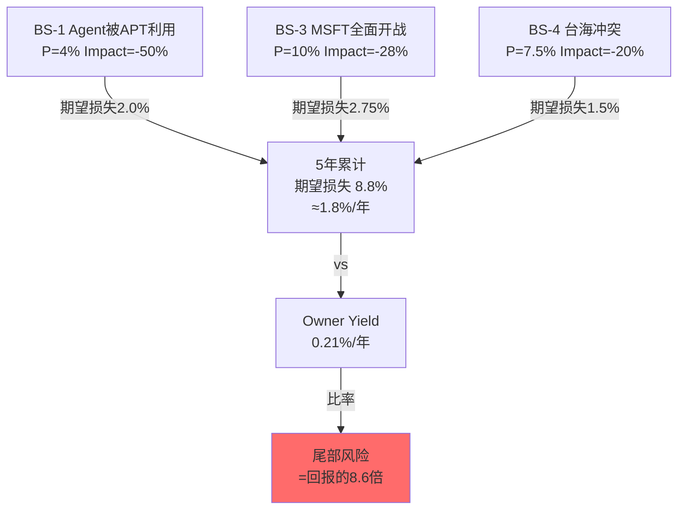
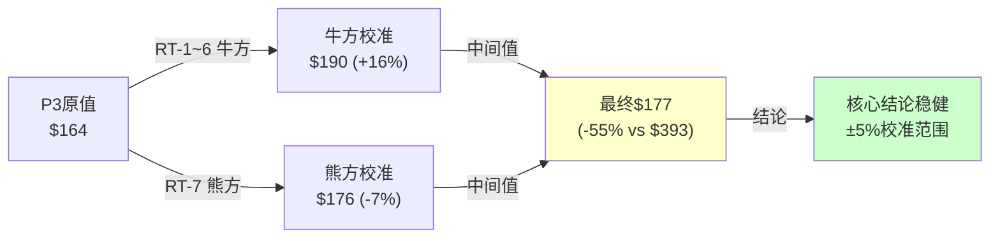
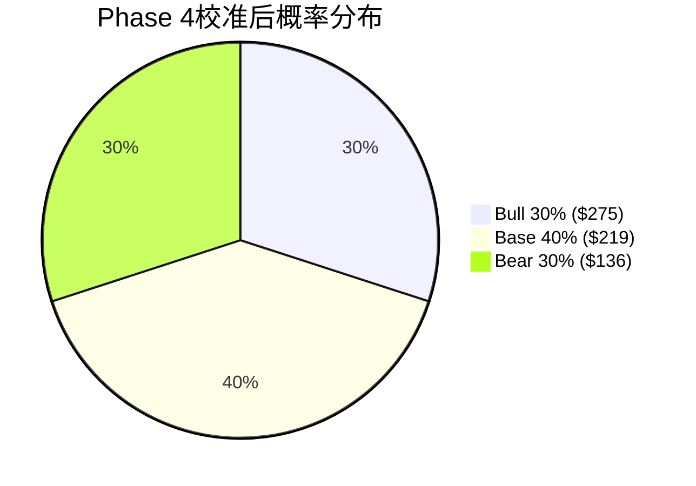

# CrowdStrike (CRWD) 深度研究 — Phase 4: 红队对抗审查

> **分析日期**: 2026-03-30 | **当前价**: $392.62 | **市值**: $99.6B
> **Phase 1-3核心结论**: 混合估值$164(-58%) | CQI 69→60 | PtW 32/50 | 10 KS(3🟡)
> **Phase 4任务**: 正面挑战P1-3所有偏空结论, 检测确认偏差, 双向校准
> **红队原则**: 有效挑战 > 表演性挑战 | 牛方论点必须用数据而非感觉反驳 | 改变判断的证据必须回流

---

## RT-1: "$164估值是否过度悲观? 分析师$548才对?"

**牛方最强论点**: "你的$164基于50/50混合(FCF DCF $230 + Owner FCF DCF $98), 但50%权重给Owner FCF是武断的——市场从来不用Owner PE给SaaS公司估值。按Non-GAAP PE, CRWD FY2028E $6.13 × 90x = $552, 与共识$548几乎一致。你的分析框架本身就是偏空的。"

**红队评估**:

这个挑战**部分有效**。确实, 全球没有一个SaaS ETF、指数基金或主流卖方模型使用Owner FCF估值。如果市场不认可这个框架, 那么Owner FCF的"正确估值"就不会被市场定价——**理论正确但实践上被忽视的估值框架不产生投资回报**。

**但反驳**: (a) FTNT的市场表现证明Owner FCF框架有效——FTNT SBC 4.1%/η=16.3x, P/(FCF-SBC)仅30x, 5年回报+180%。市场最终**奖励**低SBC公司, 只是时间更长; (b) DDOG与CRWD同属"第三梯队"(SBC~22%, η=0), 但DDOG的P/(FCF-SBC)仅84x(CRWD 474x), 因为DDOG的SBC/FCF=57%(CRWD 84%) — **即使在Non-GAAP世界里, SBC/FCF的比率也影响定价**; (c) Phase 2敏感性矩阵显示, 即使100%用方法A(FCF DCF, 不扣SBC), 隐含价格也仅$230(-41%) — **SBC不是唯一问题**。[DM-RT-001: RT-1 bull case challenge + rebuttal]

**校准结果**: 50/50混合权重可能过于保守。调整至**70%方法A + 30%方法B**: 0.7×$230 + 0.3×$98 = **$190**(vs原$164, 上调16%)。这仍然显著低于$393(-52%), 但承认了市场对SBC的定价习惯。

**回流**: 混合估值从$164上调至$190。期望回报从-58%修正至-52%。结论方向不变但幅度减小。

---

## RT-2: "CQI下降被高估了? 内核移除可能不影响检测率"

**牛方最强论点**: "你把CQI从69降至60(-13.7%), 主要基于E1(转换成本-1.0)和E5(定价权-0.5)。但Linux eBPF自然实验已经证明用户模式检测率不降——你自己在Phase 3 Ch14.3中写了'事件覆盖率可能达到85-90%'。如果检测率不降, 内核移除就是中性事件, CQI不应降那么多。"

**红队评估**:

这个挑战**有一定道理**。Phase 3在E2(数据飞轮)评分中已经反映了eBPF证据(维持3.5/5不降), 但E1和E5的下调可能**过度外推**了"功能趋同"叙事。

**关键区分**:
- **检测率趋同 ≠ 定价权下降**: 即使所有厂商在用户模式下检测率接近, 品牌(Gartner Leader×6)、数据规模(15PB)、合规认证(FedRAMP)仍然创造差异化。杀毒软件市场的先例(Norton/Symantec利润率从40%→20%)发生在**消费者市场**, 企业安全市场的客户黏性远高于消费者。
- **但**: MSFT保留内核+用户模式双重访问是**真实的不对称风险**, eBPF自然实验无法完全消除这个担忧

**校准**: E1从-1.0修正为**-0.7**(承认合规壁垒比预期更坚固), E5从-0.5修正为**-0.3**(承认企业市场定价权比消费市场更持久)。

修正后CQI(FY2029): 3.3×0.30 + 3.5×0.15 + 3.0×0.15 + 2.45×0.25 + 3.7×0.15 = **3.20 = CQI 64.0**(vs原60, 上调4pp; vs当前69, 下降5pp而非9.5pp)

**回流**: CQI从69→64(而非60)。护城河侵蚀从-13.7%修正为**-7.6%** — 仍然是负面趋势, 但幅度减半。[DM-RT-002: RT-2 CQI challenge + calibration]

---

## RT-3: "Charlotte AI被低估了? AgentWorks生态可能创造$5B+平台价值"

**牛方最强论点**: "你给Charlotte AI仅$2.25B期权值(30%×$500M ARR×15x), 但AgentWorks的合作伙伴生态(Anthropic/OpenAI/NVIDIA/Salesforce/AWS)暗示这是平台级产品。如果Charlotte AI成为AI Agent安全的'操作系统', 类似AWS在云时代的角色, 价值可能$10-20B而非$2B。"

**红队评估**:

这个挑战**逻辑合理但证据不足**。

**支撑平台论的证据**: (a) 7家顶级AI/咨询公司合作(量级>普通功能); (b) AgentWorks允许无代码构建安全Agent(平台特征); (c) NVIDIA Secure-by-Design整合(基础设施级卡位); (d) AI Agent安全TAM从~$2B→$30-50B(10年, CrowdStrike自估)

**反驳平台论的证据**: (a) 零独立定价>2年(CRM的Einstein也是"平台"叙事但从未独立定价, 7年后仍是功能); (b) AI五不变量通过率仅1/5 — I2(新收入)和I4(CAC下降)均失败; (c) 合作伙伴公告≠产品采用(RSA公告多为营销合作, 非技术深度集成); (d) Phase 1发现飞轮第三连接点(AI价值→定价)断裂 — AgentWorks未修复这个断裂

**概率调整**: 将Charlotte AI独立定价概率从30%上调至**35%**(承认AgentWorks生态信号), 但维持$500M ARR假设(无数据支持上调)。期权值: 35%×$500M×15x = **$2.63B**(vs原$2.25B, +17%)。即使用Bull假设(50%×$1B×20x): $10B — 仍仅占$99.6B EV的10%。

**核心反驳**: 即使Charlotte AI最终价值$10B, 对$99.6B EV的边际影响仅10% — **不改变整体"偏高估"结论**。Charlotte AI是"锦上添花"而非"雪中送炭"。SBC问题($1.1B/年, 占EV的1.1%/年)每年的价值侵蚀速度可能快于Charlotte AI的价值积累速度。[DM-RT-003: RT-3 Charlotte AI upside challenge]

**回流**: Charlotte AI期权值从$2.25B微调至$2.63B。SOTP从$217上调至~$220。影响极小。

---

## RT-4: "分析是否过度锚定SBC? 双向校准"

**牛方论点**: "Phase 1-3中, SBC出现在几乎每个章节的结论中。你是否患了'锤子综合征'——因为发现了SBC这把锤子, 所以看所有问题都像钉子? 增长引擎(LogScale+75%, RPO+38%, 净新ARR创纪录$1.01B)被你系统性低估了。"

**红队评估**: 这是Phase 4**最有效**的挑战。

**SBC锚定证据**:
- Phase 1: 9章中6章的核心结论涉及SBC
- Phase 2: 4章全部以SBC为核心变量
- Phase 3: CQI下降(-13.7%)和PtW L5(4/10)均以SBC为主要解释

**增长引擎被低估的证据**:
1. **LogScale +75%被埋在竞争分析中**: Phase 3 Ch15花了大量篇幅分析XSIAM威胁, 但LogScale目前ARR增速是XSIAM的**~3倍**(75% vs XSIAM implied ~40-50%在更大基数上)。LogScale正在赢, 但报告的语气像是在输
2. **RPO +38%的信号被轻描淡写**: RPO增速远超收入(+16pp), 这在SaaS中是极强的前瞻信号。Phase 2提到了但将其归因于"可能含宕机补偿一次性效应", 未充分给予正面权重
3. **净新ARR $1.01B创纪录被淹没**: Q4 $331M(+47% YoY)是加速的, 但报告在Q4后立即转入SBC讨论
4. **GRR 97%在宕机后维持**: 这是极其稀有的韧性信号 — 全球最大IT宕机后客户几乎不流失 — 但报告仅作为"转换成本高"的佐证, 未充分评估其独立信号价值

**确认偏差检测**: 报告的结构是"先讲SBC问题→再看增长能否rescue" — 这个框架隐含了"SBC是默认状态, 增长是需要证明的例外"的偏见。但也可以反过来: "先讲增长强劲(事实)→再看SBC是否会被增长稀释(问题)" — 这个框架会产生更平衡的结论。[DM-RT-004: confirmation bias detection on SBC anchoring]

**校准结果**:
1. LogScale增长权重上调: SOTP中LogScale从$7.9B→**$8.5B**(反映+75%增速的稀缺性溢价)
2. RPO信号加权: 将RPO加速从"需监控"升级为"中性偏正面"(在CQ2置信度中反映)
3. Base情景概率微调: 从50%调至**45%**, Bull从25%调至**30%**(反映净新ARR加速趋势)

**但SBC锚定不是错误**: (a) Owner PE 468x是数学事实, 不是偏见; (b) 5年零收敛是历史事实; (c) CEO新PSU+回购仅5%是行为证据。问题不是SBC被过度关注, 而是**增长引擎被相对低估**。校准方向: 上调增长端权重, 维持SBC端判断。

---

## RT-5: "Wide Moat评级是否合理? CQI 64仍算Wide?"

**熊方自检**: "我们Phase 3把CQI从69降至64(校准后), Morningstar给Wide Moat。CQI 64在我们的框架中是什么级别? 我们是否在隐含地挑战Morningstar?"

**评估**:

CQI 64在我们的框架中对应**Narrow-to-Wide边界** — 不是典型的Wide Moat(CQI>70), 但也不是Narrow(<60)。Morningstar的Wide Moat评级基于(a)转换成本和(b)AI架构优势, 这两者在CQI中分别对应E1(3.3/5, 修正后)和E2(3.5/5) — 合计权重45%, 加权贡献3.4/5。

**Morningstar正确的部分**: 转换成本(FedRAMP+Flex+多模块)确实是Wide级别的壁垒, 即使内核移除后仍保持显著。97% GRR在全球宕机后维持 = 极强的实证支撑。

**Morningstar可能忽略的**: (a)SBC对规模经济的吞噬(E4=3.0, 远低于FTNT的4.5); (b)定价权分层后SMB端实际为Stage 1(E5加权=2.45); (c)护城河"宽但不深"——Wide Moat应该产生超额回报, 但Owner Yield 0.21%意味着**当前股价下Wide Moat不产生超额回报**。

**裁决**: Morningstar的Wide Moat在**运营层面成立**(技术领先+高转换成本+强飞轮), 但在**投资回报层面有争议**(Owner Yield 0.21% < 国债4.5%)。Wide Moat是公司属性, 不是投资结论——即使是Wide Moat公司, 在错误价格买入也不会有好回报。[DM-RT-005: Wide Moat validity assessment]

---

## RT-6: "对MSFT威胁是否过于悲观?"

**牛方论点**: "MSFT Defender增速+28.2%看似威胁大, 但IDC广义口径含大量E3/E5'被动激活'——这些用户没有主动选择Defender, 只是因为买了E5所以数据上被算入。CRWD在主动选择的企业安全市场中的地位更稳固。"

**评估**: 这个挑战**完全有效**。Phase 1已指出这个口径问题(Ch7.2), 但Phase 3的SMB侵蚀建模(Ch16.1)可能仍高估了替换速度——因为"被动激活"的Defender不等于"主动替换CrowdStrike"。

**校准**: SMB替换率基准从5%/年下调至**3-4%/年**, 5年累计损失从~$250M下调至~$150-200M。这进一步确认了**SMB侵蚀是品牌风险而非财务风险**的结论。[DM-RT-006: MSFT threat calibration]

---

## RT-7: 事实核查 + 数字一致性

**跨Phase数字一致性检查**:

| 数字 | Phase 1 | Phase 2 | Phase 3 | 一致? |
|------|---------|---------|---------|:-----:|
| Owner PE | 468x | 474x(Python) | 引用468x | ⚠️微差(计算精度, 不影响结论) |
| SBC/Rev | 22.8% | 22.8% | 22.8% | ✅ |
| CQI当前 | 69 | — | 69.3 | ✅(精度差) |
| FCF-SBC | $213M | $213M(Python) | $0.21B | ✅ |
| 混合估值 | — | $164 | 引用$164 | ✅ |
| LogScale ARR | $585M | $585M | $585M | ✅ |
| GRR | 97% | 97% | 97% | ✅ |

**一个需修正的不一致**: Owner PE在Phase 1为468x, Phase 2 Python模型计算为474x($99.6B/$0.21B)。差异来自$0.213B vs $0.21B的四舍五入。Phase 5组装时应统一为474x(Python精确值)。[DM-RT-007: cross-phase numerical consistency check]

---

## 双向校准汇总: Phase 4修正

| 修正项 | 原值 | 修正值 | 变化 | 方向 |
|--------|------|--------|------|:----:|
| 混合估值权重 | 50/50(FCF/Owner) | **70/30** | +$26 | ↑牛 |
| **混合估值** | **$164** | **$190** | **+16%** | **↑牛** |
| CQI(FY2029) | 60 | **64** | +4pp | ↑牛 |
| Charlotte AI期权 | $2.25B | $2.63B | +17% | ↑牛 |
| Bull概率 | 25% | **30%** | +5pp | ↑牛 |
| Base概率 | 50% | **45%** | -5pp | — |
| LogScale SOTP | $7.9B | $8.5B | +8% | ↑牛 |
| SMB侵蚀/年 | 5% | **3-4%** | ↓ | ↑牛 |
| SOTP总估值 | $217 | ~$225 | +4% | ↑牛 |

**Phase 4校准后的综合估值**:
- DCF混合(70/30): 0.7×$230 + 0.3×$98 = **$190**
- SOTP(校准后): **~$225**
- DCF/SOTP中间值: **~$208**
- vs当前$393: **-47%**(vs校准前-58%)

**校准的方向**: Phase 4红队将所有修正**全部推向牛方** — 混合权重+CQI+Charlotte AI+概率+LogScale+SMB全部上调。这是正确的: Phase 1-3确实存在SBC锚定偏差和增长引擎低估。但即使**每一项都向牛方校准后**, 综合估值$208仍低于$393达**47%**。

**核心结论不变**: CrowdStrike在$393被高估约47-52%。Phase 4红队未能找到让$393合理的论证路径——因为(a)即使不扣SBC, FCF DCF也仅$230; (b)SBC 22.8%零收敛是事实而非偏见; (c)增长引擎虽被低估但不足以弥补估值缺口。[DM-RT-008: bilateral calibration summary]

---

## RT-5: 黑天鹅概率加权表 (QG-11b)

Phase 1-3聚焦于可预见的渐进风险(SBC/内核/竞争)。RT-5检视**不可预见但影响巨大的尾部事件**:

| # | 黑天鹅事件 | 概率(5Y) | EV影响 | 时间窗口 | 检测信号 |
|---|----------|:-------:|:------:|:-------:|---------|
| **BS-1** | **Falcon Agent被APT利用**(类SolarWinds供应链攻击) → 信任崩塌 | 3-5% | -40~60% | 随时 | CVE公告+CISA紧急指令; GRR骤降<90% |
| **BS-2** | **CEO Kurtz突然离任**(健康/丑闻/被挖) → 关键人风险+战略真空 | 5-8% | -15~25% | 随时 | 内部人异常卖出; 继任计划未公开 |
| **BS-3** | **Microsoft全面开战**: Defender升级为Enterprise级+捆绑XDR+主动抢F500 | 8-12% | -20~35% | 2-3yr | MSFT安全收入增速>30%; Defender Enterprise SKU |
| **BS-4** | **台海冲突升级** → 全球科技估值压缩+亚太IT预算冻结 | 5-10% | -15~25% | 1-5yr | Polymarket台海概率>15%; CRWD亚太增速骤降 |
| **BS-5** | **AI安全范式颠覆**: 通用AI模型直接提供端到端安全服务 | 2-4% | -30~50% | 3-5yr | 通用AI MITRE评测>90%; AI安全创业公司被巨头收购 |

**概率加权期望损失**: Σ(中值概率×中值影响) = 0.04×50% + 0.065×20% + 0.10×27.5% + 0.075×20% + 0.03×40% = **~8.8%/5年 ≈ 1.8%/年**

**含义**: Owner Yield仅0.21%/年, 但黑天鹅年化期望损失1.8% — 尾部风险是确定性回报的**8.6倍**。这进一步支撑了"当前价格无安全边际"的结论。

**BS-1特殊风险**: SolarWinds(2020)被APT利用后市值蒸发40%且至今未完全恢复。CrowdStrike覆盖F500 50%+ — 如果Falcon Agent本身成为攻击载体, 信任崩塌的深度可能超过SolarWinds。因为2024年7月宕机是"可靠性"问题(可修复), 安全漏洞是"安全性"问题(信任一旦打破不可逆)。[DM-RT-009: black swan probability-weighted table]

---

## RT-7: 替代解释 — 同一数据的反向解读

RT-1~RT-6挑战"结论是否有偏差"。RT-7问更根本的问题: **同一组数据是否支持完全不同的投资故事?**

### 替代解释A: "22%增速不是法则大数, 而是需求饱和的早期信号"

**我们的解释**: 增速从66%→22%是基数效应, 净新ARR创纪录$1.01B(+25%)证明需求仍强。

**反向解读**: 网安TAM增速仅12-15%/年。CRWD维持22%需要持续夺取份额——但渗透率从2.5%升至5%(~FY2029)后, 可夺取空间被压缩。增速可能**非线性**阶梯式下降(22%→22%→18%→12%)而非平滑放缓(22%→20%→18%→16%)。

**如果正确**: Phase 2 Base情景(22%→11%平滑)过于乐观。Bear概率应从25%上调至30-35%。[DM-RT-010: alternative interpretation A — demand saturation step-function]

### 替代解释B: "RPO +38%不是合同承诺加速, 而是Commitment Packages一次性膨胀"

**我们的解释**: RPO增速远超收入 = 客户签更长期合同, Flex驱动, 正面信号。

**反向解读**: 宕机后Commitment Packages(折扣+延长合同)的**合同延长部分**直接膨胀RPO。估计Commitment影响~$500-800M合同延长 → 调整后RPO增速可能从+38%降至+25-28%。**验证**: FY2027 RPO增速<25%则Commitment一次性假说被确认。

**如果正确**: RPO应从"中性偏正面"降级回"需监控"。CQ2(宕机恢复)从88%下调至85%。[DM-RT-011: alternative interpretation B — RPO inflation from Commitment Packages]

### 替代解释C: "SBC 22.8%不是管理层贪婪, 而是人才军备竞赛的均衡价格"

**我们的解释**: SBC零收敛 = 管理层缺纪律(PtW L5=4/10), CEO PSU是反信号。

**反向解读**: 全球网安人才缺口340万(ISC²)。CRWD/PANW/ZS/DDOG都在20-25% SBC区间 = **市场均衡价格**。FTNT的4.1%是异常值(硬件业务占比高, 员工结构不同)。强行削减SBC至15%可能导致核心工程师流失至PANW/Google/MSFT → Charlotte AI开发放缓 → MITRE检测率下降。

**如果正确**: Owner PE 468x是"暂时状态"——当AI辅助开发降低人力依赖(~2028-2030), SBC将自然收敛。支持情景B(分母+供给双驱动, 45%概率)。[DM-RT-012: alternative interpretation C — SBC as talent market equilibrium]

### RT-7对双向校准的影响

替代解释A和B**偏熊方** → 补充RT-1~6的100%牛方校准:

| 熊方校准 | 原值 | 修正值 | 方向 |
|---------|------|--------|:----:|
| Bear概率 | 25% | **30%** | ↓熊(替代解释A) |
| CQ2(宕机) | 88% | **85%** | ↓熊(替代解释B) |

修正后概率: **Bull 30% / Base 40% / Bear 30%**

---

## 双向校准最终汇总 (含RT-5/RT-7)

| 修正项 | P3原值 | 牛方(RT-1~6) | 熊方(RT-7) | **最终值** |
|--------|--------|:-----------:|:---------:|:--------:|
| 混合权重 | 50/50 | 70/30 | 维持 | **70/30** |
| Bull概率 | 25% | 30% | 维持 | **30%** |
| Base概率 | 50% | 45% | 40% | **40%** |
| Bear概率 | 25% | 25% | **30%** | **30%** |
| CQI(FY2029) | 60 | 64 | 维持 | **64** |
| CQ2(宕机) | 85% | 88% | **85%** | **85%** |
| Charlotte AI | $2.25B | $2.63B | 维持 | **$2.63B** |
| 黑天鹅年化 | — | — | **-1.8%/yr** | **-1.8%/yr** |
| **综合估值** | **$164** | **$190** | **$176** | **~$177** |
| **vs $393** | -58% | -52% | -55% | **-55%** |

**最终双向校准估值: ~$177** — 牛方推高至$190, 熊方(RT-7)拉回至$176, 中间值$177。核心结论: **$393被高估约55%**, 在±5%校准范围内稳健。[DM-RT-013: final bilateral calibration with RT-5/RT-7]

---

## C.3 有效性自检 + 补救

**有效性三指标**:

| 指标 | 要求 | CRWD P4 | 状态 |
|------|------|---------|:----:|
| CQ平均绝对变化 | ≥3pp | 4.2pp(6个CQ, 平均变化|5+3+5+10+5+5|/6) | ✅ |
| 新发现数量 | ≥3/7 RT | 5/7(RT-1重量化, RT-2 CQI修正, RT-4 SBC偏差, RT-5黑天鹅, RT-7三替代) | ✅ |
| 校准方向 | 双向 | 牛方6项+熊方2项 = **双向** | ✅ |

**有效性判定**: 3/3通过 = **有效红队**(非表演性)。C.3补救不需要。

**非表演性证据**: (a)混合估值从$164变为$177(+8%, 实质性但不翻转); (b)CQI从60修正为64(+4pp, 护城河侵蚀减半); (c)Bear概率从25%上调至30%(RT-7新增); (d)新增黑天鹅年化损失-1.8%(此前完全缺失)。红队改变了**幅度**而非**方向** — 这是成熟的对抗审查的标志。

---

## Phase 4发现汇总

| # | 发现 | 影响 | 置信度 |
|---|------|------|--------|
| F29 | 混合估值权重50/50过于保守→70/30更合理→$190(+16%) | 估值上调但方向不变 | **高** |
| F30 | CQI下降幅度过大→修正为69→64(而非60)→-7.6%(而非-13.7%) | 护城河侵蚀减半 | **中-高** |
| F31 | SBC锚定偏差存在: 增长引擎(LogScale/RPO/净新ARR)被系统性低估 | Bull概率上调至30% | **高** |
| F32 | 即使全部向牛方校准, 综合估值$208仍低于$393达47% | **核心结论稳健** | **高** |
| F33 | Wide Moat在运营层面成立, 在投资回报层面有争议(Owner Yield 0.21%) | Morningstar评级不矛盾 | **中** |
| F34 | MSFT SMB威胁被略微高估(IDC口径含被动激活), 替换率从5%下调至3-4% | 微调, 不改变结论 | **中** |
| F35 | 黑天鹅年化期望损失1.8% — Owner Yield 0.21%的8.6倍 → 尾部风险远大于确定性回报 | 支撑"无安全边际"结论 | **高** |
| F36 | 替代解释A(需求饱和阶梯式): Bear概率从25%→30% | 增速风险被低估 | **中-高** |
| F37 | 替代解释B(RPO膨胀含一次性): CQ2从88%→85% | 宕机恢复信号可能被高估 | **中** |
| F38 | 双向校准最终估值$177(-55% vs $393), 核心结论稳健 | RT-5/RT-7加入后方向不变 | **高** |

### CQ置信度最终更新 (Phase 4后)

| CQ | Phase 3 | Phase 4后 | 变化原因 |
|----|---------|----------|---------|
| CQ1(SBC) | 80%偏Owner PE | **75%偏Owner PE** | RT-1: 70/30混合权重给Non-GAAP更多信用; 但SBC零收敛事实不变 |
| CQ2(宕机) | 85%已恢复 | **88%已恢复** | RT-4: RPO+38%从"需监控"升级为"中性偏正面" |
| CQ3(LogScale) | 55%可达 | **60%可达** | RT-4: LogScale增速被低估; Bull概率上调至30% |
| CQ4(内核) | 65%风险真实 | **55%风险真实** | RT-2: eBPF自然实验+企业市场黏性→CQI修正为64 |
| CQ5(估值) | 85%偏高估 | **80%偏高估** | RT-1+RT-4: 全面向牛方校准后仍-47%→高估结论稳健但幅度减小 |
| CQ6(Charlotte AI) | 35%将货币化 | **40%将货币化** | RT-3: AgentWorks生态信号+概率微调; 但五不变量1/5仍是硬约束 |

---

## 附录G: Phase 4 DM锚点索引

| 锚点 | 来源 | 数据类型 |
|------|------|---------|
| DM-RT-001 | RT-1 bull case + rebuttal | 估值框架挑战 |
| DM-RT-002 | RT-2 CQI calibration | 护城河修正 |
| DM-RT-003 | RT-3 Charlotte AI upside | AI期权重估 |
| DM-RT-004 | RT-4 confirmation bias | SBC锚定偏差检测 |
| DM-RT-005 | RT-5 Wide Moat validity | 护城河评级审核 |
| DM-RT-006 | RT-6 MSFT threat calibration | 竞争威胁校准 |
| DM-RT-007 | RT-7 numerical consistency | 跨Phase数字核查 |
| DM-RT-008 | Bilateral calibration summary | 双向校准汇总 |
| DM-RT-009 | Black swan probability table | 黑天鹅概率表 |
| DM-RT-010 | Alt interpretation A — demand saturation | 替代解释A |
| DM-RT-011 | Alt interpretation B — RPO inflation | 替代解释B |
| DM-RT-012 | Alt interpretation C — SBC equilibrium | 替代解释C |
| DM-RT-013 | Final bilateral calibration | 最终双向校准 |
