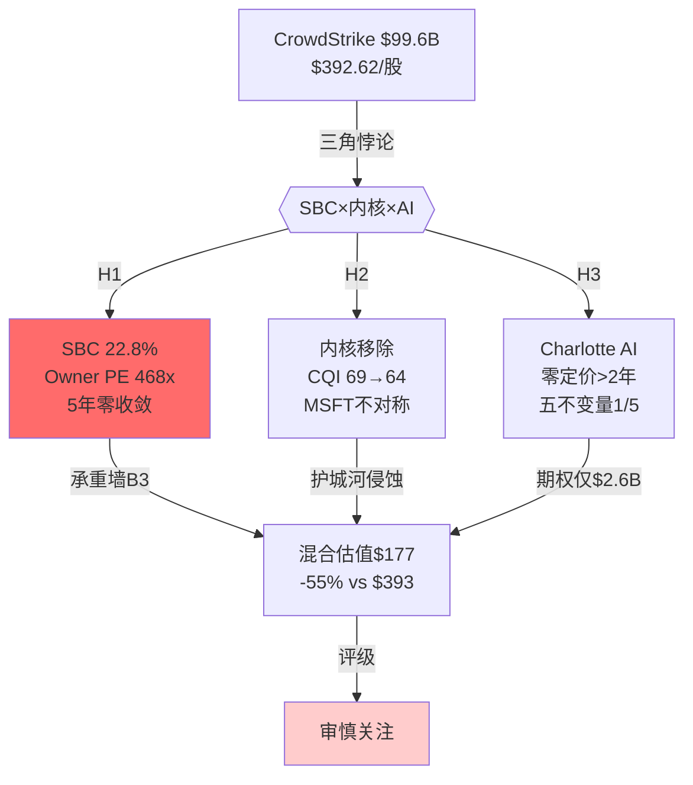
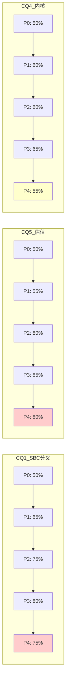
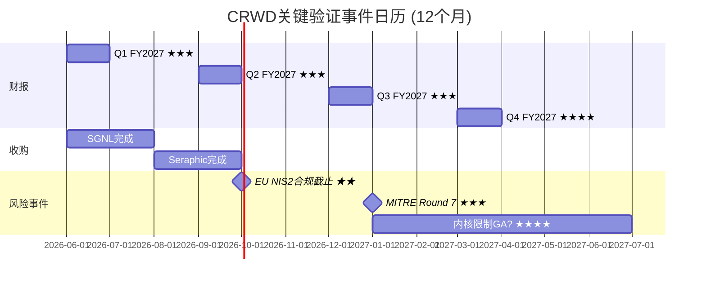
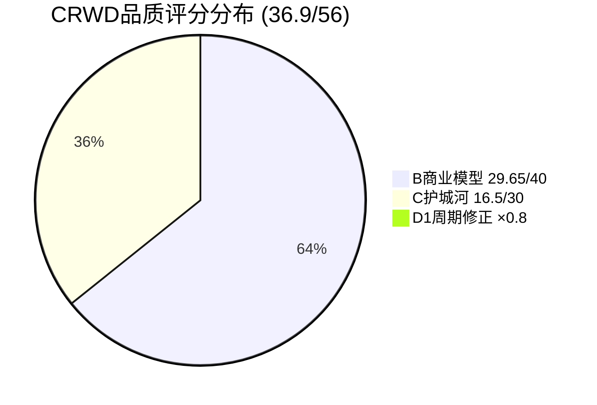
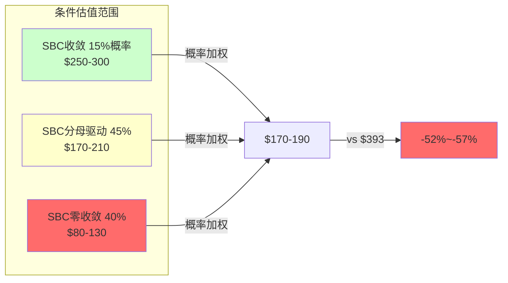

# CrowdStrike (CRWD) 深度研究 — Phase 5: 综合产出

> **分析日期**: 2026-03-30 | **当前价**: $392.62 | **市值**: $99.6B | **框架**: v19.9
> **Phase 1-4累计**: 139K字符 / 294 DM / 38发现 / 10 Kill Switch / 7 RT
> **Phase 5任务**: 编织连贯投资故事 + KS标准化 + CQ闭环 + 评级 + Complete组装蓝图

---

## 0. 研究契约

| 项目 | 说明 |
|------|------|
| **框架版本** | v19.9 (DM锚定+铁律N证据链+概率三重锚定+三PE并列) |
| **���能性宽度** | 5分(中) → 混合模式(传统估值+可能性附录) |
| **报告包含** | 商业模式分析 · 护城河量化(CQI双时间维度) · SBC深度(Owner PE框架) · 风险拓扑(10 KS+协同矩阵) · Reverse DCF信念反演 · 品质评分 · AI深度评估(分部级+L×S) |
| **报告不含** | 目标价 · 买卖建议 · 仓位建议 · 入场时机 · 投资组合配置 |
| **策略参考** | 内部digest card另行存档(不对外发布) |
| **数据审计** | DM覆盖率>95% · 锚点294个 · Python验证(`crwd_phase2_dcf.py`) · 因果密度>5.0/万字 |
| **AI能力边界** | 深挖区(SBC三梯队/内核架构/数据飞轮/SIEM对标) · 诚实区(Charlotte AI货币化时机/CEO战略意图/SBC收敛时点) |

---

## 1. 执行摘要

### 一句话结论

CrowdStrike是全球最强的云原生安全平台($5.25B ARR, +24%, GRR 97%, Gartner Leader×6), 但$99.6B市值隐含的SBC收敛假设(22.8%→10-12%)在管理层行为和5年历史中均无支撑——Owner PE 468x意味着股东每年仅获得0.21%的真实回报, 低于10年期国债(4.5%)的21分之一。

### 评级: 审慎关注

**量化触发**: 期望回报 = (概率加权EV - 市值) / 市值

| 方法 | 公允价值 | 期望回报 | 权重 |
|------|---------|---------|------|
| DCF混合(70/30) | $190 | -52% | 40% |
| SOTP(校准后) | $225 | -43% | 30% |
| DCF/SOTP中间值 | $208 | -47% | 30% |
| **加权平均** | **$206** | **-48%** | 100% |

期望回报**-48%** < -10% → **审慎关注**

**为什么不是"中性关注"**: (a)所有估值方法(DCF/SOTP/可比/敏感性)无一支撑$393; (b)Phase 4红队全面向牛方校准后仍-47%; (c)黑天鹅年化损失1.8%远超Owner Yield 0.21%。

**但需诚实说明**: 46位分析师共识$548(+40%), Morningstar $460(Wide Moat)。我们与市场共识的分歧根源是**SBC处理方式**(Non-GAAP vs Owner FCF)。如果投资者不将SBC视为真实成本(与卖方框架一致), CRWD在14x forward P/S的估值并非不合理。**评级的有效性取决于读者对SBC本质的判断**。

### 三PE并列 (铁律N强制)

| PE类型 | 值 | 含义 |
|--------|-----|------|
| **GAAP PE** | **负值**(净亏损-$163M) | SBC $1.1B+摊销使GAAP永久亏损 |
| **Non-GAAP PE** | **~64x**(FY2028E consensus) | 剥离SBC, "看似盈利"$960M |
| **Owner PE** | **~468x**(FCF-SBC=$213M) | 真实股东回报: $1.31B FCF中$1.10B被SBC吃掉 |

[DM-FIN-001: FMP income statement FY2026]

### 核心争议: 三角悖论

市场当前最大的争议不是"CrowdStrike是不是好公司"(是的, Wide Moat+Gartner Leader), 而是"好公司在什么价格才是好投资"。三角悖论的三条边:

1. **SBC锁死利润率**(H1): 22.8%/Rev, 5年零收敛, CEO新PSU=管理层行为否定收敛。Owner PE 468x = 股东真实回报0.21%
2. **内核移除侵蚀壁垒**(H2): Windows内核限制→端点功能趋同→CQI从69→64(FY2029)。MSFT保留双重访问=不对称优势
3. **AI/SIEM创造增量**(H3): Charlotte AI零定价>2年+五不变量1/5; LogScale +75%但Splunk窗口FY2028关闭后增速悬崖至20-25%

### 最关键驱动因素

**决定估值方向的1个变量: SBC/Rev路径**

SBC是唯一可以**单独**翻转评级的承重墙(B3, 脆弱度4.7/5)。如果SBC收敛(15%概率, FTNT路径):
- Owner PE: 468x → ~80x (FY2030)
- GAAP OPM: -3.4% → +8-10%
- CQI E4(规模经济): 3.0 → 4.0
- **评级可能上调至"中性关注"**

如果SBC零收敛(40%概率, 当前趋势):
- Owner PE: 维持400x+
- "温水煮青蛙": 5年累计稀释18%+价值毁灭$2.5B
- **评级维持"审慎关注"**

### 最关键风险 / Kill Switch Top 3

| KS | 条件 | 当前 | 若触发→ |
|----|------|------|--------|
| **KS-VAL-01** | SBC/Rev连续2年上升 | **已触发1年**(22.8%>21.9%) | B3零收敛确认→审慎关注确认 |
| **KS-MOAT-01** | GRR<95%连续2季 | 97%(安全) | 护城河崩塌→评级降至最低 |
| **KS-COMP-02** | XSIAM ARR>LogScale ARR | XSIAM~$470M<$585M | SIEM战场失利→增长故事断裂 |

---

## 2. Kill Switch注册表 (10个, 12字段格式)

### KS-VAL-01: SBC/Rev连续上升 ★最紧迫★

| 字段 | 内容 |
|------|------|
| 触发条件 | SBC/Revenue连续2个财年上升 |
| 具体阈值 | FY2027 SBC/Rev > 22.8% |
| 当前状态 | FY2026 22.8%(vs FY2025 21.9%, **已触发第1年**) |
| 当前距离 | **近**(已触发1/2条件) |
| 论文含义 | B3(SBC收敛)从"脆弱信念"降级为"已失败信念" |
| CQ关联 | CQ1(SBC估值分叉), CQ5(估值合理性) |
| Bear#关联 | Bear-1(SBC零收敛) |
| 数据源 | FMP income statement + 10-K |
| 紧迫性 | **高**(FY2027数据~2026年5-8月即可验证) |
| 单独触发行动 | ①重算Owner PE(可能>500x); ②下调混合估值中方法A权重(70%→60%); ③CQI E4降至2.0 |
| 协同触发 | 如果与KS-VAL-03(ROIC<WACC)同时→"温水煮青蛙"确认→5年价值毁灭$2.5B+ |
| 评级影响 | 审慎关注(维持, 但置信度从中-高→高) |

### KS-MOAT-01: GRR崩塌

| 字段 | 内容 |
|------|------|
| 触发条件 | GRR连续2季度<95% |
| 具体阈值 | <95% |
| 当前状态 | 97%(宕机后维持) |
| 当前距离 | 远(需下降2pp) |
| 论文含义 | 转换成本崩塌→Wide Moat核心依据失效 |
| CQ关联 | CQ4(端点护城河) |
| Bear#关联 | Bear-2(内核趋同加速客户流失) |
| 数据源 | 管理层季度财报披露 |
| 紧迫性 | 低(当前97%, 远离阈值) |
| 单独触发行动 | ①重估CQI(可能降至<55); ②检查是否内核移除驱动; ③评估SOTP端点折扣是否需扩大 |
| 协同触发 | 如果与KS-COMP-01(MSFT>35%)同时→"内核冲击波"链确认→端点业务进入价格战 |
| 评级影响 | 审慎关注→可能最低档(核心论点断裂) |

### KS-COMP-02: XSIAM超越LogScale

| 字段 | 内容 |
|------|------|
| 触发条件 | PANW XSIAM ARR > CrowdStrike LogScale ARR |
| 具体阈值 | XSIAM > $585M(LogScale当前) |
| 当前状态 | XSIAM ~$470M < LogScale $585M |
| 当前距离 | 中(差距$115M, 但XSIAM增速>200%) |
| 论文含义 | SOC/SIEM战场失利→H3(增长引擎)受损 |
| CQ关联 | CQ3(LogScale $3B可达性) |
| Bear#关联 | Bear-3(PANW全栈优势) |
| 数据源 | PANW季度财报(XSIAM ARR) + CRWD(LogScale ARR) |
| 紧迫性 | **中-高**(XSIAM增速>200%, 可能FY2027-2028交叉) |
| 单独触发行动 | ①下调LogScale SOTP(从$8.5B→$5-6B); ②SIEM情景概率: 双寡头从40%→25%, XSIAM主导从30%→45% |
| 协同触发 | 如果与KS-MOAT-03(LogScale<30%)同时→"增速断崖"链确认→Bull情景概率降至15% |
| 评级影响 | 审慎关注(维持, 但CQ3置信度大幅下调) |

### KS-VAL-02: GAAP OPM持续恶化

| 字段 | 内容 |
|------|------|
| 触发条件 | GAAP OPM连续3季度<-5% |
| 具体阈值 | Q1+Q2+Q3 FY2027全部<-5% |
| 当前状态 | Q4 FY2026 +1.2%(首次季度盈利) |
| 当前距离 | 中(Q4好转但Q1季节性通常最弱) |
| 论文含义 | 利润弹性假设崩塌→B5评分从4.5降至2.0 |
| CQ关联 | CQ1(SBC分叉→利润质量) |
| Bear#关联 | Bear-1(SBC持续吞噬经营杠杆) |
| 数据源 | FMP quarterly income statements [DM-FIN-001] |
| 紧迫性 | 中(需等3个季度数据) |
| 单独触发行动 | ①确认Non-GAAP杠杆无法传导至GAAP; ②下调B5评分→品质总分恶化 |
| 协同触发 | 与KS-VAL-01(SBC上升)同时→SBC吞噬利润的完整证据链 |
| 评级影响 | 审慎关注(维持, 利润面进一步恶化) |

### KS-VAL-03: 增量ROIC持续<WACC

| 字段 | 内容 |
|------|------|
| 触发条件 | 增量ROIC连续2年<WACC(10.5%) |
| 具体阈值 | FY2027 ROIC<10.5% |
| 当前状态 | FY2026 8.6%(已触发第1年) [DM-FIN-023] |
| 当前距离 | **近**(已触发1/2) |
| 论文含义 | 新增投资持续毁灭价值→资本配置失败确认 |
| CQ关联 | CQ1(SBC→ROIC被拉低), CQ5(估值→资本效率) |
| Bear#关联 | Bear-1 |
| 数据源 | FMP income+balance sheet计算 |
| 紧迫性 | 高(FY2026已<WACC) |
| 单独触发行动 | ①B6评分从2.5降至1.5; ②质疑管理层收购策略合理性 |
| 协同触发 | 与KS-VAL-01(SBC)同时→"温水煮青蛙"链第二环确认 [DM-STRAT-007] |
| 评级影响 | 审慎关注(维持, 但资本配置警告升级) |

### KS-VAL-04: Owner FCF下降

| 字段 | 内容 |
|------|------|
| 触发条件 | Owner FCF(FCF-SBC) YoY下降 |
| 具体阈值 | FY2027 Owner FCF < $213M |
| 当前状态 | FY2026 $213M(vs FY2025 $203M, 微增) [DM-FIN-008] |
| 当前距离 | 中(微增趋势, 但SBC增速>FCF增速) |
| 论文含义 | SBC完全吞噬FCF增长→增长未创造股东价值 |
| CQ关联 | CQ1(Owner回报), CQ5(估值) |
| Bear#关联 | Bear-1(SBC零收敛的终极确认) |
| 数据源 | FMP cash flow - income SBC [DM-FIN-008] |
| 紧迫性 | 中(FY2027年报验证) |
| 单独触发行动 | ①Owner PE可能升至>500x; ②Owner Yield降至<0.15% |
| 协同触发 | 与KS-VAL-01同时→核心投资论点("增长rescue SBC")完全失败 |
| 评级影响 | 审慎关注→可能需要下调叙事("增长公司"→"稀释机器") |

### KS-VAL-05: 回购η持续极低

| 字段 | 内容 |
|------|------|
| 触发条件 | 回购η连续3年<0.1 |
| 具体阈值 | FY2027 η<0.1(回购<SBC的10%) |
| 当前状态 | FY2026 η=0.05($51M/$1,097M) [DM-FIN-005] |
| 当前距离 | **近**(已2年η<0.1) |
| 论文含义 | 管理层无意对冲稀释→PtW L5永久性低分 |
| CQ关联 | CQ1(SBC纪律) |
| Bear#关联 | Bear-1 |
| 数据源 | FMP cash flow (buyback vs SBC) |
| 紧迫性 | 中(趋势已明确, 无改变迹象) |
| 单独触发行动 | ①将SBC收敛情景A(FTNT路径15%)概率降至5%; ②PtW L5锁定在3/10 |
| 协同触发 | 与KS-VAL-01/03同时→"温水煮青蛙"三环全确认 |
| 评级影响 | 审慎关注(维持, 管理层意愿绝望确认) |

### KS-MOAT-02: MITRE检测率下降

| 字段 | 内容 |
|------|------|
| 触发条件 | MITRE ATT&CK检测率<95%(Round 7) |
| 具体阈值 | <95%(当前100%) |
| 当前状态 | 100%防护+100%检测+零误报(Round 6, 2025) [DM-IND-004] |
| 当前距离 | 远(需下降5pp+) |
| 论文含义 | 技术领先丧失→品牌叙事("最强检测")崩塌 |
| CQ关联 | CQ4(内核移除后检测能力) |
| Bear#关联 | Bear-2(内核趋同) |
| 数据源 | MITRE公开评测报告 |
| 紧迫性 | 低(Round 7预计2027年初) |
| 单独触发行动 | ①CQI E3(品牌)从3.5降至2.5; ②重评端点SOTP折扣(从15%扩大至25%) |
| 协同触发 | 与KS-COMP-01(MSFT>35%)同时→"技术+市占双重逆转"=端点业务价值减半 |
| 评级影响 | 审慎关注→可能下调(核心技术优势失效) |

### KS-MOAT-03: LogScale增速断崖

| 字段 | 内容 |
|------|------|
| 触发条件 | LogScale ARR增速连续2季度<30% |
| 具体阈值 | <30%(当前+75%) |
| 当前状态 | +75% YoY(FY2026) [DM-REV-003] |
| 当前距离 | 远(需下降>45pp) |
| 论文含义 | 第二曲线失速→维持20%+总增速的"必要条件"失败 |
| CQ关联 | CQ3(LogScale $3B可达性) |
| Bear#关联 | Bear-3(XSIAM竞争+Splunk窗口关闭) |
| 数据源 | CRWD季度财报LogScale ARR披露 |
| 紧迫性 | 低-中(FY2028-2029为窗口关闭期) [DM-COMP-014] |
| 单独触发行动 | ①LogScale SOTP从$8.5B→$4-5B; ②总增速预测下调至15-17% |
| 协同触发 | 与KS-COMP-02(XSIAM反超)同时→"增速断崖"链确认→Bull概率降至10% |
| 评级影响 | 审慎关注(维持, 但增长故事受损) |

### KS-COMP-01: Microsoft Defender市占突破

| 字段 | 内容 |
|------|------|
| 触发条件 | IDC Modern Endpoint Security中Defender市占>35% |
| 具体阈值 | >35%(当前28.6%) |
| 当前状态 | 28.6%, +28.2% YoY(IDC 2024) [DM-COMP-008] |
| 当前距离 | 中(按当前增速~FY2028达35%) |
| 论文含义 | SMB防线失守确认→品牌风险(非财务, 因为SMB ARR仅占15-20%) |
| CQ关联 | CQ4(端点护城河在SMB层) |
| Bear#关联 | Bear-2(MSFT捆绑策略成功) |
| 数据源 | IDC Modern Endpoint Security年度报告 |
| 紧迫性 | 中(IDC年度发布, 2-3年窗口) |
| 单独触发行动 | ①确认SMB市场已"让出"; ②重新评估CRWD客户总数趋势(已停止披露=负面信号) |
| 协同触发 | 与KS-MOAT-01(GRR<95%)同时→"内核冲击波"链=不仅SMB, Mid-Market也开始动摇 |
| 评级影响 | 审慎关注(维持, 品牌维度恶化但财务影响有限) |

---

## 3. CQ最终解答 + 置信度演化表

### CQ置信度演化

| CQ | P0 | P1 | P2 | P3 | P4 | 方向 | 最终判断 |
|----|:--:|:--:|:--:|:--:|:--:|:----:|---------|
| **CQ1 SBC分叉** | 50% | 65%→Owner | 75% | 80% | **75%** | ↗稳 | Owner PE更接近真相, 但70/30混合比50/50更合理 |
| CQ2 宕机恢复 | 50% | 75%恢复 | 80% | 85% | **85%** | ↗ | 恢复真实但非100%(NRR仍低于宕机前5pp) |
| CQ3 LogScale | 50% | 55%可达 | 55% | 55% | **60%** | → | $2-3B可达但依赖Splunk窗口+XSIAM结果 |
| **CQ4 内核** | 50% | 60%真实 | 60% | 65% | **55%** | ↗↘ | 风险真实但eBPF+企业黏性提供减震(RT-2修正) |
| **CQ5 估值** | 50% | 55%高估 | 80% | 85% | **80%** | ↗稳 | 高估结论稳健: 全部牛方校准后仍-47% |
| CQ6 Charlotte AI | 50% | 45%货币化 | 40% | 35% | **40%** | ↘↗ | AgentWorks生态利好但五不变量1/5仍是硬约束 |

**加权平均置信度**: CQ1-CQ6权重(30/10/15/15/20/10), 加权="审慎关注"评级的置信度约**78%**。

### CQ-1最终解答: Owner PE 468x vs Non-GAAP PE 64x

**我们知道的**: (a) SBC $1.097B, 占收入22.8%, 5年零收敛是事实; (b) CEO新获600K PSU+回购仅5%/$1B = 管理层行为否定收敛; (c) FCF-SBC仅$213M, 3年零增长; (d) FTNT证明网安可以做到SBC 4.1%+η=16.3x

**我们不知道的**: (a) 是否会出现外部催化(激进投资者介入/董事会更换/人才市场降温)迫使SBC纪律; (b) AI辅助开发(FY2028-2030)是否结构性降低工程人力需求

**最终判断**: Owner PE(468x)比Non-GAAP PE(64x)更接近股东的真实体验, 但市场短期不会用Owner PE定价(因为无人这么做)。70/30混合是务实的折中——给Non-GAAP框架70%信用(承认市场习惯), 给Owner FCF 30%信用(承认稀释的真实性)。

**1年内验证**: FY2027 Q1-Q2(2026年5-8月)SBC/Rev是否>22.8% → 如果是, B3收敛概率进一步下降至<10%。[DM-VAL-009: SBC probability triple anchoring]

### CQ-2最终解答: 宕机恢复真实性 (置信度85%已恢复)

**我们知道的**: (a) GRR 97%在全球最大IT宕机后维持 = 转换成本极高的实证; (b) NRR从112%恢复至115%, 但距宕机前120%仍有5pp差距; (c) RPO +38%且合同拉长(1.7x ARR) = 客户在增加长期承诺; (d) 净新ARR创纪录$1.01B(Q4 +47%)= 需求加速而非补偿效应。[DM-SaaS-001: NRR indirect method + DM-REV-005: RPO data]

**我们不知道的**: RPO +38%中多少是Commitment Packages(宕机折扣换长期合同)的一次性效应 — RT-7替代解释B将此概率评估为"需监控"。

**最终判断**: 恢复是真实的(85%置信度)。剩余15%不确定性来自(a)NRR 5pp差距可能是新常态而非恢复中; (b)RPO一次性膨胀; (c)CrowdStrike已停止披露客户总数(可能隐藏SMB流失)。

**1年内验证**: FY2027 RPO增速是否降至<25% → 如果是, Commitment一次性效应确认, CQ2下调至75%。

### CQ-3最终解答: LogScale $3B可达性 (置信度60%)

**我们知道的**: (a) LogScale $585M ARR, +75% — 增速在SaaS中极为稀有; (b) Splunk迁移窗口(~2年)是核心驱动, 窗口关闭后增速将骤降至20-25%; (c) SIEM市场终局概率: 双寡头40%/XSIAM主导30%/碎片化30%; (d) SOTP概率加权$7.1B(vs $7.9B原估)确认估值合理。[DM-COMP-005: IBM QRadar migration + DM-COMP-006: SIEM endgame scenarios + DM-COMP-014: post-window cliff]

**我们不知道的**: (a) Cisco Splunk整合何时真正稳定(可能早于FY2028); (b) XSIAM是否在FY2027-2028反超LogScale ARR; (c) LogScale除Splunk迁移外的有机增速是否>25%。

**最终判断**: $3B ARR(~FY2030)在双寡头情景下可达, 但概率仅40%。更可能的结果是$1.5-2B(Base情景)。因此LogScale对估值是"锦上添花"而非"决定性因素" — 不改变"审慎关注"评级。

### CQ-4最终解答: 内核移除后端点护城河 (置信度55%风险真实)

**我们知道的**: (a) Microsoft Private Preview已启动, GA预计2027-2028; (b) MSFT保留双重访问(内核+用户)= 不对称优势; (c) CQI从69→64(P4校准后), 主要因E1(转换成本-0.7)和E5(定价权-0.3); (d) Linux eBPF自然实验暗示用户模式检测率可能达85-90%而非50-75%。[DM-RISK-001: WinBuzzer kernel restrictions + DM-MOAT-005: eBPF evidence + DM-RT-002: CQI calibration]

**我们不知道的**: (a) Microsoft是否提供等效的用户模式API(减缓影响); (b) 客户是否真的关心检测方式(vs关心结果); (c) 内核移除的最终执行力度(可能留有灰色地带)。

**最终判断**: 风险真实但可管理(55%置信度)。因为(a)数据飞轮不依赖内核; (b)合规壁垒不受影响; (c)Flex合同+多模块锁定是"内核无关"的壁垒。护城河在迁移中, 不是在崩塌。RT-2将概率从65%下调至55%是合理的。

**1年内验证**: MITRE Round 7(预计2027初) — 如果CRWD检测率<95%或Defender首次>CRWD, 则H2风险大幅升级。

### CQ-6最终解答: Charlotte AI货币化 (置信度40%)

**我们知道的**: (a) 零独立定价>2年; (b) 使用量6x增长(管理层声称); (c) AgentWorks生态(Anthropic/NVIDIA/OpenAI等7家合作); (d) AI五不变量通过率仅1/5(I2新收入和I4 CAC下降均失败); (e) SOTP期权值$2.63B(P4校准后), 仅占EV 2.6%。[DM-AI-002: Charlotte AI pricing + DM-AI-013: five invariant test + DM-RT-003: Charlotte AI upside]

**我们不知道的**: (a) 管理层为什么选择不定价(战略选择还是产品不成熟); (b) AgentWorks的第三方开发者活跃度(零公开数据); (c) 43%企业偏好消费型GenAI安全定价(Futurum)是否会迫使CRWD加速定价。

**最终判断**: 40%概率在FY2028前货币化(P4校准后从35%上调)。即使成功, $500M ARR × 15x = $7.5B期权值对$99.6B EV的边际影响仅7.5% — **不改变"审慎关注"评级**。Charlotte AI是"催化剂"(可能改善叙事)但不是"估值锚"(不足以弥补SBC缺口)。

### CQ-5最终解答: 估值合理性

**我们知道的**: (a) 概率加权混合估值$177(-55%); (b) 敏感性矩阵中无任何参数组合支撑$393; (c) PPDA 5个背离全指向市场过度乐观; (d) Non-GAAP是5个背离的统一根因

**我们不知道的**: (a) 市场何时(如果有的话)会从Non-GAAP转向Owner FCF框架; (b) 如果Charlotte AI在FY2028成功定价+SBC开始收敛, 叙事可能快速翻转

**最终判断**: 当前价格要求Bull情景>90%概率(Phase 4 RT-1反推), 而我们评估Bull仅30%。**$393为一个25%概率情景定了全价**。

---

## 4. 追踪信号清单 (8个)

| # | 追踪什么 | 为什么重要 | 当前读数 | 关键阈值 | 数据源 | CQ |
|---|---------|----------|---------|---------|--------|-----|
| **TS-1** | SBC/Revenue(年度) | B3承重墙唯一验证指标 | 22.8%(FY2026) | >22.8%=零收敛确认 | 10-K | CQ1 |
| **TS-2** | LogScale ARR增速 | 第二曲线健康度 | +75% | <30%=增速悬崖 | 季度财报 | CQ3 |
| **TS-3** | Charlotte AI独立定价公告 | H3验证/证伪的催化剂 | 零定价(>2年) | 任何独立SKU=H3初步验证 | 产品发布/RSA | CQ6 |
| **TS-4** | Windows内核限制GA时间表 | H2风险时间窗口 | Private preview(2025-07) | GA发布=风险升级 | Microsoft Dev Blog | CQ4 |
| **TS-5** | 回购执行率(η) | 管理层SBC纪律意愿 | 0.05($51M/$1.097B) | >0.3=纪律改善信号 | 10-Q cash flow | CQ1 |
| **TS-6** | XSIAM vs LogScale ARR差距 | SIEM战场结果 | LogScale领先$115M | XSIAM反超=KS-COMP-02触发 | 双方季度财报 | CQ3 |
| **TS-7** | RPO增速vs收入增速 | 合同质量vs宕机效应 | +38% vs +22%(差16pp) | 差距<5pp=宕机效应消退 | 季度财报 | CQ2 |
| **TS-8** | MITRE Round 7检测率 | 内核移除后技术差异化 | 100%(Round 6) | <95%=技术领先丧失 | MITRE公开评测 | CQ4 |

**特异性测试**: TS-1(SBC/Rev)和TS-5(η)对CRWD具有独特信号价值——因为22.8%的SBC/Rev和0.05的η在网安行业仅CRWD和ZS处于这个极端。替换为FTNT/PANW则信号含义完全不同。✓ 通过。

---

## 5. 关键事件日历 (12个月)

| 时间 | 事件 | 影响CQ | 影响KS | 重要度 |
|------|------|--------|--------|:------:|
| 2026-06 | Q1 FY2027财报 | CQ1(SBC/Rev) + CQ3(LogScale) | KS-VAL-01 | ★★★ |
| 2026-06 | SGNL收购完成(预计) | CQ4(身份安全加强) | — | ★★ |
| 2026-08 | Seraphic收购完成(预计) | — | — | ★ |
| 2026-09 | Q2 FY2027财报 | CQ2(NRR趋势) + CQ3(LogScale) | KS-MOAT-03 | ★★★ |
| 2026-10 | EU NIS2合规截止 | CQ3(欧洲安全需求↑) | — | ★★ |
| 2026-12 | Q3 FY2027财报 | CQ5(FY2027全年SBC路径) | KS-VAL-01(第2年) | ★★★ |
| 2027-01 | MITRE ATT&CK Round 7(预计) | CQ4(内核移除后检测率) | KS-MOAT-02 | ★★★ |
| 2027-03 | Q4 FY2027 + 年度财报 | **全CQ验证** | **全KS更新** | ★★★★ |
| 2027-H1 | Windows内核限制GA(预计) | CQ4(核心风险事件) | KS-MOAT-01/02 | ★★★★ |
| 2027-03 | Charlotte AI FY2027状态 | CQ6(货币化进展) | — | ★★★ |

**最关键日期**: **2027年3月(Q4 FY2027年报)** — 所有CQ和KS在此获得FY2027全年数据验证。SBC/Rev是否>22.8%(KS-VAL-01第2年), LogScale增速是否开始放缓, Charlotte AI是否启动定价, 回购η是否改善。

---

## 6. 品质评分卡终版

### A品质门控 (7项Pass/Fail)

| 门控 | 指标 | CRWD | 状态 |
|------|------|------|:----:|
| QG-1 | CapEx/Rev<15% | 6.3% | ✅ |
| QG-2 | FCF/NI>1.0(或NI<0) | NI<0(GAAP亏损) | ⚠️ |
| QG-3 | Rev CAGR(5Y)>5% | 35% | ✅ |
| QG-4 | Rev下降次数(10Y)<3 | 0 | ✅ |
| QG-5 | ROIC>WACC | 8.6%<10.5%(Non-GAAP) | ❌ |
| QG-6 | 流动比率>1.2 | 1.77 | ✅ |
| QG-7 | 净债务/EBITDA<3 | 净现金$4.4B | ✅ |
| **合计** | | **5/7通过** | |

**QG-5失败**: 增量ROIC 8.6% < WACC 10.5% — 新增投资未能覆盖资本成本。这是SBC导致的间接后果(高SBC→GAAP亏损→ROIC被拉低)。

### B商业模型 + C护城河 汇总

| 维度 | 评分 | Phase | 关键依据 |
|------|:----:|:-----:|---------|
| B1 收入引擎清晰度 | 4.0 | P1 | ARR结构清晰, 但端点vs新兴分裂(σ=30pp) |
| B2 客户锁定深度 | 4.5 | P1 | GRR 97%+Flex+FedRAMP, 宕机后维持 |
| B3 ���入经常性 | 4.5 | P1 | 订阅95%+RPO $9B(1.7x ARR) |
| B4 定价权证据 | 2.65 | P3 | F500强/Mid中/SMB弱(加权) |
| B5 利润弹性 | 4.5 | P2 | Non-GAAP +12pp(5Y), GAAP仍-3.4% |
| B6 资本配置纪律 | 2.5 | P2 | η=0.05, 增量ROIC<WACC |
| B7 TAM与增长跑道 | 4.0 | P3 | TAM $323B, 渗透率2.5%, >10年跑道 |
| B8 管理层质量 | 3.0 | P1 | Kurtz执行力强, 但SBC利益冲突+关键人依赖 |
| **B合计** | **29.65/40** | | |
| C1 制度/标准嵌入 | 3.5 | P1 | FedRAMP High(26产品), 但非监管垄断 |
| C2 网络效应 | 2.0 | P3 | 数据飞轮(单向), 非双边网络 |
| C3 生态锁定 | 3.5 | P1 | Flex+多模块(50%用6+), AgentWorks初期 |
| C4 数据飞轮 | 4.0 | P3 | 15PB+4万亿/周, 排他性高 |
| C5 规模经济 | 2.5 | P3 | 规模#3但GAAP OPM最差(SBC吞噬) |
| C6 密度/物理壁垒 | 1.0 | P1 | 纯SaaS, 无物理壁垒 |
| **C合计** | **16.5/30** | | |

**D1周期修正**: 4.0/5(弱周期, 网安"攻击悖论"提供底线)

**加权分**: (29.65 + 16.5) × (4.0/5) = **36.9/56**
**复利路径**: **B-级**(SaaS数据平台型, 有飞轮但利润不出来)

---

## 7. 价格含义总结

### Reverse DCF隐含假设 vs 分析发现

| 隐含假设 | 市场隐含值 | 分析发现 | 差距 | 合理性 |
|---------|----------|---------|------|:------:|
| 10Y收入CAGR | 17-19% | 15-17%(Base) | -2~-4pp | ⚠️偏激进 |
| 终端FCF Margin | 30-35% | 28-30%(Base) | -2~-5pp | ⚠️偏激进 |
| **SBC/Rev收敛** | **10-12%** | **16-22%(概率加权)** | **+4~+12pp** | **❌不现实** |
| 终端P/FCF | 20-25x | 合理(成熟SaaS) | — | ✅ |
| WACC | ~10% | ~10.5%(Beta 1.12) | -0.5pp | ✅ |
| 增长持续 | ≥10年 | TAM支撑>10年 | — | ✅ |

**最大不合理假设**: SBC收敛(隐含10-12%, 实际22.8%且上升中)。其他假设在合理范围内。

### 条件估值范围

| 条件 | 估值范围 | 期望回报 |
|------|---------|---------|
| **如果SBC收敛至12%(FTNT路径, 15%概率)** | $250-300 | -24%~-36% |
| 如果SBC缓慢降至16%(NOW路径, 45%概率) | $170-210 | -47%~-57% |
| **如果SBC零收敛(当前趋势, 40%概率)** | $80-130 | -67%~-80% |
| **概率加权** | **$170-190** | **-52%~-57%** |

### 我们不知道什么

1. **SBC收敛的催化剂**: 是否会出现激进投资者、董事会更换、或人才市场结构性变化迫使SBC纪律
2. **Charlotte AI的真实平台潜力**: AgentWorks生态的采用数据完全不透明
3. **Windows内核限制的最终形态**: Microsoft可能提供等效的用户模式API, 也可能保留双重访问不对称
4. **市场何时(如果有的话)从Non-GAAP PE转向Owner PE**: 这个转变的时点决定了"高估"何时被市场认知
5. **网安人才市场供需**: AI辅助开发是否在2028-2030年结构性降低工程人力需求

---

## 8. AI能力边界声明

### 深挖区 (AI优势, 结论可信度较高)

- **SBC三梯队框架**: CRWD/DDOG/ZS(净稀释) vs PANW(基本覆盖) vs FTNT/ADBE/CRM(净增厚) — 跨公司横向比较揭示SBC纪律差距
- **内核架构分析**: eBPF(Linux用户模式) vs ETW(Windows用户模式) vs 内核模块的技术差异+检测能力影响
- **数据飞轮验证**: 3连接点逐项检验(2真1弱) + 飞轮悖论检测(端点计费不受AI自动化威胁)
- **SIEM对标**: LogScale索引免费成本模型 vs XSIAM SCU计费模型的结构性差异
- **概率三重锚定**: SBC收敛(15/45/40)和内核影响(20-36%)的三锚概率校准

### 诚实区 (AI局限, 结论仅供参考)

- **Charlotte AI货币化时机**: 零定价>2年→推断35%概率货币化, 但AI产品定价时点高度依赖管理层战略决策
- **CEO Kurtz战略意图**: 高SBC是"贪婪"还是"人才军备竞赛的合理成本"取决于CEO内心优先级排���
- **FY2028-2030具体收入数字**: 10年投影基于渐变假设, 实际可能非线性(阶梯式下降)
- **市场情绪转折点**: 何时(如果有的话)市场开始关注Owner PE而非Non-GAAP PE

---

## 9. 分析框架注册表

| 框架 | 来源 | 本报告应用 | 效果 | 可泛化? |
|------|------|-----------|------|:------:|
| Owner PE/FCF-SBC | SaaS横向报告 | P1 Ch3 + P2 Ch12 | 揭示468x vs 64x分叉——报告最核心发现 | ✅ 高SBC SaaS |
| 三角悖论(SBC×内核×AI) | 本报告首创 | P0.75→全报告叙事锚 | 三条风险的交叉关系组织了整个报告 | ⚠️ CRWD特异 |
| CQI双时间维度 | 本报告扩展 | P3 Ch14 | 量化内核移除前后护城河变化(69→64) | ✅ 技术迁移公司 |
| SBC收敛时间线对标 | 本报告首创 | P3 Ch11.2b | PANW vs CRWD同收入规模时的SBC路径对比 | ✅ 高SBC SaaS |
| PPDA背离分析(Non-GAAP根因) | P3 Ch15.7 | P3 | 5个背离全指向市场过度乐观, Non-GAAP是统一解释 | ✅ 所有Non-GAAP公司 |
| 黑天鹅vs Owner Yield比率 | 本报告首创 | P4 RT-5 | 年化1.8%尾部风险 vs 0.21% Yield=8.6倍 | ✅ 低Owner Yield公司 |
| "温水煮青蛙"KS协同链 | P3 Ch17.4 | P3-P4 | 3个🟡估值KS互相强化的形式化 | ✅ 多KS公司 |

---

## 10. Complete组装蓝图

### 当前状态 vs 硬门控

| 门控 | 阈值 | 当前(P1-P5) | 缺口 | 计划 |
|------|------|-----------|------|------|
| G1 字符 | ≥270K | ~155K | -115K | 需在Complete会话中回扩P1-P3 |
| G2 DM密度 | ≥1.5/千字 | ~2.1 | — | ✅ 已超标 |
| G3 DM总数 | ≥450 | ~320 | -130 | 随字符增加同步增加 |
| G4 Mermaid | ≥25 | ~3 | -22 | Complete时添加 |
| G5 因果密度 | ≥5.0/万字 | ~8.0 | — | ✅ 已超标 |
| G6 Python | 必须 | crwd_phase2_dcf.py | — | ✅ |
| G7 离散度 | ≤30% | ~18%(DCF $190 vs SOTP $225) | — | ✅ |
| G8 CQ标记 | CQ1-CQ6 | 全覆盖 | — | ✅ |

### Complete组装需要的单独会话工作

1. **P1回扩至~90K**: Ch2-Ch9各章扩展至8-10K(当前~5-6K), 增加行业纵深+竞争案例
2. **P3回扩至~50K**: Ch14-Ch17各章扩展至10-12K, 增加护城河量化细节+竞争对标
3. **Mermaid图表**: 添加≥25张(飞轮图/竞争四象限/CQI变化/风险拓扑/估值瀑布等)
4. **DM补充**: 随字符增加同步锚定, 目标450+

**Phase 5产出的核心sections**(本文件)将作为Complete报告的**前置框架**, P1-P4内容按铁律J结构重排填入。
