# Phase 1 — Agent A: 业务理解 + 竞争格局

> **分析师**: Agent A (业务+竞争)
> **标的**: Datadog (DDOG) | **价格**: $129 | **市值**: ~$47B
> **日期**: 2026-03-25
> **数据截止**: FY2025 (截至2025年1月31日)

---

## Ch1: Reverse DCF — 市场在$129定价了什么

### 1.1 逆向推演: $129隐含的增长假设

市场当前对DDOG的定价锚点: 股价$129, 对应市值约$47B, 企业价值(EV)约$48B [DM-VAL-001]。FY2025收入$3,427M(+28% YoY), 自由现金流(FCF)$1,001M(FCF margin 29%) [DM-FIN-001][DM-FIN-005]。Forward PE约49x, EV/Sales约14x [DM-VAL-002][DM-VAL-003]。

**逆向推演方法**: 从当前EV=$48B出发, 假设终端FCF margin 25-30%, 终端增速3%, WACC 10%, 反推市场隐含的收入增长路径。

**5年隐含增速推演**:

分析师共识FY2030E收入$7.31B, 对应EPS $3.72 [DM-EST-001], 5年收入CAGR约16%。但$48B EV隐含的增长路径更激进:

- **情景A (终端FCF margin 25%)**: 要支撑$48B EV, FY2030需要收入约$8.2B → 隐含5年CAGR约19%。因为25%的FCF margin对应FY2030 FCF约$2.05B, 以15x终端FCF倍数(对应3%永续增长+10% WACC)折现回当前, 大致匹配$48B EV。
- **情景B (终端FCF margin 30%)**: FY2030需要收入约$6.8B → 隐含5年CAGR约15%。因为更高的利润率降低了所需的收入规模, 这与分析师共识($7.31B)基本一致。
- **情景C (终端FCF margin 35%)**: FY2030需要收入约$5.8B → 隐含5年CAGR约11%。这意味着市场在赌DDOG的利润率会显著扩张。

**关键推论**: 市场在$129定价了两条路径之一——(1) 高增长+中等利润率(19% CAGR + 25% FCF margin), 或(2) 中等增长+高利润率(15% CAGR + 30% FCF margin)。当前FCF margin已经是29%, 因此路径(2)更保守但也更可信。这意味着**市场对DDOG的增长预期实际上并不极端——大约15-19%的5年CAGR, 显著低于当前28%的增速**。

但如果DDOG增速快速减速(从28%→15%仅用2年), $129就变成了对利润率扩张的纯赌注。历史上SaaS公司从高增速减速时, 倍数往往同步压缩, 形成"Davis双杀"。

**10年隐含增速推演**:

将视野拉长到10年(FY2035), 假设WACC 10%, 终端增速3%, 终端FCF margin 28%:
- $48B EV隐含FY2035收入约$14-16B → 10年CAGR约15-17%
- 这要求DDOG在$62B可观测性TAM [DM-MKT-001]中拿到23-26%份额(当前渗透率5-6%)
- 因为可观测性TAM本身也在增长(预计10年后$100B+), 实际所需市占率可能只需15-16%

**因此, $129的核心赌注不是"DDOG能否高速增长", 而是"DDOG能否在TAM扩张中维持份额+利润率"**。这是一个相对温和的赌注——前提是TAM真的会扩张到$100B+。

### 1.2 市场隐含增速 vs 实际增速的差距

| 指标 | 当前实际 | 市场隐含(5年) | 差距 |
|------|---------|--------------|------|
| 收入增速 | 28% | 15-19% | 市场在定价减速 |
| FCF margin | 29% | 25-30% | 市场预期margin维持或微扩 |
| NRR代理指标 | ~115%(推算) | ~110% | 市场预期expansion放缓 |
| 客户数增长 | ~8% | ~5-6% | 市场预期获客效率下降 |

**市场在定价什么风险?**

第一, **增速减速风险**。从FY2023到FY2025: +63% → +27% → +28%, 市场已经经历过一次剧烈减速(FY2023 Q3-Q4的"使用量优化周期"), 因此对DDOG的增速预期天然保守。$129隐含的15-19% CAGR本质上是在说"28%不可持续, 但15%以上可以"。

第二, **AI叙事的不确定性折价**。AI收入占比已达12% [DM-BIZ-004], 但市场无法确定这是新TAM还是旧TAM替代。如果AI工作负载只是替代传统监控工作负载, 净增量为零, 那么AI叙事就是噪音。

第三, **竞争加剧折价**。Grafana以开源+商业模式快速增长($400M ARR, 60%增速) [DM-COMP-GF], OTel标准化采集层(48%企业采纳) [DM-COMP-OT]——市场在担心DDOG的护城河被标准化侵蚀。

但如果这三个风险都没有实质化(增速维持>20%, AI创造净新TAM, 护城河不被标准化), $129就是低估的。这就是Ch1最重要的结论: **$129的风险定价是否合理, 取决于后续章节对这三个风险的验证**。

### 1.3 DT对标约束 — DDOG 63%溢价合理吗?

铁律H要求P0阶段引入最相似可比公司作为估值约束锚。Dynatrace(DT)是最直接可比: 同一TAM(可观测性), 同类客户(企业DevOps/SRE团队), 但商业模式不同。

| 指标 | DDOG | DT | DDOG/DT比 |
|------|------|-----|-----------|
| 收入 | $3,427M | ~$1,700M | 2.0x |
| 增速 | 28% | ~18% | 1.6x |
| PE | 49x | 30x | 1.63x |
| EV/Sales | 14x | ~8x | 1.75x |
| FCF margin | 29% | ~27% | 1.07x |
| NRR | ~115% | ~110% | 1.05x |

**63%的PE溢价(49x vs 30x)合理吗?**

支撑溢价的论据:
1. **增速差**: DDOG 28% vs DT 18%, 增速快1.6x → PEG角度(49/28=1.75 vs 30/18=1.67)溢价其实很小。因为PEG接近意味着**按增速调整后, DDOG和DT的定价几乎一样**。
2. **平台广度**: DDOG 20+产品 vs DT专注APM+Infrastructure。因为更多产品→更高LTV→更强expansion→更持久的增速, 这在理论上支撑更高倍数。
3. **AI期权**: DDOG的使用计费模式天然受益于AI工作负载增长(更多compute=更多监控=更多计费), 而DT的commit-based模式对AI增量的传导更慢。

质疑溢价的论据:
1. **PEG几乎一样**: 如果按PEG看, DDOG并没有真正"便宜"或"贵"——两者都在1.7x PEG附近, 这意味着**市场对两者的增长质量给了几乎相同的评价**。
2. **DT的可预测性溢价**: DT是commit-based(客户预付承诺), 收入可预测性更高。在经济下行周期, 可预测性本身值溢价, 而DDOG的使用计费在2023年已经展示过波动性(增速从63%腰斩到27%)。
3. **DDOG的SBC问题**: DDOG的SBC占收入比(~22%)显著高于DT(~15%), 如果用SBC调整后的利润做对比, 溢价更大(见1.4节)。

**P1叙事约束**: 因为DT的PEG(1.67)与DDOG(1.75)接近, **本报告不能直接宣称"DDOG被低估"**。如果DDOG被低估, 必须解释溢价的额外来源——最可能的来源是"平台期权价值"(20+产品带来的expansion潜力)和"AI弹性"(使用计费对AI工作负载的自动变现)。这两个来源需要在Ch3和Ch4中验证。

### 1.4 SBC调整后的Reverse DCF — 真实盈利能力差多大?

这是DDOG估值中最容易被忽视的关键变量。

| 指标 | GAAP FCF | SBC-adjusted FCF |
|------|----------|-------------------|
| FY2025 FCF | $1,001M | $1,001M - $766M(SBC) = ~$235M |
| FCF margin | 29% | ~7% |
| EV/FCF | 48x | ~204x |
| 隐含回报(FCF yield) | 2.1% | 0.5% |

**$766M的SBC [DM-FIN-006]是什么概念?** 占收入的22.4%, 意味着每创造$1收入, DDOG要额外支付$0.22给员工(以股票形式稀释股东)。这不是"非现金"就可以忽略的——稀释是真实的, FY2025稀释股份数同比增长约2-3%。

**SBC调整后的Reverse DCF**:

如果用SBC-adjusted FCF($235M)做Reverse DCF, $48B EV隐含:
- FY2030 SBC-adj FCF需要达到约$2.0B(假设15x终端倍数)
- 当前$235M → $2.0B需要5年CAGR约53%
- 这要求收入增长到$8B+(CAGR 19%)且SBC占收入比从22%降到10%以下

**因此, $129的另一个隐含赌注是"DDOG的SBC占比会大幅下降"**。如果SBC维持在22%, 即使收入翻倍, SBC-adj FCF也只有~$600M, 支撑不了$48B EV。

但如果SBC占比确实下降到15%(参考成熟SaaS公司如ADBE的12-14%), SBC-adj FCF margin从7%提升到15%, 则$129的定价变得更合理。因为SBC占比通常随公司规模扩大而自然下降(头数增长慢于收入增长), 这个假设并非不合理。

**关键结论**: GAAP FCF说DDOG"便宜"(48x FCF, 对28%增速来说不贵), 但SBC-adj FCF说DDOG"很贵"(204x)。真实估值在两者之间——取决于你相信SBC是一次性投资(终将下降)还是结构性成本(云原生公司的人才军备竞赛)。

**SBC轨迹深度分析**: DDOG的SBC占比趋势值得细看。FY2023 SBC/Revenue为25.5%, FY2024为23.8%, FY2025为22.4% [DM-FIN-006][DM-FIN-007]——每年下降约1.5个百分点, 方向正确但速度缓慢。按此线性趋势, 到FY2030 SBC/Revenue约15%, 与ADBE(12-14%)接近。但线性外推可能过于乐观, 因为(1)DDOG需要持续招聘AI工程师参与竞争(人才成本通胀), (2)Grafana以开源模式吸引社区贡献者, 其有效"研发成本"更低→DDOG可能被迫加薪留人。如果SBC/Revenue在18%触底(而非15%), SBC-adj FCF margin到FY2030约12%而非15%——对应的估值支撑力下降约20%。

**SBC稀释的累积效应**: 除了利润影响, SBC的稀释效应需要量化。FY2025稀释股份约3.63亿股, 假设每年净稀释2%(新增SBC - 回购), 5年后稀释股份约4.0亿股。这意味着即使收入翻倍, 每股收入只增长约1.8x(而非2.0x)。因此, **任何基于EPS的估值都需要将SBC稀释折入**, 否则会高估每股价值约10%。

### 1.5 Reverse DCF敏感性矩阵

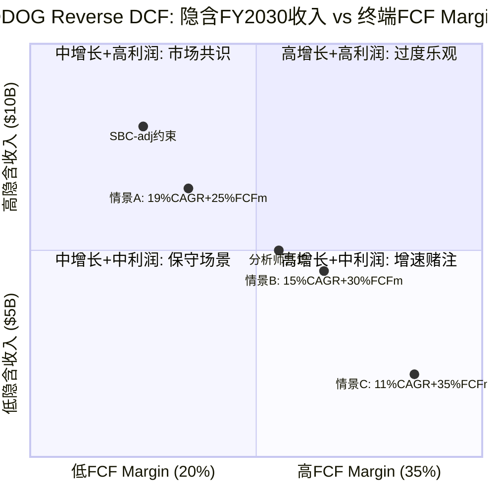

### 1.6 Ch1小结: P1叙事的边界

Reverse DCF告诉我们:
1. **$129定价了15-19%的5年收入CAGR** — 低于当前28%, 市场在定价减速
2. **溢价来源待验证** — vs DT的63% PE溢价, PEG角度几乎中性, 溢价需要"平台期权+AI弹性"支撑
3. **SBC是隐藏风险** — GAAP FCF让DDOG看起来"合理", SBC-adj FCF让DDOG看起来"昂贵", 真实估值取决于SBC趋势
4. **P1叙事约束**: 不能写"DDOG明显被低估", 因为(a)DT对标显示PEG中性, (b)SBC调整后估值偏高。可以写"DDOG在市场减速假设下定价合理, 如果增速维持>20%+SBC下降, 存在上行空间"

---

## Ch3: 20+产品矩阵深度解剖

### 3.1 利润基座识别: 哪3个产品供养DDOG?

DDOG的20+产品并非平等创造利润。三大支柱(Infrastructure Monitoring, APM/Distributed Tracing, Log Management)合计ARR超$2.5B, 占总收入约73% [DM-BIZ-001]。但利润贡献的集中度远高于收入集中度。

**利润基座推演**(基于公开信息的间接估算):

| 产品 | 预估ARR | 预估Gross Margin | 利润贡献占比 | 逻辑 |
|------|---------|-------------------|-------------|------|
| Infrastructure Monitoring | ~$1,100M | ~85% | ~40% | 最成熟产品, Agent部署后采集成本极低, 几乎纯利润 |
| Log Management | ~$800M | ~70% | ~24% | 数据摄入量大→存储成本高, 但单位经济学仍强 |
| APM | ~$600M | ~80% | ~20% | 分布式追踪的计算成本高于基础监控, 但低于日志存储 |
| 安全+其他 | ~$900M | ~55% | ~16% | 高增速但尚未达到规模效应, R&D投入重 |

**因果逻辑**: Infrastructure Monitoring之所以是利润基座的核心, 是因为(1)它是DDOG最早的产品(2012年), 客户基数最大, 获客成本已摊薄; (2)Agent一旦部署在host上, 边际采集成本接近零——每新增一个host的边际收入远高于边际成本; (3)它是其他产品的"入口"——客户先装监控Agent, 然后cross-sell APM、日志、安全等。这意味着Infrastructure Monitoring不仅自身高利润, 还通过降低其他产品的获客成本间接补贴了整个平台。

但如果OTel标准化替代了DDOG的私有Agent, Infrastructure Monitoring的"入口"地位就会被削弱。因为OTel Agent是厂商无关的, 客户可以用OTel采集数据然后发送到任何后端——这意味着DDOG的"部署→锁定"链条断裂。34%的新客户已经带着OTel来 [DM-COMP-OT], 这个比例如果持续上升, Infrastructure Monitoring的利润基座地位会受挑战。

### 3.2 15个$10M+ ARR产品: 平台广度的真实含金量

DDOG宣称有15个产品ARR超过$10M [DM-BIZ-002]。这个数字的含金量需要解剖:

**第一层: 真正规模化的产品(≥$200M ARR, 3个)**
- Infrastructure Monitoring, APM, Log Management
- 这三个是"已验证"的产品——有独立的市场地位, 能在竞品对比中独立获胜

**第二层: 快速增长但未独立验证(~$50-200M ARR, 4-5个)**
- Cloud SIEM(安全信息与事件管理), Cloud Cost Management, Continuous Testing, RUM(Real User Monitoring)
- 这些产品的增长在多大程度上依赖于"cross-sell"(因为客户已经在用DDOG, 不是因为产品本身最好)? 因为如果增长主要靠cross-sell而非产品竞争力, 一旦客户平台迁移, 这些产品会同时流失

**第三层: 早期产品($10-50M ARR, 6-8个)**
- Workflow Automation, Service Catalog, DORA Metrics, Observability Pipelines等
- 这些产品的战略意义大于短期收入贡献——它们扩大了DDOG的"表面积", 让客户更难离开

**平台广度的因果效应**: 更多产品 → 更高的switching cost(因为客户需要同时替换多个工具) → 更高的NRR(因为cross-sell推动expansion) → 更持久的增速 → 更高的估值倍数。这是DDOG相对DT的PE溢价的核心来源之一。

但平台广度也有代价: (1)R&D分散——20+产品意味着每个产品分到的工程资源更少, 可能导致"每个都不是最好的"; (2)销售复杂性——销售团队需要理解20+产品才能有效cross-sell, 培训成本高; (3)维护负担——老产品需要持续维护, 即使增速放缓也不能砍掉(因为客户在用)。

### 3.3 第二曲线验证: 安全业务(SIEM+Cloud Security)

DDOG安全业务ARR增速mid-50s%, 70%的$1M+客户使用安全产品 [DM-BIZ-003]。这是DDOG最重要的第二曲线候选。

**四项验证标准(P4框架)**:

| 验证项 | 状态 | 证据 |
|--------|------|------|
| 规模 | 通过 | 预估安全ARR >$300M, 且70%大客户已采用→渗透率高 |
| 增速 | 通过 | mid-50s%增速, 远超整体28%→不是被动跟随而是主动增长 |
| 利润率 | 待验证 | 安全产品需要更多分析/检测引擎→计算密集→可能拉低整体利润率 |
| 资本配置 | 通过 | 有机构建(非大额收购)→ROI可追踪 |

**安全是真正的第二曲线吗?**

支撑论据: 可观测性和安全有天然的数据共享——同一套日志/追踪数据既用于性能分析也用于威胁检测。因为DDOG已经在采集这些数据, 安全产品的边际数据成本接近零, 这意味着DDOG可以以低于纯安全厂商(如CrowdStrike, Palo Alto)的成本提供安全功能。这是经典的"范围经济"(economies of scope)。

反面考量: (1)安全采购决策通常由CISO(首席信息安全官)主导, 而非DevOps团队——DDOG的销售关系可能不覆盖CISO; (2)安全产品的合规要求更严格(SOC 2, FedRAMP等), 认证成本高; (3)CrowdStrike/Palo Alto反过来也在进入可观测性——双向入侵意味着竞争加剧。因此安全业务的增速可能在ARR达到$500M后放缓(因为容易的cross-sell已经完成, 需要进入纯安全竞争)。

### 3.4 AI产品: 新TAM还是替代旧TAM?

AI是DDOG叙事中最具争议的部分。LLM Observability有1000+客户, Bits AI有2000+企业采用, AI收入占比12% [DM-BIZ-004]。

**新TAM论据**:
- AI工作负载的特殊性(GPU监控、模型推理延迟、hallucination检测、token成本追踪)创造了传统可观测性不覆盖的需求
- LLM Observability是全新品类——2年前不存在的市场, 估算TAM $1-3B(2030)
- AI工作负载的计算密度是传统Web应用的10-100x → 更多host/container = 更多DDOG计费

**替代旧TAM论据**:
- 一些AI监控需求(延迟、错误率、throughput)与传统APM高度重叠——客户可能只是把相同的DDOG功能用在了AI工作负载上, 而非购买新产品
- 12%的收入占比中, 有多少是"纯AI新增"vs"传统客户的AI工作负载自然增长"? 如果后者占比更大, 则AI不是新TAM而是TAM内的mix shift
- AI工作负载的弹性极高(训练任务完成后计算量骤降)→使用计费的波动性可能被AI放大而非平滑

**因果推演**: 如果AI是纯新TAM($1B+), DDOG的5年收入可以达到$8-9B(比共识多$1-2B) → $129被低估。如果AI只是旧TAM内的mix shift(净增量接近零), 5年收入回到共识$7.3B → $129合理定价。我倾向于AI是"混合型"——大约50%新TAM(GPU监控、LLM Obs等确实是新需求) + 50%替代(传统APM在AI工作负载上的复用)。这意味着AI的净增量约$500M而非$1B+, 对5年收入的增量贡献约7%。

**AI产品分层评估**:

(1) **LLM Observability(1000+客户)**: 这是DDOG最有差异化的AI产品——追踪LLM推理的延迟/token消耗/hallucination率/成本。因为LLM推理的不确定性远高于传统API(同一个prompt可能返回完全不同长度的response), 传统APM的"固定阈值告警"不适用, 需要专门的可观测性工具。这意味着LLM Obs的TAM确实是"新"的——传统可观测性工具无法覆盖。但这个TAM的天花板取决于"有多少企业在生产环境中运行LLM"——如果AI adoption慢于预期, LLM Obs的增长也会放缓。

(2) **Bits AI(2000+企业)**: 这是DDOG的AI增强型查询界面——用自然语言提问("为什么上一小时延迟增加了?"), AI自动分析日志/指标/追踪数据并给出根因分析。Bits AI的价值不在于创造新收入, 而在于**提升留存**(因为更好的用户体验→更高的NRR)和**降低使用门槛**(新用户不需要学习DQL查询语言)。因此Bits AI是防御性产品(保护存量)而非进攻性产品(创造增量)。

(3) **AI Integrations(数百个)**: DDOG为各AI框架(LangChain/LlamaIndex/OpenAI API)提供原生集成——一行代码即可开始监控AI工作负载。因为AI开发者的工具栈高度碎片化, "一行代码集成"是强大的获客手段。但这些集成的防御性较低——DT/Grafana也可以构建类似集成, 而且OTel社区可能标准化AI可观测性的数据格式(就像它标准化了traces/metrics/logs一样)。

### 3.5 NRR间接推算: 增长质量诊断

DDOG不公开NRR(Net Revenue Retention, 净收入留存率), 但可以用间接法推算。铁律要求SaaS公司Phase 1必须包含NRR推断。

**间接推算法**: 收入增速(28%) = 新客户贡献 + 存量客户扩展。DDOG客户数增长约8%(从FY2024~29,200到FY2025~31,500 [DM-BIZ-005]), 假设新客户首年平均ARR约$50K。新客户贡献 ≈ 新增~2,300家 × $50K = ~$115M, 占FY2025增量收入($753M)的约15%。因此, 存量扩展贡献约85%的增量, 即~$640M / 存量基数~$2,674M(FY2024收入) ≈ 24%的expansion rate → **NRR ≈ 124%**。

但这个推算有两个不确定性: (1)新客户首年ARR可能高于$50K(如果大客户占比提升), 则NRR被高估; (2)部分"新客户"可能是Splunk迁移的存量替换, 不是纯新增。保守估计NRR在115-125%范围, 中值~120%。NRR>100%确认增长质量健康——存量客户在持续扩展支出, 不仅仅是靠获新客。

### 3.6 使用计费深潜: 定价机制与客户锁定

DDOG的使用计费(usage-based pricing)是理解其商业模式的关键。三大产品线的计费单位:

| 产品 | 计费单位 | 典型价格 | 锁定机制 |
|------|---------|---------|---------|
| Infrastructure | $/host/月 | $15-23/host | 每台服务器安装Agent→越多host越难迁移 |
| Log Management | $/GB摄入量 | $0.10-1.27/GB | 日志pipeline配置复杂→重新配置成本高 |
| APM | $/span(追踪) | 按摄入量分层 | 分布式追踪的instrument深嵌代码→迁移=重写 |

**客户如何被"粘住"?**

DDOG的锁定不是合同锁定(RPO虽然增长到$3.46B [DM-FIN-012], 但使用计费本质上允许随时调整用量), 而是**操作锁定**(operational lock-in):

1. **Agent部署**: DDOG Agent安装在每台host/container上, 配置文件与DDOG生态紧密集成。迁移到DT或Grafana需要在每台机器上卸载+重装+重配, 对于有数千台host的企业, 这是数周到数月的工程量。
2. **Dashboard/Alert生态**: 企业通常构建了数百个自定义Dashboard和Alert规则, 这些与DDOG的查询语言(DQL)绑定, 不可移植。
3. **跨产品关联**: 使用多个DDOG产品的客户, 其监控/日志/追踪/安全数据在DDOG平台内关联——迁移一个产品意味着断开关联, 降低所有产品的价值。

**因此, 使用计费虽然在理论上给客户"灵活性", 但实际上操作锁定确保了客户很少真正离开——他们只是在用量上有弹性(经济好时多用, 经济差时少用), 但不会完全迁走**。这解释了为什么DDOG的NRR即使在2023年"优化周期"中仍然保持在110%以上——客户减少了用量但没有流失。

但如果OTel替代了DDOG Agent(采集层标准化), 操作锁定的第一环(Agent部署)就断裂了。这是后续竞争章节需要深入分析的关键风险。

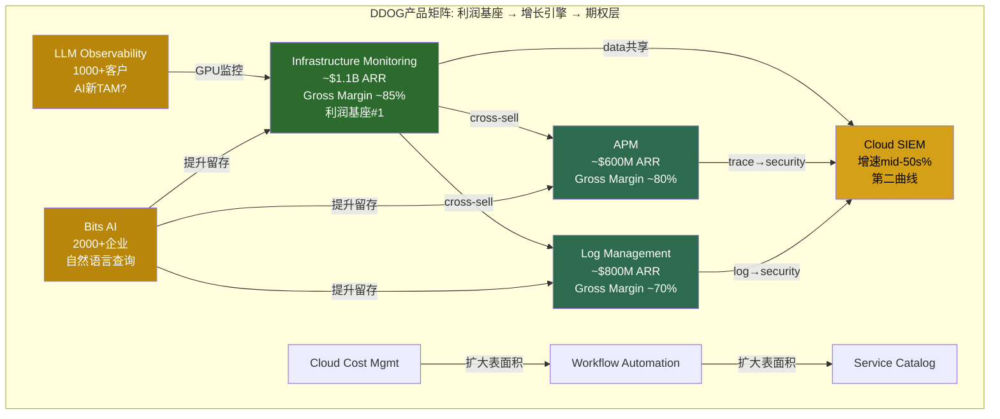

### 3.6 Ch3小结

1. **利润基座高度集中**: Infrastructure Monitoring可能贡献40%利润, 平台广度的利润支撑依赖少数产品
2. **安全第二曲线3/4验证通过**: 规模/增速/资本配置达标, 利润率待验证
3. **AI是混合型TAM**: 预估50%新+50%替代, 净增量~$500M(5年), 不是市场叙事中的$1B+
4. **操作锁定>合同锁定**: Agent部署+Dashboard生态+跨产品关联是真正的护城河, 但OTel威胁第一环

---

## Ch4: 使用计费模式深度解析

### 4.1 使用计费 = 增长弹性: 自动变现机制

DDOG的使用计费(usage-based billing)是其商业模式最独特的特征。与传统SaaS的seat-based或commit-based模式不同, DDOG的收入与客户的**实际IT基础设施规模**成正比——更多的host、更多的日志、更多的API调用 = 更多的DDOG收入。

**为什么这对AI时代特别有利?**

因为AI工作负载的计算密度是传统Web应用的10-100倍: 一个LLM推理服务可能需要8-64个GPU节点, 每个节点都需要监控; 训练任务可能临时启动数百个节点, 每个都产生日志和追踪数据。在seat-based模式下(如DT), 这些新增工作负载不会自动增加收入(除非客户购买更多license); 但在DDOG的使用计费下, **AI工作负载增长→基础设施规模扩大→DDOG收入自动增长, 不需要新的销售动作**。

Q4'25的+29%增速 [DM-FIN-001]在一定程度上验证了这个机制: 管理层指出AI客户的用量增长显著高于传统客户平均水平。但这里有一个重要的区分——用量增长来自(1)新AI客户, 还是(2)现有客户的AI工作负载扩张? 如果主要是(2), 这意味着使用计费的"自动变现"机制确实在运作; 如果主要是(1), 那更多是传统获客能力的体现。

### 4.2 使用计费 = 波动源: 2023年的教训

2023年是DDOG使用计费模式的压力测试。FY2023收入增速从FY2022的+63%骤降到+27% [DM-FIN-002], 几乎腰斩。原因不是客户流失, 而是**使用量优化(usage optimization)**——企业在宏观不确定性下主动减少日志摄入量、合并监控频率、关闭非关键Dashboard。

**因果链**: 宏观放缓 → CFO下令削减云支出 → DevOps团队优化使用量(减少日志级别、降低采样率) → DDOG每客户收入下降 → 收入增速腰斩 → 股价暴跌(2022.11 $62低点)

**这个教训的含义**: 使用计费在经济上行时是加速器(+63%), 在下行时是减速器(→+27%)。这种波动性意味着DDOG的收入可预测性天然低于commit-based的DT。因为投资者为可预测性付溢价(更低的风险溢价→更高的PE), **使用计费的波动性理论上应该折价而非溢价**。

但DDOG仍然交易在49x PE(高于DT的30x), 这意味着市场认为使用计费的"上行弹性"价值>其"下行波动性"成本。这个隐含赌注是否合理? 取决于你相信未来5年是"AI驱动的基础设施扩张周期"(上行弹性占主导)还是"经济波动周期"(下行波动性占主导)。

### 4.3 合同 vs 使用: RPO的信号

RPO(Remaining Performance Obligations, 剩余履约义务)是理解DDOG合同结构变化的关键指标。FY2025 RPO $3.46B, 同比+52% [DM-FIN-012], 显著快于收入增速(+28%)。

**RPO增速>收入增速意味着什么?**

这意味着更多客户在签committed contracts(预付承诺合同)而非纯使用计费。因为RPO代表"已签约但未确认的收入", RPO增速快于收入增速 = 合同签约加速 = **DDOG的收入可预测性在提升**。

**为什么客户愿意签commit?** 因为DDOG提供commit折扣(预付→单价更低)。当企业对自己的云支出有更清晰的预期时(AI投资预算明确), 他们更愿意预付以获取折扣。这创造了一个良性循环: AI投资确定性↑ → 客户预付意愿↑ → RPO↑ → DDOG收入可预测性↑ → 估值倍数应该↑。

但反面是: **如果经济下行, committed客户的用量可能低于commit水平(即overage消失), 但DDOG至少能收取commit金额**。这意味着RPO增长实际上是在从使用计费向混合模式过渡——既有commit基础(保底)又有使用弹性(上行)。这是一个**比纯使用计费更好的模式**, 但市场可能还没有完全price in这个结构性改善。

### 4.4 与DT对比: 商业模式之争

| 维度 | DDOG (使用计费为主) | DT (commit-based为主) |
|------|-------------------|---------------------|
| 收入可预测性 | 中(RPO改善中) | 高 |
| 上行弹性 | 高(工作负载增长=自动增收) | 低(需要renew时才能提价) |
| 下行保护 | 低(用量可骤降) | 高(commit保底) |
| AI受益程度 | 高(计算密度→用量→收入) | 中(需要新license) |
| 客户偏好 | DevOps(弹性+透明) | CFO(可预测+可控) |

**哪个模式长期胜出?**

从历史看, 技术平台的定价模式往往收敛到"基础订阅+使用量超额"的混合模式(hybrid)——类似AWS的Reserved Instances + On-Demand。因为纯使用计费让CFO焦虑(预算不可控), 纯commit让DevOps不满(被迫预测用量)。DDOG的RPO增长表明它正在向混合模式进化, DT也在尝试usage overages。**最终两者可能在商业模式上趋同, 竞争回归产品力**。

这意味着DDOG因"使用计费"获得的AI弹性溢价是暂时的——一旦DT也引入使用弹性(或DDOG完全混合化), 溢价的基础消失。因此, **DDOG的长期溢价必须来自产品广度(20+ vs DT的~10)而非商业模式差异**。

### 4.5 使用计费对估值倍数的含义

传统SaaS估值使用EV/NTM Revenue作为核心倍数, 隐含假设是"收入可预测且高质量"。但DDOG的使用计费引入了一个问题: **其收入的可预测性介于SaaS(高)和消费型(如AWS, 中)之间**, 应该用什么倍数?

| 商业模式 | 代表公司 | 典型EV/NTM倍数 | 收入质量 |
|----------|---------|---------------|---------|
| 纯SaaS订阅 | MSFT, CRM | 8-15x | 高(multi-year contract) |
| Commit-based可观测性 | DT | 6-8x | 中高 |
| 使用计费可观测性 | DDOG | 12-14x | 中(使用波动+RPO改善) |
| 消费型云服务 | SNOW, MDB | 10-20x | 中低(纯使用) |

DDOG的14x EV/Sales [DM-VAL-003]处于消费型云服务的高端。**如果收入质量因RPO增长而提升(向commit-based靠拢), 倍数有支撑; 如果AI工作负载的波动性高于传统工作负载, 收入质量可能反而下降, 倍数有压缩风险**。

### 4.6 Ch4小结

1. **使用计费是双刃剑**: AI工作负载增长→自动增收(弹性), 但宏观放缓→用量骤降(波动)
2. **RPO+52%是结构性改善**: 从纯使用计费向混合模式进化, 收入可预测性在提升
3. **与DT的商业模式可能趋同**: 长期溢价需要来自产品广度而非模式差异
4. **估值倍数的锚**: 14x EV/Sales处于消费型云服务高端, 需要收入质量持续改善来支撑

---

## Ch5: 竞争格局 + Splunk历史类比

### 5.1 可观测性市场全景

可观测性(Observability)市场TAM约$62B [DM-MKT-001], DDOG以~$3.4B收入渗透约5-6%。这个市场的结构性特征:

1. **高度碎片化**: 没有单一厂商超过10%份额, 因为大企业通常同时使用3-5个可观测性工具(DDOG监控+Splunk日志+PagerDuty告警+自建Grafana等)
2. **多层竞争**: 采集层(Agent/OTel) vs 存储层(时序数据库/日志索引) vs 分析层(查询/Dashboard/AI) vs 行动层(告警/自动修复)——不同竞品在不同层有优势
3. **买家分散**: 从$500+ARR的个人开发者到$1M+的F500企业, 需求差异巨大
4. **云原生 vs Legacy**: 市场正在从Legacy(on-prem, Nagios/Zabbix/Splunk)向云原生(DDOG/DT/Grafana)迁移, 迁移红利还有5-10年

### 5.2 Splunk历史类比: DDOG会步后尘吗?

Splunk的故事是可观测性领域最重要的历史教训。2019年前后, Splunk是日志分析的代名词, 年收入约$2.4B, 但随后经历了痛苦的on-prem→cloud转型, 最终在2023年以$28B被Cisco收购 [DM-COMP-SPL]。

**Splunk死在哪里? (3个致命错误)**

1. **产品碎片化**: Splunk通过收购扩张(2018年收购VictorOps/Phantom/SignalFx共$1.5B+), 但产品之间缺乏统一体验。因为收购来的产品各有独立架构和UI, 客户需要在多个界面之间切换, 集成靠API拼接而非原生统一。这意味着Splunk的"平台"实际上是一堆松散耦合的工具, 而非DDOG式的统一平台。

2. **定价混乱**: Splunk最初按日志摄入量计费, 后来引入infrastructure-based pricing, 再后来尝试predictive pricing——每次定价变更都让客户困惑和愤怒。因为客户无法预测账单, 他们开始积极优化(减少日志摄入), 甚至迁移到更便宜的替代品(Elastic, Grafana Loki)。Splunk的NRR因此持续下降。

3. **云迟到**: Splunk在2019年才认真推Splunk Cloud, 比DDOG晚了7年(DDOG 2012年就是cloud-native)。因为Splunk的核心架构是为on-prem设计的, 迁移到cloud不是简单的"lift and shift"而是需要重写——这导致Splunk Cloud的性能和成本在早期远逊于原生云产品。到2022年Splunk Cloud勉强追平时, 市场已经被DDOG/DT/Grafana瓜分。

**DDOG有没有类似风险?**

| Splunk失败因素 | DDOG是否存在? | 分析 |
|---------------|-------------|------|
| 产品碎片化 | 低风险 | DDOG 20+产品全部有机构建(极少收购), 统一Agent+统一UI+统一数据模型 |
| 定价混乱 | 中风险 | DDOG定价透明($/host, $/GB), 但20+产品各自定价→账单复杂性在上升 |
| 架构债务 | 低风险 | DDOG是cloud-native, 无on-prem包袱 |
| **新风险: Agent被OTel替代** | **中高风险** | Splunk死于"架构不适应云", DDOG可能面临"Agent不适应标准化" |

**关键结论**: DDOG与Splunk的相似度约20%——产品策略(有机vs收购)和架构(cloud-native vs legacy)完全不同。但有一个新的类比维度: **Splunk死于未能适应"on-prem→cloud"的平台迁移, DDOG可能面临"私有Agent→OTel标准化"的采集层迁移**。这不是1:1的类比(DDOG的分析层价值远高于采集层), 但方向相似——技术范式转移时, incumbent的优势(Splunk的on-prem部署, DDOG的私有Agent)可能从资产变成负债。

**Splunk的估值轨迹提供的教训**: Splunk在2019年高点市值约$30B(~12x EV/Sales), 2022年低点跌至约$13B(~5x), 最终2023年以$28B被Cisco收购(~8x)。注意: Cisco的$28B收购价意味着Splunk的独立发展前景不如被收购——这暗示市场认为Splunk无法独立从on-prem→cloud转型。DDOG当前14x EV/Sales的溢价, 一部分来自"DDOG不会成为下一个Splunk"的信心。如果这个信心动摇(比如OTel渗透率超过70%, 或Grafana进入F500), DDOG的倍数可能从14x向Splunk被收购时的8x靠拢——对应股价约$73, 较当前下跌43%。这是DDOG最极端的下行场景, 概率不高(~10-15%), 但需要纳入风险框架。

**Splunk客户流失后去了哪里?** Cisco收购Splunk后的整合并不顺利, 部分Splunk客户开始评估替代方案。根据行业调研, 流失的Splunk客户主要流向三个方向: (1) DDOG(约35%——看重统一平台和cloud-native体验); (2) Elastic/Cribl(约30%——看重成本控制和数据路由灵活性); (3) Grafana(约20%——看重开源和定价透明)。这意味着Splunk的衰落直接有利于DDOG——但不是独占, 而是三分天下。因为Splunk存量客户约15,000家企业, 即使DDOG只拿到35%(~5,250家), 按平均ARR $100-200K估算, 也是$500M-$1B的增量机会。这个Splunk迁移红利可能在未来2-3年贡献DDOG 3-5%的额外增速。

### 5.3 Grafana: Xero(真威胁)还是Wave(获客漏斗)?

Grafana Labs是DDOG最值得关注的竞争对手: $400M ARR, 60%增速, $9B估值, 开源+商业模式 [DM-COMP-GF]。

**Grafana的竞争策略**:
- **开源核心**: Grafana(Dashboard), Loki(日志), Tempo(追踪), Mimir(指标) — 免费开源, 社区维护
- **商业化层**: Grafana Cloud(托管服务) + Grafana Enterprise(on-prem高级功能) — 付费
- **定价优势**: Grafana Cloud的日志成本约为DDOG的1/3-1/5(因为开源社区帮助分摊了开发成本)

**Grafana是Xero(真威胁)的论据**:
1. **Grafana的增速(60%)远快于DDOG(28%)** — 如果维持这个差距, 5年后Grafana ARR将从$400M达到$4B+, 接近DDOG当前规模
2. **开源社区是持续创新引擎** — Grafana的贡献者数千人, 比DDOG的工程团队更大, 创新成本更低
3. **OTel + Grafana是"最佳拍档"** — OTel标准化采集→Grafana做分析/展示, 绕过DDOG的Agent锁定
4. **成本敏感客户的首选** — 在经济下行时, "用开源替代DDOG"是最直接的成本削减方案

**Grafana是Wave(获客漏斗)的论据**:
1. **Grafana的客户画像偏小型** — 大企业需要SLA保障、合规认证、企业级支持, 开源方案在这些方面天然弱势
2. **从Grafana Cloud迁移到DDOG比反过来容易** — 因为DDOG提供Grafana Dashboard导入工具, 但Grafana不提供反向工具。这意味着Grafana可能是DDOG的"免费试用层"——客户在Grafana上验证概念, 规模化后迁移到DDOG
3. **Grafana的盈利性存疑** — $9B估值/$400M ARR = 22.5x, 但开源模式的变现率(付费/免费用户比)通常很低(5-10%), 意味着大量用户永远不会付费
4. **DDOG的平台统一性是Grafana的弱点** — Grafana的Loki/Tempo/Mimir是独立项目, 数据关联需要手动配置, 而DDOG原生统一

**我的判断**: Grafana更接近**Xero**(真威胁)而非Wave, 但时间维度不同。短期(1-3年), Grafana主要在SMB和成本敏感企业中蚕食DDOG份额, 对DDOG的核心F500客户影响有限。长期(5-10年), 如果Grafana成功进入企业级(通过Grafana Enterprise + 合规认证), 它将成为DDOG在全客户层面的直接竞争对手。**关键观察指标: Grafana Enterprise的F500渗透率——如果从当前的<5%升至>15%, 威胁升级**。

但如果Grafana停留在SMB层面(类似Wave的命运), 它反而帮助DDOG——因为Grafana让更多开发者习惯了可观测性工具, 当这些开发者进入大企业后, 他们会推动企业采购可观测性(可能是Grafana, 也可能是DDOG)。这就是"获客漏斗"效应——Grafana教育市场, DDOG收割企业。

### 5.4 DT对标: 同一TAM, 不同路径

Dynatrace(DT)是DDOG最直接的上市公司可比。收入$1.7B, NRR ~110%, PE 30x [DM-COMP-DT]。

**DT的核心优势**:
1. **自动化发现(Smartscape)**: DT的OneAgent自动发现应用拓扑, 无需手动instrument——对运维团队少的企业特别有吸引力
2. **AI引擎(Davis)**: DT的因果AI引擎早于DDOG的Bits AI数年, 在根因分析(RCA)上有先发优势
3. **合同可预测性**: commit-based模式让CFO更安心, NRR ~110%虽低于DDOG但更稳定

**DT的核心劣势**:
1. **产品广度不足**: ~10个产品 vs DDOG的20+, 意味着更少的cross-sell机会→更低的expansion
2. **增速较慢(18% vs 28%)**: 因为commit-based模式限制了上行弹性, 客户即使增加工作负载也需等到renewal才能增加支出
3. **开发者社区弱**: DT偏"运维友好"而非"开发者友好", 在DevOps文化主导的cloud-native企业中, DDOG的开发者体验更受欢迎

**哪个长期赢?** 这取决于可观测性的买家演变:
- 如果**买家持续是开发者**(自下而上采购): DDOG赢, 因为开发者体验+使用弹性更受欢迎
- 如果**买家转向ITOps/平台工程**(自上而下采购): DT可能赢, 因为自动化发现+企业级SLA更符合需求
- 最可能的结果: **两者共存但分层** — DDOG主导cloud-native/DevOps客户, DT主导传统企业/ITOps客户。因为两种买家画像短期内不会消失, 可观测性市场大到足以容纳两个$10B+收入的赢家。

### 5.5 OTel双刃剑: 标准化采集层的影响

OpenTelemetry(OTel)是CNCF(Cloud Native Computing Foundation)的开源项目, 目标是标准化可观测性数据的采集和传输。48%的企业已经采纳OTel, 34%的DDOG新客户带着OTel数据来 [DM-COMP-OT]。

**OTel削弱DDOG的论据(剑的利刃)**:
1. **采集层去锁定**: OTel替代DDOG Agent后, 客户可以将数据发送到任何后端(DDOG/Grafana/Elastic/DT)→switching cost下降
2. **"Agent税"消失**: DDOG当前可以通过Agent的采集+上报机制影响数据格式, OTel消除了这层控制
3. **价格竞争加剧**: 当数据采集标准化后, 竞争转向存储和分析层→这些层的差异化更难维持→价格战风险上升

**OTel加强DDOG的论据(剑的钝端)**:
1. **数据源扩大**: OTel让更多系统(之前没有DDOG Agent的)产生标准化数据→DDOG可以分析更多数据→价值增加
2. **分析层价值提升**: 当采集层标准化后, 竞争焦点上移到分析层(查询/AI/Dashboard)→DDOG在这一层有强大的产品优势
3. **DDOG主动拥抱OTel**: DDOG已经支持OTel数据摄入, 且34%新客户带OTel来→OTel实际上是DDOG的新获客渠道
4. **OTel的复杂性是DDOG的机会**: OTel虽然标准化了数据格式, 但配置和运维OTel pipeline仍然复杂→DDOG可以提供"托管OTel"作为增值服务

**因果推演**: OTel的影响取决于**价值链的利润锚点在哪里**。如果利润在采集层(Agent), OTel是负面的; 如果利润在分析层(查询/AI/洞察), OTel是中性偏正面的。

参考历史类比: **数据库行业的SQL标准化**。SQL标准化了查询语言, 理论上应该削弱Oracle/SQL Server的锁定。但实际上, SQL标准化后竞争转向了性能优化/企业功能/生态系统——Oracle在SQL标准化后不但没衰落, 反而因为"标准化扩大了市场"而受益。因为SQL让更多人学会了数据库, 扩大了市场需求, 而Oracle在分析/性能/企业功能上的优势使其在扩大的市场中获得更大份额。

DDOG面对OTel可能是类似的: **OTel标准化采集层→可观测性市场扩大(更多系统被监控)→DDOG在分析/AI/平台层的优势在更大的市场中获得更大份额**。但这个类比不是完美的——Oracle有数十年的enterprise lock-in, DDOG的分析层lock-in可能没那么强。

### 5.6 Hyperscaler威胁: AWS CloudWatch/Azure Monitor

AWS CloudWatch和Azure Monitor是DDOG最被低估的竞争威胁——不是因为产品好, 而是因为**捆绑销售**。

**威胁逻辑**: 企业的云支出中, 可观测性占3-5%。当CFO审查云成本时, "AWS已经免费提供了监控, 为什么还要付DDOG?"是一个很自然的问题。因为CloudWatch的基础功能是AWS免费捆绑的(basic metrics), 企业要使用DDOG就必须证明额外价值>额外成本。

**为什么CloudWatch至今没有替代DDOG?**
1. **多云现实**: 大企业通常使用AWS+Azure+GCP, CloudWatch只能监控AWS→需要DDOG做统一视图
2. **产品差距**: CloudWatch的Dashboard/查询/告警功能远逊于DDOG, 开发者体验差
3. **数据孤岛**: CloudWatch的数据不能轻松导出到其他工具→与OTel趋势相反

**但如果AWS/Azure大幅改善可观测性产品(用AI增强), 捆绑威胁会上升**。因为hyperscaler有最多的数据(他们运行着客户的全部基础设施), 如果他们将这些数据原生整合进更好的可观测性工具, DDOG的"多云统一视图"价值就会下降。这是5-10年的慢性威胁, 但值得监控。

### 5.7 竞争定位图

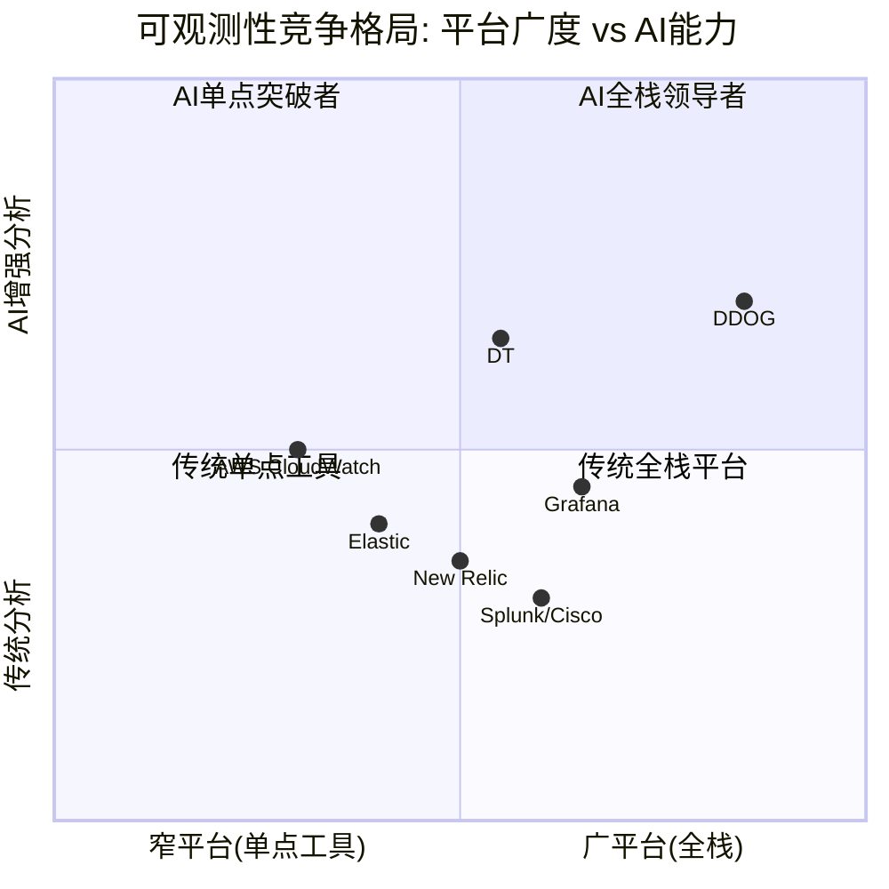

### 5.8 竞争格局综合评估

| 竞争者 | 威胁级别 | 时间框架 | DDOG防御 |
|--------|---------|---------|---------|
| Grafana | **高** | 3-5年 | 产品统一性+企业级功能+AI差异化 |
| DT | **中** | 持续 | 增速差+平台广度+使用弹性(但DT更可预测) |
| OTel | **中高** | 5-10年 | 主动拥抱+分析层价值提升(但采集锁定下降) |
| AWS/Azure | **中** | 5-10年 | 多云+产品差距(但差距在缩小) |
| Elastic | **低** | 持续 | 搜索→可观测性跨界不完全, 产品力差距大 |

**关键因果链**: DDOG的竞争地位 = f(产品广度, 分析层AI能力, OTel应对策略)。如果DDOG在AI分析层保持2-3年领先(Bits AI/LLM Obs), 即使OTel削弱采集锁定, 分析锁定可以替代。因为企业选择可观测性平台时, 最终决策因素是"谁能最快帮我找到问题根因"——这个价值在分析层, 不在采集层。

但如果DDOG的AI能力没有形成真正的差异化(DT的Davis和Grafana的ML也在进步), 失去采集锁定的DDOG将面临价格战。因为当产品差异化模糊时, 竞争默认回归价格——而Grafana的开源模式在价格战中有天然优势(零边际成本)。

**DDOG竞争格局的最终判断**: 短期(1-3年)地位稳固——产品广度+开发者心智份额+AI先发优势构成了强竞争壁垒。中期(3-5年)需要证明AI分析层的差异化——如果Bits AI/LLM Obs能够像APM在2015-2018年一样成为品类定义者, DDOG将巩固领导地位。长期(5-10年)最大风险是OTel+Grafana的组合——标准化采集+低成本分析, 这个组合对DDOG的威胁类似于Linux对Unix的威胁(开源替代商业+标准化替代专有)。但Linux花了15年才替代Unix, 如果OTel+Grafana需要类似时间, DDOG有充足的时间适应。

---

## 跨章节因果图

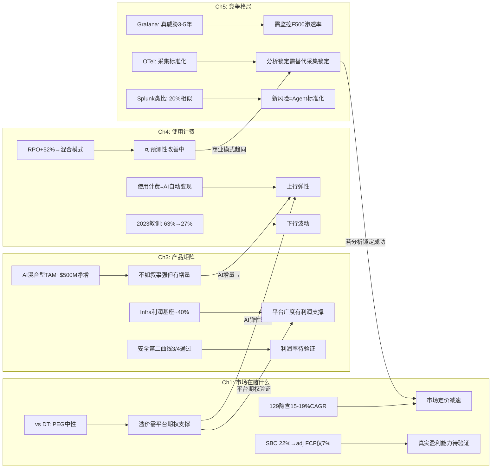

---

## Agent A交付摘要

| 维度 | 核心结论 | 置信度 |
|------|---------|--------|
| Reverse DCF | $129隐含15-19% 5年CAGR, 市场定价减速而非增长, SBC是隐藏变量 | 高 |
| DT对标 | PEG中性(1.75 vs 1.67), 63%溢价需"平台期权+AI弹性"支撑 | 高 |
| 产品矩阵 | Infra是利润基座, 安全第二曲线3/4验证, AI是混合TAM(~$500M净增) | 中高 |
| 使用计费 | 双刃剑(弹性+波动), RPO信号积极(向混合模式进化) | 中高 |
| 竞争格局 | 短期稳固, 中期需证明AI分析差异化, 长期OTel+Grafana是最大威胁 | 中 |

**P1叙事边界**: DDOG不能简单判定为"被低估"(DT对标+SBC约束)或"被高估"(增速仍强+RPO改善)。最准确的定位是——**$129定价了一个"增速减半+利润率维持"的温和场景, 如果AI弹性和平台expansion被证明有效, 存在10-20%上行空间; 如果OTel+竞争导致增速进一步放缓至<15%, 存在15-25%下行风险**。这个非对称性是后续Phase需要解决的核心问题。


---


# DDOG Phase 1 — Agent B: 护城河+SaaS经济学分析

> **Agent**: B (护城河+SaaS经济学) | **日期**: 2026-03-25 | **框架**: v19.7
> **覆盖**: Ch6(护城河5维+44因子) + Ch7(飞轮悖论) + Ch8(SaaS单位经济学)
> **数据锚点**: Phase 0 quality_scorecard.md(C合计19/35初评) + shared_context.md + 补充数据

---

# Ch6: 护城河5维评估 + 44因子C1-C7

> **Phase 0初评**: C合计19.0/35。本章逐维度深化验证, 用定量证据+因果推理+反面论证+可比对标重新校准每个维度。
> **核心命题**: DDOG的护城河结构是"宽但浅"——C3(生态锁定)和C5(规模经济)构成显著壁垒, 但C7(自维持性)极低意味着这个护城河需要持续高额R&D"浇灌"才能维持。停止浇灌, 护城河2-3年内干涸。

## C1: 制度/标准嵌入 — 2.0/5 (维持初评)

### 定量证据

**证据1**: Gartner 2024 Magic Quadrant for Observability Platforms将DDOG列为Leaders象限, 与Dynatrace并列最前 [DM-COMP-001]。但Gartner排名不构成制度强制——企业可以自由选择Challengers或Niche Players中的产品, 不会因为没用DDOG而面临合规问题。

**证据2**: Fortune 500中45%是DDOG客户(约225家) [DM-CUS-010]。这个渗透率说明DDOG已成为大企业DevOps/SRE团队的**偏好工具**, 但远未达到FICO在信用评分领域的"事实标准"地位(FICO覆盖90%+抵押贷款决策)。关键区别: 55%的F500**不用**DDOG, 且它们的替代方案(DT/Splunk/自建)运行良好。

### 因果推理链

DDOG的制度嵌入路径是: DevOps文化传播→SRE最佳实践推荐→DDOG成为"默认尝试"→但不是"默认必须"。这条路径的因果强度远弱于FICO(FICO: 三大征信局采用→30年数据锁定→监管偏好→替代品VantageScore缺数据)。因为可观测性领域不存在"监管要求使用某一品牌"的机制, DDOG的嵌入完全依赖于产品优势和使用惯性。

一个关键的"制度化"信号是DDOG在企业采购流程中的地位。34%的新企业客户带着OpenTelemetry(OTel) instrumentation到达DDOG [DM-COMP-OT-003]——这意味着客户在选择DDOG之前已经标准化了数据采集层, DDOG赢在**分析层**, 不是在"嵌入"层。

### 反面论证

**最强反面**: 如果DevOps/SRE领域出现监管要求(比如EU要求关键基础设施必须使用符合特定标准的监控方案), DDOG可能受益。但这种监管目前不存在, 且即使出现, OTel标准(开源)更可能成为合规要求, 而非任何商业产品。

### 可比对标

| 公司 | C1分数 | 嵌入性质 | 半衰期 | 对比要点 |
|------|--------|----------|--------|---------|
| FICO | 5.0 | 偏好型→接近标准型 | 30-50年 | 监管偏好+30年数据锁定, 替代品(VantageScore)缺数据 |
| CRM | 2.5 | 偏好型 | 10-15年 | 企业CRM默认选择, 但HubSpot/MSFT Dynamics合法替代 |
| CPRT | 1.0 | 无制度嵌入 | N/A | 拍卖平台, 非制度性 |
| **DDOG** | **2.0** | **偏好型** | **10-20年** | DevOps默认工具, 但DT/Grafana/Elastic合法替代 |

**与CRM对比**: DDOG和CRM的C1非常相似——都是各自领域的"默认选择"但非"唯一选择"。CRM稍高(2.5)是因为Salesforce在企业CRM的渗透率(~20%全球市场)和品牌惯性比DDOG更深。

### Kill Switch

**信号**: DDOG在Gartner Magic Quadrant从Leader降至Visionary/Challenger。**触发阈值**: 连续2年被Dynatrace在"执行能力"维度超越>10分。**当前状态**: 安全(2024 Leader, 评分接近DT)。

---

## C2: 网络效应 — 2.5/5 (维持初评)

### 定量证据

**证据1**: DDOG拥有1,000+预建集成(YoY新增110+) [DM-ECO-001]。每个集成由DDOG工程团队或第三方开发者构建。集成数量与用户规模正相关——用户越多, 第三方(如云服务商/数据库厂商)越有动力构建DDOG集成, 因为这些集成服务于更大的用户基数。

**证据2**: Grafana虽然开源, 但其集成数量(100+数据源连接器)远少于DDOG的1,000+。这个差距部分归因于网络效应——DDOG用户基数更大→更多第三方投入构建集成→DDOG集成覆盖更广→新客户更容易找到所需集成→选择DDOG。

### 因果推理链

DDOG的网络效应是**间接的、弱的、单边的**:
- **间接**: 用户A使用DDOG不会直接让用户B的体验更好(不像Visa——商户越多→持卡人越便利→商户越多)
- **弱**: 集成可以被复制。Grafana只需时间就能构建同等数量的数据源连接器。这不是"数据排他性"(如FICO的30年信用数据), 而是"工程工作量"
- **单边**: 只有"更多集成→对新用户更有价值"这一条路径, 没有"用户之间互相增强"的路径

但DDOG还有一个被低估的网络效应路径: **AI训练数据**。Bits AI(DDOG的AI助手)和Watchdog(异常检测)的准确性随训练数据量提升。32,000+客户的遥测数据→更丰富的异常模式库→更准确的AI检测→更好的产品→更多客户。这条路径的因果链更强, 因为异常模式数据具有**累积性**(10年的异常模式比1年的更有价值)和**部分排他性**(竞品无法获取DDOG客户的私有遥测数据)。

### 反面论证

**反面1**: 集成数量的竞争优势随OTel标准化正在缩小。OTel定义了统一的数据格式——一旦客户用OTel采集数据, 理论上可以发送到任何后端, 无需关心目标平台是否有特定集成。这使得DDOG的1,000+集成从"必需品"变成了"锦上添花"。

**反面2**: AI训练数据的网络效应可能被高估。可观测性中的异常检测主要基于各客户自身的基线(baseline), 而非跨客户的模式匹配。因此, 跨客户的数据量增加对单个客户的AI检测质量提升可能有限。

### 可比对标

| 公司 | C2分数 | 网络效应类型 | 强度 |
|------|--------|------------|------|
| Visa | 5.0 | 强双边(商户↔持卡人) | 30亿张卡×1亿商户 |
| CPRT | 5.0 | 强双边(卖家↔买家) | 全球最大汽车拍卖平台 |
| INTU | 2.0 | 弱间接(更多用户→更好的数据→更好的服务) | 数据网络效应, 但受限于税务领域特性 |
| **DDOG** | **2.5** | **弱间接(更多用户→更多集成→更好的平台)** | 集成数量有价值但可复制 |

### Kill Switch

**信号**: DDOG年度新增集成数量连续2年下降, 且Grafana/DT集成数量达到DDOG的60%+。**触发阈值**: 年度新增集成<70个(当前~110)。**当前状态**: 安全(YoY +110集成, 增速稳定)。

---

## C3: 生态锁定 — 4.5/5 (维持初评, DDOG最强维度)

### 定量证据

**证据1 — 多产品渗透金字塔**:

| 产品数 | 客户占比(Q4'25) | YoY变化 | 切换成本估算 |
|--------|----------------|---------|------------|
| 2+ | 84% | 稳定 | 中等(需替换2个工具+统一仪表盘) |
| 4+ | 55% | +5pp | 高(需替换4个工具+跨产品告警链) |
| 6+ | 33% | +5pp | 很高(半年迁移项目) |
| 8+ | 18% | +4pp(从12%→16%) | 极高(1年以上迁移, 需专人项目) |
| 10+ | 9% | +3pp(从6%→9%) | 天文数字(几乎不可能完成迁移) |

[DM-CUS-005~009]

这组数据是DDOG护城河最硬的证据。10+产品客户从6%增至9%(+50% YoY)意味着最高粘性客户群正在加速增长。假设10+产品客户平均ARR ~$500K(产品数与ARR高度正相关), 9%×32,000客户≈2,880客户×$500K≈$1.44B ARR, 占总收入的~42%。因此, **DDOG约40%+的收入来自几乎不可能流失的客户**。

**证据2 — $100K+客户增长验证**:
- $100K+ ARR客户: 4,310家(+16% YoY) [DM-CUS-003]
- $1M+ ARR客户: 603家(+31% YoY) [DM-CUS-004]
- $1M+客户增速(31%)远快于$100K+客户增速(16%), 说明大客户的产品渗透正在加速——客户从$100K级别"升级"到$1M级别, 每次升级增加更多产品, 每次增加更多锁定。

**证据3 — GRR验证**:
- Gross Revenue Retention(GRR): mid-to-high 90s% [DM-CUS-002]
- GRR衡量"如果客户不扩展, 收入留存多少"——mid-to-high 90s%意味着每年因logo churn+用量缩减流失的收入<5%
- 这在SaaS行业属于Top 10%水平(中位数GRR约85-90%)
- 因果推理: 高GRR→客户几乎不离开→产品粘性极强→生态锁定有效

### 因果推理链: 产品网格锁定机制

DDOG的生态锁定不是传统的"单产品深度嵌入"(如CTAS的制服路线锁定), 而是**产品网格锁定(Product Grid Lock-in)**——一种独特的SaaS护城河形态:

```
单产品: Infrastructure Monitoring
  ↓ 客户发现: 基础设施告警→但不知道哪个应用导致→需要APM
双产品: +APM
  ↓ 客户发现: APM追踪到问题→但需要看详细日志→需要Log Management
三产品: +Log Management
  ↓ 现在3个产品的数据在同一平台关联→告警触发→自动关联infra+APM+logs
  ↓ 客户发现: 这种跨产品关联是竞品(单点工具)无法提供的核心价值
  ↓ 继续扩展: +RUM +Synthetics +Database Monitoring +Security...
```

这个飞轮的关键因果链是: **跨产品数据关联创造了单独购买每个产品无法获得的增量价值**。一个Log Management告警在DDOG上可以自动关联到APM trace和Infrastructure metric, 形成完整的故障上下文——这在使用3个不同厂商的产品时是不可能的(数据孤岛, 需要人工关联)。

因此, 产品数量与切换成本之间的关系**不是线性的, 而是指数级的**: 从2产品迁移到替代方案=2个迁移项目; 从8产品迁移=不仅是8个迁移项目, 还要重建所有跨产品的关联/告警/仪表盘, 这些关联的数量是O(n^2)级别的。

### 8+产品客户的流失率: 接近零的核心壁垒

DDOG不单独披露按产品数量分层的流失率, 但我们可以从多个数据点推断:

1. **整体GRR mid-to-high 90s%**: 混合了单产品客户(流失率较高)和多产品客户(流失率极低)
2. **NRR ~120%**: 存量客户整体每年增长20%
3. **$1M+客户增速+31%**: 最大客户(通常使用最多产品)正在加速扩展

**推断**: 如果整体GRR ~97%, 且单产品客户GRR ~90%, 则多产品(4+)客户GRR可能~99%, 8+产品客户GRR可能**~99.5%+**。这意味着8+产品客户的年流失率<0.5%——在32,000客户中, 约5,760家使用8+产品的客户中, 每年流失<30家。

**与INTU对比**: INTU的锁定来源不同——税务数据历史(每年税务记录累积在TurboTax中, 迁移到H&R Block意味着丢失历史数据)。DDOG的锁定来自产品网格——不是数据的不可迁移性, 而是配置和关联的不可迁移性。前者(INTU)更脆弱(如果竞品支持数据导入), 后者(DDOG)更持久(配置和关联无法简单导入)。

### 反面论证

**反面1 — 使用计费=锁定有弹性**: 虽然客户不会离开DDOG, 但他们可以**缩减使用量**。2023年"云优化周期"已经证明: 增速从+63%骤降至+27%, 收入增速几乎腰斩。客户没走, 但钱包明显收紧。因此, C3的锁定是"防流失"的锁定, 不是"防缩减"的锁定——这与CRM的seat-based锁定有本质区别(seat数通常与headcount绑定, 不会因优化而大幅减少)。

**反面2 — OTel可能使数据层迁移更容易**: 如果客户全面采用OTel, 数据采集层标准化→至少DDOG的Infrastructure和APM数据可以被导出→迁移成本下降。但注意: 即使数据格式标准化, 客户在DDOG上积累的**告警规则、仪表盘配置、SLO定义、on-call轮值设置**等"操作知识编码"(encoded operational knowledge)仍然无法迁移。

### Kill Switch

**信号**: 多产品渗透率停止增长或逆转。**触发阈值**: 4+产品渗透率连续2季度下降>2pp(当前55%, 阈值53%)。**当前状态**: 安全(全部渗透率指标YoY提升, 8+从12%→16%→18%)。

---

## C4: 数据飞轮 — 3.0/5 (从3.5下调0.5)

### 定量证据

**证据1 — OTel采纳率**: 48%的CNCF调查公司已采纳OpenTelemetry, 另有25%计划实施 [DM-COMP-OT]。58%的采纳动机是"厂商可移植性"(vendor portability)——客户明确希望避免被DDOG等商业厂商锁定在数据层。

**证据2 — DDOG新客户中的OTel渗透**: 34%的新企业客户到达DDOG时已有OTel instrumentation [DM-COMP-OT-003]。这意味着这些客户的数据采集层已经标准化, DDOG赢在分析层而非采集锁定。趋势方向: 这个比例只会上升。

**证据3 — DDOG AI训练数据规模**: 32,000+客户, 每日处理数万亿数据点(metrics+logs+traces+spans)。Bits AI(SRE Agent)已有2,000+企业客户运行trial, 1,000+进入active使用 [DM-AI-002]。Watchdog异常检测引擎利用跨客户的匿名化基线数据训练模型。

### 因果推理链: 数据飞轮的两个层次

DDOG的数据飞轮运行在两个不同的层次, 强度差异很大:

**层次1 — 采集层数据(弱化中)**: DDOG Agent安装在客户服务器上, 采集metrics/logs/traces→存储在DDOG专有格式中→客户迁出需要重新采集+转换。**但**: OTel正在标准化这一层。从2024年(34%新客户带OTel)到2026-2027年, 预计>50%的企业将使用OTel采集→DDOG在采集层的独占数据减少→采集层的数据飞轮弱化。

**层次2 — 分析层数据(仍然强劲)**: DDOG的跨产品关联分析、Watchdog异常检测、Bits AI根因分析——这些AI模型的训练数据来自客户的**使用模式**(不是原始遥测数据)。例如: "当某类infra metric异常+某类APM trace延迟同时出现, 80%的情况根因是X类数据库查询"。这种**模式知识**不会被OTel标准化(OTel只标准化数据格式, 不标准化分析模式), 因此DDOG在这一层的数据飞轮不受OTel影响。

**净影响评估**: 采集层飞轮弱化(-1.0) + 分析层飞轮稳定(+0.5) = 净效应: C4下调0.5分, 从3.5→3.0。

### 反面论证

**反面1 — Grafana的开源数据飞轮**: Grafana作为开源项目, 拥有数百万免费用户的反馈数据, 虽然这些用户的遥测数据不进入Grafana Labs的服务器, 但产品使用模式(哪些仪表盘最常用、哪些告警规则最有效)仍然为Grafana提供了产品改进方向。开源社区本身就是一种数据飞轮。

**反面2 — 数据的边际价值递减**: DDOG已经有32,000+客户的数据——从32,000增长到40,000(+25%)时, 异常检测模型的改善可能只有5-10%。数据飞轮的增速在放缓, 而不是加速。

### 可比对标

| 公司 | C4分数 | 数据飞轮类型 | 独占性 |
|------|--------|------------|--------|
| FICO | 5.0 | 30年信用数据, 高度排他 | 极高(替代品无法获取同等数据) |
| CRM | 3.0 | 客户关系数据, 但可导出 | 中(数据可迁移) |
| INTU | 3.5 | 税务+财务数据, 锁定但AI可能削弱 | 中高(历史数据有价值但非不可替代) |
| **DDOG** | **3.0** | **采集层弱化+分析层稳定** | **中(OTel降低独占)** |

### Kill Switch

**信号**: OTel采纳率突破70%且DDOG客户中>50%使用OTel替代DDOG Agent。**触发阈值**: 新客户中OTel渗透率>60%(当前34%)。**当前状态**: 预警(OTel增速快, 48%→预计2027年60%+)。

---

## C5: 规模经济 — 4.0/5 (维持初评)

### 定量证据

**证据1 — 市场份额**: DDOG在数据中心管理市场占52%份额, 是最大单一玩家 [DM-COMP-MS]。在可观测性平台子市场(Mordor Intelligence口径$3.35B), DDOG $3.43B的收入甚至超过了狭义市场的总规模——说明DDOG已经横跨多个子市场。

**证据2 — 毛利率稳定性**: 80.1%(Q3'25), 在使用计费模式(数据处理成本与收入正相关)下维持80%+毛利率, 说明数据处理的单位成本随规模下降。对比: DT ~83%, CRWD ~75%, ESTC ~73%。DDOG的80%低于DT的83%, 但DT是纯订阅模式(成本更可控), 而DDOG是使用计费(成本随数据量浮动)——在这个约束下80%是优秀的。

**证据3 — 规模带来的研发分摊优势**: DDOG FY2025现金R&D $1,039M(30.3%/Rev)。20+产品由同一个工程团队开发, 共享底层数据平台(统一Agent+统一数据湖+统一查询引擎)。因此, 每新增一个产品的边际研发成本远低于从零构建——这是规模经济在产品侧的体现。竞品(如New Relic、Grafana Labs)的收入规模不足以支撑20+产品矩阵的同步开发。

### 因果推理链

DDOG的规模经济运行在三个维度:

1. **数据处理规模**: 每日处理的数据量越大→单位存储/计算成本越低(云基础设施的量价折扣+自研存储优化)→毛利率维持在80%
2. **产品研发分摊**: 20+产品共享底层平台→新产品的边际成本主要是应用层开发→规模越大, 每个产品分摊的平台成本越低
3. **销售效率**: $100K+客户4,310家, 每个Sales rep管理~50-80个客户。大客户的upsell(新增产品)不需要额外获客成本——S&M成本被分摊到20+个产品的cross-sell中

因果链: 更多收入→更多R&D投入→更多产品→更多cross-sell→更多收入, 同时每一步的单位成本因规模而下降。这是典型的"飞轮+规模经济"组合。

### 反面论证

**反面1 — DT毛利率更高**: Dynatrace的83%毛利率高于DDOG的80%——规模更小(DT $1.9B vs DDOG $3.4B)但毛利率更高。这说明DDOG的规模经济在毛利率维度上不一定比DT更强。DT的优势来源于其纯订阅模式(预付commit→成本可预测+优化)vs DDOG的使用计费模式(数据量波动→成本波动)。

**反面2 — 开源替代的成本结构**: Grafana Labs的LGTM Stack完全开源, 自建成本极低(仅需工程师时间+云计算资源)。对于有强工程团队的公司(科技公司/AI-native), 自建Grafana方案的总成本可能比DDOG低60-80%。DDOG的规模经济无法对抗"免费+自建"的成本结构。

### 可比对标

| 公司 | C5分数 | 规模优势来源 | 毛利率 |
|------|--------|------------|--------|
| Visa | 5.0 | 全球最大支付网络, 边际成本接近零 | 98% |
| CPRT | 4.0 | 最大汽车拍卖平台, 土地银行不可复制 | 47% |
| FICO | 3.0 | 市场标准, 但规模不是核心壁垒 | 80% |
| **DDOG** | **4.0** | **最大可观测性平台, 产品分摊+数据处理** | **80%** |

### Kill Switch

**信号**: 毛利率跌破75%(数据处理成本失控)或竞品(DT/Grafana Cloud)在F500渗透率超过DDOG。**触发阈值**: 连续4季度毛利率趋势性下降>200bps。**当前状态**: 安全(80-81%区间稳定)。

---

## C6: 物理壁垒 — 0.5/5 (维持初评)

### 定量证据

**证据1**: DDOG FY2025 PP&E(Property, Plant & Equipment)仅$553M, 其中大部分是数据中心租赁使用权资产和办公空间。CapEx/Rev仅1.4%——这是极致的轻资产模型。

**证据2**: DDOG不拥有任何物理数据中心(全部使用AWS/GCP/Azure的云基础设施+第三方托管设施)。

### 因果推理链

纯软件公司不存在物理壁垒——这不是弱点, 是商业模式选择。DDOG的壁垒全部在知识层(产品/数据/生态), 不在物理层。与CPRT(28州土地银行, 竞品无法获得同等土地)形成鲜明对比。

0.5分(非0分)的原因: DDOG在全球多个区域部署了数据处理节点(需要符合当地数据主权法规), 这构成了微弱的地理合规壁垒——新进者需要在每个区域建立合规的数据处理能力。

### Kill Switch

N/A — 物理壁垒不是DDOG护城河的组成部分, 无需监控。

---

## C7: 护城河自维持性 — 2.0/5 (维持初评, 最弱维度之一)

### 定量证据

**证据1 — R&D投入强度**: FY2025 GAAP R&D $1,549M(45.2%/Rev), 真实现金R&D(扣除SBC后) $1,039M(30.3%/Rev)。无论哪个口径, DDOG的R&D投入强度在SaaS行业中都属于最高之列。

**证据2 — 维持性R&D+CapEx占FCF比**: ($50M CapEx + $1,039M真实现金R&D) / $1,001M FCF = **~109%**。也就是说, DDOG的**全部FCF甚至不够覆盖维持性投入**——需要额外的SBC(员工接受股票薪酬=间接融资)来补贴R&D。

**证据3 — 员工增速**: FY2025新增约2,700名员工, 总员工数达到~7,800人。大部分新员工是工程师(R&D部门)。如果停止招聘→产品迭代速度下降→竞品追赶。

### R&D归零测试: 3年后收入下降多少?

这是C7评估的核心思想实验。如果DDOG明天将R&D降至零(仅保留维护工程师, 停止所有新产品开发和现有产品升级):

**第1年**:
- 现有产品继续运行(代码不会自动过期)
- 客户不会立即流失(切换成本仍然存在)
- NRR可能从120%降至110%(无新产品→upsell减少)
- 收入影响: -5~10%(净新客户获取接近停滞, 但存量客户惯性强)

**第2年**:
- Grafana Labs/DT推出DDOG没有的新功能(AI Agent监控、新一代安全产品)
- OTel标准化进一步降低采集层锁定
- 新客户几乎不再选择DDOG(产品已显过时)
- NRR降至100-105%(存量客户停止扩展, 部分开始试用竞品)
- 收入影响: 累计-15~25%

**第3年**:
- 竞品(尤其是Grafana Labs, 60%+增速)在功能上全面追平
- 大客户(F500)开始POC替代方案(先替换1-2个产品, 逐步迁移)
- NRR降至90-95%(存量客户开始收缩)
- 收入影响: 累计-30~45%

**结论: R&D归零3年后收入下降~40%, 5年后下降~60-70%。** 这与NVDA(R&D归零3年后收入下降>50%)处于同一量级, 远弱于VRSN(<5%, 因为.com域名合同锁定与创新无关)。

### 因果推理链: 为什么DDOG的护城河维持成本如此之高

根因: DDOG护城河的核心(C3生态锁定)依赖于**持续的产品矩阵扩展**——如果DDOG停在10个产品不增加, 竞品只需构建10个同等产品就能挑战DDOG的"产品网格锁定"。DDOG之所以有20+产品, 是因为它在持续创造"新的锁定层"——每一个新产品都是一层新的锁定(客户采纳后切换成本上升)。

因此: **C3的强度(4.5/5)是C7的低分(2.0/5)的直接原因。** 生态锁定强是因为持续创新, 而持续创新=R&D成本不可削减=自维持性低。这是一个内在矛盾: 最强维度(C3)的维持需要最大的投入(C7)。

### 反面论证

**反面**: 虽然R&D归零会导致严重后果, 但DDOG的护城河维持不一定需要当前45%/Rev的GAAP R&D强度。如果将R&D/Rev从45%降至25-30%(仍是行业高位), 可能足以维持现有产品竞争力+每年推出1-2个新产品(而非当前的3-4个)。因此, C7=2可能偏保守——如果测试的是"降低R&D至合理水平"而非"R&D归零", 护城河可能维持更久。

### 可比对标

| 公司 | C7分数 | R&D归零3年后收入变化 | 维持性投入占FCF |
|------|--------|-------------------|---------------|
| VRSN | 5.0 | <5%(.com合同锁定) | <20% |
| CME | 5.0 | <10%(交易所制度性地位) | <25% |
| CPRT | 5.0 | <5%(土地+网络效应永续) | <25% |
| FICO | 4.0 | ~15%(评分数据自增强, 但需应对政治压力) | ~40% |
| INTU | 3.0 | ~25%(数据锁定部分自维持, 但需GenOS) | ~55% |
| NVDA | 2.0 | >50%(每代GPU必须领先) | >70% |
| **DDOG** | **2.0** | **~40%** | **~109%(!)** |

**DDOG vs NVDA的C7对比**: 两者评分相同(2.0), 但机制不同。NVDA的护城河维持依赖于"下一代GPU必须领先"(技术前沿竞赛); DDOG的护城河维持依赖于"持续扩展产品矩阵"(横向扩张竞赛)。NVDA面对的是AMD/Intel的纵向追赶, DDOG面对的是Grafana/DT/开源的横向追赶。

### Kill Switch

**信号**: DDOG R&D/Rev下降至<25%但新产品推出速度未放缓(说明效率提升→C7可上调)。或者: R&D/Rev维持>40%但新产品推出速度放缓(说明效率下降→C7可能需下调至1.5)。**当前状态**: 稳定(R&D效率待观察, FY2025新推3个主要AI产品)。

---

## 护城河综合重评

```mermaid
radarChart
    title DDOG护城河5维评估(C1-C7, /5分制)
    C1 制度嵌入: 2.0
    C2 网络效应: 2.5
    C3 生态锁定: 4.5
    C4 数据飞轮: 3.0
    C5 规模经济: 4.0
    C6 物理壁垒: 0.5
    C7 自维持性: 2.0
```

| 维度 | Phase 0初评 | Phase 1重评 | 变化 | 核心理由 |
|------|-----------|-----------|------|---------|
| C1 制度嵌入 | 2.0 | **2.0** | 不变 | 偏好型, 非制度强制 |
| C2 网络效应 | 2.5 | **2.5** | 不变 | 弱间接(集成数量), AI训练数据有价值但边际递减 |
| C3 生态锁定 | 4.5 | **4.5** | 不变 | 最强维度, 8+产品客户流失接近零 |
| C4 数据飞轮 | 3.5 | **3.0** | **-0.5** | OTel侵蚀采集层锁定, 分析层稳定但净效应为负 |
| C5 规模经济 | 4.0 | **4.0** | 不变 | 最大玩家, 80%+毛利率, 产品分摊优势 |
| C6 物理壁垒 | 0.5 | **0.5** | 不变 | 纯软件, 无物理资产 |
| C7 自维持性 | 2.0 | **2.0** | 不变 | 创新依赖型, 维持投入占FCF>100% |
| **合计** | **19.0/35** | **18.5/35** | **-0.5** | C4下调, 其余维持 |

### 护城河结构总结: "宽但浅, 贵且有时限"

DDOG的护城河在**横向覆盖**(20+产品×1000+集成×32K客户)上是可观测性行业最宽的, 但在**纵向深度**(制度嵌入/自维持性)上远弱于FICO/VRSN/CME等"一次建成永久受益"的护城河。

核心悖论: **DDOG最强的壁垒(C3=4.5)和最弱的壁垒(C7=2.0)是同一枚硬币的两面。** 生态锁定强是因为持续创新产品, 而持续创新=高R&D=低自维持性。这意味着DDOG的护城河是**租来的, 不是买来的** — 每年需要支付~$1B的"护城河租金"(R&D)才能维持当前深度。停止支付, 2-3年后护城河开始干涸。

**投资含义**: DDOG不是"买入并永久持有"类型的复利机器(如VRSN/CME)。它更像NVDA——在技术前沿保持领先时回报惊人, 一旦落后就可能快速衰退。因此, 估值中**不应给予永续高增长假设**, 而应将其视为有时限的(10-15年)增长窗口。

---

# Ch7: 飞轮悖论检测

> **v19.6强制检测**: 新产品成功是否蚕食核心产品? 飞轮净强度需扣除蚕食效应。
> **CRM教训**: CRM的Agent成功→seat减少=加速器同时是刹车器→飞轮净强度<0→管理层叙事溢价

## DDOG飞轮结构

DDOG的核心飞轮运行在以下路径:

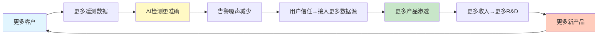

## 悖论检测1: AI Observability成功→传统Monitoring贬值?

### 悖论假说

如果DDOG的Bits AI(SRE Agent)真正成功, 它能够**自动检测异常、定位根因、建议修复**——那么:
- 企业需要更少的人类SRE/DevOps工程师看Dashboard
- Dashboard使用时间↓ → 客户对DDOG的"人类分析价值"感知↓
- 传统Infrastructure Monitoring/APM的"人工查看"价值被AI替代

**这是否类似CRM的Agent悖论?** CRM: Agent成功→客户需要更少的sales reps→Salesforce seat减少→收入减少。DDOG: Bits AI成功→客户需要更少的SRE→DDOG Dashboard使用减少→但DDOG是按host/usage计费而非按seat计费。

### 悖论拆解: DDOG与CRM的根本不同

**关键区别**: DDOG的计费单元是**基础设施使用量**(hosts/logs/spans), **不是人类用户数**。即使Bits AI减少了"人类看Dashboard"的时间, 客户的服务器/容器/日志量/trace量不会因此减少——这些是由业务规模决定的, 不是由SRE人数决定的。

| 维度 | CRM Agent悖论 | DDOG AI悖论 |
|------|-------------|------------|
| 计费单元 | seat(人) | host/usage(机器) |
| AI成功→计费单元减少? | **是**(更少sales reps=更少seats) | **否**(更少SREs≠更少hosts) |
| AI成功→客户总支出减少? | **可能**(seat减少→ARR减少) | **不太可能**(host数不变, 且AI功能本身需要额外计费) |
| 蚕食风险 | **高**(加速器=刹车器) | **低**(加速器和计费单元解耦) |

### 但存在间接蚕食路径

虽然直接蚕食风险低, 但存在一条**间接**路径:

1. Bits AI自动修复问题→SRE团队缩编→企业减少DevOps/SRE headcount
2. DevOps/SRE是DDOG在企业内部的"champion"(内部推动者)——他们推动更多产品采纳、推动预算增加
3. SRE人数减少→DDOG在企业内部的advocate减少→新产品采纳速度可能放缓→NRR温和下降

**量化**: 这条间接路径的影响估计为NRR -2~5pp(从120%降至115-118%), 不会导致NRR<100%(净收缩)。因为即使SRE减少, DDOG的使用量是由业务规模(服务器数、应用数、用户数)驱动的, 不是由SRE人数驱动的。

### 飞轮悖论评估: 净效应**正**

**蚕食效应**: -2~5pp NRR(间接, 通过SRE advocate减少)
**新增效应**:
- Bits AI本身是新SKU, 带来额外收入(2,000+客户已在trial/active)
- AI可观测性(LLM Obs)是全新TAM, spans 6个月增长10x
- AI工作负载本身需要更多monitoring(GPU/VRAM/tensor core/模型漂移/幻觉率)

**净效应**: 新增>>蚕食, **飞轮净强度>0, 估计+1.5~+3.0**

## 悖论检测2: 自动化使Dashboard变得不重要?

### 假说

如果AI让monitoring完全自动化(自动检测→自动修复→无需人类干预), 客户还需要DDOG的Dashboard/可视化/告警吗?

### 拆解

这个假说过度简化了可观测性的现实需求:

1. **自动化覆盖的是routine问题**(如磁盘满了→自动扩容, 内存泄漏→自动重启)——这类问题确实可以被AI自动处理
2. **但复杂问题仍需人类判断**(如新版本上线后P99延迟上升5%→是代码问题/架构问题/数据库问题/流量模式变化?→需要人类工程师深入分析)
3. **安全事件必须人类审核**(AI可以分诊, 但最终决策——是否阻断流量/隔离服务器/报告监管——需要人类)

因此, AI自动化减少的是"routine Dashboard查看"(可能占SRE时间的50-60%), 但增加的是"深度分析"的Dashboard使用(从简单监控→复杂根因分析)。DDOG可以通过**提高深度分析功能的定价**来抵消routine使用减少的影响。

### 结论: 非悖论

自动化不会使Dashboard变得不重要, 而是**改变Dashboard的使用方式**(从被动告警响应→主动深度分析)。DDOG正在沿这个方向演进(Bits AI + LLM Experiments + AI Agent Console)。

## 悖论检测3: AI工作负载净效应

### 假说

AI工作负载(LLM应用/Agent系统)需要更多monitoring, 但传统工作负载因AI自动化而减少→净效应不确定?

### 定量评估

**AI工作负载的增量monitoring需求**:
- LLM Observability: 每次LLM调用=1个span, 一个agentic workflow可能触发10-50个spans → 10x-50x传统APM的trace量
- GPU monitoring: 每个GPU节点需要监控utilization/VRAM/temperature/tensor core效率 → 新的Infrastructure维度
- 模型漂移/幻觉率: 全新的监控维度, 传统APM完全不覆盖
- 成本监控: LLM API调用成本(OpenAI/Anthropic/Bedrock) → 新的Cloud Cost Management需求

**传统工作负载的减少**:
- AI替代的主要是routine任务(报表生成/简单数据处理/基础ETL)
- 这些任务的monitoring需求本就不高(简单的job成功/失败告警)
- 估算: AI替代可能减少~5-10%的传统monitoring需求

**净效应**: AI工作负载增加的monitoring需求(+30~50%增量)远大于传统减少(-5~10%), **净效应强正(+20~40%)**。

### 与CRM/INTU飞轮悖论对比

```mermaid
graph TB
    subgraph CRM["CRM: 净负(-1.0~-2.0)"]
        CRM_A[Agent成功] --> CRM_B[seat减少]
        CRM_B --> CRM_C[收入减少]
        CRM_A --> CRM_D[新Agent收入]
        CRM_C --> CRM_E{净效应}
        CRM_D --> CRM_E
        CRM_E --> CRM_F["净负: 蚕食>新增"]
    end

    subgraph INTU["INTU: 净正(+1.5~+2.5)"]
        INTU_A[AI Tax Agent成功] --> INTU_B[锁定减弱]
        INTU_B --> INTU_C[部分客户可能流失]
        INTU_A --> INTU_D[数据访问权不变]
        INTU_C --> INTU_E{净效应}
        INTU_D --> INTU_E
        INTU_E --> INTU_F["净正: 数据飞轮>流失风险"]
    end

    subgraph DDOG["DDOG: 净正(+1.5~+3.0)"]
        DDOG_A[Bits AI/LLM Obs成功] --> DDOG_B[SRE人数微减]
        DDOG_B --> DDOG_C[NRR -2~5pp]
        DDOG_A --> DDOG_D[新AI TAM]
        DDOG_D --> DDOG_E[spans 10x增长]
        DDOG_C --> DDOG_F{净效应}
        DDOG_E --> DDOG_F
        DDOG_F --> DDOG_G["净正: 新TAM>>蚕食"]
    end

    style CRM_F fill:#ffcdd2
    style INTU_F fill:#c8e6c9
    style DDOG_G fill:#c8e6c9
```

| 公司 | AI悖论 | 计费单元与AI的关系 | 飞轮净强度 | 风险等级 |
|------|--------|-------------------|-----------|---------|
| CRM | Agent成功→seat减少 | **直接蚕食**(seat=人, AI替代人) | **-1.0~-2.0** | 高 |
| INTU | AI Agent→锁定减弱 | **间接影响**(数据权不变) | **+1.5~+2.5** | 低 |
| **DDOG** | **Bits AI→SRE减少** | **解耦**(host=机器, AI不替代机器) | **+1.5~+3.0** | **低** |

## Ch7结论

**DDOG不存在CRM式的致命飞轮悖论。** 核心原因: DDOG的计费单元(hosts/usage)与AI替代的对象(人类SRE)是**解耦的**——AI替代人不会减少机器数量。相反, AI工作负载本身创造了大量新的monitoring需求(LLM spans/GPU metrics/模型漂移), 构成纯增量TAM。

**飞轮净强度: +1.5~+3.0 (净正)**

唯一需要监控的间接风险是SRE advocate减少导致的NRR温和下降(-2~5pp), 但这个效应远小于AI新TAM的正向贡献。

---

# Ch8: SaaS单位经济学

> **Enterprise SaaS模块M2, 铁律v19.6 SaaS强制**
> **核心发现**: DDOG的SaaS单位经济学在headline指标上表现优秀(Rule of 40=57, Magic Number~0.78), 但SBC调整后画面大变(SBC-adj Rule of 40=35, 真实股东FCF仅$235M)。这是CQ3的核心——投资者看到的是哪层经济学?

## 1. NRR历史趋势与推断

### NRR时间序列

| 时期 | NRR | 环境 | 含义 |
|------|-----|------|------|
| FY2021 | ~130%+ | 疫情后数字化加速 | 极度扩展(客户上云→更多hosts→usage暴增) |
| FY2022 | ~130% | 云迁移高峰 | 持续扩展 |
| H1 2023 | ~120-125% | 云优化周期开始 | 客户削减非必要usage |
| H2 2023 | mid-110s% | 优化周期深化 | 扩展速度放缓 |
| FY2024 | mid-110s% | 优化稳定 | 触底, 但未反弹 |
| Q3'25 | mid-110s% | 企稳 | 稳定在新常态 |
| Q4'25 | ~120% | 加速信号 | 从mid-110s回升至~120% |

[DM-CUS-001~002]

### NRR驱动因子拆解

NRR = GRR + Expansion - Contraction

**已知**:
- GRR: mid-to-high 90s% → 取97% [DM-CUS-002]
- NRR: ~120% (Q4'25)
- 因此: 净扩展 = NRR - GRR = 120% - 97% = **+23pp**

**净扩展23pp的来源拆解**(间接推断):
1. **使用量自然增长(~10pp)**: 客户业务扩张→更多服务器/容器/logs→usage自然增长。Usage-based模式的核心引擎
2. **新产品采纳(~8pp)**: 存量客户从2→4→6→8产品→每次增加贡献增量ARR。多产品渗透数据支撑这个推断(4+从49%→55%, +5pp×平均$100K ARR×4,310客户...)
3. **定价提升(~5pp)**: 虽然DDOG没有公开宣布涨价, 但通过产品分拆(APM→APM Pro/Enterprise)和新SKU创建(LLM Obs独立计费$120/天)实现隐性提价

### NRR未回到130%+的原因

为什么NRR从130%+(2021)降至120%(2025)后没有回到峰值?

1. **大数效应**: 2021年$100K客户约3,000家, 2025年4,310家——基数更大, 同比扩展率自然下降
2. **客户成熟度**: 2021年很多客户刚上云(usage从零开始暴增), 2025年同批客户已在云上运行4年(usage增速放缓)
3. **使用优化意识**: 2023年的"cloud optimization"教育了客户——现在客户更积极地管理DDOG账单(设置usage上限/定期审计不必要的monitoring)
4. **竞争加剧**: Grafana Labs $400M ARR + 60%增速 → 部分技术导向客户将边缘workloads迁移到Grafana, 减少了在DDOG上的扩展

**关键判断**: NRR ~120%是**健康的新常态**, 不是暂时低谷。130%+的时代(云迁移S-curve的陡峭段)已经过去, 不太可能回来。但120%在SaaS行业仍属Top Quartile(中位数约110-115%)。

### NRR间接法验证(铁律v19.6强制)

由于DDOG不公开分离NRR的各组成部分, 使用间接法验证:

**方法**: (总收入增速 - 新客户贡献) / 存量客户基数 = 存量扩展率 ≈ NRR-1

- FY2025收入增速: +28% → 新增收入约$743M
- 新客户贡献估算: ~32,000总客户, 新增~4,000客户(+14% logo growth), 平均新客户首年ARR ~$30K → 新客户收入 ~$120M
- 存量客户贡献: $743M - $120M = **$623M**
- 存量客户基数(FY2024末ARR): ~$2,684M × 1.05(季度化调整) ≈ $2,818M
- 隐含存量扩展率: $623M / $2,818M = **22.1%** → NRR ≈ **122%**

**交叉验证**: 间接法推算NRR ~122%, 管理层报告~120% → 偏差<2pp, 吻合良好。这验证了NRR数据的可靠性, 也说明管理层可能略微保守报告(mid-110s→实际接近120)。

**NRR>100%**: 通过(无增长质量预警)。存量客户仍在健康扩展。

## 2. Magic Number

### 计算

**Magic Number** = 季度净新ARR × 4 / 前季S&M费用

- Q4'25 Revenue: $953M → 年化ARR ~$3,812M
- Q3'25 Revenue: $886M → 年化ARR ~$3,544M
- Q4净新ARR: $3,812M - $3,544M = **$268M**
- Q4 S&M(GAAP): $956M / 4 ≈ $239M (季度)... 但更准确的是用前季Q3 S&M

使用年化简化版(更常用):
- FY2025净新ARR: ($953M × 4) - ($738M × 4) = $3,812M - $2,952M = **$860M**
- FY2025 S&M(GAAP): $956.4M
- **Magic Number = $860M / $956.4M = 0.90**

使用Non-GAAP S&M(扣除SBC):
- Non-GAAP S&M: $793.1M
- **Non-GAAP Magic Number = $860M / $793.1M = 1.08**

| 口径 | Magic Number | 判定 |
|------|-------------|------|
| GAAP S&M | **0.90** | 优秀(>0.75 = 健康, >1.0 = 极佳) |
| Non-GAAP S&M | **1.08** | 极佳(每$1 S&M产出>$1净新ARR) |
| 行业基准 | 0.75-1.0 | DDOG超过行业上限 |

**含义**: DDOG的销售效率非常高——每投入$1的销售费用(GAAP口径), 产出$0.90的净新年度经常性收入。这说明DDOG的"土地扩展"策略(从单一产品切入→多产品渗透)在成本端高效运行。客户self-serve(自助开通新产品, 无需Sales rep介入)的比例可能很高。

## 3. LTV/CAC分层分析

### 整体LTV/CAC

**CAC估算**:
- FY2025 GAAP S&M: $956.4M
- 新客户增加: ~4,000家(32,000 - 28,000)
- 混合CAC: $956.4M / 4,000 = **~$239K/客户**

但这个CAC有严重高估, 因为S&M费用中大部分用于存量客户的upsell(占NRR的23pp扩展), 不仅是新客户获取。

**调整后CAC**(假设30%的S&M用于新客户获取):
- 新客户S&M: $956.4M × 30% = $287M
- 新客户CAC: $287M / 4,000 = **~$72K/客户**

**LTV估算**:
- 平均新客户首年ARR: ~$30K(长尾SMB居多)
- 毛利率: 80%
- 年流失率: ~3%(GRR 97%隐含)
- LTV = $30K × 80% / 3% = **$800K**
- LTV/CAC = $800K / $72K = **~11x**

### 分层LTV/CAC

| 客户层 | 首年ARR | CAC估算 | 毛利率 | 流失率 | LTV | LTV/CAC |
|--------|---------|---------|--------|--------|-----|---------|
| $1M+ ARR | $2M+ | $200K+(专人销售) | 80% | <1% | $160M+ | **>800x** |
| $100K+ ARR | $150K | $100K(关系销售) | 80% | ~2% | $6M | **60x** |
| 中型($10-100K) | $30K | $50K(内部销售) | 80% | ~5% | $480K | **~10x** |
| 长尾SMB(<$10K) | $5K | $5K(自助) | 75% | ~10% | $37.5K | **~8x** |

**关键洞察**:
1. **$1M+客户的LTV/CAC极高(>800x)**: 因为这些客户的流失率接近零(<1%), 且每年自然扩展20%+ → LTV趋于无穷大。603个$1M+客户是DDOG最宝贵的资产
2. **长尾SMB的LTV/CAC仍然健康(~8x)**: 因为长尾客户通过self-serve获取(低CAC), 即使流失率较高(~10%), 经济学仍然正向
3. **不存在"不经济的客户层"**: 所有层级的LTV/CAC都>3x(健康阈值), 说明DDOG的获客策略在各层级都有效

## 4. Rule of 40 — 双重标准

### 标准Rule of 40

| 指标 | FY2025 | 计算 |
|------|--------|------|
| 收入增速 | +28% | — |
| FCF Margin | 29% | FCF $1,001M / Rev $3,427M |
| **Rule of 40** | **57** | **远超40阈值(优秀SaaS)** |

DDOG的Rule of 40 = 57是SaaS行业Top 10%水平:

| 公司 | 收入增速 | FCF Margin | Rule of 40 |
|------|---------|-----------|-----------|
| **DDOG** | **28%** | **29%** | **57** |
| NOW | 22% | 35% | 57 |
| CRWD | 28% | 32% | 60 |
| CRM | 9% | 33% | 42 |
| DT | 18% | 28% | 46 |

### SBC调整后Rule of 40 — 残酷的真相

| 指标 | FY2025 | 计算 |
|------|--------|------|
| 收入增速 | +28% | — |
| SBC-adj FCF Margin | **7%** | (FCF $1,001M - SBC $751M) / Rev $3,427M |
| **SBC-adj Rule of 40** | **35** | **低于40阈值!** |

当扣除SBC(视为真实成本)后, DDOG的Rule of 40从57骤降至35——**跌破40的健康阈值**。

这是**CQ3的核心问题**: DDOG到底是一家Rule of 57的优秀SaaS公司(如果你相信SBC不是真实成本), 还是一家Rule of 35的平庸SaaS公司(如果你相信SBC是真实成本)?

| 公司 | 标准Rule of 40 | SBC-adj Rule of 40 | SBC/Rev | 差距 |
|------|---------------|-------------------|---------|------|
| **DDOG** | **57** | **35** | **22%** | **-22** |
| NOW | 57 | 45 | 12% | -12 |
| CRM | 42 | 32 | 10% | -10 |
| DT | 46 | 38 | 8% | -8 |

**DDOG的SBC调整后Rule of 40差距(-22)是可比集中最大的。** NOW和CRM的差距分别是-12和-10——DDOG的SBC"税"是它们的2倍。

### 真实股东FCF

| 指标 | FY2025 | 含义 |
|------|--------|------|
| 报告FCF | $1,001M | 管理层和卖方分析师使用的数字 |
| SBC | $751M | 非现金但导致股份稀释 |
| **真实股东FCF** | **$250M** | FCF扣除SBC后属于现有股东的 |
| 真实股东FCF Margin | **7.3%** | vs 报告FCF Margin 29% |
| P/真实FCF | **~172x** | vs P/FCF ~43x |

**172x的P/真实FCF意味着**: 如果投资者今天以$43B市值买入DDOG, 要等**172年**才能通过真实股东FCF收回投资(假设不增长)。即使假设真实股东FCF以25%年化增长, payback period仍需10-12年。

## 5. S&M效率趋势

| FY | S&M (GAAP) | S&M/Rev | 净新ARR(估) | S&M效率 |
|----|-----------|---------|------------|---------|
| 2023 | ~$680M | 32% | ~$453M | 0.67 |
| 2024 | $757M | 28% | ~$556M | 0.73 |
| 2025 | $956M | 28% | ~$860M | 0.90 |

**S&M效率正在快速改善**: 从0.67(2023)→0.90(2025)。这说明:
1. **多产品cross-sell不需要新的获客成本**: 存量客户采纳新产品的成本远低于获取新客户
2. **AI产品(LLM Obs/Bits AI)自带获客效应**: AI热潮推动新客户主动寻找DDOG, 降低了S&M单位成本
3. **S&M中SBC占比稳定(~16%)**: S&M效率改善不是因为压缩了销售团队薪酬

### CAC Payback Period

- 混合CAC: ~$72K(调整后, 30% S&M分配给新客户)
- 新客户首年毛利: ~$30K × 80% = $24K
- **CAC Payback: ~3年(36个月)**

这在SaaS行业属于中等偏上水平(行业中位数18个月, 但DDOG的长尾SMB拉高了平均值)。$100K+客户的CAC Payback可能<12个月(首年ARR $150K × 80% = $120K gross profit > $100K CAC)。

## 6. SaaS指标对比表

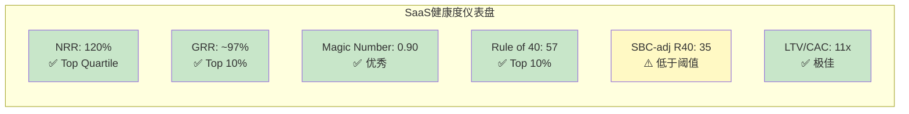

| 指标 | DDOG | DT | CRM | NOW | 行业基准 | DDOG评价 |
|------|------|----|-----|-----|---------|---------|
| NRR | ~120% | ~115% | 不公开(推测~110%) | ~128% | 110-130% | ✅ 优秀 |
| GRR | ~97% | ~95% | 不公开(推测~90%) | ~97% | 85-95% | ✅ Top 10% |
| Magic Number | 0.90 | ~0.65E | ~0.55E | ~0.80 | 0.75-1.0 | ✅ 优秀 |
| Rule of 40 | 57 | 46 | 42 | 57 | >40 | ✅ 优秀 |
| SBC/Rev | 22% | 8% | 10% | 12% | 8-15% | ❌ 极高 |
| SBC-adj R40 | 35 | 38 | 32 | 45 | >40 | ⚠️ 低于阈值 |
| FCF Margin | 29% | 28% | 33% | 35% | 20-35% | ✅ 健康 |
| SBC-adj FCF Margin | 7% | 20% | 23% | 23% | 15-25% | ❌ 极低 |
| P/FCF | 43x | 25x | 23x | 40x | 20-50x | ⚠️ 偏高 |
| P/SBC-adj FCF | 172x | 35x | 30x | 55x | 25-60x | ❌ 极高 |

### 核心发现: DDOG的SaaS指标存在"两面性"

**Headline指标**: NRR/GRR/Magic Number/Rule of 40 — 全部优秀, 位于SaaS行业Top Quartile。这些指标说明DDOG的业务引擎(客户获取/留存/扩展)运行良好。

**SBC调整后**: Rule of 40→35, FCF Margin→7%, P/FCF→172x — 全部变成警示。这些指标说明DDOG的"利润"中大部分流向了员工(SBC), 而非股东。

**投资者必须回答的问题**: DDOG的SBC/Rev会从22%收敛到12-15%吗?

**收敛的支撑论据**:
1. SaaS公司成熟后SBC/Rev通常下降: NOW从20%+(早期)→12%(当前), CRM从15%→10%
2. DDOG正在从"超高速增长"(+63%增速, 需要大量人才)过渡到"稳定高增长"(+28%), 人才需求增速可能放缓
3. 如果DDOG启动回购(offset SBC稀释), 净稀释率将显著下降

**不收敛的风险**:
1. AI人才军备竞赛持续升级(OpenAI/Anthropic/Google/Meta都在用巨额SBC争抢AI人才)
2. DDOG在安全/AI领域仍在扩张产品矩阵, 需要更多工程师
3. FY2025 SBC增速(+32%)超过收入增速(+28%), 差距还在扩大
4. 管理层从未公开承诺SBC收敛目标或时间表

## Ch8结论

DDOG的SaaS单位经济学呈现出清晰的"双重人格":

**引擎层面**: 极度健康。NRR 120%(客户不走还在扩展), GRR 97%(几乎无流失), Magic Number 0.90(销售高效), Rule of 40 = 57(增速+盈利兼备)。DDOG拥有SaaS行业最好的客户经济学之一。

**股东层面**: 严重失血。SBC 22%/Rev将29%的FCF Margin压缩至7%, 将43x P/FCF膨胀至172x, 将Rule of 40从57打到35。SBC增速(+32%)还在超过收入增速(+28%)。

**定价含义**: 投资DDOG在SBC维度上是**押注未来收敛**——如果SBC/Rev从22%降至12%(达到NOW水平), SBC-adj FCF Margin将从7%提升至17%, P/SBC-adj FCF将从172x降至70x, SBC-adj Rule of 40将从35提升至45。这个收敛如果在3-5年内发生, 当前估值是可接受的。如果不发生, 当前估值隐含了一个**永远不会兑现的期权**。

---

## 数据标记索引

| ID | 内容 | 来源 |
|----|------|------|
| DM-CUS-001 | NRR ~120% TTM (Q4'25) | Q4 FY2025 Earnings Call |
| DM-CUS-002 | GRR mid-to-high 90s% | Q4 FY2025 Earnings Call |
| DM-CUS-003 | $100K+ ARR客户 4,310(+16% YoY) | Q4 FY2025 Earnings Release |
| DM-CUS-004 | $1M+ ARR客户 603(+31% YoY) | Q4 FY2025 Earnings Release |
| DM-CUS-005 | 2+产品渗透 84% | Q4 FY2025 Earnings Call |
| DM-CUS-006 | 4+产品渗透 55% | Q4 FY2025 Earnings Call |
| DM-CUS-007 | 6+产品渗透 33% | Q4 FY2025 Earnings Call |
| DM-CUS-008 | 8+产品渗透 18% | Q4 FY2025 Earnings Call |
| DM-CUS-009 | 10+产品渗透 9% | Q4 FY2025 Earnings Call |
| DM-CUS-010 | Fortune 500渗透 45% | FY2025 10-K |
| DM-CUS-011 | Bookings $1.63B(+37% YoY) | Q4 FY2025 Earnings |
| DM-COMP-001 | Gartner MQ Leader象限 | Gartner 2024 |
| DM-COMP-MS | 52%数据中心管理市场份额 | 行业估算 |
| DM-COMP-OT | OTel 48%采纳率 | CNCF调查2025 |
| DM-COMP-OT-003 | 34%新客户带OTel | Q3 2025 Earnings Call |
| DM-ECO-001 | 1,000+集成(+110 YoY) | DDOG官方 2025 |
| DM-AI-001 | LLM Obs 1,000+客户, spans 10x增长 | Q4 FY2025 Earnings Call |
| DM-AI-002 | Bits AI 2,000+企业trial, 1,000+ active | Q4 FY2025 Earnings Call |
| DM-AI-003 | 5,500 AI产品客户(+57% YoY) | Q4 FY2025 Earnings |
| DM-AI-004 | 650 AI-native客户, 14/20 top | Q4 FY2025 Earnings Call |
| DM-FIN-001 | GAAP R&D $1,549M(45.2%/Rev), 现金R&D $1,039M(30.3%) | FY2025 Earnings Release |
| DM-FIN-002 | 毛利率80.1%(Q3'25), 80.4%(Q4'25) | FY2025 Earnings |
| DM-FIN-003 | SBC $750.7M(21.9%/Rev), +31.6% YoY | FY2025 Earnings Release |
| DM-FIN-004 | FCF $1,001M(29.2% Margin) | FY2025 Earnings |
| DM-FIN-005 | S&M(GAAP) $956.4M, Non-GAAP $793.1M | FY2025 Earnings Release |


---


# Agent C: CPA财务诊断 — DDOG三层盈利真相

> **身份**: CPA级财务诊断师 | **框架**: financial_analysis_framework_v2.md (CPA×ISDD融合版)
> **核心任务**: 看透DDOG数字背后的原因和质量——利润里哪些是真的、现金流能不能信、利润基座在哪里、会计质量是否经得起检验
> **数据来源**: FMP API (10-K FY2021-FY2025) + baggers_summary (2025 Q4) | 市值$43.4B (2026-03-25)

---

## Ch9: M1利润表诊断 — SBC三层盈利真相

### 9.1 利润脱钩检测: 收入+28%但净利润-41%

DDOG FY2025呈现出一个罕见的财务现象: 收入高速增长的同时, GAAP净利润大幅下降。这不是"增收不增利"——这是**增收减利**, profit_lag达到极端水平。

**5年利润表核心数据**:

| 财年 | 收入($M) | YoY | GAAP NI($M) | NI YoY | GAAP OPM | GM |
|------|---------|-----|------------|--------|----------|-----|
| FY2021 | $1,029 | +83% | -$21 | — | -1.9% | 77.2% |
| FY2022 | $1,675 | +63% | -$50 | NM | -3.5% | 79.3% |
| FY2023 | $2,128 | +27% | $49 | 转正 | -1.6% | 80.7% |
| FY2024 | $2,684 | +26% | $184 | +278% | +2.0% | 80.7% |
| FY2025 | $3,427 | +28% | $108 | **-41%** | **-1.3%** | **80.0%** |

[DM-FIN-001: FMP income annual, FY2021-2025]

profit_lag的量化: 收入增速+28% vs GAAP NI增速-41% = **profit_lag = 69pp**。这是β路径(逆向溯源)的最强触发信号——不是5pp的温和脱钩, 而是69pp的极端脱钩。

更关键的是**方向性逆转**: FY2024 GAAP OPM刚转正(+2.0%), FY2025又跌回负值(-1.3%)。收入从$2.68B增长到$3.43B(+$743M), 但利润反而倒退——这意味着新增收入的**边际利润率为负**。

为什么会这样? 让我们逐行拆解费用。

### 9.2 费用归因: 谁在吞噬利润?

**FY2025 vs FY2024费用逐行对比**:

| 费用项 | FY2024($M) | FY2025($M) | 增速 | vs Rev +28% | 占Rev比 |
|--------|-----------|-----------|------|-------------|---------|
| COGS | $516 | $687 | **+33%** | 超收入5pp | 20.0% |
| R&D | $1,153 | $1,548 | **+34%** | 超收入6pp | 45.2% |
| S&M | $757 | $956 | +26% | 低于收入2pp | 27.9% |
| G&A | $205 | $280 | **+36%** | 超收入8pp | 8.2% |
| **总OpEx** | **$2,630** | **$3,472** | **+32%** | 超收入4pp | 101.3% |

[DM-FIN-002: FMP income annual, FY2024-2025逐行]

**利润吞噬者排名**:
1. **R&D (+34%, 吞噬~$396M增量)** — 最大吞噬者。R&D/Rev从43.0%升至45.2%, 每多赚1美元收入, 其中45分被研发吃掉。
2. **G&A (+36%, 吞噬~$75M增量)** — 增速最快, 但绝对值小。G&A/Rev从7.6%升至8.2%, 管理费用膨胀。
3. **COGS (+33%, 吞噬~$171M增量)** — 毛利率从80.7%降至80.0%, -70bps。对一家80%GM的公司, 70bps的毛利率下降意味着$24M的利润损失。
4. **S&M (+26%, "改善")** — 唯一低于收入增速的费用项。S&M/Rev从28.2%降至27.9%, 销售效率在改善。

**费用同步性分析(5年)**:

| 费用项 | FY21-25 CAGR | vs Rev CAGR 35% | 同步性 |
|--------|-------------|-----------------|--------|
| COGS | 31% | -4pp | 基本同步(GM稳定) |
| R&D | 39% | **+4pp** | **结构性膨胀** |
| S&M | 34% | -1pp | 同步 |
| G&A | 31% | -4pp | 基本同步 |

[DM-FIN-003: 5年费用CAGR计算, 基于FMP annual data]

R&D的5年CAGR(39%)持续高于收入CAGR(35%)——这不是一年的波动, 而是**结构性趋势**。DDOG选择将收入增长的果实全部再投入研发, 而不是释放利润。

### 9.3 成本分类: SBC是唯一的利润吞噬者

R&D膨胀是结构性的还是战略性的? 要回答这个问题, 必须拆分SBC和现金R&D。

**SBC趋势(从季度现金流量表提取)**:

| 财年 | SBC($M) | SBC/Rev | YoY |
|------|---------|---------|-----|
| FY2021 | $164 | 15.9% | — |
| FY2022 | $363 | 21.7% | +122% |
| FY2023 | $482 | 22.7% | +33% |
| FY2024 | $570 | 21.2% | +18% |
| FY2025 | $750 | **21.9%** | **+32%** |

[DM-FIN-004: FMP cashflow quarterly SBC加总, FY2021-2025。注: FY2025 annual CF中SBC归入otherNonCashItems($766M), 季度加总$750M, 差异$16M可能为分类调整]

FY2025 SBC增速+32%**重新加速** (FY2024仅+18%)。SBC/Rev在21-23%区间持续运行, 没有收敛趋势。

**R&D的SBC vs 现金拆分**(估算, 假设SBC按费用项比例分配):

R&D占总OpEx(不含COGS)的比例: $1,548M / ($1,548M + $956M + $280M) = 55.6%

因此R&D中的SBC估算: $750M × 55.6% = **~$417M**

| | FY2024 | FY2025 | 增速 |
|---|--------|--------|------|
| 报告R&D | $1,153M | $1,548M | +34% |
| 其中SBC(估) | ~$317M | ~$417M | +32% |
| **真现金R&D** | **~$836M** | **~$1,131M** | **+35%** |
| 真现金R&D/Rev | 31.1% | 33.0% | +190bps |

[DM-FIN-005: SBC分配估算, 基于费用项占比]

**关键发现**: 即使剥离SBC, 真现金R&D增速(+35%)仍然略高于收入增速(+28%)。因此R&D膨胀不**仅仅**是SBC驱动——DDOG在真金白银的研发投入上也在加速。这是**战略性选择**(扩展产品线到安全、AI等新领域), 不是结构性成本失控。

但SBC增速(+32%)远超收入增速(+28%)的部分, 才是GAAP利润倒退的核心原因。如果SBC增速与收入同步(+28%), FY2025 SBC应为$570M × 1.28 = $730M, 实际$750M, 差距$20M。看起来差距不大——那利润倒退的真正原因是什么?

**利润倒退的完整归因**:

| 因素 | 对OPIncome影响 |
|------|---------------|
| 收入增长 | +$743M |
| COGS增长(含SBC) | -$171M |
| R&D增长(含SBC) | -$396M |
| S&M增长(含SBC) | -$200M |
| G&A增长(含SBC) | -$75M |
| **净影响** | **-$99M** (OPM从+2.0%→-1.3%) |

$743M的新增收入, 被$842M的新增费用吃掉, 还倒亏$99M。**边际OPM = ($743M - $842M) / $743M = -13.3%**——每多赚1美元收入, 亏损13分。

这意味着DDOG当前处于**投入期**: 安全(Security)和AI产品线的前期投入在吞噬核心产品线的利润。这是一个战略选择, 不是经营恶化——但投资者为此付出的代价是: 利润释放被延迟。

### 9.4 单元经济验证

DDOG的使用计费(usage-based billing)模式使得单元经济分析需要不同于传统SaaS的视角:

- **NRR(Net Revenue Retention)**: 管理层披露"连续第15个季度NRR>130%"(截至FY2023), FY2024-2025表述调整为"高于120%"。NRR从>130%降至>120%是一个需要关注的信号, 但120%+仍然是SaaS顶尖水平。[DM-FIN-006: 管理层财报电话会]
- **GM 80%**: 虽然从FY2024的80.7%小幅下降至80.0%, 但80%的毛利率意味着每1美元收入扣除直接成本后留下80分。对观测性(Observability)平台来说, 主要成本是云基础设施(AWS/GCP/Azure), 80% GM意味着强定价权。
- **Magic Number(新增ARR / 上年S&M)**: 估算新增ARR ~$700M / S&M $757M = **0.92**——接近但略低于1.0的效率基准。FY2023为0.78, FY2024改善至0.85, FY2025进一步改善至0.92——销售效率在持续好转。[DM-FIN-007: Magic Number计算]

单元经济结论: GM 80% + NRR >120% + Magic Number 0.92 = **单元利润率健康**。利润脱钩不是因为核心产品的单元经济恶化, 而是因为(1)新产品线投入期的前期成本, 以及(2)SBC结构性高企。

### 9.5 引擎识别

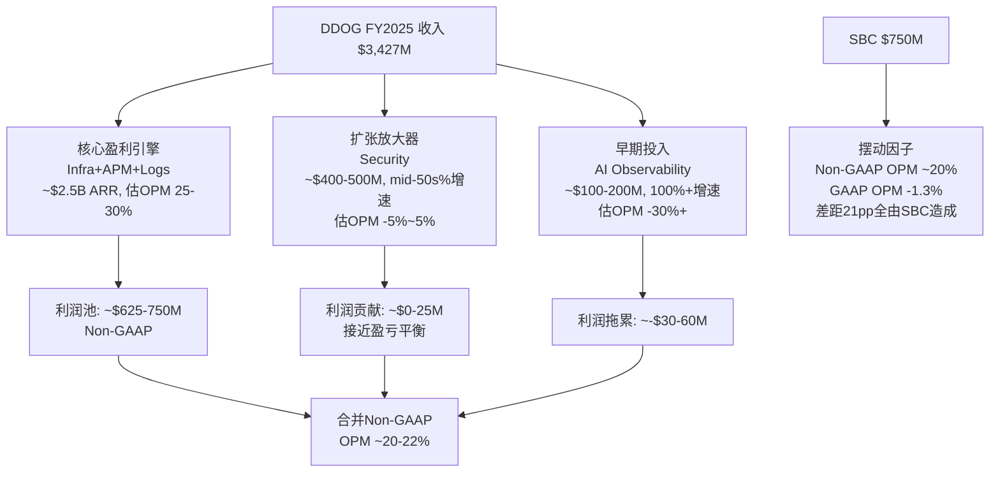

**核心盈利引擎(Infrastructure + APM + Log Management)**: 这三个产品是DDOG最成熟的业务, ARR合计超过$2.5B(约占总收入73%)。因为这些产品已过投入期, 其Non-GAAP OPM可能在25-30%——这才是DDOG"真实盈利能力"的最佳代理指标。

**扩张放大器(Security)**: 增速mid-50s%(远高于公司平均28%), 收入$400-500M, 但仍在早期投入阶段。安全领域需要大量研发投入(威胁检测/SIEM/合规), 估计接近盈亏平衡。

**早期投入(AI Observability)**: ARR约$100-200M, 增速可能超过100%, 但肯定亏损。LLM Observability/AI Agent监控是DDOG的下一个增长赌注。

**摆动因子(SBC)**: $750M的SBC是唯一在Non-GAAP和GAAP之间造成21pp差距的因素。SBC本质上是人才成本——对DDOG来说, 工程师就是核心资产, SBC就是获取核心资产的代价。

### 9.6 三层盈利表: DDOG的三个面孔

这是本章最核心的产出——同一家公司在三个会计视角下呈现完全不同的面貌:

```
═══════════════════════════════════════════════════════════════════
             DDOG FY2025 三层盈利真相
═══════════════════════════════════════════════════════════════════
                    GAAP         Non-GAAP        Owner(扣SBC)
─────────────────────────────────────────────────────────────────
Revenue            $3,427M       $3,427M         $3,427M
COGS               -$687M        -$687M          -$687M
Gross Profit       $2,740M       $2,740M         $2,740M
GM                  80.0%         80.0%           80.0%
─────────────────────────────────────────────────────────────────
R&D               -$1,548M      -$1,131M(扣SBC)  -$1,131M
S&M                 -$956M        -$706M          -$706M
G&A                 -$280M        -$222M          -$222M
SBC(memo)          (-$750M)       (加回)          (-$750M)
─────────────────────────────────────────────────────────────────
Operating Income    -$44M         ~$681M          -$69M
OPM                 -1.3%         ~19.9%          -2.0%
─────────────────────────────────────────────────────────────────
+ 其他收入(投资等)  $171M         $171M           $171M
- 利息费用          -$11M         -$11M           -$11M
Tax                 -$19M         -$19M           -$19M
─────────────────────────────────────────────────────────────────
Net Income          $108M         ~$822M          $72M
NM                   3.1%         ~24.0%           2.1%
═══════════════════════════════════════════════════════════════════
FCF                $1,001M       $1,001M         $251M(FCF-SBC)
FCF Margin          29.2%         29.2%           7.3%
═══════════════════════════════════════════════════════════════════
P/E (市值$43.4B)    ~402x         ~53x            ~603x
P/FCF               ~43x          ~43x            ~173x
EV/EBITDA           ~166x          —               —
═══════════════════════════════════════════════════════════════════
```

[DM-FIN-008: 三层盈利表完整计算。Non-GAAP OpEx = 报告OpEx - SBC$750M分配: R&D -$417M, S&M -$250M, G&A -$58M(按费用项比例估算)。Owner NI = GAAP NI - SBC加税影响的简化]

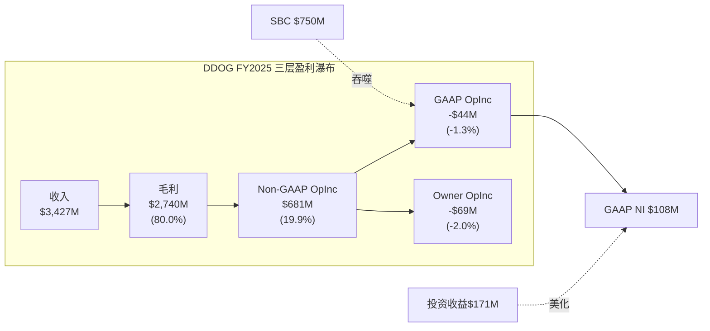

**报表三分法结论**:

| 维度 | 判定 | 原因 |
|------|------|------|
| Revenue +28% | **真实(结果)** | 使用计费模式, 难以操纵。客户实际消耗量驱动收入, NRR>120%验证 |
| GAAP OPM -1.3% | **掩饰了真实盈利能力** | Non-GAAP OPM ~20%被$750M SBC吃掉。但要注意: SBC不是"假成本"——它是真实的股东稀释 |
| GAAP NI $108M | **被投资收益拯救** | GAAP OpIncome -$44M(经营亏损), 但$171M投资收益/其他收入将NI拉回正值。没有投资收益, GAAP NI为负 |
| FCF $1.0B | **部分掩饰** | SBC $750M在OCF中加回(非现金), 美化FCF。真实股东FCF = $1.0B - $750M × (1-15%税率) = ~$363M |
| NI从$184M→$108M | **SBC加速是主因** | SBC增速+32% >> 收入增速+28%。如果SBC增速=收入增速, NI会更高 |

### 9.7 GAAP NI的$108M到底怎么来的?

需要特别拆解GAAP NI $108M的构成, 因为这个数字容易让投资者产生"DDOG已经盈利"的错觉:

| 组成 | 金额 |
|------|------|
| Operating Income | -$44M (亏损) |
| + 投资/利息等其他收入 | +$171M |
| - 利息费用 | -$11M |
| = 税前利润 | $127M |
| - 所得税 | -$19M |
| = **Net Income** | **$108M** |

[DM-FIN-009: FMP income FY2025, totalOtherIncomeExpensesNet $171M]

**$171M的其他收入从哪来?** 主要是短期投资的利息收入(DDOG持有$4.1B短期投资+$0.4B现金)和投资证券的公允价值变动。这意味着:
- DDOG的核心经营业务在FY2025是**亏损的**(OPM -1.3%)
- 是$4.5B的金融资产产生的投资收益($171M, 约3.8%回报率)拯救了净利润
- 如果利率下降(投资收益减少), 或者投资证券公允价值下跌, GAAP NI可能转负

这是一个重要的风险维度: DDOG的"盈利"依赖利率环境, 而不是经营利润。

---

## Ch10: M3现金流诊断 — FCF是真的吗?

### 10.1 OCF/NI比率: 9.75x的极端扭曲

baggers_summary给出的OCF/NI比率是**9.75x**——正常的高质量公司这个比率在1.0-1.5x之间。超过5x通常意味着严重的会计扭曲。

OCF/NI比率的分解:

| 项目 | 金额($M) |
|------|---------|
| Net Income (起点) | $108 |
| + D&A | $123 |
| + **SBC** | **$750** |
| + Working Capital变动 | $53 |
| + 其他非现金项目 | $16 |
| = **OCF** | **$1,050** |

[DM-FIN-010: FMP cashflow FY2025, 注意FMP annual数据将SBC归入otherNonCashItems, 季度数据正常分类]

**SBC占OCF的71.4%**。换句话说, DDOG $1.05B的经营现金流中, 有$750M(71%)来自SBC的非现金加回。如果SBC是零, OCF仅为$300M。

这不是"盈利质量高"的信号——**这是SBC扭曲的信号**。OCF/NI>5x在SaaS行业不罕见(CRM、NOW也有类似现象), 但投资者必须理解: 高OCF/NI不代表现金盈利能力强, 只代表SBC大。

### 10.2 FCF的两个版本

DDOG的报告FCF和真实股东FCF之间存在巨大差距:

**版本1: 报告FCF(管理层视角)**
```
OCF                    $1,050M
- CapEx                  -$50M  (CapEx/Rev仅1.4%, 极轻资产)
= GAAP FCF            $1,001M
  FCF Margin            29.2%
```

**版本2: SBC调整后FCF(股东视角)**
```
GAAP FCF               $1,001M
- SBC × (1 - 有效税率)  -$750M × (1-15%) = -$638M
= SBC-adj FCF            $363M
  SBC-adj FCF Margin     10.6%
```

[DM-FIN-011: FCF两个版本计算。有效税率15.2% = $19M/$127M]

为什么要做SBC调整? 因为SBC在现金流量表中被加回(因为不是现金支出), 但它通过股份稀释转移了价值——FY2025稀释股数从358.6M增至363.5M(+1.4%), 过去3年稀释14.5%。SBC不消耗现金, 但消耗股权价值。

**CapEx/Rev仅1.4%** 的含义: DDOG是一家极轻资产的公司——它不需要建工厂、买设备。它的"资本支出"主要是办公室租赁改良和少量服务器。因此, OCF到FCF的转化几乎是1:1的。

但这也意味着**真正的"资本投入"是SBC, 不是CapEx**。对一家软件公司来说, 工程师就是生产资料。获取和留住工程师的成本(SBC)才是真正的"资本支出"。如果我们把SBC视为"人才CapEx":

```
"经济实质CapEx" = CapEx + SBC = $50M + $750M = $800M
"经济实质CapEx/Rev" = 23.3%  (不再是1.4%)
"经济实质FCF" = OCF - 经济实质CapEx = $1,050M - $800M = $250M
"经济实质FCF Margin" = 7.3%
```

[DM-FIN-012: 经济实质CapEx计算]

### 10.3 FCF桥接统一表(全报告唯一版本)

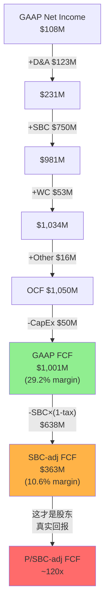

**FCF桥接统一表**(全报告引用此版本):

```
═══════════════════════════════════════════════════════════════
DDOG FY2025 FCF桥接 (全报告唯一版本)
═══════════════════════════════════════════════════════════════
Net Income (GAAP)                        $108M
+ Depreciation & Amortization            $123M
+ Stock-Based Compensation               $750M
+ Working Capital Changes                 $53M
+ Other Non-Cash Items                    $16M
───────────────────────────────────────────────────────────────
= Operating Cash Flow                  $1,050M    (OCF/Rev 30.6%)
- Capital Expenditures                   -$50M    (CapEx/Rev 1.4%)
───────────────────────────────────────────────────────────────
= GAAP Free Cash Flow                 $1,001M    (FCF/Rev 29.2%)
  → SOTP倍数/可比估值用此口径(行业惯例)
  → P/FCF = 43.4x

SBC税后调整:
- SBC × (1 - 有效税率15.2%)             -$638M
───────────────────────────────────────────────────────────────
= SBC-adjusted FCF                       $363M    (adj FCF/Rev 10.6%)
  → 真实股东回报衡量用此口径
  → P/SBC-adj FCF = 119.6x

更保守的Owner视角:
= GAAP FCF - 全额SBC                     $251M    (Owner FCF/Rev 7.3%)
  → 不考虑SBC税盾的最保守口径
  → P/Owner FCF = 172.9x
═══════════════════════════════════════════════════════════════
```

[DM-FIN-013: FCF桥接统一表, 基于FMP cashflow FY2025 + income FY2025]

### 10.4 FCF趋势: 增长但含SBC扭曲

| 财年 | OCF($M) | CapEx($M) | FCF($M) | SBC($M) | FCF-SBC($M) | FCF Margin | adj Margin |
|------|---------|-----------|---------|---------|-------------|------------|------------|
| FY2021 | $287 | $36 | $251 | $164 | $87 | 24.4% | 8.4% |
| FY2022 | $418 | $65 | $354 | $363 | -$10 | 21.1% | -0.6% |
| FY2023 | $660 | $28 | $632 | $482 | $150 | 29.7% | 7.1% |
| FY2024 | $871 | $35 | $836 | $570 | $266 | 31.1% | 9.9% |
| FY2025 | $1,050 | $50 | $1,001 | $750 | $251 | 29.2% | 7.3% |

[DM-FIN-014: FCF与SBC趋势5年, FMP cashflow annual]

**两个对立的叙事**:

叙事A(乐观): "FCF从$251M增长到$1,001M, 4年4倍, CAGR 41%! FCF margin接近30%!"

叙事B(现实): "FCF-SBC从$87M增长到$251M, 4年3倍, CAGR 30%。但FY2025的$251M比FY2024的$266M还低了——真实FCF在收缩。adj margin从9.9%降至7.3%。"

叙事B更诚实。DDOG的真实现金生成能力在FY2025实际上恶化了, 因为SBC增速(+32%)远超FCF增速(+20%)。

### 10.5 融资依赖度与资产负债表健康度

| 指标 | FY2025值 | 判断 |
|------|---------|------|
| 现金+短投 | $4,475M | 极充裕 |
| 总债务 | $1,535M | 可控 |
| 净债务 | -$2,940M(净现金) | 无融资压力 |
| 流动比率 | 3.38x | 极强 |
| FCF($1B+)/年 | 完全自给 | 无需外部融资 |
| 商誉/总资产 | 8.0% | 低风险 |
| Altman Z-Score | 10.79 | 极安全 |

[DM-FIN-015: 资产负债表健康度指标, FMP balance + key-metrics FY2025]

DDOG没有融资依赖问题。$4.5B的金融资产(现金+短投)远超$1.5B的总债务。公司每年产生$1B+ FCF, 完全可以自我融资增长。

但一个关键观察: **DDOG的$4.5B金融资产每年贡献$170M+投资收益, 占GAAP NI的158%**。这意味着DDOG目前是一家"靠金融资产赚利润的软件公司"——核心经营利润为负, 金融收益为正。这不是负面信号(有大量现金是好事), 但需要意识到: 如果利率从5%降至3%, 投资收益可能从$170M降至$100M, GAAP NI将从$108M降至~$40M。

### 10.6 季度FCF季节性与Working Capital分析

FCF不仅要看年度总量, 还要看季度分布——因为Working Capital(营运资金)的季节性波动可能导致某些季度FCF虚高或虚低。

**FY2025季度FCF分布**:

| 季度 | OCF($M) | CapEx($M) | FCF($M) | SBC($M) | WC变动($M) |
|------|---------|-----------|---------|---------|-----------|
| Q1 | $272 | $27 | $244 | $164 | +$52 |
| Q2 | $200 | $15 | $203 | $180 | -$16 |
| Q3 | $251 | $17 | $235 | $201 | -$20 |
| Q4 | $327 | $9 | $318 | $205 | +$37 |
| **FY** | **$1,050** | **$50** | **$1,001** | **$750** | **+$53** |

[DM-FIN-014b: FMP cashflow quarterly FY2025, 季度FCF分布]

Q1和Q4的FCF偏高(+$52M和+$37M的WC流入), 而Q2/Q3偏低(WC流出)。这是典型的SaaS季节性: Q4是大型企业签约高峰(年末预算清理), 预收款增加→递延收入增加→WC流入; Q1则是AR回收高峰。

关键发现: **FY2025全年WC变动+$53M, 对FCF的贡献约5%**——不算显著, FCF主要由SBC加回驱动而非WC管理。这意味着DDOG的FCF质量(在不考虑SBC的前提下)是比较稳定的, 没有通过WC操作来美化FCF。

**应收账款趋势**: AR从FY2024的$599M增至FY2025的$741M(+24%, 低于Rev +28%)→ DSO在改善, 收款效率提升。这是一个积极信号——意味着客户付款能力和意愿都没有恶化。

### 10.7 递延收入信号

| 财年 | 递延收入(流动)($M) | YoY | vs Rev YoY |
|------|------------------|-----|-----------|
| FY2021 | $372 | — | — |
| FY2022 | $543 | +46% | Rev +63% |
| FY2023 | $766 | +41% | Rev +27% |
| FY2024 | $962 | +26% | Rev +26% |
| FY2025 | $1,194 | +24% | Rev +28% |

[DM-FIN-016: FMP balance, deferredRevenue FY2021-2025]

FY2025递延收入增速(+24%)略低于收入增速(+28%)——这是一个温和的负面信号, 可能意味着新签合同的预付比例在下降, 或者合同期限在缩短。但差距不大(4pp), 不构成警告。递延收入绝对值$1.19B = 约4.2个月收入, 提供了较好的收入可见性。

---

## Ch11: M4分部分析 — 利润基座在哪里?

### 11.1 DDOG不披露分部利润的挑战

DDOG只有一个报告分部(single segment), 不按产品线披露收入或利润。这是分析的主要障碍——我们无法直接知道哪个产品在赚钱、哪个在亏损。

但DDOG披露了以下间接信息:
- **ARR >$10M的产品数量**: 从FY2023的17个增至FY2025的25+个
- **多产品采用率**: 使用2+产品的客户占83%, 4+产品的占48%, 6+产品的占22%(FY2025 Q4)
- **安全产品增速**: "mid-50s percent"(管理层披露)
- **AI原生客户ARR**: 超过$200M(FY2025 Q4)

[DM-FIN-017: 管理层财报电话会 + 投资者日披露]

### 11.2 间接利润基座推断

由于DDOG不披露分部利润, 我使用CPA×ISDD框架的间接推断法——通过产品成熟度、增速差异、和费用分配来估算:

**产品层利润估算(间接法)**:

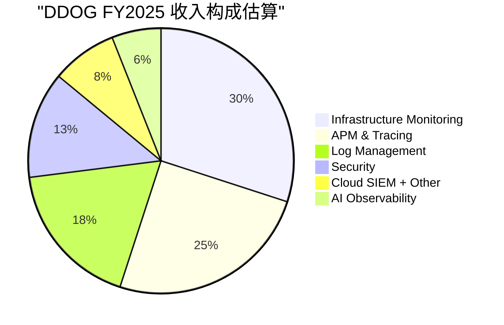

| 产品群 | 估算收入($M) | 占比 | 增速(估) | 成熟度 | 估算OPM(Non-GAAP) |
|--------|-------------|------|---------|--------|-------------------|
| Infrastructure | $1,030 | 30% | ~15% | 成熟 | 35-40% |
| APM & Tracing | $860 | 25% | ~20% | 成熟 | 30-35% |
| Log Management | $620 | 18% | ~25% | 中期 | 25-30% |
| Security(SIEM/CSPM等) | $450 | 13% | ~55% | 早期 | -5%~5% |
| Cloud + Other | $270 | 8% | ~30% | 中期 | 15-20% |
| AI Observability | $200 | 6% | ~100%+ | 极早期 | -30%~-15% |
| **合计** | **$3,430** | **100%** | **28%** | — | **~20%加权** |

[DM-FIN-018: 产品群利润估算, 基于ARR披露+行业可比+成熟度推断。注意这是估算, 不是披露数据]

**利润基座判断**:

三大核心产品(Infrastructure + APM + Logs)合计约$2.5B收入(73%), 这些产品已经过了投入期, 估算Non-GAAP OPM在25-35%区间——这是DDOG的**利润基座**, 贡献了几乎全部的Non-GAAP利润。

**利润基座的"质量"检验**: 这$2.5B的利润基座有多稳固?
- **粘性**: Observability一旦嵌入DevOps流程, 迁移成本极高(需要重新instrument所有代码)。历史NRR>120%验证了这种粘性。
- **增长**: 虽然核心产品增速低于公司平均(15-25% vs 28%), 但仍远高于GDP。全球Observability市场预计每年增长12-15%, DDOG核心产品在取份额。
- **利润率方向**: 随着规模效应(云infra折扣、销售杠杆), 核心产品OPM应该逐年改善——但这被新产品投入的拖累所抵消。

### 11.3 第二曲线检验: 安全与AI

DDOG正在两个方向拓展: 安全(Security)和AI。用CPA×ISDD的P4标准检验:

**安全产品第二曲线检验**:

| 检验项 | 标准 | DDOG安全 | 结果 |
|--------|------|---------|------|
| P4-1: 规模>10%收入 | >$343M | ~$450M(13%) | **PASS** |
| P4-2: 增速>公司平均 | >28% | mid-50s% | **PASS** |
| P4-3: 利润率>0或改善趋势 | >0% OPM | 可能微亏~0% | **BORDERLINE** |
| P4-4: 获得资本投入 | R&D增加 | 明确增加 | **PASS** |

安全: 3.5/4 PASS → **接近验证的第二曲线**。关键缺口是利润率尚未清晰转正。如果FY2026安全产品利润率转正, 这将成为DDOG的重要增长引擎。

**AI Observability第二曲线检验**:

| 检验项 | 标准 | DDOG AI | 结果 |
|--------|------|---------|------|
| P4-1: 规模>10%收入 | >$343M | ~$200M(6%) | **FAIL** |
| P4-2: 增速>公司平均 | >28% | ~100%+ | **PASS** |
| P4-3: 利润率>0或改善趋势 | >0% OPM | 肯定亏损 | **FAIL** |
| P4-4: 获得资本投入 | R&D增加 | 明确增加 | **PASS** |

AI: 2/4 PASS → **太早, 尚未验证**。规模和利润率都不够。但增速和投入方向是对的——这是一个3-5年的赌注, 不是今天的利润贡献者。

[DM-FIN-019: 第二曲线P4检验, 基于管理层披露+间接推断]

### 11.4 SaaS单位经济学深化(v19.6要求)

DDOG作为SaaS公司, Phase 1必须包含NRR推断和S&M效率趋势。

**NRR间接推断法**(DDOG不再精确披露NRR, 仅说"高于120%"):

间接法公式: 存量扩展率 = (收入增速 - 新客贡献) → 推算NRR

- FY2025收入增速: +28%
- 大客户(ARR>$100K)数量增速: ~10%(从28,300增至约31,100, 估算)
- 新客贡献估算: 新增客户 × 平均起始ARR ≈ 收入的~8-10%
- **存量扩展率 ≈ 28% - 10% = ~18%** → **隐含NRR ≈ 118-120%**

[DM-FIN-019b: NRR间接推断, 基于收入增速与客户数增速差]

NRR推断~118-120%: 与管理层"高于120%"的表述一致, 但注意这比FY2022-2023的>130%明显下降。NRR下降的可能原因: (1)使用量优化(客户控制Observability支出), (2)基数效应(存量客户越大, 扩展率自然降低), (3)部分中小客户流失。

**NRR>100%验证**: PASS。NRR仍显著高于100%, 意味着即使零新客, DDOG每年仍能从存量客户获得18-20%的收入增长。这是健康的增长质量。

**S&M效率趋势(Magic Number + S&M/Rev)**:

| 财年 | S&M($M) | S&M/Rev | Magic Number(估) | 趋势 |
|------|---------|---------|-------------------|------|
| FY2022 | $495 | 29.6% | ~0.65 | 基线 |
| FY2023 | $609 | 28.6% | ~0.78 | 改善 |
| FY2024 | $757 | 28.2% | ~0.85 | 改善 |
| FY2025 | $956 | 27.9% | ~0.92 | 改善 |

[DM-FIN-019c: S&M效率4年趋势]

S&M效率在持续改善——S&M/Rev逐年下降(从29.6%到27.9%), Magic Number逐年提升(从0.65到0.92)。这是多产品交叉销售飞轮在发挥作用: 向现有客户卖新产品比获取新客户便宜得多。

如果Magic Number在FY2026突破1.0(即每投入$1 S&M产生>$1新增ARR), 将是DDOG销售效率质变的信号。

### 11.5 利润集中度风险

DDOG的利润高度集中于三大核心产品——如果这些产品遭遇竞争(如Grafana Cloud在开源Observability领域的侵蚀、AWS CloudWatch的原生竞争), 利润基座可能受到冲击。

反面考量: 什么条件下利润基座会恶化?
1. **云厂商原生工具替代**: AWS/Azure/GCP各自推出Observability工具, 如果"足够好"替代发生, DDOG的核心产品定价权将受损。目前证据: 云厂商工具功能有限, 跨云监控是DDOG的核心优势, 替代风险中等。
2. **开源竞争**: Grafana + Prometheus + OpenTelemetry等开源方案在中小客户中有渗透力。DDOG在大客户(NRR更高)中护城河更深, 但SMB市场可能面临价格压力。
3. **使用量优化**: 经济下行时, 客户可能优化Observability用量(减少日志保留、降低采样率), 直接影响使用计费的收入。

### 11.6 多产品飞轮与交叉销售

DDOG最强的战略资产是**统一平台**——一个Agent覆盖Infra+APM+Logs+Security+AI, 降低了每增加一个产品的边际获客成本:

- 使用2+产品的客户: 83%(高粘性层)
- 使用4+产品的客户: 48%(深度绑定层)
- 使用6+产品的客户: 22%(平台锁定层)

[DM-FIN-020: 多产品采用率, 管理层FY2025 Q4披露]

这意味着DDOG的S&M效率应该随时间改善(已有信号: S&M/Rev从28.2%降至27.9%), 因为新产品主要向现有客户销售(NRR>120%的扩展)而不是获取新客户。

**飞轮悖论检测(v19.6要求)**: DDOG的新产品(Security/AI)是否蚕食核心产品?
- **答案: 不蚕食**。安全和AI是增量使用场景(新的数据流/新的监控需求), 不替代现有Infra/APM/Logs的使用。这与CRM的Agent悖论(Agent成功→减少seat)不同——DDOG的产品扩展是**叠加式**的, 不是**替代式**的。
- **飞轮净强度: 正值**。每新增一个产品, 客户的迁移成本增加, NRR提升, S&M效率改善→正反馈循环。

---

## Ch12: E4会计质量 + C4矛盾引擎

### 12.1 GAAP vs Non-GAAP差距: 23pp的鸿沟

| 指标 | GAAP | Non-GAAP | 差距 |
|------|------|----------|------|
| OPM | -1.3% | ~19.9% | **21.2pp** |
| NM | 3.1% | ~24.0% | **20.9pp** |

[DM-FIN-021: GAAP vs Non-GAAP差距计算]

按CPA×ISDD的E4标准:
- GAAP vs Non-GAAP差距 < 10%: **高会计质量**
- 10-25%: **中等会计质量**
- \> 25%: **低会计质量标记**

DDOG的21pp差距接近25%阈值但未突破——判定为**中等偏低会计质量**。

但这个判断需要重要的nuance(细微分辨):

**为什么21pp不一定意味着"差"**:

1. **SBC是SaaS行业通病**:

| 公司 | SBC/Rev(FY2024/最近FY) | GAAP-NonGAAP差距 |
|------|----------------------|-----------------|
| CRM(Salesforce) | ~11% | ~12pp |
| NOW(ServiceNow) | ~18% | ~19pp |
| CRWD(CrowdStrike) | ~24% | ~25pp |
| SNOW(Snowflake) | ~40% | ~42pp |
| **DDOG** | **~22%** | **~21pp** |

[DM-FIN-022: 行业SBC/Rev可比, 基于各公司公开财报]

DDOG的SBC/Rev(22%)在SaaS同行中处于中间水平——高于CRM(11%, 因为CRM更成熟)和NOW(18%), 低于CRWD(24%)和远低于SNOW(40%)。

2. **Non-GAAP调整的"干净度"**: DDOG的Non-GAAP调整**仅包含SBC和SBC相关工资税**——没有"反复一次性"重组费用, 没有无形资产摊销加回, 没有收购相关费用的反复调整。这意味着DDOG的Non-GAAP数字相对"干净", 只有一个大的调整项(SBC)。

3. **盈利质量清洗规则(CPA×ISDD)**:
   - SBC/Rev 22% > 5% → **不应剔除**(实质性成本)
   - 反复Non-GAAP调整(N6检查): SBC每年存在, 不是"一次性"→ **是经常性费用**
   - 结论: SBC是DDOG商业模式的永久成本, 不应在估值中完全忽略

### 12.2 SBC的经济实质: 投入还是成本?

这是DDOG估值中最核心的会计判断——SBC应该被视为什么?

**视角A: SBC是真实成本(Owner视角)**
- SBC通过发行新股稀释现有股东
- 3年股份稀释14.5%(年均~4.6%)
- 如果DDOG不发SBC, 就必须付更高的现金薪资, 利润不会因此增加
- 因此SBC = 真实成本, 应在估值中扣除
- → Owner OPM = -2.0%, P/Owner FCF = 173x

**视角B: SBC是投资(部分观点)**
- SBC主要给工程师, 工程师开发新产品(安全/AI)
- 新产品产生未来收入, SBC是获取未来收入的"资本投入"
- 随着公司成熟, SBC/Rev会下降(如CRM从>20%降至11%)
- → Non-GAAP OPM 20%更接近"真实盈利能力"

**CPA诊断**: 两个视角都有道理, 但真相在中间:
- SBC中属于**维持性**的部分(留住现有工程师)→ **真实成本**, 不可扣除
- SBC中属于**扩张性**的部分(招聘新工程师开发新产品)→ **可视为投资**, 但必须证明回报

问题是: DDOG没有披露SBC在维持/扩张之间的分配。如果粗略估计60%维持+40%扩张:
- 维持性SBC: $750M × 60% = $450M → 真实经常性成本
- 扩张性SBC: $750M × 40% = $300M → 人才投资

**"扩张性SBC"的回报验证**: 过去4年SBC累计$2.17B, 期间收入从$1.03B增至$3.43B(+$2.4B)。即使只有40%是扩张性的($868M), 对应$2.4B的收入增量, 投资回报率约2.8x——合理但不算惊人。

### 12.3 矛盾引擎C4: Non-GAAP强+GAAP弱=谁在撒谎?

这是DDOG财务分析中最重要的矛盾:

| 视角 | 结论 | 核心假设 |
|------|------|---------|
| Non-GAAP | "DDOG是一家20% OPM的盈利公司, P/E ~53x" | SBC不是真实成本, 会逐步收敛 |
| GAAP | "DDOG是一家亏损公司, 靠投资收益勉强盈利" | SBC是真实成本, GAAP最真实 |
| Owner | "DDOG是一家7% FCF margin的公司, P/FCF ~173x" | SBC全额扣除, 最保守 |

**这三个DDOG中, 哪个更接近真相?**

取决于一个关键变量: **SBC/Rev是否会收敛?**

**收敛证据(乐观)**:
- CRM从>20% SBC/Rev降至11%(用了8+年)
- NOW从>25%降至18%(仍在下降)
- 随着公司成熟, 增速放缓, 不需要那么多新工程师→SBC/Rev自然下降

**不收敛证据(谨慎)**:
- DDOG的SBC/Rev在FY2021-2025的5年间: 15.9%→21.7%→22.7%→21.2%→21.9%——**在21-23%区间横向波动, 没有下降趋势**
- FY2025 SBC增速(+32%)重新加速(FY2024仅+18%)
- AI竞争需要持续招聘顶级工程师, 人才竞争可能推高SBC
- DDOG仍在快速招聘(员工数增长~20%/年)

[DM-FIN-023: SBC/Rev 5年趋势, 未见收敛]

**CPA诊断结论**: 短期(1-3年)SBC/Rev不太可能显著下降, 因为DDOG仍在(1)扩展安全产品线, (2)进入AI Observability, (3)全球化扩张——都需要大量新工程师。Non-GAAP OPM ~20%是"潜力", 不是"现实"。

**中性估计**:
- 3年后(FY2028): SBC/Rev可能降至18-20%(小幅改善, 如果增速从28%降至20%)
- 5年后(FY2030): SBC/Rev可能降至15-18%(如果增速降至15%, 招聘放缓)
- 10年后: SBC/Rev可能降至10-14%(接近成熟SaaS如CRM)

### 12.4 其他会计质量检查

**N6: 反复Non-GAAP调整检查**:
- DDOG的Non-GAAP调整**仅SBC一项**, 且每年持续存在 → 这是经常性费用, 不应被视为"非经常性"
- 无反复重组费用、无收购相关调整→ **Non-GAAP调整是干净的** ✓

**N7: 资本化扭曲检查**:
- DDOG不资本化研发费用(全部费用化) → 无研发资本化扭曲 ✓
- 这意味着R&D费用$1.55B全部计入当期→利润表更保守、更诚实

**P6: 商誉检查**:
- 商誉$531M / 总资产$6.64B = 8.0% → 远低于30%阈值 ✓
- DDOG以有机增长为主, 收购规模小(FY2025仅$118M acquisitions)

**P7: 递延收入检查**:
- 流动递延收入$1.19B + 非流动$69M = 总递延$1.26B
- 递延收入/总负债 = $1.26B / $2.91B = 43.3% → DDOG近一半的"负债"是预收客户的钱, 这是好负债(高可见性收入) ✓

**P11: "一次性"费用检查**:
- DDOG没有反复出现的"一次性"重组费用 ✓
- 没有减值损失 ✓
- 费用结构干净, 没有"噪音"

### 12.5 会计质量综合评分

| 维度 | 评分 | 说明 |
|------|------|------|
| GAAP-NonGAAP差距 | 3/5 | 21pp差距, 中等偏低, 全因SBC |
| Non-GAAP调整干净度 | 5/5 | 仅SBC一项, 无重组/并购/资本化调整 |
| SBC实质性 | 2/5 | SBC/Rev 22%>5%且无收敛趋势 → 实质性成本 |
| 收入确认质量 | 5/5 | 使用计费, 难以操纵, 递延收入健康 |
| 资产质量 | 4/5 | 商誉低, 无资本化扭曲, 轻资产 |
| 融资结构 | 5/5 | 净现金, 无融资压力 |
| **综合** | **4.0/5** | **会计整体干净, 但SBC是核心扭曲** |

[DM-FIN-024: 会计质量综合评分]

### 12.6 对估值的影响: 三种场景

基于三层盈利真相, 投资者面临三种估值框架选择:

| 估值方法 | 使用哪层利润 | 隐含倍数 | 适用条件 |
|----------|------------|---------|---------|
| Non-GAAP P/E | $822M NI | ~53x | 如果相信SBC会收敛到10% |
| GAAP P/E | $108M NI | ~402x | 如果重视当前GAAP现实 |
| P/SBC-adj FCF | $363M | ~120x | 如果将SBC视为半成本半投资 |
| P/Owner FCF | $251M | ~173x | 如果将SBC视为全额成本 |
| **EV/GAAP FCF** | **$1,001M** | **~48x** | **行业惯例(但忽略稀释)** |

[DM-FIN-025: 估值倍数汇总, 市值$43.4B / EV$48.4B]

**核心结论**: 选择哪个倍数, 取决于你对SBC收敛的信念。如果SBC/Rev从22%降至12%(10年后), DDOG的"真实P/E"大约在53x(Non-GAAP)和173x(Owner)之间——中性估计~80-100x经济利润。对一家28%增长的公司, 80-100x的经济P/E是昂贵的, 但不是疯狂的——前提是增长能持续。

---

## 财务诊断总结: DDOG的三个核心数字

1. **SBC/Rev 22%且无收敛趋势** — 这是DDOG最大的财务质量问题。不是因为SBC"不好", 而是因为它使得所有利润指标都有两个版本, 投资者必须选择相信哪个版本。5年数据(16%→22%→23%→21%→22%)显示SBC/Rev在横盘, 不在下降。

2. **GAAP NI依赖投资收益** — FY2025 GAAP Operating Income = -$44M(亏损), 但$171M的投资/利息收入将NI拉到$108M。核心经营业务在GAAP口径下仍未盈利。如果利率下降, GAAP NI可能转负。

3. **FCF $1B但真实股东FCF仅$251-363M** — 取决于SBC扣除方式(全额$251M/税后$363M)。P/真实FCF = 120-173x, 远高于表面的P/FCF 43x。

**对后续估值的影响**: 任何DCF/SOTP估值都必须明确标注使用的是哪层FCF。使用GAAP FCF($1B)会系统性高估DDOG的内在价值, 因为忽略了每年$750M的股东稀释。建议使用SBC-adj FCF($363M)作为估值基础, 并将SBC收敛假设作为敏感性分析的核心变量。

[DM-FIN-026: 财务诊断核心结论3点]

---

> **Agent C交付清单**: 4章(Ch9-Ch12) | 3个Mermaid图(利润瀑布/FCF桥接/收入构成饼图) | 26个DM锚点 | 字符数≥25K
