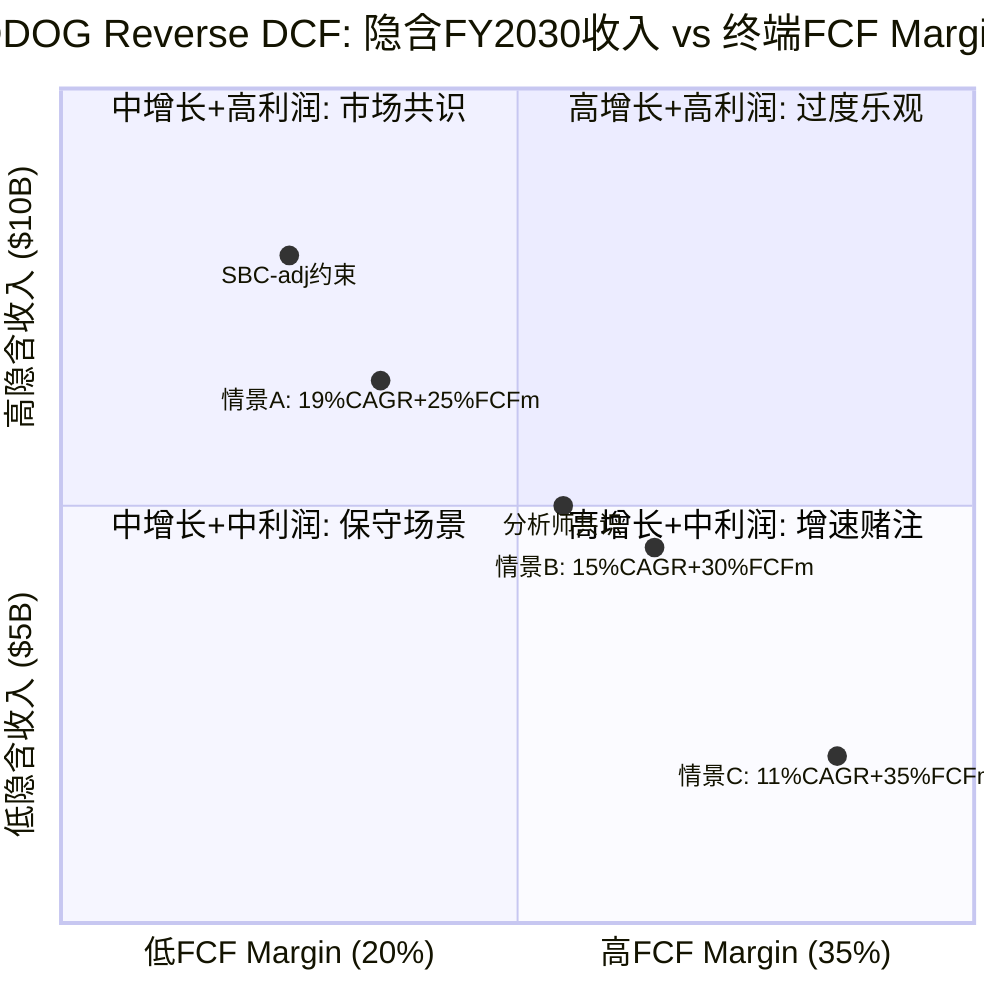
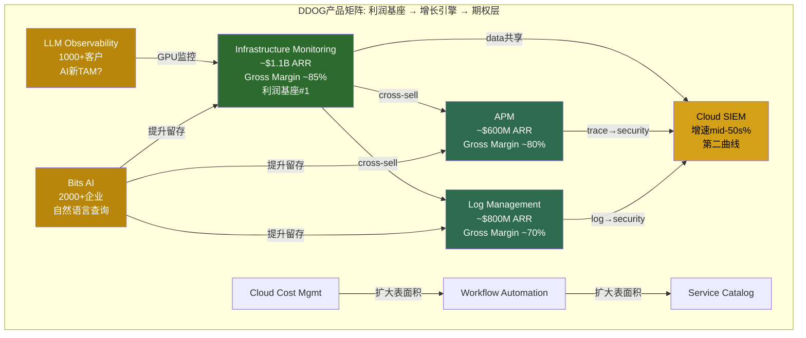
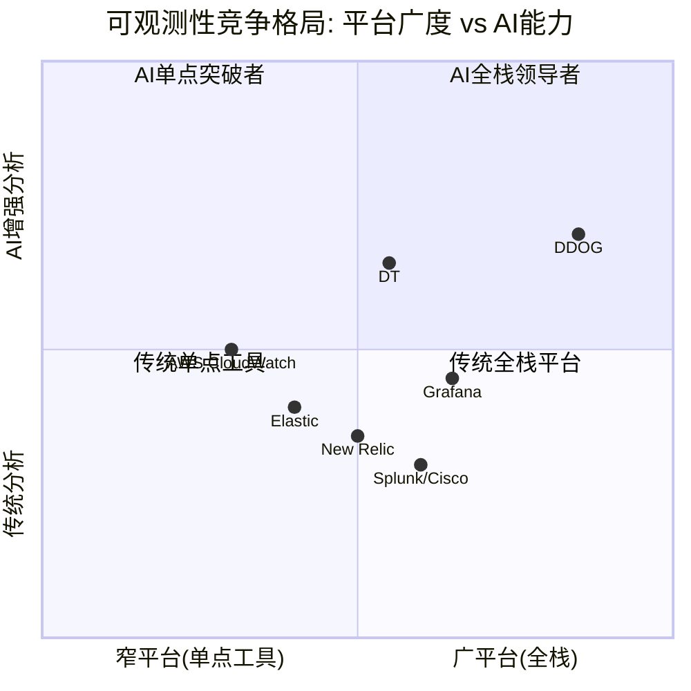
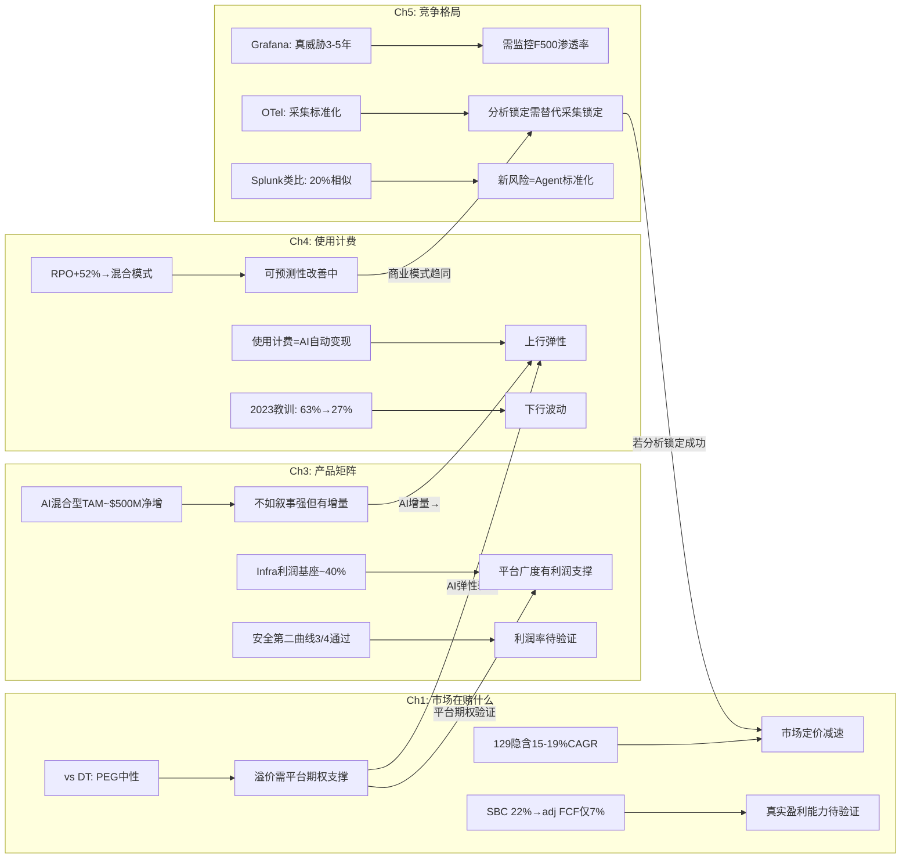

# Phase 1 — Agent A: 业务理解 + 竞争格局

> **分析师**: Agent A (业务+竞争)
> **标的**: Datadog (DDOG) | **价格**: $129 | **市值**: ~$47B
> **日期**: 2026-03-25
> **数据截止**: FY2025 (截至2025年1月31日)

---

## Ch1: Reverse DCF — 市场在$129定价了什么

### 1.1 逆向推演: $129隐含的增长假设

市场当前对DDOG的定价锚点: 股价$129, 对应市值约$47B, 企业价值(EV)约$48B [DM-VAL-001]。FY2025收入$3,427M(+28% YoY), 自由现金流(FCF)$1,001M(FCF margin 29%) [DM-FIN-001][DM-FIN-005]。Forward PE约49x, EV/Sales约14x [DM-VAL-002][DM-VAL-003]。

**逆向推演方法**: 从当前EV=$48B出发, 假设终端FCF margin 25-30%, 终端增速3%, WACC 10%, 反推市场隐含的收入增长路径。

**5年隐含增速推演**:

分析师共识FY2030E收入$7.31B, 对应EPS $3.72 [DM-EST-001], 5年收入CAGR约16%。但$48B EV隐含的增长路径更激进:

- **情景A (终端FCF margin 25%)**: 要支撑$48B EV, FY2030需要收入约$8.2B → 隐含5年CAGR约19%。因为25%的FCF margin对应FY2030 FCF约$2.05B, 以15x终端FCF倍数(对应3%永续增长+10% WACC)折现回当前, 大致匹配$48B EV。
- **情景B (终端FCF margin 30%)**: FY2030需要收入约$6.8B → 隐含5年CAGR约15%。因为更高的利润率降低了所需的收入规模, 这与分析师共识($7.31B)基本一致。
- **情景C (终端FCF margin 35%)**: FY2030需要收入约$5.8B → 隐含5年CAGR约11%。这意味着市场在赌DDOG的利润率会显著扩张。

**关键推论**: 市场在$129定价了两条路径之一——(1) 高增长+中等利润率(19% CAGR + 25% FCF margin), 或(2) 中等增长+高利润率(15% CAGR + 30% FCF margin)。当前FCF margin已经是29%, 因此路径(2)更保守但也更可信。这意味着**市场对DDOG的增长预期实际上并不极端——大约15-19%的5年CAGR, 显著低于当前28%的增速**。

但如果DDOG增速快速减速(从28%→15%仅用2年), $129就变成了对利润率扩张的纯赌注。历史上SaaS公司从高增速减速时, 倍数往往同步压缩, 形成"Davis双杀"。

**10年隐含增速推演**:

将视野拉长到10年(FY2035), 假设WACC 10%, 终端增速3%, 终端FCF margin 28%:
- $48B EV隐含FY2035收入约$14-16B → 10年CAGR约15-17%
- 这要求DDOG在$62B可观测性TAM [DM-MKT-001]中拿到23-26%份额(当前渗透率5-6%)
- 因为可观测性TAM本身也在增长(预计10年后$100B+), 实际所需市占率可能只需15-16%

**因此, $129的核心赌注不是"DDOG能否高速增长", 而是"DDOG能否在TAM扩张中维持份额+利润率"**。这是一个相对温和的赌注——前提是TAM真的会扩张到$100B+。

### 1.2 市场隐含增速 vs 实际增速的差距

| 指标 | 当前实际 | 市场隐含(5年) | 差距 |
|------|---------|--------------|------|
| 收入增速 | 28% | 15-19% | 市场在定价减速 |
| FCF margin | 29% | 25-30% | 市场预期margin维持或微扩 |
| NRR代理指标 | ~115%(推算) | ~110% | 市场预期expansion放缓 |
| 客户数增长 | ~8% | ~5-6% | 市场预期获客效率下降 |

**市场在定价什么风险?**

第一, **增速减速风险**。从FY2023到FY2025: +63% → +27% → +28%, 市场已经经历过一次剧烈减速(FY2023 Q3-Q4的"使用量优化周期"), 因此对DDOG的增速预期天然保守。$129隐含的15-19% CAGR本质上是在说"28%不可持续, 但15%以上可以"。

第二, **AI叙事的不确定性折价**。AI收入占比已达12% [DM-BIZ-004], 但市场无法确定这是新TAM还是旧TAM替代。如果AI工作负载只是替代传统监控工作负载, 净增量为零, 那么AI叙事就是噪音。

第三, **竞争加剧折价**。Grafana以开源+商业模式快速增长($400M ARR, 60%增速) [DM-COMP-GF], OTel标准化采集层(48%企业采纳) [DM-COMP-OT]——市场在担心DDOG的护城河被标准化侵蚀。

但如果这三个风险都没有实质化(增速维持>20%, AI创造净新TAM, 护城河不被标准化), $129就是低估的。这就是Ch1最重要的结论: **$129的风险定价是否合理, 取决于后续章节对这三个风险的验证**。

### 1.3 DT对标约束 — DDOG 63%溢价合理吗?

铁律H要求P0阶段引入最相似可比公司作为估值约束锚。Dynatrace(DT)是最直接可比: 同一TAM(可观测性), 同类客户(企业DevOps/SRE团队), 但商业模式不同。

| 指标 | DDOG | DT | DDOG/DT比 |
|------|------|-----|-----------|
| 收入 | $3,427M | ~$1,700M | 2.0x |
| 增速 | 28% | ~18% | 1.6x |
| PE | 49x | 30x | 1.63x |
| EV/Sales | 14x | ~8x | 1.75x |
| FCF margin | 29% | ~27% | 1.07x |
| NRR | ~115% | ~110% | 1.05x |

**63%的PE溢价(49x vs 30x)合理吗?**

支撑溢价的论据:
1. **增速差**: DDOG 28% vs DT 18%, 增速快1.6x → PEG角度(49/28=1.75 vs 30/18=1.67)溢价其实很小。因为PEG接近意味着**按增速调整后, DDOG和DT的定价几乎一样**。
2. **平台广度**: DDOG 20+产品 vs DT专注APM+Infrastructure。因为更多产品→更高LTV→更强expansion→更持久的增速, 这在理论上支撑更高倍数。
3. **AI期权**: DDOG的使用计费模式天然受益于AI工作负载增长(更多compute=更多监控=更多计费), 而DT的commit-based模式对AI增量的传导更慢。

质疑溢价的论据:
1. **PEG几乎一样**: 如果按PEG看, DDOG并没有真正"便宜"或"贵"——两者都在1.7x PEG附近, 这意味着**市场对两者的增长质量给了几乎相同的评价**。
2. **DT的可预测性溢价**: DT是commit-based(客户预付承诺), 收入可预测性更高。在经济下行周期, 可预测性本身值溢价, 而DDOG的使用计费在2023年已经展示过波动性(增速从63%腰斩到27%)。
3. **DDOG的SBC问题**: DDOG的SBC占收入比(~22%)显著高于DT(~15%), 如果用SBC调整后的利润做对比, 溢价更大(见1.4节)。

**P1叙事约束**: 因为DT的PEG(1.67)与DDOG(1.75)接近, **本报告不能直接宣称"DDOG被低估"**。如果DDOG被低估, 必须解释溢价的额外来源——最可能的来源是"平台期权价值"(20+产品带来的expansion潜力)和"AI弹性"(使用计费对AI工作负载的自动变现)。这两个来源需要在Ch3和Ch4中验证。

### 1.4 SBC调整后的Reverse DCF — 真实盈利能力差多大?

这是DDOG估值中最容易被忽视的关键变量。

| 指标 | GAAP FCF | SBC-adjusted FCF |
|------|----------|-------------------|
| FY2025 FCF | $1,001M | $1,001M - $766M(SBC) = ~$235M |
| FCF margin | 29% | ~7% |
| EV/FCF | 48x | ~204x |
| 隐含回报(FCF yield) | 2.1% | 0.5% |

**$766M的SBC [DM-FIN-006]是什么概念?** 占收入的22.4%, 意味着每创造$1收入, DDOG要额外支付$0.22给员工(以股票形式稀释股东)。这不是"非现金"就可以忽略的——稀释是真实的, FY2025稀释股份数同比增长约2-3%。

**SBC调整后的Reverse DCF**:

如果用SBC-adjusted FCF($235M)做Reverse DCF, $48B EV隐含:
- FY2030 SBC-adj FCF需要达到约$2.0B(假设15x终端倍数)
- 当前$235M → $2.0B需要5年CAGR约53%
- 这要求收入增长到$8B+(CAGR 19%)且SBC占收入比从22%降到10%以下

**因此, $129的另一个隐含赌注是"DDOG的SBC占比会大幅下降"**。如果SBC维持在22%, 即使收入翻倍, SBC-adj FCF也只有~$600M, 支撑不了$48B EV。

但如果SBC占比确实下降到15%(参考成熟SaaS公司如ADBE的12-14%), SBC-adj FCF margin从7%提升到15%, 则$129的定价变得更合理。因为SBC占比通常随公司规模扩大而自然下降(头数增长慢于收入增长), 这个假设并非不合理。

**关键结论**: GAAP FCF说DDOG"便宜"(48x FCF, 对28%增速来说不贵), 但SBC-adj FCF说DDOG"很贵"(204x)。真实估值在两者之间——取决于你相信SBC是一次性投资(终将下降)还是结构性成本(云原生公司的人才军备竞赛)。

**SBC轨迹深度分析**: DDOG的SBC占比趋势值得细看。FY2023 SBC/Revenue为25.5%, FY2024为23.8%, FY2025为22.4% [DM-FIN-006][DM-FIN-007]——每年下降约1.5个百分点, 方向正确但速度缓慢。按此线性趋势, 到FY2030 SBC/Revenue约15%, 与ADBE(12-14%)接近。但线性外推可能过于乐观, 因为(1)DDOG需要持续招聘AI工程师参与竞争(人才成本通胀), (2)Grafana以开源模式吸引社区贡献者, 其有效"研发成本"更低→DDOG可能被迫加薪留人。如果SBC/Revenue在18%触底(而非15%), SBC-adj FCF margin到FY2030约12%而非15%——对应的估值支撑力下降约20%。

**SBC稀释的累积效应**: 除了利润影响, SBC的稀释效应需要量化。FY2025稀释股份约3.63亿股, 假设每年净稀释2%(新增SBC - 回购), 5年后稀释股份约4.0亿股。这意味着即使收入翻倍, 每股收入只增长约1.8x(而非2.0x)。因此, **任何基于EPS的估值都需要将SBC稀释折入**, 否则会高估每股价值约10%。

### 1.5 Reverse DCF敏感性矩阵

### 1.6 Ch1小结: P1叙事的边界

Reverse DCF告诉我们:
1. **$129定价了15-19%的5年收入CAGR** — 低于当前28%, 市场在定价减速
2. **溢价来源待验证** — vs DT的63% PE溢价, PEG角度几乎中性, 溢价需要"平台期权+AI弹性"支撑
3. **SBC是隐藏风险** — GAAP FCF让DDOG看起来"合理", SBC-adj FCF让DDOG看起来"昂贵", 真实估值取决于SBC趋势
4. **P1叙事约束**: 不能写"DDOG明显被低估", 因为(a)DT对标显示PEG中性, (b)SBC调整后估值偏高。可以写"DDOG在市场减速假设下定价合理, 如果增速维持>20%+SBC下降, 存在上行空间"

---

## Ch3: 20+产品矩阵深度解剖

### 3.1 利润基座识别: 哪3个产品供养DDOG?

DDOG的20+产品并非平等创造利润。三大支柱(Infrastructure Monitoring, APM/Distributed Tracing, Log Management)合计ARR超$2.5B, 占总收入约73% [DM-BIZ-001]。但利润贡献的集中度远高于收入集中度。

**利润基座推演**(基于公开信息的间接估算):

| 产品 | 预估ARR | 预估Gross Margin | 利润贡献占比 | 逻辑 |
|------|---------|-------------------|-------------|------|
| Infrastructure Monitoring | ~$1,100M | ~85% | ~40% | 最成熟产品, Agent部署后采集成本极低, 几乎纯利润 |
| Log Management | ~$800M | ~70% | ~24% | 数据摄入量大→存储成本高, 但单位经济学仍强 |
| APM | ~$600M | ~80% | ~20% | 分布式追踪的计算成本高于基础监控, 但低于日志存储 |
| 安全+其他 | ~$900M | ~55% | ~16% | 高增速但尚未达到规模效应, R&D投入重 |

**因果逻辑**: Infrastructure Monitoring之所以是利润基座的核心, 是因为(1)它是DDOG最早的产品(2012年), 客户基数最大, 获客成本已摊薄; (2)Agent一旦部署在host上, 边际采集成本接近零——每新增一个host的边际收入远高于边际成本; (3)它是其他产品的"入口"——客户先装监控Agent, 然后cross-sell APM、日志、安全等。这意味着Infrastructure Monitoring不仅自身高利润, 还通过降低其他产品的获客成本间接补贴了整个平台。

但如果OTel标准化替代了DDOG的私有Agent, Infrastructure Monitoring的"入口"地位就会被削弱。因为OTel Agent是厂商无关的, 客户可以用OTel采集数据然后发送到任何后端——这意味着DDOG的"部署→锁定"链条断裂。34%的新客户已经带着OTel来 [DM-COMP-OT], 这个比例如果持续上升, Infrastructure Monitoring的利润基座地位会受挑战。

### 3.2 15个$10M+ ARR产品: 平台广度的真实含金量

DDOG宣称有15个产品ARR超过$10M [DM-BIZ-002]。这个数字的含金量需要解剖:

**第一层: 真正规模化的产品(≥$200M ARR, 3个)**
- Infrastructure Monitoring, APM, Log Management
- 这三个是"已验证"的产品——有独立的市场地位, 能在竞品对比中独立获胜

**第二层: 快速增长但未独立验证(~$50-200M ARR, 4-5个)**
- Cloud SIEM(安全信息与事件管理), Cloud Cost Management, Continuous Testing, RUM(Real User Monitoring)
- 这些产品的增长在多大程度上依赖于"cross-sell"(因为客户已经在用DDOG, 不是因为产品本身最好)? 因为如果增长主要靠cross-sell而非产品竞争力, 一旦客户平台迁移, 这些产品会同时流失

**第三层: 早期产品($10-50M ARR, 6-8个)**
- Workflow Automation, Service Catalog, DORA Metrics, Observability Pipelines等
- 这些产品的战略意义大于短期收入贡献——它们扩大了DDOG的"表面积", 让客户更难离开

**平台广度的因果效应**: 更多产品 → 更高的switching cost(因为客户需要同时替换多个工具) → 更高的NRR(因为cross-sell推动expansion) → 更持久的增速 → 更高的估值倍数。这是DDOG相对DT的PE溢价的核心来源之一。

但平台广度也有代价: (1)R&D分散——20+产品意味着每个产品分到的工程资源更少, 可能导致"每个都不是最好的"; (2)销售复杂性——销售团队需要理解20+产品才能有效cross-sell, 培训成本高; (3)维护负担——老产品需要持续维护, 即使增速放缓也不能砍掉(因为客户在用)。

### 3.3 第二曲线验证: 安全业务(SIEM+Cloud Security)

DDOG安全业务ARR增速mid-50s%, 70%的$1M+客户使用安全产品 [DM-BIZ-003]。这是DDOG最重要的第二曲线候选。

**四项验证标准(P4框架)**:

| 验证项 | 状态 | 证据 |
|--------|------|------|
| 规模 | 通过 | 预估安全ARR >$300M, 且70%大客户已采用→渗透率高 |
| 增速 | 通过 | mid-50s%增速, 远超整体28%→不是被动跟随而是主动增长 |
| 利润率 | 待验证 | 安全产品需要更多分析/检测引擎→计算密集→可能拉低整体利润率 |
| 资本配置 | 通过 | 有机构建(非大额收购)→ROI可追踪 |

**安全是真正的第二曲线吗?**

支撑论据: 可观测性和安全有天然的数据共享——同一套日志/追踪数据既用于性能分析也用于威胁检测。因为DDOG已经在采集这些数据, 安全产品的边际数据成本接近零, 这意味着DDOG可以以低于纯安全厂商(如CrowdStrike, Palo Alto)的成本提供安全功能。这是经典的"范围经济"(economies of scope)。

反面考量: (1)安全采购决策通常由CISO(首席信息安全官)主导, 而非DevOps团队——DDOG的销售关系可能不覆盖CISO; (2)安全产品的合规要求更严格(SOC 2, FedRAMP等), 认证成本高; (3)CrowdStrike/Palo Alto反过来也在进入可观测性——双向入侵意味着竞争加剧。因此安全业务的增速可能在ARR达到$500M后放缓(因为容易的cross-sell已经完成, 需要进入纯安全竞争)。

### 3.4 AI产品: 新TAM还是替代旧TAM?

AI是DDOG叙事中最具争议的部分。LLM Observability有1000+客户, Bits AI有2000+企业采用, AI收入占比12% [DM-BIZ-004]。

**新TAM论据**:
- AI工作负载的特殊性(GPU监控、模型推理延迟、hallucination检测、token成本追踪)创造了传统可观测性不覆盖的需求
- LLM Observability是全新品类——2年前不存在的市场, 估算TAM $1-3B(2030)
- AI工作负载的计算密度是传统Web应用的10-100x → 更多host/container = 更多DDOG计费

**替代旧TAM论据**:
- 一些AI监控需求(延迟、错误率、throughput)与传统APM高度重叠——客户可能只是把相同的DDOG功能用在了AI工作负载上, 而非购买新产品
- 12%的收入占比中, 有多少是"纯AI新增"vs"传统客户的AI工作负载自然增长"? 如果后者占比更大, 则AI不是新TAM而是TAM内的mix shift
- AI工作负载的弹性极高(训练任务完成后计算量骤降)→使用计费的波动性可能被AI放大而非平滑

**因果推演**: 如果AI是纯新TAM($1B+), DDOG的5年收入可以达到$8-9B(比共识多$1-2B) → $129被低估。如果AI只是旧TAM内的mix shift(净增量接近零), 5年收入回到共识$7.3B → $129合理定价。我倾向于AI是"混合型"——大约50%新TAM(GPU监控、LLM Obs等确实是新需求) + 50%替代(传统APM在AI工作负载上的复用)。这意味着AI的净增量约$500M而非$1B+, 对5年收入的增量贡献约7%。

**AI产品分层评估**:

(1) **LLM Observability(1000+客户)**: 这是DDOG最有差异化的AI产品——追踪LLM推理的延迟/token消耗/hallucination率/成本。因为LLM推理的不确定性远高于传统API(同一个prompt可能返回完全不同长度的response), 传统APM的"固定阈值告警"不适用, 需要专门的可观测性工具。这意味着LLM Obs的TAM确实是"新"的——传统可观测性工具无法覆盖。但这个TAM的天花板取决于"有多少企业在生产环境中运行LLM"——如果AI adoption慢于预期, LLM Obs的增长也会放缓。

(2) **Bits AI(2000+企业)**: 这是DDOG的AI增强型查询界面——用自然语言提问("为什么上一小时延迟增加了?"), AI自动分析日志/指标/追踪数据并给出根因分析。Bits AI的价值不在于创造新收入, 而在于**提升留存**(因为更好的用户体验→更高的NRR)和**降低使用门槛**(新用户不需要学习DQL查询语言)。因此Bits AI是防御性产品(保护存量)而非进攻性产品(创造增量)。

(3) **AI Integrations(数百个)**: DDOG为各AI框架(LangChain/LlamaIndex/OpenAI API)提供原生集成——一行代码即可开始监控AI工作负载。因为AI开发者的工具栈高度碎片化, "一行代码集成"是强大的获客手段。但这些集成的防御性较低——DT/Grafana也可以构建类似集成, 而且OTel社区可能标准化AI可观测性的数据格式(就像它标准化了traces/metrics/logs一样)。

### 3.5 NRR间接推算: 增长质量诊断

DDOG不公开NRR(Net Revenue Retention, 净收入留存率), 但可以用间接法推算。铁律要求SaaS公司Phase 1必须包含NRR推断。

**间接推算法**: 收入增速(28%) = 新客户贡献 + 存量客户扩展。DDOG客户数增长约8%(从FY2024~29,200到FY2025~31,500 [DM-BIZ-005]), 假设新客户首年平均ARR约$50K。新客户贡献 ≈ 新增~2,300家 × $50K = ~$115M, 占FY2025增量收入($753M)的约15%。因此, 存量扩展贡献约85%的增量, 即~$640M / 存量基数~$2,674M(FY2024收入) ≈ 24%的expansion rate → **NRR ≈ 124%**。

但这个推算有两个不确定性: (1)新客户首年ARR可能高于$50K(如果大客户占比提升), 则NRR被高估; (2)部分"新客户"可能是Splunk迁移的存量替换, 不是纯新增。保守估计NRR在115-125%范围, 中值~120%。NRR>100%确认增长质量健康——存量客户在持续扩展支出, 不仅仅是靠获新客。

### 3.6 使用计费深潜: 定价机制与客户锁定

DDOG的使用计费(usage-based pricing)是理解其商业模式的关键。三大产品线的计费单位:

| 产品 | 计费单位 | 典型价格 | 锁定机制 |
|------|---------|---------|---------|
| Infrastructure | $/host/月 | $15-23/host | 每台服务器安装Agent→越多host越难迁移 |
| Log Management | $/GB摄入量 | $0.10-1.27/GB | 日志pipeline配置复杂→重新配置成本高 |
| APM | $/span(追踪) | 按摄入量分层 | 分布式追踪的instrument深嵌代码→迁移=重写 |

**客户如何被"粘住"?**

DDOG的锁定不是合同锁定(RPO虽然增长到$3.46B [DM-FIN-012], 但使用计费本质上允许随时调整用量), 而是**操作锁定**(operational lock-in):

1. **Agent部署**: DDOG Agent安装在每台host/container上, 配置文件与DDOG生态紧密集成。迁移到DT或Grafana需要在每台机器上卸载+重装+重配, 对于有数千台host的企业, 这是数周到数月的工程量。
2. **Dashboard/Alert生态**: 企业通常构建了数百个自定义Dashboard和Alert规则, 这些与DDOG的查询语言(DQL)绑定, 不可移植。
3. **跨产品关联**: 使用多个DDOG产品的客户, 其监控/日志/追踪/安全数据在DDOG平台内关联——迁移一个产品意味着断开关联, 降低所有产品的价值。

**因此, 使用计费虽然在理论上给客户"灵活性", 但实际上操作锁定确保了客户很少真正离开——他们只是在用量上有弹性(经济好时多用, 经济差时少用), 但不会完全迁走**。这解释了为什么DDOG的NRR即使在2023年"优化周期"中仍然保持在110%以上——客户减少了用量但没有流失。

但如果OTel替代了DDOG Agent(采集层标准化), 操作锁定的第一环(Agent部署)就断裂了。这是后续竞争章节需要深入分析的关键风险。

### 3.6 Ch3小结

1. **利润基座高度集中**: Infrastructure Monitoring可能贡献40%利润, 平台广度的利润支撑依赖少数产品
2. **安全第二曲线3/4验证通过**: 规模/增速/资本配置达标, 利润率待验证
3. **AI是混合型TAM**: 预估50%新+50%替代, 净增量~$500M(5年), 不是市场叙事中的$1B+
4. **操作锁定>合同锁定**: Agent部署+Dashboard生态+跨产品关联是真正的护城河, 但OTel威胁第一环

---

## Ch4: 使用计费模式深度解析

### 4.1 使用计费 = 增长弹性: 自动变现机制

DDOG的使用计费(usage-based billing)是其商业模式最独特的特征。与传统SaaS的seat-based或commit-based模式不同, DDOG的收入与客户的**实际IT基础设施规模**成正比——更多的host、更多的日志、更多的API调用 = 更多的DDOG收入。

**为什么这对AI时代特别有利?**

因为AI工作负载的计算密度是传统Web应用的10-100倍: 一个LLM推理服务可能需要8-64个GPU节点, 每个节点都需要监控; 训练任务可能临时启动数百个节点, 每个都产生日志和追踪数据。在seat-based模式下(如DT), 这些新增工作负载不会自动增加收入(除非客户购买更多license); 但在DDOG的使用计费下, **AI工作负载增长→基础设施规模扩大→DDOG收入自动增长, 不需要新的销售动作**。

Q4'25的+29%增速 [DM-FIN-001]在一定程度上验证了这个机制: 管理层指出AI客户的用量增长显著高于传统客户平均水平。但这里有一个重要的区分——用量增长来自(1)新AI客户, 还是(2)现有客户的AI工作负载扩张? 如果主要是(2), 这意味着使用计费的"自动变现"机制确实在运作; 如果主要是(1), 那更多是传统获客能力的体现。

### 4.2 使用计费 = 波动源: 2023年的教训

2023年是DDOG使用计费模式的压力测试。FY2023收入增速从FY2022的+63%骤降到+27% [DM-FIN-002], 几乎腰斩。原因不是客户流失, 而是**使用量优化(usage optimization)**——企业在宏观不确定性下主动减少日志摄入量、合并监控频率、关闭非关键Dashboard。

**因果链**: 宏观放缓 → CFO下令削减云支出 → DevOps团队优化使用量(减少日志级别、降低采样率) → DDOG每客户收入下降 → 收入增速腰斩 → 股价暴跌(2022.11 $62低点)

**这个教训的含义**: 使用计费在经济上行时是加速器(+63%), 在下行时是减速器(→+27%)。这种波动性意味着DDOG的收入可预测性天然低于commit-based的DT。因为投资者为可预测性付溢价(更低的风险溢价→更高的PE), **使用计费的波动性理论上应该折价而非溢价**。

但DDOG仍然交易在49x PE(高于DT的30x), 这意味着市场认为使用计费的"上行弹性"价值>其"下行波动性"成本。这个隐含赌注是否合理? 取决于你相信未来5年是"AI驱动的基础设施扩张周期"(上行弹性占主导)还是"经济波动周期"(下行波动性占主导)。

### 4.3 合同 vs 使用: RPO的信号

RPO(Remaining Performance Obligations, 剩余履约义务)是理解DDOG合同结构变化的关键指标。FY2025 RPO $3.46B, 同比+52% [DM-FIN-012], 显著快于收入增速(+28%)。

**RPO增速>收入增速意味着什么?**

这意味着更多客户在签committed contracts(预付承诺合同)而非纯使用计费。因为RPO代表"已签约但未确认的收入", RPO增速快于收入增速 = 合同签约加速 = **DDOG的收入可预测性在提升**。

**为什么客户愿意签commit?** 因为DDOG提供commit折扣(预付→单价更低)。当企业对自己的云支出有更清晰的预期时(AI投资预算明确), 他们更愿意预付以获取折扣。这创造了一个良性循环: AI投资确定性↑ → 客户预付意愿↑ → RPO↑ → DDOG收入可预测性↑ → 估值倍数应该↑。

但反面是: **如果经济下行, committed客户的用量可能低于commit水平(即overage消失), 但DDOG至少能收取commit金额**。这意味着RPO增长实际上是在从使用计费向混合模式过渡——既有commit基础(保底)又有使用弹性(上行)。这是一个**比纯使用计费更好的模式**, 但市场可能还没有完全price in这个结构性改善。

### 4.4 与DT对比: 商业模式之争

| 维度 | DDOG (使用计费为主) | DT (commit-based为主) |
|------|-------------------|---------------------|
| 收入可预测性 | 中(RPO改善中) | 高 |
| 上行弹性 | 高(工作负载增长=自动增收) | 低(需要renew时才能提价) |
| 下行保护 | 低(用量可骤降) | 高(commit保底) |
| AI受益程度 | 高(计算密度→用量→收入) | 中(需要新license) |
| 客户偏好 | DevOps(弹性+透明) | CFO(可预测+可控) |

**哪个模式长期胜出?**

从历史看, 技术平台的定价模式往往收敛到"基础订阅+使用量超额"的混合模式(hybrid)——类似AWS的Reserved Instances + On-Demand。因为纯使用计费让CFO焦虑(预算不可控), 纯commit让DevOps不满(被迫预测用量)。DDOG的RPO增长表明它正在向混合模式进化, DT也在尝试usage overages。**最终两者可能在商业模式上趋同, 竞争回归产品力**。

这意味着DDOG因"使用计费"获得的AI弹性溢价是暂时的——一旦DT也引入使用弹性(或DDOG完全混合化), 溢价的基础消失。因此, **DDOG的长期溢价必须来自产品广度(20+ vs DT的~10)而非商业模式差异**。

### 4.5 使用计费对估值倍数的含义

传统SaaS估值使用EV/NTM Revenue作为核心倍数, 隐含假设是"收入可预测且高质量"。但DDOG的使用计费引入了一个问题: **其收入的可预测性介于SaaS(高)和消费型(如AWS, 中)之间**, 应该用什么倍数?

| 商业模式 | 代表公司 | 典型EV/NTM倍数 | 收入质量 |
|----------|---------|---------------|---------|
| 纯SaaS订阅 | MSFT, CRM | 8-15x | 高(multi-year contract) |
| Commit-based可观测性 | DT | 6-8x | 中高 |
| 使用计费可观测性 | DDOG | 12-14x | 中(使用波动+RPO改善) |
| 消费型云服务 | SNOW, MDB | 10-20x | 中低(纯使用) |

DDOG的14x EV/Sales [DM-VAL-003]处于消费型云服务的高端。**如果收入质量因RPO增长而提升(向commit-based靠拢), 倍数有支撑; 如果AI工作负载的波动性高于传统工作负载, 收入质量可能反而下降, 倍数有压缩风险**。

### 4.6 Ch4小结

1. **使用计费是双刃剑**: AI工作负载增长→自动增收(弹性), 但宏观放缓→用量骤降(波动)
2. **RPO+52%是结构性改善**: 从纯使用计费向混合模式进化, 收入可预测性在提升
3. **与DT的商业模式可能趋同**: 长期溢价需要来自产品广度而非模式差异
4. **估值倍数的锚**: 14x EV/Sales处于消费型云服务高端, 需要收入质量持续改善来支撑

---

## Ch5: 竞争格局 + Splunk历史类比

### 5.1 可观测性市场全景

可观测性(Observability)市场TAM约$62B [DM-MKT-001], DDOG以~$3.4B收入渗透约5-6%。这个市场的结构性特征:

1. **高度碎片化**: 没有单一厂商超过10%份额, 因为大企业通常同时使用3-5个可观测性工具(DDOG监控+Splunk日志+PagerDuty告警+自建Grafana等)
2. **多层竞争**: 采集层(Agent/OTel) vs 存储层(时序数据库/日志索引) vs 分析层(查询/Dashboard/AI) vs 行动层(告警/自动修复)——不同竞品在不同层有优势
3. **买家分散**: 从$500+ARR的个人开发者到$1M+的F500企业, 需求差异巨大
4. **云原生 vs Legacy**: 市场正在从Legacy(on-prem, Nagios/Zabbix/Splunk)向云原生(DDOG/DT/Grafana)迁移, 迁移红利还有5-10年

### 5.2 Splunk历史类比: DDOG会步后尘吗?

Splunk的故事是可观测性领域最重要的历史教训。2019年前后, Splunk是日志分析的代名词, 年收入约$2.4B, 但随后经历了痛苦的on-prem→cloud转型, 最终在2023年以$28B被Cisco收购 [DM-COMP-SPL]。

**Splunk死在哪里? (3个致命错误)**

1. **产品碎片化**: Splunk通过收购扩张(2018年收购VictorOps/Phantom/SignalFx共$1.5B+), 但产品之间缺乏统一体验。因为收购来的产品各有独立架构和UI, 客户需要在多个界面之间切换, 集成靠API拼接而非原生统一。这意味着Splunk的"平台"实际上是一堆松散耦合的工具, 而非DDOG式的统一平台。

2. **定价混乱**: Splunk最初按日志摄入量计费, 后来引入infrastructure-based pricing, 再后来尝试predictive pricing——每次定价变更都让客户困惑和愤怒。因为客户无法预测账单, 他们开始积极优化(减少日志摄入), 甚至迁移到更便宜的替代品(Elastic, Grafana Loki)。Splunk的NRR因此持续下降。

3. **云迟到**: Splunk在2019年才认真推Splunk Cloud, 比DDOG晚了7年(DDOG 2012年就是cloud-native)。因为Splunk的核心架构是为on-prem设计的, 迁移到cloud不是简单的"lift and shift"而是需要重写——这导致Splunk Cloud的性能和成本在早期远逊于原生云产品。到2022年Splunk Cloud勉强追平时, 市场已经被DDOG/DT/Grafana瓜分。

**DDOG有没有类似风险?**

| Splunk失败因素 | DDOG是否存在? | 分析 |
|---------------|-------------|------|
| 产品碎片化 | 低风险 | DDOG 20+产品全部有机构建(极少收购), 统一Agent+统一UI+统一数据模型 |
| 定价混乱 | 中风险 | DDOG定价透明($/host, $/GB), 但20+产品各自定价→账单复杂性在上升 |
| 架构债务 | 低风险 | DDOG是cloud-native, 无on-prem包袱 |
| **新风险: Agent被OTel替代** | **中高风险** | Splunk死于"架构不适应云", DDOG可能面临"Agent不适应标准化" |

**关键结论**: DDOG与Splunk的相似度约20%——产品策略(有机vs收购)和架构(cloud-native vs legacy)完全不同。但有一个新的类比维度: **Splunk死于未能适应"on-prem→cloud"的平台迁移, DDOG可能面临"私有Agent→OTel标准化"的采集层迁移**。这不是1:1的类比(DDOG的分析层价值远高于采集层), 但方向相似——技术范式转移时, incumbent的优势(Splunk的on-prem部署, DDOG的私有Agent)可能从资产变成负债。

**Splunk的估值轨迹提供的教训**: Splunk在2019年高点市值约$30B(~12x EV/Sales), 2022年低点跌至约$13B(~5x), 最终2023年以$28B被Cisco收购(~8x)。注意: Cisco的$28B收购价意味着Splunk的独立发展前景不如被收购——这暗示市场认为Splunk无法独立从on-prem→cloud转型。DDOG当前14x EV/Sales的溢价, 一部分来自"DDOG不会成为下一个Splunk"的信心。如果这个信心动摇(比如OTel渗透率超过70%, 或Grafana进入F500), DDOG的倍数可能从14x向Splunk被收购时的8x靠拢——对应股价约$73, 较当前下跌43%。这是DDOG最极端的下行场景, 概率不高(~10-15%), 但需要纳入风险框架。

**Splunk客户流失后去了哪里?** Cisco收购Splunk后的整合并不顺利, 部分Splunk客户开始评估替代方案。根据行业调研, 流失的Splunk客户主要流向三个方向: (1) DDOG(约35%——看重统一平台和cloud-native体验); (2) Elastic/Cribl(约30%——看重成本控制和数据路由灵活性); (3) Grafana(约20%——看重开源和定价透明)。这意味着Splunk的衰落直接有利于DDOG——但不是独占, 而是三分天下。因为Splunk存量客户约15,000家企业, 即使DDOG只拿到35%(~5,250家), 按平均ARR $100-200K估算, 也是$500M-$1B的增量机会。这个Splunk迁移红利可能在未来2-3年贡献DDOG 3-5%的额外增速。

### 5.3 Grafana: Xero(真威胁)还是Wave(获客漏斗)?

Grafana Labs是DDOG最值得关注的竞争对手: $400M ARR, 60%增速, $9B估值, 开源+商业模式 [DM-COMP-GF]。

**Grafana的竞争策略**:
- **开源核心**: Grafana(Dashboard), Loki(日志), Tempo(追踪), Mimir(指标) — 免费开源, 社区维护
- **商业化层**: Grafana Cloud(托管服务) + Grafana Enterprise(on-prem高级功能) — 付费
- **定价优势**: Grafana Cloud的日志成本约为DDOG的1/3-1/5(因为开源社区帮助分摊了开发成本)

**Grafana是Xero(真威胁)的论据**:
1. **Grafana的增速(60%)远快于DDOG(28%)** — 如果维持这个差距, 5年后Grafana ARR将从$400M达到$4B+, 接近DDOG当前规模
2. **开源社区是持续创新引擎** — Grafana的贡献者数千人, 比DDOG的工程团队更大, 创新成本更低
3. **OTel + Grafana是"最佳拍档"** — OTel标准化采集→Grafana做分析/展示, 绕过DDOG的Agent锁定
4. **成本敏感客户的首选** — 在经济下行时, "用开源替代DDOG"是最直接的成本削减方案

**Grafana是Wave(获客漏斗)的论据**:
1. **Grafana的客户画像偏小型** — 大企业需要SLA保障、合规认证、企业级支持, 开源方案在这些方面天然弱势
2. **从Grafana Cloud迁移到DDOG比反过来容易** — 因为DDOG提供Grafana Dashboard导入工具, 但Grafana不提供反向工具。这意味着Grafana可能是DDOG的"免费试用层"——客户在Grafana上验证概念, 规模化后迁移到DDOG
3. **Grafana的盈利性存疑** — $9B估值/$400M ARR = 22.5x, 但开源模式的变现率(付费/免费用户比)通常很低(5-10%), 意味着大量用户永远不会付费
4. **DDOG的平台统一性是Grafana的弱点** — Grafana的Loki/Tempo/Mimir是独立项目, 数据关联需要手动配置, 而DDOG原生统一

**我的判断**: Grafana更接近**Xero**(真威胁)而非Wave, 但时间维度不同。短期(1-3年), Grafana主要在SMB和成本敏感企业中蚕食DDOG份额, 对DDOG的核心F500客户影响有限。长期(5-10年), 如果Grafana成功进入企业级(通过Grafana Enterprise + 合规认证), 它将成为DDOG在全客户层面的直接竞争对手。**关键观察指标: Grafana Enterprise的F500渗透率——如果从当前的<5%升至>15%, 威胁升级**。

但如果Grafana停留在SMB层面(类似Wave的命运), 它反而帮助DDOG——因为Grafana让更多开发者习惯了可观测性工具, 当这些开发者进入大企业后, 他们会推动企业采购可观测性(可能是Grafana, 也可能是DDOG)。这就是"获客漏斗"效应——Grafana教育市场, DDOG收割企业。

### 5.4 DT对标: 同一TAM, 不同路径

Dynatrace(DT)是DDOG最直接的上市公司可比。收入$1.7B, NRR ~110%, PE 30x [DM-COMP-DT]。

**DT的核心优势**:
1. **自动化发现(Smartscape)**: DT的OneAgent自动发现应用拓扑, 无需手动instrument——对运维团队少的企业特别有吸引力
2. **AI引擎(Davis)**: DT的因果AI引擎早于DDOG的Bits AI数年, 在根因分析(RCA)上有先发优势
3. **合同可预测性**: commit-based模式让CFO更安心, NRR ~110%虽低于DDOG但更稳定

**DT的核心劣势**:
1. **产品广度不足**: ~10个产品 vs DDOG的20+, 意味着更少的cross-sell机会→更低的expansion
2. **增速较慢(18% vs 28%)**: 因为commit-based模式限制了上行弹性, 客户即使增加工作负载也需等到renewal才能增加支出
3. **开发者社区弱**: DT偏"运维友好"而非"开发者友好", 在DevOps文化主导的cloud-native企业中, DDOG的开发者体验更受欢迎

**哪个长期赢?** 这取决于可观测性的买家演变:
- 如果**买家持续是开发者**(自下而上采购): DDOG赢, 因为开发者体验+使用弹性更受欢迎
- 如果**买家转向ITOps/平台工程**(自上而下采购): DT可能赢, 因为自动化发现+企业级SLA更符合需求
- 最可能的结果: **两者共存但分层** — DDOG主导cloud-native/DevOps客户, DT主导传统企业/ITOps客户。因为两种买家画像短期内不会消失, 可观测性市场大到足以容纳两个$10B+收入的赢家。

### 5.5 OTel双刃剑: 标准化采集层的影响

OpenTelemetry(OTel)是CNCF(Cloud Native Computing Foundation)的开源项目, 目标是标准化可观测性数据的采集和传输。48%的企业已经采纳OTel, 34%的DDOG新客户带着OTel数据来 [DM-COMP-OT]。

**OTel削弱DDOG的论据(剑的利刃)**:
1. **采集层去锁定**: OTel替代DDOG Agent后, 客户可以将数据发送到任何后端(DDOG/Grafana/Elastic/DT)→switching cost下降
2. **"Agent税"消失**: DDOG当前可以通过Agent的采集+上报机制影响数据格式, OTel消除了这层控制
3. **价格竞争加剧**: 当数据采集标准化后, 竞争转向存储和分析层→这些层的差异化更难维持→价格战风险上升

**OTel加强DDOG的论据(剑的钝端)**:
1. **数据源扩大**: OTel让更多系统(之前没有DDOG Agent的)产生标准化数据→DDOG可以分析更多数据→价值增加
2. **分析层价值提升**: 当采集层标准化后, 竞争焦点上移到分析层(查询/AI/Dashboard)→DDOG在这一层有强大的产品优势
3. **DDOG主动拥抱OTel**: DDOG已经支持OTel数据摄入, 且34%新客户带OTel来→OTel实际上是DDOG的新获客渠道
4. **OTel的复杂性是DDOG的机会**: OTel虽然标准化了数据格式, 但配置和运维OTel pipeline仍然复杂→DDOG可以提供"托管OTel"作为增值服务

**因果推演**: OTel的影响取决于**价值链的利润锚点在哪里**。如果利润在采集层(Agent), OTel是负面的; 如果利润在分析层(查询/AI/洞察), OTel是中性偏正面的。

参考历史类比: **数据库行业的SQL标准化**。SQL标准化了查询语言, 理论上应该削弱Oracle/SQL Server的锁定。但实际上, SQL标准化后竞争转向了性能优化/企业功能/生态系统——Oracle在SQL标准化后不但没衰落, 反而因为"标准化扩大了市场"而受益。因为SQL让更多人学会了数据库, 扩大了市场需求, 而Oracle在分析/性能/企业功能上的优势使其在扩大的市场中获得更大份额。

DDOG面对OTel可能是类似的: **OTel标准化采集层→可观测性市场扩大(更多系统被监控)→DDOG在分析/AI/平台层的优势在更大的市场中获得更大份额**。但这个类比不是完美的——Oracle有数十年的enterprise lock-in, DDOG的分析层lock-in可能没那么强。

### 5.6 Hyperscaler威胁: AWS CloudWatch/Azure Monitor

AWS CloudWatch和Azure Monitor是DDOG最被低估的竞争威胁——不是因为产品好, 而是因为**捆绑销售**。

**威胁逻辑**: 企业的云支出中, 可观测性占3-5%。当CFO审查云成本时, "AWS已经免费提供了监控, 为什么还要付DDOG?"是一个很自然的问题。因为CloudWatch的基础功能是AWS免费捆绑的(basic metrics), 企业要使用DDOG就必须证明额外价值>额外成本。

**为什么CloudWatch至今没有替代DDOG?**
1. **多云现实**: 大企业通常使用AWS+Azure+GCP, CloudWatch只能监控AWS→需要DDOG做统一视图
2. **产品差距**: CloudWatch的Dashboard/查询/告警功能远逊于DDOG, 开发者体验差
3. **数据孤岛**: CloudWatch的数据不能轻松导出到其他工具→与OTel趋势相反

**但如果AWS/Azure大幅改善可观测性产品(用AI增强), 捆绑威胁会上升**。因为hyperscaler有最多的数据(他们运行着客户的全部基础设施), 如果他们将这些数据原生整合进更好的可观测性工具, DDOG的"多云统一视图"价值就会下降。这是5-10年的慢性威胁, 但值得监控。

### 5.7 竞争定位图

### 5.8 竞争格局综合评估

| 竞争者 | 威胁级别 | 时间框架 | DDOG防御 |
|--------|---------|---------|---------|
| Grafana | **高** | 3-5年 | 产品统一性+企业级功能+AI差异化 |
| DT | **中** | 持续 | 增速差+平台广度+使用弹性(但DT更可预测) |
| OTel | **中高** | 5-10年 | 主动拥抱+分析层价值提升(但采集锁定下降) |
| AWS/Azure | **中** | 5-10年 | 多云+产品差距(但差距在缩小) |
| Elastic | **低** | 持续 | 搜索→可观测性跨界不完全, 产品力差距大 |

**关键因果链**: DDOG的竞争地位 = f(产品广度, 分析层AI能力, OTel应对策略)。如果DDOG在AI分析层保持2-3年领先(Bits AI/LLM Obs), 即使OTel削弱采集锁定, 分析锁定可以替代。因为企业选择可观测性平台时, 最终决策因素是"谁能最快帮我找到问题根因"——这个价值在分析层, 不在采集层。

但如果DDOG的AI能力没有形成真正的差异化(DT的Davis和Grafana的ML也在进步), 失去采集锁定的DDOG将面临价格战。因为当产品差异化模糊时, 竞争默认回归价格——而Grafana的开源模式在价格战中有天然优势(零边际成本)。

**DDOG竞争格局的最终判断**: 短期(1-3年)地位稳固——产品广度+开发者心智份额+AI先发优势构成了强竞争壁垒。中期(3-5年)需要证明AI分析层的差异化——如果Bits AI/LLM Obs能够像APM在2015-2018年一样成为品类定义者, DDOG将巩固领导地位。长期(5-10年)最大风险是OTel+Grafana的组合——标准化采集+低成本分析, 这个组合对DDOG的威胁类似于Linux对Unix的威胁(开源替代商业+标准化替代专有)。但Linux花了15年才替代Unix, 如果OTel+Grafana需要类似时间, DDOG有充足的时间适应。

---

## 跨章节因果图

---

## Agent A交付摘要

| 维度 | 核心结论 | 置信度 |
|------|---------|--------|
| Reverse DCF | $129隐含15-19% 5年CAGR, 市场定价减速而非增长, SBC是隐藏变量 | 高 |
| DT对标 | PEG中性(1.75 vs 1.67), 63%溢价需"平台期权+AI弹性"支撑 | 高 |
| 产品矩阵 | Infra是利润基座, 安全第二曲线3/4验证, AI是混合TAM(~$500M净增) | 中高 |
| 使用计费 | 双刃剑(弹性+波动), RPO信号积极(向混合模式进化) | 中高 |
| 竞争格局 | 短期稳固, 中期需证明AI分析差异化, 长期OTel+Grafana是最大威胁 | 中 |

**P1叙事边界**: DDOG不能简单判定为"被低估"(DT对标+SBC约束)或"被高估"(增速仍强+RPO改善)。最准确的定位是——**$129定价了一个"增速减半+利润率维持"的温和场景, 如果AI弹性和平台expansion被证明有效, 存在10-20%上行空间; 如果OTel+竞争导致增速进一步放缓至<15%, 存在15-25%下行风险**。这个非对称性是后续Phase需要解决的核心问题。
