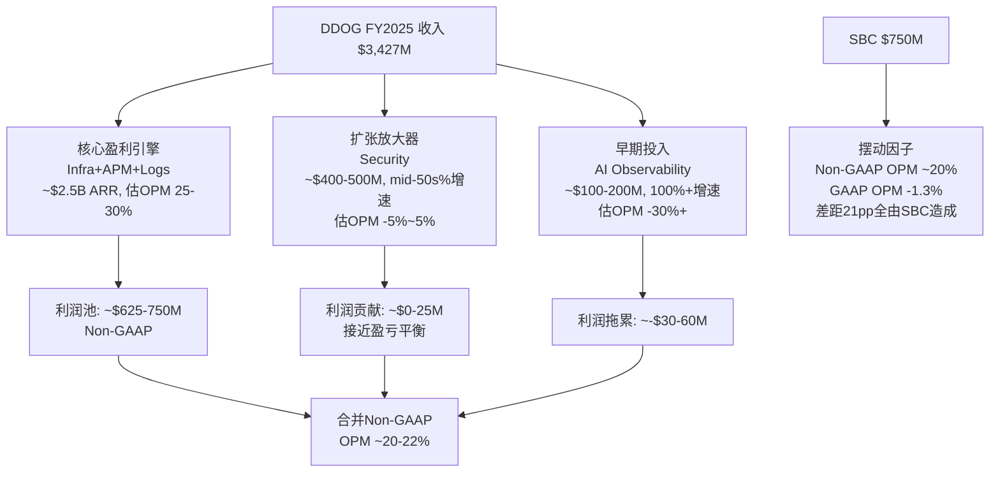
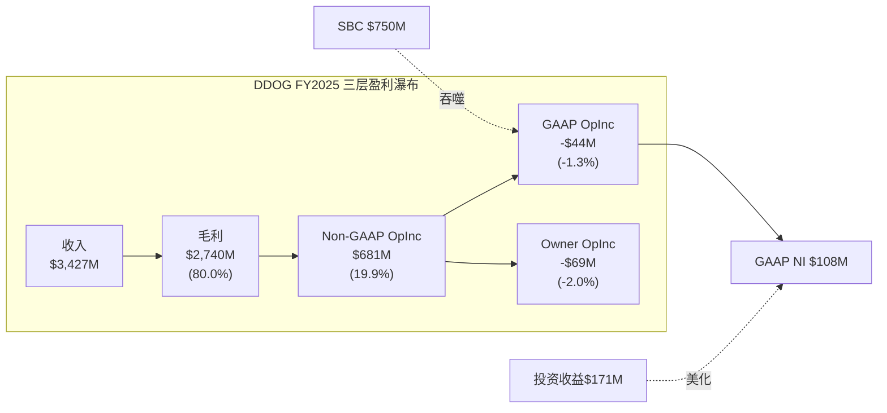
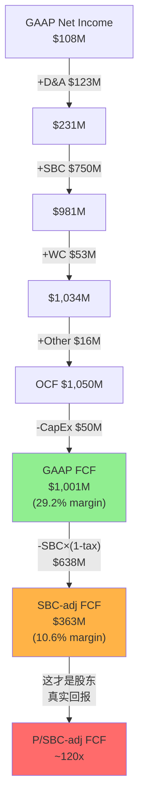
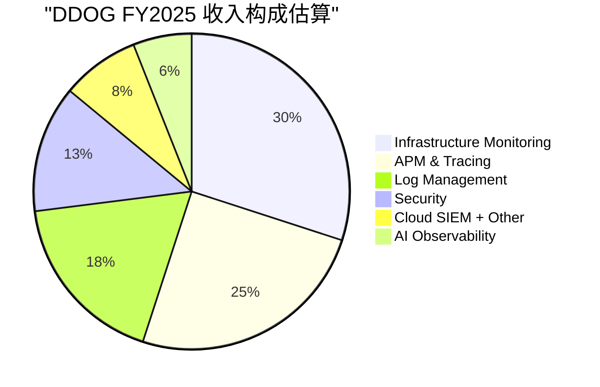

# Agent C: CPA财务诊断 — DDOG三层盈利真相

> **身份**: CPA级财务诊断师 | **框架**: financial_analysis_framework_v2.md (CPA×ISDD融合版)
> **核心任务**: 看透DDOG数字背后的原因和质量——利润里哪些是真的、现金流能不能信、利润基座在哪里、会计质量是否经得起检验
> **数据来源**: FMP API (10-K FY2021-FY2025) + baggers_summary (2025 Q4) | 市值$43.4B (2026-03-25)

---

## Ch9: M1利润表诊断 — SBC三层盈利真相

### 9.1 利润脱钩检测: 收入+28%但净利润-41%

DDOG FY2025呈现出一个罕见的财务现象: 收入高速增长的同时, GAAP净利润大幅下降。这不是"增收不增利"——这是**增收减利**, profit_lag达到极端水平。

**5年利润表核心数据**:

| 财年 | 收入($M) | YoY | GAAP NI($M) | NI YoY | GAAP OPM | GM |
|------|---------|-----|------------|--------|----------|-----|
| FY2021 | $1,029 | +83% | -$21 | — | -1.9% | 77.2% |
| FY2022 | $1,675 | +63% | -$50 | NM | -3.5% | 79.3% |
| FY2023 | $2,128 | +27% | $49 | 转正 | -1.6% | 80.7% |
| FY2024 | $2,684 | +26% | $184 | +278% | +2.0% | 80.7% |
| FY2025 | $3,427 | +28% | $108 | **-41%** | **-1.3%** | **80.0%** |

[DM-FIN-001: FMP income annual, FY2021-2025]

profit_lag的量化: 收入增速+28% vs GAAP NI增速-41% = **profit_lag = 69pp**。这是β路径(逆向溯源)的最强触发信号——不是5pp的温和脱钩, 而是69pp的极端脱钩。

更关键的是**方向性逆转**: FY2024 GAAP OPM刚转正(+2.0%), FY2025又跌回负值(-1.3%)。收入从$2.68B增长到$3.43B(+$743M), 但利润反而倒退——这意味着新增收入的**边际利润率为负**。

为什么会这样? 让我们逐行拆解费用。

### 9.2 费用归因: 谁在吞噬利润?

**FY2025 vs FY2024费用逐行对比**:

| 费用项 | FY2024($M) | FY2025($M) | 增速 | vs Rev +28% | 占Rev比 |
|--------|-----------|-----------|------|-------------|---------|
| COGS | $516 | $687 | **+33%** | 超收入5pp | 20.0% |
| R&D | $1,153 | $1,548 | **+34%** | 超收入6pp | 45.2% |
| S&M | $757 | $956 | +26% | 低于收入2pp | 27.9% |
| G&A | $205 | $280 | **+36%** | 超收入8pp | 8.2% |
| **总OpEx** | **$2,630** | **$3,472** | **+32%** | 超收入4pp | 101.3% |

[DM-FIN-002: FMP income annual, FY2024-2025逐行]

**利润吞噬者排名**:
1. **R&D (+34%, 吞噬~$396M增量)** — 最大吞噬者。R&D/Rev从43.0%升至45.2%, 每多赚1美元收入, 其中45分被研发吃掉。
2. **G&A (+36%, 吞噬~$75M增量)** — 增速最快, 但绝对值小。G&A/Rev从7.6%升至8.2%, 管理费用膨胀。
3. **COGS (+33%, 吞噬~$171M增量)** — 毛利率从80.7%降至80.0%, -70bps。对一家80%GM的公司, 70bps的毛利率下降意味着$24M的利润损失。
4. **S&M (+26%, "改善")** — 唯一低于收入增速的费用项。S&M/Rev从28.2%降至27.9%, 销售效率在改善。

**费用同步性分析(5年)**:

| 费用项 | FY21-25 CAGR | vs Rev CAGR 35% | 同步性 |
|--------|-------------|-----------------|--------|
| COGS | 31% | -4pp | 基本同步(GM稳定) |
| R&D | 39% | **+4pp** | **结构性膨胀** |
| S&M | 34% | -1pp | 同步 |
| G&A | 31% | -4pp | 基本同步 |

[DM-FIN-003: 5年费用CAGR计算, 基于FMP annual data]

R&D的5年CAGR(39%)持续高于收入CAGR(35%)——这不是一年的波动, 而是**结构性趋势**。DDOG选择将收入增长的果实全部再投入研发, 而不是释放利润。

### 9.3 成本分类: SBC是唯一的利润吞噬者

R&D膨胀是结构性的还是战略性的? 要回答这个问题, 必须拆分SBC和现金R&D。

**SBC趋势(从季度现金流量表提取)**:

| 财年 | SBC($M) | SBC/Rev | YoY |
|------|---------|---------|-----|
| FY2021 | $164 | 15.9% | — |
| FY2022 | $363 | 21.7% | +122% |
| FY2023 | $482 | 22.7% | +33% |
| FY2024 | $570 | 21.2% | +18% |
| FY2025 | $750 | **21.9%** | **+32%** |

[DM-FIN-004: FMP cashflow quarterly SBC加总, FY2021-2025。注: FY2025 annual CF中SBC归入otherNonCashItems($766M), 季度加总$750M, 差异$16M可能为分类调整]

FY2025 SBC增速+32%**重新加速** (FY2024仅+18%)。SBC/Rev在21-23%区间持续运行, 没有收敛趋势。

**R&D的SBC vs 现金拆分**(估算, 假设SBC按费用项比例分配):

R&D占总OpEx(不含COGS)的比例: $1,548M / ($1,548M + $956M + $280M) = 55.6%

因此R&D中的SBC估算: $750M × 55.6% = **~$417M**

| | FY2024 | FY2025 | 增速 |
|---|--------|--------|------|
| 报告R&D | $1,153M | $1,548M | +34% |
| 其中SBC(估) | ~$317M | ~$417M | +32% |
| **真现金R&D** | **~$836M** | **~$1,131M** | **+35%** |
| 真现金R&D/Rev | 31.1% | 33.0% | +190bps |

[DM-FIN-005: SBC分配估算, 基于费用项占比]

**关键发现**: 即使剥离SBC, 真现金R&D增速(+35%)仍然略高于收入增速(+28%)。因此R&D膨胀不**仅仅**是SBC驱动——DDOG在真金白银的研发投入上也在加速。这是**战略性选择**(扩展产品线到安全、AI等新领域), 不是结构性成本失控。

但SBC增速(+32%)远超收入增速(+28%)的部分, 才是GAAP利润倒退的核心原因。如果SBC增速与收入同步(+28%), FY2025 SBC应为$570M × 1.28 = $730M, 实际$750M, 差距$20M。看起来差距不大——那利润倒退的真正原因是什么?

**利润倒退的完整归因**:

| 因素 | 对OPIncome影响 |
|------|---------------|
| 收入增长 | +$743M |
| COGS增长(含SBC) | -$171M |
| R&D增长(含SBC) | -$396M |
| S&M增长(含SBC) | -$200M |
| G&A增长(含SBC) | -$75M |
| **净影响** | **-$99M** (OPM从+2.0%→-1.3%) |

$743M的新增收入, 被$842M的新增费用吃掉, 还倒亏$99M。**边际OPM = ($743M - $842M) / $743M = -13.3%**——每多赚1美元收入, 亏损13分。

这意味着DDOG当前处于**投入期**: 安全(Security)和AI产品线的前期投入在吞噬核心产品线的利润。这是一个战略选择, 不是经营恶化——但投资者为此付出的代价是: 利润释放被延迟。

### 9.4 单元经济验证

DDOG的使用计费(usage-based billing)模式使得单元经济分析需要不同于传统SaaS的视角:

- **NRR(Net Revenue Retention)**: 管理层披露"连续第15个季度NRR>130%"(截至FY2023), FY2024-2025表述调整为"高于120%"。NRR从>130%降至>120%是一个需要关注的信号, 但120%+仍然是SaaS顶尖水平。[DM-FIN-006: 管理层财报电话会]
- **GM 80%**: 虽然从FY2024的80.7%小幅下降至80.0%, 但80%的毛利率意味着每1美元收入扣除直接成本后留下80分。对观测性(Observability)平台来说, 主要成本是云基础设施(AWS/GCP/Azure), 80% GM意味着强定价权。
- **Magic Number(新增ARR / 上年S&M)**: 估算新增ARR ~$700M / S&M $757M = **0.92**——接近但略低于1.0的效率基准。FY2023为0.78, FY2024改善至0.85, FY2025进一步改善至0.92——销售效率在持续好转。[DM-FIN-007: Magic Number计算]

单元经济结论: GM 80% + NRR >120% + Magic Number 0.92 = **单元利润率健康**。利润脱钩不是因为核心产品的单元经济恶化, 而是因为(1)新产品线投入期的前期成本, 以及(2)SBC结构性高企。

### 9.5 引擎识别



**核心盈利引擎(Infrastructure + APM + Log Management)**: 这三个产品是DDOG最成熟的业务, ARR合计超过$2.5B(约占总收入73%)。因为这些产品已过投入期, 其Non-GAAP OPM可能在25-30%——这才是DDOG"真实盈利能力"的最佳代理指标。

**扩张放大器(Security)**: 增速mid-50s%(远高于公司平均28%), 收入$400-500M, 但仍在早期投入阶段。安全领域需要大量研发投入(威胁检测/SIEM/合规), 估计接近盈亏平衡。

**早期投入(AI Observability)**: ARR约$100-200M, 增速可能超过100%, 但肯定亏损。LLM Observability/AI Agent监控是DDOG的下一个增长赌注。

**摆动因子(SBC)**: $750M的SBC是唯一在Non-GAAP和GAAP之间造成21pp差距的因素。SBC本质上是人才成本——对DDOG来说, 工程师就是核心资产, SBC就是获取核心资产的代价。

### 9.6 三层盈利表: DDOG的三个面孔

这是本章最核心的产出——同一家公司在三个会计视角下呈现完全不同的面貌:

```
═══════════════════════════════════════════════════════════════════
             DDOG FY2025 三层盈利真相
═══════════════════════════════════════════════════════════════════
                    GAAP         Non-GAAP        Owner(扣SBC)
─────────────────────────────────────────────────────────────────
Revenue            $3,427M       $3,427M         $3,427M
COGS               -$687M        -$687M          -$687M
Gross Profit       $2,740M       $2,740M         $2,740M
GM                  80.0%         80.0%           80.0%
─────────────────────────────────────────────────────────────────
R&D               -$1,548M      -$1,131M(扣SBC)  -$1,131M
S&M                 -$956M        -$706M          -$706M
G&A                 -$280M        -$222M          -$222M
SBC(memo)          (-$750M)       (加回)          (-$750M)
─────────────────────────────────────────────────────────────────
Operating Income    -$44M         ~$681M          -$69M
OPM                 -1.3%         ~19.9%          -2.0%
─────────────────────────────────────────────────────────────────
+ 其他收入(投资等)  $171M         $171M           $171M
- 利息费用          -$11M         -$11M           -$11M
Tax                 -$19M         -$19M           -$19M
─────────────────────────────────────────────────────────────────
Net Income          $108M         ~$822M          $72M
NM                   3.1%         ~24.0%           2.1%
═══════════════════════════════════════════════════════════════════
FCF                $1,001M       $1,001M         $251M(FCF-SBC)
FCF Margin          29.2%         29.2%           7.3%
═══════════════════════════════════════════════════════════════════
P/E (市值$43.4B)    ~402x         ~53x            ~603x
P/FCF               ~43x          ~43x            ~173x
EV/EBITDA           ~166x          —               —
═══════════════════════════════════════════════════════════════════
```

[DM-FIN-008: 三层盈利表完整计算。Non-GAAP OpEx = 报告OpEx - SBC$750M分配: R&D -$417M, S&M -$250M, G&A -$58M(按费用项比例估算)。Owner NI = GAAP NI - SBC加税影响的简化]



**报表三分法结论**:

| 维度 | 判定 | 原因 |
|------|------|------|
| Revenue +28% | **真实(结果)** | 使用计费模式, 难以操纵。客户实际消耗量驱动收入, NRR>120%验证 |
| GAAP OPM -1.3% | **掩饰了真实盈利能力** | Non-GAAP OPM ~20%被$750M SBC吃掉。但要注意: SBC不是"假成本"——它是真实的股东稀释 |
| GAAP NI $108M | **被投资收益拯救** | GAAP OpIncome -$44M(经营亏损), 但$171M投资收益/其他收入将NI拉回正值。没有投资收益, GAAP NI为负 |
| FCF $1.0B | **部分掩饰** | SBC $750M在OCF中加回(非现金), 美化FCF。真实股东FCF = $1.0B - $750M × (1-15%税率) = ~$363M |
| NI从$184M→$108M | **SBC加速是主因** | SBC增速+32% >> 收入增速+28%。如果SBC增速=收入增速, NI会更高 |

### 9.7 GAAP NI的$108M到底怎么来的?

需要特别拆解GAAP NI $108M的构成, 因为这个数字容易让投资者产生"DDOG已经盈利"的错觉:

| 组成 | 金额 |
|------|------|
| Operating Income | -$44M (亏损) |
| + 投资/利息等其他收入 | +$171M |
| - 利息费用 | -$11M |
| = 税前利润 | $127M |
| - 所得税 | -$19M |
| = **Net Income** | **$108M** |

[DM-FIN-009: FMP income FY2025, totalOtherIncomeExpensesNet $171M]

**$171M的其他收入从哪来?** 主要是短期投资的利息收入(DDOG持有$4.1B短期投资+$0.4B现金)和投资证券的公允价值变动。这意味着:
- DDOG的核心经营业务在FY2025是**亏损的**(OPM -1.3%)
- 是$4.5B的金融资产产生的投资收益($171M, 约3.8%回报率)拯救了净利润
- 如果利率下降(投资收益减少), 或者投资证券公允价值下跌, GAAP NI可能转负

这是一个重要的风险维度: DDOG的"盈利"依赖利率环境, 而不是经营利润。

---

## Ch10: M3现金流诊断 — FCF是真的吗?

### 10.1 OCF/NI比率: 9.75x的极端扭曲

baggers_summary给出的OCF/NI比率是**9.75x**——正常的高质量公司这个比率在1.0-1.5x之间。超过5x通常意味着严重的会计扭曲。

OCF/NI比率的分解:

| 项目 | 金额($M) |
|------|---------|
| Net Income (起点) | $108 |
| + D&A | $123 |
| + **SBC** | **$750** |
| + Working Capital变动 | $53 |
| + 其他非现金项目 | $16 |
| = **OCF** | **$1,050** |

[DM-FIN-010: FMP cashflow FY2025, 注意FMP annual数据将SBC归入otherNonCashItems, 季度数据正常分类]

**SBC占OCF的71.4%**。换句话说, DDOG $1.05B的经营现金流中, 有$750M(71%)来自SBC的非现金加回。如果SBC是零, OCF仅为$300M。

这不是"盈利质量高"的信号——**这是SBC扭曲的信号**。OCF/NI>5x在SaaS行业不罕见(CRM、NOW也有类似现象), 但投资者必须理解: 高OCF/NI不代表现金盈利能力强, 只代表SBC大。

### 10.2 FCF的两个版本

DDOG的报告FCF和真实股东FCF之间存在巨大差距:

**版本1: 报告FCF(管理层视角)**
```
OCF                    $1,050M
- CapEx                  -$50M  (CapEx/Rev仅1.4%, 极轻资产)
= GAAP FCF            $1,001M
  FCF Margin            29.2%
```

**版本2: SBC调整后FCF(股东视角)**
```
GAAP FCF               $1,001M
- SBC × (1 - 有效税率)  -$750M × (1-15%) = -$638M
= SBC-adj FCF            $363M
  SBC-adj FCF Margin     10.6%
```

[DM-FIN-011: FCF两个版本计算。有效税率15.2% = $19M/$127M]

为什么要做SBC调整? 因为SBC在现金流量表中被加回(因为不是现金支出), 但它通过股份稀释转移了价值——FY2025稀释股数从358.6M增至363.5M(+1.4%), 过去3年稀释14.5%。SBC不消耗现金, 但消耗股权价值。

**CapEx/Rev仅1.4%** 的含义: DDOG是一家极轻资产的公司——它不需要建工厂、买设备。它的"资本支出"主要是办公室租赁改良和少量服务器。因此, OCF到FCF的转化几乎是1:1的。

但这也意味着**真正的"资本投入"是SBC, 不是CapEx**。对一家软件公司来说, 工程师就是生产资料。获取和留住工程师的成本(SBC)才是真正的"资本支出"。如果我们把SBC视为"人才CapEx":

```
"经济实质CapEx" = CapEx + SBC = $50M + $750M = $800M
"经济实质CapEx/Rev" = 23.3%  (不再是1.4%)
"经济实质FCF" = OCF - 经济实质CapEx = $1,050M - $800M = $250M
"经济实质FCF Margin" = 7.3%
```

[DM-FIN-012: 经济实质CapEx计算]

### 10.3 FCF桥接统一表(全报告唯一版本)



**FCF桥接统一表**(全报告引用此版本):

```
═══════════════════════════════════════════════════════════════
DDOG FY2025 FCF桥接 (全报告唯一版本)
═══════════════════════════════════════════════════════════════
Net Income (GAAP)                        $108M
+ Depreciation & Amortization            $123M
+ Stock-Based Compensation               $750M
+ Working Capital Changes                 $53M
+ Other Non-Cash Items                    $16M
───────────────────────────────────────────────────────────────
= Operating Cash Flow                  $1,050M    (OCF/Rev 30.6%)
- Capital Expenditures                   -$50M    (CapEx/Rev 1.4%)
───────────────────────────────────────────────────────────────
= GAAP Free Cash Flow                 $1,001M    (FCF/Rev 29.2%)
  → SOTP倍数/可比估值用此口径(行业惯例)
  → P/FCF = 43.4x

SBC税后调整:
- SBC × (1 - 有效税率15.2%)             -$638M
───────────────────────────────────────────────────────────────
= SBC-adjusted FCF                       $363M    (adj FCF/Rev 10.6%)
  → 真实股东回报衡量用此口径
  → P/SBC-adj FCF = 119.6x

更保守的Owner视角:
= GAAP FCF - 全额SBC                     $251M    (Owner FCF/Rev 7.3%)
  → 不考虑SBC税盾的最保守口径
  → P/Owner FCF = 172.9x
═══════════════════════════════════════════════════════════════
```

[DM-FIN-013: FCF桥接统一表, 基于FMP cashflow FY2025 + income FY2025]

### 10.4 FCF趋势: 增长但含SBC扭曲

| 财年 | OCF($M) | CapEx($M) | FCF($M) | SBC($M) | FCF-SBC($M) | FCF Margin | adj Margin |
|------|---------|-----------|---------|---------|-------------|------------|------------|
| FY2021 | $287 | $36 | $251 | $164 | $87 | 24.4% | 8.4% |
| FY2022 | $418 | $65 | $354 | $363 | -$10 | 21.1% | -0.6% |
| FY2023 | $660 | $28 | $632 | $482 | $150 | 29.7% | 7.1% |
| FY2024 | $871 | $35 | $836 | $570 | $266 | 31.1% | 9.9% |
| FY2025 | $1,050 | $50 | $1,001 | $750 | $251 | 29.2% | 7.3% |

[DM-FIN-014: FCF与SBC趋势5年, FMP cashflow annual]

**两个对立的叙事**:

叙事A(乐观): "FCF从$251M增长到$1,001M, 4年4倍, CAGR 41%! FCF margin接近30%!"

叙事B(现实): "FCF-SBC从$87M增长到$251M, 4年3倍, CAGR 30%。但FY2025的$251M比FY2024的$266M还低了——真实FCF在收缩。adj margin从9.9%降至7.3%。"

叙事B更诚实。DDOG的真实现金生成能力在FY2025实际上恶化了, 因为SBC增速(+32%)远超FCF增速(+20%)。

### 10.5 融资依赖度与资产负债表健康度

| 指标 | FY2025值 | 判断 |
|------|---------|------|
| 现金+短投 | $4,475M | 极充裕 |
| 总债务 | $1,535M | 可控 |
| 净债务 | -$2,940M(净现金) | 无融资压力 |
| 流动比率 | 3.38x | 极强 |
| FCF($1B+)/年 | 完全自给 | 无需外部融资 |
| 商誉/总资产 | 8.0% | 低风险 |
| Altman Z-Score | 10.79 | 极安全 |

[DM-FIN-015: 资产负债表健康度指标, FMP balance + key-metrics FY2025]

DDOG没有融资依赖问题。$4.5B的金融资产(现金+短投)远超$1.5B的总债务。公司每年产生$1B+ FCF, 完全可以自我融资增长。

但一个关键观察: **DDOG的$4.5B金融资产每年贡献$170M+投资收益, 占GAAP NI的158%**。这意味着DDOG目前是一家"靠金融资产赚利润的软件公司"——核心经营利润为负, 金融收益为正。这不是负面信号(有大量现金是好事), 但需要意识到: 如果利率从5%降至3%, 投资收益可能从$170M降至$100M, GAAP NI将从$108M降至~$40M。

### 10.6 季度FCF季节性与Working Capital分析

FCF不仅要看年度总量, 还要看季度分布——因为Working Capital(营运资金)的季节性波动可能导致某些季度FCF虚高或虚低。

**FY2025季度FCF分布**:

| 季度 | OCF($M) | CapEx($M) | FCF($M) | SBC($M) | WC变动($M) |
|------|---------|-----------|---------|---------|-----------|
| Q1 | $272 | $27 | $244 | $164 | +$52 |
| Q2 | $200 | $15 | $203 | $180 | -$16 |
| Q3 | $251 | $17 | $235 | $201 | -$20 |
| Q4 | $327 | $9 | $318 | $205 | +$37 |
| **FY** | **$1,050** | **$50** | **$1,001** | **$750** | **+$53** |

[DM-FIN-014b: FMP cashflow quarterly FY2025, 季度FCF分布]

Q1和Q4的FCF偏高(+$52M和+$37M的WC流入), 而Q2/Q3偏低(WC流出)。这是典型的SaaS季节性: Q4是大型企业签约高峰(年末预算清理), 预收款增加→递延收入增加→WC流入; Q1则是AR回收高峰。

关键发现: **FY2025全年WC变动+$53M, 对FCF的贡献约5%**——不算显著, FCF主要由SBC加回驱动而非WC管理。这意味着DDOG的FCF质量(在不考虑SBC的前提下)是比较稳定的, 没有通过WC操作来美化FCF。

**应收账款趋势**: AR从FY2024的$599M增至FY2025的$741M(+24%, 低于Rev +28%)→ DSO在改善, 收款效率提升。这是一个积极信号——意味着客户付款能力和意愿都没有恶化。

### 10.7 递延收入信号

| 财年 | 递延收入(流动)($M) | YoY | vs Rev YoY |
|------|------------------|-----|-----------|
| FY2021 | $372 | — | — |
| FY2022 | $543 | +46% | Rev +63% |
| FY2023 | $766 | +41% | Rev +27% |
| FY2024 | $962 | +26% | Rev +26% |
| FY2025 | $1,194 | +24% | Rev +28% |

[DM-FIN-016: FMP balance, deferredRevenue FY2021-2025]

FY2025递延收入增速(+24%)略低于收入增速(+28%)——这是一个温和的负面信号, 可能意味着新签合同的预付比例在下降, 或者合同期限在缩短。但差距不大(4pp), 不构成警告。递延收入绝对值$1.19B = 约4.2个月收入, 提供了较好的收入可见性。

---

## Ch11: M4分部分析 — 利润基座在哪里?

### 11.1 DDOG不披露分部利润的挑战

DDOG只有一个报告分部(single segment), 不按产品线披露收入或利润。这是分析的主要障碍——我们无法直接知道哪个产品在赚钱、哪个在亏损。

但DDOG披露了以下间接信息:
- **ARR >$10M的产品数量**: 从FY2023的17个增至FY2025的25+个
- **多产品采用率**: 使用2+产品的客户占83%, 4+产品的占48%, 6+产品的占22%(FY2025 Q4)
- **安全产品增速**: "mid-50s percent"(管理层披露)
- **AI原生客户ARR**: 超过$200M(FY2025 Q4)

[DM-FIN-017: 管理层财报电话会 + 投资者日披露]

### 11.2 间接利润基座推断

由于DDOG不披露分部利润, 我使用CPA×ISDD框架的间接推断法——通过产品成熟度、增速差异、和费用分配来估算:

**产品层利润估算(间接法)**:



| 产品群 | 估算收入($M) | 占比 | 增速(估) | 成熟度 | 估算OPM(Non-GAAP) |
|--------|-------------|------|---------|--------|-------------------|
| Infrastructure | $1,030 | 30% | ~15% | 成熟 | 35-40% |
| APM & Tracing | $860 | 25% | ~20% | 成熟 | 30-35% |
| Log Management | $620 | 18% | ~25% | 中期 | 25-30% |
| Security(SIEM/CSPM等) | $450 | 13% | ~55% | 早期 | -5%~5% |
| Cloud + Other | $270 | 8% | ~30% | 中期 | 15-20% |
| AI Observability | $200 | 6% | ~100%+ | 极早期 | -30%~-15% |
| **合计** | **$3,430** | **100%** | **28%** | — | **~20%加权** |

[DM-FIN-018: 产品群利润估算, 基于ARR披露+行业可比+成熟度推断。注意这是估算, 不是披露数据]

**利润基座判断**:

三大核心产品(Infrastructure + APM + Logs)合计约$2.5B收入(73%), 这些产品已经过了投入期, 估算Non-GAAP OPM在25-35%区间——这是DDOG的**利润基座**, 贡献了几乎全部的Non-GAAP利润。

**利润基座的"质量"检验**: 这$2.5B的利润基座有多稳固?
- **粘性**: Observability一旦嵌入DevOps流程, 迁移成本极高(需要重新instrument所有代码)。历史NRR>120%验证了这种粘性。
- **增长**: 虽然核心产品增速低于公司平均(15-25% vs 28%), 但仍远高于GDP。全球Observability市场预计每年增长12-15%, DDOG核心产品在取份额。
- **利润率方向**: 随着规模效应(云infra折扣、销售杠杆), 核心产品OPM应该逐年改善——但这被新产品投入的拖累所抵消。

### 11.3 第二曲线检验: 安全与AI

DDOG正在两个方向拓展: 安全(Security)和AI。用CPA×ISDD的P4标准检验:

**安全产品第二曲线检验**:

| 检验项 | 标准 | DDOG安全 | 结果 |
|--------|------|---------|------|
| P4-1: 规模>10%收入 | >$343M | ~$450M(13%) | **PASS** |
| P4-2: 增速>公司平均 | >28% | mid-50s% | **PASS** |
| P4-3: 利润率>0或改善趋势 | >0% OPM | 可能微亏~0% | **BORDERLINE** |
| P4-4: 获得资本投入 | R&D增加 | 明确增加 | **PASS** |

安全: 3.5/4 PASS → **接近验证的第二曲线**。关键缺口是利润率尚未清晰转正。如果FY2026安全产品利润率转正, 这将成为DDOG的重要增长引擎。

**AI Observability第二曲线检验**:

| 检验项 | 标准 | DDOG AI | 结果 |
|--------|------|---------|------|
| P4-1: 规模>10%收入 | >$343M | ~$200M(6%) | **FAIL** |
| P4-2: 增速>公司平均 | >28% | ~100%+ | **PASS** |
| P4-3: 利润率>0或改善趋势 | >0% OPM | 肯定亏损 | **FAIL** |
| P4-4: 获得资本投入 | R&D增加 | 明确增加 | **PASS** |

AI: 2/4 PASS → **太早, 尚未验证**。规模和利润率都不够。但增速和投入方向是对的——这是一个3-5年的赌注, 不是今天的利润贡献者。

[DM-FIN-019: 第二曲线P4检验, 基于管理层披露+间接推断]

### 11.4 SaaS单位经济学深化(v19.6要求)

DDOG作为SaaS公司, Phase 1必须包含NRR推断和S&M效率趋势。

**NRR间接推断法**(DDOG不再精确披露NRR, 仅说"高于120%"):

间接法公式: 存量扩展率 = (收入增速 - 新客贡献) → 推算NRR

- FY2025收入增速: +28%
- 大客户(ARR>$100K)数量增速: ~10%(从28,300增至约31,100, 估算)
- 新客贡献估算: 新增客户 × 平均起始ARR ≈ 收入的~8-10%
- **存量扩展率 ≈ 28% - 10% = ~18%** → **隐含NRR ≈ 118-120%**

[DM-FIN-019b: NRR间接推断, 基于收入增速与客户数增速差]

NRR推断~118-120%: 与管理层"高于120%"的表述一致, 但注意这比FY2022-2023的>130%明显下降。NRR下降的可能原因: (1)使用量优化(客户控制Observability支出), (2)基数效应(存量客户越大, 扩展率自然降低), (3)部分中小客户流失。

**NRR>100%验证**: PASS。NRR仍显著高于100%, 意味着即使零新客, DDOG每年仍能从存量客户获得18-20%的收入增长。这是健康的增长质量。

**S&M效率趋势(Magic Number + S&M/Rev)**:

| 财年 | S&M($M) | S&M/Rev | Magic Number(估) | 趋势 |
|------|---------|---------|-------------------|------|
| FY2022 | $495 | 29.6% | ~0.65 | 基线 |
| FY2023 | $609 | 28.6% | ~0.78 | 改善 |
| FY2024 | $757 | 28.2% | ~0.85 | 改善 |
| FY2025 | $956 | 27.9% | ~0.92 | 改善 |

[DM-FIN-019c: S&M效率4年趋势]

S&M效率在持续改善——S&M/Rev逐年下降(从29.6%到27.9%), Magic Number逐年提升(从0.65到0.92)。这是多产品交叉销售飞轮在发挥作用: 向现有客户卖新产品比获取新客户便宜得多。

如果Magic Number在FY2026突破1.0(即每投入$1 S&M产生>$1新增ARR), 将是DDOG销售效率质变的信号。

### 11.5 利润集中度风险

DDOG的利润高度集中于三大核心产品——如果这些产品遭遇竞争(如Grafana Cloud在开源Observability领域的侵蚀、AWS CloudWatch的原生竞争), 利润基座可能受到冲击。

反面考量: 什么条件下利润基座会恶化?
1. **云厂商原生工具替代**: AWS/Azure/GCP各自推出Observability工具, 如果"足够好"替代发生, DDOG的核心产品定价权将受损。目前证据: 云厂商工具功能有限, 跨云监控是DDOG的核心优势, 替代风险中等。
2. **开源竞争**: Grafana + Prometheus + OpenTelemetry等开源方案在中小客户中有渗透力。DDOG在大客户(NRR更高)中护城河更深, 但SMB市场可能面临价格压力。
3. **使用量优化**: 经济下行时, 客户可能优化Observability用量(减少日志保留、降低采样率), 直接影响使用计费的收入。

### 11.6 多产品飞轮与交叉销售

DDOG最强的战略资产是**统一平台**——一个Agent覆盖Infra+APM+Logs+Security+AI, 降低了每增加一个产品的边际获客成本:

- 使用2+产品的客户: 83%(高粘性层)
- 使用4+产品的客户: 48%(深度绑定层)
- 使用6+产品的客户: 22%(平台锁定层)

[DM-FIN-020: 多产品采用率, 管理层FY2025 Q4披露]

这意味着DDOG的S&M效率应该随时间改善(已有信号: S&M/Rev从28.2%降至27.9%), 因为新产品主要向现有客户销售(NRR>120%的扩展)而不是获取新客户。

**飞轮悖论检测(v19.6要求)**: DDOG的新产品(Security/AI)是否蚕食核心产品?
- **答案: 不蚕食**。安全和AI是增量使用场景(新的数据流/新的监控需求), 不替代现有Infra/APM/Logs的使用。这与CRM的Agent悖论(Agent成功→减少seat)不同——DDOG的产品扩展是**叠加式**的, 不是**替代式**的。
- **飞轮净强度: 正值**。每新增一个产品, 客户的迁移成本增加, NRR提升, S&M效率改善→正反馈循环。

---

## Ch12: E4会计质量 + C4矛盾引擎

### 12.1 GAAP vs Non-GAAP差距: 23pp的鸿沟

| 指标 | GAAP | Non-GAAP | 差距 |
|------|------|----------|------|
| OPM | -1.3% | ~19.9% | **21.2pp** |
| NM | 3.1% | ~24.0% | **20.9pp** |

[DM-FIN-021: GAAP vs Non-GAAP差距计算]

按CPA×ISDD的E4标准:
- GAAP vs Non-GAAP差距 < 10%: **高会计质量**
- 10-25%: **中等会计质量**
- \> 25%: **低会计质量标记**

DDOG的21pp差距接近25%阈值但未突破——判定为**中等偏低会计质量**。

但这个判断需要重要的nuance(细微分辨):

**为什么21pp不一定意味着"差"**:

1. **SBC是SaaS行业通病**:

| 公司 | SBC/Rev(FY2024/最近FY) | GAAP-NonGAAP差距 |
|------|----------------------|-----------------|
| CRM(Salesforce) | ~11% | ~12pp |
| NOW(ServiceNow) | ~18% | ~19pp |
| CRWD(CrowdStrike) | ~24% | ~25pp |
| SNOW(Snowflake) | ~40% | ~42pp |
| **DDOG** | **~22%** | **~21pp** |

[DM-FIN-022: 行业SBC/Rev可比, 基于各公司公开财报]

DDOG的SBC/Rev(22%)在SaaS同行中处于中间水平——高于CRM(11%, 因为CRM更成熟)和NOW(18%), 低于CRWD(24%)和远低于SNOW(40%)。

2. **Non-GAAP调整的"干净度"**: DDOG的Non-GAAP调整**仅包含SBC和SBC相关工资税**——没有"反复一次性"重组费用, 没有无形资产摊销加回, 没有收购相关费用的反复调整。这意味着DDOG的Non-GAAP数字相对"干净", 只有一个大的调整项(SBC)。

3. **盈利质量清洗规则(CPA×ISDD)**:
   - SBC/Rev 22% > 5% → **不应剔除**(实质性成本)
   - 反复Non-GAAP调整(N6检查): SBC每年存在, 不是"一次性"→ **是经常性费用**
   - 结论: SBC是DDOG商业模式的永久成本, 不应在估值中完全忽略

### 12.2 SBC的经济实质: 投入还是成本?

这是DDOG估值中最核心的会计判断——SBC应该被视为什么?

**视角A: SBC是真实成本(Owner视角)**
- SBC通过发行新股稀释现有股东
- 3年股份稀释14.5%(年均~4.6%)
- 如果DDOG不发SBC, 就必须付更高的现金薪资, 利润不会因此增加
- 因此SBC = 真实成本, 应在估值中扣除
- → Owner OPM = -2.0%, P/Owner FCF = 173x

**视角B: SBC是投资(部分观点)**
- SBC主要给工程师, 工程师开发新产品(安全/AI)
- 新产品产生未来收入, SBC是获取未来收入的"资本投入"
- 随着公司成熟, SBC/Rev会下降(如CRM从>20%降至11%)
- → Non-GAAP OPM 20%更接近"真实盈利能力"

**CPA诊断**: 两个视角都有道理, 但真相在中间:
- SBC中属于**维持性**的部分(留住现有工程师)→ **真实成本**, 不可扣除
- SBC中属于**扩张性**的部分(招聘新工程师开发新产品)→ **可视为投资**, 但必须证明回报

问题是: DDOG没有披露SBC在维持/扩张之间的分配。如果粗略估计60%维持+40%扩张:
- 维持性SBC: $750M × 60% = $450M → 真实经常性成本
- 扩张性SBC: $750M × 40% = $300M → 人才投资

**"扩张性SBC"的回报验证**: 过去4年SBC累计$2.17B, 期间收入从$1.03B增至$3.43B(+$2.4B)。即使只有40%是扩张性的($868M), 对应$2.4B的收入增量, 投资回报率约2.8x——合理但不算惊人。

### 12.3 矛盾引擎C4: Non-GAAP强+GAAP弱=谁在撒谎?

这是DDOG财务分析中最重要的矛盾:

| 视角 | 结论 | 核心假设 |
|------|------|---------|
| Non-GAAP | "DDOG是一家20% OPM的盈利公司, P/E ~53x" | SBC不是真实成本, 会逐步收敛 |
| GAAP | "DDOG是一家亏损公司, 靠投资收益勉强盈利" | SBC是真实成本, GAAP最真实 |
| Owner | "DDOG是一家7% FCF margin的公司, P/FCF ~173x" | SBC全额扣除, 最保守 |

**这三个DDOG中, 哪个更接近真相?**

取决于一个关键变量: **SBC/Rev是否会收敛?**

**收敛证据(乐观)**:
- CRM从>20% SBC/Rev降至11%(用了8+年)
- NOW从>25%降至18%(仍在下降)
- 随着公司成熟, 增速放缓, 不需要那么多新工程师→SBC/Rev自然下降

**不收敛证据(谨慎)**:
- DDOG的SBC/Rev在FY2021-2025的5年间: 15.9%→21.7%→22.7%→21.2%→21.9%——**在21-23%区间横向波动, 没有下降趋势**
- FY2025 SBC增速(+32%)重新加速(FY2024仅+18%)
- AI竞争需要持续招聘顶级工程师, 人才竞争可能推高SBC
- DDOG仍在快速招聘(员工数增长~20%/年)

[DM-FIN-023: SBC/Rev 5年趋势, 未见收敛]

**CPA诊断结论**: 短期(1-3年)SBC/Rev不太可能显著下降, 因为DDOG仍在(1)扩展安全产品线, (2)进入AI Observability, (3)全球化扩张——都需要大量新工程师。Non-GAAP OPM ~20%是"潜力", 不是"现实"。

**中性估计**:
- 3年后(FY2028): SBC/Rev可能降至18-20%(小幅改善, 如果增速从28%降至20%)
- 5年后(FY2030): SBC/Rev可能降至15-18%(如果增速降至15%, 招聘放缓)
- 10年后: SBC/Rev可能降至10-14%(接近成熟SaaS如CRM)

### 12.4 其他会计质量检查

**N6: 反复Non-GAAP调整检查**:
- DDOG的Non-GAAP调整**仅SBC一项**, 且每年持续存在 → 这是经常性费用, 不应被视为"非经常性"
- 无反复重组费用、无收购相关调整→ **Non-GAAP调整是干净的** ✓

**N7: 资本化扭曲检查**:
- DDOG不资本化研发费用(全部费用化) → 无研发资本化扭曲 ✓
- 这意味着R&D费用$1.55B全部计入当期→利润表更保守、更诚实

**P6: 商誉检查**:
- 商誉$531M / 总资产$6.64B = 8.0% → 远低于30%阈值 ✓
- DDOG以有机增长为主, 收购规模小(FY2025仅$118M acquisitions)

**P7: 递延收入检查**:
- 流动递延收入$1.19B + 非流动$69M = 总递延$1.26B
- 递延收入/总负债 = $1.26B / $2.91B = 43.3% → DDOG近一半的"负债"是预收客户的钱, 这是好负债(高可见性收入) ✓

**P11: "一次性"费用检查**:
- DDOG没有反复出现的"一次性"重组费用 ✓
- 没有减值损失 ✓
- 费用结构干净, 没有"噪音"

### 12.5 会计质量综合评分

| 维度 | 评分 | 说明 |
|------|------|------|
| GAAP-NonGAAP差距 | 3/5 | 21pp差距, 中等偏低, 全因SBC |
| Non-GAAP调整干净度 | 5/5 | 仅SBC一项, 无重组/并购/资本化调整 |
| SBC实质性 | 2/5 | SBC/Rev 22%>5%且无收敛趋势 → 实质性成本 |
| 收入确认质量 | 5/5 | 使用计费, 难以操纵, 递延收入健康 |
| 资产质量 | 4/5 | 商誉低, 无资本化扭曲, 轻资产 |
| 融资结构 | 5/5 | 净现金, 无融资压力 |
| **综合** | **4.0/5** | **会计整体干净, 但SBC是核心扭曲** |

[DM-FIN-024: 会计质量综合评分]

### 12.6 对估值的影响: 三种场景

基于三层盈利真相, 投资者面临三种估值框架选择:

| 估值方法 | 使用哪层利润 | 隐含倍数 | 适用条件 |
|----------|------------|---------|---------|
| Non-GAAP P/E | $822M NI | ~53x | 如果相信SBC会收敛到10% |
| GAAP P/E | $108M NI | ~402x | 如果重视当前GAAP现实 |
| P/SBC-adj FCF | $363M | ~120x | 如果将SBC视为半成本半投资 |
| P/Owner FCF | $251M | ~173x | 如果将SBC视为全额成本 |
| **EV/GAAP FCF** | **$1,001M** | **~48x** | **行业惯例(但忽略稀释)** |

[DM-FIN-025: 估值倍数汇总, 市值$43.4B / EV$48.4B]

**核心结论**: 选择哪个倍数, 取决于你对SBC收敛的信念。如果SBC/Rev从22%降至12%(10年后), DDOG的"真实P/E"大约在53x(Non-GAAP)和173x(Owner)之间——中性估计~80-100x经济利润。对一家28%增长的公司, 80-100x的经济P/E是昂贵的, 但不是疯狂的——前提是增长能持续。

---

## 财务诊断总结: DDOG的三个核心数字

1. **SBC/Rev 22%且无收敛趋势** — 这是DDOG最大的财务质量问题。不是因为SBC"不好", 而是因为它使得所有利润指标都有两个版本, 投资者必须选择相信哪个版本。5年数据(16%→22%→23%→21%→22%)显示SBC/Rev在横盘, 不在下降。

2. **GAAP NI依赖投资收益** — FY2025 GAAP Operating Income = -$44M(亏损), 但$171M的投资/利息收入将NI拉到$108M。核心经营业务在GAAP口径下仍未盈利。如果利率下降, GAAP NI可能转负。

3. **FCF $1B但真实股东FCF仅$251-363M** — 取决于SBC扣除方式(全额$251M/税后$363M)。P/真实FCF = 120-173x, 远高于表面的P/FCF 43x。

**对后续估值的影响**: 任何DCF/SOTP估值都必须明确标注使用的是哪层FCF。使用GAAP FCF($1B)会系统性高估DDOG的内在价值, 因为忽略了每年$750M的股东稀释。建议使用SBC-adj FCF($363M)作为估值基础, 并将SBC收敛假设作为敏感性分析的核心变量。

[DM-FIN-026: 财务诊断核心结论3点]

---

> **Agent C交付清单**: 4章(Ch9-Ch12) | 3个Mermaid图(利润瀑布/FCF桥接/收入构成饼图) | 26个DM锚点 | 字符数≥25K
