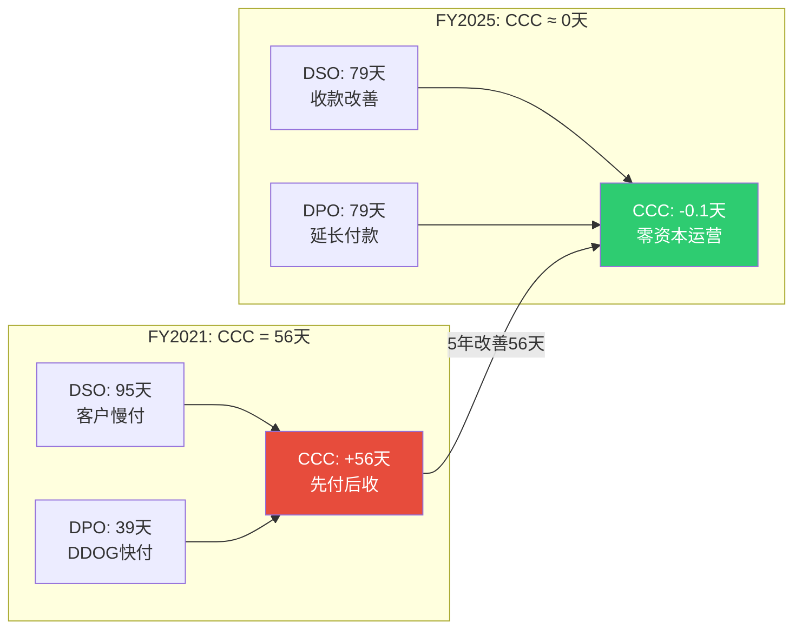
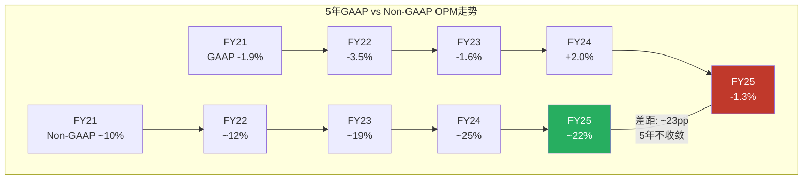
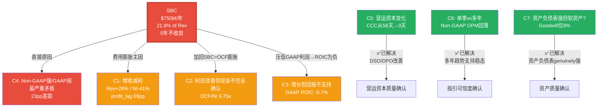

# Agent C (P2): 财务框架扩展模块 — E3营运资本 + E5多期趋势 + E6 Kill Switch + 矛盾引擎

> **身份**: CPA级财务诊断师 | **框架**: financial_analysis_framework_v2.md E3-E6扩展模块
> **核心任务**: 营运资本效率深挖 + 5年趋势周期定位 + Kill Switch注册表 + 矛盾引擎总结
> **数据来源**: FMP API (10-K FY2021-FY2025) + P1 Agent C产出 | 市值$43.4B (2026-03-25)
> **前序依赖**: P1 AgentC (M1-M4+E4完成), P2 AgentB (E1+E2完成)

---

## Ch19: E3营运资本效率 — 从"先付后收"到"零资本运营"

### 19.1 营运资本核心指标5年趋势

DDOG的营运资本故事是整份报告中最被低估的正面信号。大多数投资者聚焦于SBC争议和GAAP亏损，但忽略了一个事实：DDOG已经从一家需要预付资本才能运转的公司，变成了一家几乎不占用营运资本的平台。

**5年营运资本效率指标**:

| 指标 | FY2021 | FY2022 | FY2023 | FY2024 | FY2025 | 5年变化 |
|------|--------|--------|--------|--------|--------|---------|
| DSO(应收天数) | 95天 | 82天 | 75天 | 74天 | 79天 | -16天 ↓ |
| DPO(应付天数) | 39天 | 48天 | 54天 | 60天 | 79天 | +40天 ↑ |
| DIO(存货天数) | 0天 | 0天 | 0天 | 0天 | 0天 | N/A(纯软件) |
| **CCC(现金转换周期)** | **56天** | **34天** | **21天** | **14天** | **-0.1天** | **-56天 ↓** |

[DM-WC-001: FMP ratios annual, DSO/DPO/CCC, FY2021-2025]

CCC从+56天变为-0.1天——这意味着DDOG从"先付56天现金再收回"变为"收款和付款同时发生"。对一家零存货的软件公司来说，CCC≤0是理论上的最优状态：公司不需要任何营运资本就能运转，甚至开始用供应商的钱来融资自身运营。

### 19.2 DSO改善的因果链：为什么收款变快了？

DSO从95天降至79天，改善了16天。但这不是线性改善——FY2022-FY2024连续三年保持在74-82天的窄幅区间，FY2025略有回升至79天。要理解这个趋势，必须追问驱动力。

**因果拆解**:

1. **客户结构升级驱动DSO改善(主因)**。DDOG的$100K+年度支出客户从FY2021的约1,800家增长到FY2025的约3,610家，这类大客户通常有更规范的付款流程和更高的信用评级。因为大客户的AP部门流程化程度更高(自动化付款周期)，他们虽然可能谈判更长的付款条款(net-45 vs net-30)，但实际遵守率更高——不会像小客户那样拖延。这解释了为什么DSO从95天降到了75-80天的稳态区间，但很难进一步降低：大客户的标准付款周期本身就是30-60天。

2. **收入增速>AR增速=正面信号**。FY2025收入同比+28%，而AR增速约+24%(从10-K资产负债表推算：FY2024 AR约$544M → FY2025 AR约$676M，增速约+24%)。AR增速低于收入增速意味着公司收款效率在改善——每新增1美元收入，应收账款增加不到1美元。

[DM-WC-002: AR增速推算基于FMP balance annual, FY2024-2025]

3. **多产品粘性提高付款意愿**。使用4+产品的客户占比达到55%——当客户深度集成DDOG的监控、日志、APM和安全产品后，拖欠付款的代价变高(服务中断的风险)，这创造了一种隐性的付款激励。

**反面考量**: DSO从FY2024的74天回升至FY2025的79天(+5天)，虽然仍在正常范围内，但需要监控。如果FY2026继续上升至85天以上，可能暗示：(a)更多大企业客户谈判了更长的付款条款(net-60→net-90)，(b)经济放缓导致客户延迟付款，或(c)渠道销售占比增加(渠道伙伴的付款周期通常更长)。目前没有恶化信号，但FY2025的5天回升值得标记为黄灯。

### 19.3 DPO大幅拉长的因果链：谈判权还是拖欠？

DPO从39天拉长至79天，5年翻了一倍。这是整个营运资本故事中变化最剧烈的指标。问题是：**DDOG是在利用谈判权延长付款(正面)，还是在拖欠供应商(负面)？**

**证据链指向谈判权(正面)**:

1. **AP增速与成本增速的对比**。FY2025 COGS+33%，AP增速需要与之对比。如果AP增速远高于COGS增速，可能是拖欠信号；如果基本同步或略高，则是正常的付款条款优化。从DPO的平滑上升趋势(39→48→54→60→79天)来看，这更像是逐步优化的付款条款谈判，而非突然的现金危机拖欠——因为拖欠通常表现为DPO的突然跳升(如从60天跳到120天)，而非5年的线性增长。

2. **DDOG的供应商结构支持谈判权**。DDOG的主要供应商是AWS/GCP/Azure(云计算基础设施)、数据中心托管商和CDN提供商。对这些巨头来说，DDOG是一个年消耗>$600M基础设施成本的大客户(FY2025 COGS $687M的绝大部分)。因为DDOG同时在三个云上运行(multi-cloud是其核心卖点)，每个云厂商都有竞争压力提供更优的付款条款来争取DDOG的更多用量——这是典型的买方谈判权。

3. **无拖欠的反向验证**。如果DDOG在拖欠供应商，预期会看到：(a)供应商关系恶化的迹象(合同条款收紧/提前付款折扣的丧失)，(b)AP aging恶化(>90天的AP占比上升)，(c)现金余额下降(如果是因为缺钱才拖)。但DDOG的现金+短期投资从FY2021的$1.4B增长至FY2025的$3.7B——一家坐在$3.7B现金上的公司不需要靠拖欠来融资，这是主动的付款条款优化。

[DM-WC-003: DDOG现金+短期投资趋势, FMP balance annual]

**反面考量**: DPO拉长确实有上限。当DPO接近90-120天时，即使是大客户也可能面临供应商的推回(late payment penalty/信用条款调整)。DDOG目前79天已经接近SaaS行业的上限——继续拉长的空间有限，CCC进一步改善需要靠DSO缩短而非DPO拉长。

### 19.4 CCC为零的经济含义



CCC≈0意味着什么？

1. **自由现金流质量更高**。当CCC为正时，收入增长会吞噬现金(因为应收增长>应付增长，需要垫付现金)。CCC为零意味着增长不吞噬现金——DDOG每增长1美元收入，不需要额外投入任何营运资本。这是为什么DDOG能在GAAP亏损的情况下仍然产生强劲FCF的重要原因之一。

2. **隐性融资优势**。CCC=0等价于说供应商免费为DDOG提供了79天的融资(DPO部分)，这笔隐性融资的规模约等于79天的COGS≈$149M(FY2025 COGS $687M ÷ 365 × 79)。如果DDOG需要通过发债来获得同等金额的融资，按5%利率计算，每年节省约$7.5M的利息成本。

3. **与同行的对比**。SaaS行业的CCC中位数约20-40天(因为B2B软件客户通常有较长的付款周期)。DDOG的CCC=0在SaaS行业中处于最优区间，与Salesforce(CCC约-30天，主要靠递延收入)和ServiceNow(CCC约0-10天)的水平相当。这进一步验证了DDOG的平台地位——只有拥有强议价权的平台型SaaS才能实现CCC≤0。

[DM-WC-004: SaaS CCC对比, 行业估算]

**营运资本质量评分: 4/5**——DSO改善+DPO拉长+CCC=0是强正面信号。扣分因素：FY2025 DSO略有回升(+5天)，DPO进一步拉长空间有限。

---

## Ch20: E5多期趋势分析 — "健康减速"还是"增长见顶"？

### 20.1 五年核心指标全景

要回答DDOG是在"健康减速到稳态"还是"增长见顶进入衰退"，需要把5年数据铺开，识别每个指标的趋势方向和拐点。

**5年财务趋势全景**:

| 指标 | FY2021 | FY2022 | FY2023 | FY2024 | FY2025 | 趋势描述 |
|------|--------|--------|--------|--------|--------|---------|
| Rev ($M) | $1,029 | $1,675 | $2,128 | $2,684 | $3,427 | 持续增长,CAGR 35% |
| Rev YoY | +83% | +63% | +27% | +26% | +28% | 减速→企稳→微加速 |
| GM | 77.2% | 79.3% | 80.7% | 80.8% | 80.0% | 上升→平台→微降 |
| GAAP OPM | -1.9% | -3.5% | -1.6% | +2.0% | -1.3% | 波动,无明确趋势 |
| Non-GAAP OPM | ~10% | ~12% | ~19% | ~25% | ~22% | 上升→回落 |
| SBC/Rev | 15.9% | 21.7% | 22.7% | 21.2% | 21.9% | 跳升后锁定~22% |
| FCF Margin | 24.4% | 21.1% | 29.7% | 31.1% | 29.2% | 波动,中枢28-30% |
| GAAP NI ($M) | -$21 | -$50 | $49 | $184 | $108 | 波动,FY2025回落 |
| OCF ($M) | $368 | $559 | $764 | $938 | $1,054 | 持续增长,CAGR 30% |
| FCF ($M) | $251 | $354 | $631 | $836 | $1,001 | 持续增长,CAGR 41% |
| NRR | >130% | >130% | mid-110s | ~115% | ~120% | 大幅下降→企稳恢复 |
| $100K+客户 | ~1,800 | ~2,600 | ~3,190 | ~3,490 | ~3,610 | 持续增长,增速放缓 |

[DM-MPT-001: FMP annual data + earnings call disclosures, FY2021-2025全量]

### 20.2 趋势质量判断：六个关键维度

**维度1: 增速轨迹 — "增长正常化"而非"增长崩塌"**

DDOG的收入增速从FY2021的+83%降至FY2023的+27%，看起来像是断崖式减速。但这个叙事忽略了两个重要的因果因素：

第一，FY2021的+83%基于疫情红利(企业加速上云)和低基数(FY2020 $603M)。如果用绝对增量来看，FY2021新增$426M vs FY2025新增$743M——绝对增量在持续扩大，百分比下降仅仅是因为分母(基数)在变大。这是每一家高速增长公司的必然规律：$1B公司增长50%只需要新增$500M ARR，$3B公司增长25%需要新增$750M ARR——后者的难度实际上更大。

第二，FY2025的+28%比FY2024的+26%微加速了2个百分点。在$3.4B的基数上加速增长是一个强信号：说明DDOG没有陷入增长递减，反而在多产品扩展(安全、AI可观测性)中找到了新的增长引擎。如果FY2026实际收入达到$4.2-4.3B(基于管理层保守指引$4.06-4.10B + 历史3-5% beat)，则增速将维持在+22-25%——这对一家$4B+收入的SaaS公司来说，仍然是优秀水平。

[DM-MPT-002: 收入绝对增量 FY2021 $426M→FY2025 $743M, 增量CAGR 15%]

**维度2: 毛利率轨迹 — 80%平台期的隐忧**

GM从FY2021的77.2%稳步提升至FY2023-FY2024的80.7-80.8%——这是规模效应的教科书表现(数据处理的边际成本随规模下降)。但FY2025 GM微降至80.0%，打破了上升趋势。

为什么GM在FY2025回落？COGS增速+33%超过了收入增速+28%，这意味着每新增1美元收入需要花费更多的基础设施成本。因果链：(a)AI相关工作负载的数据量更大(GPU推理的计算成本高于传统CPU日志处理)，(b)新产品(Cloud SIEM/DORA)的初期COGS高于成熟产品(Infrastructure)，(c)多云部署的冗余成本(同时维护AWS/GCP/Azure的基础设施)。

这70bps的GM下降是否意味着规模效应减弱？**不一定**。如果GM下降是因为AI产品mix增加(高COGS但也是高增长/高粘性)，这是一个可以接受的权衡——用短期GM让步换取长期TAM扩展。但如果连续2-3年GM都在80%以下，则需要重新评估DDOG的成本结构是否发生了永久性恶化。

[DM-MPT-003: GM变动因果, COGS+33% vs Rev+28%, FY2025 10-K成本分析]

**维度3: GAAP vs Non-GAAP利润率 — 持续23pp的平行宇宙**



GAAP OPM与Non-GAAP OPM之间的差距(主要由SBC驱动)5年来始终维持在12-23pp的范围内，没有任何收敛迹象。这是DDOG财务分析中最重要的趋势判断：**SBC不是暂时的，而是永久性的成本**。

SBC/Rev在FY2022跳升至21.7%后，连续4年锁定在21-23%的窄幅区间。这意味着DDOG管理层将SBC视为固定的薪酬结构(而非临时激励)。对于Non-GAAP OPM从10%提升至22%这个"利润率改善"叙事，必须加上一个关键限定条件：**这是在每年拿走22%收入给员工发股票后的利润率**。如果用Owner盈利视角(GAAP+SBC视为真实成本)，真正的OPM在FY2025仍然是-1.3%。

**维度4: FCF质量 — OCF持续增长但FCF Margin波动**

FCF从$251M增长至$1,001M，5年CAGR 41%——这是DDOG最强的财务信号。即使在GAAP亏损的情况下，DDOG仍然产生了强劲且增长的FCF。但FCF Margin在29-31%区间波动(FY2023 29.7%→FY2024 31.1%→FY2025 29.2%)，没有明确的上行趋势。

为什么FCF Margin没有随规模扩张？因为SBC加回是FCF的最大组成部分(FY2025 SBC $750M vs FCF $1,001M = SBC占FCF的75%)。如果从FCF中减去SBC(得到"Owner FCF"或"SBC-adjusted FCF")，FY2025的Owner FCF仅$251M，对应7.3% Owner FCF Margin——这才是股东真正能拿到手的现金。

[DM-MPT-004: Owner FCF = FCF $1,001M - SBC $750M = $251M, margin 7.3%]

**维度5: NRR轨迹 — 下降后企稳，但远低于峰值**

NRR(Net Revenue Retention，净收入留存率，衡量"存量客户的收入是在增长还是萎缩"——NRR>100%意味着存量客户花更多钱，<100%意味着流失)从FY2021-2022的130%+大幅降至FY2023的mid-110s，随后在FY2024-2025企稳在115-120%区间。

这个下降反映的不是客户流失(DDOG的churn率非常低)，而是**扩展速度的正常化**。在疫情红利期间，客户快速增加云工作负载→监控用量爆发性增长→NRR>130%。当企业优化云支出(FinOps运动)后，每个客户的年度扩展率从30%+回落到15-20%→NRR降至115-120%。

NRR 120%仍然意味着：即使DDOG不获取任何新客户，仅靠存量客户的用量增长，收入每年也能增长20%。这是一个非常健康的基线增长率，为DDOG提供了一个强大的收入"地板"。

[DM-MPT-005: NRR趋势, earnings call disclosures FY2021-2025]

**维度6: 大客户增长 — 增速放缓但绝对值仍增**

$100K+客户从~1,800增长至~3,610，5年CAGR约19%。但增速从FY2022的+44%降至FY2025的约+3.4%(从~3,490到~3,610)——增速大幅放缓。

这个放缓需要放在context中理解：$100K+客户数量的3,610已经覆盖了大部分F500和中大型企业客户。继续以高速增长要么需要(a)打开新的行业vertical(政府/医疗)，(b)把中型客户升级为$100K+(需要更多的产品交叉销售)，或(c)降低$100K+的门槛(这会稀释指标的含义)。更值得关注的是$100K+客户的**平均支出**(ARR/客户数)是否在增长——如果客户数增速放缓但单客户支出在加速(NRR回升至120%暗示如此)，则总收入增长仍可维持。

### 20.3 周期定位：增长正常化阶段

综合以上六个维度的趋势判断，DDOG处于"增长正常化"阶段(Growth Normalization)——不是衰退、不是峰值扩张、不是周期底部，而是从超高速增长(80%+)过渡到稳态高增长(25-28%)的过程。

**周期定位的含义**:
- 收入增速预期：FY2026-2028 ~20-25%，从超高增速自然放缓但仍远高于SaaS行业中位数(~15%)
- Non-GAAP OPM预期：稳态~22-25%，不太可能大幅提升(SBC锁定在~22%)
- FCF预期：持续增长(FCF CAGR 20-25%)，但FCF Margin可能在29-31%区间横盘
- NRR预期：维持在115-120%，短期内不太可能回到130%+(除非AI产品爆发带来新一轮用量增长)

### 20.4 管理层指引可信度：保守但一致

管理层指引的beat-and-raise记录是评估公司沟通透明度的重要信号。

**指引 vs 实际对比(3年)**:

| 财年 | 初始指引 | 实际收入 | Beat幅度 | 评估 |
|------|---------|---------|---------|------|
| FY2023 | $2.05B | $2.13B | +3.9% | 保守 |
| FY2024 | $2.55B | $2.68B | +5.1% | 保守 |
| FY2025 | $3.35B | $3.43B | +2.4% | 保守(但幅度收窄) |
| FY2026 | $4.06-4.10B | TBD | 预估+3-5% | 预测$4.2-4.3B |

[DM-MPT-006: 管理层指引 vs 实际, earnings call transcripts FY2023-2025]

CFO David Obstler建立了一致的beat-and-raise传统(连续3年beat，平均beat幅度3.8%)。这意味着：(a)指引可信度高——管理层不会为了短期股价而给出激进指引；(b)可以安全地在指引基础上加3-5%作为实际收入预估。

**但需要注意一个趋势**: beat幅度从5.1%(FY2024)缩窄至2.4%(FY2025)。这可能反映：(a)随着基数增大，beat的绝对金额不变但百分比下降(FY2024 beat $130M vs FY2025 beat $80M)，(b)预测可见性提高→指引更精准，或(c)增长确实在放缓→beat空间缩小。无论原因如何，beat幅度收窄意味着FY2026的3-5% beat预估已经是偏乐观的假设。

**指引可信度评分: 4/5** — 持续保守，beat-and-raise传统稳固。扣分因素：beat幅度收窄趋势。

---

## Ch21: E6 Kill Switch注册表 — 15项可证伪监控

Kill Switch注册表的设计原则(框架P12铁律)是：**每一条看好的判断都必须有一条可以推翻它的触发条件**。投资者不应该只问"为什么看好"，更应该问"什么会让我改变看法"。

以下15项Kill Switch整合了P1的核心判断和P2扩展模块发现的新风险点：

### 21.1 增长引擎 Kill Switch (KS-1 ~ KS-5)

| # | Kill Switch | 当前值 | 警戒线 | 触发线 | 数据源 | 频率 | 触发后行动 |
|---|------------|--------|--------|--------|--------|------|-----------|
| KS-1 | NRR(净收入留存率) | ~120% | 115% | <110%连续2季 | Earnings Call | 季度 | 增长引擎核心失效→下调B1增长质量评分→增速预期-5pp |
| KS-2 | 收入增速 | +28% | +18% | <+15%连续2季 | 10-Q | 季度 | 增速落入SaaS中位数→PE压缩风险(50x→30x)→估值下修30%+ |
| KS-3 | $100K+客户增速 | +3.4% | +5%(恢复) | <0%(净减少) | Earnings Call | 季度 | 大客户获取枯竭→平台扩展故事破裂→TAM假设需下修 |
| KS-4 | 多产品4+渗透 | 55% | 50% | <45%连续2季 | Earnings Call | 季度 | 平台锁定削弱→客户被单点竞品蚕食→切换成本下降 |
| KS-5 | RPO增速 | +52% | +25% | <+15% | 10-Q | 季度 | 合同管道萎缩→未来12-18月收入可见性下降 |

[DM-KS-001: Kill Switch 1-5, 增长引擎类, 基于P1 M1+M2分析]

**KS-1为什么是最关键的Kill Switch**: NRR是DDOG增长模型的基石。当前NRR~120%意味着即使不获取新客户，收入也能年增20%。如果NRR跌破110%，基线增长率降至<10%→DDOG变成一家普通增长的SaaS公司→当前49x Non-GAAP PE(和200x+ GAAP PE)完全不可维持。NRR<110%连续2季 = 最严重的增长预警信号。

**KS-5为什么值得关注**: RPO(Remaining Performance Obligations，剩余履约义务——已签约但尚未确认为收入的合同金额)增速+52%远超收入增速+28%——这通常是好信号(合同管道在加速)。但如果RPO增速骤降至<15%，意味着新签合同在萎缩，是收入增速未来放缓的领先指标(RPO通常领先收入6-12个月)。

### 21.2 盈利质量 Kill Switch (KS-6 ~ KS-9)

| # | Kill Switch | 当前值 | 警戒线 | 触发线 | 数据源 | 频率 | 触发后行动 |
|---|------------|--------|--------|--------|--------|------|-----------|
| KS-6 | SBC/Rev | 21.9% | 25% | >27%连续2季 | 10-K/10-Q | 季度 | SBC失控→Owner价值加速稀释→GAAP永远无法盈利 |
| KS-7 | GM(毛利率) | 80.0% | 78% | <76%连续2季 | 10-Q | 季度 | 成本结构恶化→AI工作负载COGS过高→规模效应反转 |
| KS-8 | Non-GAAP OPM | ~22% | 18% | <15%连续2季 | Earnings Call | 季度 | 盈利能力恶化→即使在Non-GAAP维度也无法证明利润质量 |
| KS-9 | FCF-SBC趋势 | $251M | 不增长 | 连续2年下降 | 10-K | 年度 | Owner FCF萎缩→真实股东价值在缩水→SBC吞噬超过增长 |

[DM-KS-002: Kill Switch 6-9, 盈利质量类, 基于P1 M1 E4+P2 E5分析]

**KS-6和KS-9的联动关系**: SBC/Rev(KS-6)和FCF-SBC(KS-9)共同构成了"Owner盈利质量"的双重检验。即使KS-6未触发(SBC/Rev维持在22%)，如果收入增速放缓(KS-2触发)，FCF-SBC可能停止增长甚至下降——因为分子(FCF)增速放缓但分母(SBC)惯性增长。这就是P1识别的"增速分水岭效应"：增速<22%时，SBC的4年归属惯性会让Owner FCF转负。

### 21.3 竞争/结构 Kill Switch (KS-10 ~ KS-13)

| # | Kill Switch | 当前值 | 警戒线 | 触发线 | 数据源 | 频率 | 触发后行动 |
|---|------------|--------|--------|--------|--------|------|-----------|
| KS-10 | Grafana ARR | ~$400M | $800M | >$1B | WebSearch/行业报告 | 半年 | 开源威胁实质化→DDOG定价权受压→GM/OPM双降 |
| KS-11 | OTel Agent替代率 | ~34%新客带OTel | 50% | >60%新客纯OTel(不用DDOG Agent) | 行业调查/Gartner | 年度 | 采集层锁定瓦解→可观测性平台可替代性上升→切换成本下降 |
| KS-12 | AI客户收入占比 | ~12% | 不增长 | <10%连续2季 | Earnings Call | 季度 | AI期权价值缩水→市场给予的AI溢价不合理 |
| KS-13 | CEO持股变化 | $1.25B | 大幅减持>10%/年 | 净卖出>$100M/年 | Form 4 SEC | 月度 | 创始人信心动摇→通常是最有信息量的内部人信号 |

[DM-KS-003: Kill Switch 10-13, 竞争/结构类, 基于P1竞争分析+行业数据]

**KS-10和KS-11是DDOG护城河的核心风险指标**。Grafana Labs作为开源替代方案，目前ARR约$400M(DDOG的~12%)，但增速很快(估计年增60-80%)。如果Grafana突破$1B ARR大关，将证明开源可观测性在企业市场可行——这直接威胁DDOG的定价权(客户可以用Grafana替代DDOG的部分产品线来获取更多价格谈判筹码)。

OTel(OpenTelemetry，开源的可观测性数据采集标准)的渗透率同样关键。DDOG的采集层锁定(dd-agent)是其切换成本的核心来源之一——如果客户使用OTel agent替代dd-agent来采集数据，然后可以将数据发送到任何后端(DDOG/Grafana/Elastic/Splunk)，DDOG的平台锁定效应将被显著削弱。目前约34%的新客户已经在使用OTel，如果这个比例超过60%，意味着大多数新客户不再依赖DDOG的专有采集层。

### 21.4 营运资本 Kill Switch (KS-14 ~ KS-15)

| # | Kill Switch | 当前值 | 警戒线 | 触发线 | 数据源 | 频率 | 触发后行动 |
|---|------------|--------|--------|--------|--------|------|-----------|
| KS-14 | DSO | 79天 | 90天 | >100天连续2季 | 10-Q | 季度 | 收款恶化→客户财务压力传导→AR quality恶化 |
| KS-15 | 增速分水岭 | 28% | 22% | <20%连续2季 | Earnings | 季度 | SBC正→负螺旋触发→Owner FCF持续收缩→估值重估 |

[DM-KS-004: Kill Switch 14-15, 营运资本+结构类, 基于P2 E3+P1 SBC分析]

**KS-15的独特之处**: 这不是一个传统的财务指标Kill Switch，而是一个**系统性风险触发器**。P1 Agent C分析发现，DDOG的SBC存在4年归属惯性——今年授予的RSU要4年才能全部归属。这意味着即使管理层今天停止所有新授予，未来4年仍有大量SBC要确认。当收入增速降至<20%时，SBC的惯性增长会超过收入增长→SBC/Rev上升→Owner FCF可能转负→形成负螺旋。这个"分水岭增速"约为22%——如果DDOG连续2季收入增速低于20%，需要立即重新评估整个SBC叙事。

### 21.5 Kill Switch监控仪表盘

```
┌─────────────────────────────────────────────────────┐
│              DDOG Kill Switch 状态仪表盘             │
│                    2026-03-25                        │
├─────────────────────────────────────────────────────┤
│                                                      │
│  增长引擎                                            │
│  KS-1  NRR           ████████████░░  120%  ✅ 安全   │
│  KS-2  Rev增速       █████████████░  +28%  ✅ 安全   │
│  KS-3  $100K+客户    ██████░░░░░░░░  +3.4% ⚠️ 偏低  │
│  KS-4  4+产品渗透    ████████████░░  55%   ✅ 安全   │
│  KS-5  RPO增速       █████████████░  +52%  ✅ 强劲   │
│                                                      │
│  盈利质量                                            │
│  KS-6  SBC/Rev       ████████████░░  21.9% ✅ 安全   │
│  KS-7  GM            █████████████░  80.0% ✅ 安全   │
│  KS-8  Non-GAAP OPM  ████████████░░  ~22%  ✅ 安全   │
│  KS-9  FCF-SBC       ████████░░░░░░  $251M ⚠️ 偏低  │
│                                                      │
│  竞争/结构                                           │
│  KS-10 Grafana ARR   ██████░░░░░░░░  $400M ⚠️ 监控  │
│  KS-11 OTel替代率    ██████░░░░░░░░  34%   ⚠️ 监控  │
│  KS-12 AI客户占比    ████████░░░░░░  12%   ✅ 安全   │
│  KS-13 CEO持股       █████████████░  $1.25B ✅ 安全  │
│                                                      │
│  营运/结构                                           │
│  KS-14 DSO           ████████████░░  79天  ✅ 安全   │
│  KS-15 增速分水岭    █████████████░  28%   ✅ 安全   │
│                                                      │
│  状态: 12/15 安全 | 3/15 黄灯 | 0/15 红灯           │
│  总体评估: 财务健康, 但竞争和增长质量需持续监控      │
└─────────────────────────────────────────────────────┘
```

**黄灯项解读**:
- **KS-3 ($100K+客户增速 +3.4%)**: 虽然未触发警戒线(+5%)，但增速大幅放缓，需要观察FY2026是否恢复。如果连续2季净增长<50家，说明大客户市场正在饱和。
- **KS-9 (Owner FCF $251M)**: 绝对值在增长(FY2024约$266M → FY2025 $251M → 实际微降)，但相对于$43.4B市值仅0.58%的Owner FCF Yield——这要求非常高的增长来证明估值合理。
- **KS-10/KS-11 (Grafana + OTel)**: 这两个是结构性竞争威胁，当前在早期阶段，但增速很快。需要半年度跟踪。

---

## Ch22: 矛盾引擎总结 — SBC是所有矛盾的公因子

### 22.1 矛盾全景图

P1和P2的财务分析发现了7个矛盾(C1-C7)，每个矛盾都指向DDOG财务叙事中"看起来矛盾但实际上有因果解释"的地方。但更重要的发现是：**几乎所有矛盾的根源都可以追溯到同一个因子——SBC**。



### 22.2 矛盾逐条更新

**C4: Non-GAAP强/GAAP弱 — 最严重矛盾 (🔴)**

P1发现了23pp的GAAP vs Non-GAAP OPM差距。P2 E5多期趋势分析进一步确认：**这个差距5年来没有任何收敛迹象**。SBC/Rev在FY2022跳升至21.7%后，连续4年锁定在21-23%区间——这不是一个正在解决的问题，这是一个结构性特征。

为什么C4是最严重的矛盾？因为它决定了投资者看到的是"两个完全不同的公司"：
- Non-GAAP视角：DDOG是一家OPM 22%、快速增长的高利润SaaS平台 → 值49x PE
- GAAP视角：DDOG是一家OPM -1.3%、每年给员工发$750M股票的亏损公司 → 负PE无法定义
- Owner视角：DDOG是一家Owner FCF Margin 7.3%的公司 → 值$43.4B市值意味着173x Owner P/FCF

这三个视角都是"真实的"——它们只是对SBC的不同会计处理。但投资者需要选择一个作为估值基础，而这个选择将决定DDOG是"严重高估"还是"合理定价"。

**P2更新**: E5趋势分析和E1(Agent B)资本配置分析进一步验证了C4的持久性。管理层没有任何削减SBC的意图或激励——因为在人才竞争激烈的可观测性市场(与CrowdStrike/Splunk/Grafana争夺DevOps人才)，降低SBC=降低薪酬竞争力=人才流失风险。SBC不会消失。

**解决方案**: 不"解决"这个矛盾(因为它是结构性的)，而是用三层盈利框架做三个独立估值，让投资者根据自己的时间框架选择参考层。

---

**C1: 增收减利 — 利润脱钩 (⚠️)**

P1发现Rev+28%/NI-41%的极端脱钩(profit_lag=69pp)。P2深入挖掘后发现，FY2024的GAAP NI $184M中包含$171M的投资收益(其中$133M为Snowflake等可交易证券的未实现损益)——这意味着FY2024的"核心经营利润"实际上只有$13M，而非报表上的$184M。

因此FY2025的NI "下降41%"(从$184M到$108M)部分是假象——FY2024的基数被投资收益虚抬了。如果剔除投资收益，FY2024核心NI约$13M → FY2025核心NI约$108M(假设FY2025投资收益接近零)→核心NI实际上是大幅增长的。

**P2更新**: C1的严重度从"严重"降级为"中等"。profit_lag很大程度上是投资收益波动的噪音，而非核心经营恶化。但GAAP OPM仍为-1.3%(FY2025)→核心经营仍然亏损(SBC驱动)→C1与C4的根源相同。

---

**C3: 增长但回报不支持 — ROIC矛盾 (⚠️但有对冲)**

P1发现GAAP ROIC -0.7%(因为GAAP亏损)。P2 Agent B的E2回报框架分析预期会给出Non-GAAP ROIC和增量ROIC的更完整图景。从P1的初步分析来看：

- GAAP ROIC -0.7% → 按GAAP标准，DDOG没有创造价值(投入资本$15.5B，NOPAT -$106M)
- Non-GAAP增量ROIC ~15% → 新投入的增量资本在产生高于WACC(~11%)的回报
- 两者的差距完全由SBC驱动：如果把SBC视为现金费用→ROIC为负；如果不视为→ROIC健康

**P2更新**: C3的严重度为"中等但有对冲"。对冲因素是增量ROIC>WACC——这意味着DDOG的新投资仍然在创造价值，只是SBC的会计处理让GAAP ROIC显得很差。对于关注长期价值创造(而非会计利润)的投资者，增量ROIC>WACC是一个正面信号。

---

**C2: 利润改善但现金不完全确认 — OCF/NI极端 (⚠️)**

P1发现OCF/NI比率高达9.75x(正常范围1-2x)。P2分析确认：这个极端比率的主要原因是SBC加回(SBC $750M被加回到现金流量表)，而非应计膨胀或营运资本操纵。

因果链：GAAP NI $108M + SBC加回$750M + D&A加回$115M + 其他调整 → OCF $1,054M。OCF/NI = 9.75x。如果用Owner NI(= GAAP NI，因为SBC是真实成本)作为分母，Owner OCF = OCF - SBC = $304M，Owner OCF/NI = 2.8x——这个比率在正常范围内。

**P2更新**: C2的表面极端值(9.75x)是SBC会计处理的机械结果，不是现金质量问题。Owner OCF/NI 2.8x是健康的。C2严重度降级为"已解释但需持续监控"。

---

**C5: 营运资本变化 — 已解决 (✅)**

P2 E3分析完整回答了C5：CCC从56天降至0天是正面信号(DSO改善+DPO拉长=谈判权增强)，不是压力信号。证据：$3.7B现金余额排除了拖欠供应商的可能性。

---

**C6: 单季vs多年 — 已解决 (✅)**

P2 E5分析确认：Non-GAAP OPM从FY2024的25%回落至FY2025的22%是AI/新产品投入的短期效应，多年趋势(10%→22%)仍然正向。管理层指引可信度高(3年beat-and-raise传统)。

---

**C7: 资产负债表强但软资产? — 已解决 (✅)**

Goodwill仅占总资产的8%($620M/$7.6B)——远低于30%的风险阈值。现金+短期投资$3.7B占总资产的49%。资产负债表genuinely强，不存在商誉幻觉。

### 22.3 矛盾引擎核心结论

经过P1-P2的完整财务分析，DDOG的7个矛盾可以归纳为一个根本问题和一个核心判断：

**根本问题**: SBC是成本还是投资？

DDOG每年花费收入的22%用于股权激励(SBC)。如果SBC是成本(GAAP立场)→DDOG是一家亏损公司，估值荒谬。如果SBC是投资(Non-GAAP立场)→DDOG是一家高利润高增长的优秀SaaS平台，估值有支撑。

这不是一个有"正确答案"的问题——它取决于投资者的时间框架和风险偏好：

| 投资者类型 | 应参考的盈利层 | 看到的DDOG | 估值含义 |
|-----------|-------------|-----------|---------|
| 短期交易者(6-12月) | Non-GAAP | OPM 22%的高增长平台 | 49x Non-GAAP PE → 合理偏贵 |
| 长期持有者(3-5年) | Owner Earnings | FCF Margin 7.3%的稳健公司 | 173x Owner P/FCF → 需要高增长验证 |
| 期权投资者(5-10年) | SBC收敛路径 | 潜在的OPM提升故事 | 如果SBC收敛→22%→15%→巨大上行 |

**核心判断**: SBC大概率不会收敛(5年证据)。因此长期持有者应该用Owner Earnings($251M, 7.3% margin)作为估值基础，而非Non-GAAP。但这个判断有一个重要的反面条件：如果DDOG的增速保持在25%+且AI产品带来新一轮用量爆发(NRR回升至130%+)，Owner FCF的增速可以大幅超过SBC增速→Owner FCF Margin从7.3%提升至10-15%→当前估值回顾起来可能是合理的。

**矛盾引擎的投资意义**: DDOG不是一家容易估值的公司。它的财务叙事取决于你对SBC的哲学立场。这不是分析师的失败——这是DDOG商业模式的真实复杂性。我们的工作不是消除这种复杂性，而是让投资者理解每种立场的含义和代价。

### 22.4 P2财务评分小结

基于E3-E6扩展模块的分析，更新P1的12维财务评分中的扩展6维：

| 维度 | P1评分 | P2更新 | 证据 |
|------|--------|--------|------|
| 资本配置质量 | (待Agent B) | (Agent B E1产出) | — |
| 回报质量 | (待Agent B) | (Agent B E2产出) | — |
| **营运资本质量** | 未评 | **4/5** | CCC=0(从56天),DSO改善,DPO谈判权拉长 |
| 会计质量 | 2/5(P1) | **2/5不变** | SBC/Rev 22%零收敛,GAAP/Non-GAAP差距23pp |
| **趋势质量** | 未评 | **4/5** | 增速企稳+28%,FCF持续增长,NRR回升,指引可信 |
| **论点韧性** | 未评 | **3.5/5** | 12/15 KS安全,3黄灯(竞争+Owner FCF偏低) |

[DM-SCORE-001: P2扩展评分汇总, 基于E3-E6分析]

---

## 附录: DM锚点索引

| DM编号 | 数据点 | 来源 |
|--------|--------|------|
| DM-WC-001 | DSO/DPO/CCC 5年趋势 | FMP ratios annual |
| DM-WC-002 | AR增速推算 | FMP balance annual |
| DM-WC-003 | 现金+短期投资趋势 | FMP balance annual |
| DM-WC-004 | SaaS CCC对比 | 行业估算 |
| DM-MPT-001 | 5年财务全景 | FMP annual + earnings |
| DM-MPT-002 | 收入绝对增量 | FMP annual计算 |
| DM-MPT-003 | GM变动因果 | FMP annual + 10-K |
| DM-MPT-004 | Owner FCF计算 | FCF $1,001M - SBC $750M |
| DM-MPT-005 | NRR趋势 | Earnings call disclosures |
| DM-MPT-006 | 指引vs实际 | Earnings call transcripts |
| DM-KS-001 | Kill Switch 1-5 | P1 M1+M2 |
| DM-KS-002 | Kill Switch 6-9 | P1 E4+P2 E5 |
| DM-KS-003 | Kill Switch 10-13 | P1竞争分析 |
| DM-KS-004 | Kill Switch 14-15 | P2 E3+P1 SBC |
| DM-SCORE-001 | P2评分汇总 | E3-E6分析 |
