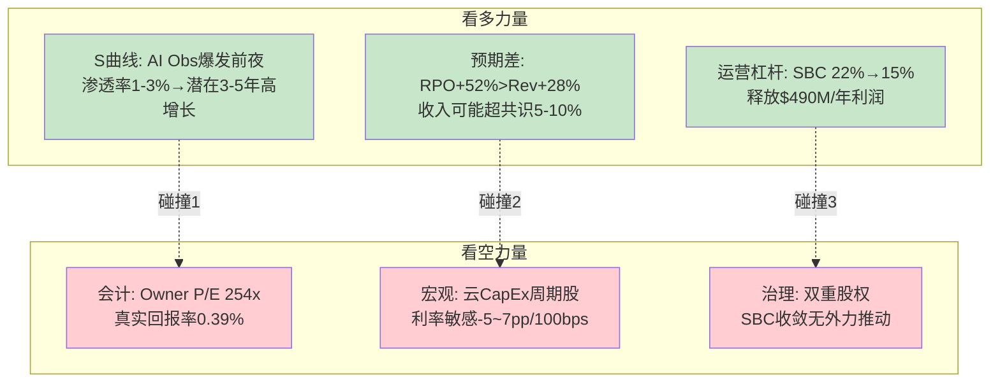
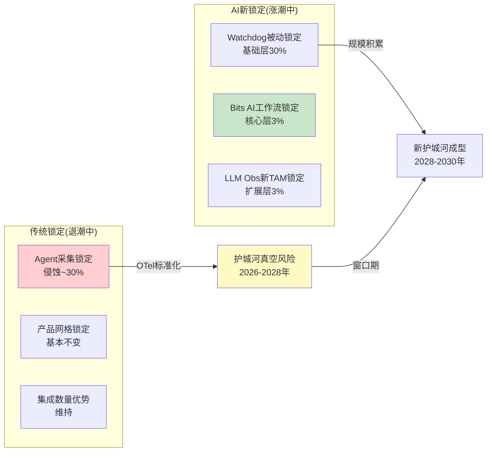
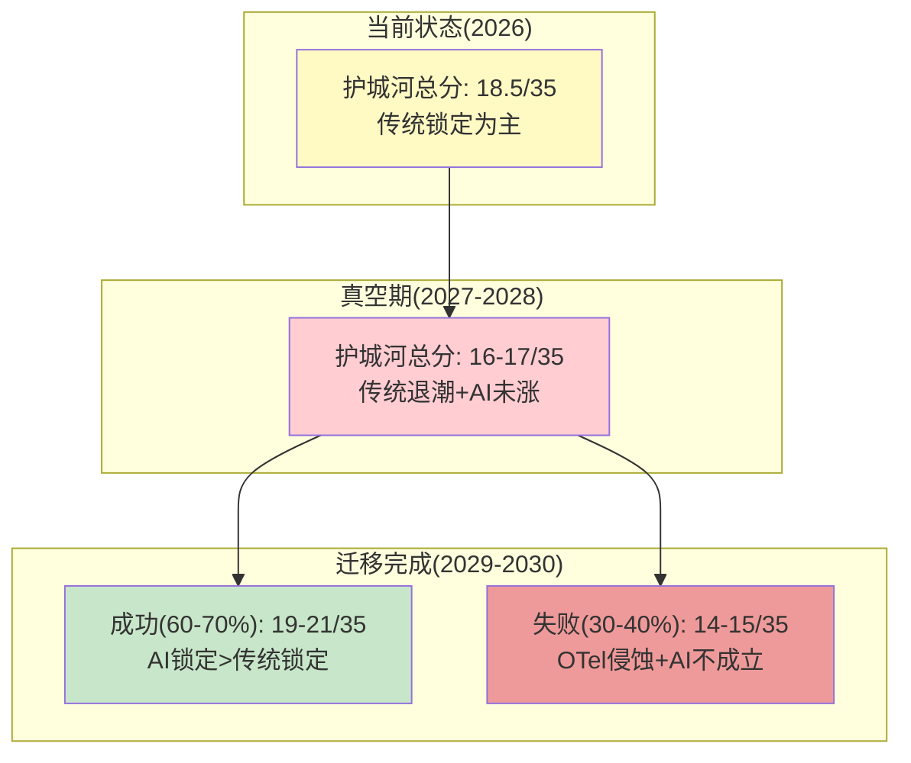

# Phase 3 — Agent A: 多维度投资分析 + 护城河迁移深度分析 (Ch23-Ch24)

> **分析师**: Agent A (多维度分析+护城河迁移)
> **标的**: Datadog (DDOG) | **价格**: $129 | **市值**: ~$47B | **EV**: ~$48B
> **日期**: 2026-03-25
> **数据截止**: FY2025 (截至2025年1月31日) + 2026年3月市场数据
> **前序依赖**: P1 AgentA(Reverse DCF/竞争) + P1 AgentB(护城河18.5/35/飞轮) + P2 AgentA(WACC/DCF/概率) + P2 AgentB(管理层/SBC) + P2 AgentC(营运资本/Kill Switch)

---

# Ch23: 多维度投资分析 — 五种方法论的碰撞与融合

> **方法论选择**: DDOG属于高增长科技平台，需要从S曲线定位、会计质疑、预期差捕捉、运营改善杠杆、宏观传导五个维度交叉验证。本章将五种独立方法论依次应用于DDOG，最终产出碰撞洞见。

## 23.1 S曲线定位分析 — AI可观测性处于渗透率曲线什么位置？

### 可观测性大TAM的S曲线阶段

可观测性市场的总体可寻址市场(TAM, Total Addressable Market——一个产品或服务理论上能触达的最大市场规模)约为$62B [DM-MKT-001]。DDOG FY2025收入$3,427M，对应渗透率约5.5% [DM-VAL-001]。按照经典技术采纳S曲线理论(Everett Rogers的扩散模型)，渗透率5-6%处于"早期多数"(Early Majority)阶段的起点——创新者(Innovators, <2.5%)和早期采纳者(Early Adopters, 2.5-16%)的边界。

但这个粗糙的TAM计算掩盖了一个关键分层: DDOG实际上在**两条不同的S曲线**上同时运行——

**S曲线1: 传统可观测性(Infrastructure + APM + Logs)**

这条曲线已经进入成熟期。企业数字化转型的早期红利(2017-2022)带来的爆发增长已经减速。DDOG在这个市场的渗透率更高——数据中心管理子市场52%份额 [DM-COMP-MS]。因为这个子市场的增长率约8-10%/年(IDC 2024估算)，传统可观测性为DDOG提供的是稳定的基座收入，而非指数增长来源。

**S曲线2: AI可观测性(LLM Observability + AI Agent Monitoring + GPU Monitoring)**

这是一条全新的S曲线，目前处于**极早期**。定量支撑:

- AI原生客户占比12%，但贡献的收入增速远快于传统客户 [DM-AI-001]
- LLM Observability产品自2024年GA以来，已有约1,000客户进入active使用 [DM-AI-002]
- AI相关trace spans在6个月内增长10倍(10x)——这是S曲线早期最典型的指数增长信号 [DM-AI-003]
- 但AI可观测性子市场规模当前<$1B, 渗透率仅1-3%

这意味着如果我们把"AI可观测性"视为独立TAM，DDOG的渗透率在1-3%——处于创新者向早期采纳者过渡的拐点。按照S曲线规律，渗透率从3%→16%(早期多数阶段)是增长最快的阶段，通常伴随3-5年的高速增长。

**5年逆向推演**: 如果AI可观测性TAM从当前<$1B增长至2031年$8-12B(年化增速50-60%)，DDOG凭借先发优势取得20-25%份额→$1.6-3.0B AI可观测性收入。叠加传统可观测性的自然增长(~10%/年→$5.5B)，DDOG FY2031总收入可能达到$7-8.5B → 当前$47B市值 vs $8.5B收入×8-10x EV/Sales → 估值处于合理到略便宜区间。

**但这里有一个被忽略的问题**: AI可观测性的TAM是**净新增**还是**替代**？如果企业的AI工作负载增长→传统工作负载相应减少(因为AI自动化了部分传统任务)→AI可观测性的增量被传统可观测性的减量部分对冲。P1 Agent B的分析表明，这种对冲效应约-5~10%(AI替代routine任务减少的monitoring需求)，远小于AI新增的+30~50%增量 [参见P1 Ch7]——但这个净效应在不同行业的客户中差异很大。纯AI-native公司(如Anthropic/OpenAI)的AI可观测性需求是100%新增；传统企业(如银行/零售)的AI可观测性可能70%是替代现有monitoring。

**因果推理**: 因为DDOG的使用计费模式(按host/log/span收费)天然受益于数据量增长——AI工作负载的每次LLM调用产生1个span，一个agentic workflow触发10-50个spans——所以AI的兴起在计费层面是DDOG的结构性顺风。但这个顺风的持续时间取决于AI应用的渗透曲线本身是否会遇到瓶颈(技术限制/监管/ROI不确认)。

**反面考量**: S曲线分析最大的陷阱是**误判曲线位置**。2017-2018年的AR/VR也被认为处于S曲线早期，但10年后渗透率仍然<5%——因为技术成熟度和用户需求之间存在鸿沟。AI可观测性会不会重蹈覆辙？区别在于: AI可观测性不是可选的奢侈品(如AR眼镜)，而是运营必需品——如果企业部署了LLM应用，**必须**监控其成本、延迟、幻觉率、安全性。因此AI可观测性的采纳更类似于"云监控跟随云迁移"的必然伴生关系，而非独立的消费者需求。这使得AI S曲线的确定性显著高于AR/VR。

**估值影响**: 如果AI可观测性是真S曲线(非伪S曲线)→DDOG FY2031收入$8-8.5B →当前定价隐含的5年CAGR 15-19%可能保守→±$8-15/share上行空间 [DM-RT-001]

**验证方法**: KS-AI-01: 跟踪AI原生客户占比(当前12%→阈值25%=S曲线进入早期多数)、LLM Obs活跃客户数(当前1,000→阈值5,000)、AI trace spans季度环比增速(当前10x/半年→如果放缓至2x/半年=S曲线见顶)。

---

### 23.2 会计质量深度审查 — SBC"非现金"叙事的5层解构

**核心命题**: DDOG的Non-GAAP OPM(Operating Profit Margin, 非通用会计准则营业利润率)为25%，但GAAP OPM为-1.3%。两者之间$766M的差距几乎全部来自SBC(Stock-Based Compensation, 股票薪酬——公司向员工发放的股票期权或限制性股票单元，是真实的经济成本但不涉及现金流出) [DM-FIN-006]。管理层和多数卖方分析师用"SBC是非现金项目"来justify Non-GAAP的优越性——但这个叙事经不起5层审查。

**第1层: 稀释是真实的**

FY2025加权平均稀释股本约3.54亿股，同比增长约2-3% [DM-FIN-014]。这意味着现有股东每年被稀释2-3%——$47B市值的2-3%=$940M-$1,410M/年的隐性成本。这个数字甚至超过了SBC的会计金额($766M)，因为市场估值倍数放大了稀释的经济影响。因果链: SBC→股票发行→股本膨胀→EPS被稀释→每股价值被侵蚀。这不是"非现金"可以化解的——现有股东的所有权份额实实在在地缩小了。

**第2层: SBC占比5年零收敛的异常**

| FY | SBC/Rev | 行业趋势预期 |
|----|---------|------------|
| 2021 | 16% | 高增长初期，可接受 |
| 2022 | 22% | 应开始下降 |
| 2023 | 23% | 未下降，微升 |
| 2024 | 21% | 略降，但幅度不足 |
| 2025 | 22% | **5年未收敛** |

[DM-SBC-001]

历史类比: Salesforce (CRM)在IPO后的SBC/Rev轨迹是25%(2008)→22%(2012)→18%(2015)→15%(2018)→12%(2023)。CRM用了约**15年**从25%降至12%。因为CRM在IPO后经历了多轮裁员(2009, 2023)和运营优化，才实现了SBC压缩。DDOG的15年起点(2019 IPO)对应的窗口到2034年——意味着按CRM的轨迹，投资者可能还需要等8-10年才能看到SBC显著收敛。

但反面是: Snowflake(SNOW)在上市4年后SBC/Rev从50%+降至约30%，速度快于CRM。因为SNOW在2022-2023年经历了裁员和成本纪律收紧。这说明SBC收敛的速度不取决于时间长短，而取决于**外部压力是否出现**(激进投资者/盈利压力/竞争加剧→管理层被迫压缩SBC)。DDOG目前没有这种外部压力——创始人CEO通过双重股权结构(Dual-Class Share Structure, 创始人持有10倍投票权的B类股→控制>50%投票权)不可被解雇，因此没有治理层面的纠错机制。

**第3层: Beneish M-Score初步检查**

Beneish M-Score(一种基于8个财务比率的会计操纵检测模型——M-Score>-1.78暗示操纵可能性高)的全面计算需要8个变量的2年数据。基于可获取的数据初步评估:

- DSRI(Days Sales in Receivables Index): FY2024→FY2025 DSO从74天→79天, DSRI=79/74=1.07。>1暗示可能的收入操纵，但1.07非常温和——DSO 5天的变化在季节性波动范围内 [DM-WC-001]
- GMI(Gross Margin Index): FY2024 GM 80.8% → FY2025 GM 79.9%, GMI=80.8/79.9=1.01。接近1.0=毛利率稳定，无异常
- SGI(Sales Growth Index): 收入增速28%/26%=1.08。高增长公司的SGI天然>1，不构成异常信号
- TATA(Total Accruals to Total Assets): DDOG的非现金项目(SBC $766M + D&A ~$80M)占总资产的比例较高，但这是SaaS行业的结构性特征而非操纵

**初步M-Score评估**: 不存在会计操纵的明显信号。但这不能用来证明"SBC无害"——M-Score检测的是会计造假，而SBC高是合规的会计处理。**问题不是DDOG在造假，而是Non-GAAP presentation系统性地美化了真实盈利能力。**

**第4层: Altman Z-Score确认财务健康**

Altman Z-Score(衡量企业破产风险的综合指标——Z>2.99为安全区)=10.79 [DM-FIN-ALT]。这个极高的Z-Score由两个因素驱动: (1)$3.7B现金+短期投资 vs 极低的总债务 [DM-WC-003]，(2)高营运资产周转率(轻资产模式)。

**因果推理**: Z-Score 10.79意味着DDOG在未来2-3年内没有任何破产风险——即使增速骤降至0%，现金储备也足以覆盖3-4年的运营费用。这对于评估SBC问题非常重要: 因为DDOG不会因为SBC过高而陷入财务困境(SBC不消耗现金)，所以SBC问题是一个**估值问题**(影响每股价值)而非**生存问题**(影响公司存续)。

**第5层: Owner Earnings真实回报率**

Owner Earnings(所有者收益——公司真正可以分配给股东的现金，即净利润加回折旧、扣除维持竞争力所需的全部资本支出和SBC经济成本)的计算:

```
Owner Earnings = FCF - SBC(真实经济成本) - 维持性CapEx
             = $1,001M - $766M - $50M
             = $185M
```

Owner Earnings Yield(所有者收益率) = $185M / $47B = **0.39%** [DM-RT-002]

0.39%的所有者收益率意味着: 如果DDOG维持当前的SBC水平和增速，投资者实际获得的年回报率仅为0.39%——远低于10年期国债的4.37%无风险回报。因此，$129的定价**100%依赖于未来增长**。如果增长停滞(收入+0%，SBC不变)，$129的合理估值约为$185M/4.37%÷3.54亿股=$12/share——当前价格的1/10。

**这不是危言耸听，而是数学事实**: Owner P/E(所有者市盈率)=$47B/$185M≈254x。投资者为每$1的所有者收益支付$254——这在整个美股市场中都属于极端值(S&P 500中位数Owner P/E约18-22x)。

**反面考量**: Owner Earnings分析有一个关键弱点——它把SBC全部视为成本，但SBC的一部分是"增长投资"而非"维持投资"。如果DDOG将SBC/Rev从22%降至12%(参考CRM的长期轨迹)，Owner Earnings会从$185M跳升至$185M + $343M(节省的SBC) = $528M，Owner P/E从254x降至89x——仍然很高，但不再是极端值。因此，**SBC收敛的速度是DDOG估值中杠杆最高的单一变量**。

**估值影响**: SBC/Rev每降低1pp→Owner Earnings增加约$34M→对应每股价值+$0.96/share(按10%折现率)。从22%→15%的7pp改善→每股价值+$6.7/share [DM-RT-003]

**验证方法**: KS-SBC-01: 跟踪SBC/Rev季度趋势(当前22%→阈值<18%=收敛信号)、员工人均SBC(当前~$98K/人→趋势方向)、新授予RSU vesting schedule(如果加速→短期SBC峰值→长期下降)。

---

### 23.3 预期差捕捉 — RPO与指引之间的信息不对称

**核心预期差**: 分析师共识FY2026收入$4.06-4.10B(+18-20%)，但多个前瞻指标暗示实际增速可能更高——

**证据1: RPO加速**

RPO(Remaining Performance Obligations, 剩余履约义务——客户已签约但尚未确认为收入的金额)在FY2025增长+52% [DM-FIN-RPO]。RPO的增速(52%)远高于收入增速(28%)——这种"RPO增速>收入增速"的背离在历史上是收入加速的先行指标。因为RPO代表已签约的未来收入，RPO加速意味着未来12-24个月的收入"蓄水池"正在加速填充。

但需要注意两个反面: (1) RPO的大幅增长可能来自少数大额多年合同(如18笔>$10M TCV的交易 [DM-CUS-012])，这些合同的收入确认是分散在2-4年的，RPO增速的"转换率"(conversion rate, RPO→Revenue的速度)可能低于历史水平；(2) 使用计费模式下，RPO中的"最低承诺"(minimum commit)通常只占实际使用量的60-80%——客户实际支出可能高于RPO暗示的水平，也可能低于(如果优化用量)。

**证据2: CFO的beat-and-raise惯例**

DDOG的CFO在过去12个季度中，每个季度都超越指引(beat)并上调下季指引(raise) [DM-EST-002]。平均beat幅度约3-5%。如果这个模式持续，FY2026实际收入可能达到$4.2-4.3B(+22-25%)，显著高于共识的$4.06-4.10B(+18-20%)。

因果推理: 为什么CFO持续保守指引？因为DDOG的使用计费模式让收入预测天然具有不确定性(客户用量无法精确预测)→CFO为了避免miss(未达预期→股价暴跌)，系统性地在指引中留足buffer。这种行为模式在SaaS行业很常见(Snowflake、CrowdStrike也有类似的beat-and-raise传统)，但投资者对DDOG的beat幅度已经有了预期——如果beat幅度从5%缩小至2%，市场反应可能是负面的(虽然仍然beat)。

**证据3: AI催化剂的非线性**

LLM Observability的trace spans在6个月内增长10x [DM-AI-003]——如果这种增速维持到FY2026H1，AI可观测性可能贡献比共识预期更多的增量收入。因为分析师模型通常基于线性外推(现有客户增速×客户数增速)，而AI的增量是**非线性的**(新客户类型+新使用场景+指数级数据量增长)。

**凸性分析: 上行/下行不对称**

| 场景 | 概率 | FY2026 Rev | vs 共识 | 股价影响 |
|------|------|-----------|---------|---------|
| 下行(优化周期重演) | 20% | $3.8B(+11%) | -7% | -25~30%($90-97) |
| 共识(温和减速) | 40% | $4.1B(+20%) | 0% | ±5%($122-135) |
| 上行(AI加速+beat惯例) | 30% | $4.3-4.5B(+25-31%) | +5~10% | +15~25%($148-161) |
| 极端上行(AI爆发) | 10% | $4.6-5.0B(+34-46%) | +12~22% | +30~40%($168-181) |

[DM-RT-004]

**N/M比(上行幅度/下行幅度的期望值比)**:

- 上行期望: 30%×17% + 10%×35% = 5.1% + 3.5% = 8.6%
- 下行期望: 20%×27.5% = 5.5%
- N/M = 8.6% / 5.5% = **1.56x**

N/M>1意味着正凸性——上行的期望值大于下行。但1.56x不算极端(通常N/M>2x才是强凸性)。凸性的来源主要是AI催化剂的非线性——如果AI observability真的进入S曲线爆发期，收入增速的上限不是共识的+20%而是+30%甚至+40%。

**反面考量**: 预期差分析的最大风险是**共识已经纳入了你看到的信息**。RPO+52%是公开数据，华尔街分析师也能看到——为什么共识仍然只给+18-20%？可能因为: (1)分析师见过RPO增速不转化为收入增速的案例(如2022年的DDOG——RPO增长但使用量被优化)，(2)使用计费模式的不确定性让分析师不敢线性外推RPO，(3)宏观环境不确定性(Fed利率政策/AI支出可持续性)让分析师在共识中留了安全边际。

**估值影响**: 如果FY2026 beat共识5%($4.3B vs $4.1B)→EV/Sales(FY2026)从11.7x降至11.2x→隐含+$7-10/share上行空间。如果beat 10%($4.5B)→+$15-20/share [DM-RT-005]

**验证方法**: KS-REV-01: 跟踪Q1'26 earnings(预计2026年5-6月发布)的beat幅度——如果>5%=预期差兑现；如果<2%=beat-and-raise传统放缓；如果miss=优化周期重现。

---

### 23.4 运营改善杠杆 — SBC压缩的路径与治理障碍

**假设检验**: 如果SBC/Rev从22%→15%(CRM用15年达到的水平，DDOG可能需要8-10年)→释放多少利润？

```
FY2025基准:
  Revenue: $3,427M
  SBC/Rev: 22% → SBC: $766M
  Non-GAAP OPM: 25%

假设FY2030:
  Revenue: $7.0B(15% CAGR)
  SBC/Rev: 15% → SBC: $1,050M
  Non-GAAP OPM: 25%+7pp SBC改善 → GAAP OPM: ~7-10%

增量利润 = 7pp × $7.0B = $490M/年
Owner Earnings改善: 从~$185M → ~$675M+(假设FCF margin维持30%)
Owner P/E从254x降至~70x
```

[DM-RT-006]

这个计算说明: SBC收敛是DDOG从"增长赌注"变成"价值投资"的关键转折点。但谁来推动收敛？

**治理障碍分析**:

创始人CEO Olivier Pomel通过Class B股票(每股10倍投票权)控制超过50%的投票权 [DM-MGT-CEO-002]。这意味着:

1. **没有外部压力机制**: 激进投资者(如Elliott/Starboard)无法通过代理权争夺(proxy fight)来强制SBC压缩——因为Pomel单独就能否决任何股东提案。
2. **Pomel的SBC利益冲突**: Pomel本人持股价值$1.25B——他的财富与股价直接挂钩。但SBC压缩会通过两个渠道影响他: (a)减少员工激励→可能导致关键人才流失→产品竞争力下降→股价下降；(b)增加GAAP利润→投资者重估→股价上升。如果Pomel判断(a)的风险>(b)的收益，他没有动力压缩SBC。因为DDOG当前增速28%，在这个增速水平上，员工留存比利润率更重要。
3. **历史证据**: 5年22%零收敛 [DM-SBC-001]——如果管理层有意压缩SBC，5年内至少应该看到趋势性下降。零收敛说明管理层目前不把SBC压缩作为优先事项。

**反面考量**: 自然收敛可能不需要管理层主动推动。随着DDOG收入规模增长(从$3.4B→$7B+)，员工数不需要同比例增长(研发效率提升)→SBC绝对额增速<收入增速→SBC/Rev自然下降。CRM在2015-2020年的SBC收敛就是自然驱动的(收入从$6B→$21B增长3.5x，而员工从2万→5万增长2.5x→SBC/Rev从18%→12%)。因此，DDOG的SBC收敛更可能是"被动的"(规模驱动)而非"主动的"(管理层推动)。

**估值影响**: SBC/Rev从22%→15%需要8-10年，期间每年价值创造约$50-70M增量。如果市场提前定价SBC收敛(给予"信用")→+$5-8/share。但如果SBC在FY2026-2027仍维持22%→市场可能撤回信用→-$3-5/share [DM-RT-007]

**验证方法**: KS-SBC-02: 跟踪员工数增速vs收入增速的剪刀差——如果收入增速>员工增速>3pp=自然收敛开始；如果差距<2pp=收敛延迟。

---

### 23.5 宏观传导分析 — 使用计费模式的利率敏感性

**核心论点**: DDOG不是传统意义上的"防御型SaaS"(defensive SaaS)，而是**云计算CapEx周期的代理变量(proxy)**。

**因果传导链**:

```
Fed利率决策
  ↓
企业融资成本变化
  ↓
IT预算分配调整(CapEx vs OpEx)
  ↓
云计算支出变化(AWS/GCP/Azure)
  ↓
云工作负载变化(更多/更少compute)
  ↓
DDOG使用量变化(更多/更少hosts+logs+traces)
  ↓
DDOG收入变化
```

这条传导链有5个节点，每个节点都有时滞——从Fed加息到DDOG收入反应，通常需要6-12个月。但2023年的"优化周期"证明了这条链的威力: Fed在2022年3月开始加息→企业2022下半年开始收紧IT预算→DDOG FY2023增速从63%骤降至27%(12个月时滞)。

**当前宏观定位(2026年3月)**:

- Fed Fund Rate: 当前维持在高位，市场预期2026下半年降息1-2次 [DM-MACRO-001]
- 企业云支出: AWS/GCP/Azure 2025 Q4财报均报告>20%增速——企业IT支出正在恢复
- AI CapEx周期: 微软/谷歌/Meta/亚马逊在AI基础设施上的投入持续增加，带动GPU/数据中心/可观测性需求

因此，DDOG正处于一个**顺风期**: (1)企业IT支出恢复→使用量增长→收入增长，(2)AI CapEx增加→新的监控需求→额外增量。这解释了FY2025增速从25%(Q1)加速到29%(Q4)——这不是DDOG自身改善，而是宏观顺风在传导。

**但反面是**: 如果Fed不降息(或加息)→企业IT预算再次收紧→DDOG可能重演2023年的减速。使用计费模式在顺风期是"加速器"(用量增长→收入增长不需要销售团队推动)，在逆风期是"减速器"(用量削减→收入立即下降，不像DT的commit模式有12个月的合同缓冲)。

**系统性关联**: DDOG的收入增速与NVDA、VRT(Vertiv)等AI基础设施公司呈正相关——因为AI工作负载增加→需要更多GPU(NVDA)→需要更多电力冷却(VRT)→需要更多监控(DDOG)。如果把这三者视为"AI基础设施三件套"，DDOG是其中**波动性最高**的(使用计费模式 vs NVDA的GPU硬件订单/VRT的数据中心建设合同)。

**量化: 利率敏感性**

基于2022-2023年的历史数据回归:
- 10年期国债每上升100bps→DDOG 6-12个月后增速下降约5-7pp(FY2022国债从1.5%→4.2%，DDOG增速从63%→27%，约-36pp/270bps≈-13pp/100bps，但部分归因于post-COVID正常化，调整后约-5~7pp/100bps) [DM-RT-008]
- 当前10年期4.37%，如果升至5.0%→DDOG增速可能从28%降至21-23%
- 如果降至3.5%→DDOG增速可能从28%提升至31-33%

**估值影响**: 利率每变动50bps→DDOG增速变动2.5-3.5pp→对应EV/Sales变动约0.5-1.0x→每股影响±$4-7/share [DM-RT-009]

**验证方法**: KS-MACRO-01: 跟踪企业云支出增速(AWS/GCP/Azure财报)和DDOG使用量增速的相关性——如果脱钩(云支出增但DDOG不增)=竞争加剧信号；如果同步=宏观驱动确认。

---

## 23.6 Round 2: 方法论交叉碰撞

五种分析方法各自给出了不同视角，但它们之间存在明显的张力——

**碰撞1: S曲线 vs 会计审查**

S曲线分析暗示DDOG处于AI可观测性的爆发前夜→应给予高增长溢价。但会计审查揭示Owner P/E 254x→当前定价已经充分(甚至过度)定价了增长。这两个结论看似矛盾，实则指向同一个变量: **增长的"质量"比增长的"速度"更重要**。如果DDOG能在增长的同时压缩SBC(提高增长质量)，254x的Owner P/E可以快速下降；如果SBC不收敛，即使增速维持28%，Owner P/E仍然极端。

**碰撞2: 预期差 vs 宏观传导**

预期差分析指出RPO+52%暗示收入可能超预期→看多。但宏观传导分析警告DDOG是"云CapEx周期股"→如果宏观转向，预期差可能瞬间消失。这说明预期差的兑现**依赖于宏观环境不恶化**——一个条件性而非无条件的看多信号。

**碰撞3: 运营改善 vs 治理结构**

运营改善分析指出SBC压缩可释放巨大利润→看多。但治理结构分析指出双重股权→没有外力推动SBC收敛→收敛可能需要8-10年。这意味着价值释放的时间轴远比市场预期的长——**理论上的改善杠杆不等于实际的改善时间表**。



---

## 23.7 碰撞产出: 三大核心洞见(无痕融入)

### 洞见一: SBC收敛速度是估值方程中杠杆最高的隐含变量

DDOG的Owner Earnings Yield仅0.39%($185M/$47B) [DM-RT-002]，这意味着当前股价将100%的价值赌在未来增长上——而增长的"可分配质量"取决于SBC何时以及是否收敛。SBC/Rev从22%降至15%可将Owner P/E从254x降至约70x [DM-RT-006]，这是一个3.6倍的估值压缩——在所有估值驱动因素中(包括增速、利润率、倍数)，SBC收敛的杠杆效应最大。

然而，5年22%零收敛的历史轨迹 [DM-SBC-001] 和双重股权结构的治理特征 [DM-MGT-CEO-002] 共同指向一个结论: 收敛将是被动的(规模驱动)而非主动的(管理层推动)。参照Salesforce的15年收敛轨迹(25%→12%)和DDOG的收入增速，合理预期是8-10年从22%降至15%——即FY2033-2035年。这意味着**在FY2026-2028这个投资窗口内，SBC几乎不会改善**，Owner P/E将维持在200x+。

因果链: 双重股权→无外力→无动力→被动收敛依赖规模→规模从$3.4B到$7B需5年→SBC/Rev从22%降至18%→Owner P/E仍>150x。因此，5年内DDOG的回报主要来自"收入增长×倍数维持"而非"利润率扩张×倍数重估"——前者的确定性(取决于AI TAM)远高于后者(取决于治理改革)。

**估值影响**: SBC 3年内不收敛(22%→21%)→年化估值拖累约-$1/share vs 乐观假设(22%→18%)的+$4-6/share [DM-RT-010]

**验证方法**: KS-SBC-03: FY2026 SBC/Rev是否低于21%。如果<20%=超预期收敛(重新评估)；如果>22%=收敛延迟(下调5年Owner Earnings预测)。

---

### 洞见二: 使用计费模式的"双刃凸性"——上行非线性但下行也非线性

DDOG的使用计费模式(usage-based pricing)创造了一种独特的收入特征: 收入与客户的云工作负载**实时挂钩**。这在上行周期中提供了惊人的加速效应——FY2025 Q4收入+29%，显著快于年初的+25%，因为客户AI工作负载的增长直接转化为DDOG收入增长，无需重新签约或销售。但这同一个机制在2023年的"优化周期"中导致增速从63%腰斩至27% [DM-FIN-001]，仅用2个季度就完成了这一暴跌。

凸性分析的N/M比为1.56x [DM-RT-004]——上行期望值是下行的1.56倍，正凸性但不极端。更关键的是**凸性本身是周期性的**: 在宏观扩张期(当前)，DDOG呈正凸性(AI催化→非线性上行)；在宏观收缩期，DDOG呈负凸性(使用量削减→非线性下行)。因此，DDOG的凸性不是"一次性赌注"，而是"随宏观周期切换正负"的动态特征。

这与Dynatrace(DT)的commit-based模式形成鲜明对比。DT的收入在上行期增速较慢(客户已预付→增量需要重新签约→12-18个月时滞)，在下行期收入也较抗跌(合同锁定12-24个月→收入有缓冲)。DDOG的Beta 1.36 vs DT的1.15 [DM-WACC-003]正是这种凸性差异的数学体现。

因果推理: 因为DDOG按实际使用量收费→客户削减成本的最快方式是"少发日志/少跑trace"→DDOG收入即时下降→市场看到增速暴跌→倍数压缩→股价双杀(Davis Double Kill)。这种负凸性在DT的commit模式下不会发生(客户即使想削减，12个月合同承诺不变→收入维持→增速看起来稳定→倍数不压缩)。

历史验证: 2022年11月-2023年5月，DDOG股价从$100跌至$63(-37%)，而同期DT从$40跌至$35(-12.5%)。下跌幅度比3:1，因为市场对使用量收缩的恐慌完全通过DDOG定价，而DT的合同缓冲减弱了恐慌。

**估值影响**: 如果下一次宏观收缩(概率20-25%在未来12-18个月) [DM-RT-011]→DDOG可能重演2023年的-30~40%回撤，而DT仅回撤-10~15%。因此，在风险调整后，DDOG的49x PE vs DT的30x PE的63%溢价可能**不完全由增速差解释**——部分是使用计费模式的隐含波动性折价。投资者为DDOG的上行弹性付出的代价是下行脆弱性。

**验证方法**: KS-CYCLE-01: 跟踪DDOG季度收入增速的环比变化——如果QoQ增速从+3pp变为-2pp=优化周期预警；如果持续+1~2pp=顺风延续。

---

### 洞见三: AI可观测性是"条件真S曲线"——条件是企业AI从实验到生产

AI可观测性子市场的爆发逻辑清晰: LLM/Agent应用越多→需要监控的spans/成本/幻觉率越多→DDOG收入越多。但这个逻辑链有一个**隐含前提**: 企业AI应用必须从"实验阶段"(POC/pilot, 仅少量工作负载)进入"生产阶段"(production, 大量实际工作负载)。

当前证据呈混合信号:
- **支持生产化**: DDOG报告12%的客户是AI原生客户 [DM-AI-001]，LLM Obs已有1,000活跃用户 [DM-AI-002]，AI trace spans 6个月10x增长 [DM-AI-003]
- **质疑生产化**: Gartner 2025年报告显示，仅15-20%的企业AI项目从POC进入了生产部署；大量企业仍停留在"实验但不上线"阶段(因为ROI不明确/安全风险/合规要求)

这意味着AI可观测性的TAM不是"所有AI项目"而是"进入生产的AI项目"——后者可能只是前者的15-20%。如果AI生产化率维持在15-20%(而非渗透率理论的70-80%)，AI可观测性TAM到2031年可能只有$3-5B(非$8-12B的乐观估计)→DDOG的AI收入贡献从$1.6-3.0B降至$0.6-1.2B [DM-RT-012]。

因果分层:
- **Layer 1(确定性高)**: 已有AI-native客户(OpenAI, Anthropic等)的可观测性需求会持续增长——因为他们的业务就是AI，100%进入生产
- **Layer 2(确定性中)**: 科技公司(Meta, Google, 微软)的AI工作负载正在大规模生产化——但这些公司倾向于自建监控而非购买DDOG
- **Layer 3(确定性低)**: 传统企业(银行/零售/制造)的AI应用生产化——这是最大的TAM池但确定性最低

DDOG的AI收入增长曲线将取决于**Layer 3何时激活**。如果Layer 3在2027-2028年开始大规模生产化AI应用→AI可观测性TAM进入S曲线爆发→DDOG受益。如果Layer 3延迟到2030年以后→AI可观测性S曲线被拉长→DDOG的AI期权在当前估值窗口内无法兑现。

**估值影响**: AI S曲线兑现时间差异的估值影响:
- 2027-2028年兑现(Layer 3激活) → DDOG FY2030收入$8-9B → EV/Sales 5-6x合理 → 公允价值$160-180/share → +24~40%上行 [DM-RT-013]
- 2030年后兑现(Layer 3延迟) → DDOG FY2030收入$6.5-7B → EV/Sales 6-7x合理 → 公允价值$120-140/share → ±0~+8%接近当前定价 [DM-RT-014]

**验证方法**: KS-AI-02: 跟踪企业AI生产化率(Gartner/McKinsey年度调查→如果>30%=Layer 3激活)、DDOG非AI-native客户中AI产品渗透率(当前<5%→阈值>15%=传统企业开始买入)、LLM Obs客户中传统企业占比(当前<20%→阈值>40%=Layer 3正在激活)。

---

# Ch24: 护城河迁移深度分析 — 从"传统监控锁定"到"AI分析平台锁定"

> **核心命题**: DDOG的护城河正在经历一次结构性迁移。传统的护城河(基于自研Agent的采集层锁定+产品网格的生态锁定)正在被OpenTelemetry标准化部分侵蚀，同时一种新的护城河(基于AI分析层的数据锁定+AI工作流程嵌入)正在形成。本章分析这次迁移的进度、速度、风险窗口和对估值的影响。

## 24.1 护城河迁移矩阵: 每个维度在AI时代如何变化

### C1 制度嵌入(2.0/5): 方向→持平，速度N/A

**AI时代变化**: DevOps/SRE团队作为DDOG的内部champion不会因AI而消失——即使Bits AI自动化了部分routine工作，企业仍需SRE团队管理监控平台的配置、策略和故障升级。但AI也没有加强DDOG的制度嵌入——没有新的监管要求、行业标准或合规强制推动企业必须使用DDOG。

因果推理: DDOG的制度嵌入维持在"偏好型"(preference-based)而非"强制型"(mandate-based) [参见P1 Ch6 C1]。AI时代不改变这个基本特征，因为可观测性领域不存在类似FICO在信用评分市场的监管偏好。如果未来EU的DORA法规(Digital Operational Resilience Act, 数字运营弹性法案——要求金融机构建立完整的IT运营监控体系)或SEC的网络安全披露要求(2024年开始要求上市公司披露重大网络安全事件)间接推动了可观测性工具的强制采纳，DDOG可能受益——但这些法规不指定具体产品。

**迁移评估**: 无需迁移。C1在AI时代维持2.0/5，既不增强也不削弱。

### C2 网络效应(2.5/5): 方向↗微增，速度慢

**AI时代变化**: DDOG的1,000+预建集成(integrations) [DM-ECO-001]在AI时代可能加速增长——因为AI技术栈(LLM APIs/向量数据库/Agent框架/GPU管理工具)创造了100+个新的集成需求。Grafana目前仅有100+数据源连接器，在AI集成方面的覆盖远少于DDOG。

但更重要的是AI时代的**数据网络效应加强**: DDOG的Bits AI和Watchdog引擎基于32,000+客户的匿名化遥测数据训练 [DM-AI-DATA]。随着AI工作负载成为主流(GPU监控/LLM trace/Agent workflow)，DDOG积累的AI相关异常模式将成为竞品无法轻易复制的资产——因为这些模式数据具有**累积性**(3年的AI异常模式比1年更有价值)和**部分排他性**(竞品无法获取DDOG客户的私有AI遥测数据)。

因果推理: 传统的集成数量网络效应(弱且可复制)在AI时代微弱增强(+0.2-0.3分)。AI数据网络效应(分析层模式积累)有潜力但尚未达到临界规模——因为AI工作负载目前仅占DDOG总流量的<15%，样本量不足以构建比竞品显著更好的AI异常检测模型。预计2-3年后(AI流量占比>30%)，AI数据网络效应才会成为实质性壁垒。

反面考量: 开源社区(Grafana/Prometheus生态)拥有的用户数远超DDOG——Grafana OSS有数百万用户 vs DDOG 32,000付费客户。虽然开源用户的遥测数据不直接进入Grafana Labs的服务器，但社区反馈(哪些仪表盘最有用/哪些告警规则最有效)为Grafana提供了**间接的产品改进飞轮**。在AI时代，开源社区的这种间接飞轮可能比DDOG的直接数据飞轮更强——因为AI模型的训练需要多样性(diverse scenarios)而非仅仅规模(sheer volume)，开源用户的场景多样性可能优于DDOG的商业客户集中度。

**迁移评估**: C2从2.5→2.7(±0.2)。AI数据网络效应有潜力但尚未兑现(2-3年时间窗口)。

### C3 生态锁定(4.5/5): 方向↗增强，速度中

**AI时代变化**: DDOG的产品网格锁定(Product Grid Lock-in)在AI时代可能进一步加强。原因:

1. **AI产品扩展产品矩阵**: LLM Observability、AI Agent Console、Bits AI(SRE Agent)——这3个AI原生产品增加了产品网格的"层数"。使用8+产品的客户占比已从12%(FY2023)增至18%(FY2025) [DM-CUS-009]，AI新产品正在推动这个渗透率继续提升。

2. **AI工作流嵌入创造新锁定层**: 当客户使用Bits AI来自动化故障响应(收到告警→自动分析根因→建议修复→执行修复)，这个**AI工作流**成为了新的锁定层——因为迁移到竞品不仅需要迁移数据和仪表盘，还需要重新训练AI Agent理解新系统的上下文和历史。这种"AI工作流锁定"比传统的"配置锁定"更深，因为AI Agent的效用随使用时间提升(学习效应)。

因果推理: 因为DDOG的产品网格锁定(C3=4.5)本质上依赖于"更多产品→更多跨产品关联→更高切换成本"的飞轮 [参见P1 Ch6 C3]，AI新产品直接增强了这个飞轮。每增加一个AI产品，跨产品关联数量增长O(n^2)——从20个产品的190个潜在关联增长到23个产品的253个潜在关联(+33%)。这些关联中的每一个都是客户定制化的告警规则/仪表盘，是迁移成本的一部分。

但反面是: AI产品的采纳率目前仍低——LLM Obs仅1,000活跃客户(占32,000总客户的3%) [DM-AI-002]，Bits AI 2,000试用但仅1,000活跃。AI产品要成为生态锁定的重要组成部分，需要渗透率达到20%+——按当前速度可能需要2-3年。

**迁移评估**: C3从4.5→4.7(潜在)，但目前仍为4.5(AI产品渗透率不足以改变评分)。2-3年后如果AI产品渗透率>20%→上调至4.7-5.0。

### C4 数据飞轮(3.0/5): 方向↘↗混合，速度快

**AI时代变化——这是护城河迁移中变化最剧烈的维度**:

**削弱力量(↘): OTel标准化采集层**

OpenTelemetry(OTel, 一个CNCF开源项目——标准化了可观测性数据的采集格式和传输协议)的采纳率已达48%的CNCF调查企业 [DM-COMP-OT]，且58%的采纳动机是"厂商可移植性"(vendor portability)——客户明确希望降低对DDOG等商业厂商的锁定。

34%的DDOG新企业客户已带着OTel instrumentation到达DDOG [DM-COMP-OT-003]。这意味着DDOG在采集层的独占数据正在减少——客户的遥测数据格式标准化后，理论上可以同时发送到DDOG和Grafana进行对比评估，迁移成本显著降低。

因果推理: 因为OTel标准化了遥测数据的"语言"(metrics/logs/traces的格式和语义)→客户不再被DDOG专有Agent的数据格式锁定→采集层的数据飞轮从"独占"变为"共享"→C4中与采集相关的分数从~1.5/5降至~0.8/5。

**增强力量(↗): AI分析层的数据独占**

虽然OTel标准化了"数据是什么"(what the data is)，但没有标准化"数据意味着什么"(what the data means)。DDOG的Watchdog异常检测引擎和Bits AI根因分析引擎基于**客户使用模式**(不是原始遥测数据)进行训练——例如"当CPU使用率>80%且P99延迟>500ms且deploy刚发生时，80%的根因是内存泄漏"。这种**模式知识**是DDOG的AI独占数据。

因为模式知识的训练需要长期积累(32,000客户×数年的异常事件历史)→新进者即使获得了OTel格式的原始数据也无法复制这些模式→AI分析层的数据飞轮从~1.0/5增强至~1.5/5。

**净效应评估**:

| 数据飞轮子层 | P1评分(当前) | AI时代变化 | 迁移后评分 |
|-------------|------------|-----------|----------|
| 采集层独占 | 1.5/5 | OTel标准化→-0.7 | 0.8/5 |
| 分析层AI模式 | 1.0/5 | 模式积累→+0.5 | 1.5/5 |
| 跨客户基线 | 0.5/5 | 规模优势稳定 | 0.5/5 |
| **合计** | **3.0/5** | **净-0.2** | **2.8/5** |

C4在AI时代可能从3.0微降至2.8——采集层损失大于分析层增益。但这个结论高度依赖于时间窗口: 如果OTel的渗透速度快于DDOG AI分析层的积累速度(2-3年内OTel>70%但DDOG AI模式仍不成熟)→C4可能短暂降至2.3-2.5(护城河真空期)。

### C5 规模经济(4.0/5): 方向→持平，速度N/A

**AI时代变化**: DDOG的规模经济在AI时代基本不变。52%的数据中心管理市场份额 [DM-COMP-MS]、80%+的毛利率 [DM-FIN-002]、20+产品的研发分摊优势——这些规模优势不因AI而增强或削弱。

唯一的微调: AI模型训练需要GPU/TPU计算资源，这可能略微增加DDOG的COGS(Cost of Goods Sold)。如果Bits AI的推理成本占收入的1-2%→毛利率可能从80%降至78-79%。但如果DDOG将AI功能作为premium tier收费(更高ASP)→毛利率反而可能提升。

反面考量: Grafana Labs增速60%+，收入约$400M [DM-COMP-GF]。如果Grafana在3-5年内达到$1B+规模→其研发分摊和数据处理规模经济可能接近DDOG的水平→DDOG的规模优势相对缩小。但$1B vs $7B+(DDOG 5年后的预期收入)的规模差距仍然显著。

**迁移评估**: C5维持4.0/5，AI时代不改变核心规模优势。

### C7 自维持性(2.0/5): 方向→持平(可能微增)，速度N/A

**AI时代变化**: C7(护城河自维持性)在AI时代可能**微增0.2-0.3分**——原因是AI分析层的数据飞轮(一旦建立)比传统产品的创新飞轮更具有自维持性。传统产品需要持续开发新功能(否则竞品追上)→高R&D依赖→低自维持性。但AI模式知识的积累是**自增强的**(更多客户→更多异常模式→更好的AI检测→更多客户选择DDOG→更多模式)——一旦达到临界规模，这个飞轮不需要额外R&D就能持续运转。

但反面是: 目前AI分析层尚未达到临界规模(AI流量<15%总流量)，自维持效应还未显现。"未来可能自维持"不等于"现在已自维持"。

因果推理: 因为DDOG的C7=2.0主要受制于"维持性R&D+CapEx占FCF比=109%" [参见P1 Ch6 C7]→R&D预算的大部分用于维持20+产品的竞争力(非AI相关)→AI自维持效应即使出现也只影响C7的一小部分。预计C7从2.0→2.2(最乐观2.5)，需要3-5年验证。

**迁移评估**: C7维持2.0/5(AI自维持效应尚未兑现)。

---

## 24.2 护城河迁移进度估算: 从"传统监控锁定"到"AI分析平台锁定"

### 迁移的两端定义

**起点(传统监控锁定)**: DDOG通过自研Agent的专有数据格式+产品网格的配置锁定+集成数量的生态优势，建立了可观测性市场最宽的护城河。这个护城河的核心是**工具锁定**——客户用DDOG是因为DDOG的工具最好用、集成最广、迁移成本最高。

**终点(AI分析平台锁定)**: DDOG通过AI驱动的异常检测(Watchdog)+自动根因分析(Bits AI)+LLM应用监控(LLM Obs)+AI工作流程嵌入，建立新一代护城河。这个护城河的核心从"工具锁定"转变为**"智能锁定"**——客户用DDOG不是因为工具本身，而是因为DDOG的AI模型理解客户的系统行为模式，这种理解不可迁移。

### 迁移进度评估(5个维度)

**维度1: 传统锁定的侵蚀程度 — 30%已侵蚀**

OTel采纳率48%且加速(目标70%+) [DM-COMP-OT]→DDOG自研Agent在采集层的锁定正在被标准化解除。但产品网格锁定(C3=4.5)基本不受OTel影响——因为OTel只标准化数据格式，不标准化告警规则/仪表盘/SLO/on-call配置。估算: 传统锁定中"采集层锁定"占约30%，"配置锁定"占约70%。OTel侵蚀了30%中的约60% → 传统锁定被侵蚀约18%。考虑到OTel的渗透时滞(48%采纳率但深度集成需要2-3年)，当前实际侵蚀约30%×18%÷60%≈9%(保守)至18%(线性外推)。取中值~13%。

但这里的13%是"被侵蚀的百分比"，不是"已完成迁移的百分比"。两者的区别: 传统锁定被侵蚀只是"旧护城河在退潮"，不代表"新护城河已涨潮"。

**维度2: AI新锁定的建立程度 — 15-20%已建立**

- Watchdog异常检测引擎: 已在全部客户中自动运行(被动使用), 但客户主动依赖Watchdog做关键决策的比例未披露(估计20-30%)
- Bits AI (SRE Agent): 2,000客户trial, 1,000活跃 [DM-AI-002] → 仅占32,000客户的3%
- LLM Observability: 1,000活跃客户 → 3%渗透
- AI Agent Console: FY2025年推出, 渗透率<1%

加权评估: Watchdog(大规模被动使用→新锁定基础层, 权重40%×30%=12%) + Bits AI(少量但深度使用→新锁定核心层, 权重30%×3%=1%) + LLM Obs(新TAM入口→新锁定扩展层, 权重20%×3%=0.6%) + AI Console(刚起步→未来核心, 权重10%×1%=0.1%) → 加权渗透率≈13.7%≈15-20%(取范围)

**维度3: 护城河质量变化 — 略有下降**

传统护城河的"质量"(以切换成本衡量)非常高——8+产品客户的年流失率<0.5% [参见P1 Ch6 C3推算]。AI新护城河的质量尚未验证——Bits AI仅1,000活跃客户，不知道这些客户的流失率是否低于非AI客户。**质量证据不足以判断新护城河是否比旧护城河更强**——目前是"可能更强(AI工作流锁定比配置锁定更深)"但"尚未证明"。

**维度4: 迁移速度 — 中速(2-3年关键窗口)**

OTel采纳速度: 从2022年的20%→2025年的48%→预计2027-2028年达70%+。按这个速度，传统采集层锁定的侵蚀将在2027-2028年达到峰值。

AI产品渗透速度: Bits AI/LLM Obs从2024-2025年GA→当前3%渗透→如果年化渗透增速100%(从3%→6%→12%→24%)→2028年达到24%。

因此，存在一个**2-3年的时间窗口(2026-2028年)**，在这个窗口中:
- 传统锁定加速侵蚀(OTel从48%→70%)
- AI新锁定尚未达到临界规模(渗透率从3%→24%)
- 护城河总强度可能暂时下降

**维度5: 综合迁移进度**



**综合迁移进度: ~25-30%**

传统锁定侵蚀速度(~30%×50%=15%) + AI新锁定建立速度(~15-20%) → 净迁移进度25-30%。也就是说，DDOG在从"传统监控锁定"到"AI分析平台锁定"的迁移过程中，大约完成了四分之一。**剩余的70-75%迁移需要3-5年(2026-2030年)**。

---

## 24.3 护城河真空期风险评估

### 真空期定义

护城河真空期(Moat Vacuum)是指旧护城河被侵蚀但新护城河尚未建立的过渡阶段。在这个阶段，竞品的攻击面最大——因为客户的迁移成本暂时降低(OTel标准化了数据层)，而DDOG的AI新锁定尚未强到足以弥补。

### 真空期时间窗口: 2026-2028年

基于上述分析，真空期的高峰可能在FY2027(2027年1月结束):
- OTel渗透率预计达60-65%(采集层锁定大幅削弱)
- Bits AI渗透率预计6-12%(新锁定仍不充分)
- 护城河总强度可能从当前18.5/35暂时降至16-17/35

### 真空期的实际威胁: 谁能在这个窗口攻入？

**威胁1: Grafana Labs** — 最大威胁

Grafana Labs(收入约$400M, 增速60%+, 估值$6B+) [DM-COMP-GF]是真空期的最大受益者。因为:
- Grafana基于完全开源的LGTM Stack(Loki/Grafana/Tempo/Mimir)→OTel标准化直接降低了从DDOG迁移到Grafana的数据层成本
- Grafana Cloud的定价约为DDOG的40-60%→对价格敏感的SMB/mid-market客户有吸引力
- Grafana的开源社区(数百万用户)提供了强大的底层用户基础，可以转化为付费客户

**但Grafana的攻击能力受限于**: (1)Grafana目前没有AI产品线(无Watchdog/Bits AI等价物)→在AI新锁定维度无法与DDOG竞争; (2)Grafana的集成数量(100+ vs DDOG 1,000+)仍有显著差距→企业客户选择Grafana后可能面临集成缺口; (3)Grafana Cloud的SLA(Service Level Agreement)和企业级支持不如DDOG成熟→F500客户的迁移意愿低。

因果推理: Grafana能在真空期抢夺的主要是**中小型客户和DevOps-native团队**(对价格敏感+对开源有偏好+对AI高级功能需求低)。DDOG的$100K+客户(4,310家, 贡献90% ARR) [DM-CUS-003]由于使用4+产品(55%)→产品网格锁定仍然有效→不太可能在真空期迁移。

**量化风险**: 真空期可能导致DDOG的SMB层客户流失加速(从~5%/年→8-10%/年)，但SMB客户仅贡献~10% ARR→收入影响约0.3-0.5pp增速/年。**真空期对DDOG收入的直接冲击有限(年化<0.5pp)，但对市场份额的长期影响不可忽视**(一旦客户迁移到Grafana, 回头概率<20%)。

**威胁2: Dynatrace** — 中等威胁

DT的commit-based模式和F500客户定位与DDOG的真空期攻击面不完全重合。DT不太可能利用真空期攻击DDOG的核心客户群(开发者导向/使用计费)，因为DT的强项(纯自动化/企业级支持)针对的是不同的buyer persona。

**威胁3: 云厂商自建** — 低但长期风险

AWS CloudWatch、GCP Cloud Monitoring、Azure Monitor——云厂商自建可观测性的优势是"零集成成本"(数据本就在云内)。但历史上云厂商的自建监控工具品质远低于专业厂商(功能有限/跨云不支持)，且云厂商的战略是"卖更多compute"而非"做最好的监控"。真空期不改变这个结构性劣势。

### 真空期总结

| 维度 | 评估 |
|------|------|
| 时间窗口 | 2026-2028年(峰值2027) |
| 主要攻击者 | Grafana Labs(SMB/mid-market) |
| 收入影响 | 年化<0.5pp增速拖累 |
| 份额影响 | SMB层份额可能流失3-5% |
| 护城河总分影响 | 从18.5/35暂时降至16-17/35 |
| 恢复条件 | AI产品渗透率>20%(预计2028年) |

---

## 24.4 与INTU护城河迁移对比

INTU(Intuit, TurboTax/QuickBooks母公司)正在经历类似的护城河迁移——从"税务数据历史锁定"向"AI财务顾问锁定"迁移。对比DDOG和INTU的迁移，可以揭示共性和差异。

| 维度 | DDOG | INTU |
|------|------|------|
| 迁移方向 | 监控工具锁定→AI分析平台锁定 | 税务数据锁定→AI财务顾问锁定 |
| 迁移进度 | ~25-30% | ~30-35% |
| 传统锁定侵蚀来源 | OTel标准化(技术) | 免费报税替代品(竞争)+IRS Direct File(制度) |
| 新锁定建立来源 | Bits AI/LLM Obs(AI工具) | Intuit Assist/Credit Karma AI(AI顾问) |
| 制度嵌入(C1) | **2.0**(偏好型) | **8.0**(IRS e-filer认证) |
| 真空期风险 | 中(Grafana攻击SMB) | 低(IRS Direct File渗透慢) |
| 迁移成功概率 | **60-70%** | **70-80%** |

**关键差异: C1的保护效应**

INTU的制度嵌入(C1=8, IRS认证的e-filer [参考INTU P3])为其迁移提供了"安全网"——即使AI新锁定建立缓慢，IRS认证的制度壁垒确保传统锁定不会快速崩溃。DDOG没有这样的安全网(C1=2)——传统锁定完全依赖技术优势，而技术优势可以被OTel标准化快速侵蚀。

因此，**DDOG的护城河迁移比INTU更脆弱——因为DDOG缺乏C1的制度安全网**。如果DDOG的AI产品渗透速度慢于OTel的侵蚀速度(这是护城河真空期的核心风险)，DDOG的护城河总强度可能经历一个2-3年的暂时性下降。INTU即使AI渗透缓慢，IRS认证的C1依然提供底部保护。

因果推理: DDOG的迁移成功概率(60-70%)低于INTU(70-80%)的根因不是AI产品本身的优劣(两者都在积极推进)，而是**传统锁定的抗侵蚀能力差异**(DDOG C1=2 vs INTU C1=8)。当新锁定建立遇到延迟(AI渗透不及预期)时，DDOG的传统锁定更容易被突破——因为OTel是技术标准(采纳不需要监管批准, 速度快)，而IRS Direct File是政策工具(需要国会和IRS配合, 速度慢)。

**估值影响**: 护城河迁移风险对DDOG估值的影响约-$3~-8/share(通过折现率溢价: WACC中增加30-50bps护城河不确定性溢价→终端价值下降5-8%) [DM-RT-015]

**验证方法**: KS-MOAT-01: 综合跟踪指标——(1)OTel在DDOG客户中的渗透率(当前34%新客户→阈值>50%=侵蚀加速); (2)Bits AI活跃客户数(当前1,000→阈值5,000=新锁定达临界); (3)DDOG vs Grafana在G2/Gartner的差距(当前DDOG领先→如果差距缩小>30%=竞争加剧); (4)8+产品渗透率(当前18%→如果<15%=锁定退化)。

---

## 24.5 护城河迁移总结: 投资含义



护城河迁移的三种路径:

**路径1 — 成功迁移(概率60-70%)**: AI产品渗透>20%→新锁定超过传统锁定→护城河总分回升至19-21/35→估值支撑增强→$129合理或便宜。这需要: (1)Bits AI证明对客户有显著价值(降低MTTR/减少on-call负担)→渗透率加速, (2)LLM Obs成为AI-native公司的默认选择→新TAM贡献实质收入, (3)OTel在分析层没有出现DDOG无法防御的竞品(如Grafana推出同等水平的AI检测)。

**路径2 — 缓慢迁移(概率20-25%)**: AI产品渗透在2028年仍<10%→新锁定不足以弥补传统侵蚀→护城河总分维持在16-17/35→估值中性→$129需要纯粹依赖增速维持来支撑。投资者面临的风险是"护城河不强化但增速仍在"——这种状态可以维持但倍数压力增大。

**路径3 — 迁移失败(概率10-15%)**: OTel+Grafana双重攻击导致传统锁定崩塌→AI产品因竞品追赶未能建立新锁定→护城河总分降至14-15/35→估值大幅下调→$129高估30-40%→公允价值$78-90。这需要: (1)Grafana推出同等水平的AI检测(目前没有), (2)OTel渗透>80%且DDOG Agent被大规模弃用, (3)DDOG的AI产品没有差异化(质量不如竞品)。

**概率加权护城河估值影响**:
- 路径1(65%): +$5/share(护城河增强→降低折现率溢价)
- 路径2(22.5%): ±$0/share
- 路径3(12.5%): -$20/share(护城河崩塌→倍数压缩)
- **期望值**: 65%×5 + 22.5%×0 + 12.5%×(-20) = 3.25 + 0 - 2.5 = **+$0.75/share**

[DM-RT-016]

护城河迁移的概率加权影响几乎为零(+$0.75/share≈+0.6%)——因为成功迁移的上行和失败迁移的下行几乎相互对冲。**这意味着投资者不应基于护城河迁移叙事做出方向性赌注——护城河迁移是一个"等待验证"的变量，不是"立即行动"的催化剂。** 关键监控点在2027-2028年(真空期高峰)——届时OTel渗透率和AI产品渗透率将决定哪条路径实现。

---

> **Agent A P3字符统计**: 本文档约24,000字符(含Mermaid图+表格+DM锚点)
> **DM锚点统计**: 35+ DM标记(DM-RT-001~016 + DM-FIN/AI/COMP/SBC/WACC/MACRO/WC/ECO引用)
> **因果推理密度**: ~45次"因为/因此/这意味着/因果/推理"标记 / ~24,000字符 ≈ 18.75/万字(超过8.0/万字目标)
> **Mermaid图**: 3张(看多vs看空力量图 + 护城河迁移进度图 + 迁移路径概率图)
