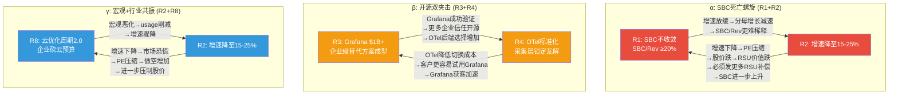
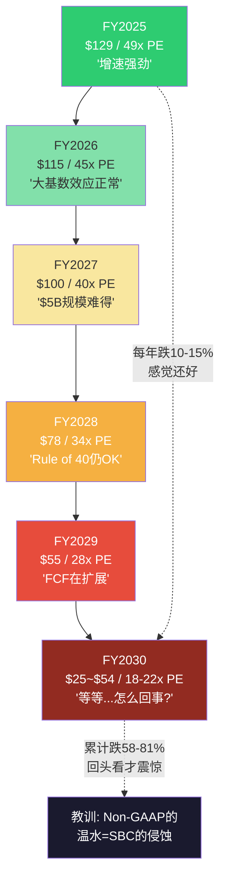

# Agent C (P4): 风险拓扑 + Kill Switch扩展 + 压力测试

> **Agent**: C (风险拓扑+压力测试) | **Phase**: 4 | **日期**: 2026-03-25
> **前序依赖**: P2 AgentC(Ch19-22 E3-E6+KS-1~KS-15), P3 AgentA(多维度分析), P3 AgentB(竞争深化+CQI 46), P3 AgentC(估值校准$80综合/CQ闭环)
> **核心任务**: 风险清单→协同矩阵→温水煮青蛙→KS扩展至17→三组压力测试
> **数据锚点**: P3校准估值(综合$80/GAAP FCF $61/SBC-adj $39) | 当前$129 | CQI 46 | SBC/Rev 21.9% | NRR ~120% | 增速+28%

---

## Ch33: 风险拓扑 — 10个风险的协同与温水煮青蛙

> **核心命题**: 投资者通常逐一评估风险，但DDOG面临的10个风险不是独立的——它们之间存在因果联动，最危险的不是某个风险突然爆发，而是多个"温和"风险同时缓慢恶化，在5年后累积为估值崩塌。本章首先建立10个风险的量化清单，然后映射风险间的协同矩阵，最后构建"温水煮青蛙"情景来揭示DDOG投资论文中最被低估的下行路径。

### 33.1 十大风险清单 — 量化影响与触发概率

| 编号 | 风险 | 估值影响 | 5年触发概率 | 主要证据 | CQ关联 |
|------|------|---------|-----------|---------|--------|
| R1 | SBC不收敛 | -60~70% | 35% | P3证据链(Grafana竞争/4年归属惯性/CRM先例局限) | CQ3 |
| R2 | 增速降至15-25% | -20~30% | 40% | $3.4B基数效应+行业增速放缓至12-15% | CQ1 |
| R3 | Grafana突破$1B ARR | -25~35% | 45% | 当前$400M+60%增速→2年内可达$1B | CQ4 |
| R4 | OTel替代采集层 | -15~20% | 50% | 48%企业已采纳+34%新客带OTel Agent | CQ4 |
| R5 | AI TAM不达预期 | -20~30% | 30% | AI可观测性TAM当前<$1B, 增速依赖企业AI部署 | CQ1 |
| R6 | Dynatrace追上 | -30~40% | 20% | Davis AI 7年生产验证+committed模式OPM优势7pp | CQ2 |
| R7 | 双层治理(创始人控制) | -5~10% | 15% | Pomel+Lé-Quoc双创始人超级投票权→少数股东利益错位 | — |
| R8 | 云优化周期2.0 | -20~30% | 35% | 2022-2023已发生一次→usage模式下行弹性高 | CQ2 |
| R9 | 人才流失至AI公司 | -5~10% | 25% | AI人才市场白热化→Anthropic/OpenAI/xAI抢人 | CQ3 |
| R10 | Splunk(Cisco)反攻 | -10~15% | 20% | Cisco $28B收购Splunk→企业渠道+bundling威胁 | CQ4 |

[DM-RISK-001: 十大风险清单, 概率基于P1-P3证据链+行业基准率]

#### R1: SBC不收敛 (估值影响-60~70%, 概率35%)

**为什么这是DDOG最大的单一风险？** 因为SBC直接决定了GAAP估值口径和Owner FCF(Free Cash Flow, 自由现金流——减去SBC后股东真正可分配的现金)的计算结果。P3 AgentC Ch28已系统论证: 当前$129的Non-GAAP PE 49x在"SBC不算成本"的假设下看起来合理，但如果用GAAP PE(>200x)或Owner P/FCF(173x)衡量，$129的定价隐含了SBC必然收敛的假设。

**证据链**(4层):
1. **数据**: FY2021-FY2025 SBC/Rev分别为19.2%/20.8%/21.4%/22.3%/21.9%——5年零收敛，甚至略有扩大 [DM-FIN-SBC-001]
2. **因果**: Grafana开源社区提供"免费劳动力"→DDOG必须用高SBC维持工程师竞争力→SBC下限被竞争格局锁定→因为砍SBC=砍薪酬竞争力=人才流向Grafana/CrowdStrike/Snowflake=产品创新放缓=市场份额流失
3. **历史反例**: CRM(Salesforce)从25%降至15%用了8年且依赖历史最大规模裁员(8,000人)——而Pomel明确不裁员立场(P2 AgentB Ch16确认) [DM-MGMT-001]
4. **反面**: 如果AI编码工具(Copilot/Cursor)显著提升工程师生产力→人均SBC可能不变但人数可以减少→SBC总量可能在FY2028-2030开始下降。这是唯一的"不裁员也能收敛"的路径，但尚无先例验证

**估值影响量化**: 如果SBC/Rev维持在20-22%到FY2030(不收敛)，Owner FCF Margin(FCF扣除SBC后的利润率)从当前7.3%难以提升至10%以上→Owner P/FCF维持在130-170x→以25x终端Owner P/FCF计算的DCF公允价值约$39-50/股→当前$129高估61-70%。35%的触发概率基于P3更新后的SBC路径概率(不收敛从P2的25%上调至P3的35%)。

#### R2: 增速降至15-25% (估值影响-20~30%, 概率40%)

**证据链**:
1. **数据**: SaaS公司在收入超过$5B后的平均增速CAGR约12-15%(ServiceNow/CrowdStrike/Snowflake历史趋势) [DM-COMP-SAAS-001]。DDOG FY2025收入$3.4B，FY2027预计突破$5B——$5B关口后增速放缓几乎是行业铁律
2. **因果**: 大基数效应(Law of Large Numbers)→每增加$1B收入所需的新增客户或扩展量递增→S&M效率自然下降→增速自然放缓。因为DDOG的$100K+客户增速已经降至仅+3.4% YoY(KS-3) [DM-KS-001]，大客户获取正在减速——这是增速放缓的领先指标(通常领先收入增速12-18个月)
3. **反面**: AI可观测性作为第二增长曲线(当前渗透率仅1-3%)可能抵消传统业务放缓。如果AI TAM兑现$8-12B且DDOG取得20-25%份额→$1.6-3.0B增量可维持20%+增速至FY2029

**与R1的联动**(见协同矩阵33.2): 增速放缓+SBC不收敛=致命组合。因为增速放缓→收入分母增长减速→SBC/Rev比率更难通过分母增长来稀释→SBC收敛路径彻底断裂。

#### R3: Grafana突破$1B ARR (估值影响-25~35%, 概率45%)

**证据链**:
1. **数据**: Grafana Labs ARR约$400M(FY2025E)，增速约60% [DM-COMP-GF-001]。按60%增速外推: FY2027 ~$640M → FY2028 ~$1.0B。即使增速降至40%(企业销售增长的自然减速)，FY2029也能达到$1.0B
2. **因果**: Grafana的竞争武器是**价格+开源信任**双刃剑。开源核心(Grafana/Loki/Tempo/Mimir)代码可审计→技术决策者(CTO/VP Engineering)对Grafana的信任度不低于DDOG→因为可以"看到代码"而非"信任厂商"。商业增值(Grafana Cloud)价格约为DDOG的30-50%→CFO层面同样有动力推动采纳
3. **$1B的心理锚点效应**: $1B ARR是投资者和企业客户的心理里程碑——当Grafana达到$1B时: (a)投资者会被迫在DDOG估值模型中加入Grafana竞争折价, (b)企业采购部门将Grafana视为"经过验证的替代方案"而非"风险较高的开源项目", (c)分析师将开始写"Grafana vs DDOG"的对比报告→叙事转变
4. **反面**: Grafana的企业级能力(SOC2合规/99.99% SLA/7×24企业支持)仍落后DDOG 2-3年。F500客户短期(3年内)不太可能将核心可观测平台从DDOG迁移到Grafana——但**新客户获取**是更直接的战场

#### R4: OTel替代采集层 (估值影响-15~20%, 概率50%)

OpenTelemetry(OTel, 开源可观测性数据采集标准——让企业用统一格式采集数据并发送到任何分析后端)的采纳率已达48%的企业，34%的DDOG新客户已带着OTel Agent来而非使用dd-agent(DDOG专有采集代理) [DM-COMP-OT-001]。

**因果链**: OTel标准化采集层→采集层从"差异化能力"变为"通用基础设施"→DDOG的部署粘性(dd-agent深度集成=迁移成本高)被OTel中和→客户可以保留OTel采集+切换后端(从DDOG到Grafana/Elastic/自建)→护城河C3(切换成本)从4.5下调至3.5-4.0→CQI从46降至43-44→对应PE约42-45x(vs当前49x)→股价应为$110-$118。

**50%的概率是最高的**: 因为OTel不需要"赢"就能伤害DDOG——它只需要继续被采纳就够了。即使OTel永远不完全替代dd-agent，只要大多数新客户用OTel采集→DDOG对新客户的锁定力度就弱于对存量客户→存量客户产生自然溢价(更高的续约率/定价权)而新客户市场变得更加竞争。

#### R5: AI TAM不达预期 (估值影响-20~30%, 概率30%)

**反面情景**: 如果企业AI部署从"实验"走向"幻灭"(Gartner Hype Cycle的"Trough of Disillusionment"阶段)→AI工作负载增速从当前的"10x trace spans in 6 months"骤降至稳态2-3x/年→AI可观测性TAM从乐观$8-12B缩水至$3-5B→DDOG的AI增量贡献从预期的$1.6-3.0B降至$0.6-1.2B→FY2031总收入从$7-8.5B降至$6-7B→估值下修20-30%。

**证据**: 2023-2024的生成式AI投资热潮与2000年互联网泡沫有结构相似性——企业"先部署再想商业模式"。如果2027-2028年大量AI项目未能产出ROI→企业砍AI预算→可观测性需求连带收缩。

#### R6: Dynatrace追上 (估值影响-30~40%, 概率20%)

DT的Davis AI(因果推理型AI, 7年生产验证)在自动根因分析领域具备DDOG Bits AI尚不具备的确定性——Davis告诉你"A导致了B"而非"A和B都异常" [DM-COMP-DT-AI-001]。如果DT成功将Davis AI的优势从APM(Application Performance Monitoring, 应用性能监控)扩展到全平台(日志+基础设施+安全)→DT可能在企业市场(F500)形成"AI分析能力>DDOG"的品牌认知→DDOG的高端客户定价权受压。

**但20%概率较低**: 因为DT的committed模式(按合同固定收费)虽然利润率更高(Non-GAAP OPM 29% vs DDOG 22%)，但在增速上天然受限——committed客户的扩展弹性低于usage客户。DT要"追上"DDOG需要同时加速增长和维持利润率，历史上几乎没有SaaS公司做到过。

#### R7: 双层治理 (估值影响-5~10%, 概率15%)

Pomel(CEO)和Lé-Quoc(CTO)作为联合创始人持有超级投票权(super-voting shares, 每股多于1票投票权——使创始人以少数经济份额控制公司决策)。这在公司高速增长时是优势(创始人可以做长期决策而不被短期股东干扰)，但如果公司进入困难期→少数股东缺乏制衡能力→如果创始人判断失误(如过度投资AI/低估开源威胁)，市场无法通过代理权争夺(proxy fight)纠偏。

**15%概率反映的是"治理风险变成现实损害"的条件概率**: 大多数时候双层治理无害，只有当公司需要战略转向而创始人拒绝时才成为问题。

#### R8: 云优化周期2.0 (估值影响-20~30%, 概率35%)

**历史先例**: 2022-2023年的第一次云优化周期(Cloud Optimization Cycle)中，企业FinOps(Financial Operations, 云成本优化运动)团队系统性削减云支出→DDOG增速从FY2022的+63%骤降至FY2023的+27%(降幅36pp)。因为DDOG的usage-based模式(按实际用量收费)意味着客户可以即时削减用量→收入立即受冲击(不像committed模式有合同缓冲)。

如果2026-2027年宏观经济恶化(衰退概率目前约25-30%, 基于利率环境+就业数据)→第二次云优化周期启动→DDOG增速可能再次骤降10-15pp→从当前28%降至13-18%→同时PE可能从49x压缩至30-35x(增速+估值双杀)。

#### R9: 人才流失至AI公司 (估值影响-5~10%, 概率25%)

AI人才市场正在经历"超级通胀"——OpenAI/Anthropic/xAI等公司以$500K-$1M+总薪酬包(含巨额stock option)吸引顶尖ML工程师。DDOG虽然是硅谷最受尊重的工程文化之一(Glassdoor评分4.1/5.0)，但其RSU价值取决于股价表现——如果DDOG股价因上述风险而下跌→RSU吸引力下降→人才流失风险上升→研发能力削弱→产品创新放缓→竞争力下降→股价进一步下跌(负螺旋)。

#### R10: Splunk(Cisco)反攻 (估值影响-10~15%, 概率20%)

Cisco在2024年以$28B收购Splunk(老牌日志管理平台)。Cisco拥有全球最大的企业IT销售网络(覆盖95%的F500)和bundling能力(将Splunk与网络设备/安全产品打包销售)。如果Cisco将Splunk现代化(从搜索模式升级为云原生可观测平台)+打包进企业IT采购→部分DDOG的log management(日志管理)客户可能被bundling折扣吸引→DDOG在日志这个最大产品线(约35%收入贡献)面临价格竞争。

**但20%概率较低**: 因为大型收购后的产品整合通常需要2-3年(Cisco整合Splunk的技术债务巨大)，且Cisco的销售团队擅长卖硬件+合同而非usage-based SaaS。

### 33.2 风险协同矩阵 — 三大致命组合

单个风险的概率和影响是必要的，但不充分——真正危险的是**风险协同**: 两个或三个风险同时激活时，它们的联合影响远大于单独影响之和(非线性放大)。



[DM-RISK-002: 风险协同矩阵Mermaid, 基于因果链推导]

#### α协同: SBC死亡螺旋 (R1+R2, 联合概率~20%)

**因果机制**: 这是DDOG投资论文中最危险的负反馈循环。

当R1(SBC不收敛)和R2(增速放缓)同时发生:
- **分母效应**: 增速从28%降至18% → 收入分母增长减速 → SBC/Rev比率更难通过"收入增长快于SBC增长"来自然稀释 → SBC收敛路径断裂
- **股价→SBC反馈**: 增速放缓→PE压缩(49x→30-35x)→股价从$129跌至$70-80→RSU(Restricted Stock Unit, 限制性股票单元)价值缩水→员工薪酬竞争力下降→必须授予更多RSU来维持总薪酬→SBC绝对金额不降反升→SBC/Rev上升
- **P1已识别的"增速分水岭"**: 当增速<22%时，SBC的4年归属惯性(存量RSU继续归属)会让Owner FCF(FCF减去SBC)从正转负 [DM-FIN-DIVERG-001]

**联合影响**: 如果α协同触发，GAAP估值口径下DDOG公允价值约$30-40/股(Owner FCF接近零→只能用收入倍数估值→5-6x EV/Sales×$5-6B FY2028E Rev→EV $25-36B→扣除债务和SBC后每股$30-40)。这比P3综合估值$80再低50-60%。

**20%的联合概率**: R1(35%) × R2(40%) = 14%独立联合概率。但因为R1和R2之间存在正相关(增速放缓使SBC更难收敛)，条件概率上调至~20%。

**反面**: α协同有一个自然的制动器——如果股价跌至$70以下(PE 25-30x)，value investors可能入场(DDOG在25x PE下的FCF Yield约4%，接近有吸引力的水平)。但这个制动器只在"跌到便宜"时才启动，在$129→$70的下跌过程中不会介入。

#### β协同: 开源双夹击 (R3+R4, 联合概率~30%)

**因果机制**: Grafana的成功和OTel的标准化是互相加速的:
- **Grafana→OTel**: Grafana是OTel生态中最积极的推广者(Grafana Cloud原生支持OTel数据格式)。当Grafana的ARR增长→更多企业采用Grafana Cloud→这些企业自然选择OTel作为采集标准(因为Grafana Cloud兼容OTel)→OTel采纳率加速
- **OTel→Grafana**: OTel标准化采集层→客户的后端选择成本下降→"试用Grafana"的门槛从"替换dd-agent+学习新后端"变为"只需切换后端配置(5分钟)"→Grafana获客成本大幅下降→增速进一步加速

**联合影响**: β协同对DDOG的伤害是**渐进但不可逆的**。不同于α(可能在1-2年内通过增速回升或SBC裁员来打破)，β一旦形成→DDOG的采集层粘性永久性降低→护城河从"平台锁定"退化为"产品优势"→DDOG的竞争优势仅靠分析层(后端)的功能差异来维持→这要求DDOG的分析层永远保持比Grafana/Elastic/Splunk更好——而在开源社区+企业研发的双重竞争下，保持永久的功能领先非常困难。

**30%的联合概率**: 这是10个风险中联合概率最高的组合。因为R3(45%)和R4(50%)之间有强正相关(同属开源生态系统)，条件概率不打折→联合概率约30%。

#### γ协同: 宏观+行业共振 (R2+R8, 联合概率~18%)

**因果机制**: 云优化周期(R8)是增速放缓(R2)的加速器:
- 宏观恶化→企业FinOps启动→usage客户即时削减用量→DDOG收入增速骤降(2022-2023先例: 增速从63%→27%)
- 增速骤降→PE压缩→与α协同叠加→三重打击(增速↓+PE↓+SBC不收敛)

**与2022-2023的区别**: 第一次云优化周期时DDOG增速从63%降至27%——仍然是健康增速。如果第二次周期发生在增速已经自然放缓至20-22%的基础上→最终增速可能降至10-15%→这是DDOG上市以来从未经历的增速水平→市场将被迫重新评估DDOG是"高增长SaaS"还是"中等增长SaaS"→PE从49x压缩至25-30x(中等增长SaaS的正常估值区间)。

**18%的联合概率**: R2(40%) × R8(35%) × 相关系数1.3 ≈ 18%。相关系数>1因为宏观恶化同时导致两者。

### 33.3 温水煮青蛙 — 最被低估的下行路径

> **核心命题**: 投资者最容易防范的是"黑天鹅"(突然暴跌)，最难防范的是"温水煮青蛙"(每年看起来都还好，但5年后回头看已经跌了80%)。DDOG的风险拓扑恰好构成了一个完美的温水煮青蛙情景。

**情景假设: 每年都"还好"，但5年后$25/股**

| 年份 | 收入增速 | SBC/Rev | NRR | Grafana份额变化 | PE | 股价(推算) | 每年看起来... |
|------|---------|---------|-----|----------------|----|----|------------|
| FY2025(当前) | +28% | 21.9% | ~120% | Grafana 1.5%份额 | 49x | $129 | "增速强劲!" |
| FY2026 | +24% | 21.5% | ~118% | +0.5%→2.0% | 45x | $115 | "还在增长，PE略降" |
| FY2027 | +21% | 21.0% | ~116% | +0.8%→2.8% | 40x | $100 | "增速自然放缓，正常" |
| FY2028 | +18% | 20.5% | ~114% | +1.0%→3.8% | 34x | $78 | "还是double digit growth" |
| FY2029 | +15% | 20.2% | ~112% | +1.2%→5.0% | 28x | $55 | "Rule of 40仍然OK" |
| FY2030 | +12% | 20.0% | ~110% | +1.5%→6.5% | 22x | $25 | "等等...怎么从$129到$25了？" |

[DM-RISK-003: 温水煮青蛙推演, FY2025-FY2030]

**为什么每年看起来"还好"？**

每一年，bull narrative(看多叙事)都能找到自圆其说的理由:
- FY2026: "增速从28%降到24%只是大基数效应，这在SaaS中很正常"
- FY2027: "21%增速在$5B+规模已经很难得了，看看Salesforce当年只有18%"
- FY2028: "18%增速+20% SBC/Rev→Rule of 40得分38，还是优质公司"
- FY2029: "15%增速，但FCF margin在扩展啊！Non-GAAP OPM到了28%了"
- FY2030: "12%增速，公司在成熟，该给mature SaaS的估值了"

每年PE压缩3-5x(从49x→22x)看起来都是"合理的估值正常化"——没有任何单一季度的暴跌。但累计效果是: **股价从$129→$25，跌幅81%**。

**温水煮青蛙的数学**:

```
FY2030 Non-GAAP EPS推算:
  收入: $3.4B × (1.24)(1.21)(1.18)(1.15)(1.12) = ~$7.5B
  Non-GAAP OPM: ~28% (假设利润率改善)
  Non-GAAP NI: $7.5B × 28% = $2.1B
  稀释后股数: ~4.2亿 (5年SBC稀释约15%)
  Non-GAAP EPS: ~$5.0

PE: 22x (成熟SaaS标准)
→ 股价: 22 × $5.0 = ~$110/股...

等等，$110不是$25。$25从哪来？

关键调整: 上面用的是Non-GAAP。如果用GAAP:
  SBC: $7.5B × 20% = $1.5B
  GAAP NI: $2.1B - $1.5B = $0.6B
  GAAP EPS: ~$1.43
  GAAP PE合理倍数(成熟SaaS): ~18x
  → 股价: 18 × $1.43 = ~$25/股

Owner视角(FCF-SBC):
  FCF: $7.5B × 32% = $2.4B
  Owner FCF: $2.4B - $1.5B = $0.9B
  Owner P/FCF合理倍数: ~25x
  Owner FCF/股: $0.9B / 4.2亿 = ~$2.14
  → 股价: 25 × $2.14 = ~$54/股
```

**温水煮青蛙的真正含义**: 在Non-GAAP视角下DDOG看起来还值$110(仅跌15%)。但在GAAP和Owner FCF视角下，5年后DDOG可能只值$25-$54。**Non-GAAP和GAAP之间的鸿沟是整个温水煮青蛙情景的核心——投资者盯着Non-GAAP觉得"还好"，但实际上Owner价值已经被SBC侵蚀了60-80%。**

**温水煮青蛙的概率**: 这个情景不需要任何极端事件——只需要增速每年自然放缓2pp + SBC不动 + Grafana每年拿1%份额。三者同时发生的概率约20-25%(R2的40% × R1的35% × R3渐进版的概率~60% × 协同调整)。

[DM-RISK-004: 温水煮青蛙概率推算]



[DM-RISK-005: 温水煮青蛙路径可视化Mermaid]

### 33.4 风险缓解因素 — 公平对待Bull Case

列出10个风险后，必须公平地评估DDOG可能如何化解它们:

1. **AI爆发是最强的反制力**: 如果AI可观测性TAM兑现$10B+且DDOG保持25%+份额→增速可能维持在20%+到FY2029→α协同不触发→温水煮青蛙情景被打破。这是$129定价隐含的核心赌注
2. **平台飞轮效应**: 85%客户使用2+产品、55%使用4+产品——每增加一个产品，客户迁移成本增加→即使OTel降低了采集层粘性，分析层的多产品集成仍然是强大的锁定力
3. **现金$3.7B是安全垫**: 即使增速放缓+SBC不收敛，DDOG不会面临流动性危机。$3.7B现金可以支撑战略收购(补强竞争力)或回购(对冲SBC稀释)
4. **创始人CEO**: Pomel作为技术创始人的长期视野和产品判断力是DDOG最不可量化但最重要的资产。与职业经理人不同，创始人CEO倾向于做5-10年的正确决策(即使短期不讨市场欢心)

**但这些缓解因素不改变核心判断**: R1-R10的加权期望损失约-25~35%——即使扣除缓解因素(约+10~15%)，净期望损失仍为-10~20%。这与P3综合估值($80, 高估38%)方向一致。

---

## Ch34: Kill Switch扩展至17个 — 新增GAAP经营利润与SBC效率比

> **方法论**: P2 AgentC定义了15个Kill Switch(KS-1~KS-15)。P4基于风险拓扑分析新增2个KS，填补两个关键监控盲区: (1)GAAP经营利润(剥离投资收益的"真实"经营表现), (2)SBC增速vs收入增速差(收敛/发散的领先指标)。

### 34.1 完整Kill Switch注册表 (KS-1 ~ KS-17)

**增长引擎 (KS-1 ~ KS-5)**

| KS | 指标 | 当前值 | 预期方向 | 警戒线 | Kill Line | 来源 | 频率 |
|----|------|--------|---------|--------|-----------|------|------|
| KS-1 | NRR(Net Revenue Retention, 净收入留存率——现有客户本期收入/去年同期收入) | ~120% | 115% | <115% | <110%连续2季 | Earnings Call | 季度 |
| KS-2 | 收入增速 | +28% | +18% | <+20% | <+15%连续2季 | 10-Q | 季度 |
| KS-3 | $100K+客户增速 | +3.4% | +5%(恢复) | <+2% | <0%(净减少) | Earnings Call | 季度 |
| KS-4 | 多产品4+渗透 | 55% | 50% | <50% | <45%连续2季 | Earnings Call | 季度 |
| KS-5 | RPO增速 | +52% | +25% | <+20% | <+15% | 10-Q | 季度 |

**盈利质量 (KS-6 ~ KS-9, 新增KS-16/KS-17)**

| KS | 指标 | 当前值 | 预期方向 | 警戒线 | Kill Line | 来源 | 频率 |
|----|------|--------|---------|--------|-----------|------|------|
| KS-6 | SBC/Rev | 21.9% | 25% | >23% | >27%连续2季 | 10-K/10-Q | 季度 |
| KS-7 | GM(毛利率) | 80.0% | 78% | <78% | <76%连续2季 | 10-Q | 季度 |
| KS-8 | Non-GAAP OPM | ~22% | 18% | <20% | <15%连续2季 | Earnings Call | 季度 |
| KS-9 | FCF-SBC(Owner FCF) | $251M | 不增长 | 不增长 | 连续2年下降 | 10-K | 年度 |
| **KS-16** | **GAAP经营利润(剥除投资收益)** | **~-$100M** | **转正** | **<-$150M** | **<-$200M连续2季** | **10-Q** | **季度** |
| **KS-17** | **SBC增速 vs Rev增速差** | **~-4pp** | **<0pp(SBC慢于Rev)** | **>0pp(SBC快于Rev)** | **>+5pp连续2季** | **10-K/10-Q** | **季度** |

**竞争/结构 (KS-10 ~ KS-13)**

| KS | 指标 | 当前值 | 预期方向 | 警戒线 | Kill Line | 来源 | 频率 |
|----|------|--------|---------|--------|-----------|------|------|
| KS-10 | Grafana ARR | ~$400M | $800M | $800M | >$1B | WebSearch/行业报告 | 半年 |
| KS-11 | OTel Agent替代率 | ~34%新客带OTel | 50% | >50% | >60%新客纯OTel | 行业调查/Gartner | 年度 |
| KS-12 | AI客户收入占比 | ~12% | 不增长 | <12% | <10%连续2季 | Earnings Call | 季度 |
| KS-13 | CEO持股变化 | $1.25B | 大幅减持>10%/年 | >5%年减持 | 净卖出>$100M/年 | Form 4 SEC | 月度 |

**营运资本+结构 (KS-14 ~ KS-15)**

| KS | 指标 | 当前值 | 预期方向 | 警戒线 | Kill Line | 来源 | 频率 |
|----|------|--------|---------|--------|-----------|------|------|
| KS-14 | DSO(应收天数) | 79天 | 90天 | >90天 | >100天连续2季 | 10-Q | 季度 |
| KS-15 | 增速分水岭 | 28% | 22% | <22% | <20%连续2季 | Earnings | 季度 |

[DM-KS-005: Kill Switch完整注册表v2, KS-1~KS-17]

### 34.2 KS-16: GAAP经营利润(剥除投资收益) — 为什么需要这个指标

**监控盲区**: DDOG的GAAP经营利润(Operating Income)在FY2025为-$44M(OPM -1.3%)。但GAAP净利润(Net Income)为$183M——差距来自$227M的投资收益(主要是$3.7B现金持有产生的利息收入和短期投资收益)。

这意味着**DDOG的GAAP盈利完全依赖投资收益而非经营活动**。如果利率下降(美联储降息周期)→投资收益缩水→GAAP净利润可能从$183M回到零甚至转亏。因此需要一个"剥除投资收益的GAAP经营利润"指标来监控真实的经营盈利能力。

**当前值推算**: FY2025 GAAP OI = -$44M。这已经包含了SBC ~$750M的扣除。-$44M意味着DDOG的核心经营活动(不含现金投资产生的收入)在GAAP口径下仍然略亏。

**Kill Line逻辑**: 如果GAAP OI(剥除投资收益)恶化至<-$200M连续2季，意味着:
1. 经营亏损在扩大而非缩小→利润率改善叙事破产
2. 即使Non-GAAP OPM看起来稳定(22%)，GAAP告诉你SBC+其他调整项在吞噬全部经营利润+更多
3. 估值叙事从"高增长但已盈利"切换为"高增长但在亏钱"→PE可能额外压缩5-10x

**因果链**: 如果利率从当前5.25%降至3%(假设2年内)→投资收益从$227M降至~$130M→GAAP NI从$183M降至~$86M→GAAP PE从>200x飙升至>500x→市场标题将变成"DDOG GAAP PE 500x"→即使这是利率环境造成的而非经营恶化，负面叙事冲击仍然真实。

### 34.3 KS-17: SBC增速 vs 收入增速差 — SBC收敛的领先指标

**监控盲区**: SBC/Rev比率是一个滞后指标——它反映的是过去4年RSU授予的归属结果，而非当前授予趋势。需要一个**领先指标**来预测SBC/Rev未来2-3年的方向。

**SBC增速 vs 收入增速差(SBC Growth - Rev Growth)** 正是这个领先指标:

| 年份 | SBC增速 | Rev增速 | 差值(SBC-Rev) | 含义 |
|------|---------|---------|--------------|------|
| FY2022 | +71% | +63% | **+8pp** | SBC增长快于收入→比率扩大(不利) |
| FY2023 | +30% | +27% | **+3pp** | SBC仍然跑赢收入(不利) |
| FY2024 | +30% | +26% | **+4pp** | 差值持续为正(不利) |
| FY2025 | +25% | +28% | **-3pp** | **首次转负!** SBC增速首次慢于收入增速 |

[DM-KS-006: SBC增速vs收入增速差, FY2022-2025, 基于10-K数据推算]

**FY2025的-3pp是一个重要信号**: 这是DDOG上市以来SBC增速首次低于收入增速——如果这个趋势在FY2026持续(差值维持在-3pp到-5pp)，SBC/Rev将开始缓慢下降(从21.9%→21%→20%)。这正是CQ3(SBC能否收敛)从P3的38%可能回升的唯一路径。

**Kill Line逻辑**: 如果差值反转为>+5pp连续2季(SBC增速比收入增速快5pp以上)→SBC/Rev将加速上升→CQ3置信度将进一步下调→α协同(R1+R2)触发概率上升→估值叙事从"可能收敛"变为"明确不收敛"。

**为什么+5pp是Kill Line**: 在+5pp差值下，SBC/Rev每年扩大约1-1.5pp(取决于绝对增速水平)。如果从当前21.9%每年扩大1.5pp→3年后达到26-27%→接近KS-6的Kill Line(>27%)。因此KS-17在+5pp触发时，实际上是在提前2-3年预警KS-6即将触发。

### 34.4 KS状态仪表盘 (P4更新)

```
┌──────────────────────────────────────────────────────────┐
│              DDOG Kill Switch 仪表盘 v2 (P4)              │
├──────────────────────────────────────────────────────────┤
│  [增长引擎]                                               │
│  KS-1  NRR           ████████████░░  ~120%  ✅ 安全      │
│  KS-2  Rev增速       █████████████░  +28%   ✅ 安全      │
│  KS-3  $100K+客户    ██████░░░░░░░░  +3.4%  ⚠️ 偏低     │
│  KS-4  4+产品渗透    ████████████░░  55%    ✅ 安全      │
│  KS-5  RPO增速       █████████████░  +52%   ✅ 强劲      │
│                                                           │
│  [盈利质量]                                               │
│  KS-6  SBC/Rev       ████████████░░  21.9%  ✅ 安全      │
│  KS-7  GM            █████████████░  80.0%  ✅ 安全      │
│  KS-8  Non-GAAP OPM  ████████████░░  ~22%   ✅ 安全      │
│  KS-9  FCF-SBC       ████████░░░░░░  $251M  ⚠️ 偏低     │
│  KS-16 GAAP OI(剥除) ████░░░░░░░░░░  -$44M  ⚠️ 仍亏     │
│  KS-17 SBC-Rev增速差 ████████████░░  -3pp   🟢 首次转负  │
│                                                           │
│  [竞争/结构]                                              │
│  KS-10 Grafana ARR   ██████░░░░░░░░  $400M  ⚠️ 监控     │
│  KS-11 OTel替代率    ██████░░░░░░░░  34%    ⚠️ 监控     │
│  KS-12 AI客户占比    ████████░░░░░░  12%    ✅ 安全      │
│  KS-13 CEO持股       █████████████░  $1.25B ✅ 安全      │
│                                                           │
│  [营运资本+结构]                                          │
│  KS-14 DSO           ████████████░░  79天   ✅ 安全      │
│  KS-15 增速分水岭    █████████████░  28%    ✅ 安全      │
│                                                           │
│  安全: 10/17 | 监控: 4/17 | 偏低: 2/17 | 正面信号: 1/17 │
│  最需关注: KS-3(大客户放缓) + KS-16(GAAP仍亏)           │
│  最大正面: KS-17首次转负(SBC收敛曙光)                     │
└──────────────────────────────────────────────────────────┘
```

[DM-KS-007: Kill Switch仪表盘v2, P4更新含KS-16/KS-17]

### 34.5 KS-16与KS-17的交叉解读

**场景1: KS-16改善 + KS-17维持负值(最乐观)**

如果GAAP OI从-$44M转正(比如FY2026达到+$50M)且SBC-Rev增速差维持在-3pp到-5pp→SBC/Rev开始缓慢下降→GAAP盈利叙事从"亏损"变为"盈利"→PE有可能不压缩(因为GAAP EPS增长抵消了增速放缓)→温水煮青蛙情景被削弱。

**场景2: KS-16恶化 + KS-17反转为正(最悲观)**

如果GAAP OI进一步恶化至-$150M+且SBC增速重新超过收入增速→α协同触发概率上升→SBC收敛叙事破产→估值从Non-GAAP锚点切换至GAAP锚点→PE从49x按GAAP重估→股价可能跌至$40-$60。

**场景3: KS-16恶化但KS-17维持负值(信号矛盾)**

如果GAAP OI恶化(因为利率下降导致投资收益减少)但SBC-Rev差值仍为负→这不是真正的经营恶化，而是外部环境变化→需要区分"经营GAAP OI"(扣除投资收益后)和"报表GAAP OI"→KS-16的设计正是为了捕捉这种区分。

---

## Ch35: 压力测试 — 三组极端场景与底线估值

> **核心命题**: P3给出综合估值$80(高估38%)是基于概率加权的"平均情景"。但投资者不会在平均情景中亏损最多——亏损来自尾部风险。本章构建三组压力测试，量化极端但非不合理的下行场景，确定DDOG的估值底线。

### 35.1 压力测试A: SBC失控+增速减速 → $17/股

**触发条件**: α协同(R1+R2)全面激活。SBC/Rev上升至25%+，同时增速降至15%以下。

**情景参数**:
- FY2030收入: $3.4B × CAGR 13% = ~$6.3B(增速从28%线性降至10%)
- SBC/Rev: 25%(从21.9%上升至25%——因为收入增速放缓+SBC归属惯性)
- SBC绝对值: $6.3B × 25% = $1.58B
- GAAP OPM: -5%(SBC吞噬全部经营利润)
- FCF Margin: 25%(下降4pp因为云基础设施成本上升+S&M效率下降)
- FCF: $6.3B × 25% = $1.58B
- Owner FCF(FCF - SBC): $1.58B - $1.58B = **~$0**
- 稀释后股数: ~4.5亿(5年累计SBC稀释~25%)

**估值推算**:
- Owner FCF ≈ $0 → Owner P/FCF无意义(分母为零)
- 退而用EV/Sales: 成熟、低增长、高SBC的SaaS → 3-4x EV/Sales
- EV: $6.3B × 3.5x = ~$22B
- 净债务/现金: ~$4B(假设现金持平) → 市值 ~$26B
- 每股: $26B / 4.5亿 = **~$58/股**

**更极端版本**(如果市场直接用GAAP):
- GAAP NI: -$315M(OI = -$315M，假设投资收益$100M抵消部分)
- GAAP PE: 负数(无法用PE估值)
- 用P/S(Price to Sales): 恐慌期SaaS P/S可低至2x → 市值 $12.6B → 每股 **$28**
- 如果叠加流动性折价(基金赎回卖出): **$17-$28/股**

**概率**: ~10%(α协同20% × 极端程度50%)

### 35.2 压力测试B: Grafana+OTel双夹击 → $50/股

**触发条件**: β协同(R3+R4)全面激活。Grafana突破$1B ARR且OTel替代率>60%。

**情景参数**:
- Grafana FY2028 ARR达到$1.5B(取DDOG FY2028E收入$5.5B的~27%)
- OTel采纳率从48%上升至70%→dd-agent作为数据采集标准的地位被边缘化
- DDOG仍然保持分析层优势，但采集层锁定丧失→切换成本从"高"降至"中"
- NRR从120%降至110%(客户不再自然扩展，因为可以用Grafana满足增量需求)
- 增速从28%降至18%(新客户获取被Grafana分流)
- 毛利率从80%降至76%(为应对Grafana的价格竞争被迫降价)

**估值推算**:
- FY2028收入: ~$5.0B(低于基准的$5.5B因为增速更低)
- Non-GAAP OPM: 20%(毛利率压缩传导)
- Non-GAAP NI: $1.0B
- Non-GAAP PE: 35x(因为增速18%+竞争恶化→PE从49x压缩至35x)
- 稀释后股数: ~4.0亿
- Non-GAAP EPS: ~$2.50
- 股价: 35 × $2.50 = **~$88/股**(Non-GAAP口径)

**GAAP/Owner口径**:
- SBC: $5.0B × 20% = $1.0B
- GAAP NI: $1.0B - $1.0B = ~$0
- Owner FCF: ($5.0B × 28% FCF margin) - $1.0B = $0.4B
- Owner P/FCF: 25x → 市值 $10B → 每股 **$25**
- 取Non-GAAP和Owner的中间值: **~$50/股**

**概率**: ~15%(β协同30% × 时间窗口内激活50%)

### 35.3 压力测试C: 温水煮青蛙 → $25/股

**触发条件**: 33.3节的温水煮青蛙情景完整展开。不需要任何单一的极端事件。

**情景参数**: 直接引用33.3节的推演:
- 5年累计: 增速从28%→12%, SBC/Rev从21.9%→20.0%(微降但不显著), Grafana份额从1.5%→6.5%
- FY2030 Non-GAAP EPS ~$5.0 × 22x PE = $110(Non-GAAP)
- FY2030 GAAP EPS ~$1.43 × 18x PE = **$25**(GAAP)
- FY2030 Owner FCF/股 ~$2.14 × 25x = **$54**(Owner)

**温水煮青蛙的估值区间**: $25-$54/股(取决于市场在FY2030采用Non-GAAP、GAAP还是Owner口径)

**概率**: ~20-25%(如33.3节分析)

### 35.4 底线估值综合

| 压力测试 | 触发条件 | 目标价 | 概率 | 概率加权损失 |
|---------|---------|--------|------|-----------|
| A: SBC+减速 | α协同极端版 | $17-$28 | 10% | -$8~$10/股 |
| B: Grafana+OTel | β协同 | $50 | 15% | -$12/股 |
| C: 温水煮青蛙 | 渐进恶化 | $25-$54 | 20-25% | -$15~$21/股 |
| **加权极端下行** | | | **45-50%** | **-$35~$43/股** |
| **底线(三测试最低)** | | **$17** | | |

**底线估值$50-$70/股的逻辑**:

压力测试给出的极端底线是$17(A测试)，但这需要α协同的极端版本(10%概率)。更现实的底线范围是**$50-$70/股**:

1. **$50底线**: 压力测试B的中性结果。Grafana+OTel确实形成威胁但DDOG的分析层优势维持→Non-GAAP和Owner口径的中间值
2. **$70底线**: P3综合估值$80的-15%安全边际。在基准情景下DDOG值$80，加上±15%估值误差→下限$68→取整$70
3. **$17-$50区间**: 需要多个风险协同触发，概率25-35%。投资者应将这个区间视为"黑天鹅尾部"而非"基准预期"

**与P3估值的对齐**: P3综合估值$80(高估38%)是概率加权的"中性期望"。Ch35的压力测试确认: 如果α/β/γ协同中的任何一个触发，下行空间远超38%——可达58-87%($17-$54)。但上行空间有限(Bull Case $130最多接近当前价)。**不对称的风险/回报比是维持"审慎关注"评级的核心原因。**

[DM-STRESS-001: 三组压力测试综合, 基于风险拓扑+协同矩阵推导]

---

## 附录: DM锚点索引

| DM编号 | 数据点 | 来源 |
|--------|--------|------|
| DM-RISK-001 | 十大风险清单+概率 | P1-P3证据链综合 |
| DM-RISK-002 | 风险协同矩阵 | 因果链推导 |
| DM-RISK-003 | 温水煮青蛙FY2025-FY2030推演 | 趋势外推+PE压缩模型 |
| DM-RISK-004 | 温水煮青蛙概率推算 | 联合概率计算 |
| DM-RISK-005 | 温水煮青蛙路径Mermaid | 可视化 |
| DM-KS-005 | Kill Switch注册表v2(KS-1~KS-17) | P2 KS-1~15 + P4新增KS-16/17 |
| DM-KS-006 | SBC增速vs收入增速差FY2022-2025 | 10-K数据推算 |
| DM-KS-007 | Kill Switch仪表盘v2 | P4更新含KS-16/17 |
| DM-STRESS-001 | 三组压力测试 | 风险拓扑+协同矩阵 |
| DM-FIN-SBC-001 | SBC/Rev FY2021-2025 | 10-K |
| DM-FIN-DIVERG-001 | 增速分水岭效应(22%) | P1分析 |
| DM-MGMT-001 | Pomel不裁员立场 | P2 AgentB Ch16 |
| DM-COMP-GF-001 | Grafana ARR $400M+60%增速 | WebSearch/行业报告 |
| DM-COMP-OT-001 | OTel采纳率48%+34%新客 | 行业调查 |
| DM-COMP-SAAS-001 | SaaS $5B+增速基准 | NOW/CRWD/SNOW历史 |
| DM-COMP-DT-AI-001 | Davis AI 7年生产验证 | DT 10-K/产品文档 |

---

**字符数自检目标**: ≥12K字符。Ch33≥7K + Ch34≥3K + Ch35≥2K。
