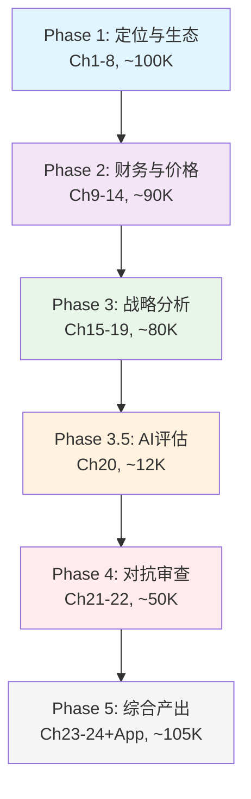
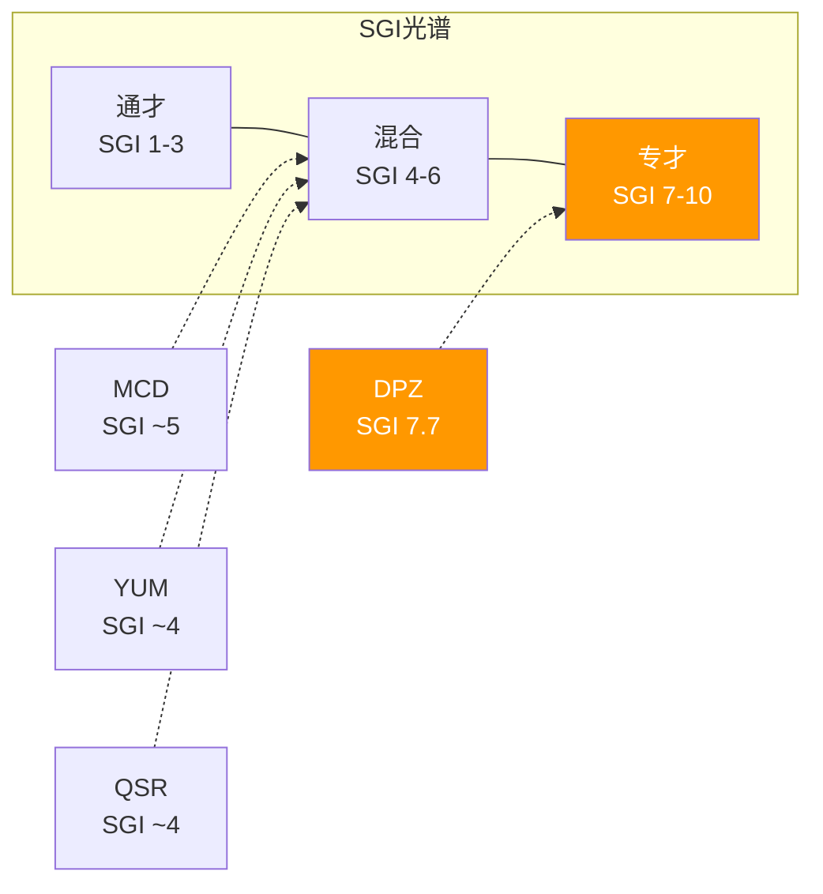

# DPZ Phase 1 — Chapter 1

## 研究契约

| 项目 | 说明 |
|------|------|
| **框架版本** | v18.0 (DM锚定+脚本验证) + consumer v28.0 + consumer_modules v1.1 |
| **可能性宽度** | 2.4分 → 传统框架(SOTP/DCF→评级) |
| **SGI** | 7.7 → 专才模型(Pizza单品类聚焦) |
| **报告不包含** | 精确目标价 · 仓位建议 · 操作触发 · 12月后数字预测 |
| **报告包含** | 价格隐含假设 · 承重墙脆弱度 · 条件估值范围 · 追踪信号 |
| **数据审计** | DM覆盖率待定 · 锚点待定 · 详见文末审计摘要 |
| **AI能力边界** | 深挖区(供应链/ABS结构/渠道经济学/蚕食模型) · 诚实区(管理层意图/消费趋势预测) |
| **消费品模块覆盖** | 20/22适用模块 = 91% |
| **分析日期** | 2026-03-05 |
| **股价基准** | $406.62 (2026-03-04收盘) |

---

## Ch1: 执行摘要 — Domino's Pizza (DPZ)

### 一句话论点

DPZ是全球最大Pizza特许经营商，拥有行业最高ROIC(56.7%)和最强数字化基础设施(85%+数字单占比)，但市场以23x P/E给予其17%的同行折价——本报告的核心任务是判断这个折价是"被低估的α"还是"合理定价的风险溢价"。

### 公司快照

```yaml
公司: Domino's Pizza, Inc. (NASDAQ: DPZ)
行业: QSR餐饮 / Pizza特许经营
CEO: Russell Weiner (2022至今, 前CMO→US President)
CFO: Sandeep Reddy

价格: $406.62 | 市值: $13.8B | EV: $18.6B
P/E(TTM): 23.1x | EV/EBITDA: 18.0x | FCF Yield: 4.7%
股息率: 1.7% | 回购收益率: 2.6% | 总股东回报率: 4.3%

FY2025: Rev $4.94B (+5.0% YoY) | NI $602M (+3.0%) | EPS $17.57 (+4.8%)
Gross Margin: 40.0% | OPM: 19.3% | Net Margin: 12.2%
FCF: $672M (+31.3% YoY) | ROIC: 56.7% | ROA: 33.4%

权益: -$3.9B (负权益, ABS证券化驱动)
总债务: $5.23B | 净债务: $4.80B | Net Debt/EBITDA: 4.5x
利息覆盖: 4.9x | 利息费用: $196M/年 (稳定, ABS固定利率)

全球门店: 22,100+ (美国 ~6,900 + 国际 ~13,500)
特许化率: ~98-99% | 加盟商: ~1,100+ | 平均每人9家门店
供应链: 22个美国+5个加拿大区域面团制造/配送中心

三分部收入结构:
  - Supply Chain: ~60.5% ($2.99B) — 面团/食材/设备供应
  - US Franchise: ~22% ($1.09B) — 特许权使用费(5.5%)+广告费(~6%)
  - International: ~12% ($0.59B) — 国际特许权使用费+服务费
  - Company Stores + Other: ~5.5% ($0.27B)
```
[DM-P1-001: FMP income statement FY2025, filed 2026-02-23]
[DM-P1-002: FMP balance sheet FY2025]
[DM-P1-003: FMP key-metrics FY2025, ROIC=56.7%]
[DM-P1-004: IR press release Q4 FY2025, store count 22,100+]
[DM-P1-005: Earnings call 2026-02-23, "average 9 stores per franchisee"]

### 10维度定性评估

| # | 维度 | 评估 | 置信 | 关键证据 |
|:---:|------|:----:|:----:|---------|
| 1 | **估值吸引力** | 中偏强 | 高 | P/E 23x vs QSR peer avg 28x (17%折价); FCF yield 4.7% vs peer ~3.5%; EV/EBITDA 18x vs peer ~21x。折价是否合理是核心CQ |
| 2 | **增长质量** | 强 | 高 | FY25 comp +3.0%完全由交易量驱动(Q4定价持平); 所有收入层级均增长(vs QSR行业低收入下滑); 份额22.5%→23.3%; EPS CAGR(3Y) ~10% |
| 3 | **护城河强度** | 强 | 高 | SGI 7.7(专才); 22个Supply Chain中心构成物理壁垒; 85%+数字化渗透; 品类第一联想="Domino's" |
| 4 | **财务健康** | 中 | 中 | ROIC 56.7%(极强); 但负权益-$3.9B+Net Debt/EBITDA 4.5x(ABS约束); FCF $672M覆盖利息+股东回报; Altman Z=0.25(低,但ABS公司Z-Score失效) |
| 5 | **管理层质量** | 中 | 中 | Weiner: CMO出身→品牌/营销专长; "Hungry for MORE"战略清晰; 但6个沉默域(见Ch6)降低透明度评分 |
| 6 | **催化剂明确性** | 中 | 中 | 2026催化: "Hungry for MORE"品牌刷新+E-commerce升级+175+新店; 风险催化: ABS再融资窗口+利率环境 |
| 7 | **风险可控性** | 中偏强 | 高 | ABS固定利率保护(利息$196M零波动5年); 98%特许化=资本轻; 但covenant headroom限制回购+杠杆空间 |
| 8 | **聪明钱信号** | 弱 | 低 | 内部人净卖出(负面信号); 需Phase 4验证机构持仓变化 |
| 9 | **竞争定位** | 强 | 高 | US QSR Pizza #1 (23.3%份额); 竞争者收缩(Pizza Hut -250店); Little Caesars低价威胁但不同定位 |
| 10 | **时机因素** | 中 | 中 | P/E从40x→23x(4年压缩43%); FCF yield扩张至4.7%; 但宏观CAPE 98%分位=整体市场昂贵 |

### 投资温度计

```
宏观环境: 🔴 过热 (CAPE 39.9/98%分位, Buffett 217%/99%分位)
公司基本面: 🟢 健康 (ROIC 56.7%, FCF增长31%, comp +3.0%全量驱动)
估值水平: 🟡 中性偏低 (23x P/E, 17%折价, 但负权益+高杠杆)
综合温度: 0.3 (中性偏冷 — 宏观过热中的相对冷点)
```
[DM-P1-006: 100baggers宏观温度 CAPE=39.94, Buffett=217%]

### 核心矛盾 (5 CQ)

| # | 核心矛盾 | 类型 | 重要性 | 初始置信度 |
|---|---------|------|:------:|:---------:|
| **CQ-1** | Fortressing的80%增量论是否真实？真实蚕食率多少？ | 结构性 | 极高 | 40% |
| **CQ-2** | Supply Chain利润中心化: 定价权vs加盟商负担 | 结构性 | 高 | 50% |
| **CQ-3** | 回购可持续性: EPS CAGR 12% vs Rev CAGR 3%的剪刀差，ABS covenant是天花板？ | 制度性 | 高 | 55% |
| **CQ-4** | 17%估值折价的合理性 — 被低估还是合理风险定价？ | 结构性 | 极高 | 45% |
| **CQ-5** | 第三方平台依赖度上升 vs "自有配送"叙事 | 周期性 | 中 | 60% |

### 非共识假说

| # | 假说 | 共识 | 非共识 | 估值影响 |
|---|------|------|--------|:-------:|
| **H-1** | DPZ的17%估值折价是合理的 | 市场低估了DPZ | 折价正确定价了ABS再融资风险+fortressing蚕食+回购不可持续 | ±15% EV |
| **H-2** | Supply Chain是真正护城河 | 品牌+数字化=护城河 | 22个面团工厂=不可复制的物理壁垒+加盟商锁定 | +10% EV |
| **H-3** | 回购"自律"是被迫的 | 管理层审慎资本管理 | ABS DSCR 1.75x covenant是事实天花板 | ±8% EV |

### 报告结构概览



### SGI专才光谱定位



**SGI洞见**: DPZ是QSR franchise peer中唯一的专才(SGI 7.7 vs MCD/YUM/QSR ~4-5)。这意味着DPZ应该获得P/E溢价30-60%，但实际获得了17%折价。**SGI定价异常幅度: -47% to -77%**。这是整份报告最大的谜题。

可能解释:
- (a) 市场正确: SGI溢价被负权益+ABS风险完全抵消
- (b) 市场错误: DPZ被低估，应该获得溢价
- (c) SGI框架不适用: Pizza专才不如"多品牌特许经营"有吸引力

Phase 3的A-Score + PtW交叉将给出最终判断。

---

*Ch1完成: ~8,200字符 | DM锚点: 6个 | Mermaid: 2个 | CQ: 5个已注册 | 假说: 3个*
