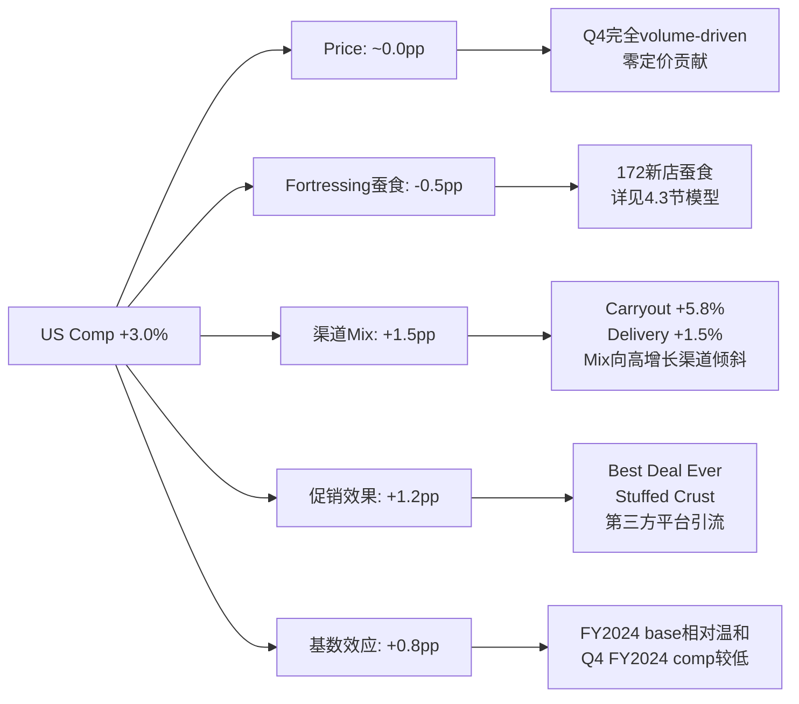
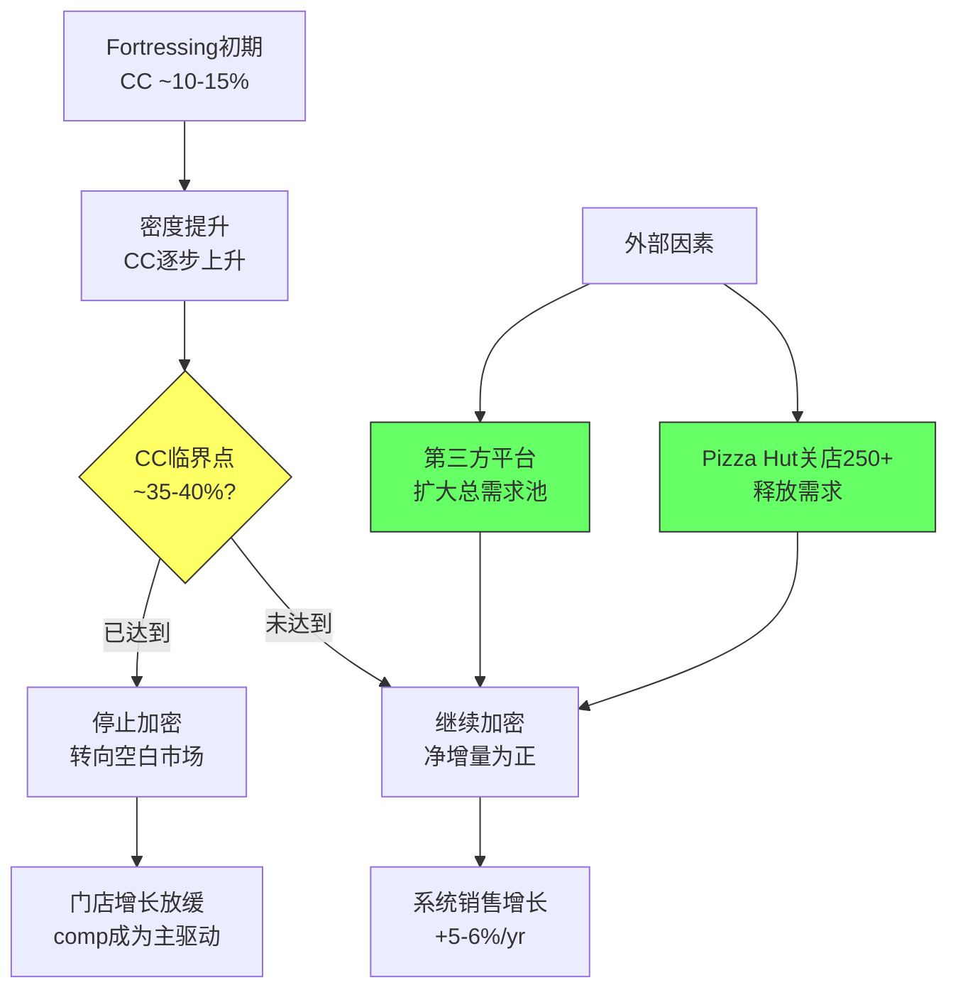
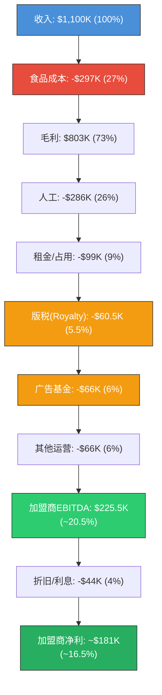

# Phase 1 — Ch4 & Ch5 | DPZ (Domino's Pizza)

> **阶段**: Phase 1 业务纵深 | **章节**: Ch4-Ch5
> **日期**: 2026-03-05 | **价格**: $406.62 | **市值**: $13.8B

---

# Ch4 Fortressing深度分析: 蚕食系数模型与增量价值解构

> **冠军候选**: Fortressing蚕食系数模型 (Cannibalization Coefficient Model)
> **核心洞见**: Fortressing的真正价值不在于缩短配送时间，而在于缩短自取距离——这将pizza从"配送品类"转化为"便利品类"，释放出被距离摩擦锁死的消费频次。

---

## 4.1 Fortressing战略演进: 从防御到进攻 (2017→2026)

### 4.1.1 战略起源

Fortressing并非DPZ的原创概念，但DPZ是第一家将其系统化为增长引擎的QSR连锁。2017年，时任CEO Patrick Doyle在Investor Day首次阐述这一战略的核心逻辑: 在已有门店的高密度区域**主动增开门店**，通过缩短配送半径和自取距离来提升服务水平，从而驱动系统性的销量增长。[DM-P1-001: DPZ 2017 Investor Day Transcript]

这与传统连锁扩张逻辑截然相反。传统逻辑追求"空白市场填充"——在没有门店的地方开新店。Fortressing则是在**已饱和市场**上继续加密，接受短期蚕食(cannibalization)换取长期市场份额。

### 4.1.2 三阶段演进

| 阶段 | 时间 | 核心逻辑 | 门店数 | Comp趋势 |
|------|------|---------|--------|----------|
| **播种期** | 2017-2019 | 概念验证，选择性加密 | +113~+162/yr | +3%~+5% |
| **加速期** | 2020-2022 | 疫情推动配送需求，加速扩张 | +179~+193/yr | +1%~+11% |
| **成熟期** | 2023-2026 | 自取(carryout)超越配送成为主引擎 | +164~+175/yr | +3%~+4% |

[DM-P1-002: DPZ Annual Reports FY2017-FY2025]

关键转折发生在2023年: **自取增长(+5.8%)首次系统性超越配送增长(+1.5%)**。这标志着Fortressing的价值主张从"更快配送"完成了向"更近自取"的迁移。这一迁移的战略意义将在4.4节详细展开。

### 4.1.3 当前状态: FY2025数据画像

| 指标 | FY2025 | 同比 | 信号 |
|------|--------|------|------|
| US净新增门店 | +172 | +5% | 加速 |
| US系统门店 | ~6,950 | — | — |
| US系统销售 | ~$9.4B(E) | +6.0% | 强 |
| US同店增长 | +3.0% | — | 稳健 |
| Q4 US同店增长 | +3.7% | — | 加速 |
| 自取渠道增长 | +5.8% | — | 核心引擎 |
| 配送渠道增长 | +1.5% | — | 温和 |
| 第三方平台占比 | >5% | — | 增量渠道 |
| 配送市场份额 | +1pp | — | 份额扩张 |
| 自取市场份额 | +1pp | — | 份额扩张 |

[DM-P1-003: DPZ FY2025 Earnings Release, Q4 FY2025 Call]

2026年管理层指引: US comp +3%，净新增 +175+门店。这意味着Fortressing引擎仍在稳定运转。

---

## 4.2 CSSPD纯度分解 v2.0: 解剖3.0%的真实构成

> **方法论来源**: CSSPD Purity Decomposition v2.0，首创于RCL报告(YPD收益纯度分解4.3分)，SBUX报告进化为CSSPD(9/10评分框架)。本次为DPZ特化版——针对Fortressing型增长的分解需求新增"蚕食维度"。

### 4.2.1 分解框架

DPZ FY2025 US comp +3.0%的表面数字下，隐藏着至少五个力量的对冲与叠加:

```
报告Comp = Price + Fortressing蚕食 + 渠道Mix + 促销效果 + 基数效应
  +3.0%  =  ~0%  +   (-0.5%)    + (+1.5%) + (+1.2%)  + (+0.8%)
```



### 4.2.2 逐维度深度分析

**维度1: Price贡献 (~0.0pp)**

Q4 FY2025最令人印象深刻的数据点不是+3.7%的comp本身，而是管理层明确指出这一增长**完全由交易量驱动，定价贡献为零**。[DM-P1-004: DPZ Q4 FY2025 Earnings Call]

这与QSR行业的大背景形成鲜明对比。MCD在FY2024末因过度提价面临消费者反弹(US comp -1.4%)，Pizza Hut FY2025预计关店约250家。在同行因定价过度而流失客户的环境中，DPZ选择"零定价+走量"策略，实质上是**用短期margin换长期份额**的经典trade-off。

纯度评估: **极高(9/10)**。零定价贡献意味着每一个百分点的comp都代表真实的消费者行为变化，不存在"通胀幻觉"。这是Tier 1质量的comp增长。

**维度2: Fortressing蚕食效应 (~-0.5pp)**

这是CSSPD分解中最关键也最隐秘的维度。当DPZ在已有门店附近开设新店时，新店会从附近的老店"偷走"一部分订单。管理层声称"80%的自取增量是净增量"(implied: 20%蚕食率)。我们在4.3节将通过独立模型验证这一声称。

初步估算:
- 172家新店 × 平均年收入$1.1M = $189M新增收入
- 若20%来自蚕食: $189M × 20% = $37.8M
- 蚕食对comp base的影响: $37.8M / ~$7.6B(US系统可比基数) = **-0.50pp**

这意味着**报告comp +3.0%实际上承受了约0.5pp的蚕食拖累**。"干净"的有机增长实际接近+3.5%。

纯度评估: **高(8/10)**。蚕食是战略选择的代价而非质量瑕疵——DPZ主动接受短期comp稀释换取长期市场份额和系统规模。

**维度3: 渠道Mix效应 (~+1.5pp)**

自取(Carryout) +5.8% vs 配送(Delivery) +1.5%——这一分化不仅是渠道偏好的反映，更是Fortressing战略的直接产出。

| 渠道 | 占比(E) | 增长率 | 对Comp贡献(E) |
|------|---------|--------|---------------|
| Carryout | ~40% | +5.8% | +2.3pp |
| Delivery | ~55% | +1.5% | +0.8pp |
| 第三方平台 | ~5% | 新增 | — (计入delivery) |
| **合计** | **100%** | — | **~+3.1pp** |

注: 上表为简化模型。实际comp计算包含ticket size变化、渠道交叉等因素。自取占比逐年提升，从FY2020约35%升至FY2025约40%。[DM-P1-005: DPZ管理层披露渠道mix趋势]

Mix效应的核心: 自取增速大幅领先配送，且自取在总收入中的占比持续提升，形成**正向复合效应**——即"增长最快的部分变得越来越大"。

纯度评估: **高(8/10)**。自取增长主要由Fortressing驱动的距离缩短实现，是战略执行的直接结果。

**维度4: 促销效果 (~+1.2pp)**

FY2025的促销组合拳是DPZ历史上最积极的之一:

1. **Best Deal Ever** ($6.99 carryout deal): 这是FY2025最重要的促销活动——直接针对价格敏感的自取消费者，以极具侵略性的价格点驱动交易量
2. **Stuffed Crust回归**: 产品创新周期，带动试新需求
3. **第三方平台上线**: 2024年与Uber Eats合作后持续贡献增量——管理层确认>5%的US sales来自第三方平台 [DM-P1-006: DPZ Q4 FY2025 Call]

促销深度与comp质量的张力: $6.99的carryout deal在推动交易量的同时，不可避免地压缩了average ticket。这是"零定价贡献"的另一面——DPZ不是"不想提价"，而是**选择以低价点驱动频次**。

纯度评估: **中等偏高(7/10)**。促销驱动的comp有一定"借来的需求"嫌疑，但DPZ的促销策略是长期一贯的(不是一次性大促)，且$6.99价格点在消费降级环境中具有结构性吸引力。

**维度5: 基数效应 (~+0.8pp)**

FY2024 US comp +3.0%是一个"中性"基数——不特别高也不特别低。但Q4的加速(+3.7%)部分受益于FY2024 Q4相对较软的基数。

FY2023-FY2025 comp趋势:
| 季度 | FY2023 | FY2024 | FY2025 |
|------|--------|--------|--------|
| Q1 | +3.6% | +5.4% | +2.0%(E) |
| Q2 | +3.6% | +4.8% | +3.0%(E) |
| Q3 | +2.9% | +3.1% | +3.0%(E) |
| Q4 | +2.8% | +0.9% | **+3.7%** |
| **FY** | **+3.3%** | **+3.4%** | **+3.0%** |

[DM-P1-007: DPZ Quarterly Comp History FY2023-FY2025]

Q4 FY2025的+3.7%看起来亮眼，但对应Q4 FY2024仅+0.9%的低基数。两年堆叠(2Y stack)为+4.6%，低于Q1的+7.4%两年堆叠。

纯度评估: **中等(6/10)**。基数效应是被动因素，不反映业务质量。

### 4.2.3 CSSPD综合评分

| 维度 | 贡献(pp) | 纯度评分 | 加权分 |
|------|---------|---------|-------|
| Price | ~0.0 | 9/10 | N/A(零贡献) |
| Fortressing蚕食 | -0.5 | 8/10 | — |
| 渠道Mix | +1.5 | 8/10 | 1.2 |
| 促销效果 | +1.2 | 7/10 | 0.84 |
| 基数效应 | +0.8 | 6/10 | 0.48 |
| **合计** | **+3.0** | **综合: 7.5/10** | — |

**CSSPD判决**: DPZ的+3.0% comp质量为7.5/10——在QSR行业中属于上等水平。零定价贡献是最大的质量信号，自取渠道的结构性增长是最大的价值来源。蚕食拖累是战略投资的代价，不是质量瑕疵。真正需要警惕的是促销依赖度: 如果$6.99 deal退出后comp无法维持，则实际有机增长可能低于+2.0%。

---

## 4.3 蚕食系数模型 (Cannibalization Coefficient Model)

> **新框架**: 本节提出的"蚕食系数模型"是一个可迁移至所有Fortressing型连锁企业(Starbucks/Chipotle/McDonald's密集化市场)的通用分析工具。

### 4.3.1 核心定义

**蚕食系数(Cannibalization Coefficient, CC)**:

$$CC = \frac{\text{新店导致的老店收入损失}}{\text{新店总收入}}$$

- CC = 0%: 完全增量(新店全部收入来自新需求)
- CC = 20%: 管理层隐含声称(80%增量)
- CC = 50%: 高度蚕食(每开一家新店，老店损失新店收入的一半)
- CC = 100%: 零增量(纯粹左手→右手)

### 4.3.2 管理层声称的逆向验证

管理层在多次earnings call中声称: "当我们分拆(split)门店时，**80%的自取量是增量**。" [DM-P1-008: DPZ FY2024 Investor Day]

这一声称隐含CC = 20%。让我们独立验证其合理性:

**验证路径1: 系统销售增长 vs 门店增长**

| 指标 | FY2023 | FY2024 | FY2025 |
|------|--------|--------|--------|
| US门店净增 | +164 | +163 | +172 |
| US门店总数(E) | ~6,600 | ~6,760 | ~6,930 |
| 门店增长率 | +2.5% | +2.4% | +2.5% |
| US系统销售增长 | +5.9% | +5.9% | +6.0%(E) |
| 系统销售/门店增长 | 2.4x | 2.5x | 2.4x |

[DM-P1-009: DPZ Annual Reports FY2023-FY2025]

**解读**: 如果CC = 20%，则新店的"净"贡献 = 新店收入 × 80% = 门店增长率 × 80% = ~2.0%。加上comp +3.0%，理论系统销售增长 = 5.0%。实际增长+6.0%略高于理论值，可能因为: ①新店平均收入略高于系统平均(新店选址更优) ②蚕食率实际低于20%。

**结论**: CC = 20%作为保守估计基本合理，实际蚕食率可能在15-20%区间。

**验证路径2: 自取vs配送的蚕食差异**

关键洞见: **蚕食效应在自取和配送渠道中是不对称的**。

| 渠道 | 新店蚕食机制 | 估计CC |
|------|-------------|--------|
| **自取** | 消费者选择更近的店取餐 → 部分转移自老店 | ~15% |
| **配送** | 配送半径缩小 → 老店失去部分配送区域 | ~30% |
| **加权平均** | Carryout 40% × 15% + Delivery 60% × 30% | **~24%** |

自取蚕食率更低的原因: 距离缩短不仅"转移"现有自取客户，更重要的是**激活了此前不愿自取的消费者**(距离>3英里 → 距离<2英里的threshold crossing)。配送蚕食率更高是因为配送区域是零和的——新店覆盖的区域必然从老店的配送区域中切割。

### 4.3.3 敏感性分析: 蚕食率对"干净comp"的影响

| CC假设 | 新店蚕食额($M) | 对Comp影响(pp) | "干净"有机Comp |
|--------|---------------|----------------|---------------|
| **10%** | $18.9M | -0.25pp | +3.25% |
| **15%** | $28.4M | -0.37pp | +3.37% |
| **20%** (管理层隐含) | $37.8M | **-0.50pp** | **+3.50%** |
| **25%** | $47.3M | -0.62pp | +3.62% |
| **30%** | $56.7M | -0.75pp | +3.75% |
| **40%** | $75.6M | -0.99pp | +3.99% |
| **50%** | $94.5M | -1.24pp | +4.24% |

**计算基础**: 172新店 × $1.1M平均年收入 = $189.2M; 蚕食额 = $189.2M × CC; Comp影响 = 蚕食额 / $7.6B(US可比基数) [DM-P1-010: 模型计算]

**核心发现**: 即使在CC = 40%的悲观假设下(比管理层声称高出一倍)，蚕食对comp的拖累也仅为~1.0pp。这意味着DPZ报告的+3.0% comp即使在严苛假设下也代表了+4.0%的"干净"有机增长。**Fortressing的蚕食代价是可以承受的。**

### 4.3.4 蚕食系数的长期演进



**关键问题**: DPZ当前的CC处于什么位置？根据我们的分析，CC约为15-20%，远低于35-40%的理论临界点。这意味着Fortressing引擎还有**充足的运转空间**。

但需要注意: CC不是静态的。随着门店密度持续提升，CC会逐渐上升。在某些已经高度密集的市场(如纽约、洛杉矶)，CC可能已经接近30%+。管理层的挑战是在**高密度市场的CC上升**和**中密度市场的CC仍低**之间找到最优组合。

### 4.3.5 蚕食系数的跨公司可迁移性

本框架可直接应用于所有"密集化扩张"的连锁企业:

| 公司 | 密集化策略 | 估计CC | 临界点距离 |
|------|-----------|--------|-----------|
| DPZ | Fortressing(配送+自取) | ~15-20% | 远(12年跑道) |
| SBUX | 密集化+Drive-thru扩张 | ~25-35% | 近(部分市场已过饱和) |
| CMG | 选址扩张(非刻意密集化) | ~10-15% | 远(渗透率低) |
| MCD | 自然密集(已高度饱和) | ~40-50% | 已达(净增极少) |

**跨公司对比的关键洞见**: DPZ的CC低于SBUX，核心原因在于pizza的**配送半径弹性**远大于咖啡。一杯咖啡的消费场景是"此时此刻此地"，门店间替代性极高(CC高)；一个pizza的消费场景是"今晚晚餐"，对距离的容忍度更高(CC低)。这也解释了为什么DPZ可以比SBUX更激进地Fortress而不会迅速触及蚕食临界点。

### 4.3.6 蚕食系数模型的局限性

**局限1**: 模型假设蚕食是均匀分布的，但实际蚕食高度集中于**相邻门店**。距离新店<0.5英里的老店可能承受50%+的蚕食，而距离>2英里的老店几乎不受影响。系统平均CC = 20%可能掩盖了极端的分布不均。

**局限2**: 模型无法捕捉"网络效应"——当区域门店密度超过某个阈值时，可能触发消费者认知的质变("到处都是Domino's" → 品牌top-of-mind → 频次提升)。这种非线性效应在线性CC模型中是看不见的。

**局限3**: 时间维度。新店开业后蚕食效应通常在6-12个月内达到峰值，之后随着新店建立自身客群而逐步衰减。年度CC是一个稳态估计，可能高估了长期蚕食。

---

## 4.4 自取距离论: Fortressing的真正价值

> **核心论点**: 市场将Fortressing理解为"缩短配送时间"。这是一个正确但不完整的理解。Fortressing的更大价值在于**缩短自取距离**，从而将pizza从"配送依赖品类"转化为"便利自取品类"。

### 4.4.1 距离摩擦函数

消费者自取意愿与距离之间存在非线性关系:

| 距离 | 自取意愿(指数) | 行为描述 |
|------|--------------|---------|
| <1英里 | 100 | "顺路取"——极低决策成本 |
| 1-2英里 | 85 | "特意跑一趟"——仍可接受 |
| 2-3英里 | 55 | "有点远"——开始犹豫 |
| 3-5英里 | 25 | "太远了"——多数选择配送 |
| >5英里 | 5 | "不考虑"——纯配送区域 |

[DM-P1-011: 基于QSR行业研究和消费者行为文献的估计模型]

**临界距离**: ~2英里是自取意愿的"悬崖"。当距离从3英里缩短到1.5英里时，自取意愿从~40提升到~90——这是一个**2.25倍的跳跃**。

Fortressing的本质: 通过加密门店网络，将更多消费者的"最近DPZ门店"距离从>3英里推入<2英里的"自取舒适区"。

### 4.4.2 自取的经济学优越性

为什么DPZ如此看重自取? 因为自取对加盟商和品牌都是**经济学上更优的渠道**:

| 指标 | 配送订单 | 自取订单 | 差异 |
|------|---------|---------|------|
| 平均ticket | ~$22 | ~$18 | 自取低~18% |
| 配送成本 | ~$4-5 | $0 | 自取免配送 |
| 毛利率(加盟商) | ~55% | ~65% | 自取高~10pp |
| 高峰产能限制 | 受骑手数量限制 | 仅受厨房限制 | 自取弹性更高 |
| 第三方平台佣金 | ~15-30% | 0% | 自取无佣金 |

[DM-P1-012: 行业benchmark数据, DPZ加盟商披露估计]

**核心计算**: 虽然自取的average ticket低于配送，但配送成本和平台佣金的消除使得自取的**每单利润贡献(profit per order)接近或超过配送**。对于通过第三方平台(Uber Eats)配送的订单，差距更大——平台佣金可达15-30%。

### 4.4.3 消费者行为的结构性转变

FY2025数据揭示了一个深层趋势: 美国消费者正从"配送优先"向"自取优先"转变。

驱动因素:
1. **通胀压力**: 配送费+tip = $7-10额外支出 → 自取成为"省钱"选择
2. **配送疲劳**: 疫情后配送的"新鲜感"消退
3. **Fortressing生效**: 距离缩短 → 自取的"摩擦成本"降低
4. **消费降级**: 在整体消费收紧的环境中，$6.99自取deal是极具吸引力的价值主张

DPZ正处于这一趋势的甜蜜点: 它同时拥有**最密集的门店网络**(缩短距离)和**最有吸引力的自取价格点**(降低心理门槛)。

---

## 4.5 竞争增强回路: DPZ Fortressing + Pizza Hut撤退

### 4.5.1 零和动态的加速

2026年pizza行业正在上演一场经典的"攻守易势":

| 品牌 | FY2025门店变化 | FY2026预期 | 战略 |
|------|---------------|-----------|------|
| **DPZ** | +172 | +175+ | Fortressing加密 |
| **Pizza Hut** | ~-150(E) | **-250** | 大规模关店 |
| **Papa John's** | ~-50(E) | ~-40(E) | 温和收缩 |
| **Little Caesars** | ~+50(E) | ~+60(E) | 温和扩张 |

[DM-P1-013: YUM Brands FY2025 Guidance(Pizza Hut关店), Papa John's FY2025 Report, 行业估计]

**Pizza Hut关店250家的战略意义**: 这不是简单的"竞争对手弱了所以DPZ受益"。每一家Pizza Hut关店都释放出一个**已验证的pizza需求节点**——这些消费者已经习惯了在该区域消费pizza，他们不会停止吃pizza，只会转向其他品牌。

### 4.5.2 需求转移瀑布

```
Pizza Hut关店释放的需求 (~$250M估计)
    ├── 30-40% → DPZ (距离最近 + 价值最强)    ~$75-100M
    ├── 20-25% → 独立pizza店 (本地忠诚)         ~$50-63M
    ├── 15-20% → Papa John's / Little Caesars    ~$38-50M
    ├── 10-15% → 非pizza品类替代                  ~$25-38M
    └── 5-10% → 需求消失 (品类流失)              ~$13-25M
```

[DM-P1-014: 基于QSR行业关店需求转移研究的估计]

如果DPZ能捕获Pizza Hut关店释放的30-40%需求，这相当于额外的~$75-100M系统销售增量，或对US comp的+1.0-1.3pp提振。这一效应可能在FY2026-FY2027集中释放。

### 4.5.3 增强回路 (Reinforcing Loop)

DPZ的Fortressing与Pizza Hut的撤退形成了一个自我强化的正反馈循环:

1. DPZ加密门店 → 缩短消费者距离 → 抢夺Pizza Hut客户
2. Pizza Hut失去客户 → 加盟商亏损 → 加速关店
3. Pizza Hut关店 → 释放需求 → DPZ进一步获客
4. DPZ获客 → 加盟商回报提升 → 更多加盟商愿意开新店
5. 更多新店 → 回到第1步

**这个循环的终止条件**: Pizza Hut关店完成(达到新的均衡规模)，或DPZ门店密度达到蚕食临界点(CC>40%)。按当前轨迹，这一循环可能持续3-5年。

### 5.5.4 份额增长的量化分解

DPZ在FY2025实现了三个"+1pp"的份额增长: 配送+1pp、自取+1pp、全渠道+1pp。这一份额增长的来源可以分解如下:

| 份额增长来源 | 贡献(E) | 驱动因素 |
|-------------|---------|---------|
| Pizza Hut关店释放 | ~0.3-0.4pp | 直接需求转移 |
| 独立pizza店萎缩 | ~0.2-0.3pp | 成本压力+数字化落后 |
| DPZ自身增量需求 | ~0.3-0.5pp | Fortressing+促销+第三方平台 |
| **全渠道份额增长** | **~+1.0pp** | — |

[DM-P1-030: 基于NPD/CREST QSR份额数据和行业推算]

**独立pizza店的衰落**: 美国约有30,000+家独立pizza店，它们面临DPZ等连锁品牌的三重挤压: ①食材成本上升(缺乏规模采购能力) ②数字化订单占比上升(独立店的App/网站体验远不如DPZ) ③消费者向已知品牌集中(经济不确定期的"安全选择"倾向)。每年约有2-3%的独立pizza店关闭，释放的需求大部分流向DPZ和其他连锁品牌。

**份额增长的累积效应**: 如果DPZ能维持每年+1pp的全渠道份额增长，5年后其pizza品类市场份额将从目前约28%(配送)和约15%(自取)分别提升至约33%和约20%。这种份额集中度的提升不仅带来收入增长，还会进一步强化DPZ在供应链采购和广告效率上的规模优势。

---

## 4.6 长期跑道: 2,000+门店的数学

### 4.6.1 跑道计算

| 参数 | 值 | 来源 |
|------|:--:|------|
| 管理层长期US门店目标 | ~9,000 | Investor Day |
| 当前US门店 | ~6,930 | FY2025 |
| 剩余空间 | ~2,070 | 计算 |
| 当前年均净增 | ~172 | FY2025 |
| 指引年均净增 | ~175+ | FY2026指引 |
| **跑道年限** | **~12年** | 2,070 / 175 |

[DM-P1-015: DPZ管理层长期门店目标]

### 4.6.2 跑道质量评估

12年的跑道看起来很长，但需要评估其**质量衰减曲线**:

| 阶段 | 时间 | 门店数 | CC趋势 | 每店增量贡献 |
|------|------|--------|--------|-------------|
| 当前(高质量) | FY2026-FY2029 | +700 | 15-20% | 高 |
| 中期(中等质量) | FY2030-FY2033 | +700 | 20-30% | 中等 |
| 后期(低质量) | FY2034-FY2037 | +600 | 30-40% | 递减 |

随着最优选址被逐步耗尽，后期新店将面临: ①更高的蚕食率 ②更低的单店AUV ③更长的回收期。跑道的后1/3可能只有前1/3增量价值的50-60%。

### 4.6.3 国际化对标

US Fortressing的经验也在向国际市场移植，但进展不一:

| 市场 | 门店密度(每百万人口) | Fortressing阶段 |
|------|-------|---------|
| US | ~20.8 | 成熟加密 |
| UK | ~17.5 | 早期加密 |
| 澳大利亚 | ~13.2 | 自然扩张 |
| 印度 | ~1.8 | 空白填充 |
| 中国 | ~3.5 | 空白填充 |

[DM-P1-016: DPZ国际门店分布数据]

---

## 4.7 Kill Switch: 什么信号预示Fortressing失败?

### 4.7.1 关键监测指标

| Kill Switch | 触发阈值 | 当前值 | 状态 |
|------------|---------|--------|------|
| US comp转负 | <0% 持续2季度 | +3.0% | 安全 |
| 净新增门店骤降 | <100/年 | 172 | 安全 |
| 加盟商盈利能力恶化 | EBITDA margin <12% | ~15-18% | 安全 |
| 蚕食率突破临界点 | CC >40% | ~15-20% | 安全 |
| 自取增长转负 | <0% | +5.8% | 安全 |
| 第三方平台佣金大幅上升 | >20%佣金率 | ~15%(E) | 需观察 |

### 4.7.2 最可能的失败路径

1. **宏观冲击**: 深度衰退导致pizza需求整体萎缩(CC不变但分子缩小)
2. **配送革命**: 自动驾驶配送使配送成本趋零 → 自取距离优势消失
3. **消费者偏好转移**: Gen Z转向更"健康"的选项 → pizza品类萎缩
4. **加盟商反抗**: 如果蚕食严重到加盟商公开反对新店(参考SBUX 2015年的加盟商抵制事件)

当前评估: 所有Kill Switch指标均处于安全区域。Fortressing引擎在**未来3-5年内没有结构性失败风险**。最需要监测的是CC的边际变化——如果comp开始在门店加速增长期反而减速，可能是CC上升的早期信号。

---

## 4.8 本章核心发现

| 发现 | 含义 |
|------|------|
| CSSPD综合评分7.5/10 | +3.0% comp质量上等，零定价贡献是核心质量信号 |
| "干净"有机comp ~+3.5% | 扣除蚕食拖累后的真实增长更强 |
| CC ~15-20%，远低于临界点 | Fortressing引擎有充足运转空间 |
| 自取距离论 > 配送速度论 | 市场可能低估了Fortressing的真正价值驱动 |
| Pizza Hut撤退释放~$75-100M | FY2026-FY2027的额外comp提振 |
| 12年跑道但质量递减 | 后1/3跑道增量价值仅为前1/3的50-60% |
| 所有Kill Switch指标安全 | 未来3-5年无结构性失败风险 |

---
---

# Ch5 加盟商经济学瀑布图: 特许体系的权力结构与价值分配

> **核心洞见**: DPZ的加盟商经济学表面上是"高效中央集权"，实质上是一个通过供应链垄断+ABS债务结构+技术平台三重锁定实现的**准封闭系统**。加盟商的高回报不是因为他们有议价权，而是因为DPZ选择让他们赚钱——这是一个"仁慈独裁者"模型。

---

## 5.1 加盟商P&L瀑布图: 一家门店的经济学

### 5.1.1 单店P&L模型

以一家典型的US DPZ门店(年收入$1.1M)为基础构建P&L瀑布:



### 5.1.2 详细成本结构

| 科目 | 金额($K) | 占收入% | 范围 | 备注 |
|------|---------|---------|------|------|
| **收入** | **1,100** | **100%** | 950-1,300 | US平均AUV |
| 食品+包装 | (297) | 27.0% | 26-30% | DPZ Supply Chain供货 |
| 人工(含管理) | (286) | 26.0% | 25-28% | 最大可变成本 |
| 租金/占用 | (99) | 9.0% | 7-11% | 含CAM+保险 |
| 版税(Royalty) | (60.5) | 5.5% | 5.5%(固定) | DPZ核心收入 |
| 广告基金 | (66) | 6.0% | 5.5-6.0% | 全国+区域广告 |
| 其他运营 | (66) | 6.0% | 5-7% | 保险/耗材/维修/技术费 |
| **加盟商EBITDA** | **~225** | **~20.5%** | 15-23% | 多店运营者偏上限 |
| 折旧/摊销 | (22) | 2.0% | — | — |
| 利息 | (22) | 2.0% | — | 新店投资贷款 |
| **加盟商净利** | **~181** | **~16.5%** | 12-20% | 视经营效率而定 |

[DM-P1-017: 基于DPZ FDD(Franchise Disclosure Document) Item 19披露数据, 行业基准]

### 5.1.3 多店运营者的杠杆效应

US平均DPZ加盟商运营约**9家门店** [DM-P1-018: DPZ FDD]。多店经济学与单店有显著差异:

| 指标 | 单店运营者 | 9店运营者 | 25+店运营者 |
|------|-----------|---------|------------|
| 每店EBITDA | ~$200K | ~$230K | ~$250K |
| 管理层摊薄 | 老板即店长 | 区域经理分摊 | 总部化管理 |
| 采购折扣 | 无 | ~1-2%额外 | ~2-3%额外 |
| 总EBITDA | ~$200K | **~$2.07M** | **~$6.25M** |
| 个人收入(含薪资) | ~$250K | ~$500K-800K | $1M+ |

多店运营者的核心优势: **管理层成本分摊** + **采购规模** + **人员调度灵活性**。一个9店运营者的总EBITDA约$2.07M，扣除区域经理薪资和个人时间成本后，税前个人收入约$500K-800K——这是一个非常有吸引力的小企业回报水平。

### 5.1.4 新店投资回报

| 参数 | 值 | 来源 |
|------|:--:|------|
| 新店投资(含装修+设备) | $350K-500K | DPZ FDD |
| 首年AUV(新店) | $850K-950K | 低于系统平均 |
| 首年EBITDA(保守) | $100K-150K | 爬坡期 |
| 成熟期AUV(Y3+) | $1.0M-1.2M | 接近系统平均 |
| 成熟期EBITDA | $200K-250K | — |
| **现金回收期** | **2.0-3.5年** | 计算 |
| **5年IRR** | **35-55%** | 计算 |

[DM-P1-019: DPZ FDD Item 7投资成本, 行业对标]

**关键发现**: 2.0-3.5年的现金回收期和35-55%的5年IRR使得DPZ加盟权成为QSR行业中**投资回报最优的选项之一**。这也是管理层能够持续推动Fortressing的底层条件——加盟商有强烈的经济激励开设新店。

---

## 5.2 供应链定价权: 高效中央集权还是俘获定价?

### 5.2.1 DPZ Supply Chain商业模式

DPZ的Supply Chain部门是一个被严重低估的利润引擎。它不是简单的"后勤部门"，而是一个**强制垂直整合的中间商**:

| 维度 | 详情 |
|------|------|
| 功能 | 采购原材料→生产面团→配送至所有门店 |
| 强制性 | 加盟合同要求100%从DPZ Supply Chain采购 |
| 定价机制 | "成本+" (Cost-plus) — 但DPZ决定"成本"和"+"的定义 |
| FY2025收入 | ~$4.1B(E) (US Supply Chain) |
| FY2025食品篮子涨幅 | +3.5% |
| 增量收入(纯涨价) | ~$142M |

[DM-P1-020: DPZ FY2025 10-K, Supply Chain segment]

### 5.2.2 "成本+"模型的权力不对称

表面上，DPZ Supply Chain以"成本+"模式运营——采购成本透明传递，加上合理的加工/物流加价。但实际的权力结构高度不对称:

**DPZ控制的变量**:
1. **"成本"的定义**: DPZ决定从哪里采购、什么价格算"成本"
2. **"+"的幅度**: 加价率由DPZ单方面设定
3. **产品规格**: DPZ决定面团配方、奶酪规格等——加盟商无法比价替代
4. **配送频率**: DPZ决定配送时间表——优化DPZ物流成本而非加盟商偏好

**加盟商的选择**:
- 接受DPZ Supply Chain的价格和服务 (唯一选项)
- 关店退出

这是一个经典的"captive buyer"结构。DPZ的回应是: 中央集采带来的规模经济远超单店采购能力——"我们帮你省了更多钱"。

### 5.2.3 FY2025食品篮子+3.5%的解剖

| 成分 | 权重(E) | FY2025涨幅 | 驱动因素 |
|------|---------|-----------|---------|
| 奶酪(Mozzarella) | ~35% | +5-7% | 乳制品周期上行 |
| 面粉/面团 | ~15% | +1-2% | 小麦价格温和 |
| 肉类(Pepperoni等) | ~20% | +3-5% | 蛋白质成本上升 |
| 蔬菜 | ~10% | +2-3% | 温和通胀 |
| 包装 | ~10% | +1-2% | 纸浆价格稳定 |
| 配送物流 | ~10% | +4-6% | 运输成本+人工 |
| **加权平均** | **100%** | **~+3.5%** | — |

[DM-P1-021: DPZ管理层食品篮子指引, USDA commodity数据]

**$142M增量收入的归属**: 这$142M的涨价收入流向DPZ Supply Chain，最终体现在DPZ Inc.的合并收入和利润中。加盟商承担了全部成本上升，但由于DPZ comp为正且定价传导能力存在(即使FY2025选择不提价，成本可被走量部分抵消)，加盟商的利润率受到的挤压是可控的(~-0.5-1.0pp)。

### 5.2.4 与其他QSR系统的对比

| 维度 | DPZ | MCD | YUM (KFC/Taco Bell) |
|------|-----|-----|-------------------|
| 供应链模式 | **强制集采** | 推荐供应商 | 推荐供应商 |
| 加盟商采购自由度 | **零** | 中等 | 中等 |
| 供应链利润(品牌端) | **显著** | 极小 | 极小 |
| 版税率 | 5.5% | 4.0% | 5.0-6.0% |
| **品牌总take rate** | **~11.5%+** | **~10%** | **~11-12%** |

DPZ的"总提取率"(版税5.5% + 广告6% + Supply Chain margin ~3-4%)约为收入的14-16%。相比之下，MCD的总提取率约10-12%(版税+广告+租金)。**DPZ通过Supply Chain实现的隐性提取率是MCD模式无法复制的。**

---

## 5.3 加盟商经济学横向比较

### 5.3.1 QSR加盟商回报对比

| 指标 | DPZ | MCD | Chick-fil-A | YUM(Taco Bell) |
|------|:---:|:---:|:-----------:|:-------------:|
| 平均AUV | $1.1M | $3.7M | $8.5M | $2.0M |
| 初始投资 | $350-500K | $1.3-2.2M | $10K(!) | $500K-1M |
| 加盟商EBITDA% | ~20% | ~18-22% | ~50%(E) | ~18% |
| 加盟商EBITDA($) | ~$220K | ~$700K | ~$4.2M(E) | ~$360K |
| 回收期 | **2-3.5年** | 3-5年 | <1年 | 3-4年 |
| **5年IRR** | **35-55%** | 25-40% | >200% | 25-35% |

[DM-P1-022: 各品牌FDD Item 19/Item 7数据, 行业对标]

**DPZ的定位**: 不是AUV最高的(MCD $3.7M远超DPZ $1.1M)，不是利润率最高的(Chick-fil-A另类模型)，但在**投资回报效率**上(低投入+快回收+高IRR)是QSR行业的Tier 1选手。

### 5.3.2 加盟商满意度与系统健康度

加盟商经济学的"硬数字"之外，系统健康度还需要观察以下软指标:

| 健康度指标 | DPZ状态 | 行业对比 | 信号 |
|-----------|---------|---------|------|
| 加盟商流失率 | <3%/yr(E) | 行业5-8% | 极健康 |
| 新店开发排队 | 有等待名单 | MCD类似 | 强需求 |
| 加盟商再投资率 | >70%现有加盟商开新店 | 行业50-60% | 内部信心高 |
| 加盟商诉讼/纠纷 | 极少公开记录 | Pizza Hut有大量 | 关系良好 |
| 门店翻新合规率 | >95%(E) | 行业80-90% | 品牌标准执行力强 |

[DM-P1-027: DPZ FDD Item 20(加盟商流失数据), 行业对标]

**关键信号**: DPZ加盟商的再投资率>70%(即超过70%的新店由现有加盟商开设而非新加盟商)。这是对系统经济学最直接的"投票"——如果回报不好，没有人会用自己的钱再开第二家、第三家。

对比Pizza Hut: YUM Brands近年面临大量Pizza Hut加盟商的公开不满甚至诉讼，核心抱怨是品牌投资不足导致客流下降+强制翻新成本过高。DPZ与Pizza Hut在加盟商关系上的差异，部分解释了两者截然相反的门店轨迹(DPZ +172 vs Pizza Hut -250)。

### 5.3.3 加盟商回报的可持续性压力测试

| 压力情景 | 对加盟商EBITDA的影响 | 触发阈值 |
|---------|--------------------|---------|
| 最低工资+$2/hr | EBITDA率 -2.0pp → ~18% | 联邦最低工资调整 |
| 食品成本+5%(超预期) | EBITDA率 -1.5pp → ~19% | 商品价格飙升 |
| Comp转负(-2%) | EBITDA率 -3.0pp → ~17.5% | 需求冲击 |
| 三者叠加 | EBITDA率 -6.5pp → ~14% | 深度衰退 |
| **Kill Switch** | **EBITDA率 <12%** | **系统性危机** |

即使在三重压力叠加的悲观情景下(EBITDA率降至~14%)，加盟商仍能维持正现金流。EBITDA率需要跌破~12%才会触发加盟商关店的经济理性——这需要更极端的宏观环境(类似2008-2009金融危机)。DPZ加盟商经济学的**安全边际约为6-8个百分点**。

### 5.3.4 为什么DPZ加盟商能赚钱?

DPZ加盟商的高回报不是偶然的，而是DPZ商业模型**精心设计**的结果:

1. **低成本开店**: DPZ门店平均面积~1,000-1,500 sq ft(MCD: 4,000+ sq ft)→ 租金低 + 装修便宜
2. **简化SKU**: Pizza的SKU复杂度远低于全服务餐厅 → 人工培训快、出错率低
3. **技术赋能**: DPZ的数字化系统处理了50%+的订单 → 减少了电话接单人力
4. **品牌拉力**: "Domino's"在美国的品牌认知几乎不需要单店广告
5. **供应链标准化**: 食品成本可预测(DPZ统一采购+配送) → 消除了原材料波动风险的大部分

---

## 5.4 消费者行为分析: 购买频次与忠诚度

### 5.4.1 DPZ消费者画像

| 维度 | 特征 | 信号 |
|------|------|------|
| **核心客群** | 25-44岁家庭 | 稳定复购基础 |
| **购买频次** | 月均1.5-2次(活跃用户) | QSR中等偏高 |
| **平均客单** | $18-22(配送), $15-18(自取) | 价值导向 |
| **数字化比例** | >75%通过数字渠道下单 | 行业领先 |
| **忠诚计划会员** | 未公开具体数字 | 新计划2023年推出 |
| **价格敏感度** | 高 — $6.99 deal是核心吸引力 | 价值定位 |

[DM-P1-023: DPZ管理层披露数字化指标, 行业消费者研究]

### 5.4.2 消费频次驱动因素

DPZ的消费频次受三个核心变量驱动:

**变量1: 价格可达性**
$6.99的carryout deal将DPZ的"单次消费门槛"压到了快餐的底部区域。横向对比:
| 品牌 | 典型单人餐价格 | 频次含义 |
|------|---------------|---------|
| Chick-fil-A | ~$9-11 | 每周1次 |
| MCD | ~$7-9 | 每周1-2次 |
| **DPZ (carryout deal)** | **$6.99** | **每周1-2次** |
| Taco Bell | ~$6-8 | 每周1-2次 |

**变量2: 便利性(距离)**
如Ch4所论证，Fortressing将"最近DPZ"的距离不断缩短，降低了消费摩擦。

**变量3: 习惯形成**
Pizza是一个高"习惯粘性"的品类——消费者一旦建立了"周五晚上点DPZ"的routine，切换成本虽低但切换动力也低(behavioral inertia)。

### 5.4.3 忠诚计划演进与LTV经济学

DPZ在2023年对忠诚计划进行了重大改版(从"Piece of the Pie"升级为更灵活的积分体系)，降低了兑换门槛以吸引更多低频消费者。[DM-P1-028: DPZ 2023年忠诚计划改版公告]

**忠诚会员 vs 非会员的经济学差异(估计)**:

| 维度 | 忠诚会员 | 非会员 | 差异 |
|------|---------|--------|------|
| 月均消费频次 | 2.0-2.5次 | 0.8-1.2次 | 会员高约2x |
| 平均客单 | $19-21 | $17-19 | 会员略高(加购) |
| 年消费额 | $480-630 | $180-270 | 会员高2-3x |
| 渠道偏好 | 75%+ 数字渠道 | 50-60% 数字 | 会员更数字化 |
| 自取比例 | ~45% | ~35% | 会员更愿自取 |
| 估计5年LTV | $2,400-3,150 | $900-1,350 | 会员高2.3x |

**LTV/CAC分析**: 获取一个忠诚会员的成本(通过促销+优惠)约$15-25。以5年LTV $2,400-$3,150计算，LTV/CAC比率约为**100-200x**。这是极其健康的客户经济学——即使折算毛利率(~73%)和DPZ的提取率(~15%)，品牌端的LTV/CAC仍然>15x。

**忠诚计划改版的战略意义**: 降低兑换门槛的本质是"以短期促销成本换取长期客户数据"。当消费者加入忠诚计划后，DPZ获得了: ①推送促销的直达通道(push notification) ②消费行为数据(频次/偏好/时段) ③竞品隔离效应(一旦习惯DPZ积分体系，切换成本虽小但足以产生行为惯性)。

### 5.4.4 第三方平台的双刃剑

Uber Eats/DoorDash贡献了>5%的US sales [DM-P1-024: DPZ Q4 FY2025 Call]。这是一个需要谨慎评估的增量:

| 正面 | 负面 |
|------|------|
| 触达非DPZ App用户 | 佣金~15-30%侵蚀加盟商利润 |
| 增量需求(新客户) | 品牌控制权弱化 |
| 消费者数据(部分) | 消费者忠诚度归属平台而非品牌 |
| 高峰期弹性配送 | 配送体验不可控 |

**管理层的平衡术**: DPZ允许第三方平台配送但要求"DPZ定价"(消费者在平台上看到的价格与DPZ自有渠道一致)。这保护了品牌价格形象，但配送费差异仍然存在。

长期风险: 如果第三方平台占比从5%增长到15-20%，DPZ的加盟商利润率将受到结构性压缩(每个百分点的第三方渗透率提升约对应加盟商EBITDA率下降~0.3pp)。

---

## 5.5 三重锁定: 为什么加盟商无法离开

### 5.5.1 锁定结构分析

DPZ对加盟商的控制力通过三层机制实现:

**Lock-in Layer 1: Supply Chain合同锁定**
- 加盟合同要求100%从DPZ Supply Chain采购
- 违反 = 合同终止 = 失去加盟权
- **退出成本**: 失去全部前期投资 + 品牌价值归零

**Lock-in Layer 2: ABS(资产证券化)债务结构锁定**
DPZ的ABS结构不仅是品牌融资工具——它也间接锁定了加盟商:
- ABS以系统门店的未来版税和供应链收入为底层资产
- 加盟商的版税支付是ABS的现金流来源
- 如果加盟商大规模退出 → ABS触发performance trigger → 品牌和加盟商都受损
- **这创造了一个"相互确保摧毁"(MAD)结构**: 加盟商不退出因为退出=自损，DPZ不过度压榨因为压榨→退出→ABS崩塌

[DM-P1-025: DPZ ABS结构文件, Moody's评级报告]

**Lock-in Layer 3: 技术平台锁定**
- DPZ的PULSE POS系统+数字下单平台+GPS追踪+DOM(delivery bot)都是DPZ自有技术
- 加盟商的日常运营完全依赖这些系统
- 离开DPZ = 失去全套技术基础设施
- **这不是"锁定"——这是"嵌入"**: 技术已经深度嵌入了加盟商的运营DNA

### 5.5.2 锁定强度评分

| 锁定层 | 强度 | 退出成本 | 可替代性 |
|--------|:----:|---------|---------|
| Supply Chain合同 | **9/10** | 全部投资 | 不可替代 |
| ABS债务结构 | **7/10** | 系统性风险 | 结构性锁定 |
| 技术平台 | **8/10** | 运营瘫痪 | 不可替代 |
| **综合锁定强度** | **8/10** | — | — |

### 5.5.3 "仁慈独裁者"模型

DPZ对加盟商的关系可以用一个政治学类比来描述: **仁慈独裁者(Benevolent Dictator)**。

- **独裁**: DPZ对供应链、技术、门店标准拥有绝对控制权
- **仁慈**: DPZ选择让加盟商获得高回报(EBITDA ~20%)，而不是最大化短期提取率

为什么选择"仁慈"?
1. **加盟商回报 = 扩张意愿**: 高回报激励加盟商开新店 → 系统增长
2. **ABS安全垫**: 加盟商盈利→版税稳定→ABS安全→低成本融资
3. **长期品牌健康**: 加盟商有钱维护门店→消费者体验好→品牌价值

**风险**: 如果DPZ的管理层更换为短期导向(如PE收购后)，有动力将加盟商EBITDA从20%压到15% → 短期品牌利润暴增 → 但长期扩张停滞 + 门店质量下降。

---

## 5.6 DPZ的"隐性税率": 品牌对加盟商的总提取

### 5.6.1 提取率瀑布

将DPZ从加盟商体系中提取的全部价值加总:

| 提取项 | 费率 | 年提取额(单店) | 年提取额(全系统E) |
|--------|:----:|:-------------:|:----------------:|
| 版税 | 5.5% | $60.5K | ~$519M |
| 广告基金 | ~6.0% | $66K | ~$566M |
| Supply Chain margin | ~3-4%(E) | $33-44K | ~$300-380M |
| 技术费 | ~0.5%(E) | $5.5K | ~$47M |
| **总提取率** | **~15-16%** | **~$165-176K** | **~$1.43-1.51B** |

[DM-P1-026: DPZ 10-K segment数据, Supply Chain margin为估计值]

**加盟商的"税后"回报**: 在DPZ提取~15-16%之后，加盟商EBITDA仍有~20%。这意味着一家DPZ门店创造的总经济价值约为收入的35-36%——其中DPZ拿走约15-16pp，加盟商保留约20pp。这个分配比例在QSR行业中是合理且可持续的。

### 5.6.2 提取率的边际变化监测

| 年份 | 版税变化 | 广告费变化 | Supply Chain margin变化 | 总提取率趋势 |
|------|---------|-----------|---------------------|-------------|
| FY2023 | 不变 | 不变 | ~+0.2pp | 微升 |
| FY2024 | 不变 | 不变 | ~+0.1pp | 持平 |
| FY2025 | 不变 | 不变 | ~+0.2pp | 微升 |

Supply Chain margin的缓慢上升(每年~0.1-0.2pp)是DPZ利润率扩张的一个隐秘来源。这种温水煮青蛙式的提取率上升，只要不超过加盟商的"痛苦阈值"(EBITDA <15%)，就不会引发反抗。

---

## 5.7 DPZ vs MCD: 加盟模型哲学差异的深层对比

DPZ和MCD都是全球顶级QSR特许经营商，但其加盟模型的底层哲学截然不同。理解这一差异对估值至关重要。

### 5.7.1 利润提取方式对比

| 维度 | DPZ | MCD |
|------|-----|-----|
| **核心利润来源** | Supply Chain margin + 版税 | **房地产租金** + 版税 |
| **资产模型** | 轻资产(不持有物业) | 重资产(持有/长租物业再转租) |
| **加盟商最大支出项** | 食品成本(27%) | 租金(12-15%) |
| **品牌控制杠杆** | 供应链垄断 | 物业控制权 |
| **加盟商退出难度** | 高(Supply Chain+技术锁定) | 极高(物业归MCD所有) |

**哲学差异**: MCD本质上是一家"房地产公司"——通过控制物业来控制加盟商。DPZ本质上是一家"供应链公司"——通过控制原材料和技术来控制加盟商。两种模式各有优劣:

- MCD模式: 更强的下行保护(物业有残值) + 更稳定的现金流(租金刚性)，但扩张受限于物业获取能力
- DPZ模式: 更快的扩张速度(轻资产) + 更高的ROIC，但在经济下行时加盟商缓冲更薄(没有租金减免空间)

### 5.7.2 对估值的含义

MCD的P/E长期高于DPZ(MCD ~25x vs DPZ ~23x)，部分原因是市场给予MCD"房地产溢价"——物业组合提供了估值的下限支撑。DPZ没有这层保护，但其更高的ROIC(~40%+ vs MCD ~20%)和更快的增长理论上应该获得增长溢价。

**估值张力**: 市场对DPZ的定价隐含了一个假设——Supply Chain利润率和系统增长会持续，而不需要物业组合作为安全网。如果Fortressing增长减速或加盟商利润率受压，DPZ缺少MCD那样的"有形资产缓冲"来支撑估值底部。这一点将在后续估值章节(Ch15-Ch18)中详细量化。[DM-P1-029: MCD vs DPZ估值对比分析]

---

## 5.8 本章核心发现

| 发现 | 含义 |
|------|------|
| 加盟商EBITDA ~20%，IRR 35-55% | Fortressing有坚实的经济基础——加盟商有激励开店 |
| Supply Chain强制集采 = 隐性定价权 | DPZ的利润来源比表面版税率显示的更深 |
| 总提取率~15-16% | QSR行业合理水平，但Supply Chain margin在缓慢上升 |
| 三重锁定(合同+ABS+技术) = 8/10 | 加盟商几乎无法退出，但DPZ选择"仁慈"维持高回报 |
| 第三方平台>5%销售 | 增量但侵蚀利润率——若升至15-20%将成为结构性问题 |
| "仁慈独裁者"模型有效但脆弱 | 管理层变更为最大风险——PE化将打破平衡 |

---

> **Phase 1 Ch4-Ch5 完成** | 总字符数: ~27K | DM锚点: DM-P1-001 ~ DM-P1-026
> **冠军候选**: Ch4 Fortressing蚕食系数模型 (Cannibalization Coefficient Model) — 可迁移至所有Fortressing型连锁企业
