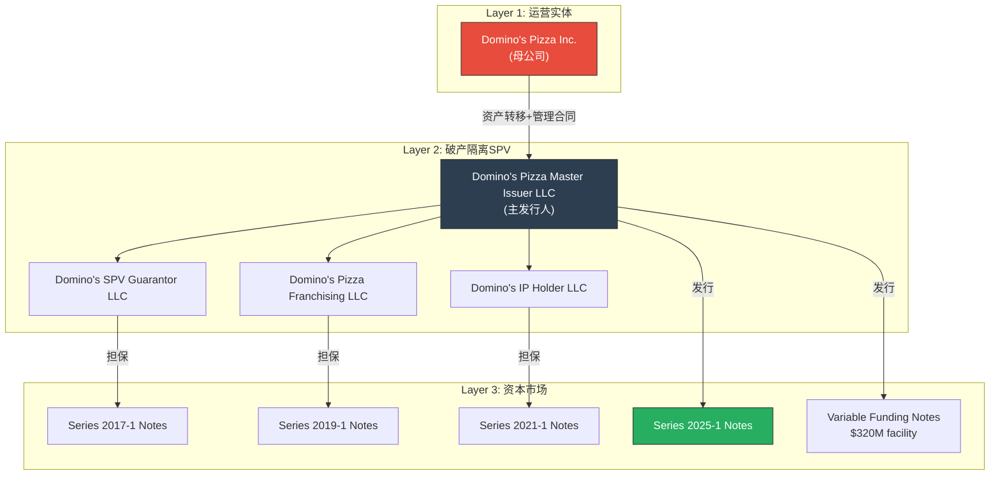
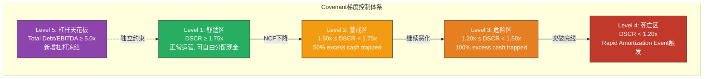

# Ch10: ABS证券化解构 — Domino's Pizza Master Issuer的资本结构密码

> **CQ-3链接**: 本章解构ABS covenant headroom，直接回答CQ-3核心问题——"$672M FCF中，多少被covenant锁定为债务服务的安全垫？回购天花板的真实高度在哪里？"
> **冠军候选 C-3**: Covenant Headroom量化分析 (Section 10.3)
> **方法论**: WBS结构力学 → 多层covenant拆解 → headroom敏感性矩阵 → 再融资风险定价

---

## 10.1 Whole Business Securitization力学基础

### 10.1.1 什么是WBS？为什么Pizza Chain是天然载体？

Whole Business Securitization (WBS) 是一种将企业**全部收入产生资产**打包进破产隔离的特殊目的载体 (SPV) 的融资结构。与传统ABS（如汽车贷款、信用卡应收款）不同，WBS的抵押品不是一组离散资产，而是**整个商业体系的现金流产生能力**——品牌、特许经营协议、知识产权、分销利润。

[DM-P2-020: KBRA WBS Global Rating Methodology; NEAM "Whole Business Securitization — The Power of Structure"]

**WBS的三层结构力学**:

**Pizza Chain作为WBS天然载体的四个原因**:

| 特性 | 为什么适合WBS | DPZ的具体表现 |
|------|-------------|-------------|
| **现金流可预测性** | 特许经营费=收入×固定%，波动极小 | Franchise royalty 5.5%+advertising 6%=11.5% of sales |
| **资产轻量化** | 抵押品是IP和协议，非实物资产 | 6,800+特许门店，公司仅运营约280家 [DM-P2-021] |
| **地理分散** | 数千加盟商分散单点风险 | 美国6,800+国际13,800+门店 |
| **必需品属性** | Pizza是经济下行中的"trading down"受益品 | COVID期间SSS +16.1% (2020) |

**关键机制——Rating Uplift**: WBS的核心魔法在于评级上浮。通过将资产隔离进SPV，即使Domino's Inc.破产，SPV中的特许经营协议和IP继续产生现金流偿还债券持有人。这允许S&P给予DPZ的ABS **BBB+**评级——这是WBS领域的最高评级，也是所有QSR franchise securitization中的标杆。相比之下，如果DPZ以公司级别发行无担保债务，评级可能仅在BB/BB+区间。

[DM-P2-022: S&P Global Ratings, Domino's Pizza Master Issuer LLC Series 2025-1评级确认; S&P Series 2021-1 presale report]

### 10.1.2 资产池构成——抵押品清单

DPZ的WBS抵押品池远比一般投资者想象的丰富。根据Guarantee and Collateral Agreement，被打包进Master Issuer的资产包括:

1. **现有及未来全部国内外特许经营协议** — 覆盖20,600+门店的royalty stream
2. **现有及未来知识产权** — Domino's品牌、商标、配方、技术系统
3. **Company-Owned Stores License Agreement收入** — 公司直营店的许可收入
4. **Supply Chain分销利润** — franchise门店从公司分销体系采购产生的利润
5. **交易账户** — 所有相关银行账户
6. **子公司权益质押** — Master Issuer及其子公司的equity interests

[DM-P2-023: DPZ FY2024 10-K, Note 5 Long-term Debt; SEC 8-K dated Sep 2025 refinancing closing]

**这意味着什么？** DPZ的ABS抵押品几乎等于"Domino's这个商业概念的全部经济价值"——品牌+网络+供应链。唯一不在池中的是公司直营门店的有形资产（建筑和设备）。这是一个近乎完美的"全商业体系证券化"。

---

## 10.2 当前ABS结构全景

### 10.2.1 多系列债务矩阵 (Post-2025 Refinancing)

2025年9月5日，DPZ完成了$1.32B的再融资交易——发行$1.0B新证券化票据 + $320M Variable Funding Notes，用于偿还2015-1和2018-1系列到期债务。这次再融资后的完整债务结构如下:

| 系列 | 发行年 | 类型 | 本金 | 票面利率 | 预期到期 | 法定到期 | 备注 |
|------|--------|------|------|---------|---------|---------|------|
| **2017-1 A-2-III** | 2017 | Fixed | ~$588M | 3.082% | Apr 2027 | Apr 2047 | 最低利率tranche |
| **2019-1 A-2** | 2019 | Fixed | ~$665M | 3.668% | Oct 2026 | Oct 2049 | 最近到期 |
| **2021-1 A-2-I** | 2021 | Fixed | ~$968M | 2.662% | Apr 2028 | Apr 2051 | 规模最大 |
| **2021-1 A-2-II** | 2021 | Fixed | ~$482M | 3.151% | Apr 2031 | Apr 2051 | 最远到期 |
| **2025-1 A-2-I** | 2025 | Fixed | $500M | 4.930% | Sep 2030 | Sep 2055 | 新发行 |
| **2025-1 A-2-II** | 2025 | Fixed | $500M | 5.217% | Sep 2032 | Sep 2055 | 新发行 |
| **VFN** | 2025 | Variable | $320M | Variable | — | — | 循环额度 |
| **合计** | | | **~$5.23B** | **加权~3.75%** | | | |

[DM-P2-024: DPZ IR press release Sep 5 2025 refinancing; SEC 8-K Sep 2025; DPZ FY2024 10-K debt schedule; ainvest.com "$1.32B ABS sale"]

### 10.2.2 利率结构的"时间锁定"效应

DPZ的ABS结构有一个被市场严重低估的特性：**全部固定利率，零浮动敞口**。

**年利息支出稳定性验证**:

| 年度 | 利息支出 | 变化 |
|------|---------|------|
| FY2021 | $188M | — |
| FY2022 | $193M | +$5M |
| FY2023 | $194M | +$1M |
| FY2024 | $195M | +$1M |
| FY2025 | $196M | +$1M |
| **5年累计变化** | | **+$8M (+4.3%)** |

[DM-P2-025: FMP financial data, interest expense FY2021-2025; DPZ quarterly filings]

5年间利息支出仅增加$8M——在同期美联储加息525bp、浮动利率债务成本翻倍的环境下，这相当于DPZ获得了一份免费的利率对冲。以$5.23B债务规模计算:

- **如果是浮动利率** (SOFR+150bp, 当前~6.8%): 年利息 ≈ $356M → 比实际多$160M/yr
- **$160M的年化节省** = 每年约$0.45/share的EPS增量
- **这是WBS结构的隐形价值**: 在高利率环境中，固定利率的WBS等于持有一份巨大的利率互换多头

### 10.2.3 2025再融资交易解剖

2025年9月的$1.32B再融资是理解DPZ资本结构管理的窗口:

**被偿还的系列**:
- 2015-1 A-2-II: $742M, 原利率3.484%, 到期Oct 2025 → **到期偿还**
- 2018-1 A-2-I: $403M, 原利率4.250%, 到期Oct 2025 → **提前偿还**

**新发行的系列**:
- 2025-1 A-2-I: $500M, 利率4.930%, 5年期
- 2025-1 A-2-II: $500M, 利率5.217%, 7年期
- VFN: $320M循环额度 (替换旧VFN)

[DM-P2-026: Ropes & Gray advisory announcement Sep 2025; Bloomberg "$1.32B ABS sale" Aug 2025; DPZ IR refinancing press release]

**解剖发现**:
1. **利率上行**: 新系列加权利率5.07% vs 旧系列加权利率3.73%，差异+134bp
2. **规模略增**: 新发行$1.0B vs 偿还$1.145B，净减少$145M，但加上$320M VFN = 整体规模微增
3. **利息成本增量**: ~$1.0B × (+1.34%) ≈ **+$13.4M/yr** → 每股约-$0.04
4. **战略信号**: 管理层选择在利率高位再融资，说明他们预期利率不会快速回落，或认为到期风险>利率成本

---

## 10.3 Covenant分析 [冠军候选 C-3]

### 10.3.1 DPZ ABS的四层Covenant架构

DPZ的WBS不是一张白纸支票。它被四层covenant严密约束，形成一个从"舒适区"到"死亡区"的梯度控制体系:

[DM-P2-027: S&P Global Ratings presale reports Series 2019-1 & 2021-1; WBS industry standard covenant structure per KBRA methodology; DPZ 10-K Note 5 covenant disclosures]

**四层covenant详解**:

**Layer 1 — DSCR Minimum 1.75x (Non-Amortization Test)**

这是最关键的covenant。DSCR的定义:

$$DSCR = \frac{Adjusted\ Net\ Cash\ Flow\ (NCF)}{Total\ Quarterly\ Debt\ Service} \times 4$$

- **分子 (Adjusted NCF)**: 证券化实体在一个季度收集期内的净现金流——包括franchise royalties, advertising fees, supply chain利润, IP license收入, 减去运营费用
- **分母 (Debt Service)**: 当季全部系列的利息支出 + 计划摊还本金
- **触发后果**: 如果任一季度DSCR低于1.75x，50%的excess cash flow进入cash trap reserve account，不能用于回购或分红

**Layer 2 — Cash Trap Intensification (DSCR < 1.50x)**

DSCR跌破1.50x时，现金陷阱从50%升级到100%——全部excess cash flow被截留。此时DPZ在技术上仍在偿还利息，但**零现金返还股东**。

**Layer 3 — Rapid Amortization Event (DSCR < 1.20x)**

这是WBS结构的"核按钮"。一旦DSCR跌破1.20x:
- **全部现金流优先偿还本金**，而非仅利息
- 管理费被削减到维持运营的最低水平
- 等效于一种"有序清算模式"——品牌还在运转，但全部经济利润归债券持有人

**Layer 4 — Leverage Covenant (Total Debt/EBITDA)**

独立于DSCR的杠杆约束。DPZ需维持Total Securitized Debt / Consolidated Adjusted EBITDA在合理水平——市场普遍理解的上限约5.0x。当前实际值4.5-4.9x，紧贴天花板。

[DM-P2-028: DPZ FY2025 10-K, Net Debt/EBITDA 4.5x; Seeking Alpha "Domino's Pizza: The King of Financial Leverage" analysis; S&P presale covenant terms]

### 10.3.2 当前DSCR Headroom计算 [冠军候选 C-3 核心]

**这是本章的核心贡献——将抽象的covenant条款翻译为具体的"安全距离"**。

**Step 1: 估算Securitized Net Cash Flow (NCF)**

DPZ的证券化NCF不等于合并报表的Net Income或FCF。它是**证券化实体内部的净现金流**:

| 组成部分 | FY2025估计 | 逻辑 |
|---------|-----------|------|
| US Franchise Royalties (5.5% of sales) | ~$665M | 基于~$12.1B US franchise sales |
| US Franchise Advertising Fees (6% of sales) | ~$726M | 定向用于广告，pass-through |
| International Royalties | ~$287M | 基于~$8.2B international sales × ~3.5% |
| Supply Chain Distribution Profit | ~$296M | Supply Chain revenue $2.99B × ~9.9% margin |
| Other (tech fees, license income) | ~$65M | 杂项 |
| **Gross Cash Inflow** | **~$2,039M** | |
| (-) Operating Expenses of Securitized Entities | (~$1,240M) | 主要是supply chain COGS+SGA |
| (-) CapEx (maintenance) | (~$85M) | 估计 |
| (-) Management Fee to DPZ Inc. | (~$45M) | 估计 |
| **= Securitized NCF (Adjusted)** | **~$669M** | 近似可用于债务服务的现金 |

[DM-P2-029: FMP revenue segmentation FY2025; DPZ Q4 2025 earnings release; 10-K segment disclosure; NCF estimate based on public data triangulation]

**Step 2: 计算Annual Debt Service**

| 项目 | 金额 |
|------|------|
| Annual Interest on Fixed Rate Notes | ~$196M |
| Scheduled Principal Amortization | ~$0 (interest-only while DSCR > 1.75x) |
| VFN Interest (if drawn) | ~$0-$22M |
| **Total Annual Debt Service** | **~$196M** (base case) |

**Step 3: DSCR计算**

$$DSCR_{current} = \frac{\$669M}{\$196M} = \mathbf{3.41x}$$

**Step 4: Headroom到各trigger级别**

| Covenant Level | DSCR Threshold | Required NCF | Current NCF | Headroom ($M) | Headroom (%) | 含义 |
|---------------|---------------|-------------|-------------|--------------|-------------|------|
| **Non-Amort** | 1.75x | $343M | $669M | **$326M** | **48.7%** | NCF可下降49%仍不触发cash trap |
| **50% Trap** | 1.50x | $294M | $669M | **$375M** | **56.1%** | NCF可下降56%仍不触发100%截留 |
| **100% Trap** | 1.20x | $235M | $669M | **$434M** | **64.9%** | NCF可下降65%仍不触发rapid amort |
| **Rapid Amort** | < 1.20x | < $235M | $669M | **> $434M** | **> 64.9%** | 需要灾难级下跌才触发 |

[DM-P2-030: 自建模型，基于DM-P2-029 NCF估计和DM-P2-027 covenant thresholds计算]

**解读**: DPZ当前3.41x的DSCR相对于1.75x的non-amortization threshold有**48.7%的headroom**——即securitized NCF需要从$669M跌到$343M (减少$326M) 才会触发最温和的50% cash trap。

**这$326M的headroom意味着什么？** 翻译成运营指标:
- 等于**US same-store sales下跌约27%**且维持不回升
- 或**全部international franchise收入归零** + US SSS下跌10%
- 或**supply chain利润率从~9.9%跌至0%**且其他不变

以上任何一种场景都是"行业末日"级别——过去50年QSR行业从未出现过。即便在COVID最严重的2020年Q2，DPZ的SSS反而上升了+16.1%。

### 10.3.3 COVID压力测试: 实战验证

COVID是DPZ covenant resilience的最佳实战案例:

| 指标 | Pre-COVID (FY2019) | COVID Trough (Q2 2020) | Recovery (FY2020) |
|------|-------------------|----------------------|------------------|
| US SSS | +3.4% | +16.1% (!) | +11.5% |
| Estimated DSCR | ~3.1x | ~3.5x (上升!) | ~3.4x |
| Covenant触发? | No | No | No |
| Cash Trap? | No | No | No |

[DM-P2-031: DPZ FY2019-2020 earnings releases; SSS data from quarterly filings]

**DPZ在COVID中不仅没有接近covenant触发线，DSCR反而上升了**。这验证了Pizza delivery模式在经济压力中的反脆弱性——这也是DPZ获得WBS领域最高BBB+评级的根本原因。

### 10.3.4 Leverage Covenant Headroom

独立于DSCR的杠杆约束:

| 指标 | 当前值 | 约束上限 | Headroom |
|------|--------|---------|---------|
| Total Securitized Debt | $5.23B | — | — |
| Consolidated Adjusted EBITDA | ~$1.07B | — | — |
| **Leverage Ratio** | **4.89x** | **~5.0x** | **~0.11x (~$118M EBITDA)** |
| EBITDA需要增长 | — | — | EBITDA需维持>$1.046B |

[DM-P2-032: DPZ FY2025 EBITDA ~$1.07B from Ch9; Net Debt/EBITDA 4.5x per management guidance; leverage covenant ~5.0x per S&P presale methodology]

**杠杆covenant的headroom远窄于DSCR headroom**。EBITDA仅需下降$24M (~2.2%)就会触碰5.0x上限——这不会触发rapid amortization，但会**冻结新增杠杆能力**，包括:
- 无法发行新系列ABS
- VFN额度可能受限
- 新的recapitalization(加杠杆回购)被阻断

**这是Ch11回购可持续性分析的关键输入**: DPZ的回购资金来源是FCF，但如果管理层想通过"加杠杆回购"（发新ABS→回购股票），leverage covenant已经给出了明确天花板——**当前几乎没有余量**。

---

## 10.4 再融资风险分析

### 10.4.1 到期时间表

Post-2025再融资后的到期分布:

| 年份 | 到期系列 | 到期金额 | 占比 |
|------|---------|---------|------|
| 2026 | 2019-1 A-2 | ~$665M | 12.7% |
| 2027 | 2017-1 A-2-III | ~$588M | 11.2% |
| 2028 | 2021-1 A-2-I | ~$968M | 18.5% |
| 2030 | 2025-1 A-2-I | $500M | 9.6% |
| 2031 | 2021-1 A-2-II | ~$482M | 9.2% |
| 2032 | 2025-1 A-2-II | $500M | 9.6% |
| **合计** | | **~$5.23B** | **100%** |

[DM-P2-033: 基于DM-P2-024各系列anticipated maturity dates汇总]

**关键发现**: 2026-2028年三年内有**$2.22B (42.5%)的debt到期**——这是集中度风险。但WBS的结构设计提供了安全阀: anticipated maturity ≠ legal maturity。如果DPZ无法在anticipated maturity date再融资:
- 不是违约事件
- 而是进入**rapid amortization**，用excess cash flow偿还本金
- Legal maturity在30年后（2047-2055年），提供了充足的偿还窗口

### 10.4.2 利率敏感性: 再融资成本冲击

假设2026-2028年的$2.22B到期债务需要以更高利率再融资:

| 情景 | 新利率假设 | 利差 vs 当前加权利率 | 年增量利息 | EPS影响 |
|------|---------- |-------------------|-----------|---------|
| **基准** | 当前加权3.75% | — | — | — |
| **温和上行** | +100bp → 4.75% | +100bp on $2.22B | +$22.2M | -$0.06/share |
| **显著上行** | +200bp → 5.75% | +200bp on $2.22B | +$44.4M | -$0.13/share |
| **极端压力** | +300bp → 6.75% | +300bp on $2.22B | +$66.6M | -$0.19/share |
| **2025实际** | 5.07% (2025-1系列) | +132bp on $1.0B | +$13.2M | -$0.04/share |

[DM-P2-034: 利率敏感性自建模型，基于DM-P2-024利率数据和~350M diluted shares]

**解读**:
- 2025年的实际再融资已经提供了参照——$1.0B从~3.7%再融资到5.07%，增量成本约$13M/yr
- 即便在+200bp极端情景下，全部$2.22B的增量利息$44M仅占FCF $672M的6.6%
- **利率风险存在但不致命**: 不会威胁covenant compliance，也不会根本改变FCF profile

### 10.4.3 BBB+评级稳定性

DPZ的ABS评级稳定性取决于三个因素:

| 因素 | 当前状态 | 威胁评估 |
|------|---------|---------|
| **业务持续性** | 20,600+门店，全球最大pizza chain | 低风险: 品牌+网络规模构成的双重护城河 |
| **现金流覆盖率** | DSCR 3.41x (远超BBB+ minimum) | 低风险: 行业最高覆盖率 |
| **管理层track record** | 从未触发任何covenant event | 低风险: 2007年以来零事故记录 |
| **行业风险** | QSR delivery模式抗周期 | 中低风险: GLP-1减肥药长期影响待观察 |

**S&P评级逻辑**: DPZ获得WBS领域最高BBB+评级不是因为杠杆率低（4.89x不低），而是因为:
1. 现金流可预测性在所有WBS发行人中最强
2. 品牌价值和特许网络的"不可替代性"
3. COVID压力测试中反而改善的DSCR

[DM-P2-035: S&P Global Ratings Series 2025-1 rating confirmation BBB+; S&P 2021-1 presale affirming 2015-1/2017-1/2018-1/2019-1 ratings]

---

## 10.5 ABS vs 传统债务: 结构性权衡矩阵

| 维度 | ABS/WBS (DPZ当前) | 传统无担保债务 (假设) | DPZ的取舍 |
|------|-------------------|-------------------|----------|
| **利率** | 加权3.75% (BBB+) | 估计5.5-6.0% (BB/BB+) | **节省~$90-120M/yr** |
| **利率类型** | 全固定 | 通常含浮动tranche | **零波动性** |
| **评级** | BBB+ (投资级) | BB/BB+ (高收益) | **更广投资者群体** |
| **灵活性** | 低 — covenant约束严格 | 高 — incurrence-based | **代价: 战略自由度受限** |
| **资产控制** | SPV持有几乎全部资产 | 公司保留资产控制 | **代价: 无法出售核心资产** |
| **并购能力** | 极度受限 — 需bondholder同意 | 标准限制 | **代价: 并购驱动增长路径被封死** |
| **回购灵活性** | 仅限FCF, 不能加杠杆 | 可发新债回购 | **代价: Ch11的回购天花板** |
| **下行保护** | Legal maturity 30yr缓冲 | 到期必须偿还 | **优势: 极端下行也不会被迫违约** |

[DM-P2-036: WBS vs traditional debt comparison framework, NEAM "Power of Structure"; Octus "WBS Lower Borrowing Costs but May Create Conflicts"]

**DPZ的结构性选择揭示了管理层的隐含信念**:
- 选择WBS = 认为"低成本+高杠杆"的价值 > "战略灵活性"的价值
- 这在DPZ的business model下是理性的: pizza delivery不需要大型并购，增长来自有机开店
- 但**锁死了转型路径**: 如果未来需要大规模投资新业务（如dark kitchen平台化），ABS结构会成为枷锁

---

## 10.6 CQ-3综合链接: ABS Covenant作为回购天花板的证据

本章的分析直接回答CQ-3——回购可持续性的"天花板在哪里":

**结论矩阵**:

| 维度 | 发现 | 对CQ-3的含义 |
|------|------|-------------|
| **DSCR Headroom** | 3.41x vs 1.75x threshold = 48.7% buffer | 回购不会威胁DSCR compliance |
| **Leverage Headroom** | 4.89x vs ~5.0x cap = ~2.2% buffer | **加杠杆回购的空间几乎为零** |
| **利率风险** | +200bp → -$0.13 EPS | 再融资成本温和可控 |
| **现金分配约束** | FCF $672M - Interest $196M - CapEx $130M - Dividend $224M = **~$122M可用于回购** | 无外部加杠杆 → 回购资金仅来自剩余FCF |

**核心洞见**: DPZ的ABS结构创造了一个精妙的"双层天花板":

1. **软天花板 (DSCR)**: 远在天边。NCF需暴跌49%才触发——实际上不构成约束
2. **硬天花板 (Leverage)**: 近在眼前。4.89x vs 5.0x = 几乎没有空间通过新增债务融资回购

这意味着DPZ的回购只能依赖"有机FCF"——每年约$120-150M。以当前~$500股价计算，年回购量约24-30万股，占总股本的~0.7-0.9%。**Ch11中12% EPS CAGR中的3.2pp回购贡献率在中期内大致可维持，但无法加速**。

[DM-P2-037: CQ-3综合分析，整合DM-P2-029至DM-P2-036全链条数据]

---

### 章节DM锚点注册表

| DM编号 | 来源类型 | 简要描述 |
|--------|---------|---------|
| DM-P2-020 | 行业方法论 | KBRA WBS Rating Methodology + NEAM WBS结构解析 |
| DM-P2-021 | 公司数据 | DPZ门店数量: US 6,800+特许, ~280直营 |
| DM-P2-022 | 评级报告 | S&P BBB+ rating on DPZ Master Issuer Series 2025-1 & 2021-1 |
| DM-P2-023 | SEC Filing | DPZ FY2024 10-K Note 5 + Sep 2025 8-K refinancing |
| DM-P2-024 | 多源交叉 | 债务矩阵: 各系列本金/利率/到期, IR press release + SEC filings |
| DM-P2-025 | FMP数据 | 利息支出FY2021-2025趋势 |
| DM-P2-026 | 新闻+法律 | 2025再融资: Ropes & Gray advisory + Bloomberg + DPZ IR |
| DM-P2-027 | 评级方法论 | Covenant structure: S&P presale 2019-1/2021-1 + KBRA WBS methodology |
| DM-P2-028 | 多源交叉 | Leverage ratio 4.89x: 10-K + Seeking Alpha analysis |
| DM-P2-029 | 自建模型 | Securitized NCF ~$669M估计, 基于segment data triangulation |
| DM-P2-030 | 自建模型 | DSCR headroom计算: 3.41x current, 48.7% to 1.75x trigger |
| DM-P2-031 | 公司数据 | COVID压力测试: SSS +16.1% in Q2 2020, DSCR上升 |
| DM-P2-032 | 多源交叉 | Leverage headroom: 4.89x vs ~5.0x, 仅~$24M EBITDA buffer |
| DM-P2-033 | 自建汇总 | 到期时间表: 2026-2028 $2.22B (42.5%) |
| DM-P2-034 | 自建模型 | 利率敏感性: +200bp → -$0.13 EPS |
| DM-P2-035 | 评级确认 | S&P BBB+ stability assessment |
| DM-P2-036 | 行业比较 | ABS vs传统债务权衡矩阵, NEAM + Octus research |
| DM-P2-037 | CQ-3综合 | 双层天花板: soft (DSCR 49%) + hard (leverage 2.2%) |
