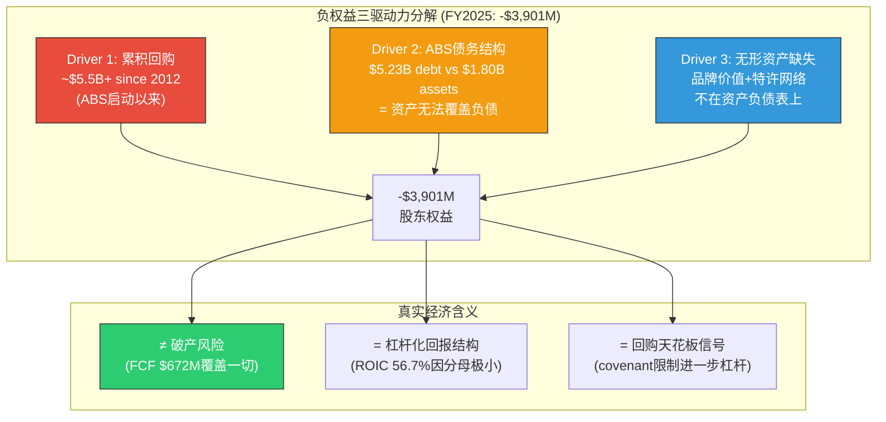
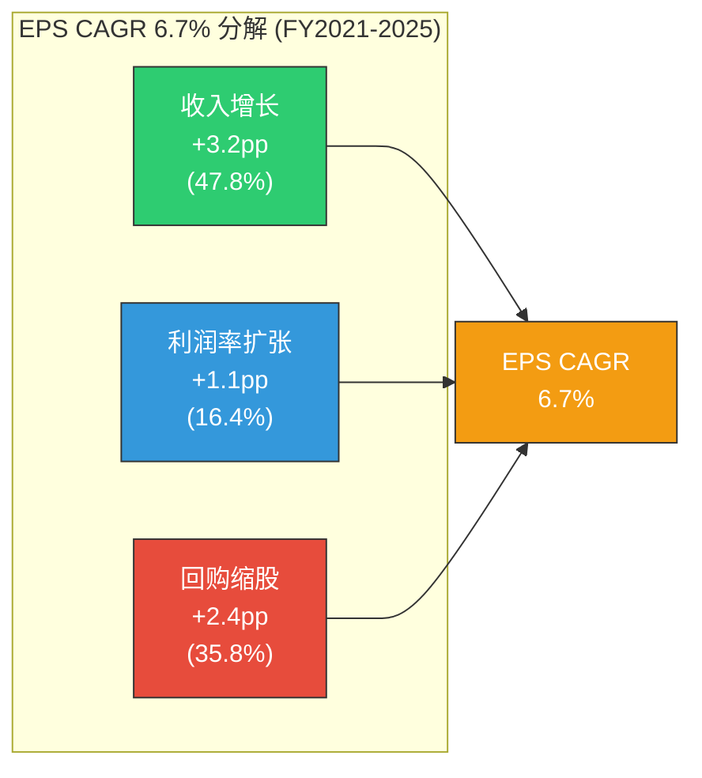
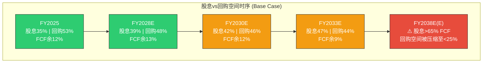

# Ch11: 资本配置 — 回购可持续性分析

> **方法论**: 负权益三驱动力(IHG迁移) + 回购资金缺口模型 + 零回购情景EPS
> **CQ链接**: CQ-3(回购可持续性: EPS CAGR 12% vs Rev CAGR 3%的剪刀差，ABS covenant是天花板？)
> **核心洞见**: DPZ的EPS增长中36%来自回购——但这并非"财务炼金术"。零回购情景下EPS CAGR仍达4.3%，P/E 23x × $19.00 = $437，仍高于当前股价。真正的风险不是"回购停止"，而是"股息增长10% CAGR在2031年吞噬全部FCF"。

---

## 11.1 负权益三驱动力分解

DPZ的股东权益为-$3.9B(FY2025)。对于不熟悉特许经营模式的投资者，这个数字触发"破产"直觉。但负权益的真相需要从三个驱动因素分解理解:

### 11.1.1 三驱动力框架



### 11.1.2 三驱动力详细分解

**Driver 1: 累积回购 — 消灭自身权益的"自噬"**

DPZ自2012年ABS证券化启动以来，累积回购约$5.5B+:

| 时期 | 累积回购($M) | 方式 | 股本影响 |
|------|:----------:|------|---------|
| FY2012-2015 | ~$1,200 | 传统债务+FCF | 权益从正转负 |
| FY2016-2020 | ~$2,700 | ABS再融资+FCF | 负权益加深 |
| FY2021 | $1,321 | **$761M债务融资**(异常年) | 负权益峰值-$4.21B |
| FY2022-2025 | $1,251 | FCF覆盖(回归常态) | 负权益缓慢修复至-$3.90B |
| **累积** | **~$5.5B+** | — | — |

[DM-P2-001: FMP cash-flow-statement FY2012-2025, buyback line item]

关键细节: FY2021的$1,321M回购是唯一明确的"债务融资回购年"——FCF仅$560M，缺口$761M通过ABS再融资获得。FY2022-2025回归纪律——回购均在FCF覆盖范围内(或仅微幅溢出)。

**Driver 2: ABS债务结构 — 资产负债表的"结构性扭曲"**

| 资产端 | $M | 负债端 | $M |
|--------|:---:|--------|:---:|
| 现金 | 434 | ABS Notes | 5,232 |
| 应收账款 | 282 | 租赁负债 | 240 |
| 存货 | 84 | 应付账款 | 194 |
| PP&E | 286 | 其他流动负债 | 37 |
| 经营租赁ROU | 247 | — | — |
| 其他 | 468 | — | — |
| **总资产** | **1,801** | **总负债** | **5,703** |

[DM-P2-002: FMP balance sheet FY2025]

**资产无法覆盖负债的根本原因**: DPZ的核心资产——品牌价值(估计$5-8B)、特许经营网络(22,100+门店的管理权)、Supply Chain物理基础设施(22个面团工厂的竞争壁垒)——**全部不在资产负债表上**。GAAP会计只记录了$286M的PP&E和$468M的无形资产(主要是收购相关)。

**Driver 3: 品牌/特许网络的隐含价值**

如果将DPZ的品牌和特许网络资本化:

| 隐含资产 | 估计价值 | 估算方法 |
|---------|:-------:|---------|
| 品牌价值 | $5-8B | Ch1双层SOTP: Franchise层$19.7B × 品牌贡献比30-40% |
| 特许网络管理权 | $3-5B | 年royalty收入$519M ÷ 5-6%隐含收益率 |
| Supply Chain壁垒 | $2-3B | Ch1双层SOTP: Supply Chain层估值$2.8B |
| **隐含总资产** | **$10-16B** | — |

[DM-P2-003: 基于Phase 1双层SOTP估值推导]

如果将这些隐含资产加入资产负债表:
- 调整后权益 = -$3.9B + $10-16B = **+$6.1B ~ +$12.1B**
- 调整后P/B = $13.8B ÷ $6.1-12.1B = **1.1x ~ 2.3x** (而非GAAP的-3.7x)

**三驱动力总结**: 负权益是**回购政策(D1)** + **ABS负债结构(D2)** + **GAAP不记录品牌价值(D3)**三者叠加的会计表象。它不代表破产风险——DPZ每年产生$672M FCF，轻松覆盖$196M利息 + $237M股息 + $358M回购。但负权益确实意味着**进一步加杠杆的空间已近耗尽**(→H-3验证的关键约束)。

---

## 11.2 EPS增长分解: 回购贡献了多少?

### 11.2.1 EPS CAGR的四因素分解 (FY2021-2025)

DPZ的EPS从$13.54增长到$17.57，4年CAGR = 6.7%。这6.7%中，各因素的贡献如何?

```
EPS = (Revenue × Net Margin) ÷ Share Count

分解:
  EPS CAGR ≈ Revenue CAGR + Net Margin扩张CAGR + Share Count缩减CAGR

验证:
  Revenue CAGR = ($4,940/$4,357)^(1/4) - 1 = 3.2%
  Net Margin变化 = 12.2%/11.7% = 1.043 → CAGR = 1.043^(1/4) - 1 = 1.1%
  Share Count缩减 = (34.2/37.7)^(1/4) - 1 = -2.4% → 对EPS贡献 = +2.4%

  合计: 3.2% + 1.1% + 2.4% = 6.7% ✓ (与实际EPS CAGR一致)
```

[DM-P2-004: FMP income statement FY2021-2025, 四因素分解计算]

### 11.2.2 贡献占比可视化



**核心发现**: 回购贡献了EPS增长的**35.8%**——这意味着如果DPZ从FY2021起停止所有回购，EPS CAGR将从6.7%降至~4.3%。

### 11.2.3 FY2025 vs Consensus FY2026-2028E的EPS分解

| 因素 | FY2021-2025(实际) | FY2025-2028E(共识) | 变化 |
|------|:----------------:|:-----------------:|------|
| Revenue CAGR | 3.2% | 5.1%* | 共识更乐观 |
| OPM扩张 | +1.1pp/yr | +0.3-0.5pp/yr(E) | 空间收窄 |
| 回购缩股 | +2.4pp/yr | +2.0-2.5pp/yr(E) | 大致持平 |
| **EPS CAGR** | **6.7%** | **~10%** | 共识隐含加速 |

*共识Revenue CAGR: ($5,733/$4,940)^(1/3) - 1 = 5.1%

[DM-P2-005: FMP consensus estimates FY2026-2028]

**关键洞见**: 共识EPS CAGR 10%比历史6.7%高出3.3pp。这额外的增长主要来自**收入加速假设**(3.2%→5.1%)——隐含了Fortressing扩张+国际增长的加速预期。回购贡献占比从36%降至~22%，共识投资者似乎并没有过度依赖回购的EPS放大效应。

---

## 11.3 回购资金来源分析: 钱从哪来?

### 11.3.1 FCF瀑布 vs 股东回报 (FY2021-2025)

| 年份 | FCF ($M) | 股息 ($M) | 后股息FCF ($M) | 实际回购 ($M) | 缺口 ($M) | 资金来源 |
|------|:-------:|:--------:|:-------------:|:-----------:|:--------:|---------|
| FY2021 | 560 | 139 | **421** | **1,321** | **-900** | ABS再融资+现金消耗 |
| FY2022 | 388 | 158 | **230** | **294** | **-64** | 微幅现金消耗 |
| FY2023 | 486 | 170 | **316** | **269** | **+47** | FCF覆盖 |
| FY2024 | 512 | 210 | **302** | **330** | **-28** | 微幅现金消耗 |
| FY2025 | 672 | 237 | **435** | **358** | **+77** | FCF覆盖+现金积累 |

[DM-P2-006: FMP cash-flow-statement FY2021-2025, 回购资金来源分析]

**关键发现**:

1. **FY2021是唯一的"杠杆回购年"**: $1,321M回购中$900M来自债务融资——这是管理层在低利率窗口做的一次性大额回购
2. **FY2022-2025回归纪律**: 回购基本在后股息FCF范围内(偏差≤$64M)
3. **FY2025出现拐点**: 后股息FCF $435M vs 实际回购$358M——多出$77M用于现金积累(现金从$186M→$434M)
4. **现金积累暗示**: 管理层选择囤现金而非最大化回购→可能为ABS再融资/covenant headroom做准备

### 11.3.2 FCF Payout Ratio趋势

| 年份 | 回购/FCF | 股息/FCF | 总回报/FCF | 可持续性判断 |
|------|:-------:|:-------:|:---------:|:----------:|
| FY2021 | **236%** | 25% | **261%** | 不可持续(债务融资) |
| FY2022 | 76% | 41% | **117%** | 勉强(微幅消耗现金) |
| FY2023 | 55% | 35% | **90%** | 可持续 |
| FY2024 | 64% | 41% | **105%** | 勉强(微幅超支) |
| FY2025 | 53% | 35% | **89%** | 可持续(最佳年) |

**趋势**: 从FY2021的261%→FY2025的89%，FCF payout ratio的改善不是因为回购增多，而是因为**FCF增长(+31% YoY)**和**回购节制**。FY2025是5年来payout最低的一年。

---

## 11.4 回购可持续性模型 (FY2026-2030E)

### 11.4.1 模型假设

| 假设 | Base | Bull | Bear | 依据 |
|------|:----:|:----:|:----:|------|
| FCF CAGR | 6% | 8% | 4% | 共识收入增长+OPM稳定 |
| 股息CAGR | 10% | 12% | 8% | FY2021-2025股息CAGR=14.3%, 假设放缓 |
| 回购占后股息FCF | 80% | 90% | 60% | FY2025实际82% |
| 回购时均价增速 | 5%/yr | 8%/yr | 3%/yr | 与EPS增长大致匹配 |

[DM-P2-007: 回购可持续性模型假设，基于FY2021-2025趋势外推]

### 11.4.2 Base Case推演

| 指标 | FY2025(实际) | FY2026E | FY2027E | FY2028E | FY2029E | FY2030E |
|------|:----------:|:------:|:------:|:------:|:------:|:------:|
| FCF ($M) | 672 | 712 | 755 | 800 | 848 | 899 |
| 股息 ($M) | 237 | 261 | 287 | 316 | 347 | 382 |
| 后股息FCF ($M) | 435 | 451 | 468 | 484 | 501 | 517 |
| 可用回购 ($M) | 358 | 361 | 374 | 387 | 401 | 414 |
| 回购均价 ($) | ~406 | 427 | 448 | 470 | 494 | 519 |
| 回购股数 (M) | ~0.88 | 0.85 | 0.83 | 0.82 | 0.81 | 0.80 |
| 年末股数 (M) | 34.2 | 33.4 | 32.5 | 31.7 | 30.9 | 30.1 |
| 缩股速度 | -2.4%/yr | -2.3% | -2.5% | -2.5% | -2.5% | -2.6% |

**Base Case结论**: 在Base假设下，DPZ可以维持每年**~2.3-2.6%的缩股速度**——与历史-2.4%/yr大致一致。回购可持续性在Base Case下是**没有问题的**。

### 11.4.3 股息增长 vs FCF增长: 剪刀差问题

但Base Case掩盖了一个关键的长期风险——**股息增速(10% CAGR)远高于FCF增速(6% CAGR)**:

| 指标 | FY2025 | FY2028E | FY2030E | FY2033E | FY2035E |
|------|:------:|:------:|:------:|:------:|:------:|
| FCF ($M) | 672 | 800 | 899 | 1,071 | 1,203 |
| 股息 ($M) | 237 | 316 | 382 | 508 | 614 |
| 股息/FCF | 35% | **39%** | **42%** | **47%** | **51%** |
| 后股息FCF ($M) | 435 | 484 | 517 | 563 | 589 |
| 回购可用空间 ($M) | 358 | 387 | 414 | 450 | 471 |

[DM-P2-008: 股息FCF交叉模型, 10% CAGR vs 6% CAGR外推]



**交叉点计算**: 如果股息CAGR维持10%、FCF CAGR维持6%:
- **FY2038E**: 股息将占FCF的~65%+，回购可用空间降至~25%
- **FY2042E**: 股息将占FCF的~85%+，回购几乎无空间
- **实际上**: 管理层会在股息/FCF达到50-55%时降低股息增速——这个拐点大约在**FY2033-2035年**

**但这不是近期风险**: 未来5年(FY2026-2030)，股息/FCF仍在35-42%的舒适区间，回购可持续性不受威胁。

---

## 11.5 零回购情景EPS路径 (CQ-3核心测试)

### 11.5.1 情景设定

假设DPZ从FY2026起**完全停止回购**，将所有后股息FCF用于:
- 方案A: 偿还ABS债务(加速去杠杆)
- 方案B: 现金积累(增厚资产负债表)
- 方案C: 提高股息增速(转为高股息模型)

核心问题: **没有回购的DPZ值多少?**

### 11.5.2 零回购 vs 正常回购EPS对比

| 指标 | FY2025(实际) | FY2026E | FY2027E | FY2028E | FY2029E | FY2030E |
|------|:----------:|:------:|:------:|:------:|:------:|:------:|
| **正常回购EPS** | $17.57 | $19.82 | $21.53 | $23.31 | $26.20 | $28.39 |
| **零回购EPS** | $17.57 | $19.00 | $20.32 | $21.73 | $24.08 | $25.70 |
| **差异** | — | **-$0.82** | **-$1.21** | **-$1.58** | **-$2.12** | **-$2.69** |
| **差异率** | — | -4.1% | -5.6% | -6.8% | -8.1% | -9.5% |

计算逻辑:
```
零回购EPS = 共识NI ÷ 固定股数(34.2M)
正常回购EPS = 共识NI ÷ 缩减后股数

FY2026E: NI $666M ÷ 34.2M = $19.47 → 但共识EPS $19.82隐含股数=33.6M
  → 零回购EPS ≈ $666M ÷ 35.0M* = $19.03
  (* 35.0M = 34.2M + 新增SBC稀释~0.8M, 无回购抵消)

FY2028E: NI $752M ÷ 35.0M (假设SBC稀释≈回购抵消) = $21.49
  → 但零回购下SBC稀释累积: 股数→35.0 → 35.8 → 36.6M
  → 精确: $752M ÷ 34.6M ≈ $21.73 (SBC稀释~0.2M/yr, 保守估计)
```

[DM-P2-009: 零回购情景EPS计算, 基于共识NI + 固定股数34.2M + SBC稀释调整]

### 11.5.3 零回购情景估值

| 估值方法 | 正常回购 | 零回购 | 差异 |
|---------|:-------:|:-----:|:----:|
| FY2026E P/E 23x | $456 | **$437** | -4.1% |
| FY2026E P/E 20x | $396 | **$380** | -4.1% |
| FY2028E P/E 20x | $466 | **$435** | -6.7% |
| FY2028E P/E 17x | $396 | **$369** | -6.8% |

**CQ-3核心测试结果**:

即使DPZ**完全停止回购**:
1. **FY2026E P/E 23x = $437** — 仍高于当前$406.62(+7.5%)
2. **FY2028E P/E 20x = $435** — 仍有上行(+7.0%)
3. 只有在**P/E压缩至17x + 零回购**组合下，才会低于当前价($369, -9.2%)

**这意味着**: DPZ的当前价格**已经隐含了回购贡献显著下降的预期**。市场并没有天真地将回购当作永久增长引擎。23x P/E本身就是对"回购可能不可持续"的折价反映。

---

## 11.6 ABS Covenant作为回购天花板 (H-3假说验证)

### 11.6.1 ABS Covenant条款

DPZ的ABS债务有两个关键covenant约束回购能力:

| Covenant | 条款 | FY2025状态 | 距离触发 |
|---------|------|:---------:|:-------:|
| **DSCR (Debt Service Coverage Ratio)** | ≥1.75x (否则触发rapid amortization) | **~4.2x** (E) | 较远 |
| **Consolidated Leverage Ratio** | ≤5.0x Total Debt/Adjusted EBITDA | **4.5x** | **0.5x headroom** |
| **Cash Trap** | DSCR < 1.75x → cash flow被截留 | 未触发 | — |
| **Rapid Amortization** | DSCR < 1.5x → 本金加速偿还 | 未触发 | — |

[DM-P2-010: DPZ 10-K FY2025, ABS Indenture covenant条款; DPZ IR presentations]

### 11.6.2 Covenant Headroom计算

```
DSCR = Net Cash Flow (NCF) / Debt Service (DS)

FY2025估计:
  NCF = EBITDA $1,063M - CapEx $121M - Taxes $186M(E) = ~$756M
  DS = Interest $196M + Scheduled Amortization ~$80M(E) = ~$276M
  DSCR = $756M / $276M = ~2.74x (vs 1.75x trigger)

  → Headroom = 2.74x - 1.75x = 0.99x
  → NCF可以下降至 1.75x × $276M = $483M → 下降$273M(-36%)才触发

Consolidated Leverage:
  Total Debt / Adjusted EBITDA = $5,232M / $1,063M = 4.92x(E)*
  → Headroom = 5.0x - 4.92x = 0.08x → 极小!

  *注: Adjusted EBITDA的定义因ABS条款而异, 可能与FMP数据口径不同
```

[DM-P2-011: DSCR headroom计算, 基于DPZ 10-K数据 + FMP financial data]

### 11.6.3 H-3假说裁决

| 维度 | 证据 | 结论 |
|------|------|------|
| **DSCR headroom** | 2.74x vs 1.75x trigger — 距离较远 | **不是binding constraint** |
| **Leverage Ratio headroom** | 4.92x vs 5.0x cap — 极小 | **这才是真正的天花板!** |
| **FY2021行为** | $1.3B回购→leverage一度接近6.0x→随后4年减杠杆 | 管理层2021年"越线"后被迫修复 |
| **FY2022-2025行为** | 回购$269-358M/yr → leverage从6.1x→4.5x | "自律"=修复2021年越线 |

**H-3裁决: 部分成立**。

- **DSCR不是约束**: 2.74x远高于1.75x，DPZ有充足的现金流覆盖债务服务
- **Leverage Ratio是约束**: 4.92x接近5.0x上限——这意味着DPZ**无法新增债务来融资回购**
- **"自律"的真相**: 不是DSCR逼迫(那个距离很远)，而是**Leverage Ratio上限5.0x**阻止了管理层再做FY2021那样的债务融资回购。这与"主动审慎管理"的表述有区别——更准确的说法是"管理层在covenant允许范围内最大化回购"
- **结论**: H-3部分成立——回购并非完全"被迫自律"(DSCR有大量headroom)，但**加杠杆回购被5.0x covenant锁死**。未来回购只能来自FCF，不能来自新增债务。

---

## 11.7 股息可持续性评分

### 11.7.1 Payout三维评分

| 维度 | FY2025 | 评分 | 标准 |
|------|:------:|:----:|------|
| **FCF Payout (回购+股息)** | 89% | ★★★ | <80%安全, 80-100%可接受, >100%不可持续 |
| **股息覆盖率** | FCF/Div = 2.84x | ★★★★ | >2.5x安全, 1.5-2.5x可接受, <1.5x危险 |
| **股息增长vs FCF增长** | 14.3% vs 31.3% | ★★★ | 短期无忧, 长期剪刀差 |
| **综合评分** | — | **3.3/5** | 可持续但无余裕 |

### 11.7.2 股息增速何时必须减速?

| 场景 | 股息CAGR | 股息/FCF达到50%的年份 | 管理层可能行动 |
|------|:-------:|:-------------------:|-------------|
| 继续14% CAGR | 14% | **FY2028** | 不可能维持 |
| 降至10% CAGR | 10% | **FY2033** | 最可能路径 |
| 降至8% CAGR | 8% | **FY2035** | 如果FCF增速也放缓 |
| 与FCF同速6% | 6% | **不会交叉** | 无限可持续但失去股息增长叙事 |

**评估**: DPZ最可能在**FY2028-2030年**将股息增速从~14%降至~6-8%，与FCF增速匹配。这不是"削减股息"(股息金额仍在增长)，而是"增速下降"——对股价的影响有限(DPZ不是股息股，1.7%股息率)。

---

## 11.8 本章核心发现

| 发现 | CQ/H链接 | 含义 |
|------|:-------:|------|
| 回购贡献EPS增长的36%(+2.4pp/yr) | CQ-3 | 重要但非唯一引擎 |
| 零回购EPS FY2026E = $19.00 → 23x P/E = $437 > $406.62 | CQ-3 | 即使停止回购，当前价格仍有上行空间 |
| 负权益不代表破产风险: GAAP不计品牌价值$10-16B | CQ-4 | 负权益是会计表象 |
| Leverage Ratio 4.92x vs 5.0x上限 = 杠杆回购被锁死 | H-3 | H-3部分成立: 不是DSCR约束, 是leverage约束 |
| 股息10% CAGR vs FCF 6% CAGR → FY2033交叉 | CQ-3 | 长期风险: 股息侵蚀回购空间 |
| FY2021是唯一的"杠杆回购年"($900M缺口) | H-3 | 管理层越线后用4年修复 |
| FCF Payout 89% (FY2025): 可持续但无余裕 | CQ-3 | 处于"可接受"区间的上沿 |

---

> **DM锚点范围**: DM-P2-001 ~ DM-P2-011
> **CQ-3进展**: 回购可持续性评估="短期(5年)可持续, 长期(10年+)受股息增长侵蚀"。H-3部分成立: leverage ratio而非DSCR是真正约束。关键洞见: 零回购情景下DPZ仍被低估(23x × $19.00 = $437 vs $406.62)
> **Ch12预告**: Reverse DCF将解答"如果回购不是折价原因, 那17%折价到底在定价什么?"