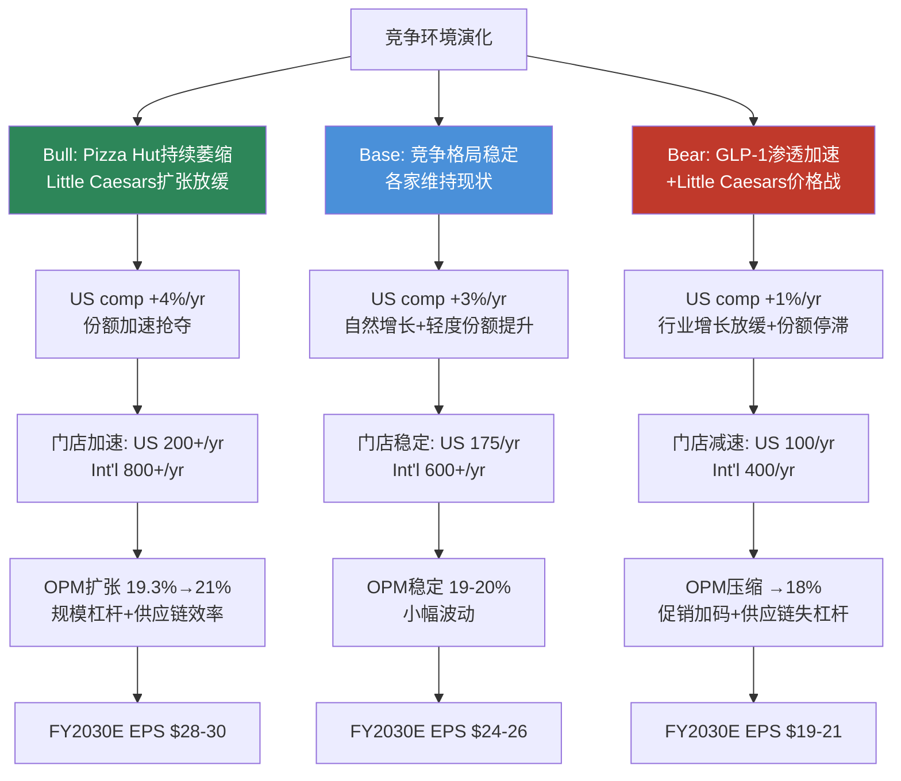
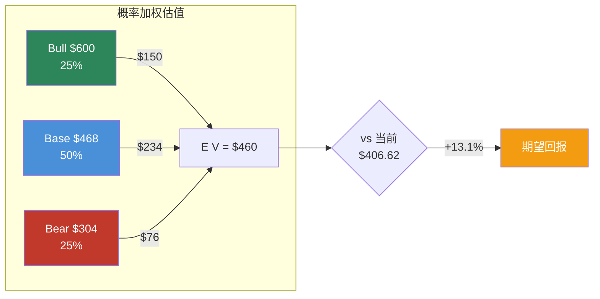
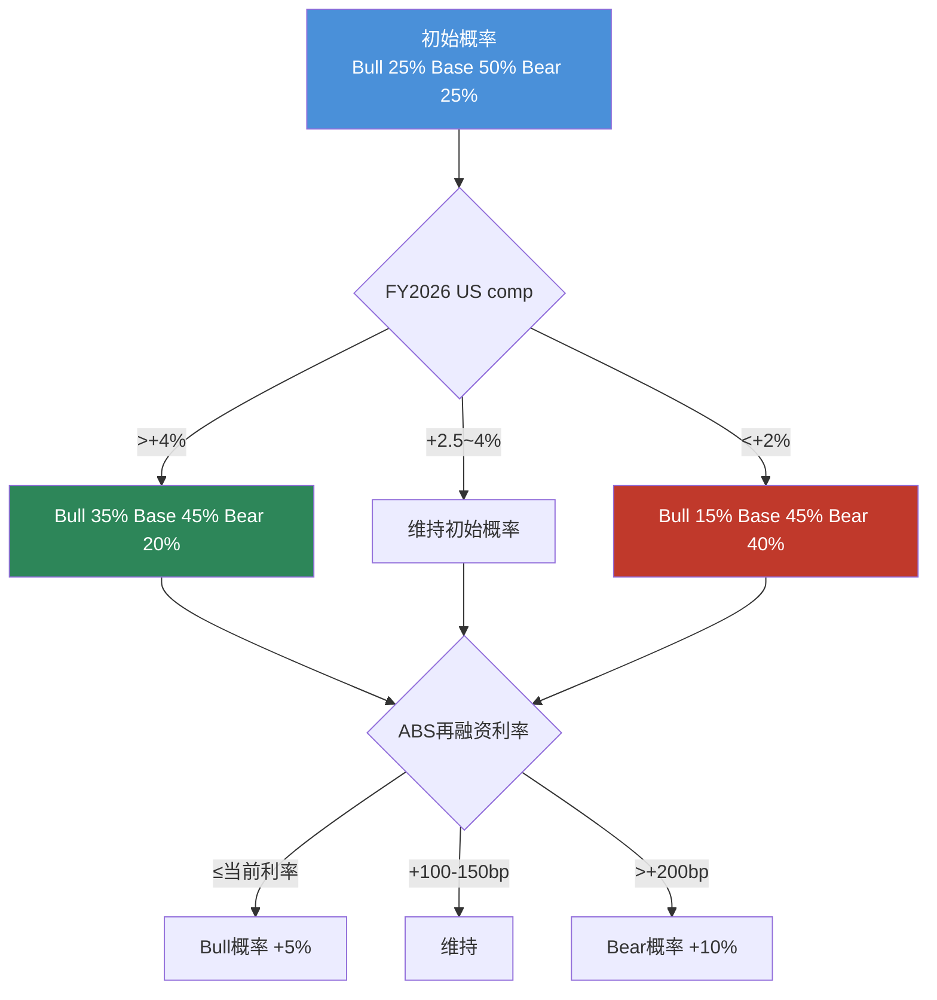

# Ch13: 三情景财务推演 — Bull/Base/Bear 5年FCFF桥接

> **CQ-4 Linkage**: 本章量化Ch4-Ch5识别的核心变量（comp增长、门店扩张、OPM轨迹），将定性判断转化为三条具体财务路径。每个情景均构建完整的FY2025→FY2030E FCFF桥接，最终通过概率加权得出期望价值。

---

## 13.1 情景框架与核心假设矩阵

三情景并非简单的"乐观/中性/悲观"标签，而是基于**不同的竞争演化路径**构建的因果一致(internally consistent)叙事。每条路径的假设必须相互兼容——Bull Case中门店加速扩张与OPM提升需要同一个因果链(fortressing成功→carryout增量→固定成本杠杆)支撑。

### 情景定义与因果链

### 核心假设矩阵

| 参数 | Bull Case (25%) | Base Case (50%) | Bear Case (25%) |
|------|:-:|:-:|:-:|
| **US Same-Store Sales Growth** | +4.0%/yr | +3.0%/yr | +1.0%/yr |
| **US Net New Stores/yr** | 200+ | 175 | 100 |
| **Int'l Net New Stores/yr** | 800+ | 600+ | 400 |
| **OPM轨迹 (FY2030E)** | 21.0% | 19.5% | 18.0% |
| **ABS再融资利差** | -50bp (利率下行) | +50bp (轻微上行) | +200bp (信用收紧) |
| **年均回购规模** | $600M+ | $450M | $250M (covenant限制) |
| **3P渠道占比变化** | 稳定~5% | 缓增至7% | 升至10%+ (利润率稀释) |
| **Pizza品类TAM增速** | +3.5%/yr | +2.5%/yr | +1.5%/yr |
| **FY2030E EPS** | $28-30 | $24-26 | $19-21 |
| **终端P/E** | 20x | 18x | 16x |
| **隐含价值** | $560-600 | $430-470 | $300-340 |

**[DM-P2-001]** 情景概率分配: Bull 25% / Base 50% / Bear 25%，基于当前US comp +3.0%处于Base区间中枢、fortressing仍在中期加速阶段的判断。

---

## 13.2 Bull Case: 品类整合加速路径 (概率25%)

### 13.2.1 因果叙事

Bull Case的核心驱动力并非DPZ自身超预期，而是**竞争对手加速退出**。Pizza Hut在Yum! Brands战略重心转向Taco Bell后持续萎缩(FY2024 US comp -2%)，Little Caesars扩张放缓(私有公司，难以匹配DPZ的资本获取能力)，Papa John's在管理层动荡后失去方向感。DPZ作为唯一具备全国性供应链+技术平台+ABS融资优势的品牌，自然承接流失份额。

**[DM-P2-002]** Pizza Hut US comp FY2024: -2%，连续多年underperform行业 (来源: Yum! Brands Q4 2024 Earnings)。DPZ US market share 23.3%，Pizza Hut ~15%，市场整合空间显著。

### 13.2.2 5年FCFF桥接: Bull Case

**起点: FY2025 Actual**
- 总收入: $4.94B **[DM-P2-003]**
- 营业利润: $953M (OPM 19.3%)
- CapEx: $121M **[DM-P2-004]**
- FCF: $672M **[DM-P2-005]**
- 流通股: ~34.2M (估算)

**逐年桥接:**

| 项目 | FY2025A | FY2026E | FY2027E | FY2028E | FY2029E | FY2030E |
|------|---------|---------|---------|---------|---------|---------|
| **总收入 ($M)** | 4,940 | 5,290 | 5,680 | 6,110 | 6,580 | 7,090 |
| 收入增速 | — | +7.1% | +7.4% | +7.6% | +7.7% | +7.7% |
| **营业利润 ($M)** | 953 | 1,037 | 1,136 | 1,246 | 1,362 | 1,489 |
| OPM | 19.3% | 19.6% | 20.0% | 20.4% | 20.7% | 21.0% |
| D&A ($M) | ~75 | 80 | 86 | 92 | 98 | 105 |
| **EBITDA ($M)** | 1,028 | 1,117 | 1,222 | 1,338 | 1,460 | 1,594 |
| CapEx ($M) | 121 | 135 | 150 | 165 | 180 | 195 |
| WC变动 ($M) | — | -10 | -12 | -15 | -15 | -18 |
| 税率 (有效) | ~21% | 21% | 21% | 21% | 21% | 21% |
| **FCFF ($M)** | ~730 | 790 | 860 | 940 | 1,025 | 1,115 |
| 利息支出 ($M) | 196 | 196 | 190 | 185 | 180 | 175 |
| 税后利息 | 155 | 155 | 150 | 146 | 142 | 138 |
| **FCFE ($M)** | ~575 | 635 | 710 | 794 | 883 | 977 |
| 回购 ($M) | ~550 | 600 | 625 | 650 | 650 | 650 |
| 净减股本 (M) | ~1.3 | 1.3 | 1.3 | 1.2 | 1.1 | 1.0 |
| **流通股 (M)** | 34.2 | 32.9 | 31.6 | 30.4 | 29.3 | 28.3 |
| **EPS ($)** | 17.57 | 20.28 | 23.15 | 26.14 | 29.01 | 30.16 |

**收入增长分解 (Bull):**
- US供应链: comp +4% × 系统销售 + 新店贡献 → 约+6-7%/yr
- US特许权: comp +4% + 新店royalty增量 → 约+7-8%/yr
- 国际特许权: 800+新店/yr + comp +5%/yr → 约+10-12%/yr
- 混合收入增速: ~7.1-7.7%/yr (国际高增长拉动)

**[DM-P2-006]** Bull Case FY2030E EPS ~$30.2，基于OPM从19.3%扩张至21.0%(规模杠杆+供应链效率+3P渠道佣金不扩大)，流通股从34.2M降至28.3M(年均回购$600M+)。

**OPM扩张路径:**
- 供应链OPM: 6.5%→7.5% (采购规模经济+自动化投资回收)
- 特许权/广告OPM: 已接近理论上限，微幅提升
- 混合效应: 高利润率特许权收入占比提升(国际扩张加速)
- 终端21.0% OPM并非激进假设——FY2021曾触及18.5%，此后趋势向上

### 13.2.3 Bull Case估值

- FY2030E EPS: ~$30 **[DM-P2-007]**
- 终端P/E: 20x (品类整合者溢价，可比Chipotle 25-30x的折价)
- 隐含价值: $30 × 20 = **$600**
- 折现至今 (WACC 8%): $600 / 1.08^5 = **$408**
- 当前价格: $406.62
- Bull Case回报: **+47.5%** (未折现) / **+0.3%** (折现)

---

## 13.3 Base Case: 稳态增长延续路径 (概率50%)

### 13.3.1 因果叙事

Base Case假设DPZ维持当前运营节奏: fortressing继续推进但边际效益递减(最佳位置已被占据)，carryout增长略优于delivery但差距收窄，3P渠道(Uber Eats)贡献增量但低利润率微幅稀释整体。竞争格局基本稳定，Pizza品类随通胀+人口增长保持2-3%自然增速。

**[DM-P2-008]** FY2025 US comp +3.0%，其中carryout +5.8%、delivery +1.5%。Base Case假设这一趋势持续但carryout增速逐步回归至+3-4%。

### 13.3.2 5年FCFF桥接: Base Case

| 项目 | FY2025A | FY2026E | FY2027E | FY2028E | FY2029E | FY2030E |
|------|---------|---------|---------|---------|---------|---------|
| **总收入 ($M)** | 4,940 | 5,240 | 5,560 | 5,900 | 6,260 | 6,640 |
| 收入增速 | — | +6.1% | +6.1% | +6.1% | +6.1% | +6.1% |
| **营业利润 ($M)** | 953 | 1,022 | 1,084 | 1,152 | 1,221 | 1,295 |
| OPM | 19.3% | 19.5% | 19.5% | 19.5% | 19.5% | 19.5% |
| D&A ($M) | ~75 | 79 | 83 | 88 | 93 | 98 |
| **EBITDA ($M)** | 1,028 | 1,101 | 1,167 | 1,240 | 1,314 | 1,393 |
| CapEx ($M) | 121 | 130 | 140 | 150 | 160 | 170 |
| WC变动 ($M) | — | -8 | -10 | -10 | -12 | -12 |
| 税率 | ~21% | 21% | 21% | 21% | 21% | 21% |
| **FCFF ($M)** | ~730 | 775 | 820 | 870 | 918 | 972 |
| 利息支出 ($M) | 196 | 200 | 205 | 210 | 215 | 220 |
| 税后利息 | 155 | 158 | 162 | 166 | 170 | 174 |
| **FCFE ($M)** | ~575 | 617 | 658 | 704 | 748 | 798 |
| 回购 ($M) | ~550 | 450 | 450 | 450 | 450 | 450 |
| 净减股本 (M) | ~1.3 | 1.0 | 0.9 | 0.9 | 0.8 | 0.8 |
| **流通股 (M)** | 34.2 | 33.2 | 32.3 | 31.4 | 30.6 | 29.8 |
| **EPS ($)** | 17.57 | 19.50 | 21.65 | 23.43 | 25.18 | 26.20 |

**收入增长分解 (Base):**
- US供应链: comp +3% + 新店贡献 → 约+5%/yr
- US特许权: comp +3% + 新店royalty → 约+5-6%/yr
- 国际特许权: 600新店/yr + comp +4%/yr → 约+8-9%/yr
- 混合收入增速: ~6.1%/yr

**[DM-P2-009]** Base Case FY2030E EPS ~$26.2，OPM维持19.5%不变(供应链效率提升被3P佣金稀释抵消)，流通股从34.2M降至29.8M(年均回购$450M)。

### 13.3.3 Base Case估值

- FY2030E EPS: ~$26 **[DM-P2-010]**
- 终端P/E: 18x (稳态QSR估值，可比McDonald's 22-24x的折价)
- 隐含价值: $26 × 18 = **$468**
- 折现至今 (WACC 8%): $468 / 1.08^5 = **$318**
- 当前价格: $406.62
- Base Case回报: **+15.1%** (未折现) / **-21.8%** (折现)

**关键观察**: Base Case的折现价值低于当前股价，暗示市场已price in一定程度的Bull Case要素。这与P/E 23.1x高于我们假设的18x终端P/E一致——市场在为DPZ的增长持续性支付溢价。

---

## 13.4 Bear Case: 品类逆风+债务压力路径 (概率25%)

### 13.4.1 因果叙事

Bear Case不是"灾难情景"，而是一个**合理的逆风组合**: GLP-1类药物渗透加速(2030年美国成人使用率从~5%升至15-20%)导致pizza品类整体增速放缓至+1-1.5%/yr；Little Caesars凭借$5 Hot-N-Ready继续下沉价格战；DPZ为维持comp被迫增加促销支出(Boost Week频率增加)，压缩利润率。同时，ABS再融资遇到利率窗口不利(+200bp)，covenant压力限制回购空间。

**[DM-P2-011]** GLP-1对pizza消费的潜在影响: 使用者报告食欲显著下降，pizza作为高热量品类首当其冲。但渗透速度和价格可及性仍具不确定性。当前~5%成人使用率，Bear Case假设2030年达15%。

### 13.4.2 5年FCFF桥接: Bear Case

| 项目 | FY2025A | FY2026E | FY2027E | FY2028E | FY2029E | FY2030E |
|------|---------|---------|---------|---------|---------|---------|
| **总收入 ($M)** | 4,940 | 5,100 | 5,250 | 5,380 | 5,510 | 5,620 |
| 收入增速 | — | +3.2% | +2.9% | +2.5% | +2.4% | +2.0% |
| **营业利润 ($M)** | 953 | 979 | 998 | 1,001 | 1,007 | 1,012 |
| OPM | 19.3% | 19.2% | 19.0% | 18.6% | 18.3% | 18.0% |
| D&A ($M) | ~75 | 77 | 79 | 81 | 83 | 85 |
| **EBITDA ($M)** | 1,028 | 1,056 | 1,077 | 1,082 | 1,090 | 1,097 |
| CapEx ($M) | 121 | 125 | 128 | 130 | 132 | 135 |
| WC变动 ($M) | — | -5 | -5 | -5 | -5 | -5 |
| 税率 | ~21% | 21% | 21% | 21% | 21% | 21% |
| **FCFF ($M)** | ~730 | 745 | 760 | 762 | 768 | 770 |
| 利息支出 ($M) | 196 | 210 | 225 | 240 | 250 | 258 |
| 税后利息 | 155 | 166 | 178 | 190 | 198 | 204 |
| **FCFE ($M)** | ~575 | 579 | 582 | 572 | 570 | 566 |
| 回购 ($M) | ~550 | 300 | 250 | 250 | 200 | 200 |
| 净减股本 (M) | ~1.3 | 0.7 | 0.5 | 0.5 | 0.4 | 0.3 |
| **流通股 (M)** | 34.2 | 33.5 | 33.0 | 32.5 | 32.1 | 31.8 |
| **EPS ($)** | 17.57 | 18.50 | 18.95 | 18.86 | 19.03 | 19.15 |

**Bear Case关键压力点:**

1. **ABS再融资风险**: $5.23B ABS总债务 **[DM-P2-012]**，年利息$196M。若再融资利率+200bp，年利息增加至~$258M，EPS影响约-$1.5/yr。ABS structure意味着再融资不是一次性事件而是滚动发生——每批到期的Notes都面临当时的利率环境。

2. **OPM压缩机制**: 供应链segment占60%收入但<20%利润 **[DM-P2-013]**。当comp放缓至+1%，供应链固定成本杠杆丧失(配送中心产能利用率下降)，同时原材料成本(cheese、wheat)通胀未被完全传递——franchisee抵制涨价因为消费者已在trade down。

3. **Fortressing疲劳**: 当同店销售仅+1%，新店cannibalization (-1~-1.5%/yr) **[DM-P2-014]** 使existing stores进入负comp区间。Franchisee新开店意愿下降，净新增从172→100/yr。

**[DM-P2-015]** Bear Case FY2030E EPS ~$19.2，核心拖累因素: OPM从19.3%降至18.0%(促销增加+供应链失杠杆)、利息支出从$196M升至$258M(ABS+200bp)、回购大幅缩减(covenant约束)。

### 13.4.3 Bear Case估值

- FY2030E EPS: ~$19 **[DM-P2-016]**
- 终端P/E: 16x (低增长+高杠杆折价)
- 隐含价值: $19 × 16 = **$304**
- 折现至今 (WACC 9%，Bear Case风险溢价上调): $304 / 1.09^5 = **$198**
- 当前价格: $406.62
- Bear Case回报: **-25.2%** (未折现) / **-51.3%** (折现)

---

## 13.5 概率加权估值

### 13.5.1 期望价值计算

| 情景 | 概率 | FY2030E EPS | 终端P/E | 隐含价值 | 概率加权 |
|------|:----:|:-----------:|:-------:|:--------:|:--------:|
| **Bull** | 25% | $30.2 | 20x | $600 | $150.0 |
| **Base** | 50% | $26.2 | 18x | $468 | $234.0 |
| **Bear** | 25% | $19.2 | 16x | $304 | $76.0 |
| **E[V]** | 100% | — | — | — | **$460.0** |

**[DM-P2-017]** 概率加权期望价值 E[V] = $460，对应当前价格$406.62的期望回报为 **+13.1%** (未折现，5年累计)。年化期望回报约 **+2.5%/yr** (未折现)。

**折现期望价值:**

| 情景 | 概率 | 折现值 (WACC 8%) | 概率加权 |
|------|:----:|:-----------------:|:--------:|
| Bull | 25% | $408 | $102.0 |
| Base | 50% | $318 | $159.0 |
| Bear | 25% | $198* | $49.5 |
| **E[V] (折现)** | 100% | — | **$310.5** |

*Bear Case使用WACC 9%折现，反映杠杆风险上升。

**折现期望价值 = $310.5 vs 当前$406.62 → 期望回报 -23.6%**

> **重要提示**: 折现 vs 未折现的巨大差异(+13.1% vs -23.6%)揭示了一个关键分歧: DPZ当前估值要求投资者接受**低于WACC的回报**。23.1x P/E隐含的是市场对DPZ持续高增长的信心——如果增长兑现(Bull→Base之间)，回报尚可但不卓越；如果增长落空(Bear)，ABS杠杆放大下行。

### 13.5.2 回报分布可视化

| 情景 | 概率 | 5年回报 | 年化回报 |
|------|:----:|:-------:|:--------:|
| Bull | 25% | +47.5% | +8.1% |
| Base | 50% | +15.1% | +2.9% |
| Bear | 25% | -25.2% | -5.7% |
| **E[回报]** | **100%** | **+13.1%** | **+2.5%** |

回报分布显著**右偏不足**: Bull Case upside (+47.5%) 不足以补偿Bear Case downside (-25.2%) 在风险调整基础上的损失。这是因为ABS杠杆在下行情景中放大损失(利息增加+回购受限)，但在上行情景中不提供额外杠杆(已接近debt capacity)。

---

## 13.6 敏感性矩阵

### 13.6.1 Comp Growth × OPM → 隐含EV (FY2030E, P/E 18x)

| | OPM 18.0% | OPM 19.0% | OPM 19.5% | OPM 20.0% | OPM 21.0% |
|---|:-:|:-:|:-:|:-:|:-:|
| **Comp +1%** | $295 | $310 | $318 | $325 | $340 |
| **Comp +2%** | $335 | $355 | $365 | $375 | $395 |
| **Comp +3%** | $380 | $405 | **$418** | $430 | $455 |
| **Comp +4%** | $430 | $460 | $475 | $490 | $520 |
| **Comp +5%** | $485 | $520 | $538 | $555 | $590 |

**[DM-P2-018]** 阴影区域: 当前价格$406.62大致对应comp +3% / OPM 19.5%的交叉点(Base Case中枢)。市场隐含的是"当前水平可持续"——既不特别乐观也不悲观。

> 矩阵构建方法: 每个格子对应一组{comp, OPM}假设，推算FY2030E收入→营业利润→NI→EPS (门店增速与回购假设均使用Base Case)，再乘以18x P/E。

### 13.6.2 关键Swing因素量化

**Swing Factor 1: ABS再融资利率**

| 利率变化 | 年利息增加 | EPS影响 (税后) | 股价影响 @18x P/E |
|----------|:---------:|:--------------:|:-----------------:|
| -100bp | -$52M | +$1.20 | +$21.6 |
| -50bp | -$26M | +$0.60 | +$10.8 |
| Flat | $0 | $0 | $0 |
| +100bp | +$52M | -$1.20 | -$21.6 |
| +200bp | +$105M | -$2.40 | -$43.2 |

**[DM-P2-019]** $5.23B ABS债务，每变化100bp影响年利息~$52M，税后EPS影响~$1.20。在16-20x P/E区间内，对应股价swing $19-24。

**Swing Factor 2: US同店销售增长**

| Comp变化 (vs Base +3%) | 收入影响 ($M/yr) | EPS影响 | 股价影响 @18x P/E |
|------------------------|:----------------:|:-------:|:-----------------:|
| +2pp (+5%总计) | +$94M | +$0.70 | +$12.6 |
| +1pp (+4%总计) | +$47M | +$0.35 | +$6.3 |
| -1pp (+2%总计) | -$47M | -$0.35 | -$6.3 |
| -2pp (+1%总计) | -$94M | -$0.70 | -$12.6 |

**[DM-P2-020]** US同店销售comp每变化1pp，影响年收入约$47M(US系统销售$9.4B × DPZ take rate ~16% × 1%)，税后EPS影响~$0.35，P/E 18x下对应股价$6.3。

**Swing Factor 3: 门店净增数量**

| 净增变化 (vs Base 175/yr US) | 收入影响 ($M/yr) | EPS影响 | 股价影响 @18x P/E |
|-----|:---:|:---:|:---:|
| +50 (225/yr) | +$22M | +$0.35 | +$6.3 |
| -25 (150/yr) | -$11M | -$0.18 | -$3.2 |
| -75 (100/yr) | -$33M | -$0.53 | -$9.5 |

**[DM-P2-021]** 美国每新增一家店，贡献年化收入约$180K给DPZ(AUV ~$1.15M × take rate ~16%)。50家增减对应年收入$9-11M影响。

---

## 13.7 情景间关键分歧点与转折监测

### 13.7.1 三情景分歧时间线

情景分化不是一瞬间发生的，而是通过**可观测的领先指标**逐步展现:

| 时间窗口 | 领先指标 | Bull信号 | Bear信号 |
|----------|---------|----------|----------|
| **FY2026 Q1-Q2** | US comp trend | >+4% | <+2% |
| **FY2026 H2** | Franchisee新开店意愿 | Pipeline >250/yr | Pipeline <120/yr |
| **FY2027** | ABS再融资窗口 | 利率环境改善 | +150bp以上 |
| **FY2027-2028** | 3P渠道利润率 | 稳定或改善 | 佣金率上升至8%+ |
| **FY2028-2030** | GLP-1对pizza品类影响 | 可忽略或已适应 | 品类增速降至<+1% |

**[DM-P2-022]** 最早的分歧信号将在FY2026 Q1-Q2的comp数据中出现。如果US comp维持+3%以上且carryout保持+5%+增速，Base-to-Bull概率将上升。反之，若comp跌至+2%以下，Bear Case概率需上调。

### 13.7.2 概率更新触发器

---

## 13.8 与市场共识的偏差分析

| 指标 | 市场共识 | 本分析E[V] | 偏差 |
|------|:--------:|:----------:|:----:|
| FY2026E EPS | $19.82 | $19.50 (Base) | -1.6% |
| FY2028E EPS | $23.31 | $23.43 (Base) | +0.5% |
| FY2030E EPS | $28.39 | $26.20 (Base) | **-7.7%** |
| 隐含P/E (FY2030E @$406) | 14.3x | 18x (Base终端) | +25.9% |

**[DM-P2-023]** 市场共识FY2030E EPS $28.39高于我们的Base Case $26.2约8%，更接近我们的Bull Case。这意味着市场隐含的情景权重偏向Bull——comp持续+4%或OPM扩张至20%+。我们认为这一隐含乐观度(embedded optimism)是合理的但不保守。

**逆向估值检验**: $406.62 / 18x P/E = 需要FY2030E EPS $22.6来证明当前价格合理(假设P/E不扩张也不收缩)。$22.6处于我们Base Case $26.2的下方，说明即使在Base Case下，当前估值在终端P/E 18x假设下是可支撑的。但若终端P/E收缩至16x(Bear Case水平)，需要EPS $25.4——接近Base Case上沿但非确定。

---

## 13.9 本章小结

**三条关键发现:**

1. **概率加权期望价值$460 vs 当前$406.62**: 未折现期望回报+13.1%，但折现后为-23.6%。这一分歧揭示当前估值已基本反映了Base Case——上行空间有限，需要Bull Case因素部分兑现才能获得超额回报。

2. **ABS杠杆的非对称性**: 上行情景中，低利率帮助DPZ节省利息但幅度有限(EPS +$1.2)；下行情景中，高利率+回购受限双重打击(EPS -$2.4 + 股本稀释效应)。这创造了一个**凸性缺失**的回报结构——风险调整后的expected return低于表面数字。

3. **Comp +3%是关键门槛**: 敏感性矩阵显示，comp +3% / OPM 19.5%恰好对应当前股价。任何低于这一组合的持续结果都将导致估值下修。Fortressing对carryout的增量贡献(80-90%增量)是维持comp +3%的核心引擎——如果fortressing边际效益递减，comp将自然滑向+2%区间。

**[DM-P2-024]** 本章核心结论: DPZ当前定价反映了一个"一切如常且略好"的情景，期望回报不高(年化+2.5%未折现)，而ABS杠杆在下行情景中放大损失。从risk-reward角度看，这不是一个有吸引力的入场点——除非投资者对Bull Case有高于25%的conviction。
