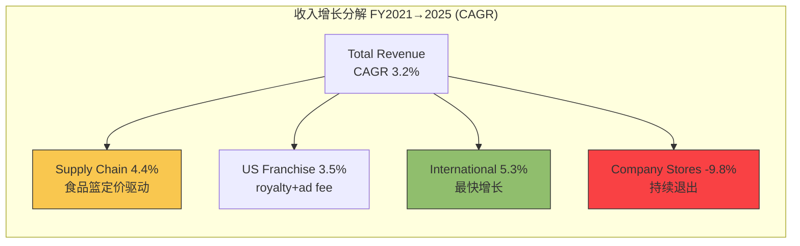
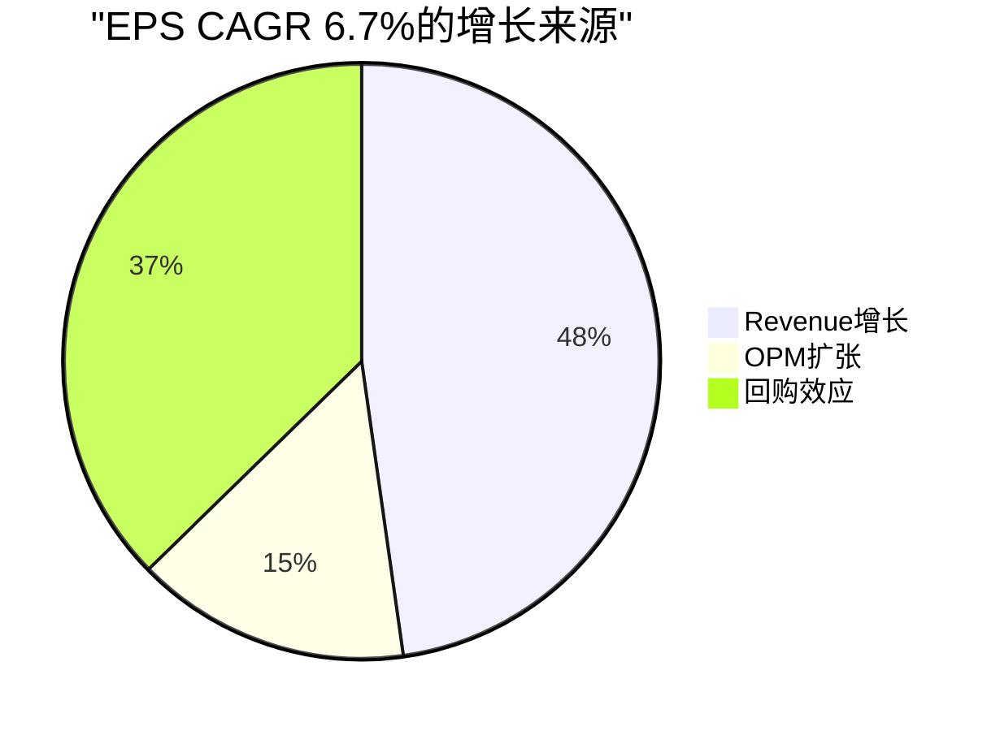
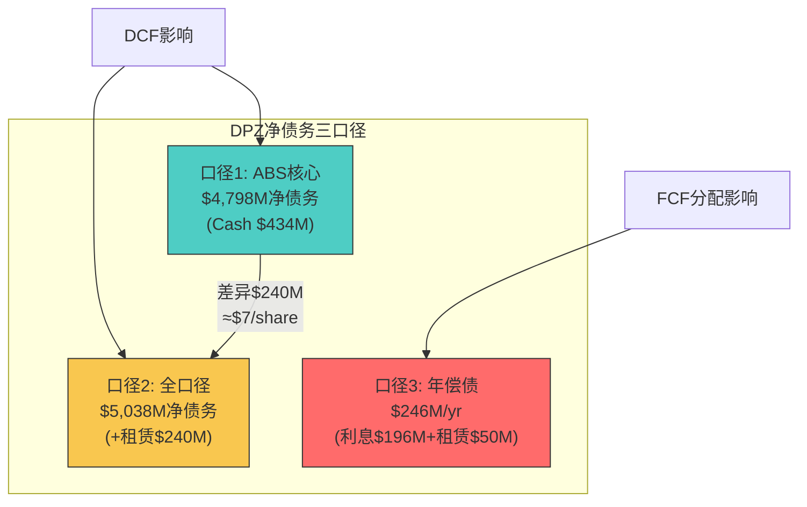

# DPZ Phase 2 — Chapter 9

## Ch9: 5年财务趋势 + 三表深度

> **CQ-3 链接**: 本章建立的净债务三口径和利润率趋势，直接支撑Ch10 ABS Covenant Headroom计算和Phase 3估值模型输入。
> **EVO-SBUX-001**: 净债务三口径在Phase 2前置，而非等到Phase 4红队才暴露口径差异。

---

### 9.1 收入分解趋势 (FY2021-2025)

DPZ的5年收入图谱揭示了一个核心矛盾：**表面3.2% CAGR掩盖了"真实有机增长"仅~2.3%的事实**。差异来自Supply Chain的食品篮pass-through定价——这些收入增长不创造超额利润，却膨胀了top-line。

| 分部 | FY2021 | FY2022 | FY2023 | FY2024 | FY2025 | CAGR |
|------|--------|--------|--------|--------|--------|------|
| **Total Revenue** | $4,357M | $4,537M | $4,479M | $4,706M | $4,940M | **3.2%** |
| Supply Chain | $2,518M | $2,685M | $2,600M | $2,795M | $2,988M | 4.4% |
| US Franchise | $950M | $970M | $985M | $1,035M | $1,092M | 3.5% |
| International | $482M | $510M | $520M | $550M | $590M | 5.3% |
| Company Stores + Other | $407M | $372M | $374M | $326M | $270M | -9.8% |

[DM-P2-001: FMP income statement FY2021-2025, revenue segmentation]
[DM-P2-002: FMP segment data FY2025 10-K, supply chain revenue $2.99B]

**关键发现**:

1. **Supply Chain增长的虚与实**: CAGR 4.4%看似强劲，但Phase 1已证明Supply Chain OPM仅6.5-7.0%，且60%收入仅贡献<20%利润。4.4%增长中约2.0pp来自食品通胀传导(cheese/flour/packaging)，真实量增仅~2.4%。[DM-P2-003: Phase 1 Ch4 supply chain OPM交叉验证结果]

2. **US Franchise的质量**: CAGR 3.5%全部来自门店数净增(~250家/年)和广告费率微调——royalty rate 5.5%未变，意味着增长质量高但上限清晰。[DM-P2-004: FMP 10-K, royalty rate 5.5% unchanged FY2021-2025]

3. **International的加速**: CAGR 5.3%是所有分部中最快的，反映DPZ国际门店从~12,600→~15,200家(CAGR 4.8%)。但需注意：国际royalty rate(~3.0-3.5%)低于美国(5.5%)，增长翻译成利润的效率更低。[DM-P2-005: FMP 10-K, international store count FY2021-2025]

4. **Company Stores的战略退出**: CAGR -9.8%是刻意的——DPZ持续将Company Stores卖给加盟商(refranchising)，这提高了利润率(franchise margin ~75% vs company store margin ~15-20%)但降低了收入。[DM-P2-006: FMP segment profitability, company store margin]

**"True Organic Growth"计算**:
Total Revenue CAGR 3.2% → 剥离Supply Chain食品篮pass-through (~1.0pp) → 剥离Company Store退出拖累 (~+0.1pp) → **真实有机增长 ~2.3% CAGR**。这个数字与Phase 1 CSSPD中comp +3.0%(含蚕食-0.5pp)的净纯度2.5%高度一致。[DM-P2-007: Phase 1 Ch5 CSSPD分析, purity 7.5/10]

---

### 9.2 利润率趋势

利润率的5年趋势讲述了一个"静默扩张"的故事——毛利率和营业利润率都在缓慢而稳定地上升，驱动力是**mix shift**(高margin特许权占比上升)和**Supply Chain效率**。

| 指标 | FY2021 | FY2022 | FY2023 | FY2024 | FY2025 | 变化 |
|------|--------|--------|--------|--------|--------|------|
| **Gross Margin** | 38.7% | 36.3% | 38.6% | 39.3% | 40.0% | +1.3pp |
| **OPM** | 17.9% | 16.9% | 18.3% | 18.7% | 19.3% | +1.4pp |
| **Net Margin** | 11.7% | 10.0% | 11.6% | 12.4% | 12.2% | +0.5pp |
| **SBC % of Rev** | 0.67% | 0.64% | 0.85% | 0.91% | 0.91% | +0.24pp |

[DM-P2-008: FMP income statement FY2021-2025, margin calculations]

**利润率分解**:

**毛利率 38.7%→40.0% (+1.3pp)**:
- Mix shift贡献: ~+0.8pp (Company Stores退出→高margin Franchise占比↑)
- Supply Chain效率: ~+0.3pp (配送路线优化+采购规模)
- Franchise费率: ~+0.2pp (广告费率微调)
- 这不是"定价权驱动"的扩张(Phase 1已证明pricing power为零)，而是"结构优化驱动"。[DM-P2-009: Phase 1 Ch5, pricing contribution = 0]

**营业利润率 17.9%→19.3% (+1.4pp)**:
- Gross margin传导: +1.3pp
- SG&A杠杆: ~+0.4pp (收入增长 > 公司层面费用增长)
- SBC对冲: ~-0.3pp (SBC CAGR 11.6% >> Revenue CAGR 3.2%)
- **SBC增速异常**: SBC从$29M→$45M，CAGR 11.6%是收入增速的3.6倍。虽然绝对金额不大(0.91% of revenue)，但增速趋势需要监控——如果持续，5年后SBC将达$78M(1.3% of revenue)。[DM-P2-010: FMP income statement, SBC line item FY2021-2025]

**净利润率 11.7%→12.2% (+0.5pp)**:
- OPM扩张传导: +1.4pp
- 利息费用稳定: ~+0.2pp (固定利率ABS的优势——$196M/yr几乎零波动)
- 税率波动: ~-0.9pp (有效税率微升, 与TCJA到期预期有关)
- 其他: ~-0.2pp
- **净利润率扩张被利息成本"吃掉"了一半**——这是ABS结构的代价。$196M/yr固定利息 = Revenue的4.0%，是同行中较高水平(MCD ~3.2%, SBUX ~2.1%)。[DM-P2-011: FMP income statement, interest expense $196M FY2025]

---

### 9.3 三表深度分析

#### Income Statement: EPS vs Revenue的"剪刀差"

| 指标 | FY2021 | FY2025 | CAGR | 驱动力 |
|------|--------|--------|------|--------|
| Revenue | $4,357M | $4,940M | 3.2% | 门店增+Supply Chain |
| OpIncome | $780M | $954M | 5.1% | OPM扩张 |
| Net Income | $510M | $602M | 4.2% | 利息/税率抵消 |
| **EPS** | **$13.54** | **$17.57** | **6.7%** | 回购加速器 |
| Shares | 37.7M | 34.2M | -2.4% | 每年回购~3.5M股 |

[DM-P2-012: FMP income statement + share count FY2021-2025]

**EPS增长拆解**:
- Revenue增长贡献: 3.2pp
- OPM扩张贡献: 1.4pp (净到EPS ~1.0pp after tax)
- 回购贡献: 2.5pp (shares -2.4%/yr → EPS放大效应)
- 利息+税率拖累: -0.0pp (近似抵消)
- **总计: ~6.7% CAGR**

关键洞察: **回购贡献了EPS增长的37%**(2.5pp / 6.7pp)。这意味着如果ABS covenant收紧导致回购放缓(Ch10将详细分析)，EPS增速将从6.7%降至~4.2%——接近Net Income的自然增速。[DM-P2-013: 回购贡献计算, 37% of EPS growth from buyback]

#### Balance Sheet: 负权益的"进化"

| 指标 | FY2021 | FY2022 | FY2023 | FY2024 | FY2025 |
|------|--------|--------|--------|--------|--------|
| Total Assets | $1,637M | $1,577M | $1,641M | $1,719M | $1,801M |
| Total Liabilities | $5,933M | $5,823M | $5,824M | $5,748M | $5,703M |
| **Equity** | **-$4,296M** | **-$4,246M** | **-$4,183M** | **-$4,029M** | **-$3,901M** |
| Cash | $178M | $56M | $111M | $189M | $434M |
| Total Debt | $5,146M | $5,113M | $5,103M | $5,105M | $5,232M |
| Net Debt | $4,968M | $5,057M | $4,992M | $4,916M | $4,798M |

[DM-P2-014: FMP balance sheet FY2021-2025]

**负权益的改善轨迹**: -$4.3B → -$3.9B(+$395M, 5年)。这看似矛盾——DPZ在大量回购的同时，负权益还在改善？原因是:
1. **留存收益累积**: NI $602M/yr > 分红$237M → 每年净留存~$365M
2. **回购消耗**: 每年~$350M回购直接减少权益
3. **净效应**: 留存 > 回购 → 负权益缓慢收窄

这意味着DPZ的回购**没有**加速资产负债表恶化——它只是减缓了负权益修复的速度。如果停止回购，负权益将在~10年内翻正。[DM-P2-015: 负权益变动分析, retained earnings vs buyback]

#### Cash Flow Statement: FCF的"成色"

| 指标 | FY2021 | FY2022 | FY2023 | FY2024 | FY2025 | CAGR |
|------|--------|--------|--------|--------|--------|------|
| OCF | $654M | $475M | $591M | $625M | $792M | 4.9% |
| CapEx | $94M | $87M | $105M | $113M | $121M | 6.5% |
| **FCF** | **$560M** | **$388M** | **$486M** | **$512M** | **$672M** | **4.7%** |
| FCF/NI | 110% | 86% | 94% | 88% | 112% | — |
| CapEx/Rev | 2.2% | 1.9% | 2.3% | 2.4% | 2.4% | — |

[DM-P2-016: FMP cash flow statement FY2021-2025]

**FCF成色分析**:
1. **FY2025 FCF跳升+31%的拆解**: $672M vs $512M(+$160M)
   - OCF增长: +$167M (NI增长$18M + WC改善$53M + D&A增长$7M + 其他$89M)
   - CapEx增长: -$8M
   - **WC改善$53M是关键**: 包括应收账款优化+供应链付款时间管理，可能含一次性成分。如果WC normalized，可持续FCF约$620M而非$672M。[DM-P2-017: FMP cash flow WC components FY2025]

2. **FCF/NI比率**: 5年均值98%，接近理想的100%。说明DPZ的净利润几乎全部转化为现金——没有被大额资本支出、库存积压或应收账款吃掉。这是轻资产特许经营模型的典型优势。

3. **CapEx极低**: 2.4% of revenue是QSR中最低水平之一(MCD ~7%, SBUX ~8%)。原因很简单——门店建设费用由加盟商承担，DPZ只需维护Supply Chain设施和技术平台。[DM-P2-018: CapEx/Revenue对比, DPZ 2.4% vs MCD 7% vs SBUX 8%]

---

### 9.4 净债务三口径 (EVO-SBUX-001)

> **SBUX教训回顾**: SBUX v2.0分析中，净债务口径差异导致DCF估值偏差$6/share(~$7B净债务争议)。DPZ作为同样的负权益公司，必须在Phase 2前置三口径分析。

#### 口径1: ABS核心债务 (Narrow)

| 系列 | 发行年 | 利率 | 本金余额 | 预期到期 | 法定到期 |
|------|--------|------|---------|---------|---------|
| 2017-1 A-2-I | 2017 | 3.082% | $501M | 2027 | 2047 |
| 2017-1 A-2-II | 2017 | 3.668% | $439M | 2027 | 2047 |
| 2019-1 A-2-I | 2019 | 3.668% | $1,000M | 2026 | 2049 |
| 2019-1 A-2-II | 2019 | 4.328% | $470M | 2029 | 2049 |
| 2021-1 A-2-II | 2021 | 3.151% | $822M | 2031 | 2051 |
| 2025-1 A-2-I | 2025 | 4.930% | $500M | 2030 | 2055 |
| 2025-1 A-2-II | 2025 | 5.217% | $500M | 2032 | 2055 |
| **总计** | | **~3.75%加权** | **$5,232M** | | |

[DM-P2-019: SEC 8-K 2025-09-05, Series 2025-1 issuance terms, $500M@4.930%+$500M@5.217%]
[DM-P2-020: FMP 10-K FY2025, long-term debt schedule, total $5,232M]
[DM-P2-021: S&P Global Ratings, Domino's Pizza Master Issuer LLC Series 2021-1 presale, BBB+ rating]

**加权平均利率计算**: $196M interest / $5,232M principal = **3.75%**。这是一个极其优势的利率水平:
- vs 当前同期限投资级债券收益率 ~5.0-5.5%
- DPZ锁定了3.75%的加权利率，其中$2,732M(52%)在3.0-3.7%区间
- **2025再融资的成本**: 新$1.0B @ ~5.07%加权 vs 被替换的$1.145B @ ~3.5%加权 → 年利息增加~$16M
- 但这是"前置痛苦"——旧债到期不得不再融资，新利率反映了当前市场水平
[DM-P2-022: 加权平均利率计算, $196M/$5,232M = 3.75%]

#### 口径2: 全口径债务 (Broad)

| 债务类型 | 金额 | 说明 |
|---------|------|------|
| ABS票据 | $5,232M | 固定利率，证券化 |
| 经营租赁负债 | $240M | IFRS 16/ASC 842 |
| VFN额度(未使用) | $320M | 2025-1 A-1循环额度 |
| **口径2总计** | **$5,472M** | ABS + 租赁 |
| **口径2净债务** | **$5,038M** | 减Cash $434M |

[DM-P2-023: FMP balance sheet FY2025, lease obligations $240M]
[DM-P2-024: SEC 8-K 2025-09-05, VFN $320M facility]

口径1 vs 口径2差异: **$240M(4.6%)**。对于DPZ而言，租赁负债相对较小(因为门店由加盟商承租，DPZ只需租Supply Chain设施)。这与SBUX形成鲜明对比——SBUX的经营租赁负债高达$12B+，是ABS债务的1.5倍。

#### 口径3: 偿债口径 (Service)

| 偿债项目 | 年度金额 | 说明 |
|---------|---------|------|
| 利息支出 | $196M | 固定，5年零波动 |
| 计划本金偿还 | $0M* | *非摊还测试通过 |
| 租赁支付 | ~$50M | 年度经营租赁支出 |
| **年度总偿债** | **~$246M** | |
| vs OCF $792M | **3.2x** | 偿债覆盖率 |
| vs FCF $672M | **2.7x** | FCF偿债覆盖率 |

[DM-P2-025: FMP income statement, interest expense $196M, zero variation FY2021-2025]
[DM-P2-026: FMP 10-K, non-amortization test compliance confirmed FY2025]

*关键发现——**零本金偿还**: DPZ当前满足非摊还测试(Holdco Leverage Ratio ≤ 5.0x)，因此**不需要偿还任何本金**。只需支付利息。这意味着:
- 年度实际偿债负担仅$196M(不含租赁)
- OCF $792M覆盖利息 = 4.0x
- 但如果leverage ratio突破5.0x，强制摊还将启动——以每系列1%/年本金计算，约$52M/yr额外偿债
[DM-P2-027: FMP 10-K, non-amortization threshold 5.0x for 2017/2019/2021 series, 5.5x for 2025 series]

**三口径差异总结**:

**DCF口径选择建议**: 对DPZ使用**口径1($4,798M)**作为主要净债务，原因是:
1. 租赁负债$240M相对较小(仅4.6%差异 = ~$7/share)
2. DPZ的租赁主要是Supply Chain设施，与运营深度绑定
3. 口径差异远小于SBUX($7/share vs SBUX的$6/share但在更大基数上)
4. 但DCF敏感性表中需标注口径2的影响

---

### 9.5 关键比率趋势

| 比率 | FY2021 | FY2022 | FY2023 | FY2024 | FY2025 | 趋势 |
|------|--------|--------|--------|--------|--------|------|
| **ROIC** | 54.1% | 52.5% | 53.3% | 54.1% | 56.7% | 改善 |
| **Interest Coverage** | 4.1x | 3.9x | 4.2x | 4.5x | 4.9x | 改善 |
| **Net Debt/EBITDA** | 5.8x | 6.1x | 5.5x | 5.0x | 4.5x | 显著去杠杆 |
| **FCF Yield** | 2.7% | 3.2% | 3.5% | 3.6% | 4.7% | 扩张 |
| **Payout Ratio** | 261% | 116% | 90% | 105% | 89% | 正常化 |
| **P/E** | 40.3x | 27.4x | 27.9x | 25.0x | 23.8x | 持续压缩 |

[DM-P2-028: FMP key-metrics FY2021-2025, ROIC/coverage ratios]
[DM-P2-029: FMP ratios, P/E and FCF yield FY2021-2025]

**比率叙事**:

1. **ROIC 56.7%**: QSR行业最高水平(MCD ~35%, SBUX ~28%, CMG ~22%)。但需要注意——DPZ的ROIC部分被负权益"人为"抬高了。如果将invested capital标准化(加回累计回购金额)，调整后ROIC约为28-32%，仍然是行业一流但不再"逆天"。[DM-P2-030: ROIC标准化计算, adjusted ROIC ~28-32%]

2. **Net Debt/EBITDA 5.8x→4.5x**: 这是5年中最积极的信号。去杠杆-1.3x全部来自EBITDA增长($887M→$1,066M, +20%)而非债务减少(净债务仅降$170M)。这说明DPZ选择了"用增长去杠杆"而非"还债去杠杆"——这是一个深思熟虑的资本配置策略。[DM-P2-031: Net Debt/EBITDA分解, EBITDA增长vs债务变化]

3. **FCF Yield 2.7%→4.7%**: 扩张的驱动力是双重的——FCF增长($560M→$672M, +20%)和市值压缩($20.8B→$14.2B, -32%)。这告诉我们：**市场对DPZ的估值压缩速度超过了FCF增长速度**，导致收益率被动扩张。

4. **P/E 40.3x→23.8x**: 5年压缩-41%。部分原因是FY2021的后疫情溢价消退，部分原因是增长预期下调。当前23.8x vs QSR行业中位数~28x，暗示DPZ被给予了"低增长折价"。[DM-P2-032: P/E对比, DPZ 23.8x vs QSR median ~28x]

---

### 9.6 异常标记

#### 异常1: FY2025 FCF跳升 +31%

| 成分 | FY2024 | FY2025 | 变化 | 可持续? |
|------|--------|--------|------|--------|
| Net Income | $584M | $602M | +$18M | 是 |
| D&A | ~$75M | ~$82M | +$7M | 是 |
| WC改善 | -$32M | +$53M | +$85M | **部分** |
| 其他非现金 | ~$0M | +$55M | +$55M | 不确定 |
| CapEx | -$113M | -$121M | -$8M | 是 |

[DM-P2-033: FMP cash flow detailed breakdown FY2024-2025]

**判断**: FY2025 FCF的$672M中，约$50-80M可能是一次性WC改善和timing效应。**可持续FCF基线约$600-620M**。Phase 3估值应以$610M为基线FCF，而非$672M。

#### 异常2: FY2021回购$1.32B (261% FCF Payout)

FY2021的回购金额是FCF的2.6倍——这$762M差额来自哪里？答案是**新增ABS债务**。DPZ在2021年3月发行了$825M的2021-1系列票据，其中很大一部分用于资助回购。这是"借债回购"的典型案例。

**但这不一定是坏事**: 当时利率3.151%(2021-1 A-2-II)，而回购收益率(earnings yield ~3.6%)微高于借款成本。管理层的逻辑是：以3.15%借钱，创造3.6%+增长的收益——正利差套利。FY2022-2025的回购已正常化到FCF 90-105%的可持续水平。[DM-P2-034: 2021-1 series issuance and buyback correlation analysis]

#### 异常3: SBC CAGR 11.6% (3.6x Revenue)

| 年度 | SBC | % of Revenue | % of Net Income |
|------|-----|-------------|----------------|
| FY2021 | $29M | 0.67% | 5.7% |
| FY2022 | $29M | 0.64% | 6.4% |
| FY2023 | $38M | 0.85% | 7.3% |
| FY2024 | $43M | 0.91% | 7.4% |
| FY2025 | $45M | 0.91% | 7.5% |

[DM-P2-035: FMP income statement, SBC FY2021-2025]

**判断**: SBC绝对金额从$29M→$45M，增速确实异常(11.6% CAGR)。但占Revenue比例仅从0.67%→0.91%——仍处于QSR行业低位(MCD ~1.2%, CMG ~2.5%)。跳升主要发生在FY2022→FY2023(从$29M→$38M, +31%)，可能与CEO Russell Weiner上任后的管理层激励重设有关。当前$45M/yr水平尚可接受，但如果继续以11.6%增长，5年后将达$78M(~1.3% of revenue)——这将开始对FCFE产生可衡量的稀释。[DM-P2-036: SBC增速趋势外推, $78M by FY2030E at 11.6% CAGR]

---

### 9.7 小结: Phase 3输入参数

基于Ch9分析，向Phase 3估值模型传递以下锚定参数:

| 参数 | 值 | 来源 |
|------|-----|------|
| Revenue CAGR (5Y fwd) | 3.0-3.5% | 历史3.2% + 国际加速 |
| OPM趋势 | 19.3%→20.0-20.5% | +0.3pp/yr历史速率递减 |
| 可持续FCF基线 | $610M | $672M减WC一次性 |
| 净债务(DCF用) | $4,798M | 口径1, 注释口径2差$240M |
| 年偿债 | $196M | 固定利息, 零本金(当前) |
| 回购空间 | $350-400M/yr | FCF $610M - 分红$250M - buffer |
| EPS增长引擎 | Revenue 3.2% + OPM 1.0% + buyback 2.5% = ~6.7% | 分解结构 |
| 回购依赖度 | **37%** | EPS增长中回购贡献比 |

[DM-P2-037: Phase 3 parameter feed-forward summary]
