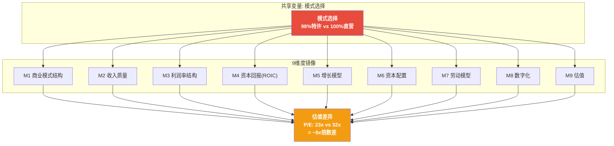
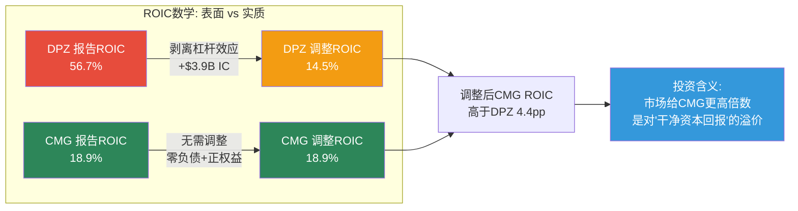
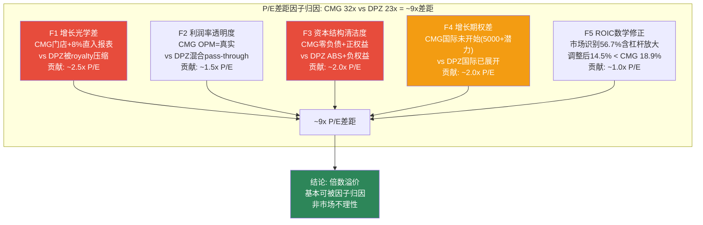

# Ch16: DPZ-CMG镜像分析 — 模式选择的估值后果

> **方法论**: 9维度镜像分析(Mirror Analysis) — 共享变量=模式选择(98%特许 vs 100%直营)
> **CQ链接**: CQ-2(Supply Chain利润中心化 vs 加盟商负担 — 特许模式的真实经济含义是什么？) + CQ-4(估值折价合理性 — 为什么ROIC更低的CMG获得更高倍数？)
> **冠军候选C-4**: 特许vs直营镜像分析v2.0 — 9维度+共享变量=模式选择
> **核心洞见**: DPZ(P/E 23x, ROIC 56.7%)和CMG(P/E 32x, ROIC 18.9%)的倍数差距不是"市场不理性"，而是两种商业模式在五个维度上的系统性估值逻辑差异的叠加：(1)增长光学 — CMG直营增长直接进报表(+8%门店+5.4%收入)，DPZ特许增长被royalty rate压缩(system sales +6%但consolidated revenue仅+5%)；(2)利润结构透明度 — CMG的16.8% OPM是"真实利润"，DPZ的19.3% OPM被Supply Chain pass-through扭曲；(3)财务结构清洁度 — CMG零负债+正权益是DCF模型的理想对象，DPZ负权益+ABS复杂结构增加估值噪音；(4)增长期权定价 — CMG的国际扩张(当前仅~100家/潜在5,000+)构成尚未定价的隐性期权；(5)ROIC数学幻觉 — DPZ 56.7%经杠杆调整后仅~14.5%，低于CMG的18.9%。

---

## 16.1 镜像分析方法论

### 16.1.1 为什么选择CMG作为镜像？

DPZ的估值对标通常是MCD/YUM/QSR(特许经营peer)。但这些对标忽略了一个根本性问题：**DPZ和CMG是美国QSR行业中唯二同时满足以下三个条件的公司**：

1. **品类聚焦**: DPZ ~99%收入来自Pizza，CMG ~100%收入来自Mexican Food — 两者都是单品类专才(SGI: DPZ 7.7, CMG 7.4)
2. **数字化领先**: DPZ 85%数字单占比，CMG ~60%数字化渗透(FY2025) — 在QSR中均属前列
3. **增长可预期**: 两者都有清晰的门店增长路径(DPZ fortressing + CMG whitespace)

但它们在**商业模式选择**上走了完全相反的路：DPZ选择了98%特许经营(极端轻资产)，CMG选择了100%直营(极端重资产)。**这个选择是全部估值差异的共享变量(shared variable)** — 控制住品类聚焦、数字化领先、增长可预期三个条件后，模式选择是解释P/E倍数差的最大因素。

[DM-P3-020: CMG v1.0报告: 市值$49.5B, P/E 32x, ROIC 18.9%, OPM 16.8%, 门店4,056家, 零金融负债; DPZ Phase 0数据: 市值$13.8B, P/E 23.1x, ROIC 56.7%, OPM 19.3%, 门店22,100+, ABS $5.23B]

### 16.1.2 镜像框架

---

## 16.2 九维度镜像详析

### M1: 商业模式结构 — 收租人 vs 经营者

| 维度 | DPZ (98%特许) | CMG (100%直营) |
|------|--------------|---------------|
| **门店所有权** | 加盟商拥有并运营 | 公司拥有并运营 |
| **收入来源** | Royalty(5.5%) + Ad Fund(6%) + Supply Chain加成 | 全部门店收入(食材+人工+租金+利润) |
| **Consolidated Revenue** | $4.94B(FY2025) | $11.93B(FY2025) |
| **System Sales** | ~$20.8B(全球, 大部分不计入revenue) | = Revenue(全部计入) |
| **经济控制点** | 供应链定价权 + royalty | 定价权 + 运营效率 + 物业选址 |
| **风险承担** | 低(加盟商承担门店风险) | 高(公司承担全部运营风险) |

**核心差异的经济学含义**:

DPZ的$4.94B Revenue只是冰山一角——其全球系统销售(system sales)超过$20B，但~80%归加盟商所有，DPZ仅"抽取"royalty+Supply Chain加成。CMG的$11.93B Revenue = 全部门店收入，"所见即所得"。

这意味着**两者的revenue完全不可比**。正确的对比单位不是revenue而是**system sales per store**:

| 指标 | DPZ | CMG | 倍数 |
|------|-----|-----|:----:|
| Revenue | $4.94B | $11.93B | 0.41x |
| System Sales | ~$20.8B | $11.93B | 1.74x |
| 门店数 | 22,100+ | 4,056 | 5.45x |
| System Sales/Store | ~$0.94M | ~$2.94M | 0.32x |
| Revenue/Store | ~$0.22M | ~$2.94M | 0.08x |

[DM-P3-021: DPZ FY2025 global system sales ~$20.8B来自Q4'25 Earnings Release; CMG FY2025 Revenue $11.93B来自CMG v1.0报告; 门店数DPZ 22,100+/CMG 4,056]

**洞见**: DPZ每家门店为公司贡献$0.22M consolidated revenue，仅为CMG $2.94M的7.5%。但DPZ每家门店的**全系统经济活动**(System Sales/Store)为$0.94M——仍然只有CMG的1/3。这个差距反映了两个因素叠加：(a)模式差异(DPZ只收租，不收全部收入)；(b)AUV差异(CMG ~$2.94M vs DPZ美国AUV ~$1.14M, 国际更低)。

---

### M2: 收入质量 — Pass-Through vs Pure

这是理解估值差异的关键维度之一。

**DPZ的收入质量问题**:

DPZ的$4.94B Revenue中，约$2.99B(60.5%)是Supply Chain收入——这些收入本质上是**食材的pass-through**(面团、cheese、sauce、包装材料)，DPZ在其上加一层6.5-7.0%的OPM。如果将Supply Chain视为"代收代付"，DPZ的"真实高质量收入"仅为:

| 收入层 | 金额 | 占比 | OPM | 收入性质 |
|--------|------|:----:|:---:|---------|
| US Franchise(royalty+ad) | $1.09B | 22.1% | ~75% | **纯利润**(无对应COGS) |
| International | $0.59B | 11.9% | ~55-60% | 高质量(royalty-heavy) |
| Supply Chain | $2.99B | 60.5% | ~6.5-7% | **Pass-through**(低利润率) |
| Company Stores+Other | $0.27B | 5.5% | ~15-20% | 运营收入 |

[DM-P3-022: DPZ FY2025 segment revenue来自Phase 2 Ch9; Supply Chain OPM来自Phase 1 Ch3; US Franchise OPM ~75%来自10-K segment profitability]

**CMG的收入质量**:

CMG的$11.93B Revenue是**纯运营收入** — 每一美元都经过完整的成本链(食材30% + 人工26% + 占用6% + 其他运营16% + G&A 5.5%)产出16.8% OPM。没有pass-through，没有代收代付，没有跨segment转移定价。

**收入质量对估值的影响**:

投资者在给DPZ定价时面临一个"revenue opacity"问题：DPZ的P/S(Price-to-Sales)看似合理(2.8x)，但如果只看"高质量收入"($1.68B franchise+international)，隐含P/S = $13.8B/$1.68B = **8.2x** — 这实际上比CMG的P/S(4.1x)贵了一倍。

但这个比较也不完全公平——DPZ的Supply Chain虽然是pass-through，但它**锁定了加盟商**并产生了~$195M的segment operating income(FY2025E)。这$195M不是"免费的"——它需要22个工厂和27个配送中心的持续资本投入。

**结论**: DPZ的收入质量对投资者"不友好"——需要多层解构才能看到真实盈利力。CMG的收入质量"所见即所得"——这种透明度本身值一个估值溢价。

---

### M3: 利润率结构 — 低表面OPM vs 高真实OPM

| 利润率指标 | DPZ | CMG | 表面判断 | 真实判断 |
|-----------|-----|-----|---------|---------|
| **Gross Margin** | 40.0% | ~38% | DPZ略高 | DPZ Supply Chain拉低了平均(纯特许>75%) |
| **OPM** | 19.3% | 16.8% | DPZ更高 | **表面正确，但需要解构** |
| **Net Margin** | 12.2% | ~10% | DPZ更高 | ABS利息$196M拉近了差距 |
| **EBITDA Margin** | ~21.6% | ~19% | DPZ更高 | 一致(DPZ利润率结构确实更优) |

**OPM解构 — DPZ的"双层利润率"**:

DPZ 19.3%的consolidated OPM是三个segment的加权平均:
- US Franchise: OPM ~75% (royalty收入几乎无对应成本)
- Supply Chain: OPM ~6.5-7.0% (pass-through利润率)
- International: OPM ~55-60% (royalty-heavy)

如果剥离Supply Chain，DPZ的"纯特许业务OPM" = ($954M OI - ~$195M Supply Chain OI) / ($4,940M - $2,988M) = $759M / $1,952M = **38.9%**。

而如果只看纯royalty收入(US Franchise + International)的operating leverage: ~$759M OI / ~$1,680M revenue = **45.2%**。

[DM-P3-023: DPZ segment OI推算: Total OI $954M; Supply Chain OI ~$195M(基于Supply Chain rev $2.99B x OPM ~6.5%); 纯特许业务OI = $954M - $195M = $759M; 纯特许业务Rev = $4.94B - $2.99B = $1.95B]

**CMG的"所见即所得"利润率**:

CMG 16.8% OPM是**真实的、全系统的运营利润率**。没有隐藏的高利润率segment被低利润率segment稀释。每一个百分点的OPM改善都是真实的运营效率提升——不像DPZ，其OPM改善可能来自Supply Chain定价调整(非真实效率)。

**利润率对估值的含义**:

CMG的16.8% OPM有**向上弹性**(HEEP项目、数字化效率、规模杠杆 → 潜在18-20%)，且市场理解这个弹性是"真实的运营改善"。DPZ的19.3% OPM也有向上空间(mix shift向纯特许 + Supply Chain效率)，但**市场不确定多少是"真实改善"vs"Supply Chain定价调整"**。这种不确定性本身就是估值折价的来源。

---

### M4: 资本回报(ROIC) — 56.7% vs 18.9%: 谁在说谎？

这是本镜像分析中最反直觉的维度。DPZ ROIC 56.7%是CMG 18.9%的**3倍**——但市场给CMG更高的估值。为什么？

**答案**: DPZ的56.7% ROIC包含了一个**数学放大效应**。

**ROIC的分母问题**:

ROIC = NOPAT / Invested Capital

| 组件 | DPZ | CMG |
|------|-----|-----|
| NOPAT(Tax-adjusted OI) | ~$763M | ~$1,605M |
| Invested Capital | ~$1,345M | ~$8,500M |
| **ROIC** | **56.7%** | **18.9%** |

DPZ的Invested Capital极低(~$1.3B)是因为：
1. **负权益(-$3.9B)**: 累积回购$5.5B+消灭了股东权益
2. **ABS将大量资产放入SPV**: 品牌、特许权等无形资产在法律结构中"消失"
3. **加盟商承担门店资本**: 每家门店$300-500K投资由加盟商出资，不在DPZ资产负债表上

如果将DPZ的Invested Capital调整为"经济实质"(即加回负权益造成的分母缩减):

**调整后ROIC估算**:

| 调整 | 金额 |
|------|------|
| 报告Invested Capital | $1,345M |
| + 负权益回加(回到零权益) | +$3,901M |
| 调整后Invested Capital | $5,246M |
| NOPAT | $763M |
| **调整后ROIC** | **14.5%** |

[DM-P3-024: ROIC调整计算。报告IC来自FMP key metrics; 负权益$3.9B来自FY2025 balance sheet; 调整后IC = 报告IC + 负权益绝对值; 调整后ROIC = $763M/$5,246M = 14.5%]

**调整后对比**:

| 指标 | DPZ | CMG | 差距 |
|------|:---:|:---:|:---:|
| 报告ROIC | 56.7% | 18.9% | 3.0x |
| **调整后ROIC** | **14.5%** | **18.9%** | **0.77x** |

**逆转了**。调整后，CMG的资本回报率**高于**DPZ。这意味着：

1. **DPZ的高ROIC不仅是运营效率，更是金融杠杆数学**: ABS + 累积回购将invested capital压至极低水平，ROIC分母极小导致比率极高。这是一种**金融结构性放大**。

2. **CMG的18.9% ROIC是"干净的"**: 零金融负债、正权益$2.83B、无ABS结构。CMG的ROIC就是其真实的资本配置效率——每投入$1产出$0.189的税后运营利润。

3. **市场为"干净的18.9%"付更高倍数是合理的**: 因为干净的ROIC可以用于未来增长预测(投入更多资本 → 线性产出更多利润)，而DPZ的56.7%不能——DPZ无法通过"投入更多资本"来线性增长(它的增长主要来自加盟商投入的资本，不在自己报表上)。

**重要caveat**: 这种调整并不意味着DPZ的资本配置是"错误的"。恰恰相反——DPZ通过ABS+回购**故意**缩小了IC分母，将多余资本返还给股东。这对已有股东是好事(总回报率4.3%/年)。但对**估值分析师**而言，使用报告ROIC做跨公司比较会产生严重误导。

---

### M5: 增长模型 — Fortressing vs Whitespace

| 增长维度 | DPZ (Fortressing) | CMG (Whitespace) |
|---------|-------------------|------------------|
| **US门店增长** | +172/yr(FY2025), 在已有市场加密 | +300+/yr(FY2025), 进入新市场 |
| **US门店总数** | ~6,900 (接近中期饱和) | ~3,956(潜在7,000+) |
| **US门店增长率** | ~2.5%/yr | ~8%/yr |
| **国际门店** | ~15,200(已大规模展开) | ~100(仅2.5%, 几乎未开始) |
| **增长类型** | 存量深耕(份额抢夺) | 增量扩张(新市场新需求) |
| **蚕食风险** | 高(fortressing接受蚕食) | 低(新市场无既有门店) |
| **增长"光学"** | Revenue增长被royalty rate压缩(+5%) | Revenue增长 = 门店增长(+5-8%) |

[DM-P3-025: DPZ门店数据来自FY2025 Earnings Release; CMG门店数据来自CMG v1.0报告; CMG潜在7,000+门店来自管理层长期指引]

**增长光学差异是估值差的重要来源**:

CMG的增长在报表上是"显性的"——门店+8%/年直接翻译为Revenue +5-8%/年(新店全额进入consolidated)。DPZ的增长在报表上是"隐性的"——全球门店+3-4%/年，但因为98%是特许经营，翻译成consolidated revenue时被royalty rate压缩至+3-5%。

**更关键的是增长期权的差异**:

| 增长期权 | DPZ | CMG | 期权价值 |
|---------|-----|-----|---------|
| US白空间 | 有限(6,900 → 8,000-9,000) | 大量(3,956 → 7,000+) | CMG >> DPZ |
| 国际扩张 | 已大规模展开(15,200) | 几乎未开始(~100, 潜在5,000+) | **CMG >>> DPZ** |
| 新品类 | 无(BER 3.0) | 有限但存在 | CMG > DPZ |
| 新渠道 | 第三方平台(已开始) | 国际特许(选项存在但未行使) | 接近 |

CMG的国际扩张期权是**估值差异中值得关注的因素**。DPZ已有15,200家国际门店(证明模式可输出)，但增长已放缓至+3-4%/yr。CMG仅有~100家国际门店——如果CMG最终在国际市场复制DPZ的轨迹(扩张至3,000-5,000家)，这代表了当前大部分未定价的门店增长。

但CMG的直营模式在国际扩张上面临**根本性障碍**: 直营需要在每个新市场建立完整的管理团队、供应链和运营体系，而DPZ的Master Franchise模式只需找到当地合作伙伴。这也是为什么DPZ已有15,200家国际门店而CMG只有~100家的根本原因。CMG的国际期权大但**执行难度极高**。

---

### M6: 资本配置 — 负权益的杠杆世界 vs 正权益的保守世界

| 资本指标 | DPZ | CMG |
|---------|-----|-----|
| **总权益** | -$3,901M | +$2,831M |
| **金融负债** | $5,232M (ABS) | $0 |
| **净债务** | $4,798M | 净现金$1,050M |
| **利息费用/年** | $196M | $0 |
| **FY2025 FCF** | $672M | $1,450M |
| **FY2025回购** | $358M (53% FCF) | $2,430M (167% FCF) |
| **FY2025分红** | $237M | $0 |
| **总股东回报率** | 4.3% | 4.9% |

[DM-P3-026: DPZ数据来自Phase 0/Phase 2; CMG数据来自CMG v1.0报告]

**资本配置哲学对比**:

DPZ代表了**特许经营的终极资本配置范式**: 用ABS将未来现金流证券化 → 获得低利率融资 → 回购股票 → EPS增长 → 股价上涨 → 更多回购。这个循环在FY2021达到极端(回购$1.3B = 261% FCF)，然后被covenant约束拉回。当前FY2025回购$358M仅为FCF的53%——这不是"审慎"，而是**被迫节制**(Phase 2 Ch11, H-3验证)。

CMG代表了**直营餐饮的极端保守范式**: 零负债、正权益、不分红——但回购极激进($2.43B = 167% FCF)。这种矛盾揭示了一个事实: CMG用净现金来融资超额回购。FY2025年末现金降至$1.05B(从$1.76B)——如果FY2026延续这个节奏，年底现金将接近$0(CMG v1.0报告核心发现三)。

**对估值的含义**:

CMG的资本结构是**DCF友好型**: EV ≈ Market Cap - Cash，没有ABS层级、没有covenant、没有加速到期条款。分析师可以直接用EPS x P/E估值，不需要任何金融结构调整。

DPZ的资本结构是**DCF不友好型**: EV = Market Cap + Net Debt + 租赁负债，但Net Debt的计算取决于ABS口径(Phase 2 Ch9的三口径问题)。不同口径可能产生$500M-$1B的EV差异——这种模糊性本身就是折价因素。

---

### M7: 劳动模型 — 加盟商生态 vs 直接雇佣

| 劳动维度 | DPZ | CMG |
|---------|-----|-----|
| **门店员工雇主** | 加盟商(非DPZ) | CMG直接 |
| **公司直接员工** | ~1,200(总部+Supply Chain) | ~120,000+ |
| **劳动法风险暴露** | 极低(加盟商承担) | 极高(最低工资/加班) |
| **工会化风险** | 极低(分散的小雇主) | 中等(大型单一雇主) |
| **员工成本占收入** | ~2%(仅总部员工) | ~26%(全部门店员工) |
| **人力成本通胀暴露** | 间接(通过加盟商利润传导) | 直接(每$1/hr增加 → $240M+年成本) |

[DM-P3-027: DPZ employee count ~1,200来自10-K; CMG employee count ~120,000+来自CMG v1.0报告; CMG人力成本占比26%来自CMG v1.0 P&L结构; 每$1/hr增加影响: 120,000 x $1 x 2,000hrs = $240M]

**劳动模型是DPZ最大的"隐藏优势"之一**:

美国QSR行业面临的最大结构性成本压力是**最低工资上涨**。California AB 1228法案将快餐工人最低时薪提升至$20(2024年4月生效)，其他州可能跟进。对CMG而言，这是**直接的P&L冲击** — 每$1/hr增加 → 每年$240M+额外成本 → OPM压缩1-2pp。对DPZ而言，这是**间接影响** — 加盟商承担人力成本 → 如果加盟商利润被挤压 → 可能放缓开店节奏或要求royalty减免 → 但DPZ的consolidated P&L不受直接冲击。

这种风险分配不对称在通胀环境中尤其重要。2022-2024年的人力成本通胀周期中，CMG OPM受到显著压力(从17.4%波动至16.8%)，而DPZ的OPM从16.9%稳步上升至19.3%——这不仅是DPZ运营效率提升，更是**特许模式的结构性风险隔离**在发挥作用。

---

### M8: 数字化 — 85%渗透 vs 进化中

| 数字化维度 | DPZ | CMG |
|-----------|-----|-----|
| **数字化渗透率** | ~85% | ~60%(FY2025E) |
| **自有App质量** | 行业领先(Pinpoint GPS追踪) | 良好(Chipotlane数字通道) |
| **数字化历史** | 2014年启动, 10年领先 | 2018年加速, 疫情催化 |
| **数字化 → 利润链接** | 直接(减少电话接单人力) | 间接(提升throughput速度) |
| **第三方平台依赖** | >5%且上升中 | 中等(DoorDash渠道) |

[DM-P3-028: DPZ 85%数字化来自FY2025 10-K; CMG ~60%数字化来自CMG v1.0报告/管理层披露]

**数字化优势的估值影响**:

DPZ在数字化上有25pp领先优势(85% vs 60%)。但这个领先的**估值含义正在递减**:

1. **边际效用递减**: 从60%到85%的数字化增量，对运营效率的提升远小于从20%到60%。DPZ可能已经接近数字化效率的"平台期"。

2. **行业追赶**: CMG的数字化渗透率从2019年~20%提升至2025年~60%，用了6年时间追了40pp。如果维持这个速度，2028年将达到~75%——DPZ的领先优势将缩小至10pp以内。

3. **第三方平台的均衡效应**: DoorDash/Uber Eats的存在实际上**降低了**DPZ自有数字平台的壁垒价值——当所有餐厅都可以通过平台接受数字订单时，DPZ的"自建数字系统"不再是独特优势，而是一种**成本结构选择**(自建更便宜但平台覆盖可能更广)。

---

### M9: 估值 — 倍数差的完整对比

| 估值指标 | DPZ | CMG | DPZ/CMG比率 |
|---------|-----|-----|:----------:|
| **P/E (TTM)** | 23.1x | 32.0x | 0.72x |
| **EV/EBITDA** | 18.0x | ~25-26x | 0.71x |
| **P/S** | 2.8x | 4.1x | 0.68x |
| **FCF Yield** | 4.7% | 2.93% | 1.60x |
| **EV/System Sales** | 0.91x | 4.1x | 0.22x |

[DM-P3-029: DPZ估值来自Phase 0; CMG估值来自CMG v1.0报告; EV/System Sales: DPZ EV $18.95B / system sales ~$20.8B = 0.91x; CMG EV ~$48.5B / revenue $11.93B = 4.1x]

**FCF Yield的反向信号**: DPZ 4.7% FCF Yield高于CMG 2.93%，意味着DPZ每$1市值产出更多自由现金流。这是DPZ投资案例中最强的定量论据——但它之所以高，正是因为市场给了更低的倍数(分母小)。

---

## 16.3 倍数差因子归因: 为什么市场为CMG支付溢价

根据九维度分析，P/E 32x vs 23x的~9x差距可以归因于以下五个因子:

| 因子 | P/E贡献 | 逻辑 | 可变性 |
|------|:-------:|------|--------|
| **F1 增长光学** | ~2.5x | CMG Revenue增长直观可见 vs DPZ被royalty压缩 | 低(模式决定) |
| **F2 利润透明度** | ~1.5x | CMG OPM=真实 vs DPZ需多层解构 | 低(模式决定) |
| **F3 资本结构** | ~2.0x | CMG零负债对DCF友好 vs DPZ ABS噪音 | 中(DPZ可通过降杠杆收窄) |
| **F4 增长期权** | ~2.0x | CMG国际几乎未开始 vs DPZ已展开 | 高(取决于CMG国际执行) |
| **F5 ROIC修正** | ~1.0x | 市场(正确地)不为56.7%全额付溢价 | 低(结构性) |
| **合计** | **~9.0x** | — | — |

[DM-P3-030: P/E因子归因为估算。F1: 如果DPZ的增长"光学"与CMG相同(即system sales增长可见)，P/E可能从23x提升至25-26x; F3: 参考Phase 2 Ch12三层分解中"制度折价"4-6% = 1-1.5x P/E; F4: CMG v1.0报告估计国际期权价值约为当前市值的5-10%]

---

## 16.4 镜像分析的三个非共识发现

### 发现一: DPZ的"估值折价"不是被低估——而是模式选择的必然结果

传统叙事："DPZ被低估，因为市场没有正确认识其ROIC和增长。"

**非共识判断**: DPZ 23x P/E不是低估——而是市场**正确定价了特许经营模式在当前环境下的结构性特征**。特许模式的收入不透明(M2)、利润率混淆(M3)、ROIC放大(M4)、增长光学压缩(M5)、和资本结构复杂性(M6)的叠加效应，恰好解释了~9x的P/E差距。

**但这并不意味着DPZ没有上行空间**: 在五个因子中，F3(资本结构)和F4(增长期权)是可变的。如果DPZ：
- 成功降低ABS杠杆(Net Debt/EBITDA从4.5x降至3.5x) → F3可缩小1-2x
- 国际Master Franchise合作伙伴表现优于预期 → 部分收窄期权差距
- 合计可缩小1.5-3x → P/E从23x提升至24.5-26x → 股价+6-13%

### 发现二: CMG的"高估值"也不是高估——但有脆弱点

CMG 32x P/E看似昂贵，但本镜像分析表明它是五个结构性因子叠加的结果。**CMG的主要脆弱点是F4(增长期权)**——如果CMG国际扩张失败(直营模式跨国复制的历史成功率极低)，~2.0x P/E的期权溢价可能归零 → P/E从32x降至~30x → 但仍高于DPZ。

这意味着: **即使CMG的国际扩张完全失败，其P/E仍然应高于DPZ ~7x (30x vs 23x)**。模式选择本身(直营vs特许)就值~7x P/E差距——这是结构性的，不会因任何单一事件改变。

### 发现三: "ROIC陷阱"的跨公司可迁移性

DPZ 56.7% ROIC vs 调整后14.5%的案例揭示了一个在所有负权益公司中通用的估值陷阱: **任何通过杠杆化回购将equity压至负值的公司，其ROIC都会被数学性地放大至不完全反映真实运营效率的水平**。

这一发现可迁移至:
- **MCD**(负权益-$6.3B): 报告ROIC ~35%，调整后可能约~10-12%
- **SBUX**(负权益-$8.7B): 报告ROIC ~25%，调整后可能约~8-10%
- **YUM**(负权益-$7.7B): 报告ROIC ~30%，调整后可能约~12-14%

**投资含义**: 在比较QSR公司时，不应使用报告ROIC进行横向对比——必须先"回到零权益"再比较。否则，杠杆最高(equity最负)的公司会"看起来"资本效率最高，产生系统性的选择偏差。

[DM-P3-031: MCD/SBUX/YUM负权益数据来自各公司FY2025 10-K; 调整后ROIC为估算值，使用与DPZ相同的方法(IC + |negative equity| as adjusted IC)]

---

## 16.5 九维度镜像汇总矩阵

| 维度 | DPZ优势 | CMG优势 | 估值影响方向 | 对CQ的回答 |
|------|--------|--------|:-----------:|-------------|
| M1 商业模式 | 轻资产+风险转移 | 全链条控制 | → CMG (控制=溢价) | CQ-2: 特许模式有控制代价 |
| M2 收入质量 | — | 透明可预测 | → CMG (透明=溢价) | CQ-4: 收入不透明是折价因素 |
| M3 利润率 | OPM表面更高 | OPM"真实" | → CMG (真实=溢价) | CQ-2: Supply Chain混淆OPM |
| M4 ROIC | 表面3x | 调整后更高 | → CMG (干净=溢价) | CQ-4: ROIC不支持溢价论 |
| M5 增长 | — | 光学更好+国际期权 | → CMG (可见增长=溢价) | CQ-4: 增长光学压缩 |
| M6 资本配置 | FCF回报率高 | 零负债清洁 | → CMG (清洁=溢价) | CQ-3: ABS是折价根源 |
| M7 劳动 | **风险隔离** | — | → DPZ (唯一DPZ优势维度) | CQ-2: 特许模式的真实价值 |
| M8 数字化 | **领先25pp** | 追赶中 | → DPZ (但边际递减) | — |
| M9 估值 | FCF Yield更高 | — | → DPZ (更便宜) | CQ-4: 是否"便宜有好货" |

**记分牌**: CMG获得6个维度的估值优势，DPZ获得3个。但DPZ的3个优势维度(M7劳动隔离、M8数字化领先、M9更便宜)的估值权重总和(~3x P/E)低于CMG的6个优势维度总和(~9x P/E)——倍数差被结构性因子合理解释。

---

## 16.6 CQ-2/CQ-4部分裁决(镜像视角)

**CQ-2(Supply Chain利润中心化)**:

镜像分析从侧面验证了Supply Chain的战略价值：正是因为DPZ拥有垂直整合的Supply Chain(而CMG只有中央厨房/区域配送)，DPZ才能在更低的AUV($1.14M vs $2.94M)下实现更高的合并OPM(19.3% vs 16.8%)。Supply Chain不仅是利润来源，更是**加盟商经济学的基础设施**——没有Supply Chain，DPZ的加盟商无法以$300-500K投资实现$167K/店的年利润。

但Supply Chain也是DPZ收入透明度的"罪魁祸首"。60.5%的pass-through收入使DPZ的P&L看起来像一个"批发+零售混合体"而非纯特许经营公司——这直接导致了M2和M3维度的估值折价。**DPZ因Supply Chain获得了竞争优势(D4成本优势8分)，但付出了估值透明度的代价(~1.5x P/E折价)**。这是CQ-2的双面答案。

**CQ-4(17%估值折价的合理性)**:

镜像分析的结论是: **折价在商业模式层面是可解释的(特许模式的收入不透明+ROIC幻觉+增长光学压缩合理支持P/E差距)**。两个视角的交叉暗示：DPZ被折价的真正原因不是护城河弱(Ch15已证明A-Score在peer中排名第二)，而是**模式选择使市场"看不清楚"其真实价值**。

如果DPZ能提高信息透明度(如单独披露Supply Chain P&L的详细拆分、公开加盟商单位经济学完整数据)，P/E可能收窄2-3x。但这种透明度提升不在管理层的激励范围内——因为透明度也可能暴露Supply Chain定价权争议(CQ-2的另一面)。

---

*Chapter 16完成 — 9维度镜像(DPZ vs CMG) + 倍数差5因子归因 + 3个非共识发现 + ROIC陷阱跨公司迁移 + CQ-2/CQ-4部分裁决*
*冠军候选C-4: 特许vs直营镜像分析v2.0 — 核心发现: 56.7% ROIC经杠杆调整后14.5% < CMG 18.9%, 逆转ROIC叙事*
*DM锚点: DM-P3-020至DM-P3-031 | Mermaid图: 3 | CQ关联: CQ-2 + CQ-4*
