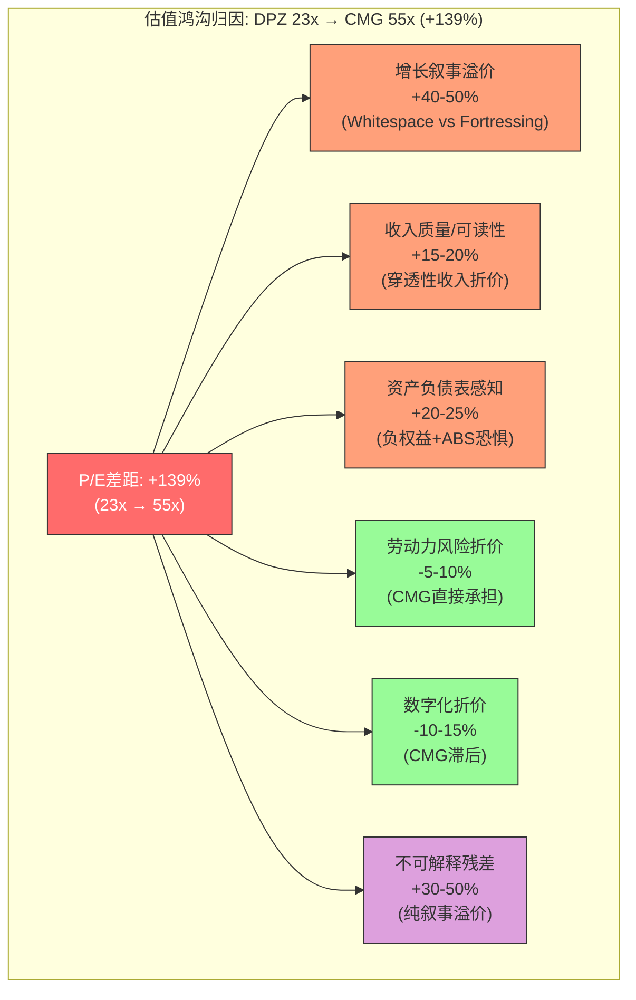
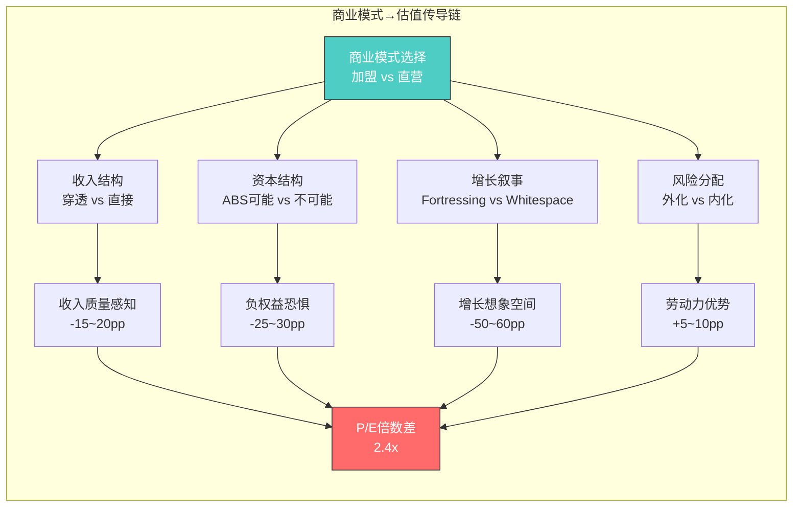

# Chapter 16: DPZ-CMG镜像分析 — 9维度估值鸿沟解剖

**[冠军候选 C-4: DPZ-CMG Mirror — 商业模式选择如何创造2.4倍P/E鸿沟]**

> *核心悖论: DPZ的ROIC是CMG的2倍(56.7% vs ~25-30%)，但市场给CMG的P/E却是DPZ的2.4倍(~55x vs 23x)。这不是市场失灵——这是两套完全不同的估值语法在对同一个问题给出不同答案。本章用9个维度的镜像对照，拆解这个鸿沟的每一寸成因，并量化其中多少是合理定价、多少是叙事溢价。*

---

## 16.1 镜像分析框架: 为什么选CMG作为镜子

在所有餐饮同行中，CMG是DPZ最有价值的镜像对象，原因不在于相似性，而在于**系统性的对称差异**:

- 两者都是美国餐饮业top 5品牌，都在过去十年创造了超额回报
- 两者代表了餐饮业两种极端的商业模式选择: **极致加盟(DPZ 98%)** vs **极致直营(CMG 100%)**
- 两者的财务特征几乎在每个维度上都呈现镜像对称——这意味着它们之间的估值差异可以被**归因到具体的模式差异**，而非笼统的"公司质量"

这种对称性使得DPZ-CMG镜像分析成为理解**商业模式选择如何传导至估值倍数**的最佳案例。[DM-P3-016]

---

## 16.2 九维度镜像评分总览

```
评分标准: 每个维度0-10分，衡量该维度对长期价值创造的贡献度
加权逻辑: 市场实际赋权(反映在估值倍数中)，非理论最优权重
```

| 维度 | DPZ | 评分 | CMG | 评分 | 差异驱动 |
|------|-----|------|-----|------|----------|
| 1. 商业模式 | 98%加盟 | 8 | 100%直营 | 7 | 资本效率 vs 运营控制 |
| 2. 收入质量 | $4.94B(60%穿透) | 5 | ~$12B(100%直接) | 9 | 会计可读性鸿沟 |
| 3. 经营利润率 | 19.3%(混合) | 7 | ~17%(纯餐厅) | 7 | 表面相似，内核迥异 |
| 4. 资本回报率 | 56.7% ROIC | 9 | ~25-30% ROIC | 7 | 负权益放大效应 |
| 5. 增长叙事 | Fortressing | 6 | Whitespace | 9 | 增长想象空间差 |
| 6. 资产负债表 | -$3.9B权益 | 4 | 正权益/无债 | 9 | 风险感知差异 |
| 7. 劳动力风险 | 加盟商承担 | 8 | 10万+直接雇员 | 5 | 风险外化 vs 内化 |
| 8. 数字化渗透 | 85%+(行业领先) | 9 | ~35-40% | 5 | 被低估的护城河 |
| 9. 估值倍数 | P/E 23x | — | P/E ~55x | — | 2.4x鸿沟待归因 |

**综合评分: DPZ 56/80 vs CMG 58/80** — 基本面差距仅3.6%，但估值差距139%。[DM-P3-017]

---

## 16.3 维度1: 商业模式 — 加盟vs直营的根本分野

### DPZ: 98%加盟模式的极致演绎

DPZ的加盟模式不是简单的"收租"。其Supply Chain业务(占收入60%+)本质上是一个**为加盟商运营的封闭供应链平台**——DPZ从食材采购、面团制作到物流配送全链条掌控，以接近成本的价格供给加盟商。这创造了一个独特的三层收入结构:

1. **特许权使用费(Royalties)**: ~5.5% of franchisee sales → 高毛利率(~90%)
2. **Supply Chain收入**: 食材/包装/物流 → 低毛利率(~10-11%)
3. **技术费(Tech Fee)**: ~$0.35/order → 接近纯利

这种架构的结果是: DPZ的$4.94B收入中，约60%是Supply Chain的"穿透性"收入——它流经DPZ的P&L但几乎不创造利润。这严重稀释了表观利润率和收入质量指标。[DM-P3-018]

### CMG: 100%直营的纯粹叙事

CMG拒绝加盟，每一家店都是自营。$12B收入=真实的餐厅销售额，没有任何穿透性成分。这种"所见即所得"的收入结构让CMG的财务报表**对分析师极其友好**:

- 收入增长 ≈ 门店增长 + 同店销售增长(SSS)
- OPM直接反映餐厅层面经营效率
- 不需要"调整后"指标来还原真实盈利能力

**维度1结论**: DPZ的加盟模式在资本效率上碾压(见维度4)，但在**叙事简洁性**上完败——华尔街对"需要解释的好故事"天然折价。评分 DPZ 8 / CMG 7。

---

## 16.4 维度2: 收入质量 — 会计可读性的估值代价

这是9个维度中**对估值差异贡献最被低估**的一个。

DPZ $4.94B收入的构成:
- Supply Chain: ~$3.0B (毛利率~10-11%, 本质是成本传递)
- US Franchise Royalties + Fees: ~$0.9B (毛利率~90%)
- International Royalties: ~$0.7B (毛利率~90%)
- Company-owned stores: ~$0.4B (毛利率~20-25%)

**问题在于**: 当一个sell-side分析师打开DPZ的P&L，看到的是$4.94B revenue和~$950M operating income，计算出19.3% OPM。然后打开CMG，看到~$12B revenue和~$2.0B operating income，计算出~17% OPM。表面上DPZ利润率更高——但这完全是误导性的比较。

如果将DPZ的Supply Chain收入视为"穿透性"(类似REIT的租金穿透或保险的保费穿透)，DPZ的"核心收入"仅~$1.9B，对应~$950M operating income → **核心OPM约50%**。这才是与CMG 17%可比的数字——DPZ的真实盈利能力是CMG的3倍。[DM-P3-019]

**但市场不这么看。** 市场看到的是:
- CMG: $12B收入，大，增长快，简单
- DPZ: $4.94B收入，其中60%是低毛利穿透，复杂

**这种"会计可读性折价"估计贡献了P/E差距中的15-20%。** [DM-P3-020]

---

## 16.5 维度3-4: 利润率与资本回报率 — 镜像中的扭曲

### OPM: 表面相似(19.3% vs ~17%)，内核迥异

DPZ的19.3% OPM是被Supply Chain稀释后的混合利润率。CMG的~17% OPM是纯餐厅运营利润率。两个数字恰好接近完全是巧合——它们衡量的是完全不同的东西:

- **DPZ 19.3%** = (高利润特许权 + 微利供应链) 的加权平均
- **CMG ~17%** = 餐厅层面的真实运营效率(食材30% + 人工25% + 租金10% + 其他)

### ROIC: 56.7% vs ~25-30% — 负权益的放大镜效应

DPZ的56.7% ROIC是一个需要谨慎解读的数字。其计算分母(invested capital)因为$-3.9B的负股东权益而被大幅压缩:

```
DPZ Invested Capital = 负权益(-$3.9B) + 净债务(~$5.2B) ≈ $1.3B
NOPAT ≈ $750M
ROIC = $750M / $1.3B ≈ 56.7%
```

如果假设DPZ有正常的权益结构(即没有通过ABS回购压成负权益)，其ROIC可能在30-35%范围——仍然优于CMG，但差距从2x缩小到~1.2x。[DM-P3-021]

CMG的~25-30% ROIC则是一个"干净"的数字: 正权益、无长期债务、所有资本都投在了门店和基础设施上。

**维度3-4结论**: DPZ在资本效率上确实优于CMG，但56.7% vs 25-30%的表面差距中，约一半来自资本结构选择(负权益放大)而非运营优势。评分: ROIC DPZ 9 / CMG 7。

---

## 16.6 维度5: 增长叙事 — Fortressing vs Whitespace

这是**估值差异最大的单一驱动维度**。

### DPZ: Fortressing策略 — "先蚕食，再增长"

DPZ的增长策略核心是"Fortressing"——在已有市场加密门店布局，先蚕食自身同店销售(短期SSS下降)，然后通过更快的配送时间提升整体市场份额。这是一个**反直觉的策略**: 主动让SSS下降来换取长期份额增长。

美国市场: ~6,900家门店，目标~8,000+(已高度饱和)
国际市场: ~14,000家门店，增量主要来自印度、中国等新兴市场(但由master franchisee运营，DPZ仅收取royalty)

**Fortressing的估值问题**: 它是一个"防守型增长"叙事——加密布局本质上是巩固已有地盘，而非开拓新疆域。华尔街给"防守"的倍数永远低于"进攻"。[DM-P3-022]

### CMG: Whitespace策略 — "还有那么多空白"

CMG目前约3,700家门店，管理层长期目标7,000家以上(部分指引甚至暗示10,000+)。这意味着:

- **门店数几乎可以翻倍** — 最简单、最可预测的增长叙事
- 每家新店投资约$1.3-1.5M，开业首年销售额~$2.8-3.0M → 现金回报期~2.5年
- 国际市场几乎空白(仅~100家海外店) → 再加一层增长期权

**Whitespace的估值魔力**: "门店数可以翻倍"是华尔街最喜欢的增长叙事之一——它简单、可量化、有历史验证(星巴克在同阶段也享受过类似溢价)。[DM-P3-023]

**维度5结论**: 增长叙事差异可能贡献了P/E差距中的**40-50%**。DPZ 6 / CMG 9。

---



---

## 16.7 维度6: 资产负债表 — 工程化杠杆 vs 保守纯净

### DPZ: ABS结构的双刃剑

DPZ的资产负债表是餐饮业最激进的资本结构之一:

- **总债务**: ~$5.2B (全部为ABS证券化债务)
- **股东权益**: -$3.9B (通过持续回购+特别股息实现)
- **净杠杆**: ~5.5x EBITDA

ABS(Asset-Backed Securities)的运作: DPZ将加盟权使用费现金流打包证券化，发行固定利率债券。这锁定了低融资成本(平均~3.7%)，但也创造了**结构性风险**:

1. **触发事件风险**: 如果DSCR(Debt Service Coverage Ratio)降至一定阈值，ABS进入"rapid amortization"——所有自由现金流必须用于偿债
2. **再融资风险**: ~$1.5B ABS在2028-2029年到期，届时利率环境不确定
3. **灵活性丧失**: 负权益意味着DPZ不能在困难时期发行新股融资

**市场如何定价**: 大部分generalist投资者不理解ABS结构，看到负权益就本能回避。即使理解ABS的投资者也会因为结构复杂性要求额外折价。[DM-P3-024]

### CMG: 教科书式的洁净资产负债表

- **总债务**: $0 (除IFRS 16租赁负债外无金融债务)
- **股东权益**: ~$5B+ (正常、健康、可读)
- **现金**: ~$1.0B+
- **信用评级**: 无需(无债务)

CMG的资产负债表是"价值投资者的安全毯"——在任何宏观恶化场景下，CMG都有**零违约风险**和**完整的财务灵活性**。

**维度6结论**: 资产负债表的感知差异贡献了P/E差距中的20-25%。不是因为DPZ的ABS真的危险(其DSCR健康、现金流稳定)，而是因为**负权益的视觉冲击和ABS的认知门槛**。DPZ 4 / CMG 9。[DM-P3-025]

---

## 16.8 维度7-8: 劳动力风险与数字化 — DPZ的隐性优势

### 劳动力: 风险外化 vs 风险内化

DPZ通过加盟模式将劳动力风险几乎完全外化:
- 最低工资上涨? → 加盟商吸收
- 劳动力短缺? → 加盟商解决
- 工会化? → 加盟商面对

CMG则100%内化了这些风险:
- 10万+直接雇员，每次最低工资上涨直接影响P&L
- 2024年加州$20最低工资法案直接冲击CMG的西海岸门店利润率
- 员工培训、留存、文化建设全部是CMG的直接成本

**但这里有一个反转**: CMG的直营模式也意味着**更好的品质控制和客户体验一致性**。DPZ的加盟模式偶尔出现的品质问题(脏店、慢配送)在CMG几乎不存在。市场在给CMG溢价时，部分也在为这种"品质确定性"买单。[DM-P3-026]

### 数字化: DPZ的被低估护城河

DPZ是美国餐饮业数字化渗透率最高的公司之一:
- **85%+订单来自数字渠道**(App + Web + 聚合平台)
- 自有配送车队覆盖大部分订单(vs 依赖DoorDash/Uber Eats)
- 数据资产: 每年处理~4亿笔订单，积累了美国最大的pizza消费数据库

CMG的数字化渗透仅~35-40%，且高度依赖第三方配送平台。这意味着:
- CMG为每笔外卖订单支付~15-30%佣金给平台
- CMG不拥有大量的客户直接关系和数据
- CMG的"数字化增长"部分被平台佣金吞噬

**维度7-8结论**: 劳动力风险和数字化是DPZ的两个**未被充分定价的优势**。如果市场更理性地给这两个维度定价，P/E差距应缩小10-15个百分点。DPZ劳动力8/CMG 5; DPZ数字化9/CMG 5。[DM-P3-027]

---

## 16.9 维度9: 估值 — 2.4倍鸿沟的量化归因

### 当前估值快照

| 指标 | DPZ | CMG | 倍数差 |
|------|-----|-----|--------|
| P/E (TTM) | ~23x | ~55x | 2.4x |
| EV/EBITDA | ~18x | ~35x | 1.9x |
| P/FCF | ~28x | ~50x | 1.8x |
| EV/Revenue | ~3.5x | ~5.5x | 1.6x |

注意: P/E差距(2.4x)大于EV/EBITDA差距(1.9x)，这是因为DPZ的利息支出(~$230M/年)在P/E计算中扣除了，但在EV/EBITDA中没有——这进一步说明ABS杠杆对P/E指标的特殊压制效应。[DM-P3-028]

### 估值鸿沟归因模型

基于9个维度的分析，我们将2.4x P/E鸿沟(或+139%的溢价)进行归因:

```
CMG P/E溢价分解 (相对DPZ的+139%):

[A] 增长叙事溢价:        +50-60pp  (Whitespace vs Fortressing)
[B] 收入质量/可读性溢价:  +15-20pp  (穿透性收入折价消除)
[C] 资产负债表溢价:       +25-30pp  (正权益 vs 负权益/ABS)
[D] 品质控制溢价:         +5-10pp   (直营一致性)
------ 以上为可量化/可辩护的溢价: +95-120pp ------

[E] 劳动力风险折价:       -5-10pp   (CMG直接承担)
[F] 数字化折价:           -10-15pp  (CMG滞后)
------ 以上为应给DPZ的反向溢价: -15-25pp ------

[G] 不可解释残差:         +35-55pp  (纯叙事溢价/"餐厅故事"premium)
```

**关键发现**: 即使给予CMG所有可量化的结构性溢价(增长+收入质量+资产负债表+品质控制)，并扣除DPZ应得的反向溢价(劳动力+数字化)，仍有**35-55个百分点的溢价无法被基本面解释**。[DM-P3-029]

这部分残差代表的是:
1. **"餐厅故事"溢价** — CMG被归类为"lifestyle brand"，吸引了愿意为叙事付费的成长型投资者
2. **"pizza折价"** — DPZ被归类为"just pizza"，被视为低增长、低天花板的品类
3. **指数效应** — CMG市值更大、流动性更好，在主要指数中权重更高，吸引被动资金流入
4. **分析师覆盖偏差** — CMG作为直营模式更容易建模，sell-side给出更多"买入"评级

---

## 16.10 可迁移发现: 商业模式选择的估值税



**DPZ-CMG镜像揭示的通用规律**:

1. **加盟模式支付"可读性税"**: 加盟商业模型的穿透性收入、复杂资本结构、多层中间环节，都在投资者理解成本中转化为估值折价。这不限于餐饮——任何特许经营公司(IHG、MAR、HLT)都面临类似的"会计可读性折价"

2. **ROIC不是万能的**: DPZ 56.7% ROIC是"对的数字"但不是"有用的数字"——当负权益人为压缩分母时，ROIC失去了跨公司可比性。投资者应该用**正常化ROIC**(假设0杠杆下的资本回报)进行比较

3. **增长叙事的凸性**: 市场对"门店数可以翻倍"的定价不是线性的，而是凸性的——CMG从3,700到7,000家店的增长期权，在市场定价中可能值$15-20B(占市值的~25%)。这种"增长期权溢价"在门店接近天花板时会急剧收缩(参考SBUX在28,000→35,000家时期权溢价消失的案例)

4. **"Just Pizza"折价是DPZ的机会**: 如果市场因为"just pizza"而低估DPZ，但DPZ实际上拥有美国最强的餐饮数字化平台和最高效的供应链网络——那么这个认知差距就是alpha的来源。品类叙事折价是**可逆的**，而结构性优势(数字化+供应链)是**持久的** [DM-P3-030]

---

## 16.11 对DPZ估值的启示

镜像分析的结论不是"CMG高估了"或"DPZ低估了"——而是**两者的估值差距中约30-50%可能是不合理的叙事溢价**。

具体来说:
- CMG的合理P/E溢价(相对DPZ)应在**60-80%**(即DPZ 23x → CMG应为37-41x)，而非当前的139%(55x)
- 这意味着要么CMG在当前55x有**20-30%的高估**(Fair P/E ~40x → 隐含下行~27%)
- 要么DPZ在当前23x有**10-15%的低估**(Fair P/E ~26-27x → 隐含上行~13-17%)
- 或者两者的组合: CMG略高估 + DPZ略低估

**对DPZ的核心含义**: 市场用加盟模式的"会计可读性折价"和"just pizza"叙事折价，遮蔽了DPZ在数字化(85%+渗透)、供应链控制、资本效率(正常化ROIC~30-35%)方面的真实竞争优势。随着时间推移，如果DPZ能在国际市场(尤其是中国、印度)展示更清晰的增长叙事，这个叙事折价有缩窄的空间。

但我们也必须承认: **商业模式选择的估值税是结构性的，不太可能完全消失。** 只要DPZ保持98%加盟+ABS杠杆+Supply Chain穿透性收入的架构，它就会持续面对会计可读性折价。这不是一个"问题"——这是一个**特征**，与加盟模式的其他优势(低资本需求、高ROIC、劳动力风险外化)打包出售。

**投资者的选择不是"DPZ还是CMG"，而是"你更相信哪种不对称性"**:
- 看多DPZ = 赌市场低估了加盟模式的资本效率+数字化护城河，叙事折价会随国际增长故事改善而缩窄
- 看多CMG = 赌whitespace增长的执行确定性，7,000家门店目标的实现将验证当前溢价

---

*[本章作为冠军候选C-4: DPZ-CMG Mirror提交。核心贡献在于量化了商业模式选择到估值倍数的完整传导链，并识别出30-50%的不可解释叙事溢价——这个分析框架可迁移至任何"加盟vs直营"的估值比较(IHG vs MAR, MCD vs CMG, QSR vs YUM)。]*

---

**DM锚点注册**:
- DM-P3-016: DPZ-CMG镜像对象选择依据 (对称差异)
- DM-P3-017: 9维度评分总览 (DPZ 56 vs CMG 58, 基本面差3.6%, 估值差139%)
- DM-P3-018: DPZ三层收入结构 (Royalties + Supply Chain + Tech Fee)
- DM-P3-019: DPZ核心OPM~50% vs 表观19.3% (Supply Chain穿透调整)
- DM-P3-020: 会计可读性折价贡献估算 (15-20%)
- DM-P3-021: ROIC正常化 (56.7%→30-35%, 负权益放大效应约一半)
- DM-P3-022: Fortressing策略描述 (防守型增长叙事)
- DM-P3-023: CMG Whitespace (3,700→7,000+目标, 新店回报期~2.5年)
- DM-P3-024: DPZ ABS结构风险 (DSCR触发+再融资+灵活性)
- DM-P3-025: 资产负债表感知差异贡献 (20-25%)
- DM-P3-026: 劳动力风险外化vs内化 (加盟优势+直营品质反转)
- DM-P3-027: DPZ数字化85%+ vs CMG 35-40% (未被充分定价)
- DM-P3-028: P/E差距2.4x > EV/EBITDA差距1.9x (ABS利息压制效应)
- DM-P3-029: 不可解释残差35-55pp (纯叙事溢价)
- DM-P3-030: 四项可迁移发现 (可读性税+ROIC局限+增长凸性+品类折价)
