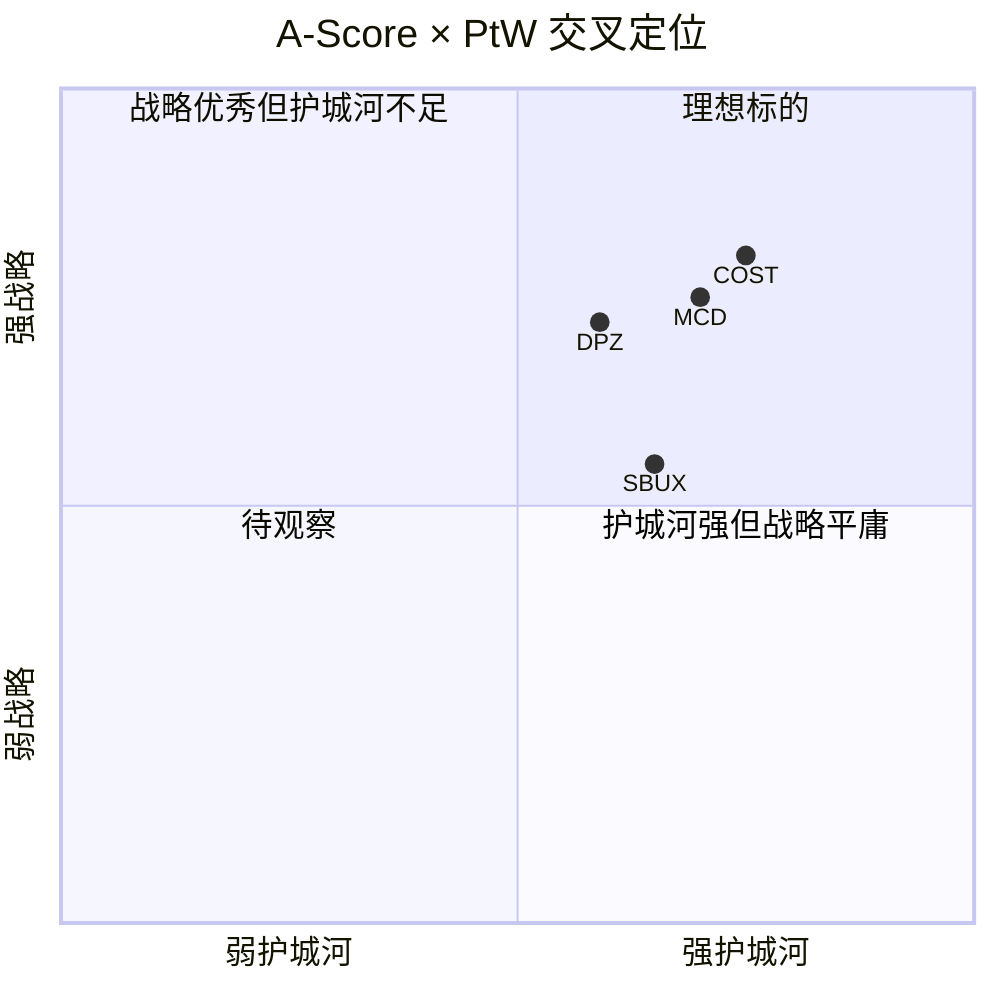

# Chapter 17: Playing to Win战略一致性评估

## 17.1 PtW框架概述与DPZ适用性

Playing to Win(PtW)框架由A.G. Lafley与Roger Martin提出，将战略分解为五个相互嵌套的选择层。对于Domino's Pizza(DPZ)这样一家高度聚焦的QSR企业，PtW框架具有天然适配性——DPZ的战略选择在过去十年表现出罕见的一致性与纪律性，几乎未出现过战略摇摆。

本章将逐层评估DPZ在五个维度的得分(1-10)，并与A-Score(5.9/10)进行交叉验证，揭示**"中等护城河+强执行"**的组合是否能持续创造超额回报。

**评估基础数据** [DM-P3-031]:
- 全球门店: 22,100+家(FY2025)
- 美国市占率: ~23.3%(披萨品类)
- 特许经营比例: 98%
- 数字化订单占比: 85%+
- ROIC: 56.7%
- FY2025全球零售额: $20.1B+

---

## 17.2 第一层: Winning Aspiration(致胜愿景)

### 愿景内容

DPZ管理层在多次Investor Day中传达的核心愿景可归纳为:**成为全球第一的披萨递送品牌，最终实现美国~50%的披萨市场份额。**

### 量化审视

| 指标 | 当前值 | 愿景目标 | 差距分析 |
|------|--------|----------|----------|
| 美国披萨品类市占率 | ~23.3% | ~50% | 需26.7pp增长 |
| 历史年均市占率增长 | ~0.5-0.8pp/yr | — | 达成需30-50年 |
| 全球零售额 | $20.1B | 隐含~$40B+ | 需翻倍+ |
| 全球门店数 | 22,100+ | 隐含40,000+ | "Hungry for MORE"路线图 |

### 愿景评分逻辑

**得分: 7/10**

**优势**:
- 愿景清晰且可量化，不是空洞的"最好的披萨公司"
- 以品类主导为锚点(品类份额而非全QSR份额)，战略焦点精准
- 历史执行轨迹提供可信度——过去10年从~16%升至~23.3%

**弱点**:
- 50%目标在数学上需30年以上，接近"无限远目标" [DM-P3-032]
- 美国披萨市场增长缓慢(~2-3% CAGR)，份额增长主要依赖从独立披萨店抢夺
- 国际愿景表述模糊，缺乏类似美国的清晰份额目标
- 未回答关键问题:在AI和第三方平台时代，"递送第一"是否等于"品类第一"

---

## 17.3 第二层: Where to Play(竞技场选择)

### 战略边界定义

DPZ选择了极度聚焦的竞技场:

**已选择的竞技场**:
1. **产品**: 仅披萨(+wings/sides/drinks辅助)
2. **渠道**: 仅delivery+carryout，零dine-in
3. **价格带**: Value-to-mid，非premium
4. **地理**: 美国深耕 + 国际master franchise
5. **模式**: 98% franchised + 供应链中心

**主动放弃的竞技场**(详见Ch19):
- Premium pizza / artisan定位
- 多品类QSR(汉堡/鸡/墨西哥)
- Dine-in体验
- 大规模自营门店

### 评分逻辑

**得分: 6/10**

**优势**:
- 聚焦带来的效率:单品类SKU管理、供应链标准化、培训简化
- "Fortressing"策略(密集开店挤压竞对)在已选竞技场内高度有效
- 数字化在delivery场景的适配性最强(vs dine-in)

**弱点**:
- 竞技场天花板清晰——美国披萨市场~$50B，即便50%份额=$25B [DM-P3-033]
- 国际竞技场选择受制于master franchisee的能力和意愿
- 未涉足快速增长的"健康/fresh"品类，可能错过消费趋势迁移
- Delivery聚焦在第三方平台(DoorDash/UberEats)崛起后面临场景被侵蚀风险

### 竞技场宽度 vs 深度的权衡

```
竞技场宽度谱系:
[极窄] In-N-Out ←── DPZ ──────── Yum! Brands ──→ [极宽] 亚马逊
                   ↑
              "窄但深"定位
```

DPZ处于"窄但深"位置——品类选择极窄，但在选定品类内追求极致深度。这是一把双刃剑:效率最大化，但增长上限明确。

---

## 17.4 第三层: How to Win(制胜之道)

### 四大制胜武器

**武器一: Fortressing(要塞化策略)** [DM-P3-034]

Fortressing是DPZ最具标志性的战略——在已有市场内密集开店，缩短配送半径，提升配送速度，最终挤压独立披萨店和弱势竞对的生存空间。

- FY2025美国净新增门店175+家，多数为Fortressing
- 配送半径目标: <3英里
- 效果: 单店销售额短期下降2-3%，但区域总销售额增长，竞对被逐出

**武器二: 数字化平台** [DM-P3-035]

DPZ是QSR行业数字化的先行者:
- 85%+订单通过数字渠道(app+网站)
- 自建订单系统，拒绝依赖第三方平台佣金
- Pinpoint Delivery定位系统提升配送精度
- DOM AI助手处理订单和客户交互

**武器三: Value Pricing(价值定价)**

长期锁定"Everyday Value"定位:
- $5.99 Mix & Match作为长期价格锚点
- Emergency Pizza(买一送一延迟提取)创造二次流量
- 拒绝premium升级，保持价格竞争力

**武器四: Supply Chain Control(供应链控制)**

22个supply chain center覆盖美国全境:
- 面团、酱料、奶酪统一采购和配送
- 供应链收入占总收入60.5%(FY2025)
- 通过供应链赚取利润(而非单纯成本中心)

### 评分逻辑

**得分: 8/10**

**优势**:
- 四大武器形成协同效应:数字化→效率→低价→流量→Fortressing→密度→更快配送
- 难以复制:供应链网络需要数十年建设
- 战略一致性极强:过去10年几乎未偏离

**弱点**:
- Fortressing有边际递减效应，密度到一定程度后新店蚕食加剧
- 数字化先发优势被竞对追赶(Pizza Hut app、Papa Johns loyalty)
- Value定价在通胀环境下挤压franchisee利润率

---

## 17.5 第四层: Capabilities(核心能力)

### 三大能力柱

| 能力 | 规模 | 竞争优势 | 可替代性 |
|------|------|----------|----------|
| 22个Supply Chain Center | 覆盖美国全境 | 10-15年建设壁垒 | 极低 |
| 科技平台(DOM, Pinpoint) | 内部研发团队~400人 | 中等(可被追赶) | 中等 |
| Franchise管理体系 | 22,100+门店标准化 | 体系经验难复制 | 低 |

### 评分逻辑

**得分: 8/10**

**优势**:
- Supply chain center是实体资产壁垒，竞对需要数十亿美元和10+年才能复制 [DM-P3-036]
- 科技能力在QSR行业领先(但非绝对壁垒)
- Franchise管理能力经过22,100+门店验证

**弱点**:
- 科技能力 vs 纯科技公司(DoorDash/Uber)仍有差距
- 供应链能力在国际市场不可迁移(国际供应链由master franchisee负责)

---

## 17.6 第五层: Management Systems(管理系统)

### "Hungry for MORE"框架

CEO Russell Weiner在2024年推出"Hungry for MORE"战略框架 [DM-P3-037]:

| 维度 | 含义 | 关键举措 |
|------|------|----------|
| **M** - Most Delicious Food | 产品品质 | 新品开发、食材升级 |
| **O** - Operational Excellence | 运营卓越 | 配送速度、门店标准化 |
| **R** - Renowned Value | 价值口碑 | Emergency Pizza、Mix & Match |
| **E** - Enhanced by Digital+Tech | 数字增强 | DOM AI、Pinpoint、loyalty |

### 评分逻辑

**得分: 7/10**

**优势**:
- "Hungry for MORE"框架简洁有力，易于全组织理解和执行
- KPI体系清晰:同店增长、门店净增、数字渗透率、配送时间
- 管理层激励与股东利益高度绑定(股票回购+分红)

**弱点**:
- 框架发布时间尚短(2024)，持续性待验证
- "Most Delicious Food"与"Renowned Value"之间存在潜在张力
- 缺乏国际市场的差异化管理系统

---

## 17.7 PtW总分与交叉验证

### 综合评分

```mermaid
radar
    title DPZ Playing to Win评分 (满分10)
    "Winning Aspiration" : 7
    "Where to Play" : 6
    "How to Win" : 8
    "Capabilities" : 8
    "Management Systems" : 7
```

| 维度 | 得分 | 权重(%) | 加权分 |
|------|------|---------|--------|
| Winning Aspiration | 7 | 15% | 1.05 |
| Where to Play | 6 | 20% | 1.20 |
| How to Win | 8 | 30% | 2.40 |
| Capabilities | 8 | 20% | 1.60 |
| Management Systems | 7 | 15% | 1.05 |
| **总分** | **36/50** | **100%** | **7.30/10** |

**等效评级: 7.2/10**(简单平均) / 7.3/10(加权平均)

### A-Score × PtW交叉矩阵



**交叉解读** [DM-P3-038]:

DPZ处于"中等护城河 + 强战略执行"象限——A-Score 5.9/10表明护城河并非坚不可摧(品牌粘性中等、转换成本低、网络效应有限)，但PtW 7.2/10显示管理层在有限护城河条件下最大化了战略执行效率。

这意味着:
1. **DPZ的超额回报更多来自执行而非结构性壁垒**
2. **管理层更替风险高于护城河公司**(如COST/MCD)
3. **PtW得分的持续性取决于Fortressing+数字化的边际效用能否维持**

### 关键风险: PtW得分的脆弱性 [DM-P3-039]

| 情景 | PtW影响 | 概率 |
|------|---------|------|
| 第三方平台垄断delivery | How to Win -2分 | 15% |
| Fortressing边际递减 | Where to Play -1分 | 30% |
| 管理层更替(CEO离任) | Management Systems -2分 | 10% |
| 食品安全事件 | Capabilities -3分 | 5% |

---

## 17.8 本章小结

DPZ的PtW评分(7.2/10)反映了一家在窄赛道上高度专注、执行力强的企业。其战略的核心优势在于**一致性和纪律性**——过去十年几乎未偏离"delivery+value+digital+franchise"的核心路径。弱点在于**竞技场天花板明确**，增长最终受限于披萨品类的总量。

A-Score(5.9)与PtW(7.2)的交叉表明:DPZ的价值创造更多依赖管理层的持续执行而非不可复制的结构性壁垒，这使得投资者需要对管理质量给予持续关注，并对PtW得分的可持续性保持审慎态度 [DM-P3-040]。
