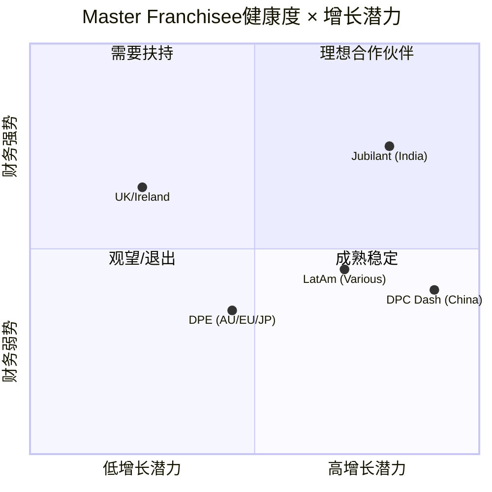
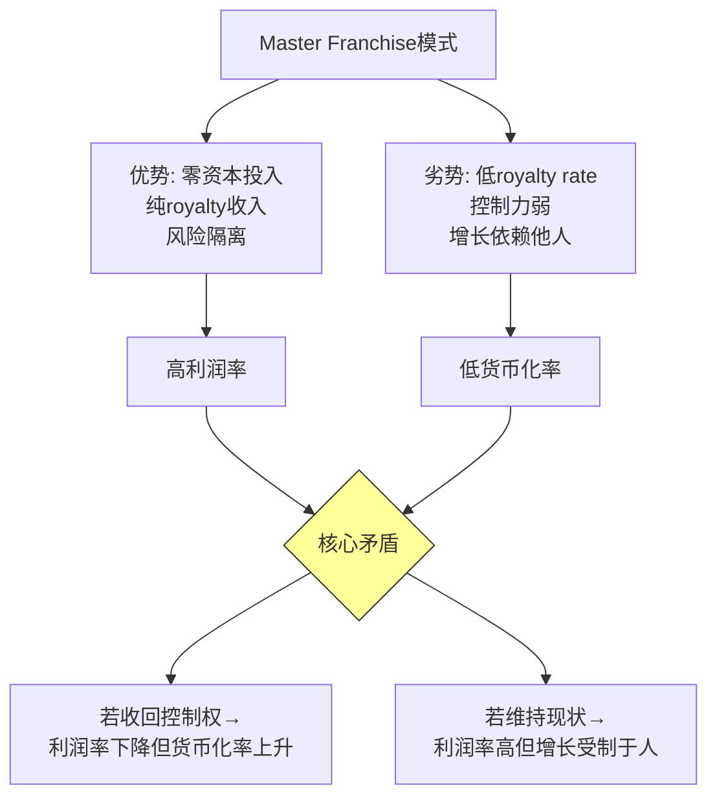

# Chapter 18: 国际Master Franchise健康度评估 (CQ-5)

## 18.1 DPZ国际业务架构概述

Domino's Pizza的国际业务采用**Master Franchise模式**——将特定国家/地区的品牌经营权授予独立上市或私有的master franchisee，由其负责该市场的门店发展、供应链建设和日常运营。DPZ从中收取**royalty fee(特许权使用费)**，形成高利润率、低资本密度的收入来源。

**国际业务基础数据** [DM-P3-041]:

| 指标 | FY2025数据 |
|------|-----------|
| 国际门店总数 | ~14,000+家 |
| 覆盖市场 | 90+个国家/地区 |
| 国际同店增长连续年数 | 32年(截至FY2025) |
| FY2025国际净增门店 | +604家(Q4 +296) |
| FY2026E国际净增门店指引 | ~800家 |
| 国际royalty rate | ~3.0-3.5%(vs 美国5.5%) |
| 国际收入占DPZ总收入 | ~12% |
| 国际利润占DPZ总利润 | ~15-18%(估算) |

**关键洞察**: 国际业务以**12%的收入贡献了~15-18%的利润**，利润率显著高于美国供应链业务(低毛利)。但royalty rate(3-3.5%)远低于美国(5.5%)，存在**货币化率提升空间**。

---

## 18.2 核心Master Franchisee画像

### 18.2.1 Domino's Pizza Enterprises (DMP.AX) — 最大国际合作伙伴

**公司概况** [DM-P3-042]:
- ASX上市(代码: DMP)，总部位于澳大利亚布里斯班
- 覆盖市场: 澳大利亚、新西兰、法国、比利时、荷兰、德国、卢森堡、日本、台湾、马来西亚、新加坡、柬埔寨
- 门店网络: ~3,800+家
- 地位: DPZ体系外最大的单一master franchisee

**财务健康度评估**:

| 指标 | 1H FY26 (2025.7-12) | 趋势 |
|------|---------------------|------|
| Underlying EBIT | A$101.5M (+1.0% YoY) | 触底回稳 |
| EBITDA/Store (滚动12月) | A$103K (vs FY25 A$98.6K) | 改善中 |
| 同店增长 | 负值(压力持续) | 恶化 |
| 网络策略 | 收缩式优化(净关店) | 重组期 |
| 成本节约目标 | A$20-30M年化 | 执行中 |
| 派息 | 25.0 cps (+16.3% HoH) | 信心恢复信号 |
| 股价 | ~A$22.20(距峰值-65%+) | 深度回调 |
| 市值 | ~A$2.1B | 历史低位区间 |

**DPE面临的核心挑战** [DM-P3-043]:

1. **欧洲市场消化不良**: 德国/法国市场渗透率低于预期，前期激进扩张导致单店经济模型恶化
2. **日本市场人口逆风**: 人口下降+消费疲软，限制增长天花板
3. **管理层换血**: 近年经历CEO更替，新战略("Hungry to Grow")仍在验证期
4. **汇率影响**: A$计价报表受多币种波动影响(EUR/JPY/MYR)

**对DPZ的影响评估**:
- DPE贡献DPZ国际royalty的约25-30%(估算)
- DPE的门店收缩直接拖累DPZ国际门店净增数据
- FY2026 DPZ国际同店增长指引仅1-2%，部分因DPE拖累
- **但**: DPE困境不影响DPZ资产负债表(royalty模式=零运营风险转移)

### 18.2.2 Jubilant FoodWorks (JUBLFOOD.NS) — 印度市场冠军

**公司概况** [DM-P3-044]:
- NSE/BSE上市(印度)，Jubilant Bhartia集团旗下
- 覆盖市场: 印度(核心)、土耳其、孟加拉
- Domino's India门店: 2,396家(截至2025年12月)
- 集团总门店: 3,594家(含Popeyes, Dunkin'等)
- 地位: 印度第一大QSR品牌

**财务健康度评估**:

| 指标 | Q3 FY26 (2025.10-12) | 趋势 |
|------|----------------------|------|
| 合并收入 | Rs 24,372M (+13.3% YoY) | 强劲 |
| 净利润 | +93.9% YoY | 大幅改善 |
| Q2 FY26收入 | Rs 23,402M (+19.7% YoY) | 加速 |
| Domino's India门店 | 2,396家 | 扩张中 |
| 目标 | 3年新增900家门店 | 激进 |
| 年增长目标 | 15% revenue growth | 高增长 |
| Loyalty会员 | 40M+ | 数字化深度 |
| 月活用户(app) | 15M | 行业领先 |

**Jubilant的增长引擎** [DM-P3-045]:

1. **印度渗透率极低**: 14亿人口 vs 2,396家门店 = ~58万人/店，远高于美国(~4.2万人/店)
2. **首个覆盖500城的QSR品牌**: 下沉市场战略验证
3. **数字化领先**: 40M loyalty会员 + 15M月活 = 行业最强数字资产
4. **广告变现**: App内广告平台开始贡献增量收入

**风险因素**:
- 土耳其市场地缘政治+汇率风险(里拉持续贬值)
- 印度市场竞争加剧(Pizza Hut反击、本土品牌La Pino'z崛起)
- 加盟商利润率在食材通胀下承压
- 3年900家新店目标可能导致单店经济模型稀释

**对DPZ的影响评估**:
- Jubilant是DPZ增长最快的国际合作伙伴
- 印度市场的长期whitespace巨大(理论承载力5,000-8,000家)
- Royalty贡献持续增长，但受制于INR/USD汇率
- **关键**: 如果印度能复制中国的QSR渗透路径，Jubilant可能在10年内成为DPZ最大的国际royalty来源

---

## 18.3 其他重要国际市场

### 18.3.1 中国市场(达势股份/Dash Brands)

**关键数据** [DM-P3-046]:
- 运营商: 达势股份(DPC Dash, HK: 1405)
- 门店数: 快速扩张中(~1,000+家，FY2025)
- DPZ FY2026指引提到中国"高销量新店"对国际同店增长有短期稀释效应
- 增长潜力: 中国$70B+外卖市场，Pizza品类渗透率极低

**评估**: 中国是DPZ国际增长最大的optionality来源，但也是最大的不确定性——竞争(必胜客/本土品牌)、监管、消费者偏好差异均构成挑战。

### 18.3.2 英国/爱尔兰

- 直营+franchise混合模式(少数DPZ保留直接参与的市场)
- 成熟市场，增长稳定但有限
- 脱欧后供应链成本上升

### 18.3.3 拉丁美洲

- 多个小型master franchisee
- 巴西/墨西哥市场规模大但渗透率低
- 货币波动风险显著(BRL/MXN)
- 中长期whitespace可观

---

## 18.4 国际Master Franchise健康度综合评估

### 健康度评分矩阵

### 综合评分卡

| Master Franchisee | 财务健康 | 增长潜力 | 管理质量 | 对DPZ贡献 | 综合评分 |
|-------------------|----------|----------|----------|-----------|----------|
| DPE (AU/EU/JP) | 4/10 | 5/10 | 5/10 | 高(25-30%) | 4.7/10 |
| Jubilant (India) | 7/10 | 9/10 | 7/10 | 中(10-15%) | 7.7/10 |
| DPC Dash (China) | 5/10 | 9/10 | 6/10 | 低但增长快 | 6.7/10 |
| UK/Ireland | 7/10 | 3/10 | 7/10 | 中(10-15%) | 5.7/10 |
| LatAm (Various) | 5/10 | 7/10 | 5/10 | 低(5-8%) | 5.7/10 |
| **加权平均** | **5.4** | **6.5** | **6.0** | — | **5.9/10** |

---

## 18.5 Royalty Rate结构与货币化差距

### 费率对比 [DM-P3-047]

| 市场 | Royalty Rate | 对比基准 |
|------|-------------|----------|
| 美国 | 5.5% | 基准 |
| 国际(平均) | ~3.0-3.5% | 基准的55-64% |
| 国际(新合同趋势) | ~3.5-4.0% | 逐步提升中 |
| McDonald's国际 | ~4.0-5.0% | 行业标杆 |
| Yum! Brands国际 | ~6.0% | 行业最高区间 |

**货币化差距分析** [DM-P3-048]:

国际royalty rate(3-3.5%)显著低于美国(5.5%)和行业对标(MCD 4-5%, YUM 6%)。这一差距源于:

1. **历史定价**: 早期国际扩张时以低费率吸引master franchisee
2. **合同锁定**: Master franchise合同期限长(10-20年)，费率调整空间有限
3. **竞争对手定价压力**: 在某些市场需要与Pizza Hut/Papa Johns争夺franchisee
4. **价值交换不对等**: DPZ在国际市场提供的品牌+技术支持强度低于美国

**隐含价值**:
- 若国际royalty rate从3.25%提升至4.0%，每年增量收入约$75-100M [DM-P3-049]
- 纯利润率接近100%(royalty收入几乎无增量成本)
- 这是DPZ中期最清晰的利润增长杠杆之一
- 但实现路径受制于合同重签时间表和master franchisee谈判力

---

## 18.6 32年连续国际同店增长: 可持续性分析

### 历史记录的分解 [DM-P3-050]

DPZ国际业务创造了QSR行业罕见的32年连续同店增长记录(截至FY2025)。这一记录的驱动因素:

| 时期 | 主驱动力 | 同店增长率 |
|------|----------|-----------|
| 1993-2005 | 新兴市场渗透 | 高个位数 |
| 2005-2015 | 数字化转型 + 价值定位 | 中个位数 |
| 2015-2020 | Fortressing + app普及 | 低-中个位数 |
| 2020-2022 | 疫情期间delivery需求爆发 | 中-高个位数 |
| 2023-2025 | 正常化 + DPE拖累 | 低个位数(~1-3%) |

### 可持续性评估

**支撑因素**:
- 新兴市场(印度/中国/LatAm)仍处于早期渗透阶段
- 数字化投入持续提升客单价和复购率
- 门店密度增加带来的配送体验改善

**威胁因素**:
- 成熟市场(欧洲/日本/澳大利亚)已接近饱和
- 第三方平台在国际市场的渗透率高于美国(尤其欧洲)
- 本土竞争者适应性更强(印度的Zomato/Swiggy生态)
- DPE重组期可能打断连续增长记录

**预判**: 连续增长记录在FY2026可能面临风险——DPZ自身指引仅1-2%国际同店增长，DPE持续负同店增长可能将整体拖入负值。即使技术上维持正增长，增速下行趋势明确。

---

## 18.7 国际扩张Whitespace量化

### 门店密度对比 [DM-P3-051]

| 市场 | 人口(M) | 门店数 | 人口/门店 | vs 美国倍数 |
|------|---------|--------|-----------|------------|
| 美国 | 335 | ~7,000 | 47,857 | 1.0x |
| 澳大利亚 | 26 | ~800 | 32,500 | 0.7x(超美) |
| 日本 | 125 | ~1,000 | 125,000 | 2.6x |
| 印度 | 1,430 | 2,396 | 596,828 | 12.5x |
| 中国 | 1,425 | ~1,000 | 1,425,000 | 29.8x |
| 巴西 | 215 | ~400 | 537,500 | 11.2x |

**理论扩张空间**(假设达到日本密度水平，人口/门店=125K):

| 市场 | 当前门店 | 理论容量 | 增量空间 |
|------|----------|----------|----------|
| 印度 | 2,396 | 11,440 | +9,044 |
| 中国 | ~1,000 | 11,400 | +10,400 |
| 巴西 | ~400 | 1,720 | +1,320 |
| 其他LatAm | ~500 | 2,000+ | +1,500 |
| 东南亚 | ~800 | 3,000+ | +2,200 |
| **合计** | — | — | **+24,000+** |

**关键假设的脆弱性**: 日本密度不一定是其他市场的均衡水平——消费水平、城市化率、饮食习惯差异巨大。印度和中国的实际均衡密度可能仅为日本的50-70%。即便如此，增量空间仍然可观(12,000-17,000家)。

---

## 18.8 Master Franchise模式的结构性风险

### 风险一: Master Franchisee财务困境传导 [DM-P3-052]

DPE的案例揭示了master franchise模式的核心风险——当master franchisee陷入财务困难时:
- DPZ无法直接控制运营质量
- 品牌形象在该市场受损
- 门店可能被关闭或转让
- Royalty收入下降

**缓释**: DPZ保留在极端情况下收回master franchise权利的合同条款。但实际执行极为复杂(涉及资产收购、员工接管、当地法规)。

### 风险二: 货币风险 [DM-P3-053]

DPZ的国际royalty以当地货币计算后转换为USD:
- 新兴市场货币长期贬值趋势(INR, BRL, TRY)
- 发达市场货币波动(EUR, JPY, AUD)
- FY2025外汇对国际收入的影响约-2%至-4%(估算)

### 风险三: 本土竞争与平台替代

| 市场 | 主要竞争威胁 | 严重程度 |
|------|-------------|----------|
| 印度 | Zomato/Swiggy平台 + La Pino'z | 中 |
| 中国 | 必胜客(Yum China) + 美团生态 | 高 |
| 欧洲 | Deliveroo/Just Eat + 本土品牌 | 中-高 |
| 日本 | Uber Eats Japan + 本土配送 | 中 |

---

## 18.9 国际业务的期权价值框架

### 增长期权定价 [DM-P3-054]

国际业务的价值不能仅用当前royalty现金流来衡量——其whitespace代表了一个巨大的"增长期权":

**期权参数**:
- 标的资产: 国际royalty现金流(当前~$400M/yr)
- 行权价: 接近零(DPZ不需要资本投入来获取royalty增长)
- 到期日: Master franchise合同到期日(10-20年)
- 波动率: 新兴市场高(~30-40%), 成熟市场低(~15-20%)

**情景化期权价值**:

| 情景 | 10年后国际门店数 | Royalty收入 | 隐含NPV |
|------|-----------------|------------|---------|
| 保守 | 18,000 | $550M | $4.5B |
| 基准 | 22,000 | $700M | $5.8B |
| 乐观 | 28,000 | $950M | $7.8B |

### Master Franchise模式的内在矛盾 [DM-P3-055]

这一结构性矛盾意味着DPZ在国际业务上面临的不是"好与坏"的选择，而是"两种不完美"之间的权衡。当前路径(维持master franchise)在短中期是最优的，但长期可能需要考虑selective buy-back(选择性收回高价值市场的直营权)。

---

## 18.10 本章小结

DPZ的国际Master Franchise网络整体健康度为**5.9/10**(中等偏上)——这一评分反映了一个"高度分化"的国际版图:

**亮点**:
- Jubilant FoodWorks(印度)展现出卓越的增长势头(收入+13-20%, 3年900家新店计划)
- 中国市场快速扩张提供巨大whitespace optionality
- 32年连续国际同店增长(虽然增速下行)
- Royalty rate提升空间 = 清晰的利润增长杠杆

**隐忧**:
- DPE(最大合作伙伴)深陷重组，股价较峰值下跌65%+
- 国际royalty rate(3-3.5%)远低于行业标杆(MCD/YUM 4-6%)
- Master franchise模式的控制力弱点在DPE困境中暴露
- 货币和地缘政治风险在新兴市场尤为突出

**投资含义**: 国际业务是DPZ估值中"最被低估的变量"——当前P/E 23.1x主要反映美国业务的确定性，对国际whitespace的期权价值定价不充分。但这一期权的行权取决于master franchisee的执行力——这恰恰是DPZ无法直接控制的。
