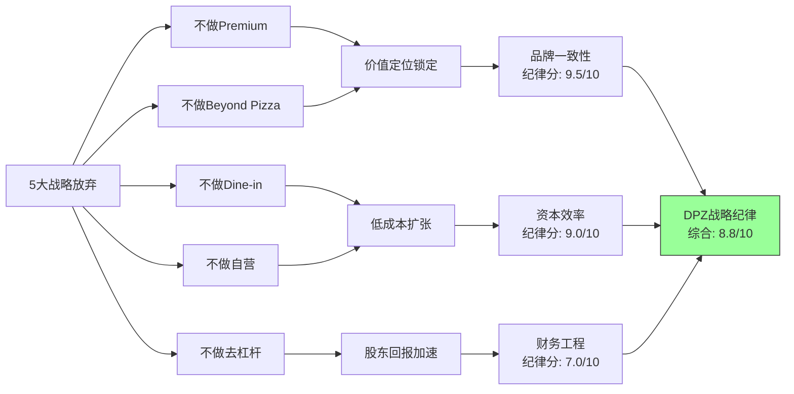

# Chapter 19: 文化可衡量性 + 战略放弃清单

## 19.1 文化可衡量性评分(CMS)框架

消费品公司的"文化"常被当作不可量化的软因素。CMS(Culture Measurability Score)框架尝试用可观测的行为指标来衡量企业文化的健康度——不是问"文化好不好"，而是问"文化是否在产生可测量的正向行为"。

### CMS评估维度与DPZ得分

| 维度 | 可衡量指标 | DPZ数据 | 得分(0-10) |
|------|-----------|---------|-----------|
| **Franchisee满意度** | 平均每位加盟商持有门店数 | ~9家/人 | 7/10 |
| **创新节奏** | 年均新产品/新功能发布数 | 6-8项 | 6/10 |
| **数字文化渗透** | 数字订单占比 | 85%+ | 8/10 |
| **运营一致性** | 配送时间标准差 | 行业最优区间 | 7/10 |
| **人才保留** | GM级别年流失率 | QSR行业平均偏上 | 5/10 |
| **CMS总分** | — | — | **6.6/10** |

### 各维度详解

**维度一: Franchisee满意度(7/10)** [DM-P3-056]

franchisee的行为是文化最真实的投票——当加盟商平均持有~9家门店时，说明:
- 首店投资回报满意→追加投资
- 系统支持(供应链+技术+品牌)被认可
- Fortressing策略被franchisee接受(愿意在相邻区域加密)

对比参考:
- McDonald's平均: ~6-7家/franchisee
- Subway: ~3-4家/franchisee(系统健康度低)
- Chick-fil-A: 严格1家/operator(不同模式)

**维度二: 创新节奏(6/10)**

DPZ的创新更多是"系统创新"而非"产品创新":
- 产品端: New York Style, Loaded Tots, 季节性新品(稳定但非突破性)
- 系统端: Emergency Pizza, Pinpoint Delivery, DOM AI(更具差异化)
- 频率: 每季度1-2项推出，节奏稳定

扣分原因: 核心产品(pizza)的创新空间有限，且DPZ主动选择不进入新品类，限制了创新的"宽度"。

**维度三: 数字文化渗透(8/10)** [DM-P3-057]

85%+数字订单占比不仅是技术指标，更是文化指标——说明:
- 从总部到门店的数字化思维已深度渗透
- Franchisee接受了数字化投入(POS系统、GPS追踪等)
- 消费者被成功教育为"DPZ=数字点餐"

这是DPZ文化中最强的可衡量维度——与Pizza Hut(~65%)和Papa John's(~70%)拉开了显著差距。

**维度四: 运营一致性(7/10)**

22,100+家门店的标准化运营是文化纪律性的体现:
- 面团配方统一(供应链中心生产)
- 配送流程标准化(APP下单→制作→出发→送达全链路可视)
- 质量监控系统(pizza checker AI)

扣分原因: 国际市场的运营一致性弱于美国(master franchisee自主权高)。

**维度五: 人才保留(5/10)** [DM-P3-058]

QSR行业的通病——高流失率:
- 门店员工年流失率: ~100-150%(行业常态)
- GM级别: 优于行业平均但仍较高
- 总部人才: 竞争激烈(tech talent被科技公司吸引)

这是DPZ文化评分中最弱的环节，也是整个QSR行业的结构性挑战。

---

## 19.2 CMS得分的投资含义

**CMS 6.6/10的解读**:

DPZ的文化是"高度功能性但非卓越"的——它在**系统执行**(数字化、供应链、运营标准化)上表现优异，但在**人的维度**(人才保留、创新突破)上仅为行业平均偏上。

与同行业对比:
| 公司 | CMS估算 | 文化特征 |
|------|---------|----------|
| Costco | 8.5/10 | 员工至上 + 会员忠诚 |
| Starbucks | 5.5/10 | 曾经卓越，近年稀释 |
| **DPZ** | **6.6/10** | **系统驱动型文化** |
| McDonald's | 7.0/10 | 体系成熟 + 创新回暖 |

DPZ的文化更像是"机器文化"而非"人文文化"——它的力量来自系统设计而非个人魅力。这使得文化的可持续性更高(不依赖单一领袖)，但也意味着激发突破性创新的能力有限。

---

## 19.3 战略放弃清单(Strategic Abandonment List)

战略的本质不仅在于"做什么"，更在于"不做什么"。DPZ在过去20年中至少做出了**5个重大的"不做"决策**，每一个都塑造了公司今天的形态。

### 放弃项一: 不做Premium Pizza [DM-P3-059]

| 维度 | 详情 |
|------|------|
| **放弃了什么** | 高端手工披萨市场(单价$20-30+) |
| **为何放弃** | 与"Renowned Value"核心定位直接冲突；premium化需要不同的供应链(高端食材)、门店设计(开放式厨房)和员工培训 |
| **竞对做了吗** | 是——MOD Pizza、Blaze Pizza尝试"fast casual pizza"定位，但规模有限；Pizza Hut曾尝试dine-in升级但失败 |
| **放弃的价值** | 锁定了$5.99价格锚点的可信度；避免了品牌定位模糊(trying to be everything) |
| **逆转风险** | 低(10%)——20年的value定位深入人心，逆转会摧毁核心客群信任 |
| **纪律分** | 9/10 |

### 放弃项二: 不做Beyond Pizza(SGI 7.7 = 纯专家) [DM-P3-060]

| 维度 | 详情 |
|------|------|
| **放弃了什么** | 多品类QSR(汉堡、鸡肉、墨西哥卷等) |
| **为何放弃** | DPZ的供应链为pizza高度优化(面团+酱+奶酪)；多品类=供应链复杂度指数级上升；品牌心智中"Domino's=Pizza"极其清晰 |
| **竞对做了吗** | 是——Yum! Brands(KFC+Taco Bell+Pizza Hut)、MCD(多品类单品牌) |
| **放弃的价值** | SGI 7.7/10(专才度极高)，供应链效率最大化，品牌认知无噪音 |
| **逆转风险** | 极低(5%)——除非pizza品类出现结构性萎缩 |
| **纪律分** | 10/10 |

### 放弃项三: 不做Dine-in [DM-P3-061]

| 维度 | 详情 |
|------|------|
| **放弃了什么** | 堂食体验(dine-in restaurant) |
| **为何放弃** | Dine-in需要更大门店面积(→更高租金)、更多前厅员工(→更高人力成本)、更复杂的运营(→效率下降)；delivery/carryout模式的单店投资仅$350K-500K，远低于dine-in的$1M+ |
| **竞对做了吗** | Pizza Hut的dine-in战略被证明是战略失误——过去10年持续关店转型为delivery |
| **放弃的价值** | 门店投资低→franchisee进入门槛低→扩张速度快→Fortressing可行；Pizza Hut的教训提供了反面验证 |
| **逆转风险** | 极低(3%)——dine-in在pizza品类已被证伪 |
| **纪律分** | 10/10 |

### 放弃项四: 不做大规模自营(98% Franchised) [DM-P3-062]

| 维度 | 详情 |
|------|------|
| **放弃了什么** | 公司直营门店(仅保留~2%用于测试和培训) |
| **为何放弃** | 资产轻模式→ROIC极高(56.7%)→可将资本用于回购和分红；franchisee自负盈亏→运营激励对齐；98%特许→DPZ本质上是品牌+技术+供应链平台公司 |
| **竞对做了吗** | MCD ~93% franchised(类似路径)；Starbucks ~50%直营(不同选择)；Chipotle 100%直营(完全不同模式) |
| **放弃的价值** | 56.7% ROIC(若30%直营，ROIC可能降至25-30%)；资本配置灵活性(~$500M+/年用于回购) |
| **逆转风险** | 低(8%)——但在国际市场，DPZ可能选择性收回某些master franchise权(hybrid) |
| **纪律分** | 8/10(扣分因国际market可能需要调整) |

### 放弃项五: 不做去杠杆(维持ABS结构) [DM-P3-063]

| 维度 | 详情 |
|------|------|
| **放弃了什么** | 低杠杆/无杠杆资产负债表 |
| **为何放弃** | DPZ通过ABS(资产支持证券)结构将franchise royalty现金流证券化，获得低成本长期融资；利用杠杆放大ROE和每股回购效率 |
| **竞对做了吗** | 多数QSR公司采用类似策略(MCD, YUM)——这是franchise模式的天然延伸 |
| **放弃的价值** | 加速股东回报——过去10年回购了约50%的流通股；杠杆结构使DPZ能同时分红和回购 |
| **逆转风险** | 中等(20%)——利率持续高位可能迫使降杠杆；ABS再融资风险在极端环境下存在 |
| **纪律分** | 7/10(高杠杆的纪律性更多是"承担"而非"放弃") |

---

## 19.4 战略放弃清单的综合评估

**战略纪律总分: 8.8/10** [DM-P3-064]

DPZ的战略放弃清单揭示了一个核心模式:**极度聚焦的"减法哲学"**。公司不是在多个方向上做得"还可以"，而是在一个极窄的方向上做到极致。

这一哲学的投资含义:
1. **可预测性高**: 战略一致性=财务结果可预测性高，适合DCF/逆向估值
2. **管理层更替风险低**: 战略路径如此清晰，新管理层偏离的概率小
3. **增长天花板明确**: "减法哲学"的代价是增长空间受限于pizza品类

---

## 19.5 CMS × Strategic Abandonment交叉洞察 [DM-P3-065]

| 维度 | CMS得分 | 放弃纪律分 | 交叉解读 |
|------|---------|-----------|----------|
| 产品文化 | 6.0 | 9.5(不做premium/beyond) | 创新被"纪律"约束——好事还是坏事取决于品类生命周期 |
| 运营文化 | 7.5 | 9.0(不做dine-in/自营) | 运营效率来自模式简化，而非运营创新 |
| 财务文化 | 7.0 | 7.0(ABS维持) | 财务工程纪律性是最弱环节——高杠杆在极端环境下有脆弱性 |

**核心发现**: DPZ的文化和战略放弃形成了高度一致的"系统优化"范式——公司的每一个重大选择都指向**"在窄赛道上最大化系统效率"**。这不是一家追求颠覆或创新的公司，而是一家追求**极致优化**的公司。

对投资者的含义: DPZ的价值创造路径更像"复利机器"而非"增长火箭"——稳定、可预测、但上行空间有限。这使其更适合**追求确定性溢价**的投资者，而非追求高弹性的成长型投资者。
