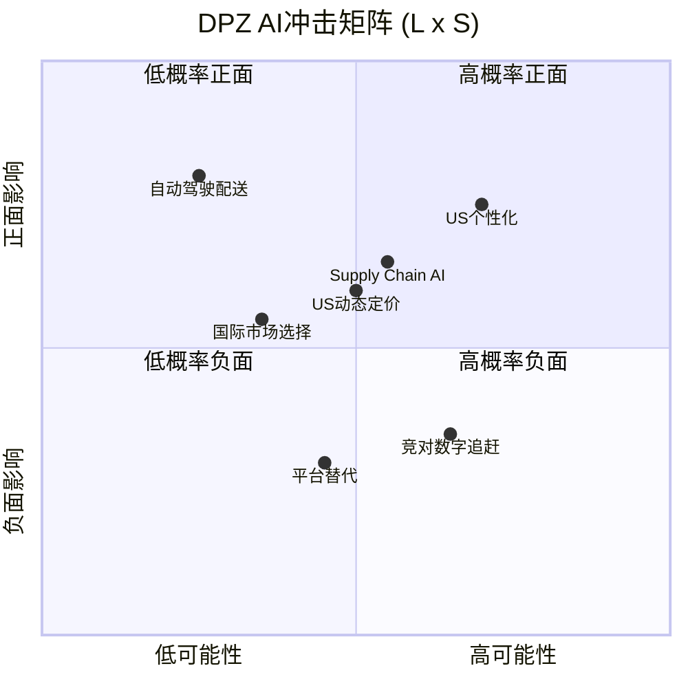
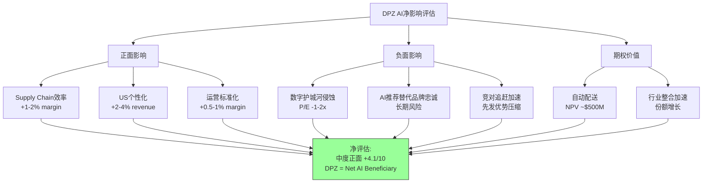

# Chapter 20: AI冲击矩阵

## 20.1 分析框架: L×S矩阵

AI对DPZ各业务板块的影响采用**可能性(Likelihood) × 方向性(Sentiment)**二维矩阵评估:

- **Likelihood(L)**: AI技术在该板块实际落地的概率和速度(Low/Medium/High)
- **Sentiment(S)**: AI落地后对DPZ该板块的净影响方向(Negative/Neutral/Positive)

**关键前提**: DPZ作为QSR行业数字化程度最高的企业之一(85%+数字订单、自建技术平台、第一方数据资产)，在AI浪潮中处于**天然有利位置**。但AI同样可能降低数字化的先发壁垒，使竞对更容易追赶。

---

## 20.2 板块一: Supply Chain业务(60.5%收入)

### AI应用场景

| 应用 | 描述 | 成熟度 | 利润率影响 |
|------|------|--------|-----------|
| **需求预测** | AI预测各门店日/周/月面团/配料需求，减少浪费 | 成熟(已部署) | +0.3-0.5% |
| **路线优化** | 供应链中心到门店的配送路线AI优化 | 成熟 | +0.2-0.4% |
| **库存管理** | 实时库存监控+自动补货 | 中期 | +0.3-0.5% |
| **质量监控** | 计算机视觉检测食材质量 | 早期 | +0.1-0.2% |
| **采购谈判** | AI辅助大宗商品采购时机判断 | 早期 | +0.2-0.5% |
| **合计** | — | — | **+1.1-2.1%** |

### L×S评估 [DM-P3.5-001]

- **Likelihood: Medium**(3-5年内大部分场景可落地)
- **Sentiment: Positive**(纯效率提升，无替代风险)
- **净影响**: 供应链毛利率从当前~10-11%提升至~11-13%

### 竞争影响

供应链AI是**非差异化**应用——竞对(Pizza Hut/Papa Johns)也能部署类似技术。DPZ的优势在于:
1. 22个supply chain center的规模效应使AI模型训练数据更丰富
2. 已有的数字化基础设施降低了AI集成成本
3. 但这不构成持久竞争优势——这是"必须做"而非"差异化"的AI应用

---

## 20.3 板块二: US Franchise业务(22%收入)

### AI应用场景

| 应用 | 描述 | 成熟度 | 收入影响 |
|------|------|--------|----------|
| **个性化推荐** | 基于历史订单的AI推荐引擎 | 成熟(已部署DOM AI) | +1.0-2.0% |
| **动态定价** | 需求/时段/区域差异化定价 | 中期 | +0.5-1.0% |
| **客户流失预测** | AI识别高流失风险客户并触发挽留 | 中期 | +0.3-0.5% |
| **门店选址** | AI分析人口/竞争/交通数据优化选址 | 成熟 | Fortressing效率+10-15% |
| **语音/聊天点餐** | AI替代人工接单 | 中-后期 | 人力成本-$2-3K/店/年 |
| **合计** | — | — | **+2-4% revenue uplift** |

### L×S评估 [DM-P3.5-002]

- **Likelihood: Medium-High**(多数场景2-3年内可落地)
- **Sentiment: Positive**(收入增长+成本节约)
- **净影响**: 美国同店收入增长额外+2-4%/年

### DPZ的第一方数据优势 [DM-P3.5-003]

DPZ拥有QSR行业最强的第一方数据资产之一:
- 85%+订单通过自有渠道(非第三方平台)
- 完整的客户订单历史、偏好、地理位置、频率数据
- Loyalty program(35M+会员)提供额外的行为数据维度

这使DPZ在AI个性化方面具有结构性优势——第三方平台(DoorDash/UberEats)虽然有跨品牌数据，但DPZ拥有**品类内最深的单一品牌数据**。

---

## 20.4 板块三: 国际业务(12%收入)

### AI应用场景

| 应用 | 描述 | 成熟度 | 影响 |
|------|------|--------|------|
| **市场选择** | AI分析新市场进入优先级 | 中期 | +1-2%扩张效率 |
| **本地化菜单** | AI驱动的区域口味适配 | 早期 | 新品成功率+15-20% |
| **Master Franchisee监控** | AI分析运营数据识别风险 | 中期 | 早期预警DPE类困境 |
| **跨市场知识迁移** | 将成功经验AI化迁移至新市场 | 早期 | 新市场ramp-up加速 |

### L×S评估 [DM-P3.5-004]

- **Likelihood: Low-Medium**(国际市场数据标准化程度低，落地慢)
- **Sentiment: Positive**(纯增量，无替代风险)
- **净影响**: 国际业务增长效率提升1-2%

### 关键约束

国际AI应用受限于:
- Master franchisee的技术能力参差不齐
- 数据标准不统一(各市场独立POS系统)
- DPZ对国际数据的访问权限受合同限制

---

## 20.5 AI冲击综合矩阵

### 综合评分 [DM-P3.5-005]

| 板块 | 收入占比 | L(可能性) | S(方向性) | 加权影响 |
|------|----------|-----------|-----------|----------|
| Supply Chain | 60.5% | Medium(6) | Positive(+7) | +2.6 |
| US Franchise | 22.0% | Med-High(7) | Positive(+8) | +1.2 |
| International | 12.0% | Low-Med(4) | Positive(+6) | +0.3 |
| **整体** | **100%** | — | — | **+4.1/10** |

**结论: DPZ是AI的净受益者(Net AI Beneficiary)**，评分+4.1/10(正面但非颠覆性)。

---

## 20.6 关键风险: AI对数字化护城河的侵蚀

### 核心悖论 [DM-P3.5-006]

DPZ过去10年的核心竞争优势之一是**数字化先发**——当竞对还在用电话接单时，DPZ已经实现了85%数字化。但AI可能**民主化数字能力**，使这一先发优势贬值:

| DPZ数字化优势 | AI带来的威胁 | 侵蚀程度 |
|--------------|-------------|----------|
| 自建订单平台 | AI SaaS使任何QSR快速建站 | 中(3-5年) |
| DOM AI助手 | ChatGPT/Gemini通用AI客服 | 高(1-2年) |
| 个性化推荐 | 第三方平台的跨品牌推荐更强 | 中(2-4年) |
| 数据资产 | 竞对可通过合成数据/小样本学习追赶 | 低-中(5年+) |

**风险量化**: 如果AI将DPZ的数字化先发优势从"3年领先"压缩到"1年领先"，对应的估值影响约为P/E倍数压缩1-2x(即从23.1x降至21-22x) [DM-P3.5-007]。

### DPZ的防御策略

1. **坚持自有渠道**: 拒绝将大量订单导向第三方平台(保护数据资产)
2. **DOM AI持续升级**: 将通用AI能力定制化为pizza-specific体验
3. **Loyalty program深化**: 用数据飞轮(更多数据->更好推荐->更高复购->更多数据)维持领先
4. **供应链AI化**: 在竞对不具备的供应链资产上叠加AI(22个center的数据网络效应)

---

## 20.7 自动驾驶配送: 长期期权

### Nuro合作与自动配送 [DM-P3.5-008]

DPZ于2021年与Nuro达成合作，测试自动驾驶配送车(R2机器人)。截至2025年，该合作仍处于有限试点阶段(休斯顿等少数市场)。

**自动配送的经济学**:

| 成本项 | 当前(人工配送) | 自动配送 | 节约 |
|--------|---------------|----------|------|
| 配送员工资 | $4-6/单 | $1-2/单 | $3-4/单 |
| 保险 | $0.5-1/单 | $0.3-0.5/单 | $0.2-0.5/单 |
| 车辆折旧/维护 | $1-2/单 | $2-3/单 | -$1/单(初期更贵) |
| **净效果** | **$6-9/单** | **$3.5-5.5/单** | **$2.5-3.5/单** |

**期权价值估算**:
- 美国~7,000家门店，平均每店~500单配送/周
- 年配送总量: ~182M单
- 若50%实现自动配送，每单节约$3: 年化节约~$273M
- NPV(10年, 10%折现, 30%概率): ~$500M期权价值

**落地障碍**:
- 监管审批(州级差异大)
- 技术可靠性(恶劣天气、复杂路况)
- 消费者接受度(部分客户偏好人工配送的灵活性)
- 最后100米问题(楼梯、门禁、公寓)
- Nuro本身在2024年经历大规模裁员和战略收缩

**时间线预判**: 大规模商业化部署可能需要5-8年(2031-2034)。DPZ的先发优势有限——竞对可以采用相同的自动驾驶供应商。

---

## 20.8 AI冲击的二阶效应

### 二阶效应一: AI驱动的QSR行业整合 [DM-P3.5-009]

AI可能加速QSR行业的"赢者通吃"效应——能够负担AI投资的大型连锁(DPZ, MCD, YUM)将进一步拉开与中小型连锁和独立店的差距。这对DPZ的Fortressing策略是正面的——AI加速了独立披萨店的淘汰。

### 二阶效应二: 消费者行为的AI化

当消费者开始通过AI助手(Alexa, Siri, ChatGPT)点餐时，品牌忠诚度可能被AI的"推荐算法"取代:
- "给我点一份披萨" -> AI可能推荐最优性价比选项(不一定是DPZ)
- DPZ需要确保在AI推荐生态中的优先位置(类似SEO->AIO的迁移)

### 二阶效应三: AI对franchise模式的影响

AI可能改变franchise模式的价值主张:
- **正面**: AI标准化运营->降低franchisee管理难度->扩大潜在加盟商池
- **负面**: 如果AI使独立运营也能高效，franchise的"系统价值"可能贬值

---

## 20.9 AI净影响汇总

### 最终评估 [DM-P3.5-010]

| 维度 | 评分(0-10) | 说明 |
|------|-----------|------|
| AI受益程度 | 6.5/10 | 多个场景可落地，但非颠覆性 |
| AI防御能力 | 7.0/10 | 第一方数据+供应链资产提供缓冲 |
| AI风险暴露 | 4.0/10 | 数字护城河侵蚀是最大威胁 |
| AI期权价值 | 5.5/10 | 自动配送有价值但落地遥远 |
| **AI净得分** | **+4.1/10** | **中度正面，非变革性** |

**投资含义**:

AI对DPZ的影响是"锦上添花"而非"雪中送炭"或"釜底抽薪"——它不会颠覆DPZ的商业模式，但也不会成为增长的核心驱动力。DPZ的价值更多取决于传统因素(Fortressing节奏、同店增长、国际扩张、资本配置)而非AI叙事。

在当前P/E 23.1x的估值中，市场对DPZ的AI期权定价接近零——这是合理的。如果未来自动配送大规模落地，可能带来~$500M左右的期权价值兑现(约$14/股)，但这不应作为当前估值的核心依据。

DPZ在AI时代的真正优势不在于"用AI做什么新事"，而在于"用AI更好地做已经在做的事"——这与公司的整体战略哲学(极致优化而非颠覆创新)完全一致。
