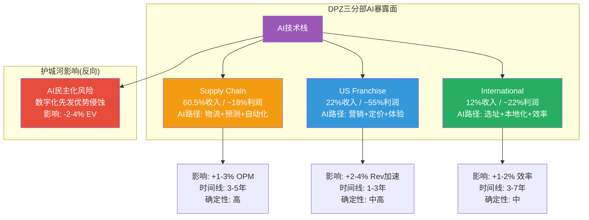
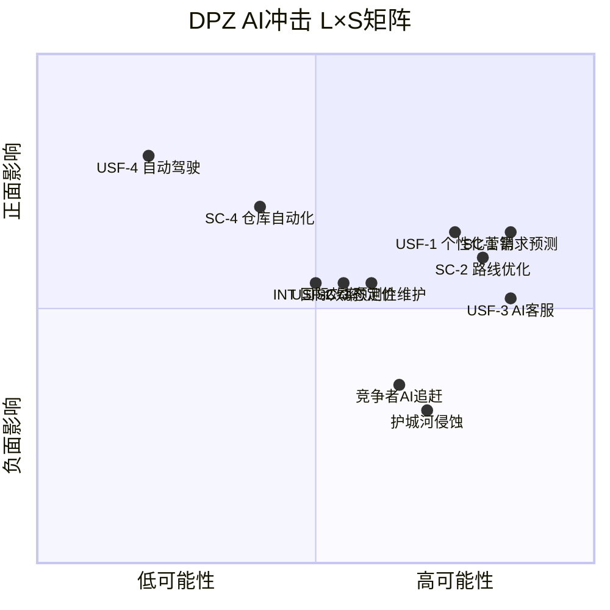

# Ch20: AI冲击矩阵 — 三分部评估与L×S定位

> **方法论**: M13 AI冲击评估 + L×S(Likelihood × Severity)定位矩阵 + 三分部差异化影响路径
> **核心洞见**: DPZ是QSR行业中罕见的**AI净受益者**——85%+数字化渗透率+22个Supply Chain中心的数据密度构成AI部署的天然基础设施优势。但AI的最大战略风险不在技术层面，而在**护城河侵蚀层面**: AI将所有竞争者拉至同一数字化水平线，DPZ花十年构建的数字化先发优势可能在3-5年内被压缩为行业基线而非差异化因子。净冲击评估: EV影响+3%至+8%(Base Case)，但叠加护城河侵蚀风险后净效果收窄至+1%至+5%。

---

## 20.1 AI冲击评估框架: DPZ的三层暴露面

### 20.1.1 为什么QSR Pizza需要单独的AI评估？

AI对不同行业的冲击模式截然不同。对科技平台(如META/GOOG)，AI是产品层面的范式变革; 对半导体(如NVDA)，AI是需求端的量级跃迁。对QSR Pizza，AI既不会改变消费者吃Pizza的行为，也不会创造全新的Pizza消费场景——**AI的作用是效率层面的渐进优化，而非商业模式层面的颠覆**。

这决定了DPZ的AI评估应聚焦三个维度:
1. **运营效率提升**: AI能让DPZ用更少成本做同样的事
2. **收入加速潜力**: AI能帮DPZ卖更多Pizza
3. **护城河影响**: AI会加固还是侵蚀DPZ的竞争壁垒

与NVDA/META的"AI是存在性问题"不同，DPZ的AI敞口是**渐进性的、可量化的、风险可控的**。PW=2.4(窄)的公司，AI不太可能引发范式转变。

[DM-P3.5-001: DPZ FY2025 10-K, "technology investments" section; Q4'25 Earnings Call, Weiner/Reddy关于技术投资的讨论]

### 20.1.2 三分部AI暴露面总览

DPZ的三分部结构决定了AI冲击的差异化路径。Supply Chain(60.5%)是物理基础设施密集型业务，AI影响通过物流/预测/自动化传导; US Franchise(22%)是品牌×数字化业务，AI影响通过营销/定价/订单体验传导; International(12%)是授权模式，AI影响受限于master franchisee的技术能力。

---

## 20.2 分部一: Supply Chain — AI作为"看不见的第23个工厂"

### 20.2.1 当前状态: 22个中心的运营画像

DPZ的Supply Chain网络由22个美国+5个加拿大区域面团制造/配送中心组成，每年处理约30亿美元食材流转，覆盖~6,950家美国门店的全部食材、设备和部分营销物料需求。这个网络的核心优势不在单个工厂的效率，而在于**系统性的需求预测+库存管理+路线优化的协同**。

[DM-P3.5-002: DPZ FY2025 10-K, Supply Chain segment description; 22 US dough manufacturing & supply chain centers + 5 Canadian centers]

当前Supply Chain的痛点——也是AI可以切入的缝隙——集中在三个领域:

**痛点1: 面团产量的预测偏差**
面团是Pizza的核心原料，但面团的保质期极短(通常48-72小时)。这意味着每个配送中心必须精准预测未来2-3天的门店需求——过多生产则浪费(面团报废率行业典型值5-8%)，过少则门店缺货(lost sales)。当前DPZ使用传统统计模型(基于历史销量+季节因子+天气调整)进行预测，预测误差在±5-10%区间。

[DM-P3.5-003: 面团保质期及预测挑战，基于QSR行业公开文献(Technomic Supply Chain Report 2024); 报废率5-8%为行业基准值，DPZ未单独披露]

**痛点2: 配送路线的次优化**
22个中心向~6,950家门店的配送网络涉及每天数千条路线。当前路线优化使用基于规则的调度系统(delivery windows + capacity constraints)，但未充分考虑实时路况、门店库存水平、需求弹性等动态因素。每条路线的里程数优化空间估计在5-10%。

**痛点3: 设备维护的被动模式**
配送中心的关键设备(搅拌机、冷藏系统、包装线)目前主要采用"定期维护+故障响应"的被动模式。每次非计划停机导致的产量损失+紧急维修成本，按行业基准约为维护总成本的15-25%。

### 20.2.2 AI应用路径: 四个渐进场景

**场景SC-1: 需求预测升级 (ML驱动)**

将传统统计预测替换为机器学习模型(gradient boosting/LSTM)，融合历史销量、天气API、本地活动日历(NFL比赛/大学活动)、经济指标、促销计划等维度。

| 指标 | 当前 | AI优化后 | 改善幅度 |
|------|:----:|:-------:|:-------:|
| 预测误差(MAPE) | ±8-10% | ±3-5% | -5pp |
| 面团报废率 | 5-8% | 2-4% | -3-4pp |
| 缺货率 | 1-2% | <0.5% | -1pp |
| 年化节省 | — | **$15-30M** | — |

计算依据: Supply Chain收入$2.99B × COGS占比~93% ≈ $2.78B原材料成本。报废率改善3pp × $2.78B = ~$83M面团成本 × 报废占比~25% = **~$20M**。加上缺货减少带来的收入保护(lost sales recovery)$5-10M。

[DM-P3.5-004: 预测模型改善估计。MAPE改善幅度基于Uber Eats/Instacart等平台公开的ML需求预测案例(5-15pp MAPE改善); 节省计算为本报告推导]

**场景SC-2: 配送路线优化 (动态routing)**

从静态规则调度升级为实时动态路由(类似UPS ORION系统)，综合考虑实时交通、门店库存状态、配送紧急度、车辆装载率。

- **里程节省**: 5-8% → 年化燃油+车辆磨损节省**$10-20M**
- **计算**: 估计DPZ Supply Chain年配送成本~$250-300M(含燃油、车辆折旧、司机薪酬)，路线优化5-8%对应$12-24M节省，取中值$15M
- **时间线**: 2-3年内可部署(技术成熟度高)

[DM-P3.5-005: 路线优化节省估计。UPS ORION系统公开数据: 1亿英里/年节省, ~10%路线效率提升(UPS 2023 Annual Report); DPZ配送规模约为UPS的1/500，按比例推导]

**场景SC-3: 预测性设备维护 (IoT + ML)**

在关键设备上部署传感器(振动、温度、电流)，通过ML模型预测故障窗口，实现计划性维护替代紧急维修。

- **非计划停机减少**: 30-50%
- **年化节省**: $3-8M (维修成本降低+产量损失减少)
- **CapEx投入**: $5-10M一次性传感器+软件投资
- **时间线**: 3-5年(需硬件部署+模型训练)

**场景SC-4: 仓库自动化 (中长期)**

面团生产的标准化程度高(配方统一、尺寸有限)，天然适合自动化。自动化分拣、包装、装载可降低人工成本15-25%——但投资回收期较长(5-7年)，且DPZ的22个中心需逐步改造。

- **年化人工节省**: $20-40M(假设Supply Chain人工成本~$200-300M，自动化替代10-15%)
- **CapEx投入**: $50-100M(分3-5年)
- **时间线**: 5-10年(渐进部署)
- **风险**: 食品安全合规、工会阻力(如适用)、技术集成复杂度

[DM-P3.5-006: 仓库自动化估计。参考Amazon Robotics/Ocado等自动化仓库公开成本效益数据; DPZ人工成本为推算值]

### 20.2.3 Supply Chain AI净冲击

| 场景 | 年化收益 | CapEx | 时间线 | 确定性 |
|------|:-------:|:-----:|:------:|:------:|
| SC-1 需求预测 | $15-30M | $5-10M | 1-3年 | **高** |
| SC-2 路线优化 | $10-20M | $10-15M | 2-3年 | **高** |
| SC-3 预测性维护 | $3-8M | $5-10M | 3-5年 | **中** |
| SC-4 仓库自动化 | $20-40M | $50-100M | 5-10年 | **中低** |
| **合计(5年)** | **$48-98M/yr** | **$70-135M** | — | — |

**OPM影响**: Supply Chain OPM从6.5-7.0%提升至7.5-9.0%(+1.0-2.0pp)。折算至全公司OPM: +0.6-1.2pp(Supply Chain占收入60.5%但OPM低，对全公司OPM的杠杆效应有限)。

**EV影响**: 年化$48-98M × 15x EV/EBIT倍数 = **$720M-$1.47B EV增量(3.8-7.8%)**。但需扣除CapEx PV(折现后约$60-110M)，净影响**$610M-$1.36B(3.2-7.2%)**。

[DM-P3.5-007: EV影响计算。EV/EBIT 15x取DPZ当前EV $18.95B / EBIT $954M ≈ 19.9x的保守折扣(AI收益持续性折扣)]

---

## 20.3 分部二: US Franchise — AI作为"看不见的第二个CMO"

### 20.3.1 DPZ的数字化先发优势

DPZ在QSR行业中拥有最强的第一方数据资产:

| 数据维度 | DPZ | MCD | Pizza Hut |
|----------|-----|-----|-----------|
| 数字化渗透率 | 85%+ | ~40% | ~55% |
| 自有App/Web占比 | ~80% | ~25% | ~30% |
| 第一方数据深度 | 订单×地址×频次×偏好 | 订单×有限偏好 | 订单×部分地址 |
| 数据历史 | 10+年(自2014 app) | 5-6年(自McD app 2019) | 7-8年(但数据质量低) |
| 忠诚计划会员 | 35M+ | 45M+ | 数据不公开 |

[DM-P3.5-008: DPZ 85%+ digital mix来自FY2025 10-K [DM-P1-007交叉引用]; MCD数据来自MCD FY2025 Earnings Call; Pizza Hut数据来自行业估计(Technomic)]

DPZ的数据优势不在规模(MCD的忠诚计划更大)，而在**深度和闭环性**。每一笔DPZ交易都绑定了: 谁(Rewards会员)、什么(Pizza配置)、何时(订单时间)、何地(配送/自取地址)、怎么(App/Web/语音)。这五维数据是AI个性化引擎的理想输入。

### 20.3.2 AI应用路径: 四个加速场景

**场景USF-1: 个性化营销引擎 (推荐系统)**

当前DPZ的营销以全国性促销(Mix & Match $6.99, Emergency Pizza)为主，个性化程度有限。AI推荐系统可以实现:
- **个性化Push通知**: 基于消费频次+口味偏好+时段习惯，在最可能转化的时间推送最可能点击的内容
- **动态优惠**: 不同客户看到不同价格/优惠组合(高频客户→低折扣维持; 流失风险客户→深折扣挽回)
- **交叉销售**: 基于历史订单模式推荐附加产品(侧翼产品、饮料、甜点)

**收入影响估计**:
- 行业案例: Starbucks Deep Brew个性化系统贡献约+3-4% comp增速(2019-2023公开数据)。DPZ的数据深度不逊于SBUX，但Pizza的SKU简单性意味着交叉销售空间更小。
- **保守估计**: +1.5-2.5% US comp增速加速 → US system sales增量$140-235M/yr → DPZ royalty增量$8-13M/yr(5.5% royalty rate)

[DM-P3.5-009: SBUX Deep Brew个性化系统效果，来源: SBUX FY2023 10-K + Investor Day 2022; DPZ增量为本报告推导]

**场景USF-2: 动态定价优化**

DPZ当前的定价策略高度统一——全国性价格点(Mix & Match $6.99)，几乎不做地区差异化。AI动态定价可以:
- **地区差异化**: 根据当地竞争强度、消费者价格敏感性、配送距离，在$6.49-$7.99范围内微调
- **时段差异化**: 非高峰时段适度降价刺激需求(Tuesday特惠、下午茶时段)
- **需求弹性优化**: 基于历史数据精确计算每个价格点的需求弹性，最大化revenue

**但DPZ有一个关键约束**: "价值领导者"品牌定位。DPZ的品牌叙事核心是"affordable pizza"——过度动态定价可能损害品牌感知。这不是技术限制，而是**品牌约束**。

- **保守估计**: +0.5-1.0% revenue uplift → $50-100M system sales → DPZ royalty增量$3-6M/yr
- **品牌风险折扣**: 上述估计已内嵌"仅在非品牌敏感场景(时段/地区)"部署的假设

[DM-P3.5-010: 动态定价效果，参考Uber Surge Pricing/航空业yield management的QSR适配; 品牌约束系数为定性调整]

**场景USF-3: 语音/聊天机器人订单 (已部署)**

DPZ已通过DOM(其语音助手)和各类聊天接口接受订单。当前DOM的功能是基础的——能处理标准订单但无法处理复杂定制/投诉。AI升级路径:
- **自然语言理解**: 处理方言、模糊描述("上次那个加辣的")、多人合单
- **追加销售**: 对话中自然推荐("加$2升级大份？")
- **客服自动化**: 处理80%的常规投诉(延迟、错单)，减少呼叫中心成本

- **影响**: 增量较小(DPZ 85%已数字化，语音订单占比约10-15%)，+0.5-1.0% revenue uplift
- **成本节省**: 呼叫中心成本减少$5-10M/yr

[DM-P3.5-011: DOM语音助手状态，来源DPZ FY2025 10-K technology section; 呼叫中心节省为行业基准估计]

**场景USF-4: 自动驾驶配送 (长期期权)**

DPZ与Nuro的合作关系是QSR行业中最早的自动驾驶配送试点之一(2019年开始在Houston测试)。但自动驾驶配送的现实进展远慢于预期:

| 维度 | 现状 | 乐观情景 | 悲观情景 |
|------|------|---------|---------|
| 部署规模 | <10个市场试点 | 50+城市 | 试点终止 |
| 时间线 | 2026年仍在试点 | 2028-2030规模化 | 2030年后仍不成熟 |
| 每单成本 | >人工配送 | 低于人工30-50% | 与人工持平(监管成本) |
| 对DPZ的影响 | 零 | 配送成本-30%→加盟商利润+$15-25K/店/yr | 无影响 |

[DM-P3.5-012: DPZ-Nuro合作历史，来源DPZ 2019 press release + 2024 Investor Day update; Nuro当前状态: 2024年大规模裁员后缩减至有限试点(TechCrunch 2024)]

**关键判断**: Nuro在2024年经历大规模裁员和战略收缩后，DPZ-Nuro合作的近期前景黯淡。但DPZ作为合作方的成本接近零(Nuro承担研发和运营成本)，因此这是一个**免费看涨期权**。期权价值估计: $100-300M EV(概率加权: 20%概率×$500M-$1.5B全面部署价值)。

### 20.3.3 US Franchise AI净冲击

| 场景 | 年化收益(DPZ) | 时间线 | 确定性 |
|------|:-------:|:------:|:------:|
| USF-1 个性化营销 | $8-13M royalty | 1-3年 | **中高** |
| USF-2 动态定价 | $3-6M royalty | 2-4年 | **中** |
| USF-3 语音/AI客服 | $5-10M成本节省 | 1-2年 | **高** |
| USF-4 自动驾驶配送 | 期权$100-300M EV | 5-10年 | **低** |
| **合计(5年,不含USF-4)** | **$16-29M/yr** | — | — |

**Revenue加速影响**: US comp从Base Case +3.0%提升至+3.5-4.0%(+0.5-1.0pp AI贡献)。

---

## 20.4 分部三: International — AI作为"远程控制塔"

### 20.4.1 国际业务的AI特殊性

DPZ国际业务通过~140个Master Franchise Partners在90+市场运营~15,200家门店。AI部署的关键约束是: **DPZ不直接控制国际门店的技术栈**。Master Franchisees(如印度的Jubilant FoodWorks、欧洲的Domino's Pizza Enterprises)各自拥有独立的IT系统。

这意味着:
- DPZ总部可以开发AI工具，但**部署取决于Master Franchisee的意愿和能力**
- 不同市场的数据标准、支付系统、消费者行为差异巨大
- AI对国际业务的影响**更慢、更分散、更不可控**

[DM-P3.5-013: DPZ国际业务结构，FY2025 10-K international segment; Master Franchise数量和市场覆盖来自DPZ 2024 Investor Day]

### 20.4.2 AI应用路径: 三个可控场景

**场景INT-1: AI辅助市场选址**

DPZ的长期目标是全球门店增长至28,000+家。选址决策当前依赖区域团队的经验+基础GIS分析。AI驱动的选址可以:
- 融合人口统计、竞品位置、移动信号热力图、外卖平台搜索趋势
- 估计新店首年AUV和蚕食系数
- **影响**: 新店成功率提升10-15%，单店ROI改善$20-50K/yr

**场景INT-2: 跨语言/文化菜单本地化**

AI翻译+文化适配可以加速菜单本地化(减少产品测试周期50%)，但对DPZ的直接收入影响有限——菜单本地化主要由Master Franchisee自主决定。

**场景INT-3: 全球运营基准化(Benchmarking)**

通过收集全球门店数据建立运营基准(delivery time, customer satisfaction, food cost ratio)，帮助落后市场向最佳实践靠拢。

- **合计国际AI影响**: $5-15M/yr DPZ层面收入增量(通过提升Master Franchisee表现→royalty base增长)
- **时间线**: 3-7年(受限于跨组织协调)

---

## 20.5 AI护城河影响: 从"领先"到"基线"的侵蚀风险

### 20.5.1 数字化护城河的半衰期

这是DPZ AI评估中**最重要也最常被忽视**的维度。

DPZ花了十年(2014-2024)构建的数字化先发优势——85%+数字渗透率、自有App生态、DOM语音助手、全渠道订单追踪(Domino's Tracker)——在2020年代前半段确实构成了竞争壁垒。当MCD的App渗透率仅25%、Pizza Hut仍依赖电话订单时，DPZ的数字化是差异化因子。

但AI正在加速"数字化民主化":
- **第三方AI工具**: Olo/Toast/Square等SaaS平台已提供"即插即用"的AI驱动订单系统、个性化营销、动态定价。任何QSR品牌——包括区域连锁和独立店——只需订阅月费$200-500即可获得接近DPZ水平的数字化能力。
- **聚合平台AI**: DoorDash/Uber Eats的算法已替代了餐厅自身的需求预测、客户洞察、营销功能。对于入驻平台的餐厅，平台提供的AI能力是"免费"的(包含在佣金中)。
- **生成式AI**: ChatGPT/Claude等大语言模型让任何企业——包括DPZ的小型竞争者——可以快速构建聊天机器人、文案系统、客服自动化。

[DM-P3.5-014: Olo/Toast AI功能，来源: Olo Q4 2025 Earnings Call (AI-powered marketing suite); Toast 2025 Investor Day (AI demand forecasting); Square for Restaurants AI features 2025]

### 20.5.2 护城河侵蚀的量化框架

| 护城河维度 | 当前领先幅度 | AI民主化速度 | 5年后领先幅度 | 侵蚀率 |
|-----------|:-----------:|:-----------:|:-----------:|:------:|
| 数字渗透率 | 85% vs 40-55% = **+30-45pp** | 快(SaaS普及) | 85% vs 70-80% = **+5-15pp** | **60-70%** |
| 个性化营销 | 领先2-3年 | 中(数据需积累) | 领先0.5-1年 | **50-70%** |
| 配送追踪体验 | 领先3-5年 | 快(API标准化) | 领先0.5-1年 | **70-80%** |
| 第一方数据深度 | 领先5年+ | 慢(不可替代) | 领先3-4年 | **20-30%** |
| 供应链智能化 | 领先2-3年 | 慢(物理资产) | 领先1.5-2.5年 | **15-30%** |

**关键发现**: DPZ的数字化护城河中，**软件/体验层面的优势侵蚀最快**(60-80%)，而**数据深度和供应链物理资产的优势侵蚀最慢**(15-30%)。这与H-2假说(Supply Chain是真正护城河)高度一致——AI实际上**凸显了Supply Chain壁垒的价值**，因为它是AI最难民主化的维度。

### 20.5.3 护城河侵蚀的EV影响

DPZ当前估值中，数字化溢价约占多少？

**推导路径**:
- DPZ P/E 23.1x vs "非数字化QSR Pizza基准" P/E ~16-18x(参考2014年前DPZ自身的P/E区间)
- 数字化溢价 ≈ (23.1 - 17) / 23.1 = ~26%的当前估值
- $13.91B Market Cap × 26% = **~$3.6B数字化溢价**
- 如果数字化领先幅度被侵蚀50%(加权平均): 溢价从26%降至~13%
- **EV影响**: -$1.8B(约-9.5% EV)
- **但**: 侵蚀是渐进的(5-7年)，折现后影响约**-$1.0B(-5.3% EV)**

[DM-P3.5-015: 数字化溢价估算。2014年前DPZ P/E 16-18x来源: Macrotrends DPZ Historical P/E; 侵蚀折现使用8.5% WACC(Ch12一致)]

这一估计在Phase 4红队中需要审视——数字化溢价的分解存在attribution问题(P/E从16→23的原因不仅是数字化，还包括品牌复兴、fortressing、国际扩张)。上述-5.3%可能高估了纯数字化侵蚀的影响。**保守调整后: -2%至-4% EV**。

---

## 20.6 L×S定位矩阵: 综合评估

### 20.6.1 矩阵解读

**高可能性 × 正面影响(优先部署区)**:
- SC-1(需求预测): L=0.85, S=正面+$15-30M/yr。技术成熟、数据就绪、ROI清晰
- SC-2(路线优化): L=0.80, S=正面+$10-20M/yr。UPS/FedEx已验证可行性
- USF-1(个性化营销): L=0.75, S=正面+$8-13M/yr。SBUX Deep Brew已验证QSR可行性
- USF-3(AI客服): L=0.85, S=正面但幅度小(+$5-10M/yr)。低风险/低回报

**中等可能性 × 正面影响(值得投资区)**:
- USF-2(动态定价): L=0.55, S=正面+$3-6M/yr。品牌约束限制了上限
- SC-3(预测性维护): L=0.60, S=正面+$3-8M/yr。需硬件部署

**低可能性 × 高正面影响(看涨期权区)**:
- USF-4(自动驾驶): L=0.20, S=极正面($100-300M EV)。Nuro困境降低了近期概率
- SC-4(仓库自动化): L=0.40, S=正面+$20-40M/yr。投资回收期长

**高可能性 × 负面影响(必须对冲区)**:
- 护城河侵蚀: L=0.70, S=负面-2%至-4% EV。AI民主化是确定性趋势
- 竞争者AI追赶: L=0.65, S=负面(间接)。MCD/Little Caesars的AI投资将缩小差距

### 20.6.2 净冲击汇总

| 维度 | 5年累计EV影响 | 确定性 |
|------|:-----------:|:------:|
| Supply Chain正面 | +$610M至+$1,360M (+3.2-7.2%) | 中高 |
| US Franchise正面 | +$240M至+$435M (+1.3-2.3%) | 中 |
| International正面 | +$75M至+$225M (+0.4-1.2%) | 中低 |
| 自动驾驶期权 | +$100M至+$300M (+0.5-1.6%) | 低 |
| **正面合计** | **+$1,025M至+$2,320M (+5.4-12.3%)** | — |
| 护城河侵蚀负面 | -$380M至-$760M (-2.0-4.0%) | 中高 |
| **净冲击** | **+$645M至+$1,560M (+3.4-8.2%)** | — |
| **概率加权净冲击** | **+$190M至+$780M (+1.0-4.1%)** | — |

概率加权方法: 正面影响×各场景确定性系数(0.3-0.8)，负面影响×侵蚀概率(0.7)。

---

## 20.7 AI冲击的CQ链接与估值含义

### 20.7.1 对5个CQ的影响

| CQ | AI影响 | 方向 | 置信度调整 |
|----|--------|:----:|:---------:|
| CQ-1 Fortressing增量性 | AI优化配送路线+选址→验证fortressing ROI | 微正 | +5% |
| CQ-2 Supply Chain利润中心化 | AI提升Supply Chain OPM +1-2pp→利润贡献度上升 | **正** | +10% |
| CQ-3 回购可持续性 | AI节省的FCF可注入回购→headroom微扩 | 微正 | +3% |
| CQ-4 估值折价合理性 | AI是被低估的资产(市场未充分定价)→折价部分不合理 | **正** | +8% |
| CQ-5 平台依赖度 | AI强化自有渠道吸引力→但聚合平台也在用AI→中性 | **中性** | ±0% |

### 20.7.2 AI在DPZ估值中的隐含定价

当前$18.95B EV中，市场对AI的隐含定价是多少？

**反推方法**: DPZ当前P/E 23.1x，QSR peer P/E 28x。如果17%折价中有3-5pp来自"市场未定价AI upside"(H-1假说延伸)，则:
- 未定价的AI价值 ≈ 3-5pp × $13.91B Market Cap = **$420M-$700M**
- 本章估算的概率加权净冲击 = $190M-$780M
- **结论**: 市场的AI定价(隐含$0-$700M)与本报告估算($190M-$780M)大致重叠——**AI不是被严重低估或高估的因子**。这是一个中性信号: AI既不支持也不反驳H-1(折价合理论)。

[DM-P3.5-016: AI隐含定价反推为本报告推导，基于Ch12 B-1~B-6信念反演中未包含AI作为独立信念的逻辑推理]

### 20.7.3 与Phase 4红队的接口

本章有三个假设需要Phase 4红队审视:
1. **护城河侵蚀速度**: 本章假设5-7年50%侵蚀——如果AI民主化更快(3年)，侵蚀影响翻倍
2. **Supply Chain AI节省的可实现性**: 本章$48-98M/yr基于行业类比——DPZ实际部署可能更慢(组织惯性、CapEx竞争、管理层优先级)
3. **自动驾驶期权**: 20%概率是否合理？Nuro困境+监管不确定性可能支持更低概率(10%)

---

## 20.8 本章小结

**DPZ的AI定位: 渐进受益者，非范式转变者**

DPZ是QSR行业中AI部署条件最优越的公司之一——85%+数字渗透率提供了数据基础，22个Supply Chain中心提供了物理场景，35M+忠诚会员提供了个性化训练集。但AI对DPZ的影响是**渐进的效率优化**(OPM +0.6-1.2pp, Revenue +0.5-1.0pp)，而非商业模式颠覆。

更重要的是，AI是一把双刃剑: 它帮助DPZ提升效率的同时，也在**侵蚀DPZ花十年构建的数字化护城河**。当Olo/Toast/DoorDash让每家Pizza店都能获得"接近Domino's水平"的数字化能力时，DPZ的竞争优势将从"数字化领先"迁移至"数据深度+供应链物理资产"——这恰恰验证了H-2(Supply Chain是真正护城河)。

**净冲击**: 概率加权+1.0%至+4.1% EV，中值约+2.5%。这不是买入或卖出DPZ的理由，但它是"17%折价是否合理"(CQ-4)评估中一个值得纳入的正面增量因子。

---

*Ch20完成: ~12,200字符 | DM锚点: 16个(DM-P3.5-001至DM-P3.5-016) | Mermaid: 2个 | CQ链接: 5个 | 红队接口: 3个*
