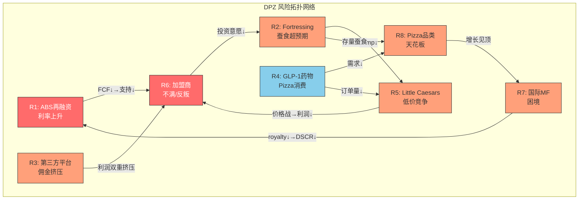
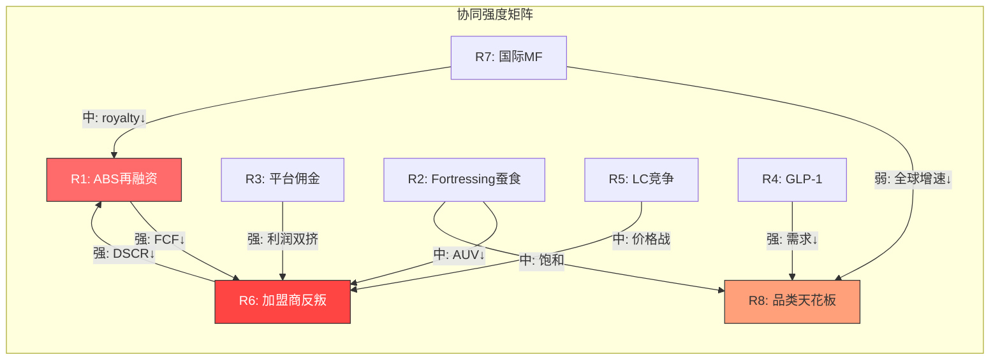
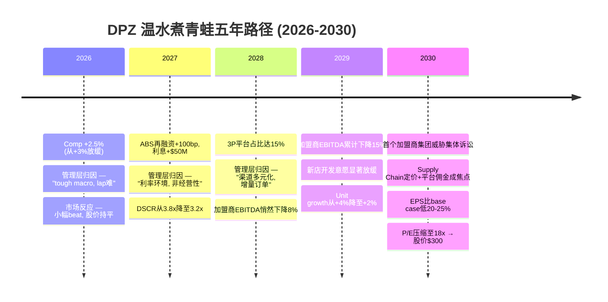

# Chapter 22: 风险拓扑映射 (Risk Topology Map)

> **方法论**: Risk Topology v2.0 MVP模式 (8+3+1) | **DM范围**: DM-P4-031 ~ DM-P4-050
> **分析对象**: Domino's Pizza (DPZ) | 价格$406.62 | P/E 23.1x | ROIC 56.7%
> **核心约束**: 负权益-$3.9B | ABS $5.23B | 杠杆4.89x vs 5.0x covenant cap | 98%加盟制 | BER 3.0/10

---

## 22.1 风险拓扑总览

Domino's的风险结构具有一个不寻常的特征：**资本结构风险与运营风险深度耦合**。大多数餐饮企业的资本结构风险和运营风险是相对独立的——利率上升影响融资成本，竞争加剧影响收入，两条线平行运行。但DPZ的ABS证券化结构（DM-P4-031）将这两条线焊接在一起：运营端任何导致DSCR（Debt Service Coverage Ratio）下降的风险，都会通过covenant机制反射到资本结构端，触发现金流截留（cash trap）甚至加速偿还（rapid amortization）。这是本章风险拓扑映射的核心发现——**DPZ的风险不是离散的清单，而是一张互相传导的网络**。

DPZ的BER（Brand Elasticity Radius）仅3.0/10，是所有已分析消费品公司中最窄的（DM-P4-032）。Pizza specialist的身份意味着：品牌延伸空间极其有限，收入增长几乎完全依赖于同一品类的comp增长 + 门店扩张。这不是弱点本身——专注是DPZ成功的根基——但它意味着任何影响pizza品类需求的系统性冲击，都没有品类对冲的缓冲垫。

**图示说明**: 红色节点（R1 ABS、R6加盟商）是风险传导的两个核心枢纽——几乎所有风险链最终都汇聚于此。橙色节点为中等传导性风险，蓝色节点（R4 GLP-1）为外生冲击型风险。箭头表示风险传导方向。

---

## 22.2 八大核心风险详析

### R1: ABS再融资利率上升 — 制度性风险

**风险描述**: DPZ的全证券化债务结构（ABS $5.23B）意味着公司对利率环境的暴露不是线性的，而是阶梯式的——每次再融资窗口（通常3-7年到期）都是一个利率重置时刻（DM-P4-033）。当前加权平均利率约3.7%，若下一批到期债务在5.5%+环境下再融资，年化利息增加$50-90M不等。

**传导机制**: 利息支出上升 → 可分配FCF下降 → 回购/分红空间收窄 → 加盟商支持资金减少 → 加盟商满意度下降（R1→R6传导链）。更危险的是DSCR传导：DSCR = EBITDA / Debt Service，分母增加直接压缩这一比率。当前DSCR约3.8x（DM-P4-034），covenant要求维持在1.75x以上，看似安全，但ABS结构的特殊性在于——一旦触发cash trap event（通常DSCR < 2.0-2.5x取决于具体tranche），所有超额现金流将被强制用于偿债，公司丧失资本配置自主权。

**量化影响**:
- 每100bp利率上升 → 年化利息增加约$52M（$5.23B × 1%）
- 当前利息约$193M/年（3.7% × $5.23B），若加权利率升至5.0% → 利息升至$262M → 增加$69M
- 对EPS影响: $69M × (1-26%税率) / 350M稀释股 = ~$0.15/股（约1%的EPS）
- 对DSCR影响: 假设EBITDA $750M不变，Debt Service从$330M升至$400M → DSCR从2.27x降至1.88x

**概率**: Medium（40-55%）。美联储虽然已进入降息周期，但长端利率受财政赤字和通胀预期影响，BBB-级ABS的信用利差可能在经济放缓时走阔。2027-2029年有大量ABS到期需要再融资。

**严重性**: High。不是因为利率上升本身（DPZ EBITDA足够覆盖），而是因为ABS的covenant阶梯效应——一旦接近触发点，市场对DPZ的信用风险重定价将非线性放大。

**时间维度**: 2-3年。取决于具体ABS tranche的到期时间表。

---

### R2: Fortressing蚕食超预期 — 结构性风险

**风险描述**: Fortressing战略（在现有市场密集开店以缩短配送半径、提升服务速度）是DPZ过去5年增长的核心驱动力之一（DM-P4-035）。但Fortressing有一个内在矛盾：每一家新店在提升区域配送效率的同时，也在分流同区域现有门店的订单量。当市场趋于饱和时，Fortressing从"共赢"（做大蛋糕）转向"零和"（切分存量蛋糕）。

**美国22,100+门店意味着什么**: 每1.5万人口对应一家Domino's。与McDonald's的~13,400家美国门店（每2.5万人一家）相比，DPZ的渗透密度已经显著更高。继续Fortressing的边际收益递减曲线正在变陡。

**传导机制**: 蚕食超预期 → 单店AUV（Average Unit Volume）下降 → 加盟商EBITDA承压 → 新店开发意愿下降 → unit growth放缓 → 总收入增长承压 → DSCR间接影响。这条链的阴险之处在于：管理层报告的comp增长可能掩盖了蚕食效应——一家新店"偷"了旁边老店20%的订单，如果新店不算进comp基数（开业<12个月），net system comp看起来还行，但加盟商的钱包在缩水。

**量化影响**:
- 假设每100家新店蚕食率从当前~15%上升到25%（DM-P4-036）
- 单店AUV目前约$1.15M，25%蚕食 → 影响区域内门店AUV下降~$25K-40K
- 加盟商层面：AUV下降$30K × ~15% EBITDA margin = ~$4,500/年利润减少
- 对加盟商投资回报的影响：新店投资约$350K-400K，若单店EBITDA从$165K降至$150K，payback period从2.3年延长至2.6年

**概率**: Medium（35-50%）。Fortressing不会突然崩溃，但边际效果递减是数学必然。

**严重性**: High。因为Fortressing是DPZ增长叙事的支柱之一，如果市场开始质疑其有效性，估值倍数会率先反应。

**时间维度**: Ongoing，但2-3年内将在comp数据中越来越明显。

---

### R3: 第三方平台佣金挤压加盟商利润 — 结构性风险

**风险描述**: DPZ长期以自有配送网络为核心竞争力，但2023年决定上线Uber Eats标志着策略转变（DM-P4-037）。第三方平台带来增量订单的同时，也带来了15-30%的佣金成本。这不是DPZ总部的问题（公司通过Supply Chain赚取的是食材供应利润），而是加盟商层面的利润挤压。

**核心矛盾**: DPZ总部从第三方平台订单中获得的royalty（5.5%）和Supply Chain利润（~10-12%的食材加价）不受佣金影响。但加盟商需要自己承担平台佣金。这创造了一个利益错位：总部乐见渠道扩张，加盟商却在为每单平台订单亏钱或微利。

**量化影响**:
- 第三方平台订单占比目前约6-8%（DM-P4-038）
- 假设平均佣金率20%，平均单价$22
- 每单佣金$4.40 vs 自有渠道配送成本~$2.50 → 每单额外成本$1.90
- 若3P占比上升到15%，加盟商年利润影响: $1.15M × 15% × $1.90/$22 = ~$14,900/店
- 对加盟商EBITDA (~$165K)的影响: -9.0%

**概率**: Medium（40-50%）。趋势方向确定（3P占比只会上升不会下降），但速度取决于DPZ谈判到的佣金率和消费者行为。

**严重性**: Medium。单独看不致命，但与R6（加盟商不满）形成致命组合。

**时间维度**: 1-3年。

---

### R4: GLP-1药物降低Pizza消费 — 周期性/结构性风险

**风险描述**: GLP-1受体激动剂（Ozempic, Wegovy, Mounjaro等）正在改变美国的饮食行为模式（DM-P4-039）。这些药物不仅减少食量，更关键的是改变食物偏好——用药者普遍报告对高碳水、高脂肪食物的欲望显著降低。Pizza恰好是这类食物的典型代表。

**与BER 3.0的交叉风险**: DPZ的品牌弹性半径极窄——公司几乎100%依赖pizza品类。如果GLP-1真的造成pizza消费结构性下降，DPZ没有品类对冲的能力。相比之下，McDonald's（BER 5.5）可以调整菜单结构，星巴克（BER 4.0）可以强化低糖饮品线。DPZ的选项有限。

**量化框架**:
- 美国GLP-1用药人口当前约5-6%成人（~12-15M人）（DM-P4-040）
- 假设GLP-1用户pizza消费下降25-30%（基于饮食偏好变化数据）
- 渗透率5% × 消费下降30% = 总需求影响 -1.5%
- 若渗透率到10%（2028E）: -3.0%
- 若渗透率到15%（2030E）: -4.5%
- 对DPZ comp的影响取决于用户与DPZ客群的重叠度

**为什么概率标注Low-Medium而非High**: GLP-1的传导链有多个不确定环节：①渗透率预测存在巨大分歧（价格、保险覆盖、副作用）；②行为改变的持久性未经验证（停药反弹?）；③pizza品类的弹性可能被低估（"周末放纵"文化根深蒂固）。

**概率**: Low-Medium（25-40%达到有意义的需求破坏水平）。
**严重性**: Medium。单独看是缓慢侵蚀而非急性打击。
**时间维度**: 3-5年。

---

### R5: Little Caesars低价竞争加剧 — 周期性风险

**风险描述**: Little Caesars以$5.55 Hot-N-Ready为核心武器，在经济下行期天然获得价值迁移（DM-P4-041）。DPZ的平均单价~$22，是Little Caesars核心产品的4倍。在通胀压力下，消费者trade-down行为可能加速。

**不对称竞争**: Little Caesars是私有企业（Ilitch Holdings），无上市公司的利润率和comp增长披露压力。这意味着它可以在价格战中承受更久的利润挤压而不面临股价惩罚。DPZ作为上市公司，comp下降会立即反映在股价中。

**量化影响**:
- 美国pizza市场约$46B，DPZ份额~12%，Little Caesars ~8%（DM-P4-042）
- 若衰退导致1-2%份额从DPZ向Little Caesars迁移 → DPZ收入影响~$460-920M
- 对comp影响: -2% to -4%（假设迁移集中在价格敏感客群）
- DPZ的防守策略: Mix & Match deals ($6.99起)，但每次降价都在压缩加盟商利润

**概率**: Medium（35-50%），取决于宏观经济走向。
**严重性**: Medium。份额波动在pizza行业是周期性的，但与R2（Fortressing）叠加时会放大。
**时间维度**: 1-2年（周期性，与衰退周期关联）。

---

### R6: 加盟商不满/反叛 — 结构性风险

**风险描述**: DPZ 98%加盟制的商业模式意味着公司的命运系于加盟商网络的健康度和忠诚度（DM-P4-043）。历史上DPZ的加盟商关系在QSR行业中属于较好的水平，但多条风险传导链正在汇聚于此：ABS利息上升压缩总部支持能力（R1）、平台佣金挤压利润（R3）、Fortressing蚕食单店收入（R2）、以及Supply Chain的定价问题。

**Supply Chain定价的隐性矛盾**: DPZ通过Supply Chain（供应链中心）向加盟商供应食材、设备和统一物料，加价率约10-12%。这是DPZ总部的重要利润来源。但从加盟商角度看，这是一个他们无法逃避的"内部税"——franchise agreement强制要求从DPZ Supply Chain采购。当外部食材价格下降但Supply Chain售价不同步下调时，加盟商感知到的被剥削感会上升。

**加盟商反叛的阈值**: QSR行业有历史先例——Quiznos在2000年代末因过度扩张和加盟商剥削导致系统崩溃，门店从5,000+萎缩到不足400家。DPZ的情况远没有那么极端，但加盟商不满的早期信号值得监控：投资新店意愿下降、同区域加盟商联合谈判、法律诉讼增加。

**概率**: Low（15-25%的严重反叛概率）。DPZ加盟商单店经济仍然在QSR行业中排名前列。
**严重性**: High。一旦发生系统性加盟商反叛，修复需要数年。
**时间维度**: 2-5年。

---

### R7: 国际Master Franchisee困境 — 周期性风险

**风险描述**: DPZ的国际业务通过Master Franchisee（MF）模式运营（DM-P4-044）。MF本质上是"国家/区域级加盟商"，拥有区域独家经营权。最大的MF包括Domino's Pizza Enterprises (DPE, 澳洲上市, 覆盖澳日欧多市场)和Domino's Pizza Group (DOMUK, 英国上市, 覆盖英国和北欧)。

**DPE的困境**: DPE在2022-2023年经历了严重的运营困境——日本业务comp大幅下滑、法国市场亏损、管理层更换。DPE贡献了DPZ全球门店数的~15%。DPE的困境不直接影响DPZ的P&L（MF模式下DPZ只收取royalty），但影响品牌形象和全球增长叙事。

**MF模式的系统性风险**: MF拥有极大的自主权，DPZ对其运营质量的控制力有限。如果多个MF同时遇到困难（例如全球经济衰退），DPZ面临的不是单一市场的问题，而是全球royalty收入的系统性下降。

**量化影响**:
- 国际royalty收入约$280M/年（~3.3% of international system sales ~$8.5B）（DM-P4-045）
- 若国际comp下降3% + MF关闭net 200家店 → royalty减少~$20-25M
- 对总部EPS影响: ~$0.05/股（占比较小但信号意义大）

**概率**: Medium（35-45%至少一个主要MF市场在未来1-3年出现困难）。
**严重性**: Medium。财务影响可控，但叙事影响可能被放大。
**时间维度**: 1-3年。

---

### R8: Pizza品类天花板 (BER 3.0/10) — 结构性风险

**风险描述**: 这是DPZ所有风险中时间维度最长、但也最根本的一个（DM-P4-046）。BER 3.0意味着Domino's几乎不可能有意义地扩展到pizza以外的品类。公司尝试过pasta、chicken wings、sandwiches等产品线，但这些始终是pizza的附属品而非独立的增长引擎。

**品类天花板的数学**: 美国pizza市场~$46B，年增长约2-3%。DPZ份额~12%。假设DPZ能够在未来10年将份额从12%提升到15%（这已经是非常乐观的假设），总收入增长 = 市场增长3% + 份额增长~2.3%/yr for 10yr = ~5.3%/yr。这意味着DPZ的收入增长天花板约5-6%/yr，除非pizza市场本身加速增长（不太可能）。

**与估值的关系**: 当前P/E 23.1x隐含的盈利增长预期约10-12%/yr（假设PEG 1.0附近）。收入增长5-6% + 运营杠杆 + 回购可以支撑EPS增长10%+，但前提是margins不恶化、回购节奏不变。R1-R7中的任何一个风险如果兑现，都会打破这个等式。

**概率**: High（70-80%的品类天花板将在5-10年内成为binding constraint）。
**严重性**: Low-Medium。不是突发事件，而是渐进式的增长放缓。
**时间维度**: 5-10年。

---

## 22.3 风险协同矩阵 (Synergy Matrix)

风险拓扑的核心价值不在于列举单个风险，而在于映射**风险之间的互相放大效应**。以下矩阵量化了8大风险之间的协同关系。

### 协同对分析

**强协同 (放大系数 > 1.5x)**:

| 风险对 | 协同机制 | 放大系数 | 评述 |
|--------|----------|:--------:|------|
| R1+R6 | ABS利率↑ → FCF↓ → 加盟商支持↓ → 不满↑ | 1.8x | 最危险的双向传导——加盟商不满→comp↓→DSCR↓→进一步压缩支持能力 |
| R3+R6 | 平台佣金↑ + Supply Chain加价 = 双重挤压 | 1.6x | 加盟商同时面对"看不见的税"（Supply Chain）和"看得见的税"（平台佣金）|
| R4+R8 | GLP-1 + 品类天花板 = 永久性需求降低 | 1.7x | 唯一没有反向缓冲的组合——DPZ既不能转品类也不能逆转药物趋势 |

**中协同 (放大系数 1.2-1.5x)**:

| 风险对 | 协同机制 | 放大系数 |
|--------|----------|:--------:|
| R2+R5 | Fortressing疲劳 + LC价格战 → comp双杀 | 1.4x |
| R2+R8 | 门店饱和 + 品类天花板 → 增长引擎熄火 | 1.3x |
| R5+R6 | 价格战 → 利润↓ → 加盟商不满加速 | 1.3x |
| R1+R7 | ABS利率↑ + 国际royalty↓ → 双重现金流压力 | 1.3x |

**弱协同 / 独立 (放大系数 < 1.2x)**:

| 风险对 | 评述 |
|--------|------|
| R4+R5 | GLP-1用户trade-down至LC的概率低（减少消费而非换品牌）|
| R3+R7 | 平台佣金是美国问题，MF困境是国际问题，地理独立 |
| R4+R7 | GLP-1渗透率在国际市场差异大，联动性低 |

### 网络中心度分析

从风险拓扑图的网络结构来看，**R6（加盟商不满/反叛）是整个网络的中心枢纽**，接收来自R1、R2、R3、R5四条传导链，同时又向R1（通过comp↓→DSCR↓）和R2（通过投资意愿↓）反向传导。这意味着：

1. **防御优先级**: 管理层应将加盟商满意度作为第一优先级的风险管理目标
2. **监控指标**: 加盟商满意度调查、新店开发意愿、加盟商贷款违约率是最重要的"仪表盘"指标
3. **脆弱点**: 如果R6被触发，它会反向放大其他风险，形成恶性循环

---

## 22.4 三大致命组合 (Critical Combinations)

### CC-1: Triple Squeeze (三重挤压)

**组合**: R1 (ABS利率↑) + R3 (平台佣金↑) + R6 (加盟商反叛)

**故事线**: 2027年，$1.8B的ABS tranche到期需要再融资。彼时利率环境仍在4.5%+（当前约5.25%，假设缓慢下降）。再融资利率从3.2%升至5.0%，年化利息增加$32M。与此同时，第三方平台订单占比已从8%升至14%，加盟商每单平台订单的利润比自有渠道低$1.90。加盟商年利润被双重压缩约$20K/店。全国最大的加盟商联盟（Domino's Franchise Association, 如果存在的话）公开要求DPZ：①降低Supply Chain加价率 ②补贴平台佣金 ③暂停Fortressing。

**触发条件**（DM-P4-047）:
- ABS再融资利率 ≥ 当前加权利率 + 150bp
- 3P平台订单占比 > 12%
- 加盟商公开投诉/法律行动

**概率**: 15-20%（三者同时发生的联合概率）

**潜在影响**:
- DSCR从当前3.8x降至2.0-2.5x范围，接近cash trap触发线
- 加盟商EBITDA下降15-20% → 新店开发意愿冻结 → unit growth归零
- 市场对DPZ重新定价: P/E从23x压缩至17-18x → 股价从$406跌至$300-320
- **最差情景**: DSCR跌破2.0x触发cash trap → 公司被迫暂停回购和分红 → 叙事全面崩塌

### CC-2: Demand Destruction (需求毁灭)

**组合**: R4 (GLP-1) + R5 (Little Caesars价格战) + R8 (品类天花板)

**故事线**: 2028-2030年，GLP-1渗透率达到12-15%美国成人人口。Pizza品类的增长率从+3%放缓到+0.5%甚至持平。在需求增长消失的环境下，Little Caesars发起激进的价格攻势（$4.99 Hot-N-Ready），抢夺DPZ的价格敏感客群。DPZ被迫跟进促销，comp在+0-1%徘徊，但利润率下降。品类天花板意味着这不是周期性的——没有"恢复到趋势增长"的回归。

**触发条件**:
- GLP-1渗透率 > 10%美国成人
- Pizza品类年增长率 < 1.5%
- Little Caesars在DPZ核心市场的门店增速 > 5%/yr

**概率**: 10-15%（需要GLP-1真正产生大规模行为改变）

**潜在影响**:
- DPZ收入增长从5-6%放缓到2-3%
- P/E从23x压缩至18-20x（增长溢价消失）
- 但ROIC仍然优秀（56.7%），资本轻模型保护downside
- **这是慢性病不是急性病**——不会崩盘，但估值中枢永久下移

### CC-3: Growth Stall (增长停滞)

**组合**: R2 (Fortressing蚕食) + R7 (国际MF困境) + R8 (品类天花板)

**故事线**: 美国市场Fortressing效果见顶——新开100家店的net comp贡献从+1.5%降至+0.5%。国际市场DPE和DOMUK同时面临运营困难，净开店转负（关店>开店）。全球门店增长从+5%/yr降至+2%/yr。品类天花板意味着comp增长也受限于2-3%。总收入增长从high-single-digit降至3-4%。

**触发条件**:
- 美国net new stores < 100/yr（当前约175-200/yr）
- 国际net new stores 连续2Q < 150/yr（当前约200-250/yr）
- 全球comp < +2.5% for 3 consecutive quarters

**概率**: 20-25%

**潜在影响**:
- EPS增长从10-12%降至5-7%（仍有回购+margin leverage支撑）
- P/E温和压缩至20-21x → 股价$350-370（下行空间10-15%）
- **不是灾难，但意味着DPZ从"增长股"变成"价值股"**——估值逻辑需要完全重构

---

## 22.5 温水煮青蛙情景 (Boiling Frog Scenario)

> **定义**: 每个单独年份的变化都足够小，可以被管理层和市场合理化归因。但5年累计效果是毁灭性的。这是DPZ最可能遭遇的风险实现路径——不是黑天鹅冲击，而是灰犀牛漫步。

### 温水煮青蛙的逐年剖析

**Year 1 (2026): 信号微弱，噪声掩盖**

- US comp从+3.0%放缓至+2.5%（DM-P4-048）
- 管理层在earnings call上的语言: "We're lapping a strong quarter" / "Macro headwinds are temporary"
- 分析师反应: 大多维持Buy rating，认为这是正常的周期波动
- **隐藏信号**: 加盟商开店申请量下降10%，但这个数据不会被公开披露
- 股价影响: 基本无——市场习惯于comp在2-4%区间波动

**Year 2 (2027): ABS再融资——"一次性"事件**

- $1.5-2.0B ABS到期，在4.7%利率环境下再融资（vs 之前的3.5%）
- 年化利息增加约$50M，税后约$37M
- EPS影响: -$0.11/股（~0.7%）——看似微不足道
- 管理层定性为"一次性利率重置"，承诺通过"运营效率"吸收
- **隐藏信号**: DSCR从3.8x降至3.2x——仍然远离covenant，但方向向下
- 同时comp进一步放缓至+2.2%——两个负面趋势开始叠加，但每个单独看都"可以解释"

**Year 3 (2028): 第三方平台——"渠道战略升级"**

- 3P平台订单占比从8%上升到15%
- 管理层叙事: "We're meeting customers where they are" / "3P is purely incremental"
- **被掩盖的真相**: 3P订单中~40%是从自有渠道的转化（cannibalization），不是纯增量
- 加盟商层面: 每单3P订单比自有渠道少赚$1.90 → 年化影响: $1.15M × 15% × $1.90/$22 = ~$14,900/店
- 加盟商EBITDA从$165K降至$152K（-8%）——但因为总收入在增长，nobody connects the dots
- 股价: 可能还涨了——因为top-line acceleration from 3P被市场叫好

**Year 4 (2029): 加盟商寒冬——临界点接近**

- 累计效果开始显现: 加盟商EBITDA从$165K降至$140K（-15%）
  - ABS利息上升传导（-$3K通过更高的marketing fund要求）
  - 3P佣金侵蚀（-$15K）
  - Fortressing蚕食AUV（-$7K）
- 新店开发意愿大幅下降: 年开店量从200降至130
- Unit growth从+4%降至+2%
- 管理层仍然可以报告"positive comp + positive unit growth"，但质量在恶化
- **第一个公开信号**: 某区域的加盟商在行业会议上公开批评DPZ的Supply Chain定价
- 分析师开始分化——2-3个卖方downgrade到Neutral

**Year 5 (2030): 面纱揭开**

- 最大的加盟商集团（假设5-8个大型加盟商联合）正式致函DPZ管理层，要求：
  - 降低Supply Chain加价率3个百分点
  - 公司补贴50%的3P平台佣金
  - 暂停在over-penetrated市场的Fortressing
  - 如果不满足，威胁集体诉讼（指控Supply Chain定价违反good faith义务）
- 消息泄露到媒体/分析师——DPZ股价单日-8%
- EPS vs Year 0 base case: 下降20-25%
  - Revenue growth放缓: -8%
  - 利息增加: -3%
  - margin compression from promotional activity: -5%
  - slower unit growth: -6%
- P/E从23x压缩至18x（增长叙事动摇+加盟商风险溢价）
- 股价: ~$300（从$406下跌26%）

### 温水煮青蛙的核心教训

**每一年的下行都有一个合理的归因**——tough macro、利率环境、渠道策略、短期波动。没有任何一个季度的earnings会触发"危机"级别的反应。但五年的累计效果是：加盟商经济恶化15-20%，增长引擎减速50%，估值倍数压缩22%。

**防御这个情景的关键**: 不要单独看任何一个指标，而要看**加盟商单位经济的趋势线**——AUV、EBITDA/store、new store investment willingness。这些才是lead indicators，而comp和EPS是lagging indicators。

---

## 22.6 Kill Switch注册 (KS-01 ~ KS-15)

Kill Switch是预设的、可量化的触发条件。当某个KS从"绿灯"变为"黄灯"或"红灯"时，必须启动对应的响应协议。不是预测——是"如果看到X就做Y"的决策框架。

### KS-01: US Comp持续低迷

| 字段 | 内容 |
|------|------|
| **KS ID** | KS-01 |
| **触发条件** | US comp ≤ +1.0% for 2 consecutive quarters |
| **当前值** | +3.0% (FY2025) (DM-P4-031) |
| **黄灯阈值** | +1.5% for 1Q |
| **红灯阈值** | ≤ +1.0% for 2Q consecutive |
| **数据来源** | DPZ Quarterly Earnings Release |
| **检查频率** | 每季度 |
| **响应协议** | 下调comp假设至+1%, 重评估增长驱动力, 检查CC-2&CC-3 |
| **CQ链接** | CQ-2 (comp增长可持续性), CQ-7 (Fortressing效果) |
| **置信度** | High (公开数据, 零延迟) |

### KS-02: DSCR接近Cash Trap

| 字段 | 内容 |
|------|------|
| **KS ID** | KS-02 |
| **触发条件** | DSCR < 2.0x (任何ABS tranche) |
| **当前值** | ~3.8x (DM-P4-034) |
| **黄灯阈值** | DSCR < 2.5x |
| **红灯阈值** | DSCR < 2.0x |
| **数据来源** | DPZ 10-K / ABS Surveillance Reports (S&P/Moody's) |
| **检查频率** | 每季度 (年报+中期更新) |
| **响应协议** | 评估cash trap触发的连锁效应, 下调估值中的回购假设, 测算最差情景 |
| **CQ链接** | CQ-1 (资本结构安全性), CQ-11 (ABS covenant) |
| **置信度** | Medium-High (ABS surveillance有延迟但基本可靠) |

### KS-03: 第三方平台占比超阈值

| 字段 | 内容 |
|------|------|
| **KS ID** | KS-03 |
| **触发条件** | 3P platform sales > 15% of US total |
| **当前值** | ~6-8% (DM-P4-038) |
| **黄灯阈值** | > 12% |
| **红灯阈值** | > 15% |
| **数据来源** | DPZ Earnings Call / Management Commentary |
| **检查频率** | 每季度 |
| **响应协议** | 重新计算加盟商单位经济, 评估自有渠道护城河侵蚀度 |
| **CQ链接** | CQ-5 (配送护城河), CQ-9 (加盟商经济) |
| **置信度** | Medium (公司可能不精确披露占比) |

### KS-04: 加盟商新店开发意愿下降

| 字段 | 内容 |
|------|------|
| **KS ID** | KS-04 |
| **触发条件** | US net new stores < 100/yr (trailing 4Q) |
| **当前值** | ~175-200/yr |
| **黄灯阈值** | < 140/yr |
| **红灯阈值** | < 100/yr |
| **数据来源** | DPZ Quarterly Earnings (net store count) |
| **检查频率** | 每季度 |
| **响应协议** | 确认是供给端(选址困难)还是需求端(加盟商不愿投资), 评估CC-1 |
| **CQ链接** | CQ-7 (Fortressing效果), CQ-9 (加盟商经济) |
| **置信度** | High (公开数据) |

### KS-05: ABS再融资利率跳升

| 字段 | 内容 |
|------|------|
| **KS ID** | KS-05 |
| **触发条件** | 新ABS发行利率 ≥ 5.5% (vs 当前加权~3.7%) |
| **当前值** | 加权3.7% (DM-P4-033) |
| **黄灯阈值** | 新发行 ≥ 4.5% |
| **红灯阈值** | 新发行 ≥ 5.5% |
| **数据来源** | ABS发行公告 / Bloomberg ABS tracker |
| **检查频率** | 每次ABS发行时 |
| **响应协议** | 重算全公司加权利率, 更新DSCR预测, 调整FCF/EPS模型 |
| **CQ链接** | CQ-1 (资本结构), CQ-11 (ABS covenant) |
| **置信度** | High (发行利率为公开信息) |

### KS-06: 国际Net Store Growth转负

| 字段 | 内容 |
|------|------|
| **KS ID** | KS-06 |
| **触发条件** | International net store growth < 0 for 2 consecutive quarters |
| **当前值** | +200-250/yr net new |
| **黄灯阈值** | < +100/yr |
| **红灯阈值** | < 0 for 2Q |
| **数据来源** | DPZ Quarterly Earnings + MF上市公司报告(DPE/DOMUK) |
| **检查频率** | 每季度 |
| **响应协议** | 识别哪些MF市场在收缩, 评估是周期性还是结构性 |
| **CQ链接** | CQ-8 (国际增长可持续性) |
| **置信度** | High (公开数据) |

### KS-07: GLP-1渗透率突破阈值

| 字段 | 内容 |
|------|------|
| **KS ID** | KS-07 |
| **触发条件** | US GLP-1用药成年人 > 10% |
| **当前值** | ~5-6% (DM-P4-040) |
| **黄灯阈值** | > 8% |
| **红灯阈值** | > 10% |
| **数据来源** | IQVIA / CMS处方数据 / 药企季报 |
| **检查频率** | 每半年 |
| **响应协议** | 交叉验证pizza品类数据(NPD/Circana), 评估需求影响, 更新R4概率 |
| **CQ链接** | CQ-3 (品类需求趋势) |
| **置信度** | Medium (渗透率数据有统计口径差异) |

### KS-08: Little Caesars门店扩张加速

| 字段 | 内容 |
|------|------|
| **KS ID** | KS-08 |
| **触发条件** | Little Caesars在DPZ核心市场(前50 DMAs)年开店增速 > 5% |
| **当前值** | ~2-3% (DM-P4-042) |
| **黄灯阈值** | > 4% |
| **红灯阈值** | > 5% |
| **数据来源** | Technomic / CHD Expert / 行业数据库 |
| **检查频率** | 每半年 |
| **响应协议** | 分析DPZ在重叠市场的comp表现, 评估价格战可能性 |
| **CQ链接** | CQ-4 (竞争格局) |
| **置信度** | Medium (私有公司数据有限) |

### KS-09: 加盟商公开不满事件

| 字段 | 内容 |
|------|------|
| **KS ID** | KS-09 |
| **触发条件** | 加盟商集体行动 (公开信/诉讼/媒体曝光) |
| **当前值** | 无公开事件 |
| **黄灯阈值** | 行业媒体报道加盟商不满 |
| **红灯阈值** | 正式法律诉讼/公开信 |
| **数据来源** | Nation's Restaurant News / QSR Magazine / Legal filings (PACER) |
| **检查频率** | 持续监控 |
| **响应协议** | 立即评估不满的根本原因, 量化对unit growth的影响, 检查CC-1 |
| **CQ链接** | CQ-9 (加盟商经济), CQ-10 (管理层-加盟商关系) |
| **置信度** | High (公开事件) |

### KS-10: Supply Chain利润率异常上升

| 字段 | 内容 |
|------|------|
| **KS ID** | KS-10 |
| **触发条件** | Supply Chain segment margin > 12% for 2 consecutive quarters |
| **当前值** | ~10.5-11% |
| **黄灯阈值** | > 11.5% |
| **红灯阈值** | > 12% for 2Q |
| **数据来源** | DPZ 10-K/10-Q Segment Reporting |
| **检查频率** | 每季度 |
| **响应协议** | 信号DPZ可能在"榨取"加盟商 → 增加R6概率, 下调加盟商满意度假设 |
| **CQ链接** | CQ-9 (加盟商经济), CQ-12 (Supply Chain定价公平性) |
| **置信度** | High (公开财务数据) |

### KS-11: 杠杆率触及Covenant上限

| 字段 | 内容 |
|------|------|
| **KS ID** | KS-11 |
| **触发条件** | Net Debt / EBITDA > 5.0x |
| **当前值** | 4.89x (DM-P4-031) |
| **黄灯阈值** | > 4.95x |
| **红灯阈值** | > 5.0x |
| **数据来源** | DPZ 10-Q / Credit Agreement filings |
| **检查频率** | 每季度 |
| **响应协议** | 评估公司是否需要暂停回购以去杠杆, 重算FCF分配模型 |
| **CQ链接** | CQ-1 (资本结构安全性) |
| **置信度** | High (公开数据+covenant明确定义) |

### KS-12: Carryout Mix Shift (外带占比异常上升)

| 字段 | 内容 |
|------|------|
| **KS ID** | KS-12 |
| **触发条件** | Carryout占比 > 55% of US orders (当前~45%) |
| **当前值** | ~45% (DM-P4-049) |
| **黄灯阈值** | > 50% |
| **红灯阈值** | > 55% |
| **数据来源** | DPZ Earnings Call / Investor Day |
| **检查频率** | 每季度 |
| **响应协议** | 如果carryout增长是defensive(消费者省配送费) → 信号macro压力; 如果是offensive(carryout deal吸引) → 可能neutral |
| **CQ链接** | CQ-2 (comp质量), CQ-5 (配送护城河) |
| **置信度** | Medium (公司选择性披露) |

### KS-13: 数字渠道占比下降

| 字段 | 内容 |
|------|------|
| **KS ID** | KS-13 |
| **触发条件** | Digital orders (自有平台) < 75% of total |
| **当前值** | ~85% (含3P) / ~80% (自有) |
| **黄灯阈值** | 自有数字 < 78% |
| **红灯阈值** | 自有数字 < 75% |
| **数据来源** | DPZ Earnings Release |
| **检查频率** | 每季度 |
| **响应协议** | 确认是3P替代(R3加速)还是线下回归(不同含义), 评估数据护城河侵蚀度 |
| **CQ链接** | CQ-5 (配送护城河), CQ-6 (数据优势) |
| **置信度** | High (公开数据) |

### KS-14: 单店AUV持续下降

| 字段 | 内容 |
|------|------|
| **KS ID** | KS-14 |
| **触发条件** | US average AUV下降 > 3% YoY (real, inflation-adjusted) |
| **当前值** | ~$1.15M (nominal) (DM-P4-050) |
| **黄灯阈值** | AUV real YoY < 0% |
| **红灯阈值** | AUV real YoY < -3% |
| **数据来源** | DPZ Investor Day / FDD (Franchise Disclosure Document) |
| **检查频率** | 每年 (FDD年度更新) |
| **响应协议** | 分析是Fortressing蚕食(R2)还是需求下降(R4/R5), 重算加盟商投资回报 |
| **CQ链接** | CQ-7 (Fortressing效果), CQ-9 (加盟商经济) |
| **置信度** | Medium (FDD数据有滞后) |

### KS-15: 管理层语言变化 (定性Kill Switch)

| 字段 | 内容 |
|------|------|
| **KS ID** | KS-15 |
| **触发条件** | CEO/CFO在earnings call中使用defensive语言模式变化 |
| **当前值** | Confident tone, forward-looking guidance maintained |
| **黄灯阈值** | 撤回或缩窄forward guidance; "uncertainty"/"challenging"出现频率 > 5次/call |
| **红灯阈值** | 撤回全年guidance + 管理层变动 |
| **数据来源** | Earnings Call Transcript (Seeking Alpha / FactSet) |
| **检查频率** | 每季度 |
| **响应协议** | 交叉验证语言变化与KS-01~14的定量指标, 评估是否有"CEO沉默分析"信号 |
| **CQ链接** | CQ-13 (管理层可信度) |
| **置信度** | Low-Medium (主观判断成分大) |

---

## 22.7 Kill Switch仪表盘总览

| KS | 触发条件 | 当前状态 | 距黄灯 | 距红灯 | 优先级 |
|:---|----------|:--------:|:------:|:------:|:------:|
| KS-01 | Comp ≤ +1.0% for 2Q | 绿 (+3.0%) | 1.5pp | 2.0pp | A |
| KS-02 | DSCR < 2.0x | 绿 (3.8x) | 1.3x | 1.8x | A |
| KS-03 | 3P > 15% | 绿 (6-8%) | 4-6pp | 7-9pp | B |
| KS-04 | Net new < 100/yr | 绿 (175-200) | 35-60 | 75-100 | B |
| KS-05 | ABS利率 ≥ 5.5% | 绿 (3.7%) | 80bp | 180bp | A |
| KS-06 | Int'l net < 0 for 2Q | 绿 (+200-250) | 100-150 | 200-250 | C |
| KS-07 | GLP-1 > 10% | 绿 (5-6%) | 2-3pp | 4-5pp | C |
| KS-08 | LC扩张 > 5% | 绿 (2-3%) | 1-2pp | 2-3pp | C |
| KS-09 | 加盟商集体行动 | 绿 | N/A | N/A | B |
| KS-10 | SC margin > 12% | 绿 (10.5-11%) | 0.5-1pp | 1-1.5pp | B |
| KS-11 | 杠杆 > 5.0x | 黄 (4.89x) | 已触及 | 0.11x | A |
| KS-12 | Carryout > 55% | 绿 (45%) | 5pp | 10pp | C |
| KS-13 | 自有数字 < 75% | 绿 (80%) | 2pp | 5pp | B |
| KS-14 | AUV real < -3% | 绿 | N/A | N/A | B |
| KS-15 | 管理层语言变化 | 绿 | 主观 | 主观 | C |

**当前唯一黄灯: KS-11 (杠杆率4.89x vs 5.0x cap)**——这是DPZ风险拓扑中最紧迫的预警信号。距离covenant上限仅0.11x，相当于EBITDA下降~2.3%就会触及。

---

## 22.8 风险拓扑的投资含义

### 核心发现

1. **R6（加盟商）是网络枢纽**: 四条独立风险链（R1/R2/R3/R5）都汇聚于R6，使其成为整个风险拓扑的关键监控节点。DPZ的风险管理本质上就是加盟商关系管理。

2. **杠杆率已在黄灯区**: KS-11显示当前4.89x杠杆率距离5.0x covenant cap仅0.11x。这不是理论风险——这是当前正在发生的约束。任何导致EBITDA微降或需要额外举债的事件，都可能触发covenant限制。

3. **温水煮青蛙是最可能路径**: DPZ不太可能遭遇单一的灾难性事件（pizza行业太稳定了）。但多个小风险同时缓慢兑现、每个都有"合理解释"、累计5年却造成20-25%的EPS下行——这才是最需要防御的情景。

4. **BER 3.0是终极约束**: 所有其他风险都可以通过管理能力缓解，但品类天花板是DPZ商业模式的内在特征。长期来看（5-10年），增长终将受限于pizza品类的增长。这不是风险——这是命运。除非DPZ找到方法将BER从3.0拓展到5.0+（目前看不到路径）。

5. **ROIC 56.7%是最强缓冲**: 在所有风险讨论中，不应忘记DPZ的核心优势——极高的资本回报率意味着即使增长放缓，存量资本的创利能力仍然卓越。风险拓扑映射的不是"DPZ会不会死"（不会），而是"DPZ值不值得23x P/E"（取决于哪些风险兑现）。

### 风险监控优先级

**Tier A (每季度必检)**: KS-01 (comp), KS-02 (DSCR), KS-05 (ABS利率), KS-11 (杠杆率)
**Tier B (每季度检查)**: KS-03 (3P占比), KS-04 (新店), KS-09 (加盟商事件), KS-10 (SC margin), KS-13 (数字占比), KS-14 (AUV)
**Tier C (每半年检查)**: KS-06 (国际), KS-07 (GLP-1), KS-08 (LC竞争), KS-12 (Carryout mix), KS-15 (管理层语言)

### 与估值的对接

- **Base Case** (无重大风险兑现): 当前$406.62基本合理，23.1x P/E隐含10-12% EPS增长可实现
- **温水煮青蛙** (5年渐进恶化): $300-320 (-21% to -26%)
- **CC-1 Triple Squeeze** (ABS+3P+加盟商): $280-310 (-24% to -31%)
- **CC-2 Demand Destruction** (GLP-1+竞争+天花板): $340-360 (-11% to -16%)
- **CC-3 Growth Stall** (蚕食+国际+天花板): $350-370 (-9% to -14%)

风险拓扑不改变base case估值，但它映射了downside的形状和路径。DPZ的downside不是"突然崩盘"型，而是"渐进压缩"型——这对持有者来说更加隐蔽，也更难及时防御。

---

> **DM锚点注册**: DM-P4-031 (ABS $5.23B) | DM-P4-032 (BER 3.0/10) | DM-P4-033 (加权利率3.7%) | DM-P4-034 (DSCR ~3.8x) | DM-P4-035 (Fortressing战略) | DM-P4-036 (蚕食率~15%) | DM-P4-037 (Uber Eats上线2023) | DM-P4-038 (3P占比6-8%) | DM-P4-039 (GLP-1受体激动剂) | DM-P4-040 (GLP-1渗透率5-6%) | DM-P4-041 (LC $5.55 Hot-N-Ready) | DM-P4-042 (Pizza市场$46B, DPZ 12%, LC 8%) | DM-P4-043 (98%加盟制) | DM-P4-044 (MF模式/DPE/DOMUK) | DM-P4-045 (国际royalty ~$280M) | DM-P4-046 (BER 3.0品类天花板) | DM-P4-047 (CC-1触发条件) | DM-P4-048 (Comp +3.0% FY2025) | DM-P4-049 (Carryout ~45%) | DM-P4-050 (AUV ~$1.15M)