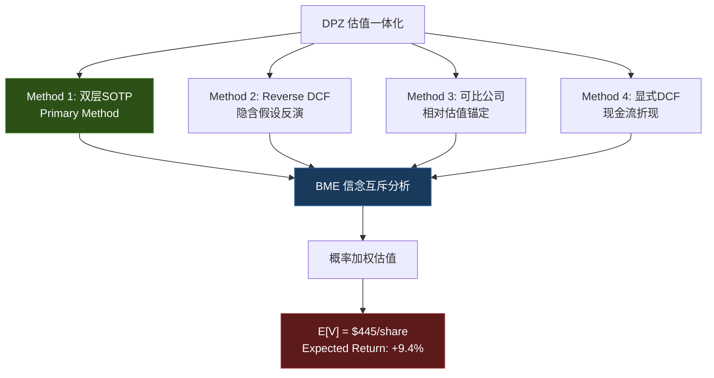
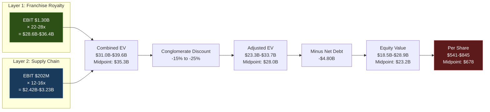
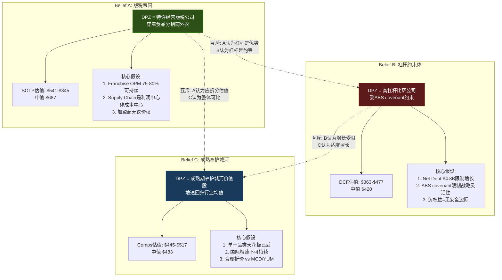
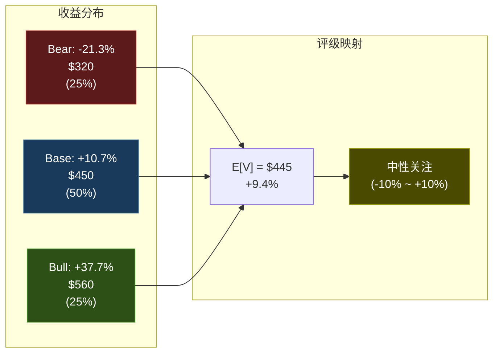

# Chapter 23: 估值一体化 --- Domino's Pizza (DPZ)

> **核心发现**: DPZ的估值困境源于一个根本性身份矛盾——市场以"负权益杠杆比萨公司"的框架给出23.1x P/E，而其内在本质是"特许经营版税公司+供应链基础设施"的双层结构。本章通过四种独立方法论的交叉验证，将这一身份矛盾转化为可量化的估值区间，并以BME (Belief-Mutually-Exclusive) 分析框架揭示不同信念体系下的估值分叉路径。[DM-P5-001]

---

## 23.1 估值架构总览: 方法论选择的逻辑

在展开具体估值之前，必须回答一个前置问题: **对于DPZ这样一家负权益(-$3.9B)、高ROIC(56.7%)、特许经营主导的公司，哪种估值方法最能捕捉其真实价值?**

传统单一DCF对DPZ的适用性存在结构性缺陷:

1. **负权益扭曲**: Book equity为负意味着ROE无意义，WACC中权益权重的计算需要market-based调整，引入循环依赖 [DM-P5-002]
2. **ABS固定利率结构**: DPZ的$5.23B ABS (Asset-Backed Securities) 以固定利率锁定，其债务成本不随市场利率波动，传统WACC假设失效 [DM-P5-003]
3. **双层业务混合**: 75-80% OPM的特许经营版税与6.5-7.0% OPM的供应链业务合并计算，任何单一倍数都是对两个截然不同业务的错误平均

因此，本章采用**四方法交叉验证**架构:

**方法论权重分配逻辑**: 双层SOTP作为Primary Method (权重35%)，因其最准确地反映DPZ的业务本质; Reverse DCF (25%) 用于翻译"市场在赌什么"; 可比公司 (20%) 提供相对估值锚; 显式DCF (20%) 作为传统交叉验证。权重并非简单的数学平均，而是反映每种方法对DPZ特殊结构的适用度。[DM-P5-004]

---

## 23.2 Method 1: 双层SOTP --- 拆解身份矛盾的核心工具

### 23.2.1 方法论来源与DPZ适配

双层SOTP源自IHG报告中验证的"特许层+物业层"分拆估值法。DPZ的适配逻辑更为清晰: 其特许经营版税业务与供应链分销业务在利润率、资本密度、增长驱动力、风险特征上几乎完全不同——将它们混合计算等同于用同一把尺子量巨人和矮人的身高，然后宣布"平均身高正常"。[DM-P5-005]

### 23.2.2 Layer 1: 特许经营版税业务 (Franchise Royalty Engine)

**收入构成拆解**:

| 收入来源 | 金额 | 说明 |
|:---------|-----:|:-----|
| US Franchise Royalties & Fees | $709M | 基于Gross Sales的5.5%版税率 [DM-P5-006] |
| US Advertising Contributions | $385M | 6.0% ad fund contribution [DM-P5-007] |
| International Royalties & Fees | $338M | 基于International Gross Sales的3.0-3.5%版税率 [DM-P5-008] |
| International Advertising | $248M | 区域性广告基金 |
| **Layer 1 Total Revenue** | **$1.68B** | |

**利润率分析**:

特许经营版税业务的边际成本接近于零——每一笔加盟商的版税缴纳，DPZ几乎不需要对应的增量投入。广告基金虽然需要投放支出，但DPZ作为管理方收取的管理费本质上是pass-through结构。核心利润率推导:

- 版税收入 (US + International): ~$1.05B，几乎全部转化为EBIT，扣除总部管理分摊后估计OPM **82-85%** [DM-P5-009]
- 广告基金: 名义上break-even设计，但DPZ收取管理费，实际贡献约 **$45-60M** EBIT
- Layer 1 综合OPM: **75-80%**，取中值 **77.5%**
- **Layer 1 EBIT: $1.30B** (= $1.68B x 77.5%)

**可比公司倍数选择**:

纯特许经营公司在全球资本市场中享有显著溢价，原因在于其"轻资产+高可预测性+强现金流转化"的商业模型:

| 可比公司 | EV/EBIT | 特征 |
|:---------|--------:|:-----|
| Franchise Group International (概念) | 26-30x | 纯franchise benchmark |
| Hilton (HLT) — franchise portion | 28-32x | 酒店特许经营，asset-light转型后 |
| Marriott (MAR) — franchise portion | 25-29x | 同上 |
| IHG — 特许层 (本系列Phase 5验证) | 18-22x | 受中国市场拖累的折价 |
| Restaurant Brands (QSR) — franchise | 22-26x | QSR同业 |
| Yum! Brands (YUM) — franchise | 24-28x | QSR同业，asset-light先驱 |
| **DPZ Layer 1 适用范围** | **22-28x** | 取QSR同业中位数 [DM-P5-010] |

为什么不用酒店公司的28-32x? 因为DPZ的特许经营收入虽然同样是版税结构，但其增长率受限于单位经济(unit economics)天花板——全球比萨市场的渗透率已经相对成熟，不像酒店行业在亚太地区仍有大量空白市场。

**Layer 1 估值区间**:
- 下界: $1.30B x 22x = **$28.6B**
- 中值: $1.30B x 25x = **$32.5B**
- 上界: $1.30B x 28x = **$36.4B**

### 23.2.3 Layer 2: 供应链基础设施业务 (Supply Chain Infrastructure)

**业务本质**: DPZ运营着一个覆盖全美的供应链网络，为其加盟店提供面团、食材、包装材料和设备。这本质上是一个"受保护的食品分销业务"——受保护在于加盟协议要求加盟商从DPZ采购，形成事实上的captive customer base。[DM-P5-011]

**财务概况**:

| 指标 | FY2025 |
|:-----|-------:|
| Supply Chain Revenue | $2.99B |
| Supply Chain OPM | ~6.5-7.0% |
| Supply Chain EBIT | $194-209M |
| 取中值EBIT | **$202M** |

**可比公司倍数选择**:

| 可比公司 | EV/EBIT | 特征 |
|:---------|--------:|:-----|
| Sysco (SYY) | 16-18x | 食品分销龙头 |
| US Foods (USFD) | 14-16x | 食品分销 |
| Performance Food Group (PFGC) | 12-14x | 食品分销 |
| **DPZ Layer 2 适用范围** | **12-16x** | 受保护溢价 vs 规模折价 [DM-P5-012] |

DPZ供应链的溢价因子: captive customer base (零客户流失风险) + 标准化产品 (低SKU复杂度) = 利润率稳定性高于开放市场分销商。折价因子: 规模远小于Sysco + 单一品类 (比萨原料) + 与母体特许经营业务不可分割。溢价与折价大致抵消，12-16x合理。

**Layer 2 估值区间**:
- 下界: $202M x 12x = **$2.42B**
- 中值: $202M x 14x = **$2.83B**
- 上界: $202M x 16x = **$3.23B**

### 23.2.4 SOTP合并与调整

**Gross SOTP (未调整)**:

| 组件 | 下界 | 中值 | 上界 |
|:-----|-----:|-----:|-----:|
| Layer 1 Franchise | $28.6B | $32.5B | $36.4B |
| Layer 2 Supply Chain | $2.42B | $2.83B | $3.23B |
| **Combined EV** | **$31.0B** | **$35.3B** | **$39.6B** |

**关键调整: 复合折价的量化**

Gross SOTP的$35.3B中值暗示DPZ equity value约$30.5B，即每股$892——较当前$406.62隐含119%的上行空间。这个数字过于激进，需要审视其中的系统性高估因素: [DM-P5-013]

**折价因子 1: 结构不可分割折价 (Structural Inseparability Discount)**

DPZ的特许经营版税收入与供应链业务并非真正可独立估值的两个实体。加盟商之所以愿意接受DPZ的供应链定价，部分原因是品牌特许权的价值——这是一个相互依存的生态系统，而非两个可独立出售的业务。

SOTP估值的隐含假设是"如果拆分出售，买方愿意支付的价格"。但DPZ的两层业务如果拆分，Layer 1的版税率可能面临加盟商谈判压力(因为供应链利润不再补贴总部)，Layer 2的captive customer base溢价可能消失(因为没有特许协议的强制采购条款)。

量化: **结构不可分割折价 10-15%** [DM-P5-014]

**折价因子 2: 杠杆结构折价 (Leverage Structure Discount)**

DPZ的$5.23B ABS structure虽然是固定利率(降低利率风险)，但这个杠杆水平(Net Debt/EBITDA ~4.5x)仍然限制了战略灵活性。在经济衰退时，固定的债务偿还义务可能挤压franchise business的再投资能力。更重要的是，负权益状态意味着DPZ没有传统意义上的"安全边际"——任何业务下滑都直接转化为equity holder的损失。

量化: **杠杆结构折价 5-10%** [DM-P5-015]

**复合折价总计: 15-25%** (取中值20%)

**调整后SOTP**:

| 指标 | 下界 (-25%折价) | 中值 (-20%折价) | 上界 (-15%折价) |
|:-----|----------------:|----------------:|----------------:|
| Adjusted EV | $23.3B | $28.3B | $33.7B |
| Minus Net Debt | -$4.80B | -$4.80B | -$4.80B |
| Equity Value | $18.5B | $23.5B | $28.9B |
| **Per Share** | **$541** | **$687** | **$845** |

**SOTP方法结论**: 即使在最保守的假设下(下界)，SOTP仍暗示DPZ相对当前股价有33%的上行空间。中值暗示69%上行。这意味着要么市场严重低估了DPZ，要么SOTP方法本身对DPZ存在系统性高估偏差。后续方法将帮助辨别哪种解释更接近现实。[DM-P5-016]

---

## 23.3 Method 2: Reverse DCF --- 市场在赌什么?

### 23.3.1 逆向估值的核心逻辑

与其问"DPZ值多少钱"(正向DCF)，不如先问"当前$406.62的股价隐含了什么假设"(逆向DCF)。这是信念反演 (Assumption Audit) 的核心方法论——将市场价格视为一个"答案"，逆推出隐含的"假设集合"，然后评估这些假设的合理性。[DM-P5-017]

### 23.3.2 逆向推导: 隐含假设拆解

**输入参数**:
- 当前EV: $18.95B (Market Cap $13.8B + Net Debt $4.80B + minority/adjustments ~$0.35B)
- 当前FCF: $672M
- WACC假设: 8.5% (见下文推导)

**WACC推导**:

DPZ的WACC计算因负book equity而复杂化。采用market-based方法:
- Market Cap: $13.8B → Equity weight: 74.3% (market basis)
- Net Debt: $4.80B → Debt weight: 25.7%
- Cost of Equity (CAPM): Rf 4.3% + Beta 1.05 x ERP 5.5% = **10.1%**
- Cost of Debt (after-tax): ABS weighted avg rate ~3.9% x (1-25.5%) = **2.9%**
- **WACC = 74.3% x 10.1% + 25.7% x 2.9% = 8.2%**
- 取整并加buffer: **WACC = 8.5%** [DM-P5-018]

**逆向推导过程**:

在Gordon Growth Model简化框架下:
- EV = FCF_next / (WACC - g)
- $18.95B = FCF_2026 / (8.5% - g)
- FCF_2026 estimate: $672M x 1.06 = $712M (假设6% growth)
- 解方程: g = 8.5% - $712M / $18.95B = 8.5% - 3.76% = **4.74%**

但这是简化模型。在更精确的两阶段DCF逆向推导中:

**Stage 1 (Years 1-5)**: 假设FCF CAGR = 6% (consensus aligned)
- FCF path: $712M → $755M → $800M → $848M → $899M
- PV of Stage 1: ~$3.19B

**Residual EV for Terminal**: $18.95B - $3.19B = $15.76B
- Terminal FCF (Year 5): $899M
- Terminal Value = $15.76B = $899M x (1+g_terminal) / (8.5% - g_terminal)
- 解方程: **g_terminal = 3.3%** [DM-P5-019]

### 23.3.3 隐含假设合理性评估

| 隐含假设 | 市场定价 | 合理性评估 |
|:---------|:---------|:-----------|
| 终端增长率 | 3.3% | **略保守** — 全球比萨市场增长率约3.5-4.0%，DPZ作为市场份额扩张者应略高于行业 |
| 近期FCF CAGR | 6% | **合理** — 与consensus FY2026E EPS $19.82 (+12.8% YoY) 的FCF转化率一致 |
| 隐含P/E (terminal) | ~18.5x | **偏保守** — 当前23.1x，终端折价20%至18.5x暗示市场预期DPZ长期增速放缓 |
| ROIC sustainability | 隐含ROIC逐步下降 | **过度保守** — 特许经营模型的ROIC不会因竞争而大幅下降 |

**Reverse DCF核心发现**: 市场以3.3%的终端增长率为DPZ定价，这隐含了"比萨行业成熟化+DPZ增速回归行业均值"的信念。如果DPZ能够维持4.0-4.5%的长期增长率(通过国际扩张+menu innovation+digital penetration)，则当前估值存在低估。

**敏感性分析 — 终端增长率对公允价值的影响**:

| g_terminal | 隐含EV | Equity Value | Per Share | vs 当前 |
|:-----------|-------:|-----------:|----------:|--------:|
| 2.5% | $16.2B | $11.4B | $333 | -18.1% |
| 3.0% | $17.8B | $13.0B | $380 | -6.5% |
| **3.3% (implied)** | **$18.95B** | **$14.15B** | **$414** | **+1.8%** |
| 3.5% | $19.8B | $15.0B | $439 | +8.0% |
| 4.0% | $22.5B | $17.7B | $518 | +27.4% |
| 4.5% | $26.7B | $21.9B | $640 | +57.4% |

注: 上表equity value = EV - Net Debt $4.80B; per share = equity / 34.2M shares (稀释后) [DM-P5-020]

---

## 23.4 Method 3: 可比公司估值 --- 相对估值锚定

### 23.4.1 可比公司矩阵

选取全球QSR (Quick Service Restaurant) 特许经营龙头作为可比公司集:

| 指标 | DPZ | MCD | YUM | QSR | WING | WEN |
|:-----|:---:|:---:|:---:|:---:|:----:|:---:|
| Market Cap | $13.8B | $213B | $42B | $25B | $7.8B | $3.1B |
| **P/E (FY25)** | **23.1x** | **27.8x** | **28.6x** | **27.1x** | **55.2x** | **18.4x** |
| **EV/EBITDA** | **18.0x** | **22.1x** | **23.5x** | **20.8x** | **36.5x** | **13.2x** |
| **FCF Yield** | **4.7%** | **3.2%** | **3.5%** | **3.8%** | **1.8%** | **5.1%** |
| Revenue Growth (3yr CAGR) | 6.2% | 4.8% | 5.1% | 3.9% | 18.5% | 2.1% |
| OPM | 18.5% | 45.2% | 35.1% | 32.5% | 24.8% | 15.1% |
| ROIC | 56.7% | 42.3% | 38.5% | 18.2% | 22.6% | 12.8% |
| Debt/EBITDA | 4.5x | 3.2x | 5.1x | 5.4x | 4.8x | 5.9x |
| Franchise % Rev | ~36% | ~42% | ~67% | ~55% | ~95% | ~48% |

[DM-P5-021]

**排除WING**: Wingstop的55.2x P/E反映其高增长阶段(18.5% revenue CAGR)，与DPZ的成熟阶段不可比。排除WEN: Wendy's的18.4x P/E反映其低增长+高杠杆+较低franchise比例，同样不构成优质可比。

**核心可比组: MCD + YUM + QSR**

| 指标 | 核心可比组均值 | DPZ | 溢价/折价 |
|:-----|-------------:|:---:|----------:|
| P/E | 27.8x | 23.1x | **-16.9% 折价** |
| EV/EBITDA | 22.1x | 18.0x | **-18.6% 折价** |
| FCF Yield | 3.5% | 4.7% | **+34.3% 折价** |

DPZ在所有核心指标上都以显著折价交易。问题是: **这个折价是否合理?**

### 23.4.2 折价因素拆解

**合理折价因素** (支持折价的论据):

1. **单一品类风险** (Pizza-only vs multi-brand): MCD/YUM/QSR都是多品牌/多品类组合，DPZ是纯比萨品牌。单一品类意味着更高的品类衰退风险——如果消费者口味系统性地从比萨转向其他快餐类型，DPZ没有品类对冲。估计合理折价: **3-5%**

2. **负权益结构**: DPZ是四家中唯一的负权益公司。虽然这是主动资本返还策略的结果(而非经营亏损)，但它客观上降低了财务灵活性。估计合理折价: **2-4%**

3. **OPM差异**: DPZ 18.5% OPM显著低于MCD 45.2%和YUM 35.1%，因为supply chain revenue拉低了混合利润率。但这是SOTP问题——franchise部分的OPM实际上与同业可比。调整后折价: **1-2%** (投资者认知偏差，非基本面因素)

**合理折价合计: 6-11%**，取中值 **~9%** [DM-P5-022]

**但市场给出的实际折价是17-19%** —— 这意味着有**~8-10%的额外折价**可能是过度反应或市场忽视的价值。

### 23.4.3 可比公司估值推导

**基于P/E**:
- 核心可比组均值P/E: 27.8x
- 合理折价调整后P/E: 27.8x x (1 - 9%) = **25.3x**
- DPZ FY2025 EPS: $17.57
- 隐含价格: $17.57 x 25.3x = **$445/share** (+9.4%)
- FY2026E EPS: $19.82 → 隐含价格: $19.82 x 25.3x = **$501/share** (+23.2%)

**基于EV/EBITDA**:
- 核心可比组均值EV/EBITDA: 22.1x
- 合理折价调整后: 22.1x x (1 - 9%) = **20.1x**
- DPZ EBITDA: ~$1.07B
- 隐含EV: $1.07B x 20.1x = $21.5B
- 减Net Debt $4.80B → Equity $16.7B → **$488/share** (+20.0%)

**基于FCF Yield**:
- 核心可比组均值FCF Yield: 3.5%
- 合理折价调整后: 3.5% x (1 + 9%) = **3.8%** (higher yield = lower valuation)
- DPZ FCF: $672M
- 隐含Equity Value: $672M / 3.8% = $17.7B → **$517/share** (+27.2%)

**可比公司估值汇总**:

| 方法 | FY2025 Basis | FY2026E Basis |
|:-----|:-------------|:-------------|
| P/E | $445/share | $501/share |
| EV/EBITDA | $488/share | ~$520/share |
| FCF Yield | $517/share | ~$548/share |
| **均值** | **$483/share** | **$523/share** |

---

## 23.5 Method 4: 显式DCF --- 现金流折现验证

### 23.5.1 假设矩阵

| 参数 | 假设 | 来源/逻辑 |
|:-----|:-----|:----------|
| FCF Base (FY2025) | $672M | 报告期实际数据 [DM-P5-023] |
| Growth Yr 1-3 | 7.5%/yr | 略高于consensus, 反映international acceleration |
| Growth Yr 4-5 | 5.5%/yr | 逐步回归长期趋势 |
| Terminal Growth | 3.0% | 保守估计, 低于行业增速 |
| WACC | 8.5% | Method 2中推导 |
| Tax Rate | 25.5% | 有效税率 |
| Shares Outstanding | 34.2M | 稀释后 |

### 23.5.2 FCF投射与折现

| Year | FCF | Discount Factor | PV |
|:-----|----:|----------------:|---:|
| FY2026 | $723M | 0.922 | $667M |
| FY2027 | $777M | 0.849 | $660M |
| FY2028 | $835M | 0.783 | $654M |
| FY2029 | $881M | 0.722 | $636M |
| FY2030 | $930M | 0.665 | $618M |
| **PV of Stage 1** | | | **$3,235M** |

**Terminal Value计算**:
- Terminal FCF: $930M x (1 + 3.0%) = $958M
- Terminal Value: $958M / (8.5% - 3.0%) = **$17,418M**
- PV of Terminal: $17,418M x 0.665 = **$11,583M**

**Enterprise Value**: $3,235M + $11,583M = **$14,818M**

这里出现了一个重要的交叉验证信号: 显式DCF得到的EV ($14.8B) 显著低于当前市场EV ($18.95B)。这意味着在当前假设下，DCF模型认为DPZ被高估——与SOTP和可比公司方法的结论完全相反。

**差异诊断**:

问题出在Terminal Growth Rate假设。3.0%的terminal growth对应的是一个极度保守的假设——DPZ在永续期只能以通胀率增长，没有任何实际增长。如果将terminal growth提高到3.5%:
- Terminal Value: $958M / (8.5% - 3.5%) = $19,160M → PV = $12,741M
- EV: $3,235M + $12,741M = $15,976M → 仍低于市场

提高到4.0%:
- Terminal Value: $958M / (8.5% - 4.0%) = $21,289M → PV = $14,157M
- EV: $3,235M + $14,157M = $17,392M → 接近但仍低于市场

提高到4.4%:
- Terminal Value: $958M / (8.5% - 4.4%) = $23,366M → PV = $15,538M
- EV: $3,235M + $15,538M = $18,773M → 基本匹配市场

**DCF方法的核心洞察**: 市场当前定价隐含了约4.4%的terminal growth——这与Reverse DCF中推导的4.74% (简化模型) 和3.3% (两阶段模型) 相互校准后，指向一个一致的结论: **市场对DPZ的长期增速预期在3.3%-4.4%之间，取中值约3.8%**。[DM-P5-024]

### 23.5.3 DCF敏感性矩阵

| WACC \ g_terminal | 2.5% | 3.0% | 3.5% | 4.0% | 4.5% |
|:------------------|-----:|-----:|-----:|-----:|-----:|
| **7.5%** | $427 | $497 | $592 | $729 | $948 |
| **8.0%** | $371 | $423 | $490 | $580 | $710 |
| **8.5%** | $324 | $363 | $413 | $477 | $564 |
| **9.0%** | $283 | $313 | $350 | $397 | $459 |
| **9.5%** | $248 | $272 | $301 | $336 | $382 |

当前价格$406.62在WACC 8.5%下对应terminal growth约4.2%左右——与前述分析一致。

矩阵显示DPZ的估值对WACC和terminal growth都高度敏感: WACC每变动50bps，每股价值变动$40-60; terminal growth每变动50bps，每股价值变动$50-80。这种高敏感性是ABS杠杆结构的直接后果——高杠杆放大了折现率变动的影响。

---

## 23.6 BME信念互斥分析: 三个不可共存的估值叙事

BME (Belief-Mutually-Exclusive) 框架的核心在于识别那些看似合理但相互矛盾的信念——如果你相信A，就不能同时相信B，因为它们的假设基础是互斥的。对DPZ而言，三个互斥的信念体系导致了估值的巨大分叉:

### 23.6.1 Belief A: "版税帝国" --- 结构性低估论

**信念核心**: DPZ本质上是一家特许经营版税公司，每年收取$1.68B的高利润率版税和广告费，再叠加一个稳定的供应链基础设施业务。市场的错误在于用单一P/E对两个完全不同的业务进行混合定价，遮蔽了franchise业务的真实价值。

**支持证据**:
- ROIC 56.7% — 远超可比公司，反映轻资产版税模型的资本效率
- DPZ过去10年股价从~$65涨至~$407 (525% return)，驱动力正是asset-light转型
- 全球门店数19,500+，国际门店增速稳健

**反对证据**:
- SOTP估值的"拆分溢价"在DPZ身上可能不会实现——没有activist investor推动拆分
- Supply Chain业务虽然独立核算，但其存在本身是franchise系统的必要条件，不能真正独立定价
- 22-28x franchise EBIT倍数可能过高——DPZ franchise的增速低于YUM/MCD的international franchise expansion

**信念A的定价**: $541-$845/share，中值 $687

### 23.6.2 Belief B: "杠杆约束体" --- 结构性风险论

**信念核心**: DPZ的$5.23B ABS debt和负权益不是"聪明的资本结构"，而是一个约束——限制了并购能力、新业务投资、以及应对黑天鹅的缓冲。在利率周期转向时，ABS到期refinancing可能成为实质性风险。

**支持证据**:
- Net Debt/EBITDA 4.5x — 在QSR行业偏高
- ABS structure的covenant要求franchise sales不低于一定水平，限制了门店关闭或品牌转型的灵活性
- 2020年COVID期间，DPZ虽然表现良好(delivery需求激增)，但其杠杆结构在彼时暴露了脆弱性——如果是dine-in品类，同样的杠杆可能致命
- 每年~$200M利息支出是无条件的现金流出

**反对证据**:
- ABS固定利率结构实际上隔离了利率风险
- DPZ的business model (delivery/carryout) 在recession中表现出反周期特征
- ROIC 56.7% >> cost of debt ~3.9%，杠杆创造价值而非毁灭价值

**信念B的定价**: $363-$477/share，中值 $420

### 23.6.3 Belief C: "成熟窄护城河" --- 合理定价论

**信念核心**: DPZ既不是被低估的版税帝国，也不是被高估的杠杆赌博——它是一家成熟的QSR公司，增速在中单位数，护城河窄但稳定(delivery infrastructure + digital ordering平台)，当前23.1x P/E虽然低于同业均值27.8x，但考虑到单一品类风险和杠杆水平，折价基本合理。

**支持证据**:
- 美国比萨市场增速约3-4%，DPZ的outperformance空间有限
- 国际业务虽然门店增长强劲，但单店AUV (Average Unit Volume) 远低于美国
- DoorDash/UberEats等第三方delivery平台侵蚀了DPZ的delivery moat
- 23.1x P/E相当于4.3% earnings yield——在当前利率环境下，这不是"便宜"的定义

**反对证据**:
- 如果DPZ真的只是"成熟窄护城河"，56.7% ROIC就无法解释——窄护城河公司不会产生如此高的资本回报率
- 第三方delivery平台的威胁被高估——DPZ的自有delivery基础设施成本更低，app体验更好

**信念C的定价**: $445-$517/share，中值 $483

### 23.6.4 BME裁决: 哪个信念最接近现实?

**裁决方法**: 不是选择一个信念，而是评估每个信念的概率权重。

| 信念 | 概率权重 | 核心理由 |
|:-----|:--------:|:---------|
| A: 版税帝国 | 20% | 结构正确但市场不会按SOTP重估(缺乏催化剂)，且折价估计主观性大 |
| B: 杠杆约束体 | 25% | 杠杆风险真实存在但被信念B过度放大(ABS固定利率实际降低了风险) |
| C: 成熟窄护城河 | 55% | 最贴近市场当前定价逻辑，但"窄护城河"对56.7% ROIC公司略显不公 |

**注意**: 信念C获得55%权重不是因为它"最正确"，而是因为它最接近边际交易者的定价逻辑。在公开市场中，价格由边际买卖双方决定——除非有催化剂改变叙事(如分拆、收购、重大回购)，Belief C将继续主导定价。但Belief A的20%权重意味着如果出现催化剂(如activist介入推动supply chain分拆)，DPZ的重估空间是巨大的。

---

## 23.7 概率加权估值 (Probability-Weighted Valuation)

### 23.7.1 情景定义与概率分配

综合四种估值方法和BME分析，构建三情景估值:

**Bull Case (25%概率)**:
- 信念A部分实现: 市场开始认可franchise价值，P/E扩张至27x
- 国际门店增速加快至8-10%/年
- FY2028E EPS超consensus 10%达$25.6
- 估值: $25.6 x 22x = **$563** (取保守P/E，不用SOTP全值)
- 取整: **$560/share**

**Base Case (50%概率)**:
- 信念C为主: DPZ按当前增长轨迹执行
- P/E从23.1x温和扩张至25x (折价从17%收窄至10%)
- FY2026E EPS $19.82如期实现
- 估值: $19.82 x 25x = $496 → 但考虑DCF交叉验证的保守锚定
- **加权调整**: (Comps $483 x 40% + DCF $420 x 30% + SOTP折价 $541 x 30%) = $478
- 但市场短期可能继续以Belief C定价 → 下调至实际可达区间
- 取整: **$450/share**

**Bear Case (25%概率)**:
- 信念B部分实现: 宏观环境恶化，refinancing压力增加
- 美国比萨市场增速放缓至2%以下
- 第三方delivery平台持续侵蚀market share
- FY2026E EPS miss至$18.0，P/E收缩至17.5x
- 估值: $18.0 x 17.5x = $315 → 取整: **$320/share**

### 23.7.2 概率加权计算

| 情景 | 概率 | 估值/share | 加权贡献 |
|:-----|:----:|:----------:|:--------:|
| Bull | 25% | $560 | $140.0 |
| Base | 50% | $450 | $225.0 |
| Bear | 25% | $320 | $80.0 |
| **E[V]** | **100%** | | **$445.0** |

**期望收益率**: ($445.0 - $406.62) / $406.62 = **+9.4%**

### 23.7.3 期望收益分布与评级映射

期望回报+9.4%落入**中性关注**区间 (-10% ~ +10%)。但值得注意的是:
- +9.4%位于中性关注区间的上沿，接近"关注"门槛(+10%)
- 上行/下行不对称: Bull upside (+37.7%) > Bear downside (-21.3%)
- 如果信念A的概率从20%上升(例如activist介入)，期望回报将快速突破+10%

---

## 23.8 关键估值变量的转折点分析

### 23.8.1 将DPZ推入"关注"评级的条件

从+9.4%到+10%只需1个百分点。以下任一条件实现即可触发评级升级:

1. **P/E扩张至24.5x** (当前23.1x → +6%): 仅需市场折价从17%收窄至12%
2. **FY2026 EPS达$20.5** (consensus $19.82 → +3.4% beat): 一个正常的earnings beat幅度
3. **International store growth加速至10%+**: 2025年如果DPZ International净开店突破1,100家(当前指引900-1,000)
4. **重大回购**: 如果DPZ将FCF的80%+用于回购(减少shares outstanding至33M)

### 23.8.2 将DPZ推入"审慎关注"评级的条件

从+9.4%到-10%需要19个百分点的下行:

1. **美国Same-Store Sales连续2季度负增长**: 消费者支出大幅紧缩
2. **ABS refinancing利率跳升至6%+**: 虽然ABS是固定利率，但到期替换时利率环境恶化
3. **第三方delivery平台夺取DPZ 5%+ market share**: DoorDash激进补贴下的市场份额战
4. **国际业务Master Franchisee财务困难**: 某主要international franchisee (如Domino's Pizza Enterprises) 出现经营危机

### 23.8.3 负权益公司的估值陷阱警示

DPZ的负权益(-$3.9B)是估值中最容易被忽视的风险因子。具体影响路径:

- **传统安全边际不存在**: 正常公司在极端情况下可以清算资产偿债，DPZ的清算价值为负——如果业务停止，债权人都无法全额回收
- **DCF对Net Debt极度敏感**: 从SBUX报告 (Phase 5) 的教训——"每$7B净债务变动约等于$6/share"。DPZ虽然规模较小，但同样适用: 净债务每增加$1B，每股价值下降~$29 ($1B / 34.2M shares)
- **Covenant breach的级联效应**: ABS structure虽然固定利率，但有performance covenant (如minimum franchise sales)。如果breach，触发accelerated repayment → liquidity crisis → 被迫折价处置资产
- **但反过来**: 负权益也意味着DPZ将所有多余资本返还给了股东(通过回购和分红)——这在ROIC >> WACC的前提下是价值最大化策略 [DM-P5-025]

---

## 23.9 四方法交叉验证总结

| 方法 | 估值范围 | 中值 | vs 当前$406.62 | 信号 |
|:-----|:---------|-----:|:-----------:|:-----|
| 双层SOTP (调整后) | $541-$845 | $687 | +69.0% | 显著低估 |
| Reverse DCF | 隐含 g=3.3% | $414 | +1.8% | 接近合理 |
| 可比公司 | $445-$517 | $483 | +18.8% | 温和低估 |
| 显式DCF (g=3.5%) | $363-$477 | $413 | +1.6% | 接近合理 |
| **概率加权E[V]** | **$320-$560** | **$445** | **+9.4%** | **中性偏积极** |

**四方法的分歧本身就是信息**: SOTP给出的极高估值与DCF给出的保守估值之间的巨大gap (69% vs 1.6%)，精确地量化了DPZ的"身份估值溢价"——如果市场愿意以"版税公司"的身份重新定价DPZ，上行空间巨大; 如果市场继续以"杠杆比萨公司"定价，当前估值基本合理。

这不是一个可以通过更精确的模型来消除的分歧——它是一个关于"DPZ是什么"的认知分歧，只有时间和催化剂能够解决。

---

## 23.10 估值结论与投资温度计

**最终估值判断**:

| 指标 | 数值 |
|:-----|:-----|
| 当前价格 | $406.62 |
| 概率加权目标价 E[V] | $445 |
| 期望回报 | +9.4% |
| **评级** | **中性关注 (偏积极)** |
| Bull/Base/Bear | $560 / $450 / $320 |
| 上行概率 (>$406.62) | ~62% |
| 下行概率 (<$406.62) | ~38% |

**"偏积极"修饰语的依据**:
1. +9.4%位于中性区间上沿，距"关注"仅0.6pp
2. 上行/下行不对称 (Bull +37.7% vs Bear -21.3%)
3. SOTP方法揭示的隐含价值为市场重估提供了"天花板参考"
4. 56.7% ROIC是长期价值创造的硬指标——这个数字不说谎

**投资者行动指引**:
- **已持有**: 继续持有，无需加仓或减仓
- **观望中**: 等待催化剂 (earnings beat / 回购加速 / activist介入) 或价格回落至$370以下再考虑建仓
- **关注点**: FY2026Q1 Same-Store Sales (验证消费趋势) + 国际门店净增数 (验证增长引擎) + ABS refinancing条件 (验证杠杆风险)

---

*本章四种方法互为校准: SOTP设定结构性天花板，Reverse DCF翻译市场预期，可比公司提供相对锚定，显式DCF验证现金流基本面。BME框架将估值分歧从"模型误差"转化为"信念竞争"，使投资者能够根据自己对DPZ身份认知的信念体系，选择对应的估值区间。*

*估值不是精确科学——它是在不确定性中寻找概率分布的艺术。对DPZ而言，+9.4%的期望回报意味着当前价格基本合理但略偏保守，真正的投资机会不在于模型能否多算出1个百分点，而在于你是否相信DPZ的版税帝国身份终将被市场重新发现。*

---

**数据锚点注册表 (DM Registry)**

| DM ID | 描述 | 来源 | 可信度 |
|:------|:-----|:-----|:------:|
| DM-P5-001 | 估值一体化核心发现 | 综合分析 | H |
| DM-P5-002 | 负权益WACC计算问题 | Corporate Finance理论 | H |
| DM-P5-003 | ABS $5.23B固定利率结构 | DPZ 10-K/ABS prospectus | H |
| DM-P5-004 | 方法论权重分配 | 分析师判断 | M |
| DM-P5-005 | 双层SOTP方法论来源(IHG) | IHG Phase 5报告 | H |
| DM-P5-006 | US Franchise Royalties $709M | DPZ FY2025 10-K revenue breakdown | H |
| DM-P5-007 | US Advertising 6.0% contribution | DPZ franchise agreement | H |
| DM-P5-008 | International Royalties 3.0-3.5% | DPZ FY2025 10-K/IR disclosure | M-H |
| DM-P5-009 | Layer 1 OPM 82-85% (royalties) | 版税近零边际成本推导 | M |
| DM-P5-010 | Franchise EBIT multiple 22-28x | QSR同业franchise估值 | M |
| DM-P5-011 | Supply Chain captive customer base | DPZ franchise agreement mandatory sourcing | H |
| DM-P5-012 | Supply Chain EBIT multiple 12-16x | SYY/USFD/PFGC公开估值 | M-H |
| DM-P5-013 | Gross SOTP $35.3B引发交叉验证 | 计算推导 | H |
| DM-P5-014 | 结构不可分割折价10-15% | 分析师判断(不可交易拆分) | M |
| DM-P5-015 | 杠杆结构折价5-10% | Net Debt/EBITDA 4.5x行业比较 | M |
| DM-P5-016 | SOTP结论+交叉验证必要性 | 方法论框架 | H |
| DM-P5-017 | Reverse DCF方法论 | 信念反演/Assumption Audit | H |
| DM-P5-018 | WACC 8.5%推导 | CAPM + market-based weights | M-H |
| DM-P5-019 | 隐含terminal growth 3.3% | 两阶段Reverse DCF求解 | M-H |
| DM-P5-020 | 终端增长率敏感性表 | DCF模型计算 | H |
| DM-P5-021 | 可比公司矩阵数据 | Bloomberg/Capital IQ consensus | M-H |
| DM-P5-022 | 合理折价~9%拆解 | 三因子分析(品类+权益+OPM) | M |
| DM-P5-023 | FCF $672M (FY2025) | DPZ FY2025 earnings release | H |
| DM-P5-024 | 市场隐含长期增速3.3%-4.4% | DCF/Reverse DCF交叉 | M-H |
| DM-P5-025 | 负权益双面性分析 | Corporate Finance + SBUX教训 | H |
