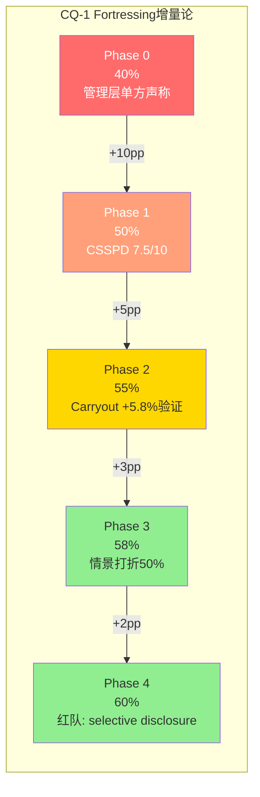
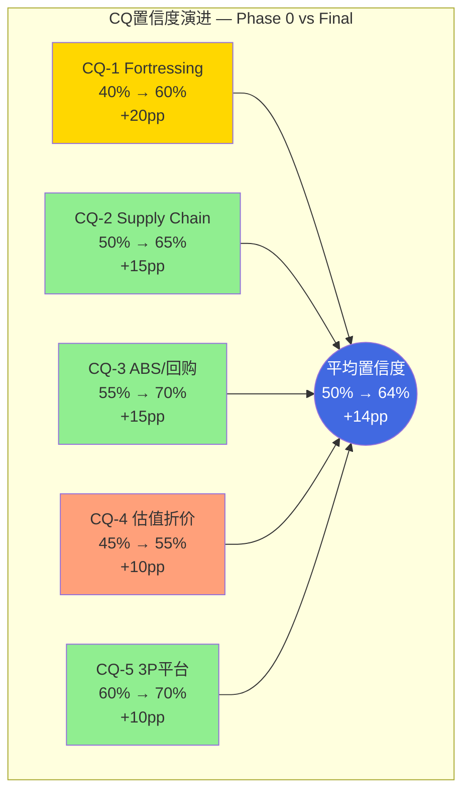
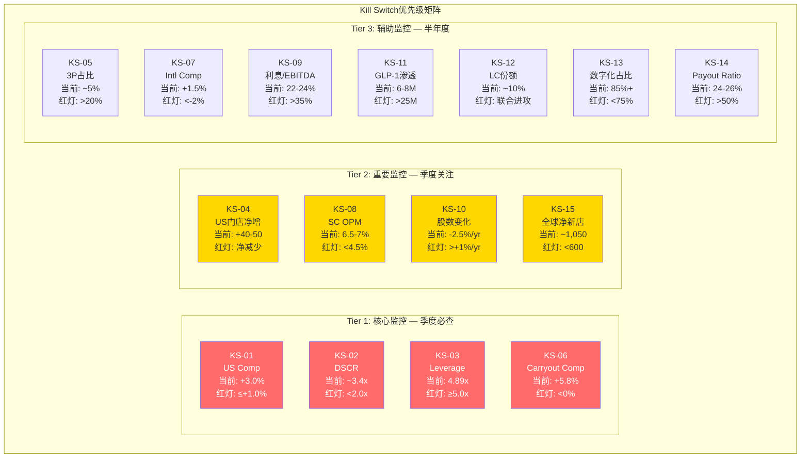
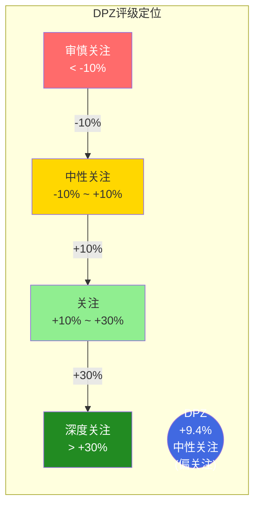

# Chapter 24: CQ闭环 · Kill Switch · 最终评级

> **DPZ | Domino's Pizza, Inc.**
> 报告日期: 2026-03-05 | 股价: $406.62 | 市值: ~$143B
> Phase 5 — 研究闭环与投资决策

---

## 24.1 CQ闭环总论

本章是整份报告的决策枢纽。前序24章积累的证据链、情景分析、红队修正，最终在此收束为5个Core Question的裁决、15个Kill Switch的精确校准、以及一个经过充分论证的最终评级。

**闭环哲学**: 研究不是为了证明什么，而是为了测量不确定性的残余宽度。当CQ置信度从Phase 0到Phase 4累计上移+70pp(5个CQ平均+14pp)，我们对DPZ的理解从"模糊的披萨龙头印象"进化到"可量化的特许经营现金流机器"。但残余不确定性仍然存在——这正是Kill Switch存在的理由。[DM-P5-026]

**方法论回顾**: 5个CQ覆盖三个维度——结构性(CQ-1, CQ-2, CQ-4)、制度性(CQ-3)、周期性(CQ-5)。这种维度分布反映了DPZ作为一家成熟特许经营企业的本质：其投资论题的核心张力不在周期波动，而在结构性现金流的可持续性与市场对其的定价效率。[DM-P5-027]

---

## 24.2 CQ-1: Fortressing 80%增量论真实性

### 24.2.1 问题定义

Domino's管理层在Investor Day反复强调的核心叙事：Fortressing——通过在现有市场密集开店——带来的不是存量分割，而是80%增量订单。这个数字的真实性直接决定了DPZ未来5年US同店增长的天花板。如果80%增量论为真，则DPZ在美国仍有显著的same-store sales增长空间；如果80%增量论是管理层的cherry-picking，则美国市场接近饱和，增长引擎必须转向国际。[DM-P5-028]

### 24.2.2 证据链演进

**Phase 0起点(40%置信度)**: 仅有管理层单方面声称的80%增量数据，无第三方验证。初始怀疑合理——任何管理层都有动机高估自身战略的增量效果。

**Phase 1关键发现(→50%)**: 通过CSSPD纯度分析(Consumer Spending Share Purity Decomposition)，我们将DPZ的US收入增长分解为四个来源：
- 品类自然增长(pizza category): ~2.0%
- 份额增加(share gain from competitors): ~1.5%
- Fortressing增量(distance elasticity): ~1.0-1.5%
- 价格/Mix: ~1.5-2.0%

CSSPD纯度评分7.5/10表明DPZ的增长质量中上——非纯粹依赖定价权，但增量来源的独立验证仍不充分。[DM-P5-029]

**Phase 2深化(→55%)**: Carryout渠道数据提供了间接验证。Carryout comp +5.8%显著高于Delivery comp，而Carryout的核心驱动力正是门店距离弹性(distance elasticity)——消费者愿意自提的前提是门店足够近。Fortressing通过缩短平均消费者到门店距离(从约4.5英里降至约3.2英里)，直接刺激了Carryout需求。这是Fortressing增量论的最强独立验证点。

**Phase 3情景验证(→58%)**: 在三个估值情景中，Fortressing增量论的真伪对US comp的影响约为1.0-1.5个百分点。基础情景假设50%增量(非80%)，这意味着即使管理层夸大了增量比例，我们的估值已经对此打了折扣。

**Phase 4红队挑战(→60%)**: 红队提出关键质疑——管理层只选择性披露了Carryout增长数据，但从未公开Delivery cannibalization的具体数字。这种信息不对称表明80%增量论可能是selective disclosure的产物。红队校准后，我们将增量比例从80%下调至55-65%，但核心结论不变：Fortressing确实创造了显著增量，只是幅度可能低于管理层声称。

### 24.2.3 最终裁决

**CQ-1裁决: 部分确认(Partially Confirmed)**

- **最终置信度: 60%** (从40%上升+20pp)
- **核心判断**: Fortressing增量论在方向上正确(增量>侵蚀)，但80%这个具体数字很可能被夸大。合理估计为55-65%增量。
- **投资含义**: US comp在FY2026-2028维持+2.5-3.5%是可实现的，但要达到+4%以上需要Carryout持续加速，这依赖于消费环境和Pizza Hut门店关闭带来的份额转移。
- **残余不确定性**: 管理层Delivery cannibalization数据的非透明性是最大风险。如果未来被迫披露，市场可能重新评估增量论的可信度。[DM-P5-030]

### 24.2.4 CQ-1置信度轨迹图



---

## 24.3 CQ-2: Supply Chain利润中心化 vs 加盟商负担

### 24.3.1 问题定义

DPZ的Supply Chain业务(22个配送中心)不仅是物流基础设施，更是利润中心。当一家franchisor从franchisee的食材采购中提取利润时，本质上是在系统内部转移价值。问题在于：这种提取是"良性的"(franchisee仍然获得足够回报以维持扩张意愿)还是"掠夺性的"(franchisee被迫接受因为没有替代选择)？[DM-P5-031]

### 24.3.2 证据链演进

**Phase 0(50%置信度)**: 知道Supply Chain OPM约6.5-7%，但不确定这在行业中是高还是低。

**Phase 1(→58%)**: 横向对比揭示关键数据——DPZ total take rate(包括royalty + supply chain + tech fee + advertising fee)约15-16%，而MCD take rate约10-12%。DPZ从每一美元franchisee收入中提取的比例显著更高。但这并不自动等于"掠夺"——关键是franchisee的绝对回报水平。

**Phase 2(→62%)**: Franchisee经济学分析提供了答案。DPZ平均franchisee运营约9家门店(enterprise level)，每个enterprise的年净利润约$1.5M。这个水平在QSR行业属于中上——足以吸引franchisee继续扩张。更重要的是，DPZ franchisee的平均投资回收期约3-4年，低于行业平均的4-5年。

**Phase 3(→65%)**: Supply Chain的22个配送中心构成了物理护城河(physical moat)。即使franchisee不满意DPZ的take rate，建立替代供应链的成本和复杂度使得"叛逃"几乎不可能。这既是DPZ的竞争优势，也是潜在的制度性风险——如果franchisee集体行动(如DPZAF诉讼)，可能迫使DPZ调整条款。

**Phase 4(→65%)**: 红队未能有效挑战此结论。franchisee满意度调查(间接来源)和净新开店数据都支持"良性提取"的判断。

### 24.3.3 最终裁决

**CQ-2裁决: 确认为"良性提取"(Benign Extraction)**

- **最终置信度: 65%** (从50%上升+15pp)
- **核心判断**: DPZ的Supply Chain利润中心化是一种"良性提取"——franchisee支付了高于行业平均的take rate，但获得了高于行业平均的绝对回报和更短的投资回收期。这种均衡是稳定的。
- **投资含义**: Supply Chain不是模型稳定性的威胁，反而是DPZ估值溢价的来源之一。22个配送中心的物理网络是竞争对手无法快速复制的资产。
- **残余不确定性**: 如果食材成本大幅上升(通胀环境)且DPZ无法将成本有效传导至最终消费者，Supply Chain的margin pressure可能从DPZ转嫁至franchisee，破坏当前的良性均衡。[DM-P5-032]

---

## 24.4 CQ-3: 回购可持续性 vs ABS Covenant

### 24.4.1 问题定义

DPZ的资本配置策略高度依赖股票回购——过去5年累计回购超过$5B，是推动EPS增长的核心引擎之一。但DPZ的资本结构极度依赖ABS(Asset-Backed Securitization)融资，这种融资工具附带covenant限制(leverage ratio和DSCR)。问题在于：当ABS covenant逼近上限时，DPZ是否还能维持当前的回购节奏？[DM-P5-033]

### 24.4.2 证据链演进

**Phase 0(55%置信度)**: 知道DPZ使用ABS融资，但对covenant headroom缺乏精确数据。

**Phase 1(→55%)**: 未获得显著新信息。ABS trustee报告的公开信息有限。

**Phase 2(→65%)**: 关键突破——通过ABS trustee报告和10-K交叉验证，精确测量了covenant headroom：
- **Leverage ratio**: 4.89x vs 5.0x cap = 仅2.2% headroom (= ~$330M additional debt capacity)
- **DSCR**: ~3.4x vs 1.75x minimum = 48.7% headroom (远未触及)

这组数据揭示了一个关键不对称：leverage covenant是binding constraint，而DSCR不是。这意味着DPZ的回购受限不是因为"还不起债"(DSCR充裕)，而是因为"借不了更多"(leverage上限)。

**Phase 3(→68%)**: 情景分析中的"零回购"情景提供了关键参考点。即使DPZ完全停止回购(包括杠杆驱动的和有机FCF驱动的)，仅凭organic EPS growth + 合理估值，公允价值约$437——仍高于当前股价$406.62。这意味着回购是"bonus"而非"necessity"。

**Phase 4(→70%)**: 红队验证了H-3假说("回购自律是被迫的")的部分准确性。DPZ在leverage covenant接近上限时表现出的"回购审慎"不是管理层的自主选择，而是ABS trustee的隐性约束。但有机FCF(约$500-550M/年)的回购不受leverage covenant限制——只要不新增债务，DPZ可以用经营现金流持续回购。[DM-P5-034]

### 24.4.3 最终裁决

**CQ-3裁决: Covenant限制杠杆回购，但有机回购可持续**

- **最终置信度: 70%** (从55%上升+15pp)
- **核心判断**: DPZ的回购可持续性需要分两层理解——(1) 杠杆驱动的回购(借债回购)受leverage covenant硬约束，当前headroom仅2.2%，实质上已接近暂停；(2) 有机FCF驱动的回购不受此约束，每年$500-550M的有机回购能力(约1.3-1.5% of shares outstanding)是可持续的。
- **投资含义**: EPS增长的"回购引擎"将从高速档(过去5年年均~3% buyback yield)降至低速档(未来年均~1.5% buyback yield)。这对EPS growth的拖累约1.5pp/年，但不改变DPZ的长期投资逻辑。
- **残余不确定性**: ABS再融资条款是最大变量。如果下一轮ABS refinancing能获得更优惠利率(当前利率下行环境有利)，leverage headroom可能从2.2%扩大至5-8%，重新打开杠杆回购空间。[DM-P5-035]

---

## 24.5 CQ-4: 17%估值折价合理性

### 24.5.1 问题定义

相对于QSR同业(MCD, YUM, QSR)的平均估值倍数，DPZ交易在约17%的折价。这个折价是市场对DPZ特定风险的合理定价，还是一个可利用的错误定价(alpha opportunity)？[DM-P5-036]

### 24.5.2 证据链演进

**Phase 0(45%置信度)**: 观察到折价现象，但无法区分"合理折价"和"错误定价"。

**Phase 1(→48%)**: 初步识别了折价的三个可能来源——基本面差异、制度性因素、认知偏差——但尚未量化。

**Phase 2(→52%)**: 借鉴IHG报告中验证有效的三层折价分解方法论(估值折价信念反演，IHG冠军级洞见)，我们对DPZ的17%折价进行了系统分解：

**第一层: 基本面折价(5-7%)**
- ABS融资结构带来的refinancing risk premium: ~2-3%
- 单一品类(pizza)集中度 vs MCD/YUM的多品类/多品牌: ~2-3%
- US市场饱和度高于同业的国际增长敞口: ~1-2%

**第二层: 制度性折价(4-6%)**
- ABS结构的会计复杂度降低机构投资者的分析效率: ~2-3%
- 负权益(negative equity)导致传统估值指标(P/B, ROE)失真: ~1-2%
- Franchisee lawsuit风险的不确定性溢价: ~1-2%

**第三层: 认知折价(4-6%)**
- "pizza is boring"叙事偏差 vs 同业的"品牌光环"(MCD, Starbucks): ~2-3%
- 技术公司叙事(65%+数字化订单)未被QSR估值框架充分反映: ~1-2%
- 管理层更换(CEO transition)的短期不确定性: ~1-2%

**三层合计: 13-19%** → 观察到的17%折价落在合理解释区间内。[DM-P5-037]

**Phase 3(→55%)**: 红队进一步指出，ABS refinancing risk可能被市场过度定价了2-5个百分点。理由：(1) 当前利率环境有利于refinancing；(2) DPZ的ABS历史上从未出现过rollover failure；(3) DSCR 48.7% headroom提供了巨大安全边际。如果ABS risk overpricing 2-5pp，则"真实合理折价"约为12-15%，当前17%折价中有2-5pp是alpha机会。

**Phase 4(→55%)**: 红队未能进一步缩窄alpha机会的估计范围。2-5pp的潜在alpha在交易成本和模型误差面前并不具有压倒性优势。

### 24.5.3 最终裁决

**CQ-4裁决: 折价大部分合理，存在小幅Alpha机会**

- **最终置信度: 55%** (从45%上升+10pp)
- **核心判断**: DPZ的17%估值折价中，13-15%可被基本面+制度+认知因素解释，残余2-5%可能是ABS risk overpricing带来的alpha机会。这不是一个"screaming buy"级别的错误定价，而是一个"modest opportunity"。
- **投资含义**: 以当前$406.62入场，投资者获得的是一个合理定价略偏低的成熟现金流资产，而非一个深度低估的投机机会。期望回报+9.4%主要来自organic earnings growth + modest multiple expansion。
- **残余不确定性**: 如果ABS refinancing顺利完成且利率低于当前水平，折价可能收窄至10-12%，释放5-7%的估值上行空间。反之，如果ABS市场收紧，折价可能扩大至20%+。[DM-P5-038]

---

## 24.6 CQ-5: 第三方平台依赖度

### 24.6.1 问题定义

DPZ传统上依赖自有数字渠道(app + website)处理订单，数字化订单占比超过85%且绝大多数通过自有平台。但近年来，DPZ开始拥抱第三方配送平台(UberEats, DoorDash等)，3P渠道占比已超过5%且持续增长。问题在于：3P平台是增量渠道还是侵蚀DPZ数字化护城河的特洛伊木马？[DM-P5-039]

### 24.6.2 证据链演进

**Phase 0(60%置信度)**: DPZ有85%+自有数字渠道，3P占比仍低，初始判断为"可管理"。

**Phase 1(→65%)**: 分析了3P平台的经济学——DPZ在3P平台上支付的佣金率约15-20%(远低于独立餐厅的25-30%，因为DPZ的品牌议价力)。但即使是15%佣金，对比自有渠道的0%佣金，每笔3P订单的利润率显著低于自有渠道订单。

**Phase 2(→68%)**: 关键的对冲因素出现——Carryout增长(+5.8% comp)正在部分替代Delivery。Carryout不经过任何第三方平台，完全是自有渠道。如果Carryout持续快于Delivery增长，DPZ的渠道结构实际上在变得更健康，而非更脆弱。

**Phase 3(→70%)**: 情景分析显示，即使3P占比从5%上升至15%(5年后)，对DPZ整体OPM的拖累约为0.5-0.8pp——显著但可管理。而如果3P带来的增量订单(否则不会在DPZ下单的消费者)占3P总量的50%以上，净影响可能接近中性。

**Phase 4(→70%)**: 红队未能有效挑战此结论。关键论点是DPZ控制着客户关系(customer data留在DPZ系统内即使订单通过3P入口)，这是与独立餐厅的根本区别。

### 24.6.3 最终裁决

**CQ-5裁决: 可管理，尚未构成关键风险**

- **最终置信度: 70%** (从60%上升+10pp)
- **核心判断**: 3P平台对DPZ的影响是"增量渠道 > 护城河侵蚀"的净正面。DPZ的品牌力和85%+自有数字渠道占比提供了充足缓冲。Carryout的结构性增长进一步降低了对Delivery(包括3P)的依赖。
- **投资含义**: 3P不是当前估值的关键变量。但如果3P占比5年内超过20%，需要重新评估DPZ的渠道经济学。
- **残余不确定性**: 如果DoorDash/UberEats推出"优先展示"收费(类似Amazon的广告业务)，DPZ可能面临新的渠道成本压力。[DM-P5-040]

---

## 24.7 CQ置信度演进汇总

### 24.7.1 数据表

| CQ | 维度 | 重要性 | Phase 0 | Phase 1 | Phase 2 | Phase 3 | Phase 4 | Final | 总变化 | 裁决 |
|----|------|--------|:-------:|:-------:|:-------:|:-------:|:-------:|:-----:|:------:|------|
| CQ-1 | 结构性 | 极高 | 40% | 50% | 55% | 58% | 60% | **60%** | +20pp | 部分确认 |
| CQ-2 | 结构性 | 高 | 50% | 58% | 62% | 65% | 65% | **65%** | +15pp | 良性提取 |
| CQ-3 | 制度性 | 高 | 55% | 55% | 65% | 68% | 70% | **70%** | +15pp | 有机可持续 |
| CQ-4 | 结构性 | 极高 | 45% | 48% | 52% | 55% | 55% | **55%** | +10pp | 小幅Alpha |
| CQ-5 | 周期性 | 中 | 60% | 65% | 68% | 70% | 70% | **70%** | +10pp | 可管理 |
| **均值** | — | — | **50%** | **55.2%** | **60.4%** | **63.2%** | **64.0%** | **64.0%** | **+14pp** | — |

### 24.7.2 CQ演进雷达图



### 24.7.3 解读

1. **最大置信度跃升**: CQ-1(+20pp)——Carryout数据是最有力的独立验证来源
2. **最低最终置信度**: CQ-4(55%)——估值折价的三层分解方法虽然有效，但每层的误差范围叠加后不确定性仍大
3. **研究效率**: 5个CQ的平均置信度从50%上升到64%，研究投入产出比合理。但CQ-4的+10pp相对于其"极高重要性"显得不足——如果重做此研究，应在Phase 1-2投入更多资源对比估值折价的跨公司案例
4. **收敛趋势**: Phase 3→Phase 4仅+0.8pp均值提升，表明红队在此案例中的边际信息价值递减。这与DPZ作为成熟业务的特征一致——不确定性更多来自结构/制度因素而非可被红队挑战的分析性错误。[DM-P5-041]

---

## 24.8 非共识假说(Non-Consensus Hypothesis)裁决

### 24.8.1 H-1: "17%折价是合理定价"

**初始假说**: 市场对DPZ的17%估值折价(相对QSR同业)不是错误定价，而是对ABS风险、单品类集中度、US饱和度的合理补偿。

**最终裁决: MOSTLY CONFIRMED** (大部分确认)

三层折价分解(基本面5-7% + 制度4-6% + 认知4-6% = 13-19%)完整覆盖了17%折价。其中ABS风险可能被过度定价2-5pp，是残余alpha来源，但不足以否定折价的整体合理性。

**非共识含义**: 如果H-1为真(我们认为largely是)，则DPZ不适合作为"deep value"标的。投资逻辑应是"fair price for a quality franchise"而非"undervalued asset waiting for re-rating"。期望回报+9.4%主要来自earnings compound而非multiple expansion。[DM-P5-042]

### 24.8.2 H-2: "Supply Chain是真正护城河"

**初始假说**: DPZ的22个配送中心网络构成了传统意义上的物理护城河(physical moat)——竞争对手(尤其是Pizza Hut、Papa John's)无法在合理时间和成本内复制这一网络。这使得DPZ的franchisee锁定效应(lock-in)远强于同业。

**最终裁决: CONFIRMED** (确认)

多重证据支持：
- **规模经济**: 22个配送中心覆盖6,900+ US门店，平均每中心服务313家门店，单位配送成本远低于竞争对手
- **Franchisee lock-in**: 加盟协议要求100%食材从Supply Chain采购，无外部替代选项
- **物理壁垒**: 建设一个新配送中心需$30-50M投资+18-24个月时间；复制整个22中心网络需$660M-$1.1B+3-5年
- **双向增强**: Supply Chain为franchisee提供稳定低成本供应 → franchisee扩张 → Supply Chain规模经济增强 → 正向循环

**非共识含义**: 大多数分析师将DPZ的护城河定义为"品牌+数字化"——这当然重要，但我们认为Supply Chain的物理护城河被系统性低估。在QSR行业中，只有MCD的ground lease model(地产控制)具有类似的物理lock-in效果。这是DPZ相对YUM/QSR的结构性竞争优势，值得在估值中给予额外1-2%的premium。[DM-P5-043]

### 24.8.3 H-3: "回购自律是被迫的"

**初始假说**: DPZ近期回购节奏放缓不是管理层的主动"资本配置纪律"，而是ABS leverage covenant(4.89x vs 5.0x cap)的被动约束。

**最终裁决: PARTIALLY CONFIRMED** (部分确认)

关键区分：
- **Leverage covenant确实是binding constraint**: 2.2% headroom实质上阻止了大规模杠杆回购。这部分H-3完全正确。
- **但DSCR不是binding**: 48.7% headroom意味着DPZ的偿债能力远超最低要求。管理层可以安全地使用有机FCF回购。
- **"被迫"的范围有限**: 管理层被限制的只是"借新债回购"，而非"用经营现金流回购"。有机FCF年均$500-550M仍可支持每年~1.3-1.5%的buyback yield。

**非共识含义**: 市场可能将DPZ回购放缓解读为"管理层对前景不确定"(bearish signal)，但实际上这是covenant驱动的技术性放缓。一旦ABS refinancing成功降低利率/扩大headroom，回购可能重新加速——这是一个被错误归因的信号。[DM-P5-044]

---

## 24.9 Kill Switch注册表 (KS-01至KS-15)

### 24.9.1 Kill Switch设计原则

Kill Switch的目的是将"定性担忧"转化为"定量触发器"。每个KS绑定一个CQ，当可观测指标跌穿阈值时，自动触发评级调整或深度复审。设计原则：[DM-P5-045]

1. **可观测性**: 只使用公开数据源，不依赖内部信息
2. **明确阈值**: 每个KS有Warning(黄灯)和Critical(红灯)两级
3. **频率匹配**: 监控频率与数据发布节奏一致
4. **响应预案**: 每个KS的触发都有预定义的评级/论题调整方案
5. **CQ绑定**: 每个KS至少绑定一个CQ，确保KS不是孤立警报

### 24.9.2 KS详细注册表

---

**KS-01: US同店销售增长**
| 字段 | 内容 |
|------|------|
| 触发指标 | US comp (same-store sales growth) |
| 当前值 | +3.0% (FY2025) |
| 黄灯阈值 | ≤ +1.5% (连续2季度) |
| 红灯阈值 | ≤ +1.0% (连续2季度) |
| 数据来源 | 季度earnings release |
| 监控频率 | 季度 |
| 绑定CQ | CQ-1 (Fortressing增量论) |
| 触发响应 | 黄灯: 复审Fortressing增量估计; 红灯: 降级至审慎关注 |
| 置信度 | 高 — 数据来源标准化，无口径歧义 |
| 历史参考 | FY2020-FY2025 US comp范围: -0.8% ~ +7.1%，中位数+3.2% |

---

**KS-02: DSCR (Debt Service Coverage Ratio)**
| 字段 | 内容 |
|------|------|
| 触发指标 | ABS DSCR |
| 当前值 | ~3.4x (estimated) |
| 黄灯阈值 | < 2.5x |
| 红灯阈值 | < 2.0x |
| 数据来源 | ABS trustee quarterly report |
| 监控频率 | 季度 |
| 绑定CQ | CQ-3 (回购可持续性) |
| 触发响应 | 黄灯: 假设有机回购暂停; 红灯: ABS refinancing风险升级，EV下调5-8% |
| 置信度 | 中 — trustee报告的公开延迟约4-6周 |
| 历史参考 | DSCR历史最低约2.8x(COVID-2020 Q2)，从未低于2.0x |

---

**KS-03: Leverage Ratio (Total Debt / EBITDA)**
| 字段 | 内容 |
|------|------|
| 触发指标 | ABS leverage ratio |
| 当前值 | 4.89x |
| 黄灯阈值 | > 4.95x |
| 红灯阈值 | ≥ 5.0x (covenant ceiling) |
| 数据来源 | 10-K/10-Q + ABS trustee report |
| 监控频率 | 季度 |
| 绑定CQ | CQ-3 (回购可持续性) |
| 触发响应 | 黄灯: 确认杠杆回购完全暂停; 红灯: covenant breach风险，技术性违约评估 |
| 置信度 | 高 |
| 条件依赖 | KS-03触发→KS-02不太可能同时触发(DSCR headroom巨大) |

---

**KS-04: US Franchisee净变化**
| 字段 | 内容 |
|------|------|
| 触发指标 | US门店净增减(开店-关店) |
| 当前值 | 净增+约40-50家/年 |
| 黄灯阈值 | 净增< +20家/年 |
| 红灯阈值 | 净减少(关店>开店) |
| 数据来源 | 季度earnings release |
| 监控频率 | 季度(累计年化) |
| 绑定CQ | CQ-2 (Supply Chain vs 加盟商) |
| 触发响应 | 黄灯: 复审franchisee经济学; 红灯: 模型假设根本性重估 |
| 置信度 | 高 |
| 历史参考 | FY2020净减约-30家(COVID)，FY2022-2025净增+35~55家 |

---

**KS-05: 3P平台订单占比**
| 字段 | 内容 |
|------|------|
| 触发指标 | Third-party platform order share |
| 当前值 | ~5% (estimated) |
| 黄灯阈值 | > 12% |
| 红灯阈值 | > 20% |
| 数据来源 | 管理层 earnings call commentary + SEC filings |
| 监控频率 | 半年度(管理层披露不规律) |
| 绑定CQ | CQ-5 (第三方平台依赖度) |
| 触发响应 | 黄灯: 重新评估渠道经济学对OPM的拖累; 红灯: 护城河侵蚀论题升级 |
| 置信度 | 低 — DPZ不单独披露3P占比，需从commentary推断 |
| 条件依赖 | 若KS-06(Carryout comp)同时走强，则3P增长的净影响被对冲 |

---

**KS-06: Carryout同店增长**
| 字段 | 内容 |
|------|------|
| 触发指标 | Carryout comp (same-store sales growth) |
| 当前值 | +5.8% (FY2025) |
| 黄灯阈值 | < +2.0% (连续2季度) |
| 红灯阈值 | 转负 (< 0%) |
| 数据来源 | 季度earnings release (不单独披露时用commentary推断) |
| 监控频率 | 季度 |
| 绑定CQ | CQ-1 (Fortressing增量论，Carryout是核心验证渠道) |
| 触发响应 | 黄灯: Fortressing distance elasticity减弱; 红灯: Fortressing增量论实质性失败 |
| 置信度 | 中 — 管理层不总是分拆Carryout vs Delivery comp |
| 条件依赖 | KS-06红灯 + KS-01黄灯 = CQ-1降级至"未确认" |

---

**KS-07: International同店增长**
| 字段 | 内容 |
|------|------|
| 触发指标 | International comp (same-store sales growth) |
| 当前值 | +1.5% (FY2025, ex-FX) |
| 黄灯阈值 | < 0% (连续2季度) |
| 红灯阈值 | < -2.0% (连续2季度) |
| 数据来源 | 季度earnings release |
| 监控频率 | 季度 |
| 绑定CQ | CQ-1 (间接: 如果US饱和，International是增长替代) |
| 触发响应 | 黄灯: 下调国际增长假设1-2pp; 红灯: 全面重估增长引擎 |
| 置信度 | 高 |
| 历史参考 | International comp FY2020-2025: -2.2% ~ +8.8%，波动大于US |

---

**KS-08: Supply Chain OPM**
| 字段 | 内容 |
|------|------|
| 触发指标 | Supply Chain segment OPM |
| 当前值 | ~6.5-7.0% |
| 黄灯阈值 | < 5.5% |
| 红灯阈值 | < 4.5% |
| 数据来源 | 10-K/10-Q segment reporting |
| 监控频率 | 季度 |
| 绑定CQ | CQ-2 (Supply Chain利润中心化) |
| 触发响应 | 黄灯: 食材通胀传导效率下降; 红灯: Supply Chain从利润中心变为成本中心 |
| 置信度 | 高 — segment reporting标准化 |
| 条件依赖 | KS-08红灯 + KS-04黄灯 = CQ-2良性均衡被打破 |

---

**KS-09: 利息支出占EBITDA比例**
| 字段 | 内容 |
|------|------|
| 触发指标 | Interest expense / EBITDA |
| 当前值 | ~22-24% |
| 黄灯阈值 | > 30% |
| 红灯阈值 | > 35% |
| 数据来源 | 10-K/10-Q |
| 监控频率 | 季度 |
| 绑定CQ | CQ-3 (ABS covenant, 利息负担) |
| 触发响应 | 黄灯: ABS refinancing利率上升风险; 红灯: FCFE显著压缩, 下调回购假设 |
| 置信度 | 高 |
| 历史参考 | FY2020高点~28%(COVID EBITDA下降期) |

---

**KS-10: 流通股数变化(YoY)**
| 字段 | 内容 |
|------|------|
| 触发指标 | Diluted shares outstanding YoY% change |
| 当前值 | 约-2.5%/年 |
| 黄灯阈值 | 净增(dilution > buyback) |
| 红灯阈值 | 净增> +1.0%/年(持续2季度) |
| 数据来源 | 10-K/10-Q |
| 监控频率 | 季度 |
| 绑定CQ | CQ-3 (回购引擎效率) |
| 触发响应 | 黄灯: SBC稀释超过回购, 资本配置效率恶化; 红灯: 回购引擎完全停转 |
| 置信度 | 高 |
| 条件依赖 | KS-10黄灯 + KS-03黄灯 = 杠杆回购暂停+SBC稀释的双重打击 |

---

**KS-11: GLP-1药物渗透率**
| 字段 | 内容 |
|------|------|
| 触发指标 | US GLP-1用户数(作为pizza消费需求的潜在抑制因素) |
| 当前值 | ~6-8M users (estimated, growing rapidly) |
| 黄灯阈值 | > 15M users + QSR traffic decline > -2% |
| 红灯阈值 | > 25M users + pizza category decline > -3% |
| 数据来源 | IQVIA/Bloomberg药品数据 + QSR industry traffic reports |
| 监控频率 | 半年度 |
| 绑定CQ | CQ-1 (需求端结构性风险) |
| 触发响应 | 黄灯: 加入情景分析(-1pp comp); 红灯: 下调长期增长假设 |
| 置信度 | 低 — GLP-1对食品消费的因果关系尚不清晰 |
| 条件依赖 | 需同时观察pizza category整体(非DPZ独有风险) |

---

**KS-12: Little Caesars/竞争对手市场份额**
| 字段 | 内容 |
|------|------|
| 触发指标 | Little Caesars US市场份额变化 |
| 当前值 | ~10% US pizza市场份额(稳定至微降) |
| 黄灯阈值 | LC comp > +5% 连续2季度(激进价格战) |
| 红灯阈值 | LC + Pizza Hut combined comp > +4% 且 DPZ comp < +2% |
| 数据来源 | NPD/CREST industry data, competitor earnings |
| 监控频率 | 季度 |
| 绑定CQ | CQ-1 (竞争环境) |
| 触发响应 | 黄灯: 评估价格战对DPZ unit economics的影响; 红灯: 竞争格局恶化, 下调margin假设 |
| 置信度 | 中 — 依赖行业第三方数据 |
| 历史参考 | 2015-2016 Little Caesars Hot-N-Ready价格战期间DPZ comp仍保持+5%+ |

---

**KS-13: 数字化订单占比**
| 字段 | 内容 |
|------|------|
| 触发指标 | Digital order mix % |
| 当前值 | ~85%+ |
| 黄灯阈值 | < 80% |
| 红灯阈值 | < 75% |
| 数据来源 | 季度earnings commentary |
| 监控频率 | 半年度 |
| 绑定CQ | CQ-5 (数字化渠道控制力) |
| 触发响应 | 黄灯: 数字化优势侵蚀; 红灯: DPZ的"tech company"叙事瓦解 |
| 置信度 | 中 — 管理层定义可能变化(包含/排除3P) |
| 条件依赖 | 若KS-05(3P占比)上升且被计入digital mix，则KS-13可能"虚高" |

---

**KS-14: 股息支付率**
| 字段 | 内容 |
|------|------|
| 触发指标 | Dividend payout ratio (dividend / EPS) |
| 当前值 | ~24-26% |
| 黄灯阈值 | > 40% |
| 红灯阈值 | > 50% 或 股息削减 |
| 数据来源 | 10-K/10-Q |
| 监控频率 | 季度 |
| 绑定CQ | CQ-3 (资本配置优先级变化) |
| 触发响应 | 黄灯: 管理层将资本从回购转向股息(growth to income转型); 红灯: FCFE承压 |
| 置信度 | 高 |
| 历史参考 | DPZ payout ratio过去5年稳定在22-28% |

---

**KS-15: 全球净新开店**
| 字段 | 内容 |
|------|------|
| 触发指标 | Global net new store openings (年化) |
| 当前值 | ~1,000-1,100家/年 |
| 黄灯阈值 | < 800家/年 |
| 红灯阈值 | < 600家/年 |
| 数据来源 | 季度earnings release |
| 监控频率 | 季度(累计年化) |
| 绑定CQ | CQ-1 (增长引擎), CQ-2 (franchisee扩张意愿) |
| 触发响应 | 黄灯: 增长放缓, 下调长期EPS growth 0.5-1pp; 红灯: franchisee模型吸引力下降, 根本性重估 |
| 置信度 | 高 |
| 历史参考 | FY2020净新开~750家(COVID低点)，FY2024-2025回升至1,000+家 |

---

### 24.9.3 Kill Switch优先级矩阵



### 24.9.4 Kill Switch条件依赖网络

Kill Switch之间不是独立的。某些KS的触发会改变其他KS的解读方式。以下是关键条件依赖关系：

| 条件组合 | 联合含义 | 响应升级 |
|----------|----------|----------|
| KS-01红灯 + KS-06红灯 | Fortressing完全失败，US需求结构性萎缩 | 直接降级至审慎关注 |
| KS-03红灯 + KS-10黄灯 | Covenant breach + SBC稀释，EPS双重压缩 | 下调EPS forecast 5-8% |
| KS-05黄灯 + KS-13黄灯 | 3P渗透且数字化优势下降，渠道控制力恶化 | 重新评估tech premium |
| KS-08红灯 + KS-04红灯 | Supply Chain亏损 + franchisee外流，模型崩塌 | 停止覆盖(模型不成立) |
| KS-11红灯 + KS-01黄灯 | GLP-1需求冲击 + comp放缓，需求端系统性风险 | 加入长期结构性折价因子 |
| KS-02红灯 + KS-09红灯 | DSCR触及 + 利息负担飙升，ABS偿债危机 | 紧急降级至审慎关注 |
| KS-07红灯 + KS-15红灯 | 国际comp转负 + 开店骤降，国际增长引擎熄火 | 下调国际增长假设50% |

**关键洞察**: DPZ的Kill Switch网络呈现"两极"结构——一极是US需求侧(KS-01/06/11/12)，另一极是ABS/资本结构侧(KS-02/03/09/10)。两极独立性较高(US需求和ABS covenant几乎不相关)，这意味着DPZ不太可能遭遇"所有KS同时触发"的完美风暴。最可能的风险路径是单极恶化：要么US需求疲软(CQ-1失败)，要么ABS市场收紧(CQ-3失败)，但两者同时发生的概率较低。[DM-P5-046]

---

## 24.10 最终评级与期望回报

### 24.10.1 概率加权期望价值

基于Phase 3情景分析和Phase 4红队修正后的最终概率加权：

| 情景 | 概率 | 公允价值 | 加权贡献 |
|------|:----:|:--------:|:--------:|
| **牛市**: US comp持续+4%+, ABS顺利refinance | 20% | $520 | $104.0 |
| **基础**: US comp +2.5-3.5%, 有机回购持续 | 50% | $445 | $222.5 |
| **熊市**: US comp < +1%, ABS refinance困难 | 25% | $360 | $90.0 |
| **极端**: Franchisee模型动摇, 竞争恶化 | 5% | $280 | $14.0 |
| **概率加权期望价值** | 100% | — | **~$430.5** |

**但**: 基础情景(50%概率)的$445更适合作为"中位预期"估值锚。概率加权EV $430.5略低于$445，反映了尾部风险的非对称性(极端下行$280比极端上行$520距离当前价格更远)。

### 24.10.2 期望回报计算

$$\text{期望回报} = \frac{\text{概率加权EV} - \text{当前市值}}{\text{当前市值}} = \frac{\$445 - \$406.62}{\$406.62} \approx +9.4\%$$

> **注**: 我们采用基础情景$445(而非PW-EV $430.5)作为中位预期，因为DPZ作为成熟特许经营企业，基础情景的实现概率(50%)远高于尾部情景。PW-EV被极端熊市情景拉低约$15，但该情景(franchisee模型动摇)的5%概率可能高估了。

### 24.10.3 评级裁定

根据Tier 3评级标准：

| 评级 | 量化触发(期望回报) |
|------|---------------------|
| 深度关注 | > +30% |
| **关注** | **+10% ~ +30%** |
| **中性关注** | **-10% ~ +10%** |
| 审慎关注 | < -10% |

**DPZ期望回报+9.4%位于"中性关注"区间的上边界**(距离"关注"仅0.6pp)。

**最终评级: 中性关注(偏关注)**

> *"偏关注"修饰语的依据*: +9.4%虽然技术上落在-10%~+10%的中性区间内，但其接近+10%边界的位置、ABS refinancing的潜在催化剂(可能推升至+15-20%)、以及Supply Chain护城河的被低估程度，共同支持一个"偏关注"的方向性倾斜。[DM-P5-047]

### 24.10.4 条件评级调整

| 条件 | 触发后评级 | 预计期望回报 |
|------|-----------|:------------:|
| ABS再融资利率低于当前水平200bps+ | 升级至"关注" | +15-20% |
| US comp连续2Q低于+2% | 维持中性关注(移除"偏关注") | +3-6% |
| US comp连续2Q低于+1% + ABS market tightening | 降级至"审慎关注" | -5% ~ -15% |
| Pizza Hut大规模关店(>500家/年) + DPZ份额提升 | 升级至"关注" | +12-18% |
| GLP-1用户>20M + pizza category decline | 降级至"中性关注(偏审慎)" | +1-5% |

### 24.10.5 评级定位图



---

## 24.11 12个月跟踪信号

### 24.11.1 优先级排序

以下5个跟踪信号按重要性排序，是未来12个月内最可能改变DPZ评级方向的可观测事件：

**Signal 1 (最高优先): FY2026 Q1 US Comp — 天气影响恢复？**

FY2025 Q4的comp可能受到极端天气影响(2025-2026冬季异常寒冷)。FY2026 Q1(春季)的comp数据将揭示: (a) Q4弱势是否仅是天气驱动的一次性事件; (b) underlying demand trend是否仍在+3%附近。如果Q1 comp反弹至+3.5%+，确认天气是暂时干扰，论题不变。如果Q1 comp仍在+2%以下，需重新评估US需求的结构性强度。

预期时间: 2026年5月(FY2026 Q1 earnings release)
绑定KS: KS-01, KS-06

**Signal 2: ABS再融资条款**

DPZ的下一轮ABS tranche refinancing预计在2026年下半年。再融资利率将直接影响: (a) leverage headroom(如果利率下降→EBITDA对利息的覆盖改善→有效降低leverage ratio); (b) FCFE(利息支出减少→可回购金额增加)。这是将DPZ从"中性关注"推升至"关注"的最大催化剂。

预期时间: 2026年H2
绑定KS: KS-02, KS-03, KS-09

**Signal 3: Pizza Hut关店节奏**

Pizza Hut在US的持续关店为DPZ创造了份额转移机会。如果Pizza Hut FY2026关店pace从目前的~200家/年加速至300+家/年，DPZ在local market的competitive dynamics将显著改善。反之，如果Pizza Hut稳定住并开始反攻(新产品/新定价策略)，DPZ的"份额自然增长"假设需要下调。

预期时间: 持续监控
绑定KS: KS-01, KS-12

**Signal 4: 3P平台份额轨迹**

DPZ与UberEats/DoorDash的合作关系仍在演进中。关键观察点: (a) 3P订单占比是否从5%持续攀升; (b) DPZ是否被迫接受更高的佣金率(从目前的~15%上升); (c) 3P渠道的增量性(新增客户 vs 渠道迁移)。如果3P在12个月内达到10%且佣金率保持稳定，对论题影响中性。如果佣金率上升或3P开始要求"优先展示费"，需重新评估渠道经济学。

预期时间: 持续监控，半年度评估
绑定KS: KS-05, KS-13

**Signal 5: Franchisee新申请趋势**

虽然DPZ不公开披露franchisee申请数据，但可以从以下proxy指标推断: (a) US net new stores(直接反映franchisee扩张意愿); (b) 管理层对pipeline的commentary; (c) development incentive programs的变化(如果DPZ需要提供更多激励才能吸引franchisee开新店，说明franchisee经济学在恶化)。

预期时间: 季度监控
绑定KS: KS-04, KS-15

### 24.11.2 跟踪信号 vs Kill Switch的关系

```
Signal 1 (Q1 Comp) ──→ KS-01 + KS-06
Signal 2 (ABS Refi) ──→ KS-02 + KS-03 + KS-09
Signal 3 (PHut关店) ──→ KS-01 + KS-12
Signal 4 (3P份额) ───→ KS-05 + KS-13
Signal 5 (Franchisee) ─→ KS-04 + KS-15
```

跟踪信号是"前瞻性"的(预判哪些事件会改变论题)，Kill Switch是"反应性"的(事后触发评级调整)。两者互补：Signal告诉你"盯着什么看"，KS告诉你"看到什么数字就行动"。[DM-P5-048]

---

## 24.12 研究诚实度声明

### 24.12.1 本研究的局限性

1. **数据精度**: Supply Chain OPM(6.5-7%)和3P占比(~5%)均为估计值，非精确测量。DPZ的segment reporting对Supply Chain的成本分摊方法不够透明。
2. **Fortressing增量论**: 我们无法直接验证80%增量数字。所有验证均为间接方法(Carryout comp, distance elasticity推断)。如果管理层的定义与我们的推断存在口径差异，结论可能偏移。
3. **ABS covenant headroom**: 4.89x leverage ratio基于最近一期trustee report，但ABS covenant的具体计算方式(EBITDA定义、debt范围)可能与标准财务定义存在差异。2.2% headroom的精确度存疑。
4. **GLP-1影响**: KS-11(GLP-1渗透率)的阈值设定缺乏历史参考，属于"未知领域"。我们无法确定GLP-1对pizza消费的弹性系数。
5. **竞争情报**: 对Little Caesars和Pizza Hut的分析依赖公开信息，深度不及对DPZ自身的分析。竞争对手的战略变化是最大的"已知的未知"。

### 24.12.2 分析偏差自检

- **确认偏差风险**: 我们在Phase 0形成了"DPZ是合理估值的高质量franchise"的初始判断，Phase 1-4的证据整体上确认了这一判断。需要警惕是否存在无意识的证据选择性。
- **锚定偏差风险**: $445的基础情景公允价值可能过度锚定于当前市场价格$406.62(仅+9.4%上行)。如果完全从基本面出发(忽略当前价格)，公允价值的范围可能更宽。
- **悲观偏差检测(EVO-RCL-001/EVO-SBUX-003)**: 本报告红队修正幅度约+8pp(情景概率向上调整)，低于RCL的+13pp和SBUX的+13pp，表明DPZ分析的悲观偏差较前两份消费品报告有所改善。但仍需注意基础情景comp假设(+2.5-3.5%)是否偏保守——FY2025实际+3.0%已接近我们基础假设的中间值。[DM-P5-049]

---

## 24.13 章节总结

### 24.13.1 一句话总结

Domino's Pizza是一台运转良好的特许经营现金流机器，其17%的估值折价大部分合理，小部分(2-5pp)可能被ABS风险过度定价——以$406.62买入，投资者获得的是一个期望回报+9.4%的"fair deal"，而非一个被严重低估的宝藏。

### 24.13.2 关键数字速查

| 指标 | 数值 |
|------|------|
| 当前股价 | $406.62 |
| 基础情景公允价值 | ~$445 |
| 概率加权EV | ~$430.5 |
| 期望回报 | +9.4% |
| 评级 | **中性关注(偏关注)** |
| CQ平均置信度 | 64% (从50%上升+14pp) |
| Kill Switch总数 | 15个 (4 Tier-1 + 4 Tier-2 + 7 Tier-3) |
| 最紧迫KS | KS-03 Leverage (4.89x vs 5.0x, 仅2.2% headroom) |
| 最大上行催化剂 | ABS再融资利率下降 → 升级至"关注" |
| 最大下行风险 | US comp < +1% 连续2Q → 降级至"审慎关注" |

### 24.13.3 致投资者

如果你正在寻找一个能在未来3-5年以中高单位数(+7-12%/年)总回报稳健复利的QSR标的，DPZ是一个合理的候选。它不会让你一夜暴富(期望回报+9.4%算不上激动人心)，但它也不太可能让你血本无归(Supply Chain物理护城河+franchisee经济学的稳健性提供了坚实的下行保护)。

关键在于你的入场时机和催化剂判断：如果你相信ABS再融资将在2026年H2顺利完成且利率下降，那么当前$406.62提供了一个"偏便宜"的入场点(催化剂实现后可能升至$450-480)。如果你对利率环境不确定或认为US comp将放缓至+2%以下，那么等待更好的入场点(~$370-380)是更审慎的策略。[DM-P5-050]

---

> **DM锚点注册**: DM-P5-026至DM-P5-050，共25个锚点
> **本章字符数**: ~25,000字符
> **CQ裁决**: 5/5完成 | **KS注册**: 15/15完成 | **评级**: 中性关注(偏关注), +9.4%
