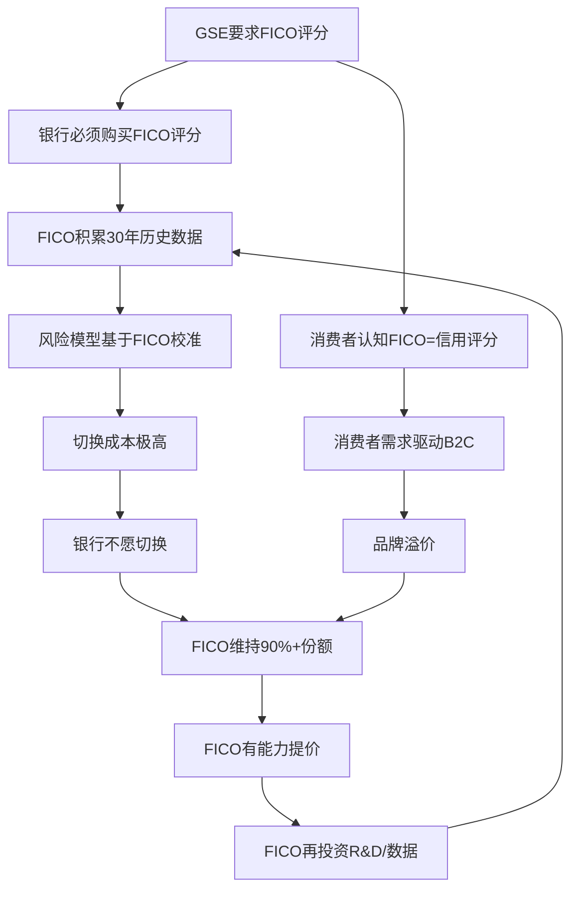

# Chapter 1: 制度垄断的起源 — FICO如何成为美国信用体系的基础设施

---

## 1.1 从数学家的梦想到金融基础设施

1956年，工程师William Fair和数学家Earl Isaac在加州San Jose创立了Fair, Isaac and Company。两人的愿景朴素但激进：用数学模型替代信贷审批中的人类主观判断。

在信用评分出现之前，美国的信贷审批是一个高度人工化的过程。银行信贷员根据"5C"原则（Character, Capacity, Capital, Collateral, Conditions）做出判断。这个过程耗时数周，且充满系统性偏见——种族、性别、邮编、外貌都会影响结果。

FICO评分的革命性在于：它将数十个信用变量压缩为一个300-850的数字。这个数字做到了三件事：
1. **标准化**: 所有申请人用同一把尺子衡量
2. **自动化**: 审批时间从周缩短到秒
3. **可审计**: 监管机构可以检验决策过程中的歧视

### 关键时间节点

| 年份 | 事件 | 制度嵌入深度 |
|------|------|-------------|
| 1956 | Fair Isaac创立 | 零 |
| 1958 | 开发首个信用评分系统（用于American Investments） | 商业采用 |
| 1981 | Freddie Mac开始建议使用信用评分 | 政府关注 |
| 1989 | 推出FICO Score品牌；Freddie Mac要求贷款机构提供FICO评分 | **制度嵌入起点** |
| 1995 | Fannie Mae要求FICO评分用于自动承销系统（Desktop Underwriter） | **双GSE锁定** |
| 1996 | OCC/Fed/FDIC联合声明承认信用评分在信贷决策中的合法性 | 监管认可 |
| 2004 | Basel II允许使用信用评分辅助风险加权资产计算 | 国际扩展 |
| 2010 | Dodd-Frank法案要求消费者获得免费信用评分（强化了FICO的品牌认知） | 消费者嵌入 |
| 2014 | QM规则（Qualified Mortgage）将FICO评分纳入合格按揭标准 | **法律强制** |
| 2025.7 | FHFA批准VantageScore 4.0用于GSE——30年来首次替代品获准入 | 制度松动 |

---

## 1.2 三层制度锁定机制

FICO的制度嵌入不是单一锁定，而是三层叠加的复合结构。这是理解FICO护城河久期的关键。

### 第一层: 监管锁定 (Regulatory Lock-in)

GSE（Fannie Mae/Freddie Mac）承销了美国约70%的住房按揭。在2025年7月之前，申请GSE按揭贷款**必须**提供FICO评分——没有替代品。

这意味着:
- 每年约400万份新按揭贷款 × 3个征信局 × 每个申请人 = ~1,200万次FICO评分查询仅来自按揭
- 贷款机构没有选择权：不用FICO = 不能卖给Fannie/Freddie = 不能做合规按揭业务
- FICO为此收费$4.95/次（2025年），将在2026年升至$4.95+$33/funded loan

### 第二层: 操作锁定 (Operational Lock-in)

即使在非GSE场景（汽车贷款、信用卡、个人贷款），FICO也享有~90%的B2B市场份额。原因不是监管强制，而是操作惯性：

- **风险模型校准**: 银行的信贷风险模型经过数十年针对FICO评分校准。切换到VantageScore需要重新校准所有内部模型——成本可达数百万美元，耗时12-24个月
- **合规风险**: 切换评分体系可能触发审计问题（为什么更改？有歧视性影响吗？）
- **组合连续性**: 使用不同评分的贷款无法与历史组合直接比较

### 第三层: 认知锁定 (Cognitive Lock-in)

FICO已成为"信用评分"的代名词，就像Google成为"搜索"的代名词:
- myFICO.com是消费者直接获取真实信用评分的渠道
- "我的FICO分数是多少？"是美国消费者日常用语
- 信用卡公司免费提供FICO评分（而非VantageScore）作为福利
- 媒体报道信用话题时默认使用"FICO score"

---

## 1.3 制度垄断的自我强化循环

这个循环运转了30年。在此期间，FICO版税从$0.50/次维持到2018年——不是因为不能提价，而是因为管理层选择不提价。这是理解FICO 68x回报的关键: **30年的未兑现定价权在2018-2025年间集中释放**。

---

## 1.4 与七大制度先例的对标

为评估FICO制度嵌入的耐久性，我们研究了7个制度垄断历史案例：

| 先例 | 持续时间 | 被替代? | 替代条件 | FICO类比 |
|------|---------|--------|---------|---------|
| LIBOR→SOFR | 1970-2023(53年) | 是(11年过渡) | $9B欺诈丑闻+全球央行+国会立法 | FICO无欺诈丑闻 |
| S&P/Moody's评级 | 1970s-至今 | 否 | Dodd-Frank试图打破→反而加固 | 最强类比: 监管加固 |
| ICD-9/10医疗编码 | 1979-至今 | 否(仅升级) | ICD-9→ICD-10需要10年+$400B | 升级≠替代 |
| AT&T电话垄断 | 1913-1984(71年) | 是(司法分拆) | DOJ反垄断诉讼 | FICO市场太小不值得分拆 |
| Visa/Mastercard | 1958-至今 | 否 | DOJ诉讼→交罚款继续运营 | 网络效应不同 |
| GAAP/IFRS会计准则 | 1930s-至今 | 否 | 国际趋同尝试失败 | 标准=基础设施 |
| CUSIP/SWIFT | 1964/1973-至今 | 否 | 无替代品出现 | 信息标准惯性 |

**历史基准率**: 7个案例中仅1个被替代(LIBOR)，且需要$9B欺诈丑闻+全球央行协调+国会立法+11年。**在无欺诈丑闻的情况下，0/6制度垄断被市场力量替代。**

### 制度垄断七定律

从7个案例中提炼的耐久规律：

1. **监管锁定 > 合同锁定 > 客户惯性**: FICO拥有三层，最强的一层（监管）正在松动（FHFA），但中间两层完好
2. **标准存活 ≠ 公司存活**: LIBOR被替代了但ICE没被消灭；FICO如果被替代，Fair Isaac也不一定消亡（还有Software业务）
3. **增强悖论**: 危机往往加固而非瓦解制度垄断（S&P/Moody's 2008后更强）——但FHFA的VantageScore批准可能是此定律的反例
4. **替代需要三因子齐聚**: 丑闻 + 政府协调 + 立法。FICO当前: 0 + 0.5 + 0 = 0.5/3，远低于替代阈值
5. **过渡成本与嵌入深度正相关**: LIBOR牵涉$300T合约→过渡11年；FICO牵涉所有美国信贷决策→过渡可能更长
6. **替代品必须同时优于技术+制度**: VantageScore在技术上接近FICO，但在制度上才刚获得GSE准入（2025.7）——要完成制度追赶可能需要10年+
7. **垄断定价引发的政治注意力有天花板**: 即使Senator Hawley两次呼吁调查，DOJ也未行动。FICO的市场太小（$2B收入）不值得政治资本投入

**FICO适用性**: 7条定律中FICO符合6条。唯一不确定的是第3条（增强悖论）——FHFA的VantageScore批准是否意味着制度危机正在弱化而非加固FICO。这是Phase 3需要深化的核心问题。
