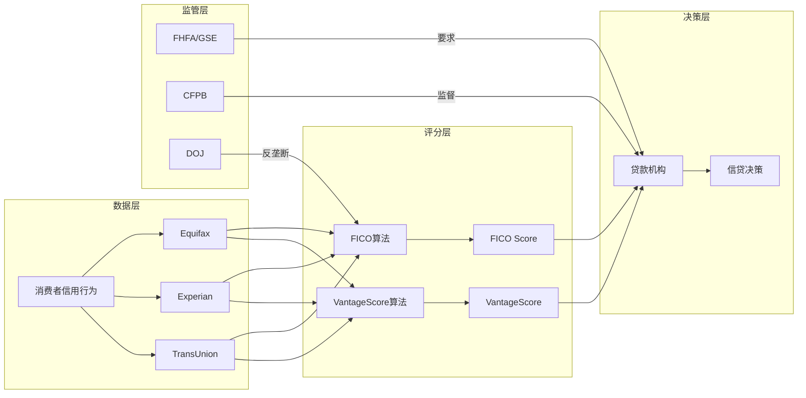
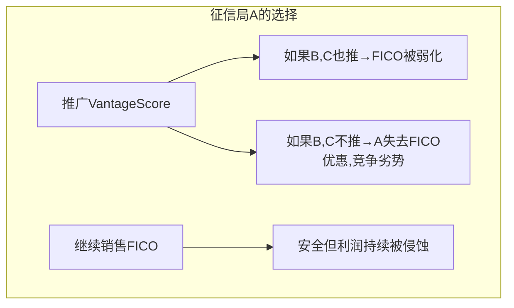
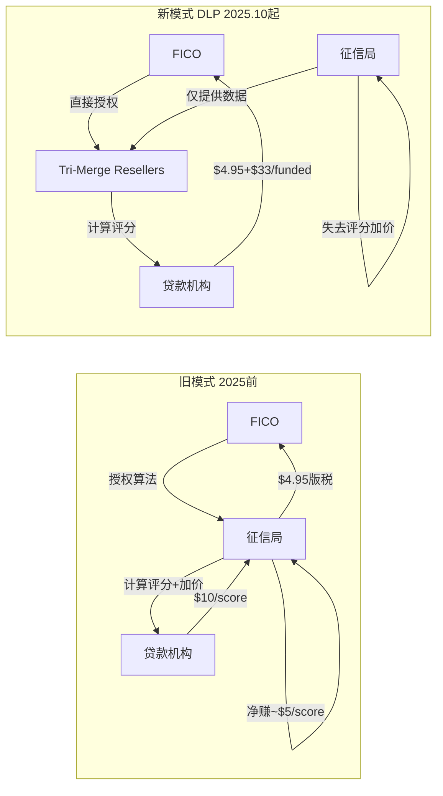
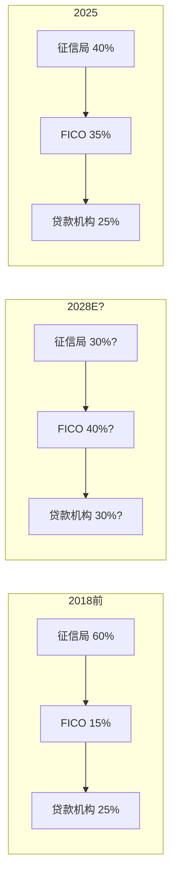

# Chapter 3: 信用评分产业链纵深 — 征信局→FICO→银行的三方博弈

---

## 3.1 产业链结构图

### 价值链经济学

| 环节 | 参与者 | 收入来源 | 边际利润 | 定价权 |
|------|--------|---------|---------|--------|
| **数据采集** | 征信局×3 | 消费者数据服务 | 高(自有数据) | 中(三方竞争) |
| **评分计算** | FICO / VantageScore | 算法授权版税 | 极高(近零边际成本) | FICO极强 / VS极弱 |
| **评分分发** | 征信局(+DLP resellers) | 加价转售 | ~0%(FICO pass-through) | 低(被FICO和客户夹击) |
| **信贷决策** | 银行/贷款机构 | 利息收入 | 取决于信贷周期 | 低(受利率/竞争约束) |
| **监管** | FHFA/CFPB/DOJ | N/A | N/A | 最高(规则制定权) |

---

## 3.2 征信局的困境: 不可或缺却无利可图的中间商

这是产业链中最扭曲的结构: 征信局拥有所有底层数据(没有征信局数据，FICO评分无法计算)，却在评分环节获取零利润。

### 经济学分解

以Equifax为例(FY2025数据):
- FICO按揭版税: ~占Equifax总收入3%(FY2025), 预计升至~6%(FY2026)
- 这些版税对Equifax利润率的影响: **EBITDA margin被拖低>100bps(FY2025), 预计>200bps(FY2026)**
- 核心矛盾: Equifax报告的收入增长被FICO涨价"虚增"(pass-through膨胀top-line)，但利润率反而下降

### 征信局的反击选项

| 选项 | 可行性 | 风险 |
|------|--------|------|
| ①推广VantageScore替代FICO | **高** — 已在执行(免费/$0.99定价) | 需要贷款机构接受;制度惯性阻力大 |
| ②拒绝与FICO续约 | **极低** — 贷款机构需要FICO，断供=失去客户 | 自杀性选项 |
| ③吸收FICO涨价不传导 | **低** — 已经是零利润，无空间吸收 | 股东不接受 |
| ④游说监管限制FICO定价 | **中** — Senator Hawley已响应 | CFPB瘫痪，政治注意力有限 |
| ⑤开发差异化增值服务 | **中-高** — 正在做(Equifax Workforce, TruIQ) | 与FICO评分业务分离，不解决核心问题 |

### 博弈论分析: 为什么征信局无法协调反击

这是一个经典的**囚徒困境**: 三家征信局各持VantageScore 1/3股权，理论上应该联合推广。但:
- 每家征信局与FICO都有独立合约，有"Level Playing Field"条款(统一定价)
- 先行推广VantageScore的征信局可能面临FICO的"7x惩罚版税"(如果贷款机构同时使用FICO和VantageScore)
- 征信局之间也是竞争关系(Equifax vs Experian vs TransUnion在数据服务市场竞争)

**FHFA的VantageScore批准改变了这个博弈**: 它为征信局提供了一个"合法理由"统一行动——现在推广VantageScore不是"对抗FICO"，而是"响应监管"。

---

## 3.3 FICO Direct License: 产业链重构的第一枪

### 旧模式 vs 新模式

### DLP的经济学

| 对比项 | 旧模式(征信局分发) | DLP Performance模式 | DLP Traditional模式 |
|--------|------------------|-------------------|-------------------|
| FICO收入/score | $4.95版税 | $4.95 + $33(if funded) | $10/score |
| 征信局收入/score | ~$5加价 | $0 | $0 |
| 贷款机构成本/score | ~$10 | $4.95(unfunded) / $37.95(funded) | $10 |
| FICO对终端定价控制 | 无(征信局加价) | 完全 | 完全 |

### DLP的攻守两面性 (CI-04验证)

**攻**: FICO获得终端定价权
- 绕过征信局的100%加价 → FICO直接捕获全部评分经济价值
- $33/funded loan = 新收入流(FY2022前不存在)
- 管理层预计CY2026增量收入$300M

**守**: FICO正在与最重要的分销渠道开战
- 征信局是FICO30年来唯一的分销网络
- DLP实质上告诉征信局: "你们的加价是我的收入"
- 征信局的反应已经很明确: 全力推广VantageScore(免费/$0.99)

**战略推演**:
| 情景 | 概率(估) | FICO影响 |
|------|---------|---------|
| DLP成功+VantageScore失败 | 25% | 极正面: FICO控制全价值链, 收入+$300M+ |
| DLP部分成功+VantageScore部分成功 | 45% | 中性偏负: 总收入可能持平(DLP增量被VS侵蚀抵消) |
| DLP失败+VantageScore成功 | 20% | 极负面: 失去分销渠道且失去市场份额 |
| 双方妥协(FICO降低DLP定价+征信局减弱VS推广) | 10% | 中性: 回到修正后的旧格局 |

---

## 3.4 产业链纵深: ETN方法论迁移

借鉴ETN(伊顿公司)产业链分析方法，我们评估FICO在产业链中的位置:

### Porter五力视角

| 力量 | 评估 | 得分(1-5) |
|------|------|-----------|
| **供应商议价力** | 征信局提供数据(FICO无自有数据)，但FICO可通过DLP绕过 | 3/5 (中等) |
| **客户议价力** | 贷款机构单独无谈判力(刚需)，但行业协会(MBA)和国会可施压 | 2/5 (弱) |
| **替代品威胁** | VantageScore首次获GSE准入; 征信局免费推广; 但制度惯性极强 | 3/5 (中等, 从1/5快速上升) |
| **新进入者威胁** | 极低——信用评分需要30年数据+监管认可+行业信任 | 1/5 (极弱) |
| **行业竞争** | 近乎垄断(FICO 90%+ B2B) → 寡头(FICO + VantageScore GSE双准入) | 2/5 (弱但增强中) |
| **合计** | | **11/25 (有利但弱化中)** |

### 产业链价值分配趋势

**趋势**: FICO正在从产业链的"隐形中间人"(15%价值)转变为"定价主导者"(35%→40%价值)。征信局的价值份额持续被压缩。**但这个趋势的持续性取决于VantageScore能否打破FICO的制度锁定。**

---

## 3.5 产业链韧性测试: 如果FICO提价到$20/score会怎样?

这是一个极端推演，用于测试产业链的断裂点:

| 影响层 | $10/score(当前) | $20/score(假设) | 断裂? |
|--------|----------------|----------------|-------|
| 征信局 | 零利润pass-through | 零利润但top-line膨胀 | 否(仍是pass-through) |
| 贷款机构 | $10-15/application | $20-25/application | 否(占按揭$5K-15K关闭成本<0.5%) |
| 消费者 | 无直接感知 | 无直接感知 | 否(隐藏在关闭成本中) |
| VantageScore采纳 | 价差$10 vs $0-1 | 价差$20 vs $0-1 | **加速**(差距越大,切换动力越大) |
| 政治注意力 | Senator Hawley呼吁(无回应) | 可能触发DOJ调查 | **可能**(FICO太小vs政治成本) |

**结论**: 产业链的物理断裂点不在价格层面(每笔按揭中评分成本占比太小)，而在政治/制度层面(提价越激进,政治注意力越高,VantageScore替代动力越强)。

**CLR验证**: FICO的Critical Loss Ratio=93%从数学上确认了这个结论——它可以丢失93%的交易量而不减少利润。但CLR计算不包含政治/制度反馈循环: 丢失93%交易量意味着VantageScore已经赢了,此时FICO的制度垄断已经不存在了。
