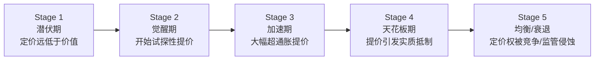
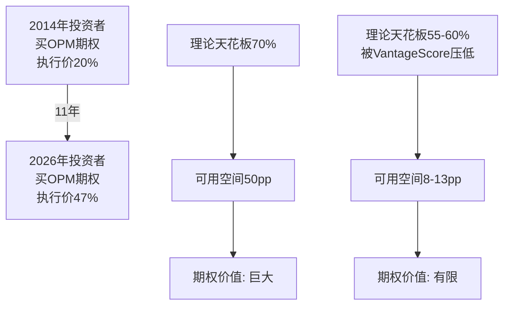

# Chapter 4: 定价权阶段模型v1.0 — 从$0.50到$37.95的解剖

---

## 4.1 定价权的五个阶段

基于FICO的历史和跨行业先例，我们提出一个定价权生命周期模型:

### FICO在各阶段的定位

| 阶段 | 时期 | 版税 | OPM | 特征 | 市场反应 |
|------|------|------|-----|------|---------|
| **1.0** 潜伏 | 1989-2017 | $0.50-0.60 | 18-22% | 30年未提价;管理层保守;无人关注 | 股价$15-55 |
| **1.5** 觉醒 | 2018-2019 | $0.75-1.50 | 24-28% | 首次实质提价;分析师开始关注 | 股价$150-350 |
| **2.0** 加速 | 2020-2023 | $1.50-3.50 | 30-42% | 大幅提价;行业投诉;DOJ调查(关闭) | 股价$250-900 |
| **2.3** 激进释放 | 2024-2025 | $4.95 | 42-47% | 版税单年+41%;行业反弹;FHFA行动 | 股价$900→$2,218→$1,441 |
| **2.5?** 分岔 | 2026 | $4.95+$33(DLP) or $10(传统) | 47-52%? | DLP推出;VantageScore获GSE准入;三方战争开始 | 待定 |
| **3.0** 天花板 | 未到 | ? | ? | 提价引发客户实质性切换 | — |

### 5指标量化评估

| 指标 | 描述 | FY2014值 | FY2025值 | 方向 |
|------|------|---------|---------|------|
| **OPM位置比** | 当前OPM/理论天花板(70%) | 20%/70%=0.29 | 47%/70%=0.67 | ↑ 空间缩小 |
| **市场认知** | 分析师对定价权的关注度 | 低(定价权被忽视) | 极高(核心叙事) | ↑ 认知充分 |
| **提价加速度** | 年化版税变化率 | 0% | +41%(FY2025) | ↑ 加速 |
| **监管热度** | 监管行动密度 | 零 | FHFA+Hawley+诉讼 | ↑↑ 升温 |
| **竞争位移** | 替代品市场份额变化 | VS=0% B2B | VS<5% B2B(GSE已准入) | ↑ 初始位移 |

**综合阶段评分**: Stage 2.3 → 距天花板(3.0)剩余空间: **0.7**

---

## 4.2 定价权投资期权 — 时间价值正在衰减 (CI-02)

### 期权类比框架

2014年买入FICO = 买入一个"定价权看涨期权":
- **行权价**: OPM 20%(当时水平)
- **标的资产**: 理论OPM天花板 60-70%
- **内在价值**: (70%-20%)×收入×倍数 = 巨大
- **到期日**: 无限(制度垄断持续期间)

2026年买入FICO = 买入同一个期权，但:
- **行权价**: OPM 47%(已大幅上移)
- **标的资产**: 理论OPM天花板 60-70%——但VantageScore的存在可能将天花板压低至55-60%
- **内在价值**: (55-60% - 47%)×收入×倍数 = 大幅缩小
- **到期日**: 不再无限(VantageScore获准入=制度垄断出现到期日)
- **时间价值**: 在衰减(随着VantageScore渗透率上升，期权价值下降)

### 量化: 剩余期权价值

| 情景 | OPM天花板 | 剩余空间(从47%) | 收入效应 | 利润效应 | 市值效应(15x EV/EBITDA) |
|------|---------|---------------|---------|---------|----------------------|
| 天花板不受VantageScore影响 | 70% | 23pp | +$458M Rev(at $2B Rev) | +$458M EBITDA(全流入) | +$6.9B |
| VantageScore压低天花板 | 60% | 13pp | +$260M Rev | +$260M EBITDA | +$3.9B |
| VantageScore+监管压低天花板 | 55% | 8pp | +$160M Rev | +$160M EBITDA | +$2.4B |
| VantageScore替代30%+份额 | 50% | 3pp + 收入下降 | 负增长 | 负增长 | -$5-10B |

**关键洞察**: 即使在最乐观的情景(天花板70%)下，剩余定价权的市值效应(+$6.9B)也仅占当前市值的20%。而在最悲观的情景下，市值效应为负。

**对比2014年**: 当时剩余定价权的市值效应 = OPM从20%→47%(已实现)+PE扩张(已实现) = +$30B+(实际发生)。2014年期权价值/市值≈5x当时市值；2026年期权价值/市值≈0.07-0.2x当前市值。

**结论**: 定价权投资期权的内在价值已兑现80%+。剩余期权的时间价值正在因VantageScore竞争而加速衰减。2026年买入FICO不是"买定价权期权"——而是"赌已兑现的定价权不会被收走"。

---

## 4.3 定价权天花板的物理极限 (S1补充角度)

### Value/Price Ratio分析

FICO评分对用户的价值远超其价格。这是定价权可持续的物理基础:

| 维度 | 数据 | Value/Price比 |
|------|------|--------------|
| **按揭贷款决策** | 平均按揭$380K, 违约率~3%, 违约损失率~25%, 避免一次坏贷款价值~$28.5K; FICO收费$10-38/application | 750:1 至 2,850:1 |
| **信用卡审批** | 年均坏账~3-5%, 减少1个坏账~$5K; FICO收费~$1-3/score | 1,700:1 至 5,000:1 |
| **汽车贷款** | 平均车贷$35K, 违约损失~$10K; FICO收费~$2-5/score | 2,000:1 至 5,000:1 |

### 对标其他信息垄断产品

| 产品 | 用户年收入(估) | 年费 | 费用/收入比 | FICO等效位 |
|------|-------------|------|-----------|-----------|
| Bloomberg终端 | ~$300K(交易员) | $24K | 8.0% | 极高 |
| Moody's评级 | ~$100M(债券发行) | $100-500K | 0.1-0.5% | 高 |
| MSCI指数授权 | ~$10M AUM | ~$30K | 0.3% | 中 |
| FICO评分(按揭) | ~$380K(贷款额) | $10-38/次 | 0.003-0.01% | **极低** |

**FICO是同类信息垄断产品中定价最低的。** 其费用/价值比仅0.003-0.01%，远低于Bloomberg(8%)或Moody's(0.1-0.5%)。这在理论上支持继续提价——但理论天花板和实际天花板的差距在于**政治可接受性**，而非经济合理性。

### 理论天花板推算

如果FICO的费用/价值比向Bloomberg级别(8%)靠拢:
- 按揭: $380K × 0.08 = $30,400/年(荒谬)
- 如果向Moody's级别(0.5%)靠拢: $380K × 0.005 = $1,900/次
- 如果向MSCI级别(0.3%)靠拢: $380K × 0.003 = $1,140/次

**当前收费($10-38)距理论天花板($1,000+)差30-100倍。**

但这个分析忽略了一个关键区别:
- Bloomberg/Moody's/MSCI: 客户是**专业机构**，单笔交易金额大，对信息成本不敏感
- FICO: 最终成本由**消费者**承担(嵌入按揭关闭成本)，政治敏感度随价格上升

### 实际天花板约束矩阵

| 约束 | 当前绑定? | 约束力(1-10) | 说明 |
|------|---------|-------------|------|
| 经济极限(Value/Price) | 否 | 1/10 | 距极限30-100倍 |
| 客户承受力 | 否 | 2/10 | $38/次对$380K按揭=0.01% |
| 竞争替代品 | 部分 | 5/10 | VantageScore免费/$0.99 |
| 政治注意力 | 部分 | 6/10 | Hawley呼吁但DOJ未动 |
| 监管行动 | 初始 | 4/10 | FHFA已行动但CFPB瘫痪 |
| 行业协会抵制 | 是 | 7/10 | MBA等行业组织持续施压 |

**绑定约束排序**: 行业组织(7) > 政治(6) > 竞争(5) > 监管(4) > 客户(2) > 经济(1)

**启示**: FICO的定价天花板不是被经济学决定的，而是被政治学决定的。这意味着天花板的位置高度不确定——政治注意力可以在一天之内改变(如FHFA 7月8日公告)。

---

## 4.4 定价权阶段模型的可迁移性

本模型(Stage 1-5 + 5指标量化)适用于所有具备制度嵌入定价权的公司:

| 公司 | 当前阶段 | OPM位置比 | 市场认知 | 监管热度 | 评估 |
|------|---------|----------|---------|---------|------|
| **FICO** | 2.3 | 0.67 | 极高 | 高 | 加速释放期,空间收窄 |
| **MSCI** | 1.5-2.0 | 0.55 | 中 | 低 | 觉醒早期,空间较大 |
| **S&P Global** | 1.0-1.5 | 0.50 | 低 | 低 | 潜伏期,评级业务定价权未释放 |
| **Visa/Mastercard** | 1.0 | 0.67(已高) | 低 | 中 | 潜伏期,但商户诉讼是约束 |

**方法论贡献(M2)**: 定价权阶段模型v1.0可用于评估任何B4≥3.5的公司在定价权生命周期中的位置,量化剩余空间,并预警天花板接近信号。
