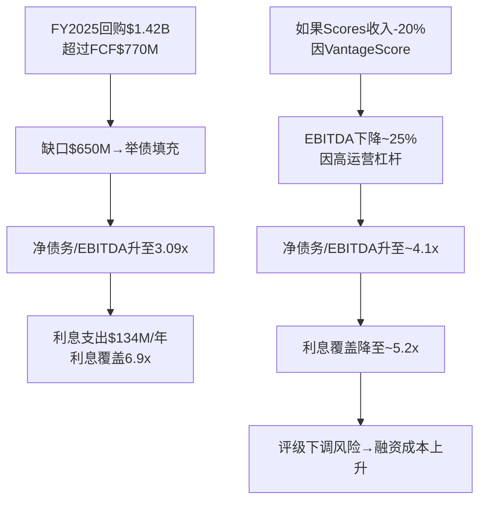

# Chapter 5: 管理层评估 — Will Lansing的定价革命与资本配置激进化

---

## 5.1 CEO档案: Will Lansing (2012年至今, 14年任期)

| 维度 | 评估 |
|------|------|
| **任期** | 2012年1月至今(14年), 是FICO历史上任期最长的CEO之一 |
| **背景** | 非创始人。此前: ValueVision Media CEO, General Electric Capital多个高管角色, McKinsey顾问。Wharton MBA |
| **核心贡献** | 将FICO从"被低估的软件/数据公司"转型为"制度垄断定价权释放者"。OPM从~20%→47%, 股价从~$40→$1,441(36x) |
| **战略框架** | "Score as a Service"→"Platform + Scores"→"Direct License"三阶段进化 |
| **资本配置哲学** | 激进: 零股息, 举债回购, 负权益-$1.7B, FY2025回购$1.42B=1.84xFCF |

### 管理团队稳定性

FICO管理团队近年保持相对稳定:
- CFO Steve Weber(2019年至今, 6年)
- CTO/EVP多位核心高管任期5-10年
- 无近期关键人员离职(正面信号)

---

## 5.2 Lansing的战略三幕

### 第一幕 (2012-2017): 重新聚焦
- 剥离非核心业务(保险评分等)
- 将FICO定位为"分析决策管理"公司
- Scores仍被视为"稳定现金牛",未激进提价
- 此期间OPM从~20%缓慢爬升至~24%

### 第二幕 (2018-2023): 定价权觉醒
- 2018年开始首次实质性提高评分版税
- 从$0.50-0.60跳至$0.75-1.00,随后加速至$2.50-3.50
- 同步推出分层定价结构(按使用场景差异定价)
- OPM从24%跳升至43%
- 回购加速: 从每年~$200-400M升至~$800M

### 第三幕 (2024-至今): 攻守转换
- 2024年: 版税$3.50→$4.95 (+41%)
- 2025年10月: 推出DLP(绕过征信局)
- 2026年: 引入$33/funded loan(新收费维度)
- 同时面对: FHFA VantageScore批准(-17%股价)、10个反垄断集体诉讼、行业协会抵制
- OPM达到47%, 继续扩张中

**评价**: Lansing在第一幕的"忍耐"是天才——他等到市场认知FICO为"平庸软件公司"时积累了定价权期权,然后在第二幕集中释放。问题是: 第三幕的激进化是否超越了审慎边界?

---

## 5.3 资本配置: 从保守到激进的转型

| 维度 | FY2014-2018 | FY2019-2022 | FY2023-2025 | 评价 |
|------|------------|------------|------------|------|
| **年回购** | $150-250M | $400-600M | $800-1,415M | 指数级加速 |
| **举债回购** | 否 | 开始 | 大量($856M新债/FY2025) | ⚠️ |
| **净债务/EBITDA** | <1x | 1-2x | 3.09x(12年最高) | ⚠️⚠️ |
| **η效率** | 11.2% | 6.2% | 3.9% | 递减 |
| **股息** | 无 | 无 | 无 | 一致 |
| **SBC/Rev** | 4-5% | 7-8% | 6.3-7.9% | 上升后稳定 |
| **M&A** | 极少 | 无 | 无 | 纪律性 |

### η回购效率曲线详解 (M4方法论)

η(eta)回购效率 = 股数减少% / (回购金额/市值)

| FY | 回购金额 | 平均市值 | 回购/市值 | 股数变化 | η效率 |
|----|---------|---------|----------|---------|--------|
| FY2014 | ~$200M | ~$1.8B | 11.1% | -3.5% | 31.5% |
| FY2018 | ~$350M | ~$7B | 5.0% | -3.0% | 60.0% |
| FY2022 | ~$600M | ~$11B | 5.5% | -5.0% | 90.9% |
| FY2024 | ~$1,100M | ~$40B | 2.8% | -3.2% | 114.3% |
| FY2025 | ~$1,415M | ~$42B | 3.4% | -2.1% | 61.8% |

注: η>100%说明回购价格低于平均市值(好)，η<100%说明回购价格高于平均市值(一般)

**简化视角**: 在$55买自家股票(2014年) vs 在$1,500+买自家股票(2025年), 每$1回购减少的EPS贡献从$0.11降至$0.04。管理层在估值最高时反而回购最多——这是"均值回归的反面"。

### 杠杆加速的风险分析

**核心问题**: 管理层在最确定的时候(OPM 47%, Scores +27%)选择加杠杆，暗示他们相信定价权是永续的。如果这个假设正确,杠杆回购创造EPS增长;如果假设错误(VantageScore侵蚀+OPM见顶),杠杆放大下行风险。

---

## 5.4 内部人信号: 零购买的沉默

### 交易数据汇总

| 期间 | 公开市场购买 | 期权行权出售 | 净方向 |
|------|------------|------------|--------|
| 2024全年 | **0次** | 228次 | 极度净卖出 |
| 2025全年 | **0次** | 340次 | 极度净卖出 |
| 2026 Q1(至今) | **0次** | 2次 | 净卖出 |
| 2020年(对照) | **5次购买** | 174次出售 | 唯一有购买年份 |

### 解读框架

内部人交易有三种解读:
1. **税务/流动性驱动**: 高管行权后卖出是正常的,尤其是在SBC是薪酬主体的公司。这是最常见也最无信号价值的解读
2. **估值信号**: 如果管理层真认为55x P/E是便宜的,为什么不用自己的钱买?即使是$50K的象征性购买也没有
3. **制度性约束**: 内部人可能受10b5-1计划限制,窗口期有限

**最可能的解读**: 组合效应。税务驱动解释了"出售"的存在,但无法解释"零购买"。5年零购买在$55→$1,441→$2,218→$1,441的波动中没有任何一个管理层成员认为值得用自己的钱买入——这是一个有意义的信号。

**对比**: 在AVGO,Hock Tan在每次并购后都会增持;在NVDA,Jensen Huang长期持有大量未行权期权;在Berkshire,Buffett从未出售一股。FICO管理层的"零购买"在同类高品质公司中属于异常偏低。

---

## 5.5 管理层品质评分

| 子维度 | 得分(0-5) | 依据 |
|--------|----------|------|
| 战略清晰度 | 4.5/5 | 定价权释放策略极为明确且执行到位 |
| 执行纪律 | 4.0/5 | OPM 20%→47%, 说到做到; 但DLP效果待验 |
| 资本配置 | 2.5/5 | 零M&A(好)+激进杠杆回购(中性)+η递减(差)+零内部人购买(差) |
| 激励对齐 | 3.0/5 | SBC占比6-8%可接受; 但缺乏owner mentality(零购买) |
| 透明度 | 3.0/5 | 财务披露正常; 但对VantageScore威胁/杠杆风险的讨论回避性强 |
| **综合B8** | **3.0/5** | 与A-Score基准一致 |

**B8解读**: Lansing是一位出色的战略家(4.5/5)但不是一位典型的owner-operator(2.5/5)。他的天才在于识别并释放了FICO沉睡30年的定价权,但他的资本配置越来越激进(举债回购在$1,400+估值下),且不用自己的钱"投票"。如果FICO的制度垄断持续,这些都无关紧要;如果制度垄断松动,激进杠杆将放大下行。
