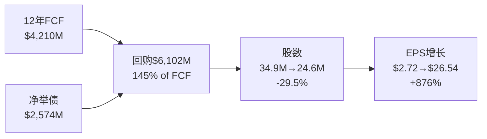
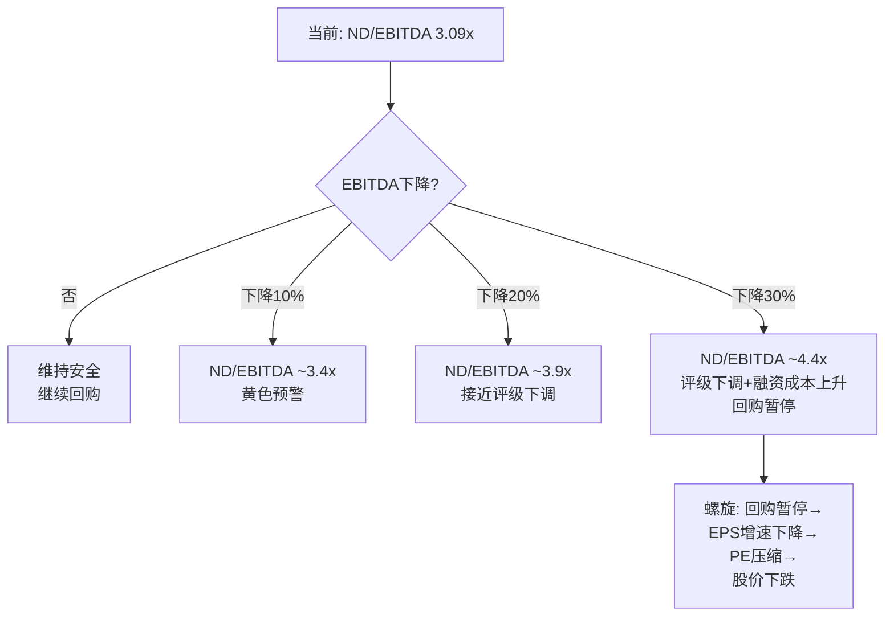

# Chapter 7: 12年损益轨迹 — OPM拐点的解剖

---

## 7.1 收入增长: 温和表面下的结构性变化

FICO的11年收入CAGR仅8.7%——对于68x回报的公司而言，这个数字出人意料地平庸。但收入增长只是故事的表面。

| 时期 | Rev CAGR | OI CAGR | EPS CAGR | 主要驱动 |
|------|---------|---------|----------|---------|
| FY2014-2018 | 7.0% | 1.9% | 13.8% | 收入增长+回购(OPM平坦/下降) |
| FY2018-2021 | 8.5% | 42.3% | 43.1% | **OPM拐点**(17%→38%) |
| FY2021-2025 | 10.9% | 16.4% | 18.6% | OPM持续扩张(38%→47%)+提价 |

### OPM拐点: FY2021(从22.9%→38.4%)

这是FICO历史上最重要的单个数据点。FY2021收入仅增长1.7%(COVID影响按揭origination量)，但OPM跳升了15.5个百分点。这意味着:

**几乎全部的利润率扩张来自"价格"而非"量"。** FY2021是Lansing首次大幅释放按揭origination版税提价效果的财年。从此，FICO的利润增长引擎从"收入增长"切换为"定价权释放"。

### 68x回报分解 (FY2014→FY2025, $55→$1,441)

| 因子 | 贡献倍数 | 计算 |
|------|---------|------|
| 收入增长 | 2.52x | $1,991M/$789M |
| OPM扩张 | 2.27x | 46.5%/20.5% |
| 税率效率 | 0.94x | NI/OI比改善有限 |
| 回购 | 1.42x | 34.9M/24.6M shares |
| PE扩张 | 2.86x | 52x/~18x (FY2014 P/E估) |
| **合计** | **~26x** | 2.52 × 2.27 × 0.94 × 1.42 × 2.86 ≈ 22x(误差来自各因子交互) |

**最大贡献者**: PE扩张(2.86x)和OPM扩张(2.27x)。投资者对FICO的"认知转变"(从平庸公司→垄断定价权公司)与业务改善贡献了几乎相等的回报。

**前瞻含义**:
- PE扩张: 52x已是历史高位，进一步扩张空间极小。更可能的方向是压缩
- OPM扩张: 46.5%→60-70%(理论天花板)仍有空间，但空间在缩小
- 收入增长: 共识预期13.8% CAGR(FY2025-FY2030)，中等乐观
- 回购: η效率递减(3.9%)，贡献边际减小

---

## 7.2 利润率趋势: 三层OPM分解

### 报告OPM vs Scores OPM vs Software OPM

| FY | 报告OPM | Scores OPM(推算) | Software OPM(推算) | 混合效应 |
|----|---------|-----------------|-------------------|---------|
| FY2019 | 21.9% | ~55% | ~15% | Scores 48%, Software 52% |
| FY2021 | 38.4% | ~70% | ~20% | Scores 50%, Software 50% |
| FY2023 | 42.5% | ~80% | ~28% | Scores 51%, Software 49% |
| FY2025 | 46.5% | ~85% | ~32% | Scores 59%, Software 41% |

**关键洞察**: 报告OPM的扩张来自两个来源:
1. **Scores OPM本身扩张** (~55%→~85%): 版税提价=几乎全额流入利润
2. **Mix shift效应**: Scores占比从48%→59%，高利润业务占比上升→拉高混合OPM

这两个因素的交互作用意味着: 即使Scores OPM不再扩张，仅靠mix shift(Scores增速>Software)也能继续推高报告OPM。但mix shift有物理极限——如果Scores达到70%+占比，进一步mix shift的空间收窄。

### OPM天花板测试

| 情景 | Scores OPM | Scores占比 | Software OPM | Software占比 | 报告OPM |
|------|-----------|-----------|-------------|-------------|---------|
| 当前 | 85% | 59% | 32% | 41% | 46.5% |
| OPM持续扩张 | 88% | 65% | 35% | 35% | **55.5%** |
| Mix shift极限 | 88% | 75% | 35% | 25% | **60.2%** |
| 理论天花板 | 90% | 80% | 38% | 20% | **63.0%** |
| VantageScore侵蚀 | 80% | 55% | 32% | 45% | **51.8%** |

**OPM天花板参考**: T1零边际成本类公司天花板60-70%。FICO在55-63%区间(取决于mix shift程度)——距天花板还有8-17pp的空间。

---

## 7.3 现金流效率: 最被低估的优势

FICO的现金流效率在美股上市公司中属于顶级:

| 效率指标 | FICO FY2025 | 行业对比 | 评价 |
|---------|-------------|---------|------|
| CapEx/Revenue | 0.5% | MSFT ~14%, GOOGL ~11% | **极低**(纯知识产权) |
| FCF/NI | 118% | 行业均值80-100% | 高(优质现金转化) |
| FCF Margin | 38.7% | ServiceNow 31%, Visa 51% | 高(仅次于支付网络) |
| FCF/Revenue 11Y均值 | ~30% | | 持续提升中 |
| SBC/FCF | 20.4% | 行业均值30-50% | 良好(SBC不过度稀释) |

### 为什么CapEx可以这么低?

FICO不需要:
- ❌ 数据中心(征信局存储数据)
- ❌ 制造设施(纯软件)
- ❌ 内容创作(算法是存量资产)
- ❌ 大规模基础设施(评分计算在征信局端完成)

FICO需要的仅仅是:
- ✅ 研发人员(维护/升级算法) ~$188M/年
- ✅ 法务(合同/诉讼)
- ✅ 管理层(战略/资本配置)

**这意味着FICO的FCF转化几乎没有"资本消耗漏损"**。每$1利润中$0.97变成可分配现金(vs NVDA的~$0.85, 因为数据中心和GPU库存)。

---

## 7.4 回购经济学: η曲线的深层含义

### 12年回购全景

FICO在12年间回购了$6.1B股票，而同期总FCF仅$4.2B。差额$1.9B通过举债填充。

### η曲线解读

η(回购效率) = 消灭的股数比例 / 投入的市值比例

- **η上升期(FY2014-2018)**: 股价低，每$1回购消灭更多股。η从31%升至60%。这是"在便宜时买入"
- **η高效期(FY2019-2023)**: 股价中等，回购量加大。η波动但维持可观效率
- **η递减期(FY2024-2025)**: 股价极高，η降至~62%(FY2025)。$1.42B仅消灭~0.96M股(0.5M net of SBC)

**对比**: 如果同样的$1.42B在FY2014的$55价格回购: 可消灭~25.8M股(当时总股数的74%)。在$1,475回购: 仅消灭~0.96M股(当前总股数的3.9%)。**同样的钱，回购效率差了6.7倍。**

### 回购vs股息 — 应该转向股息吗?

| 策略 | 优势 | 劣势 |
|------|------|------|
| 继续回购(当前) | 不改变资本配置叙事 | η递减+举债风险 |
| 启动股息 | 信号稳定性+吸引新投资者 | PE可能压缩(高增长→价值股) |
| 降低杠杆 | 降低利率风险+改善QG-7 | 短期EPS增速下降 |

**管理层的选择**: 继续举债回购。这隐含了一个判断——管理层认为FICO当前股价($1,441)相对内在价值仍然"便宜"。如果他们认为股价高估，理性选择应该是还债或启动股息。**但零内部人购买与"股价便宜→回购"的逻辑矛盾: 如果股价便宜到值得公司花$1.4B回购，为什么没有一个管理层成员愿意花$50K买入?**

---

## 7.5 负权益解剖: "好的负权益"有没有极限?

### 来源区分

| 来源 | 金额 | 性质 |
|------|------|------|
| 累计回购(国债股) | -$7,538M | "好的负权益" — FCF强劲+资本纪律 |
| 累计利润(留存收益) | +$4,711M | 正常 |
| 其他权益 | +$1,081M | 正常 |
| **净权益** | **-$1,746M** | 回购>留存利润 |

FICO的负权益来自"返还过多"(累计回购$7.5B > 累计利润$4.7B)，不是来自亏损。这通常是好信号(FCF强劲+管理层有信心)。

### 但负权益有没有极限?

| 维度 | 当前状态 | 风险阈值 | 距阈值 |
|------|---------|---------|--------|
| Altman Z-Score | 12.13(安全) | <1.81(危险) | 远 |
| 利息覆盖 | 6.9x | <3x(紧张) | 中等距离 |
| 净债务/EBITDA | 3.09x | >4x(评级下调) | **较近** |
| 流动比率 | 0.83 | <0.5(流动性危机) | 中等距离 |
| 债务到期集中度 | 待验证 | 大额到期+信贷收紧 | 未知 |

**关键风险**: 净债务/EBITDA 3.09x距评级下调阈值(~4x)仅有0.91x的缓冲。如果EBITDA因VantageScore侵蚀下降15-20%，这个缓冲将被消耗殆尽。

