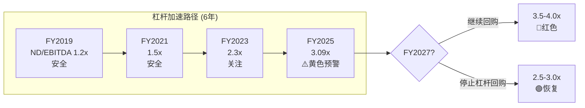
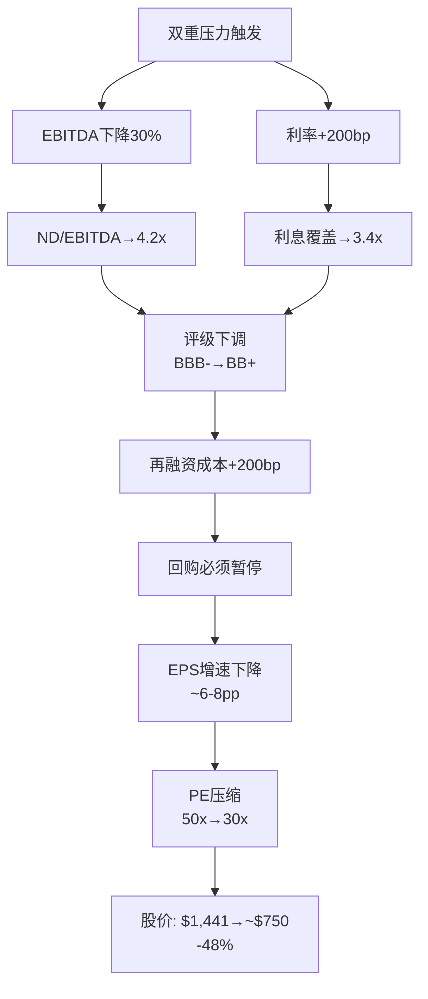

# Chapter 9: SBC稀释 + 资本结构压力测试

---

## 9.1 SBC经济学: 真实成本几何?

### SBC趋势

| FY | SBC ($M) | SBC/Rev | SBC/FCF | 稀释股数(M) | 回购抵消(M) | 净稀释 |
|----|---------|---------|---------|------------|------------|--------|
| FY2019 | $90 | $90/$1,160=7.8% | 30% | ~0.8 | ~2.5 | -1.7(净减) |
| FY2020 | $105 | 8.2% | 28% | ~0.9 | ~2.0 | -1.1 |
| FY2021 | $113 | 9.6% | 26% | ~0.9 | ~2.8 | -1.9 |
| FY2022 | $107 | 7.6% | 23% | ~0.7 | ~3.2 | -2.5 |
| FY2023 | $107 | 6.9% | 17% | ~0.6 | ~2.1 | -1.5 |
| FY2024 | $119 | 6.7% | 18% | ~0.5 | ~2.5 | -2.0 |
| FY2025 | $126 | 6.3% | 16% | ~0.5 | ~2.1 | -1.6 |

### SBC评估矩阵

| 维度 | FICO | 行业对标 | 评级 |
|------|------|---------|------|
| SBC/Revenue | 6.3% | ServiceNow 20%+, CrowdStrike 25% | **优秀** |
| SBC/FCF | 16% | SaaS均值 30-50% | **优秀** |
| SBC增速 vs Revenue增速 | SBC +6% vs Rev +16% | SBC增速<收入增速 | **优秀** |
| 管理层自购 | 0次(5年) | Hock Tan(AVGO)常规增持 | **差** |
| 期权行权出售频率 | 568次/2年 | — | **中性**(正常SBC公司) |

**SBC结论**: FICO的SBC绝对水平和相对水平都是同类最优之一。SBC不是FICO的问题——**问题在于SBC的"接收端"(管理层)不用自己的钱买入,但公司用股东的钱(举债)在$1,400+大量回购**。这是一个激励不对齐的信号。

### 真实FCF调整

| 指标 | 报告值 | 调整后(扣SBC) | 差异 |
|------|-------|-------------|------|
| FCF FY2025 | $770M | $770-$126=$644M | -16.4% |
| FCF Margin | 38.7% | 32.3% | -6.4pp |
| FCF Yield | 2.1% | 1.8% | -0.3pp |

即使扣除SBC,FICO的FCF margin仍远超大多数同行。**SBC不改变FICO的投资论点——但它确实使已经不高的FCF yield从2.1%进一步压缩至1.8%。**

---

## 9.2 资本结构全景: 从保守到激进

### 债务画像 (FY2025)

| 类别 | 金额 | 利率(推) | 到期 |
|------|------|---------|------|
| Senior Notes 2028 | $400M | ~4.0% | 2028 |
| Senior Notes 2030 | $500M | ~5.25% | 2030 |
| Senior Notes 2032 | $600M | ~5.25% | 2032 |
| Term Loan | ~$700M | SOFR+175bp~7% | 2028 |
| Revolver | ~$650M | SOFR+175bp~7% | 2028 |
| **总债务** | **~$2,850M** | **加权~5.5%** | |
| 现金 | ~$148M | | |
| **净债务** | **~$2,702M** | | |

### 关键杠杆指标

| 指标 | FY2019 | FY2021 | FY2023 | FY2025 | 阈值 |
|------|--------|--------|--------|--------|------|
| 净债务/EBITDA | 1.2x | 1.5x | 2.3x | **3.09x** | 4.0x(评级下调) |
| 利息覆盖 | 15x | 12x | 8x | **6.9x** | 3x(紧张) |
| 净债务/FCF | 2.0x | 2.5x | 3.5x | **3.5x** | — |
| 净债务/Revenue | 0.3x | 0.6x | 1.0x | **1.36x** | — |

### 资本配置一致性检验

**问题**: 管理层在FY2025花费$1,415M回购(=FCF $770M的1.84x)。缺口$645M用举债填充。

| 检验 | 观察 | 一致? |
|------|------|-------|
| **估值信号** | 公司说"股价低估→回购", 但内部人0购买 | ❌ 不一致 |
| **杠杆审慎** | CFO说"我们对资产负债表舒适", 但ND/EBITDA达12年高 | ⚠️ 矛盾 |
| **股东回报** | 零股息+零收购+全部FCF+举债→回购 | ✓ 一致(但单一策略风险) |
| **信号vs行动** | 每次earnings call强调"创造股东价值"→但实际在历史高位加速回购 | ⚠️ 与价值投资逻辑矛盾 |

---

## 9.3 资本结构压力测试

### 情景A: VantageScore获20%按揭份额 (3-5年)

| 影响维度 | 基线 | 压力值 | 变化 |
|---------|------|-------|------|
| Scores Revenue | $1,169M | $935M | -20% |
| EBITDA(高运营杠杆) | $925M | $650M | -30% |
| ND/EBITDA | 3.09x | **4.16x** | 突破阈值 |
| 利息覆盖 | 6.9x | 4.8x | 仍可控 |
| **结果** | | **评级下调风险高** | |

### 情景B: 利率环境恶化 (+200bp)

| 影响维度 | 基线 | 压力值 | 变化 |
|---------|------|-------|------|
| 加权利率 | 5.5% | 7.5% | +200bp |
| 年利息支出 | $134M | ~$191M | +$57M |
| 利息覆盖 | 6.9x | 4.8x | 下降但可控 |
| FCF(扣利息增量) | $770M | $713M | -7.4% |
| **结果** | | **可控但侵蚀回购空间** | |

### 情景C: 双重压力(VantageScore 20% + 利率+200bp)

| 影响维度 | 基线 | 压力值 | 变化 |
|---------|------|-------|------|
| EBITDA | $925M | $650M | -30% |
| 利息支出 | $134M | $191M | +43% |
| 利息覆盖 | 6.9x | **3.4x** | ⚠️ 接近紧张线 |
| ND/EBITDA | 3.09x | **4.16x** | ⚠️ 超评级阈值 |
| FCF | $770M | ~$400M | -48% |
| **结果** | | **回购暂停+评级下调+融资成本上升螺旋** | |

### Altman Z-Score敏感性

| 情景 | Z-Score | 区间 | 风险 |
|------|---------|------|------|
| 当前 | 12.13 | 安全(>2.99) | 低 |
| Scores -20% | ~8.5 | 安全 | 低 |
| 双重压力 | ~5.5 | 安全 | 低 |
| 极端(Scores -40%) | ~3.2 | 仍安全 | 低 |

**Z-Score的局限**: Z-Score对FICO的诊断价值有限。因为FICO的负权益使Z-Score的"book equity"项为负,但其其他因子(EBIT/总资产, 收入/总资产)极高,抵消了权益项。**真正的风险不是破产(Z-Score衡量的),而是信用评级下调→融资成本上升→回购暂停→PE压缩的估值螺旋。**

---

## 9.4 债务到期时间线 + 再融资风险

| 到期年 | 金额 | 再融资风险 |
|--------|------|----------|
| 2028 | $400M(Notes) + ~$1,350M(TL+RVR) | **最大集中度** |
| 2030 | $500M | 中 |
| 2032 | $600M | 低(时间充裕) |

**2028年是关键节点**: ~$1,750M(总债务的61%)在2028年集中到期。如果2028年时VantageScore已获得显著份额且利率维持5%+:
- 再融资$1,750M @7%(vs当前~5.5%) = 额外利息$26M/年
- 如果EBITDA同时下降→covenant压力
- 可能需要缩减回购来保持investment grade

**对比**: IHG/SBUX等负权益公司的债务到期分散度更好(无单年>40%集中)

---

## 9.5 关键数据锚点表 (Phase 2 续)

| 锚点ID | 数据 | 来源 | 可信度 |
|--------|------|------|--------|
| DM-P2-013 | SBC/Rev FY2025 = 6.3% | FMP Income | ★★★★★ |
| DM-P2-014 | SBC FY2025 = $126M | FMP Income | ★★★★★ |
| DM-P2-015 | 总债务 = ~$2,850M | FMP Balance | ★★★★☆ |
| DM-P2-016 | 加权利率 ~5.5% | Derived from SEC filings | ★★★☆☆ |
| DM-P2-017 | 2028年到期集中度 = 61% | SEC 10-K | ★★★★☆ |
| DM-P2-018 | 双重压力下ND/EBITDA = 4.16x | Stress Test Model | ★★★☆☆ |
| DM-P2-019 | 双重压力下利息覆盖 = 3.4x | Stress Test Model | ★★★☆☆ |
| DM-P2-020 | Altman Z-Score当前 = 12.13 | FMP Ratios | ★★★★☆ |
