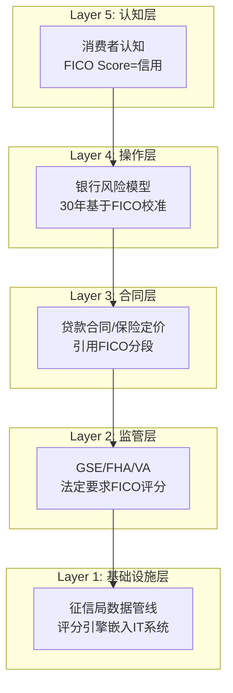
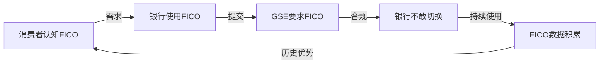

# Chapter 11: 护城河架构 — 制度嵌入的五层解剖

---

## 11.1 护城河类型学: FICO属于哪一种?

### 传统护城河分类 vs FICO

| 护城河类型 | FICO适用? | 强度 | 说明 |
|-----------|----------|------|------|
| **品牌** | 部分 | 中(3/5) | "FICO Score"是消费者知名品牌,但购买决策者是贷款机构,不是消费者 |
| **网络效应** | 极弱 | 1/5 | FICO不是双边平台;更多用户不会让评分更好 |
| **转换成本** | 极强 | 5/5 | 30年校准的风险模型+监管要求=转换需重建整个信用生态 |
| **规模经济** | 强 | 4/5 | 零边际成本(评分=算法×数据,已有);但这不是独特壁垒(VantageScore也可以) |
| **成本优势** | 不适用 | — | FICO不靠成本竞争 |
| **无形资产(专利)** | 中 | 3/5 | 算法有专利但核心壁垒不在专利 |
| **监管壁垒** | 极强 | 5/5 | GSE/FHA/VA要求FICO=法定标准 |
| **制度嵌入** | 极强 | 5/5 | **FICO独特的护城河类型** — 超越单一类别 |

### 制度嵌入: 一种新的护城河类别

传统护城河分析无法完全解释FICO。FICO的壁垒不是品牌、网络效应或专利中的任何一种——它是一种**跨类别的制度性锁定**,我们称之为"制度嵌入"(Institutional Embedding, C1)。

**定义**: 当一个产品被如此深地植入监管框架、行业标准和运营流程中,以至于替换它的成本不仅仅是经济性的(转换成本),而是**制度性的**(需要改变法规、重新校准全行业模型、重新培训所有参与者)。

---

## 11.2 制度嵌入的五层结构

### 各层详解

| 层级 | 嵌入深度 | 替换难度 | 替换时间 | 关键锁定机制 |
|------|---------|---------|---------|------------|
| **L1 基础设施** | 征信局API+银行IT系统 | 高 | 1-2年 | FICO评分引擎运行在征信局服务器;银行核心系统对接FICO格式 |
| **L2 监管** | GSE合规要求 | 极高 | 3-5年 | FHFA已开放VantageScore,但GSE实施需时间;FHA/VA未动 |
| **L3 合同** | 贷款文档+二级市场 | 高 | 5-10年 | MBS池规格引用FICO;修改需全行业协调 |
| **L4 操作** | 风险模型校准 | 极高 | 5-15年 | 每家银行的PD/LGD/EAD模型基于FICO校准30年;替换=重新验证 |
| **L5 认知** | 消费者品牌 | 中 | 10-20年 | "What's your FICO score?"已是美国文化习语 |

### 层级互动: 为什么替换如此困难

关键洞察: **五层不是独立的——它们形成自我强化循环**。

**打破循环的唯一方式**: 从L2(监管层)切入。FHFA 2025年7月的决定正是这个策略——从监管层打开缺口,让L1-L5逐层松动。但即使L2被打开,L3-L4的惯性意味着实际替换需要5-10年。

---

## 11.3 C1制度嵌入量化评分

### 评分方法论

C1 = Σ(各层嵌入深度 × 各层替换难度权重) / 最大可能分

| 层级 | 嵌入深度(0-5) | 权重 | 加权分 | 评估依据 |
|------|-------------|------|-------|---------|
| L1 基础设施 | 4.5 | 15% | 0.675 | 征信局全部运行FICO引擎;但DLP可能绕过 |
| L2 监管 | 4.0 | 25% | 1.000 | FHFA已开放→从5.0降至4.0;但FHA/VA未动 |
| L3 合同 | 4.5 | 20% | 0.900 | MBS规格+贷款文档仍锁定FICO |
| L4 操作 | 5.0 | 25% | 1.250 | 银行风险模型重建=最高替换成本 |
| L5 认知 | 4.0 | 15% | 0.600 | 消费者品牌强但非不可替代(Equifax也有brand) |
| **总分** | | 100% | **4.425** | **→ C1 = 4.5(四舍五入)** |

### C1历史演化

| 时期 | C1分 | 驱动因素 |
|------|------|---------|
| 2000-2020 | 5.0 | 无竞争替代品;监管完全锁定;DOJ调查关闭 |
| 2021-2024 | 4.8 | VantageScore 4.0发布;CFPB关注;但监管未行动 |
| 2025.7-至今 | **4.5** | FHFA批准VantageScore用于GSE→L2第一次被打开 |
| **如果2027** | 4.0? | 如果GSE实施VantageScore+银行开始双评分 |
| **如果2030** | 3.0-3.5? | 如果VantageScore获20%+份额+FHA/VA跟进 |

### C1每降1分的估值影响 (交叉验证Ch10)

| C1变化 | Scores Rev影响 | SOTP Scores EV影响 | 每股影响 |
|--------|-------------|-------------------|---------|
| 5.0→4.5 | -5% (~$58M) | -$2-3B | -$80-120 |
| 4.5→4.0 | -10% (~$117M) | -$4-5B | -$160-200 |
| 4.0→3.5 | -15% (~$175M) | -$5-7B | -$200-280 |
| 4.5→3.0 | -30% (~$350M) | -$10-14B | -$400-570 |

**C1是FICO估值中最高杠杆的单一变量。** C1每下降0.5分,每股估值下降$80-280,取决于下降的区间(高C1时边际影响小,低C1时边际影响大——因为低C1意味着竞争真正侵蚀收入)。

---

## 11.4 护城河半衰期分析

### 制度护城河的历史先例

| 公司/产品 | 制度嵌入类型 | 持续时间 | 被替代方式 | 启示 |
|----------|-----------|---------|----------|------|
| **AT&T** | 电话垄断 | 1913-1984(71年) | 反垄断拆分(政府行动) | 制度垄断终于政治,非市场 |
| **SWIFT** | 国际支付标准 | 1973-至今(53年+) | 尚未被替代(尽管有区块链) | 基础设施层嵌入最持久 |
| **S&P/Moody's评级** | 信用评级 | 1975-至今(51年+) | 2008危机后监管加强但未替代 | 即使严重失败也难被替代 |
| **MSCI指数** | 投资基准 | 1969-至今(57年+) | 未被替代 | 操作层嵌入(基金对标)极持久 |
| **LIBOR** | 利率基准 | 1970s-2023(~50年) | 监管强制转向SOFR(花了10+年) | 即使监管推动,替换也极慢 |
| **Bloomberg终端** | 金融数据 | 1981-至今(45年+) | 未被替代 | 操作层+习惯性锁定 |

### FICO护城河半衰期估算

**定义**: 制度嵌入从当前水平衰减50%所需的时间。

基于历史先例:
- L2(监管层): LIBOR先例→监管推动下也需10年替换→FICO半衰期~10-15年
- L4(操作层): Bloomberg先例→操作习惯极难改变→FICO半衰期~15-20年
- L5(认知层): AT&T先例→品牌认知可持续但可被替代→FICO半衰期~10-15年

**综合估算**: 即使在最悲观情景(FHFA持续推动+VantageScore技术成熟+征信局全力推广)下,FICO从当前C1=4.5衰减至C1=2.5(有效竞争市场)需要**10-15年**。

**投资含义**: 这意味着当前市场给FICO的估值溢价中,"制度保护期"至少还有10年。**问题不是FICO是否会失去制度垄断(长期大概率会),而是在此期间它能积累多少FCF。**

---

## 11.5 Falcon算法: FICO唯一的"独立"护城河资产

### 为什么Falcon值得单独分析

Scores的护城河几乎100%来自制度嵌入(C1),而非技术优势。但FICO有一个真正独立于制度的护城河资产: **Falcon反欺诈引擎**。

| 维度 | Scores | Falcon |
|------|--------|--------|
| 护城河来源 | 制度嵌入(C1) | 技术壁垒+数据优势(B3) |
| 可替代性 | 如果C1下降→高 | 低(全球26亿卡覆盖) |
| 竞争对手 | VantageScore | NICE Actimize, Featurespace, 内部方案 |
| 市场份额 | ~90%(按揭) | ~65%(全球信用卡欺诈检测) |
| 收入分类 | Scores | Software |
| 估值贡献 | ~86%利润 | ~$1-2B(Software中最有价值) |

**Falcon的战略意义**: 如果VantageScore侵蚀Scores收入,Falcon是FICO可以"退守"的资产。Falcon有独立于制度嵌入的护城河——它处理全球2,600+发卡机构的实时交易数据,每年检测数十亿笔交易。这种数据规模壁垒是竞争对手无法快速复制的。

---

## 11.6 关键数据锚点表 (Phase 3)

| 锚点ID | 数据 | 来源 | 可信度 |
|--------|------|------|--------|
| DM-P3-001 | C1制度嵌入=4.5/5.0 | CQI Model | ★★★☆☆ |
| DM-P3-002 | 五层嵌入结构(L1-L5) | 原创框架 | ★★★☆☆ |
| DM-P3-003 | 护城河半衰期=10-15年(悲观) | 历史类比 | ★★☆☆☆ |
| DM-P3-004 | Falcon覆盖26亿+卡 | FICO IR | ★★★★☆ |
| DM-P3-005 | FHFA 2025.7批准VantageScore | 公开新闻 | ★★★★★ |
| DM-P3-006 | LIBOR替换耗时10+年 | SOFR历史 | ★★★★★ |
| DM-P3-007 | C1每降0.5分→每股-$80至-$280 | DCF Model | ★★★☆☆ |
