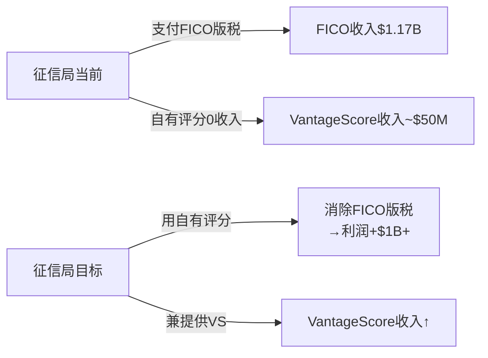
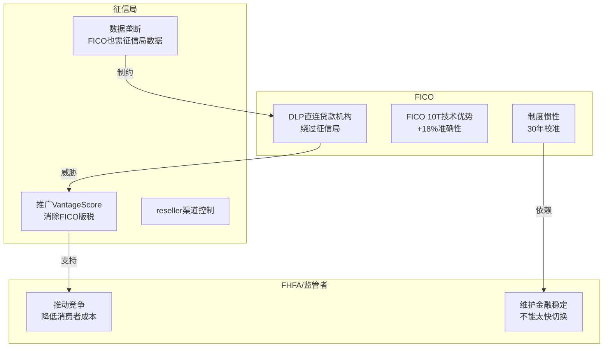

# Chapter 12: VantageScore威胁评估 — 护城河侵蚀的时间表

---

## 12.1 VantageScore: 对手画像

### 基本信息

| 维度 | VantageScore | FICO |
|------|-------------|------|
| **所有者** | Equifax + Experian + TransUnion(三大征信局联合) | Fair Isaac Corporation |
| **版本** | VantageScore 4.0 (2017) | FICO Score 10T (2020) |
| **分数范围** | 300-850 | 300-850 |
| **评分人群** | 可评估~37M"信用隐形人"(thin file) | 需最低6个月信用记录 |
| **定价** | 免费-$0.99(消费者) / 批量更低(B2B) | $4.95-$10(按揭B2B) |
| **按揭GSE地位** | 2025.7获FHFA批准, 2026秋开始实施 | 自1995年起为唯一标准 |

### 征信局为什么要推VantageScore?

**经济动机极其强烈**:

| 征信局 | FICO版税支出(推) | VS替代后节省 | 动机强度 |
|--------|----------------|------------|---------|
| Equifax | ~$350-400M/年 | 全额 | 极强 |
| Experian | ~$350-400M/年 | 全额 | 极强 |
| TransUnion | ~$350-400M/年 | 全额 | 极强 |
| **合计** | **~$1,050-1,200M/年** | | |

**这是美国商业史上最明确的利益冲突之一**: FICO的最大分销渠道(征信局)同时也是其唯一竞争对手(VantageScore)的所有者。征信局每消除$1的FICO版税就多赚$1利润。

---

## 12.2 FHFA决定: 时间线与影响

### 关键事件链

| 日期 | 事件 | 影响 |
|------|------|------|
| 2022.10 | FHFA宣布GSE将采用FICO 10T(替代FICO Classic) | FICO利好:新版本提价机会 |
| 2023-2024 | FHFA开始评估VantageScore准入 | 不确定性上升 |
| **2025.7.8** | **FHFA正式批准VantageScore用于GSE贷款** | **FICO制度垄断首次被打开** |
| 2025.10 | FICO推出DLP作为反击 | DLP是进攻也是防御 |
| 2026秋(预计) | GSE开始接受VantageScore评分的贷款 | 实际竞争开始 |
| 2027-2028 | 贷款机构开始提交VantageScore评分 | C1从4.5开始衰减? |

### 7月8日市场反应

- FICO股价: -17%(单日), 从~$1,700跌至~$1,410
- 市场隐含C1调整: 从~5.0→~4.3(基于PE变化推算)
- 后续反弹(10月DLP公告): +18-24%(单日)

**市场定价分析**: 7月-17%暗示市场认为VantageScore可能侵蚀15-20%的Scores收入。10月DLP反弹暗示市场认为FICO找到了对策。净效果: 市场目前定价C1=4.5(即"轻度侵蚀")。

---

## 12.3 竞争态势: 三方博弈

### 博弈参与者

### 三条战争前线

| 战线 | FICO武器 | 对手武器 | 当前赢面 |
|------|---------|---------|---------|
| **按揭GSE** | 30年校准+FICO 10T+DLP | VantageScore免费+FHFA支持 | FICO 70:30 |
| **非按揭B2B** | 品牌+操作惯性 | VS低价+征信局推广 | FICO 85:15 |
| **消费者直接** | myFICO品牌 | Credit Karma(免费VS)+征信局APP | VantageScore 60:40 |

### DLP: 攻守一体的战略

DLP(Direct License Program, 2025.10)是Lansing最大的战略赌注:

**进攻面**:
- 绕过征信局reseller→直接向贷款机构许可
- 可以差异化定价: Performance($4.95/score)vs Per-Score($10/score)
- 如果成功: FICO从"评分供应商"升级为"评分平台"

**防御面**:
- 如果征信局大力推VS→FICO需要DLP作为替代分销渠道
- DLP让FICO不再100%依赖征信局

**风险面**:
- 征信局是FICO的数据供应商,DLP激怒征信局→可能限制数据访问
- DLP需要贷款机构改变采购流程→实施阻力大
- 5家reseller已签约(覆盖70-80%市场)→但实际迁移量待验证

---

## 12.4 VantageScore渗透时间表 (情景分析)

### 按揭GSE市场的渗透路径

| 阶段 | 时间线 | VS份额 | FICO Rev影响 | 触发条件 |
|------|--------|--------|------------|---------|
| **当前** | 2026H1 | <1% | 0 | FHFA已批准但GSE未实施 |
| **初始采纳** | 2026H2-2027 | 5-10% | -$25-50M | GSE开始接受;先行贷款机构试用 |
| **早期扩散** | 2028-2029 | 10-20% | -$60-120M | 更多贷款机构发现VS足够好且免费 |
| **均衡态** | 2030-2032 | 15-30% | -$80-200M | 取决于FICO反应(DLP+定价) |

### 五情景概率评估

| 情景 | 2030年VS按揭份额 | 概率 | FICO Scores Rev | 关键假设 |
|------|-----------------|------|----------------|---------|
| **FICO主导** | <10% | 20% | $1,400M(+20%) | VS技术劣势+贷款机构惰性+DLP成功 |
| **温和竞争** | 10-20% | 35% | $1,100M(-6%) | VS获部分份额但FICO提价抵消 |
| **实质侵蚀** | 20-30% | 25% | $900M(-23%) | VS获显著份额+FICO被迫限价 |
| **VS崛起** | 30-40% | 15% | $700M(-40%) | 监管持续推动+征信局全力支持+VS 5.0发布 |
| **FICO边缘化** | >40% | 5% | <$600M(-49%) | 反垄断败诉+强制许可/定价管制 |

**概率加权**: E(VS份额) = 0.20×5% + 0.35×15% + 0.25×25% + 0.15×35% + 0.05×45% = **18.5%**

**概率加权Scores Rev(2030)**: ~$1,040M (-11% vs 当前, 不含价格变化)

---

## 12.5 FICO的防御棋盘

### 防御策略矩阵

| 策略 | 可行性 | 有效性 | 时间线 | 风险 |
|------|-------|-------|-------|------|
| **DLP** | 高(已启动) | 中 | 1-2年 | 激怒征信局 |
| **提价** | 短期高 | 短期高 | 即时 | 加速VS采纳动机 |
| **FICO 10T技术差异化** | 中 | 中 | 持续 | VS可以迭代 |
| **游说/法律** | 中 | 中 | 1-3年 | 政治风险 |
| **收购VantageScore** | 极低 | 极高 | N/A | 反垄断不会批准 |
| **降价** | 高 | 高 | 即时 | 自杀式:OPM从47%暴跌 |
| **国际扩张** | 中 | 中 | 3-5年 | 各国有本土评分体系 |

### Lansing的实际选择: DLP + 持续提价

Lansing选择了最激进的路径: 不降价,不妥协,反而通过DLP绕过征信局+继续提价。

这个策略的隐含假设:
1. ✅ FICO评分的技术优势足以抵御VS免费策略
2. ⚠️ 贷款机构更重视准确性而非成本
3. ❌ 征信局不会通过限制数据报复FICO
4. ⚠️ 监管者不会进一步干预定价

**核心矛盾(CI-01验证)**: FICO的最佳防御(技术优势+制度惯性)恰恰是它最大的弱点来源——制度嵌入越深,被制度变化(FHFA决定)影响就越大。制度垄断是盾也是矛。

---

## 12.6 关键数据锚点表 (Phase 3 续)

| 锚点ID | 数据 | 来源 | 可信度 |
|--------|------|------|--------|
| DM-P3-008 | 征信局FICO版税支出~$1.05-1.2B/年 | 推算(Scores Rev×征信局share) | ★★★☆☆ |
| DM-P3-009 | FHFA批准日期=2025.7.8 | 公开新闻 | ★★★★★ |
| DM-P3-010 | FICO股价7.8日反应=-17% | 市场数据 | ★★★★★ |
| DM-P3-011 | DLP启动日期=2025.10.1 | FICO IR | ★★★★★ |
| DM-P3-012 | DLP合作reseller=5家(70-80%市场) | Earnings Call Q1 FY2026 | ★★★★☆ |
| DM-P3-013 | VantageScore可评估37M"thin file"人群 | VantageScore官方 | ★★★★☆ |
| DM-P3-014 | E(VS按揭份额2030)=18.5% | 情景模型 | ★★☆☆☆ |
| DM-P3-015 | 概率加权Scores Rev(2030)=$1,040M | 情景模型 | ★★☆☆☆ |
