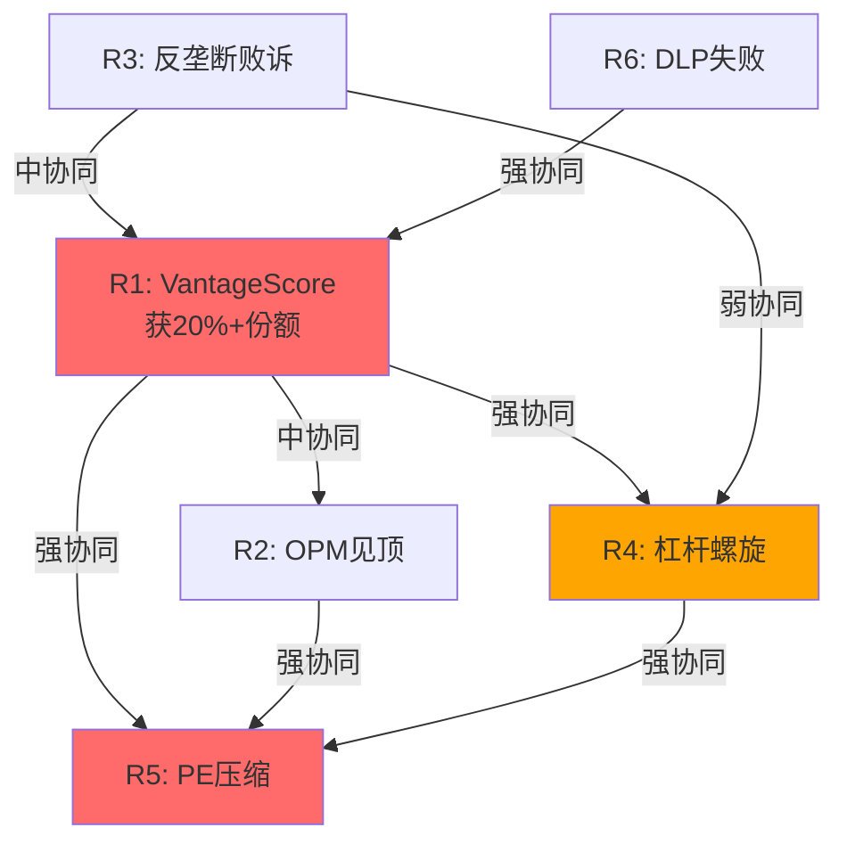
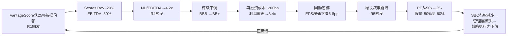
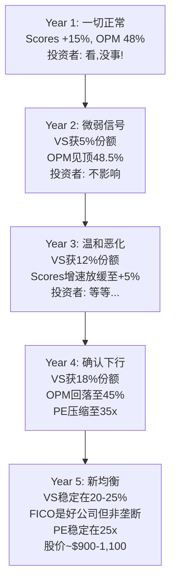

# Chapter 13: 风险拓扑 — 协同风险的系统性映射

---

## 13.1 风险清单 vs 风险系统

传统分析列出风险清单然后逐一评估。但FICO的风险不是独立的——它们之间存在**协同、反协同和条件依赖**关系。一个看似可控的风险在与另一个风险组合时可能产生1+1>3的效果。

### 六大核心风险

| ID | 风险 | 独立概率(5Y) | 独立影响 | 类型 |
|----|------|------------|---------|------|
| R1 | VantageScore获>20%按揭份额 | 30% | -20-30% Rev | 竞争 |
| R2 | OPM见顶/回落(>47%不可持续) | 40% | -15-20% | 基本面 |
| R3 | 反垄断集体诉讼败诉/和解 | 20% | -10-30%(一次性) | 法律 |
| R4 | 杠杆螺旋(评级下调→融资成本↑) | 15% | -20-40% | 财务 |
| R5 | PE压缩(增速放缓→50x→30x) | 45% | -30-40% | 估值 |
| R6 | DLP失败(征信局报复+贷款机构不采纳) | 25% | -10-15% | 战略 |

---

## 13.2 风险协同矩阵

### 协同强度矩阵

| | R1 VS份额 | R2 OPM顶 | R3 反垄断 | R4 杠杆 | R5 PE压缩 | R6 DLP失败 |
|--|----------|---------|---------|--------|---------|----------|
| **R1** | — | 中↑ | 中↑ | **强↑↑** | **强↑↑** | **强↑↑** |
| **R2** | 中↑ | — | 弱 | 中↑ | **强↑↑** | 弱 |
| **R3** | 中↑ | 弱 | — | 中↑ | 中↑ | 弱 |
| **R4** | **强↑↑** | 中↑ | 中↑ | — | **强↑↑** | 弱 |
| **R5** | **强↑↑** | **强↑↑** | 中↑ | **强↑↑** | — | 中↑ |
| **R6** | **强↑↑** | 弱 | 弱 | 弱 | 中↑ | — |

**最危险的协同组**: R1+R4+R5 (VantageScore侵蚀→杠杆螺旋→PE压缩)

---

## 13.3 恐怖组合: R1+R4+R5 死亡螺旋

**触发链**:

### 死亡螺旋量化

| 阶段 | 时间线 | EPS | P/E | 股价 | 累计跌幅 |
|------|--------|-----|-----|------|---------|
| **起点** | 2026 | $27 | 52x | $1,441 | — |
| R1触发 | 2027-2028 | $25(-7%) | 40x(-23%) | $1,000 | -31% |
| R4触发 | 2028-2029 | $22(-12%) | 32x(-20%) | $704 | -51% |
| R5触发 | 2029-2030 | $20(-9%) | 25x(-22%) | $500 | -65% |

**联合概率**: P(R1∩R4∩R5) ≈ 30% × 50%(conditional) × 80%(conditional) ≈ **12%**

**期望损失**: 12% × (-65%) = **-7.8% (期望值)**

### 反协同: 哪些风险互相抵消?

| 组合 | 关系 | 解释 |
|------|------|------|
| R1 + R2 | 部分反协同 | 如果VantageScore侵蚀→FICO可能降价→OPM下降, 但降价也可能阻止VS扩张 |
| R3 + R5 | 部分反协同 | 反垄断和解→可能限制提价→增速放缓→PE压缩, 但和解也可能移除不确定性→PE回升 |

---

## 13.4 "温水煮青蛙"情景: 最可能的恶化路径

**不是灾难性崩溃,而是渐进式恶化**:

### "温水煮青蛙"与"灾难性崩溃"的区别

| 维度 | 温水煮青蛙(最可能) | 灾难性崩溃(低概率) |
|------|-------------------|-------------------|
| 概率 | **45%** | 12% |
| 时间线 | 3-5年渐进 | 1-2年急剧 |
| VS份额 | 15-25% | 35%+ |
| OPM终值 | 42-48% | <40% |
| PE终值 | 25-35x | <20x |
| 股价(5Y) | $900-1,200 | <$600 |
| **投资者体验** | 每年-5%到-10%,不知不觉 | 突然-40%到-60% |

**关键洞察**: 温水煮青蛙是更危险的情景,因为:
1. 概率更高(45% vs 12%)
2. 每一步都看起来"还行"→投资者持续持有
3. 没有明确的"止损信号"→累计损失可能更大
4. 管理层可以在每个季度讲一个"还在增长"的故事

---

## 13.5 积极情景: 制度垄断加固

不应只看风险。FICO也有积极的可能性:

| 催化剂 | 概率(5Y) | 影响 |
|--------|---------|------|
| DLP大获成功→绕过征信局 | 25% | Scores Rev +10-15%, OPM +3-5pp |
| VantageScore技术失败(按揭违约率预测差) | 15% | C1回升至5.0, PE维持50x+ |
| 国际扩张突破(中国/印度/东南亚) | 10% | Rev +$200-400M(新增) |
| AI增强评分→新产品线 | 20% | TAM扩展,但竞争也加剧 |
| 贷款机构抵制VS(不想跑两套系统) | 30% | 延缓VS渗透5-10年 |

**期望上行**: 加权正面催化剂可能使估值上升10-15%($1,600-1,660)

---

## 13.6 风险温度计: 综合评估

| 维度 | 评分(1-5, 5=最高风险) | 权重 | 加权 |
|------|---------------------|------|------|
| 竞争风险(VS) | 3.5 | 30% | 1.05 |
| 估值风险(PE压缩) | 4.0 | 25% | 1.00 |
| 财务风险(杠杆) | 3.0 | 20% | 0.60 |
| 监管/法律风险 | 2.5 | 15% | 0.38 |
| 战略风险(DLP) | 2.0 | 10% | 0.20 |
| **综合风险温度** | | 100% | **3.23/5** |

**解读**: 风险水平中偏高。主要由估值风险(PE压缩)和竞争风险(VantageScore)驱动。财务和法律风险目前可控但有恶化潜力。

---

## 13.7 关键数据锚点表 (Phase 3 续)

| 锚点ID | 数据 | 来源 | 可信度 |
|--------|------|------|--------|
| DM-P3-016 | R1+R4+R5联合概率=12% | 条件概率模型 | ★★☆☆☆ |
| DM-P3-017 | 死亡螺旋终值=股价$500(-65%) | 情景分析 | ★★☆☆☆ |
| DM-P3-018 | 温水煮青蛙概率=45% | 情景分析 | ★★☆☆☆ |
| DM-P3-019 | 温水煮青蛙终值=$900-1,200(5Y) | 情景分析 | ★★☆☆☆ |
| DM-P3-020 | 综合风险温度=3.23/5 | 风险拓扑模型 | ★★★☆☆ |
| DM-P3-021 | 期望上行=+10-15%催化剂加权 | 情景分析 | ★★☆☆☆ |
