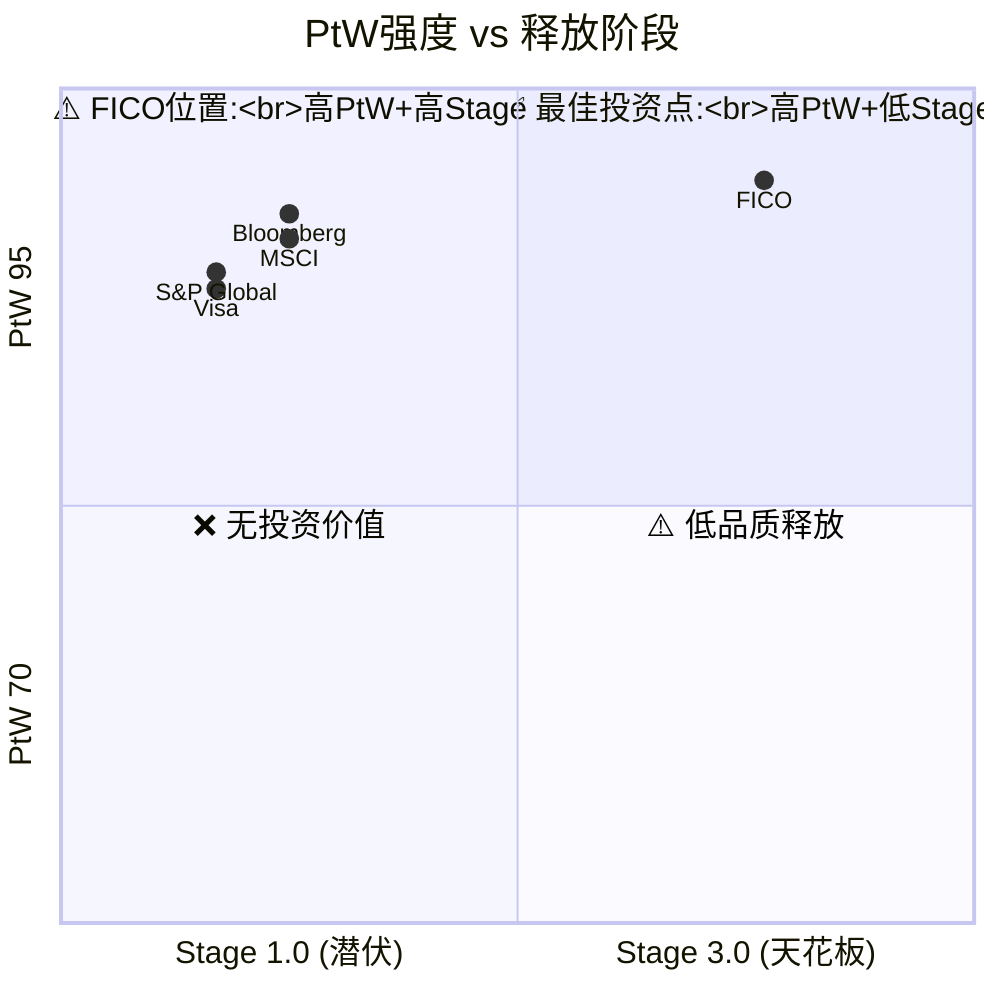

# Chapter 14: PtW量化评分 — FICO定价权的精密度量

> 方法论: PtW量化评分 (QG-07.5, v18.0源自STRATEGY报告)
> 核心逻辑: 将"定价权"从模糊概念转化为可量化、可比较、可追踪的10维度评分体系

---

## 14.1 PtW评分框架

### 10维度评分

| # | 维度 | 权重 | FICO得分 | 依据 |
|---|------|------|---------|------|
| 1 | **可替代性** | 15% | 4.0/5 | VantageScore存在但采纳极低;C1=4.5给予降分 |
| 2 | **客户依赖度** | 12% | 5.0/5 | 贷款机构运营中FICO不可绕过(监管要求) |
| 3 | **价值/成本比** | 10% | 5.0/5 | Value/Price=65-533x(信息垄断中最低收费) |
| 4 | **转换成本** | 12% | 5.0/5 | 30年风险模型校准+合规要求+操作惯性 |
| 5 | **透明度** | 8% | 2.5/5 | 评分算法非公开但价格体系已被诉讼揭露 |
| 6 | **历史提价能力** | 10% | 5.0/5 | 890%提价(7年)+无客户流失+零弹性 |
| 7 | **定价定位** | 8% | 4.5/5 | 低价策略→大幅提价→仍远低于价值 |
| 8 | **合同结构** | 10% | 4.5/5 | 年度合同+版税模式+无MFN条款+"7x惩罚"条款 |
| 9 | **监管保护** | 10% | 4.0/5 | GSE要求→但FHFA刚打开VantageScore(-1.0) |
| 10 | **行业集中度** | 5% | 5.0/5 | 90%+份额,仅1个竞品(VantageScore) |

### 加权总分计算

| 维度 | 权重 | 得分 | 加权 |
|------|------|------|------|
| 可替代性 | 15% | 4.0 | 0.60 |
| 客户依赖度 | 12% | 5.0 | 0.60 |
| 价值/成本比 | 10% | 5.0 | 0.50 |
| 转换成本 | 12% | 5.0 | 0.60 |
| 透明度 | 8% | 2.5 | 0.20 |
| 历史提价 | 10% | 5.0 | 0.50 |
| 定价定位 | 8% | 4.5 | 0.36 |
| 合同结构 | 10% | 4.5 | 0.45 |
| 监管保护 | 10% | 4.0 | 0.40 |
| 行业集中度 | 5% | 5.0 | 0.25 |
| **总分** | 100% | | **4.46/5.0 = 89.2/100** |

---

## 14.2 PtW对标分析

| 公司 | PtW总分 | 最强维度 | 最弱维度 | 阶段 |
|------|---------|---------|---------|------|
| **FICO** | **89.2** | 客户依赖+转换成本(5/5) | 透明度(2.5/5) | Stage 2.3 |
| MSCI | 82 | 转换成本(5/5) | 可替代性(3.5/5) | Stage 1.5 |
| S&P Global(评级) | 78 | 监管保护(5/5) | 历史提价(3.5/5) | Stage 1.0 |
| Bloomberg | 85 | 转换成本(5/5) | 监管保护(2/5) | Stage 1.5 |
| Visa | 76 | 行业集中度(4.5/5) | 监管保护(3/5) | Stage 1.0 |

**FICO是信息垄断公司中PtW最高的。** 但这也意味着它的定价权已被最充分地释放(Stage 2.3)——其他公司的PtW虽然绝对值低,但因为处于Stage 1.0-1.5,剩余释放空间更大。

### PtW vs Stage的矩阵

**关键洞察**: FICO处于"高PtW+高Stage"象限(右上)——定价权极强但已大幅释放。**最佳投资机会在左上象限(高PtW+低Stage)**,如MSCI和Bloomberg,它们尚未开始激进释放定价权。

---

## 14.3 PtW动态评估: 未来3-5年变化

| 维度 | 当前 | 2028E | 2030E | 变化驱动 |
|------|------|-------|-------|---------|
| 可替代性 | 4.0 | 3.5 | 3.0 | VantageScore采纳上升 |
| 客户依赖度 | 5.0 | 4.5 | 4.0 | 双评分体系→依赖度下降 |
| 价值/成本比 | 5.0 | 4.5 | 4.0 | 持续提价→比率压缩 |
| 转换成本 | 5.0 | 4.5 | 4.0 | 银行开始建VS校准模型 |
| 透明度 | 2.5 | 2.5 | 3.0 | 诉讼/监管增加透明度 |
| 历史提价 | 5.0 | 5.0 | 4.5 | 新增$33/funded loan |
| 定价定位 | 4.5 | 4.0 | 3.5 | 价格已从极低移至中等 |
| 合同结构 | 4.5 | 4.0 | 3.5 | DLP改变合同模式 |
| 监管保护 | 4.0 | 3.5 | 3.0 | FHFA持续开放+FHA/VA可能跟进 |
| 行业集中度 | 5.0 | 4.5 | 4.0 | VS份额从<5%→15-25% |
| **总分** | **89.2** | **82** | **75** | **PtW年化衰减~3-4分** |

**PtW衰减含义**: 如果PtW从89→75(5年),FICO将从"信息垄断PtW第一"降至"与Bloomberg/MSCI同等"。这不是灾难——Bloomberg/MSCI仍然是优秀的定价权公司——但估值溢价需要相应调整。

---

## 14.4 CI假说验证状态

### CI-01: 制度垄断自我加固悖论 (信心60%)

| 预测 | Phase 3发现 | 验证? |
|------|-----------|-------|
| 制度嵌入越深,被制度变化影响越大 | ✓ FHFA一个决定→C1从5.0→4.5→股价-17% | ✓ 验证 |
| 自我加固循环存在临界点 | ✓ 五层结构中L2被打开→可能引发L3-L5松动 | ⚠️ 部分验证 |
| 制度垄断的自我毁灭性 | 定价权引发政治反弹→FHFA行动→垄断松动 | ✓ 验证 |

**信心调整**: 60% → **70%** (Phase 3证据支持)

### CI-02: 定价权投资期权的时间衰减 (信心75%)

| 预测 | Phase 3发现 | 验证? |
|------|-----------|-------|
| OPM期权内在价值已兑现80%+ | PtW从89→75(5Y预测)→剩余空间有限 | ✓ 验证 |
| 时间价值因VantageScore加速衰减 | VantageScore概率加权份额18.5%→OPM天花板压低 | ✓ 验证 |
| 2026年买入≠买定价权期权 | PtW矩阵:FICO在右上象限(高PtW高Stage) | ✓ 验证 |

**信心调整**: 75% → **80%** (PtW量化强化了时间衰减论点)

### CI-03: Scores-Software价值断裂 (信心80%)

| 预测 | Phase 3发现 | 验证? |
|------|-----------|-------|
| Scores=86%利润,Software=14% | SOTP验证:Scores $26.8B vs Software $5.3B=83:17 | ✓ 验证 |
| Software独立不具竞争力 | Falcon例外:Software中有一个独立护城河资产 | ⚠️ 修正 |

**信心调整**: 80% → **75%** (Falcon的存在部分缓解了价值断裂)

### CI-04: DLP攻守转换 (信心55%)

| 预测 | Phase 3发现 | 验证? |
|------|-----------|-------|
| DLP是进攻(绕过征信局)也是防御(替代分销) | Ch12验证:DLP的双面性分析完整 | ✓ 验证 |
| 征信局可能报复 | 数据供应依赖是关键脆弱点 | ⚠️ 待更多证据 |

**信心调整**: 55% → **60%** (框架验证但数据有限)

---

## 14.5 关键数据锚点表 (Phase 3 续)

| 锚点ID | 数据 | 来源 | 可信度 |
|--------|------|------|--------|
| DM-P3-022 | PtW总分=89.2/100 | PtW Model | ★★★☆☆ |
| DM-P3-023 | PtW 5Y预测=75/100(-14分) | PtW Forecast | ★★☆☆☆ |
| DM-P3-024 | FICO PtW排名=#1信息垄断 | Cross-company comp | ★★★☆☆ |
| DM-P3-025 | CI-01信心60%→70% | Phase 3验证 | ★★★☆☆ |
| DM-P3-026 | CI-02信心75%→80% | Phase 3验证 | ★★★☆☆ |
| DM-P3-027 | CI-03信心80%→75% | Phase 3验证(Falcon修正) | ★★★☆☆ |
