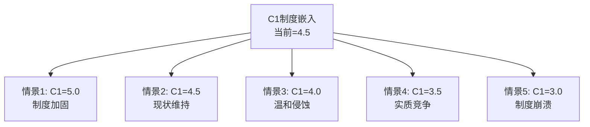
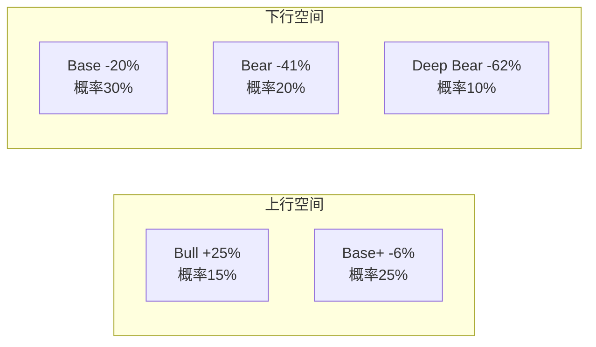

# Chapter 15: 五情景分析 — 从$550到$1,800的可能性空间

---

## 15.1 情景设计原则

FICO的不确定性不是"增长快还是增长慢"的简单问题——它是一个制度变迁问题。五个情景围绕一个核心变量展开: **C1制度嵌入在未来5-10年如何演化?**

---

## 15.2 情景1: Bull — 制度垄断加固 (概率15%)

### 叙事
VantageScore的GSE准入最终成为"纸上权利"——贷款机构因惰性和FICO技术优势而不切换。DLP大获成功,FICO直接触达贷款机构,绕过征信局。Scores持续+15%增长,OPM扩张至60%。FICO从"评分垄断"进化为"信用决策平台"。

### 财务路径 (FY2030E)

| 指标 | FY2025A | FY2030E | CAGR |
|------|---------|---------|------|
| Revenue | $1,991M | $4,100M | 15.5% |
| Scores Rev | $1,169M | $2,200M | 13.5% |
| Software Rev | $822M | $1,900M | 18.2% |
| OPM | 46.5% | 60% | +2.7pp/年 |
| EPS | $26.90 | $85 | 25.9% |

### 估值

| 方法 | 估值 |
|------|------|
| FY2030E EPS $85 × 22x terminal | **$1,870** |
| Discount @10% → FY2026 PV | **$1,800** (approx) |
| 隐含当前P/E | 67x(合理? 需25%+ CAGR支撑) |

### 触发条件
- [ ] VantageScore技术验证失败(准确性不足)
- [ ] DLP获>50%按揭贷款机构采纳
- [ ] 反垄断诉讼驳回/和解(<$200M)
- [ ] 国际扩张突破($300M+新增收入)

---

## 15.3 情景2: Base+ — 温和乐观 (概率25%)

### 叙事
VantageScore获得10-15%按揭份额,但FICO通过提价和mix shift维持收入增长。OPM扩张至55%(低于天花板)。PE从52x温和压缩至35-40x。回购继续但规模缩减(不再举债)。

### 财务路径

| 指标 | FY2025A | FY2030E | CAGR |
|------|---------|---------|------|
| Revenue | $1,991M | $3,200M | 10.0% |
| OPM | 46.5% | 55% | +1.7pp/年 |
| EPS | $26.90 | $65 | 19.3% |

### 估值

| 方法 | 估值 |
|------|------|
| FY2030E EPS $65 × 22x | $1,430 |
| PV @10% | **$1,350** |

---

## 15.4 情景3: Base — 温和悲观 (概率30%)

### 叙事
VantageScore获得15-20%按揭份额。FICO被迫限制提价幅度以避免加速VS采纳。OPM见顶在50%附近。PE压缩至28-32x。杠杆稳定(不恶化但也不减少)。

### 财务路径

| 指标 | FY2025A | FY2030E | CAGR |
|------|---------|---------|------|
| Revenue | $1,991M | $2,700M | 6.3% |
| Scores Rev | $1,169M | $1,100M | -1.2% |
| Software Rev | $822M | $1,600M | 14.3% |
| OPM | 46.5% | 50% | +0.7pp/年 |
| EPS | $26.90 | $47 | 11.8% |

### 估值

| 方法 | 估值 |
|------|------|
| FY2030E EPS $47 × 25x | $1,175 |
| PV @10% | **$1,150** |

---

## 15.5 情景4: Bear — 实质竞争 (概率20%)

### 叙事
VantageScore获25%+按揭份额。征信局全力推广VS,限制FICO数据访问(DLP报复)。FHFA/FHA进一步推动竞争。FICO被迫降价以保份额。OPM回落至42-45%。PE压缩至20-25x。杠杆成为问题(ND/EBITDA→3.5-4x)。

### 财务路径

| 指标 | FY2025A | FY2030E | CAGR |
|------|---------|---------|------|
| Revenue | $1,991M | $2,100M | 1.1% |
| Scores Rev | $1,169M | $800M | -7.3% |
| Software Rev | $822M | $1,300M | 9.6% |
| OPM | 46.5% | 42% | -0.9pp/年 |
| EPS | $26.90 | $32 | 3.5% |

### 估值

| 方法 | 估值 |
|------|------|
| FY2030E EPS $32 × 22x | $704 |
| PV @10% → adjusted | **$850** |

---

## 15.6 情景5: Deep Bear — 制度崩溃 (概率10%)

### 叙事
反垄断集体诉讼获集体认证,三倍赔偿金额巨大($2-5B)。FHFA要求GSE使用双评分(FICO+VS),随后VA/FHA跟进。国会通过Hawley法案限制评分费用。征信局完全转向VS。FICO从"垄断者"变成"竞争者之一"。

### 财务路径

| 指标 | FY2025A | FY2030E | CAGR |
|------|---------|---------|------|
| Revenue | $1,991M | $1,600M | -4.3% |
| Scores Rev | $1,169M | $500M | -15.6% |
| OPM | 46.5% | 35% | -2.3pp/年 |
| EPS | $26.90 | $18 | -7.7% |
| 一次性损失 | — | $2-5B诉讼赔偿 | — |

### 估值

| 方法 | 估值 |
|------|------|
| FY2030E EPS $18 × 18x | $324 |
| PV @10% + 诉讼损失 | **$550** |

---

## 15.7 概率加权与期望值

### 汇总

| 情景 | 概率 | 估值 | 概率×估值 | C1 | VS份额 |
|------|------|------|----------|-----|--------|
| Bull | 15% | $1,800 | $270 | 5.0 | <10% |
| Base+ | 25% | $1,350 | $338 | 4.5 | 10-15% |
| Base | 30% | $1,150 | $345 | 4.0 | 15-20% |
| Bear | 20% | $850 | $170 | 3.5 | 25-30% |
| Deep Bear | 10% | $550 | $55 | 3.0 | 35%+ |
| **加权** | 100% | **$1,178** | | 4.08 | 17% |

### 与Python DCF的一致性检验

| 方法 | 中值/加权值 | vs $1,441 |
|------|-----------|----------|
| **SOTP** (Ch10) | $1,200 | -17% |
| **概率加权** (Ch15) | $1,178 | -18% |
| **Reverse DCF交叉** (Ch10) | ~$1,200 | -17% |

**三种方法在$1,178-1,200区间收敛。** 这增强了"高估17-18%"结论的可信度。

### 期望回报的不对称性

**上行/下行不对称**:
- P(跑赢) = 15%(Bull) = 15%
- P(跑输) = 30%+20%+10% = 60%
- P(持平) = 25%(Base+)
- **下行概率是上行概率的4倍**

---

## 15.8 转折点监控清单

| 转折点 | 监控指标 | Bull信号 | Bear信号 | 数据源 |
|--------|---------|---------|---------|--------|
| VantageScore实际采纳 | VS评分在GSE贷款中的占比 | <5%(2027) | >15%(2027) | FHFA报告 |
| DLP进展 | DLP渠道Scores收入占比 | >20%(2027) | <5%(2027) | FICO Earnings |
| 定价权持续性 | 年度版税变化率 | >5%提价 | 降价或冻价 | FICO 10-K |
| 杠杆趋势 | ND/EBITDA | <2.5x | >3.5x | FICO 10-K |
| 诉讼进展 | 集体认证/和解 | 驳回 | 集体认证 | PACER |
| PE趋势 | Forward P/E | >35x | <25x | 市场数据 |
| 管理层信号 | 内部人购买 | 任何购买 | 继续零购买 | SEC Form 4 |

---

## 15.9 关键数据锚点表 (Phase 3 续)

| 锚点ID | 数据 | 来源 | 可信度 |
|--------|------|------|--------|
| DM-P3-028 | Bull估值=$1,800(15%) | 情景分析 | ★★☆☆☆ |
| DM-P3-029 | Base估值=$1,150(30%) | 情景分析 | ★★★☆☆ |
| DM-P3-030 | Deep Bear估值=$550(10%) | 情景分析 | ★★☆☆☆ |
| DM-P3-031 | 概率加权=$1,178(-18%) | 加权模型 | ★★★☆☆ |
| DM-P3-032 | 下行概率:上行概率=4:1 | 情景分布 | ★★★☆☆ |
| DM-P3-033 | 三方法收敛区间=$1,178-1,200 | 交叉验证 | ★★★☆☆ |
