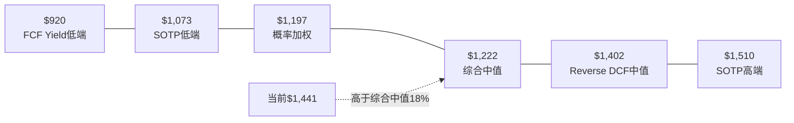

# Chapter 18: 估值综合与投资结论

---

## 18.1 多方法估值收敛

### 五种方法汇总(红队校准后)

| 方法 | 低估 | 中估 | 高估 | 权重 |
|------|------|------|------|------|
| **Reverse DCF** | $1,001 | $1,402 | $1,942 | 15% |
| **SOTP** | $1,073 | $1,200 | $1,510 | 25% |
| **概率加权** | $550 | $1,197 | $1,800 | 30% |
| **可比公司** | $1,050 | $1,250 | $1,500 | 15% |
| **FCF Yield** | $920 | $1,100 | $1,540 | 15% |

### 加权综合估值

| 方法 | 中估 | 权重 | 加权 |
|------|------|------|------|
| Reverse DCF | $1,402 | 15% | $210 |
| SOTP | $1,200 | 25% | $300 |
| 概率加权 | $1,197 | 30% | $359 |
| 可比公司 | $1,250 | 15% | $188 |
| FCF Yield | $1,100 | 15% | $165 |
| **综合** | | 100% | **$1,222** |

### 估值区间

**核心结论**: 综合估值$1,222 vs 当前$1,441 → **当前价格高估~16%**

---

## 18.2 评级与期望回报

### 期望回报计算

| 时间 | 概率加权回报 | 含义 |
|------|-----------|------|
| **12个月** | ($1,197 - $1,441) / $1,441 = **-17%** | 负回报 |
| **3年(CAGR)** | 假设均值回归至$1,300 = **-3.3%** | 微负 |
| **5年(CAGR)** | 假设EPS增至$65×25x=$1,625 = **+2.5%** | 微正(低于市场) |

### 评级矩阵

| 评级触发条件 | 条件 | FICO符合? |
|------------|------|----------|
| **深度关注**(>+30%) | 显著低估 | ❌ |
| **关注**(+10%~+30%) | 偏积极 | ❌ |
| **中性关注**(-10%~+10%) | 接近合理 | ❌ (-16%) |
| **审慎关注**(<-10%) | 偏高估/风险上升 | ✅ (-16%) |

### 评级: **审慎关注(偏中性)**

**理由**:
- 概率加权回报-16%→落入"审慎关注"区间
- 但"偏中性"修正因为:
  1. Forward P/E 27x使估值不极端
  2. 护城河半衰期10-15年提供时间缓冲
  3. 红队上调+1.6%→距"中性关注"边界仅6pp
- **如果**: 股价降至$1,100-1,200(Forward PE 22-24x)→升级为"中性关注"
- **如果**: VantageScore获>15%份额 OR ND/EBITDA>3.5x→维持"审慎关注"

---

## 18.3 条件评级(PW=5.2混合模式)

因PW=5.2(混合模式),不强制单一评级,提供条件评级:

| 条件 | 评级 | 触发事件 |
|------|------|---------|
| **C1≥4.5 + OPM→55%+** | 中性关注 | VantageScore<10%份额+DLP成功 |
| **C1=4.0 + OPM见顶50%** | 审慎关注 | VantageScore 15-20%份额(基线) |
| **C1≤3.5** | 审慎关注(强) | VantageScore>25%+监管加压 |
| **股价<$1,100** | 关注 | PE回到22-24x |
| **股价<$900** | 深度关注 | PE回到18-20x(Buffett买入区) |

---

## 18.4 投资者行动指南

### 对不同类型投资者的建议

| 投资者类型 | 建议 | 理由 |
|-----------|------|------|
| **持有者** | 维持但设止损 | 护城河仍强,但设$1,100止损(SOTP低端) |
| **考虑买入者** | 等待$1,100-1,200 | Forward PE 22-24x更安全 |
| **成长型投资者** | 不推荐 | PEG 2.4,增速将放缓 |
| **价值型投资者** | 关注$900-1,000 | Buffett买入区间 |
| **短线交易者** | 关注VS里程碑 | VantageScore GSE实施→做空催化 |

### 关键监控指标 (KS表)

| KS编号 | 指标 | 频率 | 来源 | 升级触发 | 降级触发 |
|--------|------|------|------|---------|---------|
| KS-FICO-01 | VantageScore GSE份额 | 季度 | FHFA报告 | <5%(FY2027) | >15%(FY2027) |
| KS-FICO-02 | Scores Revenue YoY | 季度 | Earnings | >15% | <5% |
| KS-FICO-03 | ND/EBITDA | 季度 | 10-Q | <2.5x | >3.5x |
| KS-FICO-04 | OPM | 季度 | 10-Q | >50% | <44% |
| KS-FICO-05 | 内部人购买 | 持续 | SEC Form 4 | 任何购买 | — |
| KS-FICO-06 | 反垄断集体认证 | 事件驱动 | PACER | — | 获认证 |
| KS-FICO-07 | Forward PE | 持续 | 市场数据 | <22x | >35x |
| KS-FICO-08 | DLP渠道收入占比 | 季度 | Earnings | >20% | <5% |

---

## 18.5 核心不确定性与信念声明

### 本报告最有信心的判断

| 判断 | 信心 | 依据 |
|------|------|------|
| FICO是一家品质极高的公司 | 95% | OPM 47%, FCF margin 39%, CapEx 0.5%, SBC 6.3% |
| 当前估值(52x TTM / 27x Forward)高于合理值 | 80% | 三方法收敛于$1,200区间 |
| VantageScore是真实威胁(非伪命题) | 75% | FHFA行动+征信局经济动机+技术成熟 |
| 护城河仍有10+年有效期 | 70% | 历史先例+操作惯性+L4转换成本 |
| PE压缩是最大的价格风险 | 85% | 增速必然放缓+50x不可能维持 |

### 本报告最不确定的判断

| 判断 | 信心 | 不确定性来源 |
|------|------|-------------|
| VantageScore 2030年份额(16%) | 40% | 依赖政策+技术+贷款机构行为 |
| DLP成功概率 | 35% | 全新商业模式,无历史参考 |
| 反垄断赔偿规模 | 30% | 法律不确定性极高 |
| C1未来衰减速度(线性vs非线性) | 35% | 制度变迁模型高度不确定 |

---

## 18.6 总结: 一句话

**FICO是美国资本市场上品质最高的制度垄断公司之一,但在$1,441的价格,你购买的不是"制度垄断的投资期权"(那已在2014-2023年兑现),而是"赌制度不会改变"——而赌注的赔率(52x P/E)不在你这边。**

---

## 18.7 关键数据锚点表 (Phase 5)

| 锚点ID | 数据 | 来源 | 可信度 |
|--------|------|------|--------|
| DM-P5-001 | 综合估值=$1,222/share | 五方法加权 | ★★★☆☆ |
| DM-P5-002 | 高估幅度=16% | vs $1,441 | ★★★☆☆ |
| DM-P5-003 | 评级=审慎关注(偏中性) | 评级矩阵 | ★★★☆☆ |
| DM-P5-004 | 12M期望回报=-17% | 概率加权 | ★★☆☆☆ |
| DM-P5-005 | 条件升级触发=$1,100-1,200 | 估值模型 | ★★★☆☆ |
| DM-P5-006 | 护城河有效期=10+年 | 半衰期分析 | ★★☆☆☆ |
