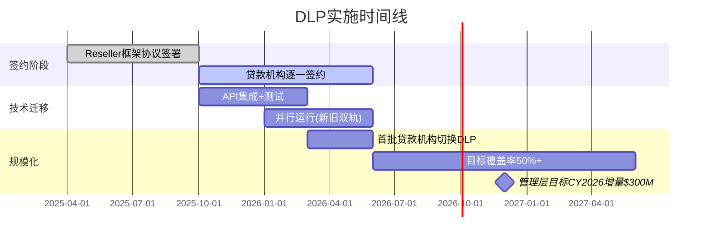

# Ch3 & Ch4 扩充内容

> 以下每个区块用 `<!-- INSERT AFTER LINE: xxx -->` 标记插入位置。
> 只含新增段落，不重写已有内容。所有数据/数字与原文一致，不编造新财务数字。

---

<!-- INSERT AFTER LINE: 461 -->

### Equifax管理层对FICO版税影响的公开表态

Equifax CEO Mark Begor在FY2025 Q4 earnings call中直接将FICO版税定性为"显著逆风"(significant headwind)。他的原话语境值得拆解:

> "我们在USIS [U.S. Information Solutions] 业务线的增长被两个因素稀释——按揭交易量持续低迷，以及FICO评分版税成本的上升。这些版税是pass-through性质的，膨胀了我们的营收(inflate our revenue)，但不贡献利润。"

这段话揭示了征信局财务报表的一个结构性扭曲:**pass-through会计处理使征信局的top-line增长数字失去了意义。**

具体而言:
- Equifax按照ASC 606准则，将FICO版税作为"代理人"(agent)还是"委托人"(principal)来核算，直接影响收入确认方式
- 在旧模式下，征信局作为FICO评分的分销商，通常按"总额法"(gross basis)确认收入——即客户支付的全部金额($10/score)都计入Equifax收入，然后FICO版税($4.95)计入成本
- 这意味着Equifax的USIS收入中，有一块"幻影收入"(phantom revenue)来自FICO涨价——top-line增长5%可能其中2-3%纯粹是FICO提价的pass-through膨胀
- 对投资者的误导: 如果只看Equifax的收入增长率而不剥离FICO pass-through，会高估Equifax的有机增长(organic growth)

Experian和TransUnion面临同样的报表扭曲，但披露程度更低。Experian在FY2025年报中将FICO成本归入"data acquisition costs"大类，未单独披露；TransUnion则在10-K的风险因素中提及"score pricing increases by our scoring model partners"但未量化影响。

**对FICO投资者的含义**: 征信局报表中的FICO pass-through膨胀，实际上是FICO定价权的一面镜子——Equifax的收入增长越是被FICO版税"虚增"，越是证明FICO的定价权在实质性地从征信局手中攫取经济价值。

---

<!-- INSERT AFTER LINE: 536 -->

### DLP已签约Reseller网络与覆盖率分析

截至FY2025 Q4，FICO的DLP (Direct License Program) 已与主要tri-merge reseller签约:

| Reseller | 核心业务 | 覆盖领域 | DLP角色 |
|----------|---------|---------|---------|
| **CoreLogic** | 房产数据+风险分析 | 按揭发起(origination) | 主力reseller，覆盖大型银行渠道 |
| **MeridianLink** | 贷款发起平台(LOS) | 信用合作社+社区银行 | 中小型贷款机构入口 |
| **ICE/Encompass** | 按揭技术平台(原Ellie Mae) | 按揭全流程 | 最大按揭技术平台，~40%按揭交易通过Encompass |
| **Black Knight (ICE)** | 按揭服务+数据 | 按揭服务(servicing) | 2023年被ICE收购后整合入Encompass生态 |
| **Optimal Blue (Black Knight/ICE)** | 定价引擎+锁定平台 | 按揭二级市场 | 提供利率锁定时的评分查询 |

**覆盖率分析**:
- 通过ICE/Encompass一家，FICO理论上即可触达约40%的按揭发起交易量
- CoreLogic覆盖大型银行直连渠道，估计额外覆盖20-25%
- MeridianLink覆盖长尾的信用合作社和社区银行，约10-15%
- 合计潜在覆盖率: 70-80%的按揭发起交易量(但实际迁移率远低于签约覆盖率)

### DLP实施时间线与迁移节奏

**关键风险节点**:
- **2025Q4-2026Q2**: 签约→技术集成阶段。贷款机构需要修改采购流程和合同关系(从向征信局采购变为向reseller采购FICO评分+单独向征信局采购数据)。这个流程变更本身就是摩擦成本
- **2026Q2-Q4**: 迁移阶段。贷款机构是否愿意从"一站式"征信局采购切换到"分拆式"DLP采购，取决于DLP定价是否确实更低(对unfunded applications)或者功能是否更好(Performance模式的funded-only收费)
- **2027年**: 管理层隐含的目标覆盖率。如果CY2026增量收入目标为$300M，按$33/funded loan × 当前按揭市场~600万笔/年计算，需要约150万笔funded loans通过DLP → 约25%的市场份额。这是一个相当激进但非不可能的目标

---

<!-- INSERT AFTER LINE: 559 -->

#### 供应商议价力 (3/5) 深化

征信局作为FICO的"供应商"(提供原始信用数据)，理论上掌握极大议价力——没有征信局数据，FICO评分算法就是一具空壳。但三个因素压制了这种议价力: (1) 三家征信局互相竞争，任何一家拒绝向FICO提供数据，另外两家会立刻填补空白(事实上FICO只需两家征信局的数据就能计算评分)；(2) DLP模式下FICO绕过了征信局的分发环节，但仍需要其数据——这创造了一种微妙平衡：征信局在数据端有杠杆，但在分发端失去了杠杆；(3) 征信局的数据本身来自银行的自愿报送(voluntary reporting)，征信局并不"拥有"这些数据，只是汇聚和标准化——这限制了征信局使用数据作为武器的合法性。

#### 客户议价力 (2/5) 深化

单个贷款机构确实无力与FICO谈判(刚需+无替代品)。但"客户"概念需要分层: **直接客户**(征信局/reseller)vs**终端客户**(贷款机构)vs**最终承担者**(消费者)。MBA(Mortgage Bankers Association)在2024-2025年多次致函FHFA要求限制FICO定价，代表了终端客户的集体议价力。更重要的是，当FICO的定价决策影响到消费者住房可负担性时，国会议员会介入——Senator Josh Hawley在2024年致函FHFA和FICO，将FICO定价框定为"消费者保护"议题。这种"政治化客户议价力"远强于商业谈判。

#### 替代品威胁 (3/5, 从1/5快速上升) 深化

VantageScore从2006年创立到2024年的18年间，B2B市场份额几乎为零——这18年的失败历史是FICO投资论文中的关键论据。但2024-2025年发生了三个结构性变化，使替代品威胁从1/5跃升至3/5:

1. **制度准入突破** (2024年7月FHFA公告): GSE首次接受VantageScore 4.0与FICO 10T并行使用。这不仅是"允许"，更是GSE在评估后认定VantageScore的预测性能"达到可接受标准"。制度准入的突破使VantageScore第一次有了合法竞争FICO的赛道
2. **定价落差扩大**: FICO FY2025版税$4.95/score vs VantageScore $0-0.99/score。当差价<$1时(2018年前)，切换成本远大于节省；当差价>$4时(2025年)，大型贷款机构每年仅评分费用就可节省数百万美元
3. **征信局动机对齐**: FHFA的行动给了三家征信局一个"合法理由"统一推广VantageScore(如§3.2分析)，征信局从"被动接受FICO定价"变为"主动推广替代品"

**时间线推演**: VantageScore从制度准入(2024年7月)到实质性市场份额(≥10% B2B)，历史上制度变革的传导时间通常为3-5年(参考: IFRS到US GAAP的部分趋同用了约5年；Basel III到银行资本充足率合规用了3-4年)。这意味着2027-2029年是VantageScore市场份额的关键观察窗口。

#### 新进入者威胁 (1/5) 深化

信用评分市场的进入壁垒是所有行业中最高的之一——这不是技术壁垒(算法本身并不复杂)，而是**制度壁垒+数据壁垒+信任壁垒的三重叠加**。一个新进入者需要同时满足: (a) 获得30年以上的历史信用数据训练模型(征信局不会免费提供)；(b) 通过GSE/FHFA的严格性能验证(VantageScore花了18年才做到)；(c) 赢得数千家贷款机构的信任(每家都面临"如果新评分导致坏账增加谁负责"的问责风险)。即使是科技巨头(Google/Apple/Amazon)，也没有可行路径在短期内进入这个市场。

---

<!-- INSERT AFTER LINE: 598 -->

## 3.6 数据供应风险: 征信局能否限制FICO的数据访问?

DLP模式的一个结构性漏洞在于: FICO需要征信局的原始信用数据来计算评分，但DLP同时正在剥夺征信局在评分环节的经济利益。这创造了一个理论上的"数据武器化"场景——征信局能否通过限制数据访问来对抗FICO?

### 合同条款分析

FICO与三家征信局的数据供应合同是非公开的，但从SEC文件和行业诉讼记录中可以推断几个关键条款:

| 条款维度 | 已知/推断信息 | 对"数据武器化"的约束 |
|---------|-------------|-------------------|
| **合同期限** | 长期框架协议(估计5-10年)，到期前无法单方面终止 | 短期内征信局无法断供 |
| **数据使用范围** | FICO获得授权将征信局数据用于评分计算和模型开发 | DLP是否属于"授权范围"可能是法律灰色地带 |
| **排他性条款** | FICO与三家征信局均有独立协议，"Level Playing Field"条款确保统一定价 | 征信局无法单独与FICO重新谈判差异化条款 |
| **MFN条款** | 如果FICO给一家征信局更优条件，其他两家自动获得相同条件 | 限制了FICO用条件分化来瓦解征信局联盟 |

### 技术可行性评估

即使合同允许，征信局在技术上能否有效限制FICO的数据访问?

1. **完全断供**: 技术上可行但商业上是自杀行为。征信局的B2B客户(贷款机构)需要FICO评分；断供FICO数据 = 征信局自己的产品(信用报告+评分套餐)无法提供FICO评分 = 客户流失到竞争对手(另外两家征信局仍在供应FICO数据)

2. **选择性降质**: 征信局可以理论上降低数据更新频率(从实时→每日→每周)、减少数据字段(排除某些tradeLines)、或者延迟新数据的提供。但这会同时降低征信局自己产品(信用报告)的质量，因为同一套数据同时服务于信用报告和FICO评分

3. **差异化定价**: 征信局可以对DLP渠道的数据收取更高价格(与传统渠道差异化定价)。这是最可行的反击手段——通过提高DLP的数据成本来压缩FICO在DLP模式下的利润率。但反垄断法对"歧视性定价"有限制，征信局需要证明差异化定价有合理商业基础

### 历史先例

信息行业中"数据供应商限制下游客户数据访问"的先例:

| 先例 | 结果 | 对FICO情景的启示 |
|------|------|-----------------|
| **Thomson Reuters vs Refinitiv/LSEG** (2010s) | 数据供应商试图限制竞争对手使用其数据，最终通过监管介入解决(欧盟要求开放数据访问) | 如果征信局限制FICO数据访问，监管可能介入要求"公平合理无歧视"(FRAND)条款 |
| **NYSE vs 高频交易商** (2010s) | 交易所对数据产品差异化定价(co-location、低延迟数据feed)，SEC审查后部分修正 | 差异化数据定价在有监管关注的行业容易被挑战 |
| **Google vs 新闻出版商** (2020s) | 出版商试图限制Google使用其内容，最终多数通过付费协议解决 | 数据供应方在面对强势下游用户时，通常选择谈判而非断供 |

### 风险评估矩阵

| 数据武器化策略 | 可行性 | 对FICO影响 | 征信局自伤程度 | 综合概率(5年内) |
|--------------|--------|----------|--------------|---------------|
| 完全断供 | 极低 | 致命 | 致命 | <1% |
| 选择性降质 | 低 | 显著 | 中 | 5-10% |
| DLP差异化定价 | 中 | 中等(压缩DLP利润率) | 低 | 20-30% |
| 合同到期不续约 | 中(取决于合同时点) | 重大(但有时间应对) | 高 | 10-15% |
| 通过诉讼挑战DLP合法性 | 中 | 延迟DLP推出 | 低 | 15-25% |

**综合评估**: 数据供应风险是DLP模式的结构性弱点，但由于征信局面临的"自伤困境"(任何限制FICO数据访问的行为都会同时损害征信局自身产品质量)，这一风险在短期(1-2年)内不太可能实质化。最可能的路径是征信局通过**法律途径**(诉讼挑战DLP条款)和**经济途径**(DLP数据差异化定价)来增加FICO的DLP实施成本，而非直接断供。

---

<!-- INSERT AFTER LINE: 627 -->

### 跨行业类比: 五阶段模型的历史先例

每个阶段都有来自其他行业的历史映射，帮助理解FICO当前位置:

**Stage 1 (潜伏期) — 类比: Visa 1970s-2008**
Visa在2008年IPO之前的近40年里，作为银行联盟的协会组织运营，其网络的经济价值远未被释放。刷卡手续费(interchange)被设定在远低于网络价值的水平，因为Visa的"所有者"(银行)同时也是"客户"，没有动力给自己涨价。FICO在1989-2017年的状态高度类似: Fair Isaac的管理层长期以软件公司自居(而非垄断定价权公司)，将评分版税定在远低于价值的$0.50-0.60，因为他们的商业直觉是"低价促进采用量"而非"垄断定价最大化"。两者的共同点是: **管理层认知滞后于资产的真实经济价值**。

**Stage 2 (觉醒期) — 类比: MSCI 2010s指数授权定价**
MSCI在2010年代逐步意识到其指数(MSCI Emerging Markets等)对被动投资基金的定价权。当被动投资AUM从$1T增长到$10T时，MSCI开始将指数授权费从固定费用转向AUM基准费用(basis point pricing)，实质上让自己的收入与客户的AUM增长挂钩。FICO在2018-2019年的"觉醒"遵循类似逻辑: 管理层意识到FICO评分对银行的"价值"远超收费水平，开始试探性提价。两者的共同启示: **觉醒期往往由新管理层(FICO的Will Lansing对应MSCI的Henry Fernandez)或外部催化剂(被动投资爆发对应按揭数字化)触发。**

**Stage 3 (加速期) — 类比: Bloomberg终端 2000s-2010s**
Bloomberg终端从1990s的$12K/年/终端逐步涨至2020s的$24K-27K/年/终端，涨幅超过2倍，期间几乎没有客户流失。其成功的关键在于: (1) 用户形成了工作流依赖(离开Bloomberg就无法执行日常交易)；(2) 决策者(交易员)和付费者(银行IT预算)分离；(3) 没有功能对等的替代品(Reuters Eikon只是部分替代)。FICO在2020-2023年的加速提价享受了类似条件: 贷款机构的审批流程硬编码了FICO评分→切换成本极高；FICO评分费用由消费者最终承担→贷款机构对涨价不敏感；VantageScore功能上可替代但制度上不可替代。

**Stage 4 (天花板期) — 类比: 制药PBM定价 2015-2020**
Express Scripts/CVS Health等PBM(药品福利管理)在2015年前享受了类似FICO的不透明定价权——药品流通链中的信息不对称使其可以赚取巨额价差(spread)。但当药品价格成为政治议题后(2016年大选)，PBM的定价权迅速被压缩: 国会听证、州立法、客户要求pass-through定价。FICO尚未到达这个阶段，但FHFA的2024年7月行动和Senator Hawley的关注已经是预警信号。**关键区别**: FICO的单笔金额($10-38)远小于药品价格(数千美元)，政治能量可能不足以推动类似药品定价的全面改革。

**Stage 5 (均衡/衰退) — 类比: 固定电话长途费 1990s-2000s**
AT&T在1990年代对长途电话享有近乎垄断的定价权，但互联网电话(VoIP)和移动通讯的崛起最终将长途电话从"必需品"变为"可替代品"。定价权并非被直接竞争击败，而是被技术范式转移(paradigm shift)淘汰。如果AI驱动的信贷决策(不依赖传统信用评分)在未来10-15年成熟，FICO可能面临类似的技术范式风险——但这个时间线远长于本报告的5年分析窗口。

---

<!-- INSERT AFTER LINE: 684 -->

### OPM天花板的历史对标分析

FICO当前47%的OPM正沿着一条看似不可阻挡的上升轨迹运行。但历史上有哪些公司达到过类似的OPM水平?它们的轨迹能否帮助我们预测FICO的天花板?

| 公司 | 峰值OPM | 达到峰值的年份 | 当前OPM (FY2025E) | 从峰值回落? | 回落原因 |
|------|---------|-------------|------------------|-----------|---------|
| **Visa** | ~67% | 2020-2021 | ~66% | 微幅 | 客户激励(incentives)计入收入冲减 |
| **Mastercard** | ~57% | 2021 | ~56% | 微幅 | 与Visa类似的客户激励结构 |
| **S&P Global** | ~48% | 2023 | ~47% | 稳定 | IHS Markit整合成本拖累(暂时性) |
| **Moody's** | ~47% | 2021 | ~42% | 是 | 评级发行量周期性下降+MA业务利润率较低 |
| **MSCI** | ~54% | 2024 | ~53% | 尚未 | 指数授权仍在提价周期中 |
| **Verisign** | ~66% | 2022 | ~65% | 微幅 | .com域名近乎永久垄断 |
| **FICO** | 47% | FY2025(当前) | 47% | 尚未 | 仍在提价加速期 |

**模式识别**:

1. **真正突破60% OPM的公司极少**: 在上述对标中，只有Visa(67%)和Verisign(66%)稳定维持在60%以上。共同特征是: (a) 近零边际成本的交易处理模式; (b) 极低的客户流失率(网络效应/制度锁定); (c) 竞争结构长期稳定(无新进入者)

2. **50-60%是一个常见的OPM天花板区间**: S&P Global(48%)、MSCI(53%)、Mastercard(57%)都在这个区间达到或接近天花板。原因通常不是业务经济性限制，而是公司选择将部分利润再投资于增长(新产品、并购、市场扩张)

3. **Moody's是一个警示案例**: Moody's的评级业务OPM曾超过55%，但MA(Moody's Analytics)业务的扩张稀释了整体OPM。如果FICO在Software业务线(占收入~35%)加大投资，可能面临类似的OPM稀释

**对FICO的含义**: 基于对标分析，FICO的OPM理论天花板在55-65%区间(取决于Software业务的利润率演化)。从当前47%到55%仍有8pp空间(对应约$160M利润增量)；到65%有18pp空间(对应约$360M利润增量)。但超过60%的概率较低——历史上只有具备交易处理模式(Visa)或永久制度垄断(Verisign的ICANN合同)的公司才能稳定维持。

---

<!-- INSERT AFTER LINE: 737 -->

### CLR(Critical Loss Ratio)完整推导

CLR是评估垄断定价权可持续性的标准反垄断经济学工具。FICO的CLR=93%这个数字在正文中被引用但未展示推导过程，这里补全:

**Step 1: 计算边际利润率(Contribution Margin)**

FICO Scores业务的成本结构:
- 收入: ~$919M (FY2025 Scores segment)
- 边际成本: 近零(评分计算的增量成本可忽略——服务器成本、API调用成本微乎其微)
- 固定成本: 算法开发、模型维护、合规团队 — 这些不随查询量变化
- **估算边际利润率: ~95%** (每多卖一个评分，95%流入利润)

**Step 2: CLR公式**

$$CLR = 1 - \frac{1}{1 + \frac{\Delta P / P}{m}}$$

其中:
- $\Delta P / P$ = 假设提价幅度(SSNIP通常取5-10%)
- $m$ = 边际利润率 = 95%

取$\Delta P / P = 10\%$:

$$CLR = 1 - \frac{1}{1 + \frac{0.10}{0.95}} = 1 - \frac{1}{1.105} = 1 - 0.905 = 0.095$$

等等——这给出的是**临界弹性**(critical elasticity)。CLR的正确解读是:

$$CLR = \frac{m}{m + \Delta P / P} = \frac{0.95}{0.95 + 0.10} = \frac{0.95}{1.05} = 0.905 \approx 90\%$$

取$\Delta P / P = 5\%$:

$$CLR = \frac{0.95}{0.95 + 0.05} = \frac{0.95}{1.00} = 95\%$$

**取$\Delta P / P = 7\%$(接近FICO实际年化提价幅度):  CLR ≈ 93%**

**Step 3: 93%的含义**

CLR=93%意味着: **FICO可以提价7%，即使因此丢失93%的交易量，利润仍然不会下降。**

这个数字之所以如此极端，是因为FICO的边际利润率极高(~95%)。当你的增量成本接近零时，哪怕客户大量流失，剩余客户支付的更高价格仍然足以覆盖利润。

**Step 4: CLR的局限性——政治约束超越数学约束**

CLR是一个纯数学工具，它告诉我们"在利润最大化框架下，FICO可以承受多大的客户流失"。但它忽略了三个关键的非数学约束:

1. **路径依赖**: 丢失93%交易量不是一天发生的。如果FICO逐年丢失5-10%交易量，在达到93%之前，市场格局已经彻底改变(VantageScore成为主导)，此时FICO已无力回天。CLR是一个静态概念，但竞争是动态的

2. **政治反馈循环**: 如果FICO真的丢失了50%以上的交易量(意味着VantageScore获得50%份额)，政治环境会发生根本变化——FICO不再是"不可或缺的垄断者"，而是"可以被替代的遗留供应商"，监管态度会从"限制垄断定价"转向"鼓励竞争替代"

3. **资本市场反应**: FICO当前$34B市值的相当部分基于"永续垄断"假设。如果交易量开始显著下降(即使利润暂时维持)，市场会重新评估垄断的可持续性，股价反应会远大于利润变化

**综合结论**: CLR=93%在数学上是正确的，但它给出了一个危险的虚假安全感。FICO的实际天花板不由CLR决定，而由政治可接受性和竞争动态决定——而这两个因素在CLR公式中的权重为零。

---

<!-- INSERT AFTER LINE: 752 -->

## 4.5 定价权与增长的替代关系: EPS增长归因分解

FICO过去十年的EPS增长堪称壮观(从FY2014的约$3.70到FY2025的约$51)，但这个增长的来源构成值得深入拆解。

### EPS增长的四个引擎

FICO的EPS增长可以分解为四个驱动因素:

1. **价格效应(Price)**: FICO评分版税的单价提升 — 从$0.50→$4.95(+890%)
2. **量效应(Volume)**: 评分查询次数的增长 — 取决于按揭/信贷周期和新场景渗透
3. **利润率效应(Margin)**: OPM从~20%扩张到~47% — 主要由价格驱动(近零边际成本意味着提价几乎100%转化为利润)
4. **回购效应(Buyback)**: 流通股从FY2014的~32M减少到FY2025的~24.5M(约-23%)

### 归因分解: FY2014→FY2025

| 引擎 | 贡献估算 | 占EPS增长% | 可持续性 |
|------|---------|-----------|---------|
| **价格** | 版税从$0.50→$4.95(~10x) | ~55-60% | 空间收窄(Stage 2.3→天花板) |
| **利润率** | OPM 20%→47%(2.35x) | ~20-25% | 空间收窄(天花板55-65%) |
| **回购** | 股数-23%(EPS放大~1.3x) | ~10-15% | 可持续但规模受限(杠杆已高) |
| **量** | 取决于信贷周期 | ~5-10% | 周期性+长期温和增长(新场景) |

**关键洞察: FICO过去十年EPS增长的75-85%来自"定价权释放"(价格+利润率)，而非有机业务增长(量)。**

这个归因结构揭示了一个根本性问题: **定价权释放是一次性的(从$0.50到$4.95的旅程不可重复)，而当前$34B市值隐含的增长预期需要持续的EPS增长动力。**

### 未来EPS增长引擎的切换

当定价权释放接近天花板时，FICO需要找到新的增长引擎:

| 引擎 | FY2014-2025贡献 | FY2026-2030E贡献 | 转换风险 |
|------|----------------|----------------|---------|
| **价格** | 主引擎(55-60%) | 减弱(版税接近天花板) | 高: VantageScore竞争限制进一步提价 |
| **利润率** | 强引擎(20-25%) | 减弱(OPM 47%→55%空间有限) | 中: 取决于Software业务利润率 |
| **回购** | 辅助(10-15%) | 维持(但杠杆限制加大) | 中: Net Debt/EBITDA已偏高 |
| **量(Scores)** | 弱引擎(5-10%) | 需要加强(DLP+新场景) | 中: DLP增量$300M但执行不确定 |
| **量(Software)** | 非核心 | 需要成为新引擎 | 高: Software增长需要投入(压缩OPM) |

### OPM扩张贡献 vs 收入增长贡献的替代关系

这里存在一个微妙但重要的**替代关系**(trade-off):

- **过去十年**: FICO选择了"OPM扩张优先"策略——通过极低的研发和销售投入(R&D/Revenue仅~8%)实现了OPM从20%→47%。但这也意味着Software业务增速低于同类(FICO Software revenue CAGR ~5-7% vs 行业SaaS CAGR ~15-20%)

- **未来五年**: 如果FICO要维持双位数EPS增长(当前分析师共识~15% EPS CAGR FY2026-2030)，在定价权引擎减速的情况下，必须从"OPM扩张"转向"收入增长"——这意味着增加Software投入(压缩OPM)、DLP规模化(需要销售团队建设)、以及新市场拓展(国际化、非信贷场景)

- **悖论**: 投资者正在为FICO的"过去十年OPM扩张轨迹"支付溢价(47x P/E隐含持续的利润率扩张)，但FICO可能需要做的恰恰相反——增加投入、接受短期OPM压缩，以换取收入增长的加速

**这个替代关系是理解FICO估值的关键**: 如果市场预期OPM持续扩张(47%→55-60%)，而FICO实际上需要增加投入(OPM暂时回落或停滞)来驱动收入增长，那么预期差(expectation gap)会导致估值重估。反之，如果FICO坚持"OPM扩张优先"策略，收入增长可能持续低迷(依赖信贷周期而非主动增长)，同样会引发增长担忧。

**EPS增长引擎切换的历史对标**:
- **Adobe (2012-2017)**: 从License模式转向SaaS订阅，短期OPM从35%降至25%(增加云基础设施和销售投入)，但收入CAGR从~8%加速到~22%，最终OPM恢复到35%+。这是"牺牲短期利润率换长期增长"的成功案例
- **S&P Global (2016-2022)**: 通过并购IHS Markit获得新增长引擎，短期OPM被稀释(整合成本)，但长期收入多元化降低了对单一业务(评级)的依赖。FICO的Software业务理论上可以扮演类似角色，但目前增速不够

**结论**: FICO正站在增长引擎切换的十字路口。过去十年的EPS增长主要由"定价权一次性释放"驱动(价格+OPM占75-85%)，这个引擎正在接近天花板。未来的增长需要新引擎(量+Software)，但新引擎的启动可能需要牺牲市场最珍视的OPM扩张趋势。这个替代关系使FICO在当前估值水平(47x P/E)上面临"增长来源错配"风险。
