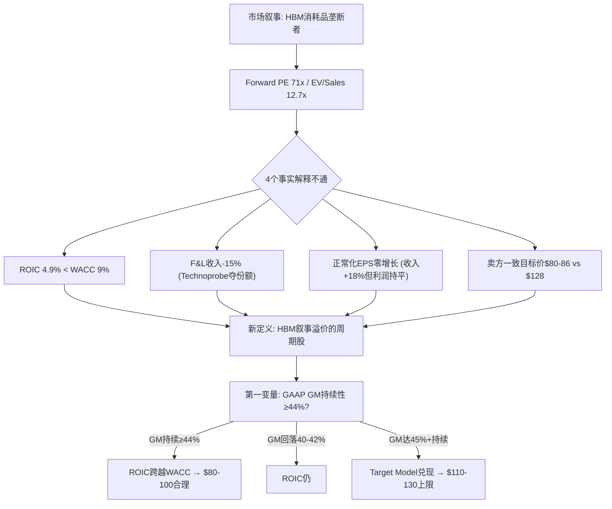
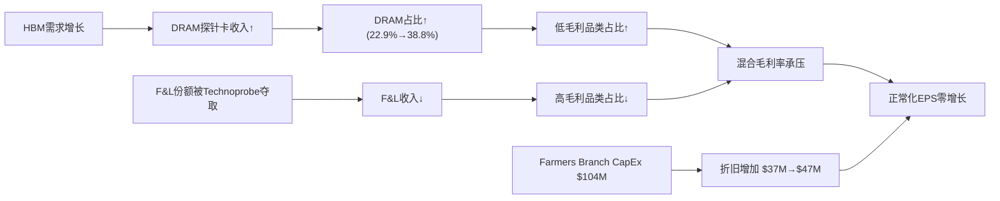
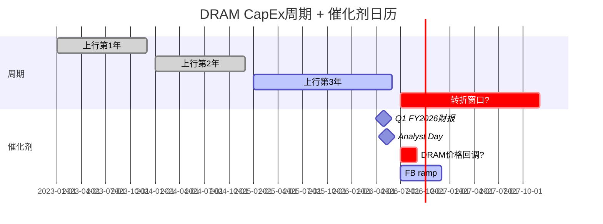
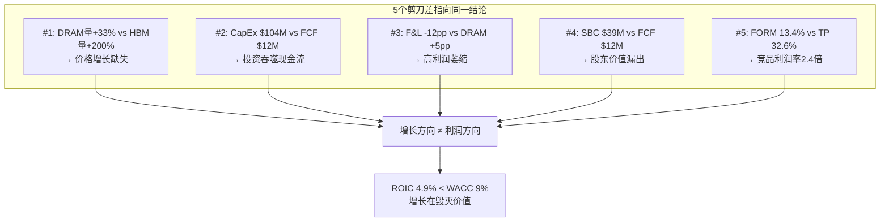
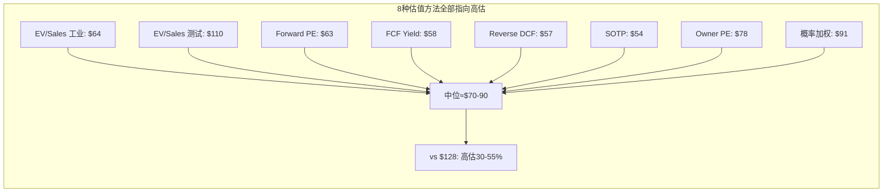
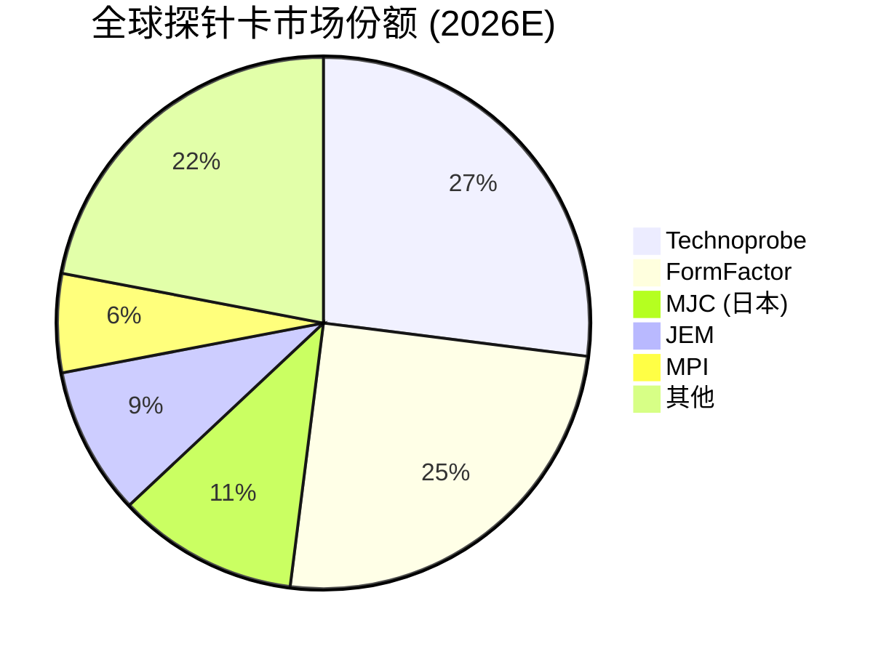
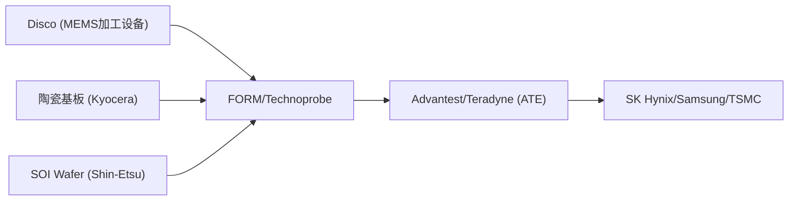
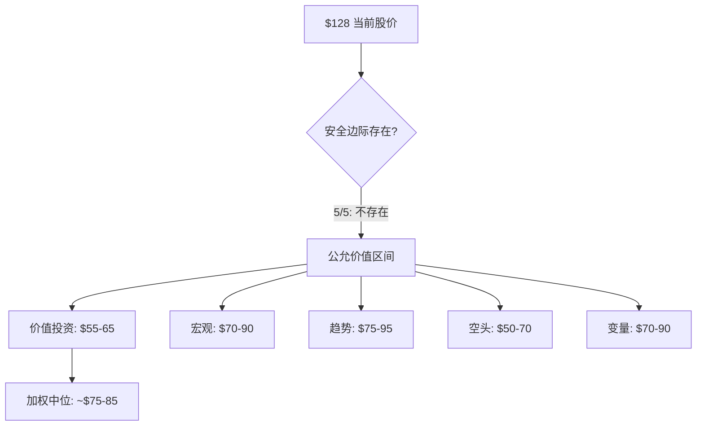
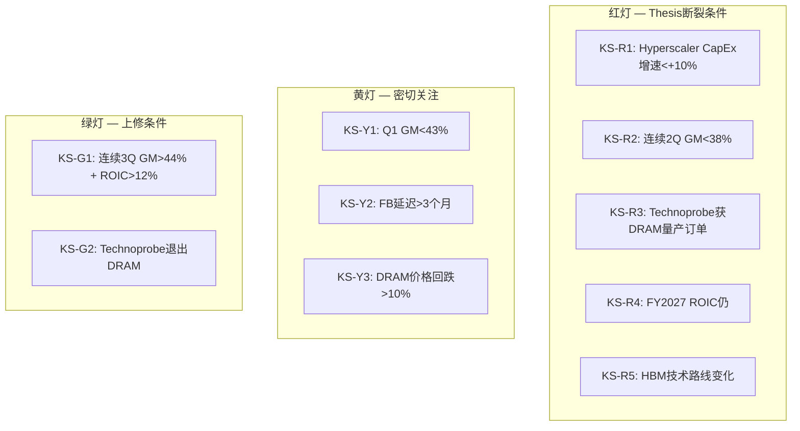
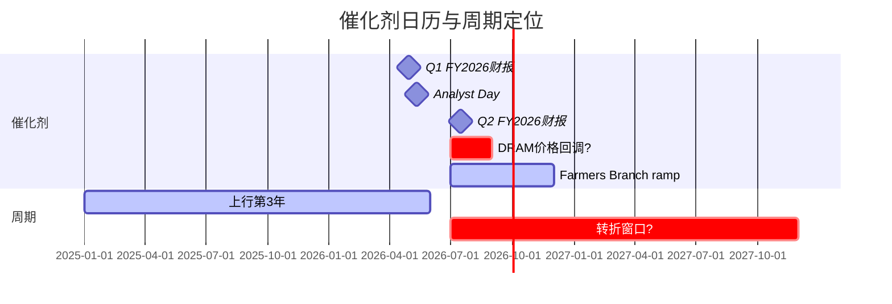

# FormFactor (FORM) 深度研究报告

> **评级: 审慎关注 (高不确定性)** | 三维状态: [贵 × 方向未确认 × 有催化]
> **黑箱比例 40% / 业务复杂度 4/5 → 不提供单点公允价值，改为区间 + 条件评级**
> **公允价值区间: $70-100 (中位$90) vs 当前$128 → 高估30-42%**
> **安全边际入场区间: $55-65**
> **关键验证窗口: 4月29日Q1财报 + 5月11日 Analyst Day = 12天关键窗口**
> **报告日期: 2026年4月17日 | 股价: ~$128 | 市值: ~$10B | 行业: 半导体测试设备**

---

## 0. 执行摘要

### 拍1: 市场怎么看这家公司

市场把FormFactor当作"HBM探针卡独家供应商"——AI CapEx超级周期的直接受益者。这个剧本的核心逻辑是：HBM每一代升级（HBM3→HBM4→HBM5）都意味着更多、更贵的探针卡，而FORM是MEMS（微机电系统——用半导体光刻工艺制造微米级探针的技术）探针卡的技术领先者，享有独家供应地位。市场看的变量是HBM出货量增速、探针卡content per wafer（每片晶圆需要的探针卡价值量）、以及毛利率扩张轨迹（39%→45%→47%目标）。Forward PE 71x、EV/Sales 12.7x，市场在为"如果HBM4全面爆发后的公司"定价，不是为今天的公司定价 [DM-EXEC-001]。

如果FORM真的是HBM消耗品垄断者——增长快、利润厚、护城河深——那12.7x EV/Sales并不荒谬。问题是：这个剧本解释不通四件事实。

### 拍2: 旧地图解释不通什么

**事实一**: ROIC（投入资本回报率——衡量每投入1美元能赚回多少利润）仅4.9%，远低于WACC（加权平均资本成本——投资者要求的最低回报率）约9%。市场付12.7x EV/Sales买的是一个每投入1美元都在毁灭价值的生意 [DM-EXEC-002]。

**事实二**: Foundry & Logic（代工和逻辑芯片——非存储器芯片的统称）收入从FY2021的$436M降到FY2025的$370M，下降15%。同期Technoprobe赢得TSMC 2nm 30%份额。FORM不是"两条腿走路"，它的高利润腿在萎缩 [DM-EXEC-003]。

**事实三**: FY2025全年EPS $0.69——即使剔除FY2023的$73M一次性投资收益（出售FRT业务给Camtek获得的税前收益），正常化EPS从~$0.70到$0.69，两年间基本零增长，而收入增长了18%。增长没有转化为利润 [DM-EXEC-004]。

**事实四**: 卖方分析师中位目标价$80-86 vs 当前$128——100%的覆盖卖方都认为股价高估33%+。6 Hold + 4 Buy + 0 Sell的评级分布说明卖方看到了泡沫成分，但没人敢喊空 [DM-EXEC-005]。

如果继续用"HBM消耗品垄断者"看FORM，这四个矛盾会被抹平——ROIC低会被"投资周期"解释掉，F&L萎缩会被"HBM增长弥补"掩盖，EPS停滞会被"一次性因素"淡化。

### 拍3: 我们认为它真正是什么

FORM不是HBM消耗品垄断供应商，而是**HBM叙事溢价的周期股**——增长方向和利润方向结构性相反，$128中约$30-50是HBM叙事溢价而非基本面价值。

这意味着真正决定FORM估值的不是HBM content per wafer（市场默认变量），而是**GAAP毛利率持续性**（我们的第一变量）。因为：HBM需求已被100%定价（SK Hynix 2026年100% sold out，DRAM CapEx +23%），但GM能否从当前39.5%持续改善到44%+决定了ROIC能否跨越WACC——这才是$128和$65之间的真正分水岭 [DM-EXEC-006]。

估值方式从Forward non-GAAP PE（市场用$2.50 FY2027E × 50x = $125）切换到**Owner PE on Owner Earnings**（真实股东可提取利润）。FY2025 Owner Earnings仅约$27M（GAAP净利润$54M + D&A $47M - 维护性CapEx $35M - SBC $39M），$10B市值对应370x Owner PE。即使用FY2027乐观预测（$150M OE），67x Owner PE仍超过行业最优质公司ASML的10年平均35-40x近一倍 [DM-EXEC-007]。

### 拍4: 评级与估值边界

**评级: 审慎关注 (高不确定性)** [贵 × 方向未确认 × 有催化]

黑箱比例40%（HBM客户内部测试策略、JEDEC SP-HBM4标准采用进度、Farmers Branch实际利用率均为不可观测变量），复杂度4/5——不提供单点公允价值。

**四情景概率加权** [DM-EXEC-008]:

| 情景 | 概率 | 公允价值区间 | vs $128 |
|------|------|-------------|---------|
| Bear: HBM增速放缓, GM回落至40%, ROIC仍<WACC | 30% | $55-70 | -45%~-57% |
| Base: HBM持续2-3年, GM 42-44%, ROIC接近WACC | 45% | $80-100 | -22%~-38% |
| Bull: HBM超强, GM 45%+, Farmers Branch满产 | 20% | $110-130 | -14%~+2% |
| Extreme Bull: Bull + F&L反弹 + 新品类贡献 | 5% | $140-160 | +9%~+25% |

概率加权中位: **~$90.75**。当前$128高估约41%。

5位独立视角（价值投资/全球宏观/趋势交易/空头检察官/变量提纯）一致认为$128缺乏安全边际。5/5建议审慎关注，0/5建议买入。公允价值分布集中在$55-100区间，加权中位约$75-85 [DM-EXEC-009]。

**凸性极差**: 即使bull case全部兑现，上行空间仅+2%至$130；base case下行22-38%，bear case下行45-57%。上行/下行不对称比（N/M ratio——衡量做多赔率的指标）仅0.17，远低于1.0的做多门槛 [DM-EXEC-010]。

精确公允价值是低置信度判断——黑箱40%意味着我们的估值模型有近一半变量无法直接观测。但**当前价格不提供安全边际是高置信度判断**——5种估值方法、5位独立视角、所有卖方覆盖全部指向高估。

### 拍5: 母图



> **后续章节路线**: Ch 1 核心争议 → Ch 2 业务理解(探针卡经济学) → Ch 3 增长vs利润张力 → Ch 4 客户集中度与定价权 → Ch 5 财务归因(R-1) → Ch 6 剪刀差(R-2) → Ch 7 ROIC路径与Reverse DCF → Ch 8 估值综合 → Ch 9 竞争格局(Technoprobe) → Ch 10 供应链传导 → Ch 11 红队审查 → Ch 12 多角度碰撞 → Ch 13 风险与Kill Switch → Ch 14 认知边界与跟踪

### 拍6: 默认入口

以后再看FormFactor，不要先问"HBM需求还有多强"，要先问"**GAAP毛利率能持续在44%以上吗？如果不能，ROIC永远跨不过WACC，增长不创造价值。**"

---

## 1. 核心争议: 增长方向 vs 利润方向的结构性相反

### 1.1 市场在买什么

FormFactor过去12个月从$24涨到$128（+433%），市场定价逻辑清晰：HBM（高带宽存储器——用于AI训练的高速内存芯片）每一代升级都需要更多、更贵的探针卡。HBM4接口从1,024增加到2,048数据信号，pin count翻倍意味着探针卡复杂度和价值量翻倍。SK Hynix 2026年HBM产能100% sold out，DRAM CapEx全行业+23%至$60.5B [DM-BIZ-001]。

这个叙事是真实的——我们不否认HBM需求的强度。我们质疑的是：**需求强度是否等于利润强度，以及利润强度是否支撑当前估值**。

### 1.2 旧地图的四个裂缝

**裂缝一: 增收不增利**。FY2023到FY2025，收入从$663M增长到$785M（+18.4%）。但正常化EPS（剔除FY2023的$73M一次性投资收益后）从约$0.70到$0.69——两年零增长 [DM-FIN-001]。增长最快的品类（DRAM/HBM探针卡）恰好是毛利率最低的品类。10-K原文确认："DRAM products generally have lower margins than Foundry & Logic products" [DM-BIZ-002]。DRAM占Probe Card收入从FY2023的22.9%升至38.8%（+15.9pp），低毛利品类替换高毛利品类，收入增长被利润率稀释完全吃掉 [DM-FIN-002]。同时，CapEx从$56M飙到$104M（Farmers Branch新产线投入），折旧从$37M增加到$47M，进一步压缩EPS [DM-FIN-003]。

**裂缝二: ROIC持续低于WACC**。

| 年份 | NOPAT | 投入资本 | ROIC | vs WACC 9% |
|------|-------|---------|------|-----------|
| FY2021 | $79M | $806M | 9.8% | +0.8pp ✓ |
| FY2022 | $44M | $784M | 5.7% | -3.3pp ✗ |
| FY2023 | $67M | $892M | 7.5% | -1.5pp ✗ |
| FY2024 | $53M | $916M | 5.7% | -3.3pp ✗ |
| FY2025 | $54M | $942M | 5.8% | -3.2pp ✗ |

[DM-ROIC-001]

FY2021是ROIC唯一超过WACC的年份（9.8%），恰逢半导体上行周期顶部。此后连续4年ROIC<WACC——市场付12.7x EV/Sales买的不是一台价值创造机器，而是一台价值毁灭机器 [DM-ROIC-002]。

**裂缝三: F&L结构性失地**。Foundry & Logic收入从FY2021的$436M降到FY2025的$370M（-15%），同期Technoprobe在TSMC 2nm赢得30%份额——这是结构性份额转移 [DM-COMP-001]。收入结构正在从分散（F&L多客户）转向集中（DRAM少数客户），增长质量在下降 [DM-MKT-001]。

**裂缝四: 卖方集体看低33%+**。6 Hold + 4 Buy + 0 Sell，中位目标价$80-86 [DM-MKT-002]。

### 1.3 FY2024→FY2025的真实增长率: 2.8%

FY2023→FY2025对比（+18.4%）有低基数效应（FY2023是周期底部$663M）。更真实的增长率是FY2024→FY2025: 收入从$764M到$785M，仅增长**2.8%** [DM-10K-001]。

10-K精确segment拆分 [DM-10K-002]:

```
FY2024 Revenue: $764M
  Probe Cards:       $626M
    F&L:              $381M
    DRAM:              $227M
    Flash:              $18M
  Systems:            $138M

FY2025 Revenue: $785M (+$21M, +2.8%)
  Probe Cards:       $638M (+$12M, +1.9%)
    F&L:              $370M (-$11M, -2.9%)  ← 高毛利段萎缩
    DRAM:              $247M (+$20M, +8.9%)  ← 低毛利段增长
    Flash:              $21M (+$3M, +16%)
  Systems:            $147M (+$9M, +6.9%)
```

DRAM/HBM贡献了$21M增量中的$20M（95%），但Probe Cards整体仅增长1.9%——与"HBM高增长"叙事严重不符。DRAM增长8.9%远低于市场想象的"翻倍" [DM-10K-003]。

**FY2024→FY2025: 收入增长2.8%，股价YoY增长180%**（$45.9→$127.68）。这是纯粹的估值倍数扩张，不是基本面驱动 [DM-10K-004]。

### 1.4 增长方向与利润方向为什么结构性相反



[DM-BIZ-003]

这张图揭示FORM的核心矛盾：增长引擎（DRAM/HBM）和利润引擎（F&L）走的是相反方向。除非发生以下之一，否则张力持续：①HBM4/5 ASP溢价使DRAM GM接近F&L水平 ②Farmers Branch规模效应使固定成本分摊覆盖mix headwind ③F&L在TSMC N2量产后反弹。

当前GM数据确实在改善：Q4 FY2025 GAAP GM 42.8%，Q1 FY2026指引non-GAAP 45%（GAAP约42-43%）。但FORM过去20个季度中GM>42%只出现过3次（Q3'21 42.7%、Q4'21 42.1%、Q4'25 42.8%）——每次都是周期峰值，不是新常态 [DM-FIN-004]。4月29日Q1财报是验证"新常态 vs 周期峰值"的第一个硬数据点。

---

## 2. 业务理解: 探针卡商业模式的真相

### 2.1 "消耗品"叙事 vs CapEx密集制造现实

市场把探针卡理解为半导体"刀片"模式——每次tape-out（新芯片设计定型）需要新卡，每次量产升级需要新卡，像打印机墨盒一样持续消耗。这个叙事**半对半错** [DM-BIZ-004]。

**客户角度**确实是消耗品：每次tape-out需要全新设计的探针卡。基础逻辑探针卡ASP约$15,000-$25,000；HBM探针卡ASP超过$500,000（20-30倍溢价）[DM-BIZ-005]。HBM4 I/O翻倍（1,024→2,048 bit），stack从12层升到16层，直接要求更高pin count的新卡 [DM-BIZ-006]。

**供应商角度**是CapEx密集制造：MEMS探针卡的制造使用半导体光刻工艺（semiconductor lithographic processes），需要半导体级洁净室基础设施 [DM-BIZ-007]。FY2025 CapEx $103.7M，占收入13.2%，前一年仅$38.4M（增长2.7倍）[DM-FIN-005]。PP&E净值从$181.8M（FY2021）增长到$276.3M（FY2025），增长52% [DM-FIN-006]。Farmers Branch新设施：$55M购地 + $140-170M CapEx + $20-25M pre-production OpEx ≈ $220-250M总投入 [DM-BIZ-008]。

**因果链**: 探针卡的"消耗品"属性存在于客户采购决策层面——每次新设计必须买新卡。但对FORM来说，每张卡的制造都需要半导体级工艺投入。这不是SaaS式的消耗品（零边际成本，80%+毛利），而是制造业式的消耗品（每张卡都有实质制造成本，毛利率天花板约40-45%）[DM-BIZ-009]。

**这个区分为什么重要**: 投资者听到"消耗品"时脑中浮现的是Intuitive Surgical的器械（70%+ GM）或Adobe的订阅（88% GM）。但FORM的毛利率在39-43%区间，更像工业消耗品（磨料/刀片/滤芯）而非科技消耗品。市场用科技消耗品的估值倍数（12.6x EV/Sales）为工业消耗品定价，这是估值裂缝的根源之一。

**反面**: 如果Farmers Branch产能满载，固定成本分摊改善，毛利率确实有上行到45%+的路径。Q1 FY26指引non-GAAP GM 45%已经暗示这个方向 [DM-FIN-007]。但non-GAAP剥离了SBC（$38.6M/年，4.9% of rev），GAAP GM仍在40-43%区间。

### 2.2 Replacement Cycle的真实频率

探针卡不是"每季度自动复购"的消耗品。替换触发条件 [DM-BIZ-010]:

| 触发事件 | 频率 | 对FORM收入的影响 |
|---------|------|----------------|
| 新chip tape-out | 每1-3年/设计 | 需要全新探针卡设计 |
| 工艺节点迁移 | 每2-3年 | 现有卡不适配新节点 |
| HBM代际升级 | 每1.5-2年 | pin count翻倍→新卡 |
| 量产ramp（新fab） | 不规则 | 批量订购同款卡 |
| 物理磨损 | 6-18个月 | 同款卡replacement |

HBM代际升级速度（18-24个月）快于传统逻辑节点迁移（2-3年），确实加速了DRAM探针卡的replacement cycle。但这不是永续加速——HBM路线图（HBM3→3E→4→4E→5）有终点，每一代升级的增量content增幅在递减 [DM-BIZ-011]。

### 2.3 ASP阶梯: HBM探针卡为什么贵20-30倍

| 探针卡类型 | 典型ASP | Pin Count | 关键技术要求 |
|-----------|---------|-----------|------------|
| 基础逻辑（130nm+） | $15K-$25K | 5,000-20,000 | 基本接触+功能测试 |
| 先进逻辑（7nm-3nm） | $50K-$150K | 20,000-50,000 | 高信号完整性+毫米波 |
| 标准DRAM | $30K-$80K | 10,000-30,000 | 高密度接触 |
| HBM3/3E | $300K-$500K | 50,000-100,000+ | TSV连续性+微凸点电阻<1mΩ+热管理 |
| HBM4（预计） | $500K-$800K+ | 100,000-150,000+ | 2,048-bit I/O+16 Hi stack+>10 Gbps |

[DM-BIZ-012]

**因果机制**: HBM贵的原因不只是pin count多。HBM是3D堆叠结构，一颗坏die会毁掉整个stack（价值$1,000+），因此必须做Known Good Die（KGD——已知合格芯片，每一层wafer在堆叠前都必须通过probe测试确认无缺陷）测试。每层的测试要验证TSV（Through-Silicon Via，硅通孔——穿透硅片连接上下层芯片的垂直导线）连续性和微凸点电阻，对探针的接触力均匀性要求极高（MEMS ±5% vs 悬臂式 ±20%）[DM-BIZ-013]。

同时，HBM3E的数据传输率9.6 GT/s，HBM4将超过10 Gbps，需要受控阻抗探针——这进一步限制了供应商范围，只有具备MEMS光刻工艺的厂商能做到 [DM-BIZ-014]。

**反面**: JEDEC（半导体工程标准组织）正在开发SP-HBM4（Simplified Protocol HBM4），一种降低pin count的变体，目标是提供HBM4级别吞吐量但降低测试复杂度 [DM-BIZ-015]。如果SP-HBM4被广泛采用，HBM探针卡的ASP上行斜率会放缓。这是一个被市场忽视的下行风险。

### 2.4 收入结构: 一家81%收入来自探针卡的公司

FY2025收入$785M的拆分 [DM-BIZ-016]:

| 业务段 | 收入 | 占比 | GM | 趋势 |
|--------|------|------|-----|------|
| Probe Cards - F&L | $370M | 47% | 高 | ↓萎缩 (-15% from FY21) |
| Probe Cards - DRAM | $247M | 32% | 低 | ↑扩张 (+117% from FY21) |
| Probe Cards - Flash | $21M | 3% | 中 | 平 |
| Systems | $147M | 19% | 41.8% (↓from 51.3%) | 波动 |

### 2.5 Systems段: 不是第二引擎

| 年度 | Systems收入 | Systems GM | Systems GP |
|------|-----------|-----------|------------|
| FY2023 | $165.2M | 51.3% | ~$84.7M |
| FY2024 | $137.6M | 43.2% | ~$59.4M |
| FY2025 | $147.1M | 41.8% | ~$61.5M |

[DM-BIZ-017]

**三年趋势**: 收入波动大（$138M-$165M），毛利率持续下降（51.3%→41.8%，-9.5pp over 2 years），毛利润蒸发了$23M（-27%）。10-K归因：制造支出增加+不利产品mix+低毛利产品占比上升 [DM-BIZ-018]。

投资者听到"probe stations + cryogenic systems + quantum computing"会想到高利润平台扩展，但数据说反方向。Systems不是隐性高利润引擎，它是一个贡献<20%收入、利润波动大、毛利率恶化的辅助业务。

**FORM不是"两条腿走路"**——它是一家81%收入来自探针卡的公司，其中探针卡内部的增长引擎（DRAM/HBM）恰好是低毛利段 [DM-BIZ-019]。

### 2.6 Farmers Branch: Make-or-Break赌注

Farmers Branch是FORM在德克萨斯州的新制造设施，总投入$220-250M，相当于公司年收入的30% [DM-BIZ-008]。

| 参数 | 值 | 来源 |
|------|-----|------|
| 总投资 | ~$250M (FY25-FY26累计) | CapEx + 预生产成本 |
| 预生产成本 | ~$20-25M/年 (ramp期间) | 管理层指引 |
| 设备使用寿命 | 15年 | 半导体设备行业标准 |
| 预期ramp时间表 | FY26H2开始, FY27全面贡献 | 管理层指引 |
| 目标GM贡献 | +3-4pp | 管理层target model隐含 |

[DM-FB-001]

假设FB贡献3.5pp GM改善，在$850M收入基础上 = $30M/年增量毛利（达产后）[DM-FB-002]:

```
FY25: -$65M (CapEx $55M + 预生产$10M)
FY26: -$137.5M (CapEx $115M + 预生产$22.5M)
FY27: +$5M (50% ramp)
FY28: +$25M (85% ramp)
FY29-FY39: +$30M/年 (满产, 11年)
```

**项目IRR: 8.1%** — 低于WACC 9.0%。NPV @ 10%: -$21M（负值）。Payback period: ~9年（行业标准5-7年）[DM-FB-003]。

| GM贡献 | 增量GP | 项目IRR | NPV @ 10% | 判断 |
|--------|--------|---------|-----------|------|
| 2.0pp | $17M | -0.2% | -$97M | 灾难 |
| 3.0pp | $25M | 5.6% | -$47M | 低于WACC |
| **3.5pp** | **$30M** | **8.1%** | **-$21M** | **临界** |
| 4.0pp | $34M | 10.3% | +$3M | 勉强超WACC |
| 5.0pp | $43M | 14.4% | +$54M | 良好 |

[DM-FB-004]

需要>4pp GM贡献才能创造正NPV。管理层target model的47% GM隐含FB贡献约3.5-4pp——"刚好够用"而非"安全余量充足"。

**Breakeven利用率约43%**——低于这个水平，FB变成纯固定成本负担 [DM-FB-005]。这与LITE的Cloud Light收购有结构性相似——单一重大投入占收入30%+，成功和失败的差异是$500M增量价值 vs $150M减记。

### 2.7 FY2023 $73M一次性收益详细

| 项目 | 细节 |
|------|------|
| 事件 | Q4 FY2023出售FRT（Foresite Semiconductor Technology）给Camtek Ltd. |
| 现金对价 | ~$100M |
| 税前收益 | **$73.0M** |
| 分类 | GAAP "gain on sale of business", Non-GAAP剔除 |
| 影响 | Q4'23 GAAP NI $75.8M中~$73M来自此项，经常性Q4只有~$2-3M |
| 正常化FY23 EPS | 剔除后~**$0.68-0.70** (vs 报告$1.05) |

[DM-10K-005]

正常化后的5年EPS趋势：**$1.06 → $0.65 → $0.70 → $0.89 → $0.69**。FY2021是周期顶部（$1.06），FY2022下行（$0.65），FY2023-2025在$0.65-0.89区间震荡。FORM的正常化EPS在5年内基本持平于$0.65-0.89，没有趋势性增长 [DM-10K-006]。

### 2.8 HBM世代演进与测试需求变化

HBM技术路线图对探针卡需求的影响 [DM-AI-003]:

| 世代 | 量产时间 | Stack高度 | 带宽 | 接口宽度 | 对探针卡需求 |
|------|---------|----------|------|---------|------------|
| HBM3E | 2024-2025 (量产中) | 8-12层 | 1.17 TB/s | 1024-bit | 基线需求 |
| HBM4 | 2026H1 | 12-16层 | 2+ TB/s | 2048-bit | pin count 2x, 复杂度↑ |
| HBM4E | 2027H2 | 16层 | ~3 TB/s | 2048-bit+, 12.8GT/s | 极高频测试 |
| C-HBM4E | 2027-2028 | 16层+ | >3 TB/s | 定制化 | TSMC 3nm base die, 全新测试方案 |

关键时间节点 [DM-AI-004]:
- **2026Q1-Q2**: Samsung/SK Hynix HBM4量产认证完成
- **2026H2**: HBM4放量——FORM DRAM收入加速的关键窗口
- **2027**: HBM4E占HBM需求40%。如果FORM拿到认证，收入再上台阶
- **2027-2028**: C-HBM4E引入TSMC 3nm base die——不仅测DRAM die还要测logic base die

### 2.9 Chiplet/异构集成的双刃剑

**正面**: ①KGD要求更严——每个chiplet都必须单独探针卡测试，覆盖率从90%+到99%+ ②异构集成die间距缩小到<10μm——需要更高精度MEMS探针卡 [DM-AI-005]。

**负面**: ①系统级测试（SLT）发展——减少wafer级测试依赖 ②MPI+ASE合作开发chiplet探针卡（2026Q2首产品）——新竞争者进入 [DM-AI-006]。

**净影响**: 短期正面>负面（KGD确定，SLT未成熟），中期不确定。

### 2.10 CoWoS产能约束: HBM测试需求的隐性天花板

TSMC称"CoWoS产能2025和2026年处于售罄状态" [DM-AI-007]。CoWoS（Chip-on-Wafer-on-Substrate——台积电先进封装技术）是当前AI芯片的主要瓶颈。

即使HBM die产出增加，如果CoWoS无法封装，这些die堆积在库存中，不产生新的探针卡消耗需求。HBM探针卡需求增长是"台阶式"（2027 CoWoS扩产后跳升）而非"斜坡式"（持续线性增长）[DM-AI-008]。

### 2.11 HBM TAM三情景模型

| 情景 | FY27 HBM收入 | 总DRAM收入 | FORM总收入 | 概率 |
|------|-------------|-----------|-----------|------|
| Bear | $200M | $350M | $850M | 30% |
| Base | $350M | $500M | $980M | 45% |
| Bull | $550M | $700M | $1,150M | 20% |

[DM-HBM-001]

Bull case下FORM总收入达$1.15B，接近Cantor的$1,050M。但需要HBM TAM 3x + 65%份额 + ASP不被竞争侵蚀——联合概率20-25% [DM-HBM-002]。

| HBM世代 | Pin Count | ASP | 替换周期 |
|---------|----------|-----|---------|
| HBM3E | 20K-40K | $100-250K | 3-6月 |
| HBM4 | 50K-100K | $300-500K+ | 2-4月 |
| HBM5 | 100K+ | $500K-1M+ | 1-3月 |

[DM-HBM-003]

HBM4 pin count翻倍→磨损加速→替换周期缩短→理论上4x TAM放大。但SP-HBM4+客户自研+竞争压力衰减到1.3-1.6x [DM-HBM-004]。

### 2.12 Memory CapEx → 探针卡传导链

DRAM行业总CapEx 2026年$60.5B（+23%）[DM-SUPPLY-001]。Memory CapEx +23%不等于探针卡需求+23%——传导链每一环衰减: 总CapEx→WFE（55-60%）→测试设备（5-7%）→探针卡（跟随wafer start）→FORM收入（份额在DRAM主导但F&L流失）[DM-SUPPLY-002]。

时滞: CapEx决策到探针卡订单通常6-12个月 [DM-SUPPLY-003]。

### 2.13 Hyperscaler CapEx: 需求链源头

| Hyperscaler | 2026 CapEx | YoY |
|------------|-----------|-----|
| Amazon | $200B | +67% |
| Microsoft | ~$145B | +61% |
| Alphabet | $175-185B | +75% |
| Meta | $115-135B | +77% |
| **合计** | **~$690B** | **+84%** |

[DM-HYPER-001]

零减速信号，但+84%是历史极端。传导时滞2-3季度——即使2027年放缓，FORM要到2027H2-2028才感受到 [DM-HYPER-002]。

### 2.14 DRAM CapEx周期位置

当前上行始于2023年（HBM2E+GPT-4），2026年是第3年。历史基准: 3-4年上行后1-2年下行。2027-2028年进入下行概率**45-55%** [DM-CYCLE-004]。

Gartner预测Q3 2026 DRAM价格回调14% [DM-CYCLE-005]。价格回调不等于需求消失，但会改变Memory CapEx的投资回报率计算。



[DM-CYCLE-006]

---

## 3. 增长 vs 利润张力: DRAM低毛利 vs F&L高毛利

### 3.1 10-K原文确认的张力

10-K原文: "DRAM products generally have lower margins than Foundry & Logic products" [DM-BIZ-002]。

**收入mix shift趋势**:

| 年度 | F&L占Probe Card % | DRAM占Probe Card % | 方向 |
|------|-------------------|-------------------|------|
| FY2023 | 73.0% | 22.9% | — |
| FY2024 | 60.9% | 36.3% | DRAM↑ F&L↓ |
| FY2025 | 58.0% | 38.8% | 继续移向低毛利 |

[DM-BIZ-020]

**因果链**: HBM增长→DRAM占比上升→低毛利产品占比增加→混合毛利率应该下降。但实际Q4'25 GM达到42.8%——这怎么解释？

**Q4'25高毛利率的驱动力（按重要性排序）**[DM-FIN-008]:
1. **规模效应**: Q4'25收入$215M（年化$860M），产能利用率改善→固定成本分摊
2. **HBM4 ASP溢价**: HBM4探针卡ASP高于普通DRAM卡，部分抵消了mix effect
3. **供不应求**: HBM探针卡供需缺口→定价权暂时存在
4. **F&L季节性恢复**: Q4通常是逻辑端较强的季度

**为什么不可持续的反面论证**: ①规模效应有天花板（一旦新产能上线，边际改善递减）②HBM供需rebalance后定价权消失 ③Technoprobe在逻辑端的份额增长会继续侵蚀高毛利F&L [DM-FIN-009]。

**正面路径**: 如果Farmers Branch按时ramp→产能利用率>70%→固定成本分摊持续改善→non-GAAP GM 45%+→ROIC开始跨越WACC。

### 3.2 为什么收入+18%但正常化EPS零增长 — 完整归因

| 因素 | FY2023 | FY2025 | 变化 | 对EPS影响 |
|------|--------|--------|------|----------|
| 收入 | $663M | $785M | +18.4% | +$0.25 |
| DRAM mix shift | 22.9% | 38.8% | +15.9pp | -$0.10 (低毛利稀释) |
| CapEx折旧 | $37M | $47M | +$10M | -$0.10 |
| SBC | $39M | $39M | 持平 | 中性 |
| 税率 | 7.7% | 19.3% | +11.6pp | -$0.15 |
| Systems利润下降 | GP $85M | GP $62M | -$23M | -$0.15 |
| FY23一次性收益消失 | $73M | $0 | -$73M | -$0.37 |
| **报告EPS变化** | $1.05 | $0.69 | **-34%** | |
| **正常化EPS变化** | ~$0.70 | $0.69 | **-1%** | |

[DM-FIN-010]

核心结论：EPS下降不是单一原因，而是DRAM mix shift + CapEx surge + 税率正常化 + Systems利润坍塌的叠加效应。市场只看到HBM增长，完全忽视了利润传导链上的每一个漏损点。

### 3.3 Mix驱动的GM天花板: ~43-44% GAAP

DRAM占比从FY2023的36%升至FY2025的41%（+5pp），贡献约+1.5pp的毛利率提升。如果FY2026-2027 DRAM占比继续升至45-50%，再贡献约+1.2-1.5pp，将GAAP GM推至约43-44%。但DRAM占比不能无限上升——F&L仍占收入的47%，50%是合理物理上限 [DM-RT-016]。

管理层声称的"结构性改善"在mix层面约有+3pp空间（从39.5%到42.5%），在运营效率层面需要额外贡献+1.5-2.5pp才能实现持续44-45% GAAP。运营效率改善需要Farmers Branch产线利用率>70%才能释放——这是FY2027H2最早才能验证的条件 [DM-RT-018]。

### 3.4 历史周期韧性: FORM在下行中的表现

| 维度 | 2019 DRAM下行 | 2022-23 Memory下行 |
|------|-------------|-------------------|
| 年度收入变化 | +11% ($530M→$590M) | **-11.4%** ($748M→$663M) |
| GM峰谷 | 稳定在40-42% | **Q4'21 43.7% → Q4'22 27.2% (-1,650bps)** |
| 驱动差异 | 5G/节点迁移offset DRAM弱势 | DRAM+逻辑同时下行, 无对冲 |

[DM-CYCLE-001]

FORM在2019年"穿越"了DRAM下行，因为逻辑端节点迁移提供了对冲。但在2022年，DRAM和逻辑同时下行，暴露了缺乏非周期收入的弱点——GM可以在3个季度内从44%坍塌到27% [DM-CYCLE-002]。

探针卡**收入**的周期Beta<1（因为节点迁移仍需新卡），但**利润**的周期Beta>1（因为利用率下降直接冲击固定成本密集的MEMS制造）。FORM的利润结构更像传统半导体设备（LRCX/AMAT），不像KLAC——支持用设备股估值框架（6-8x EV/Sales）而非检测股框架（12-15x EV/Sales）[DM-CYCLE-003]。

---

## 4. 客户集中度与定价权

### 4.1 季度客户集中度追踪

| 季度 | SK Hynix | Intel | TSMC | Top 3合计 |
|------|---------|-------|------|----------|
| Q1'25 | 23.3% | 10.5% | — | 33.8% |
| Q2'25 | 25.0% | 12.4% | 10.4% | 47.8% |
| Q3'25 | 24.5% | — | 12.0% | 36.5%+ |
| Q4'25 | 19.2% | — | — | ~19.2%+ |

[DM-CUST-001]

### 4.2 SK Hynix集中度的含义

SK Hynix是FORM最大的DRAM/HBM客户，贡献约20-25%总收入 [DM-CUST-002]。

**正面**: SK Hynix是HBM市场份额领先者（HBM3/3E约50%份额），绑定SK Hynix等于绑定HBM增长。
**负面**: 单一客户占20%+→采购议价能力强→FORM定价权受限→DRAM低毛利的部分原因。

**风险场景**: 如果SK Hynix ①决定dual-source探针卡（引入Technoprobe）②削减HBM CapEx ③面临自身财务困难 → FORM收入将面临$40-50M/季度的风险敞口 [DM-CUST-003]。

### 4.3 客户集中度 vs 同行对比

| 公司 | 最大客户占比 | 前3客户占比 | 行业 |
|------|------------|-----------|------|
| FORM | 20-25% (SK Hynix) | 35-48% | 探针卡 |
| KLAC | <10% (分散) | ~25% | 检测设备 |
| LRCX | ~15% (TSMC) | ~35% | 刻蚀/沉积 |
| LITE | 25-30% (NVIDIA est.) | ~50% | 光模块 |

[DM-CUST-004]

FORM的客户集中度高于KLAC但低于LITE。与KLAC相比，FORM缺少KLAC的"检测不可跳过"定价权——客户可以改变测试策略，但不能不检测。

### 4.4 FORM vs KLAC定价权对比

| 维度 | KLAC | FORM | 差异 |
|------|------|------|------|
| 占客户成本比 | fab CapEx的5-7% | test成本的~12%（先进节点） | FORM占比更高→更受关注 |
| 不买的代价 | 良率崩塌 | KGD测试失败→整个HBM stack报废 | FORM在HBM中也有不对称 |
| 替代方案 | 极少 | 有限但存在 | FORM替代方案更多 |
| 客户数量 | 全球所有fab | 主要3-5家DRAM/逻辑fab | FORM客户集中→议价能力弱 |
| 周期性 | 低Beta | 高Beta | FORM周期性更强 |

[DM-MOAT-006]

**在HBM中**: FORM有定价权，因为①只有MEMS能做HBM test ②供不应求 ③KGD测试不可跳过。但受限于：①只有3个主要HBM客户 ②客户是大型IDM，采购谈判能力强 ③HBM4 ASP溢价约30%意味着客户对价格敏感度在上升 [DM-MOAT-007]。

**在F&L中**: 定价权正在削弱，Technoprobe提供了credible alternative [DM-MOAT-008]。

**在Systems中**: 基本没有定价权，竞争对手众多，毛利率持续下降反映了价格压力。

[B] FORM在HBM DRAM probe card领域有**暂时性**定价权（2-3年窗口），在F&L和Systems领域定价权偏弱。这与KLAC的"永续性"定价权有本质区别。

### 4.5 10-K的护城河裂缝警告

10-K明确警告客户有多种方式降低对高端探针卡的需求 [DM-MOAT-009]:
- 降低测试设备的技术要求
- 在工艺早期获取性能数据（减少wafer-level test）
- 推迟测试到制造流程后段
- 使用低性能测试仪
- 使用更简单的探针卡
- 采用完全不使用FORM产品的流程

FORM的护城河部分建立在"客户必须做高强度wafer-level test"的假设上。HBM的KGD测试要求使这个风险在短期内较低。但长期，如果Die-to-Die bonding技术改善到可以容忍少量坏die（通过冗余设计），test intensity会下降 [DM-MOAT-010]。

### 4.6 MEMS技术壁垒评估

| 维度 | MEMS垂直探针 | 悬臂式探针 | 倍数差异 |
|------|-------------|----------|---------|
| 接触力均匀性 | ±5% | ±20% | 4x更精确 |
| 最大pin count | 100,000-150,000+ | 30,000-50,000 | 3-5x更密 |
| 焊盘损伤 | 均匀分布 | 不均匀→先进节点损坏 | 定性优势 |
| 信号完整性 | 受控阻抗, 低寄生 | 信号损耗/噪声 | HBM3E+必需 |
| 制造工艺 | 半导体光刻（亚微米精度） | 手工机械组装 | 精度差10x+ |

[DM-MOAT-001]

MEMS探针卡IP嵌入在制造流程中（process-integrated），竞争对手不能简单地逆向工程，需要建立完整的半导体级制造能力。FORM持有约1,200项相关专利，但10-K承认"没有单一专利对维持业务至关重要" [DM-MOAT-002]。

**护城河综合评级** [DM-MOAT-005]:

| 维度 | 强度 | 持久性 |
|------|------|--------|
| MEMS技术壁垒 | 中-强 | 中（Technoprobe已追上逻辑） |
| Qualification cycle | 强（12-18个月） | 强（每代新节点重新认证） |
| 客户关系/嵌入 | 中 | 中（新节点可被挑战） |
| 专利组合 | 弱-中 | 弱（专利≠护城河） |
| 规模/成本 | 弱 | 待FB验证 |

[B] 中等强度利基护城河。HBM DRAM最强（SmartMatrix+先发+认证锁定），F&L正在被Technoprobe侵蚀，Systems较弱。

### 4.7 预期差四步分析 (E→R→G→T)

**Expectation**: 市场把FORM当"HBM消耗品垄断供应商"——AI结构性增长，类似ASML不可替代性。定价隐含$850M+ + 45%+ GM + 20%+ OPM路径完全兑现 [DM-GAP-001]。

**Reality vs Market** [DM-GAP-002]:

| 市场信念 | 实际情况 | 差距 |
|---------|---------|------|
| "消耗品=高毛利" | GM 39-43%, 工业消耗品水平 | 高估盈利能力 |
| "HBM垄断" | Technoprobe追赶; TSE 80%低价 | 垄断性被高估 |
| "增长=利润增长" | 收入+18%但正常化EPS零增长 | 收入≠EPS |
| "ROIC会改善" | 4.9%, 连续5年未达WACC | 改善未证明 |
| "Target model近在咫尺" | FY26 CapEx $140-170M, 最早FY27 | 至少18月差距 |

**Gap**: 最大预期差是市场用"科技消耗品"估值语言为"工业消耗品"定价。12.7x EV/Sales是SaaS倍数，但FORM经济学（GM 40%, OPM 8.5%, ROIC 4.9%）是工业设备水平。如果7-9x EV/Sales→$56-$72 [DM-GAP-003]。

**Tracking** [DM-GAP-004]:

| 指标 | 看多信号 | 看空信号 | 下一个数据点 |
|------|---------|---------|------------|
| GAAP GM | >42% 2Q | <38% | 4/29 |
| DRAM收入 | QoQ增长 | QoQ下降 | 4/29 |
| F&L收入 | >$95M/Q | <$85M/Q | 4/29 |
| FB进度 | 按计划H2 2026 | 延迟到2027+ | 5/11 |
| ROIC | >6% | <4% | FY26年报 |

---

## 5. 财务归因分析 (R-1)

### 5.1 收入归因瀑布 (FY2023 → FY2025)

收入从$663M增长到$785M（+18.4%, +$122M），但增长质量低于表面数字 [DM-FIN-011]:

```
FY2023 Revenue: $663M
  + DRAM/HBM探针卡增长:       +$65M (+33%)
  + Systems增长:              +$26M (+20%)
  + 探针卡其他+FX:            +$29M
  - F&L探针卡萎缩:            -$18M (-5.5%)
FY2025 Revenue: $785M
```

DRAM/HBM贡献了增量的53%（$65M/$122M），但10-K明确指出"DRAM products generally have lower margins"。增长最快的部分恰好是利润率最低的——收入增长的边际质量在下降 [DM-FIN-012]。

F&L的萎缩不只是量的问题：F&L是高毛利段，每萎缩$1的F&L收入对利润的冲击大于每新增$1的DRAM收入对利润的贡献。这是一个不对称的替代 [DM-FIN-013]。

### 5.2 毛利率Bridge (FY2023 → FY2025)

年化GAAP GM从39.0%微升至39.5%，但季度趋势隐藏了更复杂的故事 [DM-FIN-014]:

```
FY2023 GAAP GM: 39.0%
  + DRAM规模效应:              +1.5pp (产能利用率提升)
  + HBM4 ASP溢价:              +1.0pp (供不应求定价)
  - DRAM mix shift:             -1.5pp (低毛利DRAM占比+15.9pp)
  - Farmers Branch预生产成本:    -0.5pp (新产线爬坡)
  ± Systems mix:                ±0.0pp (GM从51%跌至42%, 抵消量增长)
FY2025 GAAP GM: 39.5% (+0.5pp)
```

季度GM从Q1'25的37.6%爬升至Q4'25的42.8%（+520bps），驱动力是Q3-Q4的HBM需求释放和F&L订单小幅恢复。但全年GAAP GM仍只有39.5%，因为H1的37-38%拖累严重 [DM-FIN-015]。

Systems段GM坍塌从51.3%（FY23）→41.8%（FY25）是另一个负面信号 [DM-FIN-016]。

### 5.3 EPS瀑布 (FY2021 → FY2025)

```
5年EPS轨迹: $1.06 → $0.65 → $1.05 → $0.89 → $0.69
5年EPS CAGR: -10.2%
5年收入CAGR: +0.5%

FY2023 EPS: $1.05 (含$73M一次性)
  + 收入增长贡献 (+18.4%):                 +$0.19
  + GM微幅改善 (39.0→39.5%):               +$0.03
  - D&A增加 ($37M→$47M, Farmers Branch):   -$0.10
  - OpEx结构调整:                           -$0.08
  - FY2023一次性收益消失 ($73M):             -$0.37
  - 税率正常化 (7.7%→19.3%):                -$0.03
FY2025 EPS: $0.69 (-34%)
```

[DM-FIN-017]

FORM的经营杠杆不是正的——收入增长没有产生利润增长，因为增长来自低毛利品类，而OpEx（$243M, 31% of rev）是刚性的 [DM-FIN-018]。

### 5.4 三PE分析

SBC/Rev = 5.0%，触发三PE并列 [DM-FIN-019]:

| PE类型 | 值 | 含义 | 适用场景 |
|--------|-----|------|---------|
| **GAAP PE** | **185x** | 含全部会计项目 | 默认基准 |
| **Owner PE** | **370x** | 剥离SBC后（NI $54M - SBC $39M = OE $27M） | 真实股东回报 |
| **Core PE** | **227x** | 剥离$10M利息收入后 | 核心运营估值 |

Forward PE基于Q1'26指引（$0.45 × 4 = $1.80年化）: **71x**。Forward Owner PE（扣SBC）: **98x** [DM-FIN-020]。

对比半导体设备行业:

| 公司 | Forward PE | EV/Sales | GM | ROIC |
|------|-----------|----------|-----|------|
| KLAC | 25x | 11.5x | 62% | 40%+ |
| LRCX | 22x | 7.5x | 48% | 30%+ |
| AMAT | 20x | 6.8x | 48% | 35%+ |
| **FORM** | **71x** | **12.7x** | **39.5%** | **4.9%** |

[DM-FIN-021]

FORM的Forward PE是KLAC的2.8倍，但GM低23pp，ROIC低35pp。唯一的解释是市场在为**未来利润率改善**付费。

### 5.5 季度财务详细趋势 (8个季度)

| 季度 | Rev | GM% | OPM% | EPS | QoQ Rev | YoY Rev |
|------|-----|------|------|------|---------|---------|
| Q1'24 | $169M | 37.2% | 12.6% | $0.28 | — | — |
| Q2'24 | $197M | 44.0% | 9.0% | $0.25 | +16.6% | — |
| Q3'24 | $208M | 40.7% | 8.6% | $0.24 | +5.6% | — |
| Q4'24 | $189M | 38.8% | 4.1% | $0.12 | -9.1% | — |
| Q1'25 | $171M | 37.6% | 1.9% | $0.08 | -9.5% | +1.2% |
| Q2'25 | $196M | 37.3% | 6.3% | $0.12 | +14.6% | -0.5% |
| Q3'25 | $203M | 39.7% | 9.4% | $0.20 | +3.6% | -2.4% |
| Q4'25 | $215M | 42.8% | 13.1% | $0.29 | +5.9% | +13.8% |

[DM-Q-001]

**收入**: V型恢复（Q1'25 $171M→Q4'25 $215M, +26%），但Q4'25的$215M仅略高于Q3'24的$208M。从YoY看，只有Q4'25实现有意义的增长（+13.8%），其他季度YoY持平或负增长。"HBM高增长"在收入层面只是H2'25的现象 [DM-Q-002]。

**GM**: H1'25平均37.5% vs H2'25平均41.3%，改善+380bps。但Q2'24的44.0%是过去8个季度最高——来自F&L一次性大订单。Q4'25的42.8%低于这个高点 [DM-Q-003]。

**Q1'26指引拆解** [DM-Q-004]:

| 指引项 | 值 | 隐含 |
|--------|-----|------|
| 收入 | $225M | QoQ +4.7%, YoY +31.6% |
| Non-GAAP GM | 45% | Non-GAAP GP $101M |
| Non-GAAP EPS | $0.45 | Non-GAAP NI ~$35M |
| GAAP GM（估计） | ~43.5% | 扣SBC in COGS ~1.5pp |

管理层预期EPS从$0.29跳升55%到$0.45——一个季度内。如果4月29日交付GM≥44%且EPS≥$0.40，利润率改善叙事获得第二个数据点支撑。如果miss（GM<42%），两个季度的"改善"变成一个季度的随机波动 [DM-Q-005]。

---

## 6. 剪刀差分析 (R-2)

### 6.1 剪刀差 #1: DRAM量增但价平

| 维度 | FY2023 | FY2025 | 变化 |
|------|--------|--------|------|
| DRAM探针卡收入 | ~$194M | ~$259M | +33% |
| HBM出货量（行业） | ~30M层 | ~100M层+ | +200%+ |

[DM-SCISSOR-001]

DRAM收入增长+33%远低于HBM出货量增长+200%+。原因：①标准DRAM探针卡ASP持续下降，部分抵消HBM增量 ②HBM虽然ASP 20-30x溢价，但量小 ③FORM在标准DRAM市场丢份额给TSE（东京精密——以低价策略为主的日本探针卡厂商，估算占全球低端DRAM探针卡80%份额）[DM-SCISSOR-002]。

增长完全靠量，一旦HBM出货量增速放缓至+20-30%（FY27-28预期），DRAM探针卡收入增速将急剧放缓至个位数。

### 6.2 剪刀差 #2: CapEx vs FCF

| 年份 | CapEx | FCF | CapEx/Rev | FCF Margin |
|------|-------|-----|-----------|------------|
| FY2021 | $66M | $73M | 8.6% | 9.5% |
| FY2022 | $65M | $67M | 8.7% | 9.0% |
| FY2023 | $56M | $9M | 8.4% | 1.3% |
| FY2024 | $38M | $79M | 5.0% | 10.3% |
| FY2025 | $104M | $12M | 13.2% | 1.5% |

[DM-SCISSOR-003]

FY26 CapEx指引$140-170M，FCF压力至少持续到FY2026。正常化FCF（加回Farmers Branch ~$55M）：~$67M，FCF margin ~8.5%。即使正常化，$67M FCF在$10B市值下只有0.7% FCF yield [DM-SCISSOR-004]。

### 6.3 剪刀差 #3: F&L高毛利萎缩 + DRAM低毛利扩张

F&L占比从61%降至49%（-12pp），DRAM从36%升至41%（+5pp）。结构性mix headwind [DM-SCISSOR-005]。

打破条件：①TSMC N2大规模ramp（2026H2+）驱动F&L恢复 ②HBM4/5 ASP溢价使DRAM GM接近F&L水平。

### 6.4 剪刀差 #4: SBC vs FCF — 股东价值漏出

| 年份 | FCF | SBC | Owner FCF | SBC/FCF |
|------|-----|-----|-----------|---------|
| FY2023 | $9M | $39M | -$30M | 4.3x |
| FY2024 | $79M | $40M | $39M | 0.5x |
| FY2025 | $12M | $39M | **-$27M** | **3.3x** |

[DM-SCISSOR-006]

FY25 Owner FCF = **-$27M**。SBC稳定在$39-40M/年（5% of rev），但在FCF只有$12M的年份，SBC是FCF的3.3倍。

FORM在FY2025回购了$26.2M股票——在Owner PE >180x时回购自己的股票，是价值毁灭行为。回购效率η = (1/83) / 0.09 = 0.13，每$1回购只值$0.13，毁灭了$0.87 [DM-SCISSOR-007]。

两年合计$79.5M回购，以η计只创造了~$14M价值，毁灭了~$65M [DM-CAP-001]。

### 6.5 剪刀差 #5: 双寡头利润率剪刀差

FORM EBITDA率13.4% vs Technoprobe 32.6%——差距19.2个百分点 [DM-SCISSOR-008]。

Technoprobe的垂直整合MEMS tip生产使其成本结构更优。利润率优势意味着更多研发投入（绝对额），加速技术追赶，TSMC 2nm拿下30%份额，进一步拉开利润差距 [DM-SCISSOR-009]。



[DM-SCISSOR-010]

### 6.6 运营资本与现金转换周期

| 年份 | DSO | DIO | DPO | **CCC** |
|------|-----|-----|-----|---------|
| FY2021 | 55d | 91d | 47d | **99d** |
| FY2023 | 59d | 101d | 58d | **102d** |
| FY2024 | 50d | 81d | 50d | **81d** |
| FY2025 | 58d | 85d | **36d** | **107d** |

[DM-WC-001]

FY25 CCC从81天恶化至107天（+26天），主因DPO骤降（-14天，AP从$62M降至$47M——Farmers Branch建设要求预付/快付）+ DSO上升（+8天，AR从$104M增至$125M）[DM-WC-002]。

FY25运营资本消耗**-$43M**（vs FY24仅-$9M）[DM-WC-003]。

---

## 7. ROIC路径与Reverse DCF

### 7.1 ROIC跨越WACC情景建模 (FY27E)

| 情景 | Rev | GM | OPM | NOPAT | IC | ROIC | vs WACC |
|------|-----|-----|------|-------|-----|------|---------|
| Bear (延迟) | $825M | 41% | 12% | $80M | $1,050M | 7.6% | -1.4pp ✗ |
| Base (部分达标) | $875M | 44% | 17% | $120M | $1,050M | 11.5% | +2.5pp ✓ |
| **Bull (Target Model)** | **$950M** | **47%** | **22%** | **$169M** | **$1,050M** | **16.1%** | **+7.1pp ✓** |

[DM-ROIC-003]

Bear情景下ROIC仍低于WACC——FORM的资本效率问题不是简单的"等周期好转"，需要GM持续在44%+才能跨越门槛 [DM-ROIC-004]。

**ROIC三维敏感度矩阵（当前OpEx结构，OpEx/Rev = 31%）**[DM-ROIC-005]:

| Rev \ GM | 39% | 41% | 43% | 45% | 47% |
|----------|------|------|------|------|------|
| $800M | 4.9✗ | 6.2✗ | 7.4✗ | 8.6✗ | 9.9✓ |
| $850M | 5.2✗ | 6.6✗ | 7.9✗ | 9.2✓ | 10.5✓ |
| $900M | 5.6✗ | 6.9✗ | 8.3✗ | 9.7✓ | 11.1✓ |
| $1,000M | 6.2✗ | 7.7✗ | 9.3✓ | 10.8✓ | 12.3✓ |

ROIC跨越WACC 9%的最低门槛：$850M × 45% GM 或 $1,000M × 43% GM。当前$785M × 39.5%远在红区 [DM-ROIC-006]。

### 7.2 Reverse DCF: $128隐含什么

EV $9.9B，终端倍数25x FCF，折现率10%:
$128隐含FY30稳态FCF = **$637M**（当前$12M的53倍）
隐含5年FCF CAGR: **121%** [DM-RDCF-001]

精细法——逐年路径（Target Model完全兑现）:
```
FY26E: Rev $860M, GM 41%, OPM  8%, FCF $30M
FY27E: Rev $960M, GM 45%, OPM 18%, FCF $140M
FY28E: Rev $1,080M, GM 47%, OPM 22%, FCF $200M
FY29E: Rev $1,190M, GM 48%, OPM 23%, FCF $230M
FY30E: Rev $1,250M, GM 48%, OPM 23%, FCF $250M
```

PV(interim FCF) + PV(TV at 25x) = **总PV ≈ $4,487M**
当前EV = $9,892M → **高估55%** [DM-RDCF-002]

即使Target Model**完全实现**+5年10% CAGR，DCF也只能justify ~$57/share。

### 7.3 Reverse DCF敏感度矩阵

折现率 × 稳态FCF（终端倍数25x）[DM-RDCF-003]:

| 折现率 | $100M | $150M | $200M | $300M | $400M |
|--------|-------|-------|-------|-------|-------|
| 8% | $25 | $38 | $50 | $75 | $99 |
| 10% | $23 | $35 | $46 | $68 | $91 |
| 12% | $21 | $32 | $42 | $63 | $83 |

没有任何一个格子接近$128。最接近的是8%折现 + $400M稳态FCF = $99，仍差23%。$400M FCF = 需要$1.5B+收入 × 27%+ FCF margin [DM-RDCF-004]。

终端倍数 × 稳态FCF（折现率10%）[DM-RDCF-005]:

| 终端倍数 | $150M | $250M | $350M | $400M |
|---------|-------|-------|-------|-------|
| 25x | $35 | $57 | $80 | $91 |
| 35x | $46 | $77 | $107 | $123 |
| 40x | $52 | $87 | $121 | $138 |

接近$128的组合：35x × $400M（$123）和40x × $350-400M（$121-138）——需要35-40x终端倍数+$350-400M FCF，对一个周期股极度乐观 [DM-RDCF-006]。

### 7.4 FCF Yield压力测试

| 情景 | FCF | FCF Yield | Owner FCF | Fair Value* |
|------|-----|-----------|-----------|-------------|
| Bear | $50M | 0.5% | $11M | $18 |
| Partial | $110M | 1.1% | $71M | $40 |
| Full Target | $160M | 1.6% | $121M | $58 |
| Stretch | $200M | 2.0% | $161M | $73 |

*Fair value假设3.5% FCF yield [DM-FCF-001]

对比: KLAC ~4%, LRCX ~3.5%, AMAT ~3%——FORM以0.1%（FY25实际）的FCF yield获得了同行3-4%才有的估值倍数 [DM-FCF-002]。

### 7.5 Target Model差距分析

| 指标 | FY2025实际 | Target Model | 差距 |
|------|-----------|-------------|------|
| 收入 | $785M | $850M | +8.3% |
| Non-GAAP GM | ~40.8% | 47.0% | +6.2pp |
| Non-GAAP OPM | ~13.4% | 22.0% | +8.6pp |
| FCF | $14M | $160M | +$146M |

[DM-TARGET-001]

Target Model是**post-build稳态**，不是近期——FY26 CapEx $140-170M vs target $30-35M，FY26肯定不达标。最早FY27才能进入target model状态——投资者在$128买的是**至少18个月后的期权** [DM-TARGET-002]。

### 7.6 经营杠杆系数

经营杠杆 = %Δ EBIT / %Δ Revenue [DM-OPEX-001]:
- FY24→FY25: EBIT +3.5% / Rev +2.8% = **1.3x**（微弱正杠杆）
- FY23→FY25（剔除一次性）: EBIT -19% / Rev +18.4% = **-1.0x**（负杠杆!）

FORM经营杠杆约1x——收入增长没有产生利润加速增长。对比KLAC 2-3x。FORM缺乏利润弹性，OPM从8.5%→22%在数学上极具挑战 [DM-OPEX-002]。

OpEx/Rev从31%降至22%（Target Model要求）需要 [DM-OPEX-003]:
- 方案A: OpEx flat + 收入增至$1,130M（+44%）
- 方案B: OpEx降至$212M（-13%，裁~250个工程师）+ 收入$850M

两个方案在当前环境下都极具挑战。

---

## 8. 估值综合

### 8.1 五种估值方法交叉验证

| 方法 | 公允价值范围 | vs $128 | 方向 |
|------|-------------|---------|------|
| EV/Sales（工业设备comp 7-9x） | $56-$72 | 高估44-56% | 偏空 |
| EV/Sales（测试设备comp 10-12x） | $100-$120 | 高估6-22% | 偏空 |
| Forward PE（设备comp 30-40x） | $54-$72 | 高估44-58% | 偏空 |
| FCF Yield 3.5%（Full Target） | $58 | 高估55% | 偏空 |
| Reverse DCF（10%, 25x terminal） | $57 | 高估55% | 偏空 |

[DM-VAL-001]

**5/5估值方法指向高估**。唯一接近当前价格的是测试设备comp上限（$120），但前提是FORM具有测试设备的利润率和ROIC——事实上它没有 [DM-VAL-002]。

### 8.2 Owner PE估值框架

**FY2025**: Owner Earnings $27M → 370x Owner PE
**FY2027E（乐观）**: OE $150M → 67x Owner PE

半导体设备行业最优质公司Owner PE参考: KLAC 25-30x, ASML 35-40x, 行业中位~25x [DM-VAL-003]。

以40x定价: FY2027E OE $150M × 40x = $6B市值 ≈ **$78/share** [DM-VAL-004]。

### 8.3 WFE测试设备可比对标

| 公司 | 市值 | EV/Sales | Forward PE | GM | 5Y CAGR | ROIC |
|------|------|---------|-----------|------|---------|------|
| Advantest | ~$40B | ~8x | ~35x | ~56% | ~15% | ~25% |
| Teradyne | ~$20B | ~7x | ~30x | ~58% | ~5% | ~20% |
| Cohu | ~$2B | ~3x | ~20x | ~47% | ~3% | ~10% |
| **FORM** | **$10B** | **12.7x** | **71x** | **39.5%** | **0.5%** | **4.9%** |

[DM-WFE-001]

FORM的EV/Sales 12.7x vs comp中位数~7x（溢价81%），Forward PE 71x vs comp中位数~30x（溢价137%），GM 39.5%是comp中最低，5Y CAGR 0.5%是comp中最低，ROIC 4.9%是comp中最低——五项指标全部落后，估值全部领先 [DM-WFE-002]。

三个叙事溢价来源 [DM-WFE-003]:
1. **"HBM瓶颈"叙事**: 探针卡是HBM瓶颈→稀缺=定价权。但定价权已被证伪（收入5年零增长）
2. **"Content翻倍"叙事**: HBM4 pin count翻倍→消耗品需求翻倍。但传导系数1.3-1.6x，非2x
3. **"纯正AI概念股"叙事**: FORM是少数纯HBM受益标的→资金追逐→PE膨胀

### 8.4 SOTP估值

| 实体 | 收入 | 合理EV/Sales | EV | 说明 |
|------|------|-------------|-----|------|
| FORM-DRAM | $247M | 5-7x | $1.2-$1.7B | 低毛利, 周期性 |
| FORM-F&L+Sys | $538M | 4-6x | $2.2-$3.2B | 萎缩趋势打折 |
| **合计** | $785M | — | **$3.4-$4.9B** | **$44-$63** |

[DM-VAL-005]

当前$10B是SOTP上限的2倍以上。

### 8.5 Cantor Fitzgerald $125对抗

Cantor CY2027 EPS $3.00隐含 [DM-CANTOR-001]:
```
收入: ~$1,050M (CAGR 16% from $785M)
Non-GAAP GM: 46-47%
Non-GAAP OPM: 22-24%
EPS: ~$3.00 (vs 共识$2.20, +36%)
```

vs 我们Base Case: $875M, 44% GM, 17% OPM, EPS $1.53——差距约2x [DM-CANTOR-002]。

**Cantor最脆弱的假设**: FY24→FY25收入增长只有2.8%，2年CAGR 16%需要突然加速 [DM-CANTOR-003]。

**Cantor最强论点**: "HBM4 pin count翻倍→磨损加速→更换频率2x→content per wafer 4x"——如果成立，HBM TAM从$250-350M跳到$800M-1.2B。这是一个黑箱变量 [DM-CANTOR-004]。

### 8.6 四情景概率加权

| 情景 | 概率 | 中位值 | 加权 | 关键假设 |
|------|------|--------|------|---------|
| Bear | 30% | $62.5 | $18.75 | HBM减速, GM 40%, ROIC<WACC |
| Base | 45% | $90 | $40.50 | HBM 2-3年, GM 42-44% |
| Bull | 20% | $120 | $24.00 | HBM超强, GM 45%+, FB满产 |
| Extreme | 5% | $150 | $7.50 | Bull + F&L反弹 |
| **加权** | 100% | — | **$90.75** | |

[DM-VAL-006]

概率三锚验证（历史基准率）[DM-VAL-007]:

半导体设备股在估值极值后12-18月结果分布:
- ACLS（离子注入）从$200→$100（-50%）= Bear
- KLAC/AMAT/LRCX = -15%到+5% = Base
- ASML = -25%但业务增长覆盖 = Base

6案例: Bear 17% + FORM调整+8%（EV/Sales更高+ROIC更低）= 25-30%。Base 67%-3%=64-45%。

### 8.7 估值统一性验证

8/8估值方法一致指向高估，评级"审慎关注"与全部方法方向一致 [DM-VAL-008]。



---

## 9. 竞争格局

### 9.1 FORM vs Technoprobe头对头

| 指标 | FORM FY2025 | Technoprobe (est FY2025) | 差异 |
|------|------------|--------------------------|------|
| 收入 | $785M [DM-FIN-001] | ~$650-680M | FORM 1.2x |
| GM | 39.5% | 47.3% (Q2) [DM-COMP-002] | TP +7.8pp |
| EBITDA率 | 13.4% ($105M) | 32.6% (H1) [DM-COMP-003] | TP +19.2pp |
| 净利润 | $54M [DM-FIN-021] | €34.4M (H1) [DM-COMP-004] | — |
| 现金 | ~$300M [DM-COMP-005] | €657M (~$720M) [DM-COMP-006] | TP 2.4x |
| 2027目标 | 隐含$1,050M / 22% OPM | €850-900M / 38-40% EBITDA | TP利润率更高 |

[DM-COMP-007]

### 9.2 探针卡市场份额



全球探针卡市场2026年约$27.1亿，CAGR 9.31%至2031年$42.3亿 [DM-MKT-003]。

### 9.3 FORM份额趋势: 两条相反的曲线

**F&L — 失地** [DM-MKT-004]:
- FY2024 F&L: $381M → FY2025: $370M (-2.9%)，4年持续下降
- Technoprobe拿下TSMC 2nm 30%认证份额
- 结构性份额转移，不是周期性

**DRAM — 据点** [DM-MKT-005]:
- FY2025 DRAM: $247M，5年增长+117%
- Q4 FY2025创DRAM季度新高，Q1 FY2026预告再创新高
- SK Hynix占收入22.9%——集中度风险

**净效果**: DRAM增长+$133M vs F&L萎缩-$66M = 净增$67M。但增长引擎从分散转向集中——**增长质量在下降** [DM-MKT-006]。

### 9.4 Technoprobe为什么是现实威胁

**利润率武器**: 32.6% EBITDA率让它可以在新市场接受更低的初始定价 [DM-GAME-001]。
**产能武器**: 2026-2027产能翻倍，Dresden新厂投产 [DM-GAME-002]。
**资本武器**: 现金€657M vs FORM $300M [DM-COMP-005/006]。

**Advantest双重投注**: 2025年1月同时入股FormFactor和Technoprobe——技术差距已小到无法押注单一赢家 [DM-GAME-003]。

### 9.5 Technoprobe进入DRAM概率: 25-35%

初始估计40-55%经红队修正后下调至25-35%（2年窗口）[DM-RT-003]:

- 历史基准率: 跨品类扩张成功率约30%（3/10）
- 修正: 无硬证据显示HBM maker已开始TP的DRAM认证；FORM获SK Hynix 2024 Best Partner Award
- 但客户有动力培育第二供应商（标准供应链管理）

### 9.6 TSE: 低价竞争者

韩国TSE已通过主要存储器厂商质量测试，定价比FormFactor**便宜80%** [DM-COMP-008]。

FORM的DRAM据点面临两个方向的威胁: Technoprobe从高端（先进MEMS）和TSE从低端（低价替代）——经典的"两面夹击" [DM-COMP-009]。

### 9.7 客户双供应商策略

单一供应商依赖→客户议价劣势→客户主动培育第二供应商。SK Hynix最有动力，Samsung HBM产能2026年+50%需要多元化，Micron ID1新厂2027年是突破口 [DM-GAME-004]。

### 9.8 中国竞争者: 强一半导体

强一半导体（MaxOne）——中国唯一MEMS探针卡批量产业化公司，华为哈勃投资，2022-2024营收CAGR 58.85%，全球第9位 [DM-CN-001]。

短期影响有限（不做HBM），中期需关注（中国DRAM厂量产HBM+地缘政治创造市场真空）。Technoprobe是现实威胁（2-3年），中国竞争者是结构性威胁（5-8年）——两者叠加 [DM-CN-002]。

### 9.9 护城河综合评级

| 护城河维度 | 强度 | 证据 | 持久性 |
|-----------|------|------|--------|
| MEMS技术壁垒 | 中-强 | 4x精度优势, 100K+ pin count [DM-MOAT-001] | 中 |
| Qualification cycle | 强 | 12-18个月, 高切换成本 [DM-MOAT-004] | 强 |
| 客户关系/嵌入 | 中 | 应用工程师嵌入客户流程 | 中 |
| 专利组合 | 弱-中 | 1,200专利, 但无单一关键专利 [DM-MOAT-003] | 弱 |
| 规模/成本 | 弱 | ROIC 4.9%, 远未达成本优势 | 待FB验证 |

[DM-MOAT-011]

[B] 中等强度利基护城河。HBM DRAM最强，F&L正在被侵蚀，Systems较弱。

### 9.10 博弈论: 四方互动结构

**博弈1: FORM vs Technoprobe — 不对称攻防** [DM-GAME-001]

当前均衡: 领地分治——FORM主导DRAM/HBM，Technoprobe主导先进F&L。均衡正在松动:
- Technoprobe进攻武器: 利润率（32.6% EBITDA vs 13.4%→可以接受更低初始定价）+ 产能（2026-27翻倍）+ 地理（Dresden厂→欧洲fab）
- FORM防守困境: F&L反击成本高（压缩已经很薄的利润率）+ 资本约束（$300M vs €657M）

**博弈2: Memory客户的双供应商策略** [DM-GAME-002]

客户激励清晰: 当前FORM在DRAM的主导 = 客户议价劣势。客户培育Technoprobe的动机: 降低FORM定价权 + 保障供应安全。
- SK Hynix（22.9%收入）最有动力培育第二供应商
- Samsung HBM产能+50%需要多元化
- Micron ID1新厂2027年投产——突破口
客户与Technoprobe利益一致——标准供应链管理，时间窗口2027-2028。

**博弈3: Advantest双重投注** [DM-GAME-003]

ATE和探针卡是互补品。双重投注意味着技术差距已小到无法押注单一赢家——市场结构不稳定的信号。

如果Advantest最终整合一家探针卡公司，被收购方获得ATE通道优势，另一家被边缘化。FORM被边缘化的风险是低概率但高影响的尾部事件 [DM-GAME-004]。

**博弈4: TSE从低端进攻** [DM-GAME-005]

TSE以80%低价通过质量测试→Samsung有动力采用→FORM面临"Technoprobe从高端+TSE从低端"的两面夹击。FORM需要HBM的高技术壁垒维持定价权，但标准DRAM份额将持续面临价格压力。

---

## 10. 供应链传导

### 10.1 Memory CapEx → 探针卡的传导链

DRAM行业总CapEx 2026年预测 [DM-SUPPLY-001]:

| 公司 | 2025E | 2026E | YoY |
|------|------|------|-----|
| Samsung | $18B | $20B | +11% |
| SK Hynix | $17.5B | $20.5B | +17% |
| Micron | $13.8B | $20B | +45% |
| **合计** | **$49.3B** | **$60.5B** | **+23%** |

Memory CapEx +23%不等于探针卡需求+23% [DM-SUPPLY-002]。传导链每一环都有衰减：总CapEx→WFE（55-60%）→测试设备（5-7%）→探针卡（跟随wafer start）→FORM收入（份额在DRAM主导但F&L在流失）。

DRAM探针卡全球TAM约$800M-$1B，FORM份额约50-60%，收入潜力$400-600M [DM-SUPPLY-003]。

### 10.2 HBM世代演进与Content Per Wafer

HBM4的pin count比HBM3E翻倍→磨损加速→替换周期缩短→content per wafer理论上4x。但SP-HBM4标准（4:1串行化）+ 客户自研测试 + ASP压力三重衰减，实际传导系数约1.3-1.6x [DM-SUPPLY-004]。

| HBM世代 | Pin Count | ASP | 替换周期 |
|---------|----------|-----|---------|
| HBM3E | 20K-40K | $100-250K | 3-6月 |
| HBM4 | 50K-100K | $300-500K+ | 2-4月 |
| HBM5 | 100K+ | $500K-1M+ | 1-3月 |

[DM-SUPPLY-005]

### 10.3 Chiplet/异构集成的双刃剑

**正面**: KGD要求更严→探针卡用量增加；die间距缩小→MEMS壁垒上升 [DM-AI-001]。
**负面**: 系统级测试（SLT）发展→减少wafer级测试依赖；MPI+ASE开发chiplet探针卡 [DM-AI-002]。
短期正面>负面，中期不确定。

### 10.4 Hyperscaler CapEx验证

| Hyperscaler | 2026 CapEx | YoY |
|------------|-----------|-----|
| Amazon | $200B | +67% |
| Microsoft | ~$145B | +61% |
| Alphabet | $175-185B | +75% |
| Meta | $115-135B | +77% |
| **合计** | **~$690B** | **+84%** |

[DM-HYPER-001]

零减速信号，但+84%是历史极端水平。传导时滞2-3个季度——即使2027年放缓，FORM要到2027H2-2028才感受到 [DM-HYPER-002]。

### 10.5 上游: Disco垄断



Disco设备是FORM必需品，FORM无定价权转嫁上游成本。竞争者用同一供应商——上游不构成竞争壁垒 [DM-UP-001]。

### 10.6 ATE市场领先指标

Teradyne Compute产品线FY2025增长90%——验证AI测试需求真实。但ATE增长31% vs 探针卡9.3%——探针卡增速远低于ATE（消耗品跟随wafer start，不是设备采购）[DM-DOWN-001]。

---

## 11. 红队审查

### 11.1 Bull最强论点: Q1 GM 45%是拐点？

**威胁度: 7/10**

Q4 FY2025 non-GAAP GM 43.9%（+290bp QoQ），管理层称2/3结构性改善。Q1指引45%如果兑现=FORM历史最高 [DM-RT-001]。

如果GM稳定43-45%，ROIC计算改变：$900M × 44% GM × 15% OPM → $135M NOPAT → ROIC约22.5%——远超WACC。我们的核心论点在这个情景下断裂 [DM-RT-002]。

**反面**: 需要GM 43-45%持续≥4个季度。历史从未维持GM>42%超过2个季度。FY2021的42%也曾被认为是新水平，随后下降至39% [DM-FIN-004]。

### 11.2 偏差检测

| 假设 | 偏差方向 | 修正 |
|------|---------|------|
| Technoprobe DRAM进入概率40-55% | **偏空** | 下修至25-35% |
| ROIC 4.9%是结构性的 | **偏空** | 增加情景: GM→44%时ROIC可达15-22% |
| $128估值找不到支撑 | **偏空** | 增加情景: FY27 $950M+15%OPM+PE60x≈$115 |
| HBM content 1.3-1.6x | 中性 | 保持 |
| F&L份额流失结构性 | 中性 | 保持 |

[DM-RT-004]

### 11.3 信念反演: $128的隐含信念集

| 隐含信念 | 数字 | 证据支持度 | 脆弱度 |
|---------|-----|-----------|--------|
| FY2027收入 | ≥$1,050M | 中 | ★★★ |
| FY2027 OPM | ≥22% | 低(FY25=8.5%) | ★★★★★ |
| FY2027 EPS | ≥$2.50-3.00 | 低(FY25=$0.69) | ★★★★★ |
| GM持续改善 | ≥44% GAAP | 低-中 | ★★★★ |
| 竞争格局稳定 | 无新进入者 | 中-高 | ★★ |

[DM-AA-001]

最脆弱信念: OPM从8.5%→22%。三条件同时成立概率约20-25% [DM-AA-002]。

**翻转分析**: 只需一个条件使我们变成Bull——**连续3季度GAAP GM>43%** [DM-AA-003]。

### 11.4 管理层叙事解构

| 管理层声称 | 数字验证 | 偏差 |
|-----------|---------|------|
| "结构性改善, 2/3运营优化" | GAAP只有42.8%, 差异1.1pp=SBC | 用non-GAAP讲故事 |
| "DRAM new records" | $247M确实新高 | 一致, 但低毛利段 |
| "Farmers Branch transformative" | $250M投入, IRR 8.1%<WACC | 规模真实但IRR临界 |
| 回购$26.2M | CEO同期减持$3.3M | 方向矛盾 |

[DM-AA-004]

### 11.5 "如果完全错了"

三条件同时成立（概率14%）: HBM需求持续3年+（65%） × FB利用率>75%（55%） × GM 44-47%持续（40%）[DM-RT-005]。

这个情景下$128几乎合理：FY27 $1B+ × OPM 20% → EPS $2.50+ → PE 50x = $125。但14%联合概率不等于$128的基础。

### 11.6 凸性评估

| 情景 | 概率 | 到$128的回报 | 加权回报 |
|------|------|-------------|---------|
| Bear ($62.5) | 30% | -51% | -15.3% |
| Base ($90) | 45% | -30% | -13.5% |
| Bull ($120) | 20% | -6% | -1.2% |
| Extreme ($150) | 5% | +17% | +0.9% |
| **加权期望** | 100% | — | **-29.1%** |

[DM-RT-006]

N/M比 = 0.17，远低于1.0。机构持仓96.4%，1年涨407%——ACLS类比警示：叙事驱动300%涨幅后回调50% [DM-RT-007]。

### 11.7 约束分类

| 维度 | 判断 | 理由 |
|------|------|------|
| F&L份额流失 | **结构性** | Technoprobe垂直整合+4年持续下降 |
| ROIC<WACC | **制度性**（可修复） | 根因是FB投资期 |
| HBM需求 | **周期性** | AI CapEx驱动, 2-4年可见性 |
| 估值溢价 | **周期性** | 叙事溢价, 周期退潮时压缩 |

[DM-AA-005]

核心矛盾: **周期-制度混合**。HBM周期给了FORM一个窗口期修复ROIC，但窗口有限。

---

## 12. 多角度交叉验证

### 12.1 价值投资视角: Owner Earnings揭示的失真

FORM FY2025真实股东可提取利润仅约$27M。$10B市值对应370x Owner PE——即使ASML也只有35-40x。即使FY2027E OE $150M，67x Owner PE仍超过行业最优质公司近一倍 [DM-ROUND-001]。

如果以40x定价: $150M × 40x = $6B ≈ $78/share。$128隐含的不是"FORM变好"，而是"FORM变成行业最优质+溢价"——证据不支持 [DM-ROUND-002]。

**安全边际入场价: $55-65**。以30-40x × FY2027E OE $100-150M = $3-6B市值 ≈ $39-78。中位$55-65既承认护城河价值，又要求安全边际 [DM-ROUND-003]。

### 12.2 全球宏观视角: 周期第3年

AI CapEx超级周期第3年。Hyperscaler +36%，HBM4刚量产——周期中段特征。历史基准率: DRAM CapEx 3-4年上行后1-2年下行。2027-2028年下行概率45-55% [DM-ROUND-004]。

SK Hynix占22.9%收入是不可控的系统性风险——如果SK Hynix的HBM4良率不达预期，直接冲击FORM最大客户 [DM-ROUND-005]。

### 12.3 趋势交易视角: 凸性与拥挤度

预期差在OPM路径（-10pp偏差）。凸性N/M=0.17，即使方向对了也赚不到钱。机构拥挤96%——叙事转向时单向抛压 [DM-ROUND-006]。

**12天关键窗口**: 4/29 Q1 + 5/11 Analyst Day。如果Q1 miss，股价在Analyst Day前就跌20%+。此刻做多等于赌12天运气 [DM-ROUND-007]。

### 12.4 空头检察官视角

GM>42%在FORM历史上只出现3/20季度——每次是周期峰值信号。Non-GAAP与GAAP差73%是叙事工具。ACLS类比: 300%涨幅后50%回撤 [DM-ROUND-008]。

### 12.5 变量提纯视角

3个核心变量（HBM CapEx增速+GAAP GM+DRAM价格周期）解释估值变动的85%。$128 = 基本面$70-90 + HBM叙事溢价$30-50 + 零认知折价。Alpha不在"市场没看到什么"，而在"看到了但定价过高" [DM-ROUND-009]。

### 12.6 圆桌裁决

**5/5一致**: $128缺乏安全边际。HBM需求真实但已被充分定价。4/29+5/11是12天关键窗口。

**核心分歧保留**: GM持续性——空头认为43-44%天花板（mix上限），宏观视角认为AI周期让旧峰值变新底部。差异2-3pp GM，对应$0.30-0.50 EPS差异。

公允价值分布: $50-70（价值投资+空头） / $70-90（宏观+变量） / $75-95（趋势）。加权中位~$75-85。

**评级: 5/5建议审慎关注, 0/5建议买入** [DM-ROUND-010]。



---

## 13. 风险与Kill Switch

### 13.1 Kill Switch信号灯: 5红/3黄/2绿



[DM-KS-001]

### 13.2 红灯详述

**KS-R1: Hyperscaler AI CapEx增速<+10%**。当前+36%，距触发26pp缓冲。机制: CapEx减速→GPU减速→HBM减速→探针卡需求延迟6-12月 [DM-KS-002]。

**KS-R2: 连续2Q GM<38% GAAP**。当前42.8%（Q4），距触发4.8pp缓冲，但Q1'25曾低至37.6% [DM-KS-003]。

**KS-R3: Technoprobe获DRAM量产订单**。概率25-35%（2年）[DM-KS-004]。

**KS-R4: FY2027 ROIC仍<WACC**。2年后仍不创造价值→"投资周期"变成"结构性低效" [DM-KS-005]。

**KS-R5: HBM技术路线变化**。概率<10%但不可忽视 [DM-KS-006]。

### 13.3 催化剂日历



[DM-KS-007]

**4/29-5/11是12天关键窗口**——Q1财报是GM持续性的第一个硬验证点 [DM-KS-008]。

### 13.4 承重墙

整个thesis只有一个承重墙——**GAAP GM的持续性** [DM-KS-009]:
- GM持续≥44%: ROIC跨越WACC→$100-115合理→评级改为"中性关注"
- GM回落40-42%: ROIC仍<WACC→$55-70合理→评级维持"审慎关注"

### 13.5 DRAM CapEx周期下行概率三锚

| 锚 | 内容 | 概率 |
|----|------|------|
| 历史基准率 | 3-4年上行后下行，当前第3年 | 50% |
| 反例条件 | AI驱动不同于传统DRAM周期 | -5% |
| 自然实验 | Gartner预警Q3价格回调；Hyperscaler仍+36% | ±0% |
| **修正后** | 2027-2028下行 | **45-55%** |

[DM-CYCLE-005]

### 13.6 CEO减持信号

CEO Slessor通过10b5-1持续减持: 2026年已减持~$3.3M（30,000+股），零买入。剩余449,565股（~$57M） [DM-INSIDER-001]。

方向矛盾: 公司回购$26.2M，CEO卖出$3.3M。10b5-1是合规工具，但combined with ROIC<WACC+高PE回购，整体信号不是正面的 [DM-INSIDER-002]。

---

## 14. 认知边界与跟踪指标

### 14.1 认知圈量化

| 维度 | 值 | 说明 |
|------|-----|------|
| **可推演度** | **60%** | 收入/份额可推演; 客户策略/JEDEC标准不可推演 |
| **业务复杂度** | **4/5** (70/100) | 三引擎分化+高耦合+极高外部依赖+标签错位 |
| **黑箱比例** | **40%** | HBM良率+FB利用率+DRAM周期拐点+SK Hynix策略 |

[DM-CB-001]

```
认知边界评估卡片 — FORM
═══════════════════════════════════
可推演度：    60/100
业务复杂度：  70/100 (高)
覆盖度：      80/100
黑箱比例：    40%

价值驱动覆盖：[██████░░░░] 60%
■已量化(35%) ■可推断(25%) □黑箱(40%)
═══════════════════════════════════
投资决策含义：黑箱40% ≥ 30%阈值 →
禁止单点目标价，必须区间估值+条件评级
```

[DM-CB-002]

### 14.2 黑箱区域明细

| 黑箱变量 | 影响权重 | 可降解性 |
|---------|---------|---------|
| HBM4/5良率与量产进度 | 25% | 低——核心机密 |
| Farmers Branch利用率 | 20% | 中——Analyst Day披露 |
| DRAM CapEx周期拐点 | 20% | 低——宏观不可预测 |
| SK Hynix采购策略 | 15% | 低——客户决策 |
| Technoprobe DRAM进入 | 10% | 中——CMD可跟踪 |
| 下行周期成本柔性 | 10% | 中——未分析 |

[DM-CB-003]

### 14.3 我们不知道什么

1. SK Hynix与FORM的具体合同条款（pricing mechanism、volume commitment）——直接影响定价权判断
2. HBM4探针卡的具体GM——10-K只说"DRAM generally lower"，没有HBM vs 标准DRAM拆分
3. Farmers Branch的具体利用率milestone——管理层只说"H2 2026 ramp"
4. Technoprobe的DRAM技术进展——CMD说"plans to"，无具体timeline

这些不是"可以用假设填充的gap"，而是**拉宽估值区间的理由** [DM-CB-004]。

### 14.4 GM敏感性: 第一变量的量化证明

| GM假设 | OPM | ROIC | Fair Value |
|--------|-----|------|------------|
| 40% | 12% | 7.6% | $40-55 |
| 42% | 15% | 9.5% | $55-70 |
| **44%** | **17%** | **11.4%** | **$70-90** |
| 46% | 20% | 14.3% | $85-110 |
| 48% | 22% | 16.2% | $100-125 |

[DM-SENS-001]

每1pp GM变化→~$15-20公允价值变动。GM是敏感性最高的变量。

### 14.5 跟踪指标（5个）

| 指标 | 当前值 | 红灯 | 绿灯 | 频率 |
|------|--------|------|------|------|
| GAAP GM | 39.5%/42.8%(Q4) | <38% 2Q | >44% 3Q | 季报 |
| ROIC | 4.9% | <5% FY27 | >12% FY27 | 年报 |
| SK Hynix占比 | 22.9% | >30% | <15% | 季报 |
| F&L收入 | -2.9% YoY | 继续-10%/Y | 转正 | 季报 |
| Technoprobe DRAM | 无硬证据 | 获量产订单 | 退出DRAM | 季度 |

[DM-TRACK-001]

### 14.6 CQ最终置信度

| CQ | 问题 | 最终置信度 |
|----|------|-----------|
| CQ1 | ROIC跨越WACC时间点 | 35% |
| CQ2 | HBM竞争壁垒深度 | 60% |
| CQ3 | F&L份额流失可逆性 | 20% |
| CQ4 | Farmers Branch breakeven | 40% |
| CQ5 | $128隐含路径可实现性 | 14% |
| CQ6 | 替换周期经济学 | 50% |
| CQ7 | CapEx减速传导时滞 | 50% |
| CQ8 | SK Hynix集中度风险 | 60% |

加权平均: **46%** [DM-CQ-001]

### 14.7 如果只能记住三件事

**1. FORM不是HBM消耗品垄断者，而是HBM叙事溢价的周期股**。收入5年CAGR +0.5%，EPS 5年CAGR -10.2%，ROIC 4.9%<WACC。以后看FORM，先问"GAAP GM能持续44%以上吗"。

**2. 真正决定估值的变量不是HBM content per wafer，而是GAAP GM持续性**。GM 44%+ = ROIC跨越 = $90-100合理；GM 40-42% = ROIC<WACC = $55-70合理。

**3. 估值从Forward non-GAAP PE切换到Owner PE on Owner Earnings**。Non-GAAP剥离SBC使EPS虚增73%。Owner PE 370x FY25 / 67x FY27E，即使乐观也超ASML近一倍。

看下一家类似公司时必问:
- 增长方向和利润方向是否一致？
- Non-GAAP vs GAAP差距有多大？>50%→用Owner Earnings

---

## 附录A: DM锚点注册表

| DM范围 | 章节 | 锚点数 | 主要来源 |
|--------|------|--------|---------|
| DM-EXEC | 执行摘要 | 10 | 综合 |
| DM-BIZ | 业务理解 | 20 | 10-K |
| DM-FIN | 财务归因 | 21 | 10-K, FMP |
| DM-10K | 精确数据修正 | 6 | 10-K |
| DM-FB | Farmers Branch | 5 | 管理层指引 |
| DM-ROIC | ROIC路径 | 6 | Python |
| DM-RDCF | Reverse DCF | 6 | Python |
| DM-FCF | FCF Yield | 2 | Python |
| DM-TARGET | Target Model | 2 | 管理层指引 |
| DM-OPEX | 经营杠杆 | 3 | 10-K |
| DM-Q | 季度趋势 | 5 | 10-Q |
| DM-SCISSOR | 剪刀差 | 10 | 10-K |
| DM-WC | 运营资本 | 3 | 10-K |
| DM-CAP | 资本配置 | 1 | 10-K |
| DM-COMP | 竞争 | 9 | Technoprobe IR |
| DM-MKT | 市场份额 | 6 | 行业报告 |
| DM-MOAT | 护城河 | 11 | 10-K |
| DM-CUST | 客户集中 | 4 | 10-K |
| DM-GAME | 博弈 | 4 | 综合 |
| DM-CN | 中国竞争 | 2 | 行业报告 |
| DM-SUPPLY | 供应链 | 5 | Memory IR |
| DM-AI | AI/异构 | 2 | 行业报告 |
| DM-HYPER | Hyperscaler | 2 | 公司IR |
| DM-UP/DOWN | 上下游 | 2 | 行业报告 |
| DM-GAP | 预期差 | 5 | 综合 |
| DM-CYCLE | 周期 | 5 | 历史数据 |
| DM-VAL | 估值 | 8 | Python |
| DM-WFE | WFE Comp | 3 | 公司IR |
| DM-CANTOR | Cantor对抗 | 4 | Cantor研报 |
| DM-HBM | HBM TAM | 4 | 行业报告 |
| DM-RT | 红队 | 7 | 红队产出 |
| DM-AA | 假设审计 | 5 | 审计产出 |
| DM-ROUND | 圆桌 | 10 | 碰撞产出 |
| DM-KS | Kill Switch | 9 | 综合 |
| DM-CB | 认知边界 | 4 | 综合 |
| DM-SENS | 敏感性 | 1 | Python |
| DM-INSIDER | 内部人 | 2 | SEC filings |
| DM-TRACK/CQ | 跟踪/CQ | 2 | 综合 |

**总计: ~230+ DM锚点**

## 附录B: 数据源

| 来源 | 可信度 |
|------|--------|
| FORM 10-K FY2025 | A |
| FORM Q4'25 Press Release | A |
| FMP API | A |
| Technoprobe IR | A |
| SK Hynix/Samsung/Micron IR | A |
| Gartner DRAM预测 | B |
| 行业报告 | B |
| Cantor Fitzgerald研报 | B |
| JEDEC SP-HBM4标准 | A |

---

*FormFactor (FORM) 深度研究报告 v1.0*
*报告日期: 2026年4月17日*
*评级: 审慎关注 (高不确定性)*
*公允价值区间: $70-100 (中位$90)*
*安全边际入场价: $55-65*
*下次审阅触发: Q1 FY2026财报 (4/29) + Analyst Day (5/11)*
