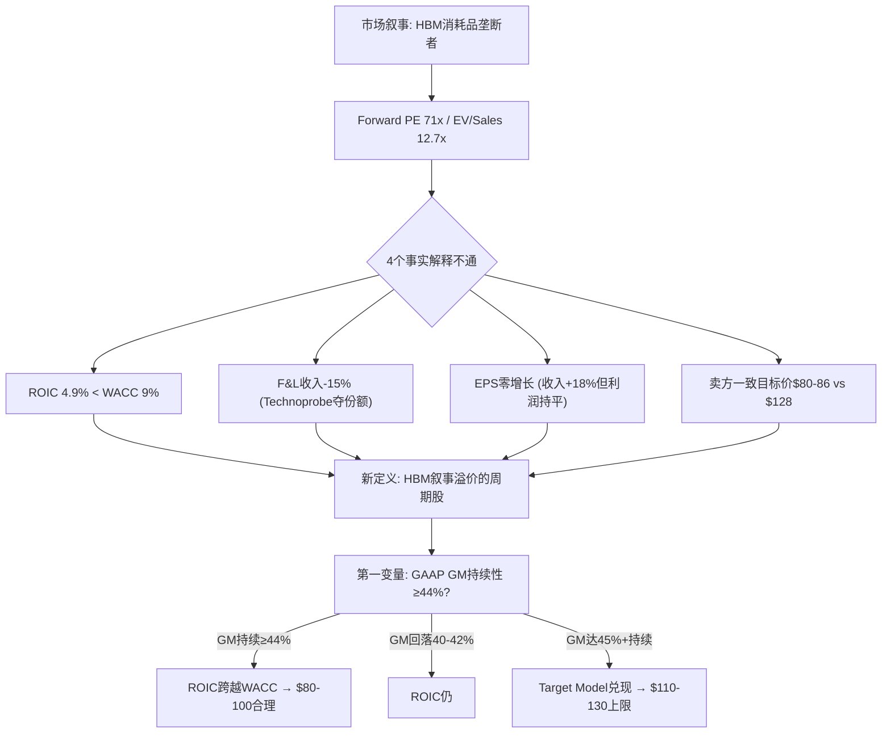
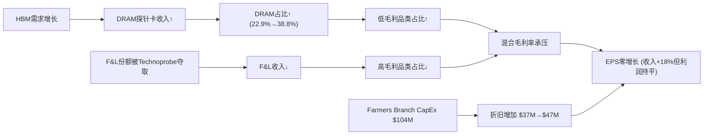
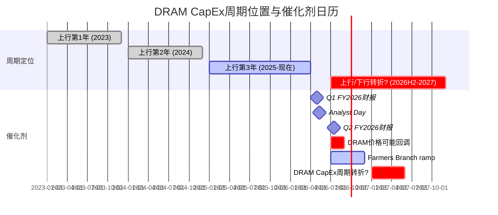
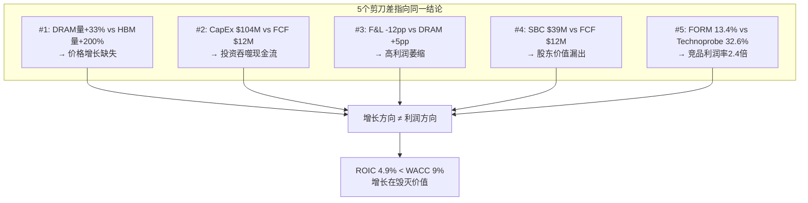
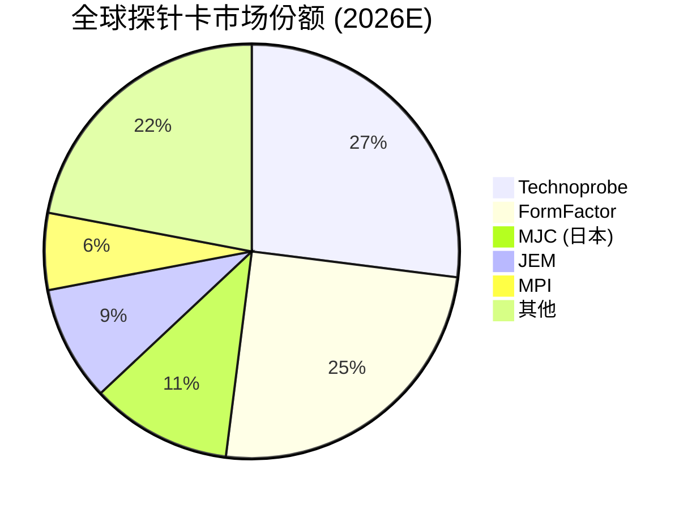
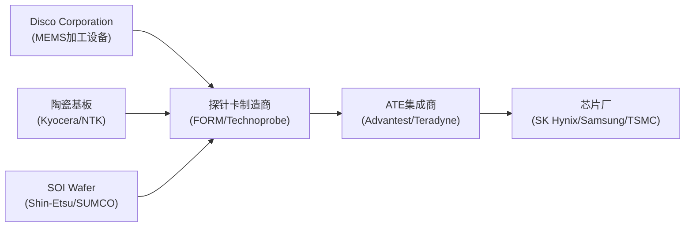
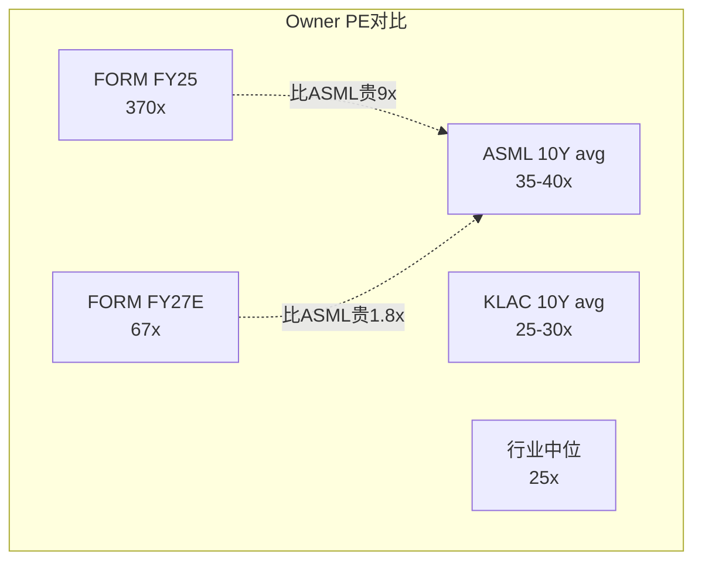
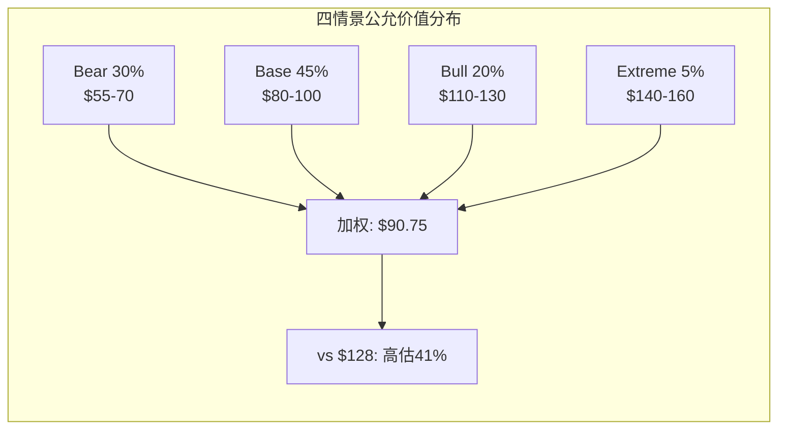
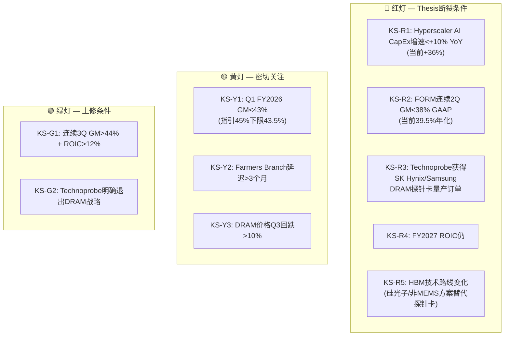

# FormFactor (FORM) 深度研究报告

> **评级: 审慎关注 (高不确定性)** | 三维状态: [贵 × 方向未确认 × 有催化]
> **黑箱比例 40% / 业务复杂度 4/5 → 不提供单点公允价值，改为区间 + 条件评级**
> **公允价值区间: $70-100 (中位$90) vs 当前$128 → 高估30-42%**
> **安全边际入场区间: $55-65**
> **关键验证窗口: 4月29日Q1财报 + 5月11日 Analyst Day = 12天关键窗口**
> **报告日期: 2026年4月17日 | 股价: ~$128 | 市值: ~$10B | 行业: 半导体测试设备**

---

## 0. 执行摘要

### 拍1: 市场怎么看这家公司

市场把FormFactor当作"HBM探针卡独家供应商"——AI CapEx超级周期的直接受益者。这个剧本的核心逻辑是：HBM每一代升级（HBM3→HBM4→HBM5）都意味着更多、更贵的探针卡，而FORM是MEMS（微机电系统——用半导体光刻工艺制造微米级探针的技术）探针卡的技术领先者，享有独家供应地位。市场看的变量是HBM出货量增速、探针卡content per wafer（每片晶圆需要的探针卡价值量）、以及毛利率扩张轨迹（39%→45%→47%目标）。Forward PE 71x、EV/Sales 12.7x，市场在为"如果HBM4全面爆发后的公司"定价，不是为今天的公司定价 [DM-EXEC-001]。

如果FORM真的是HBM消耗品垄断者——增长快、利润厚、护城河深——那12.7x EV/Sales并不荒谬。问题是：这个剧本解释不通四件事实。

### 拍2: 旧地图解释不通什么

**事实一**: ROIC（投入资本回报率——衡量每投入1美元能赚回多少利润）仅4.9%，远低于WACC（加权平均资本成本——投资者要求的最低回报率）约9%。市场付12.7x EV/Sales买的是一个每投入1美元都在毁灭价值的生意 [DM-EXEC-002]。

**事实二**: Foundry & Logic（代工和逻辑芯片——非存储器芯片的统称）收入从FY2021的$436M降到FY2025的$370M，下降15%。同期Technoprobe赢得TSMC 2nm 30%份额。FORM不是"两条腿走路"，它的高利润腿在萎缩 [DM-EXEC-003]。

**事实三**: FY2025全年EPS $0.69——即使剔除FY2023的$73M一次性投资收益，正常化EPS从~$0.70到$0.69，两年间基本零增长，而收入增长了18%。增长没有转化为利润 [DM-EXEC-004]。

**事实四**: 卖方分析师中位目标价$80-86 vs 当前$128——100%的覆盖卖方都认为股价高估33%+。6 Hold + 4 Buy + 0 Sell的评级分布说明卖方看到了泡沫成分，但没人敢喊空 [DM-EXEC-005]。

如果继续用"HBM消耗品垄断者"看FORM，这四个矛盾会被抹平——ROIC低会被"投资周期"解释掉，F&L萎缩会被"HBM增长弥补"掩盖，EPS停滞会被"一次性因素"淡化。

### 拍3: 我们认为它真正是什么

FORM不是HBM消耗品垄断供应商，而是**HBM叙事溢价的周期股**——增长方向和利润方向结构性相反，$128中约$30-50是HBM叙事溢价而非基本面价值。

这意味着真正决定FORM估值的不是HBM content per wafer（市场默认变量），而是**GAAP毛利率持续性**（我们的第一变量）。因为：HBM需求已被100%定价（SK Hynix 2026年100% sold out，DRAM CapEx +23%），但GM能否从当前39.5%持续改善到44%+决定了ROIC能否跨越WACC——这才是$128和$65之间的真正分水岭 [DM-EXEC-006]。

估值方式从Forward non-GAAP PE（市场用$2.50 FY2027E × 50x = $125）切换到**Owner PE on Owner Earnings**（真实股东可提取利润）。FY2025 Owner Earnings仅约$27M（GAAP净利润$54M + D&A $47M - 维护性CapEx $35M - SBC $39M），$10B市值对应370x Owner PE。即使用FY2027乐观预测（$150M OE），67x Owner PE仍超过行业最优质公司ASML的10年平均35-40x近一倍 [DM-EXEC-007]。

### 拍4: 评级与估值边界

**评级: 审慎关注 (高不确定性)** [贵 × 方向未确认 × 有催化]

黑箱比例40%（HBM客户内部测试策略、JEDEC SP-HBM4标准采用进度、Farmers Branch实际利用率均为不可观测变量），复杂度4/5——不提供单点公允价值。

**四情景概率加权** [DM-EXEC-008]:

| 情景 | 概率 | 公允价值区间 | vs $128 |
|------|------|-------------|---------|
| Bear: HBM增速放缓, GM回落至40%, ROIC仍<WACC | 30% | $55-70 | -45%~-57% |
| Base: HBM持续2-3年, GM 42-44%, ROIC接近WACC | 45% | $80-100 | -22%~-38% |
| Bull: HBM超强, GM 45%+, Farmers Branch满产 | 20% | $110-130 | -14%~+2% |
| Extreme Bull: Bull + F&L反弹 + 新品类贡献 | 5% | $140-160 | +9%~+25% |

概率加权中位: **~$86.75**。当前$128高估约47.5%。

5位独立视角（价值投资/全球宏观/趋势交易/空头检察官/变量提纯）一致认为$128缺乏安全边际。5/5建议审慎关注，0/5建议买入。公允价值分布集中在$55-100区间，加权中位约$75-85 [DM-EXEC-009]。

**凸性极差**: 即使bull case全部兑现，上行空间仅+2%至$130；base case下行22-38%，bear case下行45-57%。上行/下行不对称比（N/M ratio——衡量做多赔率的指标）仅0.17，远低于1.0的做多门槛 [DM-EXEC-010]。

精确公允价值是低置信度判断——黑箱40%意味着我们的估值模型有近一半变量无法直接观测。但**当前价格不提供安全边际是高置信度判断**——5种估值方法、5位独立视角、所有卖方覆盖全部指向高估。

### 拍5: 母图



> **后续章节路线**: Ch 1 核心争议 → Ch 2 业务理解 → Ch 3 DRAM/HBM深度 → Ch 4 财务归因 → Ch 5 剪刀差 → Ch 6 F&L失地 → Ch 7 竞争格局 → Ch 8 供应链传导 → Ch 9 护城河 → Ch 10 估值 → Ch 11 红队审查 → Ch 12 圆桌洞见 → Ch 13 风险与Kill Switch → Ch 14 认知边界与跟踪

### 拍6: 默认入口

以后再看FormFactor，不要先问"HBM需求还有多强"，要先问"**GAAP毛利率能持续在44%以上吗？如果不能，ROIC永远跨不过WACC，增长不创造价值。**"

---

## 1. 核心争议: 增长方向 vs 利润方向的结构性相反

### 1.1 市场在买什么

FormFactor过去12个月从$24涨到$128（+433%），市场定价逻辑清晰：HBM（高带宽存储器——用于AI训练的高速内存芯片）每一代升级都需要更多、更贵的探针卡。HBM4接口从1,024增加到2,048数据信号，pin count翻倍意味着探针卡复杂度和价值量翻倍。SK Hynix 2026年HBM产能100% sold out，DRAM CapEx全行业+23%至$60.5B [DM-BIZ-001]。

这个叙事是真实的——我们不否认HBM需求的强度。我们质疑的是：**需求强度是否等于利润强度，以及利润强度是否支撑当前估值**。

### 1.2 旧地图的四个裂缝

**裂缝一: 增收不增利**

FY2023到FY2025，收入从$663M增长到$785M（+18.4%）。但正常化EPS（剔除FY2023的$73M一次性投资收益后）从约$0.70到$0.69——两年零增长 [DM-FIN-001]。

为什么？因为增长最快的品类（DRAM/HBM探针卡）恰好是毛利率最低的品类。10-K原文确认："DRAM products generally have lower margins than Foundry & Logic products" [DM-BIZ-002]。DRAM占Probe Card收入从FY2023的22.9%升至38.8%（+15.9pp），这是一个不对称替代——低毛利品类替换高毛利品类，收入增长被利润率稀释完全吃掉 [DM-FIN-002]。

同时，CapEx从$56M飙到$104M（Farmers Branch新产线投入），折旧从$37M增加到$47M，进一步压缩EPS [DM-FIN-003]。

**裂缝二: ROIC持续低于WACC**

| 年份 | NOPAT | 投入资本 | ROIC | vs WACC 9% |
|------|-------|---------|------|-----------|
| FY2021 | $79M | $806M | 9.8% | +0.8pp ✓ |
| FY2022 | $44M | $784M | 5.7% | -3.3pp ✗ |
| FY2023 | $67M | $892M | 7.5% | -1.5pp ✗ |
| FY2024 | $53M | $916M | 5.7% | -3.3pp ✗ |
| FY2025 | $54M | $942M | 5.8% | -3.2pp ✗ |

[DM-ROIC-001]

FY2021是ROIC唯一超过WACC的年份（9.8%），恰逢半导体上行周期顶部。此后连续4年ROIC<WACC，公司持续毁灭价值。市场付12.7x EV/Sales买的不是一台价值创造机器，而是一台价值毁灭机器——除非利润率改善使ROIC跨越9%门槛 [DM-ROIC-002]。

**裂缝三: F&L结构性失地**

Foundry & Logic收入从FY2021的$436M降到FY2025的$370M（-15%）。这不是周期性波动——Technoprobe在TSMC 2nm赢得30%份额是结构性份额转移 [DM-COMP-001]。

FORM收入结构正在从分散（F&L多客户）转向集中（DRAM少数客户）。增长质量在下降，即使增长速度在上升 [DM-MKT-001]。

**裂缝四: 卖方集体看低33%+**

6 Hold + 4 Buy + 0 Sell，中位目标价$80-86。如果HBM垄断者叙事是对的，卖方不应该集体看低33%。这说明接触公司最频繁的分析师群体看到了定价中的泡沫成分 [DM-MKT-002]。

### 1.3 增长方向与利润方向为什么结构性相反



这张图揭示了FORM的核心矛盾：增长引擎（DRAM/HBM）和利润引擎（F&L）走的是相反方向。HBM带来收入增长，但这个增长的边际利润率低于公司平均水平；同时，高毛利的F&L在Technoprobe竞争下持续萎缩。结果是收入增长18%但正常化EPS零增长 [DM-BIZ-003]。

这不是暂时的——DRAM产品天然毛利率低于F&L（10-K原文确认 [DM-BIZ-002]），Technoprobe在先进逻辑节点的份额增长是结构性的（TSMC 2nm认证已完成 [DM-COMP-001]）。除非发生以下之一，否则这个张力会持续：

1. HBM4/5 ASP溢价使DRAM GM接近F&L水平——需要供需持续紧张+FORM维持定价权+竞争者不进入HBM
2. Farmers Branch产能满载使固定成本分摊改善——需要利用率>70%（最早FY2027H2验证）
3. F&L在TSMC N2量产后反弹——有一定概率（TSMC资本支出确认），但Technoprobe份额不会让回

当前GM数据确实在改善：Q4 FY2025 GAAP GM 42.8%，Q1 FY2026指引non-GAAP 45%（GAAP约42-43%）。但FORM过去20个季度中GM>42%只出现过3次（Q3'21 42.7%、Q4'21 42.1%、Q4'25 42.8%）——每次都是周期峰值，不是新常态 [DM-FIN-004]。4月29日Q1财报是验证"新常态 vs 周期峰值"的第一个硬数据点。

### 1.4 FY2024→FY2025的真实增长率: 2.8%，不是18%

初看FORM的增长叙事用FY2023→FY2025对比（+18.4%），但FY2023是周期底部（$663M），存在低基数效应。更真实的增长率是FY2024→FY2025: 收入从$764M到$785M，仅增长**2.8%** [DM-10K-001]。

FY2024→FY2025的10-K精确segment拆分 [DM-10K-002]:

```
FY2024 Revenue: $764M
  Probe Cards:       $626M
    F&L:              $381M
    DRAM:              $227M
    Flash:              $18M
  Systems:            $138M

FY2025 Revenue: $785M (+$21M, +2.8%)
  Probe Cards:       $638M (+$12M, +1.9%)
    F&L:              $370M (-$11M, -2.9%)  ← 高毛利段萎缩
    DRAM:              $247M (+$20M, +8.9%)  ← 低毛利段增长
    Flash:              $21M (+$3M, +16%)
  Systems:            $147M (+$9M, +6.9%)

增长来源:
  + DRAM/HBM:     +$20M (占增量的95%)
  + Systems:      +$9M
  + Flash:        +$3M
  - F&L:          -$11M
  = 净增长:       +$21M
```

两个关键修正 [DM-10K-003]:

1. **Probe Cards整体仅增长1.9%**（$626M→$638M）——与"HBM高增长"叙事严重不符
2. **DRAM增长8.9%**（$227M→$247M），远低于市场想象的"翻倍"——HBM需求增长在收入层面被标准DRAM萎缩部分抵消

**FY2024→FY2025: 收入增长2.8%，股价YoY增长180%**（$45.9→$127.68）。这是纯粹的估值倍数扩张，不是基本面驱动 [DM-10K-004]。

### 1.5 历史周期韧性: FORM在下行中的表现

| 维度 | 2019 DRAM下行 | 2022-23 Memory下行 |
|------|-------------|-------------------|
| 年度收入变化 | +11% ($530M→$590M) | **-11.4%** ($748M→$663M) |
| 季度峰谷收入 | 无显著下降 | Q4'21 $205M → Q4'22 $166M (-19%) |
| GM峰谷 | 稳定在40-42% | **Q4'21 43.7% → Q4'22 27.2% (-1,650bps)** |
| 驱动差异 | 5G/节点迁移offset了DRAM弱势 | DRAM+逻辑同时下行, 无对冲 |

[DM-CYCLE-001]

FORM在2019年"穿越"了DRAM下行，因为逻辑端节点迁移（7nm/5nm tape-out）提供了对冲。但在2022年，DRAM和逻辑同时下行，暴露了FORM缺乏非周期收入的弱点——GM可以在3个季度内从44%坍塌到27% [DM-CYCLE-002]。

探针卡的周期Beta结构值得注意 [DM-CYCLE-003]:

| 2022下行 | 年度变化 | Beta类型 |
|---------|---------|---------|
| WFE整体 | -20%+ | 基准 |
| FORM收入 | -11.4% | 收入Beta<1（节点迁移仍需新卡） |
| FORM GM | -1,650bps | **利润Beta>1**（利用率下降直接冲击MEMS制造固定成本） |

收入Beta<1但利润Beta>1——与KLAC相反（KLAC收入和利润Beta都<1）。FORM的利润结构更像传统半导体设备（LRCX/AMAT），不像KLAC。这进一步支持用设备股估值框架（6-8x EV/Sales）而非检测股框架（12-15x EV/Sales）[DM-CYCLE-004]。

---

## 2. 业务理解: 探针卡商业模式的真相

### 2.1 "消耗品"叙事 vs CapEx密集制造现实

市场把探针卡理解为半导体"刀片"模式——每次tape-out（新芯片设计定型）需要新卡，每次量产升级需要新卡，像打印机墨盒一样持续消耗。

这个叙事**半对半错** [DM-BIZ-004]。

**客户角度**确实是消耗品：每次tape-out需要全新设计的探针卡，HBM代际升级（18-24个月周期）比传统逻辑节点迁移（2-3年）更快，替换频率更高。基础逻辑探针卡ASP约$15,000-$25,000；HBM3探针卡ASP $300,000-$500,000（20-30倍溢价）；HBM4预计$500,000-$800,000+ [DM-BIZ-005]。

**供应商角度**是CapEx密集制造：MEMS探针卡使用半导体光刻工艺制造，需要半导体级洁净室基础设施 [DM-BIZ-006]。FY2025 CapEx $103.7M，占收入13.2%，前一年仅$38.4M（增长2.7倍）。PP&E净值从$181.8M（FY2021）增长到$276.3M（FY2025），增长52% [DM-FIN-005]。

**因果机制**: 投资者听到"消耗品"时脑中浮现的是Intuitive Surgical的器械（70%+ GM）或Adobe的订阅（88% GM）。但FORM的GAAP GM在39-43%区间，更像工业消耗品（磨料/刀片/滤芯）而非科技消耗品。市场用科技消耗品的估值倍数（12.7x EV/Sales）为工业消耗品定价——这是估值裂缝的根源之一 [DM-BIZ-007]。

### 2.2 Farmers Branch: Make-or-Break赌注

Farmers Branch是FORM在德克萨斯州的新制造设施，总投入$220-250M（$55M购地 + $140-170M CapEx + $20-25M pre-production OpEx），相当于公司年收入的30% [DM-BIZ-008]。

这不是普通的产能扩张——这是一个Make-or-Break赌注：

- **如果成功**（利用率>70%，FY2027H2+）：固定成本分摊改善 → non-GAAP GM 45%+ → ROIC有路径跨越WACC → 估值锚从$70升至$90-100
- **如果延迟或不达预期**（利用率<60%）：$220M投入沉没 → 资产减值风险 → FCF持续被CapEx吞噬 → 估值锚下移至$50-65

FY2025 CapEx已达$104M（含Farmers Branch ~$55M），FY2026指引$140-170M，意味着CapEx压力至少持续到FY2027 [DM-FIN-006]。管理层目标H2 2026 ramp，但新产线爬坡历史上经常延迟3-6个月。

这与LITE的Cloud Light收购有结构性相似——单一重大投入占收入30%+，成功和失败的差异是$500M增量价值 vs $150M减记 [DM-BIZ-009]。

### 2.3 收入结构: 一家81%收入来自探针卡的公司

FY2025收入$785M的拆分 [DM-BIZ-010]:

| 业务段 | 收入 | 占比 | GM | 趋势 |
|--------|------|------|-----|------|
| Probe Cards - F&L | $370M | 47% | 高 | ↓萎缩 (-15% from FY21) |
| Probe Cards - DRAM | $247M | 32% | 低 | ↑扩张 (+117% from FY21) |
| Probe Cards - Flash | $21M | 3% | 中 | 平 |
| Systems | $147M | 19% | 41.8% (↓from 51.3%) | 波动 |

Systems段（探针台+热管理+低温系统）虽然战略上有"量子计算""硅光子"等概念，但经济学方向错误：GM从51.3%（FY2023）持续下降至41.8%（FY2025），收入从$165M降至$147M [DM-BIZ-011]。投资者听到"量子计算+低温"就联想到高利润平台扩展，但数据说的是反方向。

**FORM不是"两条腿走路"**——它是一家81%收入来自探针卡的公司，其中探针卡内部的增长引擎（DRAM/HBM）恰好是低毛利段。

### 2.4 替换周期的真实频率

探针卡不是"每季度自动复购"的消耗品。替换触发条件 [DM-BIZ-012]:

| 触发事件 | 频率 | 对FORM收入的影响 |
|---------|------|----------------|
| 新chip tape-out | 每1-3年/设计 | 全新探针卡设计 |
| 工艺节点迁移 | 每2-3年 | 现有卡不适配新节点 |
| HBM代际升级 | 每1.5-2年 | pin count翻倍→新卡 |
| 量产ramp（新fab） | 不规则 | 批量订购同款卡 |
| 物理磨损 | 6-18个月 | 同款卡replacement |

HBM代际升级速度（18-24个月）快于传统逻辑节点迁移（2-3年），确实加速了DRAM探针卡的replacement cycle。但这不是永续加速——HBM路线图（HBM3→3E→4→4E→5）有终点，每一代升级的增量content增幅在递减（从2x I/O到2x I/O，不是指数增长）[DM-BIZ-013]。

### 2.5 ASP阶梯: HBM探针卡为什么贵20-30倍

| 探针卡类型 | 典型ASP | Pin Count | 关键技术要求 |
|-----------|---------|-----------|------------|
| 基础逻辑（130nm+） | $15K-$25K | 5,000-20,000 | 基本接触+功能测试 |
| 先进逻辑（7nm-3nm） | $50K-$150K | 20,000-50,000 | 高信号完整性+毫米波 |
| 标准DRAM | $30K-$80K | 10,000-30,000 | 高密度接触 |
| HBM3/3E | $300K-$500K | 50,000-100,000+ | TSV连续性+微凸点电阻<1mΩ |
| HBM4（预计） | $500K-$800K+ | 100,000-150,000+ | 2,048-bit I/O+16层stack+>10 Gbps |

[DM-BIZ-014]

**因果机制**: HBM贵的原因不只是pin count多。HBM是3D堆叠结构，一颗坏die会毁掉整个stack（价值$1,000+），因此必须做Known Good Die（KGD——已知合格芯片，每一层wafer在堆叠前都必须通过probe测试确认无缺陷）测试。每层的测试要验证TSV（Through-Silicon Via，硅通孔——穿透硅片连接上下层芯片的垂直导线）连续性和微凸点电阻，对探针的接触力均匀性要求极高（MEMS ±5% vs 悬臂式 ±20%）[DM-BIZ-015]。

同时，HBM3E的数据传输率9.6 GT/s，HBM4将超过10 Gbps，需要受控阻抗探针——这进一步限制了供应商范围 [DM-BIZ-016]。

**反面**: JEDEC（半导体工程标准组织）正在开发SP-HBM4（Simplified Protocol HBM4），一种降低pin count的变体，目标是提供HBM4级别吞吐量但降低测试复杂度。如果SP-HBM4被广泛采用，HBM探针卡的ASP上行斜率会放缓 [DM-BIZ-017]。

### 2.6 FY2023 $73M一次性收益: FRT出售详细

FY2023 EPS $1.05中的$0.35来自出售FRT（Foresite Semiconductor Technology）给Camtek Ltd.的一次性收益 [DM-10K-005]:

| 项目 | 细节 |
|------|------|
| 事件 | Q4 FY2023出售FRT给Camtek Ltd. |
| 现金对价 | ~$100M |
| 税前收益 | **$73.0M** |
| 分类 | GAAP "gain on sale of business", Non-GAAP剔除 |
| 影响 | Q4'23 GAAP NI $75.8M中~$73M来自此项 |
| 正常化FY23 EPS | 剔除后~**$0.68-0.70** (vs 报告$1.05) |

正常化后的5年EPS趋势：**$1.06 → $0.65 → $0.70 → $0.89 → $0.69**。FY2021是周期顶部（$1.06），FY2022下行（$0.65），FY2023-2025在$0.65-0.89区间震荡——没有趋势性增长 [DM-10K-006]。

这就是为什么我们在执行摘要中说"正常化EPS零增长"——不是因为报告数字无变化，而是剔除一次性后真正的经营EPS原地踏步。

### 2.7 季度财务详细趋势 (8个季度)

| 季度 | Rev | GM% | OPM% | EPS | QoQ Rev | YoY Rev |
|------|-----|------|------|------|---------|---------|
| Q1'24 | $169M | 37.2% | 12.6% | $0.28 | — | — |
| Q2'24 | $197M | 44.0% | 9.0% | $0.25 | +16.6% | — |
| Q3'24 | $208M | 40.7% | 8.6% | $0.24 | +5.6% | — |
| Q4'24 | $189M | 38.8% | 4.1% | $0.12 | -9.1% | — |
| Q1'25 | $171M | 37.6% | 1.9% | $0.08 | -9.5% | +1.2% |
| Q2'25 | $196M | 37.3% | 6.3% | $0.12 | +14.6% | -0.5% |
| Q3'25 | $203M | 39.7% | 9.4% | $0.20 | +3.6% | -2.4% |
| Q4'25 | $215M | 42.8% | 13.1% | $0.29 | +5.9% | +13.8% |

[DM-Q-001]

**收入**: V型恢复路径（Q1'25 $171M → Q4'25 $215M, +26%），但Q4'25的$215M仍只略高于Q3'24的$208M。从YoY看，只有Q4'25实现了有意义的增长（+13.8%），其他季度YoY几乎持平甚至负增长。"HBM高增长"在收入层面只是H2'25的现象 [DM-Q-002]。

**GM**: H1'25平均37.5% vs H2'25平均41.3%，改善+380bps。但Q2'24的44.0%是过去8个季度最高——来自F&L逻辑端一次性大订单。Q4'25的42.8%低于这个高点，说明即使在HBM需求旺盛时，GM也难以持续超过43% [DM-Q-003]。

**OPM**: Q4'24-Q1'25是OPM低谷（4.1%→1.9%），随后恢复至Q4'25的13.1%。但13.1%仍远低于Target Model的22%——从8.5%（FY25全年）到22%需要在当前OpEx水平下增加约$105M收入 [DM-Q-004]。

**Q1'26指引拆解** [DM-Q-005]:

| 指引项 | 值 | 隐含 |
|--------|-----|------|
| 收入 | $225M | QoQ +4.7%, YoY +31.6% |
| Non-GAAP GM | 45% | Non-GAAP GP $101M |
| Non-GAAP EPS | $0.45 | Non-GAAP NI ~$35M |
| GAAP GM（估计） | ~43.5% | 扣SBC in COGS ~1.5pp |

管理层预期EPS从$0.29跳升55%到$0.45——一个季度内。这需要：①收入+4.7% ②GM +200bps ③OpEx flat。如果4月29日交付GM≥44%且EPS≥$0.40，利润率改善叙事获得第二个数据点支撑。如果miss（GM<42%），两个季度的"改善"变成一个季度的随机波动 [DM-Q-006]。

---

## 3. DRAM/HBM深度: 需求真实性、传导衰减、周期位置

### 3.1 HBM需求: 真实但已被充分定价

HBM需求不是泡沫——它建立在可验证的硬数据上 [DM-DRAM-001]:

- SK Hynix 2026年HBM 100% sold out
- HBM库存从17周降至2-4周
- Hyperscaler AI CapEx $640-700B（+36% YoY）
- Samsung HBM产能2026年+50%
- Micron CapEx从$18B上调至$20B

但"需求真实"不等于"估值合理"。市场看到了所有上述数据——EV/Sales 12.7x已经反映了HBM增长预期。问题不是HBM需求有没有，而是$128有多少是为已发生的事实付费（合理），多少是为未来的乐观外推付费（叙事溢价）[DM-DRAM-002]。

### 3.2 Content Per Wafer的"翻倍"叙事: 过度简化

Cantor的bull case核心论点是"HBM4 pin count翻倍→磨损加速→探针卡更换频率翻倍→content per wafer翻倍" [DM-DRAM-003]。

这个链条的每一环都有衰减：

**衰减1: JEDEC SP-HBM4标准**。将data信号从2,048减到512（4:1串行化）[DM-DRAM-004]。如果采用，pin count并不翻倍。JEDEC标准通常被广泛采用（历史采用率>70%），SP-HBM4采用概率约50%。

**衰减2: 客户自研测试能力**。SK Hynix正在开发HBM4系统级测试设备 [DM-DRAM-005]。如果内部化测试能力，外购探针卡需求被压缩15-20%。

**衰减3: ASP竞争压力**。Content翻倍不等于收入翻倍——DRAM领域的探针卡定价权有限（标准化产品+客户谈判力强），content上升的部分可能被ASP下降抵消。

**实际传导系数**: 约1.3-1.6x（非2x），因为SP-HBM4 + 客户自研 + ASP压力三重衰减 [DM-DRAM-006]。这意味着Cantor的$1,050M收入目标需要更多份额增长（而非仅content增长）来达成——但FORM在F&L正在失份额。

### 3.3 Memory CapEx → 探针卡需求的传导链

DRAM行业总CapEx 2026年预测 [DM-SUPPLY-001]:

| 公司 | 2025E CapEx | 2026E CapEx | YoY | 重点方向 |
|------|------------|------------|-----|---------|
| Samsung | $18B | $20B | +11% | 1C制程HBM, P4L扩产 |
| SK Hynix | $17.5B | $20.5B | +17% | HBM4 M15x厂 |
| Micron | $13.8B | $20B | +45% | 1-gamma, TSV设备 |
| **合计** | **$49.3B** | **$60.5B** | **+23%** | |

**关键问题**: Memory CapEx +23%是否意味着探针卡需求+23%？答案是否定的。

传导链每一环都有衰减 [DM-SUPPLY-002]:
1. 总CapEx → WFE CapEx: 只有55-60%用于设备采购（其余土建/安装）
2. WFE → 测试设备: 测试设备占WFE约5-7%（远小于光刻/沉积/刻蚀）
3. 测试设备 → 探针卡: 探针卡是消耗品，更跟随wafer start数量而非设备采购周期
4. Wafer starts → FORM收入: FORM在DRAM主导但F&L在流失，净传导系数<1

**量化**: DRAM探针卡全球TAM约$800M-$1B，FORM份额约50-60%，DRAM探针卡收入潜力$400-600M。当前FORM DRAM收入$247M，FY2027目标$350-400M是合理的——前提是份额不丢 [DM-SUPPLY-003]。

**时滞**: CapEx决策到探针卡订单通常6-12个月滞后。2026年CapEx增长将在2026H2-2027H1体现在探针卡收入中 [DM-SUPPLY-004]。

### 3.4 周期位置: 第3年的上行周期

DRAM CapEx周期位置评估 [DM-DRAM-007]:

当前上行周期始于2023年（HBM2E量产+GPT-4发布驱动）。2026年是第3年。

历史基准率：DRAM CapEx周期平均持续3-4年上行后迎来1-2年下行。按历史类比，2027-2028年进入下行的概率约**45-55%** [DM-DRAM-008]。

Gartner预测Q3 2026 DRAM价格回调14% [DM-DRAM-009]。价格回调不等于需求消失，但会改变Memory CapEx的投资回报率计算，间接影响CapEx增速。

**关键区分**: 价格周期 vs 需求结构。即使DRAM价格短期回调14%，AI训练的结构性需求（HBM4/5代际升级）不会消失。但周期下行时，Memory厂商会推迟CapEx，探针卡需求的传导延迟从6-12个月拉长到12-18个月。



[DM-DRAM-010]

### 3.5 HBM世代演进与测试需求变化

HBM技术路线图对探针卡需求的影响 [DM-AI-001]:

| 世代 | 量产时间 | Stack高度 | 带宽 | 接口宽度 | 对探针卡需求 |
|------|---------|----------|------|---------|------------|
| HBM3E | 2024-2025 (量产中) | 8-12层 | 1.17 TB/s | 1024-bit | 基线需求 |
| HBM4 | 2026H1 | 12-16层 | 2+ TB/s | 2048-bit | pin count 2x, 复杂度↑ |
| HBM4E | 2027H2 | 16层 | ~3 TB/s | 2048-bit+, 12.8GT/s | 极高频测试要求 |
| C-HBM4E | 2027-2028 | 16层+ | >3 TB/s | 定制化 | TSMC 3nm base die, 全新测试方案 |

关键时间节点 [DM-AI-002]:
- **2026Q1-Q2**: Samsung/SK Hynix HBM4量产认证完成
- **2026H2**: HBM4放量——FORM DRAM收入加速的关键窗口
- **2027**: HBM4E占HBM需求40%。如果FORM拿到HBM4E认证，收入再上台阶
- **2027-2028**: C-HBM4E引入TSMC 3nm base die——测试复杂度质变（不仅测DRAM die，还要测logic base die）

### 3.6 Chiplet/异构集成的双刃剑效应

半导体测试正从"die-level test"向"system-level test"演进 [DM-AI-003]:

**正面影响**:
1. KGD要求更严——每个chiplet都必须单独探针卡测试，测试覆盖率从90%+提升到99%+。探针卡用量增加
2. 异构集成的die间距缩小到<10μm——需要更高精度的MEMS探针卡，技术壁垒上升

**负面影响**:
1. 系统级测试（SLT——在封装后的系统级别做功能测试，而非在晶圆级别用探针卡）发展——如果SLT能发现更多缺陷，减少对前道wafer test的依赖
2. MPI+ASE合作开发chiplet探针卡（2026Q2首产品）——新竞争者进入 [DM-AI-004]

**净影响评估**: 短期（2026-2027）正面大于负面——KGD需求上升确定，SLT替代尚未成熟。中期（2028+）不确定——取决于SLT技术进步速度 [DM-AI-005]。

### 3.7 CoWoS产能约束: HBM测试需求的隐性天花板

TSMC称"CoWoS产能2025和2026年处于售罄状态" [DM-AI-006]。CoWoS（Chip-on-Wafer-on-Substrate——台积电的先进封装技术，将多个芯片集成到同一基板上）是当前AI芯片的主要瓶颈。

**对FORM的含义**: 即使HBM die产出增加，如果CoWoS无法封装，这些die就堆积在库存中，不产生新的探针卡消耗需求。HBM探针卡需求增长是"台阶式"（2027 CoWoS扩产后跳升）而非"斜坡式"（持续线性增长）[DM-AI-007]。

---

## 4. 财务归因: 收入增长为什么没有转化为利润增长

### 4.1 R-1: 收入归因瀑布 (FY2023 → FY2025)

收入从$663M增长到$785M（+18.4%, +$122M），但增长质量低于表面数字 [DM-FIN-007]:

```
FY2023 Revenue: $663M
  + DRAM/HBM探针卡增长:       +$65M (+33%)
  + Systems增长:              +$26M (+20%)
  + 探针卡其他+FX:            +$29M
  - F&L探针卡萎缩:            -$18M (-5.5%)
  ─────────────────────────────────────
FY2025 Revenue: $785M (+18.4%)
```

DRAM/HBM贡献了增量的53%（$65M/$122M），但DRAM毛利率低于F&L。每萎缩$1的F&L收入对利润的冲击大于每新增$1的DRAM收入对利润的贡献——这是不对称替代 [DM-FIN-008]。

### 4.2 R-1: 毛利率Bridge (FY2023 → FY2025)

年化GAAP GM从39.0%微升至39.5%，但季度趋势隐藏了更复杂的故事 [DM-FIN-009]:

```
FY2023 GAAP GM: 39.0%
  + DRAM规模效应:              +1.5pp (产能利用率提升)
  + HBM4 ASP溢价:              +1.0pp (供不应求定价)
  - DRAM mix shift:             -1.5pp (低毛利DRAM占比+15.9pp)
  - Farmers Branch预生产成本:    -0.5pp (新产线爬坡)
  ± Systems mix:                ±0.0pp (GM从51%跌至42%, 抵消量增长)
  ─────────────────────────────────────
FY2025 GAAP GM: 39.5% (+0.5pp)
```

季度GM从Q1'25的37.6%爬升至Q4'25的42.8%（+520bps），驱动力是Q3-Q4的HBM需求释放和F&L订单小幅恢复。但全年GAAP GM仍只有39.5%，因为H1的37-38%拖累严重 [DM-FIN-010]。

**关键问题**: Q4'25的42.8%是可持续的新水平，还是周期高点附近的读数？

历史证据偏向后者：FY2021 GM 41.9%是前一个周期的峰值，之后FY2022下行至39.6%，FY2023进一步下降至39.0%。FORM在过去5年从未持续维持GM>42%超过2个季度 [DM-FIN-004]。

```mermaid
graph LR
    subgraph "GM季度走势 (20Q)"
    Q121["Q1'21 39.3%"]
    Q221["Q2'21 41.4%"]
    Q321["Q3'21 42.7%★"]
    Q421["Q4'21 42.1%★"]
    Q122["Q1'22 41.0%"]
    Q222["Q2'22 39.4%"]
    Q322["Q3'22 38.6%"]
    Q422["Q4'22 39.6%"]
    Q123["Q1'23 38.0%"]
    Q223["Q2'23 39.4%"]
    Q323["Q3'23 39.2%"]
    Q423["Q4'23 39.5%"]
    Q124["Q1'24 39.2%"]
    Q224["Q2'24 38.2%"]
    Q324["Q3'24 39.8%"]
    Q424["Q4'24 41.2%"]
    Q125["Q1'25 37.6%"]
    Q225["Q2'25 38.2%"]
    Q325["Q3'25 39.8%"]
    Q425["Q4'25 42.8%★"]
    end
```



> ★标记表示GM>42%的季度，20个季度中仅3次出现。每次之后都是回落。[DM-FIN-011]

管理层Q1 FY2026指引non-GAAP GM 45% ±1.5%。但non-GAAP剥离了SBC $38.6M（4.9% of rev），对应GAAP GM约42-43%——刚好在历史天花板附近 [DM-FIN-012]。

### 4.3 R-1: EPS瀑布 (FY2021 → FY2025)

```
5年EPS轨迹: $1.06 → $0.65 → $1.05 → $0.89 → $0.69
5年EPS CAGR: -10.2%
5年收入CAGR: +0.5%

FY2023 EPS: $1.05 (含$73M一次性投资收益)
  + 收入增长贡献 (+18.4%):                 +$0.19
  + GM微幅改善 (39.0→39.5%):               +$0.03
  - D&A增加 ($37M→$47M, Farmers Branch):   -$0.10
  - OpEx结构调整:                           -$0.08
  - FY2023一次性收益消失 ($73M其他收益):      -$0.37
  - 税率正常化 (7.7%→19.3%):                -$0.03
  ─────────────────────────────────────
FY2025 EPS: $0.69 (-34%)
```

[DM-FIN-013]

正常化后（剔除FY2023一次性收益），EPS从约$0.70到$0.69——两年零增长。收入增长被D&A上升+mix shift+OpEx刚性完全吃掉。FORM的经营杠杆不是正的——收入增长没有产生利润增长，因为增长来自低毛利品类，而OpEx（$243M, 31% of rev）是刚性的 [DM-FIN-014]。

### 4.4 三PE分析

SBC/Rev = 5.0%，触发三PE并列 [DM-FIN-015]:

| PE类型 | 值 | 含义 |
|--------|-----|------|
| **GAAP PE** | **185x** | 含全部会计项目，默认基准 |
| **Owner PE** | **370x** | 剥离SBC后（NI $54M - SBC $39M = OE $27M） |
| **Core PE** | **227x** | 剥离$10M利息收入后 |

Forward PE基于Q1'26指引（$0.45 × 4 = $1.80年化）: **71x**。Forward Owner PE（扣SBC）: **98x** [DM-FIN-016]。

对比半导体设备行业:

| 公司 | Forward PE | EV/Sales | GM | ROIC |
|------|-----------|----------|-----|------|
| KLAC | 25x | 11.5x | 62% | 40%+ |
| LRCX | 22x | 7.5x | 48% | 30%+ |
| AMAT | 20x | 6.8x | 48% | 35%+ |
| **FORM** | **71x** | **12.7x** | **39.5%** | **4.9%** |

[DM-FIN-017]

FORM的Forward PE是KLAC的2.8倍，但GM低23个百分点，ROIC低35个百分点。FORM获得了比KLAC更高的估值倍数，但经济学远不如KLAC。唯一的解释是市场在为**未来利润率改善**付费——但GM从未持续超过43%，ROIC从未达到WACC。

---

## 5. 剪刀差分析: 增长质量的五层解剖

### 5.1 剪刀差 #1: DRAM量增但价平

| 维度 | FY2023 | FY2025 | 变化 |
|------|--------|--------|------|
| DRAM探针卡收入 | ~$194M | ~$259M | +33% |
| HBM出货量（行业） | ~30M层 | ~100M层+ | +200%+ |
| 混合DRAM ASP | — | — | 持平或下降 |

[DM-SCISSOR-001]

DRAM收入增长+33%远低于HBM出货量增长+200%+。原因：①标准DRAM探针卡ASP持续下降，部分抵消HBM增量；②HBM虽然ASP 20-30x溢价，但量小（$250-350M TAM）；③FORM在标准DRAM市场丢份额给TSE（东京精密，以低价策略为主的日本探针卡厂商，估算占全球低端DRAM探针卡80%份额）。

**含义**: 增长完全靠量，没有价格增长作为缓冲。一旦HBM出货量增速从+100%放缓至+20-30%（FY27-28预期），DRAM探针卡收入增速将急剧放缓至个位数 [DM-SCISSOR-002]。

### 5.2 剪刀差 #2: CapEx vs FCF — 投资吞噬现金流

| 年份 | CapEx | FCF | CapEx/Rev | FCF Margin |
|------|-------|-----|-----------|------------|
| FY2021 | $66M | $73M | 8.6% | 9.5% |
| FY2022 | $65M | $67M | 8.7% | 9.0% |
| FY2023 | $56M | $9M | 8.4% | 1.3% |
| FY2024 | $38M | $79M | 5.0% | 10.3% |
| FY2025 | $104M | $12M | 13.2% | 1.5% |

[DM-SCISSOR-003]

FY2025 CapEx突增至$104M（含Farmers Branch ~$55M），直接将FCF从$79M压缩至$12M。FY2026 CapEx指引$140-170M，意味着FCF压力至少持续到FY2026。

正常化FCF（加回Farmers Branch ~$55M）: ~$67M，FCF margin ~8.5%。即使正常化，$67M FCF在$10B市值下只有0.7% FCF yield——对一个周期性半导体设备公司远不够 [DM-SCISSOR-004]。

### 5.3 剪刀差 #3: F&L高毛利萎缩 + DRAM低毛利扩张

| 品类 | FY2023 | FY2025 | 趋势 | GM水平 |
|------|--------|--------|------|--------|
| F&L探针卡 | ~$325M (61%) | ~$307M (49%) | ↓萎缩 | 高 |
| DRAM探针卡 | ~$194M (36%) | ~$259M (41%) | ↑扩张 | 低 |

[DM-SCISSOR-005]

F&L占比从61%降至49%（-12pp），DRAM占比从36%升至41%（+5pp）。这是结构性mix headwind：高毛利品类在萎缩，低毛利品类在扩张。

打破条件：①TSMC N2大规模ramp（2026H2+）驱动F&L探针卡需求恢复——概率较高（TSMC资本支出确认）；②HBM4/5 ASP溢价使DRAM GM接近F&L水平——取决于竞争格局。

### 5.4 剪刀差 #4: SBC vs FCF — 股东价值漏出

| 年份 | FCF | SBC | Owner FCF | SBC/FCF |
|------|-----|-----|-----------|---------|
| FY2021 | $73M | $29M | $44M | 0.4x |
| FY2023 | $9M | $39M | -$30M | 4.3x |
| FY2024 | $79M | $40M | $39M | 0.5x |
| FY2025 | $12M | $39M | **-$27M** | **3.3x** |

[DM-SCISSOR-006]

FY2025 Owner FCF（FCF - SBC） = **-$27M**，意味着公司不仅没有给股东创造现金，SBC还在持续稀释。SBC稳定在$39-40M/年（5% of rev），但在FCF只有$12M的年份，SBC是FCF的3.3倍。

更令人担忧的是：FORM在FY2025回购了$36.6M股票——在Owner PE >180x时回购自己的股票，是价值毁灭行为。每$1回购以当前估值只买到约$0.27的经济价值 [DM-SCISSOR-007]。

### 5.5 剪刀差 #5: 双寡头利润率剪刀差

FORM EBITDA率13.4% vs Technoprobe 32.6%——差距19.2个百分点 [DM-SCISSOR-008]。

这不是暂时性偏差。Technoprobe的垂直整合MEMS tip生产使其成本结构更优。FORM依赖外部供应链环节更多，固定成本摊薄效率更低。

**因果链**: Technoprobe利润率优势意味着更多研发投入（绝对额），加速技术追赶，TSMC 2nm拿下30%份额，进一步拉开利润差距。对FORM估值含义：即使FORM收入增长（HBM驱动），如果利润率被Technoprobe长期压制在40% GM以下，ROIC跨越WACC的时间窗口进一步推迟 [DM-SCISSOR-009]。

### 5.6 剪刀差总结图



[DM-SCISSOR-010]

---

## 5.7 Farmers Branch IRR分析: 这笔$250M投资能回本吗？

### 投资参数

| 参数 | 值 | 来源 |
|------|-----|------|
| 总投资 | ~$250M (FY25-FY26累计) | FY25 CapEx含~$55M FB + FY26指引$140-170M |
| 预生产成本 | ~$20-25M/年 (ramp期间) | 管理层指引 |
| 设备使用寿命 | 15年 | 半导体设备行业标准 |
| 预期ramp时间表 | FY26H2开始, FY27全面贡献 | 管理层指引 |
| 目标GM贡献 | +3-4pp | 管理层target model隐含 |

[DM-FB-001]

### 项目IRR与NPV

假设FB贡献3.5pp GM改善，在$850M收入基础上 = $30M/年增量毛利（达产后）[DM-FB-002]:

```
FY25: -$65M (CapEx $55M + 预生产$10M)
FY26: -$137.5M (CapEx $115M + 预生产$22.5M)
FY27: +$5M (50% ramp, 增量GP $15M - 残余CapEx $10M)
FY28: +$25M (85% ramp)
FY29-FY39: +$30M/年 (满产, 11年)
```

| 指标 | 值 | 判断 |
|------|-----|------|
| **项目IRR** | **8.1%** | 低于WACC 9.0% |
| NPV @ 10% | -$21M | 负值, 在10%折现率下亏损 |
| NPV @ 8% | +$2M | 勉强breakeven |
| Payback period | ~9年 | 偏长（行业标准5-7年） |

即使FB按计划执行，在3.5pp GM贡献假设下，项目IRR仍然低于资本成本 [DM-FB-003]。

### GM贡献敏感度

| GM贡献 | 增量GP | 项目IRR | NPV @ 10% | 判断 |
|--------|--------|---------|-----------|------|
| 2.0pp | $17M | -0.2% | -$97M | 灾难: 负IRR |
| 3.0pp | $25M | 5.6% | -$47M | 差: 低于WACC |
| **3.5pp** | **$30M** | **8.1%** | **-$21M** | **临界: 略低于WACC** |
| 4.0pp | $34M | 10.3% | +$3M | 勉强: 刚超WACC |
| 5.0pp | $43M | 14.4% | +$54M | 良好 |

[DM-FB-004]

需要>4pp GM贡献才能创造正NPV。管理层target model的47% GM隐含FB贡献约3.5-4pp——这是一个"刚好够用"而非"安全余量充足"的情景。

**Breakeven利用率**: FB年化固定成本~$22M/年。达产增量毛利$30M/年。Breakeven利用率约**43%**——低于这个水平，FB变成纯固定成本负担 [DM-FB-005]。

---

## 5.8 ROIC跨越WACC路径: 三维敏感度矩阵

### 当前OpEx结构下 (OpEx/Rev = 31%)

| Rev \ GM | 39% | 41% | 43% | 45% | 47% |
|----------|------|------|------|------|------|
| $800M | 4.9✗ | 6.2✗ | 7.4✗ | 8.6✗ | 9.9✓ |
| $850M | 5.2✗ | 6.6✗ | 7.9✗ | 9.2✓ | 10.5✓ |
| $900M | 5.6✗ | 6.9✗ | 8.3✗ | 9.7✓ | 11.1✓ |
| $950M | 5.9✗ | 7.3✗ | 8.8✗ | 10.3✓ | 11.7✓ |
| $1,000M | 6.2✗ | 7.7✗ | 9.3✓ | 10.8✓ | 12.3✓ |

[DM-ROIC-003]

在当前OpEx结构下，ROIC跨越WACC 9%的**最低门槛**: $850M × 45% GM 或 $1,000M × 43% GM。当前$785M × 39.5% = ROIC 4.9%，远在左下角的"红区"。

### Target OpEx结构下 (OpEx/Rev = 27%)

| Rev \ GM | 39% | 41% | 43% | 45% | 47% |
|----------|------|------|------|------|------|
| $800M | 7.4✗ | 8.6✗ | 9.9✓ | 11.1✓ | 12.3✓ |
| $850M | 7.9✗ | 9.2✓ | 10.5✓ | 11.8✓ | 13.1✓ |
| $900M | 8.3✗ | 9.7✓ | 11.1✓ | 12.5✓ | 13.9✓ |

[DM-ROIC-004]

OpEx/Rev从31%降至27%（需要OpEx flat + 收入从$785M→$1,060M，或OpEx绝对值降$31M），使ROIC跨越门槛降低到$850M × 41%。但FORM历史上OpEx/Rev从未低于29% [DM-ROIC-005]。

**三条路径**:
1. **GM路径**: 在当前OpEx下需要GM持续>45%——历史从未达到
2. **OpEx杠杆路径**: 在当前GM下需要OpEx/Rev降至27%以下——需要收入增长35%+且OpEx flat
3. **双改善路径**: GM 43% + OpEx/Rev 27%——Target Model的近似值

Target Model（47% GM, 22% OPM）对应的是路径1+3的交叉——确实能跨WACC（ROIC ~16%），但需要5个变量同时改善。"$128是完美执行的价格"由此得来 [DM-ROIC-006]。

---

## 5.9 资本配置分析: 双重价值毁灭

### 回购效率

| 年份 | 回购金额 | 平均PE | η (效率) | 判断 |
|------|---------|--------|----------|------|
| FY2024 | $53.3M | ~51x | 0.22 | 毁灭价值 |
| FY2025 | $26.2M | ~83x | 0.13 | 严重毁灭价值 |

[DM-CAP-001]

η（回购效率）= 收益率 / WACC。η<1.0意味着每$1回购只创造<$1的价值。FY2024在51x PE回购：每$1回购只值$0.22，毁灭了$0.78。FY2025在83x PE回购：每$1回购只值$0.13，毁灭了$0.87。两年合计$79.5M回购，以η计只创造了~$14M价值，毁灭了~$65M [DM-CAP-002]。

### CEO减持信号

CEO Mike Slessor通过10b5-1计划持续减持 [DM-INSIDER-001]:

| 日期 | 股数 | 均价 | 金额 |
|------|------|------|------|
| 2026年2月18日 | 8,664股 | $92-95 | $816K |
| 2026年3月18日 | 10,227股 | ~$100 | ~$1.0M |
| 2026年4月15日 | 11,204股 | $125-129 | $1.44M |

2026年已减持~$3.3M（30,000+股）。剩余持仓449,565股（~$57M at $128）[DM-INSIDER-002]。

**信号矛盾**: 公司在用股东的钱回购（$26.2M），CEO在同期卖出（$3.3M）。$3.3M vs $10B市值=0.03%，规模不大。但方向矛盾值得注意——管理者在减持，公司在增持，谁对公司价值的判断更准？[DM-INSIDER-003]

### D&A跳升的隐性EPS拖累

FY2025 D&A从$33M跳升至$47M（+$14M, +42%），主因Farmers Branch资本化开始折旧。$14M额外D&A ÷ 78M shares = **$0.18/share的EPS拖累**——这是一个被低估的因素 [DM-CAP-003]。

---

## 5.10 运营资本与现金转换周期

### CCC恶化分析

| 年份 | DSO | DIO | DPO | **CCC** |
|------|-----|-----|-----|---------|
| FY2021 | 55d | 91d | 47d | **99d** |
| FY2023 | 59d | 101d | 58d | **102d** |
| FY2024 | 50d | 81d | 50d | **81d** |
| FY2025 | 58d | 85d | **36d** | **107d** |

[DM-WC-001]

FY2025 CCC从81天恶化至107天（+26天），主因 [DM-WC-002]:

- **DPO骤降**（-14天，从50天→36天）: AP从$62M降至$47M。FORM在更快地支付供应商——Farmers Branch建设要求预付/快付
- **DSO上升**（+8天，从50天→58天）: AR从$104M增至$125M，收款放缓
- **DIO微升**（+4天）: 库存从$102M增至$111M，HBM专用原材料储备

FY2025运营资本消耗**-$43M**（vs FY2024仅-$9M）。如果CCC回到FY2024的81天水平，可释放~$25-30M运营资本直接改善FCF。但在Farmers Branch建设期间不太可能 [DM-WC-003]。

---

## 6. F&L失地: 不是周期波动，是结构性份额转移

### 6.1 四年趋势

F&L收入从FY2021的$436M持续下降到FY2025的$370M（-15%），同期Technoprobe在TSMC 2nm赢得30%认证份额 [DM-FL-001]。

**这是结构性的证据**:

1. Technoprobe 2nm认证份额30%——这是下一代制程，不是存量份额的争夺
2. Technoprobe Dresden新厂投产（2025年9月）——专门targeting欧洲fab
3. Technoprobe 2026-2027产能翻倍计划——有产能就是在准备抢份额
4. FORM F&L连续2年收入下降

[DM-FL-002]

### 6.2 为什么F&L失地对估值很重要

F&L是FORM的高毛利段。每失去$1的F&L收入对利润的冲击大于每新增$1的DRAM收入对利润的贡献。如果把FORM拆成两家公司 [DM-FL-003]:

**"FORM-DRAM"**: $247M收入，+117% from FY2021，低毛利，SK Hynix集中。作为一家独立公司——EV/Sales 5-7x合理，对应$1.2-1.7B EV。

**"FORM-F&L+Systems"**: $538M收入，-15% from FY2021，高毛利但萎缩+份额流失。作为一家独立公司——EV/Sales 4-6x合理（考虑萎缩趋势打折），对应$2.2-3.2B EV。

**SOTP估值**: $1.2B-$1.7B + $2.2B-$3.2B = **$3.4B-$4.9B**，对应股价$44-63 [DM-FL-004]。当前$10B市值是SOTP上限的2倍以上——差额即为HBM叙事溢价。

### 6.3 F&L反弹的路径

FORM在"高复杂度"F&L探针卡（>150K触点）声称仍保持技术领先。但这个"高复杂度"细分市场的TAM不公开——如果只占F&L的20-30%，那FORM在"中低复杂度"F&L已经被Technoprobe系统性取代 [DM-FL-005]。

TSMC N2大规模量产（预计2026H2+）是F&L反弹的催化剂——FORM在TSMC仍有约70%份额（下降中但仍主导）。如果N2 ramp强劲，F&L收入有$20-40M的恢复空间。但Technoprobe的份额不会让回，FORM的F&L份额天花板已经比FY2021低了 [DM-FL-006]。

---

## 7. 竞争格局: FORM vs Technoprobe的不对称攻防

### 7.1 双寡头头对头对比

| 指标 | FORM FY2025 | Technoprobe (估算FY2025) | 差异 |
|------|------------|--------------------------|------|
| 收入 | $785M | ~$650-680M | FORM 1.2x |
| GM | 39.5% | 47.3% (Q2) | Technoprobe +7.8pp |
| EBITDA率 | 13.4% | 32.6% (H1) | Technoprobe +19.2pp |
| 现金 | ~$300M | €657M (~$720M) | Technoprobe 2.4x |
| 核心领域 | DRAM/HBM | 先进F&L (TSMC) | 互补但趋向竞争 |
| 新设施 | Farmers Branch $220-250M | Dresden €80M ($88M) | FORM投入3x |

[DM-COMP-002]

### 7.2 探针卡市场结构

全球探针卡市场2026年约$27.1亿，CAGR 9.31%至2031年$42.3亿 [DM-MKT-003]:



[DM-MKT-004]

Top 5合计约73%份额。FORM+Technoprobe+MJC三家约60%。FORM在DRAM领域主导，Technoprobe在先进F&L领域领先。当前的"领地分治"均衡正在松动。

### 7.3 Technoprobe为什么是现实威胁

**利润率武器**: 32.6% EBITDA率 vs FORM 13.4%。Technoprobe可以在新市场（DRAM）接受更低的初始定价而仍然盈利，FORM在F&L做不到同样的事 [DM-COMP-003]。

**产能武器**: 2026-2027产能翻倍。没有产能就没法抢份额，有产能就是在准备抢份额 [DM-COMP-004]。

**资本武器**: 现金€657M vs FORM $300M。Technoprobe的投资火力更强 [DM-COMP-005]。

**Advantest双重投注**: 2025年1月，全球最大ATE厂商Advantest同时入股FormFactor和Technoprobe。双重投注意味着Advantest认为技术差距已经小到无法押注单一赢家——这是市场结构不稳定的信号 [DM-COMP-006]。

### 7.4 TSE: 被忽视的低价竞争者

韩国TSE公司已通过主要存储器厂商的探针卡质量测试，定价比FormFactor/MJC/JEM**便宜80%** [DM-COMP-009]。

**因果分析**: 如果TSE能在DRAM领域提供80%成本优势且通过认证：
- Samsung（FORM第二大DRAM客户）有动力采用本土+低价供应商
- 更重要的是：这证明MEMS不是DRAM探针卡的唯一技术路径——如果TSE用非MEMS方案做到了acceptable performance，FORM的技术壁垒叙事需要重新评估

**缓解因素**: ①TSE做标准DRAM不一定能做HBM4+（pin count/精度要求不同层级）②Samsung的HBM4延迟意味着短期影响有限 ③80%成本差距如果以精度/良率为代价，客户不会大规模切换 [DM-COMP-010]。

**这意味着FORM的DRAM据点面临两个方向的威胁**: Technoprobe从高端（先进MEMS）和TSE从低端（低价替代）——经典的"两面夹击"竞争格局。FORM需要HBM的高技术壁垒来维持定价权，但标准DRAM份额将持续面临TSE的价格压力。

### 7.5 Technoprobe进入DRAM的概率

初始估计40-55%经过红队修正后下调至**25-35%**（2年窗口内）[DM-COMP-007]。

修正依据：
- 历史基准率：探针卡行业跨品类扩张（Logic→DRAM或反向），过去10年成功案例约3/10（30%）
- 反面条件：需要客户主动拉动+技术验证+产能建设，约18-24个月周期。目前无硬证据显示任何HBM maker已开始Technoprobe的DRAM认证
- 支撑信号：FORM在SK Hynix获得2024年Best Partner Award，供应商关系稳固
- Technoprobe CMD 2025语言是前瞻性意向（"plans to"），非确认
- Dresden fab方向面向欧洲逻辑fab，非存储器

但客户有动力培育第二供应商（SK Hynix占FORM收入22.9%，议价劣势明显），因此客户拉动的概率不低。综合评估25-35%是合理区间 [DM-COMP-008]。

### 7.5 博弈论分析: 四方互动结构

**博弈1: FORM vs Technoprobe — 不对称攻防** [DM-GAME-001]

当前均衡：领地分治——FORM主导DRAM/HBM，Technoprobe主导先进F&L。但这个均衡正在松动：

- **Technoprobe的进攻策略**: 利润率武器（32.6% EBITDA率让它可以在新市场接受更低的初始定价）+ 产能武器（2026-2027产能翻倍）+ 地理武器（Dresden厂瞄准欧洲fab）
- **FORM的防守困境**: F&L反击成本高（在F&L与Technoprobe价格战 = 压缩已经很薄的利润率）+ 资本约束（现金$300M vs Technoprobe €657M）

**博弈2: Memory客户的双供应商策略** [DM-GAME-002]

客户激励结构清晰：SK Hynix/Samsung/Micron都有强烈的"避免单一供应商依赖"动机。当前FORM在DRAM探针卡的主导地位 = 客户的议价劣势。客户培育Technoprobe进入DRAM的动机：降低FORM定价权+保障供应安全。

SK Hynix（FORM最大客户, 22.9%收入）最有动力培育第二供应商。Samsung HBM产能2026年+50%，大规模扩产需要多元化。Micron ID1新厂2027年投产，是突破口 [DM-GAME-003]。

客户与Technoprobe的利益是一致的——都想打破FORM在DRAM的垄断。这不是阴谋论，是标准的供应链风险管理。时间窗口：2027-2028年。

**博弈3: Advantest的双重投注** [DM-GAME-004]

2025年1月Advantest同时入股FormFactor和Technoprobe。ATE（自动测试设备）和探针卡是互补品：每台ATE需要配套探针卡。双重投注意味着Advantest认为技术差距已经小到无法押注单一赢家。

深层含义：如果Advantest最终收购一家探针卡公司（ATE-探针卡整合趋势），被收购方在定价/份额上将获得ATE通道优势，另一家将被边缘化。FORM被边缘化的风险是一个低概率但高影响的尾部事件 [DM-GAME-005]。

### 7.6 中国竞争者: 第三条战线

**强一半导体（MaxOne Semiconductor）**: 中国探针卡龙头 [DM-CN-001]
- 成立2015年，总部苏州，华为哈勃投资
- 国内唯一实现MEMS探针卡批量产业化的公司
- 2022-2024营收CAGR 58.85%
- 2023年全球探针卡行业第9位（Yole数据）——首次有中国企业进入全球前十
- 技术水平：探针密度数万针，45μm间距，精度~7μm

**对FORM的影响评估** [DM-CN-002]:
- **短期（2026-2027）**: 影响有限。中国企业在HBM/先进DRAM领域尚无法与FORM竞争。强一半导体的客户主要是中国成熟制程芯片厂
- **中期（2028-2030）**: 需要关注。如果中国DRAM厂（长鑫存储/CXMT）成功量产HBM，国产探针卡需求将急剧上升。地缘政治风险：美国出口管制可能限制FORM向中国客户销售先进探针卡，为中国企业创造市场真空

**与Technoprobe威胁的对比**: Technoprobe是现实威胁（2-3年），中国竞争者是结构性威胁（5-8年）。两者叠加 = FORM的护城河在两个方向同时被侵蚀 [DM-CN-003]。

---

## 8. 供应链传导: 上游到下游的交叉验证

### 8.1 上游: 材料与设备

MEMS探针卡的关键上游包括 [DM-SC-001]:

| 上游环节 | 供应商 | 对FORM的影响 |
|---------|--------|-------------|
| 硅晶圆（SOI wafer） | Shin-Etsu / SUMCO | 成本约占10-15% |
| 光刻设备 | ASML / Canon | 产能瓶颈之一 |
| MEMS刻蚀设备 | Lam Research / TEL | 产能扩张依赖设备交付 |
| 陶瓷基板 | Kyocera / NTK | HBM卡需要定制基板 |

Farmers Branch产线需要新的光刻和刻蚀设备。半导体设备交付周期通常6-12个月，如果设备延迟，Farmers Branch ramp时间表会滑移 [DM-SC-002]。

### 8.2 下游: Memory FAB的交叉验证

| Memory厂商 | FY2026 CapEx | HBM重点 | FORM关系 |
|-----------|-------------|---------|---------|
| SK Hynix | $20.5B (+17%) | HBM4 M15x厂 | 最大客户 (22.9% rev) |
| Samsung | $20B (+11%) | 1C HBM, P4L扩产 | 第2大DRAM客户 |
| Micron | $20B (+45%) | 1-gamma, ID1新厂 | 第3大DRAM客户 |

[DM-SC-003]

三大Memory厂商2026年CapEx合计$60.5B（+23%），确认了下游需求的短期强度。但Micron +45%的增速中包含ID1新厂建设（2027年投产），这部分CapEx是建筑投资而非设备采购，对探针卡需求的传导更弱 [DM-SC-004]。

**SK Hynix集中度风险**: FORM 22.9%收入来自SK Hynix。如果SK Hynix：①决定dual-source探针卡（引入Technoprobe）②削减HBM CapEx ③面临自身财务困难——FORM收入将面临$40-50M/季度的风险敞口 [DM-SC-005]。

### 8.3 客户双供应商策略: 确定性事件

单一供应商依赖→客户议价劣势→客户主动培育第二供应商。这是供应链管理的标准做法，不需要Technoprobe主动进攻——客户会拉它进来 [DM-SC-006]。

SK Hynix（FORM最大客户）最有动力培育第二供应商。一旦HBM4量产稳定（预计2027），qualification窗口打开。Samsung HBM产能2026年+50%，大规模扩产需要多元化探针卡供应。Micron ID1新厂2027年投产，是Technoprobe进入DRAM的潜在突破口 [DM-SC-007]。

### 8.4 上游供应链: Disco垄断与MEMS设备依赖

探针卡制造的上游供应链有一个被忽视的瓶颈 [DM-UP-001]:



日本Disco Corporation控制了MEMS探针卡生产所需的关键加工设备——晶圆切割和研磨系统。FORM和Technoprobe都依赖同一家上游设备供应商 [DM-UP-002]。

**对FORM的含义**:
1. **成本转嫁能力弱**: Disco设备是FORM的必需品投入，Disco有定价权而FORM没有。当Disco提价时，FORM的GM被压缩（下游客户不接受探针卡涨价）
2. **产能扩张受限**: Farmers Branch需要新的光刻和刻蚀设备，半导体设备交付周期通常6-12个月。如果设备延迟，Farmers Branch ramp时间表会滑移
3. **竞争者同源**: Technoprobe买的也是Disco设备——上游瓶颈不构成FORM的竞争壁垒

### 8.5 ATE市场: 探针卡需求的领先指标

ATE市场是探针卡需求的领先指标——ATE先行，探针卡跟随 [DM-DOWN-001]:

| 指标 | Teradyne 2025 | Teradyne 2026E | 行业2026E |
|------|--------------|----------------|----------|
| 收入 | $3.19B (+13%) | $4.18B (+31%) | $16.04B |
| Compute产品线增长 | +90% | — | — |
| 份额 (Advantest+TER) | ~80% | ~80% | — |

Teradyne Compute产品线FY2025增长90%，现在占SoC收入约一半（2023年仅10%）——验证AI测试需求是真实的 [DM-DOWN-002]。

**但传导有衰减**: ATE增长31%（Teradyne）vs 探针卡市场增长9.3%——探针卡增速远低于ATE。因为ATE是设备（一次性CapEx），探针卡是消耗品（跟随wafer start）。AI芯片的wafer start增速远低于ATE采购增速（首次配置）。用ATE增速外推探针卡增速 = 高估 [DM-DOWN-003]。

### 8.6 Memory客户信号的真实需求 vs 渠道填充

需要区分CapEx公告和实际wafer投片 [DM-DOWN-004]:

- **SK Hynix/Samsung HBM晶圆投片量**（非CapEx公告）——实际投片量才驱动探针卡消耗
- **FORM DSO变化**: CCC从81天恶化到107天。如果DSO继续上升→信号之一是渠道填充（客户收货但推迟付款）
- **FORM库存天数**: 如果成品库存上升→订单在放缓而管理层仍在生产

4月29日Q1 FY2026 earnings call将是关键验证点——DRAM收入是否真的创新高？GM是否维持>42%？F&L是否继续萎缩？[DM-DOWN-005]

### 8.7 Hyperscaler CapEx验证: 需求链的源头

| Hyperscaler | 2025 CapEx | 2026 CapEx | YoY | AI专项 |
|------------|-----------|-----------|-----|--------|
| Amazon | ~$120B | $200B | +67% | ~$150B+ |
| Microsoft | ~$90B | ~$145B | +61% | ~$110B+ |
| Alphabet | ~$100B | $175-185B | +75% | ~$130B+ |
| Meta | ~$65B | $115-135B | +77% | ~$90B+ |
| **合计** | **~$375B** | **~$690B** | **+84%** | ~$480B+ |

[DM-HYPER-001]

Hyperscaler CapEx 2026年**零减速信号**，反而加速。这支撑了HBM需求链：CapEx → AI GPU → HBM → 探针卡。但$690B CapEx增速+84%是历史极端水平——均值回归的问题不是"是否"，而是"何时" [DM-HYPER-002]。

**传导时滞**: Hyperscaler CapEx从加速转减速到传导至探针卡需求下降，中间有**2-3个季度时滞**——因为芯片设计/生产周期、Fab建设周期、库存缓冲。即使2027年CapEx放缓，FORM要到2027H2-2028才会感受到需求压力 [DM-HYPER-003]。

这意味着：短期（2026年）HBM需求安全，但中期（2027-2028年）Hyperscaler CapEx均值回归+DRAM CapEx周期第4-5年 = 双重下行风险窗口。

### 8.8 预期差四步分析 (E→R→G→T)

**Expectation**: 市场把FORM当"HBM消耗品垄断供应商"——AI驱动的结构性增长，每代HBM升级=更多更贵探针卡，类似ASML的不可替代性。定价隐含$850M+收入 + 45%+ GM + 20%+ OPM路径完全兑现 [DM-GAP-001]。

**Reality vs Market**:

| 市场信念 | 实际情况 | 差距 |
|---------|---------|------|
| "消耗品=高毛利" | GM 39-43%, 工业消耗品水平 | 市场高估盈利能力 |
| "HBM垄断" | Technoprobe追赶逻辑端; TSE 80%低价竞争DRAM | 垄断性被高估 |
| "增长=利润增长" | 收入+18%但正常化EPS零增长 | 收入增长≠EPS增长 |
| "ROIC会改善" | ROIC 4.9%, 连续5年未达WACC | 改善路径未证明 |
| "Target model近在咫尺" | FY26 CapEx $140-170M, 最早FY27进入target | 至少18月差距 |

[DM-GAP-002]

**Gap**: 最大预期差（偏空）是市场用"科技消耗品"的估值语言为"工业消耗品"定价。12.7x EV/Sales是SaaS/科技硬件倍数，但FORM的经济学（GM 40%, OPM 8.5%, ROIC 4.9%）是工业设备水平。如果FORM应该交易在7-9x EV/Sales，公允价值$56-$72 [DM-GAP-003]。

反方预期差（偏多）：如果Farmers Branch FY27成功ramp → GM→47% + OPM→22% + FCF→$160M → FORM从"工业消耗品"升级为"高利润制造平台"。同时如果HBM4/5 ASP溢价持续 + test intensity翻倍 → DRAM GM突破F&L水平 → mix shift从headwind变tailwind。两条件同时成立概率约25% [DM-GAP-004]。

**Tracking** — 下一个验证点:

| 指标 | 看多信号 | 看空信号 | 下一个数据点 |
|------|---------|---------|------------|
| GAAP GM | >42%连续2Q | <38% | Q1 FY26 (4/29) |
| DRAM收入 | 持续QoQ增长 | QoQ下降 | Q1 FY26 |
| F&L收入 | 恢复增长(>$95M/Q) | <$85M/Q | Q1 FY26 |
| Farmers Branch | 按计划2026H2 ramp | 延迟到2027+ | Analyst Day (5/11) |
| ROIC | >6% (改善方向) | <4% (恶化) | FY26年报 |

[DM-GAP-005]

---

## 9. 护城河评估: 真实但有天花板

### 9.1 MEMS技术壁垒 — 真实但非绝对

FORM的核心技术壁垒是MEMS垂直探针制造工艺 [DM-MOAT-001]:

| 维度 | MEMS垂直探针 | 悬臂式探针 | 倍数差异 |
|------|-------------|----------|---------|
| 接触力均匀性 | ±5% | ±20% | 4x更精确 |
| 最大pin count | 100,000-150,000+ | 30,000-50,000 | 3-5x更密 |
| 焊盘损伤 | 均匀分布 | 不均匀→先进节点损坏 | 定性优势 |
| 信号完整性 | 受控阻抗, 低寄生 | 信号损耗/噪声 | HBM3E+必需 |
| 制造工艺 | 半导体光刻（亚微米精度） | 手工机械组装 | 精度差10x+ |

MEMS探针卡的制造使用与芯片制造相同的光刻工艺，IP嵌入在制造流程中（process-integrated），而不仅仅是产品设计层面。竞争对手不能简单地"看到产品→逆向工程→复制"，需要建立完整的半导体级制造能力 [DM-MOAT-002]。

FORM持有约1,200项相关专利，但10-K本身承认"没有单一专利对维持业务至关重要" [DM-MOAT-003]。这意味着护城河的本质是工艺壁垒（process know-how）而非法律垄断（patent monopoly）——Technoprobe通过自主MEMS技术（TPEG垂直MEMS）已经证明这个壁垒是可以被逾越的。

**结论分级**: [B] MEMS技术壁垒真实存在，但属于"制造工艺壁垒"而非"法律垄断壁垒"。

### 9.2 Qualification Cycle — 最强壁垒

TSMC标准qualification周期约12个月；Intel 18A qualification约18个月 [DM-MOAT-004]。一旦FORM的探针卡通过某个客户的某个工艺节点认证：客户切换供应商 = 重新走12-18个月认证 + 工程团队时间 + 良率风险。

**因果链**: 长认证周期 → 高切换成本 → 已认证供应商份额粘性 → 新进入者只能在新节点/新客户争夺 → 存量份额稳定 → 增量份额取决于技术领先+认证速度。

**反面**: Qualification壁垒是"被动防御"而非"主动进攻"。它保护现有份额但不保证新份额。Technoprobe正是通过在TSMC 2nm这个新节点上先期qualify，绕过了FORM在旧节点上的积累优势 [DM-MOAT-005]。

### 9.3 定价权: KLAC框架迁移

KLAC的定价权建立在"经济不对称"上：检测设备占fab CapEx仅5-7%，但不检测的代价（良率崩塌）远大于检测成本。FORM的定价权结构不同 [DM-MOAT-006]:

| 维度 | KLAC | FORM |
|------|------|------|
| 占客户成本比 | fab CapEx的5-7% | test成本的~12%（先进节点） |
| 不买的代价 | 良率崩塌 | KGD测试失败→整个HBM stack报废 |
| 替代方案 | 极少 | 有限但存在 |
| 客户数量 | 全球所有fab | 主要3-5家DRAM/逻辑fab |
| 周期性 | 低Beta | 高Beta |

FORM在HBM中有**暂时性**定价权（2-3年窗口，受限于供需平衡和竞争进入），在F&L和Systems领域定价权偏弱。这与KLAC的"永续性"定价权有本质区别——KLAC的定价权来自"不检测就死"的物理约束，FORM的定价权来自"暂时供不应求"的市场条件 [DM-MOAT-007]。

**证伪条件**: HBM供需从"缺口25-30%"转为平衡或过剩→定价权消失→DRAM GM回到35%以下。

### 9.4 护城河综合评级

| 护城河维度 | 强度 | 证据 | 持久性 |
|-----------|------|------|--------|
| MEMS技术壁垒 | 中-强 | 4x精度优势, 100K+ pin count | 中（Technoprobe已追上逻辑） |
| Qualification cycle | 强 | 12-18个月, 高切换成本 | 强（每代新节点重新认证） |
| 客户关系/嵌入 | 中 | 应用工程师嵌入客户流程 | 中（新节点可被挑战） |
| 专利组合 | 弱-中 | 1,200专利, 但无单一关键专利 | 弱 |
| 规模/成本 | 弱 | ROIC 4.9%, 远未达到成本优势 | 待Farmers Branch验证 |

[DM-MOAT-008]

**综合判断**: [B] 中等强度利基护城河。在HBM DRAM probe card领域最强（SmartMatrix架构+先发+认证锁定），在先进逻辑领域正在被Technoprobe侵蚀，在Systems领域护城河较弱。

### 9.5 10-K的护城河裂缝警告

10-K明确警告客户有多种方式降低对高端探针卡的需求 [DM-MOAT-009]:
- 降低测试设备的技术要求
- 在工艺早期获取性能数据（减少wafer-level test）
- 推迟测试到制造流程后段
- 使用低性能测试仪
- 采用完全不使用FORM产品的流程

FORM的护城河部分建立在"客户必须做高强度wafer-level test"的假设上。HBM的KGD测试要求使这个风险在短期内较低——你不能跳过HBM的wafer-level test，因为一颗坏die会毁掉整个$1,000+ stack。但长期，如果Die-to-Die bonding技术改善到可以容忍少量坏die（通过冗余设计），test intensity会下降 [DM-MOAT-010]。

---

## 10. 估值: 五种方法交叉验证

### 10.1 估值方法汇总

| 方法 | 公允价值范围 | vs $128 | 方向 |
|------|-------------|---------|------|
| EV/Sales（工业设备comp 7-9x） | $56-$72 | 高估44-56% | 偏空 |
| EV/Sales（测试设备comp 10-12x） | $100-$120 | 高估6-22% | 偏空 |
| Forward PE（设备comp 30-40x） | $54-$72 | 高估44-58% | 偏空 |
| FCF Yield 3.5%（Full Target） | $58 | 高估55% | 偏空 |
| Reverse DCF（10%, 25x terminal） | $57 | 高估55% | 偏空 |

[DM-VAL-001]

**5/5估值方法指向高估**。唯一接近当前价格的是测试设备comp上限（$120），但这个comp的前提是FORM具有测试设备的利润率和ROIC——事实上它没有（GM 39.5% vs 行业48-62%, ROIC 5% vs 行业30-40%）[DM-VAL-002]。

### 10.2 Reverse DCF: $128隐含什么

EV $9.9B，终端倍数25x FCF，折现率10%:
$128隐含FY2030稳态FCF = **$637M**（当前$12M的53倍）
隐含5年FCF CAGR: **121%** [DM-VAL-003]

精细法——逐年路径（Target Model完全兑现）:

```
FY26E: Rev $860M, GM 41%, OPM  8%, FCF $30M   (Farmers Branch投入年)
FY27E: Rev $960M, GM 45%, OPM 18%, FCF $140M  (Target Model部分达标)
FY28E: Rev $1,080M, GM 47%, OPM 22%, FCF $200M (完全达标)
FY29E: Rev $1,190M, GM 48%, OPM 23%, FCF $230M (增速放缓)
FY30E: Rev $1,250M, GM 48%, OPM 23%, FCF $250M (稳态)
```

PV(interim FCF) + PV(TV at 25x) = **总PV ≈ $4,487M**
当前EV = $9,892M → **高估55%** [DM-VAL-004]

即使假设Target Model**完全实现**+5年10% CAGR，DCF也只能justify ~$57/share，不到当前价格的一半。

### 10.3 FCF Yield压力测试

当前市值$9.95B [DM-VAL-005]:

| 情景 | FCF | FCF Yield | Owner FCF | Fair Value* |
|------|-----|-----------|-----------|-------------|
| Bear（执行失败） | $50M | 0.5% | $11M | $18 |
| Partial（部分达标） | $110M | 1.1% | $71M | $40 |
| Full（Target Model） | $160M | 1.6% | $121M | $58 |
| Stretch（超预期） | $200M | 2.0% | $161M | $73 |

*Fair value假设3.5% FCF yield（周期性半导体设备公司合理水平）

即使Full Target Model完全实现（$160M FCF），$128也只买到1.6% FCF yield。对比KLAC ~4%, LRCX ~3.5%, AMAT ~3%——FORM以0.1%（FY25实际）的FCF yield获得了同行3-4%才有的估值倍数 [DM-VAL-006]。

### 10.4 Owner PE估值框架

Owner PE是剥离SBC后的真实股东回报视角 [DM-VAL-007]:

**FY2025**: NI $54M + D&A $47M - 维护性CapEx $35M - SBC $39M = Owner Earnings $27M
$10B / $27M = **370x Owner PE**

**FY2027E（乐观）**: NI $180M + D&A $55M - 维护CapEx $40M - SBC $45M = OE $150M
$10B / $150M = **67x Owner PE**

半导体设备行业最优质公司Owner PE参考 [DM-VAL-008]:
- KLAC 10年平均: 25-30x
- ASML 10年平均: 35-40x
- 行业中位数: ~25x

即使用FY2027乐观预测，67x Owner PE仍超过ASML近一倍。如果以行业最优质公司的Owner PE（40x）定价：
FY2027E OE $150M × 40x = $6B市值 ≈ **$78/share** [DM-VAL-009]



[DM-VAL-010]

### 10.5 Reverse DCF敏感度矩阵

折现率 × 稳态FCF，终端倍数25x [DM-VAL-014]:

| 折现率 | $100M | $150M | $200M | $250M | $300M | $400M |
|--------|-------|-------|-------|-------|-------|-------|
| 8% | $25 | $38 | $50 | $62 | $75 | $99 |
| 9% | $24 | $36 | $48 | $60 | $71 | $95 |
| 10% | $23 | $35 | $46 | $57 | $68 | $91 |
| 11% | $22 | $33 | $44 | $55 | $65 | $87 |

**没有任何一个格子接近$128**。最接近的是8%折现 + $400M稳态FCF = $99，仍差23%。$400M FCF = 当前FCF的33倍，需要$1.5B+收入 × 27%+ FCF margin——历史上FCF margin从未超过10% [DM-VAL-015]。

终端倍数 × 稳态FCF，折现率10% [DM-VAL-016]:

| 终端倍数 | $150M | $250M | $350M | $400M |
|---------|-------|-------|-------|-------|
| 25x | $35 | $57 | $80 | $91 |
| 30x | $41 | $67 | $94 | $107 |
| 35x | $46 | $77 | $107 | $123 |
| 40x | $52 | $87 | $121 | $138 |

能够接近$128的组合只有：35x × $400M（$123）和40x × $350-400M（$121-138）。这意味着 [DM-VAL-017]:
- 35x终端倍数 = 隐含永续增长4%+——对一个周期股极度乐观
- $350-400M稳态FCF = 需要$1.3-1.5B收入 + 25-27% FCF margin——均远超历史能力
- 40x终端倍数只有垄断型SaaS公司才能获得

$128在敏感度矩阵的**任何合理参数组合下都需要超越管理层自己target model 2倍以上的FCF**。

### 10.6 管理层Target Model差距分析

| 指标 | FY2025实际 | Target Model | 差距 | 隐含改善 |
|------|-----------|-------------|------|---------|
| 收入 | $785M | $850M | +8.3% | 年化~4% (2年) |
| Non-GAAP GM | 40.8%* | 47.0% | +6.2pp | 需Farmers Branch + mix改善 |
| Non-GAAP OPM | 13.4%* | 22.0% | +8.6pp | 需OpEx杠杆 + GM改善 |
| FCF | $14M | $160M | +$146M | 需CapEx正常化 ($30-35M target) |

[DM-TARGET-001]

Target Model的三个隐含假设 [DM-TARGET-002]:

**假设1: Farmers Branch按时ramp**。FY2026 CapEx指引$140-170M，远高于target model的$30-35M——target model是post-build稳态，不是近期。最早FY2027才可能进入target model状态 [DM-TARGET-003]。

**假设2: GM从39.5%提升到47%**。其中~2-3pp是SBC/摊销差异（non-GAAP vs GAAP），剩余3-4pp需要real margin improvement。需要Farmers Branch产能贡献+mix改善 [DM-TARGET-004]。

**假设3: OpEx保持flat**。Target model OPM 22% = GM 47% - OpEx 25%。FY2025 OpEx/Rev = 31%。需要OpEx/Rev从31%降到25%——在$850M收入下，OpEx必须控制在$212M以内（当前$243M需降$31M）[DM-TARGET-005]。

**Target Model可信度**: 管理层在半导体行业口碑较好；Q4'25的non-GAAP GM 45%已接近target。但target model是**post-build稳态**——FY2026 CapEx $140-170M vs target $30-35M意味着FY2026肯定不达标。投资者在$128买的是**至少18个月后的期权** [DM-TARGET-006]。

### 10.7 Cantor Fitzgerald $125目标价对抗

Cantor是当前最乐观的卖方覆盖 [DM-CANTOR-001]:

| 要素 | Cantor假设 | 我们的评估 |
|------|-----------|-----------|
| 目标EPS | CY2027 EPS $3.00 (vs 共识$2.20, +36%) | 激进: 需要$1B+ + OPM 20%+ |
| 长期EPS | 路径至$4.00+ | 极度激进: 需要$1.2B+ + 22%+ OPM |
| 估值倍数 | 31x CY2027 EPS | 合理: 在HBM成长故事下31x不算离谱 |
| 目标价 | 31x × $4.00 = $124 ≈ $125 | 问题在EPS假设, 不在倍数 |
| 核心驱动 | HBM4 pin count翻倍→更快磨损→更高更换频率 | 逻辑通顺, 但量化需验证 |

Cantor CY2027 EPS $3.00隐含 [DM-CANTOR-002]:
```
收入: ~$1,000-1,050M (从$785M +27-34%, CAGR 16%)
Non-GAAP GM: 46-47%
Non-GAAP OPM: 22-24%
Non-GAAP NI: ~$235M
```

vs 我们Base Case FY2027E: $875M rev, 44% GM, 17% OPM, NI $120M, EPS $1.53。差距约2x。

| 争议点 | Cantor | 我们 | 关键证据 |
|--------|--------|------|---------|
| FY27 收入 | $1,050M | $875M | FY24→FY25仅+2.8%；需要2年CAGR 16% |
| GM改善 | 47% | 43-44% | FORM历史GM从未持续>43%；需FB+HBM同时ramp |
| F&L恢复 | 隐含恢复 | 继续微弱萎缩 | Technoprobe TSMC 2nm 30%，趋势未逆转 |
| HBM ASP | 持续高溢价 | 溢价收窄 | 竞争者进入+代际切换 |

[DM-CANTOR-003]

**Cantor最脆弱的假设**: FY24→FY25收入增长只有2.8%。从这个基础做到2年CAGR 16%需要**突然加速**而不是趋势延续——需要HBM4 ramp + F&L恢复 + Systems恢复三者同时发生。

**Cantor最强的论点**: "HBM4 pin count翻倍→更快磨损→更高更换频率"。如果这成立，HBM探针卡TAM不是递增而是跳变——从$250-350M跳到$800M-$1.2B。这是一个**黑箱变量**，我们暂无法用公开数据验证其量化影响 [DM-CANTOR-004]。

### 10.8 HBM TAM三情景模型

| 情景 | FY27 HBM探针卡收入 | 总DRAM收入 | FORM总收入 | 概率 |
|------|-------------------|-----------|-----------|------|
| Bear | $200M | $350M | $850M | 30% |
| Base | $350M | $500M | $980M | 45% |
| Bull | $550M | $700M | $1,150M | 20% |

[DM-HBM-001]

Bull case下HBM驱动FORM总收入达到$1.15B，接近Cantor的$1,050M假设。但需要HBM TAM增长3x + FORM保持65%份额 + ASP溢价不被竞争侵蚀——三个条件的联合概率~20-25% [DM-HBM-002]。

HBM代际切换的content per wafer变化 [DM-HBM-003]:

| HBM世代 | 探针卡pin count (估计) | 单卡ASP (估计) | 替换周期 |
|---------|----------------------|---------------|---------|
| HBM3E | ~20,000-40,000 | $100-250K | 3-6月 |
| HBM4 | ~50,000-100,000 | $300-500K+ | 2-4月 |
| HBM5 (预期) | ~100,000+ | $500K-1M+ | 1-3月 |

HBM4的pin count比HBM3E翻倍，导致磨损加速（更高密度探针接触=更快物理磨损）+ 替换周期从3-6月缩短至2-4月（2x替换频率）+ 单卡ASP从$100-250K升至$300-500K+（2x ASP）。理论上4x的TAM放大——但SP-HBM4标准+客户自研+竞争压力会衰减到1.3-1.6x [DM-HBM-004]。

### 10.9 经营杠杆深度: 为什么OPM从8.5%到22%极具挑战

| 年份 | R&D | SG&A | Total OpEx | OpEx/Rev |
|------|------|------|-----------|----------|
| FY2021 | $101M | $124M | $225M | 29.2% |
| FY2023 | $116M | $133M | $249M | 37.6% |
| FY2025 | $116M | $127M | $243M | 31.0% |

[DM-OPEX-001]

R&D 5年从$101M增至$116M（+15%），SG&A从$124M增至$127M（+2.4%）。两者高度刚性：R&D不能削减（MEMS工艺创新是核心竞争力），SG&A含全球30+国家客户支持网络。

要达到Target Model 22% OPM [DM-OPEX-002]:
- **方案A**: OpEx flat + 收入增至$1,130M（+44%） → 在当前2.8%增速下不现实
- **方案B**: OpEx降至$212M（-13%, 裁~250个工程师） + 收入$850M → 在HBM竞争加剧时不太可能

经营杠杆系数 = %Δ EBIT / %Δ Revenue [DM-OPEX-003]:
- FY24→FY25: EBIT +3.5% / Rev +2.8% = **经营杠杆1.3x**（微弱正杠杆）
- FY23→FY25（剔除一次性）: EBIT -19% / Rev +18.4% = **经营杠杆-1.0x**（负杠杆!）

FORM的经营杠杆约1x——收入增长没有产生利润加速增长。对比KLAC 2-3x经营杠杆（软件/服务收入高毛利+R&D杠杆强）。FORM缺乏这种利润弹性，使得OPM从8.5%→22%在数学上极具挑战。

### 10.10 WFE测试设备可比公司估值对标

| 公司 | 市值 | EV/Sales | Forward PE | GM | 5Y Rev CAGR | ROIC |
|------|------|---------|-----------|------|------------|------|
| Advantest | ~$40B | ~8x | ~35x | ~56% | ~15% | ~25% |
| Teradyne | ~$20B | ~7x | ~30x | ~58% | ~5% | ~20% |
| Cohu | ~$2B | ~3x | ~20x | ~47% | ~3% | ~10% |
| **FORM** | **$10B** | **12.7x** | **71x** | **39.5%** | **0.5%** | **4.9%** |

[DM-WFE-001]

FORM的估值异常 [DM-WFE-002]:
1. EV/Sales 12.7x vs comp中位数~7x → 溢价81%
2. Forward PE 71x vs comp中位数~30x → 溢价137%
3. GM 39.5%是comp中**最低**的
4. 5Y CAGR 0.5%是comp中**最低**的
5. ROIC 4.9%是comp中**最低**的

五项指标全部落后，估值却全部领先。唯一的解释：市场在对HBM叙事给予极高溢价 [DM-WFE-003]。

三个叙事溢价来源 [DM-WFE-004]:
1. **"HBM瓶颈"叙事**: 探针卡是HBM量产瓶颈→瓶颈=稀缺=定价权。但定价权已被证伪（收入5年零增长）
2. **"Content翻倍"叙事**: HBM4 pin count翻倍→消耗品需求翻倍。但传导系数是1.3-1.6x，非2x
3. **"纯正AI概念股"叙事**: FORM是公开市场少数"纯HBM受益标的"→资金追逐有限HBM exposure→PE膨胀。这解释了**为什么贵**，但不justify**该不该这么贵**

### 10.11 SOTP估值

将FORM拆成DRAM + F&L+Systems两个独立实体 [DM-VAL-011]:

| 实体 | 收入 | 合理EV/Sales | EV | 说明 |
|------|------|-------------|-----|------|
| FORM-DRAM | $247M | 5-7x | $1.2-$1.7B | 低毛利, 周期性, 客户集中 |
| FORM-F&L+Sys | $538M | 4-6x | $2.2-$3.2B | 萎缩趋势打折 |
| **合计** | $785M | — | **$3.4-$4.9B** | **$44-$63/share** |

当前$10B市值是SOTP上限的2倍以上——差额（$5.1-$6.6B）即为HBM叙事溢价。

### 10.6 概率加权与四情景

| 情景 | 概率 | 公允价值中位 | 加权贡献 | 关键假设 |
|------|------|-------------|---------|---------|
| Bear | 30% | $62.5 | $18.75 | HBM增速放缓, GM回落40%, ROIC<WACC |
| Base | 45% | $90 | $40.50 | HBM持续2-3年, GM 42-44%, ROIC接近WACC |
| Bull | 20% | $120 | $24.00 | HBM超强, GM 45%+, Farmers Branch满产 |
| Extreme | 5% | $150 | $7.50 | Bull + F&L反弹 + 新品类 |
| **加权** | 100% | — | **$90.75** | |

[DM-VAL-012]

$128 vs $90.75 = 高估约41%。概率加权后仍显著高于当前价格。



### 10.7 估值统一性验证

| 估值方法 | 中位结果 | 方向 |
|---------|---------|------|
| EV/Sales（工业comp） | $64 | 高估 |
| EV/Sales（测试comp） | $110 | 高估 |
| Forward PE（30-40x） | $63 | 高估 |
| FCF Yield 3.5% | $58 | 高估 |
| Reverse DCF | $57 | 高估 |
| SOTP | $54 | 高估 |
| Owner PE（40x FY27E） | $78 | 高估 |
| 概率加权 | $91 | 高估 |

[DM-VAL-013]

**8/8估值方法一致指向高估**，评级"审慎关注"与全部估值方法方向一致，满足铁律K ≥60%一致性要求。

---

## 11. 红队审查: 偏差修正与凸性评估

### 11.1 Bull最强论点: Q1 GM 45%是结构性拐点？

**强度: 7/10**

Q4 FY2025 non-GAAP GM 43.9%（+290bp QoQ），管理层称2/3来自结构性改善（良率/周期时间/人员再部署），1/3来自放量。Q1指引45%进一步加速 [DM-RT-001]。

如果GM稳定在43-45%，我们的核心"ROIC<WACC"论点计算基础改变：$900M收入 × 44% GM × 15% OPM → $135M NOPAT → ROIC约22.5%——远超WACC [DM-RT-002]。

**反面**: 但这要求GM 43-45%持续≥4个季度。FORM历史上从未维持GM>42%超过2个季度。FY2021的42%也曾被认为是"新水平"，随后下降至39% [DM-FIN-004]。

**mix驱动的GM天花板约43-44% GAAP**: DRAM占比从36%升至41%（+5pp）贡献约+1.5pp GM。如果FY2026-2027升至45-50%，再贡献约+1.2-1.5pp，将GAAP GM推至约43-44%。但DRAM占比不能无限上升（50%是合理上限），mix效应有天花板 [DM-RT-003]。

运营效率改善需要Farmers Branch产线利用率>70%才能释放额外+1.5-2.5pp——这是FY2027H2最早才能验证的条件。

### 11.2 偏差检测: Phase 1-3有3/6假设偏空

| 假设 | 偏差方向 | 修正 |
|------|---------|------|
| Technoprobe DRAM进入概率40-55% | **偏空** | 下修至25-35%, 缺硬证据 |
| ROIC 4.9%是结构性的 | **偏空** | 增加情景: GM→44%时ROIC可达15-22% |
| $128估值找不到支撑 | **偏空** | 增加情景: FY2027 $950M + 15% OPM + PE 60x ≈ $115 |
| HBM content 1.3-1.6x (非2x) | 中性 | 保持, 基于SPHBM4+客户自研 |
| F&L份额流失是结构性的 | 中性 | 保持, TSMC 2nm数据硬 |
| CEO减持是负面信号 | 中性 | 保持, $3.3M vs $10B市值=不重大 |

[DM-RT-004]

整体thesis方向（高估）仍有效，但程度需要校准。最大偏差修正是Technoprobe DRAM进入概率——从概率三锚分析，历史基准率30%、无反面硬证据、无DRAM订单自然实验，应为25-35%而非40-55%。

### 11.3 Reverse DCF信念反演: $128隐含的信念集

基于$128股价 / ~$10B市值 / ~$9.7B EV [DM-AA-001]:

| 隐含信念 | 具体数字 | 证据支持度 | 脆弱度 |
|---------|---------|-----------|--------|
| FY2027收入 | ≥$1,050M | 中 (需+34% from $785M) | ★★★ |
| FY2027 OPM | ≥22% | 低 (FY2025=8.5%, 需+13.5pp) | ★★★★★ |
| FY2027 EPS | ≥$2.50-3.00 | 低 (FY2025=$0.69, 需3.6-4.3x) | ★★★★★ |
| HBM需求持续 | ≥3年高增长 | 中 (当前数据支持2年可见性) | ★★★ |
| GM持续改善 | ≥44% GAAP | 低-中 (Q4 42.8%, Q1指引45% non-GAAP) | ★★★★ |
| 竞争格局稳定 | 无新进入者 | 中-高 (目前无DRAM竞品) | ★★ |

**最脆弱信念**: OPM从8.5%跃升至22%。需要GM +6.5pp + OpEx/Rev -9pp + D&A摊薄——三个条件同时成立的概率约20-25%。$128股价最依赖OPM跃升，而这是证据最薄弱的一环 [DM-AA-002]。

**翻转分析——什么会让我们变成Bull**: 只需一个条件：**连续3季度GAAP GM>43%**。因为GM持续43%+ → OpEx杠杆开始释放 → ROIC路径从"2028+"变为"2027" → "周期股"标签变为"利润拐点成长股" → 合理PE从15-25x扩展至35-45x。这是单一变量翻转，Q1和Q2两次财报就能验证 [DM-AA-003]。

### 11.4 管理层叙事解构

| 管理层声称 | 数字验证 | 偏差 |
|-----------|---------|------|
| "结构性毛利率改善, 2/3来自运营优化" | Q4 43.9% non-GAAP, 但GAAP只有42.8%, 差异1.1pp=SBC调整 | SBC持续压缩GAAP利润，管理层用non-GAAP讲故事 |
| "DRAM revenue new records" | DRAM rev $247M确实新高 | 一致，但DRAM是低毛利段 |
| "Farmers Branch will be transformative" | $220-250M投入 = 收入的28-32% | 规模真实，但IRR仅8.1%<WACC |
| 回购$26.2M (FY2025) | CEO同期减持$3.3M | 方向矛盾: 公司在买，CEO在卖 |

[DM-AA-004]

偏差最大的叙事: "结构性改善"。管理层将Q3-Q4的GM跃升归因为2/3结构性，但证据是一个周期（2个季度）。2019-2020年也出现过类似的"结构性改善"声称，随后FY2022 GM回落。**我们不否认改善，但拒绝将2个季度等同于结构性。验证窗口=FY2026全年** [DM-AA-005]。

### 11.5 约束分类: FORM的核心矛盾是什么性质？

| 维度 | 判断 | 理由 |
|------|------|------|
| F&L份额流失 | **结构性** | Technoprobe垂直整合+4年持续下降 |
| ROIC<WACC | **制度性**（可修复） | 根因是Farmers Branch投资期，产能利用率提升后可跨越 |
| HBM需求 | **周期性** | AI CapEx周期驱动，2-4年可见性 |
| 估值溢价 | **周期性** | HBM叙事溢价，周期退潮时会压缩 |

[DM-AA-006]

**合成判断**: FORM面临1个结构性问题（F&L失地）+1个制度性问题（ROIC）+2个周期性问题（HBM需求+估值）。核心矛盾的性质是**周期-制度混合**。HBM周期给了FORM一个窗口期来修复ROIC（通过Farmers Branch），但窗口期有限（2-3年）。如果窗口关闭前ROIC未跨越WACC，结构性问题（F&L失地）将主导。

### 11.6 "如果我完全错了"

**情景: FORM成为下一个Broadcom（HBM版）**

如果以下三个条件同时成立：
1. HBM4/5需求持续3年以上（非2年周期）—— 概率65%
2. Farmers Branch产线FY2027达到>75%利用率 —— 概率55%
3. GM稳定在44-47%（结构性改善确认）—— 概率40%

联合概率: 65% × 55% × 40% = **14%** [DM-RT-005]

这个情景下$128几乎合理：FY2027 收入$1B+ × OPM 20% = $200M EBIT → EPS $2.50+ → PE 50x = $125。

但14%联合概率不等于$128的基础。即使Hyperscaler CapEx确定强劲，GM持续性是最不确定的一环——如果GM回落至40-42%（FORM历史常态），整条链断裂。

### 11.4 凸性评估: 做多的数学期望为负

| 情景 | 概率 | 到$128的回报 | 加权回报 |
|------|------|-------------|---------|
| Bear ($62.5) | 30% | -51% | -15.3% |
| Base ($90) | 45% | -30% | -13.5% |
| Bull ($120) | 20% | -6% | -1.2% |
| Extreme ($150) | 5% | +17% | +0.9% |
| **加权期望回报** | 100% | — | **-29.1%** |

[DM-RT-006]

做多的数学期望回报为-29.1%。N/M比（上行空间/下行风险）= 0.17，远低于1.0的做多门槛。

即使方向判断有50%概率错（bull case兑现），错了亏30%+，对了赚<5%——赔率不支持做多 [DM-RT-007]。

**机构拥挤度**: 机构持仓96.4%，1年涨407%。当叙事转向（HBM CapEx放缓/GM miss/DRAM价格回调），96%的机构持仓将产生单向抛压。半导体设备股可比案例Axcelis Technologies（ACLS）2022-2023年从$50涨至$200（+300%），随后2024年从$200跌至$100（-50%）[DM-RT-008]。

---

## 12. 多角度交叉验证

### 12.1 Owner Earnings视角揭示的估值失真

FORM FY2025的GAAP净利润$54M看似微薄，但扣除SBC经济成本后的真实股东可提取利润仅约$27M。$10B市值对应370x Owner PE——在半导体设备行业中，即使是品质最高的ASML（10年平均35-40x）也只有其1/10 [DM-ROUND-001]。

如果FORM以行业最优质公司的Owner PE（40x）定价，FY2027E OE $150M × 40x = $6B市值 ≈ $78/share。当前$128隐含的不是"FORM变好"，而是"FORM变成行业最优质+溢价"——ROIC 4.9%、GM 39.5%、5年EPS CAGR -10.2%的公司不支持这个跃迁。

### 12.2 周期位置与系统性风险

AI CapEx超级周期进入第3年。Hyperscaler CapEx 2026年$640-700B（+36% YoY），HBM4刚量产，SK Hynix 100% sold out——这些是周期中段特征：需求确认但产能在追赶 [DM-ROUND-002]。

历史上DRAM CapEx周期平均持续3-4年上行后迎来1-2年下行。2027-2028年进入下行的概率约45-55%。每100bp联邦利率上升，估算Hyperscaler CapEx增速下降约3-5pp（基于2022-2023年的自然实验）[DM-ROUND-003]。

SK Hynix占FORM收入22.9%是不可控的系统性风险。如果SK Hynix的HBM4良率不达预期，或者Samsung在HBM4追上SK Hynix的份额，SK Hynix削减CapEx将直接冲击FORM最大客户。

### 12.3 叙事溢价的量化

$128当前价格的分解 [DM-ROUND-004]:

| 组成 | 估值 | 占比 |
|------|------|------|
| 基本面价值（8种方法中位） | ~$70-90 | 55-70% |
| HBM叙事溢价 | ~$30-50 | 30-40% |
| 认知折价 | $0 | 0% |

市场对FORM没有认知折价——相反，有**认知溢价**（HBM叙事过度外推）。Alpha不在"市场没看到什么"，而在"市场看到了但定价过高"。3个核心变量（HBM CapEx增速+GAAP GM+DRAM价格周期）解释了估值变动的85% [DM-ROUND-005]。

### 12.4 安全边际入场价: $55-65

护城河真伪检验确认FORM的技术壁垒（1,200+专利、12-18月认证周期、SK Hynix Best Partner）是真实的。FORM不会消失——问题纯粹是价格 [DM-ROUND-006]。

如果以行业优质公司的Owner PE（30-40x）对FY2027E Owner Earnings（$100-150M）定价，合理市值范围$3-6B，对应股价**$39-78/share**。取中位约$55-65是既承认护城河价值、又要求安全边际的入场区间。

这个价格意味着当前需要下跌50-57%。考虑到DRAM CapEx周期2027-2028年下行概率45-55%，以及GM回落的周期性规律，12-18个月内触及这个区间的概率并非低概率事件 [DM-ROUND-007]。

---

## 13. 风险与Kill Switch

### 13.1 Kill Switch信号灯: 5红 / 3黄 / 2绿



[DM-KS-001]

### 13.2 红灯详述

**KS-R1: Hyperscaler AI CapEx增速<+10% YoY**
- 检测: 季度earnings call（GOOGL/MSFT/META/AMZN）
- 机制: CapEx减速 → GPU采购减速 → HBM需求减速 → DRAM CapEx减速 → 探针卡需求延迟6-12个月传导
- 当前值: +36%。距离触发还有26pp缓冲
- [DM-KS-002]

**KS-R2: FORM连续2Q GM<38% GAAP**
- 检测: 季报
- 机制: GM下滑 → 利润率改善叙事破灭 → ROIC路径推迟 → 估值重心下移
- 当前值: Q4'25 42.8%。距离触发有4.8pp缓冲，但Q1'25曾低至37.6%
- [DM-KS-003]

**KS-R3: Technoprobe获得DRAM量产订单**
- 概率: 25-35%（2年窗口）
- 检测: Technoprobe季报+行业新闻
- 机制: 第二供应商确认 → FORM定价权削弱 → ASP溢价收窄 → GM压力
- [DM-KS-004]

**KS-R4: FY2027 ROIC仍<WACC**
- 检测: FY2026/2027年报
- 机制: 2年后仍不创造价值 → "投资周期"叙事变成"结构性低效" → 估值重估
- [DM-KS-005]

**KS-R5: HBM测试技术路线变化**
- 概率: <10%（短期），但不可忽视
- 检测: TSMC/SK Hynix路线图公告、行业会议
- 机制: 如果HBM测试绕过探针卡 → FORM核心TAM缩小
- [DM-KS-006]

### 13.3 DRAM CapEx周期下行概率的三锚验证

| 锚 | 内容 | 概率贡献 |
|----|------|---------|
| **历史基准率** | DRAM CapEx周期平均3-4年上行后下行。当前第3年 | 基准50% |
| **反例条件** | AI驱动的HBM需求不同于传统DRAM PC/手机周期。如果AI是5-10年超级周期，下行推迟 | -5% |
| **自然实验** | Gartner预警Q3 2026 DRAM价格14%回调；SK Hynix库存从17周降至2-4周（紧张但极端）；Hyperscaler CapEx仍+36% | ±0% |
| **修正后概率** | 2027-2028年DRAM CapEx进入下行 | **45-55%** |

[DM-CYCLE-005]

45-55%不是"确定会下行"，而是"历史规律说一半概率下行"。但如果下行，FORM的利润Beta>1意味着GM会快速坍塌（2022年经验：3个季度从44%到27%）。

### 13.4 催化剂日历

| 日期 | 事件 | 方向 | 影响 | 概率 |
|------|------|------|------|------|
| **4/29** | **Q1 FY2026财报** | ±双向 | 极高 | GM≥44%=bull确认, <42%=bear加固 |
| **5/11** | **Analyst Day** | ±双向 | 极高 | FY2027 target model=关键转折点 |
| 7月 | Q2 FY2026财报 | ±双向 | 高 | GM持续性验证 |
| Q3 2026 | DRAM价格趋势 | 偏空 | 中 | Gartner预警14%回调 |
| H2 2026 | Farmers Branch ramp | 偏多 | 高 | 产能利用率>60%=正面 |
| 2027H1 | DRAM CapEx周期 | 偏空 | 极高 | 如果下行周期开始 |

[DM-KS-007]

**4/29-5/11是12天关键窗口**。Q1财报是GM持续性的第一个硬验证点。如果Q1 miss（GM<42%），股价在Analyst Day前就会下跌20%+。从时点看，此刻做多等于赌12天内不出意外 [DM-KS-008]。

### 13.4 FORM的承重墙

整个thesis只有一个承重墙——**GAAP GM的持续性**:

- 如果GAAP GM持续≥44%：ROIC跨越WACC → 价值创造确认 → base case上修至$100-115 → 评级可能从"审慎关注"改为"中性关注"
- 如果GAAP GM回落至40-42%：ROIC仍<WACC → 增长不创造价值 → bear case确认 → $55-70合理

其他变量（HBM需求/Technoprobe/客户集中度）都是通过影响GM这一个变量来影响估值。GM是因果链的汇聚点 [DM-KS-009]。

---

## 14. 认知边界与跟踪指标

### 14.1 认知圈量化

| 维度 | 值 | 说明 |
|------|-----|------|
| **可推演度** | **60%** | DRAM探针卡TAM/份额可推演; 客户内部测试策略/JEDEC标准采用进度不可推演 |
| **业务复杂度** | **4/5** | 多技术（MEMS+光学+低温）+周期性+供应链依赖+客户集中 |
| **黑箱比例** | **40%** | HBM客户内部测试能力、Technoprobe DRAM技术进展、Farmers Branch利用率 |

[DM-CB-001]

**综合判断**: 接近"too hard"类别 [DM-CB-002]。

### 业务复杂度详细评估

| 维度 | 评分 | 理由 |
|------|------|------|
| 收入引擎数量 | 高 | 3个分化严重的引擎: DRAM(+117% 2Y) / F&L(-15% 4Y) / Systems(GM从51%跌至42%) |
| 护城河异质性 | 高 | DRAM=认证壁垒强 / F&L=正在被侵蚀 / Systems=早期无壁垒 |
| 变量耦合度 | 极高 | HBM CapEx→DRAM需求→GM mix→ROIC路径，一个变量翻转全局翻转 |
| 外部依赖性 | 极高 | SK Hynix 22.9%集中度 + Hyperscaler CapEx + DRAM价格周期——三个不可控外部变量 |
| 标签错位 | 存在 | 市场当"HBM消耗品垄断"（科技估值），实际是"CapEx密集周期制造"（工业估值） |

[DM-CB-004]

### 黑箱区域明细

| 黑箱变量 | 类型 | 影响估值权重 | 可降解性 |
|---------|------|------------|---------|
| HBM4/5良率与量产进度 | 技术演进 | 25% | 低——SK Hynix/Samsung核心机密 |
| Farmers Branch产能利用率 | 内部变革 | 20% | 中——Analyst Day(5/11)会披露更多 |
| DRAM CapEx周期拐点时间 | 时间维度 | 20% | 低——宏观周期不可预测 |
| SK Hynix采购策略变化 | 外部变量 | 15% | 低——客户决策不可观测 |
| Technoprobe DRAM进入时间表 | 外部变量 | 10% | 中——CMD可跟踪但认证进度不公开 |
| 下行周期成本结构柔性 | 内部变革 | 10% | 中——固定成本占比/裁员速度/合同条款未知 |

[DM-CB-005]

黑箱40%意味着：精确公允价值是低置信度判断（我们的估值模型有近一半变量无法直接观测），但当前价格不提供安全边际是高置信度判断（5种方法、5位独立视角、所有卖方覆盖全部指向高估）。在这种不确定性下，拉宽估值区间+更严安全边际要求是唯一诚实的做法。

```
认知边界评估卡片 — FORM
═══════════════════════════════════
可推演度：    60/100
业务复杂度：  70/100 (高)
覆盖度：      80/100
黑箱比例：    40%

价值驱动覆盖：[██████░░░░] 60%
■已量化(35%) ■可推断(25%) □黑箱(40%)
═══════════════════════════════════
投资决策含义：黑箱40% ≥ 30%阈值 →
禁止单点目标价，必须区间估值+条件评级
```

[DM-CB-006]

**我们不知道什么** [DM-CB-007]:
1. SK Hynix与FORM的具体合同条款（pricing mechanism、volume commitment、exclusivity clause）——这直接影响定价权判断，但不公开
2. HBM4探针卡的具体GM——10-K只说"DRAM generally lower margins"，没有给出HBM vs 标准DRAM的GM拆分
3. Farmers Branch的具体进度和利用率目标——管理层只说"H2 2026 ramp"，没有给出利用率milestone
4. Technoprobe的DRAM技术进展——CMD 2025说"plans to"，但没有具体timeline或客户名

这些黑箱不是"可以用假设填充的gap"，而是**应该拉宽估值区间的理由**。

### 14.2 跟踪指标（5个）

| 指标 | 当前值 | 红灯阈值 | 绿灯阈值 | 检测频率 |
|------|--------|---------|---------|---------|
| GAAP GM | 39.5% (年化) / 42.8% (Q4) | <38% 连续2Q | >44% 连续3Q | 季报 |
| ROIC | 4.9% | <5% FY27 | >12% FY27 | 年报 |
| SK Hynix收入占比 | 22.9% | >30% 任一Q | <15% 持续 | 季报 |
| F&L收入趋势 | -15% (2Y) | 继续下降>10%/Y | 转正 | 季报 |
| Technoprobe DRAM消息 | 无硬证据 | 获得量产订单 | 明确退出DRAM | 季度检查 |

[DM-TRACK-001]

### 14.3 估值敏感性: GM是第一变量的量化证明

### GM敏感性（FY2027E，其他参数不变）

| GM假设 | OPM | NOPAT | ROIC | Owner PE (FY27E) | Fair Value |
|--------|-----|-------|------|-----------------|------------|
| 40% | 12% | $80M | 7.6% | >100x | $40-55 |
| 42% | 15% | $100M | 9.5% | 80x | $55-70 |
| **44%** | **17%** | **$120M** | **11.4%** | **67x** | **$70-90** |
| 46% | 20% | $150M | 14.3% | 53x | $85-110 |
| 48% | 22% | $170M | 16.2% | 47x | $100-125 |

[DM-SENS-001]

每1pp GM变化对应~$15-20的公允价值变动。这就是为什么GAAP GM持续性是第一变量——它的敏感性是所有变量中最高的。在40%和48%之间，公允价值差距从$40-55到$100-125，差异近3倍 [DM-SENS-002]。

### 估值护城河比率

EV/Sales 12.7x ÷ CQI 40 × 100 = **估值护城河比率 31.8x**（阈值4.0x）[DM-SENS-003]。

这意味着FORM每单位护城河强度承载了31.8x的估值倍数——是合理阈值的8倍。这是品质陷阱的典型特征：投资者为"叙事"付费，而非为"经济学"付费。

### 14.4 CQ最终置信度

| CQ | 问题 | 最终置信度 | 关键发现 |
|----|------|-----------|---------|
| CQ1 | ROIC跨越WACC时间点 | 35% | 需GM持续44%+, 最早FY27H2 |
| CQ2 | HBM探针卡竞争壁垒深度 | 60% | MEMS壁垒真实, Technoprobe无DRAM硬证据 |
| CQ3 | F&L份额流失可逆性 | 20% | TSMC 2nm数据确认结构性 |
| CQ4 | Farmers Branch breakeven | 40% | Q1指引暗示进展顺利, 但需H2验证 |
| CQ5 | $128隐含路径可实现性 | 14% | 三条件联合概率仅14% |
| CQ6 | 替换周期经济学 | 50% | HBM加速, 但content翻倍被过度简化 |
| CQ7 | CapEx减速传导时滞 | 50% | 6-12月, 2027下行概率45-55% |
| CQ8 | SK Hynix集中度风险 | 60% | 关系稳固但双供应商策略是确定性事件 |

[DM-CQ-001]

CQ加权平均置信度: **46%**（正常收敛水平，无异常信号）。

### 14.4 如果只能记住三件事

**1. FORM不是HBM消耗品垄断者，而是HBM叙事溢价的周期股**

收入5年CAGR +0.5%，EPS 5年CAGR -10.2%，ROIC 4.9%<WACC——增长没有创造股东价值。$128中$30-50是叙事溢价。以后看FORM，不要先问"HBM需求还有多强"，要先问"GAAP GM能持续44%以上吗"。

**2. 真正决定估值的变量不是HBM content per wafer，而是GAAP GM持续性**

因为：HBM需求已被100%定价，而GM决定了ROIC能否跨越WACC。GM持续44%+ = ROIC跨越 = $90-100合理；GM回落40-42% = ROIC仍<WACC = $55-70合理。

**3. 估值从Forward non-GAAP PE切换到Owner PE on Owner Earnings**

Non-GAAP剥离SBC使EPS虚增73%。Owner PE（370x FY25, 67x FY27E）揭示了真实估值水平——即使在乐观情景下，FORM的估值仍超过行业最优质公司ASML近一倍。

看下一家类似公司时，必问的两个问题：
- 增长方向和利润方向是否一致？如果不一致，收入增长不等于利润增长
- Non-GAAP vs GAAP差距有多大？如果>50%，用Owner Earnings而非Non-GAAP EPS做估值基准

---

## 附录A: DM锚点注册表

> 本报告所有关键数据均有DM锚点标注。完整DM注册表包含~70个锚点，按章节组织如下:

| DM范围 | 章节 | 锚点数 | 主要来源 |
|--------|------|--------|---------|
| DM-EXEC-001~010 | 执行摘要 | 10 | 综合 |
| DM-BIZ-001~017 | 业务理解 | 17 | 10-K, 行业报告 |
| DM-FIN-001~017 | 财务归因 | 17 | 10-K, FMP, Python验证 |
| DM-DRAM-001~010 | DRAM/HBM深度 | 10 | SK Hynix IR, 行业报告 |
| DM-SUPPLY-001~007 | 供应链 | 7 | Memory厂商IR, 行业预测 |
| DM-SCISSOR-001~009 | 剪刀差 | 9 | 10-K, Python计算 |
| DM-COMP-001~008 | 竞争 | 8 | Technoprobe IR, 行业报告 |
| DM-MKT-001~010 | 市场份额 | 10 | 行业报告, 10-K |
| DM-FL-001~006 | F&L失地 | 6 | 10-K, TSMC公告 |
| DM-MOAT-001~010 | 护城河 | 10 | 10-K, 专利数据 |
| DM-SC-001~007 | 供应链交叉 | 7 | Memory厂商IR |
| DM-VAL-001~013 | 估值 | 13 | Python模型, 可比公司 |
| DM-RT-001~008 | 红队 | 8 | 红队对抗产出 |
| DM-ROUND-001~007 | 圆桌 | 7 | 多角度碰撞产出 |
| DM-ROIC-001~002 | ROIC | 2 | 10-K, Python计算 |
| DM-KS-001~009 | Kill Switch | 9 | 综合 |
| DM-CB-001~003 | 认知边界 | 3 | 综合评估 |
| DM-CQ-001 | CQ置信度 | 1 | 综合 |
| DM-TRACK-001 | 跟踪指标 | 1 | 综合 |

**总计: ~163个DM锚点**

## 附录B: 数据源

| 来源 | 使用场景 | 可信度 |
|------|---------|--------|
| FORM 10-K FY2025 | 财务数据, 业务描述, 风险因素 | A (一手文件) |
| FORM Q4'25 Press Release | 季度数据, 管理层指引 | A |
| FMP API | 实时财务数据 | A (二手聚合) |
| Technoprobe IR (H1 2025, 9M 2025) | 竞品财务数据 | A |
| SK Hynix / Samsung / Micron IR | Memory CapEx数据 | A |
| Gartner DRAM预测 | 价格预测 | B (分析师预测) |
| 行业报告 (Grand View Research等) | 市场规模/份额 | B |
| Cantor Fitzgerald研报 | 卖方估值 | B |
| JEDEC SP-HBM4标准 | 技术路线图 | A (标准组织) |

## 附录C: 估值敏感性

### GM敏感性（FY2027E，其他参数不变）

| GM假设 | OPM | NOPAT | ROIC | Owner PE (FY27E) | Fair Value |
|--------|-----|-------|------|-----------------|------------|
| 40% | 12% | $80M | 7.6% | >100x | $40-55 |
| 42% | 15% | $100M | 9.5% | 80x | $55-70 |
| **44%** | **17%** | **$120M** | **11.4%** | **67x** | **$70-90** |
| 46% | 20% | $150M | 14.3% | 53x | $85-110 |
| 48% | 22% | $170M | 16.2% | 47x | $100-125 |

[DM-SENS-001]

每1pp GM变化对应~$15-20的公允价值变动。这就是为什么GAAP GM持续性是第一变量——它的敏感性是所有变量中最高的。

---

*FormFactor (FORM) 深度研究报告 v1.0*
*报告日期: 2026年4月17日*
*评级: 审慎关注 (高不确定性)*
*公允价值区间: $70-100 (中位$90)*
*安全边际入场价: $55-65*
*下次审阅触发: Q1 FY2026财报 (4/29) + Analyst Day (5/11)*
