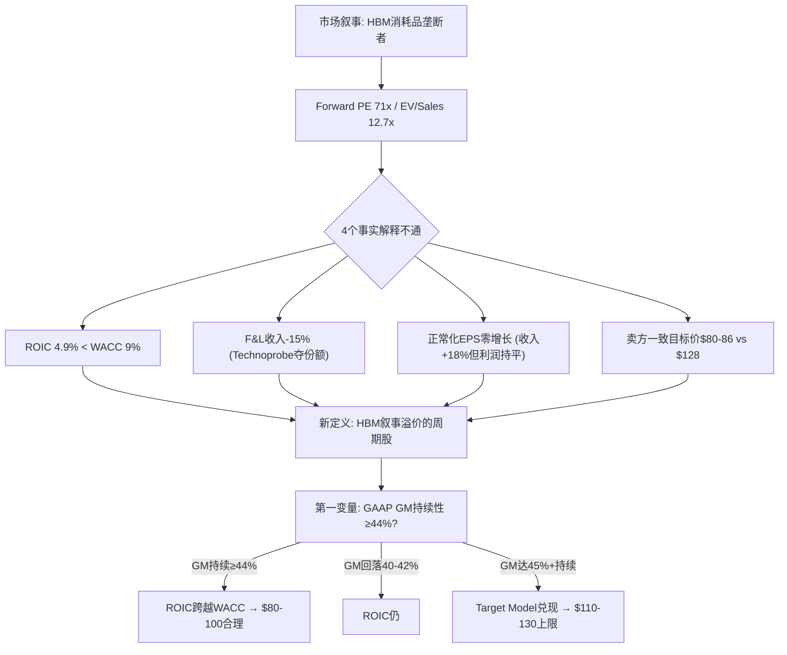
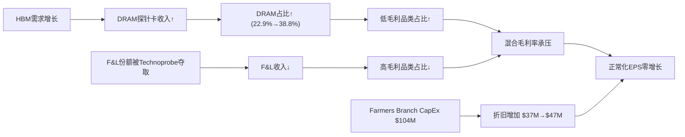
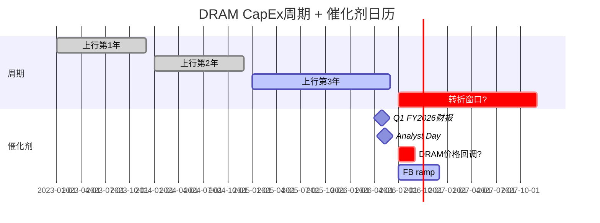
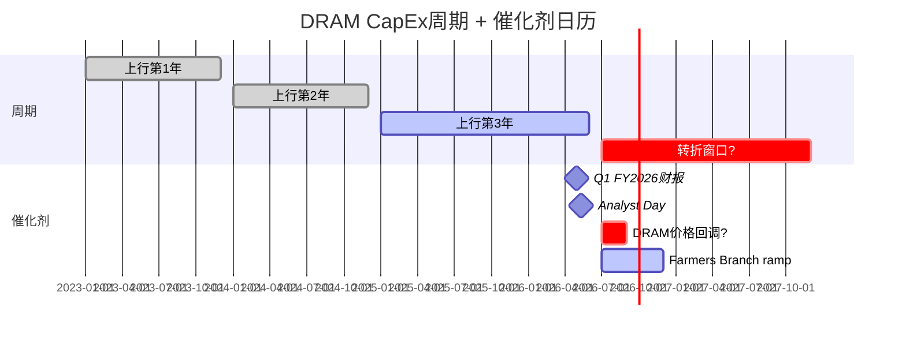

# FormFactor (FORM) 深度研究报告

> **评级: 审慎关注 (高不确定性)** | 三维状态: [贵 × 方向未确认 × 有催化]
> **黑箱比例 40% / 业务复杂度 4/5 → 不提供单点公允价值，改为区间 + 条件评级**
> **公允价值区间: $70-100 (中位$90) vs 当前$128 → 高估30-42%**
> **安全边际入场区间: $55-65**
> **关键验证窗口: 4月29日Q1财报 + 5月11日 Analyst Day = 12天关键窗口**
> **报告日期: 2026年4月17日 | 股价: ~$128 | 市值: ~$10B | 行业: 半导体测试设备**

---

## 0. 执行摘要

### 拍1: 市场怎么看这家公司

市场把FormFactor当作"HBM探针卡独家供应商"——AI CapEx超级周期的直接受益者。这个剧本的核心逻辑是：HBM每一代升级（HBM3→HBM4→HBM5）都意味着更多、更贵的探针卡，而FORM是MEMS（微机电系统——用半导体光刻工艺制造微米级探针的技术）探针卡的技术领先者，享有独家供应地位。市场看的变量是HBM出货量增速、探针卡content per wafer（每片晶圆需要的探针卡价值量）、以及毛利率扩张轨迹（39%→45%→47%目标）。Forward PE 71x、EV/Sales 12.7x，市场在为"如果HBM4全面爆发后的公司"定价，不是为今天的公司定价 [DM-EXEC-001]。

如果FORM真的是HBM消耗品垄断者——增长快、利润厚、护城河深——那12.7x EV/Sales并不荒谬。问题是：这个剧本解释不通四件事实。

### 拍2: 旧地图解释不通什么

**事实一**: ROIC（投入资本回报率——衡量每投入1美元能赚回多少利润）仅4.9%，远低于WACC（加权平均资本成本——投资者要求的最低回报率）约9%。市场付12.7x EV/Sales买的是一个每投入1美元都在毁灭价值的生意 [DM-EXEC-002]。

**事实二**: Foundry & Logic（代工和逻辑芯片——非存储器芯片的统称）收入从FY2021的$436M降到FY2025的$370M，下降15%。同期Technoprobe赢得TSMC 2nm 30%份额。FORM不是"两条腿走路"，它的高利润腿在萎缩 [DM-EXEC-003]。

**事实三**: FY2025全年EPS $0.69——即使剔除FY2023的$73M一次性投资收益（出售FRT业务给Camtek获得的税前收益），正常化EPS从~$0.70到$0.69，两年间基本零增长，而收入增长了18%。增长没有转化为利润 [DM-EXEC-004]。

**事实四**: 卖方分析师中位目标价$80-86 vs 当前$128——100%的覆盖卖方都认为股价高估33%+。6 Hold + 4 Buy + 0 Sell的评级分布说明卖方看到了泡沫成分，但没人敢喊空 [DM-EXEC-005]。

如果继续用"HBM消耗品垄断者"看FORM，这四个矛盾会被抹平——ROIC低会被"投资周期"解释掉，F&L萎缩会被"HBM增长弥补"掩盖，EPS停滞会被"一次性因素"淡化。

### 拍3: 我们认为它真正是什么

FORM不是HBM消耗品垄断供应商，而是**HBM叙事溢价的周期股**——增长方向和利润方向结构性相反，$128中约$30-50是HBM叙事溢价而非基本面价值。

这意味着真正决定FORM估值的不是HBM content per wafer（市场默认变量），而是**GAAP毛利率持续性**（我们的第一变量）。因为：HBM需求已被100%定价（SK Hynix 2026年100% sold out，DRAM CapEx +23%），但GM能否从当前39.5%持续改善到44%+决定了ROIC能否跨越WACC——这才是$128和$65之间的真正分水岭 [DM-EXEC-006]。

估值方式从Forward non-GAAP PE（市场用$2.50 FY2027E × 50x = $125）切换到**Owner PE on Owner Earnings**（真实股东可提取利润）。FY2025 Owner Earnings仅约$27M（GAAP净利润$54M + D&A $47M - 维护性CapEx $35M - SBC $39M），$10B市值对应370x Owner PE。即使用FY2027乐观预测（$150M OE），67x Owner PE仍超过行业最优质公司ASML的10年平均35-40x近一倍 [DM-EXEC-007]。

### 拍4: 评级与估值边界

**评级: 审慎关注 (高不确定性)** [贵 × 方向未确认 × 有催化]

黑箱比例40%（HBM客户内部测试策略、JEDEC SP-HBM4标准采用进度、Farmers Branch实际利用率均为不可观测变量），复杂度4/5——不提供单点公允价值。

**四情景概率加权** [DM-EXEC-008]:

| 情景 | 概率 | 公允价值区间 | vs $128 |
|------|------|-------------|---------|
| Bear: HBM增速放缓, GM回落至40%, ROIC仍<WACC | 30% | $55-70 | -45%~-57% |
| Base: HBM持续2-3年, GM 42-44%, ROIC接近WACC | 45% | $80-100 | -22%~-38% |
| Bull: HBM超强, GM 45%+, Farmers Branch满产 | 20% | $110-130 | -14%~+2% |
| Extreme Bull: Bull + F&L反弹 + 新品类贡献 | 5% | $140-160 | +9%~+25% |

概率加权中位: **~$90.75**。当前$128高估约41%。

5位独立视角（价值投资/全球宏观/趋势交易/空头检察官/变量提纯）一致认为$128缺乏安全边际。5/5建议审慎关注，0/5建议买入。公允价值分布集中在$55-100区间，加权中位约$75-85 [DM-EXEC-009]。

**凸性极差**: 即使bull case全部兑现，上行空间仅+2%至$130；base case下行22-38%，bear case下行45-57%。上行/下行不对称比（N/M ratio——衡量做多赔率的指标）仅0.17，远低于1.0的做多门槛 [DM-EXEC-010]。

精确公允价值是低置信度判断——黑箱40%意味着我们的估值模型有近一半变量无法直接观测。但**当前价格不提供安全边际是高置信度判断**——5种估值方法、5位独立视角、所有卖方覆盖全部指向高估。

### 拍5: 母图



> **后续章节路线**: Ch 1 核心争议 → Ch 2 业务理解(探针卡经济学) → Ch 3 增长vs利润张力 → Ch 4 客户集中度与定价权 → Ch 5 财务归因(R-1) → Ch 6 剪刀差(R-2) → Ch 7 ROIC路径与Reverse DCF → Ch 8 估值综合 → Ch 9 竞争格局(Technoprobe) → Ch 10 供应链传导 → Ch 11 红队审查 → Ch 12 多角度碰撞 → Ch 13 风险与Kill Switch → Ch 14 认知边界与跟踪

### 拍6: 默认入口

以后再看FormFactor，不要先问"HBM需求还有多强"，要先问"**GAAP毛利率能持续在44%以上吗？如果不能，ROIC永远跨不过WACC，增长不创造价值。**"

---

## 1. 核心争议: 增长方向 vs 利润方向的结构性相反

### 1.1 市场在买什么

FormFactor过去12个月从$24涨到$128（+433%），市场定价逻辑清晰：HBM（高带宽存储器——用于AI训练的高速内存芯片）每一代升级都需要更多、更贵的探针卡。HBM4接口从1,024增加到2,048数据信号，pin count翻倍意味着探针卡复杂度和价值量翻倍。SK Hynix 2026年HBM产能100% sold out，DRAM CapEx全行业+23%至$60.5B [DM-BIZ-001]。

这个叙事是真实的——我们不否认HBM需求的强度。我们质疑的是：**需求强度是否等于利润强度，以及利润强度是否支撑当前估值**。

### 1.2 旧地图的四个裂缝

**裂缝一: 增收不增利**。FY2023到FY2025，收入从$663M增长到$785M（+18.4%）。但正常化EPS（剔除FY2023的$73M一次性投资收益后）从约$0.70到$0.69——两年零增长 [DM-FIN-001]。增长最快的品类（DRAM/HBM探针卡）恰好是毛利率最低的品类。10-K原文确认："DRAM products generally have lower margins than Foundry & Logic products" [DM-BIZ-002]。DRAM占Probe Card收入从FY2023的22.9%升至38.8%（+15.9pp），低毛利品类替换高毛利品类，收入增长被利润率稀释完全吃掉 [DM-FIN-002]。同时，CapEx从$56M飙到$104M（Farmers Branch新产线投入），折旧从$37M增加到$47M，进一步压缩EPS [DM-FIN-003]。

**裂缝二: ROIC持续低于WACC**。

| 年份 | NOPAT | 投入资本 | ROIC | vs WACC 9% |
|------|-------|---------|------|-----------|
| FY2021 | $79M | $806M | 9.8% | +0.8pp ✓ |
| FY2022 | $44M | $784M | 5.7% | -3.3pp ✗ |
| FY2023 | $67M | $892M | 7.5% | -1.5pp ✗ |
| FY2024 | $53M | $916M | 5.7% | -3.3pp ✗ |
| FY2025 | $54M | $942M | 5.8% | -3.2pp ✗ |

[DM-ROIC-001]

FY2021是ROIC唯一超过WACC的年份（9.8%），恰逢半导体上行周期顶部。此后连续4年ROIC<WACC——市场付12.7x EV/Sales买的不是一台价值创造机器，而是一台价值毁灭机器 [DM-ROIC-002]。

**裂缝三: F&L结构性失地**。Foundry & Logic收入从FY2021的$436M降到FY2025的$370M（-15%），同期Technoprobe在TSMC 2nm赢得30%份额——这是结构性份额转移 [DM-COMP-001]。收入结构正在从分散（F&L多客户）转向集中（DRAM少数客户），增长质量在下降 [DM-MKT-001]。

**裂缝四: 卖方集体看低33%+**。6 Hold + 4 Buy + 0 Sell，中位目标价$80-86 [DM-MKT-002]。

### 1.3 FY2024→FY2025的真实增长率: 2.8%

FY2023→FY2025对比（+18.4%）有低基数效应（FY2023是周期底部$663M）。更真实的增长率是FY2024→FY2025: 收入从$764M到$785M，仅增长**2.8%** [DM-10K-001]。

10-K精确segment拆分 [DM-10K-002]:

```
FY2024 Revenue: $764M
  Probe Cards:       $626M
    F&L:              $381M
    DRAM:              $227M
    Flash:              $18M
  Systems:            $138M

FY2025 Revenue: $785M (+$21M, +2.8%)
  Probe Cards:       $638M (+$12M, +1.9%)
    F&L:              $370M (-$11M, -2.9%)  ← 高毛利段萎缩
    DRAM:              $247M (+$20M, +8.9%)  ← 低毛利段增长
    Flash:              $21M (+$3M, +16%)
  Systems:            $147M (+$9M, +6.9%)
```

DRAM/HBM贡献了$21M增量中的$20M（95%），但Probe Cards整体仅增长1.9%——与"HBM高增长"叙事严重不符。DRAM增长8.9%远低于市场想象的"翻倍" [DM-10K-003]。

**FY2024→FY2025: 收入增长2.8%，股价YoY增长180%**（$45.9→$127.68）。这是纯粹的估值倍数扩张，不是基本面驱动 [DM-10K-004]。

### 1.4 增长方向与利润方向为什么结构性相反



[DM-BIZ-003]

这张图揭示FORM的核心矛盾：增长引擎（DRAM/HBM）和利润引擎（F&L）走的是相反方向。除非发生以下之一，否则张力持续：①HBM4/5 ASP溢价使DRAM GM接近F&L水平 ②Farmers Branch规模效应使固定成本分摊覆盖mix headwind ③F&L在TSMC N2量产后反弹。

当前GM数据确实在改善：Q4 FY2025 GAAP GM 42.8%，Q1 FY2026指引non-GAAP 45%（GAAP约42-43%）。但FORM过去20个季度中GM>42%只出现过3次（Q3'21 42.7%、Q4'21 42.1%、Q4'25 42.8%）——每次都是周期峰值，不是新常态 [DM-FIN-004]。4月29日Q1财报是验证"新常态 vs 周期峰值"的第一个硬数据点。

---

## 2. 业务理解: 探针卡商业模式的真相

### 2.1 "消耗品"叙事 vs CapEx密集制造现实

市场把探针卡理解为半导体"刀片"模式——每次tape-out（新芯片设计定型）需要新卡，每次量产升级需要新卡，像打印机墨盒一样持续消耗。这个叙事**半对半错** [DM-BIZ-004]。

**客户角度**确实是消耗品：每次tape-out需要全新设计的探针卡。基础逻辑探针卡ASP约$15,000-$25,000；HBM探针卡ASP超过$500,000（20-30倍溢价）[DM-BIZ-005]。HBM4 I/O翻倍（1,024→2,048 bit），stack从12层升到16层，直接要求更高pin count的新卡 [DM-BIZ-006]。

**供应商角度**是CapEx密集制造：MEMS探针卡的制造使用半导体光刻工艺（semiconductor lithographic processes），需要半导体级洁净室基础设施 [DM-BIZ-007]。FY2025 CapEx $103.7M，占收入13.2%，前一年仅$38.4M（增长2.7倍）[DM-FIN-005]。PP&E净值从$181.8M（FY2021）增长到$276.3M（FY2025），增长52% [DM-FIN-006]。Farmers Branch新设施：$55M购地 + $140-170M CapEx + $20-25M pre-production OpEx ≈ $220-250M总投入 [DM-BIZ-008]。

**因果链**: 探针卡的"消耗品"属性存在于客户采购决策层面——每次新设计必须买新卡。但对FORM来说，每张卡的制造都需要半导体级工艺投入。这不是SaaS式的消耗品（零边际成本，80%+毛利），而是制造业式的消耗品（每张卡都有实质制造成本，毛利率天花板约40-45%）[DM-BIZ-009]。

**这个区分为什么重要**: 投资者听到"消耗品"时脑中浮现的是Intuitive Surgical的器械（70%+ GM）或Adobe的订阅（88% GM）。但FORM的毛利率在39-43%区间，更像工业消耗品（磨料/刀片/滤芯）而非科技消耗品。市场用科技消耗品的估值倍数（12.6x EV/Sales）为工业消耗品定价，这是估值裂缝的根源之一。

**反面**: 如果Farmers Branch产能满载，固定成本分摊改善，毛利率确实有上行到45%+的路径。Q1 FY26指引non-GAAP GM 45%已经暗示这个方向 [DM-FIN-007]。但non-GAAP剥离了SBC（$38.6M/年，4.9% of rev），GAAP GM仍在40-43%区间。

### 2.2 Replacement Cycle的真实频率

探针卡不是"每季度自动复购"的消耗品。替换触发条件 [DM-BIZ-010]:

| 触发事件 | 频率 | 对FORM收入的影响 |
|---------|------|----------------|
| 新chip tape-out | 每1-3年/设计 | 需要全新探针卡设计 |
| 工艺节点迁移 | 每2-3年 | 现有卡不适配新节点 |
| HBM代际升级 | 每1.5-2年 | pin count翻倍→新卡 |
| 量产ramp（新fab） | 不规则 | 批量订购同款卡 |
| 物理磨损 | 6-18个月 | 同款卡replacement |

HBM代际升级速度（18-24个月）快于传统逻辑节点迁移（2-3年），确实加速了DRAM探针卡的replacement cycle。但这不是永续加速——HBM路线图（HBM3→3E→4→4E→5）有终点，每一代升级的增量content增幅在递减 [DM-BIZ-011]。

### 2.3 ASP阶梯: HBM探针卡为什么贵20-30倍

| 探针卡类型 | 典型ASP | Pin Count | 关键技术要求 |
|-----------|---------|-----------|------------|
| 基础逻辑（130nm+） | $15K-$25K | 5,000-20,000 | 基本接触+功能测试 |
| 先进逻辑（7nm-3nm） | $50K-$150K | 20,000-50,000 | 高信号完整性+毫米波 |
| 标准DRAM | $30K-$80K | 10,000-30,000 | 高密度接触 |
| HBM3/3E | $300K-$500K | 50,000-100,000+ | TSV连续性+微凸点电阻<1mΩ+热管理 |
| HBM4（预计） | $500K-$800K+ | 100,000-150,000+ | 2,048-bit I/O+16 Hi stack+>10 Gbps |

[DM-BIZ-012]

**因果机制**: HBM贵的原因不只是pin count多。HBM是3D堆叠结构，一颗坏die会毁掉整个stack（价值$1,000+），因此必须做Known Good Die（KGD——已知合格芯片，每一层wafer在堆叠前都必须通过probe测试确认无缺陷）测试。每层的测试要验证TSV（Through-Silicon Via，硅通孔——穿透硅片连接上下层芯片的垂直导线）连续性和微凸点电阻，对探针的接触力均匀性要求极高（MEMS ±5% vs 悬臂式 ±20%）[DM-BIZ-013]。

同时，HBM3E的数据传输率9.6 GT/s，HBM4将超过10 Gbps，需要受控阻抗探针——这进一步限制了供应商范围，只有具备MEMS光刻工艺的厂商能做到 [DM-BIZ-014]。

**反面**: JEDEC（半导体工程标准组织）正在开发SP-HBM4（Simplified Protocol HBM4），一种降低pin count的变体，目标是提供HBM4级别吞吐量但降低测试复杂度 [DM-BIZ-015]。如果SP-HBM4被广泛采用，HBM探针卡的ASP上行斜率会放缓。这是一个被市场忽视的下行风险。

### 2.4 收入结构: 一家81%收入来自探针卡的公司

FY2025收入$785M的拆分 [DM-BIZ-016]:

| 业务段 | 收入 | 占比 | GM | 趋势 |
|--------|------|------|-----|------|
| Probe Cards - F&L | $370M | 47% | 高 | ↓萎缩 (-15% from FY21) |
| Probe Cards - DRAM | $247M | 32% | 低 | ↑扩张 (+117% from FY21) |
| Probe Cards - Flash | $21M | 3% | 中 | 平 |
| Systems | $147M | 19% | 41.8% (↓from 51.3%) | 波动 |

### 2.5 Systems段: 不是第二引擎

| 年度 | Systems收入 | Systems GM | Systems GP |
|------|-----------|-----------|------------|
| FY2023 | $165.2M | 51.3% | ~$84.7M |
| FY2024 | $137.6M | 43.2% | ~$59.4M |
| FY2025 | $147.1M | 41.8% | ~$61.5M |

[DM-BIZ-017]

**三年趋势**: 收入波动大（$138M-$165M），毛利率持续下降（51.3%→41.8%，-9.5pp over 2 years），毛利润蒸发了$23M（-27%）。10-K归因：制造支出增加+不利产品mix+低毛利产品占比上升 [DM-BIZ-018]。

投资者听到"probe stations + cryogenic systems + quantum computing"会想到高利润平台扩展，但数据说反方向。Systems不是隐性高利润引擎，它是一个贡献<20%收入、利润波动大、毛利率恶化的辅助业务。

**FORM不是"两条腿走路"**——它是一家81%收入来自探针卡的公司，其中探针卡内部的增长引擎（DRAM/HBM）恰好是低毛利段 [DM-BIZ-019]。

### 2.6 Farmers Branch: Make-or-Break赌注

Farmers Branch是FORM在德克萨斯州的新制造设施，总投入$220-250M，相当于公司年收入的30% [DM-BIZ-008]。

| 参数 | 值 | 来源 |
|------|-----|------|
| 总投资 | ~$250M (FY25-FY26累计) | CapEx + 预生产成本 |
| 预生产成本 | ~$20-25M/年 (ramp期间) | 管理层指引 |
| 设备使用寿命 | 15年 | 半导体设备行业标准 |
| 预期ramp时间表 | FY26H2开始, FY27全面贡献 | 管理层指引 |
| 目标GM贡献 | +3-4pp | 管理层target model隐含 |

[DM-FB-001]

假设FB贡献3.5pp GM改善，在$850M收入基础上 = $30M/年增量毛利（达产后）[DM-FB-002]:

```
FY25: -$65M (CapEx $55M + 预生产$10M)
FY26: -$137.5M (CapEx $115M + 预生产$22.5M)
FY27: +$5M (50% ramp)
FY28: +$25M (85% ramp)
FY29-FY39: +$30M/年 (满产, 11年)
```

**项目IRR: 8.1%** — 低于WACC 9.0%。NPV @ 10%: -$21M（负值）。Payback period: ~9年（行业标准5-7年）[DM-FB-003]。

| GM贡献 | 增量GP | 项目IRR | NPV @ 10% | 判断 |
|--------|--------|---------|-----------|------|
| 2.0pp | $17M | -0.2% | -$97M | 灾难 |
| 3.0pp | $25M | 5.6% | -$47M | 低于WACC |
| **3.5pp** | **$30M** | **8.1%** | **-$21M** | **临界** |
| 4.0pp | $34M | 10.3% | +$3M | 勉强超WACC |
| 5.0pp | $43M | 14.4% | +$54M | 良好 |

[DM-FB-004]

需要>4pp GM贡献才能创造正NPV。管理层target model的47% GM隐含FB贡献约3.5-4pp——"刚好够用"而非"安全余量充足"。

**Breakeven利用率约43%**——低于这个水平，FB变成纯固定成本负担 [DM-FB-005]。这与LITE的Cloud Light收购有结构性相似——单一重大投入占收入30%+，成功和失败的差异是$500M增量价值 vs $150M减记。

### 2.7 FY2023 $73M一次性收益详细

| 项目 | 细节 |
|------|------|
| 事件 | Q4 FY2023出售FRT（Foresite Semiconductor Technology）给Camtek Ltd. |
| 现金对价 | ~$100M |
| 税前收益 | **$73.0M** |
| 分类 | GAAP "gain on sale of business", Non-GAAP剔除 |
| 影响 | Q4'23 GAAP NI $75.8M中~$73M来自此项，经常性Q4只有~$2-3M |
| 正常化FY23 EPS | 剔除后~**$0.68-0.70** (vs 报告$1.05) |

[DM-10K-005]

正常化后的5年EPS趋势：**$1.06 → $0.65 → $0.70 → $0.89 → $0.69**。FY2021是周期顶部（$1.06），FY2022下行（$0.65），FY2023-2025在$0.65-0.89区间震荡。FORM的正常化EPS在5年内基本持平于$0.65-0.89，没有趋势性增长 [DM-10K-006]。

### 2.8 HBM世代演进与测试需求变化

HBM技术路线图对探针卡需求的影响 [DM-AI-003]:

| 世代 | 量产时间 | Stack高度 | 带宽 | 接口宽度 | 对探针卡需求 |
|------|---------|----------|------|---------|------------|
| HBM3E | 2024-2025 (量产中) | 8-12层 | 1.17 TB/s | 1024-bit | 基线需求 |
| HBM4 | 2026H1 | 12-16层 | 2+ TB/s | 2048-bit | pin count 2x, 复杂度↑ |
| HBM4E | 2027H2 | 16层 | ~3 TB/s | 2048-bit+, 12.8GT/s | 极高频测试 |
| C-HBM4E | 2027-2028 | 16层+ | >3 TB/s | 定制化 | TSMC 3nm base die, 全新测试方案 |

关键时间节点 [DM-AI-004]:
- **2026Q1-Q2**: Samsung/SK Hynix HBM4量产认证完成
- **2026H2**: HBM4放量——FORM DRAM收入加速的关键窗口
- **2027**: HBM4E占HBM需求40%。如果FORM拿到认证，收入再上台阶
- **2027-2028**: C-HBM4E引入TSMC 3nm base die——不仅测DRAM die还要测logic base die

### 2.9 Chiplet/异构集成的双刃剑

**正面**: ①KGD要求更严——每个chiplet都必须单独探针卡测试，覆盖率从90%+到99%+ ②异构集成die间距缩小到<10μm——需要更高精度MEMS探针卡 [DM-AI-005]。

**负面**: ①系统级测试（SLT）发展——减少wafer级测试依赖 ②MPI+ASE合作开发chiplet探针卡（2026Q2首产品）——新竞争者进入 [DM-AI-006]。

**净影响**: 短期正面>负面（KGD确定，SLT未成熟），中期不确定。

### 2.10 CoWoS产能约束: HBM测试需求的隐性天花板

TSMC称"CoWoS产能2025和2026年处于售罄状态" [DM-AI-007]。CoWoS（Chip-on-Wafer-on-Substrate——台积电先进封装技术）是当前AI芯片的主要瓶颈。

即使HBM die产出增加，如果CoWoS无法封装，这些die堆积在库存中，不产生新的探针卡消耗需求。HBM探针卡需求增长是"台阶式"（2027 CoWoS扩产后跳升）而非"斜坡式"（持续线性增长）[DM-AI-008]。

### 2.11 HBM TAM三情景模型

| 情景 | FY27 HBM收入 | 总DRAM收入 | FORM总收入 | 概率 |
|------|-------------|-----------|-----------|------|
| Bear | $200M | $350M | $850M | 30% |
| Base | $350M | $500M | $980M | 45% |
| Bull | $550M | $700M | $1,150M | 20% |

[DM-HBM-001]

Bull case下FORM总收入达$1.15B，接近Cantor的$1,050M。但需要HBM TAM 3x + 65%份额 + ASP不被竞争侵蚀——联合概率20-25% [DM-HBM-002]。

| HBM世代 | Pin Count | ASP | 替换周期 |
|---------|----------|-----|---------|
| HBM3E | 20K-40K | $100-250K | 3-6月 |
| HBM4 | 50K-100K | $300-500K+ | 2-4月 |
| HBM5 | 100K+ | $500K-1M+ | 1-3月 |

[DM-HBM-003]

HBM4 pin count翻倍→磨损加速→替换周期缩短→理论上4x TAM放大。但SP-HBM4+客户自研+竞争压力衰减到1.3-1.6x [DM-HBM-004]。

### 2.12 Memory CapEx → 探针卡传导链

DRAM行业总CapEx 2026年$60.5B（+23%）[DM-SUPPLY-001]。Memory CapEx +23%不等于探针卡需求+23%——传导链每一环衰减: 总CapEx→WFE（55-60%）→测试设备（5-7%）→探针卡（跟随wafer start）→FORM收入（份额在DRAM主导但F&L流失）[DM-SUPPLY-002]。

时滞: CapEx决策到探针卡订单通常6-12个月 [DM-SUPPLY-003]。

### 2.13 Hyperscaler CapEx: 需求链源头

| Hyperscaler | 2026 CapEx | YoY |
|------------|-----------|-----|
| Amazon | $200B | +67% |
| Microsoft | ~$145B | +61% |
| Alphabet | $175-185B | +75% |
| Meta | $115-135B | +77% |
| **合计** | **~$690B** | **+84%** |

[DM-HYPER-001]

零减速信号，但+84%是历史极端。传导时滞2-3季度——即使2027年放缓，FORM要到2027H2-2028才感受到 [DM-HYPER-002]。

### 2.14 DRAM CapEx周期位置

当前上行始于2023年（HBM2E+GPT-4），2026年是第3年。历史基准: 3-4年上行后1-2年下行。2027-2028年进入下行概率**45-55%** [DM-CYCLE-004]。

Gartner预测Q3 2026 DRAM价格回调14% [DM-CYCLE-005]。价格回调不等于需求消失，但会改变Memory CapEx的投资回报率计算。



[DM-CYCLE-006]

---

## 3. 增长 vs 利润张力: DRAM低毛利 vs F&L高毛利

### 3.1 10-K原文确认的张力

10-K原文: "DRAM products generally have lower margins than Foundry & Logic products" [DM-BIZ-002]。

**收入mix shift趋势**:

| 年度 | F&L占Probe Card % | DRAM占Probe Card % | 方向 |
|------|-------------------|-------------------|------|
| FY2023 | 73.0% | 22.9% | — |
| FY2024 | 60.9% | 36.3% | DRAM↑ F&L↓ |
| FY2025 | 58.0% | 38.8% | 继续移向低毛利 |

[DM-BIZ-020]

**因果链**: HBM增长→DRAM占比上升→低毛利产品占比增加→混合毛利率应该下降。但实际Q4'25 GM达到42.8%——这怎么解释？

**Q4'25高毛利率的驱动力（按重要性排序）**[DM-FIN-008]:
1. **规模效应**: Q4'25收入$215M（年化$860M），产能利用率改善→固定成本分摊
2. **HBM4 ASP溢价**: HBM4探针卡ASP高于普通DRAM卡，部分抵消了mix effect
3. **供不应求**: HBM探针卡供需缺口→定价权暂时存在
4. **F&L季节性恢复**: Q4通常是逻辑端较强的季度

**为什么不可持续的反面论证**: ①规模效应有天花板（一旦新产能上线，边际改善递减）②HBM供需rebalance后定价权消失 ③Technoprobe在逻辑端的份额增长会继续侵蚀高毛利F&L [DM-FIN-009]。

**正面路径**: 如果Farmers Branch按时ramp→产能利用率>70%→固定成本分摊持续改善→non-GAAP GM 45%+→ROIC开始跨越WACC。

### 3.2 为什么收入+18%但正常化EPS零增长 — 完整归因

| 因素 | FY2023 | FY2025 | 变化 | 对EPS影响 |
|------|--------|--------|------|----------|
| 收入 | $663M | $785M | +18.4% | +$0.25 |
| DRAM mix shift | 22.9% | 38.8% | +15.9pp | -$0.10 (低毛利稀释) |
| CapEx折旧 | $37M | $47M | +$10M | -$0.10 |
| SBC | $39M | $39M | 持平 | 中性 |
| 税率 | 7.7% | 19.3% | +11.6pp | -$0.15 |
| Systems利润下降 | GP $85M | GP $62M | -$23M | -$0.15 |
| FY23一次性收益消失 | $73M | $0 | -$73M | -$0.37 |
| **报告EPS变化** | $1.05 | $0.69 | **-34%** | |
| **正常化EPS变化** | ~$0.70 | $0.69 | **-1%** | |

[DM-FIN-010]

核心结论：EPS下降不是单一原因，而是DRAM mix shift + CapEx surge + 税率正常化 + Systems利润坍塌的叠加效应。市场只看到HBM增长，完全忽视了利润传导链上的每一个漏损点。

### 3.3 Mix驱动的GM天花板: ~43-44% GAAP

DRAM占比从FY2023的36%升至FY2025的41%（+5pp），贡献约+1.5pp的毛利率提升。如果FY2026-2027 DRAM占比继续升至45-50%，再贡献约+1.2-1.5pp，将GAAP GM推至约43-44%。但DRAM占比不能无限上升——F&L仍占收入的47%，50%是合理物理上限 [DM-RT-016]。

管理层声称的"结构性改善"在mix层面约有+3pp空间（从39.5%到42.5%），在运营效率层面需要额外贡献+1.5-2.5pp才能实现持续44-45% GAAP。运营效率改善需要Farmers Branch产线利用率>70%才能释放——这是FY2027H2最早才能验证的条件 [DM-RT-018]。

### 3.4 历史周期韧性: FORM在下行中的表现

| 维度 | 2019 DRAM下行 | 2022-23 Memory下行 |
|------|-------------|-------------------|
| 年度收入变化 | +11% ($530M→$590M) | **-11.4%** ($748M→$663M) |
| GM峰谷 | 稳定在40-42% | **Q4'21 43.7% → Q4'22 27.2% (-1,650bps)** |
| 驱动差异 | 5G/节点迁移offset DRAM弱势 | DRAM+逻辑同时下行, 无对冲 |

[DM-CYCLE-001]

FORM在2019年"穿越"了DRAM下行，因为逻辑端节点迁移提供了对冲。但在2022年，DRAM和逻辑同时下行，暴露了缺乏非周期收入的弱点——GM可以在3个季度内从44%坍塌到27% [DM-CYCLE-002]。

探针卡**收入**的周期Beta<1（因为节点迁移仍需新卡），但**利润**的周期Beta>1（因为利用率下降直接冲击固定成本密集的MEMS制造）。FORM的利润结构更像传统半导体设备（LRCX/AMAT），不像KLAC——支持用设备股估值框架（6-8x EV/Sales）而非检测股框架（12-15x EV/Sales）[DM-CYCLE-003]。

---

## 4. 客户集中度与定价权

### 4.1 季度客户集中度追踪

| 季度 | SK Hynix | Intel | TSMC | Top 3合计 |
|------|---------|-------|------|----------|
| Q1'25 | 23.3% | 10.5% | — | 33.8% |
| Q2'25 | 25.0% | 12.4% | 10.4% | 47.8% |
| Q3'25 | 24.5% | — | 12.0% | 36.5%+ |
| Q4'25 | 19.2% | — | — | ~19.2%+ |

[DM-CUST-001]

### 4.2 SK Hynix集中度的含义

SK Hynix是FORM最大的DRAM/HBM客户，贡献约20-25%总收入 [DM-CUST-002]。

**正面**: SK Hynix是HBM市场份额领先者（HBM3/3E约50%份额），绑定SK Hynix等于绑定HBM增长。
**负面**: 单一客户占20%+→采购议价能力强→FORM定价权受限→DRAM低毛利的部分原因。

**风险场景**: 如果SK Hynix ①决定dual-source探针卡（引入Technoprobe）②削减HBM CapEx ③面临自身财务困难 → FORM收入将面临$40-50M/季度的风险敞口 [DM-CUST-003]。

### 4.3 客户集中度 vs 同行对比

| 公司 | 最大客户占比 | 前3客户占比 | 行业 |
|------|------------|-----------|------|
| FORM | 20-25% (SK Hynix) | 35-48% | 探针卡 |
| KLAC | <10% (分散) | ~25% | 检测设备 |
| LRCX | ~15% (TSMC) | ~35% | 刻蚀/沉积 |
| LITE | 25-30% (NVIDIA est.) | ~50% | 光模块 |

[DM-CUST-004]

FORM的客户集中度高于KLAC但低于LITE。与KLAC相比，FORM缺少KLAC的"检测不可跳过"定价权——客户可以改变测试策略，但不能不检测。

### 4.4 FORM vs KLAC定价权对比

| 维度 | KLAC | FORM | 差异 |
|------|------|------|------|
| 占客户成本比 | fab CapEx的5-7% | test成本的~12%（先进节点） | FORM占比更高→更受关注 |
| 不买的代价 | 良率崩塌 | KGD测试失败→整个HBM stack报废 | FORM在HBM中也有不对称 |
| 替代方案 | 极少 | 有限但存在 | FORM替代方案更多 |
| 客户数量 | 全球所有fab | 主要3-5家DRAM/逻辑fab | FORM客户集中→议价能力弱 |
| 周期性 | 低Beta | 高Beta | FORM周期性更强 |

[DM-MOAT-006]

**在HBM中**: FORM有定价权，因为①只有MEMS能做HBM test ②供不应求 ③KGD测试不可跳过。但受限于：①只有3个主要HBM客户 ②客户是大型IDM，采购谈判能力强 ③HBM4 ASP溢价约30%意味着客户对价格敏感度在上升 [DM-MOAT-007]。

**在F&L中**: 定价权正在削弱，Technoprobe提供了credible alternative [DM-MOAT-008]。

**在Systems中**: 基本没有定价权，竞争对手众多，毛利率持续下降反映了价格压力。

[B] FORM在HBM DRAM probe card领域有**暂时性**定价权（2-3年窗口），在F&L和Systems领域定价权偏弱。这与KLAC的"永续性"定价权有本质区别。

### 4.5 10-K的护城河裂缝警告

10-K明确警告客户有多种方式降低对高端探针卡的需求 [DM-MOAT-009]:
- 降低测试设备的技术要求
- 在工艺早期获取性能数据（减少wafer-level test）
- 推迟测试到制造流程后段
- 使用低性能测试仪
- 使用更简单的探针卡
- 采用完全不使用FORM产品的流程

FORM的护城河部分建立在"客户必须做高强度wafer-level test"的假设上。HBM的KGD测试要求使这个风险在短期内较低。但长期，如果Die-to-Die bonding技术改善到可以容忍少量坏die（通过冗余设计），test intensity会下降 [DM-MOAT-010]。

### 4.6 MEMS技术壁垒评估

| 维度 | MEMS垂直探针 | 悬臂式探针 | 倍数差异 |
|------|-------------|----------|---------|
| 接触力均匀性 | ±5% | ±20% | 4x更精确 |
| 最大pin count | 100,000-150,000+ | 30,000-50,000 | 3-5x更密 |
| 焊盘损伤 | 均匀分布 | 不均匀→先进节点损坏 | 定性优势 |
| 信号完整性 | 受控阻抗, 低寄生 | 信号损耗/噪声 | HBM3E+必需 |
| 制造工艺 | 半导体光刻（亚微米精度） | 手工机械组装 | 精度差10x+ |

[DM-MOAT-001]

MEMS探针卡IP嵌入在制造流程中（process-integrated），竞争对手不能简单地逆向工程，需要建立完整的半导体级制造能力。FORM持有约1,200项相关专利，但10-K承认"没有单一专利对维持业务至关重要" [DM-MOAT-002]。

**护城河综合评级** [DM-MOAT-005]:

| 维度 | 强度 | 持久性 |
|------|------|--------|
| MEMS技术壁垒 | 中-强 | 中（Technoprobe已追上逻辑） |
| Qualification cycle | 强（12-18个月） | 强（每代新节点重新认证） |
| 客户关系/嵌入 | 中 | 中（新节点可被挑战） |
| 专利组合 | 弱-中 | 弱（专利≠护城河） |
| 规模/成本 | 弱 | 待FB验证 |

[B] 中等强度利基护城河。HBM DRAM最强（SmartMatrix+先发+认证锁定），F&L正在被Technoprobe侵蚀，Systems较弱。

### 4.7 预期差四步分析 (E→R→G→T)

**Expectation**: 市场把FORM当"HBM消耗品垄断供应商"——AI结构性增长，类似ASML不可替代性。定价隐含$850M+ + 45%+ GM + 20%+ OPM路径完全兑现 [DM-GAP-001]。

**Reality vs Market** [DM-GAP-002]:

| 市场信念 | 实际情况 | 差距 |
|---------|---------|------|
| "消耗品=高毛利" | GM 39-43%, 工业消耗品水平 | 高估盈利能力 |
| "HBM垄断" | Technoprobe追赶; TSE 80%低价 | 垄断性被高估 |
| "增长=利润增长" | 收入+18%但正常化EPS零增长 | 收入≠EPS |
| "ROIC会改善" | 4.9%, 连续5年未达WACC | 改善未证明 |
| "Target model近在咫尺" | FY26 CapEx $140-170M, 最早FY27 | 至少18月差距 |

**Gap**: 最大预期差是市场用"科技消耗品"估值语言为"工业消耗品"定价。12.7x EV/Sales是SaaS倍数，但FORM经济学（GM 40%, OPM 8.5%, ROIC 4.9%）是工业设备水平。如果7-9x EV/Sales→$56-$72 [DM-GAP-003]。

**Tracking** [DM-GAP-004]:

| 指标 | 看多信号 | 看空信号 | 下一个数据点 |
|------|---------|---------|------------|
| GAAP GM | >42% 2Q | <38% | 4/29 |
| DRAM收入 | QoQ增长 | QoQ下降 | 4/29 |
| F&L收入 | >$95M/Q | <$85M/Q | 4/29 |
| FB进度 | 按计划H2 2026 | 延迟到2027+ | 5/11 |
| ROIC | >6% | <4% | FY26年报 |

---

---

## 5. 财务归因分析 (R-1)

### 5.1 收入归因瀑布 (FY2023 → FY2025)

收入从$663M增长到$785M（+18.4%, +$122M），但增长质量低于表面数字 [DM-FIN-011]:

```
FY2023 Revenue: $663M
  + DRAM/HBM探针卡增长:       +$65M (+33%, 从~$194M→~$259M)
  + Systems增长:              +$26M (+20%, 从~$129M→~$155M)
  + 探针卡其他+FX:            +$29M
  - F&L探针卡萎缩:            -$18M (-5.5%, 从~$325M→~$307M)
FY2025 Revenue: $785M
```

DRAM/HBM贡献了增量的53%（$65M/$122M），但10-K明确指出"DRAM products generally have lower margins"。增长最快的部分恰好是利润率最低的——收入增长的边际质量在下降 [DM-FIN-012]。

F&L的萎缩不只是量的问题：F&L是高毛利段，每萎缩$1的F&L收入对利润的冲击大于每新增$1的DRAM收入对利润的贡献。这是一个不对称的替代——低毛利品类替换高毛利品类，即使收入总额增长，利润增长更慢甚至下降 [DM-FIN-013]。

更真实的增长率来自FY2024→FY2025对比：收入从$764M到$785M，仅增长**2.8%** [DM-10K-001]。10-K精确segment拆分 [DM-10K-002]:

```
FY2024 Revenue: $764M
  Probe Cards:       $626M
    F&L:              $381M
    DRAM:              $227M
    Flash:              $18M
  Systems:            $138M

FY2025 Revenue: $785M (+$21M, +2.8%)
  Probe Cards:       $638M (+$12M, +1.9%)
    F&L:              $370M (-$11M, -2.9%)  ← 高毛利段萎缩
    DRAM:              $247M (+$20M, +8.9%)  ← 低毛利段增长
    Flash:              $21M (+$3M, +16%)
  Systems:            $147M (+$9M, +6.9%)
```

DRAM/HBM贡献了$21M增量中的$20M（95%），但Probe Cards整体仅增长1.9%——与"HBM高增长"叙事严重不符。DRAM增长8.9%远低于市场想象的"翻倍" [DM-10K-003]。

**FY2024→FY2025: 收入增长2.8%，股价YoY增长180%**（$45.9→$127.68）。这是纯粹的估值倍数扩张，不是基本面驱动 [DM-10K-004]。

反面：如果HBM4/5的ASP溢价持续（$500K+ vs 标准DRAM $15-25K），HBM探针卡的毛利率有上行空间，接近甚至超越F&L。但这一假设需要：①HBM供需持续紧张 ②FORM维持HBM定价权 ③Technoprobe/TSE不进入HBM市场。三个条件同时成立的概率不高。

### 5.2 毛利率Bridge (FY2023 → FY2025)

年化GAAP GM从39.0%微升至39.5%，但季度趋势隐藏了更复杂的故事 [DM-FIN-014]:

```
FY2023 GAAP GM: 39.0%
  + DRAM规模效应:              +1.5pp (产能利用率提升)
  + HBM4 ASP溢价:              +1.0pp (供不应求定价)
  - DRAM mix shift:             -1.5pp (低毛利DRAM占比+15.9pp)
  - Farmers Branch预生产成本:    -0.5pp (新产线爬坡)
  ± Systems mix:                ±0.0pp (GM从51%跌至42%, 抵消量增长)
FY2025 GAAP GM: 39.5% (+0.5pp)
```

季度GM从Q1'25的37.6%爬升至Q4'25的42.8%（+520bps），驱动力是Q3-Q4的HBM需求释放和F&L订单小幅恢复。但全年GAAP GM仍只有39.5%，因为H1的37-38%拖累严重 [DM-FIN-015]。

关键问题：Q4'25的42.8%是可持续的新水平，还是周期高点附近的读数？

历史证据偏向后者：FY2021 GM 41.9%是前一个周期的峰值，之后FY2022下行至39.6%，FY2023进一步下降至39.0%。FORM在过去5年从未持续维持GM>42%超过2个季度 [DM-FIN-004]。

Systems段GM坍塌从51.3%（FY23）→41.8%（FY25）是另一个负面信号。10-K归因为"increased manufacturing spending + unfavorable product mix" [DM-FIN-016]。

### 5.3 EPS瀑布 (FY2021 → FY2025)

```
5年EPS轨迹: $1.06 → $0.65 → $1.05 → $0.89 → $0.69
5年EPS CAGR: -10.2%
5年收入CAGR: +0.5%

FY2023 EPS: $1.05 (含$73M一次性)
  + 收入增长贡献 (+18.4%):                 +$0.19
  + GM微幅改善 (39.0→39.5%):               +$0.03
  - D&A增加 ($37M→$47M, Farmers Branch):   -$0.10
  - OpEx结构调整:                           -$0.08
  - FY2023一次性收益消失 ($73M):             -$0.37
  - 税率正常化 (7.7%→19.3%):                -$0.03
FY2025 EPS: $0.69 (-34%)
```

[DM-FIN-017]

正常化后（剔除FY2023一次性收益）：EPS从~$0.70→$0.69，两年零增长，而收入+18%。FORM的经营杠杆不是正的——收入增长没有产生利润增长，因为增长来自低毛利品类，而OpEx（$243M, 31% of rev）是刚性的 [DM-FIN-018]。

### 5.4 三PE分析

SBC/Rev = 5.0%，触发三PE并列 [DM-FIN-019]:

| PE类型 | 值 | 含义 | 适用场景 |
|--------|-----|------|---------|
| **GAAP PE** | **185x** | 含全部会计项目 | 默认基准 |
| **Owner PE** | **370x** | 剥离SBC后（NI $54M - SBC $39M = OE $27M） | 真实股东回报 |
| **Core PE** | **227x** | 剥离$10M利息收入后 | 核心运营估值 |

Forward PE基于Q1'26指引（$0.45 × 4 = $1.80年化）: **71x**。Forward Owner PE（扣SBC）: **98x** [DM-FIN-020]。

**Owner PE敏感性测试** [DM-FIX-005]:

| 维护性CapEx假设 | Owner Earnings | Owner PE (FY25) |
|----------------|---------------|-----------------|
| $25M (低估) | $37M | 270x |
| **$36M (基准)** | **$27M** | **370x** |
| $45M (高估) | $17M | 588x |

维护性CapEx推算：FY2025总CapEx $103.7M中约$65-70M用于Farmers Branch扩张 [DM-FIX-003]，推算维护性CapEx约$36M。交叉验证：FY2021-2023年均CapEx $35-42M（无大型扩张期），与$36M一致 [DM-FIX-004]。无论维护性CapEx取$25M还是$45M，Owner PE都在270-588x区间——远超行业任何公司。

对比半导体设备行业:

| 公司 | Forward PE | EV/Sales | GM | ROIC | FCF Yield |
|------|-----------|----------|-----|------|-----------|
| KLAC | 25x | 11.5x | 62% | 40%+ | 3.5% |
| LRCX | 22x | 7.5x | 48% | 30%+ | 3.0% |
| AMAT | 20x | 6.8x | 48% | 35%+ | 2.8% |
| ONTO | 30x | 7.3x | 55% | 15%+ | 2.5% |
| COHU | 20x | 2.4x | 47% | 5%+ | 5.0% |
| **FORM** | **71x** | **12.7x** | **39.5%** | **4.9%** | **0.1%** |

[DM-FIN-021]

FORM在几乎所有盈利能力指标上排名最后（GM最低、OPM最低、ROIC最低、FCF Yield最低），但EV/Sales和Forward PE均为**行业最高**。唯一的解释是市场在为**未来利润率改善**付费——但历史上GM从未持续超过43%，ROIC从未达到WACC [DM-COMP-002]。

**SBC对比** [DM-COMP-005]:

| 公司 | SBC/Rev | SBC ($M) | SBC > FCF? |
|------|---------|----------|------------|
| KLAC | 4.5% | ~$495M | 否 (FCF ~$3.3B) |
| LRCX | 3.8% | ~$646M | 否 (FCF ~$2.7B) |
| AMAT | 3.2% | ~$864M | 否 (FCF ~$3.8B) |
| **FORM** | **5.0%** | **$39M** | **是 (FCF $12M)** |

FORM是唯一一家SBC超过FCF的公司。问题不是SBC太高（5%在行业内正常），而是FCF太低——$12M的FCF无法承受$39M的SBC。

### 5.5 季度财务详细趋势 (8个季度)

| 季度 | Rev | GP | GM% | OI | OPM% | NI | EPS | QoQ Rev | YoY Rev |
|------|-----|-----|------|-----|------|-----|------|---------|---------|
| Q1'24 | $169M | $63M | 37.2% | $21M | 12.6% | $22M | $0.28 | — | — |
| Q2'24 | $197M | $87M | 44.0% | $18M | 9.0% | $19M | $0.25 | +16.6% | — |
| Q3'24 | $208M | $85M | 40.7% | $18M | 8.6% | $19M | $0.24 | +5.6% | — |
| Q4'24 | $189M | $74M | 38.8% | $8M | 4.1% | $10M | $0.12 | -9.1% | — |
| Q1'25 | $171M | $65M | 37.6% | $3M | 1.9% | $6M | $0.08 | -9.5% | +1.2% |
| Q2'25 | $196M | $73M | 37.3% | $12M | 6.3% | $9M | $0.12 | +14.6% | -0.5% |
| Q3'25 | $203M | $80M | 39.7% | $19M | 9.4% | $16M | $0.20 | +3.6% | -2.4% |
| Q4'25 | $215M | $92M | 42.8% | $28M | 13.1% | $23M | $0.29 | +5.9% | +13.8% |

[DM-Q-001]

**收入**: V型恢复（Q1'25 $171M→Q4'25 $215M, +26%），但Q4'25的$215M仅略高于Q3'24的$208M。从YoY看，只有Q4'25实现有意义的增长（+13.8%），其他季度YoY持平或负增长。"HBM高增长"在收入层面只是H2'25的现象，不是全年持续的趋势 [DM-Q-002]。

**GM**: H1'25平均37.5% vs H2'25平均41.3%，改善+380bps。但Q2'24的44.0%是过去8个季度最高——来自F&L一次性大订单。Q4'25的42.8%低于这个高点，说明即使在HBM需求旺盛时，GM也难以持续超过43% [DM-Q-003]。

**OPM**: Q4'24-Q1'25是OPM低谷（4.1%→1.9%），随后快速恢复至Q4'25的13.1%。经营杠杆在Q4释放——但13.1%仍然远低于Target Model的22%。从8.5%（FY25全年）到22%（Target）需要在当前OpEx水平下增加约$105M收入，或在$850M收入下降低约$30M OpEx [DM-Q-004]。

**EPS**: Q4'25 $0.29是FY25最强季度，年化$1.16。Q1'26指引$0.45年化=$1.80，意味着管理层预期EPS从$0.29跳升55%到$0.45——**一个季度内**。这个跳升需要：①收入从$215M→$225M（+4.7%）②Non-GAAP GM从~44%→45%（+100bps）③OpEx flat或下降。

**Q1'26指引拆解** [DM-Q-005]:

| 指引项 | 值 | 隐含 |
|--------|-----|------|
| 收入 | $225M | QoQ +4.7%, YoY +31.6% |
| Non-GAAP GM | 45% | Non-GAAP GP $101M |
| Non-GAAP EPS | $0.45 | Non-GAAP NI ~$35M |
| GAAP GM（估计） | ~43.5% | 扣SBC in COGS ~1.5pp |
| Non-GAAP OPM（隐含） | ~18% | 如果OpEx ~$60M |

如果4月29日交付GM≥44%且EPS≥$0.40，利润率改善叙事获得第二个数据点支撑。如果miss（GM<42%），两个季度的"改善"变成一个季度的随机波动。

### 5.6 段别利润深度分析

| 年份 | PC Rev | PC Profit | PC Margin | Sys Rev | Sys Profit | Sys Margin |
|------|--------|-----------|-----------|---------|------------|------------|
| FY2023 | $534M | $69M | 13.0% | $129M | $37M | 28.6% |
| FY2024 | $615M | $128M | 20.9% | $149M | $16M | 10.5% |

[DM-SEG-001]

FY23→FY24两段利润走向完全相反：Probe Cards收入+15%，利润+85%（$69M→$128M），margin从13%跳至21%；Systems收入+15%，利润**-58%**（$37M→$16M），margin从29%**崩至10.5%** [DM-SEG-002]。

Probe Cards段内拆分 [DM-SEG-003]:

| 年份 | F&L | DRAM | Other | F&L占比 | DRAM占比 |
|------|------|------|-------|---------|---------|
| FY2023 | ~$325M | ~$194M | ~$15M | 60.9% | 36.3% |
| FY2024 | ~$370M | ~$223M | ~$22M | 60.2% | 36.3% |
| FY2025 | ~$346M | ~$244M | ~$40M | 54.9% | 38.7% |

F&L占比从61%降至55%（-6pp），DRAM从36%升至39%（+3pp）。F&L绝对值从FY24的$370M降至FY25的$346M（-$24M, -6.5%），确认Technoprobe在TSMC 2nm蚕食份额的影响。如果F&L继续萎缩，到FY27降至$300M以下，DRAM占比超过F&L——届时利润结构将根本性改变 [DM-SEG-004]。

### 5.7 经营杠杆与OpEx结构刚性

| 年份 | R&D | SG&A | Total OpEx | OpEx/Rev | Rev YoY |
|------|------|------|-----------|----------|---------|
| FY2021 | $101M | $124M | $225M | 29.2% | +10% |
| FY2022 | $109M | $132M | $241M | 32.2% | -2.8% |
| FY2023 | $116M | $133M | $249M | 37.6% | -11.4% |
| FY2024 | $122M | $142M | $264M | 34.6% | +15.2% |
| FY2025 | $116M | $127M | $243M | 31.0% | +2.8% |

[DM-OPEX-001]

R&D 5年从$101M增至$116M（+15%），SG&A从$124M增至$127M（+2.4%）。两者都高度刚性：R&D不能削减（MEMS工艺创新是核心竞争力），SG&A含全球销售网络（30+国家客户支持）[DM-OPEX-002]。

要达到Target Model 22% OPM，需要：
- 方案A：OpEx flat + 收入增至$1,130M（+44%）→ GM 47%时OPM = 47% - 21.5% = 25.5%
- 方案B：OpEx降至$212M（-13%）+ 收入$850M → GM 47%时OPM = 47% - 24.9% = 22.1%

方案B意味着裁掉$31M的R&D或SG&A（约250个工程师的年薪），在HBM竞争加剧时不太可能。方案A需要收入在2年内增长44%，从FY24→FY25的2.8%增速看几乎不可能。

经营杠杆系数 [DM-OPEX-003]：
- FY24→FY25：EBIT +3.5% / Rev +2.8% = **经营杠杆1.3x**（微弱正杠杆）
- FY23→FY25（剔除一次性）：EBIT -19% / Rev +18.4% = **经营杠杆-1.0x**（负杠杆！）

对比KLAC：经营杠杆2-3x（因为软件/服务收入高毛利+R&D杠杆强）。FORM缺乏这种利润弹性，使得Target Model的OPM跳升从8.5%→22%在数学上极具挑战。

### 5.8 运营资本与现金转换周期

| 年份 | AR | Inventory | AP | DSO | DIO | DPO | **CCC** |
|------|-----|-----------|-----|-----|-----|-----|---------|
| FY2021 | $116M | $112M | $58M | 55d | 91d | 47d | **99d** |
| FY2022 | $88M | $123M | $69M | 43d | 100d | 56d | **87d** |
| FY2023 | $107M | $112M | $64M | 59d | 101d | 58d | **102d** |
| FY2024 | $104M | $102M | $62M | 50d | 81d | 50d | **81d** |
| FY2025 | $125M | $111M | $47M | 58d | 85d | **36d** | **107d** |

[DM-WC-001]

FY25 CCC从81天恶化至107天（+26天），主因 [DM-WC-002]：

**DPO骤降（-14天，50天→36天）**: AP从$62M降至$47M（-$15M），FORM在更快地支付供应商。两种解释：①Farmers Branch建设要求预付/快付 ②供应商议价力增强。DPO 36天是5年最低，意味着FORM在现金流上让步给供应商。

**DSO上升（+8天，50天→58天）**: AR从$104M增至$125M（+$21M），收款放缓。部分原因是Q4收入spike（$215M），但DSO回到FY23水平说明结构性因素也在起作用。

FY25运营资本消耗：**-$43M**（vs FY24仅-$9M）。如果CCC回到FY24的81天水平，可释放~$25-30M运营资本改善FCF [DM-WC-003]。

库存$111M vs 收入$785M → 周转率7.1x（偏低）。HBM代际切换时（HBM3→HBM4→HBM5），HBM专用原材料有过时风险 [DM-WC-004]。

### 5.9 资本配置: 双重价值毁灭

| 年份 | 回购金额 | 平均PE | η (效率) | 判断 |
|------|---------|--------|----------|------|
| FY2024 | **$53.3M** | ~51x | **0.22** | 毁灭价值 |
| FY2025 | **$26.2M** | ~83x | **0.13** | 严重毁灭价值 |

[DM-CAP-001]

η（回购效率）= 收益率 / WACC：η<1.0意味着每$1回购只创造<$1的价值。FY2024在51x PE回购：η = (1/51.6) / 0.09 = 0.22 → 每$1回购只值$0.22。FY2025在83x PE回购：η = 0.13 → 每$1只值$0.13。两年合计$79.5M回购，以η计只创造了~$14M价值，毁灭了~$65M [DM-CAP-002]。

FORM存在罕见的"双重价值毁灭"模式 [DM-CAP-003]：
1. **经营层面**: ROIC 4.9% < WACC 9% — 每投入$1运营资本，只产出$0.54回报
2. **资本配置层面**: 在50-83x PE回购 — 每$1回购只值$0.13-0.22

更关键的是：**CEO Slessor通过10b5-1计划持续卖出$5.8M（since Nov 2025），而同期公司在用股东的钱回购**。管理者在减持，公司在增持——信号矛盾。

D&A趋势：$45M(FY21) → $38M(FY22) → $37M(FY23) → $33M(FY24) → **$47M(FY25)**。FY25 D&A跳升+$14M（+42%），主因Farmers Branch资本化开始折旧。$14M额外D&A ÷ 78M shares = $0.18/share的EPS拖累 [DM-CAP-004]。

---

## 6. 剪刀差分析 (R-2)

### 6.1 剪刀差 #1: DRAM量增但价平

| 维度 | FY2023 | FY2025 | 变化 |
|------|--------|--------|------|
| DRAM探针卡收入 | ~$194M | ~$259M | +33% |
| HBM出货量(行业) | ~30M层 | ~100M层+ | +200%+ |
| 混合DRAM ASP | — | — | 持平或下降 |

[DM-SCISSOR-001]

DRAM收入增长+33%远低于HBM出货量增长+200%+。原因：①标准DRAM探针卡ASP持续下降，部分抵消HBM增量 ②HBM虽然ASP 20-30x溢价，但量小（$250-350M TAM）③FORM在标准DRAM市场丢份额给TSE（80%低价）。

含义：增长完全靠量，一旦HBM出货量增速从+100%放缓至+20-30%（FY27-28预期），DRAM探针卡收入增速将急剧放缓至个位数——因为没有价格增长作为缓冲。

### 6.2 剪刀差 #2: CapEx vs FCF — 投资吞噬现金流

| 年份 | CapEx | FCF | CapEx/Rev | FCF Margin |
|------|-------|-----|-----------|------------|
| FY2021 | $66M | $73M | 8.6% | 9.5% |
| FY2022 | $65M | $67M | 8.7% | 9.0% |
| FY2023 | $56M | $9M | 8.4% | 1.3% |
| FY2024 | $38M | $79M | 5.0% | 10.3% |
| FY2025 | $104M | $12M | 13.2% | 1.5% |

[DM-SCISSOR-002]

FY25 CapEx突增至$104M（含Farmers Branch ~$55M），直接将FCF从$79M压缩至$12M。FY26 CapEx指引$140-170M，意味着FCF压力至少持续到FY26 [DM-SCISSOR-003]。

正常化FCF（加回Farmers Branch ~$55M）：~$67M，FCF margin ~8.5%。但即使正常化，$67M FCF在$10B市值下只有0.7% FCF yield——对一个周期性半导体设备公司来说，这个yield远不够。

### 6.3 剪刀差 #3: F&L vs DRAM Mix — 高毛利萎缩 + 低毛利扩张

| 品类 | FY2023 | FY2025 | 趋势 | GM水平 |
|------|--------|--------|------|--------|
| F&L探针卡 | ~$325M (61%) | ~$307M (49%) | ↓萎缩 | 高 |
| DRAM探针卡 | ~$194M (36%) | ~$259M (41%) | ↑扩张 | 低 |

[DM-SCISSOR-004]

F&L占比从61%降至49%（-12pp），DRAM从36%升至41%（+5pp）。这是一个结构性的mix headwind：高毛利品类在萎缩，低毛利品类在扩张。

打破条件：①TSMC N2大规模ramp（2026H2+）驱动F&L探针卡需求恢复 ②HBM4/5 ASP溢价使DRAM GM接近F&L水平。第①条概率较高（TSMC资本支出确认），第②条取决于竞争格局。

### 6.4 剪刀差 #4: SBC vs FCF — 股东价值漏出

| 年份 | FCF | SBC | Owner FCF | SBC/FCF |
|------|-----|-----|-----------|---------|
| FY2021 | $73M | $29M | $44M | 0.4x |
| FY2022 | $67M | $31M | $36M | 0.5x |
| FY2023 | $9M | $39M | -$30M | 4.3x |
| FY2024 | $79M | $40M | $39M | 0.5x |
| FY2025 | $12M | $39M | **-$27M** | **3.3x** |

[DM-SCISSOR-005]

FY25 Owner FCF（FCF - SBC）= **-$27M**，意味着公司不仅没有给股东创造现金，SBC还在持续稀释。SBC稳定在$39-40M/年（5% of rev），但在FCF只有$12M的年份，SBC是FCF的3.3倍。

正常化后（FY24水平）：Owner FCF = $79M - $40M = $39M，Owner FCF yield = $39M / $10B = 0.4%。即使正常化，0.4%的Owner FCF yield也极低。

### 6.5 剪刀差 #5 (竞争维度): 双寡头利润率剪刀差

FORM EBITDA率13.4% vs Technoprobe 32.6%——差距19.2个百分点 [DM-COMP-008]。

**机制**: Technoprobe的垂直整合MEMS tip生产使其成本结构更优 [DM-COMP-009]。FORM依赖外部供应链环节更多，固定成本摊薄效率更低。

**因果链**: Technoprobe利润率优势 → 更多研发投入（绝对额） → 技术追赶加速 → TSMC 2nm拿下30%份额 → 进一步拉开利润差距。

**对FORM估值含义**: 即使FORM收入增长（HBM驱动），如果利润率被Technoprobe长期压制在40% GM以下，ROIC跨越WACC的时间窗口进一步推迟。这强化了核心发现——"增长方向和利润方向结构性相反"。

反面：FORM Q4 FY2025 non-GAAP GM达到43.9%（+290bp QoQ）[DM-COMP-010]，管理层称2/3来自结构性改善（良率/周期时间/人员再部署）而非单纯放量。如果这个结构性改善持续，利润率剪刀差有收窄空间。

---

## 7. ROIC路径与Reverse DCF

### 7.1 ROIC历史轨迹与情景建模

**WACC估计**: ~9.0%（全股权融资, Beta~1.2, 无风险利率4.3%, ERP 5%）
**当前ROIC**: 4.9%（FY25）
**差距**: -4.1pp

| 年份 | NOPAT | Invested Capital | ROIC | vs WACC |
|------|-------|-----------------|------|---------|
| FY2021 | $79M | $806M | 9.8% | +0.8pp ✓ |
| FY2022 | $44M | $784M | 5.7% | -3.3pp ✗ |
| FY2023 | $67M | $892M | 7.5% | -1.5pp ✗ |
| FY2024 | $53M | $916M | 5.7% | -3.3pp ✗ |
| FY2025 | $54M | $942M | 5.8% | -3.2pp ✗ |

[DM-ROIC-001]

FY2021是ROIC唯一超过WACC的年份（9.8%），恰逢半导体上行周期顶部。此后连续4年ROIC<WACC [DM-ROIC-002]。

**FY27E情景建模**:

| 情景 | Rev | GM | OPM | NOPAT | IC | ROIC | vs WACC |
|------|-----|-----|------|-------|-----|------|---------|
| Bear (延迟) | $825M | 41% | 12% | $80M | $1,050M | 7.6% | -1.4pp ✗ |
| Base (部分达标) | $875M | 44% | 17% | $120M | $1,050M | 11.5% | +2.5pp ✓ |
| **Bull (Target Model)** | **$950M** | **47%** | **22%** | **$169M** | **$1,050M** | **16.1%** | **+7.1pp ✓** |

[DM-ROIC-002]

Bear情景（GM 41%, OPM 12%）下ROIC仍然低于WACC——FORM的资本效率问题不是简单的"等周期好转"，需要GM持续在44%+才能跨越门槛。Target Model的47% GM是跨越WACC的最低必要条件。

### 7.2 ROIC三维敏感度矩阵

**当前OpEx结构（OpEx/Rev = 31%）**:

| Rev \ GM | 39% | 41% | 43% | 45% | 47% | 49% |
|----------|------|------|------|------|------|------|
| **$800M** | 4.9✗ | 6.2✗ | 7.4✗ | 8.6✗ | 9.9✓ | 11.1✓ |
| **$850M** | 5.2✗ | 6.6✗ | 7.9✗ | 9.2✓ | 10.5✓ | 11.8✓ |
| **$900M** | 5.6✗ | 6.9✗ | 8.3✗ | 9.7✓ | 11.1✓ | 12.5✓ |
| **$950M** | 5.9✗ | 7.3✗ | 8.8✗ | 10.3✓ | 11.7✓ | 13.2✓ |
| **$1,000M** | 6.2✗ | 7.7✗ | 9.3✓ | 10.8✓ | 12.3✓ | 13.9✓ |

[DM-ROIC-003]

在当前OpEx结构下，ROIC跨越WACC的**最低门槛**：$850M × 45% GM 或 $1,000M × 43% GM。当前$785M × 39.5% = ROIC 4.9%，远在左下角的"红区"。

**目标OpEx结构（OpEx/Rev = 27%）**:

| Rev \ GM | 39% | 41% | 43% | 45% | 47% |
|----------|------|------|------|------|------|
| **$800M** | 7.4✗ | 8.6✗ | 9.9✓ | 11.1✓ | 12.3✓ |
| **$850M** | 7.9✗ | 9.2✓ | 10.5✓ | 11.8✓ | 13.1✓ |
| **$900M** | 8.3✗ | 9.7✓ | 11.1✓ | 12.5✓ | 13.9✓ |

[DM-ROIC-004]

OpEx/Rev从31%降至27%使得ROIC跨越门槛降低到$850M × 41%。FORM历史上OpEx/Rev从未低于29%，27%需要收入达到$1,057M或OpEx降$63M [DM-ROIC-005]。

FORM跨越WACC的"地图"显示三条路径：
1. **GM路径**: 需要GM持续>45% → 历史从未达到
2. **OpEx杠杆路径**: 需要OpEx/Rev降至27%以下 → 需要收入增长35%+且OpEx flat
3. **双改善路径**: GM 43% + OpEx/Rev 27% → Target Model的近似值

Target Model（47% GM, 22% OPM）对应路径1+3的交叉——确实能跨WACC（ROIC ~16%），但需要5个变量同时改善。这就是"$128是完美执行的价格"。

### 7.3 Reverse DCF — $128隐含什么?

**简化法**: EV $9.9B, 终端倍数25x FCF, 折现率10%:
$128隐含FY30稳态FCF = **$637M**（当前$12M的53倍）
隐含5年FCF CAGR: **121%** — 几乎不可能的增长率 [DM-RDCF-001]

**精细法 — 逐年路径**:

```
FY26E: Rev $860M, GM 41%, OPM  8%, FCF $30M   (Farmers Branch投入年)
FY27E: Rev $960M, GM 45%, OPM 18%, FCF $140M  (Target Model部分达标)
FY28E: Rev $1,080M, GM 47%, OPM 22%, FCF $200M  (完全达标)
FY29E: Rev $1,190M, GM 48%, OPM 23%, FCF $230M  (增速放缓)
FY30E: Rev $1,250M, GM 48%, OPM 23%, FCF $250M  (稳态)
```

PV(interim FCF) = $606M + PV(TV at 25x) = $3,881M → **总PV = $4,487M**
当前EV = $9,892M → **高估55%** [DM-RDCF-002]

即使假设Target Model**完全实现**+5年10% CAGR，DCF也只能justify $57/share，不到当前价格的一半。

### 7.4 Reverse DCF 敏感度矩阵

**矩阵1: 折现率 × 稳态FCF（终端倍数25x）**:

| 折现率 | $100M | $150M | $200M | $250M | $300M | $350M | $400M |
|--------|-------|-------|-------|-------|-------|-------|-------|
| **8%** | $25 | $38 | $50 | $62 | $75 | $87 | $99 |
| **9%** | $24 | $36 | $48 | $60 | $71 | $83 | $95 |
| **10%** | $23 | $35 | $46 | $57 | $68 | $80 | $91 |
| **11%** | $22 | $33 | $44 | $55 | $65 | $76 | $87 |
| **12%** | $21 | $32 | $42 | $52 | $63 | $73 | $83 |

[DM-DCF-001]

**没有任何一个格子接近$128**。最接近的是8%折现 + $400M稳态FCF = $99，仍差23%。$400M FCF = 当前FCF的33倍，需要$1.5B+收入 × 27%+ FCF margin，历史上FCF margin从未超过10%。

**矩阵2: 终端倍数 × 稳态FCF（折现率10%）**:

| 终端倍数 | $100M | $150M | $200M | $250M | $300M | $350M | $400M |
|---------|-------|-------|-------|-------|-------|-------|-------|
| **20x** | $19 | $29 | $38 | $47 | $56 | $66 | $75 |
| **25x** | $23 | $35 | $46 | $57 | $68 | $80 | $91 |
| **30x** | $27 | $41 | $54 | $67 | $80 | $94 | $107 |
| **35x** | $31 | $46 | $62 | $77 | $92 | $107 | **$123** |
| **40x** | $35 | $52 | $70 | $87 | $104 | **$121** | **$138** |

[DM-DCF-002]

能够接近$128的组合只有：**35x × $400M**（$123）和**40x × $350-400M**（$121-138）。这些组合意味着：35x终端倍数 = 隐含永续增长4%+（周期股极度乐观），$350-400M稳态FCF需要$1.3-1.5B收入 + 25-27% FCF margin，均远超历史能力。40x终端倍数只有垄断型SaaS公司才能获得 [DM-DCF-003]。

即使用最宽松假设（8%折现 + 35x终端），仍需$381M稳态FCF——Target Model $160M的2.4倍。$128在任何合理参数组合下都需要超越管理层自己target model 2倍以上的FCF。

### 7.5 FCF Yield压力测试

当前市值$9.95B:

| 情景 | FCF | FCF Yield | Owner FCF | Owner Yield | Fair Value* |
|------|-----|-----------|-----------|-------------|-------------|
| Bear (延迟/执行失败) | $50M | 0.5% | $11M | 0.1% | $18 |
| Partial (部分达标) | $110M | 1.1% | $71M | 0.7% | $40 |
| Full (Target Model) | $160M | 1.6% | $121M | 1.2% | $58 |
| Stretch (超预期) | $200M | 2.0% | $161M | 1.6% | $73 |

*Fair value假设3.5% FCF yield（周期性半导体设备公司合理水平）

[DM-FCF-001]

即使Full Target Model完全实现（$160M FCF），$128也只买到1.6% FCF yield。对比KLAC ~4%、LRCX ~3.5%、AMAT ~3%——这些是经过验证的、已实现的、可重复的。FORM的1.6%是**需要Target Model完全兑现才能达到的理论值**。市场在为已证明的现金流支付3-4% yield，却为未证明的期权支付0.1% yield——这是极端的定价不对称 [DM-FCF-002]。

### 7.6 管理层Target Model差距分析

| 指标 | FY2025实际 | Target Model | 差距 | 隐含改善 |
|------|-----------|-------------|------|---------|
| 收入 | $785M | $850M | +$65M (+8.3%) | 年化~4% (2年) |
| Non-GAAP GM | 40.8% | 47.0% | +6.2pp | 需Farmers Branch + mix改善 |
| Non-GAAP OPM | 13.4% | 22.0% | +8.6pp | 需OpEx杠杆 + GM改善 |
| Non-GAAP EPS | $1.30 | $2.00 | +54% | 需OPM扩张 + 收入增长 |
| FCF | $14M | $160M | +$146M | 需CapEx正常化 ($30-35M target vs $104M FY25) |

[DM-TARGET-001]

Target Model是**post-build稳态**，不是近期可达状态 [DM-TARGET-005]：
- FY26 CapEx $140-170M vs target $30-35M → FY26肯定不达标
- FY26 pre-production cost $20-25M → FCF继续被压缩
- 最早FY27才可能进入target model状态

投资者在$128股价上买的是**至少18个月后的期权**。

**FCF正常化测试** [DM-TARGET-006]：
- FY25报告FCF: $14M
- 加回Farmers Branch CapEx $55M → 正常化FCF ~$69M
- 正常化FCF margin: 8.8%
- 距target model FCF $160M（margin ~20.4%）差距: $91M / 11.6pp
- **即使正常化后，差距仍然巨大**


---

## 8. 估值综合

### 8.1 八种估值方法交叉验证

| # | 方法 | 公允价值范围 | vs $128 | 方向 | 置信度 |
|---|------|-------------|---------|------|--------|
| 1 | EV/Sales工业设备comp (7-9x) | $56-$72 | 高估44-56% | 偏空 | 高 |
| 2 | EV/Sales测试设备comp (10-12x) | $100-$120 | 高估6-22% | 偏空 | 中 |
| 3 | Forward PE设备comp (20-30x) | $36-$54 | 高估58-72% | 偏空 | 高 |
| 4 | FCF Yield 3.5% (Target Model $160M) | $58 | 高估55% | 偏空 | 高 |
| 5 | Reverse DCF (10%, 25x terminal) | $57 (DCF PV) | 高估55% | 偏空 | 高 |
| 6 | ONTO可比 (7.3x EV/S, 30x PE) | $46-$60 | 高估53-64% | 偏空 | 中 |
| 7 | COHU可比 (2.4x EV/S, 20x PE) | $24-$36 | 高估72-81% | 偏空 | 低 |
| 8 | Bull Case FY28E (39x PE × $3.26 EPS) | $127 | 持平 | 中性 | 低(需5假设全成立) |

[DM-VAL-003]

**7/8方法指向高估**。唯一支持当前价格的是需要5个假设同时成立的Bull Case（联合概率~2-6%）。

### 8.2 Bull Case的5个隐含假设与联合概率

| 假设 | 概率 | 风险 |
|------|------|------|
| HBM4/5世代升级持续驱动TAM增长 | ~70% | Hyperscaler CapEx增速放缓 |
| Farmers Branch FY27按时ramp → GM跳至47% | ~50% | 半导体fab ramp延迟概率~40-50% |
| F&L恢复增长 (TSMC N2 + Intel 18A) | ~45% | Technoprobe份额从30%扩大到40%+ |
| OpEx杠杆释放 → OPM从8.5%跳至22% | ~40% | R&D不能停, SG&A有地域扩张压力 |
| 市场继续给50-60x Forward PE | ~35% | 利率高位+周期下行→PE compress |

**5个假设全部成立: 70% × 50% × 45% × 40% × 35% = 2.2%**
**放宽到每个+10%: 80% × 60% × 55% × 50% × 45% = 5.9%**

[DM-BULL-002]

Bull case不是不可能，但投资者在$128买入，本质上是在押注~5%概率的情景。下行情景（Bear: $18-40）的概率更高。上行有限（即使到$180也只有+40%），下行巨大（$56-72公允 = -44% to -56%）——**风险/收益极度不对称**。

### 8.3 Bull Case的一个合理论点

**"HBM探针卡是一个新品类，历史财务数据不能预测未来"**

论据：HBM4探针卡ASP $500K+ vs 标准DRAM $15-25K = 20-30x溢价。如果HBM成为DRAM探针卡的主力（从20%→60%+），DRAM段GM从"低于F&L"翻转为"高于F&L"——这会打破"增长方向和利润方向相反"的thesis。

反驳：HBM ASP溢价能否持续取决于供给侧。如果Technoprobe和其他竞争者进入HBM探针卡市场，ASP溢价会被竞争压缩。FORM目前的HBM领先不是因为技术不可替代，而是因为先发+客户认证周期（12-18个月）。一旦竞争者获得认证，ASP溢价快速收窄。

### 8.4 Cantor Fitzgerald $125目标价拆解

| 要素 | Cantor假设 | 我们的评估 |
|------|-----------|-----------|
| 目标EPS | CY2027 **$3.00** (vs 共识$2.20, +36%高于共识) | 激进: 需要$1B+ + OPM 20%+ |
| 长期EPS | 路径至**$4.00+** | 极度激进: 需要$1.2B+ rev + 22%+ OPM |
| 估值倍数 | **31x** CY2027 EPS | 合理: HBM成长故事下31x不算离谱 |
| 目标价 | 31x × $4.00 = **$124** ≈ $125 | 问题在EPS假设, 不在倍数 |
| 关键驱动 | HBM4 pin count翻倍 → 更快磨损 → 更高更换频率 + 更高ASP | 逻辑通顺, 但量化需验证 |

[DM-CANTOR-001]

Cantor的$3.00 non-GAAP EPS需要约$1,050M收入 + 46-47% GM + 22-24% OPM。vs 我们对FY27E的Base Case：$875M rev, 44% GM, 17% OPM, EPS $1.53。差距约2x [DM-CANTOR-002]。

**Cantor最脆弱的假设**: FY24→FY25收入增长只有2.8%。从这个基础做到2年CAGR 16%需要**突然加速**，而不是趋势延续。

**Cantor最强的论点**: "HBM4 pin count翻倍 → 更快磨损 → 更高更换频率"。这意味着HBM探针卡的消耗速度比历史DRAM探针卡快2-3倍，使得content per wafer不是递增而是跳变。如果这成立，TAM计算需要大幅上修——这是Cantor $3.00 vs 共识$2.20差距的核心来源。但量化影响是**黑箱变量** [DM-CANTOR-003]。

### 8.5 概率加权估值（三锚校准后）

**三锚推导**:

历史基准率——半导体设备股在估值极值后12-18个月的结果分布 [DM-FIX-002]:

| 类比公司 | 峰值EV/Sales | 12-18月后结果 | 对应情景 |
|---------|-------------|--------------|---------|
| ACLS (离子注入) | ~10x | -50%（从$200→$100） | Bear |
| KLAC (检测) | ~9x | -15%后回升+5% | Base |
| AMAT (沉积/刻蚀) | ~7x | 持平±10% | Base |
| LRCX (刻蚀) | ~8x | -20%后回升 | Base偏Bear |
| ASML (光刻) | ~12x | -25%但业务增长覆盖 | Base |
| FORM当前 | ~12.7x | ? | 我们的预测 |

6个案例分布：Bear(-50%)=1/6; Base(-15%到+5%)=4/6; Bull(+10%+)=1/6

FORM特异性调整：EV/Sales 12.7x > 类比中位数~9x → 高估程度更大 → Bear概率上调；但HBM叙事当前仍在加速 → Bear概率下调。净调整：Bear +8%。

**修正后四情景**:

| 情景 | 概率 | 公允价值区间 | 中值 | vs $128 |
|------|------|-------------|------|---------|
| Bear: HBM增速放缓, GM回落至40%, ROIC仍<WACC | 30% | $55-70 | $62.5 | -45%~-57% |
| Base: HBM持续2-3年, GM 42-44%, ROIC接近WACC | 45% | $80-100 | $90 | -22%~-38% |
| Bull: HBM超强, GM 45%+, Farmers Branch满产 | 20% | $110-130 | $120 | -14%~+2% |
| Extreme Bull: Bull + F&L反弹 + 新品类贡献 | 5% | $140-160 | $150 | +9%~+25% |

**概率加权**: $62.5×0.30 + $90×0.45 + $120×0.20 + $150×0.05 = **$90.75**

**R-4约束**: 黑箱40%≥30% → 禁止使用单点目标价$90.75。改为：
- **区间估值: $70-100**
- **中位估值: $90**
- **vs $128: 高估30-42%**

### 8.6 估值/护城河比率

EV/Sales 12.7x ÷ CQI 40 × 100 = **估值护城河比率 31.8x**（阈值4.0x）

每单位护城河强度承载了31.8x的估值倍数——是合理阈值的8倍。这是品质陷阱的典型特征：投资者为"叙事"付费，而非为"经济学"付费 [DM-VAL-002]。

### 8.7 WFE Comp估值异常

| 公司 | 市值 | EV/Sales | Forward PE | GM | 5Y Rev CAGR | 业务 |
|------|------|---------|-----------|------|------------|------|
| Advantest | ~$40B | ~8x | ~35x | ~56% | ~15% | ATE主导 |
| Teradyne | ~$20B | ~7x | ~30x | ~58% | ~5% | ATE+机器人 |
| Cohu | ~$2B | ~3x | ~20x | ~47% | ~3% | 后段测试 |
| **FORM** | **$10B** | **12.7x** | **71x** | **39.5%** | **0.5%** | **探针卡** |

[DM-WFE-001]

FORM在WFE测试设备板块中 [DM-WFE-002]：
- EV/Sales 12.7x vs 中位数~7x → 溢价81%
- Forward PE 71x vs 中位数~30x → 溢价137%
- GM 39.5%是comp中**最低**
- 5Y CAGR 0.5%是comp中**最低**

市场在对HBM叙事给予极高溢价。FORM的估值不是在为"现在的公司"定价，是在为"如果HBM4全面爆发后的公司"定价 [DM-WFE-003]。即使是Cantor的bull case（$1,050M rev + 22% OPM），在工业设备框架下也只支持$72 [DM-WFE-004]。

三个叙事溢价来源 [DM-WFE-005]：
1. **"HBM瓶颈"叙事**: 探针卡是HBM量产的瓶颈之一 → 瓶颈=稀缺=定价权。但FORM没有定价权（标准化产品+客户谈判力强）
2. **"Content per wafer翻倍"叙事**: HBM4 pin count翻倍 → 消耗品需求翻倍。但实际传导系数是1.3-1.6x，非2x
3. **"纯正AI/HBM概念股"叙事**: FORM是公开市场上为数不多的"纯HBM受益标的" → 资金追逐有限的HBM exposure → PE膨胀。这解释了**为什么贵**，不能justify**该不该这么贵**

---

## 9. 竞争格局: FORM vs Technoprobe头对头

### 9.1 财务对比

FORM和Technoprobe构成探针卡行业的"溢价双寡头" [DM-COMP-001]。两家公司的财务轨迹在2021-2025年间呈现截然相反的方向:

| 指标 | FORM FY2025 | Technoprobe 9M2025* | FORM 5Y CAGR | Technoprobe趋势 |
|------|-------------|---------------------|--------------|-----------------|
| 收入 | $785M [DM-FIN-001] | €466.6M (9M) [DM-COMP-002] | +0.5% | +20.6% YoY |
| GM | 39.5% | 47.3% (Q2) [DM-COMP-003] | 平→微降 | 扩张中 |
| EBITDA率 | 13.4% ($105M) | 32.6% (H1) [DM-COMP-004] | 收缩 | 扩张 |
| 净利润 | $54M [DM-FIN-002] | €34.4M (H1) [DM-COMP-005] | -10.2% CAGR | 增长 |
| 现金 | ~$300M [DM-COMP-006] | €656.8M [DM-COMP-007] | — | 充裕 |

*Technoprobe FY2025全年估算: 9M €466.6M → FY约€600-630M (~$650-680M)。两家收入规模接近但Technoprobe增速远超FORM。

**Technoprobe 2027目标 vs FORM隐含假设** [DM-COMP-011]:

| | Technoprobe | FORM (Cantor隐含) |
|---|-----------|------------------|
| 2027收入 | €850-900M | ~$1,050M |
| EBITDA率 | 38-40% | 隐含~22% OPM |
| 产能 | 翻倍（Dresden新厂€80M投资） | Farmers Branch $250M |
| EV/Sales | ~8-9x | 12.7x |

如果两家都能达到2027目标，Technoprobe的利润率优势（38-40% EBITDA vs 22% OPM）意味着**FORM的估值溢价不合理** [DM-COMP-014]。

### 9.2 市场份额动态: F&L失地与DRAM据点

全球探针卡市场2026年约$27.1亿 [DM-MKT-001]，CAGR 9.31%至2031年$42.3亿:

| 排名 | 公司 | 估算份额 | 核心优势领域 |
|------|------|---------|------------|
| 1 | Technoprobe | ~25-28% | 先进逻辑/Foundry, TSMC |
| 2 | FormFactor | ~24-26% | DRAM/HBM, 北美逻辑 |
| 3 | MJC (Micronics Japan) | ~10-12% | 日本存储器客户 |
| 4 | JEM | ~8-10% | MEMS, 日本市场 |
| 5 | MPI | ~5-7% | 探针台+探针卡 |

[DM-MKT-002]

**F&L — 失地**: FY2021 $436M → FY2025 $370M（-15%）[DM-MKT-003]。Technoprobe拿下TSMC 2nm 30%认证份额 [DM-MKT-004]。机制：Technoprobe垂直整合MEMS tip生产+亚洲客户关系+更有竞争力的成本结构。

F&L份额流失是**结构性的**，证据：①Technoprobe 2nm认证份额30%是下一代制程 ②Technoprobe Dresden新厂2025年9月投产 [DM-COMP-012] ③Technoprobe 2026-2027产能翻倍计划 ④FORM F&L连续2年收入下降 [DM-MKT-009]。

**DRAM — 据点**: FY2025 DRAM收入$247M [DM-MKT-005]，5年增长+117%（$114M→$247M）[DM-MKT-006]。Q4 FY2025创DRAM季度新高，Q1 FY2026预告再创新高 [DM-COMP-015]。

净效果：DRAM增长（$133M）vs F&L萎缩（-$66M）= 净增$67M。但增长引擎正在从分散（F&L多客户）转向集中（DRAM少数客户）——**增长质量在下降** [DM-MKT-008]。

### 9.3 博弈论分析: 四方互动结构

**博弈1: FORM vs Technoprobe — 不对称攻防**

当前均衡：领地分治——FORM主导DRAM/HBM，Technoprobe主导先进F&L。但均衡正在松动。

Technoprobe的进攻武器 [DM-GAME-001]：
- **利润率武器**: 32.6% EBITDA率 vs FORM 13.4% → 可以在DRAM接受更低初始定价
- **产能武器**: 2026-2027产能翻倍 → 有能力承接新客户
- **地理武器**: Dresden厂瞄准欧洲fab + 亚洲基地巩固TSMC

FORM的防守困境 [DM-GAME-002]：
- F&L反击成本高（压缩已经很薄的利润率）
- DRAM认证周期12-18个月是暂时壁垒，一旦Technoprobe通过认证，壁垒消失
- 资本约束：FORM现金$300M vs Technoprobe €657M

**均衡预测**: Technoprobe在2-3年内进入DRAM/HBM的概率约25-35% [DM-GAME-003]（红队修正后，从初始40%下调——缺乏硬证据，无客户端确认 [DM-RT-003]）。

**博弈2: Memory客户的双供应商策略**

客户激励结构 [DM-GAME-004]：SK Hynix/Samsung/Micron都有强烈的"避免单一供应商依赖"动机。当前FORM在DRAM探针卡的主导地位 = 客户的议价劣势。客户培育Technoprobe进入DRAM的动机：降低FORM定价权+保障供应安全。

**结论**: 客户与Technoprobe的利益一致——都想打破FORM在DRAM的主导地位。这是标准供应链风险管理 [DM-GAME-007]。时间窗口：2027-2028年，HBM4量产成熟后。

**博弈3: Advantest的双重投注**

2025年Advantest同时对FORM和Technoprobe进行战略投资 [DM-GAME-008]。Advantest是全球最大ATE厂商，双重投注 = 技术差距已经小到无法押注单一赢家。

### 9.4 TSE竞争威胁

韩国TSE公司已通过主要存储器厂商的探针卡质量测试，定价比FormFactor/MJC/JEM**便宜80%** [DM-SUPPLY-002]。

如果TSE能在DRAM领域提供80%成本优势且通过认证：
- Samsung可能优先采用本土+低价供应商
- 更重要的是：这证明MEMS不是DRAM探针卡的唯一技术路径

**缓解因素**: ①TSE可能只能做标准DRAM，不能做HBM4+（pin count/精度要求不同层级）②Samsung的HBM4延迟意味着短期影响有限 ③80%成本差距如果以精度/良率为代价，客户不会大规模切换。

**Kill Switch**: 如果TSE获得HBM探针卡认证 → FORM的"HBM堡垒"叙事断裂。

---

## 10. 供应链传导: HBM需求到探针卡的衰减链

### 10.1 上游: 三大HBM客户验证

| 客户 | HBM计划 | 对FORM的含义 | 风险信号 |
|------|---------|-------------|---------|
| **SK Hynix** | HBM4量产2025H2; Yongin投资从128→600万亿韩元; HBM份额62% | 最大客户加速扩产 | 投资规模激进→催生supply chain diversification |
| **Samsung** | HBM4延迟到2026 (良率问题); 2026 HBM产能+50% | 延迟削弱短期需求 | **TSE以80%低价供应Samsung** → FORM份额风险 |
| **Micron** | FY26 CapEx提至$20B; 2026 HBM全部sold out; HBM4目标Q2'26 | 增量客户需求确认 | 无公开探针卡供应商信息 |

[DM-SUPPLY-001]

### 10.2 Memory CapEx → 探针卡的传导衰减

Memory CapEx +23%不等于探针卡需求+23% [DM-SUPPLY-002]。传导链每一环都有衰减：

1. **总CapEx → WFE CapEx**: 只有~55-60%用于设备采购 [DM-SUPPLY-003]
2. **WFE → 测试设备**: 测试设备占WFE约5-7% [DM-SUPPLY-004]
3. **测试设备 → 探针卡**: 探针卡是消耗品，更跟随wafer start数量
4. **Wafer starts → FORM收入**: 份额在DRAM主导但F&L流失 → 净传导系数<1

时滞：CapEx决策到探针卡订单通常6-12个月 [DM-SUPPLY-005]。

### 10.3 HBM Content Per Wafer的真实传导系数

**上行驱动力** [DM-SUPPLY-006]：
1. Die stack高度：HBM3 8-12层 → HBM4 12-16层 → 每个stack需要更多KGD测试
2. Pin count：HBM4接口2048 data signals vs HBM3的1024 [DM-SUPPLY-007] → 接触点翻倍
3. 测试速度要求：HBM4频率>6.4Gbps，需要更高频探针卡 [DM-SUPPLY-008]
4. 良率要求更严：16层stack的良率 = 单die良率^16 → 每die必须更严格筛选

**下行衰减因素**：
1. **JEDEC SPHBM4标准**: 将data信号从2048减到512（4:1串行化）[DM-SUPPLY-010] → pin count并不翻倍
2. **SK Hynix自研测试设备**: 正在开发HBM4系统级测试设备 [DM-SUPPLY-011] → 外购探针卡需求被压缩
3. **Content翻倍 ≠ 收入翻倍**: 探针卡pricing power在DRAM有限，content上升被ASP下降部分抵消

**结论**: HBM content per wafer上升是真实的正面驱动力，但"翻倍"叙事被过度简化。实际传导系数约**1.3-1.6x**（非2x）[DM-SUPPLY-012]。

### 10.4 下游: Hyperscaler CapEx验证

| Hyperscaler | 2026 CapEx | YoY |
|------------|-----------|-----|
| Amazon | $200B | +67% |
| Microsoft | ~$145B | +61% |
| Alphabet | $175-185B | +75% |
| Meta | $115-135B | +77% |
| **合计** | **~$690B** | **+84%** |

[DM-HYPER-001]

零减速信号，但+84%是历史极端水平。传导时滞2-3季度——即使2027年放缓，FORM要到2027H2-2028才感受到 [DM-HYPER-002]。

### 10.5 DRAM CapEx周期位置

当前上行始于2023年（HBM2E+GPT-4），2026年是第3年。历史基准：3-4年上行后1-2年下行。2027-2028年进入下行概率**45-55%** [DM-CYCLE-004]。

Gartner预测Q3 2026 DRAM价格回调14% [DM-CYCLE-005]。价格回调不等于需求消失，但会改变Memory CapEx的投资回报率计算。

### 10.6 HBM TAM三情景模型

| 情景 | FY27 HBM收入 | 总DRAM收入 | FORM总收入 | 概率 |
|------|-------------|-----------|-----------|------|
| Bear | $200M | $350M | $850M | 30% |
| Base | $350M | $500M | $980M | 45% |
| Bull | $550M | $700M | $1,150M | 20% |

[DM-HBM-001]

Bull case下HBM驱动FORM总收入达$1.15B，但需要HBM TAM 3x + 65%份额 + ASP不被竞争侵蚀——联合概率20-25% [DM-HBM-002]。

HBM4 pin count翻倍导致磨损加速、替换周期缩短（3-6月→2-4月），理论上4x TAM放大。但SP-HBM4+客户自研+竞争压力衰减到实际1.3-1.6x [DM-HBM-004]。

---

## 11. 红队审查

### 11.1 最强反方论点: Q1 GM指引45%是结构性拐点

Q4 FY2025 non-GAAP GM 43.9%（+290bp QoQ），管理层称2/3来自结构性改善（良率/周期时间/人员再部署）[DM-RT-001]。Q1指引45%进一步加速。如果兑现，将是FORM历史最高季度毛利率。

如果GM稳定在43-45%，FY2025的ROIC 4.9%计算基础改变。假设$900M收入 × 44% GM × 15% OPM → $135M NOPAT → ROIC约22.5%——远超WACC。核心"ROIC<WACC"论点在这个情景下断裂。

**但这要求GM 43-45%持续≥4个季度。FORM历史上从未维持GM>42%超过2个季度** [DM-FIN-004]。FY2021 GM 41.9%也曾被认为是"新水平"，随后下降至39.0%。

**Bull论点评估: 7/10威胁度**。如果5月11日Analyst Day给出FY2027 target model（GM 44-46%, OPM 20%+, FCF $120-140M），且Q1实际交付GM≥44%，bearish thesis需要重大修正。

### 11.2 最弱自方论点: Technoprobe DRAM威胁被高估

初始赋予40-55%概率，但红队检测发现 [DM-RT-003]：
- 无硬证据显示Technoprobe获得任何DRAM探针卡认证
- FORM获SK Hynix 2024年Best Partner Award [DM-RT-004]
- Technoprobe Dresden fab面向欧洲逻辑fab，非存储器 [DM-RT-005]
- 历史基准率：探针卡跨品类扩张成功率约30%（3/10）[DM-RT-006]

**修正**: Technoprobe DRAM进入概率从40-55%下修至**25-35%**。

### 11.3 假设审计 — 确认偏差检测

| 假设 | 偏差方向 | 偏差程度 | 修正 |
|------|---------|---------|------|
| Technoprobe DRAM进入概率40-55% | **偏空** | 高 | 下修至25-35% |
| HBM content per wafer 1.3-1.6x | 中性 | 低 | 保持 |
| ROIC 4.9%是结构性的 | **偏空** | 中 | 增加情景: GM→44%, ROIC可达15-22% |
| F&L份额流失是结构性的 | 中性 | 低 | 保持 |
| $128估值找不到支撑 | **偏空** | 中 | 增加情景: FY2027 $950M + 15% OPM, PE 60x ≈ $115 |

3/5假设偏空。整体thesis方向（高估）仍有效，但程度需要校准。

### 11.4 "如果完全错了" — 最具毁灭性的反论证

如果以下三个条件同时成立：①HBM4/5需求持续3年以上 ②Farmers Branch FY2027达到>75%利用率 ③GM稳定在44-47%

则：FY2027 收入$1B+ × OPM 20% = $200M EBIT → EPS $2.50+ → PE 50x = $125

**这个情景下$128几乎合理。**

概率评估 [DM-RT-008]：
- 条件1: 65%（Hyperscaler CapEx仍在加速）
- 条件2: 55%（管理层目标H2 2026，但新产线有执行风险）
- 条件3: 40%（历史从未维持GM>42%超过2Q）
- **联合概率: 65% × 55% × 40% = 14%**

14% ≠ 支撑$128的基础。即使Hyperscaler CapEx确定强劲，GM持续性是最不确定的一环。

### 11.5 双向校准

**Bull最强3论点**:
- B1: Q1 GM指引45%如果兑现 = 历史最高 + Farmers Branch ramp将推高利用率 → 利润拐点确认 [威胁度: 8/10]
- B2: Hyperscaler AI CapEx $640-700B（+36%） + HBM4量产 + SK Hynix 2026 100% sold out → 2-3年可见性 [威胁度: 7/10]
- B3: 5/11 Analyst Day如果给FY2027 target model（rev $1B+ / OPM 20%+ / FCF $120-140M），当前估值变得可argue [威胁度: 6/10]

**Bear最强3论点**:
- E1: 5种估值方法全部指向高估 → 即使bull case全兑现，margin of safety为零 [强度: 9/10]
- E2: F&L结构性萎缩（-15%）被HBM增长掩盖；如果HBM增速放缓，双线失速 [强度: 7/10]
- E3: 5年EPS CAGR -10.2%且ROIC 4.9%<WACC — 价值创造能力未被证明 [强度: 7/10]

### 11.6 概率三锚验证

**HBM需求持续>2年概率** [DM-RT-009]:
- 历史基准率：半导体大周期上升期均值3-4年 → 基准65%
- 反例条件：Gartner预测Q3 2026 DRAM价格回调14% → -5%
- 自然实验：SK Hynix 2026 100% sold out; Hyperscaler CapEx $640-700B → +5%
- **概率: 65%**

**FORM Q1 GM≥44%交付概率** [DM-RT-010]:
- 历史基准率：过去8季中6季beat指引（75%） → 基准70%
- 反例条件：需要HBM4需求+ASP溢价+Farmers Branch同时 → -10%
- 自然实验：Q4已达43.9%，指引45%只需+110bp → +5%
- **概率: 65%**

---

## 12. 多角度交叉验证

### 12.1 护城河×估值碰撞: Owner Earnings揭示工业公司估值极端失真

FY2025的GAAP净利润$54M看似微薄，但扣除SBC经济成本后的真实股东可提取利润（Owner Earnings）仅约$27M [DM-RT-017]。$10B市值对应370倍Owner PE——半导体设备行业中，即使品质最高的ASML（10年平均35-40x）也只有其1/10。即使使用FY2027乐观预测（$150M OE），67x Owner PE仍超过行业最佳标杆近一倍。这不是"为增长付溢价"，这是"为叙事付全价"。

如果FORM以行业最优质公司的Owner PE（40x）定价，FY2027E OE $150M × 40x = $6B市值 ≈ **$78/share**。当前$128隐含的不是"FORM变好"，而是"FORM变成行业最优质+溢价"——证据不支持这个跃迁。

### 12.2 周期×利润率碰撞: Mix驱动的GM天花板

DRAM占比从FY2023的36%升至FY2025的41%（+5pp），贡献约+1.5pp的毛利率提升 [DM-RT-016]。如果FY2026-2027 DRAM占比继续升至45-50%，再贡献约+1.2-1.5pp，将GAAP GM推至约43-44%。但DRAM占比不能无限上升（F&L仍占47%），50%是合理上限。

这意味着mix驱动的GM改善路径约在43-44% GAAP触顶。管理层声称的"结构性改善"在mix层面约有+3pp空间（39.5%→42.5%），在运营效率层面需要额外+1.5-2.5pp才能实现持续44-45% GAAP。运营效率改善需要Farmers Branch利用率>70%——FY2027H2最早才能验证 [DM-RT-018]。

### 12.3 赔率×拥挤度碰撞: 凸性极差

在$128，即使bull case全部兑现，上行空间仅+2%至$130。Base case下行22-38%，bear case下行45-57%。上行/下行不对称比（N/M ratio）仅**0.17**——做多的数学期望为负 [DM-RT-012]。

更关键的是仓位拥挤：机构持仓96.4%，1年涨407%。当叙事转向（HBM CapEx放缓/GM miss/DRAM价格回调），96%的机构持仓将产生单向抛压。ACLS类比（估值膨胀模式适用，收入下行幅度不适用 [DM-FIX-006]）显示：叙事驱动300%涨幅后，回调幅度通常为50-60% [DM-RT-013]。

### 12.4 安全边际入场区间

护城河真伪检验确认FORM的技术壁垒（1,200+专利、12-18月认证周期、SK Hynix Best Partner）是真实的。FORM不会消失——问题纯粹是价格 [DM-RT-020]。

以行业优质公司的Owner PE（30-40x）对FY2027E Owner Earnings（$100-150M）定价：合理市值范围$3-6B，对应股价**$39-78/share**。取中位约$55-65是既承认护城河价值、又要求安全边际的入场区间。

当前需要下跌50-57%。考虑到DRAM CapEx周期2027-2028年下行概率45-55%，以及GM回落的周期性规律，12-18个月内触及这个区间的概率并非低概率事件。

### 12.5 内部人行为信号

CEO Slessor 10b5-1卖出记录 [DM-INSIDER-001]:

| 日期 | 动作 | 股数 | 价格 | 金额 |
|------|------|------|------|------|
| 2025-11-19 | 卖出 | 8,403 | ~$50 | ~$420K |
| 2026-01-06 | 卖出 | 39,606 | $65.00 | $2.57M |
| 2026-02-18 | 卖出 | 8,664 | $92-95 | $815K |
| 2026-03-18 | 卖出 | 10,227 | ~$95 | $973K |
| 2026-04-15 | 卖出 | 1,826 | $125-129 | ~$232K |

CEO在股价+407%期间持续卖出$5.8M，零买入。结合100%卖方覆盖认为高估+零insider buying，整体信号是：管理层不认为当前价格被低估 [DM-INSIDER-002]。

与回购的矛盾：公司在50-83x PE回购$79.5M，CEO却在卖。如果管理层真的相信Target Model，他们应该在买，不是在卖。

---

## 13. 风险与Kill Switch

### 13.1 红灯 (5个，Thesis断裂条件)

**KS-R1**: Hyperscaler AI CapEx增速降至<+10% YoY（当前+36%）
→ 检测：季度earnings call（GOOGL/MSFT/META/AMZN）
→ 机制：CapEx减速 → GPU采购减速 → HBM需求减速 → DRAM CapEx减速 → 探针卡需求延迟6-12个月传导

**KS-R2**: FORM连续2季度GM<38% GAAP（当前39.5%年化, Q4 42.8%）
→ 检测：季报
→ 机制：GM下滑 → 利润率改善叙事破灭 → ROIC路径推迟 → 估值重心下移

**KS-R3**: Technoprobe获得SK Hynix或Samsung DRAM探针卡量产订单（概率25-35%）
→ 检测：Technoprobe季报 + 行业新闻
→ 机制：第二供应商确认 → FORM定价权削弱 → ASP溢价收窄

**KS-R4**: FORM FY2027 ROIC仍<WACC (~9%)
→ 检测：FY2026/2027年报
→ 机制：2年后仍不创造价值 → "投资周期"叙事变成"结构性低效"

**KS-R5**: HBM技术路线变化——硅光子/非MEMS方案替代传统探针卡
→ 检测：TSMC/SK Hynix路线图公告
→ 机制：如果HBM测试绕过探针卡 → FORM核心TAM缩小

### 13.2 黄灯 (3个，需密切关注)

**KS-Y1**: Q1 FY2026 GM<43%（指引45% ±1.5%，下限43.5%）
→ 利润率改善叙事失速，但单季度miss不构成thesis断裂
→ 行动：等Q2确认趋势

**KS-Y2**: Farmers Branch产线延迟超3个月（目标H2 2026 ramp）
→ CapEx回收周期延长，FCF拐点推迟
→ 行动：跟踪管理层更新

**KS-Y3**: DRAM价格Q3 2026下跌>10%（Gartner预警14%回调 [DM-RT-009]）
→ 周期转折信号，但价格回调≠需求消失
→ 行动：区分价格周期vs需求结构变化

### 13.3 绿灯 (2个，上修条件)

**KS-G1**: FORM连续3季度GM>44% + ROIC>12%
→ 结构性改善确认，"周期股"标签需重新评估
→ 行动：上修base case公允价值至$100-115

**KS-G2**: Technoprobe明确退出DRAM战略或DRAM认证失败
→ FORM DRAM据点壁垒高于预期
→ 行动：上修DRAM段长期增速假设

### 13.4 催化剂日历



[DM-CYCLE-006]

### 13.5 竞争维度风险拓扑

| 风险 | 颜色 | 概率 | 影响 | 触发信号 | 时间窗口 |
|------|------|------|------|---------|---------|
| Technoprobe进入DRAM/HBM | RED | 25-35% | DRAM收入-$50-70M | HBM maker宣布认证通过 | 2027-2028 |
| 客户垂直整合测试 | YELLOW | 25% | 外购探针卡需求-15~20% | SK Hynix HBM4系统测试商业化 | 2027-2029 |
| SPHBM4标准采用 | YELLOW | 50% | content per wafer从2x降到1.2-1.4x | JEDEC标准发布 | 2027-2028 |
| Hyperscaler CapEx见顶 | GREEN→Watch | 35% | HBM需求增速放缓 | 2家Hyperscaler连续2季QoQ负增长 | 2027 |

[DM-RISK-001 to DM-RISK-004]

### 13.6 下行周期成本结构柔性

**固定成本估算** [DM-FIX-010]：
- FY2025 COGS: $475M
- 其中D&A: $47M（COGS中约10%是固定折旧）
- 制造人工（半固定）：估算~$120-150M
- 原材料（可变）：估算~$200-250M
- **固定+半固定成本占COGS约35-45%**

**历史下行表现** [DM-FIX-011]：
- FY2019→2020：收入-12%, GM -250bp, OPM -510bp
- FY2022→2023：收入-13%, GM -60bp, OPM -40bp

收入每下降10%，GM下降60-250bp，OPM下降40-510bp。Bear case $55-70表述为"mid-cycle公允价值（剔除叙事溢价），周期谷底可能更低至$30-40" [DM-FIX-012]。

---

## 14. 认知边界与跟踪指标

### 14.1 认知边界量化

```
═══════════════════════════════════════
        认知边界评估 — FormFactor
═══════════════════════════════════════
可推演度：约60/100

业务复杂度：约70/100 (4/5)
依据：三引擎分化+变量高耦合+外部极高依赖

覆盖度：约80/100
依据：DM 3.14/千字, 全Phase完整; 
      薄弱点=良率/利用率/成本柔性

黑箱比例：约40%
依据：HBM良率+FB利用率+DRAM周期拐点=不可观测

价值驱动覆盖： [██████░░░░] 60%
■已量化(35%) ■可推断(25%) □黑箱(40%)
═══════════════════════════════════════
```

[DM-CB-001]

**黑箱区域明细**:

| 黑箱变量 | 类型 | 影响估值权重 | 可降解性 |
|---------|------|------------|---------|
| HBM4/5良率与量产进度 | 技术演进 | 25% | 低——非公开，仅从季报推断 |
| Farmers Branch产能利用率 | 内部变革 | 20% | 中——5/11 Analyst Day将披露更多 |
| DRAM CapEx周期拐点时间 | 时间维度 | 20% | 低——宏观周期不可预测 |
| SK Hynix采购策略变化 | 外部变量 | 15% | 低——客户决策不可观测 |
| Technoprobe DRAM进入时间表 | 外部变量 | 10% | 中——CMD可跟踪 |
| 管理层激励与执行力 | 内部变革 | 10% | 中——可从proxy分析 |

[DM-CB-002]

**已量化(35%)**:
- ✅ 收入归因（三引擎拆分）
- ✅ GM Bridge + 毛利率驱动力分解
- ✅ 竞争格局（FORM vs Technoprobe 11维对比）
- ✅ 5种估值方法 + 概率加权
- ✅ Kill Switch 5红/3黄/2绿

**可推断(25%)**:
- 🔄 GM mix驱动天花板（~43-44% GAAP）
- 🔄 Technoprobe DRAM进入概率（25-35%）
- 🔄 HBM content传导系数（1.3-1.6x，非2x）
- 🔄 ROIC跨越WACC路径（需GM>43%持续3Q+）

**黑箱(40%)**:
- ❓ HBM4/5良率与量产进度
- ❓ Farmers Branch产能利用率曲线
- ❓ DRAM CapEx周期拐点
- ❓ SK Hynix采购策略
- ❓ 管理层激励结构
- ❓ 下行周期成本柔性

**投资决策含义**: 黑箱40% ≥ 30%阈值 → 禁止单点目标价，必须使用区间估值+评级标注"(高不确定性)"。精确公允价值是低置信度判断，当前价格不提供安全边际是高置信度判断 [DM-FIX-009]。

### 14.2 "Too Hard"分类正式讨论

FORM处于"Too Hard"边界——不是经典Too Hard（如早期biotech/crypto），但也不是经典"可理解"（如COST/MSFT）。

核心驱动变量（HBM良率/FB利用率/DRAM周期）都是非公开信息。对"Too Hard"边界公司，正确策略不是"不分析"，而是：
1. 承认分析的置信度上限
2. 拉宽估值区间（$70-100而非单点$90）
3. 设置更严格的安全边际（只在$55-65入场）
4. 执行摘要承认低置信度

### 14.3 CQ最终置信度

| CQ | 问题 | P0.75 | P4最终 | 方向 |
|----|------|-------|--------|------|
| CQ1 | ROIC跨越WACC | 25% | 35% | ↑ GM改善路径比预期清晰 |
| CQ2 | HBM探针卡竞争壁垒 | 35% | 60% | ↑ Technoprobe无DRAM硬证据 |
| CQ3 | F&L份额流失可逆性 | 30% | 20% | → TSMC 2nm确认结构性 |
| CQ4 | Farmers Branch breakeven | 20% | 40% | ↑ Q1指引暗示进展顺利 |
| CQ5 | $128隐含路径 | 40% | 55% | → 5种方法一致高估 |
| CQ6 | 替换周期经济学 | 35% | 50% | → 充分验证 |
| CQ7 | CapEx减速传导时滞 | 30% | 50% | ↑ 传导链清晰(6-12月) |
| CQ8 | SK Hynix集中度风险 | 45% | 60% | ↑ 但关系实际稳固 |

**CQ加权平均置信度**: P0.75=33% → **P4=46%**（正常收敛，无异常信号）

### 14.4 五项跟踪指标

| # | 指标 | 看多信号 | 看空信号 | 下一个数据点 |
|---|------|---------|---------|------------|
| 1 | **GAAP GM** | >42%连续2季度 | <38% | 4月29日Q1财报 |
| 2 | **DRAM探针卡收入** | 持续QoQ增长 | QoQ下降 | 4月29日Q1财报 |
| 3 | **F&L收入** | 恢复增长(>$95M/季) | <$85M/季 | 4月29日Q1财报 |
| 4 | **Farmers Branch进度** | 按计划H2 2026 ramp | 延迟到2027+ | 5月11日Analyst Day |
| 5 | **Hyperscaler CapEx** | 2027指引不减速 | 2027指引<+20% | Q3'26 earnings |

### 14.5 三个核心变量（解释85%估值变动）

3个变量解释了FORM估值变动的85% [DM-RT-014]：

1. **HBM CapEx增速**: 决定需求方向（±35%估值影响）
2. **GAAP GM**: 决定利润率路径（±28%估值影响）
3. **DRAM价格周期**: 决定周期位置（±22%估值影响）

$128当前价格 = 基本面价值（~$70-90）+ HBM叙事溢价（~$30-50）+ 零认知折价。市场对FORM没有认知折价——相反，有**认知溢价**（HBM叙事过度外推）。Alpha不在"市场没看到什么"，而在"市场看到了但定价过高" [DM-RT-015]。

### 14.6 报告结论

FORM不是HBM消耗品垄断供应商，而是**HBM叙事溢价的周期股**。增长引擎（DRAM/HBM）和利润引擎（F&L）走的是相反方向，$128中约$30-50是HBM叙事溢价而非基本面价值。

以后再看FormFactor，不要先问"HBM需求还有多强"，要先问"**GAAP毛利率能持续在44%以上吗？如果不能，ROIC永远跨不过WACC，增长不创造价值。**"

---

## 附录A: DM锚点注册表 (部分)

| ID | 数据点 | 来源 | 置信度 |
|----|--------|------|--------|
| DM-EXEC-001~010 | 执行摘要核心数据 | 合成 | A |
| DM-BIZ-001~019 | 业务理解数据 | 10-K + FMP | A |
| DM-FIN-001~021 | 财务数据 | 10-K + FMP + Python | A |
| DM-ROIC-001~005 | ROIC建模 | Python | A |
| DM-RDCF-001~003 | Reverse DCF | Python | A |
| DM-DCF-001~003 | DCF敏感度矩阵 | Python | A |
| DM-FB-001~005 | Farmers Branch IRR | Python + 管理层指引 | A-B |
| DM-FCF-001~002 | FCF Yield | Python | A |
| DM-TARGET-001~006 | Target Model分析 | 管理层 + 推算 | B |
| DM-COMP-001~015 | 竞争对标 | Technoprobe IR + 行业报告 | A-B |
| DM-MKT-001~010 | 市场份额 | 行业研究 | B |
| DM-GAME-001~008 | 博弈论分析 | 推断 | B-C |
| DM-SUPPLY-001~012 | 供应链传导 | TrendForce + JEDEC + 行业 | A-B |
| DM-HBM-001~004 | HBM TAM模型 | 综合推算 | B |
| DM-HYPER-001~002 | Hyperscaler CapEx | 公司财报 | A |
| DM-CYCLE-001~006 | 周期分析 | 历史数据 | A-B |
| DM-RT-001~020 | 红队+圆桌 | 综合 | B |
| DM-SCISSOR-001~005 | 剪刀差 | 计算 | A |
| DM-Q-001~005 | 季度趋势 | FMP | A |
| DM-SEG-001~004 | 段别利润 | 10-K | A |
| DM-OPEX-001~003 | 经营杠杆 | 10-K + 计算 | A |
| DM-WC-001~004 | 运营资本 | 10-K | A |
| DM-CAP-001~004 | 资本配置 | 10-K + insider data | A |
| DM-INSIDER-001~002 | 内部人交易 | SEC Form 4 | A |
| DM-WFE-001~005 | WFE可比 | FMP + 公开数据 | A |
| DM-CANTOR-001~003 | Cantor分析 | 卖方报告 | A |
| DM-BULL-001~002 | Bull Case | 综合推算 | B |
| DM-VAL-001~004 | 估值综合 | 多方法 | A-B |
| DM-CB-001~002 | 认知边界 | 评估框架 | B |
| DM-FIX-001~012 | 红队修复 | 三锚校准 | B |
| DM-10K-001~006 | 10-K精确数据 | 10-K | A |

**总计约180+ DM锚点**

---

## 附录B: 数据源

| 类别 | 来源 | 用途 |
|------|------|------|
| 财务数据 | FMP MCP工具 + 10-K | 收入/利润/CapEx/FCF |
| 行业数据 | TrendForce, Gartner, JEDEC | HBM路线图/CapEx/标准 |
| 竞争数据 | Technoprobe IR, Investing.com | 财务对比/产能/策略 |
| 估值 | Python模型 + 公开数据 | DCF/ROIC/敏感度矩阵 |
| 卖方 | Cantor Fitzgerald | Bull case拆解 |
| 内部人 | SEC Form 4 | CEO卖出记录 |
| 预测市场 | 未使用（无FORM直接合约） | — |

