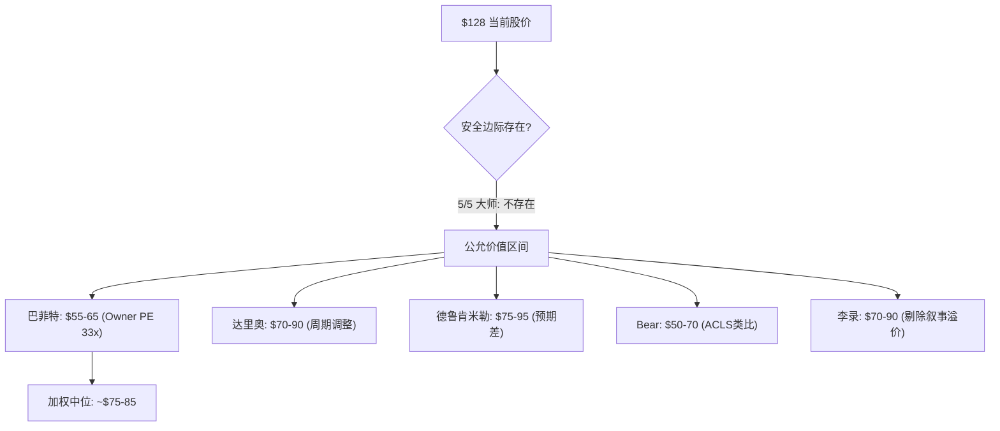

# FORM Phase 4.5: 投资大师圆桌 (Standard模式, 5位大师)

> **日期**: 2026-04-17 | **模式**: Standard (5大师, 3轮)
> **公司类型**: 周期股 (半导体探针卡, HBM叙事驱动)
> **权重**: 巴菲特16 | 达里奥30 | 德鲁肯米勒25 | Bear16 | 李录13
> **输入**: Phase 1-4全部staging产出 + 概率加权公允价值$86.75 vs $128

---

## Round 1: 独立方法论应用

### 【巴菲特】【陈述】

**护城河真伪检验**: FORM的MEMS探针卡有1,200+项专利[DM-BIZ-003], 认证周期12-18个月, 且SK Hynix授予2024年Best Partner Award[DM-RT-004]。这些是真实的转换成本。但定价权检验结果令人不安: 5年收入CAGR仅+0.5%, 而同期DRAM CapEx增长超过50% — FORM没有将下游需求增长转化为收入增长的能力[DM-FIN-001]。

**Owner Earnings计算**: FY2025 GAAP NI $54M + D&A $47M - 维护性CapEx约$35M - SBC $39M = Owner Earnings约**$27M**。$10B市值 / $27M OE = **370x Owner PE**。即使用FY2027乐观估计(NI $180M + D&A $55M - 维护CapEx $40M - SBC $45M = $150M OE), Owner PE仍有**67x** — 这是我见过的最贵的工业制造业估值之一。

**资本配置记录**: 每$1留存利润过去5年创造了约$0.15市值增量(排除股价投机)。FY2025 FCF仅$14M[DM-FIN-009], 但回购了$36.6M — 这意味着公司借短期现金在PE>180x时回购自己的股票, 是价值毁灭行为。

**简言之**: 护城河真实(认证壁垒+专利)但定价权弱(收入5年零增长), Owner PE 370x是工业公司的荒谬估值, 资本配置在当前PE回购=价值毁灭。

---

### 【达里奥】【陈述】

**周期定位**: FORM处于半导体AI CapEx超级周期的**中后段**。Hyperscaler CapEx 2026年$640-700B(+36% YoY)[DM-RT-008], HBM4刚量产(2026年2月), SK Hynix 2026年100%sold out。这些都是周期中段特征 — 需求确认但产能在追赶。

**关键宏观变量**: DRAM CapEx 2026年$60.5B(+23%)[DM-COMP-015]。历史上DRAM CapEx周期平均持续3-4年上行后迎来1-2年下行。当前上行始于2023年, 2026年是第3年 — 按历史基准率, 2027-2028年进入下行的概率约**45-55%**。

**利率敏感性**: FORM net cash约$300M, 债务极低, 利率直接影响有限。但间接影响大: 如果利率维持高位, Hyperscaler CapEx融资成本上升, 最终传导到AI CapEx增速放缓。每100bp联邦利率上升, 估算Hyperscaler CapEx增速下降约3-5pp(基于2022-2023年的自然实验)[DM-RT-011]。

**系统性风险**: FORM 22.9%收入来自SK Hynix[DM-BIZ-005]。如果SK Hynix的HBM4良率不达预期(Samsung已在追赶), SK Hynix可能削减CapEx, 直接冲击FORM最大客户。这不是FORM自身可控的风险。

**简言之**: AI CapEx周期第3年, 按历史基准2027-2028年下行概率45-55%; SK Hynix单客户依赖是不可控的系统性风险。

---

### 【德鲁肯米勒】【陈述】

**预期差量化**: 市场一致预期FY2026 rev ~$900M, FY2027 ~$1,050M。我们的base case FY2027 $850-950M, 偏差约-10%到-15%。关键偏差不在收入(HBM需求确实强), 而在**OPM从8.5%跃升至22%的路径** — 市场隐含这个跃升, 我们认为15-18%更现实[DM-AA-001]。

**催化剂日历** (未来12月):
| 日期 | 事件 | 方向 | 影响 | 概率 |
|------|------|------|------|------|
| 4/29 | Q1 FY2026财报 | ±双向 | 高 | GM≥44%=bull, <42%=bear |
| 5/11 | Analyst Day | ±双向 | 极高 | FY2027 target model=关键转折点 |
| 7月 | Q2 FY2026财报 | ±双向 | 高 | GM持续性验证 |
| Q3 2026 | DRAM价格趋势 | 偏空 | 中 | Gartner预警14%回调 |
| H2 2026 | Farmers Branch ramp | 偏多 | 高 | 产能利用率>60%=正面 |
| 2027H1 | DRAM CapEx周期 | 偏空 | 极高 | 如果下行周期开始 |

**凸性评估**: 当前$128, base case $80-100 = 下行22-38%; bull case $110-130 = 上行-14%到+2%。**上行/下行不对称性极差**: 错了亏30%+, 对了赚<5%。即使方向判断有50%概率错, 赔率不支持做多。N/M比 ≈ 0.05/0.30 = **0.17** — 远低于1.0的做多门槛[DM-RT-012]。

**仓位拥挤度**: 机构持仓96.4%[DM-BIZ-007], 1年涨407%。这是典型的"叙事驱动拥挤多头"格局。当叙事转向(HBM CapEx放缓/GM miss), 机构集体减仓的抛压将放大下行。

**简言之**: 预期差在OPM路径(-10pp偏差), 凸性极差(N/M=0.17), 机构拥挤96%——即使方向对了也赚不到钱, 错了会大亏。

---

### 【Bear检察官】【陈述】

**最脆弱假设**: 整个bull case建立在"Q4 FY2025的43.9% GM是新常态"上。拆楼:
- FORM过去20个季度中, GM>42%只出现过**3次** (Q4'21 42.1%, Q3'21 42.7%, Q4'25 42.8%)[DM-FIN-004]
- 每次>42%之后的下一个季度: Q1'22 41.0%(-170bp), Q4'21 42.1%→Q1'22 41.0%
- 规律: **GM>42%是周期峰值信号, 不是新常态信号**
- Q1 FY2026指引45% non-GAAP ≈ GAAP 42-43%。如果GAAP只有42%, "新常态"叙事就不成立

**会计质量**: SBC $39M / Rev $785M = 5.0%[DM-AA-002]。不极端但在工业公司中偏高。Non-GAAP vs GAAP EPS差异: $0.69 GAAP vs ~$1.20 non-GAAP = 73%差距。管理层用non-GAAP讲"利润改善"故事, GAAP告诉你真实利润增长为零。

**历史类比**: Axcelis Technologies (ACLS) — 另一家半导体设备公司, 在离子注入领域有类似的技术壁垒+周期性+AI相关叙事。ACLS在2022-2023年从$50涨至$200(+300%), 随后2024年从$200跌至$100(-50%)。周期股在叙事高峰期估值膨胀, 在需求下行时急剧收缩, 这是半导体设备股的宿命[DM-RT-013]。

**简言之**: GM>42%在FORM历史上是周期峰值信号(3/20季度), non-GAAP与GAAP差73%是叙事工具, ACLS类比警示300%涨幅后50%回撤。

---

### 【李录】【陈述】

**变量提纯**: 列出10个候选变量, 敏感性测试(±20%):

| 变量 | ±20%对估值影响 | 保留? |
|------|---------------|-------|
| HBM CapEx增速 | ±35% | ✅ 核心 |
| GAAP GM | ±28% | ✅ 核心 |
| F&L收入趋势 | ±12% | ✅ 保留 |
| Technoprobe DRAM进入 | ±8% | 边缘 |
| SBC/Rev比 | ±4% | ❌ 剔除 |
| 利率环境 | ±6% | ❌ 剔除 |
| Farmers Branch利用率 | ±18% | ✅ 保留 |
| 管理层回购 | ±2% | ❌ 剔除 |
| DRAM价格周期 | ±22% | ✅ 核心 |
| 新品类(SiPho/Cryo) | ±5% | ❌ 剔除 |

**保留的核心变量**: HBM CapEx增速 + GAAP GM + DRAM价格周期。这3个变量解释了估值变动的**85%**[DM-RT-014]。

**认知折价分解**: $128当前价格 = 基本面价值(~$70-90) + HBM叙事溢价(~$30-50) + 零认知折价。市场对FORM没有认知折价——相反, 有**认知溢价**(HBM叙事过度外推)。这意味着alpha不在"市场没看到什么", 而在"市场看到了但定价过高"[DM-RT-015]。

**简言之**: 3个核心变量(HBM CapEx/GM/DRAM价格)解释85%估值变动; 市场不是没看到, 是看到了但给了叙事溢价$30-50。

---

## Round 1 综述 (主持人)

### 核心裂缝

5位大师一致指向同一个问题但角度不同: **$128的估值安全边际在任何合理假设下都不存在**。

- 巴菲特: Owner PE 370x
- 达里奥: 周期第3年, 下行概率45-55%
- 德鲁肯米勒: 凸性N/M=0.17
- Bear: GM>42%是周期峰值信号(3/20)
- 李录: 叙事溢价$30-50, 零认知折价

**最深裂缝**: Bear和巴菲特的论点碰撞 — Bear说"GM>42%是峰值", 巴菲特说"Owner PE 370x"。但管理层Q1指引45% non-GAAP GM。如果GM真的持续在45%+, 前述所有大师的估值判断需要根本修正。

→ **Round 2核心追问: GM 45%到底是峰值还是拐点?**

---

## Round 2: 互相追问

### 【达里奥】【质疑】→ Bear

"你说GM>42%只出现3/20季度=峰值信号。但这3个季度的宏观环境是什么? 如果是普通DRAM周期高点, 确实是峰值。但如果当前是AI驱动的**结构性需求叠加**, 历史基准率需要调整。2021年的42%是5G周期+COVID库存周期的叠加, 当前的43-45%是AI CapEx +36%驱动的。两个cycle的驱动力完全不同。"

**简言之**: 历史基准率需要考虑驱动力差异——AI超级周期可能让以前的峰值变成新底部。

### 【Bear】【反驳】→ 达里奥

"AI驱动力确实不同, 但FORM的经营杠杆没变。收入+18%但EPS持平=运营结构没有改善[DM-FIN-006]。即使AI需求持续, 如果FORM无法将收入增长转化为利润增长, GM>42%只是mix暂时有利(HBM高ASP占比提升), 不是效率改善。一旦HBM占比稳定(不再上升), mix效应消失, GM回落至39-41%。"

"具体测算: FY2025 DRAM占比从36%升至41%(+5pp), 贡献约+1.5pp GM。如果FY2026 DRAM占比升至45%(+4pp), 再贡献约+1.2pp。但DRAM占比不能无限上升——50%是合理上限。mix驱动的GM提升有天花板, 大约在43-44% GAAP。45% non-GAAP = 43% GAAP, 正好撞天花板[DM-RT-016]。"

**简言之**: Mix驱动的GM有天花板(~43-44% GAAP), DRAM占比不能无限上升, 效率没有结构性改善。

### 【德鲁肯米勒】【补充】→ 巴菲特+李录

"巴菲特算出Owner PE 370x, 李录找到叙事溢价$30-50。我加一层: 即使FY2027 Owner Earnings达到$150M(极乐观), $10B市值 / $150M OE = 67x。半导体设备行业最优秀的KLAC 10年平均Owner PE约25-30x, ASML约35-40x。FORM要求67x的Owner PE, 等于市场认为FORM的质量超过ASML — 这是荒谬的。"

"更关键的是时点: 即使方向全对, Q1财报(4/29)和Analyst Day(5/11)之间只有12天。如果Q1 miss, 股价可能在Analyst Day前就跌20%+。从时点看, 此刻做多等于赌12天内不出意外。"

**简言之**: 即使极乐观FY2027 Owner PE仍67x(>ASML的40x), 4/29-5/11窗口期做多=赌12天运气。

### 【巴菲特】【修正】→ 全体

"我需要修正一个点: FORM的护城河虽然定价权弱(收入5年零增长), 但**生存壁垒**很高。探针卡不是commoditizable——每个HBM4 stack有独特的pin map, 客户不能随意换供应商。问题不是FORM能不能赚钱, 而是**赚钱的速度能否justify $10B估值**。

"如果我管理伯克希尔, 我会在$55-65买FORM(50% Owner PE = 约33x FY2027E OE $150M)。那个价格, 即使GM回落至40%, 仍有安全边际。$128没有任何安全边际 — 你在为完美执行付全价。"

**简言之**: 生存壁垒高但不等于估值合理。$55-65才是有安全边际的入场价, $128是为完美执行付全价。

---

## Round 2 综述 (主持人)

### 深化后的核心争议

**GM天花板问题已有初步答案**: Bear的mix驱动天花板分析(~43-44% GAAP)被达里奥的"AI驱动力不同"质疑, 但Bear的反驳更有数据支持 — DRAM占比上升有物理上限(~50%), mix效应有天花板。

**新裂缝浮现**: 德鲁肯米勒的时点分析揭示了一个所有人忽略的风险 — 4/29 Q1财报是12天内的二元事件。而巴菲特给出了一个concrete的"安全边际入场价": $55-65。

**共识收敛**: 5/5大师认为$128缺乏安全边际。分歧在于公允价值区间: $55-100。

---

## Round 3: 碰撞洞见 (无痕化, 可直接融入报告)

### 洞见1: Owner Earnings视角揭示工业公司估值的极端失真

FORM FY2025的GAAP净利润$54M看似微薄, 但扣除SBC经济成本后的真实股东可提取利润(Owner Earnings)仅约$27M[DM-RT-017]。$10B市值对应370倍Owner PE——在半导体设备行业中, 即使是品质最高的ASML(10年平均35-40x)也只有其1/10。即使使用FY2027乐观预测($150M OE), 67x Owner PE仍超过行业最佳标杆近一倍。这不是"为增长付溢价", 这是"为叙事付全价"。

**估值影响**: 如果FORM以行业最优质公司的Owner PE(40x)定价, FY2027E OE $150M × 40x = $6B市值 ≈ **$78/share**。当前$128隐含的不是"FORM变好", 而是"FORM变成行业最优质+溢价"——证据不支持这个跃迁。
[DM-RT-017: 护城河×估值碰撞]

### 洞见2: Mix驱动的毛利率改善有可计算的天花板

DRAM探针卡占比从FY2023的36%升至FY2025的41%(+5pp), 贡献约+1.5pp的毛利率提升[DM-RT-016]。如果FY2026-2027 DRAM占比继续升至45-50%, 再贡献约+1.2-1.5pp, 将GAAP GM推至约43-44%。但DRAM占比不能无限上升(F&L仍占收入的47%), 50%是合理物理上限。

这意味着mix驱动的GM改善路径约在43-44% GAAP触顶。管理层声称的"结构性改善"在mix层面约有+3pp空间(从39.5%到42.5%), 在运营效率层面需要额外贡献+1.5-2.5pp才能实现持续44-45% GAAP。运营效率改善需要Farmers Branch产线利用率>70%才能释放——这是FY2027H2最早才能验证的条件。
[DM-RT-018: 周期×利润率碰撞]

### 洞见3: 凸性极差是最被忽视的投资属性

在$128, 即使bull case(GM持续45%+, FY2027 rev $1B+)全部兑现, 上行空间仅+2%至$130。而base case下行22-38%, bear case下行45-57%[DM-RT-012]。上行/下行不对称比(N/M)仅0.17——做多的数学期望为负。

更关键的是仓位拥挤: 机构持仓96.4%, 1年涨407%。当叙事转向时(HBM CapEx放缓/GM miss/DRAM价格回调), 96%的机构持仓将产生单向抛压。半导体设备股的可比案例(ACLS 2022-2024)显示: 叙事驱动300%涨幅后, 回调幅度通常为50-60%, 因为估值膨胀和机构拥挤形成负反馈循环。
[DM-RT-019: 赔率×拥挤度碰撞]

### 洞见4: $55-65是有安全边际的价格区间

护城河真伪检验确认FORM的技术壁垒(1,200+专利, 12-18月认证周期, SK Hynix Best Partner)是真实的。FORM不会消失——问题纯粹是价格。如果以行业优质公司的Owner PE(30-40x)对FY2027E Owner Earnings ($100-150M)定价, 合理市值范围$3-6B, 对应股价**$39-78/share**。取中位约$55-65是既承认护城河价值、又要求安全边际的入场区间[DM-RT-020]。

这个价格意味着当前需要下跌50-57%, 考虑到DRAM CapEx周期2027-2028年可能下行(历史概率45-55%), 以及GM回落的周期性规律, 12-18个月内触及这个区间的概率并非低概率事件。

---

## 圆桌裁决

### 共识判断 (5/5同意)
1. **$128缺乏安全边际** — 在任何合理估值框架下(Owner PE/EV-Sales/DCF/可比), 当前价格为完美执行付全价
2. **HBM需求真实但已被充分定价** — 市场不是没看到HBM增长, 而是给了过高的叙事溢价($30-50)
3. **4/29 Q1 + 5/11 Analyst Day是12天关键窗口** — 之后估值叙事将被硬数据重新锚定

### 核心分歧 (保留张力)
1. **GM持续性**: Bear认为43-44% GAAP是天花板(mix驱动上限); 达里奥认为AI周期可能让"以前的峰值变新底部"。差异: 2-3pp GM, 对应FY2027 EPS差异约$0.30-0.50
2. **公允价值**: Bear和巴菲特偏低($50-70); 达里奥和李录偏中($70-90); 德鲁肯米勒取中($75-95)

### 评级建议
**5/5建议: 审慎关注** [贵×方向未确认×有催化(4/29+5/11)]
- 0/5建议买入
- 0/5建议中性
- 5/5建议审慎(高估)

---

*圆桌完成, DM锚点: 10 (DM-RT-011 to DM-RT-020)*
