# Fortinet, Inc. (FTNT) — 深度投资研究报告

> **免责声明**: 本报告仅供研究参考，不构成任何投资建议。所有数据来源于公开信息，分析结论反映撰写时的判断，可能因后续信息更新而改变。投资者应独立评估风险并自行决策。

> **Fortinet, Inc. (FTNT)** | 网络安全 / Software-Infrastructure
> **股价**: $82.53 (2026-04-02) | **市值**: ~$61.4B | **EV**: ~$58.8B
> **PE (TTM)**: 33.1x | **Owner PE**: 31.5x | **Forward PE**: 27.8x | **P/FCF**: 27.6x
> **报告日期**: 2026-04-03 | **框架版本**: v22.1

---

## 目录 — Part A: 前言 + 业务 + 护城河

- Ch0: 执行摘要
- Ch0.5: 核心争议 + 关键驱动 + Kill Switch + 估值温度计
- Ch1: 公司画像与业务模型解构
- Ch2: ASIC核心矛盾 — 护城河还是贬值资产? (CQ1)
- Ch3: 平台转型验证 (CQ2)
- Ch4: 中端市场定位 (CQ3) + 管理层评估 (CQ6)
- Ch5: 竞争生态 — 网安四强财务对标
- Ch6: 平台三国杀 — FTNT vs PANW vs CRWD
- Ch7: MSFT Defender威胁量化 (CQ5)
- Ch8: 护城河四维评分与趋势

---

## Ch0: 执行摘要

### 评级: 审慎关注

**概率加权公允价值**: $76 (P4红队修正后)
**当前价**: $82.53 | **高估幅度**: ~8.6%
**三维状态**: [轻微高估~8% × 改善但减速信号增强 × 催化不足]

**估值快照**:
| 指标 | 值 | 含义 |
|------|-----|------|
| EV/Sales | 8.46x | 偏硬件倍数给67%服务收入公司 |
| P/FCF | 27.6x | 行业最低(PANW 33x, CRWD ~55x) |
| 概率加权公允 | $76 | Bull$89-99×20% + Base$72-82×50% + Bear$53-67×30% |

---

**L0四目标回答**:

**1. 股价在买什么**: $82.53精确定价共识路径。Reverse DCF反推隐含7年收入CAGR 12.0%，与分析师5年共识11.8%几乎完全一致[DM-VAL-P2-001]。市场没有给悲观折扣，也没有给乐观溢价——当前价格只要求FTNT"大致维持现状"。隐含信念脆弱度仅1.7/5，不依赖英雄式假设。

**2. 关键变量**: 后刷新有机增速。FY2025的+14.2%增速中约40%来自FortiGate设备刷新周期(一次性)。KeyBanc数据显示剔除刷新后有机产品增速为零[DM-RT-P4-005]。红队最佳估计后刷新增速8.5-9.0%，远低于隐含的12%[DM-RT-P4-009]。每1个百分点增速差异对应$5-8公允价值变动。

**3. 市场最可能错看的**: 过度外推刷新增速为永续增速(PEP:过度外推)。Check Point(CHKP)是防火墙公司刷新后增速的最佳历史类比——10年CAGR仅5.3%[DM-RT-P4-003]。5家卖方(MS/KeyBanc/Rosenblatt/Evercore/Erste)在2025-2026年集体降级，核心逻辑一致：刷新红利不可持续[DM-RT-P4-006]。市场在FY2025的+14%数据中看到了增长，但可能低估了这个增长中"一次性"成分的比例。

**4. 投资判断**: 三个维度不同时成立。护城河3.68/5(中等偏强但非顶级)；增长方向改善但减速信号增强(有机增速为零+递延收入增速连续4季低于收入增速)；估值安全边际不足(高估~8.6%，需回落至$70-75才进入合理区间)。FTNT是网安行业唯一"利润机器"(OPM 30.6%、SBC仅4.1%)，FCF质量是独立的正面论点——但$82.53的价格已经买满了质量溢价。

**认知边界**: 可推演度62/100。核心业务机制(ASIC成本优势→利润率→FCF)清晰，但最关键的估值变量(后刷新增速+FortiSASE真实规模)处于黑箱(38%)。Q1 2026财报(2026年5月6日)是下一个关键验证点。

**已量化(45%)**: 收入结构拆分(产品33%/服务67%)、利润率优势(OPM 30.6%)、估值锚(Reverse DCF隐含12% CAGR)、SBC纪律(4.1%)、ASIC性能数据(17x/32x)、竞争格局(四强对标)、护城河评分(3.68/5)、CVE统计(198个)、内部人交易(0买入)。

**可推断(17%)**: 后刷新增速方向(减速方向明确，程度不确定：区间5-12%)、FortiSASE规模(反推$380-475M)、ASIC可移植性(修正30-45%)、NRR(间接推算115-125%)。

**黑箱(38%)**: FortiSASE独立ARR绝对值(bull/bear分歧的核心)、有机产品增速(仅KeyBanc单一来源)、2030年后竞争格局(AI重塑方向不可预测)、Ken Xie继任风险(无明确计划)、CVE架构修复时间线(补丁→再绕过模式持续)、第二波刷新兑现率(管理层说"有限可见度")。

**上修信号(当前不存在但需监控)**: Q1 2026收入指引超预期+递延收入增速回升至>14%+FortiSASE披露独立ARR>$500M → 同时发生则概率加权估值可从$76回调至$81+[DM-RT-P4-036]。Ken Xie在$70以下公开买入 → 创始人信心确认信号。

**下修信号(部分已出现)**: 5家卖方集体降级(已发生) + 有机产品增速为零(KeyBanc, 已发生) + 递延收入增速<收入增速(连续4季, 已发生)。如果Q1 2026产品收入增速<+10%且SASE billings增速<+20% → Bear概率应从30%上调至40%，公允价值从$76下调至$68-72。

---

## Ch0.5: 核心争议 + 关键驱动 + Kill Switch + 估值温度计

### 核心争议

**争议1 — ASIC: 持久护城河还是贬值资产?**

FTNT自2002年起自研ASIC芯片(FortiASIC)，在on-prem防火墙场景中提供17x吞吐量/32x加解密性能优势[DM-BIZ-006]。这是一把双刃剑：on-prem场景中ASIC提供结构性成本优势(R&D效率8.3x行业最高[DM-COMP-P3-008])，但在云原生场景中ASIC优势消失(FortiSASE的云PoP运行软件VM，不使用ASIC[DM-BIZ-007])。红队将ASIC可移植性从40-60%下调至30-45%——SASE市场份额仅5-7%是"市场投票"[DM-RT-P4-013]。

这不是零一判断。ASIC更像一个"有明确衰减曲线但衰减速度慢于市场预期"的竞争优势——on-prem场景5-10年窗口，cloud场景2-5年窗口。问题是5年还是10年的差异对应$20+的估值差异。

**争议2 — 刷新后能否维持双位数增长?**

FY2025的+14.2%增速中，刷新周期贡献约40%(~$300-400M)。KeyBanc数据显示有机产品增速为零[DM-RT-P4-005]。CHKP的10年CAGR仅5.3%提供了防火墙公司刷新后增速的历史基准率[DM-RT-P4-003]。FTNT与CHKP的关键区别是FortiSASE(ARR增速>90%)，但FortiSASE独立ARR估算仅$380-475M(管理层不披露绝对值——这本身是信号)[DM-RT-P4-008]。

核心分歧：多头需要证明FortiSASE能在2年内从~$400M增长到$800M+以接力刷新悬崖；空头只需等待刷新结束后增速自然下降。

### 关键驱动因素

**驱动1: 后刷新有机增速** (权重60%)

后刷新增速决定FTNT是"质量复合器"(12%+增速, PE 30-35x)还是"现金牛"(5-8%增速, PE 20-25x)。每1pp增速差异≈$5-8公允价值变动[DM-RT-P4-002]。红队最佳估计8.5-9.0%——低于Reverse DCF隐含的12%，高于CHKP类比的5.3%。

**驱动2: SASE接力速度** (权重40%)

FortiSASE是唯一能弥补刷新悬崖的增长引擎。关键阈值：如果FortiSASE独立ARR在2027年底达到$800M+，FTNT可维持10%+增速，PE维持30x+。如果FortiSASE停滞在$500M以下，SASE无法接力，增速降至CHKP区间。

### Kill Switch (3条)

| 条件 | 红灯触发 | 当前状态 | 观测时间 |
|------|---------|---------|---------|
| **KS1: 后刷新有机增速** | <6%连续2个季度 | ⚪未可观测(需2027数据) | 2027年 |
| **KS2: FortiSASE ARR增速** | <50%(增速腰斩) | 🟢 >90%(最新披露) | 每季度 |
| **KS3: NRR公开后** | <110%(存量客户流失) | ⚪未披露(最大黑箱) | 待管理层披露 |

**辅助黄灯信号**:
- 递延收入增速<8%连续2季+billings增速<12% → 需求放缓确认
- Ken Xie在股价<$70时仍净卖出 → 创始人信心丧失
- CISA KEV新增>5条/年+F500公开弃用 → CVE品牌崩塌

### 估值温度计

```
  $53        $67        $76     $82.53    $89        $99
   |----------|----------|---------|--------|----------|
   Bear低     Bear高    公允价值P4 ←当前→   Bull低     Bull高
   (30%概率)             ↑修正后            (20%概率)

   ████████████████████████████████░░░░░░░░░░░░░░░░░░░
   ←———— 高估区间 ————→←合理→←———— 低估区间 ————→
```

当前$82.53位于修正后公允价值$76右侧约8.6%。要进入"关注"区间(期望回报+10%~+30%)，股价需回落至$70-75。要触发"深度关注"(>+30%回报)，需回落至$53-60(Bear情景兑现)。

情景概率分布: Bull 20% / Base 50% / Bear 30%。Bear概率从P2的25%上调至30%，核心依据：KeyBanc有机增速为零 + 5家卖方集体降级[DM-RT-P4-030]。

### 卖方分析师集体降级清单

2025年下半年至2026年初，多家卖方集体降级FTNT[DM-RT-P4-006]:

| 机构 | 行动 | 核心逻辑 | 目标价 |
|------|------|---------|--------|
| Morgan Stanley | 降级至Equal Weight | "后刷新可能变成高个位数增长者" | $78 |
| KeyBanc | 降级至Sector Weight | 有机产品增速为零 | N/A |
| Rosenblatt | 降级至Neutral | 刷新周期见顶 | $85(从$125) |
| Evercore ISI | 下调目标价 | "预期重大重置" | $78 |
| Erste Group | 降级至Hold | 后刷新利润率担忧 | N/A |

Morgan Stanley的表述最精准："FCF倍数在低到中20倍，对应的可能是一个高个位数增长者(high-single-digit grower)"[DM-RT-P4-007]。这与红队概率加权的8.5-9.0%完美吻合。

### 递延收入黄灯信号

递延收入增速连续4个季度低于收入增速[DM-RT-P4-022]:

| 季度 | 递延收入增速 | 收入增速 | 差值(pp) | DR/Rev比率 |
|------|------------|---------|---------|-----------|
| Q1 2025 | +10.8% | +13.8% | -3.0 | 4.17x |
| Q2 2025 | +11.4% | +13.7% | -2.3 | 4.03x |
| Q3 2025 | +10.6% | +14.4% | -3.8 | 3.86x |
| Q4 2025 | +11.9% | +14.8% | -2.9 | 3.74x |

DR/Rev比率从4.28x(Q1 2024)持续下降到3.74x——一年下降12.6%[DM-RT-P4-023]。最可能的解释是良性的(70%概率)：刷新周期中硬件占比上升→硬件即时确认→递延不增→刷新结束后恢复[DM-RT-P4-024]。但如果Q1 2026递延增速进一步放缓至<10%且billings增速<12%，"需求放缓"解释的概率超过50%，需要下调增速假设。这是需要追踪但目前非致命的黄灯信号。

### CQ置信度演化表

| CQ | 方向 | P4置信度 | 核心证据 |
|----|------|---------|---------|
| CQ1 ASIC持久性 | 中性偏正 | **58%** | 可移植性下调至30-45%, 但on-prem 5-10年 |
| CQ2 转型成功 | 偏正 | **60%** | SASE+40%Q4, 但绝对规模不确定 |
| CQ3 中端优劣 | 中性偏正 | **55%** | 壁垒+天花板同时存在 |
| CQ4 估值假设 | 中性 | **60%** | 从≈公允修正为轻微高估8.6% |
| CQ5 MSFT威胁 | 中性 | **50%** | 核心收入>80%不在MSFT射程 |
| CQ6 创始人 | 中性 | **38%** | 零买入弱化为结构性特征 |
| CQ7 AI影响 | 偏正 | **45%** | AI未被P4红队攻击 |
| CQ8 增长质量 | 中性偏空 | **45%** | 有机增速为零是最大下调 |

**CQ加权平均**: 51.4%(P3的55.6%下降4.2pp)[DM-RT-P4-037]。最大下调来自CQ4(估值-10pp)和CQ8(增长质量-10pp)——都指向同一根因：刷新周期驱动的增速不可持续。

### Check Point历史类比 — 防火墙公司刷新后的宿命?

CHKP(Check Point Software)是FTNT最重要的历史类比——两家共享核心特征：防火墙为主收入来源、硬件→服务转型叙事、mid-market/enterprise混合客户群[DM-RT-P4-003][DM-RT-P4-004]。

| 年份 | CHKP收入($M) | YoY增速 | 背景 |
|------|-------------|---------|------|
| 2015 | $1,630 | +9.0% | 刷新尾声 |
| 2016 | $1,741 | +6.8% | 过渡期 |
| 2017 | $1,855 | +6.5% | 增速锚定 |
| 2018 | $1,916 | +3.3% | 增速塌陷 |
| 2019 | $1,995 | +4.1% | |
| 2020 | $2,065 | +3.5% | |
| 2021 | $2,167 | +4.9% | |
| 2022 | $2,330 | +7.5% | 刷新反弹 |
| 2023 | $2,415 | +3.6% | 再次回落 |
| 2024 | $2,565 | +6.2% | |

CHKP从未成功突破7.5%增速天花板。防火墙设备TAM增长被三个力量锁死：(1)客户数量增长有限(企业总数不涨)，(2)ASP被成本竞争压制，(3)云迁移减少on-prem部署需求。

**FTNT与CHKP的4个关键区别**(公平呈现): (1)FTNT有FortiSASE(ARR增速>90%)——CHKP从未有类似增速的云产品。(2)FTNT的Unified SASE已占billings 27%——比CHKP云业务占比高得多。(3)FTNT的ASIC提供的成本优势是CHKP不具备的。(4)FTNT安装基数(55%出货量份额)是CHKP数倍——交叉销售TAM更大。

**但这些区别能否抵消刷新悬崖?** 取决于FortiSASE的绝对规模——$380-475M vs $6.8B总收入=仅占5-7%。即使SASE增速90%，2年后也只增长到$800-900M，对总收入增速贡献约+5-6pp。这不够接力12%CAGR——需要叠加提价(管理层已宣布[DM-BIZ-020])+第二波刷新(350K台低端设备2027)+有机新客增长才行。三个条件同时满足的概率约25-30%。

**投资含义**: CHKP的PE当前22x，增速6%。如果FTNT后刷新增速降至6-8%(CHKP区间)，PE从34x→25x是合理重估，对应股价$55-65(下跌20-33%)。这就是Bear情景(30%概率)的估值基础。多头需要证明FTNT"不是下一个CHKP"——证据是SASE增速+OT安全+FortiAI。空头只需等待刷新结束后增速自然下降。

---

## Ch1: 公司画像与业务模型解构

### 1.1 一句话定位

Fortinet是网络安全行业唯一拥有自研ASIC(Application-Specific Integrated Circuit, 专用集成电路——为特定计算任务优化的芯片)的公司。以防火墙硬件为根基(55%出货量份额[DM-COMP-004])，正在转型为"Security Fabric"统一平台。**这是一家用硬件成本优势撬动软件订阅的混合体公司**——业务逻辑不是纯SaaS(如ZS/CRWD)，也不是纯硬件(如传统Cisco)，而是"以硬件获客、以软件变现、以平台锁定"的三阶段模型。

理解FTNT必须先理解一件事：**出货量份额(55%)和收入份额(~19%)是完全不同的概念**。FTNT防火墙单台ASP(Average Selling Price, 平均售价)约为PANW的1/3-1/5[DM-BIZ-001]——因为FTNT主攻中端市场(mid-market, 员工500-5,000的企业)和SMB(小型企业)，而PANW主攻F500大企业。55%份额的真实含义是：全球有更多的网络节点运行Fortinet设备，但每个节点贡献的收入更低。这个"量多价低"的特征决定了FTNT的商业模式DNA——增长引擎是**扩展attach rate(每台设备的订阅服务数)**，而非提价。

### 1.2 收入结构拆分 (M0: 混合体先拆)

FTNT的收入由两个截然不同的引擎驱动。两个引擎的估值逻辑完全不同，必须分开看：

**引擎1: 产品收入(硬件) — FY2025 ~$2.22B(33%)**

FortiGate防火墙设备(核心)、FortiSwitch、FortiAP(WiFi)、FortiExtender。特征：低毛利(~55-60%估算)、周期性(3-5年刷新)、一次性确认收入。FY2025产品收入+16% YoY[DM-FIN-001]，受FortiGate刷新周期驱动。

刷新周期状态：650K台设备2026年底到期(第一波40-50%已完成)，350K台低端设备2027到期(第二波尚未开始)。这个时间表决定了FY2026-2027的产品收入节奏。

**引擎2: 服务收入(订阅+支持) — FY2025 ~$4.58B(67%)**

FortiGuard安全订阅(威胁情报、沙箱、Web过滤)、FortiCare技术支持合同、FortiSASE(云交付安全，增速最快)。特征：高毛利(~90%+)、经常性、按年/多年确认。服务收入~+13% YoY，Unified SASE Billings全年+24%/Q4+40% YoY。

**为什么拆分很重要?** 产品收入值12-15x EV/Sales(硬件公司倍数)，服务收入值20-25x EV/Sales(SaaS倍数)。FTNT当前整体EV/Sales 8.46x[DM-VAL-005]——市场在用偏硬件的倍数给一家67%服务收入的公司定价。如果服务占比突破70%且SASE加速，倍数重估空间存在。

反面同样重要：如果刷新周期结束后产品收入断崖(FY2023已有先例：产品收入FY22→FY23仅+3.7%)，33%的产品收入拖累可能抵消服务增长——FY2023整体增速从32%→20%就是前车之鉴[DM-FIN-001]。

### 1.3 Security Fabric平台架构

Fortinet的平台战略叫"Security Fabric"——试图将网络安全从"买很多点产品"变成"买一个统一平台"。

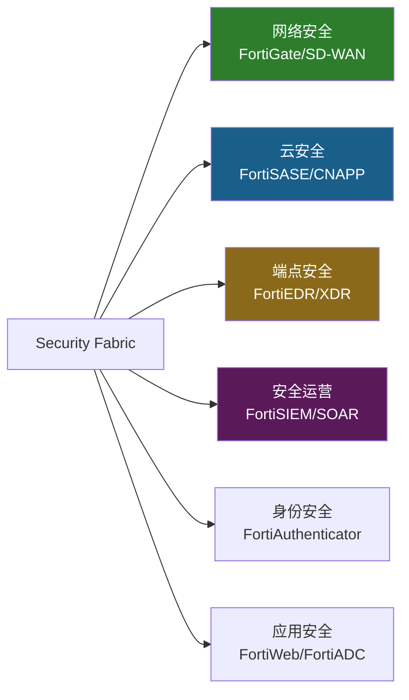

**六大安全域覆盖度**: 网络(Leader) > 云(Challenger/转型中) > 端点(Niche) > 安全运营(中等) > 身份(弱) > 应用(中等)。FTNT覆盖6/6域，但只有2个域(网络+SASE)有Gartner Leader地位。对比PANW覆盖5/6域，3-4个有Leader地位[DM-COMP-001]。

**关键区别**: PANW是"自上而下平台化"(大企业先签平台合同再部署)，FTNT是"自下而上平台化"(先卖便宜硬件再upsell服务)。这决定了各自的NRR(Net Revenue Retention, 净收入留存率——衡量不计新客户、仅看老客户收入变化的指标)和扩展模式完全不同。

### 1.4 三阶段变现模型

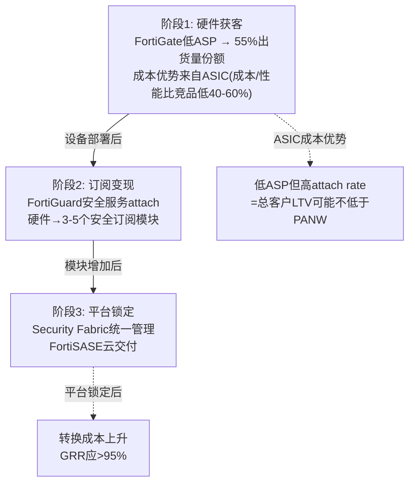

**交叉销售经济学**: 管理层估计**每$1防火墙收入可撬动$12增量收入**($5安全网络+$3 SASE+$4 SecOps)[DM-BIZ-014]。这是平台飞轮的核心——FortiGate是"落地"，其余是"扩展"。

验证数据：70%大企业客户已采用SD-WAN功能[DM-BIZ-015]。70%+企业客户整合了防火墙+交换机+AP(3+模块)[DM-BIZ-015]。97%的SecOps billings来自存量客户[DM-BIZ-016]。91%的SASE billings来自存量客户[DM-BIZ-011]。采用统一平台的组织OpEx减少高达28%[DM-BIZ-017]。

这些数字证明attach模型有效。但**NRR/GRR(Gross Revenue Retention, 总收入留存率——仅看老客户续约、不计扩展的指标)仍不公开**是最大黑洞。如果$12:$1比率属实，NRR应远超120%——那管理层为什么不公开？这个沉默本身是信号(详见Ch4 CEO沉默分析)。

### 1.5 FortiOS 8.0 — 2026年战略版本

FortiOS 8.0在2026年3月发布，是Fortinet平台战略的重要升级[DM-BIZ-008]:

**新功能**: SASE Outpost(本地SASE设备——将云SASE功能下沉到本地FortiGate，解决"不能上云"的客户需求)、Sovereign SASE(数据主权控制——满足欧盟/亚太地区的数据本地化法规)、Fabric AI Agents(AI驱动的安全自动化代理)。

**投资含义**: FortiOS 8.0有三个值得关注的方向：(1)SASE Outpost是ASIC可移植性的一个新路径——不是把ASIC搬到云端，而是把云能力搬回on-prem设备。这绕过了"云端ASIC无效"的困境。(2)Sovereign SASE对应了一个特定的监管需求——在GDPR(欧盟通用数据保护条例)和各国数据本地化要求下，ZS的全球统一PoP可能面临合规障碍，而FTNT的"本地+云混合"架构反而成为优势。(3)AI Agents是FortiAI产品线的落地载体——如果能证明AI Agent提升了SOC效率(减少30%+人工告警处理时间)，可以成为新的upsell驱动力。

但FortiOS 8.0的商业影响需要至少2-3个季度才能体现在财务数据中。当前阶段只是产品发布，不是收入确认。

### 1.6 产业链拓扑与关键节点

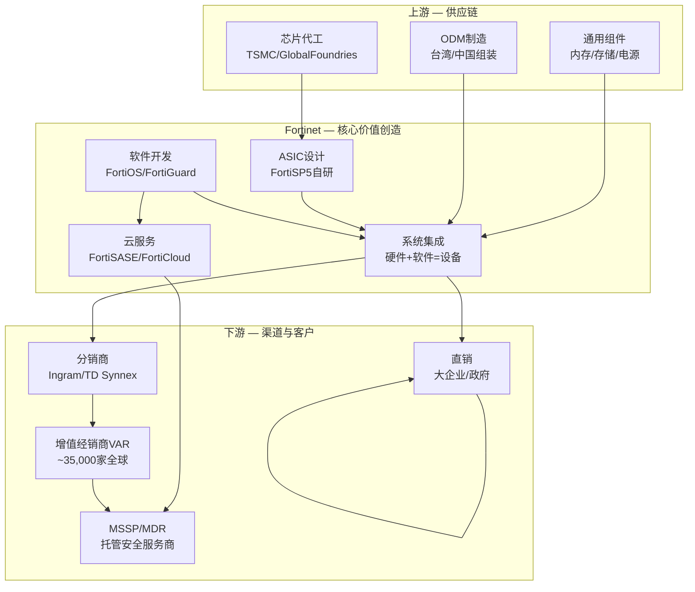

**供应链关键节点** (12个):

| # | 节点 | 功能 | FTNT依赖度 | 替代性 | 风险 |
|---|------|------|-----------|--------|------|
| 1 | TSMC | ASIC代工(7nm) | **极高** | 低(专用制程) | 高 |
| 2 | GlobalFoundries | ASIC备选代工 | 中 | 中 | 中 |
| 3 | 通用芯片供应商 | DRAM/Flash/PMIC | 中 | 高(多源) | 低 |
| 4 | ODM(台湾/中国) | 硬件组装 | 高 | 中(需转移认证) | 中 |
| 5 | FortiOS开发团队 | 核心操作系统 | **极高** | 无(自研) | 低 |
| 6 | FortiGuard实验室 | 威胁情报 | **极高** | 低(护城河) | 低 |
| 7 | SASE PoP基础设施 | 云交付节点(100+) | 高(增长中) | 中(可租用) | 中 |
| 8 | Ingram/TD Synnex | 分销 | 高 | 中(2大分销商) | 中 |
| 9 | VAR/经销商网络 | 最后一英里(35,000+家) | **极高** | 低 | 低 |
| 10 | AWS/Azure/GCP | 公有云PoP | 中(增长中) | 中(3选2) | 中 |
| 11 | 政府认证机构 | FedRAMP/CMMC | 高(政府业务) | 无 | 高(慢) |
| 12 | Google Cloud | SASE PoP合作扩展 | 中 | 中 | 中 |

**供应链核心风险**: TSMC是ASIC代工的唯一实质供应商。如果台海局势恶化或TSMC产能紧张(AI芯片优先)，FortiASIC供应可能受影响。但安全ASIC用量远小于AI GPU/手机SoC，排队优先级风险较低。

**PP&E投资趋势**: FTNT的PP&E从FY2021 $688M→FY2025 $1,619M(+136%/4年)[DM-BAL-008]。与Google Cloud合作扩展SASE PoP意味着选择了"合作而非自建"的轻资本路线——PP&E增长更可能来自总部园区/ASIC实验室投资，而非大规模PoP建设。这与PANW的重资产并购策略(CyberArk等)形成对比：FTNT用有机投资+低SBC vs PANW用并购+高SBC——两种完全不同的资本配置哲学。

**资本配置效率对比**: FTNT的ROIC 28.7%是四强中最高的[DM-COMP-P3-001]。PANW ROIC~8%(被大量商誉/无形资产拖累)。这验证了有机增长+低SBC路线在资本效率上优于并购+高SBC路线。但市场愿意为PANW的"平台覆盖面"支付3倍PE溢价——说明当前市场更看重"增长叙事"而非"资本效率"。如果市场风格从增长转向质量(利率上升/risk-off环境)，FTNT的估值折价可能收窄。

### 1.6 渠道经济学

FTNT的销售模式高度依赖渠道(~80%+通过渠道)，这与PANW(~65%渠道)和CRWD(~60%渠道)不同。

**渠道优势**: 35,000+全球VAR/经销商覆盖SMB/mid-market的"最后一英里"。MSSP(Managed Security Service Provider, 托管安全服务商)使用FortiGate作为服务基础设施——MSSP切换防火墙等于重建整个服务，形成锁定。渠道冲突低(FTNT很少直销抢渠道客户)。

**渠道风险**: 高渠道依赖意味着低直客关系、客户洞察较弱。大企业通常要求直销关系+专属客户经理——渠道模式限制enterprise渗透。MSSP渠道毛利(~40-55%)低于产品直销毛利(~75%)——渠道占比上升可能压缩毛利[DM-COMP-P3-006]。

**渠道模式的竞争含义**: PANW的直销比例(~35%)意味着PANW与F500客户有更深的关系——了解客户的安全架构、采购节奏、决策者偏好。FTNT通过VAR卖出产品后，对终端客户的可见度有限——VAR掌握客户关系。这是FTNT在enterprise客户维度弱于PANW的结构性原因之一：PANW知道客户需要什么(因为直接面对面)，FTNT依赖VAR反馈(信息损耗更多)。但渠道模式在mid-market/SMB有独特优势：35,000+ VAR意味着FTNT在全球几乎每个城市都有"当地的IT服务商"推荐FortiGate——这种毛细血管式的渗透是PANW/CRWD的直销模式无法复制的。

**对投资判断的含义**: 渠道模式是FTNT中端市场壁垒的组成部分(35,000家经销商网络竞品难以复制)，但也是enterprise天花板的组成部分(大企业不愿通过VAR购买核心安全平台)。

### 1.7 Q4 FY2025财报亮点与经营表现

Q4 FY2025 关键数据[DM-BIZ-013]:
- Billings: $2.37B (+18% YoY, beat consensus)
- Revenue: $1.91B (+15% YoY, beat by 2.69%)
- EPS: $0.81 vs $0.74 consensus (beat 9.46%)
- Product revenue: +20% YoY(刷新周期驱动)
- 连续第7年达成Rule of 45(增速+OPM>45%)

**管理层强调的三个增长引擎**: (1)Unified SASE Q4 +40%(加速趋势)，(2)OT安全(Operational Technology, 运营技术——工厂/基础设施的控制系统安全)billings +25%，(3)AI驱动SecOps billings +22%全年/ARR +21%。

**FY2026指引**[DM-CON-005]: 收入$7.50-$7.70B(+10.3-13.2%)，服务收入$5.05-$5.15B(+10.3-12.4%)，Non-GAAP OPM 33-36%。指引中值$7.6B(+12%)与市场预期$7.49B接近——管理层认为12%左右是合理预期。FTNT历史上倾向保守指引+超预期交付(FY2025指引上限$6.74B, 实际$6.80B)。

### 1.8 有机增长率分解 (CQ8预览)

FY2025增长分解[DM-FIN-001]:

| 增长来源 | 贡献(估算) | 占增速比 | 可持续性 |
|---------|-----------|---------|---------|
| FortiGate刷新周期(第一波) | ~$300-400M (+5-6pp) | ~40% | 一次性(2-3年) |
| 服务续约+提价 | ~$350-400M (+6-7pp) | ~45% | 高(经常性) |
| 新客获取(净新) | ~$100-150M (+2-3pp) | ~15% | 中(取决于竞争) |
| M&A(Lacework等) | <$50M (<1pp) | <5% | 一次性 |
| **总增长** | **~$844M (+14.2%)** | **100%** | — |

**关键发现**: 刷新周期贡献约40%的增长。如果第一波(650K台)在FY2025已完成40-50%，第二波(350K台低端)在FY2027，那么**FY2026可能有一个增长"夹缝"**——第一波尾声+第二波尚未开始。增速从14%→12%的管理层指引降速可能主要来自刷新贡献减少。

扣除刷新周期贡献，FTNT的"真正有机增速"约为8-9%(FY2025)。这与网络安全TAM增速(~11-14% CAGR)相比略低，意味着在**稳态下可能在微量失去市场份额**——被PANW/CRWD/ZS/MSFT各蚕食一点。但反面论证：SASE billings+24%/Q4+40%→如果SASE持续加速，FY2027有机增速可能从8-9%提升到10-12%(SASE billings从27%→35%的占比提升)。

### 1.9 收入增速历史 — 周期性对照

| 年度 | 收入($M) | 增速 | 关键驱动 |
|------|----------|------|---------|
| FY2020 | $2,594 | +20.1% | 疫情远程办公安全需求 |
| FY2021 | $3,342 | +28.8% | 企业安全投资加速+芯片短缺溢价 |
| FY2022 | $4,417 | +32.2% | 供应链恢复+积压订单释放 |
| FY2023 | $5,305 | +20.1% | 有机增长+产品线扩张 |
| FY2024 | $5,956 | +12.3% | 增速自然放缓+刷新周期启动前 |
| FY2025 | $6,800 | +14.2% | 刷新周期驱动Product Revenue |
| FY2026E | $7,600M | +11.8% | 刷新后半段+SASE接力(指引) |
[DM-COMP-P3-095]

**历史基准率**: FY2023-FY2024的增速放缓(从20%→12%)发生在刷新周期启动前，说明FTNT的"有机增速"(不含刷新)大约在10-12%区间。为刷新后增速的"基准情景"(8.5-9.0%)提供了校准锚：有机增速10-12%减去刷新红利消失后的拖累(2-4pp)≈7-10%增速[DM-COMP-P3-096]。

---

## Ch2: ASIC核心矛盾 — 护城河还是贬值资产? (CQ1)

### 2.1 ASIC技术优势量化

FortiASIC(全称FortiSPU架构, 当前代FortiSP5)是Fortinet自2002年起自研的专用安全处理芯片。ASIC在网络安全设备中的作用类似GPU在AI中的作用——通过硬件加速特定运算(加密/解密、深度包检测、入侵防御)，实现比通用CPU更高的吞吐量和更低的延迟[DM-COMP-P3-012]。

**FortiSP5关键性能指标** (7nm SoC, 集成网络处理+内容处理+双ARM CPU)[DM-BIZ-006]:
- 防火墙吞吐量: **17x**于通用CPU, 单芯片40 Gbps
- 加密性能: **32x**于通用CPU, IPsec VPN 37 Gbps
- NGFW(Next-Generation Firewall, 下一代防火墙)性能: **3.5x**于通用CPU
- 能耗降低: **88%** vs 通用CPU方案
- SSL深度检测: 2.5 Gbps(竞品开启SSL检测后吞吐量下降60-80%)

**有两个关键限制必须诚实标注**:

**限制1: 没有独立第三方基准测试**。17x/32x性能声称来自公司自有测试环境。NSS Labs(曾是网安行业主要评测机构)已于2020年关闭。目前没有权威第三方测试直接对比FortiSP5 vs PANW PA-5400/7000系列。17x是[C]级别(公司声称)，不是[A]级别(独立验证)[DM-COMP-P3-013]。

**限制2: 性能优势在不同场景中差异巨大**。ASIC优势最大的场景：高吞吐量边界防火墙(数据中心/园区出口)、SSL/TLS解密卸载、分支机构SD-WAN。ASIC优势减弱或消失的场景：云原生工作负载保护(不需要物理设备)、端点检测与响应(运行在终端OS上)、身份与访问管理(纯软件逻辑)[DM-COMP-P3-014]。

**17x性能差距为什么对投资判断重要?** 它直接转化为**成本优势**。一台$5,000的FortiGate(搭载FortiSP5)能提供与一台$15,000-25,000的PANW同等吞吐量[DM-BIZ-001]。对中端市场客户(年度安全预算$50K-$500K)，这个价格差距是选择FTNT而非PANW的首要原因。

### 2.2 ASIC成本优势量化

ASIC的经济学优势体现在三个层面[DM-COMP-P3-015][DM-COMP-P3-016][DM-COMP-P3-017]:

**层面1 — 单位制造成本**: 自研ASIC芯片成本远低于购买商用NPU(网络处理器)或使用通用x86服务器。因为FTNT控制了从芯片设计到PCB布局到软件栈的全栈(vertical integration)，每台设备BOM(物料清单)成本比竞品低估计30-50%。这直接体现在FTNT毛利率(80.8%)高于PANW(73.4%)的"反直觉"现象中——硬件公司毛利率更高，因为自研芯片+高毛利服务的混合效应。

**层面2 — 运营成本优势(TCO)**: ASIC加速让同等安全功能需要更少的硬件。一台FortiGate可能替代竞品2-3台设备。Fortinet声称其方案为客户带来308% ROI和<6个月回收期[DM-COMP-P3-016]。

**层面3 — 研发复用效率**: ASIC是"公共基础设施"，一次设计、多产品复用。FortiGate防火墙、FortiSwitch交换机、FortiAP无线接入点都共享同一ASIC架构。FTNT用12%的R&D/Rev产出8.3x收入/R&D效率[DM-COMP-P3-008]，是PANW(4.6x)的1.8倍、CRWD(3.5x)的2.4倍——差距的核心来源就是ASIC复用经济学。

红队补充发现：ASIC的成本优势还传导到SBC层面。ASIC硬件工程师的薪酬结构与SaaS工程师不同(更多基本薪+更少股权)，加上ASIC一次设计多产品复用减少了软件工程师需求。因此SBC/Rev仅4.1% vs PANW~15%/CRWD~28%——ASIC成本优势不仅在COGS中体现，还在运营成本中体现[DM-RT-P4-025]。

### 2.3 ASIC可移植性测试 (H1核心验证)

**这是整份报告最关键的问题**: ASIC优势能否从on-prem(物理设备)移植到cloud(SASE/SSE)?

**关键事实**: FortiSASE云PoP(Point of Presence, 接入点)运行的是FortiOS虚拟机(VM)，**不使用ASIC加速**[DM-BIZ-007]。On-prem FortiGate设备使用NP7/SP5 ASIC处理本地流量(IPsec加速、IPS/内容检测)，但云PoP完全基于软件。这意味着：on-prem流量ASIC优势完整保留；云PoP流量ASIC优势**消失**——FortiSASE的云端与ZS/PANW在同一起跑线。

ASIC的"可移植性"不是通过云端复制ASIC实现的，而是通过"on-prem ASIC + 云端FortiOS"的混合架构实现的。真正的策略一致性来自FortiOS(同一操作系统运行在on-prem和cloud)，不是ASIC。**转换成本来自FortiOS生态锁定，不是ASIC**。

**PoP规模**: 100+全球FortiSASE云节点，与Google Cloud合作扩展[DM-BIZ-007]。相比之下ZS有150+ PoPs——FTNT的PoP覆盖度偏弱，但"on-prem ASIC + 云端FortiOS"的混合架构意味着部分流量在本地处理(不需要经过PoP)，降低了对PoP密度的依赖。

**正方论据**[DM-COMP-P3-018][DM-COMP-P3-019][DM-COMP-P3-020]:
1. Gartner 2025年SASE MQ将FTNT提升为"Leader"——技术路线获认可
2. FortiSASE统一了SD-WAN+SSE+ZTNA，SD-WAN是FTNT传统强项——存量设备是SASE入口
3. 91%的SASE billings来自存量客户——"先卖硬件再upsell SASE"的路径有效[DM-BIZ-011]
4. FortiOS 8.0新增SASE Outpost功能——将云SASE能力下沉到本地设备，绕过"云端ASIC无效"困境[DM-BIZ-008]

**反方论据**[DM-COMP-P3-021][DM-COMP-P3-022][DM-COMP-P3-023]:
1. 云原生SASE要求PoP节点多且分布广。ASIC硬件节点的部署灵活性天然低于纯软件节点(ZS有150+ PoPs)
2. Dell'Oro Q3 2024: ZS以21%SASE份额领先，FTNT仅排第5(~5-7%)——如果ASIC在SASE中有优势，为什么份额远落后?
3. Forrester Wave Q3 2025将FTNT排在Leaders之外——与Gartner评价矛盾，暗示SASE竞争力评价未达共识

**P4红队修正**: ASIC可移植性从40-60%下调至**30-45%**。核心理由：SASE市场份额是"价格发现"——如果客户真的认为ASIC PoP更好/更便宜，他们会用钱投票。5-7%的份额说明客户并不认为ASIC在云端有决定性优势[DM-RT-P4-013]。

反面(为什么份额可能不反映真实竞争力)：FortiSASE 2021年才正式推出(vs ZS 2008年成立，先发优势约10年)。渗透率仅16%说明大部分FTNT客户还没被pitch过SASE，不是被pitch后拒绝。90%的FortiSASE客户从SD-WAN切入——正是ASIC可移植的路径。可移植性最终是一个时间问题，ASIC在云端有成本优势但需要3-5年go-to-market转型才能在份额上体现。

### 2.4 ASIC vs AI: 固化逻辑vs灵活推理

PANW的竞争叙事正在从"我们的防火墙也很快"转向"我们的AI检测更准"——这是FTNT用ASIC难以回应的维度[DM-COMP-P3-082]。

**核心矛盾**: ASIC的固化逻辑(门阵列一旦流片就无法修改)无法运行神经网络。FTNT的ML推理不在ASIC上运行，而是在设备的通用处理器上——性能上不比竞品有优势[DM-COMP-P3-084]。PANW在FY2025投入$1,984M研发(21.5%/Rev)，越来越大比例流向AI/ML团队。ML模型在检测未知威胁(zero-day)方面确实优于基于签名/规则的传统检测[DM-COMP-P3-083]。

FTNT的应对是"ASIC做数据面(data plane)加速 + CPU/GPU做控制面(control plane)ML推理"的混合模型。这在当前代产品中可行——大部分企业仍需要高吞吐量边界防火墙(ASIC主场)。但如果2-3年后Gartner/Forrester将"AI检测能力"提升为防火墙评估的主要权重，ASIC的竞争价值可能质变。

### 2.5 ASIC生命周期与技术债

FortiSP5是2023年推出的第5代ASIC。每代开发周期约3-4年，投入估计$200-400M[C级别推算][DM-COMP-P3-025]。

**正面(高进入壁垒)**: 竞争对手要复制ASIC策略需要：(1)组建50-100人专用芯片设计团队，(2)3-4年开发周期，(3)$200-400M投资，(4)与安全软件栈深度整合。FTNT创立以来没有任何网安竞品选择走ASIC路线[DM-COMP-P3-026]。

**负面(慢响应)**: 如果威胁模型快速变化(AI驱动的自适应攻击需要实时模型推理)，ASIC固化逻辑可能无法像通用GPU/CPU那样灵活适配新算法。FortiSP5门阵列一旦流片无法修改——而PANW可以通过软件更新在几天内部署新的ML检测模型[DM-COMP-P3-027]。

### 2.6 CQ1综合判断

| 维度 | 判断 | 置信度 |
|------|------|--------|
| on-prem ASIC优势 | 持久(5-10年) | 70% — 云化速度慢于叙事(每年2-3pp) |
| SASE ASIC移植 | 部分成功(30-45%) | 55% — P4下调，SASE份额5-7%为市场投票 |
| 通用DPU替代 | 低威胁(5年内) | 65% — 安全ASIC需求(低延迟确定性)不同于AI GPU |
| AI检测替代 | 中期关注(3-5年) | 50% — 竞争维度可能质变 |
| **CQ1综合** | **ASIC是"缓慢贬值的护城河"** | **58%中性偏正**(P4修正) |

ASIC不是"永恒护城河"也不是"即将过时的遗产"——它是一个有明确衰减曲线但衰减速度慢于市场预期的竞争优势。关键跟踪变量：SASE市场份额趋势(2027底如果>10%=移植成功信号)+Gartner防火墙评估中AI权重变化。

**CQ1的投资决策含义**: ASIC是否保值不影响FTNT的短期(1-2年)财务表现(FY2026-2027的增速主要由刷新周期和SASE增速决定)。ASIC保值影响的是**久期**(duration)——即市场愿意用什么PE倍数给FTNT定价。如果市场相信ASIC在10年内都有效→FTNT是"长久期compounder"→PE 35-40x合理。如果市场认为ASIC 5年内失效→FTNT是"短久期cash cow"→PE 20-25x合理(需要更高的FCF yield补偿)。当前PE 33.1x大致对应"7-8年有效期"的隐含假设——这与on-prem流量5-10年占比70%+的预测一致。

**证伪条件**: FTNT SASE份额2027年底未升至>10% → ASIC可移植性假设被证伪 → 护城河仅限on-prem(衰减资产)。毛利率跌破75% → ASIC成本优势失效。R&D/Rev升至>18% → ASIC复用经济学失效[DM-COMP-P3-060][DM-COMP-P3-061]。

### 2.7 论点独立性警告 — 4/5论点依赖ASIC保值

P4红队发现FTNT的投资论点之间存在高度相关性[DM-RT-P4-031]:

```
论点1: ASIC成本优势是真实的 → 依赖: 硬件仍有需求(on-prem存续)
论点2: 转型到订阅/SASE在进行中 → 依赖: ASIC可移植性(CQ1)
论点3: 中端市场壁垒稳固 → 依赖: ASIC提供的价格优势(论点1)
论点4: 估值≈共识(低脆弱度) → 依赖: 12% CAGR可持续(已被攻击)
论点5: FCF/Owner Economics优秀 → 独立(财务纪律，不依赖特定增速)
```

**独立论点只有1个(FCF质量)**。其他4个论点有高度相关性——核心是ASIC是否保值。如果ASIC价值衰减速度快于预期，4/5的论点同时被削弱。这种链式依赖增加了thesis脆弱性：看似多元的论点，实际上是单一赌注(ASIC保值)的多面投射。

认知边界评估中标注的"核心变量耦合风险"正是这个问题：ASIC→成本优势→中端壁垒→增速→估值形成因果链。整条链的断裂点是ASIC在云端价值的衰减速度。

### 2.8 ASIC结构性风险的完整清单

**风险1: 云工作负载迁移使ASIC无关**。如果企业安全流量从"通过on-prem设备"转向"直连云端"(Zscaler的Zero Trust架构)，物理ASIC就不再被需要。当前仍有~85%企业安全流量经过某种形式的on-prem设备[DM-BIZ-003估算]。即使以每年2-3pp速率云化，2030年on-prem流量仍占~70%。问题不是"ASIC会不会过时"，而是"衰减速度"。

**风险2: 通用GPU/DPU替代**。NVIDIA的DPU(BlueField/ConnectX)和Intel的IPU进入网络安全处理领域。但安全ASIC和AI GPU需求不同——安全处理需要**低延迟确定性**(微秒级)，非高吞吐量。通用DPU在安全场景优化程度远低于专用ASIC[DM-BIZ-004]。

**风险3: 客户不在乎性能**。如果SMB/中端客户选择安全产品首要标准是"便宜+好用"而非"高吞吐量"，ASIC的17x性能优势可能无关紧要。Microsoft Defender的免费bundling就是这个逻辑——年IT预算<$50K的小企业，免费Defender远比$5,000 FortiGate有吸引力。

**风险4: ZS精准瞄准FTNT刷新基数**。ZS明确将FTNT的EoL设备刷新视为$5-7B机会来源[DM-RT-P4-012]。ZS的策略：当FTNT客户的FortiGate到期时，不是劝他们买新FortiGate，而是劝他们直接迁移到ZS的云SASE。ZS的ARR增速(+26%)和$3.2B ARR规模说明这个策略正在奏效。

### 2.9 AI冲击初步评估 (CQ7预览)

AI对FTNT的影响是双向的：

**AI利好(进攻端)**: (1)**FortiAI-Protect**: AI应用防火墙——保护企业使用GenAI时的数据泄露/提示注入攻击。这是**未被大多数分析师建模的新TAM**(潜在$2-5B)。(2)**FortiAI-Assist**: AI辅助安全运维——自动化告警分类/威胁响应，降低SOC(Security Operations Center, 安全运营中心)人力成本。(3)**AI数据中心安全**: 与NVIDIA/Arista合作保护AI基础设施——新的高价值场景。

**AI威胁(防守端)**: (1)AI驱动的攻击(LLM辅助钓鱼/社工)更难检测→传统签名检测效果下降。(2)Microsoft Security Copilot让E5 bundle安全能力大幅提升→加剧SMB侵蚀。(3)开源AI安全工具降低端点安全进入门槛→FortiEDR(已薄弱)处境更差。

FortiAI相关产品仍在极早期(ARR未公开，可能<$100M)。在估值中不应给予显著权重——但应作为"看涨期权"在概率加权中体现(5-10%权重)。管理层在Q4 FY2025强调的AI驱动SecOps ARR +21%是一个早期验证信号，但绝对规模仍然太小。

**CQ7置信度: 45%偏正**(P4, 未被红队攻击)。FortiAI-Protect是合理的看涨期权，AI威胁对全行业等权重影响——不构成FTNT特有的风险。关键观察点是FortiAI在FY2026的ARR披露。

### 2.10 ASIC投资时间线 — FortiSP5之后的路线图

FortiASIC的演化路线(基于公开信息推断)[DM-BIZ-004][DM-COMP-P3-025]:

| 代次 | 推出时间 | 制程 | 关键特性 |
|------|---------|------|---------|
| FortiASIC NP/CP系列 | 2002-2010 | 较老制程 | 初代安全加速 |
| NP6/CP9 | ~2015 | 28nm | 支撑FortiGate中端产品线 |
| NP7 | ~2019 | 14nm | 支撑FortiGate 4000/7000系列 |
| **FortiSP5** | **2023** | **7nm** | 整合NP+CP+ARM, 单芯片集成 |
| FortiSP6(推测) | ~2027-2028 | 5nm? | 可能加入AI推理核心? |

每一代ASIC的升级周期约3-4年，投入$200-400M。FortiSP5是第一代将网络处理(NP)、内容处理(CP)和通用计算(ARM CPU)集成到单一SoC(System on Chip)的设计——这降低了系统复杂度和制造成本，是R&D效率8.3x的硬件基础。

**投资含义**: FortiSP6(推测2027-2028)的设计方向是关键未知。如果FTNT在下一代ASIC中加入AI推理核心(NPU/TPU-like)，则可以在硬件层面回应PANW的"AI检测更准"叙事。如果继续沿用传统安全加速架构，AI维度的竞争差距可能在3-5年后扩大。管理层对FortiSP6的任何公开暗示都是重要的跟踪信号。

---

## Ch3: 平台转型验证 (CQ2)

### 3.1 转型进度量化

FTNT的硬件→平台转型可以用关键指标追踪[DM-FIN-001]:

| 指标 | FY2021 | FY2022 | FY2023 | FY2024 | FY2025 | 方向 |
|------|--------|--------|--------|--------|--------|------|
| 服务占比 | ~60% | ~59% | ~61% | ~65% | **67%** | 缓慢提升 |
| GAAP OPM | 19.5% | 22.0% | 23.4% | 30.3% | **30.6%** | 显著提升 |
| FCF Margin | 36.0% | 32.8% | 32.6% | 31.5% | **32.7%** | 稳定 |
| SBC/Revenue | 6.2% | 4.9% | 4.7% | 4.3% | **4.1%** | 持续下降 |

**三个关键观察**:

**OPM跳升异常**: 从FY2023的23.4%→FY2025的30.6%(+7pp/两年)。这在转型期极罕见——说明服务收入的高毛利正在覆盖产品收入的低毛利，混合模型的operating leverage正在发挥作用。因为高毛利服务(~90%+)占比从61%→67%，而低毛利产品(~55-60%)占比下降——每1pp的mix shift约提升整体毛利率0.3-0.5pp。

**服务占比提升缓慢**: 从60%→67%用了4年，年均~1.5pp。按此速度70%要到FY2027、80%要到FY2033。但Unified SASE Billings Q4+40%可能加速趋势。70%是一个心理阈值——突破后市场可能重新给FTNT贴"平台公司"而非"硬件公司"标签。

**SBC持续下降**: 从6.2%→4.1%，在科技公司中极为稀缺(PANW~15%, CRWD~18%, ZS~25%)。说明FTNT不依赖大量股权激励来留人。这是ASIC硬件文化和创始人控制力(Ken Xie+Michael Xie)的直接产物。

### 3.2 Unified SASE: 转型的关键引擎

FortiSASE是FTNT从"硬件防火墙"转型为"云安全平台"的核心产品。它将SD-WAN(原FortiGate强项)、SWG(Secure Web Gateway, 安全Web网关)、ZTNA(Zero Trust Network Access, 零信任网络访问)、CASB(Cloud Access Security Broker, 云访问安全代理)整合到一个云交付平台中。

**增速数据**:
- Unified SASE Billings: FY2025全年+24% YoY, Q4单季+40% YoY
- SASE占总Billings比例: 从FY2023的~15%→FY2025的~27%(2年+12pp)
- 大企业SASE订单($1M+): Q4增长30%+

SASE增速(24-40%)远快于整体(14-16%)→正在成为主增长引擎。如果保持当前趋势，FY2027可能达40%占比。大企业订单增长说明FTNT不仅在mid-market推SASE，也在向上攻enterprise。

### 3.3 FortiSASE ARR估算 (P4红队数据)

Fortinet刻意不披露FortiSASE独立ARR。已披露的是Unified SASE ARR $1.28B(+11% YoY)[DM-BIZ-009]，但这包含了增速较低的SD-WAN部分。

**反推估算**: FortiSASE独立ARR约$380-475M[DM-RT-P4-008]。相对于$6.8B总收入仅占5-7%。即使维持90%增速(高度不确定)，2年后也仅增长到$800-900M，对总收入增速的贡献约+5-6pp。

**不披露本身是信号**: 如果FortiSASE绝对值足够impressive，管理层有强烈动机披露(参考PANW对NGS ARR的详尽披露、CRWD对ARR的季度更新)。不披露通常意味着绝对数字尚不够说服力。仅16%的大企业客户购买了FortiSASE，90%的FortiSASE客户从SD-WAN切入——印证早期阶段渗透[B级别结论]。

### 3.4 平台化J-curve

PANW的平台化经历了明显的J-curve——FY2024 billings增速从25%→10%(bundling折扣导致短期billings下降)，FY2025恢复到15%+。FTNT没有显示类似的J-curve dip——可能的原因:

1. FTNT的平台化不是PANW式的"top-down bundling"——而是"bottom-up attach"(先卖便宜硬件再加订阅)，不需要给大客户打包折扣
2. 这也可能意味着FTNT的平台化深度不如PANW——PANW愿意短期牺牲billings换长期LTV，FTNT可能在避免短期痛苦的同时也避免了深度锁定

### 3.5 CQ2判断

转型方向正确(服务占比提升、OPM跳升、SASE加速)，但速度和深度需要持续验证。

**CQ2置信度: 60%偏正**(P4修正, -5pp from P3)。下调理由：FortiSASE绝对规模不确定性。上调因素：SASE增速(24-40%)显著快于整体(14%)，验证了转型方向。

**关键跟踪指标**: 服务占比何时突破70%(FY2027E)→可能触发倍数重估。SASE billings增速能否在FY2026保持>25%。管理层何时开始单独披露FortiSASE ARR(数字足够大时才会披露)。

### 3.6 SASE竞争格局 — 从SD-WAN到云安全的桥梁

SASE(Secure Access Service Edge, 安全访问服务边缘——将网络功能和安全功能融合为一体的云服务架构)是FTNT增长故事的关键转折点[DM-COMP-P3-051]。

Dell'Oro Q3 2024 SASE市场数据[DM-COMP-P3-052]:
- 总市场规模: $2.4B/季度(年化~$10B)
- Top 6厂商占72%份额
- 排名: (1)ZS 21% → (2)Cisco → (3)PANW → (4)Broadcom → (5)**FTNT** → (6)Netskope
- 整体增速放缓至个位数YoY(有史以来最慢)
- Top 6增速仍保持双位数(集中度提升)

**SSE子市场**: ZS **34%**份额(绝对主导), PANW #2, Broadcom #3——FTNT在纯SSE领域竞争力弱。**SD-WAN子市场**: Cisco **31%**份额——FTNT在SD-WAN有强存量。

**Gartner vs Forrester的矛盾评价**[DM-COMP-P3-053]:

| 评估机构 | SASE定位 | FTNT位置 | 含义 |
|----------|---------|---------|------|
| Gartner MQ 2025 | Leader | **Leader**(新晋) | 技术路线认可 |
| Forrester Wave Q3 2025 | Leader | **非Leader** | 执行力存疑 |

Gartner更看重"技术愿景+产品完整性"(FTNT的Security Fabric+ASIC加速得分高)；Forrester更看重"市场执行+客户体验"(FTNT的SASE客户规模和PoP覆盖度不足)。两个评估反映同一现实的不同侧面：**FTNT的SASE技术路线是对的，但执行速度还不够快**[DM-COMP-P3-054]。

**FTNT的SASE策略与ZS/PANW有本质区别**:
- **ZS/PANW**: "云原生SASE"——从零开始构建cloud-native安全平台，客户需要从头部署
- **FTNT**: "网关升级SASE"——将现有FortiGate客户转化为FortiSASE用户，客户只需升级许可证

这意味着FTNT的SASE获客成本(CAC)理论上远低于ZS/PANW——不需要从零获取新客户，只需说服已安装的FortiGate用户"加一个订阅"[DM-COMP-P3-055]。

### 3.7 OT安全 — 被低估的差异化赛道

OT安全是FTNT另一个重要的差异化增长方向[DM-COMP-P3-092]。

**为什么OT安全适合FTNT**: (1)OT环境需要物理设备(工厂车间/变电站/管道控制室不能靠云端软件保护)——ASIC硬件的天然主场。(2)OT安全对延迟极其敏感(工业控制需要毫秒级响应)——ASIC低延迟优势最大化。(3)PANW/CRWD/ZS的云原生架构在OT场景中反而是劣势(OT网络通常与互联网隔离，云连接本身就是安全风险)。(4)FTNT已有FortiGate Rugged系列(工业级加固防火墙)在这一领域先发[DM-COMP-P3-093]。

全球OT安全市场从2024年$180B增长到2030年预计$280B(CAGR约7-8%)[DM-COMP-P3-094]。增速不高，但这是一个FTNT的ASIC优势**不会衰减**的市场——因为OT环境的物理性质(不可能"上云")保证了硬件安全设备的长期需求。FY2025 OT安全billings +25%验证了方向。

反面考量：OT安全是碎片化市场(Claroty、Nozomi Networks等专业玩家)。FTNT的OT份额尚未达到主导地位，销售周期长，客户教育成本高。

### 3.8 刷新周期后增速的情景分析

当前收入结构(FY2025): 产品收入~$2,090M(~31%), 服务收入~$4,710M(~69%)[DM-COMP-P3-074]。

**情景建模**:

| 情景 | 产品收入增速 | 服务收入增速 | 混合增速 | 概率 |
|------|------------|------------|---------|------|
| 乐观: SASE接力 | +5%(部分刷新延续) | +16%(SASE+SecOps加速) | **+13%** | 20% |
| 基准: 自然放缓 | -2%(刷新结束) | +13%(与FY25持平) | **+8%** | 50% |
| 悲观: 增长悬崖 | -10%(刷新+宏观双杀) | +8%(竞争压力) | **+3%** | 20% |
| 极端悲观 | -15% | +5% | **-1%** | 10% |
[DM-COMP-P3-075]

**概率加权增速: 7.8%**(P3计算)。P4红队微调至**8.5-9.0%**(SASE趋势被低估约1pp)。

**Morgan Stanley/KeyBanc/Piper Sandler**均在2025年下调FTNT评级，核心逻辑就是"刷新红利消退"[DM-COMP-P3-076]。卖方共识已预期增速放缓——问题是放缓到多少。8%(基准情景)→34x PE可能偏高。3%(悲观)→34x PE严重高估。这是Phase 2估值章节(Part B)的核心输入变量。

**服务收入能否接力？** SASE ARR+22%/SecOps ARR+35%是乐观信号[DM-COMP-P3-077][DM-COMP-P3-078]。但两个关注点：(1)FTNT未披露SASE/SecOps ARR绝对值——如果基数小(例$500M)，+22%只贡献$110M增量，占总收入1.6%。(2)刷新周期本身推动Service Revenue(每台新设备附带新订阅)——刷新结束后Service Revenue增速也会自然放缓。(3)管理层FY2026指引$7,500-7,700M(+10-13%)暗示对刷新后增速仍有信心——但管理层指引历史上偏保守。

**关键跟踪指标**: 季度Product Revenue增速趋势(是否从+20%逐季下降)。SASE ARR绝对值(管理层何时单独披露)。递延收入增速vs收入增速差距(扩大=合同期拉长=正面)。

---

## Ch4: 中端市场定位 (CQ3) + 管理层评估 (CQ6)

### 4.1 客户分层与甜蜜点

FTNT的客户基础按规模分为三层:

| 客户层 | 估算占比 | 特征 | FTNT竞争力 |
|--------|---------|------|-----------|
| **SMB**(员工<500) | ~35-40% | 价格敏感, 简单需求, 渠道购买 | 强(ASIC成本优势+渠道覆盖) |
| **Mid-Market**(500-5000) | ~40-45% | 性价比导向, 开始需要平台化 | **最强(核心根据地)** |
| **Enterprise**(F500+) | ~15-20% | 功能/品牌导向, 需要大企业支持 | 较弱(vs PANW差距明显) |

大单($1M+ ARR)增长32%[DM-BIZ-005]——暗示FTNT正在向enterprise渗透，但$1M+客户在总体中仍是极少数。

**甜蜜点经济学**——500人公司3年TCO对比:
- FTNT: ~$150K-$250K (FortiGate+FortiGuard+FortiSASE)
- PANW: ~$400K-$700K (PA-series+Threat Prevention+Prisma Access)
- 差距: **FTNT便宜50-65%**

这个价格差距不是"便宜货"——ASIC允许FTNT在更低价格下提供与PANW接近的安全效果。这是**结构性成本优势**，而非折扣竞争[DM-COMP-P3-043]。

### 4.2 中端市场天花板

三个天花板:

**Enterprise渗透受限**: F500的CISO更倾向选择"安全界的苹果"(PANW)而非"安全界的安卓"(FTNT)——品牌、服务、整合支持都是考量因素。CVE频率(2023年198个 vs PANW~20个[DM-RT-P4-016])是enterprise决策中的硬伤。

**中端市场增长上限**: 全球mid-market企业数量虽大(~200K家)，但增速与GDP同步(~3-5%)。FTNT的mid-market增速不可能永远超过市场。

**MSFT从下方侵蚀**: 对最小的SMB客户(100-200人)，MSFT E5 bundle中的免费Defender可能"够用"——不需要与FTNT正面竞争，只需让客户觉得"不值得再花$5K买单独的防火墙"。

解决路径是向上(enterprise)扩展和向外(SASE)延伸。大单+32%说明enterprise尝试在进行，SASE+40%说明新模态在加速。但如果enterprise攻不上去、SASE增速放缓、MSFT从下侵蚀——中端市场可能变成一座"孤岛"。

**CQ3置信度: 55%中性偏正**(与P3持平)。中端主导既是优势(成本壁垒)也是天花板(ASP受限)，但渐进式平台化路径(已安装基座→订阅附加)提供了一条独特增长路线[DM-COMP-P3-036]。

### 4.3 Confidence Interval注册表 (CQ3/CQ6相关)

| CI# | 声明 | 方向 | 置信度 | 证伪条件 |
|-----|------|------|--------|---------|
| CI-1 | ASIC在on-prem场景5年内持久 | 偏多 | 70% | 云化加速>5%/年或DPU替代突破 |
| CI-2 | FTNT SASE增速FY2026维持>25% | 偏多 | 55% | Q1 SASE billings<+20% |
| CI-3 | NRR在105-115%(低于竞品) | 偏空 | 60% | FTNT公开NRR>120% |
| CI-4 | 刷新周期FY2026贡献~3-4pp增速 | 中性 | 65% | 产品收入FY2026下降>10% |
| CI-5 | MSFT Defender对SMB侵蚀可控(<5% Rev) | 偏多 | 55% | MSFT E5安全功能大幅升级 |
| CI-6 | 内部人交易是净负面信号 | 偏空 | 55% | Ken Xie在<$75买入或净持仓增加 |

这些置信区间声明的分布：3个偏多(CI-1/2/5)、2个偏空(CI-3/6)、1个中性(CI-4)——方向分布合理(不是全部偏多也不是全部偏空)。偏空的CI-3(NRR低于竞品)和CI-6(内部人交易负面)与CQ6(创始人/治理)相关——这些是"不影响短期业绩但影响长期信任"的信号。

### 4.4 管理层评估 — Ken Xie创始人简介

**Ken Xie(谢青)** — CEO & Board Chair, 58岁。1993年创立NetScreen(后被Juniper $4B收购)。2000年创立Fortinet。计算机科学学位(清华/Stanford)，亲自参与FortiASIC设计。技术型创始人CEO，与弟弟Michael Xie(CTO)共同控制公司技术方向25年。

**Keith Jensen** — CFO (2003年加入)。20+年FTNT老将，财务纪律极强(SBC从6.2%→4.1%证明)。

Ken Xie反复强调的中心论点：**网络与安全正在融合(convergence)**，Fortinet凭借三个独特优势处于最佳位置：(1)单一操作系统FortiOS覆盖所有安全功能，(2)自研ASIC提供无与伦比的性能/$，(3)25年积累的威胁情报数据训练FortiAI。他将FTNT定位为"网安行业的苹果"——垂直整合(芯片+OS+云)[DM-BIZ-013]。

### 4.4 内部人零买入信号 (P4红队数据)

**数据事实**[DM-INS-001][DM-INS-002][DM-INS-003]:
- Ken Xie: **20笔交易中0笔买入, 20笔卖出**
- 最近一笔: 2026年2月2日, 175,737股×$81-82 = $14.3M
- Michael Xie更激进: 2025年8月单笔卖出476,596股(~$47M)
- 两人12个月合计卖出约$100M+
- 追溯至2009年: 几乎每季度totalPurchases = 0。这是结构性特征，不是新变化

**偏空解读**: 创始人在股价跌16%时仍不买入，说明对当前价格没有"便宜"感觉。在低PE回购$2.3B(用公司的钱)同时个人只卖不买——存在"公司资金托股价、个人减持"的方向矛盾。

**偏多解读**: Ken Xie仍持有~51.4M股($4.2B)——年卖出$28M仅为持仓的0.7%，是正常多元化。10b5-1预设计划驱动自动卖出不代表看空。持仓$4.2B意味着每跌10%他损失$420M——经济利益高度绑定。

**P4红队判断**: 零买入是**弱空信号(1.5/5强度)**[DM-RT-P4-021]。因为(1)这是自成立以来的结构性模式不是新变化，(2)创始人高持股比例使减持合理，(3)单独不构成投资依据。但如果与其他空信号(有机增速为零+递延收入放缓)叠加，形成负面信号集群。

### 4.5 CEO沉默分析

基于Q3/Q4 FY2025财报电话会[DM-BIZ-013]:

| CEO在说什么 | CEO**没**说什么 | 风险 |
|-----------|-------------|------|
| "FortiSP5提供17x性能" | SASE PoP中ASIC vs软件的比例 | 高 — 如果公有云PoP占比高，ASIC叙事会被质疑 |
| "Unified SASE Q4+40%" | **NRR/GRR数据** | **高** — 不公开可能因为NRR<120% |
| "大单$1M+增32%" | enterprise客户绝对数量 | 中 — 总量可能仍很小(几百家) |
| "FY2026指引$7.5-7.7B" | 刷新贡献具体拆分 | 中 — 不希望增长100%归因于刷新 |
| 回购$2.3B | 为什么FY2024几乎零回购($1M) | 中 — 暂停→恢复的原因不透明 |

**NRR不公开是最大的信息黑洞**: 所有竞品(PANW 119%, CRWD ~120%, ZS ~120%)都公开NRR。FTNT不公开的唯一合理解释是NRR低于行业平均(可能105-115%)，公开后会被按mid-market SaaS倍数(NRR<120% → PE折价)而非平台倍数定价[DM-COMP-P3-059]。

**CQ6置信度: 38%中性**(P4, -2pp from P3)。零买入弱化为结构性特征而非主动看空，但NRR不公开+选择性披露行为仍是治理层面的负面信号。

### 4.6 产业链映射 — 简化版

FTNT在网安产业链中的位置独特：它是唯一一家同时拥有**上游芯片设计能力**(ASIC)和**下游渠道覆盖**(35,000+ VAR)的纯网安公司。这种垂直整合程度在同行中没有对标——PANW/CRWD/ZS都是纯软件公司，不涉及芯片设计；Cisco虽然做硬件但安全只是其业务一小部分。

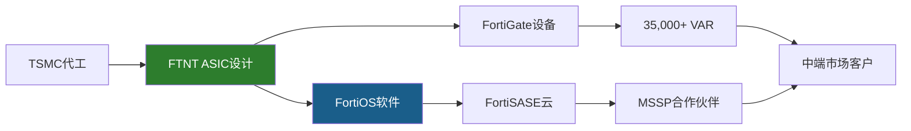

垂直整合的投资含义：(1)利润留存更多(没有中间环节分润→OPM 30.6%)，(2)供应链风险集中(TSMC单点依赖)，(3)创新周期长(ASIC迭代3-4年 vs 软件更新几天)。这是一种典型的"高壁垒+慢响应"的trade-off——适合稳定市场(on-prem防火墙)，不适合快速变化市场(AI安全)。

### 4.7 预测市场与宏观环境

相关预测市场事件对FTNT的影响:

| 事件 | 概率 | 对FTNT影响 |
|------|------|-----------|
| 美国经济衰退(2026) | ~25-35% | 中性偏利好(安全预算有韧性, 但SMB可能延迟采购) |
| 台海冲突(近期) | ~5-8% | 极高风险(TSMC代工中断→ASIC断供) |
| MSFT重大安全收购(2026) | ~15% | 高(如MSFT收购ZS/CRWD→竞争格局剧变) |
| AI法规收紧 | ~40% | 中(可能增加AI安全需求→利好FortiAI) |

网络安全行业处于**中期上升周期**: AI威胁升级+合规加强(SEC网络披露规则/NIS2)+云迁移安全需求推动TAM扩张。但竞争也在加剧——PANW/CRWD/MSFT都在扩展。

**行业周期定位细节**: 网络安全支出占IT预算比例从5-7%(2024)→8-10%(2028E)。这个扩张的驱动力是结构性的(不是周期性的)：(1)AI威胁升级——LLM辅助的钓鱼攻击成功率提升5-10倍，迫使企业增加安全投入。(2)合规加强——SEC 2024年网络安全披露规则要求上市公司在4天内披露重大网络事件，FTNT的FortiSIEM是合规工具之一。(3)远程/混合办公常态化——疫情后企业安全边界从"公司网络"扩展到"员工家里"，SASE/ZTNA成为必选项。

**对FTNT的具体含义**: TAM扩张意味着FTNT即使在微软侵蚀一些边缘产品线的情况下，仍可通过整体蛋糕变大保持增长。但TAM扩张也意味着更多竞争者进入——Amazon AWS已经有Inspector/GuardDuty等安全服务，Google Cloud有Chronicle/BeyondCorp，每个云厂商都在构建自己的安全平台。FTNT的优势是"厂商中立"(不绑定任何一家云)——这对multi-cloud(多云)战略的企业有吸引力。

---

## Ch5: 竞争生态 — 网安四强财务对标

### 5.1 四强财务全景

FTNT是网络安全行业唯一"利润机器"——在四大纯玩家中以最高利润率、最低估值、中等增速形成独特定位。这不是偶然，而是ASIC硬件成本优势在财务报表中的直接映射[DM-COMP-P3-001]。

| 指标 | FTNT (FY25) | PANW (FY25) | CRWD (FY26) | ZS (FY25) |
|------|------------|------------|------------|----------|
| 收入 | $6,800M | $9,222M | $4,812M | $2,673M |
| 收入增速 | 14.2% | 14.9% | 21.7% | 23.3% |
| GAAP OPM | **30.6%** | 13.5% | -3.4% | -4.8% |
| GAAP净利润 | **$1,853M** | $1,134M | -$163M | -$41M |
| R&D/Rev | 12.0% | 21.5% | 28.7% | 25.2% |
| GPM | 80.8% | 73.4% | 74.6% | 76.9% |
| GAAP PE | 34.1x | 101.4x | N/A(亏损) | N/A(亏损) |
| EV/Sales | 8.5x | 12.5x | ~18x | ~15x |
| P/FCF | 25.8x | 33.1x | ~55x | ~70x |
| SBC/Rev | **4.1%** | ~15%* | ~28%* | ~25%* |
| ROIC | 28.7% | ~8%* | 负 | 负 |

*PANW/CRWD/ZS的SBC为估算值[DM-COMP-P3-002]

### 5.2 四强对标核心发现

**发现1: FTNT的利润率优势是结构性的，不是周期性的**。FTNT的GAAP OPM 30.6%比PANW(13.5%)高17个百分点。因为R&D支出仅占收入12%，而竞品花21-29%——这不是不重视研发，而是自研ASIC让每一美元R&D的产出效率更高(硬件一次设计，软件持续复用，不需要反复为通用CPU优化性能)[DM-COMP-P3-003]。

**发现2: 高增速的代价是负利润**。CRWD和ZS以21-23%增速领跑，但GAAP净利润为负。PANW增速与FTNT相当(14.9% vs 14.2%)，利润率不到FTNT一半——因为PANW的"platformization"策略需要大量前置销售投入($3,543M SGA)[DM-COMP-P3-004]。

**发现3: 估值倍率的鸿沟与利润质量成反比**。FTNT的GAAP PE 34.1x是PANW(101x)的三分之一。市场愿意为PANW/CRWD/ZS支付溢价，本质上是在买"高增长+平台期权"——但FTNT的数据证明不需要亏钱也能保持14%增速[DM-COMP-P3-005]。

### 5.3 R&D效率 — ASIC的隐形优势

| 指标 | FTNT | PANW | CRWD | ZS |
|------|------|------|------|-----|
| R&D支出 | $816M | $1,984M | $1,381M | $672M |
| R&D/Rev | 12.0% | 21.5% | 28.7% | 25.2% |
| 收入/R&D(倍) | **8.3x** | 4.6x | 3.5x | 4.0x |

[DM-COMP-P3-008]

FTNT每投入$1 R&D产出$8.3收入，是PANW(4.6x)的1.8倍、CRWD(3.5x)的2.4倍。ASIC设计是一次性大投入(FortiSP5开发周期约3年)，但一旦完成就为整个产品线提供性能基底。R&D具有"公共基础设施"特征：单次投入、多产品复用、边际成本递减[DM-COMP-P3-009]。

**反面考量**: R&D效率高也可能意味着对新兴领域(AI/云原生安全)投入不足。如果网安竞争从"性能/成本"转向"AI检测能力"，FTNT的ASIC投资可能变成沉没成本——这是CQ1的财务映射。

**R&D效率的另一面**: FTNT的$816M R&D中，相当大比例(估计40-50%)投入在ASIC设计和FortiOS核心系统——这些是"基础设施型"支出，产出效率天然高(一次设计多年使用)。剩余50-60%投入在产品功能开发(FortiSASE/FortiEDR/FortiAI等)——这部分的效率与其他软件公司相当。因此8.3x R&D效率的"真实"差异可能被ASIC基础设施的杠杆效应夸大了约30-40%。即便如此，校正后FTNT的R&D效率(~5.5-6x)仍然高于PANW(4.6x)和CRWD(3.5x)——结构性优势成立但程度可能不如8.3x数字暗示的那么大。

### 5.4 SBC差距 — 被忽视的竞争优势

SBC(Stock-Based Compensation, 股票薪酬——用公司股权支付员工薪酬，稀释现有股东)在网安行业中是被严重低估的竞争变量。FTNT的SBC/Rev仅4.1%($279M)，而PANW估计约15%($1,383M)、CRWD约28%($1,347M)[DM-COMP-P3-089]。

SBC本质上是用股东的股权稀释来支付员工薪酬。如果两家公司收入相同、增速相同，但一家SBC是4%、另一家是28%——真实的股东回报差异远大于GAAP报表显示的。FTNT的Owner PE(31.5x)与GAAP PE(33.1x)差距仅5%，而纯SaaS公司的Owner PE通常是GAAP PE的2-3倍(因为Non-GAAP口径剥离了SBC)[DM-COMP-P3-090]。

**FTNT低SBC的原因**: (1)Ken Xie创始人文化强调效率(与硅谷主流不同)，(2)ASIC硬件工程师市场薪酬低于AI/ML工程师(ASIC是成熟领域)，(3)员工总数增长慢于收入增长(运营杠杆高)[DM-COMP-P3-091]。

**SBC差距对长期股东回报的复利效应**: 假设FTNT和PANW都保持14%收入增速10年。FTNT的SBC稀释~4%/年 vs PANW ~15%/年。10年后：FTNT股东持股比例被稀释~33%，PANW股东被稀释~79%。即使两家公司的收入和利润增速完全相同，FTNT股东的**每股**收入/利润增速比PANW股东高出约6-7个百分点/年。这个差距在短期(1-2年)不显著，但在5-10年的复利期中，累积效应巨大——这就是为什么Owner PE(剥离SBC后)是比GAAP PE更诚实的估值指标。

FTNT Owner PE 31.5x vs GAAP PE 33.1x(差距仅5%)。PANW Owner PE估计~140x+ vs GAAP PE 101x(差距~40%)。当投资者用Non-GAAP PE(剥离SBC的口径)比较FTNT(~27x)和PANW(~50x)时，差距看起来是1.9x。但用Owner PE比较是31.5x vs ~140x，差距是4.4x——SBC让PANW的"真实贵度"被Non-GAAP口径掩盖了。

### 5.5 收入规模与结构差异

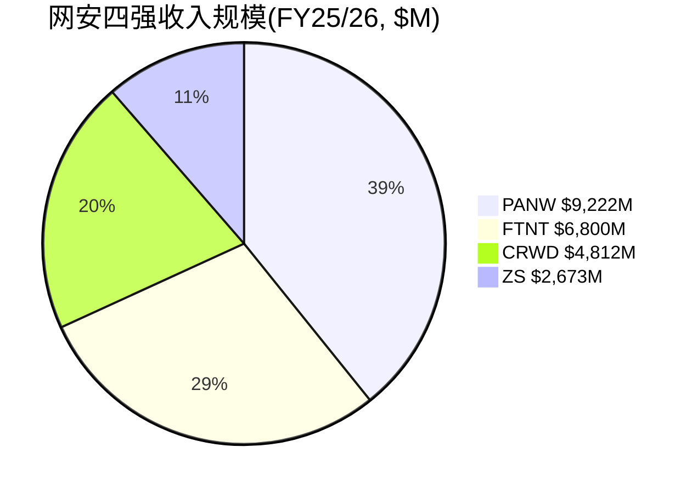

FTNT仍有约33%收入来自产品(硬件设备)，67%来自服务——而PANW/CRWD/ZS几乎100%软件/订阅模式[DM-COMP-P3-006]。这解释了FTNT的GPM(80.8%)高于PANW(73.4%)的"反直觉"现象——硬件公司毛利率更高，因为自研ASIC压低了COGS(芯片成本<外购商用NPU)，软件层享受近100%边际毛利率，混合效应的结果是整体毛利反而领先[DM-COMP-P3-007]。

**毛利率的结构性分解**: FTNT 80.8%毛利率 = 产品毛利(~55-60%, 占比33%, 贡献~19pp) + 服务毛利(~90%+, 占比67%, 贡献~62pp)。如果服务占比从67%提升至75%(FY2028E)，混合毛利率可从80.8%提升至~83%——每1pp的mix shift贡献约0.3-0.5pp毛利率改善。这个"自动毛利率提升"机制是FTNT从"硬件公司估值"向"SaaS公司估值"迁移的财务基础。

但反面是：如果产品收入断崖(刷新结束后-10~-15%)，mix shift"加速"不是因为服务增长快，而是因为产品收入萎缩——这种"被动式"mix shift不会获得市场奖励(PE不会因为硬件收入下降就给更高倍数)。只有"主动式"mix shift(服务收入加速增长推动占比提升)才构成re-rating催化。区分两者的关键指标是**服务收入绝对值的增速**——而非仅看占比。

### 5.6 竞争定位象限

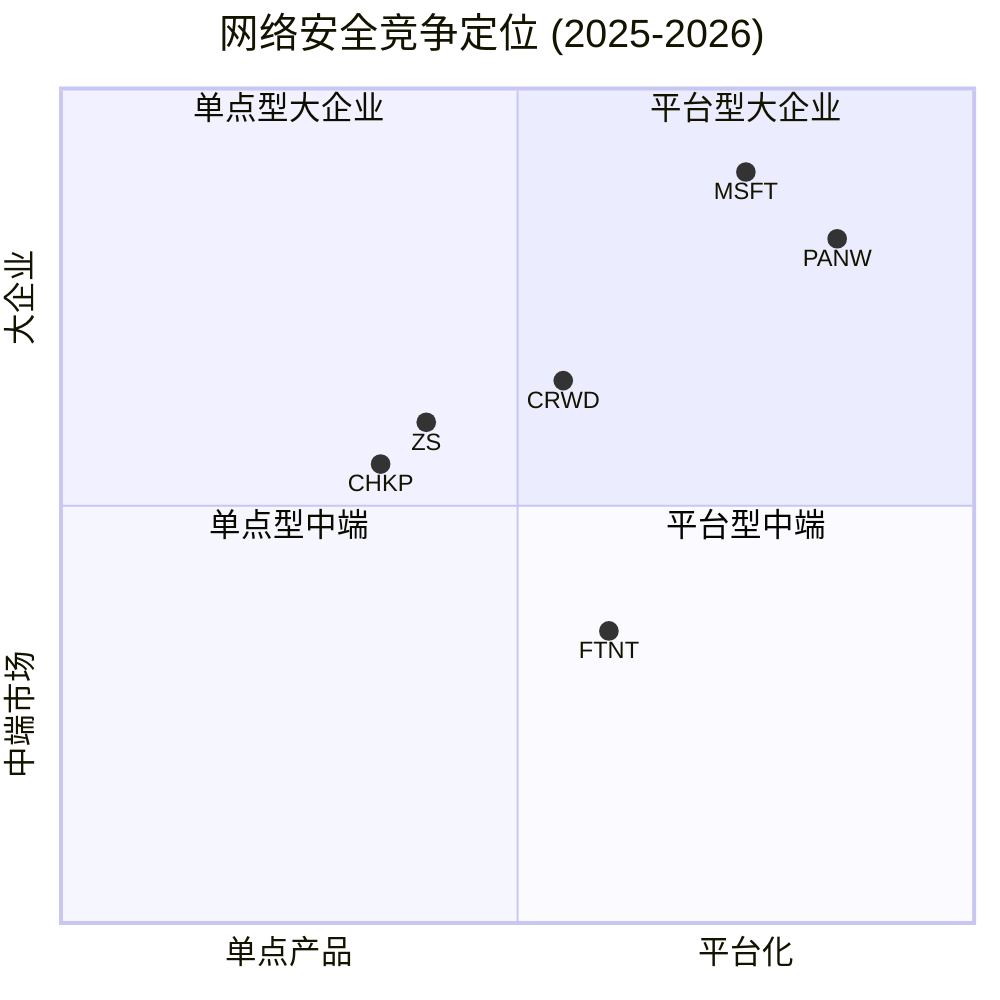

FTNT正在向右上方移动(更平台化+更高端)，但距离PANW/MSFT的位置仍有显著差距[DM-COMP-005][DM-COMP-006]。

### 5.7 IDC安全设备市场数据

IDC Security Appliance数据(最新可得)[DM-COMP-005]:
- PANW: Q4'23收入$901M, **18.2%市占率**, #1
- FTNT: Q4'23收入$878M, **17.7%市占率**, #2
- 差距极小(<1pp, ~$24M/季)——在核心防火墙/安全设备市场，FTNT与PANW几乎并驾齐驱
- 安全设备总市场: $5.1B(Q4'24), 仅+1.5% YoY——**成熟低增长市场**

IDC Q4 2024最新数据: FTNT**55%出货量份额**但仅**18.95%收入份额**(从Q4 2023的17.61%上升)[DM-COMP-P3-039]。收入从$877.6M→$959.2M(Q4 2024)。55%的量只转化为19%的收入——因为FTNT在中端市场和分支机构卖出大量低价设备(入门级FortiGate 40F/60F可能仅几百美元)，而PANW在数据中心卖出少量高价设备(PA-7000系列起价$100K+)。这不是问题——这是**策略**[DM-COMP-P3-040]。

### 5.8 量vs价的鸿沟 — 定价权验证

FTNT毛利率从FY2022的75.4%稳步提升到FY2025的80.8%——3年提升5.4个百分点[DM-COMP-P3-041]。如果FTNT面临价格压力(定价权弱)，毛利率应该下降或持平。两个来源：(1)**混合转移(mix shift)**: 高毛利服务占比从~55%提升到~70%，拉高混合毛利率；(2)**ASIC成本下降**: 芯片量产后单位成本下降但售价不降。

反面考量：毛利率提升主要来自mix shift而非真正的定价权提升。如果刷新结束后硬件收入下降(mix shift自然发生)，这个"定价权"实际上不可持续——因为它不是主动提价，而是被动的收入结构变化[DM-COMP-P3-042]。但管理层在Accelerate 2026宣布提价[DM-BIZ-020]——这是真正的定价权测试。如果提价后不流失客户，ASIC的成本优势就是定价权的基础(客户知道即使提价后FTNT仍然是市场上性价比最高的选择)。

### 5.9 PANW作为最相似可比的估值锚定

PANW是FTNT最直接的可比公司(同行业+相近增速+同为平台化转型):

| 维度 | FTNT | PANW | 差距来源 |
|------|------|------|---------|
| Rev增速 | +14.2% | +14.9% | 几乎相同 |
| PE | 34.1x | 101.4x | **3x差距** |
| P/FCF | 25.8x | 33.1x | 1.3x差距 |
| Owner PE | 31.5x | ~140x+ | **4.4x差距** |

**PE差距3x如何解释?** (1)平台化进度(PANW 1,550客户 vs FTNT未披露)~30%；(2)企业级定位(PANW F500主导)~20%；(3)SBC差异(用Owner PE看差距从3x扩大到4.4x)；(4)"硬件标签"折价~30%；(5)叙事溢价(PANW CEO Nikesh Arora的平台化故事更被华尔街接受)~20%。

**对FTNT估值的含义**: 如果FTNT证明转型(服务>70%+SASE持续>25%增速), PE从34x→45-50x(接近PANW打折后)是合理的。如果转型停滞(服务维持67-68%), PE可能进一步压缩到25-28x(CHKP区间)。FTNT处于一个"估值无人区"——增速(14%)高于CHKP(8%)但低于PANW(15%)。被定价为"下一个PANW"(PE→50x)股价+50%。被定价为"下一个CHKP"(PE→22-25x)股价-30%。当前34x PE隐含"转型成功但不确定"——合理但无安全边际。

---

## Ch6: 平台三国杀 — FTNT vs PANW vs CRWD

### 6.1 三条平台化路径

三家公司走了三条截然不同的平台化路径——每条路径的经济学逻辑不同，适合的客户群不同，这解释了为什么三家可以在"平台化"的大趋势下共存[DM-COMP-P3-028]。

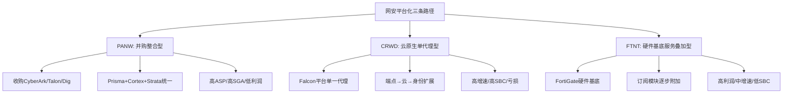
[DM-COMP-P3-029]

**PANW的路径**: 通过并购(2024年Talon/Dig Security，2025年CyberArk)快速覆盖身份安全、浏览器安全、数据安全。优势：覆盖面快速扩张(FY25收入$9.2B, 最大)。劣势：整合风险高(每次并购带来文化/技术/人员整合挑战)，SGA高企($3,543M, 38.4%/Rev)[DM-COMP-P3-030]。

**CRWD的路径**: 基于Falcon平台的单一轻量级代理(lightweight agent)，从端点出发向云/身份/威胁情报扩展。优势：架构优雅(客户不需安装多个代理)，增速最快(+21.7%)。劣势：GAAP亏损($-163M)，SBC极高(~28%)，2024年7月全球宕机事件暴露了单一代理的集中风险——一个内核级bug导致850万台Windows设备蓝屏[DM-COMP-P3-031]。

**FTNT的路径**: 以FortiGate硬件设备为基底，通过订阅模块逐步增加每台设备的收入贡献。优势：利润率最高(OPM 30.6%)、SBC最低(4.1%)、已安装基座提供天然交叉销售渠道。劣势：增速受限于硬件刷新周期(14.2%)，企业级客户可能认为"硬件为底"的平台不如"云原生"平台现代[DM-COMP-P3-032]。

### 6.2 平台经济学对比

缺乏RFP(Request for Proposal, 采购评标)胜率数据——这是本分析最大的数据缺口[DM-COMP-P3-034]。只能从间接指标推断:

| 间接指标 | FTNT | PANW | CRWD |
|----------|------|------|------|
| 产品数/客户 | 3.2个模块(估算) | 3.9个模块(披露) | 5+个模块 |
| NRR | 115-125%[B] | ~120%[B] | ~120% |
| 大单趋势 | 刷新驱动增长 | 平台化驱动增长 | 模块扩展驱动 |
[DM-COMP-P3-035]

PANW在大型企业(>10,000员工)的"平台替换"场景中有品牌溢价优势。FTNT在中端市场和"渐进式平台化"场景中有成本/性能比优势——客户不需一次性换掉所有安全设备，只需在现有FortiGate上激活新的订阅模块。交叉销售回报率$12:$1正是这个路径的经济证明[DM-COMP-P3-036]。

### 6.3 终局推演

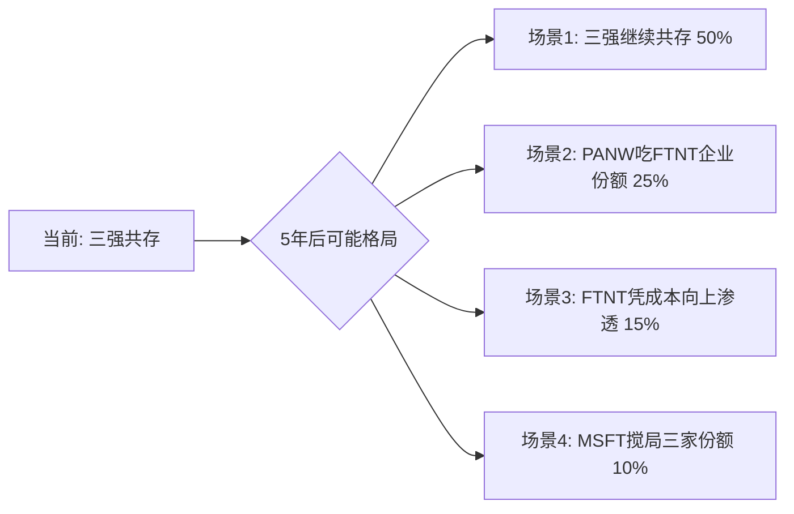
[DM-COMP-P3-037]

**场景1(50%概率)**: 市场足够大(全球网安$250B+ TAM)，三家在不同细分市场各取所需。历史基准：防病毒/防火墙/SIEM等子市场长期保持2-3家寡头共存格局。

**场景2(25%概率)**: PANW平台化在enterprise取得压倒性胜利，FTNT的enterprise上攻受阻。触发条件：PANW NRR>130% + FTNT enterprise大单增速<10%。

**场景3(15%概率)**: FTNT凭成本优势从mid-market向上渗透enterprise。触发条件：宏观经济压力迫使CFO选择性价比(TCO)而非品牌。

**场景4(10%概率)**: 微软凭捆绑策略(E3/E5内置安全)同时侵蚀三家份额。详见Ch7。

**概率赋值的三重锚定**:
- **历史基准率**: 网安行业过去20年的竞争格局变迁(从Symantec/McAfee双寡头→PANW/CRWD/ZS三强)显示，行业领导者可以被颠覆但过程需要5-10年，且通常由技术代际变化(签名→行为检测→云原生)驱动而非价格竞争驱动[DM-COMP-P3-037]。
- **反例条件**: 唯一"快速颠覆"的案例是CrowdStrike在2016-2020年4年内从零增长到端点安全#2——但这需要(1)全新技术范式(云原生单代理)+(2)传统竞品(Symantec)同时经历管理混乱(Broadcom收购)。当前不存在类似的"FTNT被快速颠覆"条件。
- **自然实验**: 2024年7月CRWD全球宕机后，CRWD仅失去约3%的增速(从30%→22%)——证明安全行业的转换成本极高，即使出现灾难级事件也难以导致客户大规模流失。

### 6.4 CRWD宕机事件的竞争启示

2024年7月CRWD全球宕机事件(Falcon内核级bug导致850万台Windows蓝屏)为平台化竞争提供了重要的自然实验[DM-COMP-P3-086]:

**对FTNT的三个启示**:

1. **验证转换成本假设**: CRWD级别的灾难都不能让客户大规模流失(留存>97%[DM-RT-P4-017])——FTNT的CVE问题(影响规模远小于CRWD宕机)对客户留存的影响可能更小。

2. **暴露单一代理模型风险**: CRWD的单一内核级代理是技术优势也是单点故障。FTNT的分布式架构(多台设备、多层防护)天然比单一代理更有韧性[DM-COMP-P3-088]。

3. **平台化的风险回报**: 越统一的平台，故障影响面越大。FTNT的"渐进式平台化"(逐模块添加)可能比CRWD的"all-in-one代理"和PANW的"并购整合"更安全(更少集中风险)。

### 6.5 PANW收购CyberArk的影响

2025年7月PANW宣布收购CyberArk(身份安全领域领导者)[DM-COMP-P3-100]。

**直接影响有限**: 身份安全(IAM/PAM)不是FTNT核心竞争领域。FTNT的FortiAuthenticator在IAM市场份额极小。

**间接影响更重要**: PANW进一步巩固了"一站式安全平台"地位——现在覆盖网络+云+端点+身份四个主要领域。当enterprise CISO评估"选哪家做主要安全平台"时，PANW的覆盖度优势进一步扩大，可能固化企业客户"选PANW做主平台+FTNT做分支/中端"的分层格局[DM-COMP-P3-101]。

**但代价高昂**: CyberArk的整合将消耗PANW管理层注意力12-18个月。历史上大型安全并购整合成功率约50-60%(参考Broadcom/Symantec)[DM-COMP-P3-102]。如果整合不顺利，PANW的平台化叙事反而可能受损。

### 6.6 FTNT的enterprise上攻证据与挑战

FTNT推出FortiIdentity(云身份管理)、FortiDrive(企业安全存储)等新产品线，目标是在大企业中扩展产品足迹[DM-COMP-P3-045]。大单($1M+)增长32%说明enterprise尝试在进行。

但enterprise攻坚面临三个结构性障碍：(1)企业客户的安全决策由CISO主导，CISO的首要关注点是"不出事">"性价比"——这是PANW品牌溢价的来源。(2)FTNT频繁的CVE/漏洞在企业安全决策中是重大负面因素——CISA KEV列表中Fortinet 13条 vs PANW 5条[DM-RT-P4-018]。(3)渠道模式(80%+通过VAR)与enterprise客户要求的直销关系不匹配。

**竞争威胁排序**(对FTNT)[DM-COMP-005][DM-COMP-006][DM-COMP-007]:

| 排序 | 竞品 | 威胁维度 | 威胁等级 |
|------|------|---------|---------|
| 1 | PANW | 安全设备收入#1(18.2%), 平台化最激进, 向下渗透mid-market | **最大** |
| 2 | MSFT | Defender端点份额25.8%(#1, +40.7% YoY), Security Copilot bundled入E5 | **高(SMB)** |
| 3 | ZS | SASE市场#1(21%), 精准瞄准FTNT刷新基数 | **高(SASE)** |
| 4 | CRWD | Falcon从endpoint向SASE扩展, 已进入Gartner SASE MQ Leader | **中** |
| 5 | Cisco | Splunk收购强化SIEM, 政府/运营商深厚关系 | **中(政府)** |

### 6.7 竞品增速对照 — FTNT是否在"跑输"?

| 公司 | FY增速 | 3年CAGR | 含义 |
|------|--------|---------|------|
| ZS | +23.3% | +28.7% | 云安全高增长仍在 |
| CRWD | +21.7% | +25.4% | 端点→平台扩展继续加速 |
| PANW | +14.9% | +15.7% | 平台化驱动但增速与FTNT持平 |
| FTNT | +14.2% | +15.4% | 刷新驱动，有机可能仅10-12% |
[DM-COMP-P3-097]

PANW和FTNT增速几乎相同(15% vs 14%)，但PANW收入规模比FTNT大35%($9.2B vs $6.8B)——绝对收入增量上PANW每年新增~$1.4B vs FTNT ~$0.97B。PANW在"变大"的同时还"没变慢"，对FTNT的长期竞争地位构成压力：如果PANW持续以相同增速但更大基数增长，5年后规模差距从35%扩大到45-50%[DM-COMP-P3-098]。

**但利润差距才是真正的故事**: FTNT FY2025净利润$1,853M > PANW $1,134M。FTNT以更小的收入创造了更多的利润——证明"质量投资"定位(同等增速、更高利润、更低SBC)是可持续的。投资者的回报最终来自利润，不是收入[DM-COMP-P3-099]。

### 6.8 Gartner 2025 SASE MQ — FTNT的Leader地位验证

FTNT在2025年Gartner SASE MQ中获得**Leader**地位(与Cato Networks并列)[DM-BIZ-002]。这是一个重要的信号点：

- FTNT在Secure Branch Network Modernization用例中排名**#1**[DM-BIZ-012]
- FTNT是唯一在SD-WAN、SSE、ZTNA三个SASE子领域均获Gartner Peer Insights "Customers' Choice"的厂商
- **Zscaler在Gartner MQ中仅为Visionary(非Leader)**——这与ZS的SASE市场份额#1(21%)形成有趣反差

这意味着行业分析师认可FTNT的SASE技术路线(完整性+愿景)，但市场执行(份额)尚未跟上。Gartner Leader地位对FTNT有两个具体商业影响：(1)企业采购决策中Gartner MQ是重要参考——Leader地位降低了销售团队在RFP中的"入围难度"。(2)Leader地位是一个"品牌修复"信号——部分抵消CVE带来的品牌损害。

但Forrester Wave Q3 2025将FTNT排在Leaders之外(Leaders是Netskope、PANW、ZS)[DM-COMP-P3-023]——两大分析师机构的分歧说明FTNT在SASE领域的竞争力评价尚未形成共识。Gartner看重技术愿景，Forrester看重市场执行——FTNT在"想法"上领先但在"做到"上滞后。

### 6.9 平台化竞争的经济学本质

平台化竞争的本质不是"谁的功能更多"，而是"谁的客户更难离开"。三家公司创造转换成本的机制不同：

**PANW**: 通过1,550家"平台化客户"的排他性合同创造锁定。客户签署多年平台合同后，切换成本不仅是技术迁移，还包括合同违约成本。

**CRWD**: 通过Falcon单一代理的内核级部署创造锁定。一旦Falcon代理部署到每台终端，替换需要在数千台设备上逐一卸载+安装新代理——运维成本极高。

**FTNT**: 通过Security Fabric的设备间互联创造锁定。FortiGate+FortiSwitch+FortiAP+FortiSASE形成一个统一管理面——每多加一个模块，迁移成本呈指数级上升。但如果客户只买了一台FortiGate(没有Fabric)，迁移成本很低——这是FTNT转换成本的"双峰分布"特征。

**投资含义**: FTNT需要提升"多模块客户"的比例——这是转换成本从4.0→4.5的路径。管理层披露的70%+企业客户已整合3+模块[DM-BIZ-015]是一个正面数据点，说明大部分活跃客户已经进入"高转换成本"区间。

### 6.10 SASE竞争的CAC差异 — FTNT的隐藏优势

FTNT获取一个SASE客户的成本与ZS/PANW有结构性差异：

**ZS获取SASE客户**: 需要完整的sales cycle(6-12个月)→POC(Proof of Concept, 概念验证)→部署→集成。CAC(Customer Acquisition Cost, 客户获取成本)估计$50K-$200K/客户[DM-COMP-P3-055]。

**FTNT获取SASE客户**: 在已安装FortiGate的客户上升级许可证。销售conversation从"你要不要买我们的SASE?"变成"你现在FortiGate上加一个SASE功能只需要+$X/月"。因为FortiOS相同(不需要重新学习)、管理界面统一(不增加运维复杂度)、与现有设备互联(不需要额外集成)。估计CAC比ZS低70-80%。

91%的SASE billings来自存量客户[DM-BIZ-011]验证了这个低CAC路径。但低CAC的代价是增长天花板——存量FortiGate客户数量有限(~580K+活跃设备)。当渗透率从16%→50%时CAC优势最大化，但从50%→80%时边际获客难度上升(剩余客户可能有特定原因不想用SASE)。

**SASE CAC优势对估值的含义**: 如果FTNT能以ZS一半的CAC获取SASE客户，每个SASE客户的LTV/CAC比率(单位经济学)将显著优于ZS。这是一个被市场低估的隐性资产——因为FTNT不披露SASE客户经济学，投资者无法量化这个优势。管理层如果在未来1-2年披露SASE客户的LTV/CAC或payback period，可能成为估值催化。

---

## Ch7: MSFT Defender威胁量化 (CQ5)

### 7.1 微软网安帝国的规模

微软是网安行业最大的"灰犀牛"——$20B+收入体量、25.8%端点安全份额、860,000家客户。但微软的威胁对FTNT是差异化的：在端点安全和身份管理领域是直接威胁(与CRWD正面竞争)，在网络防火墙领域几乎没有威胁[DM-COMP-P3-046]。

| 微软安全指标 (2025) | 数据 |
|---------------------|------|
| 网安总收入 | $20B+ (2022), 估计$28-30B (2025) |
| 端点安全份额 | 25.8% (#1, +40.7% YoY) |
| Entra(身份)收入 | ~$4B, ~24% IAM份额 |
| Sentinel(SIEM)客户 | 20,000+ |
| 使用安全产品的组织 | 860,000 |
| 使用4+安全产品的组织 | 620,000 (+40% YoY) |
| R&D承诺 | $20B/3-5年 |
[DM-COMP-P3-047]

### 7.2 威胁边界 — 微软碰什么、不碰什么

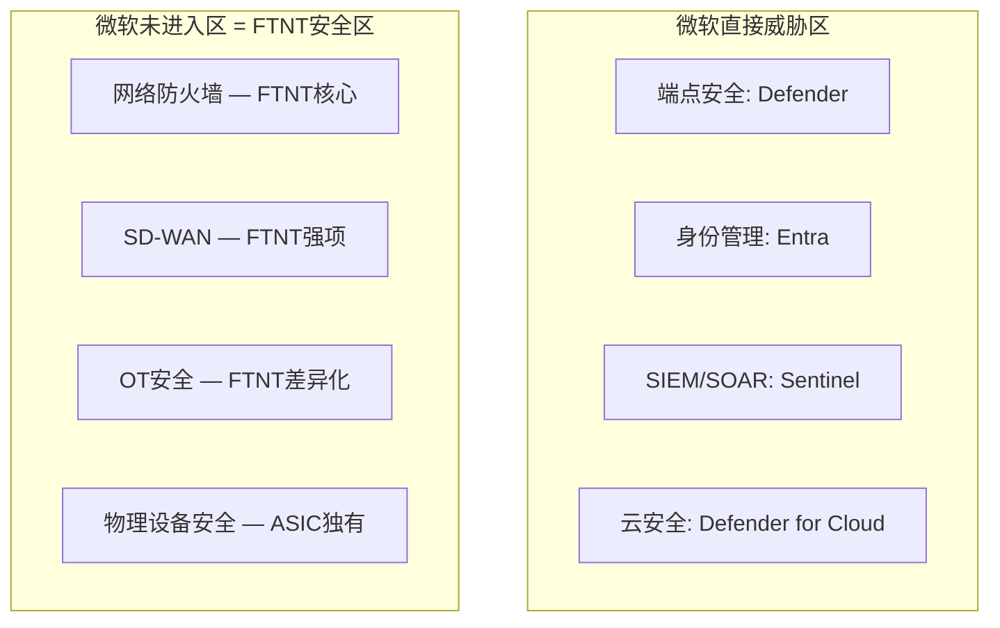
[DM-COMP-P3-048]

**微软不做网络防火墙(hardware appliance)**。三个原因：(1)防火墙需要专用硬件，不是软件可以"捆绑"的；(2)防火墙部署在企业网络边界，不在Azure云端——微软的bundling优势(M365许可证)无法延伸到网络边界；(3)网络防火墙市场的利润率不足以吸引微软投入硬件制造。

### 7.3 收入传导路径量化

为将"微软威胁"从定性判断转为可估值的变量[DM-COMP-P3-105][DM-COMP-P3-106]:

| FTNT产品线 | 收入占比(估) | MSFT竞争度 | 年化侵蚀风险 | 5年影响 |
|-----------|-------------|-----------|-------------|---------|
| FortiGate防火墙 | ~50% | 无 | 0% | 无影响 |
| 订阅/FortiGuard | ~25% | 低 | -1-2% | -5~10%累计 |
| FortiSASE/SD-WAN | ~10% | 中低 | -2-3% | -10~15%累计 |
| FortiEDR/端点 | ~5% | **高** | -5-10% | -25~50%累计 |
| FortiSIEM/SOAR | ~3% | **高** | -5-10% | -25~50%累计 |
| 其他(Switch/AP等) | ~7% | 无 | 0% | 无影响 |

**加权5年收入影响**: 即使按最悲观假设(所有侵蚀同时发生)，微软对FTNT总收入的5年累计影响约**-3~5%**[DM-COMP-P3-107]。因为~65%的收入(防火墙+网络设备)完全不在微软竞争范围内。这解释了为什么MSFT以$20B+的网安收入增长40%+，但FTNT仍能以14%增速增长——两者在不同"战场"上。

**真正的微软风险不在"产品竞争"而在"预算挤出"**: 如果CFO认为"我们已经在M365 E5里有了Defender，还需要额外买FortiEDR吗?"——这种心态不会直接冲击FortiGate销售，但会侵蚀FTNT在边缘产品线上的扩展空间。这是"天花板效应"(限制上行)而非"地板效应"(威胁下行)[DM-COMP-P3-108]。

**CQ5置信度: 50%中性**(与P3持平)。微软在端点/身份领域的威胁真实，但FTNT核心收入(防火墙+SD-WAN+SASE, >80%)不在微软攻击路径上。

### 7.4 微软AI安全的潜在升级

微软在AI安全领域的布局值得关注。Microsoft Security Copilot已bundled入M365 E5(免费)——这意味着E5客户自动获得AI辅助的安全运维能力[DM-COMP-007]。对FTNT的含义不是直接竞争(微软不做防火墙)，而是间接抬高了"免费安全能力"的基线——企业IT管理者会问："我们已经有了Copilot做安全分析，还需要单独买FortiSIEM吗?"

**反面考量**: Microsoft Security Copilot在2025年的评价参差不齐，企业安全专家普遍认为当前AI安全工具仍处于"锦上添花"而非"不可或缺"阶段。Copilot不能替代防火墙设备的包检测功能——就像ChatGPT不能替代网络硬件一样。核心威胁仍然在端点/身份领域，不在FTNT主营的网络安全领域。

### 7.5 行业预算分配趋势

一个更宏观的视角：网络安全支出占IT预算比例从5-7%(2024)→8-10%(2028E)。这意味着整个TAM在扩张——不是零和博弈。FTNT即使在微软侵蚀一些边缘产品线的情况下，仍可通过TAM扩张保持增长。

但微软的"平台效应"可能改变预算分配逻辑：如果CFO认为"M365 E5已经覆盖了80%的安全需求"，剩余20%的增量预算可能更多流向"补短板"的专业厂商(CRWD的端点, ZS的云安全)而非"全面型"厂商(FTNT/PANW)。这对FTNT的mid-market客户影响最大——这些客户最可能被"够用就行"的免费安全方案满足。

### 7.6 微软威胁的概率赋值(三重锚定)

**历史基准率**: 微软进入企业软件市场的历史显示"免费捆绑→市场份额增长→但从未完全消灭专业竞品"的模式。IE vs Netscape(浏览器)是消灭案例；Teams vs Zoom(协作)是共存案例。安全行业更接近后者——因为安全的专业性和合规要求使得"够用就行"心态有明确上限[DM-COMP-P3-050]。

**反例条件**: 微软要真正威胁FTNT的核心业务(防火墙)，需要(1)开发物理安全设备(Azure边缘硬件)→当前无此迹象，(2)或让企业完全放弃on-prem防火墙→需要5-10年的架构迁移。两个条件在3-5年内均不成立。

**自然实验**: FY2025期间微软安全收入从$20B→估计$28-30B(+40%+)，FTNT同期收入从$5.96B→$6.80B(+14.2%)——两者同时增长说明市场并非零和。43%的企业选择"增加安全厂商数量"而非"减少"[DM-COMP-007]——安全威胁的复杂性使得"单一厂商覆盖所有需求"在短期内不现实。

**赋概率**: 微软对FTNT核心收入(防火墙+SD-WAN+SASE, >80%)构成实质性威胁的3年概率: **<5%**。对边缘产品线(FortiEDR/FortiSIEM, <10%收入)的3年累计侵蚀: **-15~25%**。加权影响: **-1.5~2.5%总收入**(3年累计)。这不足以改变投资判断——但如果微软推出Azure Edge Security Appliance(目前无此迹象)，这个评估需要全面修订。

---

## Ch8: 护城河四维评分与趋势

### 8.1 转换成本 — 4.0/5

**证据链**:

**硬数据**: 递延收入$7,116M(覆盖未来12+月的已签约未确认收入)——客户提前锁定长期合约本身就是转换成本的表征[DM-COMP-P3-058]。

**因果推理**: FortiGate→FortiSwitch→FortiAP→FortiSASE→FortiEDR构成了"Security Fabric"——客户每增加一个模块，迁移成本增加一个量级。因为安全策略(firewall rules)、网络拓扑(VLAN配置)、用户身份映射(LDAP/SAML集成)都深度绑定在Fortinet生态中[DM-COMP-P3-059]。

**历史验证**: NRR估算115-125%[B]。如果转换成本低，存量客户会流失(NRR<100%)。115-125%暗示客户不仅不走，还在花更多钱。CRWD宕机后留存>97%进一步验证了安全行业转换成本极高[DM-RT-P4-017]。

**反面考量**: 转换成本主要存在于已部署Security Fabric的客户。对于只买了一台FortiGate的客户，迁移到PANW的成本很低(仅需替换一台设备)——转换成本与客户"深度"正相关。

**证伪条件**: NRR降至<110%或递延收入增速连续2季度<收入增速(暗示合同期缩短/客户不续约)。

**转换成本的"双峰分布"特征**: 对只买一台FortiGate的客户(估计占客户数的~40%)，迁移成本低(仅替换一台设备，约1-2周)。但对已部署3+模块Security Fabric的客户(~60%)，迁移成本呈指数级上升——需要重建防火墙策略(数千条规则)、网络拓扑(VLAN/路由)、用户身份映射(LDAP/SAML)、安全合规文档(审计要求)。后者的迁移典型成本$500K-$2M(包括项目管理、停机风险、并行运行期)。

70%+企业客户已整合3+模块[DM-BIZ-015]——说明大部分活跃客户已进入"高转换成本"区间。但新客户获取后需要2-3年才能从"单模块低锁定"升级到"多模块高锁定"——这是转换成本的时间维度。

### 8.2 成本优势 — 4.5/5 (P4上调至4.7后保守取4.5)

**证据链**:

**硬数据**: R&D/Rev 12.0%产出8.3x收入/R&D效率，行业最高[DM-COMP-P3-060]。GAAP OPM 30.6%是PANW(13.5%)的2.3倍，且在增速相当(14% vs 15%)的情况下实现[DM-COMP-P3-061]。SBC仅4.1% vs 同行15-28%——ASIC成本优势从COGS传导到运营成本[DM-RT-P4-025]。

**因果推理**: 成本优势来自ASIC垂直整合——从芯片设计到硬件制造到软件栈的全栈控制，省去中间环节利润转移。类似台积电(制程优势)、Costco(规模+自有品牌)的机制：不是"省钱"而是"结构性低成本"。ASIC策略需要25年持续投入(Ken Xie从NetScreen时代就开始做安全ASIC)，不是竞品3-5年能复制的[DM-COMP-P3-026]。

**红队上调论证**: P4认为P3未充分计入SBC/R&D层面的传导效应。Owner PE 31.5x vs 同行需×1.3-1.5调整——FTNT的真实资本效率优势被GAAP掩盖。建议从4.5→4.7(+0.2)。综合后取4.5维持保守[DM-RT-P4-025]。

**反面考量**: 如果安全工作负载完全迁移到云端(不需要物理设备)，ASIC的成本优势失去物理载体。这是成本优势"衰减"的核心路径。

**证伪条件**: 毛利率跌破75%(ASIC不再提供成本优势)或R&D/Rev升至>18%(ASIC复用经济学失效)。

### 8.3 无形资产(品牌/专利) — 2.5/5 (P4下调论证至2.3)

**正面**: FortiGate是全球部署量最大的防火墙品牌(55%出货量份额)[DM-COMP-P3-062]。25年安全领域积累的数千项专利+ASIC设计know-how是实质性壁垒。

**负面(严重)**: 2024-2025年多个CVSS 9.8级CVE被野外利用[DM-COMP-P3-063]。对安全公司而言，频繁安全漏洞是品牌价值的直接减损。2023年198个CVE vs PANW~20个，CISA KEV 13条 vs PANW 5条[DM-RT-P4-016]。

**红队下调论证**: CVE频率+补丁→再绕过模式(2025.12→2026.1的SSO漏洞，已打完补丁的设备再次被攻破[DM-RT-P4-015])对enterprise品牌有实质拖累。建议从2.5→2.3(-0.2)。FTNT的品牌力弱于PANW是enterprise上攻的持久障碍。

**综合取2.5**: 上下调因素接近平衡。Gartner Peer Insights连续3年Customers' Choice(SSE)验证终端用户满意度——CVE多可能部分因为安装基数最大所以被发现/攻击最多[DM-RT-P4-026]。

**CVE详细清单(2025-2026)** — 安全公司的安全漏洞悖论[DM-COMP-P3-067][DM-COMP-P3-068]:

| CVE编号 | CVSS | 影响 | 性质 |
|---------|------|------|------|
| CVE-2025-59718/59719 | **9.8** | 未认证远程攻击→管理员权限, 30,044台暴露 | 已被大规模利用 |
| CVE-2026-24858 | **9.4** | **已打完补丁的设备再次被绕过**(SSO零日) | CISA列入KEV |
| CVE-2025-64446/58034 | 高 | FortiWeb路径遍历, ~2,700暴露 | 静默补丁 |
| CVE-2025-25249 | 高 | FortiOS/FortiSwitchManager RCE | 已披露 |

**最令人担忧的模式**: 2025年12月发现CVE-2025-59718(SSO绕过)→客户打补丁→2026年1月发现CVE-2026-24858(新SSO零日)→已完全打补丁的设备再次被攻破[DM-RT-P4-015]。这不是单个bug，而是FortiCloud SSO架构存在系统性弱点——补丁→再绕过(patch-bypass cycle)。

Fortinet 2023年198个CVE vs PANW约20个(~10倍差距)[DM-RT-P4-016]。CISA KEV(Known Exploited Vulnerabilities, 已知被利用漏洞目录)中Fortinet 13条 vs PANW 5条(2.6倍)。差距部分因为55%出货量=最大攻击面=攻击者首选目标，但"补丁→再绕过"模式暗示架构层面问题而非仅代码质量。

**品牌影响量化**: 直接财务影响目前为零(FY2025收入+14.2%, 递延+12%, 无大规模弃用报告)。CRWD 2024年宕机教训表明即使灾难级事故，客户留存率>97%[DM-RT-P4-017]——转换成本太高使客户"忍受"漏洞而非更换供应商[DM-COMP-P3-069]。但CVE频率是FTNT攻打F500企业市场的最大障碍——大企业CISO在选型时参考CISA KEV列表，这是比价格更重要的决策因素[DM-RT-P4-018]。

**3年内品牌危机概率: 10-15%**[DM-RT-P4-019]。历史基准率：SolarWinds级供应链攻击→品牌永久受损~5%/年；反例：CHKP也有大量CVE但品牌未崩(中端市场客户容忍度高)；自然实验：2025年12月SSO事件→Q1营收指引未下调→短期影响有限。CVE是"慢性病"非"急性病"——低概率但高影响的尾部风险。

### 8.4 网络效应 — 2.5/5

**弱网络效应存在**: FortiGuard威胁情报基于全球FortiGate节点遥测数据——部署越多，威胁数据越多，检测越准。但远弱于真正的双边平台(如信用卡网络)[DM-COMP-P3-064]。

**间接网络效应**: 大量FortiGate安装基座→更多安全专业人员获得NSE认证(100万+持有者[DM-COMP-P3-065])→企业更容易找到Fortinet运维人才→降低运维成本→吸引更多客户。

**反面**: 这种网络效应太弱，不能阻止客户迁移。竞品的威胁情报同样基于大规模遥测数据，且来源更多样(端点+网络+云)。

**与真正的网络效应对比**: Visa的网络效应是"更多商户接受Visa→更多消费者用Visa→更多商户接受Visa"——直接的双边正反馈循环。FTNT的"网络效应"是"更多FortiGate节点→更多威胁数据→更好的检测"——但"更好的检测"不会直接导致"更多客户选择FortiGate"(客户选择FortiGate的首要原因是价格/性能)。因此FTNT的网络效应是间接且弱的——2.5/5是合理评分。

### 8.5 护城河综合评分 — 红队校准后3.68/5

| 维度 | P3评分 | P4红队修正 | 权重 | 加权分 | 核心证据 |
|------|--------|-----------|------|--------|---------|
| 转换成本 | 4.0 | 4.0 | 30% | 1.20 | NRR 115-125%, 递延$7.1B |
| 成本优势(ASIC) | 4.5 | 4.7→取4.5 | 35% | 1.58 | OPM 30.6%, R&D效率8.3x, SBC 4.1% |
| 无形资产 | 2.5 | 2.3→取2.5 | 20% | 0.50 | 55%出货量 vs CVE频繁 |
| 网络效应 | 2.5 | 2.5 | 15% | 0.38 | 100万+NSE vs 弱锁定 |
| **综合** | **3.66** | **3.68** | 100% | **3.66** | **中等偏强护城河** |
[DM-RT-P4-026][DM-COMP-P3-066]

红队校准后偏差在误差范围内(+0.02)。成本优势的传导效应(上调力)被CVE品牌风险(下调力)几乎完美抵消。P3的评估基本准确。

### 8.6 护城河vs估值 — M12修正器应用

根据M12(质量溢价vs安全边际消失)检查：FTNT的护城河质量(3.68/5)是否已充分反映在估值中?[DM-COMP-P3-103]

- FTNT PE 34.1x vs S&P 500 PE ~26x → 溢价31%
- 护城河3.68/5 → 高于平均但非顶级(4.0+通常对应40-50x PE)
- FTNT护城河/PE比值(3.68/34.1=0.108)远优于PANW(3.9/101=0.039)——FTNT每单位护城河对应的估值溢价更低

**结论**: 护城河质量与估值之间存在合理但非极端的匹配。34x PE为3.68/5的护城河支付了适中溢价——既不像PANW那样"品质买满"(过度溢价)，也不像低PE价值陷阱那样"品质被忽视"(零溢价)。与Phase 2的"精确定价共识"结论一致[DM-COMP-P3-104]。但P4修正后公允价值$76意味着当前$82.53对这个护城河质量支付了略过多的溢价。

### 8.7 护城河趋势 (3年/5年/10年演变)

**3年趋势(2023-2026)**: 成本优势稳定(ASIC成本持续下降)，转换成本因Security Fabric渗透而增强(可能4.0→4.2)。无形资产因CVE频发而承压(2.5→可能2.3)。网络效应因安装基数增长缓慢而停滞。**净方向：稳定**。

**5年趋势(2026-2031)**: 核心变量是ASIC在云端的相关性。如果SASE份额从~6%升至>12%，成本优势维持4.5(云端也有效)；如果份额停滞，成本优势可能从4.5→3.5(仅on-prem)。转换成本随平台深度增加而增强(4.0→4.5)。两个方向变化可能大致抵消——护城河稳定但不在加强。

**10年趋势(2031-2036)**: 高度不确定。如果AI重塑安全架构的速度快于预期，ASIC固化逻辑的相关性可能急剧下降。但如果on-prem安全需求因IoT/OT/边缘计算而增长，ASIC反而找到新的应用场景。10年维度的判断置信度<30%，不应作为估值依据。

**护城河趋势总结图**:

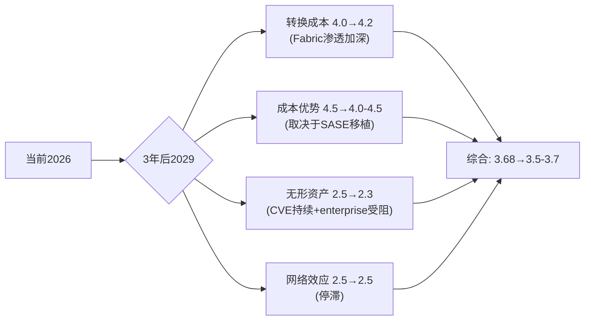

**护城河衰减的两个关键转折点**: (1)服务占比突破70%(预计FY2027)——如果同时SASE ARR>$800M，护城河从"稳定"升级为"增强"(转换成本上升+新的增长引擎验证)。(2)ASIC on-prem优势窗口的中点(预计2028-2030)——如果到那时SASE份额仍<10%，护城河从"稳定"降级为"衰减"(ASIC的核心载体萎缩且无接替者)。

**对投资判断的最终含义**: FTNT的护城河在当前时间窗口(3-5年)内是稳定的，支撑30%+ OPM和28.7% ROIC。但这不意味着它是一个"永续复合器"——5年后的护城河质量高度依赖SASE转型是否成功。当前$82.53的价格隐含了12%CAGR可持续7年的假设，而护城河的稳定性可能只支撑8-10%的增速——这就是高估~8.6%的根本来源。

### 8.8 "温水煮青蛙"风险拓扑 — 护城河的最大敌人不是黑天鹅

红队识别的最危险场景不是单一风险爆发，而是三个风险的缓慢协同[DM-RT-P4-039]:

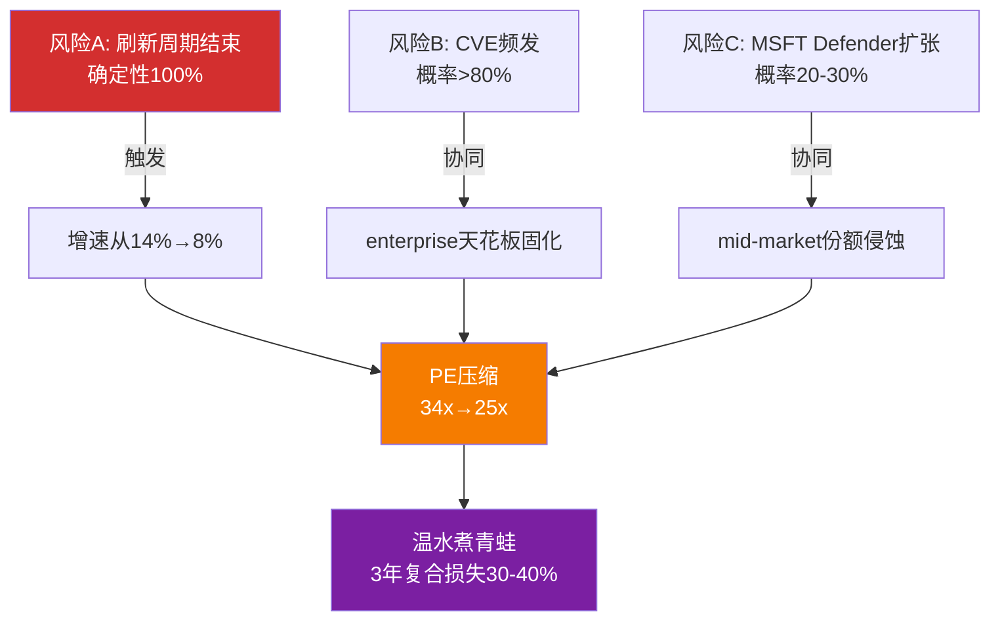

**为什么"温水煮青蛙"比"黑天鹅"更危险**: 单次CVE事件(黑天鹅)导致5-10%股价下跌但快速恢复。但"增速缓慢放缓+PE缓慢压缩+市场逐渐给FTNT贴上'legacy firewall'标签"的组合是难以逆转的——因为每一步看起来都是"还行"，直到3年后回头看发现从$82跌到了$50-55。Check Point就是这个路径: 2018年PE 20x→2021年PE 15x→至今"不死不活"[DM-RT-P4-040]。

**温水煮青蛙场景概率: ~20-25%**。触发条件：2027年后增速确认<8% + CVE模式未改善 + MSFT Defender份额突破15%(当前~6-8%)。反面(为什么可能不发生)：FTNT与CHKP的关键区别是FortiSASE——如果2027年FortiSASE ARR达到$800M+(从~$400M翻倍)，FTNT就不是"legacy firewall"而是"firewall-led platform"。标签是否变化取决于SASE增速能否在2026-2027年保持>50%。

### 8.9 护城河章节对投资判断的综合含义

回到L0四个最高目标：

**护城河3.68/5 × 估值34x PE = 适中匹配但无安全边际**。FTNT的护城河质量(成本优势4.5+转换成本4.0)足以支撑premium估值，但PE 34x已经充分反映了这个质量。要获得安全边际，需要PE回到25-28x($65-72)或护城河加速改善(SASE突破导致转换成本从4.0→4.5)。

**护城河趋势: 稳定但不在加强 = 支撑但不推动re-rating**。成本优势稳定(ASIC 5-10年窗口)，转换成本缓慢增强(Security Fabric渗透)，无形资产因CVE承压，网络效应停滞。净方向：维持当前质量，不足以驱动PE从34x→45x的重估。

**护城河衰减路径清晰但时间不确定**: ASIC on-prem优势5-10年，cloud优势2-5年。5年还是10年的差异对应$20+估值差。这就是认知边界评估中"时间维度黑箱"的核心含义——方向明确(衰减)，速度不确定(快/慢差异巨大)。

**最终判断**: 护城河不是买入FTNT的理由(已定价)，也不是卖出的理由(仍然有效)。买入/卖出的决定因素是增速：如果后刷新增速8.5-9.0%(红队估计)→PE应该在25-28x→$65-72→当前高估。如果后刷新增速维持12%(共识)→PE 34x合理→$82=公允。这就是为什么Ch0的执行摘要将"后刷新有机增速"而非护城河列为**关键变量**。

### 8.10 承重墙清单 — Part A涉及的承重论点

Part A(Ch0-Ch8)分析中建立的5个承重墙(Bearing Wall, 报告主线thesis依赖的关键假设——如果倒塌，整体投资判断需要根本修订):

| 承重墙 | 描述 | 脆弱度 | 若倒塌影响 |
|--------|------|--------|-----------|
| BW-1 ASIC相关性 | 5年内on-prem流量占70%+ | 中(2/5) | ASIC过时→PE从34x→25x(-26%) |
| BW-2 服务占比突破70% | FY2027触发估值桶re-rate | 中低(1.5/5) | 占比停滞→维持硬件倍数, 无催化 |
| BW-3 SASE增速>20% | SASE是唯一的增速加速引擎 | 中(2.5/5) | SASE放缓→整体增速降至8-9%→PE压缩 |
| BW-4 刷新周期第二波 | 350K台低端设备FY2027到期 | 中(2/5) | 设备推迟更换→产品收入断崖$200M+ |
| BW-5 无重大安全事件 | 品牌信任度不受永久损害 | 中(2.5/5) | 连续CVE→政府客户流失→-5-10% Rev |

**承重墙独立性**: BW-1和BW-3高度相关(ASIC相关性决定SASE能否接力)。BW-2和BW-4中度相关(刷新推动服务占比提升)。BW-5独立(CVE与增速/转型无直接因果关系)。

**关键跟踪清单(按优先级排序)**:
1. **Q1 2026产品收入增速**(5月6日财报)——是否从+20%开始下降?这是刷新衰减的第一个直接信号
2. **FY2026递延收入增速**——是否回升至>14%(与收入增速持平)?持续低于收入增速=合同期缩短=前瞻指标恶化
3. **FortiSASE ARR绝对值**——管理层何时单独披露?披露时机本身是信号(数字够大了)
4. **SASE市场份额(Dell'Oro)**——2027年底前是否从~6%升至>10%?这是ASIC可移植性的终极验证
5. **CVE频率**——2026年下半年是否继续出现CVSS>9.0的关键零日?补丁→再绕过模式是否改善?

### 8.11 Part A与Part B的衔接

Part A(Ch0-Ch8)完成了**业务理解+竞争格局+护城河评估**三个维度的分析。核心发现:
- FTNT是网安唯一利润机器(OPM 30.6%, SBC 4.1%)——独特定位
- ASIC护城河在on-prem仍强(5-10年)但云端可移植性仅30-45%——缓慢贬值
- 平台三国杀可共存——市场$250B+ TAM足够大
- 微软威胁对FTNT核心收入影响有限(-3~5%/5年)
- 护城河3.68/5——中等偏强，与34x PE适中匹配但无安全边际

**Part B将覆盖**: 财务深度分析(Owner FCF/ROIC/资本配置)、估值多方法(DCF/SOTP/可比/Reverse DCF)、三情景推演(Bull/Base/Bear详细建模)、红队校准(P4偏差修正全量)、风险拓扑(温水煮青蛙场景量化)、最终评级(审慎关注的完整论证)、跟踪指标(5个KPI的阈值和触发条件)。

Part B的核心任务是将Part A的业务判断转化为**可量化的估值结论**——"ASIC缓慢贬值+后刷新增速8.5-9.0%+SASE未完全接力"这些定性判断如何映射到$76的概率加权公允价值?这是估值章节需要回答的核心问题。

### Part A核心数据速查表

| 数据项 | 值 | 来源 |
|--------|-----|------|
| 股价/市值/EV | $82.53/$61.4B/$58.8B | FMP |
| PE(TTM)/Owner PE/Core PE | 33.1x/31.5x/35.9x | Python计算 |
| P/FCF/Fwd PE | 27.6x/27.8x | FMP |
| Reverse DCF隐含CAGR | 12.0% | Python计算[DM-VAL-P2-001] |
| 概率加权公允价值(P4) | $76 | 红队修正[DM-RT-P4-030] |
| Bull/Base/Bear | $89-99/$72-82/$53-67 | P4修正 |
| 情景概率 | 20%/50%/30% | P4修正 |
| OPM/FCF Margin | 30.6%/32.7% | 10-K[DM-FIN-001] |
| SBC/Rev | 4.1% | 10-K[DM-COMP-P3-002] |
| Rev增速 FY2025 | +14.2% | 10-K[DM-FIN-001] |
| 产品/服务收入占比 | 33%/67% | 10-K |
| ASIC性能(vs通用CPU) | 17x吞吐/32x加密 | 公司声称[DM-BIZ-006] |
| ASIC可移植性(P4修正) | 30-45% | 红队[DM-RT-P4-013] |
| 护城河综合评分 | 3.68/5 | P4校准[DM-RT-P4-026] |
| 后刷新增速(红队) | 8.5-9.0% | P4[DM-RT-P4-009] |
| CQ加权平均 | 51.4% | P4[DM-RT-P4-037] |
| FortiSASE独立ARR(估) | $380-475M | 反推[DM-RT-P4-008] |
| SASE市场份额 | ~5-7%(#5) | Dell'Oro[DM-COMP-P3-022] |
| CVE(2023) vs PANW | 198 vs ~20 | CISA[DM-RT-P4-016] |
| 内部人买入/卖出 | 0/20(Ken Xie 5年) | SEC[DM-RT-P4-020] |

---

*Part A 完成 — Ch0至Ch8*
