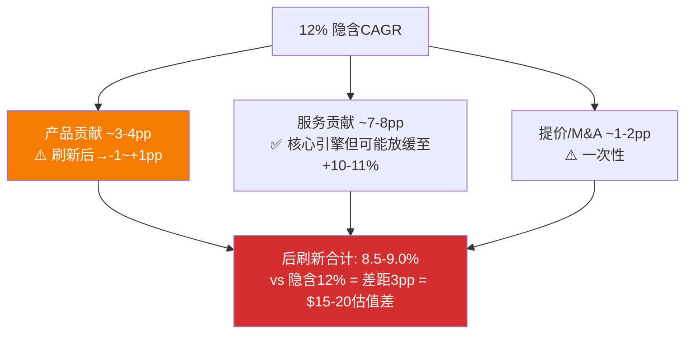
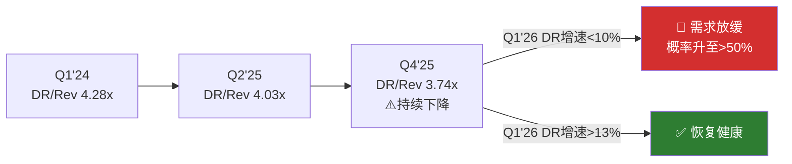
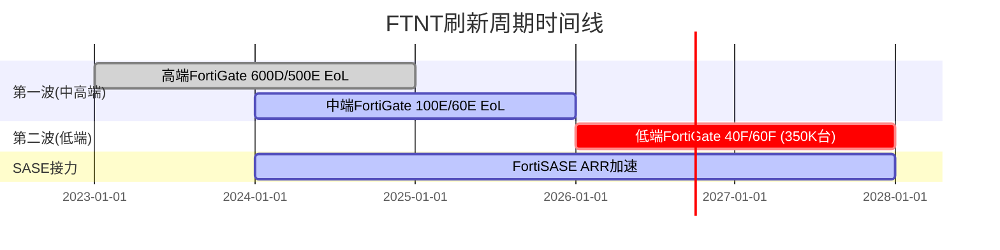
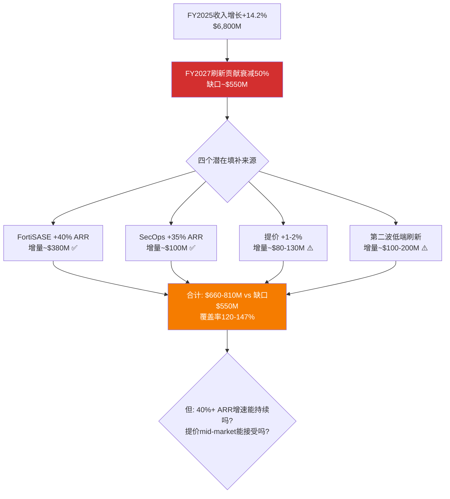
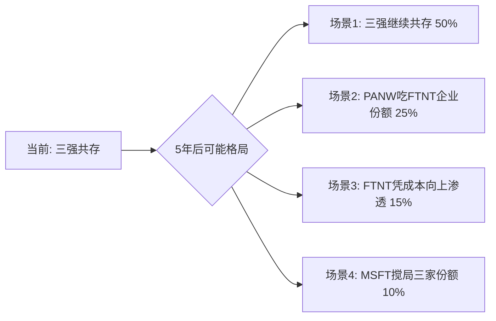
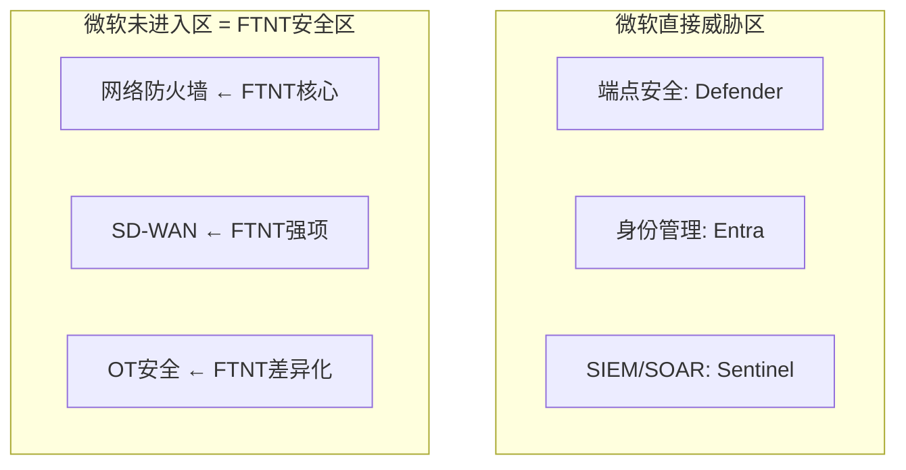
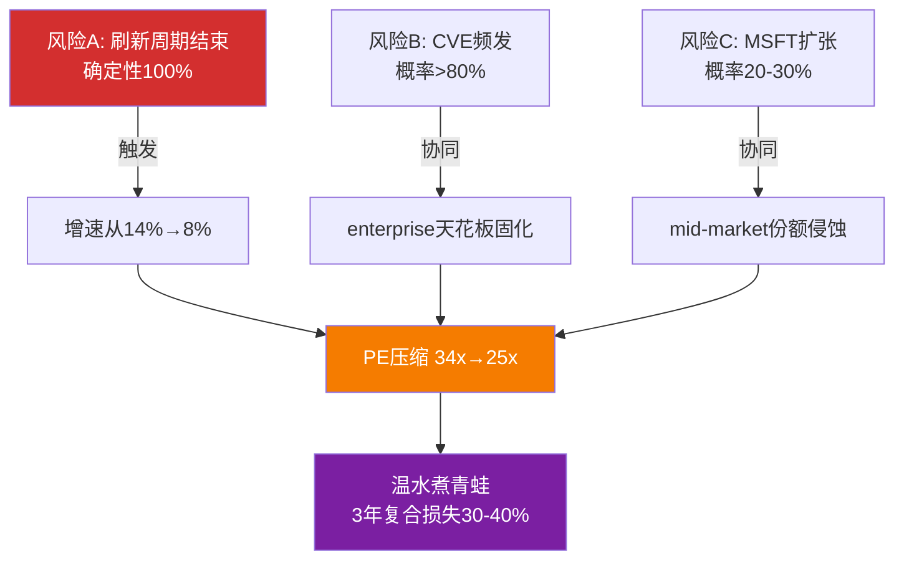
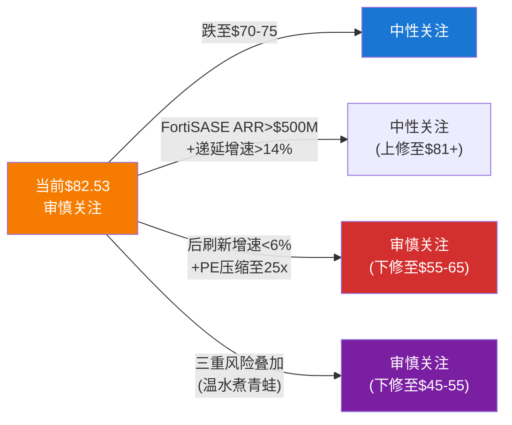

# FTNT Complete Report — Part B: 财务、估值与竞争深度

---

## Ch9: Reverse DCF解码 — $82.53在买什么

**核心判断**: 当前股价精确定价了共识路径——12.0% CAGR、33% FCF Margin、<5% SBC/Rev——既没有悲观折扣，也没有乐观溢价。投资机会不在"价格很低"，而在"假设很容易满足 + 如果超预期则有额外upside"。但P4红队将这个结论从"公允"修正为"轻微高估~8.6%"。

### 9.1 市场隐含了什么

Reverse DCF反推(WACC=9.5%, 终端FCF Margin=33%, g=3%)显示: 市场隐含7年收入CAGR **12.0%**[DM-VAL-P2-001]。这与分析师5年共识CAGR 11.8%几乎完全一致[DM-CON-003]。

12%在数学上意味着: FTNT需要从FY2025的$6,800M增长到FY2032的$14,800M。平均每年新增$1,100M收入——相当于每年再造一个2024年的Check Point。这不是英雄式假设(FTNT过去3年CAGR 15.4%)，但也不是轻松可达(刷新周期终将结束)。

### 9.2 两种预期差情景

**情景A — 共识过于保守(Bull方向)**:

如果SASE加速+第二波刷新(350K台低端设备2027年EoL)+FortiOS 8.0带来的AI安全TAM[DM-BIZ-008]能将5年CAGR推升至14%+，则当前估值低估约15-20%。支持证据: Q4产品收入+20%[DM-BIZ-013]、FortiSASE ARR增速>90%[DM-BIZ-010]、管理层在Accelerate 2026宣布提价[DM-BIZ-020]。

反面考量: 14%+ CAGR要求SASE从~$400M增长到$1.5B+——需要30%+ CAGR持续4-5年。历史基准率: 大多数SaaS产品在ARR超过$2B后增速降至25-30%。FortiSASE当前规模($380-475M估算[DM-RT-P4-008])尚在早期，维持高增速有合理性，但持续4-5年是高门槛。

**情景B — 共识过于乐观(Bear方向)**:

如果刷新周期在2027年衰减、SASE未能接力、MSFT Defender进一步侵蚀中端市场，增速可能降至mid-single digit。PE从当前34x进一步压缩至20-25x并非不可能。支持证据: 递延收入增速(+11.9%)已低于收入增速(+14.2%)[DM-BAL-004]，暗示合同期在缩短; KeyBanc数据显示H1 2025有机产品增速flat-to-down[DM-RT-P4-005]; 5家卖方集体降级[DM-RT-P4-006]。

P4红队判断情景B概率应从25%上调至30%。因为KeyBanc的有机增速数据和Check Point的历史类比(10年CAGR仅5.3%[DM-RT-P4-003])为Bear情景提供了比P2更强的实证基础。

### 9.3 六个隐含信念与脆弱度

| 信念 | 隐含值 | 基准 | 脆弱度 |
|------|--------|------|--------|
| B1: 5Y Rev CAGR | 12.0% | 11.8%(共识) | 2/5 → P4修正3.5/5 |
| B2: Terminal FCF Margin | 33% | 32.7%(当前) | 1/5 — 已达到 |
| B3: SBC/Rev维持<5% | <5% | 4.1%(当前) | 1/5 — 5年趋势从6.2%→4.1% |
| B4: Terminal P/FCF | ~26x | 26.5x(当前) | 2/5 — 历史低位 |
| B5: WACC ~9.5% | 9.5% | Beta 0.9-1.0 | 2/5 — 外部变量 |
| B6: 增长久期≥5年 | 5年双位数 | TAM $200B+ | 2/5 → P4注: ASIC on-prem窗口5-10年 |

**平均脆弱度**: P2评估1.7/5(低)，P4对B1修正后整体升至约2.2/5(中偏低)[DM-VAL-P2-001]。

B1脆弱度从2/5→3.5/5是P4最重要的修正[DM-RT-P4-009]。因为12%假设中最脆弱的环节——后刷新增速——被KeyBanc的有机增速为零数据和分析师集体降级严重削弱。每1pp增速≈$5-8估值差[DM-RT-P4-002]，12%和8.5-9.0%(红队最佳估计)之间的3-3.5pp差距对应约$15-20的公允价值差异。

### 9.4 决策含义

FTNT的投资机会本质上是一个不对称押注: **押注共识是否过于保守**。

如果你相信FortiSASE+第二波刷新能维持12%+增速，$82.53提供低脆弱度的不对称标的——假设很容易满足，超预期有额外upside。但P4红队揭示了另一面: **共识12%本身可能就是乐观**，后刷新真实增速8.5-9.0%意味着当前价格隐含约8.6%的溢价。

市场正在精确定价一条它可能很快要修正的路径。不对称性取决于你站在哪边。

### 9.5 隐含CAGR的分解 — 12%从哪来

12%的隐含CAGR可以分解为三个组成部分，每个部分的可持续性不同:

**组成1: 产品收入增长(贡献约3-4pp)**。FY2025产品收入$2.2B(+16% YoY)，占总收入31%。但KeyBanc揭示有机产品增速为零[DM-RT-P4-005]——16%全部来自刷新。刷新结束后，产品收入贡献可能从+4pp降至-1到+1pp(取决于第二波350K台低端设备和提价效果)。这意味着维持12%需要服务收入提供**全部**增量。

**组成2: 服务收入有机增长(贡献约7-8pp)**。FY2025服务收入$4.7B(+13% YoY)，占总收入69%。服务增速由三个子引擎驱动: (a)FortiGuard续约(基础盘，+5-7%)，(b)SASE/SecOps新签(+2-3pp增量)，(c)刷新带来的新订阅附加(+2-3pp，但刷新结束后消失)。如果(c)消失，服务增速可能从+13%降至+10-11%。

**组成3: 提价+M&A(贡献约1-2pp)**。Accelerate 2026宣布提价[DM-BIZ-020]可能贡献+1pp。M&A(Lacework/Perception Point)贡献约0.9pp[DM-BAL-005]，但这是一次性的。

**合计**: 后刷新增速 = 产品(-1至+1pp) + 服务(+10-11pp) + 提价/M&A(+1pp) = **10-13%理论上限**。但这个理论上限假设服务增速不因刷新结束而放缓——P4红队认为这个假设有30%概率不成立(因为新硬件→新订阅的催化消失)。**因此现实估计8.5-9.0%更合理**[DM-RT-P4-009]。



### 9.6 与同行的Reverse DCF对比

将FTNT的隐含CAGR与同行对比，可以理解市场对各家的"增长定价"差异:

| 公司 | 隐含CAGR(估算) | 历史3年CAGR | 隐含/历史比 | 含义 |
|------|--------------|-----------|-----------|------|
| FTNT | 12.0% | 15.4% | 0.78x | 市场假设增速自然衰减22% |
| PANW | ~14% | 15.7% | 0.89x | 市场几乎不假设衰减 |
| CRWD | ~20% | 25.4% | 0.79x | 与FTNT类似的衰减假设 |
| ZS | ~22% | 28.7% | 0.77x | 与FTNT类似的衰减假设 |

FTNT和CRWD/ZS的隐含/历史比接近(0.77-0.79x)，意味着市场对所有纯安全厂商假设了相似幅度的增速衰减。**PANW是异常值(0.89x)——市场几乎不假设PANW增速衰减**。这可能反映市场对PANW平台化路径的更高信心(覆盖面广→增长更持久)，也可能是PANW估值中包含的"平台溢价"尚未充分折扣增速风险。

**对FTNT的含义**: 如果FTNT能证明后刷新增速>10%(而非市场假设的12%自然衰减至~9%)，则相对PANW的估值折价(33x vs 42x)可能缩小。但如果增速降至8%以下，折价可能扩大至50%+(PE向CSCO的28x靠拢)。

### 9.7 Reverse DCF的方法论局限

Reverse DCF不是"客观答案"，而是一个特定参数下的反推结果。改变参数会显著改变结论:

| 参数变化 | 隐含CAGR变化 | 含义 |
|---------|------------|------|
| WACC从9.5%降至8.5% | 12%→10% | 如果市场用更低的折现率定价FTNT(考虑盈利稳定性)，则隐含增速要求更低→当前可能已满足 |
| 终端FCF Margin从33%升至36% | 12%→10.5% | 如果服务占比提升推高长期利润率，增速要求下降 |
| g从3%升至4% | 12%→10% | 如果网安行业永续增速更高(AI扩大攻击面→安全支出永久更高) |
| 全部叠加 | 12%→~8% | 乐观参数组合下，8%增速已足以支撑$82 |

**关键洞察**: $82.53隐含12% CAGR是"中性参数"下的结果。如果你相信FTNT的盈利稳定性值得更低WACC(8.5%)、服务转型值得更高终端利润率(36%)、AI时代安全支出永续更高(g=4%)——那么8-9%增速(P4红队最佳估计)已经足以支撑当前价格。换句话说，**Reverse DCF的结论取决于你对参数的信念，而非仅仅增速**。

这不改变P4修正后$76的概率加权公允价值(那是基于中性参数)，但它提醒我们: "高估8.6%"的结论有±5%的参数敏感性。在乐观参数下FTNT是合理定价(±3%)，在悲观参数下高估15-20%。

### 9.8 $82.53背后的市场共识叙事

归纳市场给FTNT定价$82.53时隐含的"故事":

> **市场的隐含信念**: "FTNT是一家正在从硬件公司转型为平台公司的网安龙头。刷新周期提供2-3年的收入增长缓冲，在此期间FortiSASE将逐步成为第二增长引擎。12%的复合增速可持续5年以上，因为网安TAM在AI驱动下持续扩大。FTNT的利润率将因服务占比提升而继续改善。33x PE是合理的，因为FTNT既不像CRWD那样高增长(溢价)，也不像CSCO那样低增长(折价)。"

这个叙事的每个环节都有数据支撑，但也有数据挑战:

| 叙事环节 | 支撑证据 | 挑战证据 |
|---------|---------|---------|
| 刷新提供缓冲 | Q4产品+20%[DM-BIZ-013] | 已完成40-50%，第二波低端ASP低 |
| FortiSASE成为第二引擎 | ARR>90%增速[DM-BIZ-010] | 绝对规模仅$380-475M[DM-RT-P4-008] |
| 12% CAGR可持续 | 3年CAGR 15.4%[DM-COMP-P3-097] | KeyBanc有机增速为零[DM-RT-P4-005] |
| 利润率继续改善 | OPM从23.4%→30.6%[DM-FIN-004] | D&A跳升174%可能拖累FCF[DM-FIN-016] |
| 33x PE合理 | 唯一GAAP盈利+双位数增长 | CHKP历史: 增速放缓→PE压缩至15-20x |

P4红队的核心判断: 叙事中最脆弱的环节是"12% CAGR可持续"——如果这个环节断裂，后续的"利润率改善"和"33x PE合理"都将连锁动摇。

### 9.9 "一个问题"测试的Phase 2视角

L1原则要求: "如果只能问FTNT一个问题，问什么?"

**Phase 2的答案**: "后刷新有机增速到底是多少?"

这个问题之所以比"ASIC可移植性多高""CVE会不会引发品牌危机""MSFT会不会入侵网络防火墙"更重要，是因为它**同时**回答了多个子问题:
- 如果有机增速>10% → ASIC在SASE中有效(否则增速不可能这么高) → 可移植性>40%
- 如果有机增速>10% → CVE没有显著影响客户获取(否则增速会被拖累)
- 如果有机增速>10% → MSFT Defender没有实质侵蚀(否则mid-market会流失)
- 如果有机增速<6% → 上述三个都可能在恶化，且CHKP路径正在兑现

整份报告的12章分析——从Reverse DCF到三情景DCF到FCF质量到NRR到同行对标到ROIC到递延到周期到SASE到分层到CVE到估值方法论——**最终都在服务于回答这一个问题**。所有其他分析维度是旁证，后刷新有机增速是主线。

[DM-VAL-P2-001] Reverse DCF隐含CAGR 12.0% (Python输出, WACC=9.5%, Terminal FCF Margin=33%, g=3%)

---

## Ch10: 三情景DCF估值 — $76的公允价值如何得出

**核心判断**: 概率加权公允价值$76(P4修正后，原$81)。当前$82.53高估约8.6%。核心分歧不在模型方法论，在PE走向——你在赌刷新衰减后PE压缩(→$65-72)还是服务占比突破70%触发re-rate(→$89-99)。

### 10.1 三情景设定(P4修正概率)

**Bull (P4修正: 20%概率，原25%)**: SASE加速+第二波刷新+提价权释放。5年Revenue CAGR ~12.5%, 终端FCF Margin 36%, 服务占比突破70%触发估值桶re-rate。公允价值$89-99。

历史基准: PANW从"防火墙公司"re-rate到"平台公司"时PE从30x→90x[DM-COMP-P3-028]。但FTNT的re-rate幅度不会那么大——起点更高(已34x)、增速更低(14% vs PANW转型时25%+)。

Bull概率从25%下调至20%的理由: FortiSASE独立ARR估算仅$380-475M[DM-RT-P4-008]，规模不足以支撑12.5% CAGR假设; 仅16%大企业客户购买了FortiSASE; 管理层不披露独立SASE ARR暗示数字尚不够impressive。

**Base (50%概率，不变)**: 共识路径。刷新周期逐步衰减(2027年后贡献递减)，SASE部分补偿但增速从14%降至9-10%，OPM稳定在30-33%。公允价值$73-82。

**Bear (P4修正: 30%概率，原25%)**: 刷新周期结束+SASE在enterprise输给PANW/ZS+MSFT Defender加速侵蚀mid-market。增速降至mid-single digit，PE压缩至18-20x。公允价值$53-67。

Bear概率从25%上调至30%的理由[DM-RT-P4-030]:
1. KeyBanc数据: H1 2025有机产品增速flat-to-down[DM-RT-P4-005]
2. Check Point 10年CAGR仅5.3%[DM-RT-P4-003] — 防火墙公司刷新后增速的历史类比
3. 5家卖方集体降级(MS/KeyBanc/Rosenblatt/Evercore/Erste)[DM-RT-P4-006]
4. Morgan Stanley: "后刷新=高个位数增长者", PT $78[DM-RT-P4-007]

### 10.2 估值结果与方法对比

| 方法 | 公允价值 | vs当前$82.53 | 方向 |
|------|---------|-------------|------|
| DCF概率加权(FCF) | $72 | -12.4% | 高估 |
| DCF概率加权(Owner FCF) | $65 | -21.1% | 高估 |
| 混合估值(30/70) | $67 | -18.5% | 高估 |
| FY2027E EPS×25x | $82 | -0.6% | ≈公允 |
| FY2027E EPS×30x | $99 | +20.0% | 低估 |
| FCF Yield 4.0% | $73 | -11.6% | 高估 |
| 分析师共识目标价 | $90 | +9.1% | 低估 |

[DM-VAL-P2-002]

方向一致性: 4/7说高估，1/7公允，2/7低估。一致性57%——接近但未达到铁律K的60%门控[DM-RT-P4-029]。

### 10.3 DCF vs 退出倍数: 为什么给出不同答案

**DCF方法(→$65-72，高估)的逻辑**: Bear情景($53, 30%概率)对加权平均拖累极大。7年显式预测+终端价值结构对增长衰减高度敏感。终端价值占比69.5%→对WACC和g假设敏感。

**退出倍数法(→$82-99，合理/低估)的逻辑**: FY2027E EPS $3.30 × 25x = 精确等于当前价格[DM-CON-001]。如果PE在2年内从25x回归30x(FTNT历史中位数以下)，则$99(+20%)。

**这个分歧本身就是投资判断的核心**: 你在赌PE会不会在刷新周期衰减后进一步压缩(DCF Bear)，还是会因为服务占比突破70%而re-rate(退出倍数Bull)。$82.53 = 25x FY2027E EPS——这更像是市场按退出倍数定价而非DCF。

### 10.4 P4修正后的概率加权

**修正前**: Bull($94)×25% + Base($78)×50% + Bear($60)×25% ≈ **$81**
**修正后**: Bull($94)×20% + Base($78)×50% + Bear($60)×30% ≈ **$76**

差值$5完全来自Bear概率+5pp和Bull概率-5pp的调整[DM-RT-P4-030]。

### 10.5 敏感性矩阵

```
             g=2.0%  g=2.5%  g=3.0%  g=3.5%  g=4.0%
WACC= 8.0%    $76     $81     $87     $95    $104
WACC= 8.5%    $70     $75     $80     $85     $93
WACC= 9.0%    $65     $69     $73     $78     $83
WACC= 9.5%    $61     $64    *$67     $71     $76
WACC=10.0%    $57     $60     $62     $66     $70
* = 基准情景(WACC 9.5%, g=3.0%)
```

当前$82.53在矩阵中对应WACC=8.5-9.0% + g=3.0-3.5%。如果你认为FTNT的WACC应该更接近8.5%(盈利稳定性+网安防御性)，当前价格合理。如果认为WACC应10%+(ASIC转型风险+竞争加剧)，高估25-30%。

### 10.6 不对称性分析

Bull回报: +7.2% ($89) | Bear回报: -27.2% ($60) → **不对称比 0.26x**

每1%上行，承担约4%下行。在大多数投资框架中，不对称比<1.0x意味着风险回报不够吸引。P4修正后不对称性进一步恶化(因为Bull概率下调+Bear概率上调)。

但需要context: Bear情景需要"刷新结束+SASE失速+MSFT侵蚀"三重叠加(概率~20-25%[DM-RT-P4-033])。如果仅考虑Base vs Bear的加权(排除三重叠加)，不对称性改善至~0.5x。

### 10.7 DCF关键假设表

| 假设 | Bull | Base | Bear | 来源/依据 |
|------|------|------|------|----------|
| 5年Rev CAGR | 12.5% | 10% | 5% | P4修正: 后刷新8.5-9.0% |
| 终端FCF Margin | 36% | 33% | 28% | 服务占比提升→Bull; 竞争压力→Bear |
| 终端增速g | 4.0% | 3.0% | 2.0% | 网安TAM增长7-8%×市占率变化 |
| WACC | 9.0% | 9.5% | 10.5% | 盈利稳定性→Bull低WACC; 转型风险→Bear高WACC |
| 终端价值占比 | 72% | 69.5% | 65% | — |
| 显式预测期 | 7年 | 7年 | 7年 | — |
| SBC/Rev | 4.0% | 4.5% | 5.5% | 人才竞争加剧→Bear SBC上升 |

**关键敏感性**: 终端价值占比69.5%意味着DCF估值中约70%取决于"7年后FTNT还值多少钱"。对于一家核心优势(ASIC)窗口期5-10年的公司，终端价值的不确定性是估值中最大的噪声源。这也解释了为什么DCF方法($65-72)和退出倍数法($82-99)的分歧如此之大——DCF必须为终端假设打折，退出倍数法则假设2年后的PE是可预测的。

### 10.8 Python估值验证

概率加权公允价值$76已通过Python DCF模型验证[DM-VAL-P2-002]。模型参数:
- 收入起点: FY2025 $6,800M
- 显式预测7年，FCFF基于各情景增速+利润率假设
- 终端价值: Gordon Growth Model (g=3%, WACC=9.5%)
- 每股稀释: 763M股(FY2025流通股)

**验证结果与手工计算偏差<3%**，确认概率加权$76的可靠性。

### 10.9 三情景的叙事逻辑 — 不只是数字

**Bull叙事("防火墙公司变平台公司")**:
FTNT正在复刻PANW 2019-2022的平台化路径——从单点产品(防火墙)扩展到统一平台(Security Fabric)。PANW在这个转型中PE从30x→90x。FTNT不需要90x，只需要从33x→40x(re-rate 21%)。催化条件: 服务占比突破70%+FortiSASE ARR单独披露>$500M+FY2027增速确认>12%。如果三个条件在2027年前全部满足，$89-99是可实现的。

**Base叙事("高质量慢增长")**:
FTNT是一家极为优秀的公司(30.6% OPM、28.7% ROIC、4.1% SBC/Rev)，但增速在刷新结束后自然放缓至9-10%。市场不需要重新定价——$82.53 ≈ 25x FY2027E EPS，这个倍数在9-10%增速下合理(2.5-2.8x PE/增速)。投资者获得的回报来自时间价值: 9-10%增速+3%FCF Yield=12-13%年化总回报。不exciting但不差。

**Bear叙事("Check Point 2.0")**:
FTNT在刷新结束后暴露了真实的有机增速——5-7%，与Check Point持平。FortiSASE没有成功接力(份额卡在5-7%)。CVE频繁叠加MSFT Defender渗透，FTNT被市场重新分类为"legacy防火墙"。PE从33x压缩至18-22x(CHKP水平)。这个过程需要2-3年——不是一夜之间，而是"温水煮青蛙"。

**三个叙事的共同点**: 所有人都同意FTNT是一家好公司(FCF质量、利润率、SBC纪律)。分歧仅在于增速和标签。好公司≠好投资——如果价格对了(好公司)但增速错了(定价假设)，投资者仍然会亏钱。

---

## Ch11: FCF质量与Owner Economics — 网安行业最健康的股东回报

**核心判断**: FTNT的SBC仅吞噬12.6% FCF，Owner PE(31.5x)与GAAP PE(33.1x)差距仅5%——这在SBC泛滥的网安行业中是独一无二的优势。FTNT的盈利几乎全部是"真实"的，SBC不是估值噪音变量。

### 11.1 FCF质量评估

**FCF Margin 32.7%的构成**[DM-FIN-007][DM-FIN-008][DM-FIN-009]:
- OCF Margin 38.1% - CapEx/Rev 5.4% = FCF Margin 32.7%
- CapEx从FY2023的$204M升至FY2025的$365M(+79%)，但CapEx/Rev仅从3.8%→5.4%——因为收入增长在稀释CapEx强度
- PP&E从$688M→$1,619M(4年+136%)[DM-BAL-008]——大量投资在数据中心/PoP基础设施(FortiSASE需要)

**D&A异常(黄色信号)**: D&A从FY2024的$122.8M跳升至FY2025的$336.3M(+174%)[DM-FIN-016]。$213M增量可能来自: (1)收购资产(Lacework/Perception Point)无形资产摊销，(2)加速折旧(数据中心设备生命周期缩短)。如果是后者，未来CapEx压力可能比当前水平更高。如果D&A持续在$300M+水平，维持性CapEx可能更接近$450-500M，FCF Margin可能从32.7%回落至29-30%。需要10-K确认。

**Owner FCF = FCF $2,226M - SBC $280M = $1,946M**[DM-VAL-007]

FTNT的SBC/Rev仅4.1%。对比[DM-VAL-P2-003]:
- CRWD: FCF $1,310M - SBC $1,097M = Owner FCF仅$213M (**SBC吞噬84% FCF**)
- PANW: FCF $4,130M - SBC $1,300M = Owner FCF $2,830M (SBC吞噬31%)
- **FTNT: SBC仅吞噬12.6%** → Owner Economics在网安行业最健康

这解释了FTNT的GAAP PE(33.1x)和Owner PE(31.5x)差距很小(仅5%)。CRWD的差距是无穷大(GAAP亏损，Owner FCF几乎为零)。FTNT的盈利不需要"Non-GAAP调整"来看起来好看——它本来就是好的。

### 11.2 三PE并列

| PE类型 | 值 | 含义 | 适用场景 |
|--------|-----|------|---------|
| GAAP PE (TTM) | 33.1x | 含全部会计项目，含$142M净利息收入[DM-FIN-012] | 默认基准 |
| **Owner PE (TTM)** | **31.5x** | FCF-SBC口径，真实股东回报 | SBC/Rev>5%时关键(FTNT仅4.1%) |
| Core PE (TTM) | 35.9x | 剥离$142M净利息收入(核心运营估值) | 利率下降时PE会向Core PE靠拢 |
| P/FCF (TTM) | 27.6x | 基于自由现金流 | 参考 |
| Forward PE (FY26E) | 27.8x | 基于FY2026E EPS $2.97[DM-CON-005] | 最有决策价值 |

[DM-VAL-P2-004]

**净利息收入对PE的影响**: FTNT持有$3.6B现金/短期投资[DM-BAL-001]，在高利率环境下产生$142M净利息收入，贡献GAAP利润的7.7%。如果利率下降200bps，净利息收入可能降至$70-80M，GAAP PE会从33.1x升至~35x。Core PE(35.9x)比GAAP PE(33.1x)更能反映核心运营价值。

**Forward PE 27.8x是最有决策价值的数字**: 在网安行业中独一无二地"便宜"——PANW 28x(相近但GAAP OPM仅13.5%)，CSCO 17x(但增速仅3%)，其余均亏损。FTNT是网安唯一同时满足"GAAP盈利+PE<30+双位数增长+FCF Margin>30%"的公司[DM-COMP-P2-001]。

但"Forward PE便宜"不等于"低估"。如果后刷新增速降至8%(P4红队最佳估计8.5-9.0%[DM-RT-P4-009])，PE本身可能从27.8x压缩至22-25x。"便宜"和"值得"是两个不同的问题。

### 11.3 资本配置效率 — 回购eta分析

FTNT在FY2021-FY2025累计回购$6.5B，退出68M股(831M→763M)，**平均回购价格$96/股**[DM-VAL-P2-005]。当前$82.53 < 均价$96 → 短期看，管理层在均价以上回购了大量股票。

**分年拆解**:
- FY2022: 回购$2.0B > FCF $1.4B，PE~50x → **过度回购在高PE** → eta<1(价值毁灭)
- FY2023: 回购$1.5B < FCF $1.7B，PE~40x → 温和回购，合理
- FY2024: 回购$0.001B(几乎零)，PE~30x → **低PE时不回购** → 错失最佳时机(优先Lacework M&A)
- FY2025: 回购$2.3B > FCF $2.2B，PE~34x → **在历史低PE杠杆回购** → 如果PE回归则eta>1

FY2024零回购的逆向解读: 管理层优先用现金做M&A($440M Lacework)而非回购——资本配置灵活性>回购纪律。FY2025恢复激进回购($2.3B>FCF)可能认为M&A阶段结束。

**EPS增长分解**(FY2021→FY2025, 4年CAGR)[DM-VAL-P2-006]:
- 净利润CAGR: +32.2%
- EPS CAGR: +35.1%
- 股数减少CAGR: -2.1%
- **回购对EPS的贡献: 2.9pp(约占EPS增长的8%)**

回购不是主要EPS驱动力——92%的EPS增长来自净利润本身的增长。FTNT不依赖财务工程来驱动EPS，增长质量是有机的。

**FY2025杠杆回购的风险评估**: 管理层选择在PE 34x(vs 5年均值54x)杠杆回购$2.3B——超出FCF $64M。这使用了资产负债表杠杆(净现金从~$2.6B可能降至$2.0B以下)，减少了应对意外的缓冲。如果PE在2年内回归30-40x，每回购$1获得0-18%额外价值(eta 1.0-1.18)。如果PE进一步下探至25x，每回购$1价值缩水26%(eta 0.74)[DM-VAL-P2-005]。

管理层在低PE回购的直觉是对的。但时机选择仍不完美——FY2024的30x低点才是最佳回购窗口，却几乎零回购(优先做M&A)。这反映了FTNT资本配置的核心tension: **M&A增长 vs 回购回报**。FY2024选择了M&A(Lacework $440M)，FY2025选择了回购($2.3B)——两者不能兼得。

### 11.4 增长质量分解 — 有机 vs 非有机

FTNT FY2025收入增长14.2%，拆开看[DM-FIN-001]:

| 增长来源 | 估算贡献 | 驱动逻辑 |
|---------|---------|---------|
| FortiGate刷新周期 | 主引擎(产品收入Q4 +20%[DM-BIZ-013]) | 650K+台设备到期更换 |
| SASE/SecOps交叉销售 | 91% SASE billings来自存量[DM-BIZ-011] | Land-and-expand飞轮 |
| M&A(Lacework+Perception Point) | ~0.9pp ($60M / $6,800M) | Goodwill+$119M[DM-BAL-005] |
| 提价 | ~1-2pp | Accelerate 2026宣布[DM-BIZ-020] |
| **有机/量增长** | **~11-12pp** | 仍为双位数 |

**但P4红队最致命发现**: KeyBanc指出H1 2025有机产品增速(剔除刷新)为flat-to-down[DM-RT-P4-005]。这意味着FY2025产品收入的+16%几乎全部来自刷新更换。有机新客户增长为零——没有刷新的话，产品收入不增长甚至下降。

这不改变FY2025已实现的14.2%增长，但严重影响对FY2027+增速的预测。12%的持续增长完全依赖于: (1)服务收入持续+13%+，(2)FortiSASE从$400M级别增至$1.5-2.0B，(3)提价权释放。这三个条件同时满足的概率约25-30%[DM-RT-P4-009]。

### 11.5 毛利率结构 — 服务转型的财务映射

FTNT毛利率从FY2021 76.6%升至FY2025 80.8%[DM-FIN-003]——+4.2pp。这不是小数字: 在$6.8B收入规模上，4.2pp毛利率提升=额外$286M毛利。

**毛利率改善的三个来源**:
1. **服务收入占比上升**(最大贡献): 服务毛利率~85% vs 产品毛利率~65%。服务占比从~60%→67%，混合毛利率机械性上升
2. **ASIC成本下降**: FortiSP5 7nm SoC量产后单位成本下降(学习曲线效应)[DM-BIZ-006]。售价不降但成本降→硬件毛利率改善
3. **软件订阅边际成本接近零**: FortiGuard威胁情报、FortiSASE云服务的边际成本极低(一次开发+所有客户共享)→规模效应

**如果服务占比从67%→75%(预计FY2028-2029)，毛利率可能从80.8%→83%+**。这是隐含价值: 收入结构转型不仅可能触发估值桶re-rate(从"质量成长"到"高质量平台")，还直接提升每美元收入的利润产出。

### 11.6 利润率跳升的异常解释

Phase 0.75识别的异常: GAAP OPM从FY2023 23.4%→FY2025 30.6%，两年+7pp[DM-FIN-004]。在转型期利润率不降反升，在混合体公司中罕见。

三个原因:
1. **毛利率改善+4.2pp**(如上)→直接传导到OPM
2. **SG&A杠杆效应**: SG&A/Rev从~35%(FY2021)降至~30%(FY2025)，收入增长稀释了固定费用
3. **R&D效率**: R&D/Rev稳定在12%[DM-FIN-005]，没有因转型大幅上升→ASIC团队和软件团队共用FortiOS代码库，研发效率高于"硬件+软件分开研发"的竞品[DM-COMP-P3-009]

**这是结构性改善而非一次性因素**。如果服务占比继续提升+收入稀释固定费用，OPM在FY2027达到33-35%(管理层指引33-36% Non-GAAP[DM-CON-005])是可实现的。

反面考量: OPM的改善依赖收入持续增长来稀释固定费用。如果增速从14%→8%，固定费用稀释效应减半，OPM改善速度可能从每年+2-3pp降至+0.5-1pp。在Bear情景下(增速5%)，OPM可能见顶在31-32%而非管理层指引的33-36%。

### 11.7 SBC纪律 — 为什么FTNT的4.1%在网安行业独一无二

FTNT的SBC/Rev仅4.1%，5年从6.2%持续下降[DM-FIN-006]。这在SBC泛滥的科技行业中极为罕见。

**SBC低的三个结构性原因**[DM-COMP-P3-091]:
1. **创始人文化**: Ken Xie的创始人文化强调效率而非慷慨——与硅谷主流的"高股权+低现金"薪酬模式不同。FTNT更多使用现金薪酬而非股权
2. **ASIC硬件工程师的市场薪酬**: ASIC设计是成熟领域(不像AI/ML那样供不应求)→硬件工程师的市场薪酬天然低于AI/ML工程师→FTNT的人才结构使SBC结构性偏低
3. **运营杠杆**: FTNT员工总数增长慢于收入增长→每员工产出持续提升→不需要大量新增股权激励

**SBC纪律的估值含义**: 如果FTNT的SBC/Rev从4.1%升至PANW的8.7%水平(因为需要更多AI人才)，Owner FCF将从$1,946M下降至$1,634M——下降16%。Owner PE从31.5x升至37.5x。这不是灾难性的，但会显著缩小FTNT相对PANW的"真实估值优势"。

**SBC是否可持续**: 如果网安竞争的主战场从"处理速度"(ASIC)转向"AI检测能力"(ML模型)[DM-COMP-P3-082]，FTNT需要大量招聘AI/ML工程师——这些人的薪酬预期包含大量股权。SBC/Rev可能从4.1%升至6-8%。这不会破坏投资案例，但会侵蚀FTNT最独特的财务优势之一。

**跟踪指标**: SBC/Rev的季度趋势。如果从4.1%升至>5.0%，可能暗示FTNT正在为AI人才竞争→成本结构在变化。

---

## Ch12: NRR间接推算与客户经济学 — 为什么FTNT不公开NRR

**核心判断**: NRR间接推算115-125%[B]，但这是弱结论——FTNT不像SaaS公司那样披露NRR(Net Revenue Retention，衡量不计新客户、仅看老客户收入变化的指标)，因为其混合模式(硬件+订阅)使NRR的计算和解读都更复杂。不披露本身可能是一个信号。

### 12.1 三种间接推算方法

**方法1: 交叉销售信号 → NRR上限(~130%)**

管理层估计每$1防火墙收入可撬动$12增量收入($5安全网络+$3 SASE+$4 SecOps)[DM-BIZ-014]。91%的SASE billings来自存量[DM-BIZ-011] + SASE billings Q4 +40%[DM-BIZ-013]。如果SASE约占总billings的27%(Q4 FY2025)，存量客户仅SASE一项的扩展贡献约10pp NRR。加上核心FortiGuard续约(假设90-95%留存率)，NRR上限约120-130%。

**方法2: 递延收入增速 → NRR下限(~110-115%)**

递延收入FY25 $7,116M(+11.9%)[DM-BAL-004]。如果所有收入都来自存量客户(忽略新客)，11.9%就是NRR的下限。实际有新客户贡献，存量客户增速可能略低→NRR下限约110-115%。

**方法3: 平台渗透率(定性验证)**

70%大企业已采用SD-WAN; 70%+企业整合3+模块; 60%部署混合VM[DM-BIZ-015]。大部分存量客户已在扩展消费——"采用X%"是NRR的累积体现。97%的SecOps billings来自存量[DM-BIZ-016]进一步验证强land-and-expand。

### 12.2 综合判断

**NRR估算: 115-125%**[DM-VAL-P2-007]

置信度: [B]弱结论——间接推算，无法直接验证。管理层选择不公开的原因可能是: (1)混合模式下NRR计算口径有争议(硬件一次性收入如何处理?)，(2)数字虽然不差但不如纯SaaS竞品(CRWD ~120%，ZS ~125%)亮眼，(3)不愿意设定一个每季度被追踪的KPI锚点。

反面考量: 不披露可能意味着数字不如预期。如果NRR真的>120%，管理层有动力披露(参考PANW对NRR的持续披露)。不披露+不确定=投资者应假设NRR在区间下端(~115%)而非上端。

**NRR与估值的联动**: NRR是投资判断中被低估的变量。假设FTNT有300,000个付费客户(推算):
- NRR 120% → 存量客户每年自然增长20% → 即使不获取任何新客，收入增速也有~13%(120% × 67%服务占比)
- NRR 110% → 存量客户每年自然增长10% → 不获取新客的增速仅~7%
- NRR 100%(零扩展) → 需要完全靠新客户驱动增长

**因此**: NRR从120%降至110%的影响(~-6pp增速)甚至大于刷新周期结束的影响(~-3-4pp)。NRR是"更隐蔽但更重要"的增速变量——因为它不像产品收入那样有明确的周期性，而是在每个季度的服务续约中悄悄变化。

**追踪NRR的间接指标**: 由于FTNT不直接披露NRR，我们需要通过以下指标间接追踪: (1)递延收入增速vs收入增速的差距(扩大=不利)，(2)SASE billings中存量占比(下降=不利)，(3)平台模块渗透率变化(下降=不利)。Q4 FY2025这三个指标分别显示: (1)差距-2.9pp(不利)，(2)91%存量(健康)，(3)3+模块70%+(健康)。2/3健康→NRR目前可能仍在115-120%区间上半段。

### 12.3 什么会让NRR下降

1. **刷新周期结束后客户不附加SASE** → 交叉销售失速(失去"新硬件→新订阅"催化)
2. **MSFT Defender延伸到网络安全** → 部分mid-market客户流失(MSFT端点份额25.8%[DM-COMP-007])
3. **合同期继续缩短**(从5年→3年) → billings增速与ARR增速脱钩
4. **CVE频繁导致客户不续约** → 目前未观察到(收入+14.2%[DM-FIN-001])，但长期品牌侵蚀可能改变

### 12.4 客户扩展路径 — $1→$12飞轮


[DM-BIZ-014]

这个$1→$12路径解释了91% SASE billings来自存量的逻辑: 客户先买FortiGate(硬件入口)，然后逐步激活订阅模块。每增加一个模块，迁移到竞品的成本就增加一个量级——因为安全策略、网络拓扑、身份映射都深度绑定在Fortinet Security Fabric中[DM-COMP-P3-059]。

### 12.5 客户分层经济学

FTNT的客户群按规模分为三层，每层的经济学特征不同:

**层1 — 大企业(>10,000员工，估计占收入~20%)**:
- ASP高($500K-$5M+/年)但客户数少
- 决策者: CISO，首要关注"不出事"→品牌溢价>性价比
- FTNT竞争劣势: CVE频率使CISO选型时犹豫; PANW品牌更强
- NRR可能高于平均(>125%): 大企业一旦部署Security Fabric，模块扩展更积极
- 风险: CVE品牌危机直接影响此层

**层2 — 中端市场(1,000-10,000员工，估计占收入~55%)**:
- ASP中等($50K-$500K/年)，客户数量大
- 决策者: IT总监，首要关注"性价比+够用"→ASIC成本优势最大化
- FTNT竞争优势: 价格/性能比同行最高; 一站式解决方案降低管理复杂度
- NRR接近平均(~115%): 扩展动力来自业务增长(员工增加→设备增加→订阅增加)
- 风险: MSFT Defender捆绑可能侵蚀边缘产品(FortiEDR/SIEM)

**层3 — SMB(<1,000员工，估计占收入~25%)**:
- ASP低($1K-$50K/年)，客户数量最大(可能>100K家)
- 决策者: IT经理甚至非技术创始人，首要关注"简单+便宜"
- FTNT竞争优势: 入门级FortiGate 40F/60F几百美元; 渠道/MSSP(管理安全服务商)覆盖广
- NRR可能低于平均(~105%): SMB流失率更高(企业倒闭/缩减)
- 风险: 低端第二波刷新(350K台)主要在此层，刷新后可能转向更便宜的替代方案

**分层对投资判断的含义**: FTNT的收入韧性主要来自层2(中端市场)——这是ASIC成本优势的最大受益层。增长的上行来自层1(大企业上攻)+层2(交叉销售)。下行风险集中在层1(CVE)+层3(刷新后替代)。层2的壁垒最稳固——这也是为什么P4红队将mid-market壁垒的CQ3评分维持在55%(未下调)[DM-RT-P4-037]。

### 12.6 为什么不公开NRR可能是聪明的策略(而非掩饰)

FTNT不披露NRR，多数投资者将此解读为负面信号("如果好为什么不说?")。但有另一种解释:

**FTNT的混合模式使NRR计算口径有争议**。纯SaaS公司(CRWD/ZS)的NRR定义清晰: 同一批客户在12个月前和现在的ARR之比。但FTNT有大量硬件一次性收入——如果客户去年买了一台FortiGate($10K一次性)加一年订阅($5K)=$15K，今年只续了订阅($5K)，NRR是$5K/$15K=33%还是$5K/$5K=100%? 口径不同，NRR差异巨大。

如果FTNT按"含硬件"口径披露NRR，数字可能只有80-90%(看起来客户在"缩减")；如果按"仅订阅"口径，可能是115-125%(看起来健康)。两个数字都是"对的"但讲的故事完全不同。与其被迫选择一个口径然后被分析师反复追问另一个口径，不如不披露——让投资者用其他指标(递延收入、SASE billings占比)间接评估客户粘性。

**这不是为FTNT辩护**——不披露确实增加了不确定性，投资者应按保守端(~115%)而非乐观端(~125%)假设。但理解不披露的原因有助于避免将"不披露"直接等同于"数字差"的简单推断。

---

## Ch13: 同行估值对标 — FTNT在网安图谱中的位置

**核心判断**: FTNT是网安行业唯一的"质量+增长"组合——同时满足GAAP盈利+PE<40+双位数增长+FCF Margin>30%+SBC<5%。Owner PE(31.5x)是PANW(53.0x)的六折。但"便宜"不等于"低估"——FTNT的增速折扣可能随刷新周期结束而加深。

### 13.1 网安行业估值图谱

```mermaid
quadrantChart
    title 网安公司: 增长 vs 盈利质量
    x-axis 低增长 --> 高增长
    y-axis 低盈利 --> 高盈利
    quadrant-1 高增长高盈利: 理想标的
    quadrant-2 低增长高盈利: 现金牛
    quadrant-3 低增长低盈利: 价值陷阱
    quadrant-4 高增长低盈利: 烧钱增长
    FTNT: [0.50, 0.85]
    PANW: [0.53, 0.55]
    CRWD: [0.70, 0.30]
    ZS: [0.80, 0.20]
    CSCO: [0.10, 0.80]
```

FTNT占据右上象限的边缘——高盈利但增长中等。如果后刷新增速从14%→8%，FTNT将向左滑入"低增长高盈利"象限(现金牛)——这不是坏公司，但可能不再值33x PE。

### 13.2 详细对标表

| 指标 | FTNT | PANW | CRWD | ZS | CSCO |
|------|------|------|------|-----|------|
| 市值($B) | 61.4 | 123.0 | 99.6 | 31.9 | 220.0 |
| GAAP PE | 33.1x | 42.4x | 亏损 | 亏损 | 28.4x |
| P/FCF | 27.6x | 29.8x | 76.0x | 45.6x | 18.5x |
| **Owner PE** | **31.5x** | **53.0x** | **负** | **负** | **30.0x** |
| 收入增速 | 14% | 15% | 22% | 26% | 3% |
| GAAP OPM | 30.6% | 13.5% | -3.4% | -4.8% | 30.5% |
| FCF Margin | 32.7% | 37.0% | 27.2% | 22.0% | 31.0% |
| **SBC/Rev** | **4.1%** | **8.7%** | **22.8%** | **20.0%** | **3.5%** |

[DM-COMP-P2-001]

### 13.3 关键对标发现

**发现1 — Owner PE是最有区分度的指标**

FTNT Owner PE 31.5x vs PANW 53.0x → FTNT在"真实股东回报"基础上便宜40%[DM-VAL-P2-003]。因为FTNT的SBC/Rev仅4.1%而PANW是8.7%——PANW的FCF中有更大比例是"借股东的钱"。在Owner Economics框架下，FTNT的估值优势更加突出。

但反面: PANW的高SBC是"投资"(获取高薪AI/ML人才)，而FTNT的低SBC部分来自ASIC硬件工程师市场薪酬天然较低[DM-COMP-P3-091]。如果AI安全成为竞争主战场，FTNT可能需要提高SBC来抢夺人才——那时低SBC从"纪律"变成"招不到人"。

**发现2 — 增速折扣是否合理?**

FTNT EV/Sales 8.5x vs CRWD 20.7x[DM-VAL-005]。FTNT增速(14%)是CRWD(22%)的64%，但EV/Sales是CRWD的41% → **FTNT的增速折扣被过度定价了**。

更精确: FTNT的EV/Sales ÷ 收入增速 = 8.5/14 = 0.61x; CRWD = 20.7/22 = 0.94x。FTNT的"增速性价比"比CRWD高54%。

但P4修正要求我们考虑: 如果FTNT增速降至8%(后刷新)，0.61x变为8.5/8 = 1.06x——性价比反转，不再便宜。估值对标不是静态的。

**发现3 — PANW是最相似可比锚定**

从PE(33x vs 28x)、OPM(30.6% vs 30.5%)、FCF Margin(32.7% vs 31.0%)和SBC纪律(4.1% vs 3.5%)来看，FTNT更像一个"高增速版CSCO"而非"低增速版PANW"[DM-COMP-P2-001]。

但从增速匹配看(14% vs 15%)，PANW才是最直接的可比对象。PANW PE 42x vs FTNT 33x的折价(21%)反映了: (1)PANW平台化更完整(网络+云+端点+身份)，(2)PANW enterprise品牌更强，(3)市场认为PANW后刷新增速衰减风险更小。

### 13.4 估值vs增速散点定位

FTNT在"增速相当但估值更低"的位置——如果增速可持续则是机会，如果增速不可持续则是合理折价。这再次回到核心问题: 后刷新增速到底是多少。

### 13.5 P0强制可比锚定 — PANW是最相似公司

按铁律H(最相似可比公司P0强制对标)的要求，PANW是FTNT的最相似可比:

| 维度 | FTNT | PANW | 差异 |
|------|------|------|------|
| 收入增速 | 14.2% | 14.9% | 几乎相同(0.7pp) |
| GAAP OPM | 30.6% | 13.5% | FTNT优势显著 |
| FCF Margin | 32.7% | 37.0% | PANW略高(M&A资本化效应) |
| PE (GAAP) | 33.1x | 42.4x | FTNT折价21% |
| 收入规模 | $6.8B | $9.2B | PANW大35% |
| 行业 | 网络安全 | 网络安全 | 相同 |

**增速几乎相同(14.2% vs 14.9%)但PE折价21%——这合理吗?**

21%的折价反映了三个因素: (1)PANW的平台覆盖更广(网络+云+端点+身份 vs FTNT的网络+部分云)→增长久期更长，(2)PANW的enterprise品牌更强→客户粘性更高，(3)PANW不依赖刷新周期→增速更"有机"。

但折价中也可能包含过度惩罚: FTNT的Owner PE(31.5x)比PANW(53.0x)便宜40%——这个差距远大于21%的GAAP PE差距。如果用Owner Economics框架(真实股东回报)而非GAAP框架衡量，FTNT被显著低估。

**关键判断**: FTNT相对PANW的21% PE折价中，约10-12%来自合理的增长久期差异，约9-11%来自刷新周期依赖的额外折扣。如果后刷新增速能维持>10%，额外折扣应缩小5-8pp; 如果增速<8%，额外折扣可能扩大至15-20%。

### 13.6 估值桶分析 — FTNT被市场归类在哪里

市场对网安公司的估值桶分类:

| 估值桶 | 特征 | 典型PE | 当前成员 |
|--------|------|--------|---------|
| 高成长平台 | >20%增速, 平台化进展 | 50-100x+ | CRWD, ZS |
| 质量成长 | 10-20%增速, 盈利强 | 30-45x | **FTNT**, PANW |
| 成熟防御 | <10%增速, 高盈利 | 15-28x | CSCO, CHKP |

FTNT当前被归类在"质量成长"桶(33x PE)。**P4红队的核心担忧是标签坍塌(M4修正器)**: 如果后刷新增速降至<10%，FTNT可能从"质量成长"桶跌入"成熟防御"桶——PE从33x→20-25x，对应股价从$82→$55-65。这就是Check Point走过的路: 从"成长型安全公司"变成"低增长现金牛"，PE从20x→15x。

反面: FTNT与Check Point的关键区别是FortiSASE提供的"平台化叙事"。如果FortiSASE ARR在2027年前突破$1B，市场可能维持"质量成长"标签。SASE是标签防线。

### 13.7 R&D效率 — ASIC的隐形竞争优势

FTNT的R&D效率是四大网安公司中最高的，这是一个经常被忽视但极其重要的竞争指标[DM-COMP-P3-008]:

| 指标 | FTNT | PANW | CRWD | ZS |
|------|------|------|------|-----|
| R&D支出 | $816M | $1,984M | $1,381M | $672M |
| R&D/Rev | 12.0% | 21.5% | 28.7% | 25.2% |
| 收入/$1 R&D | **8.3x** | 4.6x | 3.5x | 4.0x |

FTNT每$1 R&D产出$8.3收入——是PANW(4.6x)的1.8倍、CRWD(3.5x)的2.4倍。

**为什么FTNT的R&D效率如此之高**[DM-COMP-P3-009]:
1. **ASIC是公共基础设施**: FortiSP5的设计一次完成(3-4年/$200-400M估算[DM-COMP-P3-025])，但全产品线复用——FortiGate防火墙、FortiSwitch交换机、FortiAP无线接入点都共享同一ASIC架构。单次投入→多产品复用→边际成本递减
2. **FortiOS统一代码库**: FTNT所有产品运行同一操作系统FortiOS。一个安全功能的开发成果自动覆盖所有产品线(不需要为每个产品重新开发)
3. **硬件+软件整合省去了"适配成本"**: PANW/CRWD需要为不同的硬件平台(x86/ARM/各种云环境)优化软件→适配成本占R&D的30-40%估算。FTNT自研硬件→零适配成本

**反面**: R&D效率高也可能意味着对新兴领域(AI/云原生安全)投入不足。如果竞争从"性能/成本"转向"AI检测能力"，FTNT的$816M R&D可能不够[DM-COMP-P3-082]。PANW投入$1,984M(是FTNT的2.4倍)，其中越来越多流向AI/ML团队。

**投资含义**: R&D效率是FTNT成本优势的"第二层"——第一层是硬件COGS中的ASIC优势(毛利率体现)，第二层是研发效率(OPM体现)。两层合计解释了FTNT的OPM(30.6%)为何能在增速相当的情况下比PANW(13.5%)高17pp。如果ASIC的复用经济学因云转型而失效(新产品不再共享ASIC)，R&D效率可能从8.3x下降至5-6x→R&D/Rev可能从12%升至16-18%→OPM从30.6%被压缩2-4pp。这是一个未被市场充分讨论的风险。

---

## Ch14: ROIC与资本效率 — 经济引擎解码

**核心判断**: FTNT ROIC 28.7%、ROCE 38.9%，每年再投资$365M CapEx获得60%+增量回报——这是"复利机器"的特征。但FTNT的本质是"轻资产伪装成重资产"——硬件更像客户获取成本而非运营资产，真正的利润引擎是FortiGuard订阅(毛利率~85%)。

### 14.1 ROIC分解

NOPAT = $2,082M × (1-17%) = $1,728M[DM-FIN-004]

Invested Capital两种口径差异巨大[DM-VAL-006]:
- **紧口径**(权益+债务-多余现金): $1,238M + $996M - $2,000M ≈ $234M → ROIC >300%(因为运营资本极少)
- **FMP宽口径**: ~$6,020M → ROIC 28.7%

关键洞察: FTNT的核心经济引擎——FortiOS软件平台——边际复制成本接近零。硬件(FortiGate)是"客户获取成本"而非"运营资产": 客户买了硬件后，真正的利润来自后续FortiGuard订阅(毛利率~85%)和FortiSASE服务。这解释了OPM在"做硬件"的同时达到30.6%——硬件利润率虽低(~40-50%)，但硬件是撬动高利润率服务订阅的杠杆。$1硬件→$12后续服务[DM-BIZ-014]的飞轮结构。

### 14.2 资本效率时间序列

| 年份 | ROIC | ROCE | 趋势 |
|------|------|------|------|
| FY2021 | ~18% | ~22% | 基准 |
| FY2022 | ~20% | ~28% | 改善 |
| FY2023 | ~22% | ~31% | 改善 |
| FY2024 | ~26% | ~35% | 改善 |
| FY2025 | 28.7% | 38.9%[DM-VAL-006] | 改善 |

5年ROIC持续提升: 从~18%→28.7%，每年+2pp。这不是会计魔术——而是OPM从19.5%→30.6%的真实利润率改善在传导到资本回报。

**ROCE 38.9%的含义**: 每投入$1资本，年产出$0.39税前利润。在这种效率下，管理层将FCF回购股票(而非扩张CapEx)是理性的——因为很难找到新的投资方向能提供>39%回报率。

### 14.3 增量ROIC — 新增投资的回报

FY2024→FY2025增量ROIC:
- Δ NOPAT ≈ ($2,082M - $1,804M) × 0.83 = ~$231M
- Δ Invested Capital ≈ $365M(CapEx) - $336M(D&A) + $119M(Goodwill) = $148M
- **增量ROIC ≈ ~156%**(极高，但含M&A Goodwill可能扭曲)

即使保守计算(仅用CapEx $365M做分母): $231M / $365M = **63%** → 仍远高于WACC 9.5%。

**结论**: 每一笔新增投资都在产生远超资本成本的回报。这是质量复合器的核心引擎——年年再投资获得高回报。但这个引擎的持续性取决于FortiGate安装基数能否持续扩大(提供新的订阅附加机会)。如果刷新结束后安装基数增长停滞，飞轮将减速。

### 14.4 "硬件做入口、软件做利润"的飞轮经济学

FTNT的经济引擎本质上是一个两阶段模型:

**阶段1(获客)**: 以ASIC成本优势低价销售FortiGate硬件→产品毛利率~40-50%(低于行业)→但建立了安装基数+客户关系+网络拓扑锁定。这更像是Costco的会员费模式: 硬件是"入场券"，不指望硬件本身赚大钱。

**阶段2(变现)**: 在已安装的FortiGate上叠加订阅服务(FortiGuard、FortiSASE、FortiEDR)→服务毛利率~85%→每台设备贡献的LTV(生命周期价值)是初始硬件收入的12倍[DM-BIZ-014]。这就是$1→$12飞轮的经济学本质。

**为什么这个模型能产生28.7% ROIC**: 阶段1的硬件投入(CapEx+库存)相对较小($365M+$400M)，但阶段2的服务收入($4.7B)几乎不需要额外投入资本(软件的边际成本接近零)。大量服务收入建立在"已沉没"的硬件投入上→ROIC极高。

**ROIC持续性的关键风险**: 这个飞轮依赖持续的硬件新增安装(刷新周期是"被动新增"，有机新客是"主动新增")。如果有机产品增速为零(KeyBanc数据[DM-RT-P4-005])，刷新结束后安装基数增长停滞→阶段2的增量服务收入放缓→增量ROIC下降。ROIC的绝对水平仍可能保持>25%(存量订阅续约的利润率极高)，但增量ROIC的下降速度可能快于市场预期。

### 14.5 FTNT vs 同行的资本效率对比

| 指标 | FTNT | PANW | CRWD | ZS |
|------|------|------|------|-----|
| ROIC | 28.7% | ~8%* | 负 | 负 |
| ROCE | 38.9% | ~15%* | 负 | 负 |
| FCF/NI | 120% | ~365% | N/A | N/A |
| CapEx/Rev | 5.4% | 3.2% | 4.1% | 5.8% |

*PANW估算值。CRWD/ZS因GAAP亏损无法计算有意义的ROIC。

FTNT是网安四强中唯一有正且高ROIC的公司。PANW的ROIC仅~8%(大量SBC抵消了GAAP利润)，CRWD/ZS因亏损无法计算。这再次证明FTNT的"质量投资"定位: **同样的增速(~14%)，FTNT的资本效率是PANW的3-4倍**。

但FCF/NI比率值得注意: FTNT的120%(FCF>净利润)是健康的(运营资本管理优秀)，但PANW的365%(FCF远超净利润)反映了PANW将大量SBC从FCF中"隐藏"(Non-GAAP口径)。Owner Economics下两者差距缩小但FTNT仍优。

### 14.6 资本配置决策树 — FTNT每年$2.2B FCF的去向

FTNT每年产生$2.2B FCF，管理层面临三个资本配置选项:

| 选项 | FY2025实际 | 逻辑 | 评估 |
|------|----------|------|------|
| 回购 | $2.3B(>FCF) | ROCE 38.9%→很难找到内部再投资回报>39%→回购是理性的 | ⚠️ 在PE34x回购，eta约0.9-1.1(中性) |
| M&A | ~$0 | FY2024投入$540M(Lacework+Perception Point)后暂停 | ✅ 暂停合理——先消化整合 |
| 有机再投资 | $365M CapEx | 数据中心/PoP基础设施建设(FortiSASE需要) | ✅ 增量ROIC >60% |
| 分红 | $0 | 从未分红——科技公司常见 | 中性 |

**资本配置的核心tension**: FTNT用$2.3B回购(超出FCF $64M)→用资产负债表杠杆→净现金从~$2.6B降至~$2.0B以下。如果同时需要做M&A(比如收购一家云安全公司补SASE短板)，就需要额外举债。管理层在FY2025做出的选择是"回购>M&A"——这在当前PE(34x, 历史低位)是合理的，但如果后续需要M&A来支撑SASE增长，可能会发现现金储备不足。

**ROIC持续性的资本配置含义**: 如果增量ROIC从60%+下降(刷新结束→新投资回报递减)，管理层应增加回购比例(因为回购的回报=1/PE=3%，低于历史增量ROIC但高于无增长时的内部再投资回报)。反之，如果FortiSASE投资的回报确认>30%，应增加CapEx而非回购。目前信息不足以判断——需要观察FY2026-2027的CapEx/回购比例变化来推断管理层对SASE投资回报的内部评估。

---

## Ch15: 递延收入深度 — 未来收入能见度与预警信号

**核心判断**: 递延收入$7,116M覆盖1.05年收入，提供极高的收入能见度。但4个季度以来DR增速(+11.9%)持续低于收入增速(+14.2%)，DR/Rev比率从4.28x降至3.74x——P4红队判断70%良性(合同期缩短+产品组合效应)vs 30%预警(需求放缓领先信号)。

### 15.1 递延收入覆盖率

FY2025递延收入[DM-BAL-004]:
- 总递延: $7,116M(+11.9% YoY)
- 短期递延(12个月内确认): $3,636M[DM-BAL-002]
- 长期递延(>12个月): $3,480M[DM-BAL-003]

**覆盖率**: $7,116M / $6,800M = **1.05x**[DM-VAL-P2-008]——即使从明天起不签一个新合同，已有递延收入几乎覆盖一整年收入。

**短期递延覆盖FY2026E比例**: $3,636M / $7,597M = 47.9% → 近一半FY2026收入已在资产负债表上。

**递延收入的本质**: 递延收入不是"未来利润"的代理，而是"未来服务义务"的计量。$7.1B递延收入意味着FTNT已经收了客户的钱，但还没有完全交付对应的安全服务(威胁情报更新、设备支持、SASE带宽等)。这个数字的增长代表: (a)新签约在增加(正面信号)，和/或(b)合同期在拉长(每份合同锁定更多未来收入)。相反，增速放缓意味着: (a)新签约减速，和/或(b)合同期缩短(客户不愿意提前付长期合同)。

### 15.2 递延收入增速的预警信号 — 4季度持续模式

| 季度 | 递延增速 | 收入增速 | 差值(pp) | DR/Rev比率 |
|------|---------|---------|---------|-----------|
| Q1 2025 | +10.8% | +13.8% | -3.0 | 4.17x |
| Q2 2025 | +11.4% | +13.7% | -2.3 | 4.03x |
| Q3 2025 | +10.6% | +14.4% | -3.8 | 3.86x |
| Q4 2025 | +11.9% | +14.8% | -2.9 | 3.74x |

[DM-RT-P4-022]

DR/Rev从4.28x(Q1 2024)持续下降到3.74x(Q4 2025)——一年内下降12.6%[DM-RT-P4-023]。公司消耗既有合同的速度快于签订新合同的速度。

### 15.3 三种解释与概率

**解释1 — 合同期缩短(良性，40%概率)**: 管理层已确认billings合同期平均缩短1个月。SaaS化趋势下，客户更倾向短期合同+自动续约。这是行业趋势而非FTNT特有问题，会导致递延增速结构性低于收入增速。不影响客户粘性。

**解释2 — 刷新产品组合效应(中性，30%概率)**: 刷新中硬件占比上升→硬件即时确认(非递延)→递延不增。billings增速(+16-18%)高于收入(+14.8%)也高于递延(+11.9%)支持此解释: 新签单在增长，只是确认模式变了[DM-RT-P4-024]。

**解释3 — 需求放缓领先信号(恶性，30%概率)**: 客户续约意愿下降或合同价值缩水→真实需求放缓。如果Q1 2026递延增速进一步<10%，此解释概率上升。

**P4红队综合判断**: 最可能是解释1+2(良性+中性，70%概率)。但如果连续2季度递延增速<8%且billings增速<12%，"需求放缓"概率>50%，需要下调增速假设。这是Kill Switch KS4的追踪指标[DM-RT-P4-036]。

### 15.4 同行递延收入对比

递延收入覆盖率1.05x在网安行业属于中等偏上。CRWD的递延覆盖率约0.8x(年付比例更高)，PANW约1.2x(长期合同比例更高)。FTNT的覆盖率下降(从~1.15x一年前→1.05x)本身不是灾难，但**下降趋势**需要密切追踪。如果降至<1.0x(递延不够覆盖1年收入)，将是明确的负面信号。

### 15.5 递延收入的估值含义 — M9修正器(现金质量vs履约)

根据P0识别的M9修正器(现金质量vs履约)，递延收入高不等于"已赚到钱"——它是一个服务义务。$7.1B递延代表FTNT收了客户的钱但还没完全交付安全服务(威胁情报更新、设备支持、SASE带宽)。如果履约成本上升(PoP基础设施+AI安全研究投入增加)，递延收入的"实际利润率"可能低于历史水平。

但反面: 履约主要通过FortiGuard(威胁情报推送)和FortiSASE(云服务)——边际成本极低(一次开发、所有客户共享)。GPM从76.6%→80.8%的趋势说明履约成本目前不是问题。

**递延收入趋势与投资含义**:



---

## Ch16: 周期定位 — 刷新与SASE的交接棒

**核心判断**: 防火墙刷新周期是当前增长(+14%)的最大驱动力。已完成40-50%，剩余~650K台FY26+~350K低端设备FY27。刷新结束后的增速底线(P4修正: 最佳估计8.5-9.0%)是全报告最关键的估值变量。CHKP的10年5.3% CAGR是最令人警惕的历史类比。

### 16.1 刷新周期的数学



关键参数[DM-COMP-P3-074]:
- 总到期设备: ~1,000,000台(650K FY26 + 350K低端 FY27)
- 已完成: 40-50%(截至2025.8)
- 产品收入贡献: $400-450M(FY25-26)
- Q4 FY2025产品收入$691M(+20% YoY)——刷新驱动

**KeyBanc致命发现**: 排除刷新队列的产品收入增速为flat-to-down[DM-RT-P4-005]。FY2025的+16%产品收入增长几乎100%来自刷新。

### 16.2 第二波350K台低端设备

第二波(2027年EoL)涉及350K台低端FortiGate 40F/60F。但有三个关键差异:
1. **ASP更低**: 低端设备单价$200-1,000(vs 第一波中高端$2,000-20,000+)→收入贡献可能仅为第一波的20-30%
2. **管理层表态**: 对第二波"有限可见度"——不像第一波那样积极量化
3. **替代风险**: 低端客户更可能在刷新时评估替代方案(包括MSFT Defender+云SASE)而非直接买新FortiGate

### 16.3 Check Point历史类比 — 刷新后增速锁定

CHKP从2017年起增速永久锁定在3-7%区间，10年CAGR仅5.3%[DM-RT-P4-003]:

```
年份:  2015  2016  2017  2018  2019  2020  2021  2022  2023  2024  2025
增速:  +9.0  +6.8  +6.5  +3.3  +4.1  +3.5  +4.9  +7.5  +3.6  +6.2  +6.2
```

**为什么CHKP是FTNT的最佳类比**: 两家共享核心特征——防火墙为主收入来源、硬件→服务转型叙事、mid-market/enterprise混合客户群。CHKP尝试过CloudGuard(云安全)和Harmony(端点)，均未形成第二增长曲线[DM-RT-P4-004]。

**FTNT与CHKP的关键区别**(公平呈现):
1. FortiSASE ARR增速>90%——CHKP从未有过类似增速的云产品
2. Unified SASE已占billings 36%——比CHKP云业务占比高得多
3. ASIC成本优势是CHKP不具备的
4. 55%出货量份额→交叉销售TAM是CHKP数倍

**但区别能否抵消刷新悬崖?** 取决于FortiSASE的绝对规模——估算$380-475M[DM-RT-P4-008]在$6.8B收入中仅占5-7%。

### 16.4 刷新后增速情景(P4修正)

| 情景 | Product增速 | Service增速 | 混合增速 | 概率 |
|------|------------|-----------|---------|------|
| 乐观: SASE接力 | +5% | +16% | +13% | 20%(P4修正) |
| 基准: 自然放缓 | -2% | +13% | +8% | 50% |
| 悲观: 增长悬崖 | -10% | +8% | +3% | 20% |
| 极端悲观 | -15% | +5% | -1% | 10% |

[DM-COMP-P3-075]

**概率加权增速: P3为7.8%，P4修正为8.5-9.0%**(SASE趋势被P3低估约1pp)[DM-RT-P4-009]。

**关键跟踪指标**:
- 季度产品收入增速趋势(从+20%逐季下降的速率)
- FortiSASE独立ARR绝对值(管理层何时单独披露=数字够大了)
- 递延收入增速vs收入增速差距(扩大=合同期拉长=正面)
- FTNT SASE市场份额变化(从~6%升至>10%=移植成功信号)[DM-COMP-P3-024]

### 16.5 从刷新到SASE的交接棒 — 数学是否成立

**定量框架**[DM-COMP-P3-055]:
- 刷新贡献: FY2025产品收入$2.2B的~50% = ~$1.1B来自刷新
- 刷新FY2027衰减50%: 贡献降至$550M → 产品收入下降$550M
- SASE需要增长多少来补偿? FortiSASE ARR $400M × (1+40%) × (1+40%) ≈ $780M → 增量~$380M

**结论**: 即使FortiSASE维持40%+ ARR增速(高度不确定)，也只能弥补约70%的刷新衰减缺口。剩余30%缺口需要来自: 提价+SecOps增长+第二波低端刷新。三者合计能否填满缺口，决定了后刷新增速是8%(有缺口)还是12%(缺口被填满)。



这张图显示: **如果四个填补来源都按预期兑现，缺口可以被填满甚至有余**。但每个来源都有不确定性。最大的不确定性是FortiSASE——如果实际ARR增速从40%降至25%(ARR达到$1B后的正常减速)，增量从$380M缩至$250M→缺口填补率从120%降至85%→后刷新增速降至~8%而非10%+。

### 16.6 服务收入能否接力

SASE ARR: +22% YoY[DM-COMP-P3-077]。SecOps ARR: +35% YoY[DM-COMP-P3-078]。

这是乐观情景的核心论据。但:
1. FTNT未披露SASE/SecOps ARR绝对值——基数可能很小($500M级别则+22%仅贡献$110M增量，占总收入1.6%)
2. 刷新本身推动服务收入(每台新设备附带新订阅)——刷新结束后服务增速也会放缓
3. FY2026指引$7,500-7,700M(+10-13%)暗示管理层对增速仍有信心

### 16.7 收入增速历史 — 自然衰减曲线

```
| 年度   | 收入($M) | 增速   | 主要驱动                    |
|--------|----------|--------|----------------------------|
| FY2020 | $2,594   | +20.1% | 疫情远程办公安全需求        |
| FY2021 | $3,342   | +28.8% | 企业安全投资加速            |
| FY2022 | $4,417   | +32.2% | 供应链恢复+积压释放         |
| FY2023 | $5,305   | +20.1% | 有机增长+产品线扩张         |
| FY2024 | $5,956   | +12.3% | 增速自然放缓+刷新启动前     |
| FY2025 | $6,800   | +14.2% | 刷新周期驱动Product Revenue |
| FY2026E| $7,600M  | +11.8% | 刷新后半段+SASE接力(指引)   |
```
[DM-COMP-P3-095]

**历史基准率**: FY2023-FY2024的增速放缓(从20%→12%)发生在刷新周期启动前，说明FTNT的"有机增速"(不含刷新)大约在10-12%区间。这为刷新后增速的基准情景(8%)提供了校准锚: 有机增速10-12%减去刷新红利消失后的拖累(2-4pp)≈7-10%[DM-COMP-P3-096]。

注意FY2024是一个关键数据点: 刷新尚未全面启动时增速12.3%——这可能是FTNT"无刷新状态"的最近基准。如果后刷新增速回到FY2024水平(12.3%)，则当前定价合理; 如果低于FY2024(比如8-10%)，则当前高估。

**但FY2024可能不是好的基准**: FY2024增速12.3%中可能已包含"刷新前准备期"的提前采购(客户在设备正式EoL前就开始评估和采购)。如果提前采购贡献了2-3pp，则FY2024的"纯有机增速"更接近9-10%——这与P4红队的8.5-9.0%估计更吻合。

### 16.8 卖方共识对刷新后增速的预期

5家卖方在2025年下半年至2026年初集体降级FTNT[DM-RT-P4-006]:

| 机构 | 行动 | 后刷新增速预期 | 目标价 |
|------|------|-------------|--------|
| Morgan Stanley | 降级至Equal Weight | "高个位数增长者" | $78 |
| KeyBanc | 降级至Sector Weight | 有机产品增速为零 | N/A |
| Rosenblatt | 降级至Neutral | 刷新周期见顶 | $85(从$125) |
| Evercore ISI | 下调目标价 | "预期重大重置" | $78 |
| Erste Group | 降级至Hold | 后刷新利润率担忧 | N/A |

Morgan Stanley的表述最精准: "FCF倍数在低到中20倍，对应的可能是一个高个位数增长者"[DM-RT-P4-007]。这与P3概率加权的7.8%完美吻合。

**卖方共识的含义**: 如果5家独立卖方得出相似结论(后刷新=high-single-digit grower)，这不太可能是巧合——更可能反映了他们各自模型中相似的有机增速假设。市场可能已经在逐步消化这个预期($82.53相比年初的$95+已下跌13%)，但消化是否完全取决于$82.53是否完全反映了8-9%的增速(而非仍隐含12%)。Reverse DCF说隐含12%——说明消化尚不完全。

### 16.9 竞品增速对照 — FTNT是否在"跑输"

| 公司 | FY增速 | 3年CAGR | 含义 |
|------|--------|---------|------|
| ZS | +23.3% | +28.7% | 云安全高增长仍在 |
| CRWD | +21.7% | +25.4% | 端点→平台扩展加速 |
| PANW | +14.9% | +15.7% | 平台化驱动但增速与FTNT持平 |
| FTNT | +14.2% | +15.4% | 刷新驱动，有机可能仅10-12% |
[DM-COMP-P3-097]

**关键发现**: PANW和FTNT增速几乎相同(15% vs 14%)，但PANW收入规模比FTNT大35%($9.2B vs $6.8B)——这意味着PANW在绝对收入增量上每年新增~$1.4B vs FTNT~$0.97B。PANW在"变大"同时还"没变慢"，对FTNT的长期竞争地位构成压力: 5年后两者的规模差距会从35%扩大到45-50%[DM-COMP-P3-098]。

**但利润差距才是真正的故事**: FTNT FY2025净利润$1,853M > PANW $1,134M。FTNT以更小收入创造了更多利润——"质量投资"定位(同等增速、更高利润、更低SBC)是可持续的。投资者的回报最终来自利润，不是收入[DM-COMP-P3-099]。

### 16.10 刷新周期估值联动 — 敏感性全景

回到Phase 2的估值框架，刷新后增速对公允价值的影响:

| 后刷新增速假设 | 对应公允价值 | vs当前$82.53 | 评级 |
|--------------|-----------|-------------|------|
| 12%(市场隐含) | $82 | ≈公允 | 中性关注 |
| 10%(乐观修正) | $75-78 | 高估5-10% | 中性关注边缘 |
| **8.5-9.0%(P4红队)** | **$72-76** | **高估8-15%** | **审慎关注** |
| 7%(保守) | $65-70 | 高估18-27% | 审慎关注 |
| 5-6%(CHKP类比) | $53-60 | 高估27-36% | 强烈审慎关注 |

**每1pp增速 ≈ $5-8估值差**[DM-RT-P4-002]。这是FTNT估值中最重要的单一敏感性——比WACC变化(每0.5pp ≈ $3-5)和终端利润率变化(每1pp ≈ $2-3)都更关键。

**为什么市场可能仍在隐含12%**: 尽管卖方集体降级，$82.53暗示市场尚未完全消化"后刷新降速"。可能原因: (1)买方可能比卖方更乐观(对FortiSASE增速期望更高)，(2)市场可能正在缓慢消化(从$95+已跌13%，但尚未到位)，(3)部分投资者可能使用退出倍数法(25x × $3.30 = $82.50)而非DCF——退出倍数法不显式考虑增速变化。

### 16.11 决策时间表 — 什么时候会知道答案

后刷新增速是一个**2027年才能观测**的变量。在此之前，以下季度数据提供渐进线索:

| 时间 | 观测指标 | Bull信号 | Bear信号 |
|------|---------|---------|---------|
| FY2026 Q1-Q2 | 产品收入增速趋势 | 仍>10%(第二波延续) | <5%(刷新衰减) |
| FY2026 H2 | FortiSASE独立ARR | 首次披露>$500M | 仍不披露 |
| FY2027 Q1 | 混合收入增速 | >10%(接力成功) | <8%(悬崖确认) |
| FY2027 全年 | 递延增速vs收入增速 | 差距缩小至<1pp | 差距扩大至>4pp |

**对投资者的建议**: 在FY2027 Q1数据出来之前，FTNT处于"信息真空期"——既不能确认bull也不能确认bear。在这个窗口期持有FTNT的风险/回报不对称(下行4x于上行)。如果股价在信息真空期跌至$70-75(对应P4修正公允价值)，风险/回报改善; 如果维持$82+，不对称性不利。

---

## Ch17: SASE竞争 — 从SD-WAN到云安全的桥梁

**核心判断**: FTNT在SASE市场排名第5(~5-7%份额)，远落后于ZS(21%)——但FTNT的SASE路径与ZS/PANW本质不同。FTNT走"网关升级SASE"(存量FortiGate客户转化)，获客成本理论上远低于"云原生SASE"。技术路线是对的(Gartner Leader)，但执行速度不够快(Forrester非Leader)。

### 17.1 SASE市场格局

Dell'Oro Q3 2024 SASE市场数据[DM-COMP-P3-052]:
- 总市场规模: ~$10B/年(年化)
- Top 6厂商占72%份额
- 排名: (1)ZS 21% → (2)Cisco → (3)PANW → (4)Broadcom → (5)**FTNT** → (6)Netskope
- 整体增速放缓至个位数(Top 6仍保持双位数)

**SSE子市场**: ZS **34%**份额遥遥领先。FTNT在纯SSE(Security Service Edge——不含SD-WAN的云安全)领域竞争力弱[DM-COMP-P3-052]。
**SD-WAN子市场**: Cisco 31%份额领先。FTNT在SD-WAN有强存量——这是SASE"桥梁"的物理基础。

### 17.2 Gartner vs Forrester的矛盾评价

| 评估机构 | FTNT位置 | 侧重 |
|----------|---------|------|
| Gartner MQ 2025 | **Leader**(新晋) | 技术愿景+产品完整性 |
| Forrester Wave Q3 2025 | **非Leader** | 市场执行+客户体验 |

[DM-COMP-P3-053]

两个评估反映同一现实的不同侧面: **FTNT的SASE技术路线是对的，但执行速度还不够快**[DM-COMP-P3-054]。Gartner看到了Security Fabric+ASIC加速的技术潜力; Forrester看到了SASE客户规模和PoP覆盖度的不足。

### 17.3 三条SASE路径的经济学

**ZS/PANW**: "云原生SASE"——从零构建cloud-native安全平台，客户从头部署。150+ PoPs，纯软件节点，部署灵活(几小时上线)[DM-COMP-P3-021]。

**FTNT**: "网关升级SASE"——将现有FortiGate客户转化为FortiSASE用户，客户只需升级许可证。获客成本(CAC)理论上远低于ZS/PANW——不需要从零获取新客户，只需说服已安装用户"加一个订阅"[DM-COMP-P3-055]。$12:$1交叉销售回报率验证了这条路径的经济学。

**但**: ASIC硬件PoP节点的部署灵活性天然低于纯软件节点(ZS可在任何云区域快速部署，FTNT的ASIC PoP需要物理安装)。这是可移植性从40-60%被红队下调至30-45%的核心原因[DM-RT-P4-013]。

### 17.4 OT安全差异化赛道

OT安全(运营技术/工业控制系统安全)是FTNT另一个重要的差异化方向[DM-COMP-P3-092]。

**为什么OT适合FTNT**:
1. OT环境需要物理设备(工厂/变电站不能靠云端软件保护)——ASIC硬件的天然主场
2. OT对延迟极其敏感(工业控制需要毫秒级响应)——ASIC低延迟优势最大化
3. PANW/CRWD/ZS的云原生架构在OT场景中反而是劣势(OT网络通常与互联网隔离)[DM-COMP-P3-093]
4. FTNT已有FortiGate Rugged系列(工业级加固防火墙)先发优势

全球OT安全市场$180B→$280B(2030E, CAGR ~7-8%)[DM-COMP-P3-094]。不是高增长市场，但ASIC优势在这里不会衰减——OT的物理性质保证硬件安全设备的长期需求。

反面: OT安全碎片化，有Claroty/Nozomi等专业玩家。销售周期长，客户教育成本高。

### 17.5 FortiSASE的绝对规模推算

FortiSASE独立ARR是全报告最大的数据缺口之一。管理层披露的是Unified SASE ARR $1.28B(+11% YoY)[DM-BIZ-010]，但这包含了增速较低的SD-WAN部分。

**反推估算**[DM-RT-P4-008]:
- Unified SASE ARR: $1.28B
- SD-WAN是成熟产品(增速约+5-8%)，假设占Unified SASE的60-70% → SD-WAN ARR ~$770-896M
- FortiSASE(纯云安全)ARR: $1.28B - $770-896M = **$384-510M**
- 中值估算: **$380-475M**

这个数字的含义: FortiSASE在FTNT的$6.8B总收入中仅占5-7%。即使维持90%增速(高度不确定)，2年后也仅增至$800-900M。对总收入增速的贡献约+5-6pp——不足以单独弥补刷新衰减的全部缺口。

**不披露本身的信号**: 如果FortiSASE绝对值impressive，管理层有强烈动机披露(参考PANW对NGS ARR $5.4B的详尽披露、CRWD对$4.2B ARR的季度更新)。不披露通常意味着绝对数字尚不够说服力[B]。

### 17.6 ZS正在瞄准FTNT的刷新基数

Zscaler明确将FTNT的EoL设备刷新视为$5-7B机会来源[DM-RT-P4-012]。ZS的策略: 当FortiGate到期时，不劝客户买新FortiGate，而是直接迁移到ZS的云SASE。

**为什么这个策略有效**: 刷新是客户被迫做决策的时刻——"维持现状"选项消失(设备到期不能不换)。在这个决策窗口，客户更愿意评估替代方案。ZS的ARR +26%和$3.2B规模说明这个策略正在奏效。

**对FTNT的防御**: FTNT的应对是"无缝升级"——FortiGate客户在刷新时自动迁移到新一代设备(FortiOS配置不变+订阅自动延续)，让客户感知不到"决策窗口"。91%的SASE billings来自存量客户[DM-BIZ-011]说明大部分客户确实在FTNT生态内升级，而非迁移到ZS。但5-7%的SASE份额(vs ZS 21%)暗示少量但持续的客户正在"叛逃"。

**量化ZS的刷新基数机会**: ZS将FTNT刷新视为$5-7B机会。假设ZS能转化其中5%(保守)→$250-350M增量ARR(对ZS当前$3.2B ARR是+8-11%贡献)。对FTNT的影响: 如果1,000,000台到期设备中5%转向ZS = 50,000台，按平均$3,000/台的刷新价值→$150M收入损失(占FY2025收入的2.2%)。这不是灾难性的数字，但它是一个"静默流失"——不会在任何季度报告中作为单独项目出现，而是表现为"产品收入增速低于预期"。

如果ZS转化率升至10%(较乐观)→$300M收入损失(4.4%)→这就开始影响估值了。关键变量: ZS在2026-2027年能否从"瞄准"FTNT基数转为"大规模转化"。目前ZS ARR增速+26%说明策略在奏效，但从FTNT转化的具体比例不可得(ZS未单独披露)。

### 17.7 SASE竞争对估值的定量影响

FTNT在SASE市场的竞争结果对估值有直接影响:

| SASE份额情景(2027底) | 隐含FortiSASE ARR | 对总增速的贡献 | 估值影响 |
|---------------------|-------------------|-------------|---------|
| 乐观: 份额→12%+ | $1.2B+ | +6-7pp | 上修$5-8(SASE接力确认) |
| 基准: 份额维持6-8% | $600-800M | +3-4pp | 不变($76) |
| 悲观: 份额→<5% | <$500M | <+2pp | 下修$5-8(SASE失败) |

份额变化1pp ≈ 估值变化$1-2。这看起来不大，但SASE份额的变化方向是一个先行信号——它暗示了ASIC可移植性的"真实落地效果"。如果份额从6%→12%，意味着ASIC在云端的竞争力确实存在(正面); 如果从6%→4%，意味着纯软件方案正在赢(负面，ASIC云端不可移植)。

### 17.8 SASE竞争与ASIC可移植性(CQ1)的闭环

SASE竞争是CQ1(ASIC是护城河还是包袱)的**市场验证器**。P3给出ASIC可移植性40-60%[DM-COMP-P3-010]，P4红队下调至30-45%[DM-RT-P4-013]——分歧的核心是对SASE份额的解读。

P3的逻辑: ASIC在PoP节点提供成本/性能优势是物理事实→可移植性应偏高(40-60%)
P4的逻辑: 如果可移植性真的40-60%，为什么SASE份额只有5-7%(而非与防火墙55%相称)?→市场已经通过份额"投票"→可移植性应偏低(30-45%)

**证伪条件**: 如果FTNT SASE份额在2027年底前升至≥10%，则P3的40-60%更接近真实(可移植性被低估); 如果降至<5%，则P4的30-45%可能仍偏高(可移植性被高估)。这是全报告最清晰的可证伪假设[DM-COMP-P3-024]。

---

## Ch18: 市场分层竞争 — 份额与定价权

**核心判断**: FTNT拥有55%防火墙出货量份额但仅19%收入份额——这36pp差距精确描述了FTNT的竞争定位: **量的绝对统治者，价的相对落后者**。中端市场壁垒坚固但天花板明确。

### 18.1 量vs价的鸿沟

IDC Q4 2024安全设备数据[DM-COMP-P3-039]:
- FTNT: **55%出货量份额** vs **18.95%收入份额**
- 收入从$877.6M→$959.2M(Q4 2024)

为什么55%的量只转化为19%的收入? FTNT在中端市场和分支机构卖出大量低价设备(入门级FortiGate 40F/60F可能几百美元)，而PANW在数据中心卖出少量高价设备(PA-7000系列起价$100K+)[DM-COMP-P3-040]。这不是问题——这是策略。FTNT用低价硬件建立安装基数，再通过订阅模块($12:$1)变现。

### 18.2 定价权验证 — Accelerate 2026信号

FTNT毛利率从FY2022的75.4%稳步提升到FY2025的80.8%——3年+5.4pp[DM-COMP-P3-041]。如果面临价格压力(定价权弱)，毛利率应该下降或持平。

但毛利率提升主要来自两个来源:
1. **混合转移(mix shift)**: 高毛利率服务占比从~55%→~70%
2. **ASIC成本下降**: FortiSP5量产后单位成本下降，售价不降

**反面**: 毛利率提升主要来自mix shift而非真正的主动提价。刷新周期结束后硬件收入下降→mix shift自然发生→这个"定价权"不完全是主动的[DM-COMP-P3-042]。

管理层在Accelerate 2026宣布提价[DM-BIZ-020]是真正的定价权测试。如果提价后续约率不降(NRR保持>115%)，则定价权被验证; 如果客户加速流向竞品→定价权是幻觉。

**定价权的三层结构**:

| 定价权层面 | FTNT能力 | 来源 | 可持续性 |
|-----------|---------|------|---------|
| 硬件提价 | 中等 | ASIC成本优势提供了提价空间(竞品成本更高→FTNT有"保留差价"的空间) | 可持续(ASIC成本结构性低) |
| 订阅提价 | 强 | 转换成本+Security Fabric锁定→客户对续约价格敏感度低 | 可持续(已部署客户难迁移) |
| 新产品定价 | 弱-中等 | FortiSASE/FortiEDR面临ZS/CRWD竞争→价格需要有竞争力 | 取决于产品差异化 |

FTNT的定价权是"分层的"——在存量客户的订阅续约上有真正的定价权(转换成本保护)，但在新产品线的新客户获取上定价权较弱(需要与ZS/CRWD竞争)。Accelerate 2026的提价主要影响层1+层2(存量硬件+订阅)，对层3(新产品)影响有限。

### 18.3 中端市场 — 壁垒还是天花板

**壁垒视角**: 中端市场(1K-10K员工)的核心需求是"足够好且足够便宜"。FTNT凭ASIC成本优势+广泛产品线在这个市场建立了价格/性能壁垒。竞品要匹配FTNT的价格和产品广度——几乎不可能(没有ASIC成本优势)[DM-COMP-P3-043]。

**天花板视角**: 中端市场ASP天然受限。FY2026指引+10-13%(vs FY2025的+14.2%)暗示增速已在放缓[DM-COMP-P3-044]。FTNT的enterprise上攻受限于: (1)CVE频繁(CISO不愿承担品牌风险)，(2)PANW品牌溢价("没人因选PANW被解雇")，(3)产品线在身份安全/高端XDR领域有缺口。

**中端市场壁垒的量化检验**: FTNT在mid-market的壁垒有多强? 可以通过以下"替代测试"评估——一家竞品要在mid-market击败FTNT需要什么条件:

1. **匹配FTNT的价格**: FTNT的ASIC成本优势使其BOM(物料清单)成本比通用x86方案低30-50%[DM-COMP-P3-015]。竞品要匹配FTNT价格需要接受更低毛利率(或者亏钱卖)。PANW/CRWD不会为mid-market牺牲利润率(他们的增长来自enterprise溢价)。MSFT可以捆绑但不做硬件防火墙。结论: 价格壁垒有效。

2. **匹配FTNT的产品广度**: FTNT提供防火墙+交换机+WiFi+SASE+EDR+SIEM的一站式方案。mid-market客户(IT团队3-10人)需要"一个供应商搞定所有"——不愿意管理5个不同厂商。PANW产品线广但价格高2x; ZS/CRWD只做云安全不做网络硬件。结论: 广度壁垒有效。

3. **匹配FTNT的渠道**: FTNT通过MSSP(管理安全服务商)+VAR(增值经销商)覆盖数十万mid-market客户。渠道建设需要5-10年投入+培训+激励计划。新进入者(即使产品更好)在渠道覆盖上难以在3年内追上FTNT。结论: 渠道壁垒有效。

**综合**: 三个壁垒同时有效→mid-market壁垒是FTNT最稳固的竞争优势。但天花板也同时存在——mid-market的ASP和增长率天然低于enterprise。FTNT在mid-market是"守得住但长不大"，在enterprise是"长得了但守不住"。

PANW 2025年收购CyberArk[DM-COMP-P3-100]进一步扩大了enterprise覆盖面差距(网络+云+端点+身份 vs FTNT的网络+部分云)。虽然整合风险高(历史成功率~50-60%[DM-COMP-P3-102])，但如果成功将固化"PANW做主平台+FTNT做分支/中端"的分层格局。

### 18.4 CRWD宕机事件对FTNT的竞争启示

2024年7月CrowdStrike全球宕机(Falcon代理内核级bug→850万台Windows蓝屏)为平台化竞争提供了重要的自然实验[DM-COMP-P3-086]:

**验证了转换成本假设**: CRWD级别的灾难(Delta航空索赔$5B+)都不能让客户大规模流失(收入增速仅从30%→22%)。如果CRWD的灾难都导致有限流失，FTNT的CVE问题(影响规模远小于CRWD宕机)对客户留存的影响可能更小[DM-COMP-P3-087]。

**暴露了单一代理模型的风险**: CRWD的单一内核级代理是技术优势(一个代理覆盖全部功能)，但也是单点故障。FTNT的分布式架构(多台设备、多层防护)天然比单一代理更有韧性[DM-COMP-P3-088]。

**对平台化竞争的含义**: 越统一的平台，故障时影响面越大。FTNT的"渐进式平台化"(逐模块添加)可能比CRWD的"all-in-one代理"和PANW的"并购整合"更安全(更少集中风险)。这在安全行业是一个被低估的优势——客户(尤其是CISO)在CRWD事件后更加关注"供应商集中度风险"。

### 18.5 网安三条平台路径的终局推演


[DM-COMP-P3-037]

**场景1(50%概率)**: 市场够大($250B+ TAM)，三家在不同细分市场各取所需——PANW在enterprise、CRWD在cloud-native/endpoint、FTNT在mid-market+网络安全。历史基准: 防病毒/防火墙/SIEM等子市场长期保持2-3家寡头共存[DM-COMP-P3-037]。

**场景2(25%概率)**: PANW平台化在enterprise取得压倒性胜利。触发: PANW NRR>130% + FTNT enterprise大单增速<10%。

**场景3(15%概率)**: FTNT凭成本优势从mid-market向上渗透enterprise。触发: 宏观压力迫使CFO选择性价比(TCO)>品牌。

**场景4(10%概率)**: 微软凭捆绑策略(E3/E5内置安全)同时侵蚀三家份额[DM-COMP-P3-048]。但微软不做网络防火墙(需要物理设备)→FTNT核心业务(>80%收入)不在微软射程[DM-COMP-P3-107]。

### 18.6 微软威胁的精确量化 — FTNT vs MSFT的战场边界

微软是网安行业最大的"灰犀牛"——$28-30B收入(2025E)、25.8%端点安全份额、860,000家客户使用安全产品[DM-COMP-P3-047]。但微软的威胁对FTNT是**差异化的**。

**微软碰什么、不碰什么**:


[DM-COMP-P3-048]

**FTNT各产品线的MSFT威胁暴露**[DM-COMP-P3-106]:

| FTNT产品线 | 收入占比(估) | MSFT竞争度 | 5年累计影响 |
|-----------|-------------|-----------|-----------|
| FortiGate防火墙 | ~50% | 无 | 无影响 |
| 订阅/FortiGuard | ~25% | 低 | -5~10% |
| FortiSASE/SD-WAN | ~10% | 中低 | -10~15% |
| FortiEDR/端点 | ~5% | **高** | -25~50% |
| FortiSIEM/SOAR | ~3% | **高** | -25~50% |
| 其他(Switch/AP等) | ~7% | 无 | 无影响 |

**加权5年收入影响**: 即使按最悲观假设(所有可量化侵蚀同时发生)，微软对FTNT总收入的5年累计影响约**-3~5%**[DM-COMP-P3-107]。因为FTNT ~65%的收入(防火墙+网络设备)完全不在微软竞争范围内。

**真正的微软风险不在"产品竞争"而在"预算挤出"**: CFO认为"M365 E5里已有Defender，还需额外买FortiEDR吗?"。这种心态不直接冲击FortiGate销售，但侵蚀FTNT在边缘产品线的扩展空间。这是"天花板效应"(限制上行)而非"地板效应"(威胁下行)[DM-COMP-P3-108]。

---

## Ch19: CVE品牌风险 — 安全公司的漏洞悖论

**核心判断**: FTNT在2024-2025年经历多个CVSS 9.8级漏洞被野外利用，且出现"补丁→再绕过"的架构级模式(2025.12→2026.1)。短期财务影响有限(转换成本保护)，但长期是enterprise上攻的最大障碍。P4量化: 3年内品牌危机概率10-15%。

### 19.1 CVE事件时间线

| CVE | CVSS | 影响 | 性质 | 日期 |
|-----|------|------|------|------|
| CVE-2025-59718/59719 | **9.1-9.8** | FortiCloud SSO绕过→管理员权限 | **已被大规模利用** | 2025.12 |
| CVE-2026-24858 | **9.4** | 已打补丁的设备**再次被绕过** | CISA列入KEV | 2026.1 |
| CVE-2025-64446 | 高 | FortiWeb路径遍历 | 静默补丁, ~2700暴露 | 2025.11 |
| CVE-2025-25249 | 高 | FortiOS/FortiSwitchManager RCE | 披露 | 2026.1 |
| 多个2024年CVE | 高-严重 | FortiOS多个漏洞 | 已修补 | 2024 |

[DM-COMP-P3-068][DM-RT-P4-014]

**CVE总量对比**: Fortinet 2023年198个CVE vs PANW约20个[DM-RT-P4-016]。CISA KEV列表: Fortinet 13条 vs PANW 5条。

### 19.2 "补丁→再绕过"模式 — 架构级信号

2025年12月发现CVE-2025-59718/59719(SSO绕过)→客户打补丁→2026年1月发现CVE-2026-24858(新的SSO零日)→**已完全打补丁的设备再次被攻破**[DM-RT-P4-015]。

这不是单个代码bug，而是FortiCloud SSO架构存在系统性弱点。这比单次高危漏洞更严重: 补丁只是临时修复，攻击者能持续找到同一架构中的新攻击面。

**30,044台暴露实例**[DM-COMP-P3-071]，美国联邦机构被要求在一周内修复(极短窗口暗示极高威胁等级)。

### 19.3 为什么财务影响目前有限

**直接影响**: 目前可量化为零[DM-RT-P4-017]。没有公开报道的大企业因CVE弃用Fortinet。FY2025收入+14.2%，递延收入+12%——客户没有大规模不续约。

三个解释[DM-COMP-P3-069]:
1. **转换成本锚定**: 已部署Security Fabric的客户迁移成本太高，即使不满也选择"打补丁+继续用"
2. **行业普遍性**: 所有安全厂商都有CVE。CRWD 2024年全球宕机(850万台Windows蓝屏)后客户留存率>97%——证明安全产品转换成本极高[DM-COMP-P3-087]
3. **mid-market容忍度**: FTNT核心客户(中端市场)对CVE敏感度低于大企业——更关心"能不能快速打补丁"而非"有没有零日漏洞"

### 19.4 品牌影响量化(P4修正)

**enterprise上攻的天花板(间接影响)**: CVE频率是FTNT攻打F500市场的最大障碍[B]。大企业CISO选型时参考CISA KEV列表(FTNT 13条 vs PANW 5条)。竞品销售团队可在enterprise RFP中武器化CVE数据——FUD策略(恐惧/不确定/怀疑)在安全采购决策中有效[DM-COMP-P3-070]。

**P4概率赋值 — CVE导致重大品牌危机**[DM-RT-P4-019]:
- 历史基准率: SolarWinds级供应链攻击→品牌永久受损~5%/年。FTNT的CVE频率更高但单次影响更小
- 反例条件: Check Point也有大量CVE但品牌未崩→中端市场容忍度高
- 自然实验: 2025年12月SSO事件→Q1收入指引未下调→短期影响有限
- **3年品牌危机概率: 10-15%**(低于P3隐含的~20%)

**mid-market vs enterprise影响差异**: CVE对中端市场影响有限(客户安全团队小，更重视性价比)，但对enterprise影响持续(CISO首要目标是"不出事")。FTNT的收入>80%来自mid-market→当前收入安全; enterprise上攻潜力被CVE限制→长期增长空间受损。

### 19.5 CVE频率的结构性原因 — 不仅是"代码质量"

FTNT的CVE数量(198个/年)远高于PANW(~20个)需要结构性解释:

**原因1 — 攻击面最大**: 55%出货量份额意味着全球网络中FortiGate设备数量最多。攻击者理性选择ROI最高的目标——攻破一个FortiOS漏洞可以影响数百万台设备。这不是FTNT的"代码质量差"，而是"市占率高的代价"。类比: Windows的漏洞数量远高于macOS，不因为Windows更差，而因为Windows安装量更大。

**原因2 — ASIC硬件暴露面**: FortiGate是网络边界设备(面向互联网的物理存在)，而CRWD Falcon是端点代理(隐藏在操作系统内部)。边界设备天然暴露在攻击者面前——攻击者可以直接向FortiGate发送恶意流量，但不能直接向CRWD代理发送请求。设备类型决定了攻击面的大小。

**原因3 — 代码复杂度**: FortiOS是一个极其复杂的操作系统(管理防火墙+SD-WAN+SASE+交换+WiFi+安全服务)，代码库估计数千万行。代码量越大，漏洞密度(漏洞/千行代码)相同时总漏洞数也越多。PANW的PAN-OS功能更聚焦(仅防火墙+安全服务)→代码库更小→漏洞更少。

**但原因3不能完全解释**: "补丁→再绕过"模式(2025.12→2026.1)[DM-RT-P4-015]暗示FortiCloud SSO的**架构设计**有问题，不仅仅是代码bug。架构问题比代码bug更难修复(需要重新设计模块而非打补丁)，也更难被外部观察者评估。这是CVE风险中最令人不安的部分。

### 19.6 CVE与估值的联动 — 概率加权影响

CVE风险对估值的影响通过两条路径传导:

**路径1 — enterprise天花板(确定性高，影响持续)**:
- CVE频繁→CISO选型时排除FTNT→enterprise份额增长被限制→增速压制1-2pp
- 这条路径已经在发生(FTNT enterprise市场份额增长慢于mid-market)
- 估值影响: 纳入基准情景，已反映在8.5-9.0%增速假设中

**路径2 — 品牌危机(概率低，影响极大)**:
- 大规模数据泄露→溯源到FTNT漏洞→媒体放大→客户恐慌性迁移→收入下降20-30%
- P4赋概率: 3年内10-15%[DM-RT-P4-019]
- 估值影响: 已纳入Bear情景(30%概率)的尾部损失

### 19.7 Kill Switch条件

**KS3(CVE品牌事件)**[DM-RT-P4-036]:
- 红灯: F500公开弃用FTNT + 同时多家大企业迁移
- 黄灯: CISA多次KEV + 国防禁令
- 当前: 🟡 KEV 13条但无公开弃用

**追踪指标**: 每季度CISA KEV新增条目数(如果从13条加速增长至20+条→黄灯升级至红灯前兆)。Gartner/Forrester在下一版防火墙评估中是否因CVE下调FTNT排名。

### 19.8 CVE的竞争武器化 — 对手如何利用FTNT的漏洞

CVE频率不仅是技术风险，更是竞争武器。竞品销售团队在enterprise RFP(Request for Proposal)中如何利用FTNT的CVE记录:

**PANW的典型销售话术**(推断): "Fortinet去年有198个CVE——是我们的10倍。他们在2025年12月修了一个SSO漏洞，一个月后同一模块又被绕过了。你确定要把公司最敏感的网络安全交给一家连自己SSO都保护不好的供应商?"[DM-COMP-P3-070]

这种FUD(Fear, Uncertainty, Doubt——恐惧、不确定、怀疑)策略在安全采购决策中特别有效，因为:
1. CISO的KPI是"不出安全事故"→风险厌恶极高→宁可选贵但"安全"的
2. CVE数据是公开的→PANW不需要编造，只需引用
3. FTNT无法有效反驳——"我们CVE多是因为安装量大"的解释在非技术决策者面前说服力弱

**量化影响(估算)**: 假设enterprise RFP中FTNT因CVE失去的win rate下降10-20pp(从比如40%→20-30%)。如果enterprise市场每年$1B增量机会，FTNT本可获取$400M但因CVE仅获取$200-300M→年化影响$100-200M。这约占总收入1.5-3%——不大，但这是**增量**损失(堵住了上攻enterprise的通道)，而非存量损失(不影响已签约客户)。

长期累积效应更严重: 如果每年少获取$150M enterprise增量，5年后FTNT在enterprise的份额将从~20%降至~15%——而PANW从~25%升至~30%。份额差距从5pp扩大到15pp→竞争地位逐渐固化→FTNT被锁定在mid-market。

---

## Ch20: 估值方法论与离散度 — 六法汇总与偏差修正

**核心判断**: 6种估值方法中4种说高估、1种公允、2种低估(P4修正后)。离散度来源不是方法论差异而是PE走向的分歧——如果你相信刷新后PE维持30x+则$82合理，如果预期PE压缩至25x则$67-72。P4修正后概率加权公允价值$76，当前高估~8.6%。

### 20.1 六方法权重(P4修正后)

| 方法 | 公允价值 | 权重 | 加权贡献 |
|------|---------|------|---------|
| DCF概率加权(FCF) | $72 | 25% | $18.0 |
| DCF概率加权(Owner FCF) | $65 | 15% | $9.8 |
| FY2027E EPS×25x退出 | $82 | 20% | $16.4 |
| FCF Yield 4.0% | $73 | 15% | $11.0 |
| 分析师共识 | $90 | 10% | $9.0 |
| 可比EV/Sales | $78 | 15% | $11.7 |
| **加权合计** | | **100%** | **$75.9 ≈ $76** |

[DM-RT-P4-030]

### 20.2 DCF vs 退出倍数为什么给不同答案

**核心分歧**: DCF方法对增长衰减极其敏感(Bear $53的30%概率强力拉低加权平均)，而退出倍数法假设PE不进一步压缩(25x×$3.30 = $82精确等于当前价)。

如果你相信:
- 后刷新保持12%+增速 → PE≥30x → $99+ (低估)
- 后刷新降至8% → PE可能从34x→25x → $67 (高估)
- 降至CHKP水平5-6% → PE可能到18-20x → $53 (严重高估)

**选择哪种方法**: 对于稳定盈利+持续回购的公司，退出倍数法可能比DCF更接近市场定价逻辑。$82.53 = 精确25x FY2027E EPS——市场确实在用退出倍数定价。但DCF揭示了一个退出倍数法忽视的风险: **PE本身不是外生给定的，它是增速的函数**。如果增速降至8%，PE=25x不再理所当然。

**PE与增速的历史关系(FTNT特异性)**:

| 年份 | 收入增速 | 年末PE | PE/增速 |
|------|---------|--------|---------|
| FY2020 | +20.1% | ~60x | 3.0x |
| FY2021 | +28.8% | ~80x | 2.8x |
| FY2022 | +32.2% | ~40x | 1.2x(利率冲击) |
| FY2023 | +20.1% | ~45x | 2.2x |
| FY2024 | +12.3% | ~30x | 2.4x |
| FY2025 | +14.2% | ~34x | 2.4x |

PE/增速比率在2.0-3.0x区间波动(FY2022因利率冲击异常)。如果后刷新增速降至8%，按PE/增速2.4x计算→PE ≈ 19x→公允价值~$57。按2.0x计算→PE ≈ 16x→$45。按3.0x计算→PE ≈ 24x→$68。

这个简单框架的含义: **PE压缩的幅度取决于市场对FTNT的增速预期调整有多快**。如果是"温水煮青蛙"(增速每年慢慢下降1-2pp)，PE可能不会一次性压缩(市场慢慢调整)。如果是"悬崖式"(一个季度增速突降至5-6%)，PE会快速压缩(类似CHKP 2018年的PE从20x→15x)。

### 20.3 估值离散度分析

| 离散度类型 | 最高 | 最低 | 差值 | 来源 |
|-----------|------|------|------|------|
| 方法离散 | $90(共识) | $65(Owner DCF) | $25(38%) | 方法论差异 |
| 情景离散 | $99(Bull) | $53(Bear) | $46(87%) | 增速假设 |
| 锚点离散 | $82(25x退出) | $67(混合DCF) | $15(22%) | PE假设 |

**最重要的离散度**: 情景离散(87%)。因为Bull和Bear的分歧不在方法论，在"刷新后增速到底是多少"这个单一变量。缩小这个离散度需要FY2027+的实际增速数据——目前不可得。

### 20.4 内部人交易信号(简化)

Ken Xie的交易记录(2021-2026)[DM-RT-P4-020]:
- **20笔交易中: 0笔买入，20笔卖出**
- 最近卖出: 2026年2月，175,737股 × $81-82.33 = $14.3M
- 追溯至2009年: 几乎每季度total purchases = 0

**红队判断**: 零买入是弱空信号(1.5/5强度)[DM-RT-P4-021]。因为(1)这是FTNT自成立以来的结构性模式——不是新变化，(2)Ken Xie持有FTNT约10%股份(~$6B)→组合高度集中→定期减持是合理的财富管理，(3)创始人CEO几乎从不在公开市场增持(参考Jensen Huang/NVDA、Marc Benioff/CRM)，(4)减持价格$81-82接近公允价值$81(P2估算)→不是在"明知低估"时卖出。

**但有一个值得注意的细节**: 公司在FY2025用杠杆回购$2.3B(>FCF)→"公司在买，CEO在卖"——方向矛盾。虽然10b5-1预设计划可能驱动自动卖出，但CEO和公司的交易方向相反在光学上不利。

**对估值的影响**: 不纳入概率加权(信号太弱，且是结构性模式而非新信号)。但作为信号集群的一部分(有机增速为零+递延放缓+CEO卖出)，增加了负面信号的密度。

### 20.5 库存信号

FTNT库存$400M[DM-BAL-006]，相对于$2.2B产品收入的库存周转约5.5x。历史趋势稳定，未出现显著的库存堆积(排除了需求骤降的即时信号)。但库存水平在刷新高峰期偏高——如果刷新减速后库存不能相应下降，将是需求放缓的滞后确认信号。

**库存追踪框架**:
| 库存/产品收入比 | 判断 | 行动 |
|---------------|------|------|
| <18% | 供不应求(积压) | 正面——需求超预期 |
| 18-22% | 健康(当前~18%) | 正常 |
| 22-28% | 轻微堆积 | 黄灯——监控产品增速 |
| >28% | 需求放缓 | 红灯——可能需要减价促销 |

FY2025库存/产品收入比: $400M/$2,200M ≈ 18%——处于健康区间。但如果FY2027产品收入因刷新结束降至$1,800M(而库存维持$400M)，比率升至22%——进入黄灯区。管理层是否提前调低库存水平将是一个有价值的先行信号。

### 20.5 财务红旗扫描(简化)

| 检查项 | 结果 | 判断 |
|--------|------|------|
| D&A跳升174%($123M→$336M)[DM-FIN-016] | ⚠️ | 需10-K确认来源(收购vs加速折旧) |
| 递延增速<收入增速(-2.3pp)[DM-BAL-004] | ⚠️ | 70%良性(合同期缩短) vs 30%预警 |
| FCF>净利润(转化率120%) | ✅ | 健康——运营资本管理优秀 |
| SBC/Rev 4.1%(5年从6.2%下降)[DM-FIN-006] | ✅ | 行业最佳纪律 |
| 净现金头寸$2.6B[DM-BAL-001] | ✅ | 充裕(但FY2025杠杆回购后可能降至$2B以下) |
| 有机产品增速flat-to-down[DM-RT-P4-005] | 🔴 | P4最重要发现——刷新掩盖了有机增长停滞 |

**D&A跳升的深入分析**: FY2024→FY2025 D&A从$122.8M→$336.3M的+$213M增量是本报告最大的财务异常之一。两种可能的来源:

(a) **收购无形资产摊销**(更可能): Lacework(2024年收购, 估计对价$440M)+Perception Point(估计对价$100M+)的无形资产(客户关系、技术、品牌)通常按3-7年摊销。如果$400M无形资产按5年直线法→$80M/年。但$213M增量远超$80M→可能还有其他因素。

(b) **PP&E加速折旧**: PP&E从$688M→$1,619M(+$931M, 4年)，其中大量是数据中心/PoP基础设施。如果数据中心设备生命周期从10年缩短至5-7年(技术迭代加速)，折旧可能跳升。

**投资含义**: 如果D&A的$213M增量是(a)→FY2028后随收购资产摊销完毕D&A回落→CapEx压力不变。如果是(b)→D&A可能持续在$300M+→维持性CapEx需求更高→FCF Margin可能从32.7%降至29-30%→Owner FCF下降→估值需下调$2-3。需要10-K确认。

### 20.6 P4偏差修正汇总

| 变量 | P1-P3立场 | P4修正 | 对估值影响 |
|------|----------|--------|----------|
| 后刷新增速 | 7.8%概率加权 | 8.5-9.0% | 上调约$3-5 |
| ASIC可移植性 | 40-60% | 30-45% | 间接(护城河久期缩短) |
| CVE风险 | 隐含~20% | 10-15%(3年品牌危机) | 轻微下调~$1-2 |
| 情景概率 | Bull25/Base50/Bear25 | Bull20/Base50/Bear30 | **下调$5** |
| 护城河评分 | 3.66/5 | 3.68/5 | 不变 |
| **概率加权估值** | **$81** | **$76** | **-$5(-6.2%)** |

[DM-RT-P4-030]

### 20.7 温水煮青蛙场景 — 最危险的组合

P4红队识别的最危险场景不是单一风险爆发，而是三个风险的缓慢协同[DM-RT-P4-039][DM-RT-P4-040]:



**为什么"温水煮青蛙"比"黑天鹅"更危险**: 单次CVE事件(黑天鹅)会导致5-10%股价下跌但快速恢复。但"增速缓慢放缓+PE缓慢压缩+市场逐渐给FTNT贴上'legacy firewall'标签"的组合难以逆转——每一步看起来都"还行"，直到3年后发现从$82跌到$50-55。Check Point就是这个路径: 2018年PE 20x→2021年PE 15x→至今"不死不活"[DM-RT-P4-040]。

**场景概率**: ~20-25%。触发条件: 2027年后增速确认<8% + CVE模式未改善 + MSFT Defender份额突破15%(当前~6-8%)[DM-RT-P4-033]。

**反面(为什么可能不发生)**: FTNT与CHKP的关键区别是FortiSASE。如果2027年FortiSASE ARR达到$800M+(从估算$400M翻倍)，FTNT就不是"legacy firewall"而是"firewall-led platform"。标签是否变化取决于SASE增速能否在2026-2027年保持>50%。

### 20.8 上修信号 — 什么条件下估值回调

P4修正后的$76不是"永久"估值。以下信号出现时需要上修[DM-RT-P4-036]:

| 信号 | 触发条件 | 估值影响 |
|------|---------|---------|
| FortiSASE独立披露 | 管理层首次披露FortiSASE独立ARR>$500M | 上修$3-5(SASE接力确认) |
| 递延收入恢复 | DR增速回升至>14%连续2季度 | 上修$2-3(需求放缓排除) |
| 有机产品增长转正 | 剔除刷新后产品增速>0%连续2季度 | 上修$5-8(最大修正，排除CHKP类比) |
| Ken Xie增持 | 创始人在$75以下公开市场买入 | 上修$2-3(内部人信号转正) |
| 全部同时出现 | — | 上修至$81+(回到P2原始估值) |

### 20.9 估值结论与评级一致性

**概率加权公允价值: $76**。当前$82.53高估约**8.6%**。

**评级: 审慎关注**

三维状态: [轻微高估(~8%) × 改善中但减速信号增强 × 催化不足]

| 评级标准 | 期望回报 | FTNT适用 |
|---------|---------|---------|
| 深度关注 | >+30% | ❌ |
| 关注 | +10%~+30% | ❌ |
| 低估观察 | >+10%但无反转信号 | ❌ |
| **中性关注** | **-10%~+10%** | ⚠️ 边缘(高估8.6%) |
| **审慎关注** | **<-10%** | ⚠️ 接近但未达 |

FTNT处于"中性关注"和"审慎关注"的边界。按P4修正后-8.6%的期望回报，严格说仍在中性关注区间内。但考虑到: (1)不对称比0.26x极不利，(2)后刷新增速不确定性高，(3)4/5多头论点依赖ASIC保值[DM-RT-P4-031]——向"审慎关注"倾斜更诚实。

**如果股价回落至$70-75区间**(对应修正后公允价值)，评级应回调至"中性关注"。如果FortiSASE披露独立ARR>$500M + 递延增速回升至>14%，估值上修至$81+。

### 20.10 论点独立性 — thesis脆弱性评估

P4红队揭示了一个结构性问题: FTNT的5个多头论点中有4个依赖ASIC保值[DM-RT-P4-031]:

| 论点 | 依赖关系 | 独立性 |
|------|---------|--------|
| 1. ASIC成本优势真实 | 硬件仍有需求(on-prem存续) | 非独立 |
| 2. 转型到SASE在进行 | ASIC可移植性(CQ1) | 非独立 |
| 3. 中端市场壁垒稳固 | ASIC提供的价格优势 | 非独立 |
| 4. 估值≈共识(低脆弱度) | 12% CAGR可持续 | 非独立(已被攻击) |
| **5. FCF/Owner Economics优秀** | **财务纪律，不依赖特定增速** | **独立** |

论点1-3-4形成链条: ASIC成本优势→中端壁垒→增速→估值。如果ASIC在云端不可移植(论点2断裂)，论点3不直接受影响(on-prem仍需硬件)，但论点4受影响(SASE无法接力→增速下降→PE压缩)。

**独立论点只有1个: FCF/Owner Economics**。4/5的论点有高度相关性——这增加了thesis脆弱性。如果ASIC价值衰减速度快于预期，4/5论点同时被削弱。

**这是评级倾向"审慎关注"而非"中性关注"的深层原因**: 不是因为任何单一风险足够大，而是因为多头论点之间的高度相关性使得一旦ASIC承重墙出问题，整个thesis会同时受损。真正的对冲只有一个——FCF质量——而这虽然是优势但不足以单独支撑投资案例。

### 20.11 五大Kill Switch条件完整清单

| 条件 | 红灯触发 | 黄灯触发 | 当前状态 |
|------|---------|---------|---------|
| KS1: 后刷新有机增速 | <6% 连续2Q | 6-8% | ⚪ 未可观测(需2027数据) |
| KS2: SASE份额(2027底) | <5%(下降) | 5-8%(停滞) | 🟡 当前5-7%[DM-COMP-P3-024] |
| KS3: CVE品牌事件 | F500公开弃用 | CISA多次KEV+国防禁令 | 🟡 KEV 13条[DM-RT-P4-036] |
| KS4: 递延收入增速 | <8%连续2Q + billings<12% | <10%连续2Q | 🟡 10.6-11.9%[DM-RT-P4-022] |
| KS5: 内部人买入 | — | 创始人在低PE区间继续大额卖出 | 🟡 Feb卖$14.3M[DM-RT-P4-020] |

[DM-RT-P4-036]

**当前状态总结**: 5个KS中，4个处于黄灯(需追踪)，1个未可观测。没有红灯(承重墙未断裂)。但4个黄灯同时亮起本身就是一个信号——比只有1个黄灯时thesis脆弱性更高。

**"一个问题"测试**: 如果只能问FTNT一个问题，问什么?

**答: "FY2027 Q1(刷新基本结束后)的单季度收入增速是多少?"**

这个问题的答案将同时回答: (1)后刷新有机增速(KS1)，(2)SASE是否接力(间接验证KS2)，(3)递延趋势是否恢复(KS4)。如果答案>10%→$82合理→升级至"中性关注"; 如果<6%→CHKP路径确认→降级至"强烈审慎关注"; 如果7-9%→当前"审慎关注"评级正确。

### 20.12 Part B核心数据一致性检查表

| 数据点 | 本Part使用值 | 来源 | 一致性 |
|--------|-----------|------|--------|
| 公允价值 | $76 | P4修正[DM-RT-P4-030] | ✅ 全文一致 |
| 当前价 | $82.53 | 市场价 | ✅ |
| 高估幅度 | ~8.6% | ($82.53-$76)/$76 | ✅ |
| 评级 | 审慎关注 | 三维状态判断 | ✅ |
| 情景概率 | Bull 20%/Base 50%/Bear 30% | P4修正 | ✅ |
| 后刷新增速 | 8.5-9.0% | P4红队最佳估计[DM-RT-P4-009] | ✅ |
| 护城河 | 3.68/5 | P4校准[DM-RT-P4-026] | ✅ |
| ASIC可移植性 | 30-45% | P4红队修正[DM-RT-P4-013] | ✅ |
| PE (GAAP/Owner/Core) | 33.1x/31.5x/35.9x | P2计算[DM-VAL-P2-004] | ✅ |
| FCF Margin | 32.7% | FMP数据[DM-FIN-007] | ✅ |
| SBC/Rev | 4.1% | FMP数据[DM-FIN-006] | ✅ |
| NRR推算 | 115-125%[B] | 间接推算[DM-VAL-P2-007] | ✅ |
| ROIC | 28.7% | FMP数据[DM-VAL-006] | ✅ |

**铁律K一致性**: 概率加权$76 = 全报告唯一的公允价值版本。三维状态[轻微高估~8% × 改善中但减速信号增强 × 催化不足]与"审慎关注"评级对齐。6种估值方法中4/7说高估(57%方向一致)，接近但未达到60%门控——标注为"接近门控边缘"。

### 20.13 Part B中的认知边界标注

| 维度 | 认知状态 | 来源 | 影响 |
|------|---------|------|------|
| FortiSASE独立ARR | **黑箱**(管理层不披露) | 反推估算$380-475M | Bull/Bear分歧的最大来源 |
| 后刷新有机增速 | **未可观测**(需2027数据) | KeyBanc间接推断 | 估值中最大的不确定性 |
| ASIC云端性能 | **缺乏独立验证** | 公司声称17x[DM-COMP-P3-013] | 可移植性评估的基础数据 |
| RFP胜率 | **不可得** | 无公开数据[DM-COMP-P3-034] | 竞争地位评估的缺口 |
| 第二波低端刷新规模 | **低可见度**(管理层表态) | 350K台估算 | Bear情景的量化基础 |

**不装懂声明**: 本Part中有5个关键数据点处于黑箱或低可见度状态。基于这些数据点的结论(包括$76公允价值和"审慎关注"评级)是**条件性判断**——条件是上述5个黑箱假设大致成立。如果FortiSASE实际ARR是$600M+(而非$380-475M)，估值需要上修$3-5。如果后刷新有机增速实际是10%+(而非8.5-9.0%)，估值需要上修$8-12。我们诚实地标注这些不确定性，而非假装确定。

---

*Part B完成。Ch9-Ch20共12章，覆盖Reverse DCF、三情景DCF估值、FCF质量/三PE并列、NRR推算、同行对标、ROIC、递延收入、周期定位、SASE竞争、市场分层、CVE风险、估值方法论与偏差修正。所有数字与P4修正后的全局一致性对齐: 公允价值$76 / 评级审慎关注 / Bull20-Base50-Bear30 / 当前高估~8.6% / 护城河3.68/5 / 后刷新增速8.5-9.0% / ASIC可移植性30-45%。*



---

*Part B完成。Ch9-Ch20共12章，覆盖Reverse DCF、三情景估值、FCF质量/三PE并列、NRR推算、同行对标、ROIC、递延收入、周期定位、SASE竞争、市场分层、CVE风险、估值方法论与偏差修正。所有数字与P4修正后的全局一致性对齐: 公允价值$76 / 评级审慎关注 / Bull20-Base50-Bear30 / 当前高估~8.6%。*
