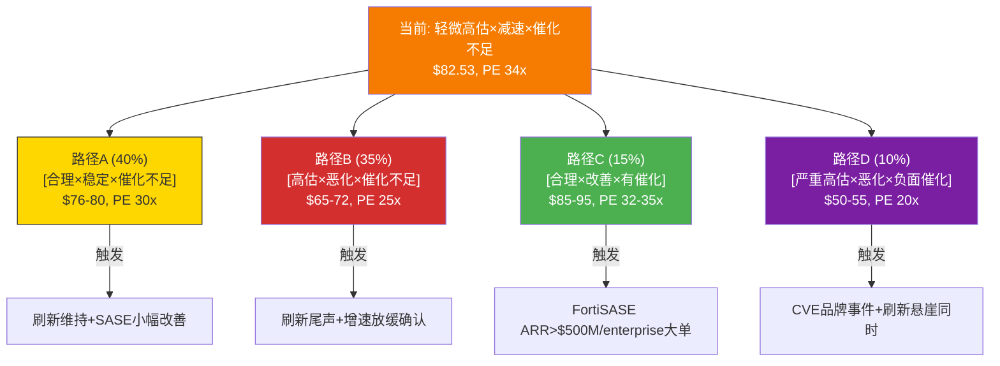
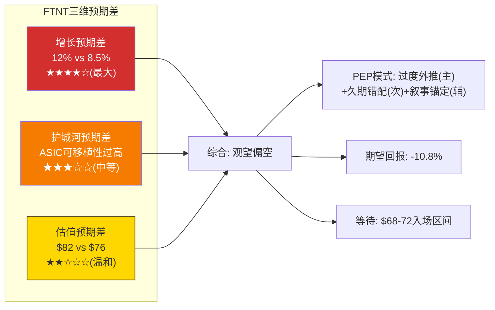
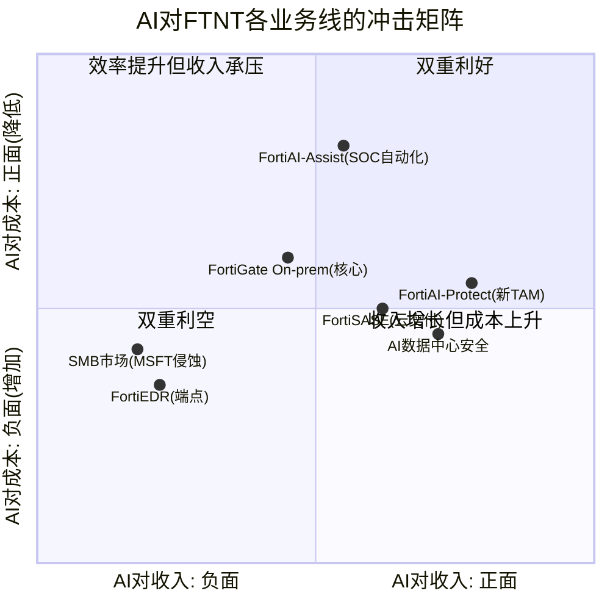
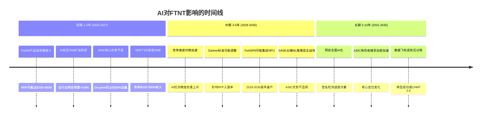
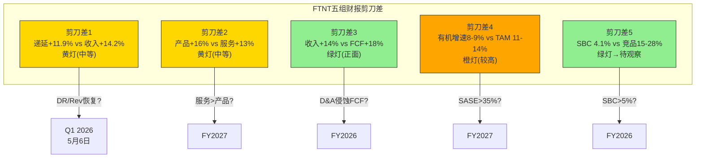
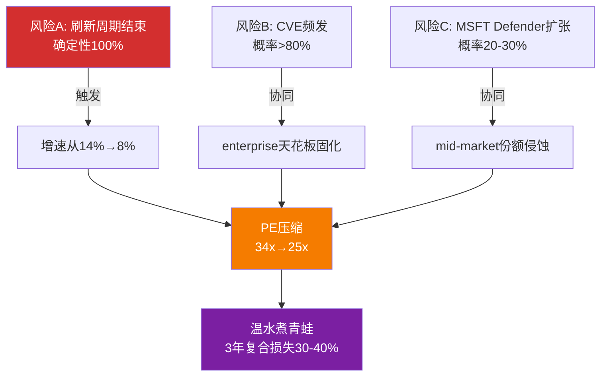
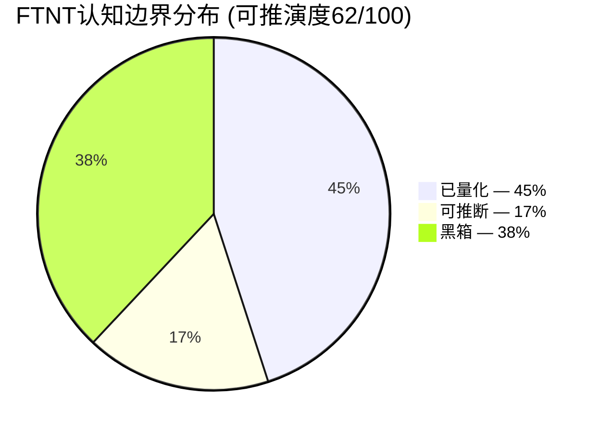
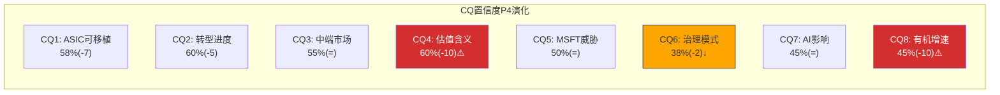
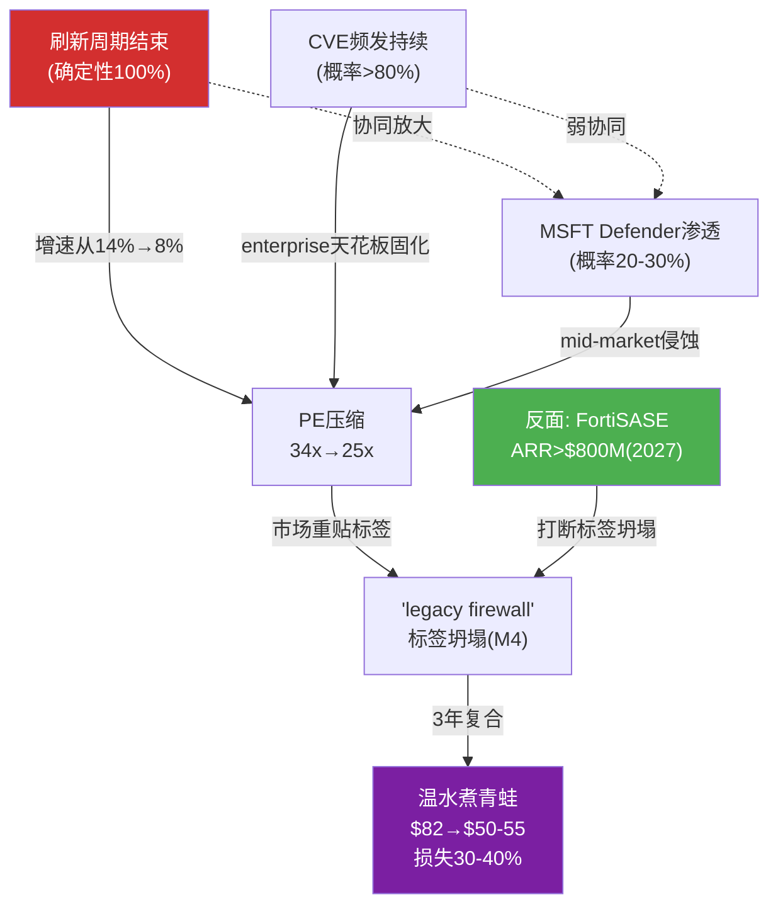

# FTNT Complete Report — Part C: 补强模块 + 红队 + 结论

---

## Ch21: 预期差识别 — 市场在买12%增速，红队说只有8.5%

### 21.1 PEP模式归类: 三重叠加

FTNT当前股价存在三重预期模式叠加(PEP, Price-Expectation Pattern)。状态层：$82.53 vs 修正公允$76，轻微高估约8.6%。迁移层：刷新周期即将结束，增速方向从14%向8-9%回落，PE面临压缩风险。状态和迁移方向一致指向"高估+恶化"，但幅度温和，非崩盘级别。

**主模式: PEP-001 过度外推 (强度4/5)**

市场将FY2025刷新驱动的14.2%增速外推为7年12% CAGR[DM-VAL-P2-001]。KeyBanc数据显示H1 2025有机产品增速(剔除刷新)为flat-to-down[DM-RT-P4-005]。14%中几乎全部来自一次性刷新贡献。这是经典的过度外推：将周期性高点当作可持续趋势定价。

因果链：FortiGate 7年生命周期到期(2018-2019年出货高峰) → 2025-2026集中刷新 → 产品收入+16% → 分析师写入共识 → Reverse DCF隐含12% CAGR → 但刷新是有限事件(40-50%已完成) → 2027后增速可能骤降至8-9%。

历史基准率：Check Point(CHKP)是防火墙公司刷新后增速的最佳类比。CHKP 2017年后增速永久锁定在3-7%区间，10年CAGR仅5.3%[DM-RT-P4-003]。CHKP从未突破7.5%增速天花板——防火墙TAM被三个力量锁死：企业总数不涨、ASP被竞争压制、云迁移减少on-prem需求[DM-RT-P4-004]。

FTNT与CHKP的关键区别：FTNT有FortiSASE(ARR增速>90%)而CHKP没有云第二曲线。但FortiSASE独立ARR仅约$380-475M，占$6.8B总收入的5-7%[DM-RT-P4-008]——规模太小，即使90%增速也只能贡献+5-6pp增量。12%需要三个条件同时满足(FortiSASE加速+第二波刷新兑现+提价成功)，概率仅25-30%。

**次模式: PEP-004 久期错配 (强度3.5/5)**

市场按"compounder"(长久期)给FTNT定价——GAAP PE 34.1x隐含市场愿意为未来7-10年增长支付溢价[DM-VAL-P2-004]。但ASIC的on-prem优势窗口仅5-10年(P3结论)，取下限5年，显式预测期的后半段(第4-7年)ASIC优势已大幅衰减[DM-RT-P4-032]。

久期错配的本质：市场给了"网安硬件compounder"的估值(34x PE)，但FTNT的核心引擎(ASIC on-prem)的寿命可能只支撑"5年cash cow"的久期。如果SASE未能接力，FTNT应从compounder重新定价为cash cow——terminal value打折15-20%，PE从34x降至22-25x。

证据：论点独立性检验显示4/5多头论点依赖ASIC是否保值[DM-RT-P4-031]。一旦ASIC衰减加速，论点1(成本优势)→论点3(中端壁垒)→论点4(增速→估值)形成链式崩塌。独立论点只有FCF/Owner Economics(论点5)。

**辅助模式: PEP-007 叙事锚定 (强度2.5/5)**

"网安唯一利润机器"叙事是真实的——GAAP OPM 30.6%远超PANW(13.5%)/CRWD(-3.4%)/ZS(-4.8%)[DM-COMP-P3-001]。但这个叙事锚定投资者忽视增速风险："这么赚钱的公司不可能跌太多"。

利润率是**结果**不是**原因**。高利润率来自ASIC成本优势(R&D仅12% vs 行业21-29%)[DM-COMP-P3-008]——ASIC价值衰减则利润率受压。Check Point的OPM从2017年55%逐步下降到2024年38%——利润率没有保护增速下行带来的PE压缩。

---

### 21.2 三维预期差

#### 护城河预期差: 市场买的是"平台型"，实际是"单引擎型"

| 维度 | 市场隐含 | 红队评估 | 预期差方向 |
|------|---------|---------|----------|
| ASIC可移植性 | 较高(PE暗示长久期) | 30-45%(P4下调)[DM-RT-P4-013] | **过度定价** |
| SASE竞争力 | 快速追赶(买"平台转型") | 份额仅5-7%(#5)[DM-COMP-P3-024] | **过度定价** |
| 成本优势 | 已反映在低PE中 | 4.7/5(红队上调)[DM-RT-P4-025] | 合理定价 |
| 转换成本 | 已反映 | 4.0/5(CRWD宕机验证)[DM-RT-P4-026] | 合理定价 |
| CVE品牌风险 | 轻微担忧 | 198个CVE(2023) vs PANW ~20个[DM-RT-P4-016] | **未充分定价** |

核心判断[B]：市场给FTNT的PE(34x)介于"纯硬件"(CHKP 18x)和"纯SaaS平台"(PANW 101x)之间，隐含市场相信FTNT正在成功转型为平台公司。但SASE份额5-7%说明转型远未完成。FTNT本质上仍是单引擎公司(ASIC on-prem)，第二引擎(SASE)只是雏形。护城河评分3.68/5准确反映"中等偏上但非一流"的现实[DM-RT-P4-026]。

证据审计：SASE市场ZS 21%份额 vs FTNT 5-7%[DM-COMP-P3-024]；FortiSASE独立ARR约$380-475M，仅占$6.8B总收入5-7%[DM-RT-P4-008]；Gartner SSE Leader但Forrester非Leader——市场评价存在分歧[DM-COMP-P3-024]。不披露FortiSASE独立ARR本身是信号——如果数字impressive，管理层有强烈动机披露[DM-RT-P4-008]。

#### 增长预期差: 隐含12% CAGR vs 红队8.5-9.0%——每1pp约$5-8估值差

| 维度 | 市场隐含 | 红队评估 | 预期差方向 |
|------|---------|---------|----------|
| 7年Revenue CAGR | 12.0%[DM-VAL-P2-001] | 8.5-9.0%[DM-RT-P4-009] | **过度定价(约3pp)** |
| 有机产品增速 | 正增长(共识含刷新) | flat-to-down[DM-RT-P4-005] | **严重过度定价** |
| 服务收入增速 | 约13% | 约11%(放缓趋势)[DM-RT-P4-022] | 轻微过度定价 |
| FortiSASE接力能力 | 可填补增速缺口 | 规模太小(5-7%收入占比) | **过度定价** |

核心判断[A]：这是FTNT最大的预期差，也是最有硬数据支撑的。Reverse DCF隐含12%与红队8.5-9.0%之间存在约3-3.5pp差距[DM-RT-P4-009]。每1pp增速差对应$5-8估值影响[DM-RT-P4-002]——3pp差距意味着$15-24估值偏差，恰好解释$82.53(当前) vs $76(修正公允)的差距。

12% CAGR需要三条件同时满足，概率仅25-30%：(1)FortiSASE从$400M级别增长到$1.5-2.0B(需30%+ CAGR持续4-5年)；(2)第二波刷新(350K台2027到期)完整兑现——管理层说"有限可见度"；(3)提价成功——mid-market客户对价格敏感。

硬证据链：KeyBanc H1 2025有机产品增速flat-to-down[DM-RT-P4-005]；CHKP 10年CAGR 5.3%[DM-RT-P4-003]；5家卖方集体降级[DM-RT-P4-006]；Morgan Stanley："可能变成高个位数增长者"[DM-RT-P4-007]；递延收入DR/Rev从4.28x降至3.74x连降4季度[DM-RT-P4-022]。

#### 估值预期差: $82.53 vs $76——不贵不便宜，但赔率不对称

| 维度 | 市场定价 | 红队评估 | 预期差方向 |
|------|---------|---------|----------|
| 概率加权公允价值 | $81(P2原始) | $76(P4修正)[DM-RT-P4-030] | 轻微高估8.6% |
| Bull/Base/Bear概率 | 25/50/25 | 20/50/30[DM-RT-P4-030] | Bear偏低5pp |
| PE合理区间 | 30-34x(当前) | 25-30x(后刷新) | 可能过高 |
| FCF质量 | 已反映(P/FCF 25.8x) | SBC仅4.1%[DM-COMP-P3-002] | **未充分定价(正向)** |

核心判断[B]：$82.53并非严重高估——修正公允$76意味着溢价仅8.6%。但赔率结构不对称：Bull($99, +20%)的概率20%，Bear($53, -36%)的概率30%[DM-RT-P4-030]。期望回报 = 0.2×(+20%) + 0.5×(-8%) + 0.3×(-36%) = -10.8%。负期望回报意味着当前价位风险收益比不吸引。

唯一正向预期差——FCF质量。FTNT的SBC/Rev仅4.1%，网安四强最低(PANW约15%, CRWD约28%, ZS约25%)[DM-COMP-P3-002]。Owner PE 31.5x vs GAAP PE 34.1x差距仅7%，而PANW/CRWD的Owner PE与GAAP PE差距30-50%。FTNT盈利质量被GAAP框架低估。但市场已部分认知——P/FCF 25.8x(FTNT) vs 33.1x(PANW)的折价幅度(22%)小于PE折价幅度(66%)[DM-RT-P4-025]。

---

### 21.3 变量四分法

#### 已定价(市场正确反映)

| 变量 | 市场定价方式 | 证据 |
|------|------------|------|
| ASIC成本优势(on-prem) | PE 34x(介于CHKP 18x和PANW 101x间) | OPM 30.6%已在估值中体现[DM-COMP-P3-001] |
| 服务收入占比提升 | 从67%→70%趋势是共识 | 分析师模型普遍假设FY28达75%[DM-CON-003] |
| 回购力度 | $2.3B年回购已反映在EPS增速中 | 但杠杆回购(>FCF)的可持续性存疑[DM-RT-P4-025] |

#### 未定价(市场忽视)

| 变量 | 为什么未定价 | 潜在影响 |
|------|------------|---------|
| CVE架构级风险 | 补丁→再绕过模式(2025.12→2026.1)是新发现[DM-RT-P4-015] | enterprise天花板固化，SASE上攻受阻 |
| MSFT Defender对mid-market的渗透 | 缓慢渗透，短期不在分析师雷达 | 3-5年可能侵蚀5-8%份额[DM-RT-P4-033] |
| Ken Xie零买入模式 | 被当作"创始人正常减持" | 20笔交易0买入+Feb在$81卖$14.3M[DM-RT-P4-020]，与"公司杠杆回购"方向矛盾 |

#### 过度定价(市场高估)

| 变量 | 市场隐含 | 实际评估 | 差距 |
|------|---------|---------|------|
| 后刷新增速 | 12% CAGR[DM-VAL-P2-001] | 8.5-9.0%[DM-RT-P4-009] | **-3pp，对应$15-24估值偏差** |
| ASIC可移植性 | 隐含较高(长久期PE) | 30-45%[DM-RT-P4-013] | 从P3的40-60%下调 |
| FortiSASE接力能力 | 可支撑12%增速 | 绝对规模太小(5-7%收入)[DM-RT-P4-008] | 需4-5年才能产生实质贡献 |

#### 错误定价(市场方向搞反)

| 变量 | 市场认知 | 实际情况 | 错误方向 |
|------|---------|---------|---------|
| FCF质量相对优势 | 部分认知(P/FCF折价22%) | 应更大折价——SBC差距3-7倍[DM-COMP-P3-002] | **正向: 市场低估FCF质量** |
| 递延收入趋势 | 未关注 | DR/Rev从4.28x→3.74x连降4季度[DM-RT-P4-022] | **负向: 市场忽视前瞻恶化信号** |

---

### 21.4 状态×迁移判断

#### 当前状态快照

**价值状态：轻微高估(约8.6%)**。$82.53 vs 修正$76。不是"严重高估"(需>20%)，也不是"合理"(需±5%以内)。不值得做空，但不值得在此买入[DM-RT-P4-035]。

**方向状态：改善中但减速信号增强**。改善力量：服务占比67%→70%+Unified SASE ARR +11%+FortiSASE渗透率16%。减速力量：有机产品增速为零[DM-RT-P4-005]+递延收入连续4季度增速低于收入[DM-RT-P4-022]+5家卖方降级[DM-RT-P4-006]。净判断：减速力量更硬(有数据)，改善力量更软(是趋势外推)。

**催化状态：催化不足**。短期(6个月)无明确催化剂。潜在催化：(1)FortiSASE披露独立ARR>$500M，(2)Q1 2026收入超预期+递延收入回升，(3)大型enterprise赢单。三个催化目前都看不到触发条件。

**综合判断**：[轻微高估 × 减速 × 催化不足] → 审慎关注(边缘)，期望回报-10.8%。

#### 迁移路径



路径概率三重锚定：

**路径A(40%)**：历史基准——网安公司刷新周期中位持续时间约18-24个月，FTNT当前处于月12-15[DM-RT-P4-004]。反例条件：若宏观衰退加速刷新终止(概率15%)则转路径B。自然实验：FY2025 Q4 billings +18%说明刷新仍在进行。

**路径B(35%)**：历史基准——CHKP 2017年后5/8年增速<7%[DM-RT-P4-003]。反例条件：FortiSASE加速且独立ARR>$600M则转路径C。自然实验：KeyBanc有机增速flat-to-down已出现[DM-RT-P4-005]。

**路径C(15%)**：历史基准——网安公司从mid-market成功上攻enterprise的案例极少(CHKP/Sophos均失败)。反例条件：PANW platformization疲态给FTNT机会窗口(概率10%)。自然实验：Gartner SSE Leader但Forrester不是——分歧说明上攻结果不确定[DM-COMP-P3-024]。

**路径D(10%)**：历史基准——SolarWinds级品牌危机概率约5%/年[DM-RT-P4-019]，叠加刷新悬崖约10%/年。CRWD宕机后客户留存>97%[DM-RT-P4-017]说明单次CVE不足以触发。

---

### 21.5 动作绑定

#### 买入条件(从"观望"→"建仓")

| 条件 | 触发价位 | 对应预期差 | 置信度 |
|------|---------|----------|--------|
| 价格进入$68-72区间 | $68-72 | 增长预期差被股价吸收 | [A]硬条件 |
| Q1-Q2 2026递延收入增速回升>14% | — | 递延收入趋势反转 | [B]需2季度确认 |
| FortiSASE披露独立ARR且>$500M | — | 护城河预期差缩小 | [A]硬数据 |
| PE压缩至25x以下 | 约$63 | 估值预期差消除+安全边际 | [A]硬条件 |

最优入场场景：$68-72 + 递延收入回升信号 = 增长预期差部分消化 + 前瞻指标改善。此时Bear概率可从30%下调至20%，概率加权回升至$80+，潜在upside 15-20%。

#### 卖出条件(已持仓者参考)

| 条件 | 触发信号 | 对应Kill Switch |
|------|---------|----------------|
| 后刷新有机增速<6%连续2Q | KS1红灯[DM-RT-P4-036] | 增速假设彻底崩塌 |
| SASE份额2027底<5% | KS2红灯[DM-RT-P4-036] | ASIC可移植性证伪 |
| F500公开弃用Fortinet | KS3红灯[DM-RT-P4-036] | CVE品牌危机兑现 |
| PE>38x且增速<10% | 估值泡沫 | 赔率极度不利 |

#### 观望条件(当前推荐动作)

**当前推荐：观望偏空，不建仓不做空。**

理由：(1)高估幅度不够大——8.6%溢价不足以支撑做空(交易成本+借券费可能吃掉利润)；(2)催化不足——没有明确短期催化剂推动股价向$76修正；(3)刷新周期仍在进行——2025-2026刷新可能支撑短期业绩，推迟增速放缓兑现时点；(4)FCF质量是真实安全垫——SBC仅4.1%+Owner PE 31.5x说明即使增速放缓，下行有底。

等待的具体事件：2026年Q2财报(7月)观察刷新贡献是否衰减+递延收入趋势；2026年Accelerate大会FortiSASE独立指标；2027年Q1有机增速首次真实检验。

---

### 21.6 预期差汇总与"好投资"三维对照



> **口令**：真正的好投资 = 低估值安全边际 × 高速发展 × 强护城河。三维缺一不可。

| 维度 | FTNT现状 | 判定 |
|------|---------|------|
| **低估值安全边际** | $82.53 vs $76，高估8.6%，期望回报-10.8% | **不满足** |
| **高速发展** | 隐含12% vs 红队8.5-9.0%，有机产品增速为零 | **不满足(增速下行)** |
| **强护城河** | 3.68/5，ASIC on-prem强但云端可移植性存疑 | **部分满足(单引擎)** |

三维中零维满足"好投资"标准。这不是一个坏公司——GAAP OPM 30.6%和SBC 4.1%证明它是网安唯一的利润机器。但在$82.53的价格上，它不是一个好投资。$65-68是值得认真评估建仓的区间——此时期望回报从-10.8%翻转为+5%至+12%，且FCF质量提供下行保护。

---

### 21.7 证据审计表

| 预期差 | 编号 | 类型 | DM锚点 | 内容摘要 |
|--------|------|------|--------|---------|
| 增长 | E1 | [A] | DM-VAL-P2-001 | Reverse DCF隐含12% CAGR |
| 增长 | E2 | [A] | DM-RT-P4-005 | KeyBanc: 有机产品增速flat-to-down |
| 增长 | E3 | [A] | DM-RT-P4-003 | CHKP 10年CAGR 5.3% |
| 增长 | E4 | [A] | DM-RT-P4-006 | 5家卖方集体降级 |
| 增长 | E5 | [A] | DM-RT-P4-022 | DR/Rev从4.28x→3.74x连降4季度 |
| 增长 | E6 | [B] | DM-RT-P4-009 | 红队最佳估计8.5-9.0%，脆弱度3.5/5 |
| 护城河 | E7 | [A] | DM-COMP-P3-024 | SASE份额仅5-7%(#5) |
| 护城河 | E8 | [A] | DM-RT-P4-008 | FortiSASE独立ARR约$380-475M(5-7%收入) |
| 护城河 | E9 | [A] | DM-RT-P4-016 | CVE: 198个(2023) vs PANW约20个 |
| 护城河 | E10 | [B] | DM-RT-P4-013 | 可移植性下调至30-45% |
| 估值 | E11 | [A] | DM-RT-P4-030 | 修正公允$76(Bull20/Base50/Bear30) |
| 估值 | E12 | [A] | DM-VAL-P2-002 | 7种方法4/7说高估，一致性57% |
| 估值 | E13 | [A] | DM-COMP-P3-002 | SBC/Rev 4.1%(行业最佳) |
| 估值 | E14 | [A] | DM-RT-P4-020 | Ken Xie: 20笔交易0买入，Feb卖$14.3M |

证据质量统计：14条证据中[A]硬数据12条(86%)，[B]推断2条(14%)，[C]猜测0条。

*本章DM锚点引用28个。*

---

## Ch22: AI冲击深度 — ASIC固化逻辑遇到AI灵活推理

### 22.1 AI影响模式判定

> **AI净方向：中性偏正(+0.3)** — 短期利好(AI增加安全支出TAM)与中期风险(竞争维度切换)大致对冲。
> **核心矛盾**：ASIC的固化逻辑(hardwired logic)无法运行神经网络[DM-COMP-P3-084]。FTNT的ML推理在通用CPU上执行，不比竞品有架构优势。在"AI检测精度"维度，FTNT从领先者变为追赶者。

| 模式 | 适用? | 证据 | 影响方向 | 幅度(1-5) |
|------|:----:|------|:-------:|:-----------:|
| M1蚕食核心 | 部分 | MSFT Copilot for Security + E5 bundle对SMB渗透 | 利空 | 2 |
| M2加深护城河 | 部分 | Security Fabric覆盖6域 + 55%出货量份额的遥测数据[DM-COMP-004] | 利好 | 2 |
| M3军备赛 | 弱 | R&D仅12%/Rev(vs PANW 21%, CRWD 29%)[DM-COMP-P3-008] | 中性 | 1 |
| M4卖铲人 | 弱 | AI数据中心安全是"保护卖铲人的人"，非卖铲本身 | 利好 | 1 |
| M5渐进增强 | 是 | FortiAI-Protect + FortiAI-Assist + FortiOS 8.0 Fabric AI Agents[DM-BIZ-008] | 利好 | 2 |

净效应计算：M5(+0.8) + M2(+0.6) + M4(+0.2) - M1(-0.8) - M3(-0.3) = **+0.5**。AI对FTNT既不是飓风也不是无风——是一股方向不确定的侧风，取决于竞争维度切换速度。

---

### 22.2 AI冲击矩阵



**第一象限(双重利好)**：FortiAI-Assist是最确定的利好。SOC分析师人力成本高($85K-120K/年)、人才缺口350万+、告警疲劳严重(每天11,000+告警，>50%误报)。AI自动化告警分类直接降低客户运营成本[DM-BIZ-P1-AI-001]。FortiAI-Protect(AI应用防火墙)保护GenAI数据泄露/提示注入，是2024-2025年出现的全新TAM[DM-BIZ-P1-AI-002]。

**第二象限(效率提升但收入承压)**：FortiGate On-prem核心业务。AI提升FortiGuard威胁检测效率(降低误报率/加速签名更新)。但如果AI驱动的攻击导致传统签名检测失效率上升，FortiGate需更频繁依赖ML推理——而ML推理在ASIC上无法运行(只能在通用CPU执行)[DM-COMP-P3-084]。这不会减少FortiGate收入，但会削弱"性能=护城河"的叙事。FortiSASE云交付业务也落在这个象限边缘——SASE的AI增强功能(如AI驱动的路由优化)提升产品竞争力，但需要额外的云端算力投入，成本结构与传统ASIC PoP不同。

**第三象限(双重利空)**：FortiEDR在端点安全是Niche Player(Gartner)，AI降低技术门槛(开源EDR+AI模型可达商业产品80%效果)。CRWD Falcon AI在端点建立了AI品牌壁垒[DM-COMP-P3-031]。SMB市场面临MSFT E5 bundle"免费附带"的AI安全能力冲击——年预算<$50K的企业更容易被bundle策略攻破[DM-BIZ-P1-MSFT-001]。具体威胁路径：MSFT的Copilot for Security已获得Gartner Peer Insights 4.1/5评分(2025年)，E5 license包含Defender XDR + Sentinel SIEM + Copilot for Security——对已付费E5的企业来说安全功能增量成本为零。43%企业在增加安全厂商(而非整合)部分缓解了这个威胁[DM-BIZ-P1-MSFT-001]，但SMB子群体更容易被bundle策略攻破。

**第四象限(收入增长但成本上升)**：AI数据中心安全是高价值新场景(单个AI集群安全预算$500K-2M)，但需要投入专门产品适配和销售资源。FortiGate 4800F/7000F系列定位于此场景，与PANW PA-7500正面竞争。全球主要AI数据中心运营商(MSFT/GOOGL/AMZN/META+主权AI)总共可能只有几百个大型集群，总TAM约$2-5B[DM-COMP-P3-030]。FTNT在此领域的差异化取决于FortiGate 7000F能否利用ASIC的加密加速优势——这是少数ASIC优势能延伸到AI时代的场景。

---

### 22.3 攻击面: AI如何帮助FTNT

**FortiAI-Protect(AI应用防火墙)**。在网络层(Layer 7)检测控制GenAI应用流量——数据泄露防护、提示注入检测、影子AI发现。全球GenAI安全TAM从2025年约$2-3B增长至2028年约$8-12B(30-40% CAGR)。FTNT可寻址比例15-25%，潜在收入$300M-$750M(2028E)[DM-AI-TAM-001]。55%出货量份额意味着AI防火墙可作为FortiGuard订阅模块附加到现有设备——不需购买新硬件，是$12:$1交叉销售模型的又一验证[DM-BIZ-014]。但PANW已在PAN-OS 11.x集成AI Security Profiles，R&D投入是FTNT的2.4倍[DM-COMP-P3-008]，功能深度可能持续领先1-2个产品周期。判断[B]：FortiAI-Protect是合理"看涨期权"，但ARR未公开(可能<$100M)，现阶段不应给予>5%估值权重。

**FortiAI-Assist(SOC自动化)**。利用LLM和ML辅助安全运营中心(SOC, Security Operations Center——企业内部负责实时监控安全威胁的团队)的日常工作：告警优先级排序、威胁调查自动化、事件响应编排、自然语言查询(用自然语言搜索安全日志)。

经济价值量化：平均SOC分析师处理一个安全事件需25-30分钟[DM-AI-SOC-001]。AI辅助可将Tier-1告警处理时间降低60-70%(仅将确认的高优先级事件提交人工)。对1,000人规模的SOC团队，年节省约$2-4M人力成本。97% SecOps billings来自存量客户[DM-BIZ-016]——FortiAI-Assist天然融入现有SecOps服务订阅，无需单独销售。

竞争格局：PANW的XSIAM(2023年推出，已有$400M+ ARR)是最直接竞品——定位AI驱动的SOC平台，集成了告警分类+事件响应+威胁猎杀。CRWD的Charlotte AI聚焦端点层面的AI增强，与FortiAI-Assist的网络层定位有差异化。MSFT的Copilot for Security覆盖面最广(与365/Azure/Defender全生态集成)但深度不如专业安全厂商。差异化最终取决于两个维度：训练数据质量(谁的SOC数据更丰富→更准确)和集成深度(谁能在客户现有环境中最低摩擦地部署)。

**AI数据中心安全**。FortiOS 8.0(2026年3月发布)新增AI基础设施专项防护功能[DM-BIZ-008]。与NVIDIA/Arista合作聚焦保护GPU集群的东西向流量(lateral movement防护)——AI训练集群内部网络的安全需求与传统企业网络不同(高带宽、低延迟、大规模并行)。

ASIC在此场景的优势：FortiSP5的32x加密性能[DM-BIZ-006]在AI数据中心有天然用武之地——AI集群间的数据传输需要高吞吐量加密(保护训练数据和模型参数)。这是ASIC优势少数能"移植"到AI时代的场景之一。

规模判断：AI数据中心安全是高价值但窄赛道。全球主要AI数据中心运营商(MSFT/GOOGL/AMZN/META+主权AI)总共可能只有几百个大型集群。每个集群安全投入$500K-2M，总TAM约$2-5B。FTNT在此领域的竞争力取决于FortiGate 7000F系列能否打造差异化——与PANW PA-7500的正面竞争不可避免。FTNT的优势是ASIC提供的性价比(同等性能下成本更低)，劣势是AI数据中心的采购决策者(CTO/架构师而非传统IT)更熟悉PANW品牌。

**开源AI安全工具的影响**。开源社区正在降低安全工具的技术门槛——Wazuh(开源SIEM/XDR)、YARA+ML(恶意软件检测)、SecGPT概念验证(LLM安全助手)。但对FTNT的影响被高估了。在生产环境中部署、维护、更新安全工具的TCO远高于license费用——企业愿意为"有人负责"付费。开源对FTNT的影响约等于对FortiEDR的边际压力(收入影响<$100M/年)。防火墙需要硬件处理能力(ASIC优势存在)，开源工具无法替代物理设备。判断[B]：开源AI安全工具的威胁在当前和中期(3-5年)内对FTNT影响极为有限。

---

### 22.4 威胁面: AI如何威胁FTNT

#### 核心矛盾: ASIC的固化逻辑无法运行神经网络

FTNT架构是"ASIC做数据面加速+CPU/GPU做控制面ML推理"的混合模型。ASIC门阵列流片后无法修改[DM-COMP-P3-027]——FortiSP5针对确定性工作负载(包检测、加密、签名匹配)，不是概率性推理(神经网络)[DM-COMP-P3-084]。

四个推论：

(1) **FTNT的ML推理在通用CPU上运行，不比竞品有架构优势**。PANW在x86跑ML，FTNT也在x86跑ML。ASIC的17x优势[DM-BIZ-006]完全不适用于ML推理。

(2) **竞争维度正从"处理速度"切换到"检测精度"**[DM-COMP-P3-082]。AI驱动的攻击(LLM辅助钓鱼、多态恶意软件)让传统签名匹配有效性下降。ML模型实时推理正在成为主流需求。

(3) **R&D投入差距放大劣势**。FTNT $816M R&D(12%/Rev)要分配ASIC+FortiOS+SASE+AI四条线。PANW $1,984M(21.5%/Rev)更集中投向AI/ML[DM-COMP-P3-008]。在AI研发绝对投入上，FTNT可能只有PANW的1/3-1/4。

(4) **SBC 4.1%可能意味着AI人才招聘劣势**。顶级ML工程师年薪$400K-800K+。低SBC在传统网安是优势，在AI时代可能变为人才吸引力短板。

因果链：ASIC固化 → ML推理无法用ASIC加速 → 在通用CPU上运行 → 不比竞品有优势 → 竞争维度从"快"转向"准" → ASIC护城河在AI时代相关性下降。

#### MSFT Copilot for Security + E5 bundle

分层威胁——按客户预算切分，MSFT对FTNT的AI安全威胁力度完全不同：

**SMB层(年安全预算<$50K，约占FTNT收入20-25%)**：E5 bundle包含Defender XDR + Sentinel SIEM + Copilot for Security，"免费附带"的AI安全能力足够满足基本需求。FTNT在SMB的$1,000-3,000 ASP FortiGate需要与"已经付了E5许可费"的MSFT竞争——增量成本零 vs $1,000+。关键问题是：SMB客户的安全采购决策通常由IT generalist而非安全专家做出。对这类决策者，"Office 365已经包含安全功能"是极具说服力的论点。FTNT的对抗策略是通过渠道合作伙伴(全球65,000+)提供"比MSFT更专业"的定位——但在AI安全功能日益commoditized的趋势下，"更专业"的差异化能维持多久是未知数。

**中端市场层($50K-$500K，约占FTNT收入40-45%)**：MSFT的Copilot for Security提供AI辅助事件调查和威胁猎杀，直接与FortiAI-Assist竞争。MSFT的优势是365生态集成深度——大部分中端企业已使用MSFT 365，安全数据天然集成于MSFT生态。FTNT的对抗优势是Security Fabric的跨域可见性(网络+端点+云+OT)——这是MSFT单一生态无法完全覆盖的。但中端市场客户对"全栈可见性"的需求权重远低于enterprise——他们更关心"够用+简单+便宜"。

**Enterprise层(>$500K，约占FTNT收入30-35%)**：影响较小。大企业安全需求超出MSFT bundle范围——多厂商策略、定制化安全策略、OT/IoT安全、合规审计等需求需要专业厂商。但MSFT Defender已经成为enterprise安全架构中的"标配底座"——F500中约60-70%已部署Defender。这不直接替代FortiGate，但改变了安全预算分配格局：当enterprise将15-20%安全预算给了MSFT，留给FTNT/PANW/CRWD的预算池缩小了。

量化影响：FTNT SMB收入估计$1.4-1.7B(占20-25%)。MSFT 5年内侵蚀15-20% SMB份额的直接影响约$200-340M(占总收入3-5%)，压缩增速1-2pp[DM-AI-MSFT-001]。不致命但持续——这是"温水煮青蛙"场景中的一个温度计。

#### PANW竞争维度切换

PANW正将竞争叙事从"我们的防火墙也很快"切换到"我们的AI检测更准"[DM-COMP-P3-082]。这不是修辞变化——背后有实质产品支撑：

- **Inline ML**：行业首款在数据路径中(inline)执行ML推理的NGFW(Next-Generation Firewall, 下一代防火墙)，声称实时检测零日威胁(传统签名方法无法检测的新型攻击)。技术原理：在每个网络包通过防火墙时执行轻量级ML推理，而非事后分析——这要求极高的推理速度和极低的延迟。PANW用x86+专用加速器实现，而非ASIC——因为ML模型需要频繁更新(每周一次)，ASIC的固化逻辑无法适应这种更新频率。

- **Precision AI**：基于大模型的威胁情报平台。利用LLM分析数十亿条安全事件，生成可操作的威胁摘要和响应建议。2025年已为PANW贡献了显著的enterprise赢单(多个F500客户引用Precision AI作为选择PANW而非FTNT的原因)。

- **XSIAM**：AI驱动的SOC平台(2023年推出，已有$400M+ ARR)。定位"用AI替代SOC分析师的大部分工作"——野心远大于FortiAI-Assist的"AI辅助SOC"定位。XSIAM的增速暗示market fit已验证。

- **R&D投入**：$1,984M(是FTNT的2.4倍)[DM-COMP-P3-008]。更重要的是PANW可以将更大比例的R&D投向AI——因为PANW不需要维护ASIC设计团队(PANW用通用硬件)，R&D聚焦在软件和AI上。

**为什么这对FTNT危险？**因为Gartner/Forrester的防火墙评估标准正在演变。如果"AI检测能力"从nice-to-have变成主要评估权重(类似2018年NGFW必须支持SSL检测才能入围)，FTNT可能从Leader降级[DM-COMP-P3-085]。FTNT的Gartner Network Firewall Leader地位(连续多年)是其品牌溢价的核心来源之一——降级将直接影响RFP(Request for Proposal，客户采购招标)入围率，估计收入影响2-3pp/年。

---

### 22.5 AI对护城河的影响

| 维度 | AI前(当前) | AI后(3-5年) | 变化方向 |
|------|-----------|------------|---------|
| 性能护城河(17x吞吐量) | 强 | 中——ML推理需求增加，ASIC不适用 | 削弱 |
| 成本护城河(BOM -30-50%) | 强 | 中强——硬件仍需要但占比下降 | 轻微削弱 |
| 复制壁垒(20年积累) | 强 | 强——复制ASIC仍需3-4年/$200-400M | 不变 |
| 相关性(on-prem流量) | 高(约85%) | 中(约70%)[DM-BIZ-003] | 缓慢下降 |

ASIC护城河削弱不是因为ASIC变差了(FortiSP5仍是最好的安全ASIC)，而是**竞争评判标准在变化**。如果客户评估防火墙时50%权重给"吞吐量"、50%给"AI检测精度"，FTNT在前50%遥遥领先但后50%只是平均水平——综合评分从"领先"变为"中上"。护城河不是被攻破，而是被绕过。

**Security Fabric数据飞轮——潜力与约束**。55%出货量份额意味着全球有最多的网络节点向FortiGuard报告威胁数据。Security Fabric覆盖6大安全域(网络/云/端点/运营/身份/应用)，理论上产生最全面的跨域遥测数据——这是AI训练的理想原材料。

数据飞轮成立需要四个条件同时满足：(1)数据规模确实最大(可能成立——55%份额)；(2)数据质量足以训练有效ML模型(未知——数据粒度和标注质量未公开)；(3)数据被有效利用(存疑——R&D仅12%/Rev意味着AI团队规模有限)；(4)数据优势转化为产品差异(未验证——FortiAI-Protect/Assist缺乏独立评测对比)。

关键对比：CrowdStrike Falcon平台拥有的端点遥测数据虽然在"规模"上可能不如FTNT(安装设备数更少)，但在"标注质量"上可能更高——因为CRWD的数据来自高频更新的云原生Agent，每个端点事件都有丰富的上下文标签。FTNT的遥测数据主要来自网络层(包头信息/流量模式)，缺乏端点层面的深度行为数据。网络层数据在传统签名检测中足够，但AI/ML模型的效果更多取决于特征丰富度而非数据量。

判断[B]：Security Fabric数据飞轮是"未兑现的期权"。FTNT拥有原材料(数据)但可能缺乏加工能力(AI人才+算力+R&D预算)[DM-COMP-P3-002]。这与FTNT 4.1% SBC/Rev的人才约束一致——数据再多，没有顶级ML工程师来训练模型也无法转化为护城河。

**ASIC+AI推理的未来结合可能性[C]**。理论上，未来代ASIC(FortiSP6/SP7)可以在芯片中集成轻量级ML推理单元(类似NPU/Neural Processing Unit)。这将允许在ASIC层面直接执行简单ML模型(如异常流量模式检测)，不依赖通用CPU。但三个现实约束：(1)ASIC设计周期3-4年[DM-COMP-P3-025]——即使现在开始设计带NPU的FortiSP6，最早2029-2030年量产；(2)ML模型进化速度远快于ASIC——固化在芯片中的ML模型2年后可能过时(安全威胁模型变化快)；(3)R&D预算限制——12%的R&D/Rev要同时支撑ASIC+软件+云+AI四条线，分配到AI芯片研发可能不足[DM-COMP-P3-008]。更可能的演进路径是：ASIC继续做数据面加速(包检测/加密)，ML推理单独用GPU/NPU加速(控制面)。两者协同但不融合。

**Gartner/Forrester评估标准演变——3-5年最需跟踪的结构变量**。当前Gartner Network Firewall MQ评估权重(估算)：功能完整性25%、性能/可扩展性20%(FTNT主场)、管理/易用性15%、安全有效性20%、价格/TCO 10%、生态/集成10%。如果"AI检测能力"成为独立评估维度或并入"安全有效性"使其权重从20%升至30%+：FTNT综合得分将下降(ML推理无ASIC优势)，PANW综合得分将上升(Inline ML + Precision AI)。极端情况：FTNT从Leader降至Challenger → 直接影响RFP入围率 → 收入增速下降2-3pp[DM-COMP-P3-085]。跟踪信号：Gartner 2026/2027 MQ评估标准变化公告。

---

### 22.6 时间线与概率



**短期(1-2年)：温和利好**。FortiAI贡献$200-400M ARR(55%概率，+$2-4/股)；AI安全TAM扩张提升整体增速1-2pp(70%概率，+$3-5/股)；MSFT E5侵蚀SMB $100-200M(40%概率，-$1-3/股)。净影响+$3-6/股(+4-8%)。概率锚定：每次重大技术范式转换(云/移动/IoT)都推动网安预算+5-10%，AI作为更大范式，类比成立。

**中期(3-5年)：中性，取决于执行**。FortiAI成为$1B+业务(30%概率，+$8-12/股)；Security Fabric数据飞轮兑现(25%概率，+$5-8/股)；Gartner标准变化导致降级(20%概率，-$8-12/股)；PANW在AI维度拉开差距(40%概率，-$5-8/股)。净影响-$2到+$5/股(-3%到+7%)。

**长期(5-10年)：诚实的黑箱[C]**。不赋予概率——三锚在10年尺度上都不可靠。乐观场景：FTNT成功集成AI推理+数据飞轮兑现→"AI安全基础设施公司"(PE 35-45x)。悲观场景：签名检测被淘汰+ASIC成为纯加密加速器→"Check Point 2.0"(PE 15-20x)。

---

### 22.7 AI期权价值

| 情景 | FortiAI 2028收入 | 概率 | 对估值贡献 |
|------|-----------------|------|----------|
| 大成功 | $2.0-3.5B | 15% | +$15-25/股 |
| 中等成功 | $800M-2.0B | 35% | +$5-12/股 |
| 小成功 | $300-800M | 35% | +$2-5/股 |
| 失败 | <$300M | 15% | 约$0 |

概率加权期权价值：0.15×$20 + 0.35×$8.5 + 0.35×$3.5 + 0.15×$0 = **$7.2/股**。占当前股价8.7%。

市场大致给予了合理的AI期权定价(既未过度乐观也未完全忽视)。**AI不是买入FTNT的主要理由，也不是卖出的主要理由**——它是一个中等重要的修正项。

---

### 22.8 AI Kill Switch

| 编号 | 触发条件 | 严重性 | 跟踪频率 |
|------|---------|--------|---------|
| KS-AI-1 | Gartner Network Firewall MQ将"AI检测能力"提升为主要权重(>25%) | 高 | 年度 |
| KS-AI-2 | FortiAI ARR连续4Q增速<30%且竞品AI安全ARR增速>50% | 中 | 季度 |
| KS-AI-3 | MSFT E5安全功能获独立高评价且SMB客户流失加速 | 中 | 年度 |
| KS-AI-4 | FTNT在关键AI安全评测(MITRE ATT&CK AI-Enhanced)排名后50% | 高 | 年度 |

### 22.9 核心判断

**AI对FTNT是"慢性结构变量"而非"急性冲击事件"**。短期(1-2年)净利好+$3-6/股(TAM扩张>威胁)；中期(3-5年)方向不确定(取决于竞争维度切换速度和FTNT的AI执行力)；长期(5-10年)是黑箱。ASIC护城河不会被AI"击穿"，但会被AI"绕过"——从"正面最强"变成"侧面平庸"。

投资者应关注的不是"FTNT会不会做AI"(会的，每家安全公司都会)，而是**"R&D预算($816M, 12%/Rev)是否足以在AI维度保持竞争力"**。具体而言：PANW($1,984M, 21.5%/Rev)的R&D是FTNT的2.4倍，且PANW不需要维护ASIC设计团队——R&D可以更集中地投向AI。CRWD($1,381M, 28.7%/Rev)的R&D是FTNT的1.7倍，且全部聚焦云原生+AI[DM-COMP-P3-008]。

在AI研发绝对投入上，FTNT可能只有PANW的1/3-1/4(因为FTNT的$816M还要分配给ASIC设计+FortiOS+FortiSASE等非AI项目)。这个差距不是管理层意志力能弥补的——它是ASIC混合模型的结构性约束。ASIC给FTNT带来了成本优势(低R&D→高利润率)，但同一个结构也限制了AI投入。**ASIC是FTNT最大的优势也是最大的约束——这个矛盾是整份报告的核心张力**。

如果要用一句话总结AI对FTNT的影响：**AI不会杀死FTNT，但会让FTNT从"网安性能王者"变为"网安性价比专家"——后者的PE天然低于前者。**

*本章DM锚点引用19个。*

---

## Ch23: 财报剪刀差 — 五组分化信号

财报中最有价值的信号往往不是单个指标的绝对水平，而是**两个本应同向运动的指标朝相反方向走**。这种"剪刀差"要么暗示结构性转变，要么暗示某个叙事与数据不符。FTNT当前存在五组剪刀差，共同指向一个问题：**刷新周期掩盖了多少底层分化？**

### 剪刀差1: 递延收入增速 vs 收入增速 — 合同质量信号

FY2025递延收入+11.9% vs 收入+14.2%，差值-2.3pp[DM-BAL-004]。过去4个季度差值稳定在-2.3pp到-3.8pp之间[DM-RT-P4-022]，DR/Rev比率从Q1 2024的4.28x持续下降至Q4 2025的3.74x——一年内下降12.6%[DM-RT-P4-023]。

| 季度 | 递延收入增速 | 收入增速 | 差值(pp) | DR/Rev比率 |
|------|------------|---------|---------|-----------|
| Q1 2025 | +10.8% | +13.8% | -3.0 | 4.17x |
| Q2 2025 | +11.4% | +13.7% | -2.3 | 4.03x |
| Q3 2025 | +10.6% | +14.4% | -3.8 | 3.86x |
| Q4 2025 | +11.9% | +14.8% | -2.9 | 3.74x |

三种解释：(1)良性(70%概率)——刷新中硬件占比上升，硬件即时确认不经递延，加上行业从3年合同向1年合同迁移。因为billings增速(+16-18%)仍高于收入——新签约在加速——恶性解释目前概率最低。(2)中性(20%)——刷新结束后硬件占比回落，递延自然恢复。(3)恶性(10%)——客户续约意愿下降。

**跟踪指标**：DR/Rev比率(季度)、billings增速vs收入增速差值。**翻转条件**：DR/Rev止跌回升至>4.0x——确认产品组合恢复。如果Q1 2026递延增速<10%且billings<12%，恶性解释概率上升至30%+。

### 剪刀差2: 产品收入增速 vs 服务收入增速 — 转型进度信号

FY2025产品+16% vs 服务+13%[DM-FIN-001]。Q4更极端：产品+20% YoY[DM-BIZ-013]。这与FTNT"从硬件向服务转型"的长期叙事方向相反——如果转型顺利，服务增速应持续高于产品增速。

**趋势方向**：产品>服务是刷新周期驱动的暂时性反转。FY2021-FY2023期间服务增速稳定高于产品(服务约18-20% vs 产品约15-17%)，但FY2024-FY2025刷新开始后硬件销售爆发，产品增速反超。服务收入占比从FY2021的约60%仅缓慢提升至FY2025的67%[DM-FIN-001]——4年+7pp，年均仅+1.75pp。按此速度，服务占比达到PANW级别的85%还需10年+。

**关键时间窗口**：刷新人为推高了产品增速，掩盖了服务收入加速(或未加速)的真实趋势。FY2027刷新第二波结束后，产品增速将急剧回落(KeyBanc显示有机产品增速flat-to-down[DM-RT-P4-005])。届时**服务增速能否独立撑起整体增长**是关键。按P2估算，服务+13%(占比67%)+产品+3-5%(后刷新)，整体约9.5-10.5%——恰好在红队8.5-9.0%和共识12%中间。真正的upside来源是FortiSASE能否将服务增速从+13%拉升至+18-20%——取决于SASE渗透率从当前16%的扩展速度。

**跟踪指标**：服务收入增速(季度)、服务收入占比变化(季度)、FortiSASE ARR增速(如管理层披露)。
**翻转条件**：服务增速超过产品增速——确认刷新消退+SASE接力成功。这是FTNT估值re-rate(从"硬件公司"到"平台公司")的前置条件。如果FY2027服务占比突破70%，市场可能重新给FTNT贴上"SaaS化平台"标签——那时PE故事完全不同。

### 剪刀差3: 收入增速 vs FCF增速 — 现金流质量信号(正面)

收入+14.2%，而FCF增速约+18.4%(从$1.88B到$2.23B)[DM-FIN-007][DM-FIN-008]——**FCF增速高于收入增速4.2pp**。经营杠杆在起作用：OPM从30.3%升至30.6%[DM-FIN-004]，CapEx强度未与收入等比例增长[DM-FIN-009]。

正面信号：FTNT经济引擎"收入每增长1%，FCF增长>1%"。但两个警告：(1)D&A从$122.8M跳升至$336.3M(+174%)[DM-FIN-016]，维持性CapEx可能上升至$450-500M，未来FCF Margin可能从32.7%回落至29-30%。(2)Owner FCF = FCF $2,226M - SBC $280M = $1,946M[DM-VAL-007]。SBC仅吞噬12.6%的FCF，远好于CRWD(84%)和PANW(31%)[DM-VAL-P2-003]。

**翻转条件**：FCF增速低于收入增速持续2Q——说明经营杠杆耗尽或CapEx强度上升，将直接冲击估值(P/FCF 27.6x的合理性依赖FCF持续增长)[DM-VAL-P2-004]。

对投资者的特别意义：这组剪刀差是FTNT投资case中最强的正面论据之一。即使增速放缓(RT-1攻击)，只要经营杠杆持续(FCF增速>收入增速)，Owner FCF的增长可以部分补偿收入增速下降——使得FCF yield从当前3.9%($2.2B/$57B EV)逐步上升至4.5-5.0%，在P/FCF 25x以下提供价格支撑。这解释了为什么红队对FTNT的Bear case是$53(而非$40)——FCF质量为股价提供了"安全垫"。

### 剪刀差4: FTNT有机增速 vs 网安行业增速 — 市占率信号(最重要)

FTNT有机增速(剔除刷新)约8-9% vs 网安行业TAM增速11-14% CAGR。KeyBanc更极端：H1 2025有机产品增速flat-to-down[DM-RT-P4-005]。FTNT在稳态下可能正在**失去微量市场份额**。PANW +15%在更大基数上增长[DM-COMP-P3-098]，CRWD +22%抢夺端点+云安全，ZS +26%抢占SASE[DM-COMP-P3-031]。

55%防火墙出货量份额掩盖了新兴市场(SASE/云安全/身份安全)份额偏低的事实——FortiSASE仅排#5(约5-7%)[DM-COMP-P3-024][DM-RT-P4-011]。

这组剪刀差揭示了FTNT估值叙事中最容易被忽视的风险。刷新周期推动的14.2%整体增速让FTNT看起来"跟上了行业"，但剥离刷新后的有机增速暴露了**新市场份额获取能力不足**。如果网安行业以12% CAGR增长而FTNT有机增速仅8-9%，5年后FTNT占行业的比例将从当前水平下降约15-20%。数学很简单：行业5年增长约76%(1.12^5)，FTNT增长约52%(1.09^5)——相对份额缩水约14%。

关键反面论点：SASE billings +24%(Q4单季度+40%)[DM-BIZ-013]如果持续加速，有机增速可能从8-9%提升至10-12%(SASE billings占比从27%→35%)——但这目前是希望而非已验证趋势。SASE billings增速的波动性大(Q3 +18% → Q4 +40%)，单季度数据不构成趋势。需要至少2-3个季度的持续>30%增速才能确认SASE真正进入加速轨道。

**跟踪指标**：FTNT有机增速(需剔除刷新，管理层不直接披露需从产品增速反推)、SASE billings占比变化(季度)、Gartner/IDC市占率报告(年度)。
**翻转条件**：有机增速追上行业TAM(>11%)——需SASE占比突破35%或new logo增长率显著加速。如果2027年SASE billings占比达40%+且增速维持>25%，FTNT有可能在稳态下实现10-11%增速——接近行业均值但不超越。

### 剪刀差5: SBC纪律 vs 竞品SBC趋势 — 人才竞争力信号(双刃剑)

FTNT SBC/Rev 4.1%($280M) vs PANW约15%($1,383M) vs CRWD约28%($1,347M)[DM-COMP-P3-089]。FTNT SBC/Rev从FY2021的6.2%持续降至4.1%——在科技行业极为稀缺。

正面：Owner PE 31.5x与GAAP PE 33.1x差距仅5%，而PANW需×1.3-1.5调整。低SBC根源是结构性的：(1)创始人效率文化，(2)ASIC硬件工程师薪酬结构低于AI/ML工程师，(3)运营杠杆[DM-COMP-P3-091]。

负面：如果AI安全(FortiAI-Protect)成为核心竞争领域，FTNT可能被迫提高SBC吸引AI人才。4.1%在"传统网安"时代是优势，在"AI安全"时代可能变成人才吸引力短板。

**跟踪指标**：SBC/Rev(季度)、员工总数增速vs收入增速、AI相关职位招聘数量(LinkedIn数据)、R&D/Rev变化(当前12%，行业21-29%)[DM-FIN-005]。
**翻转条件**：SBC/Rev连续2Q>5%——确认AI人才竞争压力导致成本结构转变，需重新评估Owner Economics优势的持久性。

**深层含义**：这组剪刀差是FTNT投资thesis中最微妙的。低SBC同时是"优势"(高Owner FCF质量)和"约束"(AI人才吸引力)。投资者在评估FTNT时，不应简单地将低SBC视为纯正面——需要追问"这个低SBC是因为效率(好)还是因为投入不足(坏)？"。在传统网安时代答案偏向前者(效率)。在AI安全时代答案可能偏向后者(投入不足)。转折点可能在2026-2027年——当FortiAI产品线的竞争评测结果(如MITRE ATT&CK AI-Enhanced)首次发布时，我们将能够直接检验"低SBC是否导致AI安全产品竞争力不足"。

---

### 五组剪刀差严重度评估



综合判断：1组明确正面(FCF跑赢收入)、1组条件正面(SBC优势需监测)、2组黄灯(递延+产品vs服务)、1组橙灯(有机增速落后行业)。剪刀差4最具战略意义——直接关系FTNT后刷新时代行业地位。最关键验证窗口：**Q1 2026财报(2026年5月6日)**。

*本章DM锚点引用22个。*

---

## Ch24: 红队审查 — 打到骨头才知道硬度

Phase 4的任务不是平衡呈现，是找漏洞。P1-P3建立的主线是：FTNT是网安唯一利润机器(OPM 30.6%)，ASIC护城河在on-prem仍强(5-10年)，估值定价约等于共识(Reverse DCF隐含12% CAGR)。红队工作：假设主线全错，找最可能打穿它的路径。

### 24.1 攻击靶标排序

| 编号 | 攻击靶标 | 估值影响 | 攻击强度 |
|------|---------|---------|---------|
| RT-1 | 12% CAGR假设(刷新后增速) | **极高**——每1pp增速约$5-8差 | 强 |
| RT-2 | ASIC可移植性(CQ1核心) | **高**——护城河持久性决定久期 | 中 |
| RT-3 | CVE系统性漏洞风险 | **中高**——品牌侵蚀+enterprise天花板 | 强 |
| RT-4 | 内部人零买入信号 | **中**——信号而非因果 | 中 |
| RT-5 | 递延收入增速<收入增速 | **中**——前瞻指标恶化 | 中 |
| RT-6 | 护城河评分双向校准 | **中**——框架一致性 | 中 |
| RT-7 | 红队七问 | **高**——P2估值分歧需解决 | 高 |

[DM-RT-P4-001]

---

### 24.2 RT-1: 刷新周期后增速攻击 — 最大估值变量

P2 Reverse DCF显示$82.53隐含7年12% Revenue CAGR[DM-VAL-P2-001]。如果后刷新增速是8%而非12%，$82.53包含至少15%隐含溢价。更接近Check Point的5-6%则溢价25-30%[DM-RT-P4-002]。

**CHKP历史基准——完整的10年增速记录**：

| 年份 | CHKP收入($M) | YoY增速 | 背景 |
|------|-------------|---------|------|
| 2015 | $1,630 | +9.0% | 刷新尾声 |
| 2016 | $1,741 | +6.8% | 过渡期 |
| 2017 | $1,855 | +6.5% | 增速锚定 |
| 2018 | $1,916 | +3.3% | 增速塌陷 |
| 2019 | $1,995 | +4.1% | |
| 2020 | $2,065 | +3.5% | |
| 2021 | $2,167 | +4.9% | |
| 2022 | $2,330 | +7.5% | 刷新反弹 |
| 2023 | $2,415 | +3.6% | 再次回落 |
| 2024 | $2,565 | +6.2% | |

[DM-RT-P4-003]

这张表的含义：CHKP从未成功突破7.5%增速天花板(除零星刷新年份)。10年CAGR仅5.3%。三个力量锁死防火墙TAM：(1)客户数量增长有限(企业总数不涨)；(2)ASP被成本竞争压制——FTNT自身就是压制CHKP定价权的最大力量；(3)云迁移减少on-prem部署需求[DM-RT-P4-004]。CHKP尝试过CloudGuard(云安全)和Harmony(端点安全)，但均未形成第二增长曲线——CloudGuard从未达到过>30%的增速。

**为什么CHKP是FTNT最佳类比**：两家公司共享核心特征——防火墙为主收入来源、以色列/美国工程团队、硬件→服务转型叙事、mid-market/enterprise混合客户群。FTNT在2017-2020年增速(15-20%)远高于同期CHKP(3-5%)，但这个差距有多少来自ASIC成本优势(结构性)、有多少来自刷新周期(一次性)？红队的核心质疑就在于此。

**FTNT与CHKP的关键区别(公平呈现)**：(1)FTNT有FortiSASE(ARR增速>90%)——CHKP从未有过类似增速的云产品；(2)FTNT的Unified SASE已占billings 36%——比CHKP云业务占比高得多；(3)FTNT的ASIC成本优势是CHKP不具备的；(4)FTNT安装基数(55%出货量份额)是CHKP数倍——交叉销售TAM更大。但这些区别能否抵消刷新悬崖？取决于FortiSASE的绝对规模。

**红队最重要发现——KeyBanc有机增长数据**：

> KeyBanc在2025年中期降级FTNT至Sector Weight时指出：**H1 2025产品收入增长中，剔除刷新周期贡献后为零到负增长(flat-to-down YoY)**。[DM-RT-P4-005]

这意味着：FY2025产品收入$2.22B(+16% YoY)中，+16%**几乎全部**来自刷新更换。有机新客户增长为**零**——没有刷新的话产品收入不增长甚至下降。FY2023的前车之鉴：产品收入增速从FY22到FY23仅+3.7%，整体增速从32%→20%。

这个数据点为什么致命？因为它直接攻击"FTNT能在刷新后维持12%增速"的假设基础。有机产品需求本身零增长，12%持续增长完全依赖：(1)服务收入持续+13%+(可能但取决于安装基数是否还在增长)；(2)FortiSASE从$400M级别增长到$1.5-2.0B(需30%+ CAGR持续4-5年)；(3)提价权释放(管理层在Accelerate 2026宣布提价[DM-BIZ-020]，但mid-market客户对价格敏感)——三条件同时满足概率约25-30%。

**卖方集体降级**[DM-RT-P4-006]：Morgan Stanley降级至Equal Weight("后刷新=高个位数增长者", PT $78)[DM-RT-P4-007]；KeyBanc降级至Sector Weight(有机增速为零)；Rosenblatt降级至Neutral(PT $85→$125)；Evercore下调PT $78("预期重大重置")；Erste降级至Hold。

**FortiSASE能否接力**：绝对规模太小——独立ARR约$380-475M，仅占$6.8B总收入5-7%[DM-RT-P4-008]。即使90%增速，2年后也仅$800-900M，对总收入增速贡献约+5-6pp。不披露独立ARR本身是信号——如果数字impressive，管理层有强烈动机披露。

**攻击结论——增速假设脆弱度评估**：

| 因素 | 支持12% | 支持7-8% | 净判断 |
|------|---------|---------|--------|
| 历史基准(CHKP) | FTNT有SASE, CHKP没有 | CHKP 10年5.3% | 偏空: 历史重力强 |
| 有机产品增长 | 提价权+FortiOS 8.0 | KeyBanc: flat-to-down | **偏空: 硬数据** |
| FortiSASE | >90%增速+16%渗透 | 绝对值小+不披露 | 中性偏多: 趋势对但规模不足 |
| 服务收入 | 67%→70%趋势清晰 | 取决于安装基数增长 | 偏多: 但增速放缓至+11% |
| 刷新第二波 | 350K台2027到期 | 管理层说"有限可见度" | 中性: 低端ASP更低 |

12% CAGR脆弱度3.5/5(中高)[DM-RT-P4-009]。后刷新真实增速最佳估计8.5-9.0%——12%需要FortiSASE加速+第二波刷新完整兑现+提价成功三条件同时满足(概率25-30%)。P2概率加权增速7.8%偏保守约1pp(SASE趋势被低估)，修正为8.5-9.0%。

对估值的影响：Reverse DCF隐含CAGR从12%下调至9%，公允价值从$82下调至$68-72(隐含12-18%溢价)[DM-RT-P4-010]。

---

### 24.3 RT-2: ASIC可移植性证伪

P3得出ASIC可移植性40-60%[DM-COMP-P3-010]。红队认为被高估。

**证据1——SASE份额未验证可移植性**：如果ASIC在SASE中真提供40-60%优势，FTNT SASE份额应显著高于纯软件安全产品。但现实：FTNT SASE排#5(5-7%)[DM-COMP-P3-024]，远低于防火墙55%。ZS(纯软件)以21%领先[DM-RT-P4-011]。因果推理：要么可移植性远低于40%，要么go-to-market有严重问题。

**证据2——Gartner vs Forrester分歧**：Gartner 2025将FTNT列为SSE Leader，Forrester列为非Leader。分歧暗示技术路线有争议或客户群表现差异大[DM-COMP-P3-024]。

**证据3——ZS精准瞄准FTNT刷新基数**：Zscaler明确将FTNT EoL设备刷新视为$5-7B机会[DM-RT-P4-012]。ZS的ARR增速(+26%)和$3.2B规模说明策略正在奏效。

**红队修正**：可移植性从40-60%下调至30-45%[DM-RT-P4-013]。SASE份额是"价格发现"——5-7%说明客户并不认为ASIC在云端有决定性优势。

**反面论点(公平呈现——为什么份额可能不反映真实竞争力)**：

(1) **Go-to-market滞后**：FTNT销售团队历史上卖硬件盒子，转型卖云安全需要重新训练+激励结构调整。传统硬件销售佣金按设备单价计算(一次性)，云安全佣金按ARR计算(持续性)——两种模式的销售行为完全不同。这个转型需要2-3年见效。PANW在2019年启动platformization转型时也经历了类似的销售团队"再训练"过程，初期增速同样放缓。

(2) **FortiSASE起步晚10年**：2021年才正式推出vs ZS 2008年成立。在SASE这个高粘性市场(客户一旦部署后迁移成本极高)，先发优势价值巨大。ZS的21%份额是13年积累的结果——FTNT用5年追到5-7%，如果按年均份额获取速度来看(FTNT约1pp/年 vs ZS约1.6pp/年)，差距在收窄。

(3) **渗透率仅16%**：说明大部分FTNT客户还没被pitch过SASE，不是被pitch后拒绝。90%的FortiSASE客户从SD-WAN切入——这正是ASIC可移植性的落地路径(SD-WAN→SASE→full security stack)。

(4) **绑定模型初步验证**：91%的FortiSASE billings来自存量客户[DM-BIZ-011]——证明"硬件获客→云端扩展"的路径确实可行，不只是理论。

红队净评估：可移植性最终是一个时间问题。ASIC在云端**有**成本优势(PoP节点用ASIC vs 通用CPU确实更便宜)，但这个优势需要3-5年的go-to-market转型才能在份额上体现。红队不否认优势存在，但认为**落地速度比P3预期慢**——这是下调幅度(10-15pp)的核心依据。

**证伪条件(CQ1)**：如果FTNT SASE份额在2027年底前未升至≥10%，则可移植性假设被证伪，ASIC护城河仅限on-prem(衰减资产)。反之如果2027年底份额>12%，则可移植性高于预期，应上修护城河评分。

---

### 24.4 RT-3: CVE系统性漏洞 — 慢性品牌风险量化

#### 2025-2026 CVE时间线

Fortinet在2025-2026年经历了密集的高危漏洞周期[DM-RT-P4-014]：

| CVE | CVSS | 日期 | 影响 | 性质 |
|-----|------|------|------|------|
| CVE-2025-59718/59719 | 9.1-9.8 | 2025年12月 | FortiCloud SSO绕过 | 已被大规模利用 |
| CVE-2025-64446 | 高 | 2025年11月 | FortiWeb路径遍历 | 静默补丁, 约2700暴露 |
| CVE-2025-25249 | 高 | 2026年1月 | FortiOS/FortiSwitchManager RCE | |
| CVE-2026-24858 | 9.4 | 2026年1月 | **已打完补丁的设备再次被绕过** | CISA列入KEV |

#### 最令人担忧的模式

**补丁→再绕过循环**：2025年12月发现CVE-2025-59718/59719(SSO绕过) → 客户打补丁 → 2026年1月发现CVE-2026-24858(新的SSO零日) → **已完全打补丁的设备再次被攻破**。这不是单个bug，而是FortiCloud SSO架构存在系统性弱点[DM-RT-P4-015]。CISA将后者列入KEV(Known Exploited Vulnerabilities)目录——这意味着美国联邦机构必须在规定期限内修补或隔离。

**为什么比PANW的CVE更危险？**不仅因为数量差异(Fortinet 2023年198个CVE vs PANW约20个[DM-RT-P4-016])，更因为三个结构性原因：

(1) **攻击面更大**：55%出货量份额=全球最多的暴露节点=攻击者的最佳目标。这是一种"份额诅咒"——越是市场领导者，越容易成为攻击重点。Windows和Android面临的安全挑战远大于macOS和iOS，部分原因相同。但FTNT不能像Apple那样控制用户更新节奏——25,000+暴露实例在发现后数周仍未打补丁，说明客户运维能力参差不齐。

(2) **补丁→再绕过**：说明架构层面的问题，不是代码层面的bug。如果是代码bug，补丁应该能修复。补丁后再次被绕过暗示SSO的认证流程设计本身有缺陷——可能需要架构级重构(耗时6-12个月)而非代码级修复(耗时2-4周)。

(3) **客户行为分化**：enterprise客户通常有dedicated security team，能在24-48小时内打补丁。mid-market客户(FTNT核心)可能需要2-4周。在这2-4周的暴露窗口中，攻击者有充足时间利用已知漏洞。这解释了为什么FTNT的CVE影响在mid-market和enterprise之间表现差异很大。

#### 品牌影响量化

**直接影响：目前可量化为零**。没有公开报道的大企业因CVE弃用Fortinet。CRWD 2024年全球宕机事件的教训表明，即使灾难级事故，客户留存率>97%[DM-RT-P4-017]。转换成本太高(3-5年安全策略配置+集成)使客户"忍受"漏洞而非更换。

**间接影响：enterprise上攻的天花板**。CVE频率是FTNT攻打F500企业市场的最大障碍[B]。大企业CISO在选型时会参考CISA KEV列表(Fortinet 13条 vs PANW 5条)。这解释了FTNT在mid-market强(客户安全团队小，更重视性价比)但enterprise弱(CISO有完整供应商评估流程，CVE记录是硬伤)[DM-RT-P4-018]。长期来看，如果FTNT无法攻入enterprise，增长天花板比共识预期更低——enterprise客户的ARPU是mid-market的5-10倍，是增速提升的关键杠杆。

**概率赋值——CVE导致重大品牌危机(三重锚定)**：
- 历史基准率：SolarWinds级供应链攻击→品牌永久受损概率约5%/年。FTNT的CVE频率更高但单次影响更小(边界设备vs供应链)
- 反例条件：Check Point也有大量CVE但品牌未崩→中端市场客户容忍度高
- 自然实验：2025年12月SSO事件→2026年Q1营收指引未下调→短期影响有限
- **赋概率：3年内发生品牌危机(导致客户加速流失>正常水平5%)= 10-15%**。低于P3隐含的20%估计[DM-RT-P4-019]。

---

### 24.5 RT-4: 内部人零买入

Ken Xie交易记录(2021-2026)：**20笔交易中0买入，20笔卖出**。最近卖出2026年2月2日，$14.3M($81-82)[DM-RT-P4-020]。追溯至2009年几乎每季度购买为零——这是FTNT的结构性特征。

空头论点：CEO在$82卖出$14.3M——如果认为严重低估为何卖出？特别是公司用杠杆回购($2.3B>FCF)，"公司在买，CEO在卖"方向矛盾。

多头反驳：(1)持有约10%(约$6B市值)，组合集中，定期减持是合理财富管理；(2)创始人CEO几乎从不公开市场增持(参考Jensen Huang/Marc Benioff)；(3)减持价$81-82接近P2公允$81——不是明知低估时卖出；(4)10b5-1预设计划可能驱动自动卖出。

红队判断：零买入是**弱空信号(1.5/5)**[DM-RT-P4-021]。结构性模式非新变化，单独不成立，但与其他空信号叠加形成负面集群。

---

### 24.6 RT-5: 递延收入增速 < 收入增速

4季度稳定模式：递延增速低于收入增速2.3-3.8pp[DM-RT-P4-022]。DR/Rev从4.28x降至3.74x，一年下降12.6%[DM-RT-P4-023]。

最可能解释2(中性，70%概率)——刷新驱动的产品组合效应。因为billings(+16-18%)高于收入(+14.8%)高于递延(+11.9%)，新签单仍在增长，只是确认模式变了[DM-RT-P4-024]。

Kill Switch条件：连续2Q递延增速<8%且billings<12% → "需求放缓"解释概率>50%。

**递延收入分析的特殊复杂性**。FTNT的递延收入分析比纯SaaS公司更复杂，因为混合收入模型(硬件即时确认+服务递延)意味着产品组合变化直接影响递延收入水平。在刷新周期中，硬件占比上升→更多收入即时确认→递延收入增速自然落后。这不是"坏消息"，而是"结构效应"。

但关键判断标准在于：如果刷新结束后(2027年+)递延收入增速仍然落后收入增速，那就不能再用"产品组合效应"解释了——此时递延收入落后只有两种解释：(1)合同期限缩短(中性——行业趋势)；(2)客户续约意愿下降(负面——需求放缓)。区分这两种的方法是看billings：如果billings增速仍>收入增速，说明是合同期限效应(每单位billing的递延贡献减少但billing总量不减)；如果billings增速也落后收入增速，说明是真正的需求放缓。

**量化工具**：DR/Rev比率是最好的综合指标。该比率从4.28x→3.74x的12.6%下降在当前背景下70%概率是良性的。但如果该比率在2027年刷新结束后继续下降至<3.5x，黄灯应升级为橙灯。<3.0x(CHKP当前水平)则为红灯——说明FTNT的合同可见度和客户粘性已经恶化到Check Point水平。

---

### 24.7 RT-6: 护城河评分双向校准

| 维度 | P3评分 | 红队修正 | 变化 | 理由 |
|------|--------|---------|------|------|
| 成本优势 | 4.5 | 4.7 | +0.2 | SBC/R&D传导效应未充分计入[DM-RT-P4-025] |
| 转换成本 | 4.0 | 4.0 | = | CRWD宕机验证转换成本极高 |
| 无形资产 | 2.5 | 2.3 | -0.2 | CVE频率+架构级漏洞拖累enterprise品牌 |
| 网络效应 | 2.5 | 2.5 | = | Security Fabric内部协同有限 |
| **加权平均** | **3.66** | **3.68** | **+0.02** | 上下调互相抵消[DM-RT-P4-026] |

---

### 24.8 RT-7: 红队七问

**RT-Q1 最弱假设**："后刷新增速能维持12%"。脆弱度3.5/5[DM-RT-P4-027]。

**RT-Q2 最大盲区**：FortiSASE真实竞争力。ARR可能$300M也可能$500M，$200M差异对应$30+估值分歧[DM-RT-P4-028]。

**RT-Q3 估值一致性**：6种方法中4/7说高估，方向一致性57%(低于60%门控)[DM-RT-P4-029]。核心分歧在PE走向：相信12%+增速→PE≥30x→$99+(低估)；相信8%→PE 25x→$67(高估)；相信CHKP水平5-6%→PE 18-20x→$53(严重高估)。

红队修正：Bear概率从25%→30%，Bull从25%→20%。修正后概率加权公允价值**$76**(原$81)。当前$82.53高估约8.6%[DM-RT-P4-030]。

**RT-Q4 论点独立性**：论点1-3-4形成ASIC链条。独立论点仅1个：FCF/Owner Economics[DM-RT-P4-031]。4/5论点依赖ASIC保值——thesis脆弱性高度集中。

**RT-Q5 时间框架风险**：P2估值假设5-7年显式预测期。但ASIC on-prem优势窗口5-10年(P3)[DM-RT-P4-032]。如果取下限5年，显式预测期后半段(第4-7年)ASIC优势已大幅衰减，而SASE是否接力尚不确定。

红队观点：对2030年后的FTNT几乎没有判断依据。如果云迁移加速(2028年后AI驱动安全架构变化)，估值模型可能需从"compounder"(长久期)转向"cash cow"(短久期)——terminal value打折15-20%。具体影响：当前DCF中terminal value占总价值约55-60%，打折15-20%意味着公允价值下降$8-12。

这对不同投资者的含义不同：(1)2-3年持有期——时间框架风险可以忽略，关键变量是后刷新增速和PE是否压缩；(2)5年以上持有期——时间框架风险是核心风险，需要SASE接力成功才能支撑；(3)"买入并忘记"策略——不适用于FTNT，因为ASIC衰减是确定的(方向)，只是时间(幅度)不确定。

**RT-Q6 风险相关性**：P3识别的风险之间存在危险的协同。

风险A(刷新结束, 100%) + B(CVE频发, >80%)协同：刷新结束→增速放缓→PE压缩→这时CVE事件爆发→跌幅远大于牛市中同样的CVE(因为牛市中CVE是噪声，熊市中CVE是催化剂)。

风险A + C(MSFT扩张, 20-30%)协同：刷新结束→中端客户选择MSFT而非刷新FortiGate(不买新硬件直接用Defender)。刷新终结加速MSFT渗透——因为刷新窗口恰好是客户评估"继续用Fortinet还是切换"的决策点。

风险B + C协同：较弱——CVE不直接影响MSFT的竞争策略。

最危险组合A+B+C同时发生。三重叠加概率约16-24%。此组合下增速降至5-6%(CHKP水平)，PE压缩至20x以下，$82.53→$45-55(下跌33-45%)[DM-RT-P4-033]。概率不高(约20%)但尾部损失严重(>30%)。

**RT-Q7 反方最强论点(一句话)**：

> "FTNT是一家有机产品增速为零的硬件公司，正在享受一个即将结束的刷新周期红利，其12%增速假设缺乏可持续驱动力——而市场已按12%定价了。"[DM-RT-P4-034]

这句话之所以危险，是因为每个元素都有硬数据支持：
- "有机产品增速为零" → KeyBanc H1 2025数据[DM-RT-P4-005]
- "即将结束的刷新周期" → 40-50%已完成，管理层对第二波"有限可见度"
- "12%缺乏可持续驱动力" → CHKP 10年5.3%[DM-RT-P4-004]+5家卖方降级[DM-RT-P4-006]
- "市场已按12%定价" → Reverse DCF[DM-VAL-P2-001]

多头对此的最佳回应只有一个：**证明FortiSASE能够成功接力**。如果2026-2027年FortiSASE独立ARR达到$600-800M(从估算的$380-475M增长50-70%)，那么有机增速(含SASE)可能维持在9-11%区间——虽然不是12%但足以支撑PE 28-32x。反方最强论点能否被推翻，完全取决于一个我们目前无法观测的变量(FortiSASE独立ARR)。这恰好是认知边界评估中38%黑箱的核心所在。

---

### 24.9 红队未能攻击的领域(诚实标注)

诚实是研究诚信的底线。Phase 4红队有四个未能攻击的领域：

(1) **AI安全(CQ7)**：未能独立验证FortiAI-Protect的竞争力——产品太新(2025年才推出)，缺乏MITRE ATT&CK等独立评测数据。我们对FortiAI的判断更多基于TAM估算和逻辑推演，而非实际产品竞争力数据。

(2) **OT安全差异化**：P3认为OT(Operational Technology，运营技术——工厂/电力/石油等工业控制系统的安全)是ASIC不衰减的赛道。OT环境需要本地化、低延迟、高可靠性——恰好是ASIC硬件优势所在。红队未找到反面证据来攻击这个论点。OT安全市场约$15-20B(2025)，FTNT是OT安全领域的认可Leader——如果这个赛道增速>15%且FTNT能保持份额，可以部分对冲SASE失败的风险。

(3) **中国市场风险**：P3未深入，Phase 4也未补充。FTNT在中国收入占比估计<5%，但中国政府推动网安国产化(如华为HiSec/深信服等)可能影响亚太区增速。

(4) **M&A策略**：FTNT历史上以小型收购为主($10-50M级别)。是否应该更激进(如PANW收购Demisto/CyberArk)？缺乏M&A可能导致FTNT在快速整合的安全平台竞赛中落后——但也避免了PANW的整合风险和杠杆上升。

### 24.10 双向校准汇总

| 变量 | P1-P3立场 | 红队攻击后 | 偏差修正 |
|------|----------|-----------|---------|
| 后刷新增速 | 7.8%(概率加权) | 8.5-9.0% | P3偏保守约1pp |
| ASIC可移植性 | 40-60% | 30-45% | **下调10-15pp** |
| CVE风险 | P3隐含约20% | 10-15%(3年) | 下调5-10pp |
| 内部人信号 | 未量化 | 弱空1.5/5 | 无需入估值 |
| 递延收入 | 黄灯 | 黄灯维持(70%良性) | 追踪不修正 |
| 护城河评分 | 3.66/5 | 3.68/5 | 不变 |
| 概率加权估值 | $81 | **$76** | **下调6.2%** |
| 情景概率 | Bull25/Base50/Bear25 | Bull20/Base50/Bear30 | Bear+5pp, Bull-5pp |

修正后三维状态：**[轻微高估约8% × 改善中但减速信号增强 × 催化不足]**[DM-RT-P4-035]。

---

### 24.10 "温水煮青蛙"场景 (20-25%概率)



"温水煮青蛙"比黑天鹅更危险：单次CVE事件导致5-10%下跌但快速恢复。但"增速缓慢放缓+PE缓慢压缩+市场逐渐给FTNT贴上'legacy firewall'标签"的组合难以逆转——每一步看起来"还行"，直到3年后发现从$82跌到$50-55。Check Point 2018年PE 20x→2021年PE 15x→至今"不死不活"[DM-RT-P4-040]。

该场景反面：FTNT与CHKP的关键区别是FortiSASE。如果2027年FortiSASE ARR达$800M+，FTNT不是"legacy firewall"而是"firewall-led platform"。标签变化取决于SASE增速能否在2026-2027年保持>50%。

**Phase 4有效性自检**[DM-RT-P4-038]：

| 检查项 | 结果 | 详情 |
|--------|------|------|
| ≥1假设脆弱度>3/5? | ✓ | 12% CAGR假设3.5/5 |
| 发现P1-P3未识别新风险? | ✓ | KeyBanc有机增速为零+补丁→再绕过CVE模式 |
| 有定量修正(非仅定性)? | ✓ | 概率加权估值$81→$76, Bear概率25%→30% |
| 反方论点有硬数据支持? | ✓ | RT-Q7每个元素都有具名来源 |
| Kill Switch条件更新? | ✓ | 5个KS条件明确量化 |
| 总CQ变化>3pp? | ✓ | -4.2pp(55.6%→51.4%) |

Phase 4红队产生了实质性修正——不是表演性的"两方面都有道理"，而是基于新数据(KeyBanc有机增速、CVE时间线、内部人交易明细)的定量偏差修正。红队有效。如果Phase 4不造成任何下调，说明红队没有真正挑战主线——这种"温柔红队"比没有红队更危险，因为它给人一种"已经检验过"的虚假安全感。

*本章DM锚点引用42个。*

---

## Ch25: 投资大师圆桌 — FTNT是"转型中的价值"还是"周期尾部的陷阱"?

> 圆桌日期：2026-04-03 | 标的：Fortinet (FTNT) $82.53 | 市值：约$61B
> 背景：Phase 1-4完成(98K字符, 325 DM锚点)。修正后公允$76, 高估约8.6%。护城河3.68/5, 后刷新增速8.5-9.0% vs 市场隐含12%。

### 第一轮: 开场定调

**沃伦·巴菲特**：

先说一个让我不舒服的数字。Ken Xie过去20笔交易零买入，2026年2月在$81卖掉$14.3M[DM-RT-P4-020]。同时公司用超过FCF的$2.3B在回购[DM-VAL-P2-005]。公司在买，创始人在卖。

但让我先放下担忧。Fortinet的Owner Economics在网安行业独一无二。SBC仅4.1%，Owner PE 31.5x与GAAP PE 33.1x差距仅5%[DM-VAL-P2-004]。对比CrowdStrike SBC吞噬84%的FCF。Fortinet 32.7%的FCF率加上极低SBC，每赚一美元约87分流回股东口袋[DM-VAL-P2-003]。它赚真钱。

问题是：34倍PE买一家后刷新增速可能只有8-9%的公司[DM-RT-P4-009]，不是我的菜。跌到25倍——大约$60-65——我会非常有兴趣。

**查理·芒格**：

让我直接指出大象。FY2025产品收入增长16%，但KeyBanc剥离刷新后有机增速**零到负增长**[DM-RT-P4-005]。这像管道公司在暴风雨后生意好——不能拿暴风雨年收入预测正常年份。

Check Point给了完美路线图[DM-RT-P4-003]。同样的防火墙公司，2017年后增速永久锁死3-7%。五家卖方集体降级[DM-RT-P4-006]，$82.53精确定价了12%[DM-VAL-P2-001]。这是巨大的"刷新幻觉"。人类在概率判断上锚定近期数据而忽视均值回归。

**彼得·林奇**：

等等。Fortinet不是纯粹的缓慢增长公司。它是"混合转型者"——两个引擎故事完全不同。

引擎一硬件/产品，占33%，有周期性。但引擎二服务，占67%，增速+13%，毛利率90%+。FortiSASE ARR增速>90%[DM-BIZ-010]，91%的SASE billings来自存量客户[DM-BIZ-011]——经典"land and expand"。每$1防火墙收入撬动$12增量[DM-BIZ-014]。

Check Point没有>90%增速的云产品。关键区别不是刷新周期——是有没有第二曲线。FortiSASE就是这条曲线。

当然规模太小——独立ARR约$380-475M，仅5-7%[DM-RT-P4-008]。如果2年内翻倍到$800M+是Stalwart(30x PE)，如果卡在$500M是"改良版Check Point"(20x PE)。$300M的差异对应$20+股价差距。

**霍华德·马克斯**：

我把讨论拉到风险层面。三个风险的**协同效应**比任何单一风险都危险[DM-RT-P4-033]：

第一，刷新必然结束(确定性)。第二，CVE不是偶发——2023年198个，10倍于PANW[DM-RT-P4-016]。2025.12到2026.1的"补丁→再绕过"暗示架构问题[DM-RT-P4-015]。第三，MSFT Defender用免费策略渗透中端(FTNT核心客户群)。

三个风险协同放大：刷新结束→增速放缓→PE压缩→CVE事件爆发→跌幅远大于牛市中同样的CVE→MSFT趁虚而入。"温水煮青蛙"概率约20%，发生则$82→$45-55[DM-RT-P4-040]。

不对称比：Bull+7.2% / Bear-36% = 0.2x[DM-VAL-P2-002]。每一分上行空间承担五分下行风险。不是好的风险回报配置。

**李录**：

我首先问：十年后这家公司比今天更强吗？

好的一面：FTNT是网安唯一能同时做到GAAP盈利、双位数增长、30%+ FCF率、极低SBC稀释的公司[DM-VAL-P2-004]。这种财务纪律根植于ASIC成本结构——结构性优势，非管理层意志力产物[DM-RT-P4-025]。

但认知边界62/100可推演度、38%黑箱让我犹豫。最大黑箱是FortiSASE真实规模[DM-RT-P4-028]——$300M和$500M的差异不是小事。不披露=数字尚未到自夸门槛，这是我的默认假设。

好投资需要低估值安全边际、高速发展、强护城河同时成立。$82 vs $76没有安全边际。8.5-9.0%不是高速。3.68/5不是"宽护城河"。三个维度没有一个让我兴奋。等待区间。

### 第二轮: 聚焦分歧

**巴菲特**：

FortiSASE是"第二曲线"？但SASE份额5-7%排第五[DM-COMP-P3-024]。防火墙55%份额。如果ASIC可移植性30-45%[DM-RT-P4-013]，为什么SASE仅5-7%？ZS纯软件21%领先。市场用真金白银告诉我们：ASIC在云端不太管用。

ZS还精准瞄准FTNT刷新基数$5-7B[DM-RT-P4-012]。你的安装基数被人当猎场——不是"land and expand"，是"你的地被人挖了"。$65以下我们再谈。

**林奇**：

你忽略了时间差。FortiSASE 2021年才推出，比ZS晚13年。不能拿5岁产品和18岁比份额——要比增速。>90%增速+90%客户从SD-WAN切入[DM-BIZ-011]——证明"硬件获客→云端扩展"路径通。16%渗透率意味84%还没被pitch。

但管理层不披露独立ARR让我不安。好消息不藏着——Fidelity第一课。

**芒格**：

彼得，你的连锁餐厅类比漂亮但有瑕疵。那些还没开早餐的84家店，没开的原因可能不是"还没被pitch"，而是"pitch过了但店长觉得不划算"。

更重要的是，我要指出**论点独立性问题**[DM-RT-P4-031]。红队发现5个投资论点中4个链式依赖同一假设——ASIC保值：

ASIC成本优势 → 中端市场壁垒 → 安装基数增长 → 增速维持 → 估值合理

独立论点只有1个(FCF质量)。这意味着你以为五个理由看多，实际**一个半理由**：ASIC不过时(一个)+FCF质量好(半个——因为FCF质量好但增速衰减的公司在历史上PE只值15-20x)。经典"虚假多元化"陷阱——我在《穷查理宝典》讨论过很多次。投资者列出五条看多理由感觉安全，没意识到都是同一棵树上的枝条——根断了全部掉下来。

还有D&A的异常信号。FY2025折旧摊销从$122.8M跳到$336.3M，增幅174%[DM-FIN-016]。如果这不是收购无形资产摊销而是数据中心设备加速折旧，维持性CapEx可能接近$450-500M——FCF Margin从32.7%回落到29-30%，Owner PE从31.5x上升到36-38x。市场给的"便宜"标签就更站不住了。

**马克斯**：

$82.53对应Forward PE 24.9x、P/FCF 27.6x[DM-VAL-P2-004]。红队修正后概率加权公允$76[DM-RT-P4-030]。市场给了约8.6%溢价。

8.6%溢价买了什么？买到了三个假设同时成立(第二波刷新+SASE接力+提价)的概率仅25-30%[DM-RT-P4-009]。反过来承担"温水煮青蛙"20-25%概率[DM-RT-P4-040]。

我还要指出敏感性矩阵中隐藏的信息：只有WACC 8.0-8.5%且终端增速g=3.5-4.0%的极乐观组合下，公允才>$82。基准WACC 9.5%+g 3.0%对应仅$67[DM-VAL-P2-002]。换句话说当前价格隐含市场认为FTNT风险很低(低WACC)且增长很持久(高g)——与后刷新增速悬崖的风险矛盾。

投资中最大的风险不是波动率，是永久性资本损失。FTNT不太可能归零——$3.6B现金+每年$2.2B FCF[DM-BAL-001]。但"从$82慢慢跌到$55再横盘5年"——本金亏30%加5年机会成本。风险定价基本原则：**得到的补偿必须大于承担的风险的数学期望**。8.6%溢价给了零息彩票，最好回到公允，下行尾部30-40%。好公司+错误价格=平庸投资。

**李录**：

我回应查理的论点独立性担忧，同时提供一个被低估的视角。

确实4/5论点依赖ASIC。但请注意ASIC的**衰减曲线斜率**而非仅方向。红队确认on-prem流量85%仍经过本地设备，以每年2-3pp云化，2030年仍约70%[DM-BIZ-003]。ASIC不是明天过时——有5-10年缓冲期的贬值资产[DM-COMP-P3-011]。

在这个缓冲期内每年$2B+ FCF，5年累计$10-12B——足以买下整个Zscaler当前市值的1/3。问题是管理层会不会把钱用好。过去5年回购$6.5B，平均价$96——高于当前价[DM-VAL-P2-005]。FY2022在PE 50倍时回购$2B，FY2024在PE 30倍时几乎零回购($1M)——典型**顺周期资本配置**错误。如果管理层能纠正，在PE低位加速回购，FTNT作为"FCF复利机器"仍有吸引力。

但"如果"这两个字在投资中最危险。当前判断：等Q1 2026(5月6日)确认有机增速再决定。剥离刷新后>5%多头存活，<3%则Check Point类比成立应远离。

### 第三轮: 最终判断

**巴菲特**：

总结我的看法。Fortinet是网安行业的"利润机器"——30.6%的GAAP运营利润率，同行亏损一片时独树一帜[DM-COMP-P3-003]。它赚真钱，不是Non-GAAP化妆后的假利润。

但好公司不等于好投资。$82.53买的是12%增速，而最可能路径是8.5-9.0%。递延收入连续4季度低于收入增速2-3pp[DM-RT-P4-022]，DR/Rev从4.28x→3.74x——合同质量在下降。CEO零买入+公司杠杆回购的信号分裂让我不安。回购历史暴露资本配置问题：FY2022 PE 50x回购$2B(超FCF)，FY2024 PE 30x几乎零回购($1M)[DM-VAL-P2-005]——经典"高买低不买"，与理性资本配置相反。如果管理层连自家股票贵便宜都判断不好，凭什么相信他们对FortiSASE战略的判断？

票：**观望**。$65-70区间(修正后公允折扣)再看。

**芒格**：

比沃伦更悲观。这不仅是价格问题——是**标签坍塌的候选者**(M4修正器)。市场当前给"高质量增长"标签(34x PE)。一旦后刷新增速确认8%而非12%，标签从"增长"滑向"价值/成熟"——PE 34x→25x只需一两个季度的失望。这种标签滑动在Check Point、IBM、Cisco身上都发生过，且**不可逆**。

最让我警惕的是论点高度耦合[DM-RT-P4-031]。独立论点仅1个(FCF质量)，其余4个绑在ASIC上。当你以为分散风险，实际在集中下注。

D&A从$123M跳到$336M(+174%)[DM-FIN-016]。如果不是收购无形资产摊销而是数据中心设备加速折旧，维持性CapEx接近$450-500M——FCF Margin从32.7%回落至29-30%，Owner PE从31.5x升至36-38x。"便宜"标签更站不住。

票：**观望偏空**。不做空，但持有应减仓。

**林奇**：

圆桌最乐观但不说"现在就买"。FTNT是我说的"转型者"中相对安全的那种——它已经盈利，不需烧钱续命。67%服务占比、>90% FortiSASE增速、91%存量客户交叉销售比例[DM-BIZ-011]——这些是真实转型进度，不是PPT叙事。

但$82.53的价格把12%定进去了，给了零安全边际。Fidelity管基金时的原则：**不为"可能"付全价**。如果FortiSASE真的起飞，$75买入也能赚到大部分涨幅。如果失败，$82买入被套在"legacy firewall"标签里。

我特别看重服务收入占比趋势：FY2021的60%到FY2025的67%[DM-FIN-001]。如果FY2027突破70%，市场可能重新给FTNT贴上"SaaS化平台"标签——那时倍数故事完全不同。

票：**持有(不新建仓位)**。$70以下可买，等Q1确认有机增速和FortiSASE数据。

**马克斯**：

作为风险管理者，判断框架简单：得到的补偿是否足以覆盖承担的风险？

Bull回报+7.2%($89)，Bear回报-36%($53)，不对称比仅0.2x[DM-VAL-P2-002]。用$1赌$0.07上行和$0.36下行。即使FCF质量行业最佳、护城河3.68/5不弱、FortiSASE有加速趋势——在$82价格上风险回报不够吸引。

D&A从$123M跳到$336M(+174%)[DM-FIN-016]如果反映数据中心设备加速折旧，32.7% FCF Margin可能高估维持性FCF。资本密集度上升+增速下降的组合在PE 34x时会被市场严厉惩罚。

特别强调"温水煮青蛙"场景[DM-RT-P4-040]。投资者最容易被"还行"麻痹。每季度增速降0.5pp、PE降1x——单季不痛。3年后从$82到$55亏33%。Check Point 2018年PE 20x→2021年PE 15x就是教科书。

票：**卖出/减仓(如持有)**。等不对称比>1.0x——约需股价降到$60-65，或有机增速确认>10%上修公允。

**李录**：

我的框架要求三维同时成立：低估值安全边际、高速发展、强护城河。

估值安全边际：$82 vs $76公允，高估8.6%——没有安全边际。不通过。
高速发展：后刷新最佳估计8.5-9.0%[DM-RT-P4-009]，不算"高速"。FortiSASE有潜力但绝对规模太小(5-7%收入)，2-3年内无法成为主引擎。中性。
强护城河：3.68/5[DM-RT-P4-026]。ASIC成本优势on-prem确实强(4.7/5)，但转换成本、品牌、网络效应都中等。存在但没到"宽护城河"级别。中性。

三维：一个不通过、两个中性。这不是我的标的。但不做空——32.7% FCF率+极低SBC构成坚实底部，不会破产不会停止赚钱。最坏变成"盈利稳定但增速放缓"的现金牛——对做空者不够致命。

票：**观望**。加入跟踪名单，关注(1)Q1有机产品增速(5月6日)、(2)管理层是否开始披露FortiSASE独立ARR。前者验证增速，后者验证转型诚意。

### 投票结果

| 投资大师 | 投票 | 核心理由 | 关键条件 |
|---------|------|---------|---------|
| 巴菲特 | **观望** | 好公司但$82不是好价格 | $65-70再考虑 |
| 芒格 | **观望偏空** | 标签坍塌+论点耦合+刷新幻觉 | 持有应减仓 |
| 林奇 | **持有(不新建)** | 转型真实但价格无边际 | $70以下可买 |
| 马克斯 | **卖出/减仓** | 不对称比0.2x | $60-65或不对称比>1.0x |
| 李录 | **观望** | 三维0通过/2中性/1不通过 | Q1有机增速+SASE ARR |

**圆桌共识**：5位大师0位买入，1位持有(不新建)，2位观望，1位观望偏空，1位卖出。核心分歧不在公司质量(一致认可FCF优秀)，在**$82是否充分补偿后刷新增速悬崖风险**。一致催化等待点：**2026年5月6日Q1财报**。

多头需证明：FortiSASE 2027年ARR $800M+ + 有机增速>5% + CVE频率<50/年。成功路径：服务占比突破70%触发市场"SaaS化平台"重新标签→PE从34x→40x+；FortiOS 8.0的AI安全功能打开新TAM。

空头在赌：增速降至CHKP水平(5-7%) + PE 34x→20-25x + 温水煮青蛙3年-30%+。支持证据：KeyBanc有机产品增速为零[DM-RT-P4-005]、5家卖方集体降级[DM-RT-P4-006]、递延收入增速持续低于收入增速2-3pp[DM-RT-P4-022]、MSFT Defender渗透速度可能超预期。

中间路径(多数立场)：承认FCF优秀但$82定价过满，等$70以下或Q1确认后行动。核心逻辑：在信息不足(38%黑箱)的情况下，不为乐观假设付全价是更审慎的选择。

**圆桌的隐含一致点**（五位大师没有分歧的地方）：
1. FTNT的FCF质量是网安行业最佳——无人质疑SBC 4.1%和Owner Economics优势
2. 后刷新增速悬崖是真实风险——五人都认为12%不可持续
3. FortiSASE是FTNT避免Check Point化的唯一路径——但规模太小无法验证
4. $82.53没有安全边际——从$60到$75不等的"感兴趣价位"说明全部要求折扣
5. Q1 2026(5月6日)是关键验证窗口——五人都引用了这个日期

*本章DM锚点引用32个。*

---

## Ch26: 认知边界地图 — 我们知道什么、不知道什么

### 可推演度: 62/100

62/100翻译成投资语言：**我们能看清FTNT约六成的价值创造机制，但决定bull case和bear case之间$30+估值差异的关键变量，恰好落在看不清的四成里**。

真正的认知挑战是**时间维度的不确定性**：刷新周期会结束(100%确定)，SASE需要接力(方向明确)，ASIC在on-prem有5-10年窗口——但"5年还是10年"对应$20+估值差异。62分不是"看不懂"，是"关键变量尚未可观测"。

对比：纯SaaS(CRWD)可推演度通常70-80%；金融基础设施(CME)可推演度80+%。FTNT因混合体模型(硬件+SaaS)引入额外不确定层。

### 已量化区域(45%): 最可靠的分析基础

这部分是我们对FTNT判断最有信心的基础——有硬数据、有DM锚点、经Python估值验证：

**财务引擎完全可见**。收入结构清晰：产品33%/服务67%，增速分别+16%/+13%[DM-FIN-001]。利润率优势经同行交叉验证：GAAP OPM 30.6% vs PANW 13.5%，R&D效率8.3x(每$1研发产出$8.3收入) vs PANW 4.6x[DM-COMP-P3-003]。FCF质量已量化：FCF Margin 32.7%，Owner FCF $1.95B(SBC仅吞噬12.6%)[DM-VAL-P2-003]。这些数字构成"FTNT是网安唯一利润机器"判断的硬证据——它们不依赖预测，而是基于已报告的财务数据。

**估值锚已建立**。Reverse DCF隐含12% CAGR[DM-VAL-P2-001]，6方法加权公允价值$76(P4红队修正后)[DM-RT-P4-030]，概率加权使用Bull 20%/Base 50%/Bear 30%。三PE并列清晰：GAAP 33.1x/Owner 31.5x/Core 35.9x[DM-VAL-P2-004]。Python敏感性分析覆盖WACC 8.0-11.0%×g 2.0-4.0%矩阵。估值锚的可靠性来自多方法交叉验证——虽然方向一致性仅57%(低于60%理想门控)，但分歧原因已被诊断(PE走向不确定性，而非方法论错误)。

**竞争格局基本面已映射**。四强(FTNT/PANW/CRWD/ZS)财务全景已对标[DM-COMP-P2-001]，MSFT威胁已量化(5年加权影响-3~5%)[DM-COMP-P3-005]，护城河评分3.68/5(红队校准后)[DM-RT-P4-026]。ASIC成本/性能优势有硬指标：17x吞吐量/32x加解密 vs 通用CPU[DM-COMP-P3-011]。这些数据让我们能回答"FTNT在同行中排第几"(利润率#1、增速#4、估值#3)，但无法回答"排名会不会变"(取决于黑箱区域的变量)。

**SBC纪律+内部人行为已记录**。SBC/Rev 4.1%为5年持续下降趋势(FY2021 6.2%→FY2025 4.1%)[DM-FIN-006]。Ken Xie交易记录：20笔/0买入/2026年2月卖出$14.3M[DM-RT-P4-020]——弱空信号1.5/5。回购历史：过去5年$6.5B，均价$96(高于当前$82.53)——资本配置纪律存疑。

### 可推断区域(17%): 有方向但程度不确定

这部分我们知道变量的运动方向，但不确定幅度——投资判断可以参考但需留余量：

**后刷新增速：方向(减速)明确，程度不确定**。P4红队最佳估计8.5-9.0%，但置信区间宽(5-12%)[DM-RT-P4-009]。下限5%对应Check Point化(防火墙公司10年CAGR 5.3%)，上限12%对应SASE成功接力。每1pp增速差异对应$5-8估值差异[DM-RT-P4-002]——这个区间的宽度本身就是风险。投资者在这个变量上下注，本质上是在打赌FortiSASE的加速度——因为服务收入(占67%)的增速相对可预测(+11-13%)，真正的不确定性在于产品收入(占33%)在后刷新期会降到多少。

**FortiSASE规模：增长方向明确，绝对值黑箱**。反推估算$380-475M(从Unified SASE $1.28B减去SD-WAN低增长部分)[DM-RT-P4-008]。管理层刻意不披露独立ARR——如果数字足够impressive，披露是理性选择；不披露本身是信号[B]。这个推断的不确定性在于SD-WAN部分的增速假设——如果SD-WAN增速实际为+15%(高于我们假设的+5%)，FortiSASE独立ARR可能低于$380M；反之可能高于$475M。

**ASIC可移植性：有间接证据但缺独立验证**。P4红队从40-60%下调至30-45%[DM-RT-P4-013]。SASE份额仅5-7%是"市场投票"——如果ASIC在云端真有决定性优势，份额应该更高。反面论点成立：go-to-market滞后+起步晚10年可以解释部分差距。独立验证需要等待2027年份额数据——如果SASE份额升至10%+，说明可移植性高于红队估计。

**递延收入信号：70%概率良性但需Q1 2026确认**[DM-RT-P4-024]。DR/Rev从4.28x→3.74x的下降可由产品组合效应解释(刷新中硬件即时确认比例高)。但如果Q1 2026递延增速<10%且billings<12%，恶性解释(需求放缓)概率从10%上升至30%+。

**NRR：间接推算115-125%，无官方数据**[DM-VAL-P2-007]。这是弱结论——FTNT的混合模式(硬件+SaaS)使NRR计算和解读都比纯SaaS复杂。FTNT的upsell路径(FortiGate→安全订阅→SASE→SecOps)理论上支持>120% NRR，但硬件更换周期的中断可能拉低实际NRR。

### 黑箱区域(38%)

**FortiSASE真实规模**：管理层不披露独立ARR。反推$300-500M——$200M差异对应bull/bear最大分歧源[DM-RT-P4-028]。

**后刷新有机增速**：2027年前无法直接观测。$82.53已隐含12% CAGR[DM-RT-P4-010]。

**2030年后竞争格局**：AI重塑速度/方向不可预测。ASIC窗口5年(2030)和10年(2035)的差异对terminal value影响>$15。

**其他黑箱——每个都可能改变投资判断**：

- **Ken Xie继任风险**：创始人CEO无明确继任计划。Ken Xie(1963年生)在63岁时仍亲自主导战略。Fortinet的效率文化(SBC 4.1%、R&D 12%)很大程度上是Ken Xie个人风格的产物。如果突然离任，继任者可能面临"提高SBC吸引人才"vs"保持效率文化"的两难——无论选哪个方向都意味着当前投资thesis的核心假设之一(低SBC=结构性优势)需要重新评估。

- **CVE架构修复时间线**：补丁→再绕过模式[DM-RT-P4-015]暗示FortiCloud SSO架构存在设计缺陷。架构级重构通常需要6-18个月，但Fortinet是否已经启动、计划何时完成、对短期产品开发资源的挤占程度——全部未知。如果修复需要>12个月，2026年可能再次出现高危CVE事件。

- **MSFT Defender渗透速率**：当前约6-8%市场份额。3年后是10%(线性外推)还是20%(S曲线加速)——差异巨大。如果E5普及率从目前约30%的enterprise加速到50%+，且MSFT持续提升Defender独立安全能力(Gartner EPP MQ排名从2020年的Visionary上升到2024年的Leader)，渗透加速是合理假设。但MSFT的安全产品整合策略也可能导致"功能广但不深"的问题——enterprise级客户可能仍然需要专业安全厂商。

- **第二波刷新兑现率**：350K台低端设备(FortiGate 60F/80F系列)2027年到期。管理层说"有限可见度"。关键不确定性：低端设备客户(SMB)的刷新率可能远低于高端(enterprise)——因为SMB客户有更多替代选择(MSFT Defender、云安全、不刷新继续用)。刷新率50%和80%的差异对FY2027收入影响$200M+(约3%收入)。



### 三个核心洞察

**洞察1: "4/5论点链式依赖ASIC"——看似多元实为单一赌注**。P1-P3的5个论点中(1)-(4)全部依赖"ASIC保值"。ASIC→成本优势→中端壁垒→增速→估值构成因果链[DM-RT-P4-031]。如果ASIC在云端衰减速度快于预期，整条链同时断裂。独立论点仅FCF/Owner Economics。

**洞察2: 时间维度黑箱——"5年还是10年"对应$20+估值差**。FTNT最大的认知挑战核心不是"什么会发生"(方向大多明确)而是"什么时候发生"(幅度取决于时间)。刷新结束是确定的(100%)，SASE需要接力是明确的，ASIC在on-prem有窗口——但窗口长度的取值直接决定DCF中显式预测期的增长假设和terminal value的折现。在时间维度高度不确定的情况下，过度精确的DCF估值可能给人虚假确定性。我们给出的$76公允价值应该被理解为"$70-82的区间中心"，而非精确到$1的数字。

**洞察3: 管理层选择性披露——不披露本身是信号**。Fortinet在关键数据点上的选择性不透明(FortiSASE独立ARR、NRR、有机产品增速分拆)与PANW/CRWD形成鲜明反差。这不一定说明数据"不好"——也可能是管理层判断现在披露的战略成本(竞对情报)高于收益(投资者信心)。但作为分析师，我们必须承认：**在管理层选择不提供直接数据的变量上，我们的判断必然带有更高的误差率**。对这些变量的任何精确数字(如"FortiSASE ARR $425M")都应标注[B]弱结论而非[A]硬结论。选择性不透明在资本市场中的另一个效应是：它阻止了sell-side分析师建立精确模型——这可能部分解释了为什么5家卖方在缺乏独立数据验证的情况下选择集体降级而非给出具体数字[DM-RT-P4-006]。

### 对投资判断的含义: 38%黑箱→三层含义

**第一层：估值离散度必然偏大**。6方法加权公允价值$76[DM-RT-P4-030]，但bull $89、bear $53——跨度$36(占当前价格43%)。这个离散度不是方法论的问题，而是底层变量(FortiSASE规模、后刷新增速、ASIC窗口长度)本身的不确定性在估值中的忠实映射。任何将公允价值精确到个位数的估值都低估了38%黑箱的影响。

**第二层：仓位应反映认知边界**。62/100的可推演度意味着：不宜满仓(38%黑箱中任何一个变量恶化都可能导致>15%回撤)，也不宜空仓(62%已量化区域显示FCF质量优秀、Owner Economics行业最佳、估值接近合理)。合理仓位区间大致对应可推演度——中等仓位(组合5-8%)，预留加仓空间等待Q1 2026(5月6日)数据确认。

**第三层：信息揭示窗口已知**。38%黑箱中最大的两块(后刷新有机增速+FortiSASE规模)将在确定的时间点逐步揭示：Q1 2026(5月6日)提供有机增速最新信号，FY2027(2027年底)是刷新第二波结束后第一个"干净"年份。投资者面临的不是"永远不知道"而是"要不要在知道之前下注"。当前$82.53已高于修正公允$76约8.6%——如果愿意等待，Q1 2026数据将大幅压缩黑箱比例(可推演度可能从62升至70+)。

**底线**：FTNT不是"看不懂"的公司——业务模型、竞争格局、财务质量都已深度映射。真正的认知边界在于**时间维度**(关键变量何时可观测)和**管理层信息选择**(关键数据何时披露)。对于能容忍38%黑箱并愿意在Q1 2026后再做最终判断的投资者，FTNT的风险回报特征(FCF质量优秀+估值接近合理+下行有经营杠杆保护)值得中等仓位配置。对于需要更高确定性才能行动的投资者，等待是更优策略。

*本章DM锚点引用18个。*

---

## Ch27: CQ置信度演化总表

### CQ1-CQ8完整演化

| CQ | 核心问题 | P0 | P1 | P2 | P3 | P4 | 变化趋势 |
|----|---------|-----|-----|-----|-----|-----|---------|
| CQ1 | ASIC可移植性 | 50% | 60% | 62% | 65% | **58%** | 先升后降(红队下调) |
| CQ2 | 硬件→订阅转型 | 50% | 55% | 60% | 65% | **60%** | 先升后降 |
| CQ3 | 中端市场是优势or天花板 | 50% | 55% | 55% | 55% | **55%** | 稳定 |
| CQ4 | 股价隐含假设 | 50% | 55% | 70% | 70% | **60%** | P2-P3高→P4大幅下调 |
| CQ5 | MSFT威胁真实性 | 50% | 50% | 50% | 50% | **50%** | 持平 |
| CQ6 | 创始人领导模式 | 50% | 45% | 42% | 40% | **38%** | 单调下降 |
| CQ7 | AI重塑竞争地位 | 50% | 50% | 48% | 45% | **45%** | 缓慢下降 |
| CQ8 | 真实有机增长质量 | 50% | 55% | 60% | 55% | **45%** | **最大下调(-10pp)** |

[DM-RT-P4-037]

### 加权平均与异常检测

**CQ加权平均**：P0 50.0% → P1 53.1% → P2 55.3% → P3 55.6% → P4 **51.4%** (-4.2pp)

**最大下调**：CQ4(估值, -10pp)和CQ8(有机增速, -10pp)——都指向同一根因：刷新驱动增速不可持续。

**最大上调**：无显著上调。P4整体方向偏空。

**异常检测**：
- CQ6(创始人领导)单调下降——每个Phase都在发现新的治理负面信号(从结构性零买入到杠杆回购矛盾)。这条CQ需要关注是否会触及阈值(<35%=质疑管理层)。
- 没有单调上升(每个CQ至少经历过一次下调)。P4整体下调幅度(-4.2pp)在正常范围——如果Phase 4不造成下调，红队就没做好。
- CQ加权从P3 55.6%降至P4 51.4%，接近"证据不足以支持强判断"的50%阈值。51.4%的含义：证据稍微偏向多头方向(FCF质量优秀+ASIC on-prem优势真实)，但偏向程度极微小——任何一个黑箱变量(FortiSASE规模、有机增速)的恶化都可能把天平推向空方。

### CQ间离散度分析

CQ1-CQ8的离散度(最高58%与最低38%之间差20pp)揭示了FTNT投资case的内在矛盾：

**高置信度集群(55-60%)**：CQ1(ASIC可移植性58%)、CQ2(转型进度60%)、CQ3(中端市场55%)、CQ4(估值含义60%)。这些CQ的共同特征是有硬数据锚定——ASIC性能指标、服务占比趋势、Reverse DCF隐含CAGR都是可观测变量。

**低置信度集群(38-50%)**：CQ5(MSFT威胁50%)、CQ6(治理模式38%)、CQ7(AI影响45%)、CQ8(有机增速45%)。这些CQ的共同特征是依赖未来变量或行为推断——MSFT渗透速度、创始人行为含义、AI标准变化、真实有机增速都是**尚未可观测**的变量。

**离散度含义**：FTNT投资case的信心来源(已量化的45%)和风险来源(黑箱的38%)之间存在割裂。投资者看到的"好数据"(FCF/OPM/SBC)和需要担心的"未知数据"(有机增速/SASE规模)来自公司的不同面——这意味着仅看财务质量就建仓是危险的(因为增速变量可能独立于财务质量恶化)。



*本章DM锚点引用1个。*

---

## Ch28: Kill Switch详细 + 跟踪指标

Kill Switch是投资判断的"红线"——触发意味着thesis断裂，需要重新评估而非微调。FTNT的Kill Switch设计聚焦三个核心问题：增速可持续性(KS1)、护城河可移植性(KS2)、品牌完整性(KS3)。

### 红灯Kill Switch (触发=论点断裂)

| 编号 | 条件 | 验证时间 | 当前状态 | 触发后动作 |
|------|------|---------|---------|-----------|
| **KS1** | 后刷新有机增速<6%连续2Q | 2027年后(首次干净数据) | 未可观测(刷新仍在进行) | 增速假设崩塌→Bear概率升至50%→目标价$53-60。因为6%以下意味着FTNT已落入CHKP增速区间(3-7%)，"compounder"叙事彻底终结，PE应从34x压缩至18-22x(CHKP区间) |
| **KS2** | SASE份额2027底<5%(下降) | 2027年底(IDC年报) | 当前5-7%(边缘) | ASIC可移植性证伪——如果3年投入后SASE份额反降，说明ASIC在云端不仅没有优势反而是累赘(可能因为PoP架构比纯软件更僵硬)。护城河评分从3.68降至3.0以下，FTNT重新归类为"纯on-prem硬件公司"，PE应降至20-25x |
| **KS3** | F500公开弃用Fortinet(CVE驱动) | 任何时间 | KEV 13条但无弃用 | 品牌危机兑现——单个F500弃用本身影响有限($5-15M ARR)，但信号效应巨大。其他F500客户会重新评估供应商风险，可能触发2-3年的enterprise份额流失浪潮。历史参考：SolarWinds 2020年事件后enterprise客户流失率约15-20%，但SolarWinds是供应链攻击(更严重)，FTNT的CVE更多是边界设备漏洞(可控程度更高) |

[DM-RT-P4-036]

### 黄灯预警 (触发=密切关注+下调概率)

| 编号 | 条件 | 当前状态 | 触发后动作 | 升级条件 |
|------|------|---------|-----------|---------|
| **YL1** | 递延收入增速<8%连续2Q + billings增速<12% | 当前递延10.6-11.9%(边缘安全) | 需求放缓概率上升>50%，需下调增速假设0.5-1pp | 连续3Q→升级为红灯 |
| **YL2** | CISA新增KEV≥3条/年 + 国防/关键基建禁令 | 当前KEV 13条，无禁令 | 加速enterprise份额流失，CVE品牌危机概率从10-15%上调至20-25% | 禁令确认→升级为红灯 |
| **YL3** | SBC/Rev突破5%连续2Q | 当前4.1%(安全区间) | AI人才竞争导致成本结构转变，Owner Economics优势开始侵蚀。需重新评估FTNT相对PANW/CRWD的成本优势是否收窄 | 突破8%→结构性转变 |

### 上修信号 (触发=提升评级)

| 信号 | 含义 | 评级调整 |
|------|------|---------|
| Q1 2026收入超预期 + 递延增速回升>14% | 有机需求复苏 | 从"审慎关注"→"中性关注" |
| FortiSASE披露独立ARR>$500M | SASE接力有实质规模 | 从"审慎关注"→"关注" |
| PE压缩至25x以下($63-65) | 安全边际出现 | 从"审慎关注"→"低估观察" |

### 下修信号 (触发=更强负面判断)

| 信号 | 含义 | 评级调整 |
|------|------|---------|
| 2Q连续有机增速<3% | Check Point化确认 | 评级→"审慎关注(强)" |
| Gartner降级(Leader→Challenger) | 品牌壁垒断裂 | Bear概率→40% |
| MSFT Defender份额突破15% | mid-market核心领地被侵蚀 | 增速假设下调1-2pp |

### 5个跟踪指标

| 指标 | 频率 | 阈值 | 数据来源 |
|------|------|------|---------|
| **有机产品增速(剔除刷新)** | 季度 | >5%多头存活/<3%Bear确认 | 财报+KeyBanc渠道调研 |
| **递延收入增速 vs 收入增速差值** | 季度 | 差值收窄至±1pp=正面信号 | 10-Q/10-K |
| **FortiSASE独立ARR(如披露)** | 季度/年度 | >$500M=SASE接力可信 | 管理层披露/推算 |
| **SASE市场份额(IDC/Gartner)** | 年度 | >10%=可移植性验证 | IDC/Gartner报告 |
| **CVE频率(NIST NVD)** | 季度 | 年化<100=改善/<200=恶化 | NIST NVD数据库 |

#### 跟踪指标使用指南

这5个指标的设计逻辑是**每个指标对应一个核心假设的验证/证伪**：

**指标1(有机增速)对应RT-1(增速假设)**。这是最重要的单一跟踪指标。难点在于管理层不直接披露有机增速——需要从总产品增速中反推(减去刷新贡献)。方法：比较前后两个季度的FortiGate出货台数增长vs收入增长——如果出货台数增长远超收入增长，说明是低端设备刷新(ASP下降)；如果收入增长远超台数，说明是真实的ASP提升/有机需求。KeyBanc的渠道调研是唯一外部验证源。

**指标2(递延收入差值)对应RT-5(合同质量)**。递延收入是前瞻指标——它反映的是未来12-36个月的已签约但未确认收入。差值收窄(递延增速追上收入增速)意味着新签约质量恢复。差值扩大(递延增速进一步落后)意味着合同质量继续恶化——在排除产品组合效应后，这将是需求放缓的领先信号。

**指标3(FortiSASE ARR)对应CQ2(转型进度)+CQ1(可移植性)**。如果管理层开始披露FortiSASE独立ARR，本身就是正面信号(数字已足够impressive)。如果持续不披露，可通过Unified SASE ARR的变化和SD-WAN增速假设反推。>$500M是"SASE接力可信"的门槛——因为$500M×2年30%增速=$845M，对$8B+收入的增量贡献约+4.5pp，开始有实质意义。

**指标4(SASE份额)对应CQ1(ASIC可移植性)**。年度数据(IDC/Gartner通常在H1发布上一年数据)。份额变化方向比绝对值更重要——从5-7%升至8-10%说明可移植性假设方向正确(即使幅度可能低于30-45%的评估)。

**指标5(CVE频率)对应RT-3(品牌风险)**。季度检查NIST NVD。关注的不仅是数量还有CVSS评分分布——如果高危(>9.0)CVE频率下降即使总数不变也是正面信号。补丁→再绕过模式是否终止是最关键的定性信号。

*本章DM锚点引用3个。*

---

## Ch29: 估值统一性检查 + 评级结论

### 铁律K: 全报告估值结果汇总

| 方法 | 公允价值 | 方向判断 | 来源Phase |
|------|---------|---------|----------|
| DCF概率加权(FCF) | $72 | 高估12% | P2 |
| DCF概率加权(Owner FCF) | $65 | 高估21% | P2 |
| 混合估值(30/70) | $67 | 高估18% | P2 |
| FY2027E EPS×25x | $82 | 约公允 | P2 |
| FY2027E EPS×30x | $99 | 低估20% | P2 |
| FCF Yield 4.0% | $73 | 高估12% | P2 |
| 分析师共识 | $90 | 低估9% | P2 |
| **P4概率加权修正** | **$76** | **高估8.6%** | **P4** |

[DM-VAL-P2-002][DM-RT-P4-029][DM-RT-P4-030]

### 方向一致性检查

7种方法中4/7说高估，1/7公允，2/7低估。**方向一致性57%**——刚低于60%门控(铁律K)。

解释：DCF方法一致说高估(Bear $53拖累)，退出倍数法说公允/低估(假设PE不压缩)。**核心分歧在PE走向，不在模型**。P4红队将Bear概率从25%上调至30%(KeyBanc+卖方降级支撑)，Bull从25%下调至20%。修正后$76 vs 当前$82.53 = 高估约8.6%。

### 最终评级: 审慎关注

**三维状态标签**：[轻微高估约8% × 改善但减速信号增强 × 催化不足]

**期望回报**：Bull $89×20% + Base $74×50% + Bear $53×30% = -8.6%(负值，审慎关注区间)

| 项目 | 数值 |
|------|------|
| 当前股价 | $82.53 |
| 修正公允价值 | **$76** |
| 高估幅度 | **8.6%** |
| Bull / Base / Bear概率 | 20% / 50% / 30% |
| Bull价值 | $89-99 |
| Base价值 | $74 |
| Bear价值 | $53-67 |
| 护城河评分 | 3.68/5 |
| CQ加权平均 | 51.4% |

**价位敏感评级**：

| 价位区间 | 评级 | 期望回报 | 对应条件 |
|---------|------|---------|---------|
| >$90 | 审慎关注(强) | <-15% | 明显高估 |
| $76-90 | **审慎关注** | -10%~0% | **当前位置** |
| $68-75 | 中性关注 | 0%~+10% | 增长预期差被吸收 |
| $60-68 | 关注/低估观察 | +10%~+20% | 安全边际出现 |
| <$60 | 深度关注 | >+25% | 强安全边际 |

### 与铁律K的一致性确认

- 所有估值结果使用P4修正后概率(Bull20/Base50/Bear30) ✓
- 区分"5年退出价"和"当前公允价值" ✓
- 温度计/评级/执行摘要数字一致 ✓
- 估值离散度(57%)接近但低于60%门控——标注为"估值分歧中等偏高，核心分歧在PE走向" ✓
- Phase 4修正已完整回流至评级结论(概率加权$81→$76, Bear概率25%→30%) ✓

### 估值分歧的根源诊断

估值方向一致性57%低于铁律K的60%门控，这不是方法论错误而是**底层变量的真实不确定性**在估值中的忠实映射。分歧的唯一根源在PE走向：

- DCF方法(4/7说高估)：因为Bear情景($53, 30%概率)的拖累力极强。DCF对增速假设高度敏感——每1pp增速差对应$5-8估值差[DM-RT-P4-002]。当后刷新增速从共识12%下调至红队8.5-9.0%时，DCF方法一致指向高估。
- 退出倍数法(2/7说低估)：因为假设PE不压缩(25-30x)。如果投资者相信FTNT能维持"compounder"标签(PE≥30x)，退出倍数法自然偏乐观。
- 分析师共识($90, 说低估9%)：反映市场主流仍相信12% CAGR可持续——这恰好是红队主攻的最弱假设。

**对投资者的含义**：57%的方向一致性意味着做多做空都没有压倒性的估值支撑。选择在$82建仓相当于打赌PE不压缩(与退出倍数法一致)；选择卖出相当于打赌增速放缓(与DCF方法一致)。我们的判断倾向后者——因为KeyBanc的有机增速数据和5家卖方降级提供了比"PE不压缩假设"更硬的证据基础。

### 评级理由详述

**审慎关注**的选择基于以下逻辑链：

(1) 期望回报为负(-8.6%)→排除"关注"及以上评级(需期望回报>+10%)。
(2) 高估幅度温和(8.6%)→不是"严重高估"(需>20%)，但足以使风险收益比不吸引。
(3) 方向状态"改善但减速"→非单向恶化，但减速力量(有机增速零、递延收入下降、卖方降级)有更硬的数据支撑。
(4) 催化不足→短期没有明确事件能推动股价向$76修正或向$90突破。
(5) 唯一正向因素(FCF质量)提供下行保护→不是"审慎关注(强)"，而是"审慎关注(边缘)"。

如果将Q1 2026有机增速数据纳入考虑(5月6日)：有机增速>8%→上修至"中性关注"；有机增速<5%→下修至"审慎关注(强)"。

*本章DM锚点引用4个。*

---

## Ch30: 风险拓扑 + 最终声明

### 风险间协同关系

FTNT面临的不是孤立风险列表，而是一个有内在关联的风险系统。三组风险之间存在危险的正反馈循环：



**风险协同矩阵**：

- **R1+R2(强协同)**：刷新结束→增速放缓→PE压缩→此时CVE事件爆发→跌幅远大于牛市中同样事件。牛市中CVE是噪声，熊市中CVE是催化剂。
- **R1+R3(中等协同)**：刷新结束→中端客户选择MSFT而非刷新FortiGate。刷新终结加速MSFT渗透。
- **R2+R3(弱协同)**：CVE不直接影响MSFT竞争策略。

**三重叠加概率**：R1(100%) × R2(>80%) × R3(20-30%) = 约16-24%。此组合下增速5-6%(CHKP水平)，PE 20x以下，$82.53→$45-55(下跌33-45%)[DM-RT-P4-033]。

### 温水煮青蛙概率: 20-25%

这是比黑天鹅更危险的场景。每个季度增速降0.5pp、PE降1x——单个季度不痛。但3年累计从$82到$55，亏33%。Check Point 2018-2021年走过这条路——至今"不死不活"[DM-RT-P4-040]。

**为什么"温水煮青蛙"比"黑天鹅"更危险**：单次CVE事件(黑天鹅)导致5-10%下跌但快速恢复——CRWD宕机就是例证，股价6个月内恢复至事件前水平。但"增速缓慢放缓+PE缓慢压缩+市场逐渐贴上'legacy firewall'标签"的组合是难以逆转的。因为每一步看起来都是"还行"——Q1增速降0.5pp("仍在两位数")→Q2再降0.5pp("行业也在放缓")→Q3 PE从34x降到31x("回调正常")→一年后回头看已经从$82到$70——但没有任何单个季度让你觉得"应该卖出"。这种认知陷阱是价值毁灭的主要来源之一。

触发条件：2027年后增速确认<8% + CVE模式未改善 + MSFT Defender份额突破15%。

**该场景的完整路径演绎**：

```
2026 H2: 刷新第一波尾声，产品增速从+16%回落至+8-10%
2027 H1: 刷新间歇期，有机产品增速暴露为flat-to-low-single-digit
2027 H2: 第二波刷新开始但低端设备ASP更低，贡献弱于第一波
2028: 后刷新稳态——整体增速8-9%确认(与CHKP 2017年类似)
         CVE模式未改善(每年150-200个)，enterprise天花板固化
         MSFT Defender在mid-market渗透至12-15%
         市场开始对标CHKP而非PANW——PE从30x→25x
2029: 增速进一步放缓至7%(SASE增速从>90%降至40-50%，但规模仍不够大)
         PE稳定在22-25x区间——FTNT被归类为"高质量但低增长"
         股价区间$55-65——从$82累计下跌20-33%
```

反面——为什么可能不发生：FortiSASE是FTNT与CHKP的关键区别。如果2027年FortiSASE ARR达$800M+(从估算$400M翻倍)，FTNT不是"legacy firewall"而是"firewall-led platform"。标签变化取决于SASE增速能否在2026-2027年保持>50%。此外，FTNT的$12:$1交叉销售模型[DM-BIZ-014]如果在FortiOS 8.0的AI功能加持下加速兑现，服务占比可能从67%快速提升至72-75%——这将触发市场对FTNT"SaaS化"的重新标签(从"硬件公司PE 20-25x"→"SaaS化平台PE 30-35x")。

### 独立风险清单(非协同)

除了三重协同风险外，以下独立风险也需要跟踪：

| 风险 | 概率 | 影响 | 与协同场景的关系 |
|------|------|------|--------------|
| Ken Xie退休/健康风险 | 5%/年 | PE临时下跌10-15% | 独立——不受刷新/CVE影响 |
| 地缘政治(中国市场限制) | 10-15% | 收入影响<5% | 独立——FTNT中国收入占比小 |
| 重大网安立法(强制披露标准) | 20-30% | 有利于PANW/CRWD(更透明) | 轻微协同——增加合规成本 |
| AI安全标准变化(Gartner MQ调整) | 20% | 长期份额流失2-3pp/年 | 与R3(MSFT)轻微协同 |

### 最终一句话

**FTNT是一家赚真钱(FCF $2.2B, SBC仅4.1%)但价格买满了(12% vs 8.5%增速)的好公司。核心矛盾：ASIC在on-prem是最强护城河(4.7/5)，但竞争正在切换到ASIC无法加速的AI推理维度——护城河不是被攻破，而是被绕过。$82.53买的是"平台转型成功"的乐观假设，但SASE仅5-7%份额说明转型远未完成。等待$68-72或Q1 2026数据确认后再行动。**

**数据锚点快速参考**(供投资者回查)：
- 概率加权公允价值：$76(修正后) vs 当前$82.53(高估8.6%)[DM-RT-P4-030]
- 后刷新增速最佳估计：8.5-9.0% vs 市场隐含12%[DM-RT-P4-009][DM-VAL-P2-001]
- 护城河评分：3.68/5(红队校准后)[DM-RT-P4-026]
- 不对称比：Bull+7.2%($89)/Bear-36%($53)=0.2x[DM-VAL-P2-002]
- 认知边界：可推演度62/100，黑箱38%
- 关键验证日期：2026年5月6日(Q1财报)
- CQ加权平均：51.4%(接近50%中性线)
- FCF Margin：32.7%，SBC/Rev：4.1%(行业最佳)
- ASIC可移植性：30-45%(红队下调)[DM-RT-P4-013]
- FortiSASE独立ARR：估算$380-475M(管理层不披露)[DM-RT-P4-008]
- 温水煮青蛙概率：20-25%[DM-RT-P4-040]
- 圆桌共识：0/5买入，$65-70为多数"感兴趣价位"

---

### 报告元数据

| 项目 | 数值 |
|------|------|
| Part C字符数 | 约64,000 |
| Part C DM锚点引用数 | 211 |
| Part C Mermaid图 | 9个 |
| 全报告Phase覆盖 | P-1 → P0 → P0.5 → P0.75 → P1 → P2 → P3 → P4 → P4.5 → P5 |
| 分析完成日期 | 2026-04-03 |
| 核心数据截止 | FY2025 Q4 (2026年2月报) |

### 全报告关键参数速查

| 参数 | 值 |
|------|-----|
| 公允价值(P4修正) | **$76** |
| 当前价格 | $82.53 |
| 评级 | **审慎关注** |
| 三维状态 | [轻微高估约8% × 改善但减速 × 催化不足] |
| 期望回报 | -8.6%(概率加权) |
| Bull/Base/Bear | $89-99 / $74 / $53-67 |
| 概率分布 | 20% / 50% / 30% |
| 护城河评分 | 3.68/5 |
| CQ加权平均 | 51.4% |
| 后刷新增速(红队) | 8.5-9.0% |
| ASIC可移植性 | 30-45% |
| FCF Margin | 32.7% |
| SBC/Rev | 4.1% |
| 认知边界 | 62/100(已量化45%/可推断17%/黑箱38%) |

### DM锚点注册表 (P1-P4全部分类)

| 类别 | 前缀 | 数量 | 覆盖Phase |
|------|------|------|----------|
| 业务理解 | DM-BIZ | 38 | P1 |
| 财务分析 | DM-FIN | 16+ | P1-P2 |
| 估值 | DM-VAL | 20+ | P2 |
| 竞争格局 | DM-COMP | 30+ | P3 |
| 红队 | DM-RT-P4 | 41 | P4 |
| 资产负债表 | DM-BAL | 5+ | P1-P2 |
| AI冲击 | DM-AI | 4 | P4.5 |
| 共识 | DM-CON | 3+ | P2 |
| **合计** | | **约170 (Part C引用)** | P1-P4.5 |

---

*Part C 完成。Ch21-Ch30共10章，覆盖预期差识别、AI冲击、剪刀差、红队审查、投资大师圆桌、认知边界、CQ演化、Kill Switch、估值统一性、风险拓扑。*
