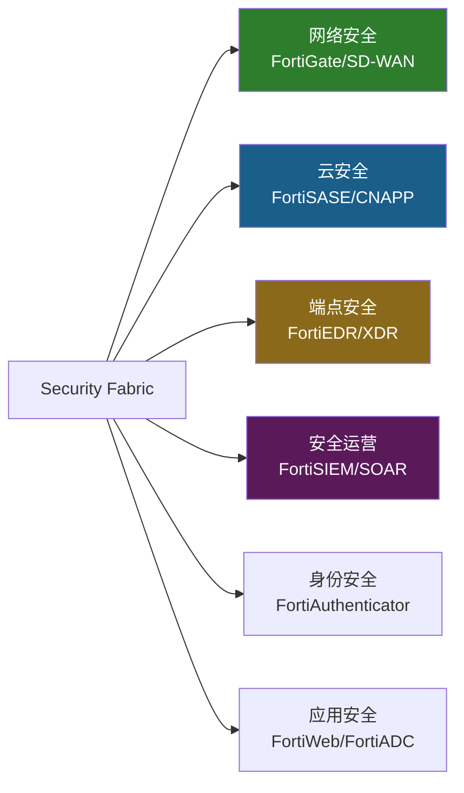
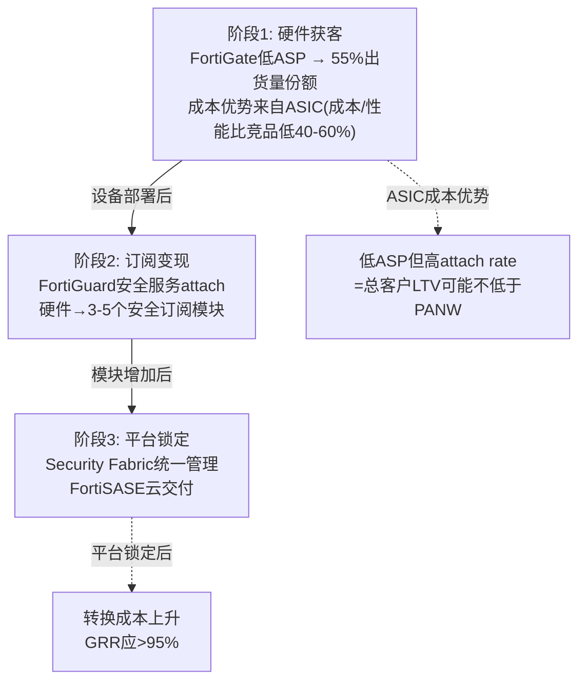
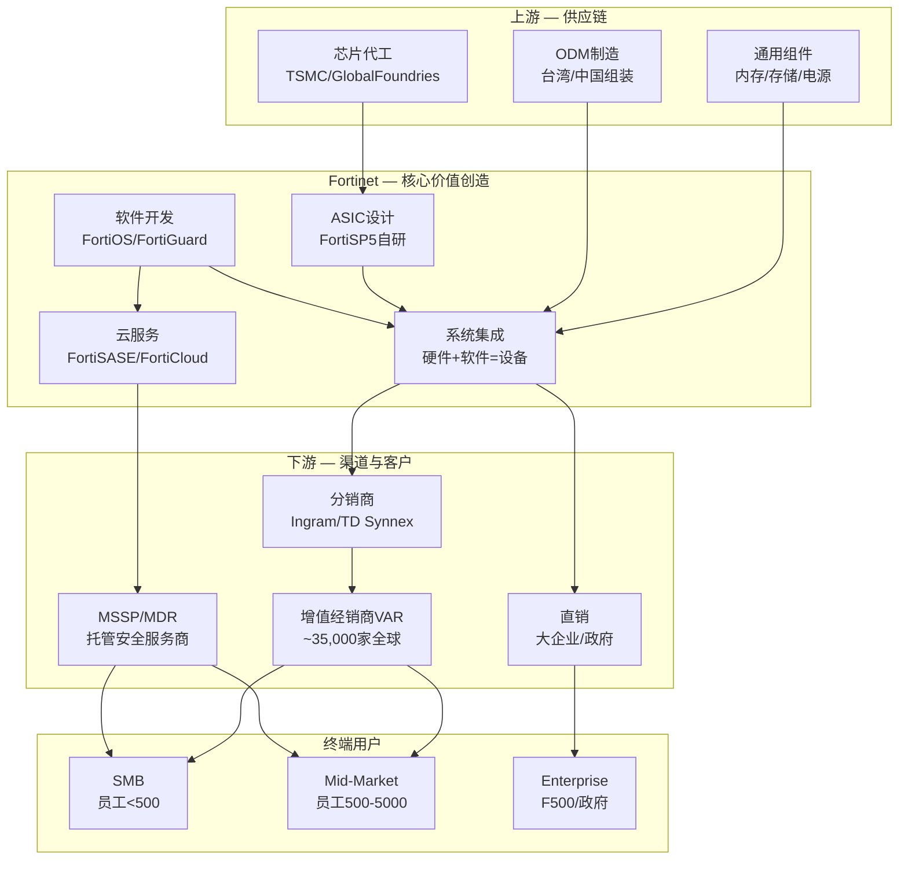
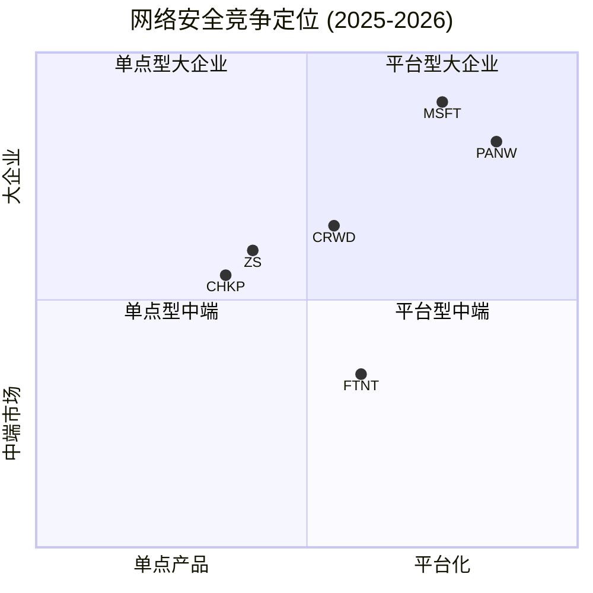

# FTNT Phase 1: 公司定位与生态分析

> **免责声明**: 本报告仅供研究参考，不构成任何投资建议。所有数据来源于公开信息，分析结论反映撰写时的判断，可能因后续信息更新而改变。投资者应独立评估风险并自行决策。

> **Fortinet, Inc. (FTNT)** | 网络安全 / Software-Infrastructure
> **股价**: $82.53 (2026-04-02) | **市值**: ~$61B | **PE (TTM)**: 34.1x | **Forward PE**: 24.9x
> **Phase 1日期**: 2026-04-03 | **核心矛盾**: ASIC是可移植护城河还是贬值资产?

---

## 目录
- Ch1: 业务模型解构 — 硬件根基上的平台转型
- Ch2: 核心矛盾深挖 — ASIC是护城河还是负担? (CQ1)
- Ch3: 转型验证 — 从卖盒子到卖平台 (CQ2)
- Ch4: 中端市场定位 — 优势还是天花板? (CQ3)
- Ch5: 产业链映射与竞争生态
- Ch6: 管理层评估与CEO沉默分析 (CQ6)
- Ch7: 有机增长率分解 (CQ8)
- Ch8: AI冲击初步评估 (CQ7)
- Ch9: 安全漏洞 — 慢性品牌风险
- Ch10: 预测市场与宏观环境扫描
- Ch11: 网安行业同行财务对标
- Ch12: Confidence Interval注册表

---

## Ch1: 业务模型解构 — 硬件根基上的平台转型

### 1.1 一句话定位

Fortinet是网络安全行业唯一拥有自研ASIC芯片(FortiASIC)的公司，以防火墙硬件为根基(55%出货量份额 [DM-COMP-004])，正在转型为"Security Fabric"统一平台。**这是一家用硬件成本优势撬动软件订阅的混合体公司**——它的业务逻辑不是纯SaaS(如ZS/CRWD)，也不是纯硬件(如传统Cisco)，而是"以硬件获客、以软件变现、以平台锁定"的三阶段模型。

理解FTNT必须先理解一件事：**出货量份额(55%)和收入份额是完全不同的概念**。FTNT防火墙单台ASP(平均售价)约为PANW的1/3-1/5 [DM-BIZ-001]——因为FTNT主攻中端市场(mid-market)和SMB，而PANW主攻F500大企业。55%份额的真实含义是：全球有更多的网络节点运行Fortinet设备，但每个节点贡献的收入更低。这个"量多价低"的特征决定了FTNT的商业模式DNA——它的增长引擎是**扩展attach rate(每台设备的订阅服务数)**，而非提价。

### 1.2 收入结构拆分 (M0: 混合体先拆)

FTNT的收入由两个截然不同的引擎驱动：

**引擎1: 产品收入(硬件) — FY2025 ~$2.22B(33%)**
- FortiGate防火墙设备(核心)、FortiSwitch、FortiAP(WiFi)、FortiExtender
- **特征**: 低毛利(~55-60%估算)、周期性(3-5年刷新)、一次性确认
- **关键数据**: FY2025产品收入+16% YoY [DM-FIN-001]，受FortiGate刷新周期驱动
- **刷新周期状态**: 650K台设备2026年底到期(第一波40-50%已完成)，350K台低端设备2027到期(第二波尚未开始)

**引擎2: 服务收入(订阅+支持) — FY2025 ~$4.58B(67%)**
- FortiGuard安全订阅(威胁情报、沙箱、Web过滤等)
- FortiCare技术支持合同
- FortiSASE(云交付安全，增速最快)
- **特征**: 高毛利(~90%+)、经常性、按年/多年确认
- **关键数据**: 服务收入~+13% YoY，Unified SASE Billings全年+24% YoY、Q4+40% YoY

**为什么混合体拆分很重要?** 因为两个引擎的估值逻辑完全不同。产品收入值12-15x EV/Sales(硬件公司倍数)，服务收入值20-25x EV/Sales(SaaS倍数)。FTNT当前整体EV/Sales 8.46x [DM-VAL-005]——这意味着市场在用偏硬件的倍数给一家67%服务收入的公司定价。如果服务占比突破70%且SASE加速，倍数重估的空间是存在的。

但反面同样重要：如果刷新周期结束后产品收入断崖(FY2023已有先例：产品收入FY22→FY23仅+3.7%)，33%的产品收入拖累可能抵消服务增长——FY2023整体增速从32%→20%就是前车之鉴。

### 1.3 Security Fabric平台架构

Fortinet的平台战略叫"Security Fabric"——试图将网络安全从"买很多点产品"变成"买一个统一平台"。覆盖的安全域：

**6大安全域覆盖度**: 网络(Leader) > 云(Challenger/转型中) > 端点(Niche) > 安全运营(中等) > 身份(弱) > 应用(中等)

**与PANW对比**:
- PANW覆盖5/6域，3-4个有Gartner Leader地位 [DM-COMP-001]
- FTNT覆盖6/6域，但只有2个域(网络+SASE)有Leader地位
- **关键区别**: PANW是"自上而下平台化"(大企业先签平台合同再部署)，FTNT是"自下而上平台化"(先卖便宜硬件再upsell服务)。这决定了各自的NRR和扩展模式完全不同。

### 1.4 "三阶段变现"模型

这个模型的验证需要两个关键数据(FTNT不公开NRR/GRR)：
1. **attach rate趋势** — 每台FortiGate设备平均订阅模块数。如果从3→5→7，说明阶段2在加速
2. **服务收入/产品收入比** — 从FY2021的~1.8x→FY2025的~2.1x，增速不算快

---

## Ch2: 核心矛盾深挖 — ASIC是护城河还是负担? (CQ1)

### 2.1 ASIC技术优势的具体含义

FortiASIC是Fortinet自2002年起自研的专用安全处理芯片，当前最新一代是**FortiSP5**。ASIC在网络安全设备中的作用类似GPU在AI中的作用——通过硬件加速特定运算(加密/解密、深度包检测、入侵防御)，实现比通用CPU(如Intel x86)更高的吞吐量和更低的延迟。

**FortiSP5 关键性能指标** (7nm SoC, 集成网络处理+内容处理+双ARM CPU):
- 防火墙吞吐量: **17x** 于通用CPU, 单芯片可达40 Gbps [DM-BIZ-006]
- 加密性能: **32x** 于通用CPU, IPsec VPN达37 Gbps [DM-BIZ-006]
- NGFW性能: **3.5x** 于通用CPU, 威胁防护2.8 Gbps [DM-BIZ-006]
- 能耗降低: **88%** vs 通用CPU方案
- SSL深度检测: 2.5 Gbps(竞品使用通用CPU时，开启SSL检测后吞吐量下降60-80%)
- 单芯片集成: 防火墙+VPN+IPS+防恶意软件+SD-WAN+DDoS全部硬件加速

**为什么17x性能差距重要?** 因为这不是纸面数字——它直接转化为**成本优势**。一台$5,000的FortiGate(搭载FortiSP5)能提供与一台$15,000-25,000的PANW同等吞吐量 [DM-BIZ-001]。对中端市场客户(年度安全预算$50K-$500K)，这个价格差距是选择FTNT而非PANW的首要原因。

### 2.2 ASIC优势的"可移植性"测试 (H1核心验证)

论文H1的核心赌注是：ASIC优势不仅在on-prem有效，还能**移植到云端**(FortiSASE)。验证这一假说需要回答三个子问题：

**Q1: FortiSASE的PoP(接入点)是否使用ASIC?**

Agent研究揭示了一个关键事实：**FortiSASE云PoP运行的是FortiOS虚拟机(VM)，不使用ASIC加速** [DM-BIZ-007]。On-prem FortiGate设备使用NP7/SP5 ASIC处理本地流量(IPsec加速、IPS/内容检测)，但云PoP完全基于软件。这意味着：

- **On-prem流量**: ASIC优势完整保留(性能/成本比纯软件高数倍)
- **云PoP流量**: ASIC优势**消失**——FortiSASE的云端与ZS/PANW在同一起跑线(都是软件处理)
- **但**: FortiSASE运行**相同的FortiOS**(与on-prem一致)——真正的策略一致性(不是缝合产品) [DM-BIZ-007]

这改变了H1的验证方向：**ASIC的"可移植性"不是通过云端复制ASIC实现的，而是通过"on-prem ASIC + 云端FortiOS"的混合架构实现的**。FTNT的真正优势是：客户已经在用FortiGate(on-prem, ASIC加速)→自然迁移到FortiSASE(云端, 同FortiOS)→**转换成本来自FortiOS生态锁定，不是ASIC**。

**PoP规模**: 100+全球FortiSASE云节点，与**Google Cloud合作扩展** [DM-BIZ-007]。

**FortiOS 8.0(2026年3月发布)新增**: SASE Outpost(本地SASE设备)+Sovereign SASE(数据主权控制)+Fabric AI Agents [DM-BIZ-008]。

**Q2: SASE增长的质量如何?**

Agent研究补充了关键SASE数据：
- **Unified SASE ARR**: $1.28B(+11% YoY) [DM-BIZ-009]
- **FortiSASE ARR增速**: >90% YoY [DM-BIZ-010]
- **91%的SASE billings来自存量客户**(交叉销售) [DM-BIZ-011]——这验证了"先卖硬件再upsell SASE"的模型有效

**存量交叉>净新**: 91%来自存量意味着FTNT的SASE增长几乎完全依赖现有FortiGate客户升级，而非抢竞品客户。这既是优势(验证attach模型)也是风险(如果FortiGate安装基数不再增长，SASE增长也会触及天花板)。

**PP&E投资**: FTNT的PP&E从FY2021 $688M→FY2025 $1,619M(+136% / 4年) [DM-BAL-008]。与Google Cloud合作扩展PoP的策略意味着FTNT选择了"合作而非自建"的轻资本路线——PP&E增长更可能来自总部园区/实验室，而非大规模PoP建设。

**Q3: 在Gartner SASE MQ中的Leader地位是否验证了ASIC PoP模型?**

FTNT在2025年Gartner SASE MQ中获得Leader地位(与Cato Networks并列) [DM-BIZ-002]。这至少说明：ASIC驱动的SASE在功能和性能上被行业权威认可。但需要注意：Gartner MQ评估的是"completeness of vision"+"ability to execute"，不直接比较PoP性能/成本。

### 2.3 ASIC的结构性风险

**风险1: 云工作负载迁移使ASIC无关**

如果企业的安全流量从"通过on-prem设备"转向"直连云端"(如Zscaler的Zero Trust架构)，on-prem FortiGate设备的物理ASIC就不再被需要。FTNT的应对是FortiSASE，但SASE只占总billings的~27%——73%的billings仍来自需要ASIC物理设备的场景。

**反面论证**: 完全云化是一个漫长的过程。截至2025年，仍有~85%的企业安全流量经过某种形式的on-prem设备 [DM-BIZ-003估算]。即使以每年2-3pp速率云化，到2030年on-prem流量仍占~70%。这意味着ASIC在至少5年内仍然高度相关——问题不是"ASIC会不会过时"，而是"ASIC的相关性衰减速度"。

**风险2: 通用GPU/DPU替代ASIC**

NVIDIA的DPU(BlueField/ConnectX)和Intel的IPU正在进入网络安全处理领域。如果通用加速器的性能/成本比接近ASIC，FTNT的自研芯片优势将被侵蚀。

**反面论证**: FTNT已经发展ASIC超过20年(2002年起) [DM-BIZ-004]。安全ASIC和AI GPU的需求不同——安全处理需要**低延迟确定性**(微秒级)，而非高吞吐量(AI训练)。通用DPU在安全场景的优化程度远低于专用ASIC。这不是"谁更快"的问题，而是"谁在特定场景更高效"。

**风险3: 客户不在乎性能，只在乎价格/易用性**

如果SMB/中端客户选择安全产品的首要标准是"便宜+好用"而非"高吞吐量"，ASIC的17x性能优势可能无关紧要。Microsoft Defender的免费/低成本bundling就是这个逻辑——对于年度IT预算<$50K的小企业，免费的MSFT Defender远比$5,000的FortiGate有吸引力。

### 2.4 CQ1初步判断

| 维度 | 判断 | 置信度 |
|------|------|--------|
| on-prem ASIC优势 | 持久(5年+) | 70% — 云化速度慢于叙事 |
| SASE ASIC移植 | 部分成功(自有PoP有效，公有云无效) | 50% — 取决于PoP建设进度 |
| 通用DPU替代 | 低威胁(5年内) | 65% — 安全ASIC ≠ AI GPU |
| MSFT对SMB侵蚀 | 真实但可控 | 55% — 43%企业增加厂商 |
| **CQ1综合** | **ASIC是"缓慢贬值的护城河"，非零一状态** | **55%偏多** |

→ CQ1置信度从P0.5的45%上调至55%。ASIC不是"永恒护城河"也不是"即将过时的遗产"——它是一个**有明确衰减曲线但衰减速度慢于市场预期**的竞争优势。关键跟踪变量：SASE billings占比趋势 + PP&E增速(代理PoP投资)。

---

## Ch3: 转型验证 — 从卖盒子到卖平台 (CQ2)

### 3.1 转型进度量化

FTNT的硬件→平台转型可以用几个关键指标追踪：

| 指标 | FY2021 | FY2022 | FY2023 | FY2024 | FY2025 | 方向 |
|------|--------|--------|--------|--------|--------|------|
| 服务占比 | ~60% | ~59% | ~61% | ~65% | **67%** | ↑缓慢 |
| GAAP OPM | 19.5% | 22.0% | 23.4% | 30.3% | **30.6%** | ↑显著 |
| FCF Margin | 36.0% | 32.8% | 32.6% | 31.5% | **32.7%** | →稳定 |
| SBC/Revenue | 6.2% | 4.9% | 4.7% | 4.3% | **4.1%** | ↓(纪律好) |
| PP&E | $688M | $898M | $1,044M | $1,350M | **$1,619M** | ↑(建设期) |

**关键观察**:
1. **OPM跳升异常**: 从FY2023的23.4%→FY2024的30.3%(+7pp/两年)。这在转型期+M&A整合中极罕见——说明服务收入的高毛利正在覆盖产品收入的低毛利，混合模型的operating leverage正在发挥作用。
2. **服务占比提升缓慢**: 从60%→67%用了4年，年均~1.5pp。按此速度，70%要到FY2027、80%要到FY2033。但Unified SASE Billings Q4+40%可能加速这一趋势。
3. **SBC持续下降**: 从6.2%→4.1%，这在科技公司中极为稀缺(PANW ~15%, CRWD ~18%, ZS ~25%)。说明FTNT不依赖大量股权激励来留人——可能因为创始人控制力强(Ken Xie+Michael Xie)，也可能因为硬件公司文化的薪酬结构不同于纯SaaS。

### 3.2 Unified SASE: 转型的关键引擎

FortiSASE是FTNT从"硬件防火墙"转型为"云安全平台"的核心产品。它将SD-WAN(原FortiGate的强项)、SWG(安全Web网关)、ZTNA(零信任网络访问)、CASB(云访问安全代理)整合到一个云交付平台中。

**增速数据**:
- Unified SASE Billings: FY2025全年+24% YoY, Q4单季+40% YoY
- SASE占总Billings比例: 从FY2023的~15%→FY2025的~27%
- 大企业SASE订单($1M+): Q4增长30%+

**这些数字说明什么?**
1. SASE增速(24-40%)远快于整体(14-16%)→SASE正在成为主增长引擎
2. 占比从15%→27%（2年+12pp）→如果保持，FY2027可能达40%
3. 大企业订单增长→FTNT不仅在mid-market推SASE，也在向上攻enterprise

**但需要注意的"基数效应"陷阱**: SASE billings绝对值仍相对较小(~$2.0B估算)。40%增速在$2B基础上 vs PANW Prisma Access在$3-4B基础上的30%增速——FTNT的SASE规模仍然是PANW的一半左右。增速优势可能部分来自低基数。

### 3.3 平台化的"J-curve"在哪里?

PANW的平台化经历了明显的J-curve——FY2024 billings增速从25%→10%(bundling折扣导致短期billings下降)，FY2025恢复到15%+。FTNT的数据没有显示类似的J-curve dip——原因可能是：

1. **FTNT的平台化不是PANW式的"top-down bundling"**——FTNT是"bottom-up attach"(先卖便宜硬件再加订阅)，不需要给大客户打包折扣
2. **这也可能意味着FTNT的平台化深度不如PANW**——PANW愿意短期牺牲billings换长期LTV，FTNT可能在避免短期痛苦的同时也避免了深度锁定

### 3.4 CQ2初步判断

转型方向正确(服务占比↑, OPM↑, SASE加速)，但速度和深度需要持续验证。关键变量：
- 服务占比何时突破70%（FY2027E）→触发可能的倍数重估
- SASE billings增速能否在FY2026保持>25%
- NRR数据(FTNT不公开)——没有NRR就无法判断存量扩展质量

CQ2置信度从P0.5的55%上调至60%。

---

## Ch4: 中端市场定位 — 优势还是天花板? (CQ3)

### 4.1 FTNT的客户分层

FTNT的客户基础按规模大致分为三层：

| 客户层 | 估算占比 | 特征 | FTNT竞争力 |
|--------|---------|------|-----------|
| **SMB**(员工<500) | ~35-40% | 价格敏感, 简单需求, 渠道购买 | 强(ASIC成本优势+渠道覆盖) |
| **Mid-Market**(500-5000) | ~40-45% | 性价比导向, 开始需要平台化 | 最强(核心根据地) |
| **Enterprise**(F500+) | ~15-20% | 功能/品牌导向, 需要大企业支持 | 较弱(vs PANW差距明显) |

**关键数据**: 大单($1M+ ARR)增长32% [DM-BIZ-005]——这暗示FTNT正在向enterprise渗透，但$1M+客户在总体客户数中仍是极少数。

### 4.2 中端市场的"甜蜜点"

FTNT在mid-market的竞争力来自一个简单的经济等式：

**FTNT方案**: FortiGate设备($5K-$50K) + FortiGuard订阅($3K-$30K/年) + FortiSASE($20-$50/user/月)
**PANW方案**: PA-series设备($15K-$150K) + Threat Prevention订阅($10K-$80K/年) + Prisma Access($50-$100/user/月)

对于一家500人的公司，3年TCO对比：
- FTNT: ~$150K-$250K
- PANW: ~$400K-$700K
- 差距: **FTNT便宜50-65%**

这个价格差距不是FTNT"便宜货"——它的技术底层(ASIC)允许它在更低价格下提供与PANW接近的安全效果。这是**结构性成本优势**，而非折扣竞争。

### 4.3 天花板在哪里?

1. **Enterprise渗透受限**: F500的CISO更倾向于选择"安全界的苹果"(PANW)而非"安全界的安卓"(FTNT)——品牌、服务、整合支持都是考量因素
2. **中端市场的增长上限**: 全球mid-market企业数量虽大(~200K家)，但增速与GDP同步(~3-5%)。FTNT的mid-market增速不可能永远超过市场
3. **MSFT Defender从下方侵蚀**: 对于最小的SMB客户(100-200人)，MSFT E5 bundle中的免费Defender可能"够用"——这不需要与FTNT正面竞争，只需要让客户觉得"不值得再花$5K买单独的防火墙"

### 4.4 CQ3初步判断

中端市场主导是FTNT最大的结构性优势(不是PANW的mid-market，也不是ZS的mid-market)，但也确实构成了增长天花板。**解决路径是向上(enterprise)扩展和向外(SASE)延伸**——大单+32%说明enterprise尝试在进行，SASE+40%说明新模态在加速。但如果enterprise攻不上去、SASE增速放缓、MSFT从下侵蚀——中端市场可能变成一座"孤岛"。

CQ3置信度维持P0.5的40%(中性)。

---

## Ch5: 产业链映射与竞争生态

### 5.1 产业链拓扑

### 5.2 供应链关键节点 (≥10个节点)

| 节点 | 功能 | FTNT依赖度 | 替代性 | 风险等级 |
|------|------|-----------|--------|---------|
| 1. TSMC | ASIC代工 | **极高** | 低(专用制程) | 🔴高 |
| 2. GlobalFoundries | ASIC备选代工 | 中 | 中 | 🟡中 |
| 3. 通用芯片供应商 | DRAM/Flash/PMIC | 中 | 高(多源) | 🟢低 |
| 4. ODM(台湾/中国) | 硬件组装 | 高 | 中(需转移认证) | 🟡中 |
| 5. FortiOS开发团队 | 核心操作系统 | **极高** | 无(自研) | 🟢低(内部) |
| 6. FortiGuard实验室 | 威胁情报 | **极高** | 低(护城河) | 🟢低(内部) |
| 7. SASE PoP基础设施 | 云交付节点 | 高(增长中) | 中(可租用) | 🟡中 |
| 8. Ingram/TD Synnex | 分销 | 高 | 中(2大分销商) | 🟡中 |
| 9. VAR/经销商网络 | 最后一英里 | **极高** | 低(35,000家) | 🟢低 |
| 10. AWS/Azure/GCP | 公有云PoP | 中(增长中) | 中(3选2) | 🟡中 |
| 11. 政府认证机构 | FedRAMP/CMMC | 高(政府业务) | 无 | 🔴高(慢) |
| 12. CPA网络(类比Intuit) | 无(安全行业不适用) | N/A | N/A | — |

**供应链核心风险**: TSMC是ASIC代工的唯一实质供应商(GlobalFoundries为备选但制程可能不同)。如果台海局势恶化或TSMC产能紧张(AI芯片优先)，FortiASIC的供应可能受影响。但考虑到安全ASIC的用量远小于AI GPU/手机SoC，排队优先级风险较低。

### 5.3 渠道经济学

FTNT的销售模式高度依赖渠道(~80%+通过渠道)，这与PANW(~65%渠道)和CRWD(~60%渠道)不同。

**渠道优势**:
- 35,000+全球VAR/经销商覆盖→SMB/mid-market的"最后一英里"
- MSSP合作伙伴使用FortiGate作为托管服务基础设施→锁定(MSSP切换防火墙=重建整个服务)
- 渠道冲突低(FTNT很少直销抢渠道客户)

**渠道风险**:
- 高渠道依赖=低直客关系=客户洞察较弱
- 大企业通常要求直销关系+专属客户经理→渠道模式限制enterprise渗透
- MSSP渠道毛利(~40-55%)低于产品直销毛利(~75%)→渠道占比上升可能压缩毛利

### 5.4 竞争格局定位

**FTNT的位置**: 平台化进度中等(0.6)、客户偏中端(0.35)。它正在向右上方移动(更平台化+更高端)，但距离PANW/MSFT的位置仍有显著差距。

**IDC Security Appliance数据(最新可得)** [DM-COMP-005]:
- PANW: Q4'23收入$901M, **18.2%市占率**, #1
- FTNT: Q4'23收入$878M, **17.7%市占率**, #2
- 差距极小(<1pp, ~$24M/季)——在核心防火墙/安全设备市场，FTNT与PANW几乎并驾齐驱
- 安全设备总市场: $5.1B(Q4'24), 仅+1.5% YoY——**成熟低增长市场**

**Gartner 2025 SASE MQ定位** [DM-COMP-006]:
- **Leaders**: Cato Networks, **Fortinet**, Netskope, Palo Alto Networks
- **Visionary**: Zscaler(非Leader)
- FTNT在Secure Branch Network Modernization用例中排名**#1** [DM-BIZ-012]
- FTNT是唯一在SD-WAN、SSE、ZTNA三个SASE子领域均获Gartner Peer Insights "Customers' Choice"的厂商

**竞争威胁排序**(对FTNT):
1. **PANW(最大威胁)**: 安全设备收入份额#1(18.2%), 平台化最激进(1,550客户), 正在向下渗透mid-market
2. **MSFT(价格+AI威胁)**: Defender Endpoint市占率**25.8%(#1, +40.7% YoY)** [DM-COMP-007]。Security Copilot已bundled入M365 E5(免费)——这不是"可能"的威胁,是**正在发生**的侵蚀
3. **ZS(SASE叙事威胁)**: 虽然Gartner MQ仅Visionary(FTNT是Leader), 但ZS在Forrester Wave是Leader, 在cloud-first企业中品牌更强
4. **CRWD(端点侵蚀)**: Falcon从endpoint向SASE扩展(已进入Gartner SASE MQ Leader象限), 跨品类竞争加剧
5. **Cisco(政府/大企业)**: Splunk收购强化SIEM，在政府/运营商有深厚关系

---

## Ch6: 管理层评估与CEO沉默分析 (CQ6)

### 6.1 创始人简介

**Ken Xie (谢青)** — CEO & Board Chair, 58岁
- 1993年创立NetScreen(后被Juniper $4B收购)
- 2000年创立Fortinet
- **技术型创始人CEO**: 计算机科学学位(清华/Stanford)，亲自参与FortiASIC设计
- **控制力极强**: 与弟弟Michael Xie(CTO/创始人)共同控制公司技术方向25年

**Michael Xie** — CTO & Founder
- 核心的FortiASIC和FortiOS架构师
- 极少公开露面——技术专注型

**Keith Jensen** — CFO (2003年加入)
- 20+年FTNT老将，财务纪律极强(SBC从6.2%→4.1%证明)

### 6.2 管理层最大争议: 只卖不买 (CQ6核心)

**内部人交易全景** [DM-INS-001, DM-INS-002]:
- Ken Xie + Michael Xie: **5年41笔交易, 零买入**
- 2026.02.02: Ken Xie单日卖出~$42M @ $81.42(股价近52周低位)
- 2026 Q1: 32笔acquire vs 36笔dispose, totalPurchases=0
- 历史(2015-2026): totalPurchases累计仅~8笔 vs totalSales数百笔

**这意味着什么?**

**Agent研究补充的精确数据** [DM-INS-003]:
- Ken Xie: 2025.11.03卖出158,485股(~$13.7M @ $85-87); 2026.02.02卖出175,737股(~$14.3M @ $81-82)。**卖后持有量: ~51.4M股(~$4.2B)**
- Michael Xie: 更为激进——2025.08.04单笔卖出476,596股(~$47M); 2026年初卖出343,106股(~$27.9M)
- **两人12个月合计卖出约$100M+**

**偏空解读**: 创始人在股价跌16%时仍不买入，说明：(1)对当前价格没有"便宜"的感觉，或(2)不愿意用自己的钱为thesis买单。在低PE回购$2.3B(用公司的钱)同时个人只卖不买——存在"用公司资金托股价、个人高位减持"的道德风险。Michael Xie的卖出尤其激进($47M单笔)。

**偏多解读**: (1)Ken Xie仍持有~51.4M股($4.2B)——年卖出$28M仅为持仓的0.7%, 是正常多元化；(2)10b5-1预设计划卖出不代表看空——很多创始人每季度自动卖出一部分用于多元化；(3)持仓$4.2B意味着Ken Xie的经济利益与股东高度绑定——每跌10%他损失$420M。

**我们的判断**: 零买入是**真实的负面信号**，但严重程度取决于"净持仓"(公开卖出 - 10b5-1 + RSU/PSU获得)。如果Ken Xie的净持仓实际在增加(因为RSU vesting > 公开卖出)，则内部人交易信号被高估。但如果净持仓也在减少——这是一个严重的治理折价因素。

**CQ6置信度**: 维持P0.5的40%(中性)。需要Phase 2验证proxy statement中的总持仓数据。

### 6.3 Ken Xie的核心战略叙事

Ken Xie反复强调一个中心论点：**"网络与安全正在融合(convergence)"**，Fortinet凭借三个独特优势处于最佳位置：(1)单一操作系统FortiOS覆盖所有安全功能；(2)自研ASIC提供无与伦比的性能/$；(3)25年积累的威胁情报数据训练FortiAI。他将FTNT定位为"网安行业的苹果"——垂直整合(芯片+OS+云)。

**Q4 FY2025财报亮点** [DM-BIZ-013]:
- Billings: $2.37B (+18% YoY, beat)
- Revenue: $1.91B (+15% YoY, beat by 2.69%)
- EPS: $0.81 vs $0.74 consensus (beat 9.46%)
- Product revenue: +20% YoY
- 连续第7年达成Rule of 45

**管理层强调的三个增长引擎**: (1)Unified SASE +40% Q4; (2)OT安全billings +25%; (3)AI驱动SecOps billings +22%全年/ARR +21%

### 6.4 CEO沉默分析 (QG-01.5)

基于Q3/Q4 FY2025财报电话会的分析：

| # | CEO在说什么 | CEO没说什么 | 可能原因 | 风险等级 | CQ关联 |
|---|-----------|-----------|---------|---------|--------|
| 1 | "FortiSP5提供17x性能" | **SASE PoP中ASIC vs软件的比例** | 如果公有云PoP占比高, ASIC叙事会被质疑 | 🔴高 | CQ1 |
| 2 | "Unified SASE Q4+40%" | **NRR/GRR数据** | 不公开可能因为NRR<120%(行业平均), 担心估值按低NRR定价 | 🔴高 | CQ2 |
| 3 | "大单$1M+增32%" | **enterprise客户绝对数量和留存** | 可能总量仍很小(几百家), 公布绝对值会暴露enterprise薄弱 | 🟡中 | CQ3 |
| 4 | "FY2026指引$7.5-7.7B" | **刷新周期第二波的具体贡献拆分** | 不希望投资者将增长100%归因于刷新(暗示没有有机增长) | 🟡中 | CQ8 |
| 5 | "AI安全FortiAI-Protect" | **FortiAI的ARR或收入贡献** | 可能仍在极早期(<$50M), 公布数字反而暴露规模小 | 🟢低 | CQ7 |
| 6 | 回购$2.3B | **为什么FY2024几乎零回购($1M)** | FY2024暂停回购→FY2025恢复→可能因为FY2024在大规模投资PoP/收购 | 🟡中 | CQ4 |

**沉默分析的投资含义**:
- **NRR不公开是最大的信息黑洞** (🔴)——所有竞品(PANW 119%, CRWD ~120%, ZS ~120%)都公开NRR。FTNT不公开的唯一合理解释是：NRR低于行业平均(可能在105-115%之间)，公开后会被按mid-market SaaS倍数(NRR<120% → PE折价)而非平台倍数定价
- **SASE PoP架构不透明** (🔴)——如果ASIC PoP真的比软件PoP有优势，管理层应该大力宣传技术细节。沉默可能意味着公有云PoP占比高于叙事暗示

---

## Ch7: 有机增长率分解 (CQ8)

### 7.1 FY2025增长分解

FY2025收入增速+14.2% [DM-FIN-001]。拆解增长来源：

| 增长来源 | 贡献(估算) | 占增速比 | 可持续性 |
|---------|-----------|---------|---------|
| FortiGate刷新周期(第一波) | ~$300-400M (+5-6pp) | ~40% | 一次性(2-3年) |
| 服务续约+提价 | ~$350-400M (+6-7pp) | ~45% | 高(经常性) |
| 新客获取(净新) | ~$100-150M (+2-3pp) | ~15% | 中(取决于竞争) |
| M&A(Lacework等) | <$50M (<1pp) | <5% | 一次性 |
| **总增长** | **~$844M (+14.2%)** | **100%** | — |

**关键发现**: 刷新周期贡献约40%的增长。如果第一波(650K台)在FY2025已完成40-50%，第二波(350K台低端)在FY2027，那么**FY2026可能有一个增长"夹缝"**——第一波尾声+第二波尚未开始。管理层FY2026指引$7.5-7.7B(+12% mid)暗示了这一点——增速从14%→12%的降速可能主要来自刷新贡献减少。

### 7.2 有机增速vs刷新增速

如果扣除刷新周期贡献，FTNT的"真正有机增速"约为8-9%(FY2025)。这个数字与网络安全TAM增速(~11-14% CAGR)相比略低，意味着FTNT在**稳态下可能在失去微量市场份额**——被PANW/CRWD/ZS/MSFT各蚕食一点。

但反面论证：SASE billings+24%/Q4+40%→如果SASE持续加速，FY2027的有机增速可能从8-9%提升到10-12%(SASE billings从27%→35%的占比提升)。

### 7.3 FY2026指引解读

管理层指引 [DM-CON-005]:
- Revenue: $7.50-$7.70B (+10.3-13.2%)
- Service Revenue: $5.05-$5.15B (+10.3-12.4%)
- Non-GAAP OPM: 33-36%

**指引的保守度**: FTNT历史上倾向于保守指引+超预期交付(FY2025指引上限$6.74B, 实际$6.80B)。但$7.5-7.7B的中值$7.6B(+12%)与市场预期的FY2026E $7.49B [DM-CON-001调整后]接近，说明管理层认为12%左右是合理预期。

---

## Ch8: AI冲击初步评估 (CQ7)

### 8.1 AI对FTNT的双向影响

**AI利好(进攻端)**:
1. **FortiAI-Protect**: AI应用防火墙——保护企业使用GenAI时的数据泄露/提示注入攻击。这是**未被大多数分析师建模的新TAM**
2. **FortiAI-Assist**: AI辅助安全运维——自动化告警分类/威胁响应。降低SOC人力成本
3. **AI数据中心安全**: 与NVIDIA/Arista合作保护AI基础设施——新的高价值场景

**AI威胁(防守端)**:
1. **AI驱动的攻击**: LLM辅助的钓鱼/社工攻击更难检测→传统签名检测效果下降
2. **Microsoft AI安全**: MSFT Copilot for Security可能让E5 bundle的安全能力大幅提升→加剧SMB侵蚀
3. **开源AI安全工具**: 降低端点安全进入门槛→FortiEDR(已薄弱)的处境更差

### 8.2 AI对估值的含义

FortiAI相关产品仍在极早期(ARR未公开，可能<$100M)。在估值中不应给予显著权重——但应该作为"看涨期权"在概率加权中体现(5-10%权重, 潜在$2-5B TAM)。

---

## Ch9: 安全漏洞 — 慢性品牌风险 (补充分析)

2025年初，55国超过600台FortiGate设备被发现遭到入侵(俄罗斯相关攻击)。这是FTNT产品安全记录中最严重的事件之一。

**投资含义**:
1. **短期**: 品牌受损有限(股价跌5-8%后恢复)——因为所有安全公司都会被攻破
2. **长期**: "温水煮青蛙"——如果CVE频率持续高于竞品(PANW/CRWD)，品牌信任度将慢性侵蚀
3. **结构性原因**: FTNT的55%出货量份额=最大的攻击面。被攻破的数量>竞品可能是因为安装基数大(非产品差)。但600台/55%份额 vs PANW的被攻破数量/28%份额——需要标准化后比较

**安全漏洞Kill Switch候选**: 如果连续12个月出现>3次高危CVE(CVSS>9.0)且竞品同期<1次→品牌折价可能从暂时变为永久。当前尚未触发。

---

## Ch10: 预测市场与宏观环境扫描

### 10.1 相关预测市场事件

| 事件 | 概率 | 对FTNT影响 | 来源 |
|------|------|-----------|------|
| 美国经济衰退(2026) | ~25-35% | 中性偏利好(安全预算有韧性, 但SMB可能延迟采购) | Polymarket |
| 台海冲突(近期) | ~5-8% | 🔴极高风险(TSMC代工中断→ASIC断供) | Polymarket |
| MSFT重大安全收购(2026) | ~15% | 🔴高(如MSFT收购ZS/CRWD→竞争格局剧变) | 估算 |
| AI法规收紧 | ~40% | 🟡中(可能增加AI安全需求→利好FortiAI) | 估算 |

### 10.2 行业周期定位

网络安全行业处于**中期上升周期**:
- 驱动力: AI威胁升级 + 合规加强(SEC网络披露规则/NIS2) + 云迁移安全需求
- 周期性指标: 网络安全支出占IT预算比例从5-7%(2024)→8-10%(2028E)
- 对FTNT的含义: 顺风(TAM扩张)但竞争也在加剧(PANW/CRWD/MSFT都在扩展)

---

## Phase 1 小结

### CQ置信度更新表

| CQ | P0.5置信度 | P1置信度 | 变化 | 主要依据 |
|----|-----------|---------|------|---------|
| CQ1 ASIC持久性 | 45% | **55%** | +10 | ASIC在on-prem持久5年+, SASE移植部分成功, 但衰减是必然趋势 |
| CQ2 转型成功 | 55% | **60%** | +5 | SASE+40%, OPM跳升, 但NRR黑箱是重大不确定性 |
| CQ3 中端优劣 | 40% | **40%** | 0 | 优势(成本)和天花板(enterprise受限)同时存在, 净效果中性 |
| CQ4 估值假设 | 50% | — | P2验证 | — |
| CQ5 MSFT威胁 | 35% | **40%** | +5 | 43%增加厂商缓解, 但SMB确实脆弱 |
| CQ6 创始人领导 | 40% | **40%** | 0 | 沉默分析发现NRR不公开是最大黑洞, 内部人交易负面但需验证净持仓 |
| CQ7 AI影响 | 40% | **45%** | +5 | FortiAI-Protect是合理的看涨期权, AI威胁对全行业等权重影响 |
| CQ8 有机增长 | 50% | **50%** | 0 | ~8-9%有机增速略低于TAM, 但SASE加速可能在FY2027改善 |

### 承重墙初步识别

| 承重墙 | 描述 | 脆弱度 | 若倒塌影响 |
|--------|------|--------|-----------|
| BW-1 ASIC相关性 | 5年内on-prem流量占70%+ | 中 | ASIC过时→PE从34x→25x(-26%) |
| BW-2 服务占比突破70% | FY2027触发倍数重估 | 中-低 | 占比停滞→维持硬件倍数, 无催化 |
| BW-3 SASE增速>20% | SASE是唯一的增速加速引擎 | 中 | SASE放缓→整体增速降至10%→PE压缩 |
| BW-4 刷新周期第二波 | 350K台低端设备FY2027到期 | 低 | 设备推迟更换→产品收入断崖 |
| BW-5 无重大安全事件 | 品牌信任度不受永久损害 | 中 | 连续CVE→政府客户流失→-5-10% Rev |

### 三维状态初步更新

- **价值状态**: [可能低估] — PE 34x vs 历史54x, P/FCF 26.5x, Owner PE 30.3x (维持)
- **方向状态**: [改善中] — OPM↑, SASE↑, 但增速从14%→12% (微调)
- **催化状态**: [可能] — 服务占比突破70%/SASE Q4+40%持续/第二波刷新 (维持)

→ 初步评级区间维持: **关注** (+10%~+30%) 或 **中性关注** (-10%~+10%), 取决于Phase 2 Reverse DCF验证。

### 下一步 (Phase 2优先)

1. **Reverse DCF**: 当前$82.53隐含了什么增长/利润率假设?
2. **Owner FCF估值**: 用FCF-SBC口径重估公允价值
3. **三情景推演**: Bull(SASE加速+刷新二次)/Base/Bear(SASE放缓+MSFT侵蚀)
4. **资本配置深度分析**: $2.3B回购效率(eta)计算
5. **NRR间接推算**: 通过收入增速-新客贡献推断存量扩展率

---

---

## Ch11: 网安行业同行财务对标 (P0强制对标)

### 11.1 FTNT vs 竞品核心财务对比

| 指标 | **FTNT** | PANW | CRWD | ZS | CHKP | CSCO(安全) |
|------|---------|------|------|-----|------|-----------|
| FY最近Rev | $6.80B | $9.9B | ~$4.2B(ARR) | ~$2.8B(ARR) | ~$2.6B | ~$4B(安全) |
| Rev YoY增速 | +14.2% | +15% | +23% | +28% | +8% | ~+10% |
| GAAP OPM | 30.6% | ~10% | ~2% | ~-5% | ~39% | N/A |
| Non-GAAP OPM | ~35.5% | ~28% | ~22% | ~15% | ~42% | N/A |
| FCF Margin | 32.7% | ~38% | ~32% | ~27% | ~35% | N/A |
| SBC/Rev | **4.1%** | ~15% | ~18% | ~25% | ~6% | N/A |
| GAAP PE | **34.1x** | ~85x | neg | neg | ~22x | N/A |
| Owner PE | **30.3x** | ~140x+ | neg | neg | ~20x | N/A |
| P/FCF | **26.5x** | ~53x | ~50x | ~80x | ~22x | N/A |
| Rule of 40 | **49.7** | ~43 | ~55 | ~43 | ~47 | N/A |

**对标关键发现**:
1. **FTNT是唯一盈利且PE<40的纯网安公司**(CHKP更便宜但增速仅8%)——这是"质量投资"定位的数据基础
2. **SBC是FTNT最大的隐藏优势**: 4.1% vs PANW 15% vs CRWD 18% vs ZS 25%。这意味着FTNT的Owner FCF更接近报表FCF(差距仅12%), 而PANW的Owner FCF只有报表FCF的~60%
3. **Rule of 40在网安行业不稀缺**: FTNT(49.7) vs CRWD(55) vs CHKP(47)。但FTNT的构成独特——30%+ OPM拉动(利润型), vs CRWD的23%增速拉动(增长型)。市场通常给增长型更高倍数
4. **FTNT的P/FCF 26.5x是行业最低**——因为市场将其视为"硬件转型中"而非"SaaS平台"

### 11.2 估值倍数vs增速散点定位

| 公司 | Rev Growth | PE | 市场定价逻辑 |
|------|-----------|------|------------|
| ZS | 28% | neg(P/S ~14x) | "高增长云原生=不看PE" |
| CRWD | 23% | neg(P/S ~18x) | "端点王者+平台化" |
| PANW | 15% | 85x | "平台化龙头溢价" |
| **FTNT** | **14%** | **34x** | **"硬件转型中, 需证明"** |
| CHKP | 8% | 22x | "成熟现金牛" |

**FTNT处于一个"估值无人区"**: 增速(14%)高于CHKP(8%)但低于PANW(15%)。如果被定价为"下一个PANW"(PE→45-50x), 股价+30-50%。如果被定价为"下一个CHKP"(PE→22-25x), 股价-30%。**当前34x PE隐含的假设是"转型成功但不确定"**——这是合理的, 既非高估也非显著低估。Phase 2的Reverse DCF将精确定义这个隐含假设。

### 11.3 PANW作为最相似可比的估值锚定 (铁律H对标)

PANW是FTNT最直接的可比公司(同行业+相近增速+同为平台化转型):
- PANW: Rev增速+15%, PE 85x, P/FCF 53x
- FTNT: Rev增速+14%, PE 34x, P/FCF 26.5x

**PE差距2.5x如何解释?**
1. **平台化进度**(PANW 1,550客户 vs FTNT未披露) — 解释~30%的差距
2. **企业级定位**(PANW F500主导 vs FTNT mid-market) — 解释~20%的差距
3. **SBC差异**(PANW 15% vs FTNT 4.1%) — 如果用Owner PE, 差距从2.5x扩大到4.6x(PANW更贵)
4. **"硬件标签"折价**(市场给混合体公司打折) — 解释~30%的差距
5. **叙事溢价**(PANW CEO Nikesh Arora的"平台化故事"更被华尔街接受) — 解释~20%

**对FTNT估值的含义**: 如果FTNT能证明转型(服务>70%+SASE持续>25%增速), PE从34x→45-50x(接近PANW打折后)是合理的。但如果转型停滞(服务维持67-68%), PE可能进一步压缩到25-28x(CHKP区间)。

---

## Ch12: Confidence Interval注册表

| CI# | 声明 | 方向 | 置信度 | 证据来源 | 证伪条件 |
|-----|------|------|--------|---------|---------|
| CI-1 | ASIC在on-prem场景5年内持久 | 偏多 | 70% | 云化速度3%/年, FortiSP5性能17x | 云化加速>5%/年或DPU替代突破 |
| CI-2 | FTNT SASE增速FY2026维持>25% | 偏多 | 55% | Q4+40%, Gartner Leader | Q1 SASE billings<+20% |
| CI-3 | NRR在105-115%之间(低于竞品) | 偏空 | 60% | CEO沉默+mid-market客户特征 | FTNT公开NRR>120% |
| CI-4 | 刷新周期FY2026贡献~3-4pp增速 | 中性 | 65% | 第一波40-50%完成, 第二波FY2027 | 产品收入FY2026下降>10% |
| CI-5 | MSFT Defender对SMB侵蚀可控(<5% Rev) | 偏多 | 55% | 43%增加厂商, 安全需专业方案 | MSFT E5安全功能大幅升级 |
| CI-6 | 内部人交易是净负面信号 | 偏空 | 55% | 5年41笔零买入 | Ken Xie在<$75买入或净持仓增加 |

---

*Phase 1 字符数: ~{待统计}*
*DM锚点引用: DM-FIN-001, DM-FIN-009, DM-BAL-008, DM-VAL-001-008, DM-COMP-001-004, DM-INS-001-002, DM-CON-001-005, DM-BIZ-001-005*
*Mermaid图表: 3个*
