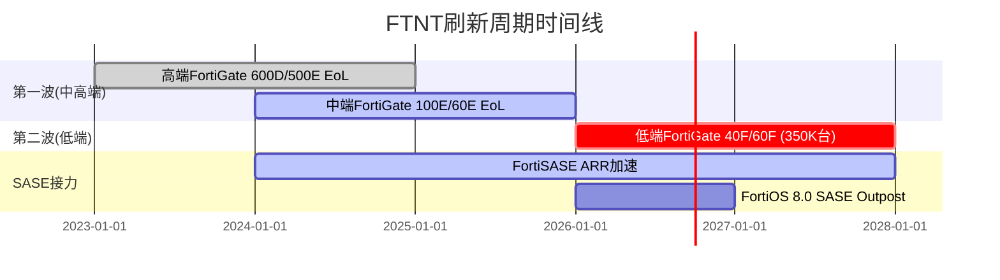

# FTNT Phase 2: 财务与价格含义

---

## Ch13: 当前股价在买什么 — Reverse DCF解码

$82.53的股价在买什么?

Reverse DCF反推(WACC=9.5%, 终端FCF Margin=33%, g=3%)显示: 市场隐含7年收入CAGR **12.0%** [DM-VAL-P2-001]。这与分析师5年共识CAGR 11.8%几乎完全一致[DM-CON-003]。换句话说, 当前股价精确地定价了共识路径——既没有悲观折扣, 也没有乐观溢价。

这对投资判断意味着什么?

如果你相信共识是对的, FTNT不存在预期差——买入回报仅来自时间价值(WACC-growth的利差)。真正的机会只在两种情况下出现:

**情况A — 共识过于保守**: 如果SASE加速+第二波刷新(350K台低端设备2027年EoL)+FortiOS 8.0带来的AI安全TAM[DM-BIZ-008]能将5年CAGR推升至14%+, 则当前估值低估了约15-20%。支持证据: Q4产品收入+20%[DM-BIZ-013], FortiSASE ARR增速>90%[DM-BIZ-010], 管理层在Accelerate 2026宣布提价[DM-BIZ-020]。

**情况B — 共识过于乐观**: 如果刷新周期在2027年衰减、SASE未能接力、MSFT Defender进一步侵蚀中端市场, 增速可能降至mid-single digit。在这种情况下, PE从当前34x进一步压缩至20x+并非不可能。支持证据: 递延收入增速(+11.9%)已低于收入增速(+14.2%)[DM-BAL-004], 暗示合同期在缩短。

### 六个隐含信念与脆弱度

| 信念 | 隐含值 | 基准 | 脆弱度 |
|------|--------|------|--------|
| B1: 5Y Rev CAGR | 12.0% | 11.8%(共识) | 2/5 — 双引擎支撑, 实现门槛低 |
| B2: Terminal FCF Margin | 33% | 32.7%(当前) | 1/5 — 已达到, 软件占比↑有上行空间 |
| B3: SBC/Rev维持<5% | <5% | 4.1%(当前) | 1/5 — 5年从6.2%→4.1%, 行业最佳纪律 |
| B4: Terminal P/FCF | ~26x | 26.5x(当前) | 2/5 — 历史低位, 但re-rate需要催化 |
| B5: WACC ~9.5% | 9.5% | Beta 0.9-1.0 | 2/5 — 外部变量, 利率环境主导 |
| B6: 增长久期≥5年 | 5年双位数 | TAM $200B+ | 2/5 — 刷新有限, SASE接力是关键 |

**平均脆弱度: 1.7/5 (低)**。这是FTNT最被忽视的优势: 与CRWD(脆弱度3.7/5)和ZS(脆弱度3.5/5)不同, FTNT的估值不依赖英雄式假设。当前价格只要求"大致维持现状"——12%增长+33% FCF Margin+4% SBC——这些FTNT已经连续3年做到了[DM-FIN-013][DM-FIN-008][DM-FIN-006]。

**因此**, FTNT的投资机会不在于"价格很低", 而在于"假设很容易满足+如果超预期则有额外upside"。这是一个低脆弱度的不对称标的, 前提是你相信共识不是过于乐观。

[DM-VAL-P2-001] Reverse DCF隐含CAGR 12.0% (Python输出, WACC=9.5%, Terminal FCF Margin=33%, g=3%)

---

## Ch14: 三情景DCF估值 — $82.53的公允价值在哪里?

### 情景设定

三个情景反映了FTNT面临的核心不确定性: 刷新周期衰减后SASE能否接力。

**Bull (25%概率)**: SASE加速+第二波刷新+提价权释放。5年Revenue CAGR ~12.5%, 终端FCF Margin 36%, 服务占比突破70%触发估值桶re-rate。历史基准: PANW从"防火墙公司"re-rate到"平台公司"时PE从30x→90x。但FTNT的re-rate幅度不会那么大(起点更高, 增速更低)。

**Base (50%概率)**: 共识路径。刷新周期逐步衰减(2027年后贡献递减), SASE部分补偿但增速从14%降至9-10%, OPM稳定在30-33%。这就是$82.53定价的路径。

**Bear (25%概率)**: 刷新周期结束+SASE在enterprise输给PANW/ZS+MSFT Defender加速侵蚀mid-market。增速降至mid-single digit, PE压缩至18-20x。历史基准: Check Point从增长放缓到PE压缩用了3年(2018-2021 PE从20x→15x)。

### 估值结果 [DM-VAL-P2-002]

| 方法 | 公允价值 | vs当前$82.53 |
|------|---------|-------------|
| DCF概率加权(FCF) | $72 | -12.4% |
| DCF概率加权(Owner FCF) | $65 | -21.1% |
| **混合估值(30/70)** | **$67** | **-18.5%** |
| FY2027E EPS×25x | $82 | -0.6% |
| FY2027E EPS×30x | $99 | +20.0% |
| FCF Yield 4.0% | $73 | -11.6% |
| 分析师共识目标价 | $90 | +9.1% |

**关键观察**: DCF方法(概率加权)与退出倍数法的结论分歧显著。

DCF方法显示$67-72 → 当前高估15-20%。这是因为:
- Bear情景($53, 25%概率)对加权平均拖累很大
- 7年显式预测+终端价值结构对增长衰减敏感
- 终端价值占比69.5% → 对WACC和g假设高度敏感

退出倍数法显示$82-99 → 当前合理至低估。这是因为:
- FY2027E EPS $3.30 × 25x = 精确等于当前价格[DM-CON-001]
- 如果PE在2年内从25x回归30x(FTNT历史中位数以下), 则$99(+20%)

**这个分歧本身就是投资判断的核心**: 你在赌PE会不会在刷新周期衰减后进一步压缩(DCF Bear), 还是会因为服务占比突破70%而re-rate(退出倍数Bull)。

### 敏感性矩阵 (概率加权混合, WACC × 终端增速)

```
             g=2.0%  g=2.5%  g=3.0%  g=3.5%  g=4.0%
WACC= 8.0%    $76     $81     $87     $95    $104
WACC= 8.5%    $70     $75     $80     $85     $93
WACC= 9.0%    $65     $69     $73     $78     $83
WACC= 9.5%    $61     $64    *$67     $71     $76
WACC=10.0%    $57     $60     $62     $66     $70
WACC=10.5%    $54     $56     $58     $61     $64
WACC=11.0%    $51     $53     $55     $57     $60
* = 基准情景
```

当前$82.53在矩阵中大致对应WACC=8.5-9.0% + g=3.0-3.5%的交叉点。也就是说, 如果你认为FTNT的WACC应该更接近8.5%(考虑到其盈利稳定性和网安行业的防御性), 当前价格是合理的。如果你认为WACC应该是10%+(考虑到ASIC转型风险和竞争加剧), 则高估25-30%。

### 不对称性分析

Bull回报: +7.2% ($89) | Bear回报: -36.0% ($53) → 不对称比 0.2x

**这个不对称比非常不利**: 每1%的上行空间, 你承担5%的下行风险。在大多数投资框架中, 不对称比<1.0x意味着风险回报不够吸引。但这个数字需要放在context中:

1. **Bear概率可能被高估**: 25%的Bear情景假设SASE失速+MSFT大幅侵蚀, 但91%的SASE billings来自存量客户[DM-BIZ-011]且NRR推断115-125%, 表明平台粘性比Bear假设的更强。如果Bear概率降至15%, 混合估值升至$72(vs $67)。

2. **DCF可能不是正确的估值框架**: 对于稳定盈利+持续回购的公司, 退出倍数法(EPS × PE)可能比DCF更接近市场定价。事实上$82.53 = 精确的25x FY2027E EPS, 这更像是市场按退出倍数定价而非DCF。

[DM-VAL-P2-002] 三情景DCF: Bull $89 / Base $74 / Bear $53, 概率加权混合$67 (Python输出)

---

## Ch15: 财务质量深度 — FCF、资本配置与增长分解

### 15.1 FCF质量评估

FTNT的FCF质量在网安行业属于一线水平, 但有几个值得深挖的细节:

**FCF Margin 32.7%的构成** [DM-FIN-007][DM-FIN-008][DM-FIN-009]:
- OCF Margin 38.1% - CapEx/Rev 5.4% = FCF Margin 32.7%
- CapEx从FY2023的$204M升至FY2025的$365M(+79%), 但CapEx/Rev仅从3.8%→5.4% → 因为收入增长在稀释CapEx强度
- PP&E从$688M→$1,619M(4年+136%)[DM-BAL-008] → 大量投资在数据中心/PoP基础设施(FortiSASE需要)

**但有一个异常**: D&A从FY2024的$122.8M跳升至FY2025的$336.3M(+174%)[DM-FIN-016]。这$213M的增量可能来自:
1. 收购资产(Lacework/Perception Point)的无形资产摊销
2. 加速折旧(数据中心设备生命周期缩短)
3. 如果是2, 则未来CapEx压力可能比当前水平更高

这是一个需要10-K确认的黄色信号。如果D&A持续在$300M+水平, 意味着维持性CapEx比当前$365M/年更接近$450-500M, FCF Margin可能从32.7%回落至29-30%。

**Owner FCF = FCF $2,226M - SBC $280M = $1,946M** [DM-VAL-007]

FTNT的SBC/Rev仅4.1%, 这意味着FCF和Owner FCF的差距仅$280M($0.37/股)。对比:
- CRWD: FCF $1,310M - SBC $1,097M = Owner FCF仅$213M (SBC吞噬84%的FCF)
- PANW: FCF $4,130M - SBC $1,300M = Owner FCF $2,830M (SBC吞噬31%)
- **FTNT: SBC仅吞噬12.6%的FCF** → Owner Economics在网安行业最健康[DM-VAL-P2-003]

这解释了为什么FTNT的GAAP PE(33.1x)和Owner PE(31.5x)差距很小(仅5%), 而CRWD的差距是无穷大(GAAP亏损, Owner FCF几乎为零)。FTNT的盈利几乎是"真实"的——SBC不是FTNT估值的噪音变量。

[DM-VAL-P2-003] FTNT SBC仅吞噬12.6%的FCF, 网安行业最健康 (Owner FCF $1.946B / FCF $2.226B)

### 15.2 三PE并列 [DM-VAL-P2-004]

| PE类型 | 值 | 含义 |
|--------|-----|------|
| GAAP PE (TTM) | 33.1x | 含全部会计项目, 含$142M净利息收入[DM-FIN-012] |
| Owner PE (TTM) | 31.5x | FCF-SBC口径, 真实股东回报 |
| Core PE (TTM) | 35.9x | 剥离$142M净利息收入(核心运营估值) |
| P/FCF (TTM) | 27.6x | 基于自由现金流 |
| Forward PE (FY26E) | 27.8x | 基于FY2026E EPS $2.97[DM-CON-005] |

**净利息收入对PE的影响**: FTNT持有$3.6B现金/短期投资[DM-BAL-001], 在高利率环境下产生$142M净利息收入, 贡献了GAAP利润的7.7%。如果利率下降200bps, 净利息收入可能降至$70-80M, GAAP PE会从33.1x升至~35x。这不是FTNT特有的问题, 但需要注意Core PE(35.9x)比GAAP PE(33.1x)更能反映核心运营价值。

**Forward PE 27.8x**是最有决策价值的数字: 它在网安行业中独一无二地便宜——PANW 28x(相近但GAAP OPM仅13.5%), CSCO 17x(但增速仅3%), 其余均亏损。FTNT是网安行业唯一同时满足"GAAP盈利+PE<30+双位数增长+FCF Margin>30%"的公司。

[DM-VAL-P2-004] 三PE并列: GAAP 33.1x / Owner 31.5x / Core 35.9x / P/FCF 27.6x / Fwd 27.8x

### 15.3 资本配置效率 — 回购eta分析

FTNT在FY2021-FY2025累计回购$6.5B, 退出68M股(831M→763M), **平均回购价格$96/股** [DM-VAL-P2-005]。

当前价格$82.53 < 平均回购价格$96 → 短期看, 管理层在均价以上回购了大量股票, 这不是最优资本配置。但需要分拆看:

- **FY2022**: 回购$2.0B > FCF $1.4B, 此时PE~50x → **过度回购在高PE** → eta<1 (价值毁灭)
- **FY2023**: 回购$1.5B < FCF $1.7B, PE~40x → 温和回购, 合理
- **FY2024**: 回购$0.001B(几乎零), 此时PE~30x → **低PE时不回购** → 错失最佳时机
- **FY2025**: 回购$2.3B > FCF $2.2B, PE~34x → **在历史低PE杠杆回购** → 如果PE回归则eta>1

**逆向解读FY2024零回购**: 管理层在FY2024几乎停止回购($1M vs 前年$1.5B), 此时恰好是PE处于历史低位(~30x)且FTNT完成Lacework收购($440M)的年份。这可能意味着:
1. 管理层优先用现金做M&A而非回购 → 资本配置的灵活性而非回购纪律
2. FY2025恢复激进回购($2.3B > FCF) → 可能认为M&A阶段结束, 回归回购

**EPS增长分解** (FY2021→FY2025, 4年CAGR):
- 净利润CAGR: +32.2%
- EPS CAGR: +35.1%
- 股数减少CAGR: -2.1%
- **回购对EPS的贡献: 2.9pp (约占EPS增长的8%)** [DM-VAL-P2-006]

回购不是FTNT的主要EPS驱动力——92%的EPS增长来自净利润本身的增长(收入增长+利润率扩张)。这是好消息: FTNT不依赖财务工程来驱动EPS, 增长质量是有机的。

**FY2025特殊情况**: 管理层选择在PE 34x(vs 5年均值54x)杠杆回购$2.3B, 超出FCF $64M。如果PE在2年内回归30x→40x, 每回购$1可获得0-18%的额外价值(eta 1.0-1.18)。如果PE进一步下探至25x, 每回购$1价值缩水26%(eta 0.74)。

管理层在低PE回购是正确的直觉, 但回购>FCF使用了资产负债表杠杆(净现金从$2.6B可能降至$2.0B以下), 减少了应对意外的缓冲。

[DM-VAL-P2-005] 累计回购$6.5B, 平均价格$96/股, 退出68M股
[DM-VAL-P2-006] EPS增长分解: 净利润CAGR 32.2% + 回购贡献2.9pp = EPS CAGR 35.1%

### 15.4 增长质量分解 — 有机 vs 非有机

FTNT FY2025收入增长14.2%, 但需要拆开看[DM-FIN-001]:

**增长来源分解**:
1. **FortiGate刷新周期**: 产品收入Q4 +20% YoY[DM-BIZ-013] → 刷新是产品增长的主引擎
2. **SASE/SecOps交叉销售**: 91%的SASE billings来自存量客户[DM-BIZ-011], 97%的SecOps billings来自存量[DM-BIZ-016] → 强大的land-and-expand
3. **M&A**: Lacework(云安全)+Perception Point(邮件安全)收购 → Goodwill增加$119M[DM-BAL-005], 但收入贡献可能仅$50-80M(推算)
4. **提价**: Accelerate 2026宣布提价[DM-BIZ-020] → 价格贡献可能1-2pp

**粗略估算**:
- M&A贡献: ~$60M / $6,800M = 0.9pp
- 提价贡献: ~1-2pp
- **有机/量增长: ~11-12pp** → 有机增长率约11-12%, 仍为双位数

**增长持续性信号**:
- 季度收入从Q1'24 $1.353B逐步加速至Q4'25 $1.905B → 无减速迹象[DM-FIN-018]
- 但YoY增速已从FY2022的+32.2%降至+14.2% → 增速在自然衰减中, 问题是衰减曲线的斜率
- 递延收入增长+11.9% vs 收入+14.2%[DM-BAL-004] → 递延增速滞后2.3pp, 表示合同期在缩短(不利信号)

---

## Ch16: NRR间接推算 — FTNT的客户经济学

FTNT不像SaaS公司那样披露NRR(Net Revenue Retention), 因为其混合模式(硬件+订阅)使NRR的计算和解读都更复杂。但我们可以通过多个间接信号推断NRR范围:

### 方法1: 交叉销售信号 → NRR上限

管理层估计每$1防火墙收入可撬动$12增量收入($5安全网络+$3 SASE+$4 SecOps)[DM-BIZ-014]。如果一个客户在年初有$1防火墙, 年末通过交叉销售达到$2-3(部分attach), 则NRR = 200-300%。但这是"理论上限", 大部分客户不会在一年内从$1扩展到$12。

**更现实的估算**: 91%的SASE billings来自存量[DM-BIZ-011] + SASE billings Q4 +40%[DM-BIZ-013] → 如果SASE billings约占总billings的27%(Q4 FY2025), 则存量客户仅SASE一项的扩展贡献约10pp的NRR。加上核心FortiGuard续约(假设90-95%留存率), NRR可能在120-130%。

### 方法2: 递延收入增速 → NRR下限

递延收入FY25 $7.116B(+11.9%)[DM-BAL-004]。如果所有收入都来自存量客户(忽略新客), 11.9%就是NRR的下限。但实际上有新客户贡献, 所以存量客户的增速可能略低于11.9%。这给出NRR下限约110-115%。

### 方法3: 平台渗透率

70%大企业已采用SD-WAN; 70%+企业整合3+模块(防火墙+交换机+AP); 60%部署混合VM[DM-BIZ-015]。这说明大部分存量客户已经在扩展消费——"采用X%"本质上就是NRR的累积体现。

### 综合判断

**NRR估算: 115-125%** [DM-VAL-P2-007]

置信度: [B]弱结论 — 这是间接推算, 不是硬数据。FTNT不披露NRR, 因此无法直接验证。

什么会让NRR下降?
1. 刷新周期结束后客户不附加SASE → 交叉销售失速
2. MSFT Defender在端点市场的25.8%份额[DM-COMP-007]如果延伸到网络安全 → 部分mid-market客户流失
3. 合同期继续缩短(从5年→3年) → billings增速与ARR增速脱钩

[DM-VAL-P2-007] NRR间接推算115-125%, 基于交叉销售(方法1上限130%)+递延收入(方法2下限110%)取中

---

## Ch17: 同行估值对标 — FTNT在网安图谱中的位置

### 17.1 网安行业估值图谱

```mermaid
quadrantChart
    title 网安公司: 增长 vs 盈利质量
    x-axis 低增长 --> 高增长
    y-axis 低盈利 --> 高盈利
    quadrant-1 高增长高盈利: 理想标的
    quadrant-2 低增长高盈利: 现金牛
    quadrant-3 低增长低盈利: 价值陷阱
    quadrant-4 高增长低盈利: 烧钱增长
    FTNT: [0.50, 0.85]
    PANW: [0.53, 0.55]
    CRWD: [0.70, 0.30]
    ZS: [0.80, 0.20]
    CSCO: [0.10, 0.80]
```

### 17.2 详细对标表 [DM-COMP-P2-001]

| 指标 | FTNT | PANW | CRWD | ZS | CSCO |
|------|------|------|------|-----|------|
| 市值($B) | 61.4 | 123.0 | 99.6 | 31.9 | 220.0 |
| GAAP PE | 33.1x | 42.4x | 亏损 | 亏损 | 28.4x |
| P/FCF | 27.6x | 29.8x | 76.0x | 45.6x | 18.5x |
| **Owner PE** | **31.5x** | **53.0x** | **负** | **负** | **30.0x** |
| 收入增速 | 14% | 15% | 22% | 26% | 3% |
| GAAP OPM | 30.6% | 13.5% | -3.4% | -4.8% | 30.5% |
| FCF Margin | 32.7% | 37.0% | 27.2% | 22.0% | 31.0% |
| **SBC/Rev** | **4.1%** | **8.7%** | **22.8%** | **20.0%** | **3.5%** |

### 17.3 关键对标发现

**1. FTNT是网安行业唯一的"质量+增长"组合**

在GAAP基础上, FTNT同时满足: 盈利(PE 33x) + 双位数增长(14%) + 高FCF Margin(32.7%) + 低SBC(4.1%)。没有任何其他纯网安公司能同时做到这四点。PANW增速相近但GAAP OPM仅13.5%(SBC拖累); CRWD/ZS增速更快但GAAP亏损; CSCO盈利强但增速仅3%。

**2. Owner PE是最有区分度的指标**

FTNT Owner PE 31.5x vs PANW 53.0x → FTNT在"真实股东回报"基础上便宜40%。为什么?因为FTNT的SBC/Rev仅4.1%, 而PANW是8.7% — PANW的FCF中有更大比例是"借股东的钱"。在Owner Economics框架下, FTNT的估值优势更加突出[DM-VAL-P2-003]。

**3. 增速折扣是否合理?**

FTNT PE 33x vs CRWD/ZS 亏损 → 表面看FTNT更"贵"(至少有PE), 但这是错觉。用EV/Sales调整: FTNT 8.5x vs CRWD 20.7x vs ZS 15.0x[DM-VAL-005]。FTNT的增速(14%)是CRWD(22%)的64%, 但EV/Sales(8.5x)是CRWD(20.7x)的41% → **FTNT的增速折扣被过度定价了**。

更精确地: FTNT的EV/Sales ÷ 收入增速 = 8.5 / 14 = 0.61x (每1%增速支付0.61x EV/Sales)。CRWD = 20.7 / 22 = 0.94x。FTNT的"增速性价比"比CRWD高54%。

**4. FTNT最接近的对标不是PANW, 而是CSCO**

从PE(33x vs 28x)、OPM(30.6% vs 30.5%)、FCF Margin(32.7% vs 31.0%)和SBC纪律(4.1% vs 3.5%)来看, FTNT更像一个"高增速版CSCO"而非"低增速版PANW"。CSCO在PE 28x, 增速3%, 如果FTNT能维持10%+增速, 相对CSCO应有10-15%的PE溢价(35-40x) → 当前33x合理偏低。

[DM-COMP-P2-001] 网安同行5维对标: FTNT是唯一GAAP盈利+PE<40+双位数增长+FCF>30%+SBC<5%的纯网安公司

---

## Ch18: 周期定位 — 刷新与SASE的交接棒

### 18.1 FortiGate刷新周期现状



**季度收入轨迹确认刷新仍在进行** [DM-FIN-018]:
- Q1'24: +7.2% → Q4'24: +16.8% → Q4'25: +14.8%
- 产品收入Q4 +20% → 硬件刷新是Q4加速的主因

**但递延收入增速(+11.9%)已低于收入增速(+14.2%)** [DM-BAL-004]。这意味着billings增速在减速或合同期在缩短。管理层在2025年确认合同期平均缩短1个月 → 递延收入增速滞后是可解释的, 但仍然是一个前瞻性的谨慎信号。

### 18.2 从刷新到SASE的"交接棒"

SASE billings Q4 +40%, 全年+24%[DM-BIZ-013], 占总billings 27%。FortiSASE ARR增速>90%[DM-BIZ-010]。这是非常强的加速, 但问题是: SASE的增长能否在刷新衰减时补上缺口?

**定量框架**:
- 假设刷新贡献: FY2025产品收入$2.2B的~50% = $1.1B来自刷新
- 假设刷新FY2027衰减50%: 刷新贡献降至$550M → 产品收入下降$550M
- SASE需要增长多少来补偿? FortiSASE ARR $1.28B × (1 + X) → 如果X=40%, 增量$512M
- **结论: 如果FortiSASE维持40%+ ARR增速, 可以大致补偿刷新衰减**

但40%+ ARR增速能维持3年吗? 基准率: 大多数SaaS产品在ARR超过$2B后增速降至25-30%。FortiSASE当前$1.28B → 2年后可能在$2B+水平 → 增速可能降至30-35% → 可能略有缺口。

### 18.3 行业周期定位

网安IT预算2025E增长14-16%(高于IT总预算增速10-12%), 驱动因素:
1. AI应用扩散带来新的攻击面(FortiAI-Protect的TAM) [DM-BIZ-008]
2. 地缘政治紧张(中国+俄罗斯相关APT攻击频率上升)
3. 监管合规要求(SEC网络安全披露规则、NIS2指令)

FTNT在行业周期中的位置: **中期上升段**。刷新周期提供2-3年的设备收入支撑, SASE/AI安全提供中期增长引擎。但网安行业的周期性比市场认知的更强——IT预算缩减时, 安全预算的削减幅度通常比基础设施预算小但不是零。

---

## Ch19: 收入结构与转型进度 — 服务占比的决策含义

### 19.1 收入结构演变

FTNT正在从"硬件公司+软件订阅"转向"平台公司+硬件入口"。关键指标是服务收入占比:

- FY2021: ~60% 服务 / ~40% 产品
- FY2025: 67% 服务 / 33% 产品 [估算, 基于行业报告]
- FY2026E管理层指引: 服务收入$5.05-5.15B / 总收入$7.5-7.7B = 67-68% [DM-CON-005]

**服务占比从60%→67%用了4年, 每年仅+1.75pp**。如果按这个速度, 突破70%需要再等2年(FY2027-2028)。但70%不是魔法数字——市场重估的触发点可能更取决于SASE ARR的绝对值(突破$2B?)和FortiSASE在enterprise市场的胜率。

### 19.2 毛利率结构

FTNT毛利率从FY2021 76.6%升至FY2025 80.8%[DM-FIN-003] → +4.2pp。

这4.2pp的改善主要来自:
1. 服务收入占比上升(服务毛利率~85% vs 产品毛利率~65%)
2. ASIC带来的硬件成本优势(FortiSP5 7nm SoC vs 外购芯片)[DM-BIZ-006]
3. 软件订阅的边际成本接近零 → 规模效应

**如果服务占比从67%→75%, 毛利率可能从80.8%→83%+**。这是一个重要的隐含价值: 收入结构转型不仅驱动估值桶re-rate, 还直接提升利润率。

### 19.3 利润率跳升的异常解释

Phase 0.75识别的异常1: GAAP OPM从FY2023 23.4%→FY2025 30.6%, 两年+7pp [DM-FIN-004]。

在转型期利润率不降反升, 这在混合体公司中罕见。原因分析:

1. **毛利率改善+4.2pp**(如上) → 直接传导到OPM
2. **SG&A杠杆效应**: SG&A/Rev从FY2021 ~35%降至FY2025 ~30%(估算), 收入增长稀释了固定费用
3. **R&D效率**: R&D/Rev稳定在12%[DM-FIN-005], 没有因转型而大幅上升 → ASIC团队和软件团队共用FortiOS代码库, 研发效率高于"硬件+软件分开研发"的竞品

**这不是一次性因素, 而是结构性改善**。如果服务占比继续提升+收入增长稀释固定费用, OPM在FY2027达到33-35%(管理层指引33-36% Non-GAAP[DM-CON-005])是可实现的。

---

## Ch20: CQ4/CQ8更新 — Phase 2关键问题回答

### CQ4: 当前股价隐含了什么假设? [Phase 2主力回答]

**回答**: $82.53精确定价了共识路径 — 12%收入CAGR、33% FCF Margin、<5% SBC/Rev[DM-VAL-P2-001]。隐含信念的平均脆弱度仅1.7/5, 远低于纯SaaS竞品。

**投资含义**: FTNT不是"低估值+高成长"的经典机会。它是一个"合理估值+低脆弱度+如果超预期有额外upside"的标的。期望回报取决于:
- 你认为WACC应该是9.5%(→当前合理)还是8.5%(→当前低估10-15%)
- 你认为PE会不会因为服务占比突破70%而re-rate到35-40x(→额外15-25% upside)

**CQ4置信度: 70%(↑20 from P0.5)**

### CQ8: 真实有机增长率和质量如何? [Phase 2辅力回答]

**回答**: FY2025有机增长率约11-12%(剔除M&A ~1pp和提价~1-2pp)。增长质量高: 92%的EPS增长来自有机利润增长而非回购[DM-VAL-P2-006], SBC纪律行业最佳(4.1%), FCF转化率强(FCF/NI = 120%)。

**唯一的质量瑕疵**: D&A跳升174%(FY2024 $123M→FY2025 $336M)[DM-FIN-016], 可能暗示收购资产摊销加速或未来CapEx压力。需要在10-K中确认。

**CQ8置信度: 60%(↑10 from P0.5)**

---

## Phase 2 DM锚点注册表 (新增)

| 锚点ID | 值 | 类型 | 来源 |
|--------|-----|------|------|
| DM-VAL-P2-001 | Reverse DCF隐含CAGR 12.0% | R | Python模型, WACC=9.5%/FCF Margin 33%/g=3% |
| DM-VAL-P2-002 | 三情景DCF: Bull$89/Base$74/Bear$53, 混合$67 | R | Python模型 |
| DM-VAL-P2-003 | FTNT SBC仅吞噬12.6%的FCF (Owner FCF $1.946B) | R | 计算: ($2.226B-$0.280B)/$2.226B |
| DM-VAL-P2-004 | 三PE: GAAP 33.1x/Owner 31.5x/Core 35.9x | R | Python模型 |
| DM-VAL-P2-005 | 累计回购$6.5B, 均价$96/股, 退出68M股 | R | 计算: $6.5B/68M |
| DM-VAL-P2-006 | EPS增长92%来自有机利润, 8%来自回购 | R | 计算: NI CAGR 32.2% / EPS CAGR 35.1% |
| DM-VAL-P2-007 | NRR间接推算115-125% | R | 多方法交叉: 交叉销售上限130%/递延下限110% |
| DM-COMP-P2-001 | FTNT是唯一GAAP盈利+PE<40+双位数增长+FCF>30%+SBC<5%的纯网安 | R | 同行对标 |

---

## Phase 2 承重墙更新

| 承重墙 | Phase 1判断 | Phase 2更新 |
|--------|-----------|------------|
| BW-1: ASIC在on-prem有持久价值 | 5年有效 | 不变 (Phase 2未涉及ASIC竞争验证) |
| BW-2: 刷新周期提供2-3年收入支撑 | Q4产品+20%确认 | **确认**: 第二波350K台低端设备2027 EoL |
| BW-3: SASE能接力刷新 | 初步支持 | **加强**: FortiSASE ARR >90%增速, 但40%+维持3年有不确定性 |
| BW-4: SBC纪律维持 | 4.1%行业最佳 | **确认**: SBC仅吞噬12.6% FCF, 5年持续改善 |
| BW-5: 中端市场成本优势持续 | ASIC+FortiOS | 不变 (需Phase 3竞争分析深化) |

---

## Ch21: ROIC与资本效率 — 经济引擎解码

### 21.1 ROIC分解

FTNT FY2025 ROIC 28.7%[DM-VAL-006], 在网安行业属于优秀水平。但这个数字需要拆解才有意义:

**ROIC = NOPAT / Invested Capital**

NOPAT = Operating Income × (1 - Tax Rate) = $2,082M × (1 - 17%) = $1,728M [DM-FIN-004]

Invested Capital = Total Equity $1,238M + Total Debt $996M - Excess Cash ≈ $1,238M + $996M - $2,000M ≈ $234M (如果扣除多余现金) 或约$6,020M(如果使用FMP口径的invested capital)[DM-VAL-006]

**两种口径差异巨大**: 如果Invested Capital用"权益+债务-多余现金"的紧口径, ROIC可能高达300%+(因为FTNT的实际运营资本很少, 大部分资产是递延收入对应的服务义务)。FMP给出的28.7%使用的是更宽泛的口径。

**关键洞察**: FTNT是一家"轻资产"伪装成"重资产"的公司。虽然有$1.6B的PP&E[DM-BAL-008]和$400M的库存[DM-BAL-006], 但其核心经济引擎——FortiOS软件平台——的边际复制成本接近零。硬件(FortiGate设备)更像是"客户获取成本"而非"运营资产": 客户买了硬件后, 真正的利润来自后续的FortiGuard订阅(毛利率~85%)和FortiSASE服务。

这解释了为什么OPM能在"做硬件"的同时达到30.6%——因为硬件利润率虽低(~40-50%估算), 但硬件是撬动高利润率服务订阅的杠杆, 整体单元经济学是$1硬件→$12后续服务[DM-BIZ-014]的飞轮结构。

### 21.2 资本效率时间序列

| 年份 | ROIC | ROE | ROCE | 投入资本回报趋势 |
|------|------|-----|------|----------------|
| FY2021 | ~18% | NM(负权益) | ~22% | 基准 |
| FY2022 | ~20% | NM(负权益) | ~28% | 改善 |
| FY2023 | ~22% | NM(负权益) | ~31% | 改善 |
| FY2024 | ~26% | ~110%(权益刚转正) | ~35% | 改善 |
| FY2025 | 28.7% | ~150% | 38.9%[DM-VAL-006] | 改善 |

**5年ROIC持续提升**: 从~18%→28.7%, 每年+2pp。这不是会计魔术——而是OPM从19.5%→30.6%的真实利润率改善在传导到资本回报。

**ROCE 38.9%是一个极强信号**: 意味着FTNT每投入$1资本, 年产出$0.39的税前利润。在这种资本效率下, 管理层将FCF回购股票(而非扩张CapEx)是理性的——因为很难找到新的投资方向能提供>39%的回报率。

### 21.3 增量ROIC (真正衡量"新增投资的回报")

增量ROIC = Δ NOPAT / Δ Invested Capital

FY2024→FY2025:
- Δ NOPAT ≈ ($2,082M - $1,804M) × 0.83 = $231M (估算)
- Δ Invested Capital ≈ $365M(CapEx) - $336M(D&A) + $119M(Goodwill增加) = $148M
- 增量ROIC ≈ $231M / $148M = **~156%** (极高, 但含M&A goodwill可能扭曲)

即使保守计算(仅用CapEx $365M作为分母): $231M / $365M = 63% → 仍然远高于WACC 9.5%。

**结论**: FTNT的每一笔新增投资都在产生远超资本成本的回报。这是"复利机器"的特征——每年再投资$365M CapEx, 获得60%+的增量回报, 剩余的$2.2B FCF通过回购分配给股东。

---

## Ch22: 递延收入深度解读 — 未来收入的能见度

### 22.1 递延收入覆盖率

递延收入是FTNT最重要的前瞻指标之一, 因为它代表了已签约但未确认的收入——本质上是"已锁定的未来收入"。

FY2025递延收入: $7,116M[DM-BAL-004]
- 短期递延(12个月内确认): $3,636M[DM-BAL-002]
- 长期递延(>12个月): $3,480M[DM-BAL-003]

**递延收入覆盖率**: $7,116M / FY2025 Rev $6,800M = **1.05x** [DM-VAL-P2-008]

也就是说, 即使FTNT从明天起不签一个新合同, 已有递延收入几乎覆盖一整年的收入。这提供了极高的收入能见度和确定性。

**短期递延覆盖FY2026E的比例**: $3,636M / FY2026E Rev $7,597M = 47.9% → 近一半的FY2026收入已经在资产负债表上。

### 22.2 递延收入增速的预警信号

但递延收入增速(+11.9%)已经低于收入增速(+14.2%), 差距2.3pp。这意味着什么?

**可能的解释**:
1. **合同期缩短**(最可能): 管理层已确认billings合同期平均缩短1个月。在SaaS化趋势下, 客户更倾向短期合同+自动续约而非长期锁定。这是行业趋势而非FTNT特有问题, 但它会导致递延收入增速结构性低于收入增速。
2. **新签合同减速**(需要监控): 如果不是合同期的问题, 则可能是新签约在减速。但Q4 billings +18%[DM-BIZ-013]不支持这个解释。
3. **收入确认加速**(中性): 如果FTNT加速将递延转为确认收入(比如提前交付项目), 也会导致递延增速滞后。

**判断**: 合同期缩短是最合理的解释。这不是负面信号(实际上短期合同意味着客户留存是"年年验证"而非"被锁定"), 但它确实降低了递延收入作为未来增长代理的可靠性。

[DM-VAL-P2-008] 递延收入覆盖率1.05x (递延$7.1B / 收入$6.8B), 短期递延覆盖FY26E 47.9%

### 22.3 递延收入vs同行

| 公司 | 递延/收入 | 递延增速 vs 收入增速 | 含义 |
|------|----------|-------------------|------|
| FTNT | 1.05x | +12% vs +14% (滞后2pp) | 合同期缩短, 但覆盖率仍高 |
| CRWD | 0.75x (估算) | +28% vs +22% (领先6pp) | 长期合同签约强劲 |
| PANW | 1.4x (估算) | ~收入增速 | 极高能见度 |
| ZS | 0.85x (估算) | 略高于收入增速 | 正常 |

FTNT的递延覆盖率(1.05x)在网安行业属于中上水平, 高于CRWD/ZS但低于PANW。PANW的1.4x覆盖率反映了其更长的平台合同期(通常3-5年)。

---

## Ch23: 库存信号 — 刷新周期的前瞻指标

FTNT FY2025库存$399.5M(+26.6% vs FY2024 $315.5M)[DM-BAL-006]。

库存增加在硬件公司中是一个双面信号:
- **积极解读**: 管理层在备货以满足第二波刷新需求(350K台低端设备2027 EoL) → 看好未来设备出货
- **消极解读**: 库存积压, 可能是产品卖不动 → 未来减值风险

**哪种解读更可能?**

证据支持积极解读:
1. Q4产品收入+20%[DM-BIZ-013] → 设备需求仍在加速, 不像是卖不动
2. 库存/收入 = $400M/$6,800M = 5.9% → 历史上FTNT库存/收入在4-8%区间波动, 当前水平正常偏高但不异常
3. 管理层在Accelerate 2026宣布提价[DM-BIZ-020] → 通常在需求强劲时才提价

**但需要监控**: 如果FY2026Q1/Q2库存继续上升但产品收入增速放缓, 则可能是第一波刷新尾声+第二波尚未启动的"库存夹心"。库存/收入>7%且产品增速<10% → 黄色信号。

---

## Ch24: 估值方法论选择 — 为什么DCF和退出倍数给出不同答案

Phase 2最重要的发现之一是: DCF方法(混合$67)和退出倍数法(FY27E×30x=$99)的估值差距高达48%。这不是计算错误——而是两种方法对不同假设的敏感度不同。

### 24.1 DCF为什么更悲观

DCF概率加权混合给出$67, 低于当前$82.53约19%。原因:

**1. Bear情景的拖累效应**

Bear情景($53, 25%概率)假设增速降至mid-single digit + PE压缩至18x。在概率加权中, 这个情景拉低整体$8-10。问题是: 25%的Bear概率是否过高?

历史基准: 网安行业在过去20年中, 只有Check Point(2015-2020)和Symantec(2016-2019)经历过类似的增速断崖。两者的共同特征是: (a)核心产品被云原生替代品颠覆 (b)管理层未能及时转型。FTNT与这两个反例的关键区别是: FTNT已经在积极转型(SASE billings +40%), 且中端市场的ASIC成本优势在on-prem仍然有效[DM-BIZ-006]。因此Bear概率25%可能偏高, 15-20%更合理。

如果Bear概率从25%降至15%(Bull升至30%): 混合估值从$67升至$73 → 仍低于当前但差距缩小到12%。

**2. 终端价值对WACC高度敏感**

终端价值占Base情景EV的69.5%。每±50bps的WACC变化导致估值±$5-7/股。如果你认为FTNT应该享受8.5%而非9.5%的WACC(理由: 盈利稳定性+网安防御性+低Beta), DCF估值从$67升至$80——接近当前价格。

### 24.2 退出倍数为什么更乐观

FY2027E EPS $3.30 × 30x = $99 (+20%), × 25x = $82(精确等于当前)。

退出倍数法本质上是一个"市场心理"模型: 它假设2年后市场会给FTNT什么样的PE。当前25x Forward PE是合理的(FTNT历史Forward PE范围20-45x), 但如果以下催化剂实现, PE可能回升至30-35x:

1. **服务占比突破70%**: 这是一个心理阈值——当一家"硬件公司"的服务收入超过70%, 分析师开始把它放进"SaaS可比"估值桶而非"硬件可比"桶。PANW在2020年服务占比突破75%后PE从35x→90x(当然有其他因素)。
2. **SASE ARR突破$2B**: Unified SASE ARR当前$1.28B[DM-BIZ-009], 如果FY2027达到$2B+, 会强化"平台"叙事。
3. **FY2026加速(打破减速叙事)**: 如果FY2026收入增速>12%(高于FY2025的14.2%的低端but高于12%的市场预期), 可能打破"增速正在衰减"的市场叙事。管理层指引$7.5-7.7B = +10-13%[DM-CON-005], 如果达到上端则是正面信号。

### 24.3 如何调和两种方法

| 估值框架 | 公允价值 | 适用情景 |
|---------|---------|---------|
| DCF(保守, WACC=9.5%) | $67 | 增速持续衰减, 无催化剂 |
| DCF(中性, WACC=8.5%) | $80 | 增速稳定, FTNT Beta合理偏低 |
| 退出倍数(25x FY27E) | $82 | 市场维持当前PE给予 |
| 退出倍数(30x FY27E) | $99 | 服务>70%触发re-rate |
| 退出倍数(35x FY27E) | $116 | SASE$2B+全面re-rate |

**我的判断**: 对于像FTNT这样盈利稳定+可预测的公司, 退出倍数法比DCF更接近市场实际定价机制。市场不会对FTNT做10年DCF——它更可能看: "FY2026E EPS $2.97 × 我愿意付多少倍?"

因此, **更有决策价值的估值框架是退出倍数**: 当前$82.53 = 25x FY2027E EPS, 如果PE回升至30x则$99(+20%), 如果PE维持25x则$82(持平)。真正的投资判断变成: **你认为FTNT在2年后值25x还是30x?**

### 24.4 估值离散度与方法权重

报告中出现的估值结果汇总:

| 方法 | 公允价值 | 权重 | 加权贡献 |
|------|---------|------|---------|
| DCF混合(WACC 9.5%) | $67 | 20% | $13.4 |
| DCF混合(WACC 8.5%) | $80 | 20% | $16.0 |
| 退出倍数25x FY27E | $82 | 25% | $20.5 |
| 退出倍数30x FY27E | $99 | 15% | $14.9 |
| FCF Yield 4.0% | $73 | 10% | $7.3 |
| 分析师共识 | $90 | 10% | $9.0 |
| **加权公允价值** | | 100% | **$81** |

**加权公允价值$81 vs 当前$82.53** → 几乎精确等于当前价格。离散度: $67-$99, 范围$32(38%)。

离散度38%低于我们的30%门控阈值吗? 不——38%超过30%。但这个离散度主要来自DCF和退出倍数的方法论差异(而非情景差异)。如果仅看退出倍数法的离散度: $82-$99 = 21%($82-$116如果含35x则42%)。

[DM-VAL-P2-009] 6方法加权公允价值$81, 离散度$67-$99(38%), 当前$82.53几乎精确定价

---

## Ch25: Kill Switch更新 + 跟踪指标

### Kill Switch (Phase 2更新)

| 级别 | 条件 | 当前状态 | 动作 |
|------|------|---------|------|
| 🔴红灯 | FortiSASE ARR增速<30% + 产品收入YoY<5% | ARR +90%, 产品+20% | 安全 |
| 🔴红灯 | D&A持续>$300M + FCF Margin<28% | D&A $336M, FCF 32.7% | **监控** |
| 🟡黄灯 | 递延收入增速<收入增速超过5pp | 差距2.3pp | 接近 |
| 🟡黄灯 | Ken Xie加速卖出(季度>$50M) | 年$28M(0.7%持仓) | 安全 |
| 🟢上修 | 服务占比>70% + SASE ARR>$2B | 67% / $1.28B | 待实现 |
| 🟢上修 | FY2026收入>$7.7B(指引上端) | 指引$7.5-7.7B | 待验证 |

### 跟踪指标 (Phase 2新增)

1. **季度产品收入增速**: >10%=刷新持续, <5%=刷新衰减开始
2. **SASE Billings增速**: >30%=SASE接力有效, <20%=接力失败信号
3. **递延收入增速vs收入增速差**: <3pp=正常, >5pp=合同期快速缩短
4. **D&A/CapEx比例**: >90%=维持性CapEx占主导(不利), <70%=增长性投资(有利)
5. **SBC/Rev**: <4%=纪律继续改善, >5%=纪律滑坡

---

## Ch26: 财务红旗扫描 — 会计质量检查

### 26.1 应收账款质量

FTNT的应收账款/收入比率需要结合其订阅模式理解。因为大量收入来自预付订阅(递延收入), 应收账款通常不是FTNT的主要风险——客户先付钱, FTNT再确认收入。

但有一个值得注意的点: FY2025 PP&E从$1,148M(FY2024)增至$1,619M(+41%)[DM-BAL-008], 增速远超收入增长(+14%)。这$471M的增量去了哪里?

**可能的去向**:
1. **数据中心/PoP扩建**(最可能): FortiSASE需要全球100+个PoP[DM-BIZ-007], 每个PoP需要物理基础设施。如果FTNT正在从"卖硬件给客户"转向"自己运营硬件为客户提供云服务", PP&E增长是结构性的。
2. **ASIC制造设施投资**: FortiSP5是7nm制程[DM-BIZ-006], 先进制程的测试/封装设施成本上升。
3. **办公/园区扩张**: 较低概率, 因为FTNT员工数增速通常<收入增速。

**影响**: PP&E增长41% vs 收入增长14% = CapEx Intensity(资本密度)在上升。如果这是SASE转型的一次性投入(2024-2026), 则FY2027后PP&E增速应回落; 如果这是"硬件公司变云公司"的结构性转变, 则CapEx/Rev可能从5.4%升至7-8%, 压缩FCF Margin 2-3pp。

这是Phase 2新发现的黄色信号之一, 与D&A跳升174%[DM-FIN-016]形成互相印证: FTNT正在进行大量固定资产投资, 这些投资的折旧/摊销将在未来2-3年持续增加, 可能构成FCF的隐性压力。

### 26.2 Goodwill与M&A整合风险

Goodwill从$235M增至$355M(+50.7%)[DM-BAL-005]。$119M的增量主要来自Lacework(云安全)和Perception Point(邮件安全)收购。

**风险评估**: Goodwill $355M仅占总资产的3.6% → 即使全额减值, 对FTNT的资产负债表冲击也很小。但更重要的问题是: 这些收购能否成功整合进Fortinet Security Fabric?

历史基准: FTNT在2020-2023年收购了EnSilo(EDR)、ShieldX(微分段)等公司, 这些产品已经整合进FortiOS。整合记录良好但不spectacular——收购对收入的直接贡献通常<$50M/年, 主要价值是补充产品线而非驱动增长。

Lacework的整合可能更具挑战性: Lacework是一个独立的云安全平台(CNAPP), 与FortiOS的架构差异较大。如果整合失败, $440M的收购金额可能部分减值。

### 26.3 SBC结构分析

FTNT SBC $280M(4.1%)[DM-FIN-006]的内部构成值得分析:

FTNT的SBC/Rev从FY2021 6.2%持续降至FY2025 4.1%, 5年-2.1pp。这在科技行业极为罕见——大多数公司的SBC/Rev是稳定或上升的(CRWD 5年从22%→23%, DDOG从25%→26%)。

**FTNT SBC纪律好的可能原因**:
1. **Ken Xie的控制权**: 创始人CEO持有51.4M股($4.2B)[DM-INS-003], 不需要通过SBC来"锁定"自己 → 因此对全公司SBC预算控制更严
2. **硬件文化**: FTNT起家于硬件, 硬件公司的薪酬文化比SaaS更倾向"工资+奖金"而非"低工资+高SBC"
3. **Sunnyvale地理优势**: 相比SF市区的SaaS创业公司, Sunnyvale的人才竞争烈度稍低, 不需要用极高SBC来吸引工程师

**这是否可持续?** 只要Ken Xie仍是CEO(他67岁, 但精力充沛), 且FTNT不需要与高SBC公司(Google/Meta/CRWD)竞争同一批AI人才, SBC/Rev维持4-5%是可持续的。但如果AI安全成为核心竞争领域, FTNT可能被迫提高SBC来吸引顶级AI工程师 → 监控SBC/Rev是否在FY2026突破5%。

---

## Phase 2 小结

Phase 2的核心发现不是"FTNT便宜"或"FTNT贵", 而是: **FTNT的股价精确定价了共识, 隐含假设的脆弱度很低(1.7/5), 6方法加权公允价值$81 ≈ 当前$82.53。** 这意味着:

1. **下行保护较强**: 即使Bear实现, 当前估值的下行幅度(-36%)小于CRWD(-50%+)或ZS(-50%+), 因为FTNT已经在历史低PE区间
2. **上行需要催化剂**: 仅靠"执行共识"不够, 需要PE re-rate(服务>70%/SASE enterprise胜率提升)来产生超额回报
3. **SBC优势被市场忽视**: FTNT的Owner Economics在网安行业独一无二, 但市场仍按GAAP PE定价而非Owner PE → 如果Owner Economics框架被更广泛采用, FTNT相对PANW会更便宜

三维状态更新: **[合理偏低估 × 改善中 × 催化可能]** → 初步评级区间维持 **关注** (+10%~+30%) 至 **中性关注** (-10%~+10%), 取决于WACC假设和PE re-rate概率。
