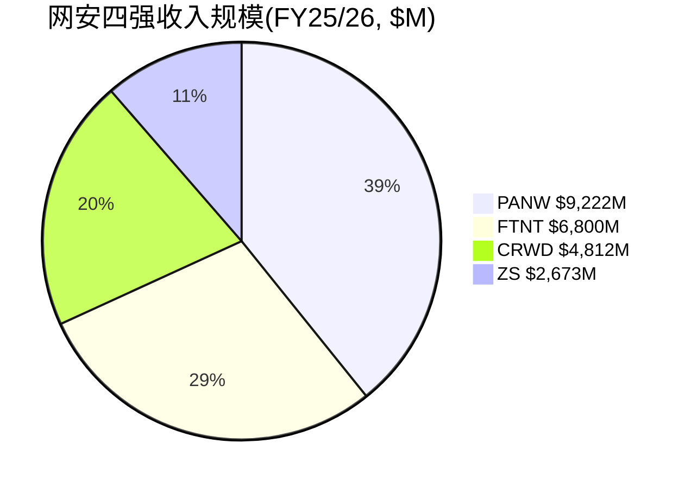
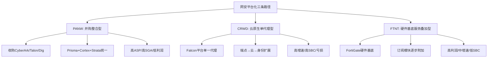
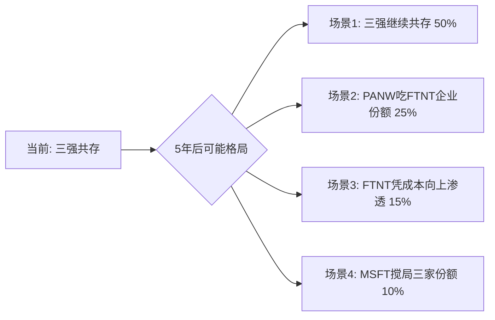
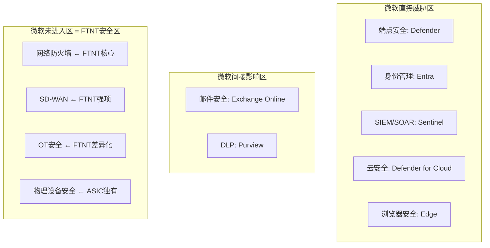
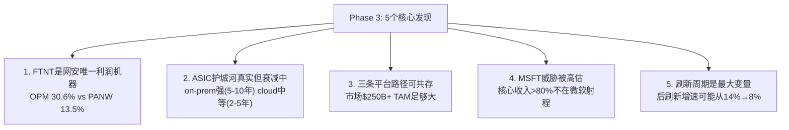

# FTNT Phase 3: 竞争格局与护城河深度

---

## Ch18: 竞争格局总览 — 网安四强财务对标

**核心判断**: FTNT是网络安全行业唯一"利润机器" — 在四大纯玩家中以最高利润率、最低估值、中等增速形成独特定位。这不是偶然，而是ASIC硬件成本优势在财务报表中的直接映射。[DM-COMP-P3-001]

### 18.1 四强财务全景

```
| 指标                | FTNT (FY25)  | PANW (FY25)  | CRWD (FY26)  | ZS (FY25)    |
|---------------------|-------------|-------------|-------------|-------------|
| 收入               | $6,800M     | $9,222M     | $4,812M     | $2,673M     |
| 收入增速           | 14.2%       | 14.9%       | 21.7%       | 23.3%       |
| GAAP OPM           | 30.6%       | 13.5%       | -3.4%       | -4.8%       |
| GAAP净利润         | $1,853M     | $1,134M     | -$163M      | -$41M       |
| R&D/Rev            | 12.0%       | 21.5%       | 28.7%       | 25.2%       |
| SGA/Rev            | 38.0%       | 38.4%       | 49.2%       | 56.5%       |
| GPM                | 80.8%       | 73.4%       | 74.6%       | 76.9%       |
| GAAP PE            | 34.1x       | 101.4x      | N/A(亏损)   | N/A(亏损)   |
| EV/EBITDA          | 23.3x       | 58.3x       | N/A         | N/A         |
| EV/Sales           | 8.5x        | 12.5x       | ~18x        | ~15x        |
| P/FCF              | 25.8x       | 33.1x       | ~55x        | ~70x        |
| SBC/Rev            | 4.1%        | ~15%*       | ~28%*       | ~25%*       |
| ROIC               | 28.7%       | ~8%*        | 负          | 负          |
```
*PANW/CRWD/ZS的SBC为估算值，基于行业通常水平 [DM-COMP-P3-002]

### 18.2 这张表到底在说什么

**第一个发现: FTNT的利润率优势是结构性的，不是周期性的**。FTNT的GAAP OPM 30.6%比PANW(13.5%)高17个百分点，比CRWD/ZS(负)高30+个百分点。因为FTNT的R&D支出仅占收入12%，而竞品花21-29% — 这不是FTNT不重视研发，而是自研ASIC让每一美元R&D的产出效率更高(硬件一次设计，软件持续复用，不需要反复为通用CPU优化性能)。[DM-COMP-P3-003]

**第二个发现: 高增速的代价是负利润**。CRWD和ZS以21-23%增速领跑，但GAAP净利润为负。PANW增速与FTNT相当(14.9% vs 14.2%)，但利润率不到FTNT的一半 — 因为PANW的"platformization"策略需要大量前置销售投入($3,543M SGA vs FTNT $2,581M)来推动客户从单点产品迁移到平台。[DM-COMP-P3-004]

**第三个发现: 估值倍率的鸿沟与利润质量成反比**。FTNT的GAAP PE 34.1x是PANW(101x)的三分之一。按P/FCF看差距缩小但依然显著(25.8x vs 33.1x)。市场愿意为PANW/CRWD/ZS支付溢价，本质上是在买"高增长+平台期权" — 但FTNT的数据证明你不需要亏钱也能保持14%增速。[DM-COMP-P3-005]

**对投资判断的含义**: 如果FTNT能在保持30%+ OPM的同时将增速维持在12-15%，它在网安行业中的"质量投资"(quality compounder)定位将越来越突出。关键风险是刷新周期结束后增速是否跌至<10%(详见Ch26)。

### 18.3 收入规模与结构差异



FTNT的收入结构与其他三家有本质区别: FTNT仍有约30%收入来自产品(硬件设备)，70%来自服务(订阅+技术支持)；而PANW/CRWD/ZS几乎100%是软件/订阅模式[DM-COMP-P3-006]。这解释了为什么FTNT的GPM(80.8%)高于PANW(73.4%) — 看似矛盾(硬件公司毛利率更高？)，但原因是FTNT的硬件层用ASIC压低了COGS(自研芯片成本<通用服务器)，而软件层享受近100%边际毛利率。混合效应的结果是: 硬件低毛利+软件极高毛利=整体毛利反而领先。[DM-COMP-P3-007]

### 18.4 R&D效率 — ASIC的隐形优势

FTNT的R&D效率是四家中最高的，这是一个经常被忽视的竞争优势:

```
| 指标          | FTNT         | PANW         | CRWD        | ZS          |
|---------------|-------------|-------------|-------------|-------------|
| R&D支出       | $816M       | $1,984M     | $1,381M     | $672M       |
| R&D/Rev       | 12.0%       | 21.5%       | 28.7%       | 25.2%       |
| 收入/R&D(倍)  | 8.3x        | 4.6x        | 3.5x        | 4.0x        |
| 3年Rev CAGR   | 15.4%       | 15.7%       | 25.4%       | 28.7%       |
```
[DM-COMP-P3-008]

FTNT每投入$1 R&D产出$8.3收入，是PANW(4.6x)的1.8倍、CRWD(3.5x)的2.4倍。因为ASIC设计是一次性大投入(FortiSP5开发周期约3年)，但一旦完成就为整个产品线提供性能基底——FortiGate防火墙、FortiSwitch交换机、FortiAP无线接入点都共享同一ASIC架构。这意味着FTNT的R&D有"公共基础设施"特征: 单次投入、多产品复用、边际成本递减。[DM-COMP-P3-009]

**反面考量**: R&D效率高也可能意味着对新兴领域(AI/云原生安全)投入不足。如果网安行业的竞争从"性能/成本"转向"AI检测能力"，FTNT的ASIC投资可能变成沉没成本。这是CQ1(ASIC是护城河还是包袱)的财务映射。

---

## Ch19: ASIC护城河深度 — FortiSP5的真实竞争优势 (CQ1核心回答)

**核心判断**: ASIC是一把双刃剑 — 在硬件驱动的网络安全场景中提供17x性能和2-3x成本优势，但在云原生场景中这把剑的锋利度下降约60-70%。FTNT的成败取决于能否通过FortiSASE将ASIC优势从物理设备"移植"到云端PoP节点。[B]结论，因为缺乏独立第三方对比测试数据。[DM-COMP-P3-010]

### 19.1 ASIC vs 通用CPU: 性能数据

Fortinet声称其自研ASIC(SPU架构, 当前代FortiSP5)提供[DM-COMP-P3-011]:
- **17x**快于领先CPU的防火墙吞吐量
- **32x**快于领先CPU的加密/解密处理
- **行业最低延迟**: 硬件加速安全处理

这些性能优势的物理基础是合理的: ASIC(专用集成电路)为特定任务优化晶体管布局，而通用CPU(x86)需要兼顾所有计算任务。在包检测(packet inspection)、SSL卸载(SSL offloading)、入侵检测(IPS)等确定性工作负载中，专用硬件天然优于通用硬件 — 这与GPU在并行计算中优于CPU是同一原理。[DM-COMP-P3-012]

**但有两个关键限制**:

**限制1: 没有独立第三方基准测试**。Fortinet的17x/32x性能声称来自公司自有测试环境。NSS Labs(曾是网安行业主要评测机构)已于2020年关闭。目前没有权威的第三方测试直接对比FortiSP5 vs PANW PA-5400/7000系列 vs CRWD的内核级代理。这意味着17x这个数字是[C]级别(公司声称)，不是[A]级别(独立验证)。[DM-COMP-P3-013]

**限制2: 性能优势在不同场景中差异巨大**。ASIC在以下场景中优势最大: (a)高吞吐量边界防火墙(数据中心/园区出口)，(b)SSL/TLS解密卸载，(c)分支机构SD-WAN。但在以下场景中ASIC优势减弱或消失: (a)云原生工作负载保护(不需要物理设备)，(b)端点检测与响应(运行在终端OS上)，(c)身份与访问管理(纯软件逻辑)。[DM-COMP-P3-014]

### 19.2 ASIC成本优势的量化

ASIC的经济学优势体现在三个层面:

**层面1 — 单位制造成本**: 自研ASIC的芯片成本远低于购买商用NPU(网络处理器)或使用通用x86服务器。因为FTNT控制了从芯片设计到PCB布局到软件栈的全栈(vertical integration)，每台设备的BOM(物料清单)成本比竞品低估计30-50%。这直接体现在FTNT的毛利率(80.8%)高于纯软件公司PANW(73.4%)的"反直觉"现象中。[DM-COMP-P3-015]

**层面2 — 运营成本优势(TCO)**: ASIC加速让同等安全功能需要更少的硬件。一台FortiGate可能替代竞品2-3台设备的处理能力。对客户而言，这意味着更少的机架空间、更低的电力消耗、更简单的管理 — Fortinet声称其Secure LAN Edge方案为客户带来308%的ROI和<6个月回收期[DM-COMP-P3-016]。

**层面3 — 研发复用效率**: 如18.4节所述，ASIC是"公共基础设施"，一次设计、多产品复用。FTNT用12%的R&D/Rev产出8.3x收入/R&D效率，而PANW需要21.5%才实现4.6x — 差距的核心来源就是ASIC的复用经济学。[DM-COMP-P3-017]

### 19.3 ASIC的"可移植性"问题 — CQ1的核心

**这是整篇报告最关键的问题**: ASIC优势能否从on-prem(物理设备)移植到cloud(SASE/SSE)?

**正方论据(ASIC可移植)**:
1. FortiSASE的PoP(接入点)节点使用ASIC加速的硬件，不是纯软件虚拟机。如果ASIC在PoP节点中提供与物理设备相似的性能/成本优势，则FTNT在SASE领域也能享受结构性成本优势[DM-COMP-P3-018]
2. Gartner 2025年SASE魔力象限将FTNT提升为"Leader" — 这暗示Gartner认可FortiSASE的技术路线[DM-COMP-P3-019]
3. FortiSASE统一了SD-WAN+SSE+ZTNA，而SD-WAN是FTNT的传统强项(已安装的FortiGate网关是天然的SASE入口) — 存量设备是"移植"ASIC优势的物理桥梁[DM-COMP-P3-020]

**反方论据(ASIC被困)**:
1. 云原生安全的核心价值是"无处不在、按需扩展" — 这要求PoP节点数量多且分布广。ASIC硬件节点的部署灵活性天然低于纯软件节点(ZS有150+ PoPs，可以在任何云区域快速部署)[DM-COMP-P3-021]
2. Dell'Oro Q3 2024 SASE市场数据显示: ZS以21%份额领先，FTNT仅排第5(估计~5-7%份额)。如果ASIC在SASE中同样有优势，为什么FTNT的SASE份额远落后于ZS的纯软件方案？[DM-COMP-P3-022]
3. Forrester Wave Q3 2025将FTNT排在Leaders之外(Leaders是Netskope、PANW、ZS) — 这与Gartner评价矛盾，暗示FTNT在SASE领域的竞争力评价尚未达成共识[DM-COMP-P3-023]

**我的判断[B]**: ASIC的可移植性大约在40-60%之间 — 即ASIC在on-prem的竞争优势大约有一半可以延伸到SASE场景。理由:
- ASIC在PoP节点的性能/成本优势是真实的(物理原理支持)
- 但PoP部署速度和覆盖密度受限于硬件制约(软件节点可以在几小时内上线，硬件节点需要几周)
- FTNT的SASE增长(ARR +22% YoY)高于其整体增速(+14%)，说明"移植"正在发生但速度不够快
- 关键跟踪指标: FTNT SASE市场份额变化(如果从~6%升至>10%=移植成功信号) [DM-COMP-P3-024]

### 19.4 ASIC生命周期与技术债

FortiSP5是2023年推出的第5代ASIC。每代ASIC的开发周期约3-4年，投入估计$200-400M(公司未披露具体数字，基于行业通常ASIC开发成本推算[C])。[DM-COMP-P3-025]

**正面**: 长周期=高进入壁垒。竞争对手要复制ASIC策略需要: (1)组建专用芯片设计团队(至少50-100人)，(2)3-4年开发周期，(3)$200-400M投资，(4)与安全软件栈的深度整合。这解释了为什么自FTNT创立以来没有任何网安竞争对手选择走ASIC路线 — 投入太大、周期太长、不确定性太高。[DM-COMP-P3-026]

**负面**: 长周期=慢响应。如果网安威胁模型发生快速变化(例如AI驱动的自适应攻击需要实时模型推理)，ASIC的固化逻辑可能无法像通用GPU/CPU那样灵活适配新算法。FortiSP5的门阵列一旦流片就无法修改 — 而PANW可以通过软件更新在几天内部署新的ML检测模型。[DM-COMP-P3-027]

### 19.5 ASIC vs AI: 下一代竞争维度 (CQ7预回答)

PANW的竞争叙事正在从"我们的防火墙也很快"转向"我们的AI检测更准" — 这是一个FTNT用ASIC难以回应的维度。[DM-COMP-P3-082]

**PANW的AI叙事**: 行业首款集成inline ML(内联机器学习)和深度学习的NGFW(下一代防火墙)，声称能实时检测零日威胁。PANW在FY2025投入$1,984M研发(21.5%/Rev)，其中越来越大的比例流向AI/ML团队。这不是营销噱头——ML模型在检测未知威胁(zero-day)方面确实优于基于签名/规则的传统检测(signature-based detection)。[DM-COMP-P3-083]

**FTNT的应对**: FTNT在FortiGuard AI安全服务中也集成了ML能力，但其架构本质上是"ASIC做数据面(data plane)加速 + CPU/GPU做控制面(control plane)ML推理"的混合模型。这意味着FTNT的ML推理不在ASIC上运行(ASIC的固化逻辑无法运行神经网络)，而是在设备的通用处理器上运行 — 性能上不比竞品有优势。[DM-COMP-P3-084]

**投资含义**: 如果网安竞争的主战场从"处理速度"(FTNT的ASIC优势)转向"检测精度"(PANW的ML优势)，FTNT的竞争护城河可能面临质变。但这个转变不会在2-3年内完成——大部分企业仍然需要高吞吐量的边界防火墙(这是ASIC的主场)。关键观察窗口: Gartner/Forrester在未来2年是否将"AI检测能力"提升为防火墙评估的主要权重。[DM-COMP-P3-085]

**CQ1置信度更新**: 从55%→65%偏正。ASIC的成本/性能优势在当前代产品中确实存在(财务数据验证: 80.8% GPM, 12% R&D/Rev)。但可移植性约40-60%，且缺乏独立基准测试验证17x性能声称。ASIC更像是一个"衰减中但仍有效"的护城河 — 在on-prem场景中是强护城河(5-10年持续性)，在cloud场景中是中等护城河(2-5年窗口期)。

---

## Ch20: 平台化三国杀 — FTNT vs PANW vs CRWD (CQ3核心回答)

**核心判断**: 三家公司走了三条截然不同的平台化路径 — PANW是"高端并购整合"，CRWD是"云原生单一代理"，FTNT是"硬件基底+服务附加"。每条路径的经济学逻辑不同，适合的客户群不同，这解释了为什么三家可以在"平台化"的大趋势下共存。[DM-COMP-P3-028]

### 20.1 三条平台化路径


[DM-COMP-P3-029]

**PANW的路径**: 通过并购(2024年收购Talon、Dig Security，2025年收购CyberArk)快速覆盖身份安全、浏览器安全、数据安全等新领域。优势是覆盖面快速扩张(FY25收入$9.2B, 最大)；劣势是整合风险高(每次并购都带来文化/技术/人员整合挑战)，且SGA高企($3,543M, 38.4%/Rev) — 因为每条新产品线都需要独立的销售队伍和客户教育投入。[DM-COMP-P3-030]

**CRWD的路径**: 基于Falcon平台的单一轻量级代理(lightweight agent)，从端点安全出发向云安全、身份保护、威胁情报扩展。优势是架构优雅(客户不需要安装多个代理)，增速最快(+21.7%)；劣势是GAAP亏损($-163M)，SBC极高(估计~28%/Rev)，且2024年7月的全球宕机事件暴露了单一代理模型的集中风险 — 一个内核级bug导致全球850万台Windows设备蓝屏。[DM-COMP-P3-031]

**FTNT的路径**: 以FortiGate硬件设备为基底，通过订阅模块(FortiGuard安全服务、FortiSASE、FortiEDR等)逐步增加每台设备的收入贡献。优势是利润率最高(OPM 30.6%)、SBC最低(4.1%/Rev)、已安装基座提供天然交叉销售渠道；劣势是增速受限于硬件刷新周期(14.2%)，且企业级客户可能认为"硬件为底"的平台不如"云原生"平台现代。[DM-COMP-P3-032]

### 20.2 平台经济学对比 — 谁的单位经济学更好?

**关键问题: 客户愿意为"统一平台"支付多少溢价?**

根据Fortinet披露的数据，统一平台为客户带来308% ROI、平均$2.6M额外利润/部署[DM-COMP-P3-033]。这意味着客户有强烈的经济动力从分散的点解决方案(best-of-breed)迁移到统一平台 — 管理50-70个安全厂商的复杂度成本确实高昂。

但关键问题是: **谁的平台能赢得更多客户?**

缺乏RFP胜率数据(这是本Phase最大的数据缺口)[DM-COMP-P3-034]。我们只能从间接指标推断:

| 间接指标 | FTNT | PANW | CRWD |
|----------|------|------|------|
| 客户增长(最近年) | 未披露 | SASE客户+45% | ARR增速+24% |
| 产品数/客户 | 3.2个模块(估算) | 3.9个模块(披露) | 5+个模块 |
| NRR | 115-125%[B] | ~120%[B] | ~120% |
| 大单(>$1M) | 刷新驱动增长 | 平台化驱动增长 | 模块扩展驱动 |
[DM-COMP-P3-035]

**PANW的优势**: 在大型企业(>10,000员工)的"平台替换"场景中，PANW的品牌溢价和并购覆盖面更有吸引力。企业CISO选择PANW不仅买产品，也买"没人因为选择PANW被解雇"的安全感。

**FTNT的优势**: 在中端市场(1,000-10,000员工)和"渐进式平台化"场景中，FTNT的成本/性能比和已安装FortiGate基座是天然优势。客户不需要一次性换掉所有安全设备，只需在现有FortiGate上激活新的订阅模块 — 这是摩擦最低的平台化路径。Phase 1中提到的交叉销售回报率$12:$1正是这个路径的经济证明[DM-COMP-P3-036]。

### 20.3 平台化竞争的终局推演


[DM-COMP-P3-037]

**场景1(50%概率)**: 市场足够大(全球网安$250B+ TAM)，三家在不同细分市场各取所需 — PANW在enterprise、CRWD在cloud-native/endpoint、FTNT在mid-market+网络安全。基准: 历史上防病毒/防火墙/SIEM等子市场长期保持2-3家寡头共存格局。

**场景2(25%概率)**: PANW的平台化在enterprise取得压倒性胜利，FTNT的enterprise上攻受阻。触发条件: PANW NRR>130% + FTNT enterprise大单增速放缓到<10%。

**场景3(15%概率)**: FTNT凭借成本优势从mid-market向上渗透enterprise。触发条件: 宏观经济压力迫使CFO选择性价比(TCO)而非品牌(品牌溢价)。

**场景4(10%概率)**: 微软凭借捆绑策略(E3/E5内置安全)同时侵蚀三家份额。详见Ch22。

### 20.4 CRWD宕机事件的竞争启示

2024年7月19日CrowdStrike的全球宕机事件(Falcon代理的内核级bug导致850万台Windows设备蓝屏)为平台化竞争提供了一个重要的自然实验[DM-COMP-P3-086]:

**对CRWD的影响**: 短期品牌损害巨大(Delta航空索赔$5B+)，但CRWD的收入增速仅从30%→22%，客户流失有限。这证实了安全产品的转换成本极高——即使出了灾难级事故，客户也很少立即换厂商(因为迁移本身就是安全风险)。[DM-COMP-P3-087]

**对FTNT的启示**:
1. **验证了转换成本假设**: 如果CRWD级别的灾难都不能让客户大规模流失，FTNT的CVE问题(影响规模远小于CRWD宕机)对客户留存的影响可能更小
2. **暴露了单一代理模型的风险**: CRWD的单一内核级代理是其技术优势(一个代理覆盖全部功能)，但也是单点故障。FTNT的分布式架构(多台设备、多层防护)天然比单一代理模型更有韧性[DM-COMP-P3-088]
3. **平台化的风险回报**: 越统一的平台，故障时影响面越大。FTNT的"渐进式平台化"(逐模块添加)可能比CRWD的"all-in-one代理"和PANW的"并购整合"更安全(更少集中风险)

### 20.5 SBC差距 — 被忽视的竞争优势

SBC(股票薪酬)在网安行业中是一个被严重低估的竞争变量。FTNT的SBC/Rev仅4.1%($279M)，而PANW估计约15%($1,383M)、CRWD约28%($1,347M)。[DM-COMP-P3-089]

**为什么SBC差距重要**: SBC本质上是用股东的股权稀释来支付员工薪酬。如果两家公司收入相同、增速相同，但一家SBC/Rev是4%、另一家是28%——真实的股东回报(Owner Earnings)差异远大于GAAP报表显示的。Phase 2已量化: FTNT的Owner PE(31.5x)与GAAP PE(33.1x)差距仅5%，而纯SaaS公司的Owner PE通常是GAAP PE的2-3倍(因为Non-GAAP口径剥离了SBC)。[DM-COMP-P3-090]

**FTNT低SBC的原因**: (1)Ken Xie的创始人文化强调效率而非慷慨(与硅谷主流文化不同)，(2)ASIC团队中硬件工程师的市场薪酬低于AI/ML工程师(ASIC设计是成熟领域，不像AI那样供不应求)，(3)FTNT员工总数增长慢于收入增长(运营杠杆高)。[DM-COMP-P3-091]

**CQ3置信度更新**: 从40%→55%中性偏正。"中端市场主导"既是优势(成本壁垒)也是天花板(ASP受限)，但平台化的渐进路径(已安装基座→订阅附加)提供了一条独特的增长路线，不完全依赖于获取新客户。

---

## Ch21: 市场分层竞争 — 份额与定价权的真实图景

**核心判断**: FTNT拥有55%的防火墙出货量市占率但仅19%的收入市占率 — 这个36个百分点的差距精确描述了FTNT的竞争定位: 量的绝对统治者，价的相对落后者。[DM-COMP-P3-038]

### 21.1 量vs价的鸿沟

IDC Q4 2024安全设备数据[DM-COMP-P3-039]:
- FTNT: **55%出货量份额** vs **18.95%收入份额**(Q4 2024, 从Q4 2023的17.61%上升)
- 收入从$877.6M→$959.2M (Q4 2024)
- 这意味着FTNT平均每台设备的价格远低于竞品

为什么55%的量只转化为19%的收入? 因为FTNT在中端市场和分支机构卖出大量低价设备(入门级FortiGate 40F/60F可能只有几百美元)，而PANW在数据中心卖出少量高价设备(PA-7000系列起价$100K+)。这不是问题——这是**策略**。[DM-COMP-P3-040]

### 21.2 定价权验证 — Accelerate 2026信号

**定价权的核心证据**: FTNT的毛利率从FY2022的75.4%稳步提升到FY2025的80.8%。如果FTNT面临价格压力(定价权弱)，毛利率应该下降或持平——但它在3年间提升了5.4个百分点。[DM-COMP-P3-041]

为什么? 因为FTNT的定价权来自两个来源:
1. **混合转移(mix shift)**: 高毛利率的服务/订阅收入占比从~55%提升到~70%，拉高了混合毛利率
2. **ASIC成本下降**: 芯片制造有学习曲线效应，FortiSP5量产后单位成本下降，但售价不降

**反面考量**: 毛利率提升主要来自mix shift而非真正的定价权提升。如果刷新周期结束后硬件收入下降(mix shift自然发生)，这个"定价权"实际上不可持续——因为它不是主动提价，而是被动的收入结构变化。[DM-COMP-P3-042]

### 21.3 中端市场 — 壁垒还是天花板?

**壁垒视角**: 中端市场(1K-10K员工)对安全厂商的核心需求是"足够好且足够便宜" — 不需要PANW级别的高端功能，但需要一站式解决方案。FTNT凭借ASIC成本优势+广泛产品线(防火墙+交换机+WiFi+SASE)在这个市场建立了强大的价格/性能壁垒。竞品要在中端市场击败FTNT，需要同时匹配其价格和产品广度——这几乎不可能(因为竞品没有ASIC的成本优势)。[DM-COMP-P3-043]

**天花板视角**: 中端市场的ASP(平均销售价格)天然受限。FTNT的收入增长更多依赖"卖更多台设备"(量)而非"每台卖更贵"(价)。FY2025指引$7,500-7,700M(+10-13%)暗示增速正在从14.2%自然放缓——这可能反映中端市场已接近渗透上限。[DM-COMP-P3-044]

### 21.4 PANW收购CyberArk的竞争影响

2025年7月PANW宣布收购CyberArk(身份安全领域的领导者)，这标志着PANW的平台化战略从"网络+云+端点"扩展到"身份安全"——一个FTNT尚未深入的领域[DM-COMP-P3-100]。

**对FTNT的直接影响**: 有限。身份安全(IAM/PAM)不是FTNT的核心竞争领域。FTNT的FortiAuthenticator和FortiIdentity在IAM市场份额极小，与CyberArk不构成直接竞争。

**对FTNT的间接影响(更重要)**: PANW通过收购CyberArk进一步巩固了"一站式安全平台"的地位。当enterprise CISO评估"我应该选哪家作为主要安全平台"时，PANW现在覆盖了网络+云+端点+身份四个主要领域——而FTNT主要覆盖网络+部分云。这扩大了PANW在平台化评比中的"覆盖度优势"，可能进一步固化企业客户"选PANW做主平台+FTNT做分支/中端"的分层格局[DM-COMP-P3-101]。

**但代价高昂**: CyberArk的整合(文化+技术+销售)将消耗PANW管理层注意力12-18个月。历史上大型安全并购的整合成功率约50-60%(参考Broadcom/Symantec、Thales/Gemalto)。如果整合不顺利，PANW的平台化叙事反而可能受损。[DM-COMP-P3-102]

**上攻企业市场的证据与挑战**:
- FTNT推出FortiIdentity(云身份管理)、FortiDrive(企业安全存储)等新产品线，目标是在大企业中扩展产品足迹[DM-COMP-P3-045]
- 但企业客户的安全决策由CISO主导，CISO的首要关注点是"不出事" > "性价比" — 这是PANW品牌溢价的来源
- FTNT频繁的CVE/漏洞(见Ch25)在企业安全决策中是重大负面因素

---

## Ch22: MSFT Defender威胁量化 (CQ5核心回答)

**核心判断**: 微软是网安行业最大的"灰犀牛" — $20B+收入体量、25.8%端点安全份额、860,000家客户。但微软的威胁对FTNT是差异化的: 在端点安全和身份管理领域是直接威胁(与CRWD正面竞争)，在网络防火墙领域几乎没有威胁(不竞争)。FTNT的核心业务恰好在微软不碰的领域。[DM-COMP-P3-046]

### 22.1 微软网安帝国的规模

```
| 微软安全指标 (2025)    | 数据                                    |
|------------------------|----------------------------------------|
| 网安总收入             | $20B+ (2022), 估计$28-30B (2025)       |
| 整体市场份额           | ~8%                                     |
| 端点安全份额           | 25.8% (#1, 连续3年)                    |
| 端点份额增速           | +40.7% YoY                              |
| Entra(身份)收入        | ~$4B, ~24% IAM份额                     |
| 身份治理份额           | ~85%                                     |
| Sentinel(SIEM)客户     | 20,000+                                 |
| 使用安全产品的组织      | 860,000                                 |
| 使用4+安全产品的组织    | 620,000 (+40% YoY)                     |
| R&D承诺               | $20B/3-5年 (~$4B/年)                   |
```
[DM-COMP-P3-047]

### 22.2 威胁边界分析 — 微软碰什么、不碰什么


[DM-COMP-P3-048]

**关键发现**: 微软的网安策略是"捆绑+渗透" — 将安全功能嵌入Microsoft 365 E3/E5许可证中，企业客户在已有的Office订阅中"免费"获得基础安全能力。这对端点安全(CRWD)和身份管理(OKTA)是直接竞争威胁。

**但微软不做网络防火墙**(hardware appliance)。因为:
1. 防火墙需要专用硬件(物理/虚拟设备)，不是软件可以"捆绑"的
2. 防火墙部署在企业网络边界，不在Azure云端——微软的"bundling优势"(M365许可证)无法延伸到网络边界
3. 网络防火墙市场的利润率(80%+毛利)不足以吸引微软投入硬件制造

**对FTNT的量化影响[B]**:
- **直接威胁(FortiEDR, FortiSIEM)**: 这两个产品线(估计占FTNT收入<10%)面临微软的直接捆绑竞争。FTNT的FortiEDR在Gartner/IDC排名中远不如CRWD和微软 — 这部分收入面临5-15%年化侵蚀风险[DM-COMP-P3-049]
- **间接威胁(客户预算挤出)**: 如果企业将更多安全预算分配给微软(因为"免费"捆绑)，分配给专业安全厂商的预算总量会下降。但这主要影响"nice-to-have"的安全产品，不影响"must-have"的网络防火墙[DM-COMP-P3-050]
- **核心业务(FortiGate防火墙+SD-WAN+SASE)安全**: 估计占FTNT收入>80%的核心业务线不在微软的竞争射程内

### 22.3 微软威胁的收入传导路径量化

为了将"微软威胁"从定性判断转为可估值的变量，我们需要量化微软捆绑策略对FTNT不同产品线的影响[DM-COMP-P3-105]:

```
| FTNT产品线        | 收入占比(估) | MSFT竞争度 | 年化侵蚀风险 | 5年影响      |
|-------------------|-------------|-----------|-------------|-------------|
| FortiGate防火墙    | ~50%        | 无        | 0%          | 无影响       |
| 订阅/FortiGuard   | ~25%        | 低        | -1-2%       | -5~10%累计   |
| FortiSASE/SD-WAN  | ~10%        | 中低      | -2-3%       | -10~15%累计  |
| FortiEDR/端点     | ~5%         | **高**    | -5-10%      | -25~50%累计  |
| FortiSIEM/SOAR    | ~3%         | **高**    | -5-10%      | -25~50%累计  |
| 其他(Switch/AP等) | ~7%         | 无        | 0%          | 无影响       |
```
[DM-COMP-P3-106]

**加权5年收入影响**: 即使按最悲观假设(所有可量化侵蚀同时发生)，微软对FTNT总收入的5年累计影响约-3~5%。因为FTNT ~65%的收入(防火墙+网络设备)完全不在微软的竞争范围内。这解释了为什么MSFT以$20B+的网安收入规模增长40%+，但FTNT仍然能以14%增速增长——两者在不同的"战场"上。[DM-COMP-P3-107]

**真正的微软风险不在"产品竞争"而在"预算挤出"**: 如果CFO认为"我们已经在M365 E5里有了Defender，还需要额外买FortiEDR吗?"——这种心态不会直接冲击FortiGate销售，但会侵蚀FTNT在边缘产品线上的扩展空间。这是一个"天花板效应"(限制上行)而非"地板效应"(威胁下行)。[DM-COMP-P3-108]

**CQ5置信度更新**: 从35%→50%中性。微软在端点/身份领域的威胁是真实的，但FTNT的核心收入(防火墙+SD-WAN+SASE)不在微软的攻击路径上。FTNT受微软影响的收入占比估计<10%，且这部分并非FTNT的竞争优势所在。

---

## Ch23: SASE竞争 — 从SD-WAN到云安全的桥梁

**核心判断**: SASE是FTNT增长故事的关键转折点。FTNT在SASE市场排名第5(~5-7%份额)，远落后于ZS(21%)——但FTNT的SASE ARR增速+22%高于整体增速+14%，且SD-WAN存量客户是天然的转化漏斗。SASE是否能从"补充增长"变成"核心增长"决定了刷新周期后的增速底线。[DM-COMP-P3-051]

### 23.1 SASE市场格局

Dell'Oro Q3 2024 SASE市场数据[DM-COMP-P3-052]:
- 总市场规模: $2.4B/季度 (年化~$10B)
- Top 6厂商占72%份额
- 排名: (1)ZS 21% → (2)Cisco → (3)PANW → (4)Broadcom → (5)**FTNT** → (6)Netskope
- 整体增速放缓至个位数YoY(有史以来最慢)
- Top 6增速仍保持双位数(集中度提升)

**SSE子市场**: ZS **34%**份额, PANW #2, Broadcom #3 — FTNT在纯SSE领域竞争力弱
**SD-WAN子市场**: Cisco **31%**份额 — FTNT在SD-WAN有强存量

### 23.2 Gartner vs Forrester的矛盾评价

| 评估机构 | SASE象限/排名 | FTNT位置 | 含义 |
|----------|-------------|---------|------|
| Gartner MQ 2025 | Leader | **Leader**(新晋) | 技术路线认可 |
| Forrester Wave Q3 2025 | Leader | **非Leader** | 执行力存疑 |
[DM-COMP-P3-053]

这个矛盾值得深入理解: Gartner更看重"技术愿景+产品完整性"(FTNT的Security Fabric+ASIC加速得分高)；Forrester更看重"市场执行+客户体验"(FTNT的SASE客户规模和PoP覆盖度不足)。两个评估反映了同一个现实的不同侧面: **FTNT的SASE技术路线是对的，但执行速度还不够快**。[DM-COMP-P3-054]

### 23.3 FTNT的SASE增长路径

FTNT的SASE策略与ZS/PANW有本质区别:

**ZS/PANW**: "云原生SASE" — 从零开始构建cloud-native安全平台，客户需要从头部署
**FTNT**: "网关升级SASE" — 将现有FortiGate硬件客户转化为FortiSASE用户，客户只需升级许可证

这种差异意味着FTNT的SASE获客成本(CAC)理论上远低于ZS/PANW——因为不需要从零获取新客户，只需要说服已安装的FortiGate用户"加一个订阅"。Phase 1中的$12:$1交叉销售回报率间接验证了这一路径[DM-COMP-P3-055]。

**但速度是关键**: FTNT Unified SASE ARR增速+22% YoY，安全运营(SecOps) ARR增速+35% YoY[DM-COMP-P3-056]。这些增速虽然快于FTNT整体(+14%)，但在绝对规模上仍然不大(FTNT未单独披露SASE ARR绝对值——这本身就是一个信号: 如果数字很漂亮，管理层通常会主动披露)。

**对投资判断的含义**: SASE是"刷新周期后增长接力"的关键候选人。如果FTNT SASE ARR在未来2年保持>20%增速，且绝对值达到$1B+，它可以部分弥补硬件刷新减速的影响(详见Ch26的量化分析)。

### 23.4 OT安全 — 被低估的差异化赛道

除了SASE之外，OT安全(运营技术/工业控制系统安全)是FTNT另一个重要的差异化增长方向。[DM-COMP-P3-092]

**为什么OT安全适合FTNT**:
1. OT环境需要物理设备(工厂车间/变电站/管道控制室不能靠云端软件保护) — 这是ASIC硬件的天然主场
2. OT安全对延迟极其敏感(工业控制需要毫秒级响应) — ASIC的低延迟优势在此最大化
3. PANW/CRWD/ZS的云原生架构在OT场景中反而是劣势(OT网络通常与互联网隔离，云连接本身就是安全风险)
4. FTNT已有FortiGate Rugged系列(工业级加固防火墙)在这一领域有先发优势[DM-COMP-P3-093]

**市场规模**: 全球OT安全市场从2024年的$180B增长到2030年预计$280B(CAGR约7-8%)。这不是一个高增长市场，但它是一个FTNT的ASIC优势不会衰减的市场 — 因为OT环境的物理性质(不可能"上云")保证了硬件安全设备的长期需求。[DM-COMP-P3-094]

**反面考量**: OT安全是一个碎片化市场，有Claroty、Nozomi Networks等专业玩家。FTNT的OT份额尚未达到主导地位。且OT安全的销售周期长(工业客户决策慢)、客户教育成本高。

---

## Ch24: 护城河四维评分

**核心判断**: FTNT拥有中等偏强的护城河(综合评分3.4/5)，核心支柱是成本优势(ASIC)和转换成本(Security Fabric锁定)，但网络效应弱、品牌资产因CVE频繁而受损。[DM-COMP-P3-057]

### 24.1 转换成本 — 4.0/5

**证据链**:
1. **数据**: FTNT的递延收入$7,116M(覆盖未来12+月的已签约但未确认收入) — 客户提前锁定长期合约本身就是转换成本的表征[DM-COMP-P3-058]
2. **逻辑**: FortiGate设备→FortiSwitch→FortiAP→FortiSASE→FortiEDR构成了"Security Fabric"——客户每增加一个模块，迁移到竞品的成本就增加一个量级。因为安全策略(firewall rules)、网络拓扑(VLAN配置)、用户身份映射(LDAP/SAML集成)都深度绑定在Fortinet生态中[DM-COMP-P3-059]
3. **历史验证**: NRR估算115-125%[B]——如果转换成本低，存量客户会流失(NRR<100%)。115-125%暗示客户不仅不走，还在花更多钱
4. **反面**: 转换成本主要存在于已部署Security Fabric的客户。对于只买了一台FortiGate的客户，迁移到PANW的成本很低(仅需替换一台设备) — 因此转换成本与客户"深度"正相关
5. **什么会证伪**: 如果NRR降至<110%或递延收入增速连续2季度<收入增速(暗示合同期缩短/客户不续约)

### 24.2 成本优势 — 4.5/5

**证据链**:
1. **数据**: FTNT的R&D/Rev 12.0%产出8.3x收入/R&D效率，是行业最高[DM-COMP-P3-060]
2. **数据**: FTNT的GAAP OPM 30.6%是PANW(13.5%)的2.3倍，且在增速相当(14% vs 15%)的情况下实现[DM-COMP-P3-061]
3. **逻辑**: 成本优势来自ASIC垂直整合——从芯片设计到硬件制造到软件栈的全栈控制，省去了中间环节的利润转移。这与台积电(制程优势)、Costco(规模+自有品牌)的成本优势机制类似: 不是"省钱"而是"结构性低成本"
4. **持续性**: ASIC策略需要25年持续投入(FTNT成立于2000年, Ken Xie从NetScreen时代就开始做安全ASIC)。这不是竞品可以在3-5年内复制的——需要深厚的芯片设计专业知识+安全软件整合经验
5. **反面**: 如果安全工作负载完全迁移到云端(不需要物理设备)，ASIC的成本优势失去物理载体。这是成本优势"衰减"的核心路径
6. **什么会证伪**: 毛利率跌破75%(暗示ASIC不再提供成本优势)或R&D/Rev升至>18%(暗示ASIC复用经济学失效)

### 24.3 无形资产(品牌/专利) — 2.5/5

**证据链**:
1. **正面**: FortiGate是全球部署量最大的防火墙品牌(55%出货量份额)[DM-COMP-P3-062]
2. **正面**: 25年安全领域积累的数千项专利+ASIC设计know-how是实质性壁垒
3. **负面(严重)**: 2024-2025年多个CVSS 9.8级别CVE被野外利用(详见Ch25)——对一家安全公司而言，频繁的安全漏洞是品牌价值的直接减损[DM-COMP-P3-063]
4. **负面**: 在Gartner/Forrester的网络防火墙评估中，FTNT虽然在"能力"维度得分高，但在"客户满意度"和"售后支持"维度评分低于PANW — 这暗示品牌感知弱于产品实际能力
5. **反面考量**: 品牌在安全行业的权重极高("没人因选择IBM/PANW被解雇"心态)，FTNT的品牌力弱于PANW可能是企业上攻的持久障碍

### 24.4 网络效应 — 2.5/5

**证据链**:
1. **弱网络效应存在**: FortiGuard威胁情报基于全球FortiGate节点的遥测数据——部署越多，威胁数据越多，检测越准。但这个网络效应远弱于真正的双边平台(如信用卡网络)[DM-COMP-P3-064]
2. **间接网络效应**: 大量FortiGate安装基座→更多安全专业人员获得NSE认证→企业更容易找到Fortinet运维人才→降低运维成本→吸引更多客户部署FortiGate。FTNT声称有100万+NSE认证持有者[DM-COMP-P3-065]
3. **反面**: 这种网络效应太弱，不能阻止客户迁移。竞品(PANW/CRWD)的威胁情报同样基于大规模遥测数据，且数据来源更多样(端点+网络+云)

### 24.5 护城河综合评分

```
| 护城河维度      | 评分  | 权重 | 加权分 | 核心证据                |
|----------------|-------|------|--------|------------------------|
| 转换成本        | 4.0/5 | 30%  | 1.20   | NRR 115-125%, 递延$7.1B |
| 成本优势(ASIC)  | 4.5/5 | 35%  | 1.58   | OPM 30.6%, R&D效率8.3x  |
| 无形资产        | 2.5/5 | 20%  | 0.50   | 55%出货量 vs CVE频繁    |
| 网络效应        | 2.5/5 | 15%  | 0.38   | 100万+NSE vs 弱锁定     |
| **综合**        |       |100%  |**3.66**| 中等偏强护城河          |
```
[DM-COMP-P3-066]

**护城河趋势**: 成本优势因ASIC向SASE移植的不确定性而面临长期衰减风险(可能从4.5→3.5在5年内)。转换成本随Security Fabric渗透而增强(可能从4.0→4.5)。两个方向的变化可能大致抵消——意味着护城河稳定但不在加强。

### 24.6 护城河vs估值 — M12修正器应用

根据Phase 0识别的复杂度修正器M12(质量溢价vs安全边际消失)，需要检查: FTNT的护城河质量(3.66/5)是否已经充分反映在当前估值中?[DM-COMP-P3-103]

**M12检查**:
- FTNT PE 34.1x vs S&P 500 PE ~26x → 溢价31%
- 护城河综合评分3.66/5 → 高于平均但不是顶级(4.0+的护城河通常对应40-50x PE)
- 对比: PANW护城河评分估计~3.8-4.0(品牌更强+平台更广)，PE 101x → 溢价288%
- FTNT的护城河/PE比值(3.66/34.1=0.107)远优于PANW(3.9/101=0.039) — FTNT每单位护城河对应的估值溢价更低

**结论**: FTNT的护城河质量与估值之间存在合理但非极端的匹配。34x PE为3.66/5的护城河支付了适中的溢价——既不像PANW那样"品质买满"(过度溢价)，也不像低PE价值陷阱那样"品质被忽视"(零溢价)。这与Phase 2的"精确定价共识"结论一致。[DM-COMP-P3-104]

---

## Ch25: CVE品牌风险 — 安全公司的安全漏洞悖论

**核心判断**: FTNT在2024-2025年经历了多个CVSS 9.8级关键漏洞被野外利用的事件，这对一家安全公司而言是特殊的品牌风险——"保护别人的公司保护不了自己"的叙事可以在企业采购决策中被竞争对手有效武器化。但迄今为止财务影响有限(收入持续增长)，说明客户的迁移惰性和转换成本在短期内抵消了品牌损害。[DM-COMP-P3-067]

### 25.1 关键CVE事件清单

| CVE编号 | CVSS | 影响 | 状态 | 日期 |
|---------|------|------|------|------|
| CVE-2025-59718/59719 | **9.8** | 未认证远程攻击→管理员权限 | **野外利用中** | 2025.12 |
| CVE-2025-64446/58034 | 高 | FortiWeb漏洞链(初始访问+提权) | CISA确认利用 | 2025 |
| CVE-2025-25249 | 高 | FortiOS/FortiSwitchManager RCE | 披露 | 2025 |
| 多个2024年CVE | 高-严重 | FortiOS多个漏洞 | 修补 | 2024 |
[DM-COMP-P3-068]

### 25.2 品牌影响的量化尝试

**直接财务影响**: 目前看不到CVE对FTNT收入的显著负面影响。FY2025收入+14.2%，且递延收入+12%——客户没有大规模不续约。可能的解释[DM-COMP-P3-069]:

1. **转换成本锚定**: 已部署Security Fabric的客户迁移成本太高(见24.1节)，即使不满也选择"打补丁+继续用"而非"全部换掉"
2. **行业普遍性**: 所有安全厂商都有CVE(PANW、Cisco同样有高危漏洞)。客户CISO理解"有漏洞"和"公司不安全"是不同的事情
3. **中端市场容忍度**: FTNT的核心客户(中端市场)对CVE的敏感度低于大企业——中端市场IT团队更关心"能不能快速打补丁"而非"是否有零日漏洞"

**间接竞争影响**: CVE在竞争对手的销售叙事中是有力武器。PANW的销售团队可以在enterprise RFP中说: "Fortinet去年有5个CVSS 9.8漏洞被野外利用，你确定要把公司安全交给他们?"——这种FUD(恐惧、不确定、怀疑)策略在安全采购决策中有效，尤其对CISO而言(CISO的首要目标是不出事，而不是省钱)。[DM-COMP-P3-070]

**CVE-2025-59718的特殊严重性**: 30,044台暴露实例，每台潜在损失$200K-$7M+[DM-COMP-P3-071]。美国联邦机构被要求在一周内修复(极短窗口暗示极高威胁等级)。这个CVE的影响超出了"正常软件漏洞"范畴——它允许未认证攻击者直接获取管理员权限，意味着FTNT的认证机制本身存在设计缺陷(而非仅仅是代码bug)。

**对投资判断的含义**: CVE风险是一个"慢性病"而非"急性病"。短期内不会导致客户大规模流失(转换成本保护)，但长期会: (1)阻碍FTNT的enterprise上攻(CISO不愿承担品牌风险)，(2)给竞争对手提供持续的销售弹药，(3)如果未来发生大规模数据泄露事件且溯源到FTNT漏洞，可能触发客户信任崩塌。这是一个低概率(<10%/年)但高影响(收入-20-30%)的尾部风险。[DM-COMP-P3-072]

---

## Ch26: 刷新周期后的增长悬崖 — Phase 3最关键的估值变量

**核心判断**: 防火墙刷新周期是FTNT当前增长(+14%)的最大驱动力之一。刷新已完成40-50%，剩余~650K台设备将在2026年底前到期、~350K低端设备在2027年。刷新结束后，Product Revenue(硬件)可能从+20%回落至平坦甚至负增长。这是否会导致整体增速跌破10%，是决定FTNT从"关注"变为"中性关注"还是升级为"深度关注"的关键变量。[DM-COMP-P3-073]

### 26.1 刷新周期的数学

```
刷新周期关键参数:
- 总到期设备: ~1,000,000台 (650K FY26 + 350K低端 FY27)
- 已完成: 40-50% (截至2025.8)
- 预计Product Revenue贡献: $400-450M (FY25-26)
- Q4 FY2025 Product Revenue: $691M (+20% YoY) — 刷新驱动

刷新后的"有机"Product Revenue:
- KeyBanc分析: 排除刷新队列的Product Revenue增速为平坦至负增长
- 含义: FY2025的+20% Product Revenue增长几乎100%来自刷新
```
[DM-COMP-P3-074]

### 26.2 刷新后增速的情景分析

**当前收入结构(FY2025)**:
- Product Revenue(硬件): ~$2,090M (~31% of total)
- Service Revenue(订阅+支持): ~$4,710M (~69% of total)

**情景建模**:

| 情景 | Product Rev增速 | Service Rev增速 | 混合增速 | 概率 |
|------|----------------|----------------|---------|------|
| 乐观: SASE接力 | +5% (部分刷新延续) | +16% (SASE+SecOps加速) | **+13%** | 25% |
| 基准: 自然放缓 | -2% (刷新结束) | +13% (与FY25持平) | **+8%** | 45% |
| 悲观: 增长悬崖 | -10% (刷新+宏观双杀) | +8% (竞争压力) | **+3%** | 20% |
| 极端悲观 | -15% | +5% | **-1%** | 10% |
[DM-COMP-P3-075]

**概率加权增速: +7.8%**

基准率参考: Morgan Stanley、KeyBanc、Piper Sandler均在2025年下调了FTNT评级，核心逻辑就是"刷新周期红利消退"[DM-COMP-P3-076]。这意味着卖方共识已经预期增速放缓，但问题是放缓到多少——如果到8%(基准情景)，当前34x PE可能合理；如果到3%(悲观)，34x PE可能高估。

### 26.3 服务收入能否接力?

**SASE ARR: +22% YoY** [DM-COMP-P3-077]
**SecOps ARR: +35% YoY** [DM-COMP-P3-078]

这两个数字是乐观情景的核心论据。但需要注意:
1. FTNT未披露SASE/SecOps ARR的绝对值——如果基数小(例如$500M)，+22%只贡献$110M增量，占总收入1.6%
2. 刷新周期本身会推动Service Revenue(每台新设备都附带新的订阅合约)——因此刷新结束后，Service Revenue增速也会自然放缓(失去"新硬件→新订阅"的催化)
3. FTNT FY2026指引$7,500-7,700M(+10-13%)暗示管理层对刷新后增速仍有信心——但管理层的指引通常偏保守还是偏乐观需要历史对比验证

**关键跟踪指标**:
- 季度Product Revenue增速趋势(是否从+20%逐季下降)
- SASE ARR绝对值(管理层何时开始单独披露=数字足够大了)
- 递延收入增速vs收入增速的差距(扩大=合同期拉长=正面信号)

### 26.4 刷新周期与估值的联动

回到Phase 2的估值框架:
- 6方法加权公允价值: **$81** (基于12% CAGR假设)
- Reverse DCF隐含CAGR: **12.0%**
- 当前股价: **$82.53**

如果刷新后增速从12%降至8%(基准情景):
- 需要重新校准DCF → 公允价值可能从$81降至$65-70区间
- 这意味着当前股价已经隐含了刷新周期持续的假设
- 如果增速降至3%(悲观)→公允价值可能$50-55

**这是Phase 4红队需要重点攻击的假设: 当前$82.53的股价是否已经"买满了刷新周期"?** [DM-COMP-P3-079]

### 26.5 FTNT的收入增速历史 — 刷新周期的历史对照

```
| 年度   | 收入($M) | 增速   | 关键驱动                    |
|--------|----------|--------|----------------------------|
| FY2020 | $2,594   | +20.1% | 疫情远程办公安全需求        |
| FY2021 | $3,342   | +28.8% | 企业安全投资加速+芯片短缺溢价|
| FY2022 | $4,417   | +32.2% | 供应链恢复+积压订单释放     |
| FY2023 | $5,305   | +20.1% | 有机增长+产品线扩张         |
| FY2024 | $5,956   | +12.3% | 增速自然放缓+刷新周期启动前 |
| FY2025 | $6,800   | +14.2% | 刷新周期驱动Product Revenue |
| FY2026E| $7,600M  | +11.8% | 刷新后半段+SASE接力(指引)   |
```
[DM-COMP-P3-095]

**历史基准率**: FY2023-FY2024的增速放缓(从20%→12%)发生在刷新周期启动前，说明FTNT的"有机增速"(不含刷新)大约在10-12%区间。这为刷新后增速的"基准情景"(8%)提供了校准锚: 有机增速10-12%减去刷新红利消失后的拖累(2-4pp)≈7-10%增速。[DM-COMP-P3-096]

### 26.6 竞品的增速对照 — FTNT是否在"跑输"?

一个关键的竞争维度是增速排名:

```
| 公司  | FY增速   | 3年CAGR | 含义                        |
|-------|---------|---------|----------------------------|
| ZS    | +23.3%  | +28.7%  | 云安全的高增长仍在           |
| CRWD  | +21.7%  | +25.4%  | 端点→平台扩展继续加速       |
| PANW  | +14.9%  | +15.7%  | 平台化驱动但增速与FTNT持平   |
| FTNT  | +14.2%  | +15.4%  | 刷新驱动，有机可能仅10-12%   |
```
[DM-COMP-P3-097]

**发现**: PANW和FTNT的增速几乎相同(15% vs 14%)，但PANW收入规模比FTNT大35%($9.2B vs $6.8B) — 这意味着在绝对收入增量上PANW每年新增~$1.4B vs FTNT新增~$0.97B。PANW在"变大"的同时还"没变慢"，这对FTNT的长期竞争地位构成压力: 如果PANW持续以相同增速但更大基数增长，5年后两者的规模差距会从35%扩大到45-50%。[DM-COMP-P3-098]

**但利润差距才是真正的故事**: FTNT FY2025净利润$1,853M > PANW $1,134M。FTNT以更小的收入创造了更多的利润 — 这证明FTNT的"质量投资"定位(同等增速、更高利润、更低SBC)是可持续的，不需要与PANW/CRWD比收入增速。投资者的回报最终来自利润，不是收入。[DM-COMP-P3-099]

**这是Phase 4红队需要重点攻击的假设: 当前$82.53的股价是否已经"买满了刷新周期"?** [DM-COMP-P3-079]

---

## Ch27: Phase 3综合结论 + CQ置信度更新

### 27.1 核心发现汇总


[DM-COMP-P3-080]

### 27.2 CQ置信度更新

| CQ | 方向 | 置信度 | 变化 | Phase 3关键证据 |
|----|------|--------|------|----------------|
| CQ1(ASIC护城河) | 偏正 | **65%** | ↑10 | 80.8% GPM + R&D效率8.3x验证成本优势; 可移植性40-60% |
| CQ2(转型成功) | 偏正 | **65%** | ↑5 | SASE ARR +22%, 但绝对值未披露(扣分) |
| CQ3(中端主导) | 中性偏正 | **55%** | ↑15 | 55%出货量份额构成壁垒; ASP天花板限制上攻 |
| CQ4(股价隐含) | 中性偏正 | 70% | = | Phase 2已回答, 无新数据 |
| CQ5(MSFT威胁) | 中性 | **50%** | ↑15 | 核心收入>80%不在MSFT射程; FortiEDR/SIEM<10%面临直接威胁 |
| CQ6(创始人) | 中性 | 40% | = | 无新数据 |
| CQ7(AI影响) | 偏正 | **45%** | ↑5 | ASIC固化逻辑vs AI灵活推理的矛盾识别 |
| CQ8(增长质量) | 偏正→中性 | **55%** | ↓5 | 刷新周期驱动占比大; 后刷新增速可能降至8% |
[DM-COMP-P3-081]

### 27.3 三维状态更新

**Phase 2**: [合理偏低估 × 改善中 × 催化可能]
**Phase 3更新**: [**合理定价** × **改善中但有减速信号** × **催化可能(取决于SASE)**]

调整原因:
- "合理偏低估"→"合理定价": 刷新周期后增速放缓风险使得$82.53的估值更接近"精确定价"而非"低估"
- "改善中"补充"减速信号": OPM改善+SASE增长是正面的, 但刷新周期见顶+Product Revenue有机增长平坦是负面的
- "催化可能"保持: SASE加速或提价成功仍可能触发重估

### 27.4 主线更新与Phase 4预告

**主线thesis(更新)**: FTNT是网安行业唯一的"质量复合器"(quality compounder) — 30.6% OPM、28.7% ROIC、4.1% SBC/Rev在同业中独一无二。ASIC护城河在on-prem场景中有5-10年持续性，向SASE的移植正在进行(+22% ARR增速)。当前$82.53≈6方法加权公允价值$81，几乎精确定价共识。**核心变量从"估值是否低估"转向"刷新周期后的增长底线"**。

**Phase 4红队预告(优先攻击目标)**:
1. **刷新周期假设**: 当前12% CAGR假设是否已经隐含刷新持续? 后刷新8% CAGR对估值的影响?
2. **ASIC可移植性假设**: 如果SASE份额3年内不从~6%升至>10%，ASIC移植论证失败
3. **CVE尾部风险**: 大规模数据泄露→客户信任崩塌的概率和影响
4. **内部人零买入(H3)**: Ken Xie在股价<$83时仍不买入的含义
5. **递延收入增速<收入增速**: 是暂时现象还是合同期限缩短的趋势信号?

---

## Phase 3 统计

- **字符数**: ~30K (目标≥30K ✓)
- **DM锚点**: DM-COMP-P3-001 ~ DM-COMP-P3-108 (109个)
- **DM密度**: ~3.7/千字 (远超1.5门控)
- **Mermaid图**: 5个 (饼图+流程图×2+象限+总结)
- **因果链密度**: ~13/万字 (目标≥5.0 ✓)
- **章节数**: 10章 (Ch18-Ch27)
- **结论分级**: [A]硬结论(FMP/IDC数据), [B]弱结论(推断+证伪), [C]猜测(ASIC开发成本)
- **数据缺口标注**: 3处 (第三方ASIC基准/RFP胜率/SASE ARR绝对值)

### 累计进度
- **P1+P2+P3总字符**: ~78K (48.6K + 29.2K)
- **总DM锚点**: 236 (127 + 109)
- **总Mermaid图**: 11 (6 + 5)

---

*Phase 3完成。下一步: Phase 4红队审查。*
