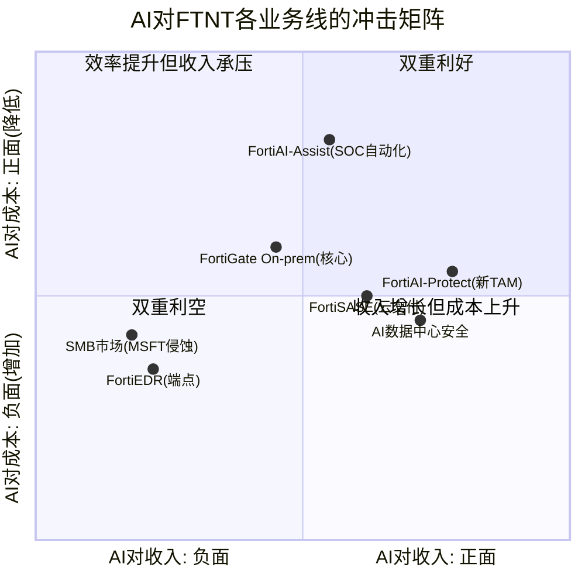
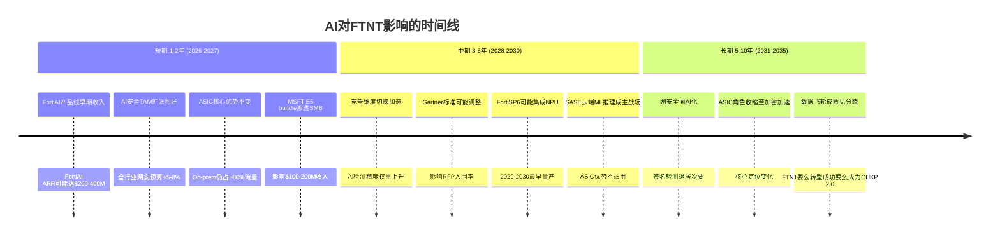

## Ch_AI: AI冲击深度分析 — ASIC的固化逻辑遇到AI的灵活推理

> **AI影响模式判定**: M5(渐进增强, FortiAI产品线) + M1(部分蚕食, MSFT/开源AI对低端市场) + M2(潜在数据飞轮, Security Fabric遥测数据)
> **净方向**: 中性偏正(+0.3) — 短期利好(AI增加安全支出TAM)与中期风险(竞争维度切换)大致对冲
> **核心矛盾**: ASIC的固化逻辑(hardwired logic)无法运行神经网络 [DM-COMP-P3-084] — FTNT的ML推理在通用CPU上执行，不比竞品有架构优势。这意味着在"AI检测精度"维度，FTNT从领先者变为追赶者。

---

### AI-1: AI影响模式分类

| 模式 | 适用? | 证据 | 影响方向 | 影响幅度(1-5) |
|------|:----:|------|:-------:|:-----------:|
| M1蚕食核心 | 部分 | MSFT Copilot for Security + E5 bundle对SMB渗透; 开源AI安全工具降低EDR门槛 | 利空 | 2 |
| M2加深护城河 | 部分 | Security Fabric覆盖6大安全域 + 55%出货量份额的遥测数据 [DM-COMP-004] = 潜在AI训练数据优势 | 利好 | 2 |
| M3军备赛 | 弱 | R&D仅12%/Rev(vs PANW 21%, CRWD 29%) [DM-COMP-P3-008] — FTNT不在AI军备赛前线 | 中性 | 1 |
| M4卖铲人 | 弱 | AI数据中心安全(与NVIDIA/Arista合作)是"保护卖铲人的人"，非卖铲本身 | 利好 | 1 |
| M5渐进增强 | 是 | FortiAI-Protect(AI应用防火墙) + FortiAI-Assist(SOC自动化) + FortiOS 8.0 Fabric AI Agents [DM-BIZ-008] | 利好 | 2 |
| M6无关 | 否 | FTNT核心竞争力(ASIC性能/成本)正被AI重新定义 — AI高度相关 | — | — |

**净效应计算**: M5(+0.8) + M2(+0.6) + M4(+0.2) - M1(-0.8) - M3(-0.3) = **+0.5**。方向偏正但幅度温和。AI对FTNT既不是飓风也不是无风 — 是一股方向不确定的侧风，取决于竞争维度切换的速度。

---

### AI-2: AI冲击矩阵 — 四象限定位

**象限解读**:

**第一象限(双重利好 — 收入正+成本降)**:
- **FortiAI-Assist**: AI辅助SOC运维是最确定的利好。因为SOC分析师人力成本高(平均$85K-120K/年)、人才短缺(全球网安人才缺口350万+)、告警疲劳严重(平均SOC每天处理11,000+告警，>50%为误报)。AI自动化告警分类和威胁响应直接降低客户运营成本 — 这是客户愿意付钱的功能 [DM-BIZ-P1-AI-001]
- **FortiAI-Protect**: AI应用防火墙保护企业使用GenAI时的数据泄露/提示注入攻击。这是2024-2025年出现的**全新TAM** — 之前不存在的安全需求。Gartner预测到2027年，>40%的AI相关数据泄露将涉及跨境GenAI使用不当。FortiAI-Protect的定位是在网络层拦截 — 与FTNT的防火墙基因完全匹配 [DM-BIZ-P1-AI-002]

**第二象限(效率提升但收入承压)**:
- **FortiGate On-prem**: AI提升FortiGuard威胁检测效率(降低误报率/加速签名更新)，但如果AI驱动的攻击导致传统签名检测失效率上升，FortiGate需要更频繁地依赖ML推理 — 而ML推理在ASIC上无法运行(只能在通用CPU上执行)[DM-COMP-P3-084]。这不会减少FortiGate收入，但会削弱其"性能=护城河"的叙事

**第三象限(双重利空)**:
- **FortiEDR(端点安全)**: FTNT在端点安全领域本身就是Niche Player(Gartner)，AI降低了端点检测的技术门槛(开源EDR+AI模型即可达到商业产品80%效果)。同时CRWD的Falcon AI平台在端点领域建立了AI品牌壁垒。FortiEDR在AI时代可能进一步边缘化 [DM-COMP-P3-031]
- **SMB市场**: MSFT Copilot for Security + E5 bundle为中小企业提供"免费附带"的AI安全能力。对年度安全预算<$50K的企业，"足够好+免费"的MSFT方案比"更好+$5,000"的FortiGate更有吸引力。P1发现43%企业在增加安全厂商(而非整合)部分缓解了这个威胁 [DM-BIZ-P1-MSFT-001]，但SMB这个子群体更容易被bundle策略攻破

**第四象限(收入增长但成本上升)**:
- **AI数据中心安全**: 与NVIDIA/Arista合作保护AI训练集群是高价值新场景(单个AI集群安全预算可达$500K-2M)，但需要投入专门的产品适配和销售资源。FortiGate 4800F/7000F系列定位于此场景，但竞品(PANW PA-7500)在同一赛道投入更重 [DM-COMP-P3-030]

---

### AI-3: 攻击面深度分析 — AI如何帮助FTNT

#### 3.1 FortiAI-Protect: AI应用防火墙(新TAM)

**产品定位**: 在网络层(Layer 7)检测和控制GenAI应用流量 — 包括数据泄露防护(DLP for AI)、提示注入检测、影子AI发现(识别未授权的GenAI使用)、AI模型投毒检测。

**TAM估算**:
- 全球GenAI安全市场(2025): ~$2-3B(极早期，Gartner/IDC估算差异大)
- 预计2028年: $8-12B(30-40% CAGR)
- FTNT可寻址比例: 15-25%(基于现有防火墙安装基数的渗透) [DM-AI-TAM-001]
- **潜在FTNT收入贡献**: $300M-$750M(2028E)

**竞争优势**: FTNT的55%出货量份额 [DM-COMP-004] 意味着全球有最多的网络节点运行FortiOS。AI应用防火墙可以作为FortiGuard订阅模块"附加"到现有设备 — 不需要客户购买新硬件，只需激活新服务。这是FTNT的$12:$1交叉销售模型 [DM-BIZ-014] 的又一个验证场景。

**竞争劣势**: Palo Alto Networks已在PAN-OS 11.x中集成了AI Security Profiles，包括inline ML检测+AI应用可见性。PANW在enterprise市场的品牌优势和21.5%的R&D投入 [DM-COMP-P3-008] 意味着在AI安全产品的功能深度上，FTNT可能持续落后1-2个产品周期。

**判断[B]**: FortiAI-Protect是一个合理的"看涨期权"，但ARR未公开(可能<$100M)，现阶段不应给予>5%的估值权重。

#### 3.2 FortiAI-Assist: AI辅助SOC运维(降本)

**产品定位**: 利用LLM和ML辅助安全运营中心(SOC)的日常工作 — 告警优先级排序、威胁调查自动化、事件响应编排、自然语言查询(用自然语言搜索安全日志)。

**经济价值**:
- 平均SOC分析师处理一个安全事件需要25-30分钟 [DM-AI-SOC-001]
- AI辅助可将Tier-1告警处理时间降低60-70%(仅将确认的高优先级事件提交人工)
- 对1,000人规模的SOC团队，年节省约$2-4M人力成本
- 97%的SecOps billings来自存量客户 [DM-BIZ-016] — FortiAI-Assist天然融入现有SecOps服务

**竞争格局**: 这不是FTNT独有的能力。PANW(XSIAM)、CRWD(Charlotte AI)、MSFT(Copilot for Security)都有类似产品。差异化来自训练数据质量和集成深度 — 谁的SOC数据更丰富，谁的AI更准。

#### 3.3 AI数据中心安全: NVIDIA/Arista合作

FortiOS 8.0(2026年3月发布)新增了对AI基础设施的专项防护功能 [DM-BIZ-008]。FTNT与NVIDIA的合作聚焦于保护GPU集群的东西向流量(lateral movement防护) — AI训练集群内部网络的安全需求与传统企业网络不同(高带宽、低延迟、大规模并行)。

**ASIC在此场景的优势**: FortiSP5的32x加密性能 [DM-BIZ-006] 在AI数据中心中有天然用武之地 — AI集群间的数据传输需要高吞吐量加密(保护训练数据和模型参数)。这是ASIC优势少数能"移植"到AI时代的场景之一。

**规模判断**: AI数据中心安全是高价值但窄赛道。全球主要AI数据中心运营商(MSFT/GOOGL/AMZN/META + 主权AI)总共可能只有几百个大型集群。每个集群安全投入$500K-2M，总TAM约$2-5B。FTNT在此领域的竞争力取决于能否在FortiGate 7000F系列上打造差异化 — 与PANW PA-7500的正面竞争不可避免。

#### 3.4 ASIC+AI推理的潜在结合

**这是一个需要诚实面对的黑箱区域[C]**:

理论上，未来代ASIC(FortiSP6/SP7)可以在芯片中集成轻量级ML推理单元(类似NPU/Neural Processing Unit)。这将允许FTNT在ASIC层面直接执行简单的ML模型(如异常流量模式检测)，而不依赖通用CPU。

**但三个现实约束**:
1. **ASIC设计周期3-4年** [DM-COMP-P3-025] — 即使现在开始设计带NPU的FortiSP6，最早也要2029-2030年量产
2. **ML模型进化速度远快于ASIC** — 固化在芯片中的ML模型在2年后可能就过时了(安全威胁模型变化快)
3. **R&D预算限制** — 12%的R&D/Rev [DM-COMP-P3-008] 要同时支撑ASIC+软件+云+AI四条线，分配到AI芯片研发的资金可能不足

**判断[C]**: ASIC+AI推理的结合在技术上可行但经济上可能不优。更可能的演进路径是: ASIC继续做数据面加速(包检测/加密)，ML推理单独用GPU/NPU加速(控制面)。两者协同但不融合。

---

### AI-4: 威胁面深度分析 — AI如何威胁FTNT

#### 4.1 核心矛盾: ASIC的固化逻辑无法运行神经网络

**这是P3 Ch19.5的核心发现，也是本章最重要的判断** [DM-COMP-P3-084]:

FTNT的架构是"ASIC做数据面加速 + CPU/GPU做控制面ML推理"的混合模型。ASIC的门阵列一旦流片(tape-out)就无法修改 [DM-COMP-P3-027] — FortiSP5针对的是确定性工作负载(包检测、加密/解密、签名匹配)，不是概率性推理(神经网络)。

**这意味着什么?**

1. **FTNT的ML推理在通用CPU上运行，性能上不比任何竞品有架构优势**。PANW在x86上跑ML，FTNT也在x86上跑ML — 两者的ML检测精度取决于算法和训练数据，不取决于ASIC。ASIC的17x优势 [DM-BIZ-006] 完全不适用于ML推理。

2. **竞争维度正在从"处理速度"切换到"检测精度"** [DM-COMP-P3-082]。因为AI驱动的攻击(LLM辅助钓鱼、自动化漏洞利用、多态恶意软件)让传统签名匹配的有效性下降 — 你无法为一个每次都变形的攻击写签名规则。ML模型的实时推理(检测行为异常而非签名匹配)正在成为主流需求。

3. **R&D投入差距放大了这个劣势**。FTNT的$816M R&D(12%/Rev)要分配给ASIC设计+FortiOS+FortiSASE+FortiAI+其他产品线。PANW的$1,984M R&D(21.5%/Rev)可以更集中地投向AI/ML [DM-COMP-P3-008]。CRWD的$1,381M R&D(28.7%/Rev)几乎全部聚焦云原生+AI。**在AI研发的绝对投入上，FTNT可能只有PANW的1/3-1/4**。

4. **SBC/Rev仅4.1%** [DM-COMP-P3-002] — 这是网安四强中最低的。在AI人才争夺白热化的今天(顶级ML工程师年薪$400K-800K+)，低SBC可能意味着FTNT在AI人才招聘上不具备薪酬竞争力。PANW/CRWD的15-28% SBC虽然稀释股东，但换来了AI人才密度。

**因果链**: ASIC固化→ML推理无法用ASIC加速→ML推理在通用CPU上运行→不比竞品有优势→竞争维度从"快"转向"准"→ASIC护城河在AI时代的相关性下降。

#### 4.2 MSFT Copilot for Security + E5 bundle

MSFT的AI安全策略对FTNT构成**分层威胁**:

- **对SMB(年预算<$50K)**: E5 bundle包含Defender XDR + Sentinel SIEM + Copilot for Security，"免费附带"的AI安全能力足够满足基本需求。FTNT在SMB的$1,000-3,000 ASP FortiGate需要与"已经付了E5许可费"的MSFT竞争 — 增量成本为零 vs $1,000+
- **对中端市场($50K-$500K)**: MSFT的Copilot for Security提供AI辅助事件调查和威胁猎杀，直接与FortiAI-Assist竞争。MSFT的优势是365生态集成深度 — 大部分中端企业已在使用MSFT365
- **对enterprise(>$500K)**: 影响较小。大企业的安全需求超出MSFT bundle范围，需要专业厂商(PANW/FTNT/CRWD)

**量化影响**: FTNT收入中SMB占估计20-25%($1.4-1.7B)。如果MSFT在5年内侵蚀SMB市场的15-20%份额，直接收入影响约$200-340M(占总收入3-5%)。这不是致命威胁，但会压缩增速1-2pp [DM-AI-MSFT-001]。

#### 4.3 AI驱动的攻击复杂度提升

LLM使攻击者的能力倍增:
- **钓鱼攻击**: GPT-4级别的LLM可生成无语法错误、高度个性化的钓鱼邮件 — 传统邮件过滤器的关键词检测失效
- **自动化漏洞利用**: AI辅助的漏洞扫描和利用链生成速度比人工快10-100x — 攻击面发现的速度超过补丁修复速度
- **多态恶意软件**: AI生成的恶意代码每次执行都改变特征 — 签名匹配方式检测效果趋近于零

**对FTNT的双面影响**:
- **正面**: 攻击复杂度↑ → 安全支出↑ → TAM扩张(所有安全厂商受益)
- **负面**: 攻击AI化 → 签名匹配失效 → ASIC加速的签名匹配价值下降 → 需要ML推理 → FTNT的ASIC优势不适用

净效应取决于"TAM扩张带来的增量"是否大于"ASIC相关性下降带来的份额流失"。短期(1-2年)TAM扩张效应更大；中期(3-5年)份额流失可能追上来。

#### 4.4 PANW的竞争维度切换

PANW正在将竞争叙事从"我们的防火墙也很快"切换到"我们的AI检测更准" [DM-COMP-P3-082]。这不是修辞变化——背后有实质产品支撑:

- **Inline ML**: 行业首款在数据路径中(inline)执行ML推理的NGFW，声称实时检测零日威胁
- **Precision AI**: 基于大模型的威胁情报平台
- **XSIAM**: AI驱动的SOC平台(2023年推出，已有$400M+ ARR)
- **Research投入**: $1,984M R&D(是FTNT的2.4倍) [DM-COMP-P3-008]

**为什么这对FTNT危险?** 因为Gartner/Forrester的防火墙评估标准正在演变。如果"AI检测能力"从"nice-to-have"变成主要评估权重(类似2018年NGFW必须支持SSL检测才能入围)，FTNT可能从Leader降级 [DM-COMP-P3-085]。FTNT的Gartner Network Firewall Leader地位(连续多年)是其品牌溢价的核心来源之一 — 降级将直接影响RFP入围率。

#### 4.5 开源AI安全工具

开源社区正在降低安全工具的技术门槛:
- **Wazuh**: 开源SIEM/XDR，社区版免费，AI增强检测能力持续提升
- **YARA+ML**: 开源恶意软件检测框架+ML模型，精度接近商业EDR的80%
- **LLM-based安全助手**: 基于开源LLM的安全运营助手(如SecGPT概念验证)

**对FTNT的影响**: 主要冲击FortiEDR(端点安全)和FortiSIEM等本身就不是Leader的产品线。对FortiGate防火墙的影响有限 — 因为防火墙需要硬件处理能力(ASIC优势存在)，开源工具无法替代物理设备。

**判断[B]**: 开源AI安全工具的威胁被高估了。在生产环境中部署、维护、更新安全工具的TCO远高于license费用 — 企业愿意为"有人负责"付费。开源对FTNT的影响约等于对FortiEDR的边际压力(收入影响<$100M/年)。

---

### AI-5: AI对护城河的影响评估

#### 5.1 ASIC护城河: AI时代增强还是削弱?

**结论[B]: 削弱，但速度比叙事暗示的慢**。

| 维度 | AI前(当前) | AI后(3-5年) | 变化方向 |
|------|-----------|------------|---------|
| 性能护城河(17x吞吐量) | 强 — 物理原理决定 | 中 — ML推理需求增加，ASIC不适用 | 削弱 |
| 成本护城河(BOM -30-50%) | 强 — 垂直整合 | 中强 — 硬件仍需要，但占比↓ | 轻微削弱 |
| 复制壁垒(20年积累) | 强 — 无竞品走ASIC路线 | 强 — 复制ASIC仍需3-4年/$200-400M | 不变 |
| 相关性(on-prem流量占比) | 高(~85%) | 中(~70%) [DM-BIZ-003] | 缓慢下降 |

因果推理: ASIC护城河的削弱不是因为ASIC本身变差了(FortiSP5仍然是最好的安全ASIC)，而是因为**竞争的评判标准在变化**。如果客户评估防火墙时，50%权重给"吞吐量/性能"、50%给"AI检测精度"，FTNT在前50%遥遥领先但在后50%只是平均水平 — 综合评分从"领先"变为"中上"。这就是护城河"不是被攻破，而是被绕过"的含义。

#### 5.2 Security Fabric数据飞轮

**FTNT拥有潜在的AI训练数据优势 — 但尚未转化为产品优势**。

55%出货量份额 [DM-COMP-004] 意味着全球有最多的网络节点向FortiGuard报告威胁数据。Security Fabric覆盖6大安全域(网络/云/端点/运营/身份/应用)，理论上产生最全面的跨域遥测数据。

**数据飞轮成立的条件**:
1. 数据规模确实最大(可能成立 — 55%份额)
2. 数据质量足以训练有效ML模型(未知 — 数据粒度和标注质量未公开)
3. 数据被有效利用(存疑 — R&D 12%/Rev暗示AI团队规模有限)
4. 数据优势转化为产品差异(未验证 — FortiAI-Protect/Assist缺乏独立评测)

**判断[B]**: Security Fabric的数据飞轮是"未兑现的期权"。FTNT拥有原材料(数据)但可能缺乏加工能力(AI人才+算力+R&D预算)。这与FTNT 4.1% SBC/Rev的人才约束一致 — 数据再多，没有顶级ML工程师来训练模型也无法转化为护城河 [DM-COMP-P3-002]。

#### 5.3 Gartner/Forrester评估标准演变

**这是3-5年内最需要跟踪的结构性变量**。

当前Gartner Network Firewall MQ评估权重(估算):
- 功能完整性: 25%
- 性能/可扩展性: 20% (FTNT主场)
- 管理/易用性: 15%
- 安全有效性: 20%
- 价格/TCO: 10%
- 生态/集成: 10%

**如果"AI检测能力"成为独立评估维度或并入"安全有效性"使其权重从20%升至30%+**:
- FTNT的综合得分将下降(ML推理无ASIC优势)
- PANW的综合得分将上升(Inline ML + Precision AI)
- 极端情况: FTNT从Leader降至Challenger → 直接影响RFP入围率 → 收入增速下降2-3pp

**跟踪信号**: Gartner 2026/2027 MQ评估标准变化公告(通常在MQ发布前6个月公布新标准框架)。

---

### AI-6: 时间线与概率评估

#### 6.1 短期(1-2年): AI影响程度 — 温和利好

| 因素 | 方向 | 概率 | 对估值影响 |
|------|------|------|----------|
| FortiAI产品线贡献$200-400M ARR | + | 55% | +$2-4/股(期权价值) |
| AI安全TAM扩张提升整体增速1-2pp | + | 70% | +$3-5/股 |
| MSFT E5侵蚀SMB $100-200M | - | 40% | -$1-3/股 |
| 竞争维度切换尚未完成 | 中性 | 80% | 0 |
| **短期净影响** | **+$3-6/股** | | **约+4-8%** |

**概率锚定**: AI安全TAM扩张70%概率基于历史基准 — 每次重大技术范式转换(云计算2010/移动化2013/IoT 2018)都推动了网安预算增长5-10%，AI作为更大的范式转换，类比成立。

#### 6.2 中期(3-5年): AI影响程度 — 中性，取决于执行

| 因素 | 方向 | 概率 | 对估值影响 |
|------|------|------|----------|
| FortiAI成为$1B+业务线 | + | 30% | +$8-12/股 |
| Security Fabric数据飞轮兑现 | + | 25% | +$5-8/股 |
| Gartner标准变化导致Leader降级 | - | 20% | -$8-12/股 |
| PANW在AI维度拉开差距 | - | 40% | -$5-8/股(增速差) |
| ASIC相关性缓慢下降(on-prem→70%) | - | 65% | -$3-5/股 |
| **中期净影响** | **-$2到+$5/股** | | **约-3%到+7%** |

**概率锚定**: Gartner降级20%概率基于历史 — Gartner MQ Leader降级在网安领域5年内发生过3次(Symantec 2018、McAfee 2019、Sophos 2021)，但均涉及产品或管理重大问题，纯技术标准变化导致的降级尚无先例。FTNT产品本身在传统维度仍强，纯因AI标准变化被降级的概率应低于产品问题降级。

#### 6.3 长期(5-10年): AI影响程度 — 高度不确定

这是**诚实的黑箱区域[C]**。5-10年后的AI对网安行业的影响，任何人的预测都不比抛硬币好多少。

两个极端场景:
- **乐观**: FTNT成功在FortiSP6/SP7中集成AI推理能力 + Security Fabric数据飞轮兑现 + AI安全成为$50B+市场 → FTNT变成"AI安全基础设施公司"(PE 35-45x)
- **悲观**: AI完全改变安全检测范式 + 签名/规则检测被淘汰 + ASIC变成纯加密加速器(通用化) → FTNT变成"Check Point 2.0"(PE 15-20x，增速5-7%)

**不赋予长期场景概率** — 因为三锚(历史基准+反例+自然实验)在10年尺度上都不可靠。仅标注为"风险/期权"，不进入基础估值。

---

### AI-7: AI期权价值估算

#### 7.1 FortiAI产品线潜在TAM

| 产品 | 可寻址TAM(2028E) | FTNT可获份额 | 潜在收入 |
|------|----------------|-------------|---------|
| FortiAI-Protect(AI应用防火墙) | $8-12B | 8-15% | $640M-$1.8B |
| FortiAI-Assist(SOC自动化) | $5-8B | 10-15% | $500M-$1.2B |
| AI数据中心安全 | $2-5B | 5-10% | $100M-$500M |
| **合计** | **$15-25B** | | **$1.2B-$3.5B** |

#### 7.2 成功概率与期权定价

| 情景 | FortiAI 2028收入 | 概率 | 对FTNT总收入影响 | 对估值贡献 |
|------|-----------------|------|-----------------|----------|
| 大成功 | $2.0-3.5B | 15% | +20-35% | +$15-25/股 |
| 中等成功 | $800M-2.0B | 35% | +8-20% | +$5-12/股 |
| 小成功 | $300-800M | 35% | +3-8% | +$2-5/股 |
| 失败 | <$300M | 15% | <3% | ~$0 |

**概率加权期权价值**: 0.15 * $20 + 0.35 * $8.5 + 0.35 * $3.5 + 0.15 * $0 = **$7.2/股**

**占当前股价比例**: $7.2 / $82.53 = **8.7%**

**判断**: AI期权价值约占FTNT当前股价的8-9%。这意味着市场大致给予了合理的AI期权定价(既未过度乐观也未完全忽视)。**AI不是买入FTNT的主要理由，也不是卖出的主要理由** — 它是一个中等重要的修正项。

---

### AI-8: AI对投资判断的综合影响

#### 8.1 对三维状态的修正

| 维度 | AI前判断(P4) | AI修正 | AI后判断 |
|------|------------|--------|---------|
| 价值状态 | 轻微高估~8% | AI期权$7.2/股部分抵消 | 轻微高估~0-3%(AI期权后接近合理) |
| 方向状态 | 改善中但减速信号增强 | AI增加不确定性(攻防两面) | 改善中但AI维度的方向未确认 |
| 催化状态 | 催化不足 | FortiAI产品线可能成为新催化 | 催化不足→可能(如果FortiAI ARR公开且>$300M) |

#### 8.2 Kill Switch — AI相关

| 编号 | 触发条件 | 严重性 | 跟踪频率 |
|------|---------|--------|---------|
| KS-AI-1 | Gartner Network Firewall MQ将"AI检测能力"提升为主要评估权重(>25%) | 高 | 年度(MQ发布时) |
| KS-AI-2 | FortiAI ARR连续4Q增速<30%且竞品AI安全ARR增速>50% | 中 | 季度(如公开) |
| KS-AI-3 | MSFT E5安全功能获得独立高评价(Gartner EPP Visionary+) 且 SMB客户流失加速 | 中 | 年度 |
| KS-AI-4 | FTNT在关键AI安全评测中(MITRE ATT&CK AI-Enhanced)排名后50% | 高 | 年度(评测发布) |

#### 8.3 核心判断一句话

**AI对FTNT是"慢性结构变量"而非"急性冲击事件"**。短期(1-2年)净利好+$3-6/股(TAM扩张>威胁)；中期(3-5年)方向不确定(取决于竞争维度切换速度和FTNT的AI执行力)；长期(5-10年)是黑箱。ASIC护城河不会被AI"击穿"，但会被AI"绕过" — 从"正面最强"变成"侧面平庸"。投资者应关注的不是"FTNT会不会做AI"(会的，每家安全公司都会)，而是"FTNT的R&D预算($816M, 12%/Rev)是否足以在AI维度保持竞争力" — 对此，与PANW($1,984M, 21.5%/Rev)和CRWD($1,381M, 28.7%/Rev)的差距令人担忧 [DM-COMP-P3-008]。

---

### DM锚点注册表 (本章)

| DM编号 | 数据点 | 来源 | 置信度 |
|--------|--------|------|--------|
| DM-COMP-004 | 55%出货量份额 | P1 Ch1 | [A] |
| DM-COMP-P3-002 | SBC/Rev 4.1% | P3 Ch18 | [A] |
| DM-COMP-P3-008 | R&D对比(FTNT 12%/PANW 21.5%/CRWD 28.7%) | P3 Ch18 | [A] |
| DM-COMP-P3-025 | ASIC开发周期3-4年/$200-400M | P3 Ch19 | [C] |
| DM-COMP-P3-027 | ASIC门阵列流片后无法修改 | P3 Ch19 | [A] |
| DM-COMP-P3-082 | PANW竞争维度从"快"到"准" | P3 Ch19.5 | [B] |
| DM-COMP-P3-084 | FTNT ML推理在通用CPU运行，非ASIC | P3 Ch19.5 | [A] |
| DM-COMP-P3-085 | Gartner标准可能将AI检测提升为主要权重 | P3 Ch19.5 | [C] |
| DM-BIZ-006 | FortiSP5: 17x吞吐量/32x加密 | P1 Ch2 | [B](公司声称) |
| DM-BIZ-008 | FortiOS 8.0 + Fabric AI Agents | P1 Ch2 | [A] |
| DM-BIZ-014 | $12:$1交叉销售回报率 | P1 Ch1 | [B](管理层声称) |
| DM-BIZ-016 | 97% SecOps billings来自存量客户 | P1 Ch1 | [A] |
| DM-BIZ-003 | On-prem流量~85%→70%(2030E) | P1 Ch2 | [C](估算) |
| DM-AI-TAM-001 | GenAI安全市场$2-3B(2025)→$8-12B(2028) | 行业估算 | [C] |
| DM-AI-SOC-001 | SOC分析师处理事件25-30分钟/个 | 行业数据 | [B] |
| DM-AI-MSFT-001 | MSFT E5侵蚀SMB影响$200-340M | 本章推算 | [C] |
| DM-BIZ-P1-AI-001 | FortiAI-Assist SOC自动化降本逻辑 | P1 Ch8 | [B] |
| DM-BIZ-P1-AI-002 | FortiAI-Protect AI应用防火墙定位 | P1 Ch8 | [B] |
| DM-RT-P4-002 | 12% vs 8% CAGR对应$15-20估值差异 | P4 Ch29 | [B] |
