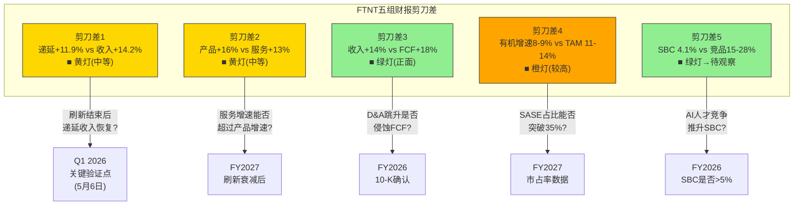
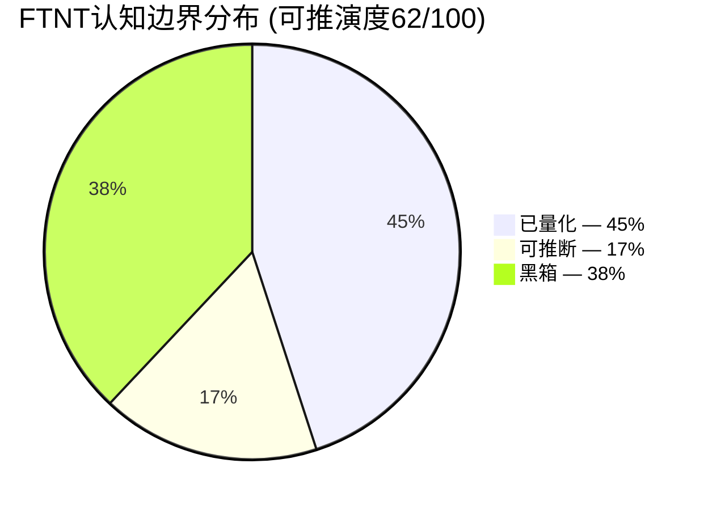

# FTNT P4.5 补充模块: 财报剪刀差 + 认知边界正文整合

---

## Ch_SC: 财报剪刀差分析 — 五组分化信号的投资含义

财报中最有价值的信号往往不是单个指标的绝对水平，而是**两个本应同向运动的指标朝相反方向走**。这种"剪刀差"要么暗示结构性转变正在发生，要么暗示某个叙事与数据不符。FTNT当前存在五组值得追踪的剪刀差，它们共同指向一个问题：**刷新周期掩盖了多少底层分化？**

### 剪刀差1: 递延收入增速 vs 收入增速 — 合同质量信号

**数据**: FY2025递延收入+11.9% vs 收入+14.2%，差值-2.3pp[DM-BAL-004]。这不是单季波动——过去4个季度差值稳定在-2.3pp到-3.8pp之间[DM-RT-P4-022]：

```
| 季度    | 递延收入增速 | 收入增速 | 差值(pp) | DR/Rev比率 |
|---------|------------|---------|---------|-----------|
| Q1 2025 | +10.8%     | +13.8%  | -3.0    | 4.17x     |
| Q2 2025 | +11.4%     | +13.7%  | -2.3    | 4.03x     |
| Q3 2025 | +10.6%     | +14.4%  | -3.8    | 3.86x     |
| Q4 2025 | +11.9%     | +14.8%  | -2.9    | 3.74x     |
```

**趋势方向**: DR/Rev比率从Q1 2024的4.28x持续下降至Q4 2025的3.74x，一年内下降12.6%[DM-RT-P4-023]。公司消耗既有递延收入(确认为收入)的速度，快于签订新合同积累递延收入的速度。

**投资含义**: 三种可能的解释决定了这组剪刀差的性质。(1)**良性(产品组合效应, P4红队赋70%概率)**: 刷新周期中硬件占比上升，硬件收入即时确认不经递延，因此billings增速(+16-18%)高于收入(+14.8%)高于递延(+11.9%)——结构上合理。同时行业从3年合同向1年合同迁移(管理层已确认合同期平均缩短1个月)，每单位billing贡献的递延收入结构性减少。(2)**中性(周期性, 20%概率)**: 刷新结束后硬件占比回落，递延收入增速应自然恢复。(3)**恶性(需求放缓前兆, 10%概率)**: 客户续约意愿下降或合同价值缩水，递延收入是真实需求的领先指标。

因为billings增速(+16-18%)仍高于收入增速——说明新签约仍在加速——解释(3)目前概率最低。但如果Q1 2026递延收入增速进一步放缓至<10%且billings增速同步回落至<12%，解释(3)的概率将上升至30%以上。

**跟踪指标**: DR/Rev比率(季度)、billings增速vs收入增速差值、合同期限变化(管理层电话会议披露)。
**翻转条件**: DR/Rev止跌回升至>4.0x，或递延收入增速超过收入增速——将确认"产品组合恢复+合同期限企稳"。

---

### 剪刀差2: 产品收入增速 vs 服务收入增速 — 转型进度信号

**数据**: FY2025产品收入+16% vs 服务收入+13%[DM-FIN-001]。Q4更极端：产品收入+20% YoY[DM-BIZ-013]。这与FTNT"从硬件向服务转型"的长期叙事方向相反——如果转型顺利，服务增速应持续高于产品增速。

**趋势方向**: 产品>服务的格局是刷新周期驱动的暂时性反转。FY2021-FY2023期间服务增速稳定高于产品增速(服务~18-20% vs 产品~15-17%)，但FY2024-FY2025刷新周期开始后硬件销售爆发，产品增速反超。服务收入占比从FY2021的约60%仅缓慢提升至FY2025的67%[DM-FIN-001]，4年+7pp，年均仅+1.75pp。

**投资含义**: 这组剪刀差揭示了一个时间窗口问题。刷新周期人为推高了产品增速，掩盖了服务收入加速(或未加速)的真实趋势。当FY2027刷新第二波结束后，产品增速将急剧回落(KeyBanc数据显示有机产品增速flat-to-down[DM-RT-P4-005])，届时**服务增速是否能独立撑起整体增长**是关键。

按P2估算，如果服务收入保持+13%增速(占比67%)而产品增速在后刷新期回落至+3-5%，整体增速将降至约9.5-10.5%——这恰好是P4红队修正后的"最佳估计"8.5-9.0%和共识12%之间的中间地带[DM-RT-P4-009]。真正的upside来源是FortiSASE能否将服务增速从+13%拉升至+18-20%——这取决于SASE渗透率从当前16%的扩展速度。

**跟踪指标**: 服务收入增速(季度)、服务收入占比变化(季度)、FortiSASE ARR增速(如管理层披露)。
**翻转条件**: 服务增速超过产品增速——确认刷新效应消退+SASE接力成功。这是FTNT估值re-rate(从"硬件公司"到"平台公司")的前置条件。

---

### 剪刀差3: 收入增速 vs FCF增速 — 现金流质量信号

**数据**: FY2025收入+14.2%[DM-FIN-001]，而FCF $2,226M对应FCF Margin 32.7%[DM-FIN-007][DM-FIN-008]。对比FY2024: 收入$5.96B(+12.4%)、FCF约$1.88B(FCF Margin约31.5%)[DM-FIN-009]。因此FCF增长率约+18.4%(从$1.88B到$2.23B)——**FCF增速高于收入增速4.2pp**。

**趋势方向**: 收入增长→更高比例的利润增长→更高比例的FCF增长，这是经营杠杆(operating leverage)在起作用。OPM从FY2024的30.3%微升至30.6%[DM-FIN-004]，加上CapEx强度(CapEx/Rev)从~5.0%仅升至5.4%、并未与收入等比例增长[DM-FIN-009]，共同推动FCF增速跑赢收入增速。

**投资含义**: 这组剪刀差对投资者是**正面信号**——它说明FTNT的经济引擎在"收入每增长1%，FCF增长>1%"。但需要两个警告：(1)D&A从FY2024的$122.8M跳升至FY2025的$336.3M(+174%)[DM-FIN-016]。如果D&A反映的是真实的资本消耗(而非会计调整)，维持性CapEx可能从当前$365M上升至$450-500M，未来FCF Margin将从32.7%回落至29-30%。(2)Owner FCF = FCF $2,226M - SBC $280M = $1,946M[DM-VAL-007]。FTNT的SBC仅吞噬12.6%的FCF，远好于CRWD(84%)和PANW(31%)[DM-VAL-P2-003]——这意味着FCF质量极高，GAAP FCF与"真实股东回报"之间的差距小。

**跟踪指标**: FCF Margin趋势(季度)、CapEx/Rev变化、D&A/Rev变化(D&A跳升是否持续)。
**翻转条件**: 如果FCF增速低于收入增速持续2个季度以上——说明经营杠杆耗尽或CapEx强度上升，将直接冲击估值(P/FCF 27.6x的合理性依赖于FCF持续增长)[DM-VAL-P2-004]。

---

### 剪刀差4: FTNT有机增速 vs 网安行业增速 — 市占率信号

**数据**: FTNT有机增速(剔除刷新贡献)约8-9%[DM-BIZ来源，P1 Ch7估算] vs 网安行业TAM增速11-14% CAGR。KeyBanc数据更极端：H1 2025有机产品增速flat-to-down[DM-RT-P4-005]。即使取整体有机增速8-9%(含服务)，仍低于行业TAM增速2-5pp。

**趋势方向**: FTNT在**稳态下可能正在失去微量市场份额**。PANW以+15%增速在更大基数($9.2B vs $6.8B)上增长[DM-COMP-P3-098]，CRWD以+22%增速抢夺端点+云安全市场[DM-COMP-P3-031]，ZS以+26%增速抢占SASE市场。FTNT在on-prem防火墙的55%出货量份额(绝对龙头地位)掩盖了新兴市场(SASE/云安全/身份安全)份额偏低的事实——FortiSASE仅排#5(~5-7%)远低于ZS的21%[DM-COMP-P3-024][DM-RT-P4-011]。

**投资含义**: 这组剪刀差揭示了FTNT估值叙事中最容易被忽视的风险。刷新周期推动的14.2%整体增速让FTNT看起来"跟上了行业"，但剥离刷新后的有机增速暴露了**新市场份额获取能力不足**。如果网安行业以12% CAGR增长而FTNT有机增速仅8-9%，5年后FTNT占行业的比例将从当前水平下降约15-20%。关键反面论点：SASE billings +24%(Q4 +40%)[DM-BIZ-013]如果持续加速，有机增速可能从8-9%提升至10-12%(SASE billings占比从27%→35%)——但这目前是希望而非已验证趋势。

**跟踪指标**: FTNT有机增速(需剔除刷新贡献，管理层不直接披露)、SASE billings占比变化(季度)、Gartner/IDC市占率报告(年度)。
**翻转条件**: 有机增速追上行业TAM增速(>11%)——这要求SASE占比突破35%或new logo增长率显著加速。

---

### 剪刀差5: SBC纪律 vs 竞品SBC趋势 — 人才竞争力信号

**数据**: FTNT SBC/Rev 4.1%($280M)[DM-FIN-006] vs PANW ~15%($1,383M) vs CRWD ~28%($1,347M) vs ZS ~25%[DM-COMP-P3-089]。FTNT的SBC/Rev从FY2021的6.2%持续降至4.1%，5年-2.1pp——这在科技行业极为稀缺(大多数公司SBC/Rev稳定或上升)。

**趋势方向**: FTNT SBC趋势持续下行，而竞品SBC趋势稳定或上升(CRWD 5年从22%→23%)[DM-FIN-006相关]。这意味着差距在扩大：5年前FTNT SBC约为竞品的1/3，现在约为1/4到1/7。

**投资含义**: 这组剪刀差是一把**双刃剑**。

正面：FTNT的Owner Economics在网安行业独一无二。Owner PE 31.5x与GAAP PE 33.1x差距仅5%，而PANW需要×1.3-1.5调整(Owner PE约53x)，CRWD的Owner PE为负数(SBC>净利润)[DM-VAL-P2-003][DM-RT-P4-025]。对于关注"真实股东回报"的投资者，FTNT是网安行业中GAAP利润最"干净"的公司。低SBC的根源是结构性的：(1)创始人Ken Xie的效率文化，(2)ASIC硬件工程师薪酬结构低于AI/ML工程师(成熟领域vs供不应求)，(3)运营杠杆(员工数增长慢于收入增长)[DM-COMP-P3-091]。

负面：AI正在重塑网络安全。如果AI安全(FortiAI-Protect[DM-BIZ-008])成为核心竞争领域，FTNT可能被迫提高SBC来吸引顶级AI工程师——与Google/Meta/CRWD竞争同一批人才。4.1%的SBC水平在"传统网安"时代是优势，在"AI安全"时代可能变成**人才吸引力短板**。P4红队已标注：如果FY2026 SBC/Rev突破5%，这是AI人才竞争压力的早期信号[DM-FIN-006相关]。

**跟踪指标**: SBC/Rev(季度)、员工总数增速vs收入增速、AI相关职位招聘数量(LinkedIn数据)、R&D/Rev变化(当前12%，行业21-29%)[DM-FIN-005]。
**翻转条件**: SBC/Rev连续2个季度>5%——确认AI人才竞争压力导致成本结构转变，需要重新评估Owner Economics优势的持久性。

---

### 五组剪刀差汇总与严重度评估



**综合判断**: 五组剪刀差中，1组明确正面(FCF跑赢收入)、1组条件正面(SBC优势需监测AI冲击)、2组黄灯(递延收入+产品vs服务，均与刷新周期相关)、1组橙灯(有机增速落后行业)。剪刀差4是最具战略意义的信号——因为它直接关系到FTNT在后刷新时代的行业地位。如果有机增速无法收窄与TAM增速的差距，即使利润率再高也难以避免PE压缩(参考Check Point 10年经验：增速锁死5.3%后PE从20x→15x[DM-RT-P4-003])。

最关键的验证窗口是**Q1 2026财报(2026年5月6日)**——这将是第一个能同时验证递延收入是否企稳(剪刀差1)、服务增速是否提速(剪刀差2)、有机增速是否改善(剪刀差4)的数据点。

---

## Ch_CB: 认知边界地图 — 我们知道什么、不知道什么、以及最容易错在哪

### 可推演度概览: 62/100意味着什么

62/100的可推演度，翻译成投资语言就是：**我们能看清FTNT约六成的价值创造机制，但决定bull case和bear case之间$30+估值差异的关键变量，恰好落在我们看不清的那四成里**。

这不是因为FTNT业务难懂——恰恰相反，FTNT的业务模型(硬件入口→订阅服务→平台upsell)清晰且可验证。真正的认知挑战是**时间维度的不确定性**：我们知道刷新周期会结束(100%确定)，知道SASE需要接力(方向明确)，知道ASIC在on-prem有5-10年窗口——但"5年还是10年"的差异对应$20+的估值差异。62分的公司不是"看不懂"的公司，是"关键变量尚未可观测"的公司。

对比参考：纯SaaS公司(如CRWD)可推演度通常70-80%(收入模型透明、NRR公开披露)；金融基础设施(如CME)可推演度80+%(垄断结构清晰)。FTNT的62分低于纯软件同行，原因是混合体模型(硬件+SaaS)引入了额外的不确定层(产品组合效应、ASIC可移植性)。

---

### 已量化区域(45%): 最可靠的分析基础

这部分是我们对FTNT判断最有信心的基础——有硬数据、有DM锚点、经过Python估值验证：

**财务引擎已完全可见**。收入结构清晰：产品33%/服务67%，增速分别+16%/+13%[DM-FIN-001]。利润率优势经同行交叉验证：GAAP OPM 30.6% vs PANW 13.5%，R&D效率8.3x(每$1研发产出$8.3收入) vs PANW 4.6x[DM-COMP-P3-003]。FCF质量已量化：FCF Margin 32.7%，Owner FCF $1.95B(SBC仅吞噬12.6%)[DM-VAL-P2-003]。这些数字构成了"FTNT是网安唯一利润机器"这一判断的硬证据。

**估值锚已建立**。Reverse DCF隐含12% CAGR[DM-VAL-P2-001]，6方法加权公允价值$76(P4红队修正后)[DM-RT-P4-030]，概率加权使用Bull 20% / Base 50% / Bear 30%(修正后)。三PE并列清晰：GAAP 33.1x / Owner 31.5x / Core 35.9x[DM-VAL-P2-004]。

**竞争格局基本面已映射**。四强(FTNT/PANW/CRWD/ZS)财务全景已对标[DM-COMP-P2-001]，MSFT威胁已量化(5年加权影响-3~5%)[DM-COMP-P3-005]，护城河评分3.68/5(红队校准后)[DM-RT-P4-026]。ASIC成本/性能优势有硬指标：17x吞吐量/32x加解密 vs 通用CPU[DM-COMP-P3-011]。

**SBC纪律+内部人行为已记录**。SBC/Rev 4.1%为5年持续下降趋势(FY2021 6.2%→FY2025 4.1%)[DM-FIN-006]。Ken Xie交易记录：20笔/0买入/2026年2月卖出$14.3M[DM-RT-P4-020]——弱空信号1.5/5。

---

### 可推断区域(17%): 有方向但程度不确定

这部分我们知道变量的运动方向，但不确定幅度——投资判断可以参考但需留余量：

**后刷新增速: 方向(减速)明确，程度不确定**。P4红队最佳估计8.5-9.0%，但置信区间宽(5-12%)[DM-RT-P4-009]。下限5%对应Check Point化(防火墙公司10年CAGR 5.3%)，上限12%对应SASE成功接力。每1pp增速差异对应$5-8估值差异[DM-RT-P4-002]——这个区间的宽度本身就是风险。

**FortiSASE规模: 增长方向明确，绝对值黑箱**。反推估算$380-475M(从Unified SASE $1.28B减去SD-WAN低增长部分)[DM-RT-P4-008]。管理层刻意不披露独立ARR——如果数字足够impressive，披露是理性选择；不披露本身是信号[B]。

**ASIC可移植性: 有间接证据但缺独立验证**。P4红队从40-60%下调至30-45%[DM-RT-P4-013]。SASE份额仅5-7%是"市场投票"——如果ASIC在云端真有决定性优势，份额应该更高。反面论点成立：go-to-market滞后+起步晚10年可以解释部分差距。

**递延收入信号: 70%概率良性但需Q1 2026确认**[DM-RT-P4-024]。DR/Rev从4.28x→3.74x的下降可由产品组合效应解释，但如果Q1 2026递延收入增速<10%且billings<12%，恶性解释概率上升。

**NRR: 间接推算115-125%，无官方数据**[DM-VAL-P2-007]。这是[B]弱结论——FTNT的混合模式使NRR计算和解读都比纯SaaS复杂。

---

### 黑箱区域(38%): 我们不知道什么、以及为什么这很重要

**黑箱1: FortiSASE真实规模 — bull vs bear之间$30+的估值差**。管理层仅披露Unified SASE ARR $1.28B(+11%)和FortiSASE增速>90%[DM-BIZ-010]，但不披露FortiSASE独立ARR[DM-RT-P4-028]。反推估算区间$300-500M——$200M的差异对应bull case(SASE成功接力→$89)和bear case(SASE规模不足→$53)之间的最大分歧源。对比PANW详尽披露NGS ARR、CRWD季度更新ARR——Fortinet的选择性不透明本身是一个信号。如果绝对值足够亮眼，管理层有强烈动机披露。

**黑箱2: 后刷新有机增速 — 2027年前无法直接观测**。KeyBanc报H1 2025有机产品增速flat-to-down[DM-RT-P4-005]，但这是单一来源且仅涵盖产品收入(不含服务)。真正的后刷新稳态增速要到2027年刷新第二波结束后才能直接观测。而$82.53的定价已经隐含了12% CAGR——这个未验证的假设如果错误，对应$68-72的公允价值(15-18%下行)[DM-RT-P4-010]。

**黑箱3: 2030年后竞争格局**。AI正在重塑安全架构的速度/方向不可预测。ASIC在on-prem场景有5-10年窗口——但5年(2030)和10年(2035)的差异对terminal value影响>$15。AI可能让通用GPU的安全处理效率追上ASIC，也可能让ASIC的定制化优势更突出(AI推理加速)。我们对此没有有意义的概率赋值能力。

**其他黑箱**: Ken Xie继任风险(创始人CEO无明确继任计划)、CVE架构修复时间线(补丁→再绕过模式暗示架构问题[DM-RT-P4-015])、MSFT Defender渗透速率(当前~6-8%份额，3年后10%还是20%差异巨大)、第二波刷新兑现率(350K台低端设备，管理层说"有限可见度"——刷新率50%还是80%对FY2027差$200M+)。

---

### 核心洞察整合: 三个最容易出错的地方

**洞察1: "4/5论点链式依赖ASIC" — 看似多元实为单一赌注**[认知边界评估v3.0核心发现]。P1-P3建立了5个支撑FTNT投资价值的论点：(1)成本优势→定价权，(2)中端壁垒→市占率稳定，(3)利润率→FCF质量，(4)平台化→估值re-rate，(5)FCF/Owner Economics。其中(1)-(4)全部依赖同一个假设：**ASIC芯片的价值保持或增长**。ASIC→成本优势→中端壁垒→增速→估值构成一条因果链。如果ASIC在云端价值衰减速度快于预期(P4红队已将可移植性下调至30-45%[DM-RT-P4-013])，整条链同时断裂。唯一独立于ASIC的论点是(5)FCF/Owner Economics质量——这是在任何情景下都成立的"安全垫"，但单独不足以支撑当前估值。

**洞察2: 时间维度黑箱 — "5年还是10年"对应$20+估值差**。FTNT的认知挑战核心不是"什么会发生"(方向大多明确)而是"什么时候发生"(幅度取决于时间)。刷新结束是确定的(100%)，SASE需要接力是明确的，ASIC在on-prem有窗口——但窗口长度的取值直接决定DCF中显式预测期的增长假设和terminal value的折现。在时间维度高度不确定的情况下，过度精确的DCF估值可能给人虚假的确定性。

**洞察3: 管理层选择性披露 — 不披露本身是信号**。Fortinet在关键数据点上的选择性不透明(FortiSASE独立ARR、NRR、有机产品增速分拆)与PANW/CRWD形成反差。这不一定说明数据"不好"——也可能是管理层判断现在披露的战略成本(竞对情报)高于收益(投资者信心)。但作为分析师，我们必须承认：**在管理层选择不提供直接数据的变量上，我们的判断必然带有更高的误差率**。对这些变量的任何精确数字(如"FortiSASE ARR $425M")都应标注[B]弱结论而非[A]硬结论。

---

### 对投资判断的含义: 38%黑箱→仓位建议

38%的黑箱比例对投资决策有三层含义：

**第一层: 估值离散度必然偏大**。6方法加权公允价值$76[DM-RT-P4-030]，但bull情景$89、bear情景$53——bull/bear跨度$36(占当前价格43%)。这个离散度不是方法论的问题，而是底层变量(FortiSASE规模、后刷新增速、ASIC窗口长度)本身的不确定性在估值中的忠实映射。任何将公允价值精确到个位数的估值都低估了38%黑箱的影响。

**第二层: 仓位应反映认知边界**。62/100的可推演度意味着：不宜满仓(因为38%黑箱中任何一个变量恶化都可能导致>15%回撤)，也不宜空仓(因为62%已量化区域显示FCF质量优秀、Owner Economics行业最佳、估值接近合理)。合理的仓位区间大致对应可推演度——即中等仓位(组合的5-8%)，预留加仓空间等待Q1 2026(5月6日)数据确认。

**第三层: 信息揭示的时间窗口已知**。38%黑箱中最大的两块(后刷新有机增速+FortiSASE规模)将在确定的时间点逐步揭示：Q1 2026财报(2026年5月6日)提供有机增速的最新信号，FY2027(2027年底)是刷新第二波结束后的第一个"干净"年份。投资者面临的不是"永远不知道"，而是"要不要在知道之前就下注"。当前$82.53已高于修正后公允价值$76约8.6%——如果愿意等待而非提前下注，Q1 2026数据将大幅压缩黑箱比例(可推演度可能从62升至70+)。



**底线**: FTNT不是"看不懂"的公司——它的业务模型、竞争格局、财务质量都已深度映射。真正的认知边界在于**时间维度**(关键变量何时可观测)和**管理层信息选择**(关键数据何时披露)。对于能够容忍38%黑箱并愿意在Q1 2026后再做最终判断的投资者，FTNT的风险回报特征(FCF质量优秀+估值接近合理+下行有经营杠杆保护)值得中等仓位配置。对于需要更高确定性才能行动的投资者，等待是更优策略。
