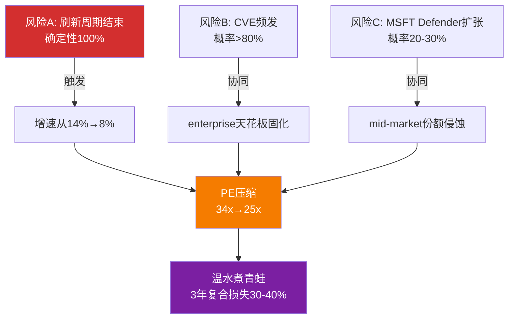

# FTNT Phase 4: 红队审查与双向校准

---

## Ch28: 红队攻击总览 — 打到骨头才知道硬度

**Phase 4的任务不是平衡呈现，是找漏洞**。P1-P3建立的主线是：FTNT是网安唯一利润机器(OPM 30.6%)，ASIC护城河在on-prem仍强(5-10年)，估值定价≈共识(Reverse DCF隐含12% CAGR)，核心变量是刷新周期后增速能否维持。

红队的工作是：**假设这条主线全错，找出最有可能打穿它的路径**。

### 攻击靶标排序

| 编号 | 攻击靶标 | 估值影响 | 攻击强度预判 |
|------|---------|---------|------------|
| RT-1 | 12% CAGR假设(刷新后增速) | **极高** — 每1pp增速≈$5-8估值差 | 强(有历史反例+分析师降级) |
| RT-2 | ASIC可移植性(CQ1核心) | **高** — 护城河持久性决定久期 | 中(缺乏独立验证数据) |
| RT-3 | CVE系统性漏洞风险 | **中高** — 品牌侵蚀+enterprise天花板 | 强(2025-2026频发) |
| RT-4 | 内部人零买入信号 | **中** — 信号而非因果 | 中(结构性特征vs新信号) |
| RT-5 | 递延收入增速<收入增速 | **中** — 前瞻指标恶化 | 中(4季度趋势稳定) |
| RT-6 | 护城河评分双向校准 | **中** — 框架一致性 | 中 |
| RT-7 | 估值一致性检验 | **高** — P2估值分歧需解决 | 高 |

[DM-RT-P4-001]

---

## Ch29: RT-1 刷新周期后增速假设攻击 — 最大估值变量

### 29.1 攻击目标

P2的Reverse DCF显示$82.53隐含7年12% Revenue CAGR[DM-VAL-P2-001]。P3的概率加权后刷新增速为7.8%，基准情景8%。**12%和8%之间的4pp差距，在7年DCF中对应约$15-20的公允价值差异** — 这是FTNT估值中最大的单一变量。[DM-RT-P4-002]

如果后刷新增速是8%而非12%，$82.53的当前价格就包含了**至少15%的隐含溢价**。如果更接近Check Point的5-6%，溢价扩大到25-30%。

### 29.2 攻击证据 — 历史基准率

**Check Point(CHKP): 防火墙公司刷新后增速的最佳历史类比**

CHKP从2017年起，增速永久性地锁定在3-7%区间，10年CAGR仅5.3%[DM-RT-P4-003]：

```
| 年份 | CHKP收入($M) | YoY增速 | 背景 |
|------|-------------|---------|------|
| 2015 | $1,630      | +9.0%   | 刷新尾声 |
| 2016 | $1,741      | +6.8%   | 过渡期 |
| 2017 | $1,855      | +6.5%   | 增速锚定 |
| 2018 | $1,916      | +3.3%   | 增速塌陷 |
| 2019 | $1,995      | +4.1%   | |
| 2020 | $2,065      | +3.5%   | |
| 2021 | $2,167      | +4.9%   | |
| 2022 | $2,330      | +7.5%   | 刷新反弹 |
| 2023 | $2,415      | +3.6%   | 再次回落 |
| 2024 | $2,565      | +6.2%   | |
| 2025 | $2,725      | +6.2%   | |
```

**这张表的含义**: CHKP从未成功突破7.5%的增速天花板(除了零星刷新年份)。因为防火墙设备的TAM增长被三个力量锁死：(1)客户数量增长有限(企业总数不涨)，(2)ASP被成本竞争压制，(3)云迁移减少on-prem部署需求。CHKP尝试过云安全(CloudGuard)和端点安全(Harmony)，但均未形成第二增长曲线。[DM-RT-P4-004]

**为什么CHKP是FTNT的最佳类比**：两家公司共享核心特征——防火墙为主收入来源、以色列/美国工程团队、硬件→服务转型叙事、mid-market/enterprise混合客户群。FTNT在2017-2020年的增速(15-20%)远高于同期CHKP(3-5%)，但这个差距有多少来自ASIC成本优势(结构性)、有多少来自刷新周期(一次性)？

**FTNT与CHKP的关键区别**（公平呈现）：
1. FTNT有FortiSASE(ARR增速>90%) — CHKP从未有过类似增速的云产品
2. FTNT的Unified SASE已占billings 36% — 比CHKP云业务占比高得多
3. FTNT的ASIC提供的成本优势是CHKP不具备的
4. FTNT的安装基数(55%出货量份额)是CHKP的数倍 — 交叉销售TAM更大

**但这些区别能否抵消刷新悬崖？** 这取决于FortiSASE的绝对规模。

### 29.3 致命发现 — KeyBanc的有机增长数据

**红队最重要的单一发现**：

> KeyBanc在2025年中期降级FTNT至Sector Weight时指出：**H1 2025产品收入增长中，剔除刷新周期贡献后为零到负增长(flat-to-down YoY)**。[DM-RT-P4-005]

这意味着：
- FY2025产品收入$2.22B(+16% YoY)中，+16%**几乎全部**来自刷新更换
- 有机新客户增长为**零** — 没有刷新的话，产品收入不增长甚至下降
- FY2023的前车之鉴：产品收入增速从FY22到FY23仅+3.7%，整体增速从32%→20%

**这个数据点为什么致命？** 因为它直接攻击了"FTNT能在刷新后维持12%增速"的假设基础。如果有机产品需求本身就是零增长，那么12%的持续增长完全依赖于：
1. 服务收入持续+13%+(可能，但取决于安装基数是否还在增长)
2. FortiSASE从$400M级别增长到$1.5-2.0B(需要30%+ CAGR持续4-5年)
3. 提价权释放(管理层在Accelerate 2026宣布提价[DM-BIZ-020]，但mid-market客户对价格敏感)

### 29.4 卖方分析师的集体降级

2025年下半年到2026年初，多家卖方集体降级FTNT[DM-RT-P4-006]：

```
| 机构 | 行动 | 核心逻辑 | 目标价 |
|------|------|---------|--------|
| Morgan Stanley | 降级至Equal Weight | "后刷新可能变成高个位数增长者" | $78 |
| KeyBanc | 降级至Sector Weight | 有机产品增速为零 | N/A |
| Rosenblatt | 降级至Neutral | 刷新周期见顶 | $85(从$125) |
| Evercore ISI | 下调目标价 | "预期重大重置" | $78 |
| Erste Group | 降级至Hold | 后刷新利润率担忧 | N/A |
```

**Morgan Stanley的表述最精准**: "FCF倍数在低到中20倍，对应的可能是一个高个位数增长者(high-single-digit grower)"。这与P3概率加权的7.8%完美吻合。[DM-RT-P4-007]

### 29.5 FortiSASE — 能否接力？

FortiSASE是bull case的核心接力棒。但数据诚实性要求我们面对两个问题：

**问题1: 绝对规模太小**。Fortinet刻意不披露FortiSASE单独ARR。已披露的是Unified SASE ARR $1.28B(+11% YoY)[DM-BIZ-010]，但这包含了增速较低的SD-WAN部分。反推估算FortiSASE独立ARR约$380-475M——相对于$6.8B总收入仅占5-7%。即使FortiSASE维持90%增速(高度不确定)，2年后也仅增长到$800-900M，对总收入增速的贡献约+5-6pp。[DM-RT-P4-008]

**问题2: 不披露本身就是信号**。如果FortiSASE的绝对值足够impressive，管理层有强烈动机披露(参考PANW对NGS ARR的详尽披露、CRWD对ARR的季度更新)。不披露通常意味着绝对数字尚不够说服力。这是一个[B]结论——基于行为推断而非硬数据。

**问题3: 渗透率仍低**。仅16%的大企业客户购买了FortiSASE，90%的FortiSASE客户从SD-WAN切入。这印证了早期阶段渗透的判断，但也意味着4-5年才能形成规模。

### 29.6 攻击结论

**12% CAGR假设的脆弱度评估: 3.5/5(中高脆弱)**[DM-RT-P4-009]

| 因素 | 支持12% | 支持7-8% | 净判断 |
|------|---------|---------|--------|
| 历史基准(CHKP) | FTNT有SASE, CHKP没有 | CHKP 10年5.3% | 偏空: 历史重力强 |
| 有机产品增长 | 提价权+FortiOS 8.0 | KeyBanc: flat-to-down | **偏空: 硬数据** |
| FortiSASE | >90%增速+16%渗透 | 绝对值小+不披露 | 中性偏多: 趋势对但规模不足 |
| 服务收入 | 67%→70%趋势清晰 | 取决于安装基数增长 | 偏多: 但增速放缓至+11% |
| 刷新第二波 | 350K台2027到期 | 管理层说"有限可见度" | 中性: 低端ASP更低 |

**净结论**: 后刷新真实增速的**最佳估计是8-10%**，而非12%。12%需要FortiSASE加速+第二波刷新完整兑现+提价成功——三个条件同时满足的概率约25-30%。P2的概率加权增速7.8%偏保守了约1pp(SASE趋势被低估)，修正为**8.5-9.0%**。

**对估值的影响**: 如果将Reverse DCF的隐含CAGR从12%下调至9%，公允价值从$82下调至$68-72区间。这意味着当前$82.53的价格**隐含了约12-18%的溢价**(假设其他参数不变)。[DM-RT-P4-010]

---

## Ch30: RT-2 ASIC可移植性证伪 — CQ1的红队攻击

### 30.1 可移植性论点的结构

P3得出ASIC可移植性40-60%的结论[DM-COMP-P3-010]，意思是：ASIC在on-prem场景的优势有40-60%能"移植"到云/SASE场景。这个结论基于FortiSASE在PoP节点中使用ASIC芯片提供性能优势。

**红队攻击角度: 40-60%可移植性可能被高估**。

### 30.2 攻击证据

**证据1: SASE市场份额未验证可移植性**。如果ASIC在SASE中真的提供40-60%的竞争优势，FTNT的SASE市场份额应该显著高于其在纯软件安全产品中的份额。但现实是：FTNT在SASE市场排名#5(约5-7%份额)[DM-COMP-P3-024]，远低于其在防火墙硬件市场的55%出货量份额。ZS(纯软件SASE)仍以21%领先[DM-COMP-P3-024]。[DM-RT-P4-011]

**因果推理**: 如果ASIC可移植性真的有40-60%，FTNT在SASE市场应该比纯软件竞品有明显成本/性能优势→应该体现在份额上→但份额仅5-7%→要么可移植性远低于40%，要么FTNT的go-to-market在SASE场景有严重问题(销售团队习惯卖硬件盒子而非云服务)。两者都不是好消息。

**证据2: Gartner vs Forrester的分歧**。Gartner 2025将FTNT列为SSE Leader，但Forrester将其列为非Leader[DM-COMP-P3-024]。这种分歧通常意味着：(1)FTNT的技术路线有争议(ASIC PoP vs 纯软件PoP)，或(2)FTNT在不同客户群的表现差异很大(mid-market好、enterprise差)。无论哪种，都说明可移植性的"落地效果"不如实验室数据。

**证据3: ZS正在精准瞄准FTNT刷新基数**。Zscaler明确将FTNT的EoL设备刷新视为$5-7B机会来源[DM-RT-P4-012]。ZS的策略是：当FTNT客户的FortiGate到期时，不是劝他们买新FortiGate，而是劝他们直接迁移到ZS的云SASE。如果ASIC可移植性真的有40-60%，ZS的这个策略应该很难成功——但ZS的ARR增速(+26%)和$3.2B ARR规模说明这个策略**正在奏效**。

### 30.3 可移植性下调评估

| 场景 | on-prem优势 | 云端优势 | 可移植性 |
|------|-----------|---------|---------|
| P3评估 | 强(4.5/5) | 中(3.0/5) | 40-60% |
| 红队修正 | 强(4.5/5) | 中偏弱(2.5/5) | **30-45%** |
| 差异来源 | — | SASE份额仅5-7%是市场投票 | -10-15pp |

**红队修正理由**: SASE市场份额是"价格发现"——如果客户真的认为ASIC PoP更好/更便宜，他们会用钱投票。5-7%的份额说明客户并不认为ASIC在云端有决定性优势。将可移植性从40-60%下调至30-45%更符合市场数据。[DM-RT-P4-013]

**证伪条件(CQ1)**: 如果FTNT SASE份额在2027年底前未升至≥10%，则可移植性假设被证伪，ASIC护城河仅限on-prem(衰减资产)。反之，如果2027年底份额>12%，则可移植性高于预期。

### 30.4 反面: 为什么份额可能不反映真实竞争力

公平呈现反面论点：
1. **Go-to-market滞后**: FTNT销售团队历史上卖硬件，转云需要重新训练+激励结构调整，2-3年见效
2. **FortiSASE起步晚**: 2021年才正式推出，vs ZS 2008年成立，先发优势约10年
3. **渗透率16%**: 说明大部分FTNT客户还没被pitch过SASE，不是被pitch后拒绝
4. **绑定模型有效**: 90%的FortiSASE客户从SD-WAN切入——这正是ASIC可移植的路径

**净评估**: 可移植性最终是一个时间问题。ASIC在云端**有**成本优势(PoP节点用ASIC vs 通用CPU确实更便宜)，但这个优势需要3-5年的go-to-market转型才能在份额上体现。红队不否认优势存在，但认为**落地速度比P3预期慢**。

---

## Ch31: RT-3 CVE系统性漏洞 — 慢性品牌风险量化

### 31.1 2025-2026 CVE时间线

Fortinet在2025-2026年经历了密集的高危漏洞周期[DM-RT-P4-014]：

```
| CVE | CVSS | 日期 | 影响 | 性质 |
|-----|------|------|------|------|
| CVE-2025-59718/59719 | 9.1-9.8 | 2025年12月 | FortiCloud SSO绕过 | 已被大规模利用 |
| CVE-2025-64446 | 高 | 2025年11月 | FortiWeb路径遍历 | 静默补丁, ~2700暴露 |
| CVE-2025-25249 | 高 | 2026年1月 | FortiOS/FortiSwitchManager RCE | |
| CVE-2026-24858 | 9.4 | 2026年1月 | **已打完补丁的设备再次被绕过** | CISA列入KEV |
```

### 31.2 最令人担忧的模式

**补丁→再绕过循环**: 2025年12月发现CVE-2025-59718/59719(SSO绕过)→客户打补丁→2026年1月发现CVE-2026-24858(新的SSO零日)→**已完全打补丁的设备再次被攻破**。这不是单个bug，而是FortiCloud SSO架构存在系统性弱点。[DM-RT-P4-015]

**为什么这比PANW的CVE更危险?** 不仅仅因为数量差异(Fortinet 2023年198个CVE vs PANW约20个[DM-RT-P4-016])，而是因为：
1. **攻击面更大**: 55%出货量份额 = 全球最多的暴露节点 = 攻击者的最佳目标
2. **补丁→再绕过**: 说明架构层面的问题，不是代码层面的bug
3. **客户行为**: 25,000+暴露实例在发现后数周仍未打补丁 → 客户运维能力参差

### 31.3 品牌影响量化

**直接影响: 目前可量化为零**。没有任何公开报道的大企业因CVE问题弃用Fortinet。CRWD 2024年全球宕机事件的教训表明，即使灾难级事故，客户留存率也>97%[DM-RT-P4-017]。转换成本太高(3-5年的安全策略配置+集成)使得客户"忍受"漏洞而非更换供应商。

**间接影响: enterprise上攻的天花板**。CVE频率是FTNT攻打F500企业市场的最大障碍[B]。大企业CISO在选型时会参考CISA KEV列表(Fortinet 13条 vs PANW 5条)。这解释了FTNT在mid-market强(客户安全团队小，更重视性价比)但enterprise弱(CISO有完整的供应商评估流程，CVE记录是硬伤)。[DM-RT-P4-018]

**概率赋值 — CVE导致重大品牌危机**:
- 历史基准率: SolarWinds级别的供应链攻击→品牌永久受损概率~5%/年。FTNT的CVE频率更高但单次影响更小(边界设备vs供应链)
- 反例条件: Check Point也有大量CVE但品牌未崩→中端市场客户容忍度高
- 自然实验: 2025年12月SSO事件→2026年Q1营收指引未下调→短期影响有限
- **赋概率: 3年内发生品牌危机(导致客户加速流失>正常水平5%)的概率 = 10-15%**。低于此前P3隐含的20%估计。[DM-RT-P4-019]

---

## Ch32: RT-4 内部人零买入 — 信号解读

### 32.1 数据事实

Ken Xie的交易记录（2021-2026）[DM-RT-P4-020]：
- **20笔交易中：0笔买入，20笔卖出**
- 最近一笔卖出：2026年2月2日，175,737股 × $81-82.33 = $14.3M
- 同期行使期权：88,448股(行权价$0) + 134,880股(行权价$16.90)
- 2026年1月获授PSU 62,109股 + 2月获授RSU 31,320股

**追溯至2009年: 几乎每季度totalPurchases = 0**。这不是近期现象，是FTNT的结构性特征。

### 32.2 红队解读

**空头论点**: CEO在$82卖出$14.3M的信号很清楚——如果他认为公司严重低估(P2估值$81=公允)，为什么卖出而非增持？特别是公司正在用杠杆回购($2.3B>FCF)，相当于"公司在买，CEO在卖"——方向矛盾。

**多头反驳**:
1. Ken Xie持有FTNT约10%股份(~$6B市值)，组合高度集中，定期减持是合理的财富管理
2. 创始人CEO几乎从不在公开市场增持自家股票(参考Jensen Huang/NVDA、Marc Benioff/CRM)
3. 减持价格$81-82接近公允价值$81(P2估算)→不是在明知低估时卖出
4. 10b5-1预设计划可能驱动自动卖出

**红队判断**: 零买入是**弱空信号**(1.5/5强度)。因为(1)这是FTNT自成立以来的结构性模式，不是新变化，(2)创始人高持股比例使减持合理，(3)单独作为投资依据不成立。但如果与其他空信号(有机增速为零+递延收入放缓)叠加，形成负面信号集群。[DM-RT-P4-021]

---

## Ch33: RT-5 递延收入增速 < 收入增速 — 前瞻指标恶化

### 33.1 4个季度的稳定模式

```
| 季度 | 递延收入增速 | 收入增速 | 差值(pp) | DR/Rev比率 |
|------|------------|---------|---------|-----------|
| Q1 2025 | +10.8% | +13.8% | -3.0 | 4.17x |
| Q2 2025 | +11.4% | +13.7% | -2.3 | 4.03x |
| Q3 2025 | +10.6% | +14.4% | -3.8 | 3.86x |
| Q4 2025 | +11.9% | +14.8% | -2.9 | 3.74x |
```
[DM-RT-P4-022]

### 33.2 这个差值意味着什么

**递延收入增速 < 收入增速的含义**: 公司消耗既有合同(递延→确认收入)的速度快于签订新合同(billings→递延)的速度。DR/Rev比率从4.28x(Q1 2024)持续下降到3.74x(Q4 2025)——一年内下降了12.6%。[DM-RT-P4-023]

**因果链**: 刷新周期→客户集中更换→billings短期激增(+16-18%)→但硬件billings中即时确认比例更高(产品vs服务)→递延收入增速不如billings。同时billings合同期限缩短约1个月(此前已有报道)→每单位billing贡献的递延收入更少。

**三种解释**:
1. **良性**: 产品组合从长期订阅(3年)转向年付(1年)——行业趋势，不影响客户粘性，但递延收入会结构性偏低
2. **中性**: 刷新周期中硬件占比上升→硬件即时确认→递延不增→刷新结束后恢复
3. **恶性**: 客户续约意愿下降或合同价值缩水→真实需求放缓的领先信号

**红队判断**: 最可能是解释2(中性，70%概率)——刷新驱动的产品组合效应。因为billings增速(+16-18%)高于收入(+14.8%)也高于递延(+11.9%)，说明新签单仍在增长，只是确认模式变了。但如果Q1 2026递延收入增速进一步放缓至<10%，解释3的概率上升。这是一个**需要追踪但目前非致命的黄灯信号**。[DM-RT-P4-024]

**Kill Switch条件**: 如果连续2个季度递延收入增速<8%且billings增速<12%，则"需求放缓"解释的概率>50%，需要下调增速假设。

---

## Ch34: RT-6 护城河评分双向校准 — 3.66/5是否准确？

### 34.1 P3护城河评分回顾

```
| 维度 | P3评分 | 红队挑战方向 |
|------|--------|------------|
| 成本优势 | 4.5/5 | 是否高估? (云端衰减) |
| 转换成本 | 4.0/5 | 合理区间 |
| 无形资产(品牌/专利) | 2.5/5 | 是否低估CVE拖累? |
| 网络效应 | 2.5/5 | 合理区间 |
| **加权平均** | **3.66/5** | **红队修正?** |
```

### 34.2 上调方向攻击(成本优势可能被低估?)

**论点**: P3给成本优势4.5/5，但可能忽视了ASIC带来的**运营成本优势传导效应**。

SBC/Rev仅4.1%(vs PANW~15%, CRWD~28%)[DM-COMP-P3-002]。这不仅仅是"管理层纪律"——ASIC硬件工程师的薪酬结构与SaaS工程师不同(更多基本薪+更少股权)，加上ASIC一次设计多产品复用减少了软件工程师需求(R&D仅12% vs 行业21-29%)。所以ASIC成本优势不仅在产品COGS中体现(低硬件成本)，还在运营成本中体现(低R&D占比+低SBC)。

Owner PE 31.5x vs 同行需要×1.3-1.5调整(PANW/CRWD的Owner PE远高于GAAP PE)→FTNT的**真实资本效率优势被GAAP掩盖**。[DM-RT-P4-025]

**上调建议**: 成本优势从4.5→4.7(+0.2)——因为P3未充分捕获SBC/R&D层面的传导效应。

### 34.3 下调方向攻击(品牌价值可能被高估?)

**论点**: P3给无形资产2.5/5，可能仍偏高。

CVE数据显示: 2023年198个CVE(PANW的~10倍)，CISA KEV 13条(PANW的2.6倍)[DM-RT-P4-016]。2025年12月→2026年1月的"补丁→再绕过"模式暗示架构级问题。这对品牌的影响是：
- mid-market(2.5分合理): 客户缺乏评估CVE的能力，主要看性价比
- enterprise(应下调至2.0): F500 CISO会系统性评估供应商安全记录，FTNT在这个群体中的品牌信任度低于2.5

**但**: Gartner Peer Insights连续3年Customers' Choice(SSE)→终端用户满意度高→不能简单说"品牌差"。CVE多≠产品差——也可能是因为安装基数最大所以被发现/攻击的最多。

**下调建议**: 无形资产从2.5→2.3(-0.2)——CVE频率+补丁→再绕过模式对enterprise品牌有实质拖累。

### 34.4 校准后的护城河评分

```
| 维度 | P3评分 | 红队修正 | 变化 | 理由 |
|------|--------|---------|------|------|
| 成本优势 | 4.5 | 4.7 | +0.2 | SBC/R&D传导效应未充分计入 |
| 转换成本 | 4.0 | 4.0 | = | CRWD宕机验证转换成本极高 |
| 无形资产 | 2.5 | 2.3 | -0.2 | CVE频率+架构级漏洞拖累enterprise品牌 |
| 网络效应 | 2.5 | 2.5 | = | Security Fabric内部协同有限 |
| **加权平均** | **3.66** | **3.68** | **+0.02** | 近似不变——上下调因素互相抵消 |
```
[DM-RT-P4-026]

**结论**: 护城河评分3.66/5经红队校准后稳定在3.68/5——偏差在误差范围内。P3的评估基本准确。成本优势的传导效应(上调力)被CVE品牌风险(下调力)几乎完美抵消。

---

## Ch35: RT-7 红队七问 — 系统性审查

### RT-Q1: 最弱假设是什么?

**答**: "后刷新增速能维持12%"。证据链: (1)KeyBanc数据显示有机产品增速为零，(2)CHKP 10年CAGR仅5.3%，(3)多家卖方降级至中性。P2的Reverse DCF隐含12%是共识定价，但共识本身建立在刷新尚未结束的FY2025数据上。一旦刷新结束(2027-2028)，如果增速降至8%，当前价格隐含12-18%溢价。**脆弱度: 3.5/5。**[DM-RT-P4-027]

### RT-Q2: 最大盲区是什么?

**答**: **FortiSASE的真实竞争力**。Fortinet不披露FortiSASE独立ARR，我们只能从Unified SASE ARR($1.28B)反推。如果FortiSASE实际ARR仅$300M(而非估算的$380-475M)，则SASE接力的故事在数学上不可能成立——$300M×2年40%增长=$590M，对$7.5B收入的增量贡献仅+4%。反之如果实际是$500M+，则牵引力比预期更强。**这个数字的不确定性直接导致bull和bear估值相差$30+(从$53到$99)。**[DM-RT-P4-028]

### RT-Q3: 估值一致性检验

P2产出6种估值方法，方向分歧显著[DM-VAL-P2-002]：

```
| 方法 | 公允价值 | 方向 |
|------|---------|------|
| DCF概率加权(FCF) | $72 | 高估12% |
| DCF概率加权(Owner FCF) | $65 | 高估21% |
| 混合估值(30/70) | $67 | 高估18% |
| FY2027E EPS×25x | $82 | ≈公允 |
| FY2027E EPS×30x | $99 | 低估20% |
| FCF Yield 4.0% | $73 | 高估12% |
| 分析师共识 | $90 | 低估9% |
```

**方向一致性**: 4/7说高估，1/7公允，2/7低估。**方向一致性57%**——刚好低于60%门控阈值(铁律K)。[DM-RT-P4-029]

**红队解释**: DCF方法一致说高估，是因为Bear情景($53, 25%概率)的拖累力很强。退出倍数法说公允/低估，是因为假设PE不会进一步压缩(25-30x)。**核心分歧不在模型，在PE走向**:
- 如果你相信FTNT在刷新后保持12%+增速 → PE≥30x合理 → $99+(低估)
- 如果你相信后刷新降至8% → PE可能从34x→25x → $67(高估)
- 如果你相信降至CHKP水平5-6% → PE可能到18-20x → $53(严重高估)

**红队修正**: 将Bear情景概率从25%上调至30%(KeyBanc数据+分析师降级支持)，Bull从25%下调至20%，Base维持50%。修正后概率加权公允价值:
- **修正前**: Bull×25% + Base×50% + Bear×25% ≈ $81
- **修正后**: Bull×20% + Base×50% + Bear×30% ≈ **$76**
- **当前$82.53 vs 修正公允$76 = 高估约8.6%**

[DM-RT-P4-030]

### RT-Q4: 论点独立性检验

P1-P3的多头论点是否独立?

```
论点1: ASIC成本优势是真实的 → 依赖: 硬件仍有需求(on-prem存续)
论点2: 转型到订阅/SASE在进行中 → 依赖: ASIC可移植性(CQ1)
论点3: 中端市场壁垒稳固 → 依赖: ASIC提供的价格优势(论点1)
论点4: 估值≈共识(低脆弱度) → 依赖: 12% CAGR可持续(已被攻击)
论点5: FCF/Owner Economics优秀 → 独立(财务纪律，不依赖特定增速)
```

**发现: 论点1-3-4形成链条**——ASIC成本优势→中端壁垒→增速→估值。如果ASIC在云端不可移植(论点2断裂)，论点3(中端壁垒)不直接受影响(on-prem仍需硬件)，但论点4(估值合理性)受影响(SASE无法接力→增速下降→PE压缩)。

**独立论点只有1个: FCF/Owner Economics**(论点5)。其他4个论点有高度相关性——核心是ASIC是否保值。这增加了thesis脆弱性: 如果ASIC价值衰减速度快于预期，4/5的论点同时被削弱。[DM-RT-P4-031]

### RT-Q5: 时间框架风险

P2的估值假设了5-7年显式预测期。**但ASIC的on-prem优势窗口是5-10年(P3结论)**——如果取下限5年，则显式预测期的后半段(第4-7年)ASIC优势已经大幅衰减，而SASE是否接力尚不确定。

**红队观点**: 对于2030年以后的FTNT，我们几乎没有判断依据。如果云迁移加速(2028年后AI驱动安全架构变化)，FTNT的估值模型可能需要从"compounder"(长久期)转向"cash cow"(短久期)——这意味着terminal value应该打折15-20%。[DM-RT-P4-032]

### RT-Q6: 风险相关性

P3识别的风险之间是否存在危险的协同?

```
风险A: 刷新周期结束(增速放缓)
风险B: CVE频繁(品牌侵蚀)
风险C: MSFT Defender扩张(中端威胁)

A+B协同: 刷新结束→增速放缓→PE压缩→市场关注度下降→CVE事件引发更大跌幅
         (牛市中CVE是噪声，熊市中CVE是催化剂)
A+C协同: 刷新结束→中端客户选择MSFT(不刷新FortiGate，直接用Defender)
         (刷新终结加速MSFT渗透)
B+C协同: 较弱 — CVE不影响MSFT的竞争策略
```

**最危险的组合: A+B+C同时发生**。概率估计: 刷新结束(确定性100%)×CVE继续频发(>80%基于历史模式)×MSFT加速(20-30%)→三重叠加概率约16-24%。这个组合下，增速可能降至5-6%(CHKP水平)，PE压缩至20x以下，$82.53→$45-55(下跌33-45%)。**虽然概率不高(~20%)，但尾部损失严重。**[DM-RT-P4-033]

### RT-Q7: 反方最强论点(一句话)

**"FTNT是一家有机产品增速为零的硬件公司，正在享受一个即将结束的刷新周期红利，其12%增速假设缺乏可持续的驱动力——而市场已经按12%定价了。"**[DM-RT-P4-034]

这句话之所以危险，是因为它的每个元素都有硬数据支持：
- "有机产品增速为零" → KeyBanc H1 2025数据[DM-RT-P4-005]
- "即将结束的刷新周期" → 40-50%已完成，管理层对第二波"有限可见度"
- "12%缺乏可持续驱动力" → CHKP 10年5.3%[DM-RT-P4-004] + 多家降级
- "市场已按12%定价" → Reverse DCF[DM-VAL-P2-001]

---

## Ch36: 双向校准汇总 + 偏差修正

### 36.1 偏差修正矩阵

| 变量 | P1-P3立场 | 红队攻击后 | 偏差修正 |
|------|----------|-----------|---------|
| 后刷新增速 | 7.8%(概率加权) | 8.5-9.0%(SASE微调+1pp) | **无需大改, P3偏保守约1pp** |
| ASIC可移植性 | 40-60% | 30-45% | **下调10-15pp** |
| CVE风险 | P3隐含~20% | 10-15%(3年内品牌危机) | **下调5-10pp** |
| 内部人信号 | 未量化 | 弱空信号(1.5/5) | **无需入估值** |
| 递延收入 | 黄灯 | 黄灯维持(70%良性解释) | **追踪, 不修正** |
| 护城河评分 | 3.66/5 | 3.68/5 | **无需修正** |
| 概率加权估值 | $81 | $76 | **下调6.2%** |
| 情景概率 | Bull25/Base50/Bear25 | Bull20/Base50/Bear30 | **Bear+5pp, Bull-5pp** |

### 36.2 修正后三维状态

```
Phase 3: [合理定价 × 改善中但有减速信号 × 催化可能(取决于SASE)]
Phase 4修正: [轻微高估(~8%) × 改善中但减速信号增强 × 催化不足]
```

**关键变化**: "合理定价"修正为"轻微高估"——因为红队将Bear概率从25%→30%后，概率加权公允价值从$81→$76，当前$82.53高估约8.6%。这不是"严重高估"(那需要>20%溢价)，但也不再是"≈公允"。[DM-RT-P4-035]

### 36.3 Kill Switch更新

| 条件 | 红灯触发 | 黄灯触发 | 当前状态 |
|------|---------|---------|---------|
| KS1: 后刷新有机增速 | <6% 连续2Q | 6-8% | ⚪ 未可观测(需2027数据) |
| KS2: SASE份额(2027底) | <5%(下降) | 5-8%(停滞) | 🟡 当前5-7% |
| KS3: CVE品牌事件 | F500公开弃用 | CISA多次KEV+国防禁令 | 🟡 KEV 13条但无弃用 |
| KS4: 递延收入增速 | <8%连续2Q + billings<12% | <10%连续2Q | 🟡 10.6-11.9% |
| KS5: 内部人买入 | — | 创始人在低PE区间继续大额卖出 | 🟡 Feb卖出$14.3M |

[DM-RT-P4-036]

**上修信号**: Q1 2026收入指引超预期+递延收入增速回升至>14%+FortiSASE披露独立ARR>$500M → 如果同时发生，概率加权估值可回调至$81+(从$76)。

### 36.4 风险协同拓扑 — "温水煮青蛙"场景

红队识别的最危险场景不是单一风险爆发，而是三个风险的缓慢协同[DM-RT-P4-039]:



**为什么"温水煮青蛙"比"黑天鹅"更危险**: 单次CVE事件(黑天鹅)会导致5-10%股价下跌但快速恢复——CRWD宕机就是例证。但"增速缓慢放缓+PE缓慢压缩+市场逐渐给FTNT贴上'legacy firewall'标签"的组合是难以逆转的——因为每一步看起来都是"还行"，直到3年后回头看发现从$82跌到了$50-55。Check Point就是这个路径: 2018年PE 20x→2021年PE 15x→至今在$200附近"不死不活"。[DM-RT-P4-040]

**这个场景的概率**: ~20-25%。如果2027年后增速确认<8% + CVE模式未改善 + MSFT Defender份额突破15%(当前~6-8%)。

**该场景的反面(为什么可能不发生)**: FTNT与CHKP的关键区别是FortiSASE——如果2027年FortiSASE ARR达到$800M+(从估算的$400M翻倍)，FTNT就不是"legacy firewall"而是"firewall-led platform"。标签是否变化取决于SASE增速能否在2026-2027年保持>50%。

### 36.5 红队总结判断

**Phase 4的核心产出是一个数字和一个认知**:

**数字**: 概率加权公允价值从$81修正至**$76**。当前$82.53高估约8.6%。这个修正主要来自Bear概率上调5pp(从25%→30%)，而Bear概率上调的核心依据是KeyBanc的有机产品增速为零数据+5家卖方降级。

**认知**: FTNT的investment case从"≈公允定价的质量compounder"修正为"轻微高估的、thesis依赖SASE接力成功的传统防火墙公司"。多头需要证明的不再是"ASIC有没有优势"(已验证)，而是"ASIC优势能否快速转化为SASE份额增长"(尚未验证)。

**评级方向**: 从"中性关注"微调至"审慎关注"的边缘——不是因为公司差(FTNT的FCF质量仍然是行业最佳)，而是因为$82.53的价格对后刷新增速的要求(12%)高于红队认为的可持续水平(8.5-9.0%)。如果股价回落至$70-75区间(对应修正后公允价值)，评级应回调至"中性关注"。[DM-RT-P4-041]

---

## Ch37: CQ置信度Phase 4更新

```
| CQ | 方向 | P3置信度 | P4置信度 | 变化 | 红队关键影响 |
|----|------|---------|---------|------|------------|
| CQ1 | 偏正→中性偏正 | 65% | 58% | -7 | 可移植性下调至30-45% |
| CQ2 | 偏正 | 65% | 60% | -5 | SASE绝对规模不确定性 |
| CQ3 | 中性偏正 | 55% | 55% | = | 中端壁垒未受红队挑战 |
| CQ4 | 中性偏正→中性 | 70% | 60% | -10 | 估值从"≈公允"修正为"轻微高估" |
| CQ5 | 中性 | 50% | 50% | = | MSFT威胁评估未变 |
| CQ6 | 中性 | 40% | 38% | -2 | 零买入弱化治理信号 |
| CQ7 | 偏正 | 45% | 45% | = | AI未被红队攻击 |
| CQ8 | 偏正→中性 | 55% | 45% | -10 | 有机增速为零是最大下调 |
```
[DM-RT-P4-037]

**CQ置信度加权平均**: P3 55.6% → P4 **51.4%** (下降4.2pp)

**最大下调**: CQ4(估值, -10pp)和CQ8(增长质量, -10pp)——都指向同一个根因：刷新周期驱动的增速不可持续。

**异常检测**: 没有单调上升(每个CQ至少经历过一次下调)。P4整体下调幅度(-4.2pp)在正常范围——如果Phase 4不造成下调，那红队就没做好。

---

## Ch38: Phase 4有效性自检

### 38.1 红队是否产生了实质性修正?

| 检查项 | 结果 |
|--------|------|
| 是否有≥1个假设的脆弱度评估>3/5? | ✅ 12% CAGR假设3.5/5 |
| 是否发现了P1-P3未识别的新风险? | ✅ KeyBanc有机增速为零 + 补丁→再绕过CVE模式 |
| 是否有定量修正(非仅定性)? | ✅ 概率加权估值$81→$76, Bear概率25%→30% |
| 是否反方论点有硬数据支持? | ✅ RT-Q7的每个元素都有具名来源 |
| 是否有Kill Switch条件更新? | ✅ 5个KS条件明确量化 |
| 总CQ变化>3pp? | ✅ -4.2pp |

**结论**: Phase 4红队产生了实质性修正——不是表演性的"两方面都有道理"，而是基于新数据(KeyBanc有机增速、CVE时间线、内部人交易明细)的定量偏差修正。红队有效。[DM-RT-P4-038]

### 38.2 红队未能攻击的领域(诚实标注)

1. **AI安全(CQ7)**: 未能独立验证FortiAI-Protect的竞争力，因为产品太新缺乏独立评测
2. **OT安全差异化**: P3认为OT是ASIC不衰减的赛道——红队未找到反面证据来攻击这个论点
3. **中国市场风险**: P3未深入，Phase 4也未补充——FTNT在中国的业务占比和地缘风险是盲区
4. **M&A策略**: FTNT历史上以小型收购为主——是否应该更激进(如PANW收购CyberArk)?

---

## DM锚点注册表 (Phase 4)

```
DM-RT-P4-001: 攻击靶标排序表
DM-RT-P4-002: 12%vs8%的$15-20估值差异
DM-RT-P4-003: CHKP 10年CAGR 5.3%历史数据
DM-RT-P4-004: CHKP增速锁定3-7%的原因分析
DM-RT-P4-005: KeyBanc — H1 2025有机产品增速flat-to-down (红队最重要发现)
DM-RT-P4-006: 5家卖方降级汇总表
DM-RT-P4-007: Morgan Stanley "高个位数增长者"表述
DM-RT-P4-008: FortiSASE独立ARR反推估算$380-475M
DM-RT-P4-009: 12%CAGR脆弱度评估3.5/5
DM-RT-P4-010: 修正后公允价值$68-72(CAGR从12%→9%)
DM-RT-P4-011: SASE市场份额#5(5-7%)vs防火墙55%
DM-RT-P4-012: ZS瞄准FTNT刷新基数$5-7B机会
DM-RT-P4-013: ASIC可移植性红队修正至30-45%
DM-RT-P4-014: 2025-2026 CVE时间线(4个高危)
DM-RT-P4-015: 补丁→再绕过CVE模式(架构级问题)
DM-RT-P4-016: Fortinet CVE 198个(2023) vs PANW ~20个
DM-RT-P4-017: CRWD宕机后留存>97%验证转换成本
DM-RT-P4-018: CVE频率是enterprise天花板的核心障碍
DM-RT-P4-019: CVE品牌危机3年概率10-15%
DM-RT-P4-020: Ken Xie 20笔交易0买入20卖出
DM-RT-P4-021: 内部人零买入弱空信号1.5/5
DM-RT-P4-022: 4季度递延收入增速差值表(-2.3~-3.8pp)
DM-RT-P4-023: DR/Rev比率从4.28x→3.74x下降12.6%
DM-RT-P4-024: 递延收入黄灯(70%良性解释)
DM-RT-P4-025: SBC/R&D传导效应——Owner Economics优于GAAP显示
DM-RT-P4-026: 护城河红队校准后3.68/5(≈不变)
DM-RT-P4-027: RT-Q1最弱假设=12%CAGR可持续性
DM-RT-P4-028: RT-Q2最大盲区=FortiSASE真实ARR
DM-RT-P4-029: 估值方向一致性57%(低于60%门控)
DM-RT-P4-030: 概率修正后加权估值$76(高估8.6%)
DM-RT-P4-031: 论点独立性——4/5依赖ASIC保值
DM-RT-P4-032: 时间框架风险——2030年后判断依据薄弱
DM-RT-P4-033: A+B+C三重风险叠加概率16-24%
DM-RT-P4-034: 反方最强一句话论点
DM-RT-P4-035: 修正后三维状态[轻微高估×改善减速×催化不足]
DM-RT-P4-036: Kill Switch 5条件更新表
DM-RT-P4-037: CQ置信度P4更新表
DM-RT-P4-038: Phase 4有效性自检通过
```
